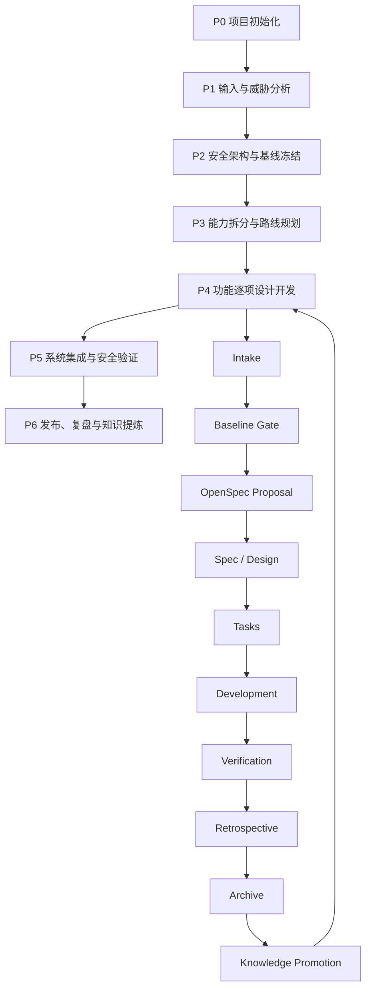

# 芯片安全方案设计开发与知识沉淀工作流

日期：2026-06-09
状态：OpenSpec 设计事实源，V1 已实现，G5 审批待人工确认
适用对象：安全方案负责人、芯片安全架构师、固件开发者、验证人员、评审人员、AI coding agent
通用层目录：`security_-scheme/chip-security-development-workflow`
首个项目实例：NGU800 / NGU800P

## 1. 目的

本工作流解决两个长期问题：

1. 当团队为下一款芯片从零开始设计和开发完整安全方案时，能够复用一套有阶段、有 Gate、有强制产物、有验证证据的流程。
2. 当其他同事加入或接手项目时，能够先理解项目状态和安全架构，再沿单个功能变更快速进入代码，而不必从零阅读全部历史资料。

最终目标不是简单积累文档，而是把真实项目中的设计方法、问题、验证证据和复盘逐步提炼为跨芯片可复用的 Skill、模板和检查脚本。

## 2. 核心原则

### 2.1 人与 AI 共同执行

- 文档 MUST 可由项目团队阅读和评审。
- 状态、ID、链接、Gate 和必填字段 MUST 尽量结构化，以便脚本和 AI 检查。
- AI MAY 自动收集证据、发现缺项、生成候选和执行确定性检查。
- AI MUST NOT 自动批准安全架构、密钥策略、生命周期、调试权限、制造策略或知识晋升。
- 关键结论和知识晋升 MUST 由明确的人类角色批准。

### 2.2 双层存放

项目事实和通用方法分开保存：

```text
项目层
├── security_-scheme/<chip-security-project>/
│   └── 芯片级输入、约束、威胁、基线、CR、完整安全方案、追溯
└── <code-repo>/<security-component>/docs/openspec/
    └── 功能级需求、设计、任务、问题、验证和实现历史

通用层
└── security_-scheme/chip-security-development-workflow/
    └── 跨芯片流程、模板、检查器、知识候选、验证模式和 Skill
```

NGU800 当前映射：

```text
芯片级项目层：
security_-scheme/ngu800_security_solution_flow_with_gpt/

功能级代码变更层：
gsp-pmp-rmp-omp/components/ngu_security/docs/openspec/

跨芯片通用层：
security_-scheme/chip-security-development-workflow/
```

### 2.3 单一事实源

| 内容 | 唯一事实源 |
|---|---|
| 芯片输入、威胁、约束、安全基线、架构决策、CR | Security Workflow |
| 某项功能的需求、设计、任务、问题、实现和验证 | OpenSpec change |
| brainstorming、计划、TDD、调试、验证和 review 方法 | Superpowers |
| 跨芯片流程、模板、检查脚本和已验证模式 | 通用 Skill |
| 使用手册、原理说明、调试指南和 onboarding 阅读材料 | 普通 docs |

其他位置 MUST 只保存链接或摘要，不复制正文。发生冲突时按 owner 判定，不按文件更新时间判定。

## 3. 总体模型：芯片级主流程与功能级循环



芯片级主流程用于建设完整安全方案。功能级循环用于 secure boot、manifest、密钥、measurement、attestation、SPDM、MCTP、生命周期、制造和恢复等具体能力。

## 4. 芯片级主流程

### 4.1 P0 项目初始化

目标：建立项目身份、责任边界和统一目录。

强制产物：

```text
00_project/
├── project_profile.md
├── roles_and_approvals.md
├── decision_log.md
├── open_questions.md
└── status_dashboard.md
```

`project_profile.md` MUST 至少包含：

- 芯片和产品范围
- CPU、管理核、安全核和安全硬件能力概述
- BootROM、固件阶段、Host、BMC/OOB 等参与者
- 代码仓库和安全组件位置
- 安全方案目录和 OpenSpec 目录
- 继承自旧芯片的内容及其状态
- 当前阶段和已知限制

`roles_and_approvals.md` MUST 定义：

- Security Owner
- Architecture Owner
- Feature Owner
- Verification Owner
- Reviewer
- Knowledge/Skill Maintainer

### 4.2 P1 输入与威胁分析

目标：明确事实来源、攻击面、约束和缺失信息。

强制产物：

```text
security_inputs/
└── inputs_manifest.md

security_workflow/
├── 00_threat_model.md
├── 01_constraints.md
└── 09_open_risks.md
```

输入清单 MUST 记录来源、版本、日期、owner、可信级别、适用范围和是否已解析。

威胁模型 MUST 覆盖：

- 启动和更新
- 固件完整性、机密性和回滚
- 密钥、证书和设备身份
- 生命周期、debug 和 RMA
- Host、BMC、mailbox、共享内存和外部接口
- 制造、provisioning 和供应链
- 故障、掉电、恢复和降级路径

约束 MUST 使用稳定 ID，并标记：

```text
[PROPOSED] [CONFIRMED] [ASSUMED] [TBD]
```

### 4.3 P2 安全架构与基线冻结

目标：形成可指导详细设计和开发的安全基线。

强制产物：

```text
security_workflow/
├── 02_baseline.md
├── 03_detailed_design/
├── 04_impl_design/
├── 05_code_rules.md
└── 06_traceability.md

change_requests/
└── CR-xxxx-*.md
```

基线 MUST 定义：

- Root of Trust
- First Mutable Stage
- First Cryptographic Verifier
- 启动信任链和失败策略
- 密钥与证书层次
- 固件格式、验签、解密和防回滚
- measurement 和 attestation
- lifecycle、secure debug 和 RMA
- Host、mailbox、BMC/OOB 和 eHSM 边界
- manufacturing 和 provisioning
- 待冻结硬件和接口项

影响安全主路径的结论 MUST 由确认的决策源或已批准 CR 支撑。OpenSpec change MUST NOT 自行创造或升级芯片级架构结论。

### 4.4 P3 能力拆分与路线规划

目标：将完整安全方案拆分为可独立设计、实现和验证的工作包。

典型能力：

```text
secure-boot
manifest-and-image-format
key-and-certificate
measurement
attestation-report
spdm-responder
mctp-mailbox
lifecycle-and-debug
manufacturing-and-provisioning
recovery-and-rma
```

强制产物：

```text
00_project/
├── capability_map.md
└── implementation_roadmap.md
```

每个实质性能力 SHOULD 对应一个或多个 OpenSpec change。路线图 MUST 标明依赖、owner、状态、风险和目标 Gate。

### 4.5 P4 功能逐项设计开发

每个功能 MUST 进入第 5 节定义的 OpenSpec 变更循环。不同架构决策、不同可独立验收能力或明显不同风险边界 SHOULD 拆成不同 change。

### 4.6 P5 系统集成与安全验证

目标：证明单项能力组合后仍满足芯片级安全目标。

强制产物：

```text
system_verification/
├── integration_test_plan.md
├── security_test_report.md
├── threat_coverage.md
├── release_risk_register.md
└── release_checklist.md
```

验证 MUST 覆盖：

- 启动链端到端
- 密钥和证书生命周期
- Host 到设备的完整交互
- 异常输入、资源耗尽、掉电和恢复
- rollback、RMA、debug 和生命周期转换
- 威胁模型覆盖
- Source 到 Test 的追溯完整性
- 未验证项和量产阻断项

### 4.7 P6 发布、复盘与知识提炼

发布后 MUST 区分：

- 芯片事实：寄存器、地址、核、eFuse 布局等，仅保留在项目层。
- 产品策略：可能被同系列芯片复用，但仍需要产品 owner 批准。
- 通用方法：可进入知识晋升流程。

P6 不要求所有经验进入 Skill。只有满足第 9 节晋升条件的内容才能进入通用层。

## 5. 功能级 OpenSpec 变更循环

### 5.1 适用范围

以下变更 MUST 走完整流程：

- 安全行为、信任边界或攻击面变化
- 标准协议和外部接口
- secure boot、密钥、证书、认证和 attestation
- lifecycle、debug、RMA、manufacturing 和 provisioning
- manifest、镜像格式、验签、解密和 rollback
- 跨模块接口和公共 ABI
- 会改变安全测试或量产门禁的实现

拼写、格式和不改变行为的小型文档修复 MAY 使用简化流程，但 MUST 在提交或任务记录中说明为什么不需要完整 change。

### 5.2 标准目录

```text
openspec/changes/<change-name>/
├── .openspec.yaml
├── proposal.md
├── specs/
│   └── <capability>/spec.md
├── design.md
├── tasks.md
├── evidence/
│   ├── verification.md
│   ├── code-map.md
│   ├── known-issues.md
│   └── problem-records/
│       └── PRB-xxxx-*.md
└── retrospective.md
```

OpenSpec 标准 artifact 继续使用 `proposal → specs → design → tasks`。`evidence/` 和 `retrospective.md` 是安全开发扩展产物，由通用检查器强制校验。

### 5.3 Intake

`proposal.md` MUST 记录：

- 背景和目标
- 用户或系统价值
- 范围和非目标
- 输入来源
- 影响的芯片安全能力
- 影响的代码和文档范围
- 安全风险和依赖

### 5.4 Baseline Gate

进入设计前 MUST 建立以下链接：

```text
Source IDs
Threat IDs
Constraint IDs
Decision/CR IDs
Open Question IDs
```

若 change 需要新的芯片级架构结论，MUST 暂停实现，先在 Security Workflow 中建立或批准 CR。

### 5.5 Spec 与 Design

`spec.md` MUST 使用可验证 Requirement 和 Scenario 描述行为。

`design.md` MUST 包含：

- 架构和模块边界
- 数据流和状态机
- 安全边界和信任假设
- 接口和 ABI
- 错误处理和恢复
- 内存、并发和资源约束
- 测试策略
- 替代方案和取舍
- 与 Security Workflow 的绑定

### 5.6 Tasks 与 Development

`tasks.md` MUST：

- 使用可勾选任务
- 按依赖顺序组织
- 包含测试先行或验证任务
- 指明影响文件或模块
- 包含文档、追溯和 evidence 更新
- 不得在所有开发完成后一次性补勾

开发过程中发现新设计问题时：

- 局部实现问题记录为 problem record。
- 改变已确认功能设计时更新 OpenSpec design/spec。
- 改变芯片安全基线时转入 Security Workflow CR。

### 5.7 Verification

`evidence/verification.md` MUST 记录：

- 验证日期和环境
- 工具链和依赖版本
- 执行命令
- 命令退出状态和关键输出
- 覆盖的 Requirement/Scenario
- 未执行或无法执行的验证
- 残余风险

MUST 保存结论所需的关键证据，不应无整理地复制全部终端日志。

`evidence/code-map.md` MUST 建立：

```text
Requirement → Design Section → Task → Code Symbol/File → Test → Evidence
```

### 5.8 Retrospective 与 Archive

`retrospective.md` MUST 包含：

- 实际完成范围
- 与原设计的偏差
- 主要问题和根因
- 被否决方案
- 做得有效和无效的工作方法
- 已知问题和技术债
- 可复用经验候选
- 是否需要更新芯片级基线、规则或普通文档

归档前 MUST：

1. 完成 OpenSpec validate。
2. 通过安全扩展 evidence 检查。
3. 确认 tasks 状态真实。
4. 确认 known issues 和 residual risks 已记录。
5. 由 Feature Owner 和 Reviewer 批准。

## 6. Superpowers 配合规则

Superpowers 负责过程方法，不是长期事实源：

| 阶段 | Superpowers |
|---|---|
| 需求模糊、方案探索 | brainstorming |
| 设计已确认、准备实施 | writing-plans |
| 功能和 bug 实现 | test-driven-development |
| 失败或异常 | systematic-debugging |
| 完成前 | verification-before-completion |
| 重要变更完成 | requesting-code-review |

规则：

- brainstorming 确认后的设计 MUST 迁入 OpenSpec `design.md`。
- writing-plans 产生的实施计划 MUST 转换为 OpenSpec `tasks.md`。
- debugging 中确认的非平凡问题 MUST 形成 problem record。
- verification 输出 MUST 汇总进 `evidence/verification.md`。
- Superpowers 临时文件在迁移完成后 SHOULD 删除或只保留链接，避免双份事实源。

## 7. 问题记录

### 7.1 何时建立 problem record

以下情况 MUST 建立独立问题记录：

- 排查超过一个正常开发周期
- 尝试过两个及以上方案
- 根因涉及协议、并发、内存、硬件边界或工具链
- 问题可能在其他模块或芯片重复出现
- 修复改变设计、测试策略或安全假设
- 问题曾导致错误结论、漏测或安全风险

### 7.2 问题记录字段

```yaml
id: PRB-xxxx
title: ...
status: open|resolved|accepted-risk
category: ...
chip: ...
change: ...
environment: ...
security_impact: none|local|baseline
knowledge_level: L0|L1|L2|L3|L4|L5
promotion_candidate: true|false
owner: ...
reviewer: ...
```

正文 MUST 包含：

- 现象和复现条件
- 影响范围
- 错误假设
- 排查过程
- 被否决方案及原因
- 根因
- 最终解决方法
- 验证证据
- 对安全基线或设计的影响
- 对其他芯片的适用条件和反例
- 预防措施

## 8. 端到端追溯

统一追溯链：

```text
Source
→ Threat
→ Constraint
→ Decision/CR
→ OpenSpec Requirement
→ Design
→ Task
→ Code
→ Test
→ Evidence
→ Problem/Retrospective
→ Knowledge Candidate
```

每类对象 MUST 使用稳定 ID。链接 SHOULD 使用相对路径和精确章节/ID。

自动检查器负责检查链接存在和状态一致性，但不判断安全结论本身是否正确。

## 9. 知识晋升

### 9.1 等级

```text
L0 原始记录
L1 当前变更经验
L2 当前芯片项目模式
L3 跨芯片候选模式
L4 已验证通用模式
L5 Skill 规则、模板或脚本
```

### 9.2 自动评估与人工批准

知识晋升采用：

```text
自动发现
→ 自动检查门槛
→ 生成晋升评审包
→ 人工批准
```

Skill 或脚本不会后台自动运行，只在以下节点触发：

- OpenSpec change 归档
- retrospective 完成
- 手动执行知识盘点
- 新芯片验证相同模式

### 9.3 晋升权限

| 晋升 | 自动化职责 | 批准人 |
|---|---|---|
| L0 → L1 | 检查记录和证据完整性 | Feature Owner |
| L1 → L2 | 发现当前芯片重复案例 | Chip Security Owner |
| L2 → L3 | 生成去芯片化候选和边界分析 | Method Reviewer |
| L3 → L4 | 检查第二芯片或官方标准证据 | Security Owner |
| L4 → L5 | 验证 Skill、模板或脚本可重复执行 | Skill Maintainer |

安全架构、密钥、生命周期、调试和制造规则 MUST NOT 自动批准晋升。

### 9.4 晋升条件

经验进入 L3 及以上 MUST：

- 去除寄存器地址、核名称和项目路径等芯片专有事实
- 写明适用前提和不适用场景
- 保留来源和证据链接
- 至少提供一个反例或失败边界
- 不与官方标准或已确认安全原则冲突

进入 L4 MUST 满足以下至少一项：

- 在第二款芯片项目验证
- 由标准、官方手册或多个独立实现证明其通用性

进入 L5 MUST：

- 输入、输出和触发条件明确
- 能通过真实任务前向验证
- 不把项目事实硬编码为通用规则
- 有失败处理和人工审批 Gate

### 9.5 通用知识目录

```text
knowledge/
├── candidates/
├── validated-patterns/
├── anti-patterns/
└── promotion-log.md
```

## 10. Gate

| Gate | 名称 | 必须满足 | 批准角色 |
|---|---|---|---|
| G0 | Project Ready | 项目画像、角色、输入清单和目录齐全 | Security Owner |
| G1 | Baseline Ready | 威胁、约束、开放问题、基线和决策权限明确 | Security Owner + Architecture Owner |
| G2 | Change Ready | proposal、spec、design 已确认并绑定基线 | Feature Owner + Architecture Reviewer |
| G3 | Implement Ready | tasks、测试策略、影响范围、风险和 owner 明确 | Feature Owner + Verification Owner |
| G4 | Verify Ready | 任务完成，测试结果和 code map 齐全 | Verification Owner + Reviewer |
| G5 | Archive Ready | retrospective、known issues、evidence 和审批完整 | Feature Owner + Reviewer |
| G6 | Promote Ready | 晋升元数据、复用证据满足目标等级 | 第 9.3 节对应批准人 |

检查结果统一为：

```text
PASS    条件满足
FAIL    必须修复，阻止进入下一阶段
WARN    可以继续，但必须记录风险
REVIEW  自动条件满足，等待人工批准
```

脚本只检查结构、字段、链接、状态和证据完整性。初版 MUST NOT 以自动评分替代安全评审。

## 11. 新同事 Onboarding

### 11.1 30 分钟：理解项目

阅读：

```text
project_profile.md
status_dashboard.md
architecture_overview.md
capability_map.md
```

目标：

- 知道系统安全参与者
- 知道已完成、进行中和待决内容
- 知道文档和代码入口

### 11.2 半天：理解依据

阅读：

```text
inputs_manifest.md
threat_model.md
constraints.md
baseline.md
decision_log.md
traceability.md
```

目标：

- 知道架构为什么这样设计
- 区分 confirmed、assumed 和 TBD
- 能追踪一个安全要求

### 11.3 一到两天：接手功能

选择一个已归档或进行中的 change，按以下顺序阅读：

```text
proposal
→ spec
→ design
→ tasks
→ evidence
→ retrospective
→ code/tests
```

新同事 MUST 运行该 change 记录的最小验证入口，才能视为完成首个功能 onboarding。

### 11.4 角色清单

通用层提供：

```text
onboarding/
├── 00_quick_start.md
├── 01_architecture_reading_path.md
├── 02_first_change_walkthrough.md
└── role-checklists/
```

## 12. 通用层目录设计

```text
chip-security-development-workflow/
├── workflow/
│   ├── lifecycle.md
│   ├── gates.md
│   ├── artifact-contracts.md
│   ├── roles-and-approvals.md
│   ├── openspec-integration.md
│   └── knowledge-promotion.md
├── templates/
│   ├── chip-project/
│   ├── openspec-change/
│   ├── evidence/
│   ├── problem-record/
│   ├── retrospective/
│   └── onboarding/
├── scripts/
│   ├── init_security_project.py
│   ├── check_project_gates.py
│   ├── check_openspec_evidence.py
│   ├── build_onboarding_pack.py
│   ├── collect_knowledge_candidates.py
│   ├── evaluate_promotion.py
│   └── validate_skill.py
├── knowledge/
│   ├── candidates/
│   ├── validated-patterns/
│   ├── anti-patterns/
│   └── promotion-log.md
├── onboarding/
│   └── role-checklists/
├── examples/
│   └── ngu800/
├── skills/
│   └── chip-security-development/
│       ├── SKILL.md
│       ├── agents/openai.yaml
│       ├── references/
│       ├── scripts/
│       └── assets/
└── docs/superpowers/
    ├── specs/
    └── plans/
```

Skill 的 `SKILL.md` MUST 保持精简，只保存触发条件、主流程、Gate 和按需读取指引。详细规范、模板和案例放在 references 或通用层目录中。

## 13. 典型 Skill 入口

最终 Skill SHOULD 支持：

- 为新芯片初始化安全方案项目
- 检查项目当前 Gate 和缺失产物
- 创建安全功能 OpenSpec change
- 从已确认 brainstorming 设计生成 OpenSpec artifacts
- 从 writing-plans 生成或更新 tasks
- 记录问题、验证和 retrospective
- 检查 change 是否可归档
- 发现并评估知识晋升候选
- 为新同事生成 onboarding 包
- 检查某条要求到代码和测试的追溯

## 14. 自动化脚本职责

### 14.1 init_security_project.py

- 创建芯片级目录和模板
- 记录项目路径和角色
- 不生成虚假的 confirmed 结论

### 14.2 check_project_gates.py

- 检查 G0-G6 所需文件、字段、状态和审批
- 输出 PASS/FAIL/WARN/REVIEW

### 14.3 check_openspec_evidence.py

- 检查 OpenSpec 标准 artifacts
- 检查 evidence、problem record 和 retrospective
- 检查任务勾选与验证证据一致性

### 14.4 build_onboarding_pack.py

- 基于项目索引和当前状态生成分级阅读路径
- 不复制安全设计正文，只生成链接和摘要

### 14.5 collect_knowledge_candidates.py

- 从归档 change 的 retrospective/problem records 中收集候选
- 生成结构化候选，不直接晋升

### 14.6 evaluate_promotion.py

- 检查目标等级门槛
- 列出已满足和未满足项
- 输出 REVIEW，而不是自动修改批准状态

## 15. NGU800 首个示范实例

当前 MCTP mailbox/shared SRAM + SPDM endpoint 作为首个完整示范：

1. 在组件内创建 `add-mctp-mailbox-spdm-endpoint` OpenSpec change。
2. 将已确认设计迁入 `design.md`。
3. 补充 proposal、spec 和 tasks。
4. 建立 evidence、problem record 和 retrospective 骨架。
5. 迁移完成后删除重复的 Superpowers 设计正文，仅保留 OpenSpec 事实源。
6. 开发过程中持续更新 tasks 和 evidence。
7. 完成后执行 Gate、OpenSpec validate、复盘和知识候选收集。

该实例用于验证工作流，不直接作为跨芯片通用结论。

## 16. 实施阶段

### Phase 1：规范与模板

- 建立通用目录
- 拆分本设计为 workflow 规范
- 建立项目、OpenSpec、evidence、problem 和 retrospective 模板
- 建立 NGU800 映射说明

### Phase 2：最小检查器

- Gate 结构检查
- OpenSpec evidence 检查
- ID 和链接检查
- 统一 PASS/FAIL/WARN/REVIEW 输出

### Phase 3：NGU800 试点

- 迁移 MCTP change
- 执行完整开发循环
- 修正规范和模板

### Phase 4：Onboarding 与知识候选

- 生成 onboarding 包
- 收集 retrospective/problem records
- 实现 L0-L3 候选评估

### Phase 5：跨芯片验证和 Skill

- 在第二款芯片项目验证
- 调整去芯片化模板
- 建立 L4 模式
- 生成并验证 `chip-security-development` Skill

## 17. 完成标准

本工作流首版完成需要：

1. 有明确的芯片级主流程和功能级 OpenSpec 循环。
2. Security Workflow、OpenSpec、Superpowers、普通 docs 和 Skill 没有事实源冲突。
3. 每个 Gate 有可检查的输入、输出和批准角色。
4. 问题、验证、复盘和知识候选有统一模板。
5. 自动化只负责检查和候选生成，不越权批准安全结论。
6. MCTP change 完整走通并留下 evidence。
7. 新同事能按分级路径理解项目并运行首个验证。
8. 通用 Skill 只在跨芯片验证后吸收 L4 内容。

## 18. 非目标

首版不实现：

- 自动判断安全方案正确性
- AI 自动批准架构或知识晋升
- 用单一评分替代安全评审
- 把 NGU800 特有设计直接包装为通用 Skill
- 保存全部聊天、命令输出和无整理日志
- 一次性迁移所有历史资料

历史资料按“当前仍有效、能建立来源、对开发或 onboarding 有价值”的原则逐步纳入，不为目录整齐而机械搬运。
