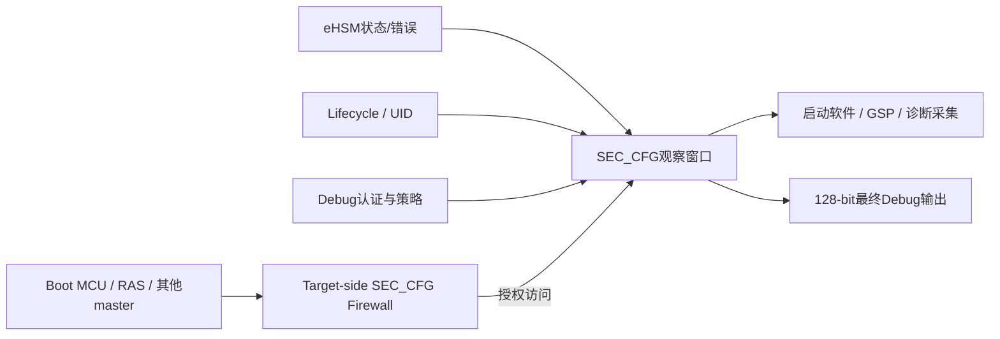

# Purpose

定义NGU800P D0 `SEC_CFG`在系统中的安全职责、软件信任边界和与Firewall/eHSM/Lifecycle/Debug的关系，为主详设、驱动和DV用例提供统一入口。寄存器数值详见[机读寄存器表](../../requirements/sec-cfg-register-map.yaml)，逐项截图转录见[SRC-0026](../../source-vault/internal-specs/sec-cfg/SRC-0026/ngu800p_sec_cfg_transcription.md)。

# Architecture role

`SEC_CFG`是SoC管理域中的“安全状态汇聚与受控观察窗口”：镜像eHSM状态、硬件/固件错误、生命周期和160-bit UID，并给出Debug配置与最终128-bit输出。它不承担eHSM完整内部CSR、eFuse编程或Firewall策略配置。

# Two-window boundary

- Firewall决定“谁能访问SEC_CFG”，其候选CSR为`F_SECCFG_ENABLE/AUTHORITY/error*`，属于独立窗口并受`OPEN-CONFLICT-014`约束。
- SEC_CFG决定“进入后可以观察/配置什么”，候选offset为`0x000..0x040`，其产品base受`OPEN-CONFLICT-015`约束。
- 软件不得把Firewall错误清除寄存器和SEC_CFG只读错误镜像混为一组。

# Address authority

当前有三种状态：SRC-0026截图称`0x1010_07B0_0000/4 KiB`；SRC-0022生成头称`0x1010_0820_0000/16 KiB`；baremetal的HSM_STATUS0绑定仍为`MAP_VALID=0`且地址为0。结论是：offset/bit可以进入参数化设计，绝对地址不能进入产品代码。关闭条件见[OPEN-CONFLICT-015冲突报告](../../sources/conflict-reports/CONFLICT-SRC-0026-SEC-CFG-ADDRESS-AND-SEMANTICS.md)。

# Trust and use model

1. 启动软件确认reset释放和当前master的Firewall authority。
2. 轮询目标阶段status：先检查error，再检查done，使用有界timeout。
3. error/timeout时同步采集status、hardware error、firmware error原始64-bit值和build标识。
4. 生命周期同时读取`lcs`与status lifecycle bits；编码不合法或不一致时fail-close。
5. UID仅在已确认有效时刻读取，按5个32-bit word返回并显式序列化。
6. 普通运行软件只读Debug配置/输出；写接口在scope、lock、LCS和认证合成闭环前禁用。

# Safety properties

- `reset=0`不等于运行期恒为0，外部镜像释放复位后可立即变化。
- `hw_boot_done`不等于全部阶段ready，“读到非零”也不是ready条件。
- SEC_CFG无error clear/W1C字段，不通过它清错或反复重试。
- Firmware error定义缺失时只记录raw 64-bit，不把单bit固化为诊断ABI。
- 128-bit Debug输出是最终观察结果，不是`dbg_en_cfg[1:0]`的简单扩展。
- high-low-high是软件防撕裂措施，不是RTL原子快照证明。

# Evidence state

17个寄存器、可见status/hardware-error位和拼接顺序为`DOCUMENTED`；软件轮询和防撕裂方法为`PROPOSED`；base/size、FW error、LCS编码、Debug策略、UID-valid和硬件一致性为`CONFLICTING/BLOCKED`。所有测试当前均为`NOT_EXECUTED`。

