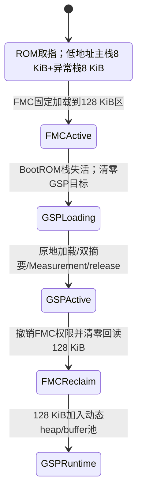

# 目的与权威关系

定义NGU800P D0的2 MiB安全SRAM精确分区、System Address、Owner、生命周期、受控原地加载、清零和容量门禁。主详设规范性入口为[《NGU800P安全软件详细设计》第5章“2 MiB安全RAM、System Address、Firewall与清零”](../05-software-design/NGU800P安全软件详细设计.md#第5章-2-mib安全ramsystem-addressfirewall与清零)。

2026-08-19的SRC-0031/ADR-0028替代旧P1容量样例：旧`448/64/256/256/256/256/512 KiB`、独立plaintext、MMP SRAM常驻和BootROM/FMC复用最高Runtime池均不得继续生成产品常量。

# 已冻结与开放边界

| 结论 | 状态 | 依据 |
|---|---|---|
| System Address基址`0x1010_0500_0000`、大小2 MiB | CONFIRMED | SRC-0022、ADR-0009 |
| 六段offset/size和生命周期 | CONFIRMED | SRC-0031、ADR-0028 |
| GSP/FMC/PMP/RMP受控原地加载；无独立plaintext Region | CONFIRMED | ADR-0028 |
| MMP不驻留本SRAM，主要使用受保护DDR | CONFIRMED设计方向 | SRC-0031；DDR参数待OPEN-DESIGN-010 |
| eHSM可访问整个2 MiB | CONFIRMED | ADR-0008 |
| PMA为`NON_CACHEABLE`或`HARDWARE_COHERENT` | 两候选已限缩，唯一值开放 | OPEN-CONFLICT-006 |
| Firewall CSR、窗口数/粒度/master/lock/reset | OPEN | OPEN-CONFLICT-006/014 |
| 各固件最终link map和watermark | OPEN实施Evidence | 构建门禁必须满足本文件固定上限 |

# 固定物理布局

以`B = MANAGEMENT_NOC_S9_SRAM_BASE = 0x1010_0500_0000`：

```text
B+0x000000  +----------------------------------+
            | GSP_STATIC              880 KiB |
            | BootROM低地址stack/work overlay |
B+0x0DC000  +----------------------------------+
            | FMC_REUSE               128 KiB |
B+0x0FC000  +----------------------------------+
            | MEASUREMENT              16 KiB |
B+0x100000  +----------------------------------+
            | PMP / 功耗核             256 KiB |
B+0x140000  +----------------------------------+
            | RMP / RAS核              256 KiB |
B+0x180000  +----------------------------------+
            | HOST_INGRESS            512 KiB |
B+0x200000  +----------------------------------+
```

| Region ID | offset / System Address | 大小 | 用途与生命周期 |
|---|---|---:|---|
| `SEC_RAM_GSP_STATIC` | `+0x000000`；`0x1010_0500_0000～0x1010_050D_BFFF` | 880 KiB | GSP静态加载、启动BSS/stack、SPDM/MCTP/证书处理和GSP eHSM arena；BootROM阶段低地址overlay |
| `SEC_RAM_FMC_REUSE` | `+0x0DC000`；`0x1010_050D_C000～0x1010_050F_BFFF` | 128 KiB | FMC image/data/BSS/stack/arena；GSP entry后受控回收为动态内存 |
| `SEC_RAM_MEASUREMENT` | `+0x0FC000`；`0x1010_050F_C000～0x1010_050F_FFFF` | 16 KiB | Measurement固定Region；本版未使用尾部也保持保留 |
| `SEC_RAM_PMP` | `+0x100000`；`0x1010_0510_0000～0x1010_0513_FFFF` | 256 KiB | 功耗核/PMP最终运行区 |
| `SEC_RAM_RMP` | `+0x140000`；`0x1010_0514_0000～0x1010_0517_FFFF` | 256 KiB | RAS核/RMP最终运行区 |
| `SEC_RAM_HOST_INGRESS` | `+0x180000`；`0x1010_0518_0000～0x1010_051F_FFFF` | 512 KiB | Host与Device完整密文包共享窗口；Host只在接收期可写 |

总和严格等于2048 KiB。没有独立`SEC_RAM_PLAINTEXT`、`SEC_RAM_MMP`、Mailbox、SPDM、证书或错误物理Region。

# 生命周期视图

## BootROM到GSP



不变量：

1. BootROM代码位于ROM；启动栈存储从`B+0`开始，SP指向各栈顶。BootROM data/BSS/context最终范围必须低于`B+0x0DC000`。
2. FMC只在`SEC_RAM_FMC_REUSE`运行。FMC活跃时，GSP text/rodata/data/BSS/启动栈不得进入该区。
3. GSP静态加载结果必须完全位于前880 KiB；GSP接管后才能清零和回收FMC 128 KiB。
4. 回收区只能供动态allocator使用；不得把链接期静态段放入该区。
5. Measurement最后16 KiB在任何阶段都不是GSP、FMC或证书allocator的free space。

## PMP/RMP与MMP

- PMP和RMP分别只使用固定256 KiB目标区，独立验证、Measurement、release和失败隔离。
- MMP保留独立包、counter、Measurement和release身份，但不占本SRAM。其DDR carveout、eHSM/CPU可达性、Firewall/IOMMU、PMA/cache和release primitive未冻结前保持blocked。

# Host ingress与受控原地加载

Host ingress状态：

```text
DENY -> HOST_WRITABLE -> SEALED -> EHSM_READING -> CONSUMED/ZEROIZING -> DENY
```

- Host只能在`HOST_WRITABLE`写最后512 KiB；submit后硬件撤销并readback。
- seal绑定generation、length和完整package SHA-256；seal不替代Vendor认证。
- input与output/context必须不重叠。

本版明文不进入独立staging Region。对尚未运行且为RW/NX的FMC/GSP/PMP/RMP目标：

```text
target+0       Vendor Header 1024 B
target+1024    Code Region[Code_Size]
```

加载顺序：

1. 检查`package_size <= target_region_size`并打开目标RW/NX窗口。
2. eHSM把完整包输出到`target`；Vendor完成前CPU不解析、不搬移。
3. Vendor PASS后复验稳定Header、offset1008 LE64 `load_addr`、offset1016 LE32 Header CRC、offset1020零reserved、typed-stage policy、counter和长度；CRC覆盖offset256～1015且只做格式筛查，`load_addr`必须精确等于当前固定目标。
4. 对`target+1024`开始的`Code_Size`字节计算源摘要。
5. 执行`memmove(target, target+1024, Code_Size)`；禁止`memcpy`。
6. 清零旧Header尾部和BSS；CBC补零属于Code Region，不另行剥离；从`target`回读同样`Code_Size`计算目标摘要并常量时间比较。
7. 完成barrier、`fence.i`、Measurement和权限回读后release。

timeout/acceptance unknown时，context和目标写入区一起quarantine；不得清零、执行或复用。MMP DDR路径只有在OPEN-DESIGN-010关闭后才能采用相同或另行批准的受保护加载合同。

# 容量门禁

| 对象 | 完整package | 最终/阶段footprint |
|---|---:|---:|
| FMC | `<=128 KiB` | `<=128 KiB` |
| GSP | `<=512 KiB` | pre-release静态`<=880 KiB`；回收后总可用`<=1008 KiB` |
| PMP | `<=256 KiB` | `<=256 KiB` |
| RMP | `<=256 KiB` | `<=256 KiB` |
| Measurement | 不适用 | `256 + count×128 <=16 KiB`，物理硬上限126项 |
| Host ingress | `<=512 KiB` | 不执行 |

包公式固定为：

```text
package_size = 1024 + Code_Size
```

`Code_Size`包含发布工具为CBC block对齐补入的0～15字节零；设备端不存在`payload_size`或去padding。PMP/RMP的Code Region理论上限相应为`256 KiB - 1024 B = 261120 B`，最终仍受各自linker footprint约束。

制包、linker和统一layout生成器必须同时检查package、静态段、BSS、stack、heap、arena和运行时高水位；任何越界都使构建失败。

# 权限矩阵

| Region | BootROM/FMC | GSP | eHSM | Host | 目标核 |
|---|---|---|---|---|---|
| GSP STATIC | BootROM overlay；FMC loader写 | GSP RX/RW-NX | full | deny | deny |
| FMC REUSE | FMC RX/RW-NX | 回收前deny，回收后动态RW/NX | full | deny | deny |
| Measurement | 当前producer受控写 | final前写/final后读 | full | deny | 不直接映射 |
| PMP | loader RW/NX | 编排后撤写 | full | deny | PMP RX/RW-NX |
| RMP | loader RW/NX | 编排后撤写 | full | deny | RMP RX/RW-NX |
| Host ingress | 受控读 | 受控读 | full | 接收期写 | deny |

eHSM full aperture是硬件信任边界，不取消adapter的Region、长度、direction、active descriptor和生命周期校验。

# Measurement固定Region

- 物理容量固定16 KiB，地址固定`0x1010_050F_C000～0x1010_050F_FFFF`。
- 逻辑ABI仍为`Header[128] + Firmware Entry[N][128] + SoC State[128]`。
- `max_fw_entries`由实际启动拓扑生成且不得超过126。
- BootROM每次启动先使Header失效、清零并回读整个16 KiB，再发布新Header。
- 本版未使用空间保持0/保留；不得给证书、SPDM、日志或通用scratch。

# 单一布局源

`components/security/config/security_ram_layout.yaml`使用schema v2，至少生成：

- BootROM/FMC/GSP/PMP/RMP linker fragment；
- MMP DDR Profile引用和blocked gate；
- Header Overlay/typed-stage loader固定目标及package上限；
- Firewall/PMP/MMU表；
- Measurement地址和容量；
- Host/baremetal/EMU Expected。

生成器必须断言六段总和等于2 MiB、地址无溢出、无非生命周期重叠、GSP静态段不进入FMC区、Measurement无普通allocator引用。禁止在多个仓库手写第二套地址。

# PMA、Firewall与停止条件

精确物理布局已经冻结，但以下输入未到齐前仍不得声称生产实现完成：

1. 2 MiB SRAM最终选择`NON_CACHEABLE`或`HARDWARE_COHERENT`；两个候选下均不执行data clean/invalidate。
2. Firewall CSR、窗口/粒度、master、lock/reset和readback必须能表达Host ingress、Measurement、执行区及Owner转换。
3. 若Firewall无法直接表达16 KiB Measurement，必须由CPU PMP/MMU或更细硬件形成等效保护；全部硬件都无法表达时停止实现并重新评审。
4. MMP DDR的保护参数和eHSM可达性未到齐时不得使用普通Host DDR或不可信共享DDR代替。
5. 任一release map/package/watermark超过固定容量时停止发布，不得借用Measurement或相邻核Region。

# 验证要求

- 构建：固定offset/size、包容量、静态/动态边界、Measurement 16 KiB和MMP DDR gate。
- 生命周期：BootROM活跃栈不被FMC覆盖；GSP静态不覆盖FMC；GSP回收FMC前撤权/清零/readback。
- 原地加载：源摘要前无写、`memmove`方向、目标摘要、padding/BSS清零、失败NX和timeout quarantine。
- Host：越界、seal后写、访问Measurement/GSP/PMP/RMP均被阻断。
- PMP/RMP：各256 KiB边界和独立失败隔离。
- Measurement：完整16 KiB启动清零、逻辑长度/Entry上限、commit和snapshot。
- MMP：普通DDR拒绝；只有获批DDR Profile才能进入正向测试。

# Change history

- 2026-08-21：按SRC-0033/ADR-0030删除128B Manifest，原地加载源偏移由1152改为1024，唯一长度改为`Code_Size`，并明确CBC补零不在设备端去除。
- 2026-08-19：登记SRC-0031并接受ADR-0028；以固定六段布局替代旧P1样例，删除独立plaintext，加入受控原地加载，PMP/RMP各256 KiB，MMP移至DDR边界，Measurement固定16 KiB且本版不复用。
- 2026-07-24：旧P1常驻/启动复用样例合入主详设；现已由2026-08-19布局替代。
- 2026-07-22：ADR-0007建立旧P1生命周期方向；其中仍有效的隔离、W^X、清零和Owner转换原则由ADR-0028继承。
