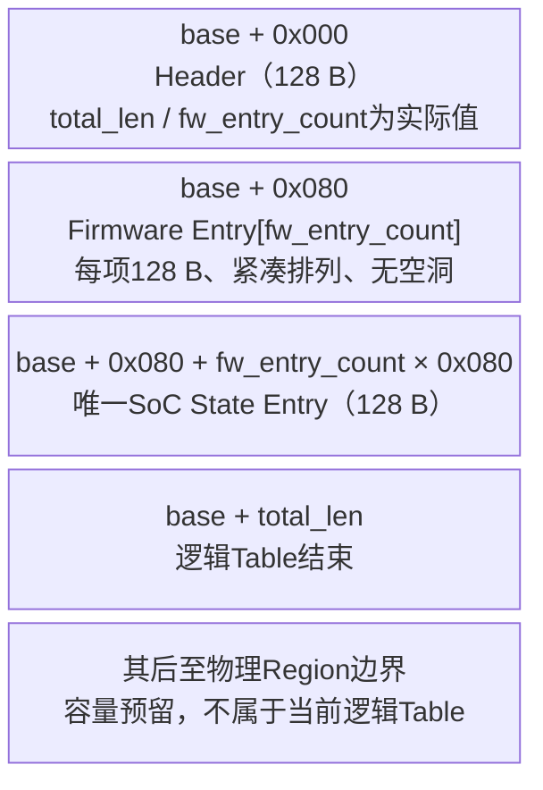

# Purpose

定义Measurement Table作为BootROM、FMC和GSP跨stage传递已验证安全事实的内部对象，并作为后续SPDM Measurement Provider的数据源。本版以SRC-0016原始结构为基础，落实项目负责人2026-07-27裁决：

> 主详设反向链接：[《NGU800P安全软件详细设计》第9章“Verification、Loader、Counter与Measurement”](../05-software-design/NGU800P安全软件详细设计.md#第9章-verificationloadercounter与measurement)

- Measurement状态只记录SoC安全状态，不记录`ehsm_status/ehsm_error`；
- BootROM作为隐式可信测量根，不作为普通Firmware Entry；
- Firmware Entry按实际独立验证/加载/release实例形成可变长度列表；
- `total_len`和`fw_entry_count`为实际值；
- 只存在一个SoC State Entry，因此删除`state_entry_count`；
- 暂不使用`generation`；
- 保留CRC和`commit_marker`；
- 每个结构只保留一组尾部`reserved[]`；
- Measurement地址统一为64位SoC物理地址，不再保存domain；
- 删除`key_id/signer_id`；
- 不增加时间戳。

SRC-0031/ADR-0028已固定Measurement物理Region为`0x1010_050F_C000～0x1010_050F_FFFF`、16 KiB；实际产品`max_fw_entries`仍由平台最大独立实例数生成且不得超过该物理容量允许的126项。Firewall粒度、PMA唯一属性和SPDM wire block仍分别由OPEN-CONFLICT-006和OPEN-DESIGN-015管理；PMA候选只允许`NON_CACHEABLE`和`HARDWARE_COHERENT`。本设计不授权修改代码仓。

# 核心语义

## BootROM边界

BootROM是Root of Trust for Measurement，负责测量第一个可变固件FMC。Table不记录“BootROM状态”，也不让BootROM用自Hash证明自身可信。

如果后续产品需要BootROM版本追溯，应从芯片绑定的不可变ROM identity/release digest取得，并作为独立设备身份声明管理，不混入普通Firmware Entry。

## Firmware Entry粒度

一个Firmware Entry对应一个“独立验证、独立加载或独立release/隔离”的执行实例：

- 同一固件由多个微核独立加载或分别release：每个实例一项，使用受信typed-stage topology registry的`instance_id`区分；
- 多个微核共享同一份代码并作为一个整体release：只形成一项；
- 相同Hash不允许省略独立实例；`fw_type + instance_id + die_id`必须唯一；
- `fw_entry_count`等于当前Table中已经COMMITTED的Firmware Entry实际数量。

物理Region必须按产品最大实例数预留，但最大容量不是Header字段，也不得根据当前启动数量动态改变Firewall范围。

# 可变长度总体布局

| 属性 | ABI v1 |
|---|---|
| Byte order / version | little-endian / `0x0100` |
| Header | 固定128 bytes |
| Firmware Entry | 每项固定128 bytes，实际数量为`fw_entry_count` |
| SoC State Entry | 固定1项、128 bytes |
| `total_len` | `128 + fw_entry_count × 128 + 128` |
| 物理Region | 固定16 KiB；`0x1010_050F_C000～0x1010_050F_FFFF` |
| 完整性 | Header和每个Entry各自CRC-32C |
| 发布点 | 每个对象末尾自然对齐的32位`commit_marker` |



```text
base+0x000  +----------------------------------+
            | Header                    0x080 |
base+0x080  +----------------------------------+
            | Firmware Entry[0]         0x080 |
            +----------------------------------+
            | Firmware Entry[1]         0x080 |
            +----------------------------------+
            | ...                              |
            +----------------------------------+
            | Firmware Entry[fw_count-1] 0x080 |
            +----------------------------------+
            | SoC State Entry            0x080 |
base+total  +----------------------------------+ logical end
            | 固定物理容量的未使用空间          |
            +----------------------------------+
```

`total_len`不是固定常量。Reader必须同时检查：

```text
total_len == header_len
           + fw_entry_count × FW_ENTRY_SIZE
           + SOC_STATE_ENTRY_SIZE
```

并要求`total_len <= 16384`、`fw_entry_count <= max_fw_entries <= 126`且所有乘加无整数溢出。16 KiB中超出当前`total_len`的空间不属于逻辑Table，本版保持清零/保留，不得分配给证书、SPDM或普通scratch。

# Header精确布局

| Offset | Size | 字段 | 规则 |
|---:|---:|---|---|
| 0 | 4 | `magic` | bytes `NGMT`，数值`0x544D474E` |
| 4 | 2 | `version` | 固定`0x0100` |
| 6 | 2 | `header_len` | 固定128 |
| 8 | 4 | `total_len` | 当前逻辑Table实际长度 |
| 12 | 4 | `fw_entry_count` | 当前COMMITTED Firmware Entry实际数量 |
| 16 | 16 | `device_uuid` | 设备UUID |
| 32 | 16 | `chip_id` | 芯片唯一ID |
| 48 | 72 | `reserved` | 唯一预留区；写0、读非0拒绝 |
| 120 | 4 | `header_crc32c` | 覆盖offset 0～119 |
| 124 | 4 | `commit_marker` | Header发布点 |

Header不再包含：

- `state_entry_count`：SoC State固定只有一项；
- `generation`：当前依赖BootROM先失效、完整清零和重新发布；
- `table_flags`：安全启动、LCS和reset分别由状态机、State和RAS表达；
- LCS/Debug/Counter/Certificate：只在SoC State保存一次。

# Firmware Entry精确布局

| Offset | Size | 字段 | 规则 |
|---:|---:|---|---|
| 0 | 4 | `fw_type` | 固件类型；不含BootROM普通Entry |
| 4 | 4 | `instance_id` | 来自受信typed-stage registry；独立实例必须不同 |
| 8 | 4 | `die_id` | Die0=0，Die1=1；其他值待产品Profile |
| 12 | 4 | `flags` | boot/runtime/recovery分类及`COUNTER_DOMAIN_SOC_GLOBAL/COUNTER_DOMAIN_EHSM` |
| 16 | 4 | `hash_algo` | SHA-256或SM3 |
| 20 | 4 | `hash_len` | 首版固定32 |
| 24 | 32 | `hash` | 实际测量结果 |
| 56 | 16 | `rollback_counter` | 原`image_counter`；固定16字节 |
| 72 | 4 | `verify_result` | 有效Entry必须为PASS |
| 76 | 4 | `release_state` | 有效Entry必须为`RELEASE_AUTHORIZED`；不声明目标已经运行 |
| 80 | 8 | `load_addr` | 64位baremetal System Address；不适用时0 |
| 88 | 8 | `entry_addr` | 64位baremetal System Address；不适用时0 |
| 96 | 24 | `reserved` | 唯一预留区；写0、读非0拒绝 |
| 120 | 4 | `entry_crc32c` | 覆盖offset 0～119 |
| 124 | 4 | `commit_marker` | Entry发布点 |

删除字段及理由：

| 字段 | 处理 |
|---|---|
| `algorithm_profile` | typed-stage/provisioning验证策略，不在Measurement重复 |
| `key_id/signer_id` | Key轮换由eHSM内部Bitmap决定；内部slot不作为Measurement事实 |
| `load_addr_domain/entry_addr_domain` | 删除；Header Overlay、loader和Measurement统一使用baremetal System Address，不建立Local/System映射 |
| raw Vendor/loader/counter status | 进入RAS/audit |
| counter before/after/relation/update state | 权威操作由eHSM BL API管理，Table只保留最终16字节事实 |
| timestamp | 无可信RTC需求；SPDM新鲜性由Nonce和签名提供 |

地址规则：

1. Header Overlay中的64位`load_addr`固定按baremetal `MANAGEMENT_NOC_S9_SRAM_BASE/SIZE` System Address解释，并要求与typed-stage固定目标精确相等；
2. loader不执行Local/System转换；Measurement只保存C908执行、SoC内存访问和eHSM共享descriptor共同使用的64位System Address；
3. local/remap alias、旧080x和Host虚拟地址不得写入Measurement；
4. eHSM Vendor FW不由SoC loader产生执行地址，其`load_addr/entry_addr`均为0。

# SoC State Entry精确布局

| Offset | Size | 字段 | 规则 |
|---:|---:|---|---|
| 0 | 4 | `lifecycle_state` | SoC LCS |
| 4 | 4 | `debug_enable_state` | SoC Debug总状态 |
| 8 | 4 | `anti_rollback_enable` | SoC防回滚策略状态 |
| 12 | 16 | `stored_global_counter` | 权威读回的16字节SoC全局counter |
| 28 | 4 | `firewall_state` | SoC安全Firewall状态 |
| 32 | 4 | `oob_recovery_state` | SoC OOB/Recovery状态 |
| 36 | 4 | `boot_fail_reason` | 当前启动最终失败原因；成功为0 |
| 40 | 4 | `die_num` | 当前有效Die数量 |
| 44 | 4 | `cert_slot_id` | 当前SPDM证书slot |
| 48 | 4 | `cert_chain_digest_algo` | 证书链摘要算法 |
| 52 | 4 | `cert_chain_digest_len` | 首版固定32 |
| 56 | 32 | `cert_chain_digest` | 当前boot完整SPDM虚拟链摘要：静态Issuer前缀+动态Firmware Alias Leaf |
| 88 | 32 | `reserved` | 唯一预留区；写0、读非0拒绝 |
| 120 | 4 | `entry_crc32c` | 覆盖offset 0～119 |
| 124 | 4 | `commit_marker` | State发布点；提交后Table完成 |

State只表达SoC安全状态，明确不包含：

- eHSM ready、health、raw status和错误码；
- 运行期RAS事件；
- 普通Timer、RTC或启动时间戳；
- Key轮换Bitmap、Key slot和Signer内部标识。

eHSM状态进入eHSM Adapter状态机和RAS/audit；Key轮换状态进入Key管理与轮换审计；时间信息仅可进入RAS/audit诊断记录。

# 固件类型、Owner与顺序

| 类型 | `fw_type` | Producer | Hash输入 |
|---|---:|---|---|
| FMC | `0x0002` | BootROM | loader目标明文readback |
| GSP | `0x0003` | FMC | loader目标明文readback |
| eHSM Vendor FW | `0x0007` | GSP | Vendor认证package blob |
| PMP | `0x0004` | GSP | loader目标明文readback |
| RMP | `0x0005` | GSP | loader目标明文readback |
| MMP | `0x0006` | GSP | loader目标明文readback |
| Die1 FW | `0x0100` | GSP | Die1实际加载实例readback |

规则：

1. Firmware Entry紧凑排列，无固定物理slot和空洞。
2. FMC必须是第一个Entry，GSP必须是第二个Entry；其余项由GSP按`fw_type、die_id、instance_id`稳定排序后追加。
3. `fw_type + die_id + instance_id`重复时拒绝。
4. 包内不携带`measurement_slot`、`fw_type`、`die_id`或`instance_id`；实际Entry索引由producer按受信registry的`fw_type + die_id + instance_id`和上述追加规则产生。
5. 同一镜像用于多个独立release实例时，各Entry可以具有相同Hash，但必须有不同`instance_id`或`die_id`。
6. BootROM不占用Firmware Entry；其可信根身份由平台不可变边界承担。

ADR-0029不改变Measurement ABI，只增加固定消费者语义：BootROM对DICE只贡献Entry 0的FMC最终readback digest，FMC只贡献Entry 1的GSP最终readback digest；GSP必须验证这两个Entry的类型、producer、digest来源、CRC/commit和唯一性，才能构造96字节`dice_tcb_context_v1`。Runtime/Die1 Entry继续进入Report/SPDM Measurement，但本版不各自生成更多动态证书层。

# Hash和Counter

1. FMC/GSP/PMP/RMP/MMP/Die1的Hash输入是loader目标Region最终readback的全部`Code_Size`字节；loader必须按受信Secure Package Profile分别计算`target+1024`源Code摘要和目标readback摘要并常量时间比较一致。包内不携带expected hash，Measurement只提交目标readback摘要，不得从Header或其他元数据复制摘要。
2. eHSM Vendor FW记录实际提交并通过Vendor认证的完整package blob Hash，同时要求`firmware_done=1 && firmware_err=0`；不声称取得eHSM内部明文。
3. `hash_algo`不得自由选择：Secure Package Profile 1/2固定记录SHA-256，Profile 3固定记录SM3；两者`hash_len`均固定32。eHSM FW完整package blob的算法由其受控Vendor/release profile唯一绑定。
4. SoC type 1 stage Entry使用`COUNTER_DOMAIN_SOC_GLOBAL`；产品拒绝type 2/3 stage包。eHSM FW type 0 Entry使用`COUNTER_DOMAIN_EHSM`并记录Vendor认证counter，两域不要求相等。大小比较、update和readback由eHSM BL权威API完成。
5. 失败验证、未验证、未获release授权、隔离候选和受限非安全启动不提交成功Firmware Entry，错误进入RAS/audit，因此首次release前可按stage策略重新处理。

# CRC与Commit

Header、Firmware Entry和SoC State Entry均使用相同的对象尾部：

| Marker | Value | 含义 |
|---|---:|---|
| EMPTY | `0x00000000` | 不存在 |
| WRITING | `0x54495257` | Writer正在修改，Reader拒绝 |
| COMMITTED | `0x54494D43` | 可继续校验CRC和字段 |
| 其他 | — | 损坏，Reader拒绝并上报 |

CRC采用CRC-32C Castagnoli：reflected polynomial `0x82F63B78`、`init=0xFFFFFFFF`、`xorout=0xFFFFFFFF`，ASCII `"123456789"`结果为`0xE3069283`。CRC覆盖offset 0～119；CRC字段和commit marker不参与计算。

`commit_marker`是共享RAM发布元数据，不是Measurement内容，也不提供密码学认证。真实性来自安全启动链、可信Producer和安全RAM权限隔离。

## 初始化

BootROM每次安全启动必须：

1. 先把Header marker写为EMPTY并完成write/release fence和readback；在`NON_CACHEABLE`与`HARDWARE_COHERENT`两个批准候选属性下均不执行data clean/invalidate；
2. 清零整个固定Measurement物理Region；
3. 建立`fw_entry_count=0`、`total_len=256`的Header，其中256包含Header和一个尚未提交的SoC State位置；
4. 发布Header COMMITTED；
5. 验证、加载FMC后追加第一个Firmware Entry。

由于不使用`generation`，任何未完成“Header先失效 + 整个Region清零”的启动都不得发布新Table或继续release。

## 追加Firmware Entry

```text
验证Header和当前紧凑前缀
  -> Header marker置WRITING
  -> 在offset header_len + old_count × 128构造新Entry
  -> Entry payload + CRC + COMMITTED
  -> new_count = old_count + 1
  -> new_total_len = 128 + new_count × 128 + 128
  -> 更新Header count/length/CRC
  -> Header最终写COMMITTED
  -> Reader规则回读验证
  -> 才允许release对应对象
```

在Header为WRITING期间，整个Table对Reader无效。State尚未提交时，它位于当前Firmware前缀之后；追加新Firmware Entry会占用旧的空State位置，并把新的空State位置顺延128字节。

## 提交SoC State

GSP只有在所有计划启动的Firmware Entry处理结束、安全服务和证书状态确定后，才能在：

```text
base + header_len + fw_entry_count × 128
```

提交唯一SoC State Entry。State COMMITTED后Table进入最终态，不得继续追加Firmware Entry；运行期变化进入RAS/audit。

# Stage合同

| Stage | 操作 |
|---|---|
| BootROM | 初始化Header；不写BootROM Entry；以`check_version=0`验证FMC、确认BL candidate暂存后追加`RELEASE_AUTHORIZED` FMC Entry并release FMC |
| FMC | 消费FMC Entry中的expected candidate；初始化调用BL exact-match commit/readback；随后以`check_version=0`验证等值GSP，追加`RELEASE_AUTHORIZED` GSP Entry并release |
| GSP | 消费FMC/GSP Entry；形成DICE TCB并生成动态Leaf；加载eHSM FW和各Runtime，按实际独立实例追加Entry；把本boot完整虚拟证书链摘要写入唯一SoC State后提交 |
| SPDM/RAS/审计 | 只读取最终稳定私有snapshot；不得持有共享指针 |

FMC消费FMC Entry时按`fw_type=FMC、instance_id=0、die_id=0、verify=PASS、release=RELEASE_AUTHORIZED`和CRC/commit查找，不依赖旧固定slot编号。

唯一SoC State提交后Table在本boot不可变。已release Runtime/Die1发生reset、失联或隔离时，由RAS/health记录运行状态并使SPDM进入`NOT_READY/CONTENT_CHANGED`；不得原地改Entry或同boot重新release，恢复要求完整SoC reboot并重建Table。

# Stable Snapshot

SPDM和审计Reader不持有写锁：

1. 复制Header A并验证COMMITTED、CRC、长度公式和容量上限；
2. 按A中的`fw_entry_count`复制紧凑Firmware列表和唯一State；
3. 要求所有Firmware Entry及State均为COMMITTED并通过CRC/字段校验；
4. 执行acquire/read fence；在两个批准候选属性下直接读取共享对象，不执行data invalidate；
5. 再复制Header B；
6. 要求Header A/B逐字节一致且仍为COMMITTED；
7. 不一致时丢弃并重试一次，仍变化返回`SNAPSHOT_BUSY`。

Header更新时会先进入WRITING，因此不再需要固定slot bitmap。SPDM block index、对外字段裁剪、地址是否披露和证书/transport参数继续由OPEN-DESIGN-015定义。

# Failure规则

| Failure | 行为 |
|---|---|
| Header magic/version/header_len/CRC/commit错误 | 整个Table无效，fail-close |
| `total_len`公式、Region容量或整数边界错误 | 整个Table无效，禁止解析 |
| Firmware前缀存在EMPTY、WRITING、空洞或CRC错误 | 整个Table无效 |
| `fw_type/die_id/instance_id`重复或Owner不匹配 | 拒绝并记录安全错误 |
| Hash、counter、地址或release状态错误 | 不提交Entry，不release |
| State缺失或未COMMITTED | SPDM/Attestation不得ready |
| 尝试在State提交后追加Firmware Entry | 拒绝 |
| Host重新下发失败包 | 错误写RAS/audit；不增加count，可重新接收新候选 |
| Header/Entry commit跨master可见性未证明 | 实现DoR失败，不得编码真实shared-RAM路径 |

# 已批准结论与剩余输入

## 2026-07-27已批准

1. State只记录SoC安全状态，删除eHSM状态。
2. BootROM作为隐式可信根，不创建普通Firmware Entry。
3. `total_len`为实际可变长度。
4. 删除`state_entry_count`，固定一个SoC State。
5. 暂不使用`generation`，依赖启动时先失效和完整清零。
6. 保留CRC和`commit_marker`。
7. 每个结构只保留一个尾部`reserved[]`。
8. Measurement地址删除domain，统一记录64位`SOC_PA`。
9. 删除`key_id/signer_id`。
10. 不增加时间戳。

## 实现前剩余输入

- 产品最大独立Firmware/微核实例数，用于冻结实际`max_fw_entries`；物理Region已固定16 KiB且给出126项硬上限；
- 同一镜像在各微核上的实际共享/独立加载与release关系，用于生成具体`instance_id`集合；
- OPEN-CONFLICT-006的Firewall参数，以及待SoC稳定后在`NON_CACHEABLE`与`HARDWARE_COHERENT`之间裁决的PMA属性；两个候选均固定不执行data clean/invalidate；
- OPEN-DESIGN-015的SPDM block映射和对外字段。

# References

- [SRC-0016原方案登记](../../sources/source-cards/SRC-0016.md)；原PDF为`docs/09-plans/芯片安全软件方案v1.2 (1).pdf`
- [ADR-0004](../../decisions/ADR-0004-die1-measurement-gsp-address-and-handoff-scope.md)
- [ADR-0005](../../decisions/ADR-0005-b0-r1-address-counter-and-vendor-bl-boundary.md)
- [ADR-0012](../../decisions/ADR-0012-bootrom-lcs-counter-gsp-fw-and-redelivery-boundary.md)
- [ADR-0019](../../decisions/ADR-0019-rollback-counter-manifest-version-and-no-host-gsp-service.md)
- [ADR-0022](../../decisions/ADR-0022-measurement-table-abi-v1.md)
- [公共ABI](security-common-abi.md)
- [安全固件包](secure-firmware-package.md)
- [Verify/Loader](image-verify-loader.md)
- [安全RAM布局](../03-architecture/security-ram-layout.md)
- [OpenSpec measurement-table-abi-v1](../../openspec/changes/measurement-table-abi-v1/proposal.md)

# Change history

- 2026-08-19：按SRC-0032/ADR-0029增加DICE消费者语义；Entry0 FMC和Entry1 GSP是固定TCB输入，BootROM/FMC不生成证书；SoC State证书摘要覆盖静态Issuer前缀加GSP动态Leaf，不改变ABI布局。
- 2026-08-19：SRC-0031/ADR-0028固定Measurement物理Region为16 KiB、offset `0x0FC000`，给出126项物理硬上限；未使用尾部本版保持保留，不作证书或scratch复用。
- 2026-07-27：依据负责人逐项批准，改为可变长度紧凑Firmware列表加唯一SoC State；删除BootROM普通Entry、eHSM状态、`state_entry_count`、`generation`、Measurement地址domain、`key_id/signer_id`和时间戳；保留单一reserved、CRC和commit；增加实际`instance_id`语义及最大实例数输入。
- 2026-07-27：曾形成1280字节固定8槽精简候选；该候选被本次可变长度批准方案替代，未授权编码。
- 2026-07-27：最初4224字节复杂候选被否决并替代，未授权编码。
- 2026-07-23：批准BootROM committed FMC rollback counter、FMC consumer、FMC/GSP一致性及counter update→GSP Measurement commit→release顺序；不新增Handoff。
- 2026-07-28：`release_state`改为`RELEASE_AUTHORIZED`，区分SoC/eHSM counter域，并冻结State后不可变和运行期reset需整机重建。
