# 第1章 文档目的、范围与设计约定

## 1.1 文档目的

本文定义NGU800P D0安全软件的最终工程合同，用于直接指导BootROM、FMC、GSP、安全公共组件、eHSM适配层、制包工具和验证软件的实现。

详细设计包括：

- 系统角色、信任边界和端到端安全启动链；
- 固件包、Native Header Overlay、验签解密、加载、Measurement和Release；
- eHSM Host Adapter、Mailbox和平台Port；
- 2 MiB安全SRAM、System Address、Firewall、PMA、Cache和清零；
- Lifecycle、Debug/RMA、Key、OTP/eFuse、证书、DICE、SPDM和Key Rotation；
- 更新恢复、Multi-Die、错误/RAS、构建发布和测试门禁。

## 1.2 适用范围

本文适用于NGU800P D0的以下软件和工具：

| 对象 | 适用内容 |
|---|---|
| BootROM | 启动模式、eHSM BL、FMC认证加载、Measurement和一次性Release |
| FMC | Counter提交、GSP认证加载、Measurement和Release |
| GSP | eHSM FW启动、Runtime加载、证明服务和安全服务Owner |
| C908 Provisioning FW | DEV/MANU非安全制造子Profile、eHSM BL typed制造协议、证书安装、LCS收口与审计 |
| 公共安全组件 | Header解析、typed-stage registry、verify/loader、Measurement、错误和清零 |
| 发布工具 | 固件包构造、签名、加密、检查、Evidence和可复现构建 |
| 验证软件 | 单元、集成、EMU、故障注入和发布门禁 |

eHSM内部密码算法和Bootloader实现由Vendor交付；SoC软件只通过受控Host Adapter调用，不改变Vendor wire合同。

## 1.3 规范性用语

- “必须/不得”表示强制实现或验收要求。
- “固定”表示由编译期registry、发布矩阵或平台描述生成，运行期调用者不得覆盖。
- “平台参数”表示必须在目标构建中提供的具体地址、寄存器、PMA、Firewall、deadline或release绑定；缺失时对应产品路径必须构建失败或保持不可达。
- 所有wire/storage字段按明确字节序和固定宽度解析；不得直接把不可信输入转换为本地C结构体。
- 所有未列出的枚举、flags、reserved值和状态组合默认拒绝。
- Vendor返回成功只表示对应Vendor操作成功，不替代Header、stage policy、loader、Measurement、权限和Release门禁。

## 1.4 文档结构

| 章节 | 内容 |
|---:|---|
| 2 | 系统角色、信任边界与端到端安全启动链 |
| 3 | 固件Package、Native Header Overlay、制作与发布 |
| 4 | eHSM BL、Host Adapter、Mailbox与平台Port |
| 5 | 2 MiB安全RAM、System Address、Firewall与清零 |
| 6～8 | BootROM、FMC和GSP详细设计 |
| 9 | Verification、Loader、Counter与Measurement |
| 10～11 | Lifecycle、Key、证书、DICE、Attestation与SPDM |
| 12～14 | 更新恢复、Multi-Die、错误/RAS和敏感数据清零 |
| 15～16 | 构建发布、测试、EMU与流片前门禁 |
| 附录A | 公共逻辑ABI、枚举与Registry |

# 第2章 系统角色、信任边界与端到端安全启动链

## 2.1 系统组成和信任根

NGU800P安全启动由两条并行上电路径和一条逐级release链组成：

1. Wing-M130/eHSM从自身不可变启动环境进入Vendor Bootloader，完成Vendor定义的硬件初始化、自检、eFuse/内部状态装载并提供Bootloader阶段Mailbox服务；
2. C908从SoC BootROM开始执行，先读取复位锁存的只读`non_sec_boot`策略位，再按需要读取SoC LCS和latched Strap，选择安全或非安全顶层路径；非安全路径按不可变原因进一步选择`MANUFACTURING_PROVISIONING`或`RESTRICTED_NONSECURE`子Profile；
3. 安全路径中，BootROM使用eHSM BL能力以`check_version=0`验证并加载FMC，BL把已认证FMC `Version_Counter`暂存为RAM candidate；FMC进入初始化后把同一16字节candidate回传BL，BL比较一致后完成SoC全局`rollback_counter[16]`比较/提交/readback；提交证明成立后FMC才接收、验证并加载GSP；GSP创建终身唯一eHSM安全服务Owner，加载eHSM Vendor FW，再验证、加载和release PMP/RMP/MMP。

系统信任根和可信状态来源如下：

| 信任对象 | 可信内容 | 不可信或必须重新验证的内容 |
|---|---|---|
| SoC不可变启动环境 | reset入口、BootROM代码、RTL同步寄存器定义、只读Boot Policy Fuse快照、SoC LCS/Strap读取原语 | RAM残留、Host输入、未seal package、未经Evidence确认的eFuse地址/裸bit或寄存器地址 |
| eHSM ROM/Bootloader | Vendor BL业务基线、自检、原生Header校验/验签/解密、eHSM内部Key/OTP访问控制 | Vendor Demo顶层流程、样例平台地址、无限等待、reset magic |
| 产品Provisioning | 受控根Key、算法Profile、board/SKU/LCS策略、16字节rollback counter | 未登记Key/slot、test key、Host可控raw command、未匹配配置 |
| NGU Header Overlay | Vendor PASS且Header稳定复验后的`load_addr`；Header尾16B位于Vendor签名/CMAC覆盖范围内 | Host metadata、PASS前Header中的地址、未复验或发生变化的Header副本 |
| Measurement Table | 完成CRC/commit并满足producer顺序的本次启动Table | reset前残留、未commit对象、私有BSS对象、Host提供的Measurement |
| 平台release/Firewall | RTL/平台Owner提供并经readback证明的reset/clock/Firewall/PMA原语 | 仅有软件标志但未证明硬件隔离的状态 |

以下主体始终不作为正常启动隐式信任源：外部Host/BMC、OOB控制器、未验证Flash/RAM package、网络/SPDM requester、测试Expected、Demo/stub输出、普通GSP业务task和任何可由非可信master修改的长度、指针或状态。

## 2.2 软件角色与禁止越权

| 角色 | 唯一职责 | 允许产生的可信输出 | 明确禁止 |
|---|---|---|---|
| Wing-M130/eHSM BL | 保持Vendor启动基线；依据自身eFuse自主判断并执行自检；提供BL阶段ready/error、自检raw状态、原生镜像验签/解密和FMC counter提交；在制造Profile中提供受LCS、硬件启动条件、signed recipe/ticket、设备绑定、固定对象映射和依赖顺序共同约束的typed Key安装/查询/证明/LCS接口 | raw Vendor状态、受认证Header/明文输出、candidate暂存状态、counter权威结果；制造对象的权威状态/readback/operation proof | 定义SoC stage顺序；替SoC执行release；接受raw OTP/slot/usage/`last_key`或任意消息签名；仅凭C908 caller或站点环境授权不可逆写入 |
| SoC BootROM | 读取一次只读`non_sec_boot`快照并进行最高优先级模式判定；输出顶层mode和非安全子Profile；安全路径等待eHSM BL并读取其raw自检状态但不发起自检；以`check_version=0`验证/加载FMC；提交唯一FMC Measurement；一次性release FMC | 已保护FMC执行区、带已认证candidate的committed FMC Entry；或按固定非安全子Profile加载并release对应FMC | raw eFuse读写或烧写；安装Key；独立读取/比较/更新counter；发起eHSM自检；加载eHSM Vendor FW；自动retry未知命令；失败后跳转；非安全路径写安全启动审计 |
| C908 Provisioning FW | 仅在`MANUFACTURING_PROVISIONING`子Profile中编排设备绑定的typed制造事务；等待eHSM BL ready，调用BL查询/安装/生成/证明/finalize/LCS接口；安装Cert0/1并提交无秘密审计 | 对象状态与proof摘要、证书安装结果、LCS readback和制造Evidence | 作为信任根；直接访问raw OTP/eFuse/KMU；caller自选slot/Level/usage/`last_key`；进入USER；经`non_sec_boot=1`取得写权限 |
| FMC | 消费可信FMC Entry；初始化时回传candidate并取得BL counter commit proof；随后接收/验证/加载GSP并要求其counter等于已提交值；提交GSP Entry并release GSP | 已提交全局counter、committed GSP Entry、已保护GSP执行区 | 重新验证自身package；加载eHSM Vendor FW；在candidate不一致时写OTP；用update掩盖FMC/GSP值不一致 |
| GSP `security_service_task` | 从bootstrap到runtime终身唯一拥有eHSM service/context；加载eHSM FW；验证/release PMP/RMP/MMP；维护最终Measurement State；提供受控内部安全服务 | eHSM FW ready、Runtime独立Entry/状态、typed内部服务结果 | 向外部Host开放raw/通用GSP安全服务；移交eHSM Owner；把OMP作为独立产品镜像 |
| PMP/RMP/MMP | 仅在各自依赖和release门禁满足后执行本职Runtime功能 | Runtime健康/错误状态，经GSP/RAS汇总 | 直接调用eHSM Mailbox；修改Measurement；越权访问其他Runtime区域 |
| Host/BMC | 下发未可信package、接收允许的协议响应、在受控失败场景重新发送 | 无；输入在通过全部门禁前均不可信 | 直接访问明文/Measurement/执行区；控制load/entry；调用raw eHSM或GSP安全服务 |
| RAS | 根据安全软件报告和平台策略执行reset、隔离、watchdog或系统动作 | 平台动作结果和可审计状态 | 反向降低密码/启动策略；把错误上报等同于验证成功 |
| Build/KMS/Release | 生成匹配Profile的包、写入Header Overlay、完成真实签名/加密并登记发布证据 | 可审计package、Header字段、签名引用和release清单 | 把私钥写入仓库；发布zero signature/test key/stub产物 |

## 2.3 产品镜像、身份和启动对象

产品启动对象固定为：

| 对象 | 验证/加载Owner | 包类型 | Measurement | Counter语义 |
|---|---|---|---|---|
| BootROM | SoC不可变启动环境 | 不在本启动Package集合内 | 不创建普通Firmware Entry；其信任通过SoC State/启动根隐式表达 | 不独立读取、比较或更新SoC counter |
| FMC | BootROM | Vendor Native Header，固定Vendor type 1 + Header Overlay | BootROM提交唯一FMC Entry | 携带已认证`rollback_counter[16]`；BL同时暂存同值candidate |
| GSP | FMC | Vendor Native Header + Header Overlay | FMC提交唯一GSP Entry | 必须等于FMC初始化阶段已提交的SoC global counter |
| eHSM Vendor FW | GSP | Vendor原生type 0专用boot包 | 独立eHSM FW Entry，仅记录package认证/启动事实，不记录eHSM内部状态 | 使用Vendor eHSM FW独立counter域，不要求等于SoC global counter |
| PMP/RMP/MMP | GSP | Vendor Native Header + Header Overlay | 按受信stage registry中的`fw_type/die_id/instance_id`分别记录 | 必须匹配已提交值 |
| Die1固件实例 | Die0 GSP | 对应受控Package/跨Die传输 | 独立`die_id=1` Entry | 必须匹配已提交值 |

GSP是唯一产品安全管理固件。产品不定义独立OMP/Q&P包、image ID、RAM Region、Measurement、counter或release对象。

## 2.4 端到端启动顺序

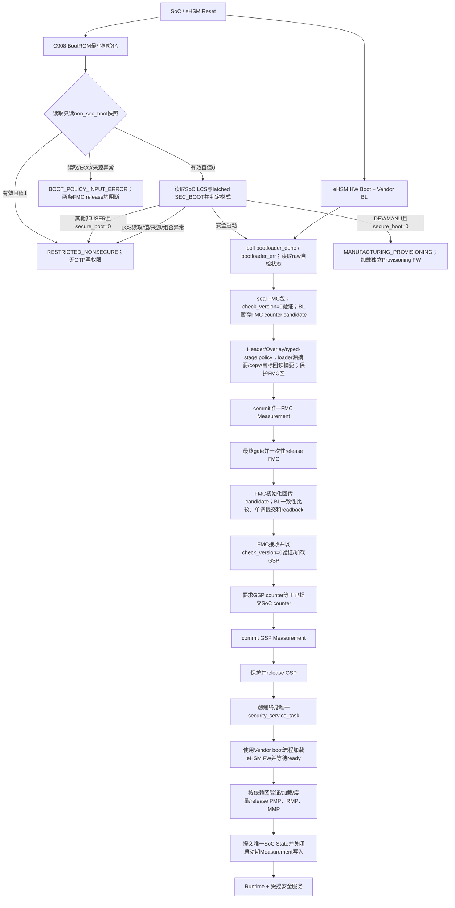

非安全顶层路径与安全链代码和资源边界分离，并由mode reason唯一选择子Profile。`MANUFACTURING_PROVISIONING`只在`non_sec_boot=0`、LCS为DEV/MANU、Strap=0且制造Profile有效时加载独立C908 Provisioning FW；BootROM本身仍不写OTP，Provisioning FW只能调用eHSM BL的typed制造接口。`RESTRICTED_NONSECURE`用于`non_sec_boot=1`、LCS异常和其他非制造组合，不开放OTP/eFuse/KMU写、raw eHSM、任意安全RAM、未鉴权Debug或安全固件release。两个子Profile都不创建Measurement Firmware Entry、不提交SoC State，也不写安全启动审计。

## 2.5 各stage前置条件、成功后置条件和失败终态

| Stage | 进入前必须成立 | 核心动作 | 成功后置条件 | 失败终态 |
|---|---|---|---|---|
| BootROM安全路径 | CPU从不可变BootROM reset vector取指；BootROM尚未开放任何下游执行权限 | 首先执行reset基线证明并回读FMC reset/clock/NX与Measurement写Owner；随后先失效并回读Measurement Header、再清零并回读整个固定Region；完成模式、eHSM BL ready/error和raw自检结果、FMC `check_version=0` verify/decrypt、BL candidate暂存、Header Overlay/typed-stage policy、load/双摘要readback、Measurement commit、Firewall | FMC Entry唯一且committed；Entry candidate与认证Header一致；FMC区最终权限/readback正确；release只执行一次 | 任一基线或后续门禁无法证明时不release；保存静态错误；清理可清对象；上报RAS；RAS不可用时进入无限WFI fail-stop循环 |
| BootROM非安全制造路径 | `non_sec_boot=0`、LCS为DEV/MANU、`boot_pin.secure_boot[3]=0`且制造Profile有效；安全FMC保持不可执行 | 只按`MANUFACTURING_PROVISIONING`选择独立Provisioning FW source、Region、权限和入口 | Provisioning FW可等待eHSM BL并调用typed制造接口；BootROM无OTP写能力；不产生安全Measurement/SoC State/启动审计 | Profile缺失/非法即终态；不得回退受限镜像继续灌装，也不得进入安全路径 |
| BootROM受限非安全路径 | `non_sec_boot=1`，或值0且LCS异常，或值0且非制造组合选择非安全；安全FMC保持不可执行 | 仅按`RESTRICTED_NONSECURE`选择source、Region、权限和入口 | 不产生安全验证、Measurement Entry、SoC State或启动审计，不开放制造接口 | Profile缺失/非法时停在受限非安全终态；不得回退到安全路径或开放安全资源 |
| FMC | 仅由BootROM release进入；FMC Entry完整有效；GSP保持reset/不可执行 | 初始化时提交FMC expected candidate并取得BL compare/update/readback proof；随后ingress/seal、GSP `check_version=0` verify/decrypt/load、GSP/global counter相等检查、GSP commit | counter为`PROVEN_EQUAL`或`PROVEN_UPDATED`；GSP Entry committed；GSP区保护成功 | candidate不一致/低值/提交未知则terminal；提交证明后GSP确定接收失败可安全重新arm，不能启动低版本恢复 |
| GSP bootstrap | 仅由FMC release进入；GSP Entry和上游Table完整；普通业务服务未开放 | 建立唯一eHSM Owner；boot Vendor FW；按依赖加载Runtime；提交State | eHSM FW ready；所需Runtime按依赖release；Table最终完成；service进入runtime loop | 单Runtime确定失败局部隔离；共享eHSM service未知则全局quarantine；请求RAS动作 |
| Runtime | 对应Entry、依赖、Firewall、reset/clock/entry均已证明 | 执行本Runtime业务 | 只访问批准Region和typed服务 | 仅隔离失败Runtime及依赖者；不得重开上游安全门禁 |

## 2.6 跨stage数据和Owner转换

| 数据对象 | 初始Owner | 状态转换 | 最终Consumer | 安全要求 |
|---|---|---|---|---|
| 未可信Package ingress | Host/Flash传输层 | `WRITABLE -> SEALED -> VERIFYING -> CONSUMED/QUARANTINED` | 当前stage verifier | seal后Host不可写；长度/地址每次重验 |
| eHSM command/context | 当前stage或GSP service | `IDLE -> IN_FLIGHT -> COMPLETED/UNKNOWN -> RECLAIMED/QUARANTINED` | Vendor Host/eHSM | 一stage一slot/单在途；unknown不清理、不复用、不retry |
| 解密明文 | eHSM输出buffer Owner | `OUTPUT -> VALIDATED -> LOADED -> ZEROIZED/QUARANTINED` | loader | Host不可见；Header Overlay/typed-stage policy通过且loader源/目标摘要一致前不执行 |
| 目标执行Region | 平台/loader | `RESET_HELD -> WRITABLE_BY_LOADER -> VERIFIED -> RX/RW_FINAL -> RELEASED` | 下一级stage/Runtime | W^X、write/release、目标readback摘要、指令侧同步、Firewall/readback和entry检查 |
| Measurement Table | BootROM初始化，随后按stage追加 | `INVALID/CLEARED -> FMC -> GSP -> RUNTIMES -> SOC_STATE/FINAL` | GSP/SPDM/RAS | CRC/32位commit；无generation；State后不可继续append |
| SoC `rollback_counter[16]` | eHSM物理资源 | BL验证FMC时暂存RAM candidate；FMC初始化回传同值后由BL compare/update/readback | GSP及后续SoC镜像、发布审计 | `check_version=0`禁止验证接口自动推进；candidate不一致先拒绝；未知状态不得自动retry |
| 错误/审计 | 安全路径中发现错误的stage | 规范化并保留raw状态 | GSP/RAS/受控Evidence | 不记录秘密；严重度与RAS动作分离；受限非安全路径不创建启动审计 |

任何指针都不得作为跨stage可信对象传递。跨stage只通过受控共享Region、Measurement字段、固定寄存器/状态和重新校验后的64位地址表达事实；产品不定义版本化Handoff结构。

## 2.7 Release统一状态机

所有FMC/GSP/Runtime对象必须遵循同一不可跳过的release状态机：

```text
RESET_HELD
  -> PACKAGE_SEALED
  -> VENDOR_VERIFIED
  -> HEADER_POLICY_VERIFIED
  -> LOADED_AND_READBACK_VERIFIED
  -> MEASUREMENT_COMMITTED
  -> FIREWALL_AND_ENTRY_PROVEN
  -> RELEASED
```

约束如下：

1. `VENDOR_VERIFIED`只表示Vendor密码层PASS，不能直接跳到`RELEASED`；
2. loader不能调用release，Measurement组件也不能调用release；只有stage orchestrator可以在所有前置条件满足后执行；
3. release返回后无论成功或状态未知，都不得用同一对象重新执行release；
4. 任何状态失败都使后续状态不可达；FMC candidate commit证明成立后，GSP包的确定接收失败只要对象可安全清理即可回到新的`PACKAGE_SEALED`事务；不能因已推进counter而接收更低值恢复包；
5. release前必须重新检查实际entry位于实际加载范围、最终权限匹配、依赖均已release且错误状态为空。
6. 包内不包含expected payload digest。`LOADED_AND_READBACK_VERIFIED`必须先按受信stage profile从已认证明文`Code Region`计算摘要，再复制并从目标Region回读重算同算法摘要，常量时间比较二者；比较成功的目标摘要才允许写入Measurement。

## 2.8 启动模式与Lifecycle共同策略

| `non_sec_boot`只读快照 | SoC LCS | `boot_pin.secure_boot[3]` | 目标模式 |
|---|---|---:|---|
| 有效、ECC正常、值1 | 任意/不消费 | 任意/不消费 | `RESTRICTED_NONSECURE` |
| 有效、ECC正常、值0 | USER | 任意 | 强制安全启动 |
| 有效、ECC正常、值0 | DEV或MANU | 0 | `NON_SECURE_BOOT / MANUFACTURING_PROVISIONING` |
| 有效、ECC正常、值0 | 其他允许非安全启动的非USER状态 | 0 | `NON_SECURE_BOOT / RESTRICTED_NONSECURE` |
| 有效、ECC正常、值0 | 允许安全启动的非USER状态 | 1 | 安全启动 |
| 有效、ECC正常、值0 | LCS读取失败、非法、`UNDEFINED`、来源有效性无法证明或策略组合不允许 | 任意 | 受限非安全启动 |
| 读取失败、ECC异常、来源无效、锁存未完成或镜像不一致 | 不消费 | 不消费 | `BOOT_POLICY_INPUT_ERROR`终态 |

`non_sec_boot`是最高优先级1 bit eFuse启动策略位，逻辑默认值0不覆盖既有矩阵，可靠读为1时包括USER在内均强制选择`RESTRICTED_NONSECURE`，且不能取得制造写权限。BootROM只消费复位稳定的只读逻辑快照，不取得raw eFuse读写能力。SoC LCS由BootROM直接读取，不依赖eHSM Autoload。`boot_pin.secure_boot[3]`固定为安全启动选择位，default 0，`0=非安全/1=安全`。三个模式输入在BootROM早期按需读取一次并保持不可变，后续stage不得根据Host输入重新选择模式。只有值0、DEV/MANU和Strap=0的精确组合可以选择制造子Profile；制造Profile缺失或非法直接终止，不降级为具有写能力的其他路径。异常LCS只选择受限非安全路径；`non_sec_boot`输入异常则安全和非安全FMC均不得release。

## 2.9 全局Owner和副作用边界

1. eHSM service：BootROM/FMC在各自stage独占；进入GSP后由第一个最高优先级`security_service_task`终身独占，不发生Owner移交。
2. rollback counter：BootROM只触发`check_version=0`验证并使BL暂存candidate；FMC初始化时是唯一提交发起者；BL比较回传值与RAM candidate一致后执行单调写/readback；GSP/Runtime只消费已证明结果。
3. Measurement：BootROM初始化并提交FMC；FMC追加GSP；GSP追加eHSM FW/Runtime并最终提交SoC State；SPDM只读snapshot。
4. reset：安全软件只检测、阻断、记录和请求RAS动作，不直接决定SoC reset。
5. Firewall/release：stage orchestrator请求平台原语；通用verify/loader/Measurement组件不得隐藏执行reset、clock、release或jump。
6. eHSM可访问整个2 MiB安全RAM，不做Region级限制；这不取消adapter对地址、长度、生命周期、PMA和barrier的检查；允许的PMA属性均不得依赖软件data clean/invalidate。

## 2.10 目标模块分解和调用方向

```text
solutions/bootrom/app/
  bootrom_main / bootrom_security_orchestrator
      -> security/common mode + error
      -> security/ehsm adapter (BL poll)
      -> security/package + header_overlay + typed_stage_policy
      -> security/loader
      -> security/measurement
      -> platform firewall/release/RAS

solutions/fmc/app/
  fmc_main / fmc_security_orchestrator
      -> ingress/seal
      -> 同一公共verify/header_overlay/policy/loader
      -> rollback policy + eHSM BL counter client
      -> measurement
      -> platform release/RAS

solutions/gsp/app/
  pre_main
      -> 创建security_service_task（最高优先级、唯一Owner）
  security_service_task
      -> eHSM FW boot
      -> runtime manager
      -> typed internal crypto/lifecycle/debug/key/cert/attest services
      -> runtime service loop

components/security/
  include/security/  公共类型、ABI和无副作用接口
  src/common/        error、状态机、CRC、secure zero
  src/package/       Vendor Header复验、Header Overlay、policy、registry
  src/ehsm/          Vendor Host adapter和NGU800P port
  src/loader/        地址检查、copy/readback、权限转换
  src/measurement/   Measurement Table
  src/lifecycle/     LCS/Debug/Key/Cert/Rotation
  src/attest/        SPDM provider
  src/update/        update/OOB/recovery
  src/platform/      仅放受控platform ops，不包含业务policy
```

调用方向固定为“stage orchestrator -> 公共纯逻辑/adapter -> platform ops”。公共组件不能反向调用`main`、不能自行jump/reset/release，普通GSP task不能绕过typed queue直接调用Vendor Host。

## 2.11 端到端失败传播

| 失败位置 | 必须阻断 | 可保留能力 | 恢复入口 |
|---|---|---|---|
| BootROM模式/eHSM/FMC任一步 | FMC及全部后续stage | 静态错误记录、RAS上报 | RAS策略执行reset/OOB；本次boot无重试 |
| FMC接收/验证的确定失败且未产生不可逆副作用 | 本次GSP事务 | FMC最小接收控制面 | 清理并接收新的Host package |
| FMC candidate不一致、counter低值、提交失败或状态未知 | GSP及全部Runtime | 错误/RAS上报 | 权威状态查询或RAS策略启动新boot；不得自动重发提交 |
| GSP boot eHSM FW失败/未知 | 全部依赖eHSM的Runtime和安全服务 | 已安全存在且不依赖该服务的最小控制面，按profile决定 | RAS策略 |
| 单一Runtime确定验证失败 | 该Runtime及显式依赖者 | 其他已验证且无依赖Runtime | 新包受控重下发或下次boot |
| Measurement/Firewall/release证明失败 | 对应对象及所有依赖者 | 错误/RAS上报 | 不得通过软件标志绕过 |

# 第3章 固件Package、Native Header Overlay、制作与发布

## 3.1 唯一物理格式

NGU800P type 1 SoC stage包固定由1024字节Vendor Native Header和紧随其后的Code Region组成：

```text
+--------------------------------------+ offset 0
| Vendor Native Header（1024 B）        |
| Signature/Public Key/IV/flags         |
| Code_Size/Version_Counter             |
| Public_Key_Ext有效区 624..1007        |
| ngu_load_addr_le64  1008..1015        |
| ngu_header_crc32_le 1016..1019        |
| ngu_reserved[4]=0   1020..1023        |
+--------------------------------------+ offset 1024
| encrypted/authenticated firmware      |
| Code Region[Code_Size]                |
| 包含构建期加入的CBC零对齐             |
+--------------------------------------+
```

物理格式约束：

1. `package_size = 1024 + Code_Size`，且`package_size > 1024`。
2. Code Region的第一个字节固定在package offset 1024；Header与Code之间不得插入第二项目头、TLV或其他对象。
3. Code Region后不得存在未计入`Code_Size`的尾随字节。
4. Overlay只适用于NGU800P type 1 SoC stage包。eHSM Vendor FW使用type 0原生包，不解释offset 1008～1023。
5. 所有type 1入口均为typed-stage接口；包不能自行声明stage、实例、die、Profile、LCS权限或目标Region。

## 3.2 Native Header字段合同

| Offset | Size | 字段 | NGU800P约束 |
|---:|---:|---|---|
| 0 | 256 | `Signature` | 发布级真实签名；禁止全零、占位或测试绕过 |
| 256 | 320 | `Public_Key` | 与OTP和release matrix选择的算法、key域一致 |
| 576 | 16 | `Encrypt_IV` | 每包按批准随机源生成；禁止固定IV |
| 592 | 4 | `Valid_Flag` | LE32 `0x8E97645D` |
| 596 | 1 | `Image_Type` | SoC stage固定1；eHSM FW固定0；产品stage拒绝2/3 |
| 597 | 1 | `Plain_Flag` | 产品SoC包固定0 |
| 598 | 1 | `Naked_Flag` | 产品固定0 |
| 599 | 5 | Vendor `Reserved` | 必须全0 |
| 604 | 4 | `Code_Size` | LE32；认证、解密、copy、范围检查和Measurement的唯一镜像长度 |
| 608 | 16 | `Version_Counter` | type 1 SoC rollback counter的唯一包内表示 |
| 624 | 384 | `Public_Key_Ext_Used` | RSA-3072扩展模数占用624～1007；其他产品Profile消费更少 |
| 1008 | 8 | `ngu_load_addr` | LE64 baremetal System Address |
| 1016 | 4 | `ngu_header_crc32` | LE32 CRC-32/ISO-HDLC，覆盖Header offset 256～1015 |
| 1020 | 4 | `ngu_reserved` | 必须全0，任一非0均拒绝 |
| 1024 | `Code_Size` | `Code Region` | 固件镜像本体，包含CBC零对齐字节 |

Header Overlay固定要求：

- offset 1008～1023不属于公钥材料，也不进入OTP公钥Key ID输入。
- Vendor镜像认证必须覆盖Header offset 592～1023和完整Code Region，因此`ngu_load_addr`、`ngu_header_crc32`和`ngu_reserved`必须受到签名或CMAC保护。
- `ngu_load_addr`不携带地址domain，统一解释为64位baremetal System Address。
- `ngu_header_crc32`固定使用CRC-32/ISO-HDLC：poly=`0x04C11DB7`（反射实现`0xEDB88320`）、init=`0xFFFFFFFF`、refin/refout=true、xorout=`0xFFFFFFFF`，检查值`0xCBF43926`；CRC输入固定为Header offset 256～1015共760字节。
- CRC不包含`Signature[0..255]`、CRC字段自身、末尾reserved或Code Region；只做Header格式损坏筛查，不提供认证或授权。
- Header CRC-32/ISO-HDLC与第9章Measurement结构使用的CRC-32C是两个独立合同，不得混用多项式或通用名称代替。
- `entry_addr`不编码，所有本版本stage固定`entry_addr = ngu_load_addr`。
- `Code_Size`必须非0、为16字节倍数，并同时满足命令、Ingress和目标Region上限。
- CBC采用no-padding接口。发布工具在原始bin末尾加入的0～15字节零对齐属于Code Region，进入签名、加密、copy和Measurement；设备端不得去padding。
- 所有加法和范围计算必须先检查整数溢出。

## 3.3 Stage Profile与元数据

每个加载入口必须绑定编译期生成的typed-stage profile：

| 元数据 | 权威来源 | 运行期要求 |
|---|---|---|
| stage、image type、instance、die、consumer | typed-stage入口和stage registry | Host不得指定或覆盖 |
| 签名、解密、rollback、Measurement和release policy | stage状态机与LCS权限矩阵 | type 1路径全部强制执行 |
| 算法Profile、key、board/SKU绑定 | provisioning/release matrix、OTP/eFuse和eHSM配置 | Vendor PASS后必须与设备配置一致 |
| package source和最大长度 | stage registry与受控Ingress描述 | source、长度、generation必须seal |
| load address | Header offset 1008和stage固定Region | preflight与PASS后均须exact-match |
| entry address | stage固定规则 | 固定等于load address |
| rollback counter | Header `Version_Counter[16]` | type 1使用SoC global域；不得截断或复制第二份 |
| 发布版本 | 受控release metadata或固件内部版本对象 | 不参与设备启动接受和counter比较 |
| Measurement身份 | stage-owned Measurement registry | 只记录loader和release完成后的事实 |
| release primitive | stage registry与平台绑定 | 仅在全部安全门禁完成后调用 |

逻辑Profile至少包含：

```c
typedef struct {
    uint32_t consumer_stage;
    uint32_t image_type;
    uint32_t instance_id;
    uint32_t die_id;
    uint32_t algorithm_profile;
    uint32_t target_region_id;
    uint32_t release_profile_id;
    uint32_t dependency_mask;
    uint64_t fixed_load_addr;
    uint64_t max_package_size;
    uint64_t max_code_size;
} ngu_typed_stage_profile_t;
```

该结构是内部逻辑模型，不直接作为wire/storage ABI。具体C定义必须由registry生成，并通过`sizeof/offsetof`静态断言。

## 3.4 Header解析、TOCTOU和受控原地加载

```mermaid
flowchart LR
  RX["Host ingress<br/>完整type 1包"] --> SEAL["seal generation/length/package hash"]
  SEAL --> PRE["不可信preflight<br/>长度/CRC/flags/load exact-match"]
  PRE --> EHSM["eHSM verify + decrypt"]
  EHSM --> POST["PASS后重读认证Header<br/>重复Code_Size/load/CRC/reserved检查"]
  POST --> HS["Hash source<br/>target+1024, Code_Size"]
  HS --> MV["memmove到load_addr"]
  MV --> HT["目标readback Hash<br/>常量时间比较"]
  HT --> MEAS["Measurement commit"]
  MEAS --> LOCK["PMA/Firewall/fence.i/readback"]
  LOCK --> RUN["release/jump load_addr"]
```

固定处理顺序：

1. Ingress提交后绑定generation、物理长度和完整package hash并seal；seal后Host写权限必须撤销并readback。
2. Preflight阶段把Header视为不可信，只执行安全提交所需的格式、容量和精确目标检查。
3. Preflight必须验证`Code_Size = package_size - 1024`、type/flags、offset 1020的reserved、16字节对齐、地址无溢出、`ngu_load_addr == stage_profile.fixed_load_addr`，并对offset 256～1015重算CRC-32/ISO-HDLC与offset 1016的LE32值比较。
4. Preflight失败时命令不得提交eHSM，completion记录为`NOT_SUBMITTED`。
5. eHSM PASS前CPU不得解析Code Region、写Measurement、改变release状态或使用Header地址选择任意输出Region。
6. Vendor完成后必须等待DMA和Header访问结束，再从稳定输出Header重读`Code_Size`、`Version_Counter`、`ngu_load_addr`、`ngu_header_crc32`和`ngu_reserved`并重算CRC。
7. PASS后重复全部格式、地址和stage policy检查；Header前后值、sealed ingress或generation不一致均按TOCTOU失败处理。
8. 完整输出在目标Region中的暂存布局固定为`target+0 Header[1024]`和`target+1024 Code[Code_Size]`。
9. 先对`target+1024`处的完整Code Region计算Profile摘要，再执行`memmove(target,target+1024,Code_Size)`。
10. 清零`target+Code_Size`到目标Region末尾，确保旧包尾和NOBITS/BSS为0。
11. 从`target`回读`Code_Size`字节并计算同算法摘要，使用常量时间比较源摘要和目标摘要。
12. 只有目标readback摘要可写入Measurement。
13. 完成barrier、`fence.i`、PMA/Firewall权限转换、lock/readback和Measurement commit后，才允许release并从`load_addr`进入。

地址容量必须同时满足：

```text
load_addr + Code_Size 不溢出
[load_addr, load_addr + Code_Size) 位于stage唯一目标Region
1024 + Code_Size <= target_region_size
package_size <= Host ingress capacity
```

## 3.5 算法Profile

| Profile | 摘要 | 镜像签名 | Code Region加密 |
|---:|---|---|---|
| 1 | SHA-256/32B | RSA-2048 PSS/SHA-256 | AES-128-CBC |
| 2 | SHA-256/32B | ECDSA-P256 raw `r||s` | AES-128-CBC |
| 3 | SM3/32B | SM2/SM3 raw `r||s` | SM4-CBC |

约束：

1. 三套Profile必须同时进入产品软件、工具和E2E测试。
2. 每个设备和stage由provisioning/release matrix唯一绑定一套Profile；Host和包字段不得选择。
3. 签名、加密、Hash、IV、Key和OTP配置必须完整匹配同一Profile，禁止跨Profile组合。
4. Loader源摘要、目标readback摘要和Measurement digest覆盖完整`Code[Code_Size]`。
5. 未列出的Vendor算法不得进入type 1产品发布路径。

## 3.6 各stage准入合同

| Consumer | typed输入 | Vendor type/boot | 唯一目标 | Counter规则 | 成功输出 |
|---|---|---|---|---|---|
| BootROM | FMC | type 1 / boot=0 | FMC固定Region | `check_version=0`，BL暂存认证candidate | FMC Measurement commit后release |
| FMC | GSP | type 1 / boot=0 | GSP static Region | candidate已提交；GSP counter等于SoC global值 | GSP Measurement commit后release |
| GSP | eHSM_FW | type 0 / boot=1 | Vendor内部目标 | eHSM独立域 | 等待`firmware_done && !firmware_err` |
| GSP | PMP | type 1 / boot=0 | PMP固定256 KiB Region | 等于SoC global值 | Measurement、权限完成后release PMP |
| GSP | RMP | type 1 / boot=0 | RMP固定256 KiB Region | 等于SoC global值 | Measurement、权限完成后release RMP |
| GSP | MMP | type 1 / boot=0 | 受保护DDR Profile | 等于SoC global值 | Measurement、权限完成后release MMP |

统一状态机：

```text
RECEIVED -> SEALED -> PREFLIGHT_OK -> VENDOR_SUBMITTED -> VENDOR_PASS
         -> AUTHENTICATED_HEADER_OK -> STAGE_POLICY_OK
         -> LOADED_AND_READBACK_VERIFIED -> MEASUREMENT_COMMITTED
         -> PERMISSION_LOCKED -> RELEASED
```

任何状态失败都使后续状态不可达。Timeout或completion unknown必须进入quarantine，禁止自动重试、执行或复用输出Region。

## 3.7 Registry和生成物

机器可读registry是以下内容的唯一生成源：

- Native Header固定offset、size、字节序、CRC参数/覆盖范围和1008/1016/1020 Overlay；
- stage、Measurement image type、caller、consumer、instance和die；
- 目标Region、固定load地址、最大package和最大`Code_Size`；
- algorithm/key/board/LCS release profile；
- dependency和release profile；
- 错误domain/reason及Measurement生成规则。

Registry必须生成：

- 公共C头和静态断言；
- 制包器、检查器和Host工具常量；
- baremetal fixture和negative corpus元数据；
- ABI JSON；
- Header Overlay golden vector；
- 构建期stage/Region/linker校验输入。

Wire/storage字段必须逐字段、有界解析；不得把不可信Header直接cast为C结构体。

## 3.8 制包与发布工具合同

受控输入至少包括firmware bin、typed stage、instance/die、固定`load_addr`、`Version_Counter[16]`、算法Profile、key/board/LCS matrix、构建标识和签名凭据标识。

生成顺序：

1. 从stage registry读取固定`load_addr`和容量；命令行不得覆盖目标地址。
2. 对firmware bin补0～15字节零至16字节对齐；结果长度写入`Code_Size`。
3. 构造Vendor Header并写入type、flags、IV、Counter、公钥和扩展公钥。
4. 在offset 1008写LE64 `load_addr`，并在offset 1020写4字节0。
5. 对Header offset 256～1015计算CRC-32/ISO-HDLC，以LE32写入offset 1016。
6. 按Profile对规定Header范围和完整Code Region签名并加密。
7. 独立复检物理长度、Header CRC、type/flags、counter、Overlay、reserved、地址、Profile/key、签名和密文。
8. 生成package、release metadata和Evidence。

发布Evidence至少包含：

- package SHA-256；
- 完整Code Region摘要及算法；
- 原始bin长度和对齐后`Code_Size`；
- load地址和Version Counter；
- 工具、registry和Profile版本；
- signing key/certificate标识；
- 构建标识和独立post-build检查结果。

禁止零签名、固定IV、Plain/Naked、Host自由地址、明文伪装密文、stub Expected和覆盖既有发布产物。

## 3.9 目标模块和代码落点

| 模块 | 目标职责 | 禁止行为 |
|---|---|---|
| Header Overlay parser | 有界读取1008/1016/1020、LE64/LE32、CRC、reserved和布局断言 | 通用可变头解析、fallback、32位地址截断、把CRC当认证 |
| Preflight/Post-check | 精确长度、固定目标、Header稳定性和Vendor状态 | 宽泛地址allowlist、Vendor PASS后直接load |
| BootROM/FMC wrapper | 固定FMC/GSP身份、Counter、Measurement和Release | 从包读取stage、Profile或LCS权限 |
| GSP image service | eHSM FW及PMP/RMP/MMP独立typed action | Host自选target/instance、绕过单Owner |
| Loader | `source=target+1024`、`Code_Size`双摘要、memmove、清尾和`entry=load` | 第二长度来源、独立entry来源、未验证copy |
| Release tools | 真实签名/加密、Overlay、独立复检和Evidence | synthetic package、zero signature、fixed IV |

## 3.10 验证和负向Corpus

至少覆盖：

1. FMC、GSP、PMP、RMP、MMP合法type 1包和eHSM FW合法type 0包。
2. Header不足、Code截断或尾随、`Code_Size`为0/非16对齐/大于或小于物理长度/发生溢出。
3. Offset 1008地址逐bit篡改、大小端错误、32位截断、local/remap地址和非stage固定目标。
4. Offset 256～1015任一bit损坏、offset 1016 CRC值/算法/覆盖范围/字节序错误、offset 1020～1023任一非0，以及CRC正确但Vendor签名错误。
5. Header与Code之间插入第二对象、双格式开关或parser fallback。
6. Host自选stage、instance、die、Profile、target或release primitive。
7. 三套Profile合法包及跨Profile、Key、OTP和release matrix配置错误。
8. Source Hash、memmove、tail/BSS清零、target readback Hash、Measurement、permission lock和release逐点故障注入。
9. Preflight失败时eHSM未提交；PASS后格式失败时无Measurement/release；timeout时Region进入quarantine。
10. Header Overlay C解析器、release tool和golden vector逐字节一致。

## 3.11 版本与兼容约束

1. 本版本Overlay固定为offset 1008的LE64 load地址、offset 1016的LE32 Header CRC32和offset 1020的4字节零reserved。
2. `ngu_header_crc32`只做固定范围的格式完整性校验；`ngu_reserved[4]`不得保存version、entry、flags、长度或Profile。
3. 接收端只实现本章定义的单一type 1物理格式。
4. Vendor Header长度、签名覆盖范围、`Public_Key_Ext`消费范围或公钥Key ID输入发生变化时，构建和兼容门禁必须失败。
5. 新增非零入口偏移、Overlay字段或产品算法时，必须同时更新registry、工具、golden/negative corpus和目标软件。
6. Type 0 eHSM FW始终保持Vendor原生解释，与type 1 Overlay隔离。

## 3.12 平台配置与实施门禁

| 配置域 | 必须提供的最终输入 | 缺失时行为 |
|---|---|---|
| Provisioning/release | 设备/SKU、stage、Profile、key、board和LCS矩阵 | 禁止生成产品包 |
| SRAM/DDR | Region地址、容量、linker footprint和MMP受保护DDR Profile | 对应stage构建失败 |
| PMA/Firewall | 属性、允许Master、lock/readback和Owner转换原语 | 禁止release |
| Counter | BL staged-candidate command、packing、LCS、status和readback绑定 | FMC不得接收GSP |
| Measurement | 产品最大实例、Entry映射和SPDM呈现 | 禁止生成最终registry |
| Release | reset/clock/entry、barrier和权限转换绑定 | 对应stage保持reset/NX |

# 第4章 eHSM BL、Host Adapter、Mailbox与NGU800P平台Port

本章定义BootROM、FMC和GSP调用eHSM BL/FW的统一软件分层、Mailbox合同、共享对象生命周期、单在途状态机、timeout/late-response处理和GSP运行期Owner。

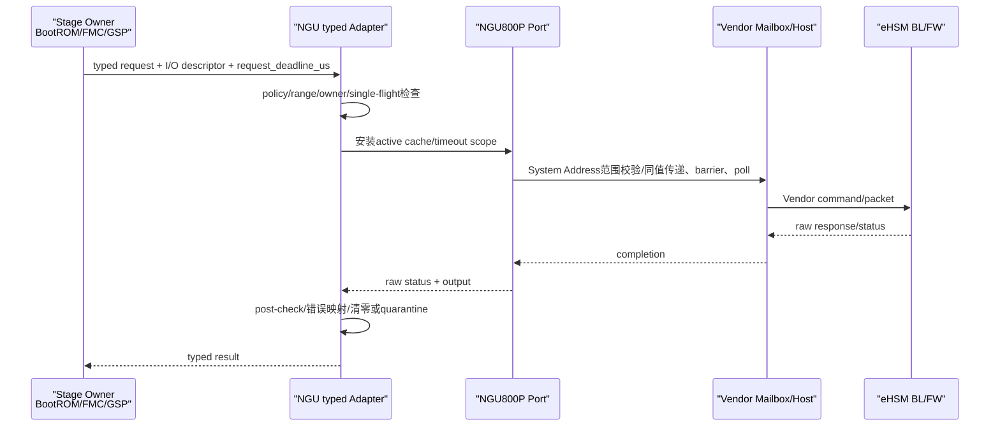

## 4.1 产品与能力验证路径

eHSM软件分为两个互相隔离的构建和执行路径：

| 路径 | 执行位置 | 目标 | 可复用内容 | 禁止内容 |
|---|---|---|---|---|
| baremetal能力验证 | 独立baremetal软件栈，运行在安全核上，不由GSP task/service承载 | 在EMU验证Vendor公开能力和接口 | Vendor command ID、序列化、response解析、合法参数构造和测试向量 | demo顶层流程、无限poll、test key、stub、printf成功和GSP产品状态机 |
| SoC产品固件 | BootROM/FMC/GSP目标模块 | 实现产品安全功能 | Host公共API、Mailbox wire格式、packet/cmd/rsp拼装、response解析和经审计的辅助函数 | demo调用顺序、demo payload、固定地址、测试密钥、OTP初始化脚本、stub和模拟成功 |

复用分类固定为：

1. **A类直接复用**：Vendor command ID、wire结构、序列化/反序列化、返回码和无平台依赖的纯辅助函数。
2. **B类格式复用、内容重建**：可复用命令格式，但输入必须来自真实启动链的Header Overlay、Code Region、typed-stage地址和策略，不能复制demo常量。
3. **C类平台重写**：MMIO、CPU/remote地址转换、共享RAM/cache、64位计时、barrier、IRQ、RAS上报、日志和构建接入。
4. **D类产品禁入**：demo `main`、stub、test key/cert/vector、无限等待、未经验证即成功、测试OTP流程和silent fallback。

Baremetal结果只证明指定EMU/Vendor版本下的能力。产品固件的caller、调用时机、Key、LCS、镜像和Release行为必须遵守本详设，不得由能力验证流程定义。

## 4.2 软件分层和职责

产品软件采用以下单向分层：

```text
BootROM / FMC / GSP typed业务调用
                |
                v
        NGU eHSM Service / Policy
                |
                v
     Vendor Host public API + mailbox.c
                |
                v
        NGU800P eHSM Port
  MMIO / address / cache / timer / RAS
                |
                v
       eHSM BL / Vendor FW / Core
```

各层职责如下：

| 层 | 必须负责 | 不得负责 |
|---|---|---|
| Stage业务层 | 选择业务操作、镜像、产品算法Profile、LCS前置策略、验证顺序和release条件 | 直接操作Vendor Mailbox寄存器；自定义wire格式；绕过service并发/timeout门禁 |
| NGU Service/Policy | typed API、stage/operation allowlist、descriptor检查、唯一Owner、deadline、错误映射、审计结果和隔离 | 修改Vendor算法语义；用业务层指针直接信任远端地址；在timeout后自动重试 |
| Vendor Host公共层 | Vendor API、command/packet/rsp格式、poll和Vendor返回码 | NGU产品策略、RAS决策、最终地址常量、Header Overlay/typed-stage后置验证 |
| NGU800P Port | direct Mailbox绑定、64位System Address范围验证、cache/barrier、单调计时、raw status/error采样、故障上报 | 猜测缺失寄存器；建立Local/System映射；把通用Mailbox伪装为eHSM Mailbox；直接reset |
| eHSM BL/Vendor FW | Vendor原生验签解密、算法和受LCS/OTP约束的命令执行 | 定义SoC Runtime release、Measurement提交和GSP产品编排 |

Vendor公共源码不得由SoC产品分支修改。若公开port/custom/build接口不能满足合同，对应产品配置必须构建失败，不能私补`mailbox.c`、`api.c`或eHSM BL业务逻辑。

## 4.3 Mailbox硬件和Vendor wire合同

### 4.3.1 direct Mailbox孔径

产品固定使用Vendor direct Mailbox，不使用通用Security Subsystem Mailbox，也不增加两者之间的协议转换wrapper。

| 项目 | 冻结值/规则 |
|---|---|
| channel数量 | 16，编号`0..15` |
| 单channel stride | `0x1000` |
| Host可访问总孔径 | 至少`16 * 0x1000 = 0x10000`字节 |
| MMIO属性 | non-cacheable、strongly ordered；不得把普通cached RAM访问规则用于寄存器 |
| channel内寄存器布局 | `s2h_info[0..1]`=`0x000/0x004`；`h2s_info[0..1]`=`0x080/0x084`；`s2h_note/h2s_note`=`0x100/0x104`；中断寄存器位于`0x110..0x12c` |
| 通知方式 | BootROM、FMC、GSP均为poll；中断路径不可用 |

产品不启用Mailbox中断，不建立IRQ与channel的映射，也不允许运行期切换通知方式。

Vendor `ehsm_mb_init()`初始化并清除全部16个channel，因此整个Vendor direct Mailbox 16-channel孔径专用于eHSM Host transport。每个stage只使用配置的`service_channel`，不得把其余channel分配给其他软件。初始化在每个stage只执行一次，并且必须先证明前一stage没有在途事务或迟到响应。平台若要求共享channel，则该平台配置不兼容本产品接口并返回`BLOCKED_BY_MAILBOX_INPUT`。

### 4.3.2 packet、command和response

Vendor wire结构保持原生格式：

| 对象 | 规范长度 | 内容 |
|---|---:|---|
| command | 160字节 | `cmd_id`、`cmd_id_inv`、`data[39]` |
| response | 20字节 | `ret_code`、`data[4]` |
| packet | Vendor定义 | command和response的两个64位remote address |

所有共享地址在NGU公共接口中固定使用`uint64_t` System Address。Host CPU pointer不得直接强转后默认可被eHSM访问；必须验证其完整范围属于baremetal权威头定义的System Address Region及本事务active descriptor。Vendor `ehsm_port_addr_to_raddr()`只做范围验证和同值返回。eHSM BL内部继续使用Vendor `SYS_SOC_MEM_BAL/BAH`和remap机制，不由SoC侧重新实现。

命令发布顺序固定为：

1. 完成typed参数、长度、范围、权限和无重叠校验；
2. 校验64位System Address属于当前active descriptor并保持数值不变；
3. 按4.9登记并维护共享cache范围；
4. 写入packet/cmd和info寄存器；
5. 完成MMIO顺序点；
6. 最后写`service_channel.s2h_note`发布Host→eHSM命令；
7. poll `h2s_info/h2s_note`响应；
8. 读取Vendor响应后执行外部output可见性处理，再返回业务层。

不得在note发布后修改本事务的packet、command、context、input或output；产品不使用eHSM流式session对象。

Vendor `mailbox.c`保持原生实现；Mailbox MMIO必须配置为non-cacheable、strongly ordered。平台PMA/MMIO合同与EMU Evidence必须证明`s2h_info[0..1]`在`s2h_note`前对eHSM可见；无法证明时Adapter初始化失败，不能用delay或重复写note掩盖。

## 4.4 eHSM状态、自检和stage driver mode

Host可见低8位状态固定解释为：

| bit | mask | 含义 |
|---:|---:|---|
| 0 | `0x01` | `hw_boot_done` |
| 1 | `0x02` | `hw_boot_err` |
| 2 | `0x04` | `bootloader_done` |
| 3 | `0x08` | `bootloader_err` |
| 4 | `0x10` | `firmware_done` |
| 5 | `0x20` | `firmware_err` |
| 6 | `0x40` | `soc_verify_done` |
| 7 | `0x80` | `soc_verify_err` |

BootROM ready门禁固定为：先保存raw status并检查error；`(status & 0x0a) != 0`立即fail-close，只有`(status & 0x05) == 0x05`且error mask为0时才允许进入Mailbox命令阶段。即必须观察`hw_boot_done`和`bootloader_done`完成，同时确认`hw_boot_err`和`bootloader_err`均未置位；不能只看到任一done位就继续。

Vendor自检位图按Bootloader定义解释：bit18/`0x0004_0000`为TRNG；bit19/`0x0008_0000`为unknown/reserved。软件必须保存raw bitmap，已知失败位按策略映射，未知位不得静默当作成功或擅自命名。

各stage模式和操作边界如下：

| Stage | driver mode | eHSM操作边界 |
|---|---|---|
| BootROM | `WAIT_AND_POLL` | 检查ready/error和自检；LCS由BootROM直接读取SoC权威源；以`check_version=0`验证FMC并使BL暂存candidate；不独立读写counter |
| FMC | `WAIT_AND_POLL` | 初始化时回传FMC expected candidate并取得BL commit proof；随后以`check_version=0`验证/加载GSP；不加载eHSM Vendor FW |
| GSP bootstrap | `WAIT_AND_POLL` | 加载eHSM Vendor FW并等待`firmware_done`且`firmware_err=0`；验证/加载PMP、RMP、MMP |
| GSP runtime | `WAIT_AND_POLL` | 通过唯一安全服务任务提供签名、随机数、hash、SPDM、调试鉴权发起和Product Operation Policy允许的通用算法服务 |

GSP runtime固定使用poll。Vendor FW未ready前不得调用仅由FW提供的命令。

## 4.5 产品Operation和三套算法Profile

eHSM Service必须能为第3章三套产品Profile提供对应原语：

1. `SHA-256 + RSA-2048/RSASSA-PSS + AES-128-CBC`；
2. `SHA-256 + ECDSA/secp256r1 + AES-128-CBC`；
3. `SM3 + SM2 + SM4-CBC`。

业务层提交的是已校验的`algorithm_profile`和typed operation，不得分别提交可自由组合的hash/sign/cipher参数。Service在调用Vendor API前验证Profile、镜像策略和provisioning一致；禁止SHA/SM、RSA/ECC/SM2、AES/SM4跨Profile混搭。

除三套Profile必需原语外，Vendor支持的其他算法只进入独立baremetal软件栈的能力/回归case，不注册为GSP产品密码服务。GSP不是Vendor全能力验证载体；只有Product Operation Policy定义了consumer、用途和安全策略的算法，才可作为GSP产品operation登记。

产品业务operation至少覆盖：

| 类别 | 典型Owner/调用者 | 产品用途 |
|---|---|---|
| ready/self-test/status | BootROM/FMC/GSP | 启动门禁和故障证据 |
| image verify/decrypt | BootROM/FMC/GSP | FMC、GSP、eHSM FW和Runtime安全加载 |
| random/hash/sign | GSP安全服务任务 | SPDM/Attestation及产品内部密码服务 |
| LCS受控命令 | GSP发起、eHSM最终裁决 | Debug/RMA等请求；GSP不替代eHSM的LCS授权 |
| 产品算法扩展 | GSP安全服务任务 | 仅承载Product Operation Policy登记的产品用途；不承载baremetal全能力验证 |

准确operation ID、stage mask、effect、timeout和RAS action由受控operation policy table表达，业务代码不得散落硬编码。

## 4.6 eHSM Adapter内部接口与静态配置合同（非制包ABI）

本节不定义固件包内容、Host wire协议或跨stage共享RAM对象，也不把下面的C结构写入Native Header Overlay。它用于约束BootROM、FMC、GSP各自编译进镜像的eHSM adapter：业务层用什么类型提交操作，adapter如何描述允许eHSM访问的buffer，怎样从只读policy取得超时和权限，以及port初始化必须检查哪些平台参数。

以下内部C类型由同一份受控定义生成；BootROM/FMC/GSP分别建立自己的只读配置实例，不在运行期互相传递该配置：

- typed request/result：说明“做什么、谁调用、执行结果是什么”；
- I/O descriptor：只描述本次允许访问的System Address、长度、方向、敏感属性和清零Owner，不承载payload副本；
- operation policy：规定operation允许的stage、最大执行时长、是否有副作用、零自动retry和RAS action；
- stage service config：绑定该stage的Mailbox base/channel、context arena、memory attribute、policy表和平台原语。

各stage不得手写raw Vendor command、地址、timeout和错误处理。符号名、字段含义和宽度均属于本章合同，必须在生成头、实现和测试中保持一致。

### Deadline与timeout的确定语义

`deadline`不是固件发布时间，也不是eHSM硬件寄存器，而是一次内部请求最晚允许继续等待的64位单调微秒绝对时刻：

1. `request_deadline_us`由可信内部caller在提交typed request时给出，约束“排队等待 + 实际执行”的总时长；GSP queue在提交Vendor命令前已经到期时，直接返回`NOT_SUBMITTED`，不触碰Mailbox，也不进入quarantine。
2. policy中的`timeout_us`是该operation允许占用eHSM的最大执行时长，不由caller放大。service开始执行时计算`start_us + timeout_us`，并以`min(request_deadline_us, start_us + timeout_us)`作为实际执行deadline；加法必须做64位溢出检查。
3. BootROM/FMC没有普通业务queue，由stage根据同一policy生成`request_deadline_us`；禁止无限poll或用循环次数代替时间。
4. Vendor命令已经发布后到达实际执行deadline，结果记为`ACCEPTANCE_UNKNOWN`并quarantine当前service/context；这与“提交前排队超时、命令从未发布”严格区分。

```c
typedef enum {
    NGU_EHSM_STAGE_BOOTROM = 0,
    NGU_EHSM_STAGE_FMC,
    NGU_EHSM_STAGE_GSP_BOOT,
    NGU_EHSM_STAGE_GSP_RUNTIME,
} ngu_ehsm_stage_t;

typedef enum {
    NGU_EHSM_SERVICE_UNINIT = 0,
    NGU_EHSM_SERVICE_READY,
    NGU_EHSM_SERVICE_ACTIVE,
    NGU_EHSM_SERVICE_QUARANTINED,
} ngu_ehsm_service_state_t;

typedef enum {
    NGU_EHSM_NOT_SUBMITTED = 0,
    NGU_EHSM_COMPLETED,
    NGU_EHSM_ACCEPTANCE_UNKNOWN,
} ngu_ehsm_acceptance_t;

typedef struct {
    uint64_t  system_addr;
    uint64_t  length;
    uint32_t  direction;
    uint32_t  contains_secret;
    uint32_t  zeroize_owner;
} ngu_ehsm_io_desc_t;
```

operation policy至少包含：

```c
typedef struct {
    uint32_t operation_id;
    uint64_t timeout_us;
    uint32_t effect_class;     /* read / verify / state-changing / irreversible */
    uint32_t auto_retry_max;   /* 固定为0 */
    uint32_t ras_action;
    uint32_t allowed_stage_mask;
} ngu_ehsm_operation_policy_t;
```

每次调用必须形成result record，至少保存`operation_id`、stage、channel、acceptance、开始时间、耗时、deadline、Vendor raw return、项目映射错误、raw HSM status/error、清零结果和RAS action。日志输出按敏感数据规则裁剪，不记录key、明文固件、签名私密材料或完整共享buffer。

port配置至少包含：

```c
typedef struct {
    ngu_ehsm_stage_t stage;
    uintptr_t mailbox_mmio_base;
    uint64_t  mailbox_mmio_size;
    uint32_t  channel_count;
    uint32_t  channel_stride;
    uintptr_t hsm_status_addr;
    uintptr_t hsm_error_addr;
    uint32_t  service_channel;
    uint64_t  context_system_addr;
    uint64_t  context_size;
    uint32_t  context_memory_attr;
    uint32_t  context_slot_count;
    uint32_t  cache_line_size;
    const ngu_ehsm_operation_policy_t *policies;
    uint32_t  policy_count;
} ngu_ehsm_service_config_t;
```

同时固定绑定`validate_system_span`、64位`time_now_us`、write/release与acquire/read fence、full-system barrier和`report_fault`平台原语。eHSM共享路径不得绑定或调用data clean/invalidate原语。C908、Mailbox packet和eHSM共享buffer统一使用baremetal权威头中的System Address；Vendor `ehsm_port_addr_to_raddr()`/`ehsm_port_raddr_to_addr()`在项目port内只允许对当前active descriptor执行64位范围校验和同值转换，不建立Local/System地址映射。所有base、size、offset和地址加法必须先做64位无溢出检查。

## 4.7 Context、Session和共享对象生命周期

匹配版本Vendor ABI的`ehsm_ctx_st`为224字节。每个stage固定：

| 项目 | 规则 |
|---|---|
| context arena | stage-local静态区域，不放普通函数栈 |
| context slot | 1个，256字节，至少64字节对齐并独占cache line |
| stage最大在途 | 1 |
| GSP全局Owner | 1个终身安全服务任务 |
| streaming session | 本版本不支持流式operation，不分配`ehsm_session_st` |
| packet/cmd/rsp | 随context保持有效，事务闭环前不得回收 |

实现必须通过C11 `_Static_assert`构建门禁验证Vendor context尺寸不大于slot、slot对齐/尺寸满足64字节隔离、System Address保持64位。Vendor版本导致context合同不匹配时构建必须失败，不能截断或继续使用不匹配的slot。Session对象不计入本版本容量。

Context arena不占用独立Mailbox RAM Region。BootROM arena位于`SEC_RAM_GSP_STATIC`低地址启动overlay，FMC arena位于`SEC_RAM_FMC_REUSE`，GSP arena位于`SEC_RAM_GSP_STATIC` data区；不另建固定pool或Firewall Region。eHSM可访问整个2 MiB安全RAM是硬件权限边界，不等于软件可忽略descriptor范围：Service仍只向eHSM暴露本次operation允许的地址、长度和方向。

Vendor BL与FW对同一`0xff06`命令使用不同结构体语义，产品层不得提供一个含糊的raw verify wrapper。接口固定拆分为：

```c
ngu_sec_status_t ngu_ehsm_bl_verify_image(
    const ngu_ehsm_bl_verify_request_t *request,
    ngu_ehsm_bl_verify_result_t *result);

ngu_sec_status_t ngu_ehsm_fw_verify_soc_image(
    const ngu_ehsm_fw_verify_request_t *request,
    ngu_ehsm_fw_verify_result_t *result);
```

前者仅在Vendor FW ready前使用，支持BL阶段type 0 boot及type 1 SoC验证语义；后者仅在FW ready后使用，只允许Vendor type 1、`boot=0`和`check_version=0`。构建门禁只断言两套结构中协议共同字段的offset/width一致，不断言总`sizeof`相等；业务层不得直接构造`0xff06`payload。

## 4.8 Service状态机和调用顺序

状态机固定为：

```text
UNINIT
  | config/address/memory/ready验证通过
  v
READY
  | acquire owner + install descriptors/deadline
  v
ACTIVE
  | completed success or bounded command error
  +------------------------------------------> READY
  |
  | timeout / unexpected busy / owner失配 /
  | response不一致 / 共享对象闭环不明
  v
QUARANTINED
  | 禁止新调用；仅平台RAS执行reset/recovery后重新启动
  +------------------------------------------> 新boot的UNINIT
```

每次调用严格执行：

1. typed参数、stage allowlist、Profile、LCS前置条件和operation policy校验；
2. 获取唯一Owner；获取失败属于本地`NOT_SUBMITTED`，不得进入Vendor层；
3. 检查ready/error、context状态和所有I/O descriptor；
4. 完成System Address同值校验、范围/方向/重叠/对齐/secret owner校验，并登记本次唯一允许的response context System Address、长度和`service_channel`；不得执行CPU/remote或Local/System地址转换；
5. 安装唯一active cache scope、timeout scope和response-address guard；
6. 将状态置为`ACTIVE`后调用Vendor API；
7. 保存raw Vendor返回、raw status/error和耗时；
8. 按4.9完成output可见性和敏感对象处理；
9. 只有能证明事务闭环时才清除scope并回到`READY`；
10. timeout、acceptance unknown、response address不匹配或迟到响应风险进入`QUARANTINED`，保留context/buffer，禁止复用。

所有本地preflight失败必须证明`NOT_SUBMITTED`且没有写note、没有Vendor副作用。Vendor返回错误不自动等同于“未执行”，必须结合effect class和acceptance状态处理。

`ehsm_port_raddr_to_addr()`只能把response地址映射到本事务已登记的active context地址范围。任一地址、长度或channel不匹配时，它必须返回具有无效magic的固定安全sentinel，并设置sticky `response_addr_mismatch`；Vendor callback应在无效magic处停止，不能解引用由响应选择的任意内存。NGU wrapper在接受任何Vendor result前检查sticky fault，命中即丢弃业务结果并把Service置为`QUARANTINED`。协议层校验不能替代本地active-context约束。

## 4.9 Cache、PMA、barrier和共享内存规则

Mailbox MMIO与共享RAM是两个不同属性域：

1. Mailbox寄存器必须按non-cacheable/strongly ordered访问。
2. eHSM访问SoC RAM时不携带可由C908软件依赖的non-cacheable属性，不能假设自动coherent。
3. C908 cache line固定为64字节；cache range原语会扩展到完整line，因此共享对象首尾不得与CPU同时使用的普通对象共line。
4. 发命令前，逐项验证packet/cmd/input/context/rsp/output descriptor、64字节cache-line独占和最终PMA属性；`NON_CACHEABLE`与`HARDWARE_COHERENT`均不执行data clean/invalidate，只执行write/release barrier后doorbell。
5. 在途期间CPU、日志、调试器和另一个任务不得读取、写入、清零或cache维护当前共享范围。
6. Vendor公共poll路径只在发送前调用无参数cache hook，响应前没有第二个Vendor hook。该hook只执行write/release barrier。Vendor成功返回后，NGU wrapper对外部output执行acquire/read fence后发布，不执行data invalidate；Vendor内部rsp可见性依赖PMA属性、在途no-touch和MMIO顺序。
7. Context arena只允许使用`NON_CACHEABLE`或`HARDWARE_COHERENT`属性；目标平台必须选择并验证其中一种。若任一属性都不能证明第6项成立，对应产品构建必须失败，不得修改Vendor公共poll代码增加私有hook。

adapter在进入Vendor API前登记本事务全部active descriptor；Vendor无参数cache hook只能维护该scope。scope为空、嵌套、Owner不匹配、descriptor越界或出现未登记共享对象时立即fail-close。

NGU port的critical section必须在每个hart第一次进入时保存原MIE状态并维护per-hart nesting depth；嵌套进入不得覆盖保存值，只有最后一次退出才按原值恢复。原来已关闭MIE时退出后仍保持关闭。depth下溢、跨hart/Owner退出或状态损坏均为`INTERNAL`错误并fail-close，禁止照搬“退出时无条件开中断”的示例实现。

目标平台必须为2 MiB安全RAM和context arena生成唯一PMA/PBMT配置，取值只能为`NON_CACHEABLE`或已证明的`HARDWARE_COHERENT`。C908 linker固定使用System Address。未提供属性及可见性Evidence时，production初始化必须返回`BLOCKED_BY_PMA_INPUT`。

## 4.10 Deadline、retry、busy和迟到响应

所有poll都必须有界。NGU800P port使用64位单调微秒时间源，以无符号差值判断deadline；不得使用Vendor样例中的恒false timeout或无界循环。

由于Vendor `ehsm_port_is_timeout()`不带operation/deadline参数，Service在进入Vendor API前安装唯一active timeout scope，port只读取该scope。单在途是该机制成立的前提。

固定规则：

| 情况 | acceptance | retry | 后续状态 |
|---|---|---|---|
| 本地preflight失败、Owner未取得 | `NOT_SUBMITTED` | 上层修正输入后可重新发起新事务 | `READY` |
| Vendor明确完成并返回成功/命令错误 | `COMPLETED` | 默认0；仅新策略明确允许才可新增 | `READY`或按stage失败 |
| `EHSM_ERR_TIMEOUT` | `ACCEPTANCE_UNKNOWN` | 0 | `QUARANTINED` |
| 单在途前提下出现unexpected busy | 不可证明 | 0 | `QUARANTINED` |
| response/context/Owner不一致 | 不可证明 | 0 | `QUARANTINED` |

“等待ready/status位直到同一deadline”是一次调用内的poll，不是自动retry。Vendor API无法证明timeout发生在note发布前还是发布后，也没有transaction sequence、cancel或abort，因此timeout后一律不得清零、覆盖、释放或复用context/shared buffer；产品不使用session对象。迟到响应只能由reset/recovery消除生命周期歧义。

各operation的`timeout_us`和RAS动作必须来自受控policy table。目标构建未提供具体数值时必须构建失败或保持对应operation不可达。

## 4.11 GSP终身安全服务任务

GSP从bootstrap到runtime由同一个最高优先级`security_service_task`作为唯一eHSM Owner：

1. 它必须是GSP scheduler启动后的第一个最高优先级产品任务。
2. bootstrap阶段由它加载eHSM Vendor FW、等待FW ready并完成Runtime镜像验证/加载。
3. 进入runtime后任务继续存在，不做版本化Handoff，也不把context/Owner转交给普通任务。
4. 其他模块只能通过typed queue/service API提交请求；不得直接调用Vendor API、持有Vendor context或访问Mailbox。
5. 队列按安全关键性和启动依赖设置优先级；低优先级通用算法服务不得阻塞启动、SPDM或故障处理。
6. 任务只串行处理一条eHSM事务；队列并发不等于硬件并发。
7. Service进入`QUARANTINED`后拒绝所有新请求，保存故障记录并上报RAS；仅新boot或平台RAS执行恢复后可重新初始化。

BootROM和FMC按stage拥有独立静态context和顺序生命周期，不与GSP共享运行期Owner，也不通过Handoff传递context。

## 4.12 错误、RAS、reset和清零

security软件只负责检测、保存证据、阻断release、撤销访问和上报，不自行决定SoC reset。reset方式由RAS策略决定。

早期BootROM/FMC故障顺序固定为：

1. 停止发布新Mailbox请求并释放尚未提交的本地Owner；
2. 写入静态early error record，保存stage、operation、raw Vendor码、raw status/error、acceptance和时间；
3. 对能安全清零且不属于acceptance unknown的本地secret执行清零；
4. 撤销或保持关闭后续镜像/Runtime release和Firewall权限；
5. 在有界deadline内向RAS上报；
6. RAS未ready或上报超时则关闭普通中断并进入无限WFI fail-stop循环，只允许平台Reset/NMI退出；不继续启动，也不由security代码直接reset。

timeout/acceptance unknown下，可能仍被eHSM访问的context/input/output不得立即清零；它们保持隔离直到reset/recovery。普通已完成事务按`zeroize_owner`明确由caller或service清零，并记录清零结果。产品不使用session对象。

GSP runtime中，单个PMP/RMP/MMP验证失败只隔离对应Runtime，不释放其PC/Firewall权限，不影响已验证且无依赖关系的其他Runtime；eHSM Service自身quarantine属于共享安全服务故障，影响所有新的eHSM请求并上报RAS。

## 4.13 目标代码模块和构建边界

目标模块划分如下：

| 模块 | 职责 |
|---|---|
| `components/security/include/security/ehsm_service.h` | typed产品API、公共enum/result |
| `components/security/src/ehsm_service.c` | 唯一Owner、状态机、调用guard和结果记录 |
| `components/security/src/ehsm_policy.c` | operation/stage/Profile/deadline/RAS policy table |
| `components/security/include/security/ehsm_port_cfg.h` | 受控平台配置和构建断言 |
| `components/security/src/ehsm_port_ngu800p.c` | MMIO、地址转换、cache、timer、raw status/error和RAS hook |
| `components/security/src/ehsm_error.c` | Vendor错误到项目错误/RAS的映射 |
| BootROM/FMC/GSP各stage文件 | typed业务编排，不直接调用Mailbox |

Vendor Host公共代码以独立source list接入并保持原文件不变；port/custom/build文件由NGU800P提供。生产构建必须排除demo、stub、test key/vector、test OTP和模拟provider，并验证Makefile/CDK实际source list、map和符号表一致。

Stub只能存在于显式test-only target，用于Host单元测试adapter失败路径；EMU和产品目标不允许链接stub、模拟成功或fallback provider。

## 4.14 验证和测试要求

必须实现以下可追溯测试：

1. 16个channel direct寄存器offset和总孔径fake-MMIO测试；证明4 KiB通用Mailbox未被调用。
2. `cmd_id_inv`、packet两个64位System Address、长度/对齐/active descriptor范围和溢出负向测试。
3. ready组合：done未齐、每个error位、error与done同时出现、raw status保存。
4. 自检bit18按TRNG处理、bit19保持unknown/reserved并保存raw bitmap。
5. BootROM/FMC/GSP均为poll；不存在运行期隐式interrupt切换。
6. context尺寸、256字节slot、64字节对齐、cache-line独占和单在途构建/单元测试。
7. PMA属性门禁、data clean/invalidate零调用、在途no-touch和外部output发布前barrier的spy/fake测试。
8. active cache/timeout/response-address scope为空、嵌套或Owner失配时fail-close；伪造response地址只能命中sentinel并使Service quarantine。
9. preflight失败证明note未发布且acceptance为`NOT_SUBMITTED`。
10. command完成错误映射、timeout、unexpected busy和response不一致进入正确状态。
11. timeout后context/buffer不可复用、不可清零、不可自动retry；新请求被quarantine拒绝。
12. GSP所有模块必须经唯一安全服务任务，静态扫描/链接测试证明不存在旁路Vendor API和Mailbox访问。
13. RAS ready与未ready路径；未ready有界等待后关闭普通中断并进入无限WFI fail-stop循环，security不直接reset。
14. 三套算法Profile逐套成功和混搭/未知/未provision拒绝；其他Vendor算法只可从baremetal能力case进入。
15. EMU验证真实MMIO、`s2h_info`先于`s2h_note`可见、64位System Address同值传递、PMA一致性、各operation deadline、late response和逐Runtime隔离。
16. critical section覆盖原MIE开/关、嵌套、下溢和跨hart/Owner退出；最后退出只能恢复进入前状态。

Baremetal能力清单与产品测试分开编号和追溯。Vendor版本变化影响wire、尺寸、算法、返回码或行为时，必须重新执行对应case并生成新Evidence。

## 4.15 平台配置与停止条件

| 配置 | 强制要求 | 缺失或不满足时行为 |
|---|---|---|
| Vendor direct aperture | 生成准确base、size、domain和Host status/error offset/语义 | 禁止真实MMIO构建 |
| PMA/cache/coherence | 为2 MiB RAM和context arena选择并证明`NON_CACHEABLE`或`HARDWARE_COHERENT` | Production初始化返回`BLOCKED_BY_PMA_INPUT` |
| Stage service channel | 每stage配置唯一channel和one-shot arena I/O上限 | 对应stage构建失败 |
| Operation deadline | 每个operation配置`timeout_us`和RAS action | 对应operation不可达 |
| RAS绑定 | 配置通知通道、early record、ready条件和deadline | 早期失败进入无限WFI fail-stop |
| Provisioning matrix | 配置设备/stage/Profile/key/board/LCS行 | 未匹配请求默认拒绝 |
| IRQ模式 | 本版本固定poll | 任何IRQ模式配置均构建失败 |

不得使用猜测地址、默认PMA、修改Vendor公共代码、通用Mailbox wrapper或stub绕过上述门禁。
# 第5章 2 MiB安全RAM、System Address、Firewall与清零

本章定义2 MiB安全SRAM的固定分区、System Address、生命周期复用、Firewall/PMA、Owner转换和清零合同。C908、Native Header Overlay、loader、linker和eHSM共享descriptor统一使用baremetal System Address，不建立Local Address到System Address的产品映射。

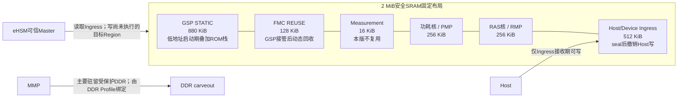

## 5.1 物理RAM和唯一System Address

2 MiB安全RAM的唯一产品软件地址来自baremetal权威头：

| 权威定义 | base | size | end | 产品规则 |
|---|---:|---:|---:|---|
| `MANAGEMENT_NOC_S9_SRAM_BASE/SIZE` | `0x1010_0500_0000` | `0x0020_0000` | `0x1010_051F_FFFF` | C908取指/访问、Header Overlay、loader、linker、Mailbox共享descriptor和跨master接口统一使用 |

`config_bus_address_mapping.h`或生成头中出现的remap/local值不是本产品C908软件地址，不得进入Header Overlay、公共ABI、linker、loader、测试Expected或运行期换算。eHSM BL内部既有`SYS_SOC_MEM_BAL/BAH`和remap属于Vendor内部实现，SoC侧不复制、不反向推导映射关系。

所有减法、加法和`system_addr + length`在64位无符号域先做overflow检查。`length=0`、跨越2 MiB总范围、结果不属于目标Region或权限不匹配都拒绝。业务层只传System Address或`Region ID + offset + length`形成的受控buffer handle；NGU800P port对Vendor remote-address回调执行active descriptor范围校验后保持地址值不变。

## 5.2 固定物理拓扑和生命周期别名

以`B = 0x1010_0500_0000`为基址，产品布局固定如下；offset和size必须由统一layout源生成：

```text
低地址
B+0x000000  +----------------------------------+
            | SEC_RAM_GSP_STATIC      880 KiB |
            | BootROM阶段：低地址栈/工作区overlay|
            | FMC阶段：GSP完整包原地解密/搬移    |
            | GSP阶段：text/data/BSS/stack/heap |
B+0x0DC000  +----------------------------------+
            | SEC_RAM_FMC_REUSE       128 KiB |
            | FMC运行；GSP接管后清零并动态回收   |
B+0x0FC000  +----------------------------------+
            | SEC_RAM_MEASUREMENT      16 KiB |
            | 本版全部保留，不作证书/scratch复用 |
B+0x100000  +----------------------------------+
            | SEC_RAM_PMP             256 KiB |
            | 功耗核最终运行区                  |
B+0x140000  +----------------------------------+
            | SEC_RAM_RMP             256 KiB |
            | RAS核最终运行区                   |
B+0x180000  +----------------------------------+
            | SEC_RAM_HOST_INGRESS    512 KiB |
            | Host/Device完整密文包共享窗口      |
B+0x200000  +----------------------------------+
高地址
```

| Region ID | 固定System Address | 大小 | 必须包含/边界 |
|---|---:|---:|---|
| `SEC_RAM_GSP_STATIC` | `0x1010_0500_0000～0x1010_050D_BFFF` | 880 KiB | GSP在FMC release前必须存在的text/rodata/data/BSS、启动栈、协议静态对象和GSP `EHSM_CONTEXT_ARENA`；BootROM退出前低地址可作启动overlay |
| `SEC_RAM_FMC_REUSE` | `0x1010_050D_C000～0x1010_050F_BFFF` | 128 KiB | FMC image/data/BSS/stack/arena；GSP entry后撤权、清零、回读成功才加入GSP动态heap/buffer池 |
| `SEC_RAM_MEASUREMENT` | `0x1010_050F_C000～0x1010_050F_FFFF` | 16 KiB | Measurement Table和commit/integrity metadata；未使用尾部仍保留，不得分配给GSP、证书或普通scratch |
| `SEC_RAM_PMP` | `0x1010_0510_0000～0x1010_0513_FFFF` | 256 KiB | 功耗核/PMP最终code/data/BSS/stack/heap；独立Measurement、release和权限 |
| `SEC_RAM_RMP` | `0x1010_0514_0000～0x1010_0517_FFFF` | 256 KiB | RAS核/RMP最终code/data/BSS/stack/heap；独立Measurement、release和权限 |
| `SEC_RAM_HOST_INGRESS` | `0x1010_0518_0000～0x1010_051F_FFFF` | 512 KiB | Host下发的完整加密/签名package；Host唯一可写窗口，submit后seal并撤销写 |

`SEC_RAM_BOOTROM_OVERLAY`和`SEC_RAM_GSP_DYNAMIC_RECLAIM`是生命周期别名，不增加物理容量：

- BootROM代码位于ROM；主栈8 KiB和异常栈8 KiB的存储从`SEC_RAM_GSP_STATIC`低地址开始，SP指向各栈顶。BootROM data/BSS/context也必须位于该区并由link map证明不越过`+0x0DC000`。
- BootROM退出后FMC可覆盖旧BootROM stack/workspace并在`SEC_RAM_GSP_STATIC`加载GSP。
- `SEC_RAM_FMC_REUSE`在FMC活跃期间绝不能被GSP静态段、BSS或栈占用；GSP接管后只允许作为动态内存回收。

以下对象不分配独立永久SRAM Region：

- `SEC_RAM_PLAINTEXT`：plaintext是尚未执行目标Region的`LOADER_RW_NX`生命周期状态，不是独立物理区。
- `SEC_RAM_MMP`：MMP主要驻留受保护DDR；其DDR地址、权限、eHSM可达性和release由MMP DDR Profile定义。
- `SEC_RAM_EHSM_MAILBOX`：Mailbox寄存器不在本RAM，context放入各stage固定arena。
- `SEC_RAM_SPDM_WORK`、MCTP或证书工作区：计入GSP静态区或FMC回收后的GSP动态池，绝不能借用Measurement。
- OMP、独立永久错误区或跨权限Region的通用heap。

## 5.3 固定容量门禁

物理Region总和已经冻结：

```text
880 KiB GSP_STATIC
+ 128 KiB FMC_REUSE
+  16 KiB MEASUREMENT
+ 256 KiB PMP
+ 256 KiB RMP
+ 512 KiB HOST_INGRESS
= 2048 KiB
```

release构建必须分别满足以下上限；任何一项越界都使构建/制包失败，不能借用相邻Region：

| 对象 | package门限 | load/runtime门限 | 额外约束 |
|---|---:|---:|---|
| FMC | `package_size <= 128 KiB` | image/data/BSS/stack/arena总峰值`<=128 KiB` | BootROM活跃栈不得被FMC加载覆盖 |
| GSP | `package_size <= 512 KiB` | FMC release前静态加载、启动BSS/stack`<=880 KiB`；接管后总可用`<=1008 KiB` | 后128 KiB只能是回收后的heap/动态buffer，不得放静态段 |
| GSP DICE动态证明 | 不适用 | X.509/TCB/KDF/Report新增工作峰值`<=12 KiB`，包含在上述GSP上限内 | 动态Leaf DER`<=4096 B`；不得借用Measurement |
| PMP | `package_size <= 256 KiB` | code/data/BSS/stack/heap总和`<=256 KiB` | 完整包必须能在目标区内原地展开和搬移 |
| RMP | `package_size <= 256 KiB` | code/data/BSS/stack/heap总和`<=256 KiB` | 同PMP |
| Measurement | 不适用 | `256 + fw_entry_count × 128 <= 16 KiB` | 物理容量最多容纳126项；产品实际`max_fw_entries`按拓扑生成 |
| Host ingress | 最大完整包512 KiB | 不执行 | package仅包含1024B Vendor Header和`Code_Size`字节Code Region；CBC零对齐已计入`Code_Size` |

按固定包格式，目标Region能容纳的Code Region还必须满足：

```text
package_size = 1024 + Code_Size
package_size <= min(HOST_INGRESS_SIZE, target_region_size)
```

`Code_Size`由已认证Native Header给出，包含发布工具为CBC对齐补入的0～15字节零，不存在第二个`payload_size`或设备端去padding。因此PMP/RMP的Code Region理论上限为`256 KiB - 1024 B = 261120 B`，但最终允许值还要同时扣除/满足各自BSS、stack和heap的linker footprint，不能把理论包上限当作可发布镜像上限。FMC同理；GSP package受512 KiB ingress限制，而预release静态footprint受880 KiB限制。

容量Evidence必须来自release map和实测watermark：BootROM栈/data/BSS/context、FMC全峰值、GSP各task stack和heap高水位、SPDM/MCTP、DICE动态证书/Report 12 KiB门禁、PMP/RMP最终footprint、三套算法Profile最大包，以及Firewall/PMA对齐要求。

任何对象超过固定Region时构建失败。禁止覆盖活跃FMC/GSP/PMP/RMP、借用Measurement、扩大Host权限、允许RWX或省略源/目标双摘要。

## 5.4 单一布局描述和生成物

布局唯一源固定为`components/security/config/security_ram_layout.yaml`，schema固定为v2。它是构建输入，不是运行期共享/wire ABI；BootROM/FMC/GSP不得从RAM或Host解析第二份可变布局结构，也不维护`magic/abi_major/minor/layout_size/entry_size`兼容分支。schema v2未知字段、缺字段、重复Region和未知枚举一律使生成失败。

| 字段组 | 必须字段/语义 |
|---|---|
| Schema/追溯 | `schema_version=2`、`layout_id`、`release_profile_id`、配置输入版本 |
| 总体 | `system_base_symbol=MANAGEMENT_NOC_S9_SRAM_BASE`、`total_size_symbol=MANAGEMENT_NOC_S9_SRAM_SIZE`、`firewall_granule`；不复制权威数值 |
| Region身份 | `region_id`、`offset`、`size`、`alignment`、backing/overlay关系 |
| 权限 | owner、reader/writer/master mask、execute、W^X、Host/eHSM例外 |
| 生命周期 | current state、generation、transition owner、commit/valid |
| 平台映射 | `firewall_profile`、CPU PMP/MMU profile、memory/cache attribute |
| 清零 | clear trigger、clear owner、method/profile、completion状态 |
| 生成追溯 | 生成器版本、canonical YAML SHA-256、layout build ID、全部生成物hash |

布局条目必须满足：

1. `offset + size`无溢出且不超过2 MiB；
2. 除显式、互斥的BootROM低地址overlay和`SEC_RAM_FMC_REUSE -> GSP dynamic pool`生命周期别名外，任意两个物理Region不得重叠；
3. base、size和offset满足实际Firewall及cache-line对齐；
4. 每个Region具有唯一稳定ID，逻辑ID不随一次构建的绝对地址变化；
5. overlay的两个生命周期状态不可同时为active；
6. 总体未覆盖空洞自动生成deny/guard条目，而不是默认可访问。

同一受控布局源生成：

- BootROM/FMC/GSP/PMP/RMP linker memory fragment，以及独立的MMP受保护DDR Profile；
- Header Overlay/packager允许的Region、地址和最大尺寸；
- loader System Address范围表；
- Firewall/PMP/MMU配置表；
- Measurement中允许的load/entry范围；
- Host/baremetal/EMU静态检查和Expected。

禁止在多个仓库、C文件、linker和测试脚本中各自手写地址。发布时必须记录布局源hash及所有生成物hash；手工修改生成物应使构建失败。

## 5.5 权限矩阵和信任边界

`W(load)`只在loader窗口有效；`W(host)`只在Host接收窗口有效，seal后撤销。eHSM `full`是硬件信任边界定义的可信master例外，不代表软件command可传任意地址。

| Region | BootROM/FMC | GSP | eHSM | Host/Host DMA | 目标Runtime | RAS |
|---|---|---|---|---|---|---|
| GSP STATIC | BootROM早期stack/workspace；FMC `W(load)`，release后撤销 | code RX、data/stack/heap RW/NX | full | deny | deny | 受控诊断读 |
| FMC REUSE | FMC code RX、data/stack RW/NX | entry后先deny/clear/readback，再作为动态RW/NX池 | full | deny | deny | 受控诊断读 |
| MEASUREMENT | 当前stage按commit协议受控写 | 最终提交前受控写、提交后只读 | full | deny | 协议化只读结果，不直接映射 | 受控诊断读 |
| PMP | 当前loader `W(load)` | 加载期编排，release后撤销写 | full | deny | PMP code RX、data/stack RW/NX | 受控诊断读 |
| RMP | 当前loader `W(load)` | 加载期编排，release后撤销写 | full | deny | RMP code RX、data/stack RW/NX | 受控诊断读 |
| HOST INGRESS | 受控读 | 受控读 | full | `W(host)`仅接收期 | deny | 默认deny |
| MMP DDR | 仅经MMP DDR Profile授权的loader | 加载编排，release后撤销写 | 按Profile验证可达范围 | deny | MMP最终RX/RW-NX | 受控诊断读 |

Measurement虽位于前1 MiB末尾，但不是GSP可分配内存；GSP/FMC必须通过独立Region ID和commit API访问。若顶层Firewall无法表达16 KiB边界，必须由CPU PMP/MMU或更细粒度硬件形成等效保护；无法形成等效保护时初始化返回`BLOCKED_BY_FIREWALL_INPUT`，不得把Measurement并入普通GSP heap。

eHSM可访问整个2 MiB，使eHSM硬件/FW成为该内存所有资产的共同TCB。Service仍必须验证当前operation的Region、offset、length、direction、domain和生命周期，只登记必要descriptor；全aperture不能作为越界或任意DMA的理由。

## 5.6 Owner转换协议

所有Region转换通过唯一platform/layout service执行，业务代码不得直接写Firewall。转换事务至少包含：

1. 获取布局锁并验证`region_id`、当前state、Owner和generation；
2. 阻止新请求，等待已知可闭环的CPU/DMA使用结束；存在acceptance unknown时转`QUARANTINED`而不是继续；
3. 撤销旧Owner和外部master权限，eHSM full-aperture硬件例外保持不变；
4. 执行full-system barrier；`NON_CACHEABLE`与`HARDWARE_COHERENT`两个候选属性下均不执行data clean/invalidate；
5. 根据clear policy完成清零；不得清零仍可能被eHSM迟到响应访问的对象；
6. 配置新的Firewall及CPU PMP/MMU属性；
7. readback并验证base、limit、master、R/W/X、lock和错误状态；
8. 更新Region state和generation，最后提交`valid/commit`；
9. 发布新Owner；若是执行目标，还必须满足Measurement和release门禁后才释放PC/reset。

任一步失败都不得回滚成“假定旧配置仍安全”。实现应尝试收敛到deny/`QUARANTINED`，保存raw配置和失败步骤，上报RAS。security软件不直接reset。

## 5.7 Host下发、解密和加载生命周期

Host ingress状态机：

```text
DENY
  -> HOST_WRITABLE
  -> SEALED
  -> EHSM_READING
  -> CONSUMED
  -> ZEROIZING
  -> DENY
```

1. 只有`HOST_WRITABLE`允许Host DMA写，其他Region始终拒绝Host写。
2. submit时固定`request_id/generation/length`，检查package范围，撤销Host写并readback；执行write/release barrier后用`NGU_DIGEST_SHA256`计算完整package 32字节seal digest，verify前复核generation/length/digest，全部一致才进入`SEALED`。两种允许的PMA配置均不执行data clean/invalidate；seal digest只检测TOCTOU，不替代Vendor认证。
3. seal后Host再次写必须被硬件阻断并形成安全错误；不能只依赖软件标志防TOCTOU。
4. eHSM verify/decrypt只接收已seal的descriptor。
5. request成功、确定失败或被新generation替代后清零ingress；timeout/acceptance unknown按第4章进入quarantine，不能提前清零或复用。

本版没有独立plaintext物理Region。解密明文只存在于当前尚未运行的目标Region，其状态机为：

```text
TARGET_DENY_NX
  -> TARGET_EHSM_WRITE_NX
  -> AUTHENTICATED_PACKAGE_READY_NX
  -> SOURCE_DIGEST_COMPLETE_NX
  -> OVERLAP_MOVE_COMPLETE_NX
  -> TARGET_DIGEST_VERIFIED_NX
  -> MEASUREMENT_COMMITTED_NX
  -> RX_RELEASED
```

1. Host永远不能访问FMC/GSP/PMP/RMP目标Region；Host ingress与eHSM output必须完全不重叠，input/output别名继续禁止。
2. 只有尚未执行、CPU/reset已阻断、权限为`LOADER_RW_NX`且容量不小于完整`package_size`的目标Region才可作为output。任何活跃FMC、GSP、PMP或RMP Region禁止成为新请求output。
3. eHSM把`Header[1024] || Code[Code_Size]`完整输出到受信stage固定的`target_base`。Vendor成功并确认不再访问output后，loader复验稳定Header、偏移1008的`load_addr`、偏移1016的Header CRC、偏移1020的零reserved、counter、地址和长度，并把后续必要元数据复制到当前stage私有小结构。Header中的`load_addr`必须精确等于本次typed stage固定目标；PASS前的Header和CRC只可作边界预检，不可授权地址。
4. loader先对`target_base + 1024`处的源Code Region计算受信Profile摘要；摘要完成前不得写入任何源Code字节。
5. loader必须调用经过审计的重叠安全搬移：`memmove(target_base, target_base + 1024, Code_Size)`。由于目标低于源，禁止用重叠行为未定义的`memcpy`或手写错误方向循环。
6. 搬移后清零旧Header尾部和目标BSS，从`target_base`回读`Code_Size`重算同算法摘要并常量时间比较。CBC零对齐属于Code Region，不另行剥离。只有源/目标摘要一致，才执行write/release、`fence.i`、Measurement和权限切换；Measurement的`entry_addr`固定记录同一`load_addr`。
7. 部分解密、后置校验、搬移或摘要失败时，保持目标NX并清零已确认不再被eHSM访问的完整写入范围。timeout/acceptance unknown时目标Region与context一起进入`QUARANTINED`，不得清零、执行或复用。

执行Region状态机：

```text
DENY
  -> LOADER_RW_NX
  -> LOAD_COMPLETE_NX
  -> CACHE_FENCE_COMPLETE_NX
  -> MEASUREMENT_COMMITTED_NX
  -> RX_RELEASED
```

`RX_RELEASED`是唯一允许目标CPU取指的状态。release前最后一次复验Region generation、entry范围、Measurement commit、rollback counter、Firewall/PMP配置和loader写权限已撤销。运行期间禁止自修改；更新必须由新request进入新的受控加载状态。

## 5.8 BootROM低地址overlay与FMC/GSP复用

BootROM固化代码本体不占本2 MiB。BootROM栈/工作区位于`SEC_RAM_GSP_STATIC`低地址overlay，FMC固定运行在`SEC_RAM_FMC_REUSE`；二者和GSP按阶段转换：

```text
POR / new boot
  -> BOOTROM_ACTIVE（低地址16 KiB主栈/异常栈，GSP尚不存在）
  -> FMC_LOADED_AT_0x0DC000（不得覆盖BootROM活跃栈）
  -> FMC_ACTIVE（BootROM停止使用低地址stack/workspace）
  -> FMC_ZEROIZES_GSP_TARGET
  -> GSP_PACKAGE_IN_PLACE_LOAD（只使用前880 KiB）
  -> GSP_RELEASED（FMC停止使用128 KiB复用区）
  -> GSP_ZEROIZES_FMC_REUSE
  -> GSP_DYNAMIC_POOL_EXTENDED（增加128 KiB）
```

约束如下：

1. BootROM主栈和异常栈存储从`B+0`开始，当前各8 KiB，SP指向对应栈顶；BootROM data/BSS/context也必须低于`B+0x0DC000`。FMC加载不得覆盖BootROM仍活跃的栈或返回链。
2. FMC切换到`B+0x0DC000～B+0x0FBFFF`内的自身栈后，才可清零旧BootROM-exclusive区域并把完整GSP包输出到`B+0`。
3. FMC release GSP前，GSP静态加载结果、启动BSS和启动栈必须完全结束于`B+0x0DC000`之前；FMC/GSP所需跨stage事实只提交到Measurement/统一错误机制，不新增Handoff结构。
4. GSP entry后使用前880 KiB内自身栈，首先撤销FMC旧执行/写权限；确认FMC及其eHSM transaction已闭环后，清零并回读整个128 KiB `SEC_RAM_FMC_REUSE`。
5. 只有上述动作完成后，GSP allocator才可把这128 KiB登记为动态heap/buffer arena；GSP linker不得把text/rodata/data/BSS、初始栈或启动前必须存在的静态对象放入该区。
6. Warm reset、局部reset或GSP重启不能假定overlay已清零；每个新boot instance都从untrusted/deny状态重新建立权限和generation。

## 5.9 Firewall、CPU PMP/MMU与PMA分工

三类机制不得混为一谈：

| 机制 | 负责 | 不负责 |
|---|---|---|
| SoC Firewall/IOPMP | master到Region的访问控制、Host隔离、Runtime间隔离、eHSM full-aperture例外 | C908 cacheability；粗窗口内的全部code/data细分 |
| CPU PMP/MMU/更细Firewall | C908执行/读写权限、GSP和Runtime内部W^X、必要的Measurement写边界 | eHSM/Host等外部master的全部访问 |
| PMA/PBMT/cache配置 | memory type、cacheability、coherence和共享可见性 | 业务Owner、release状态和完整性 |

Power-on和每个新boot instance默认deny；BootROM只打开自身当前步骤所需最小范围。Firewall配置必须有readback，实际硬件支持时在最终Owner稳定后lock。reset后的默认值、保留行为和重新配置Owner必须由RTL/RAS资料确认，不能假定warm reset保持或清除。

若Firewall窗口不足，必须优先保留Host ingress、Measurement、执行区和各Runtime边界；禁止扩大Host窗口或允许RWX。硬件无法表达本章边界时，产品初始化返回`BLOCKED_BY_FIREWALL_INPUT`。

### 5.9.1 Firewall UserId、authority和软件编码合同

Firewall实例base、CSR符号、reset状态、Region默认表、粒度、master ID和lock语义必须由RTL Firewall Profile生成。Profile完整性校验失败时，真实MMIO初始化返回`BLOCKED_BY_FIREWALL_INPUT`。UserId与authority编码固定如下。

4-bit UserId固定分为die位`userid[3]`和低3位master类型。`0x0/0x8` reserved；其余映射为RAS=`0x1/0x9`、管理MCU=`0x2/0xA`、Codec MCU=`0x3/0xB`、功耗MCU=`0x4/0xC`、Host/PCIe RAM=`0x5/0xD`、管理/TOP NOC DMA=`0x6/0xE`、eHSM=`0x7/0xF`。

authority压缩位图按每类master的`die0 write, die0 read, die1 write, die1 read`排列。软件只允许从[firewall-userid-authority-map.yaml](../../requirements/firewall-userid-authority-map.yaml)生成常量，并执行以下检查：

```c
if ((userid & 0x7u) == 0u) {
    return FW_ERR_RESERVED_USERID;
}
write_bit = 4u * ((userid & 0x7u) - 1u) + 2u * ((userid >> 3) & 1u);
read_bit = write_bit + 1u;
if ((authority & 0xF0000000u) != 0u) {
    return FW_ERR_RESERVED_AUTHORITY_BITS;
}
```

双die读写掩码为RAS `0x0000000F`、管理MCU `0x000000F0`、Codec `0x00000F00`、功耗MCU `0x0000F000`、Host `0x000F0000`、DMA `0x00F00000`、eHSM `0x0F000000`。调用处禁止手写bit号或从UserId直接执行`2*userid`映射。

配置API至少分为`validate_policy`、`program_region`、`readback_verify`、`enable_check`、`read_error`和`clear_error`。量产顺序固定为：隔离请求源→读取实际reset状态→验证48-bit范围/端点/不重叠/authority→写地址与安全属性→写authority→读回→清旧错误→逐Region enable→最后`check_en=1`→解除隔离。错误时不得扩大authority、使用R5全放行或关闭检查继续启动。

Hide只改变TNUI表观响应；安全成功必须以Slave真实接收/副作用和无错误锁存共同判定。错误快照按low32/high16、R/W、UserId、Region状态读取并结构化记录，之后写1清除并readback；快照读取与清除在全局锁内作为不可分割诊断事务。RTL Firewall Profile必须定义实例base、CSR符号、48-bit高地址与安全属性字段、reset值、R1～R5默认地址、master名称、bit字段、lock/retention及burst逐beat语义；任一必需项缺失时禁止编译真实MMIO路径。

### 5.9.2 SEC_CFG状态观察、寄存器读取和Debug配置合同

SEC_CFG架构、接口和机读表分别见[SEC_CFG安全状态观察架构](../03-architecture/sec-cfg-status-observation.md)、[SEC_CFG寄存器与软件接口](../04-interfaces/sec-cfg-register-interface.md)和[SEC_CFG寄存器机读表](../../requirements/sec-cfg-register-map.yaml)。SEC_CFG base、size和map-valid必须来自RTL生成头；地址为0、map-valid为0或size不匹配时，真实MMIO路径返回`BLOCKED_BY_SEC_CFG_INPUT`。

寄存器分为：`hsm_status0/1@0x000/004`、`hsm_err_hw0/1@0x008/00C`、`hsm_err_fw0/1@0x010/014`、`lcs@0x018`、`uid0..4@0x01C..02C`、`dbg_en_cfg@0x030`和`soc_dbg_en_out0..3@0x034..040`。除`dbg_en_cfg[1:0]`外均只读；生成表中的set/clear候选offset没有字段标记，软件不得使用别名窗口。

软件数据模型保留全部raw值：

```c
struct sec_cfg_snapshot {
    uint64_t hsm_status;
    uint64_t hsm_err_hw;
    uint64_t hsm_err_fw;
    uint32_t lcs_raw;
    uint32_t uid_word[5];
    uint32_t dbg_cfg_raw;
    uint32_t dbg_out_word[4];
};
```

64-bit值由低32位寄存器和高32位寄存器拼接。读取使用high-low-high重读并标记为`BEST_EFFORT_SNAPSHOT`，不得替代RTL snapshot/latch/CDC保证或作为不可逆操作的唯一授权依据。对于状态轮询，每个目标阶段必须先检查对应error，再检查done并执行有界timeout；`hw_boot_done`和“任意非零”均不是全链ready条件。错误或timeout时原样采集三组64-bit值、RTL/eHSM BL/FW和软件build。

`hsm_err_hw`只解码RTL SEC_CFG Profile定义的watchdog、TRNG、AHB/AXI和ECC位；不存在的功能按reserved处理。`hsm_err_fw`没有Profile定义时只保存raw 64-bit，禁止公开逐bit枚举。两组错误均为SEC_CFG只读镜像，清除、锁存和重触发由源模块、Firewall与RAS合同决定，不能写SEC_CFG清错或自动重试。

`lcs`合法编码和`hsm_status[14:8]`的对应关系必须由RTL SEC_CFG Profile定义；软件同时读取两者，非法、未定义或不一致时fail-close。`uid0..4`按低到高组成160-bit UID，接口返回`uint32_t word[5]`或明确端序的20-byte数组；UID-valid条件不成立时不得把读值当成设备身份PASS。

`dbg_en_cfg[1:0]`是唯一RW字段。bit scope、写Owner、生命周期、lock及其与Debug authentication和128-bit输出的合成关系必须由Debug Profile定义；Profile缺失时写接口不可用。受信任代码只能掩码写`[1:0]`、立即读回、采集四个输出word，并用独立Debug gate Evidence验证，不能用某个output bit为1单独宣称JTAG、UART或PCIe Debug已开放。普通运行软件、Host和诊断CLI不提供任意写接口。

SEC_CFG与Firewall分属两个窗口：Firewall authority决定master能否进入SEC_CFG，SEC_CFG寄存器只定义进入后能观察或配置什么。Firewall拒绝时必须结合Slave无副作用和Firewall错误快照判定，hide模式的OK response不是安全成功证明。base、FW error、LCS、Debug、UID-valid和一致性合同必须由同一版本RTL Profile生成，配置缺失时不得产生量产常量或PASS判定。

## 5.10 Cache、共享可见性和对齐

C908 cache line固定为64字节，I/D cache在M-mode初始化中启用。2 MiB安全RAM的共享区PMA由平台Profile在`NON_CACHEABLE`与`HARDWARE_COHERENT`中选择。

统一规则：

1. Region base/size至少满足实际Firewall granule；共享descriptor、context和可独立维护的buffer首尾另满足64字节cache-line隔离。
2. ownership交给eHSM/Host DMA前执行write/release barrier；允许的两种PMA配置均不执行D-cache clean/invalidate。
3. ownership交回CPU前执行acquire/read barrier；允许的两种PMA配置均不执行D-cache clean/invalidate。
4. code加载后，在release前完成write/release、目标readback摘要比较和`fence.i`或平台Profile指定的指令侧同步。
5. 不允许以“eHSM没有non-cacheable属性”推导整块RAM必须全局NC，也不允许以cache开启推导自动一致。
6. 所选PMA必须满足第4章Vendor内部response可见性；无法证明时初始化返回`BLOCKED_BY_PMA_INPUT`，不能修改Vendor公共代码或对全2 MiB执行粗粒度cache维护规避。

PMA/coherence Profile缺失时，真实共享内存初始化和production linker生成失败。

## 5.11 清零合同

### 5.11.1 清零对象和时点

| 对象 | 正常完成 | 确定失败 | timeout/acceptance unknown | 新boot/reset后 |
|---|---|---|---|---|
| Host ingress | request不再需要后清零 | 保存非敏感错误后清零 | 保留并quarantine，直到RAS策略执行reset/recovery | 作为untrusted残留，在重新开放Host前清零 |
| Plaintext | payload复制、digest/Measurement输入完成后清零 | 立即进入受控清零 | 仍可能被eHSM访问时不得清零，quarantine | 在任何复用前清零 |
| 目标执行区的部分内容 | 成功后成为正式code/data，不清零 | 保持NX并清零已写范围 | 若仍关联未闭环DMA则quarantine | 未重新验证前不得执行，重新加载前清零 |
| eHSM context/I/O | completed且结果消费后按Owner清零 | 可证明eHSM停止访问后清零 | 不清零、不覆盖、不复用 | reset/recovery证明旧访问终止后清零；不使用session对象 |
| BootROM/FMC复用区 | 由下一安全Owner在复用前清零 | fail-close时尽力清零非活跃范围 | 关联未闭环eHSM对象除外 | 作为untrusted残留清零 |
| 临时digest、随机数、私钥相关工作区 | 最后一次使用后立即清零 | 立即清零 | 按硬件访问生命周期处理 | 不依赖reset自动清除 |
| Measurement | 不按普通临时buffer复用；按Header/Entry commit更新 | 无效条目不可被consumer接受 | 新boot先失效旧Header并清零整个固定Region | 不使用generation；清零/可见性失败即阻断 |
| error record | RAS受理或新boot策略允许后回收 | 保留最小非敏感证据 | 保留acceptance/raw状态 | 不假定retention；不得包含明文或key |

### 5.11.2 清零实现要求

生产清零原语必须：

1. 使用不会被编译器优化删除的显式secure zero实现；
2. 精确覆盖记录的有效范围及包含敏感数据的对齐尾部，不越界破坏相邻Owner；
3. 对允许的PMA配置完成zero store、write/release fence、full-system barrier和受控readback，不执行D-cache clean/invalidate；
4. 对DMA/eHSM共享对象先证明外部访问结束；无法证明则quarantine；
5. 在平台支持时从独立可见路径readback或使用硬件完成状态验证；
6. 最后才把Region状态改为`DENY/FREE`并增加generation；
7. 返回可审计结果，清零失败提升为FATAL、阻断release并上报RAS。

不能把普通`memset()`调用存在、CPU读到0或执行reset等同于物理清零完成。secure-zero原语、硬件辅助、readback能力和reset覆盖范围必须由平台Profile定义；配置缺失时Region不得转交新Owner。

## 5.12 错误、RAS和恢复边界

以下均属于`PLATFORM`、`LOADER`或`STAGE_RELEASE`安全错误：

- Region越界、重叠、非法overlay同时active；
- System Address 64位range overflow；
- Owner/generation/state不匹配或seal后Host继续写；
- Firewall/PMP配置、readback、lock或W^X失败；
- PMA、barrier、I-cache同步或共享可见性不满足；
- 清零失败、TOCTOU、reuse时仍有活跃访问；
- 容量/窗口不足却试图扩大权限；
- Measurement未commit即release。

stage保存raw失败步骤和配置、阻断下游、撤销可撤销权限、按生命周期尽力清零并向RAS上报。eHSM full-aperture不能动态撤销，因此疑似迟到响应依靠service/buffer quarantine和RAS reset/recovery闭环。

RAS决定不复位、局部复位、watchdog或整机复位；security不得直接调用reset。RAS未ready时按第4章保存静态early record、在有限deadline内只重试RAS上报，超时关闭普通中断并进入无限WFI fail-stop循环。错误记录不得位于即将被清零且没有先完成提交的范围。

## 5.13 代码模块与构建落点

| 模块 | 职责 |
|---|---|
| `components/security/include/security/sec_ram_layout.h` | Region ID、layout/entry语义、state和buffer handle |
| `components/security/src/sec_ram_layout.c` | System Address 64位range、查表、overlay和generation检查 |
| `components/security/src/sec_ram_owner.c` | Owner转换事务、state/commit和失败收敛 |
| `components/security/src/secure_zero.c` | 不可优化清零、write/release与full-system barrier、readback和结果记录 |
| `components/security/src/firewall_ngu800p.c` | SoC Firewall/PMP/MMU平台绑定、readback/lock |
| `components/security/generated/sec_ram_layout_autogen.*` | 单一布局源生成的只读常量 |
| 各镜像linker fragment | 从同一布局源生成，不手工维护地址副本 |

BootROM只链接生成的启动最小只读常量；FMC和GSP链接同一layout build ID对应的只读常量。schema版本/hash不一致、生成物被手改、RTL地址符号解析不一致或linker section超限时构建失败。布局固定使用schema v2。

## 5.14 验证和测试要求

至少覆盖：

1. baremetal System Address基址/末地址、64位overflow和跨Region拒绝；任何local/remap地址输入必须拒绝。
2. 全部物理Region覆盖/空洞deny、无重叠、对齐和仅允许互斥boot overlay。
3. layout源、linker、Header Overlay registry、loader、Firewall、Measurement和Expected的build ID/hash一致。
4. Host只能写ingress；越界DMA、seal后写、访问Measurement或任一解密/执行目标Region被阻断。
5. ingress seal前后故障注入，证明TOCTOU和旧generation请求不可用。
6. 目标Region从完整明文包、源摘要、重叠搬移到目标摘要的全流程保持NX且Host不可见；成功及每个确定失败点完成正确清零。
7. loader目标从RW/NX到RX，证明不存在RWX瞬间，Measurement未commit时PC不可release。
8. PMP/RMP及MMP DDR逐个加载失败只隔离对应Runtime；其他无依赖Runtime权限不被扩大。
9. BootROM低地址overlay不覆盖活跃栈；GSP静态加载不触及FMC区；GSP接管后完成FMC区撤权/清零/readback才可加入动态池。
10. Firewall每个配置步骤、readback、lock和窗口耗尽故障注入；失败下游不可达且security不直接reset。
11. 允许PMA属性下data clean/invalidate零调用、I-cache同步、fence次序和跨master可见性；context arena单独验证第4章合同。
12. secure-zero防编译优化、精确范围、cache旧line不回写、清零失败FATAL。
13. timeout/late response时不清零、不复用共享对象；RAS reset/recovery后才回收。
14. warm/cold/watchdog/局部reset后RAM与Firewall实际状态、generation和重新清零门禁。
15. eHSM访问整个2 MiB是允许行为；测试不要求Region Firewall阻断eHSM，但adapter越界仍必须拒绝。
16. release map、stack/heap watermark和最大package分别满足880/128/16/256/256/512 KiB固定边界；Firewall粒度能够表达或等效保护全部Region。

EMU Evidence必须绑定RTL、地址头、各固件、eHSM和layout build ID。测试工作簿必须版本化保存。

## 5.15 平台配置与停止条件

| 配置 | 强制要求 | 缺失或不满足时行为 |
|---|---|---|
| Release footprint | FMC/GSP/PMP/RMP的map、watermark和最大package满足固定Region | 越界构建禁止发布 |
| Firewall | 提供实例、窗口、粒度、Master、lock、reset和readback定义 | 禁止真实Owner转换和Release |
| PMA/coherence | 为共享RAM生成唯一允许属性并证明跨Master可见性 | Production初始化返回`BLOCKED_BY_PMA_INPUT` |
| Measurement | 生成实际实例清单，且`max_fw_entries <= 126` | 禁止生成最终registry和SPDM映射 |
| Runtime dependency | 生成PMP/RMP/MMP依赖、MMP DDR和Release primitive | 对应Runtime保持reset/NX |
| Secure zero | 提供不会被优化的原语、barrier、readback和reset覆盖 | Region不得转交新Owner |

出现以下任一情况时，对应产品实现必须停止：

1. Release footprint无法满足2 MiB固定布局；
2. Firewall无法表达Ingress、Measurement、执行区和Runtime隔离；
3. C908/eHSM共享可见性无法在Vendor公共接口下满足；
4. Reset/Release PC不能直接使用System Address；
5. Secure zero不能证明缓存和外部Master中的敏感数据已失效。
# 第6章 BootROM安全启动详细设计

本章定义SoC reset至FMC取得控制权期间的BootROM安全启动实现合同，包括模式判定、eHSM BL状态、FMC认证解密、Header策略、Counter candidate、加载、Measurement和一次性Release。

BootROM不加载eHSM Vendor FW、不更新global counter、不执行RAS reset，也不定义BootROM→FMC Handoff ABI。FMC验证GSP以及GSP加载eHSM Vendor FW/PMP/RMP/MMP分别由第7、8章定义。

## 6.1 目标、输入和不变量

BootROM的目标是从不可信启动输入中得到一个经过完整认证、解密、策略检查、回滚检查、受控加载和可信Measurement提交的FMC实例，并且只在所有门禁成功后执行一次不可返回的release。

输入分为六类：

| 输入 | 信任状态 | BootROM用途 | 权威/约束 |
|---|---|---|---|
| reset cause、timer、平台最小初始化状态 | 平台输入 | 建立boot instance和deadline | 由Boot Platform Profile生成；缺失时启动阻断 |
| 复位锁存的`non_sec_boot`只读快照 | 最高优先级安全策略输入 | 值1强制选择`RESTRICTED_NONSECURE`；值0继续原模式矩阵 | 1 bit、默认0；必须带valid/ECC/镜像状态；只允许命名只读接口，不开放raw eFuse |
| latched `secure_boot` Strap、SoC LCS及非安全stage profile | 次级安全策略输入 | 仅在`non_sec_boot=0`时选择启动mode；为非安全mode选择制造或受限子Profile | `boot_pin.secure_boot[3]`、default 0、0非安全/1安全；DEV/MANU+0选择制造Profile，其他非安全原因选择受限Profile；寄存器和Profile绑定由受控生成物提供 |
| eHSM BL状态、自检结果和Mailbox响应 | Vendor设备输入 | eHSM按eFuse自主决定并执行自检；BootROM只判断ready/error并读取raw结果，随后执行真实verify/decrypt | 由匹配版本Vendor接口包提供 |
| FMC Vendor原生Package | 不可信输入 | preflight、验签、解密、Header Overlay和Code Region | 第3章Package合同 |
| eHSM BL暂存的FMC 16字节candidate、2 MiB layout、Firewall及Measurement Table | 可信平台/共享状态 | candidate确认、load、commit和release | 第5、9章及平台Profile |

整个BootROM路径遵守下列不可变条件：

1. `release_fmc`之前任何失败都必须使FMC不可执行；不得以日志、warning、fallback或重试旧命令替代阻断。
2. secure模式中不存在stub、simulated success、test key/provider、零签名包、明文伪装密文或跳过eHSM的路径。
3. `non_sec_boot`可靠读为1时是最高优先级模式覆盖，包括USER在内均进入`RESTRICTED_NONSECURE`且制造写接口不可达；值0保持既有模式矩阵。BootROM只读一次带valid/ECC状态的命名平台快照，不获得raw eFuse地址、读写或烧写能力；输入异常时两条FMC release均阻断。
4. `secure_boot`产品字段固定为`boot_pin.secure_boot[3]`，default 0、`0=非安全/1=安全`；产品代码只通过与该合同一致的RTL生成命名宏读取。生成头缺少该字段或字段语义不匹配时返回`BLOCKED_BY_RTL_SYNC`，不得复制私有裸位号定义。
5. 在`non_sec_boot=0`时，仅LCS为DEV/MANU、Strap=0且制造Profile有效时选择`MANUFACTURING_PROVISIONING`；LCS读取失败、非法、`UNDEFINED`、无法证明来源有效或其他非制造组合一律选择`RESTRICTED_NONSECURE`。不得把异常解释成有效LCS或制造授权，也不得写安全Measurement Entry、SoC State或启动审计。
6. Vendor PASS只表示密码操作成功，不等价于FMC可执行。Header稳定复验、Header Overlay、typed-stage policy、rollback counter、loader源摘要/copy/目标回读摘要比较、Measurement和最终release gate缺一不可。
7. BootROM固定以`check_version=0`验证FMC，只确认BL已暂存与认证Header相同的16字节candidate，不读取、比较或写stored counter；不能把RAM candidate伪造成“已提交”状态。
8. Measurement只记录真实计算和实际loader结果；Header Overlay中的`load_addr`只有与BootROM编译期FMC目标精确一致且完成实际加载后才可记录，`entry_addr`固定等于该地址。
9. release是一次性、不可返回的stage-owned副作用。公共verify、parser、loader和Measurement helper均无权jump。
10. 任一eHSM timeout、异常BUSY或无法证明命令是否被接受的错误进入`ACCEPTANCE_UNKNOWN`，quarantine唯一service/context；不得自动retry、复用slot或清理可能仍被eHSM访问的对象。
11. BootROM只上报安全错误和请求动作；reset、watchdog、隔离和最终恢复动作由RAS策略决定。

### 6.1.1 Reset基线与Measurement先失效合同

“reset状态可信”不作为不可验证的文字前提。BootROM从不可变reset vector取指后、读取启动模式或处理任何package之前，必须通过唯一平台原语建立并回读下列基线：

1. FMC reset保持assert；
2. FMC clock保持gated并通过独立硬件状态readback证明；没有可读clock-gate状态的平台不满足本安全启动合同，必须保持FMC reset asserted并阻断产品release；
3. FMC目标Region对FMC和其他未授权master保持不可执行/deny，BootROM仅获得完成初始化所需的最小写权限；
4. Measurement固定Region的写Owner为BootROM，Host、FMC、GSP、Runtime和DMA写权限均关闭；
5. 任何reset/clock/Firewall/Owner状态无法回读或与期望不符时，安全路径不可继续，FMC永不release。

Measurement失效是BootROM的第一项软件安全动作，不是进入BootROM前假定已经成立：

```text
clear Header magic/valid/commit
 -> write/release fence（data clean/invalidate=0）
 -> readback Header invalid
 -> zeroize整个固定Measurement Region
 -> write/release fence（data clean/invalidate=0）
 -> readback Region已清零且Header仍invalid
 -> 才允许读取启动策略和构造新Measurement
```

禁止先解析旧Header、旧Entry或旧SoC State再决定是否清零。基线证明至少由三类Evidence闭环：RTL/平台reset-default断言与寄存器定义、baremetal命名头/平台绑定、EMU预置旧valid Measurement并尝试在release前从FMC取指的负向测试。具体reset/clock/Firewall寄存器和bit值必须来自baremetal/RTL权威头；缺失时阻断真实平台实现，不允许用软件布尔值代替硬件readback。

## 6.2 启动模式判定（secureboot.001）

### 6.2.1 模式矩阵

模式判定先读取一次本boot instance的`non_sec_boot`只读快照。可靠值1直接输出`NON_SECURE_BOOT / RESTRICTED_NONSECURE`，不读取LCS/Strap用于模式选择；可靠值0才执行LCS×Strap矩阵。USER在值0时强制安全；DEV/MANU且Strap=0输出`NON_SECURE_BOOT / MANUFACTURING_PROVISIONING`；LCS异常和其他非制造非安全组合输出`NON_SECURE_BOOT / RESTRICTED_NONSECURE`。只有已识别的非USER状态读取latched Strap。

| `non_sec_boot`状态 | LCS状态 | `secure_boot` | 模式 |
|---|---|---:|---|
| 有效、ECC正常、值1 | 不消费 | 不消费 | `NON_SECURE_BOOT / RESTRICTED_NONSECURE` |
| 有效、ECC正常、值0 | `USER` | 0或1 | `SECURE_BOOT` |
| 有效、ECC正常、值0 | `DEV`或`MANU` | 0 | `NON_SECURE_BOOT / MANUFACTURING_PROVISIONING` |
| 有效、ECC正常、值0 | 其他允许非安全启动的非USER状态 | 0 | `NON_SECURE_BOOT / RESTRICTED_NONSECURE` |
| 有效、ECC正常、值0 | 允许安全启动的非USER状态 | 1 | `SECURE_BOOT` |
| 有效、ECC正常、值0 | LCS读取失败、非法、`UNDEFINED`、未识别或来源无效 | 任意 | `NON_SECURE_BOOT / RESTRICTED_NONSECURE` |
| 有效、ECC正常、值0 | 已识别非USER但Strap读取失败或镜像不一致 | 无有效值 | `POLICY_INVALID -> TERMINAL` |
| 读取失败、ECC异常、来源无效、锁存未完成或镜像不一致 | 不消费 | 不消费 | `BOOT_POLICY_INPUT_ERROR -> TERMINAL` |

`NON_SECURE_BOOT`是独立顶层路径，不是安全路径的简化分支。它必须携带不可变`subprofile + reason`：`MANUFACTURING_PROVISIONING`仅允许独立Provisioning FW在DEV/MANU通过eHSM BL typed接口执行批准的制造动作；`RESTRICTED_NONSECURE`不得访问OTP/eFuse/KMU写、生产密钥、受保护Debug、counter更新、raw eHSM或GSP安全服务。两个子Profile均不得创建安全Measurement、SoC State或启动审计声明。

### 6.2.2 `non_sec_boot`读取合同

`non_sec_boot`是eFuse中的1 bit单向策略位，逻辑默认值0，烧写为1后在下次BootROM重新进入且硬件重新锁存时生效。BootROM不解析eFuse backend，也不读取整个含敏感字段的raw word，只消费专用只读平台接口：

```c
typedef struct {
    uint8_t non_sec_boot;   /* normalized 0 or 1 */
    uint8_t valid;
    uint8_t ecc_ok;
    uint8_t mirror_match;
} ngu_bootrom_policy_fuse_snapshot_t;

ngu_sec_status_t ngu_bootrom_platform_read_policy_fuse(
    ngu_bootrom_policy_fuse_snapshot_t *snapshot,
    ngu_sec_error_t *error);
```

平台接口必须来自复位稳定、BootROM只读且普通Host/Runtime不可写的命名硬件视图。读取失败、`valid=0`、`ecc_ok=0`、`mirror_match=0`、非0/1归一化值或锁存状态不可证明均返回`BOOT_POLICY_INPUT_ERROR`；不得把异常值当成1触发降级，也不得静默当成0继续安全链。准确eFuse word/bit/编码、ECC/valid、镜像、寄存器/API和复位时序由Boot Platform Profile生成；缺失时产品绑定为`BLOCKED_BY_NON_SEC_BOOT_BINDING`。

### 6.2.3 Strap读取合同

`boot_pin.secure_boot[3]`固定为安全启动选择位，default 0，`0=非安全启动`、`1=安全启动`。仅在`non_sec_boot=0`时，USER忽略Strap并强制安全，已识别非USER按该值选择模式。

```c
typedef struct {
    uint64_t raw_boot_pin;
    uint64_t raw_mgmt_strap;
    uint64_t raw_sec_strap;
    uint32_t secure_boot_value;   /* normalized 0 or 1 */
    uint32_t source_flags;        /* valid/latched/mapped/mirror_checked */
} ngu_bootrom_strap_snapshot_t;

ngu_sec_status_t ngu_bootrom_platform_read_strap(
    ngu_bootrom_strap_snapshot_t *snapshot,
    ngu_sec_error_t *error);
```

平台绑定必须读取受控命名字段，验证latched状态、极性和MGMT/SEC镜像一致性。代码不得写裸位号、私有覆盖生成宏或在同一boot instance中重新读取并改变模式。`non_sec_boot=1`、USER和LCS异常分支不消费Strap；仅当`non_sec_boot=0`且LCS为已识别非USER时要求snapshot有效。
### 6.2.4 LCS读取合同

LCS由BootROM直接从权威SoC接口读取，不经eHSM typed command。逻辑接口为：

```c
typedef struct {
    uint64_t raw_value;
    uint32_t normalized_lcs;
    uint32_t validity_flags;
} ngu_bootrom_lcs_snapshot_t;

ngu_sec_status_t ngu_bootrom_platform_read_lcs(
    ngu_bootrom_lcs_snapshot_t *snapshot,
    ngu_sec_error_t *error);
```

接口必须区分有效LCS和读取/权限/校验失败；失败、非法、`UNDEFINED`、未识别、来源无效或组合不允许时必须保留raw值和失败原因，并由纯策略函数选择受限非安全路径。SoC LCS不依赖eHSM eFuse Autoload，BootROM在`WAIT_EHSM`之前读取LCS并完成模式判定，不为等待Autoload重读或改变模式。

`ngu_bootrom_select_mode()`必须是无副作用纯策略函数，输入仅为上述三个不可变snapshot和版本化策略表，输出`mode + nonsecure_subprofile + reason`。它不得读取寄存器、修改Firewall或调用eHSM；必须先判定`non_sec_boot`有效性和值，再决定是否消费LCS/Strap。制造子Profile只能由值0、DEV/MANU和Strap=0精确产生；异常LCS到受限非安全路径是固定产品规则，不是可配置fallback。

### 6.2.5 非安全启动独立路径

`NON_SECURE_BOOT`在三类条件下可达：一是`non_sec_boot`快照有效且值1；二是该值为0、已识别非USER LCS且`boot_pin.secure_boot[3]=0`；三是该值为0且LCS读取失败、非法、`UNDEFINED`、来源有效性无法证明或策略组合不允许。BootROM不在该路径调用eHSM验证FMC，也不产生安全验证PASS，但仍必须完成：

1. 读取只允许非安全模式使用的FMC source descriptor，校验source generation、长度、64位地址防溢出和owner；
2. 使用mode reason选择且锁定一个独立stage profile：`MANUFACTURING_PROVISIONING`只对应DEV/MANU制造镜像，`RESTRICTED_NONSECURE`对应逃生/异常镜像；检查镜像格式、最大尺寸、固定地址语义、load/entry Region、对齐和目标privilege；
3. 配置该子Profile所需的最小Firewall/PMP权限。`RESTRICTED_NONSECURE`禁止访问安全RAM常驻区、Measurement写接口、OTP/eFuse/KMU读写接口、生产密钥、受保护Debug和eHSM安全service；`MANUFACTURING_PROVISIONING`也不得获得raw OTP/eFuse/KMU窗口，只允许Provisioning FW通过受控Mailbox调用eHSM BL typed制造API；
4. 通过统一loader的非认证模式受控加载，仍执行range/overlap、W^X、write/release、目标readback、指令侧同步和Firewall readback；不执行data clean/invalidate；
5. 不创建Measurement Firmware Entry、不提交SoC State、不写启动审计记录；调试环境如需观察路径只能使用易失调试trace，且不得进入产品审计、SPDM或发布Evidence；
6. 通过独立release profile一次性跳转，返回或任何平台错误均进入`BOOTROM_NONSECURE_TERMINAL`。

非安全路径不得消费安全包的Native Header Overlay来获得额外权限，不得调用counter compare/update，也不得把非安全镜像加入安全rollback-counter链。其镜像格式、source、Region和release primitive必须由独立平台Profile固定生成，不得写裸地址。BootROM在release Provisioning FW后不参与OTP事务；Provisioning FW自行有界等待eHSM BL ready，并受第10章typed接口、掉电状态和Lifecycle门禁约束。制造Profile缺失、非法或与LCS/reason不一致时直接进入`BOOTROM_NONSECURE_TERMINAL`，不得回退到另一非安全子Profile。

## 6.3 eHSM Ready与自检（secureboot.002）

只有模式判定输出`SECURE_BOOT`后，BootROM才进入本节安全链。BootROM固定使用Vendor direct Host布局、`EHSM_DRV_MODE_WAIT_AND_POLL`、一个64字节对齐的256字节静态context slot和最多一条在途事务。

### 6.3.1 Ready条件

每次poll都先保存完整raw status，再按错误优先解释。只有下列条件同时成立时才可离开`WAIT_EHSM`：

```text
hw_boot_done     == 1
bootloader_done  == 1
hw_boot_err      == 0
bootloader_err   == 0
```

`hw_boot_err`或`bootloader_err`只要任一置位，即使done位也已置位，仍立即确定失败。`firmware_done`不参与BootROM的BL ready门禁；它属于GSP加载Vendor FW后的阶段。

Ready等待使用64位单调微秒时钟和Operation Policy定义的绝对deadline，不以循环次数、CPU频率或Vendor示例中的无限等待计时。每次状态读取失败、状态包含fatal位或deadline到期均保留最后raw status、首个错误时间和poll计数。timeout后不调用Vendor reset，不自动重新发送。

### 6.3.2 eHSM自主自检及BootROM消费规则

eHSM根据自身eFuse字段判断本次上电是否需要自检，并在Vendor Bootloader内部自主执行。BootROM不得发送“开始自检”命令，不得复制eFuse判断逻辑，也不得维护第二套“哪些项目本次必须执行”的策略。BootROM只在ready/error轮询中消费Vendor已经发布的状态：

1. 保存完整raw eHSM boot status、raw self-test bitmap和匹配Vendor定义版本；
2. eFuse策略判定“不需要自检”且Vendor ready/error满足时，`SELF_TEST_NOT_REQUIRED`是合法结果；
3. eFuse要求自检且Vendor报告完成并通过时，`SELF_TEST_PASS`允许继续；
4. eFuse要求自检但Vendor报告失败、结果未知、状态矛盾或deadline到期时，安全路径不得定位或验证FMC；
5. BootROM不通过“再次发起自检”恢复失败，也不修改Vendor自检业务逻辑。

bit18/`0x40000`按Bootloader定义解释为`TRNG`；bit19/`0x80000`固定为unknown/reserved，不得重命名为已知功能，也不得丢弃原始位。精确eFuse字段、ready状态和bitmap以匹配版本的Vendor接口定义为准。

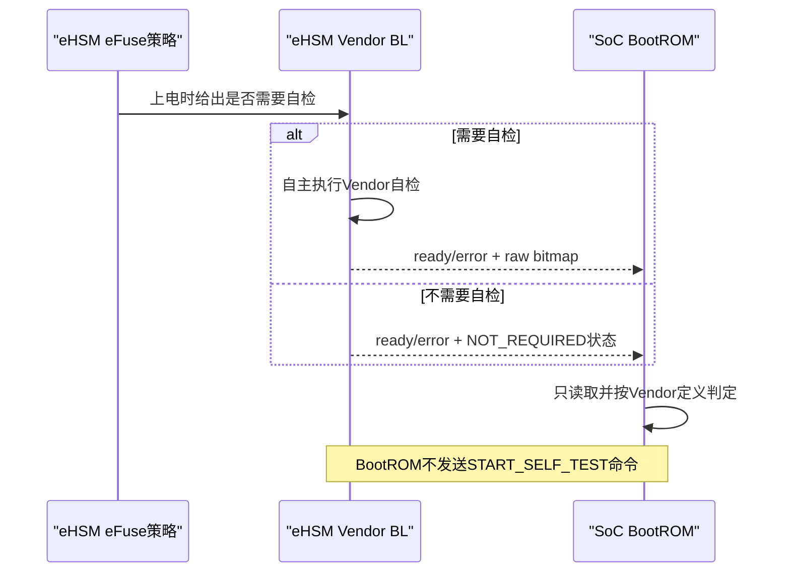

## 6.4 BootROM静态上下文与Owner

BootROM不使用heap、递归或跨阶段共享局部变量。建议的stage-local逻辑上下文如下；这是实现结构，不是wire ABI，也不是Handoff：

```c
typedef struct {
    uint32_t context_version;
    uint32_t state;
    uint64_t boot_instance_id;
    uint64_t reset_cause_raw;

    ngu_bootrom_policy_fuse_snapshot_t policy_fuse;
    ngu_bootrom_strap_snapshot_t strap;
    ngu_bootrom_lcs_snapshot_t lcs;
    uint32_t selected_mode;
    uint32_t mode_reason;

    ngu_ehsm_service_t ehsm_service;
    uint64_t ehsm_raw_status;
    uint64_t self_test_raw_bitmap;

    ngu_sec_package_view_t fmc_package;
    ngu_sec_preflight_result_t preflight;
    ngu_sec_vendor_result_t vendor_result;
    ngu_sec_authenticated_header_t authenticated_header;
    ngu_sec_header_overlay_t header_overlay;
    ngu_sec_policy_result_t policy;
    uint8_t fmc_rollback_counter[16];
    uint32_t bl_candidate_staged;

    ngu_sec_load_result_t load_result;
    ngu_measurement_pending_t measurement_pending;
    ngu_measurement_commit_result_t measurement_commit;
    ngu_sec_error_t error;

    uint32_t release_authorized;
    uint32_t release_consumed;
} ngu_bootrom_context_t;
```

约束如下：

1. 上下文为BootROM唯一Owner，位于第5章启动复用区内的固定section；不得把eHSM context、package descriptor或pending Measurement放在普通函数栈。
2. `boot_instance_id`可继续用于错误/RAS关联，但不进入Measurement ABI；warm reset必须先失效Header并清零整个Measurement Region。
3. `release_authorized`只在所有前置门禁成功后置位；`release_consumed`使用单向设置，防止重复jump。
4. context中的Header Overlay/policy和loader结果均为已复制的稳定值或result，不改变源数据Owner；敏感明文buffer按第5章Region生命周期管理。
5. stage结束前只把已commit FMC Measurement和既有启动接口允许的信息留给FMC；其余BootROM私有状态清零或回收，不建立隐式共享结构。

平台操作表只提供机制，不内置策略：

```c
typedef struct {
    ngu_sec_status_t (*establish_reset_baseline)(ngu_sec_error_t *error);
    ngu_sec_status_t (*invalidate_and_clear_measurement)(ngu_sec_error_t *error);
    ngu_sec_status_t (*platform_min_init)(ngu_sec_error_t *error);
    ngu_sec_status_t (*read_policy_fuse)(ngu_bootrom_policy_fuse_snapshot_t *, ngu_sec_error_t *);
    ngu_sec_status_t (*read_strap)(ngu_bootrom_strap_snapshot_t *, ngu_sec_error_t *);
    ngu_sec_status_t (*read_lcs)(ngu_bootrom_lcs_snapshot_t *, ngu_sec_error_t *);
    ngu_sec_status_t (*locate_fmc_package)(ngu_sec_package_view_t *, ngu_sec_error_t *);
    ngu_sec_status_t (*locate_nonsecure_fmc)(ngu_sec_package_view_t *, ngu_sec_error_t *);
    ngu_sec_status_t (*configure_fmc_firewall)(const ngu_sec_load_result_t *, ngu_sec_error_t *);
    ngu_sec_status_t (*configure_nonsecure_fmc_firewall)(const ngu_sec_load_result_t *, ngu_sec_error_t *);
    ngu_sec_status_t (*ras_report)(const ngu_sec_error_t *);
    _Noreturn void (*jump_fmc)(uint64_t entry_system_addr);
    _Noreturn void (*jump_nonsecure_fmc)(uint64_t entry_system_addr);
    _Noreturn void (*fail_stop)(void);
} ngu_bootrom_platform_ops_t;
```

操作表不得含“verify成功替身”“忽略Firewall错误”“reset eHSM/system”或测试模式fallback。Host unit test可绑定fake ops验证状态机，EMU/产品source graph必须静态证明只绑定真实ops。

## 6.5 函数级边界

BootROM入口和状态机函数冻结为以下逻辑边界，名称可在编码任务中按仓库规范机械调整：

```c
_Noreturn void ngu_bootrom_entry(void);

ngu_sec_status_t ngu_bootrom_flow_step(
    ngu_bootrom_context_t *context,
    const ngu_bootrom_platform_ops_t *ops);

ngu_sec_status_t ngu_bootrom_select_mode(
    const ngu_bootrom_policy_fuse_snapshot_t *policy_fuse,
    const ngu_bootrom_lcs_snapshot_t *lcs,
    const ngu_bootrom_strap_snapshot_t *strap,
    ngu_boot_mode_decision_t *decision,
    ngu_sec_error_t *error);

ngu_sec_status_t ngu_bootrom_wait_ehsm_ready(
    ngu_ehsm_service_t *service,
    ngu_ehsm_ready_result_t *result,
    ngu_sec_error_t *error);

ngu_sec_status_t ngu_bootrom_verify_fmc(
    ngu_bootrom_context_t *context,
    ngu_sec_error_t *error);

_Noreturn void ngu_bootrom_release_fmc(
    ngu_bootrom_context_t *context,
    const ngu_bootrom_platform_ops_t *ops);
```

`ngu_bootrom_select_mode()`必须先验证`policy_fuse`；值1时不得解引用或要求LCS/Strap有效，值0时按LCS再Strap的顺序消费其余输入。`ngu_bootrom_verify_fmc()`只编排第3、4、9章公共接口，不私有复制Vendor Header或Header Overlay parser。状态机必须保持可逐步注入错误；产品入口循环调用`flow_step`直到release或terminal，不含test菜单、命令行或`SECURE_DEMO`条件分支。

## 6.6 FMC Package预检、验签与强制解密（secureboot.003）

### 6.6.1 Preflight与seal

BootROM先从批准介质定位FMC package，检查source、owner、System Address范围、长度上限、`package_size > 1024`、加减法溢出和输出容量，然后按第5.7节固定四步合同seal该输入：撤销写权限并readback、冻结generation/length、计算32字节SHA-256 seal digest、提交前复核三者。Host或其他master在seal后不可继续写；无法建立任一步时不得提交eHSM命令。

Preflight必须在命令提交前执行：

- Vendor Header固定1024字节；
- `Code_Size == package_size - 1024`；
- FMC使用Vendor SoC image type 1；
- `Plain_Flag`/naked模式在正式安全启动中禁止；
- 未认证Header偏移1008的LE64值必须已经精确等于typed `FMC` stage注册的唯一目标地址；偏移1016的LE32 CRC必须等于对offset 256～1015的重算结果，偏移1020～1023必须全0；这些检查只用于拒绝和限制副作用，不能形成认证结论；
- output buffer容量覆盖完整`package_size`（1024字节Header + Code Region）且落在批准工作区；Vendor输出语义是认证Header加解密后的Code Region，不能只按`Code_Size`分配；
- 64位System Address完整范围属于baremetal权威Region和当前active descriptor；
- 所有reserved/header长度组合满足第3章合同。

Preflight只证明输入可安全提交，不把未认证Header字段当作策略事实。

### 6.6.2 真实Vendor调用

BootROM调用真实eHSM BL SoC验证接口，固定语义为：

```text
boot          = 0
check_version = 0
image_type    = Vendor SoC image (1)
plain/naked   = prohibited
driver_mode   = WAIT_AND_POLL
retry         = 0
```

具体API名称由Vendor匹配版本和第4章adapter绑定；不得用`ehsm_verify_decrypt_stub()`、只算Hash、只验签不解密或软件侧伪造PASS替代。

eHSM负责检查Vendor Header、Image Type、Plain Flag、Code Size、固定provisioning所选Key/算法、Hash和Signature，并认证/解密Code Region。Vendor type 1路径同时把认证Header中的16字节`Version_Counter`暂存为BL RAM candidate，但`check_version=0`时不比较、不更新SoC OTP。产品只接受第3章定义的三个完整Profile：

1. SHA-256 + RSA-2048/RSASSA-PSS + AES-128-CBC；
2. SHA-256 + ECDSA/secp256r1 + AES-128-CBC；
3. SM3 + SM2 + SM4-CBC。

CBC均使用16字节IV并follow Vendor无padding合同。其他Vendor算法只进入baremetal能力/回归覆盖，不进入产品FMC package。

任何确定失败保存raw eHSM code并进入失败闭锁；timeout或completion unknown进入service quarantine。只有Vendor明确PASS后才可访问解密输出并进入认证Header复验。

### 6.6.3 PASS后认证Header复验

BootROM从Vendor输出的已认证Header view重新取得Code范围和16字节Version Counter，再执行：

1. 再次检查`Code_Size == package_size - 1024`；
2. Image Type必须是FMC所允许的Vendor type；
3. plain/naked标志仍必须禁止；
4. 偏移1008的LE64 `load_addr`必须精确等于BootROM typed FMC stage注册的固定目标，偏移1016的Header CRC必须重算一致，偏移1020～1023必须全0；不得使用范围宽松的Host地址allowlist；
5. 再次读取并确认Header稳定，`load_addr`、`Code_Size`、`Version_Counter`及安全相关字段与Vendor PASS后首次读取一致，防止TOCTOU；
6. Profile、key域、board/SKU/LCS和policy仅来自受信provisioning/release matrix与stage registry，不从包中恢复；
7. 认证输出范围与预分配的完整package输出范围完全一致；
8. raw Vendor状态、认证Header摘要和项目策略版本只进入verify result/审计，不写入Measurement ABI。

SKU、board、LCS、algorithm profile、key域和boot key必须由单一provisioning/release matrix精确匹配；缺少匹配行时拒绝，不得硬编码进制包或BootROM。

## 6.7 Header Overlay与Typed-stage Policy检查（secureboot.005）

NGU800P type 1包只包含Native Header和Code Region。BootROM在Vendor明确PASS后只解释已认证Native Header中的固定字段，并把包的业务身份和策略绑定到调用上下文，不允许镜像自声明权限。

FMC至少必须通过：

1. Vendor Header固定为1024B，`Code_Size == package_size - 1024`，不存在第二包头、TLV或尾随对象；
2. 偏移1008～1015按little-endian解析为64位`load_addr`，偏移1016～1019为覆盖offset 256～1015的LE32 CRC-32/ISO-HDLC，偏移1020～1023全部为0；
3. `load_addr`精确等于`BOOTROM -> FMC` typed stage registry中的唯一System Address，且完整`1024 + Code_Size`输出范围可由FMC目标Region容纳；
4. `entry_addr`不编码，固定等于`load_addr`；任何非零入口偏移需求必须另行变更；
5. image identity=`FMC`、consumer=`BOOTROM`、instance/die、算法Profile、key usage、board/SKU/LCS、privilege和release policy全部来自受信stage registry及provisioning/release matrix；Host和包内字段不得覆盖；
6. `Version_Counter[16]`是唯一rollback counter来源，并与本次BL staged candidate逐octet一致；
7. Code Region从偏移1024开始，长度唯一使用`Code_Size`；CBC补齐零字节属于Code Region，设备端不得另设`payload_size`或去padding；
8. loader按受信Profile计算源Code摘要和目标回读摘要；包内不存在expected digest。

任一Header字段非法、CRC不匹配、reserved非零、目标地址不精确匹配、package尾随数据、policy未绑定或二次读取不稳定都必须拒绝。CRC通过不构成认证。Header parser只负责有界取值；typed-stage policy负责业务允许性；loader只消费已经通过两者检查的固定目标load request。

## 6.8 FMC Counter Candidate暂存（secureboot.004）

BootROM不提供独立的SoC stored-counter读取或比较接口。FMC Vendor type 1验证固定传`check_version=0`；Vendor BL在密码验证成功后把认证Header的16字节`Version_Counter`暂存到BL RAM。BootROM必须确认：

1. authenticated Header与BL staged candidate两者的16字节值逐字节一致；
2. candidate暂存状态有效且属于本次FMC验证事务；
3. 本阶段没有发生OTP比较或写入；
4. FMC Measurement中的`rollback_counter`只记录该已认证candidate。

RAM candidate不是commit proof。低值拒绝、相等不写和更高单调写全部由FMC入口调用第7、9章`ehsm_bl_commit_staged_soc_rollback_counter()`完成；BootROM不得自行读取stored值、调用update、使用通用64位counter或把暂存状态写成“已提交”。

## 6.9 受控加载、Measurement和一次性Release（secureboot.006～007）

### 6.9.1 Loader

rollback counter通过后，统一loader执行：

1. 使用认证Header Overlay中的64位System Address，并要求其精确等于baremetal权威FMC Region profile的固定目标；不得执行Local/System换算；
2. 验证完整`Code_Size`范围属于FMC批准Region，且不覆盖BootROM活跃代码、栈、context、Measurement、eHSM arena或其他常驻对象；
3. 目标先处于`RW/NX`；复制前按Profile计算`target_base + 1024`处已认证源Code摘要，以`memmove(target_base, target_base + 1024, Code_Size)`搬移，复制后从目标Region回读同样`Code_Size`重算摘要，并常量时间比较二者；
4. 按第5章PMA合同执行write/release barrier和必要`fence.i`，不执行data clean/invalidate；
5. 配置并readback FMC最终`RX`/数据`RW/NX`权限，过程中不得出现可利用的`RWX`窗口；
6. 返回实际64位System Address `load_addr`、与其相等的`entry_addr`、实际`Code_Size`和loader状态；不存在平台Local/System转换结果。

`load_addr`、`entry_addr`、Region offset、容量和Firewall参数必须由Security RAM Layout与Boot Platform Profile生成。任一输入缺失时真实load/release路径返回`BLOCKED_BY_PLATFORM_INPUT`，不得猜测Region常量或jump Expected。

### 6.9.2 Measurement

BootROM初始化可变Measurement Table；只有验签、解密、Header Overlay、typed-stage policy、BL candidate暂存和loader源/目标摘要比较全部成功后，才把FMC作为紧凑列表Entry 0追加。Entry只填写第9章128字节ABI已有字段：

- consumer image=`FMC`、`instance_id=0/die_id=0`；
- 16字节FMC `rollback_counter`；
- 实际明文Code Region digest及`hash_algo/hash_len`；
- `verify_result=PASS`；
- loader返回的实际64位baremetal System Address load/entry；
- `release_state=RELEASE_AUTHORIZED`，表示BootROM已经完成release门禁但尚未执行硬件release；
- 完整性字段和最终commit状态。

Vendor raw status、算法Profile、Key/Signer、package/Header/policy版本、平台内部地址转换信息和其他诊断信息保留在verify result与安全路径审计记录中，不扩展Measurement Entry。

提交顺序为“Header置WRITING→write/release fence→填充Entry并计算CRC→release fence→Entry commit→更新Header count/length/CRC→Header commit→readback”。`NON_CACHEABLE`与`HARDWARE_COHERENT`两种允许属性均不执行data clean/invalidate。任一步失败、重复实例、完整性失败或跨master可见性不明均禁止release。commit后BootROM不再修改该Entry；FMC只能按第9章规则消费私有copy。

Measurement Table逻辑ABI固定为：128字节Header、实际数量的128字节紧凑Firmware Entry、唯一128字节SoC State、CRC-32C和末尾32位commit；不含BootROM Entry、generation、地址domain、Key/Signer和时间戳。物理Region固定为16 KiB，理论最多126个Firmware Entry；产品实际实例上限和PMA/Firewall配置由平台Profile生成。

### 6.9.3 最终Release Gate

进入`RELEASE_FMC`前必须重新断言：

```text
mode == SECURE_BOOT
eHSM service == READY and not quarantined
self_test_policy == PASS or NOT_REQUIRED_BY_EFUSE
vendor_verify == PASS
authenticated_header == PASS
header_overlay/typed_stage_policy/digest == PASS
BL FMC candidate staged == PASS
loader == PASS
measurement_commit == PASS and readback valid
release_authorized == 1
release_consumed == 0
error == NONE
```

随后BootROM撤销不再需要的临时写权限和Host输入权限，执行最终full-system barrier和`fence.i`，原子设置`release_consumed`并调用一次`jump_fmc(actual_entry_soc_pa)`。跳转返回、entry不对齐、privilege/interrupt/PMA状态不符合Boot Stage Profile或最终Firewall readback失败均视为FATAL，不得二次jump。

## 6.10 显式状态机

建议枚举值是stage-local实现常量，不作为跨阶段ABI：

| 值 | 状态 | Entry动作 | 成功出口 | 失败出口 |
|---:|---|---|---|---|
| 0 | `BOOTROM_RESET` | 从不可变reset vector进入；建立并回读FMC reset/clock/NX与Measurement写Owner；先失效Header，再清零并回读整个Measurement Region | `MIN_INIT` | 任一状态无法证明则`TERMINAL`且FMC始终不可执行 |
| 1 | `BOOTROM_MIN_INIT` | 最小平台/timer/cache基础；保持已证明的默认deny权限 | `READ_BOOT_POLICY_INPUTS` | `TERMINAL` |
| 2 | `BOOTROM_READ_BOOT_POLICY_INPUTS` | 先读取并保存只读`non_sec_boot`快照；值0时继续读取SoC LCS，并仅对已识别非USER读取raw Strap | `SELECT_BOOT_MODE` | policy-fuse读取/ECC/镜像/来源异常直接`TERMINAL`；LCS异常保留并继续分类；已识别非USER的Strap/平台读取不可用留给状态3终止 |
| 3 | `BOOTROM_SELECT_BOOT_MODE` | 纯策略函数按`non_sec_boot`→LCS→Strap优先级选择`mode/subprofile/reason` | fuse=1→`NONSECURE_LOCATE(RESTRICTED)`；fuse=0且secure→`WAIT_EHSM`；fuse=0且DEV/MANU+0→`NONSECURE_LOCATE(MANUFACTURING)`；其他非安全原因→`NONSECURE_LOCATE(RESTRICTED)` | policy-fuse异常，或fuse=0且已识别非USER的Strap源无效/RTL映射未同步时进入`TERMINAL` |
| 4 | `BOOTROM_WAIT_EHSM` | error优先poll四个BL状态位；eHSM按eFuse自主完成或跳过自检 | `READ_EHSM_BOOT_RESULT` | `TERMINAL/QUARANTINED` |
| 5 | `BOOTROM_READ_EHSM_BOOT_RESULT` | 读取raw自检状态/bitmap；不发送自检启动命令 | `LOCATE_FMC` | eFuse要求自检但失败/未知时`TERMINAL` |
| 6 | `BOOTROM_LOCATE_FMC` | 定位、范围检查并seal package | `PREFLIGHT_FMC` | `TERMINAL` |
| 7 | `BOOTROM_PREFLIGHT_FMC` | 未认证Header安全预检 | `VERIFY_FMC` | `TERMINAL` |
| 8 | `BOOTROM_VERIFY_FMC` | 真实eHSM verify/decrypt | `CHECK_AUTH_HEADER` | `TERMINAL/QUARANTINED` |
| 9 | `BOOTROM_CHECK_AUTH_HEADER` | PASS后复验认证Header并确认稳定 | `CHECK_HEADER_OVERLAY_POLICY` | `TERMINAL` |
| 10 | `BOOTROM_CHECK_HEADER_OVERLAY_POLICY` | offset1008/1016/1020、Header CRC、typed-stage policy、精确目标及Header/candidate一致性 | `CONFIRM_STAGED_COUNTER` | `TERMINAL` |
| 11 | `BOOTROM_CONFIRM_STAGED_COUNTER` | 确认BL已暂存本次FMC 16字节candidate；不读、不比、不写OTP | `LOAD_FMC` | `TERMINAL` |
| 12 | `BOOTROM_LOAD_FMC` | loader、W^X、write/release、目标readback摘要、`fence.i`、Firewall；data clean/invalidate=0 | `COMMIT_FMC_MEASUREMENT` | `TERMINAL` |
| 13 | `BOOTROM_COMMIT_FMC_MEASUREMENT` | 记录真实结果并最后发布commit | `FINAL_RELEASE_CHECK` | `TERMINAL` |
| 14 | `BOOTROM_FINAL_RELEASE_CHECK` | 复验所有门禁及一次性标志 | `RELEASE_FMC` | `TERMINAL` |
| 15 | `BOOTROM_RELEASE_FMC` | 单次不可返回jump | 无返回 | 返回即`TERMINAL` |
| 16 | `BOOTROM_NONSECURE_LOCATE` | 按锁定的subprofile定位制造Provisioning FW或受限FMC，并检查source/长度/owner/Profile一致性 | `NONSECURE_LOAD` | `TERMINAL`；不得切换subprofile重试 |
| 17 | `BOOTROM_NONSECURE_LOAD` | 独立profile执行range/W^X/cache/Firewall受控加载；制造Profile只开放到eHSM BL typed Mailbox所需的最小通路 | `NONSECURE_RELEASE` | `TERMINAL` |
| 18 | `BOOTROM_NONSECURE_RELEASE` | 不写安全Measurement/SoC State/启动审计；一次性跳转对应entry | 无返回 | 返回即`NONSECURE_TERMINAL` |
| 19 | `BOOTROM_NONSECURE_TERMINAL` | 撤销临时权限并停在受限非安全终态；不创建安全启动错误审计 | 无安全出口 | 无 |
| 127 | `BOOTROM_TERMINAL` | 阻断、记录、撤权、清零、RAS上报、fail-stop | 无安全出口 | 无 |

状态只单向前进。确定失败不得把本次对象回滚到早期状态重试；BootROM没有“等待Host重新发送FMC”的普通运行循环。Recovery/OOB重新下发只在第12章定义的新boot instance和恢复状态机中执行。

## 6.11 失败闭锁、错误记录与RAS边界

所有确定完成失败执行固定顺序：

1. 清除`release_authorized`并确保下游PC不可达；
2. 仅安全路径记录首个稳定错误：stage、state、operation、domain/reason、raw Vendor code、raw eHSM status、自检bitmap、Header Overlay/policy检查阶段、timestamp和boot instance；受限非安全路径不写启动审计；
3. 撤销Host ingress、loader写权限和临时Firewall窗口；
4. 对已确认不再被eHSM访问的目标Region明文包/尾部、digest临时值和未授权写入范围执行secure zero；
5. 执行write/release fence并提交固定`EARLY_SECURITY_ERROR_RECORD`；不执行data clean/invalidate；
6. 向RAS单向上报security event和action request；
7. RAS尚未ready时只在RAS Profile定义的deadline内重试上报；仍不可用则记录`RAS_REPORT_UNAVAILABLE`，关闭普通中断并进入无限WFI fail-stop循环；只有RAS Profile允许的Reset/NMI可退出。

错误记录不得包含明文payload、私钥、完整证书secret或可重放的认证材料。`boot_fail_reason`不能只有一个布尔值，至少能区分：

- boot policy fuse/LCS/Strap；
- eHSM ready、自检、transport timeout/quarantine；
- package preflight、Vendor verify/decrypt；
- Header Overlay、typed-stage policy和loader源/目标摘要结果；
- rollback/counter；
- loader/Firewall/cache；
- Measurement commit；
- final release/jump returned。

completion unknown时与普通确定失败不同：在无法证明eHSM不再访问前，不清零或复用package、output、context、channel；整个service/slot保持quarantine，等待RAS策略执行reset/recovery。BootROM不调用Vendor reset magic、不自行触发watchdog/system reset，也不声称OOB已进入。

## 6.12 `secureboot.001～007`追溯和测试设计入口

| Checklist | 设计落点 | 最低正向验证 | 必须包含的异常/边界 |
|---|---|---|---|
| `secureboot.001` | 6.2、状态2～3 | `non_sec_boot=0`时USER进入secure；DEV/MANU+Strap0选择`MANUFACTURING_PROVISIONING`，其他已识别非USER+Strap0选择`RESTRICTED_NONSECURE`，Strap1进入secure；`non_sec_boot=1`时所有LCS/Strap组合强制`RESTRICTED_NONSECURE` | policy-fuse读失败/ECC/镜像/来源异常阻断两条release；制造/受限profile错配、缺失、越权或相互fallback必须失败；值1和LCS异常均不能访问typed制造API；两种非安全子Profile都不写安全Measurement Entry/SoC State/启动审计 |
| `secureboot.002` | 6.3、状态4～5 | 四位ready组合满足；eFuse不要求自检时NOT_REQUIRED可继续，要求时必须PASS | 证明BootROM没有START_SELF_TEST命令；覆盖每个done/error组合、error与done同时置位、deadline、自检已知失败/unknown位；均不可定位FMC |
| `secureboot.003` | 6.6、状态6～9 | 三套产品Profile的真实签名+加密FMC包通过 | Header/Image Type/Plain Flag/Code Size/Hash/Signature逐项破坏，以及设备provisioning matrix与受信stage Profile不匹配；无stub/明文降级 |
| `secureboot.004` | 6.8、状态11 | BL暂存candidate与认证Header逐字节一致 | candidate缺失/失效/错事务/不一致；证明BootROM stored-counter read/compare/update调用均不可达，低/同/高比较在FMC初始化case覆盖 |
| `secureboot.005` | 6.7、状态10 | PASS后合法Header Overlay与FMC typed-stage policy通过 | PASS前字段/CRC只能用于拒绝；offset1008 LE64、offset1016 CRC、offset1020 reserved、精确固定目标、尾随数据、Code Size、rollback counter、Header稳定性和policy逐项失败；不符合第3章唯一包格式的输入必须拒绝 |
| `secureboot.006` | 6.9.2、状态13 | committed FMC Entry含真实digest、rollback counter、load/entry | loader前伪造actual地址、commit失败/重复实例/跨master可见性未证明；均不得release |
| `secureboot.007` | 6.9.1/6.9.3/6.11、状态12～15/127 | 受控load、权限readback、一次性jump | 越界/重叠/RWX/PMA/barrier/指令侧同步/Firewall/entry/commit/jump-return失败；记录错误并fail-stop |

该表是设计checklist，不替代统一测试工作簿。每行必须映射正式Case ID及Host unit、baremetal能力测试和EMU SoC链路。`secureboot.001`真实寄存器测试要求RTL生成头同时提供匹配的Boot Policy Fuse只读视图和Strap字段；前者缺失时标记`BLOCKED_BY_NON_SEC_BOOT_BINDING`，后者缺失时标记`BLOCKED_BY_RTL_SYNC`。归一化策略unit测试使用本章确定的Expected。

## 6.13 目标模块与构建门禁

| 责任 | 目标模块 | 约束 |
|---|---|---|
| BootROM production entry和flow | `solutions/bootrom` | 无test/demo分支 |
| 模式输入平台绑定 | BootROM NGU800P platform/port | `non_sec_boot`只读快照与Strap/LCS均只引用受控生成接口；输出`mode/subprofile/reason`，不开放raw eFuse或写裸位号 |
| eHSM Host adapter | 公共security adapter/port层 | Vendor公共源码不修改；poll、单slot、零retry |
| Header Overlay/policy/loader摘要 | 公共security组件 | BootROM/FMC/GSP共用，不复制parser或摘要比较逻辑 |
| BL candidate确认 | BootROM eHSM typed adapter | `check_version=0`并确认16字节candidate已暂存 |
| Loader/Firewall/PMA | 公共loader和平台层 | 64位System Address、W^X、readback和真实结果 |
| Measurement commit | 公共Measurement组件 | 紧凑Entry唯一tuple，Header/Entry commit最后发布 |
| Error/RAS | 公共错误组件和BootROM early record | 只上报/请求，不执行reset |

Production source graph必须证明stub、demo secure flow、simulated success和test provider不可达。

## 6.14 平台配置与停止条件

| 配置 | 强制要求 | 缺失或不满足时行为 |
|---|---|---|
| Boot Policy Fuse | 生成`non_sec_boot`只读逻辑值、valid/ECC/镜像、复位锁存和访问权限 | `BLOCKED_BY_NON_SEC_BOOT_BINDING`，安全和非安全FMC均禁止release |
| Strap/LCS | 生成`secure_boot[3]`、MGMT/SEC读取Owner、镜像一致性和LCS接口 | BootROM安全启动构建失败 |
| FMC Region | 生成source、128 KiB上限、固定load/entry和Firewall参数 | FMC保持reset/NX |
| eHSM Port | 生成direct MMIO、status、deadline、PMA和RAS原语 | 真实Vendor调用不可达 |
| Measurement | 生成实际`max_fw_entries`、PMA和Firewall绑定 | 禁止提交Measurement |
| Provisioning | 生成设备/SKU、FMC、Key、Profile、LCS和board矩阵 | 产品包默认拒绝 |
| Non-secure Profile | 分别生成`MANUFACTURING_PROVISIONING`与`RESTRICTED_NONSECURE`的独立source、Region、privilege、Mailbox aperture和Release接口，并绑定允许的LCS/reason | `NON_SECURE_BOOT`进入终态；不得在两个Profile间fallback |
# 第7章 FMC详细设计

FMC是BootROM与GSP之间的最小可信启动stage。它不重新验证自身package，而是消费BootROM提交的唯一FMC Measurement条目；初始化时立即把其中的expected candidate回传eHSM BL，完成RAM candidate exact-match、stored compare、必要单向写和权威readback。Commit proof成立后才接收并验证同值GSP package、提交GSP Measurement并一次性release GSP。

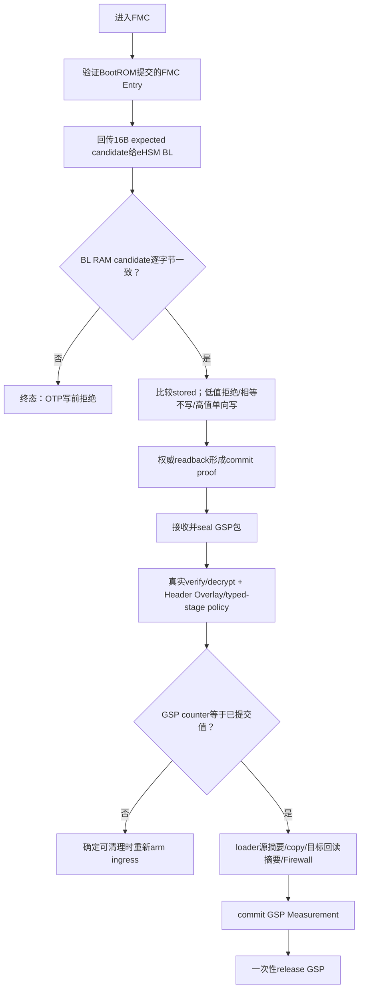

## 7.1 职责、输入、输出和非目标

| 类别 | 内容 |
|---|---|
| 可信输入 | BootROM提交的唯一FMC Measurement Entry、其中已认证的16字节FMC candidate、SoC LCS、固定layout/Firewall配置 |
| 不可信输入 | Host提供的GSP Vendor原生package及其source descriptor |
| 主要输出 | 已加载但未release的GSP、已证明的counter before/after、唯一GSP Measurement条目、一次性release |
| 失败输出 | stage/error/raw Vendor/counter/Header Overlay/loader状态、Host ingress rearm状态、RAS action request |
| 非目标 | 不加载eHSM Vendor FW；不重新验证FMC；不建立Handoff ABI；不决定Host是否重发；不直接reset |

FMC固定不变量：

1. 未取得可信FMC Measurement前不接收或处理GSP package。
2. `FMC_rollback_counter`只来自BootROM生产、CRC/commit有效的FMC Entry私有copy；它作为`expected_candidate`回传BL，禁止从FMC自身包、局部变量或Host重新提供。
3. FMC初始化必须先取得BL staged-candidate compare/commit/readback证明，之后才允许接收GSP package。
4. GSP package必须满足`GSP_rollback_counter == committed_soc_rollback_counter`，否则拒绝。
5. FMC是唯一global counter提交发起Owner；实际比较、单调写和readback由eHSM BL专用接口完成；BootROM、GSP和Runtime不得写。
6. eHSM Vendor FW由GSP加载，FMC不得为了counter接口自行提前加载。
7. GSP Measurement commit和最终保护未完成前，GSP PC不可release。
8. counter commit完成后，GSP包的确定接收失败仍可在安全清理后重新arm，但只接受counter等于已提交值的新包；completion unknown或counter状态未知进入terminal/quarantine。

## 7.2 FMC静态上下文

FMC使用自己的静态上下文，不继承BootROM context：

```c
typedef struct {
    uint32_t context_version;
    uint32_t state;
    uint64_t boot_instance_id;
    uint64_t request_id;

    ngu_measurement_entry_view_t fmc_measurement;
    uint8_t fmc_expected_candidate[16];

    ngu_ehsm_service_t ehsm_service;
    ngu_sec_ingress_descriptor_t gsp_ingress;
    ngu_sec_package_view_t gsp_package;
    ngu_sec_preflight_result_t preflight;
    ngu_sec_vendor_result_t vendor_result;
    ngu_sec_authenticated_header_t authenticated_header;
    ngu_sec_header_overlay_t header_overlay;
    ngu_sec_policy_result_t policy;

    uint8_t committed_soc_rollback_counter[16];
    uint8_t gsp_rollback_counter[16];
    uint8_t counter_before[16];
    uint8_t counter_after[16];
    int32_t counter_compare;
    uint32_t counter_commit_state;

    ngu_sec_load_result_t load_result;
    ngu_measurement_pending_t measurement_pending;
    ngu_measurement_commit_result_t measurement_commit;
    ngu_sec_error_t error;

    uint32_t ingress_state;
    uint32_t release_authorized;
    uint32_t release_consumed;
} ngu_fmc_context_t;
```

约束：

- 无heap、无递归；eHSM使用FMC自己的64字节对齐256字节固定slot和最多一条在途。
- `request_id`由每次新Host package生成；失败对象不得回退成新请求。
- counter值始终是16字节octet数组，不用原生整数布局。
- `counter_commit_state`至少区分`PENDING/PROVEN_EQUAL/PROVEN_UPDATED/REJECTED_MISMATCH/REJECTED_LOWER/UNKNOWN`；`UNKNOWN`不能当作失败后重试。
- 上下文位于启动复用区且纳入FMC峰值预算；GSP release后除Measurement/错误记录外全部清零回收。

## 7.3 BootROM Measurement消费

逻辑接口：

```c
ngu_sec_status_t ngu_measurement_get_verified_fmc_rollback_counter(
    const ngu_measurement_table_t *table,
    uint64_t boot_instance_id,
    ngu_measurement_entry_view_t *entry,
    uint8_t rollback_counter[16],
    ngu_sec_error_t *error);
```

FMC只接受：

- table magic/version/实际length/count、Region容量和Header commit有效；
- 恰好一个image=`FMC`、producer=`BOOTROM`条目；
- verify、policy、loader和`RELEASE_AUTHORIZED`均为成功；Entry不宣称FMC已经运行；
- commit已发布且完整性/readback通过；
- 16字节rollback counter完整，load/entry/domain与当前FMC实际入口一致；
- 无重复`fw_type/die_id/instance_id`、列表空洞或仍在写入的对象。

失败时不重新读取FMC package、不使用默认rollback counter，也不启动eHSM service；直接进入FMC terminal。

## 7.4 Host Ingress与重新下发

Ingress采用：

```text
EMPTY -> HOST_WRITABLE -> RECEIVED -> SEALED -> PROCESSING
      -> CONSUMED
      -> FAILED_CLEANABLE -> EMPTY
      -> QUARANTINED
```

规则：

1. Host只可写`HOST_INGRESS`接收窗口，不能写任何解密/执行目标Region或Measurement。
2. device只负责接收、seal、验证和报告结果，不主动要求上位机重发。
3. seal必须撤销Host写权限并readback，记录generation/request/source/length，执行write/release barrier，计算完整package 32字节SHA-256 seal digest，并在提交Vendor前复核generation/length/digest；两种允许的PMA配置均不执行data clean/invalidate。
4. 格式、签名、policy、rollback等确定失败，在证明eHSM不再访问且敏感区清零后进入`FAILED_CLEANABLE`，重新arm为新request。
5. timeout、异常BUSY、late response、counter状态未知或cache ownership不明进入`QUARANTINED`，不得重新开放相同Region。
6. Host重新发送必须创建全新request；不自动重复Vendor command，不沿用旧PASS、digest或Header Overlay解析结果。

## 7.5 GSP Package验证

FMC复用第3、4、9章公共组件：

```text
locate/seal
  -> untrusted preflight
  -> real Vendor BL verify/decrypt (boot=0, check_version=0)
  -> authenticated Header recheck
  -> Header Overlay recheck
  -> typed-stage policy
  -> loader source digest / copy / target readback digest compare
```

GSP profile固定检查：

- Vendor SoC image type和plain/naked策略；
- `Code_Size == package_size - 1024`；
- image identity由`FMC -> GSP` typed stage上下文固定为`GSP`，不存在包内OMP/GSP自声明；
- 第3章Profile 1/2/3之一；
- Header 16字节rollback counter必须等于已提交SoC counter；
- Header偏移1008的LE64 `load_addr`精确等于GSP registry固定System Address，偏移1016的Header CRC重算一致，偏移1020～1023为0，`entry_addr=load_addr`；
- board/SKU/LCS/key usage与单一provisioning/release matrix精确匹配；
- Header Overlay/typed-stage policy通过后由loader计算源Code Region摘要，按`target+1024`原地搬移并从目标回读重算摘要，常量时间比较成功。

Vendor PASS本身不改变counter、不提交Measurement、不release GSP。FMC通过eHSM BL执行SoC验证时必须固定`check_version=0`，防止Vendor接口在NGU后置检查完成前自动推进OTP。任何后置检查失败保留raw Vendor状态并按Ingress规则处理。

## 7.6 FMC初始化提交Candidate、GSP等值检查与Loader

顺序冻结为：

1. FMC从可信FMC Entry复制`fmc_expected_candidate[16]`；
2. 初始化FMC自己的eHSM BL poll service；
3. 调用`ehsm_bl_commit_staged_soc_rollback_counter()`并把该16字节值再次传给BL；
4. BL先把参数与验证FMC时保存在RAM中的candidate逐字节比较；无candidate、candidate无效或不一致时在任何OTP改动前拒绝；
5. 一致时BL读取stored SoC counter并执行：低值拒绝；相等成功且不写；更高按Vendor单向编码写入；两种成功都返回before/after/relation/written/readback/raw status；
6. FMC只在`PROVEN_EQUAL`或`PROVEN_UPDATED`且`counter_after == fmc_expected_candidate`时进入GSP接收；
7. GSP使用`check_version=0`完成Vendor验证和全部NGU Header Overlay/typed-stage后置检查，要求`GSP_rollback_counter == counter_after`；
8. 统一loader完成GSP actual load/entry、W^X、write/release、目标readback摘要、`fence.i`和Firewall readback；不执行data clean/invalidate；
9. 提交GSP Measurement并完成最终release gate。

Counter逻辑接口：

```c
int32_t ehsm_bl_commit_staged_soc_rollback_counter(
    ehsm_ctx_t *ctx,
    const uint8_t expected_candidate[16],
    ehsm_bl_rollback_counter_result_t *result);
```

该接口是FMC初始化的BL专用能力，不是通用read/update服务。BootROM、GSP普通任务、Runtime和Host不可调用；不得使用`ehsm_read_counter(uint64_t)`、raw OTP、GSP package值或eHSM FW启动副作用替代。command ID、wire packing、LCS权限和Vendor版本必须由Counter Adapter Profile生成；配置缺失时接口不可用。timeout、掉电或结果不明时不得盲写第二次，必须通过专用状态/readback或fail-stop闭环。

Counter在FMC初始化时提交后，不得回退到低于已提交值的GSP。只允许在本boot中清理完成且事务状态确定后接收counter等于已提交值的新GSP包，否则进入受限恢复或请求整机重启。任何后到达的GSP值都不得驱动不可逆counter写入。

## 7.7 GSP Measurement与Release

GSP条目只记录第9章128字节ABI已有字段：`fw_type/instance_id/die_id/flags`、实际明文`hash_algo/hash_len/hash`、已提交的16字节SoC counter、`verify_result=PASS`、`release_state=RELEASE_AUTHORIZED`、loader actual 64位System Address load/entry、reserved、CRC和commit。request ID、Profile、key/cert标识、counter before/after/relation/written/readback、raw状态及详细策略结果只进入FMC私有result和审计。

提交仍遵守commit最后发布。counter已经更新但Measurement commit失败时，GSP不可release，FMC进入terminal并记录`COUNTER_COMMITTED_MEASUREMENT_MISSING`；新boot instance可在相同rollback counter下重新验证/加载并重建Measurement，但当前boot不得在原对象上继续。

最终release gate：

```text
trusted FMC measurement
&& GSP verify/header_overlay/typed_stage_policy/digest PASS
&& fmc_expected_candidate == committed_soc_rollback_counter
&& committed_soc_rollback_counter == GSP_rollback_counter
&& loader PASS
&& GSP measurement committed/readback valid
&& firewall/cache final state PASS
&& service not quarantined
&& release_consumed == 0
```

FMC以既有平台release接口一次性跳转GSP actual entry；返回视为FATAL。FMC不加载Vendor FW，不启动普通GSP服务，也不直接reset。

## 7.8 FMC显式状态机

| 值 | 状态 | 成功出口 |
|---:|---|---|
| 0 | `FMC_ENTRY` | `VALIDATE_SELF_MEAS` |
| 1 | `FMC_VALIDATE_SELF_MEAS` | `INIT_EHSM` |
| 2 | `FMC_INIT_EHSM` | `COMMIT_STAGED_COUNTER` |
| 3 | `FMC_COMMIT_STAGED_COUNTER` | `COUNTER_READBACK` |
| 4 | `FMC_COUNTER_READBACK` | `WAIT_GSP_PACKAGE` |
| 5 | `FMC_WAIT_GSP_PACKAGE` | `SEAL_GSP_PACKAGE` |
| 6 | `FMC_SEAL_GSP_PACKAGE` | `PREFLIGHT_GSP` |
| 7 | `FMC_PREFLIGHT_GSP` | `VERIFY_GSP` |
| 8 | `FMC_VERIFY_GSP` | `CHECK_GSP_HEADER` |
| 9 | `FMC_CHECK_GSP_HEADER` | `CHECK_GSP_HEADER_OVERLAY_POLICY` |
| 10 | `FMC_CHECK_GSP_HEADER_OVERLAY_POLICY` | `CHECK_GSP_COUNTER_EQUAL` |
| 11 | `FMC_CHECK_GSP_COUNTER_EQUAL` | `LOAD_GSP` |
| 12 | `FMC_LOAD_GSP` | `COMMIT_GSP` |
| 13 | `FMC_COMMIT_GSP` | `FINAL_RELEASE_CHECK` |
| 14 | `FMC_FINAL_RELEASE_CHECK` | `RELEASE_GSP` |
| 15 | `FMC_RELEASE_GSP` | 无返回 |
| 16 | `FMC_REARM_INGRESS` | `WAIT_GSP_PACKAGE` |
| 127 | `FMC_TERMINAL` | 无安全出口 |

只有GSP事务确定完成、eHSM completion已知且对象可清理时才能进入`REARM_INGRESS`；新GSP必须使用已提交counter。counter状态未知、shared service quarantine、Measurement不一致或release返回均进入terminal。

## 7.9 API和代码落点

```c
_Noreturn void ngu_fmc_secure_entry(void);
ngu_sec_status_t ngu_fmc_flow_step(ngu_fmc_context_t *, const ngu_fmc_platform_ops_t *);
ngu_sec_status_t ngu_fmc_validate_self_measurement(ngu_fmc_context_t *);
ngu_sec_status_t ngu_fmc_process_gsp_package(ngu_fmc_context_t *);
ngu_sec_status_t ngu_fmc_commit_staged_counter(ngu_fmc_context_t *);
ngu_sec_status_t ngu_fmc_check_gsp_counter_equal(ngu_fmc_context_t *);
ngu_sec_status_t ngu_fmc_commit_gsp_measurement(ngu_fmc_context_t *);
_Noreturn void ngu_fmc_release_gsp(ngu_fmc_context_t *, const ngu_fmc_platform_ops_t *);
```

FMC实现位于`gsp-pmp-rmp-omp/solutions/fmc`和公共`components/security`。产品source graph不得包含stub、test provider或自动重试package。公共parser、loader、counter和Measurement模块不得在FMC内私有复制。

## 7.10 错误、测试与平台配置

FMC失败必须阻断GSP Release并保存FMC stage、状态、Vendor raw code、Counter关系、Header、Loader、Measurement和Ingress ownership。确定未提交或已完成失败可清理对象并重新arm Ingress；acceptance unknown必须quarantine context、Ingress和目标Region。

必须覆盖：

- FMC Entry缺失、重复、tuple错误、CRC/commit错误和candidate不一致；
- 三套Profile真实GSP包及逐字段负向用例；
- BL RAM candidate相等、不等、缺失和失效；
- stored counter小于、等于、大于candidate及16字节边界；
- commit result的before/after/relation/written/readback和completion unknown；
- GSP counter不等于已提交值；
- Counter已提交但Loader或Measurement失败时GSP不可达；
- 确定失败可重新接收同值新包，timeout禁止rearm；
- GSP entry、Firewall、PMA/barrier、指令同步和jump-return故障。

| 平台配置 | 强制内容 | 缺失时行为 |
|---|---|---|
| GSP Ingress | Source、最大尺寸、通知和唤醒接口 | 不接收GSP |
| GSP Region | 固定System Address、容量、privilege和Release primitive | GSP保持reset/NX |
| Counter API | Command、packing、LCS、寿命、status和readback | FMC不得接收GSP |
| Measurement | 实际`max_fw_entries`、PMA和commit可见性 | 禁止提交GSP Entry |
| Deadline/RAS | FMC operation deadline、event/action和early-report deadline | 失败进入无限WFI fail-stop |
# 第8章 GSP详细设计与Runtime加载隔离

GSP是从bootstrap到runtime持续存在的唯一产品安全控制面。它消费FMC提交的GSP Measurement，启动eHSM Vendor FW，验证并release PMP/RMP/MMP，随后由同一个最高优先级`security_service_task`长期串行提供eHSM安全能力。产品不定义独立OMP/Q&P package、RAM、Measurement、counter或release身份。

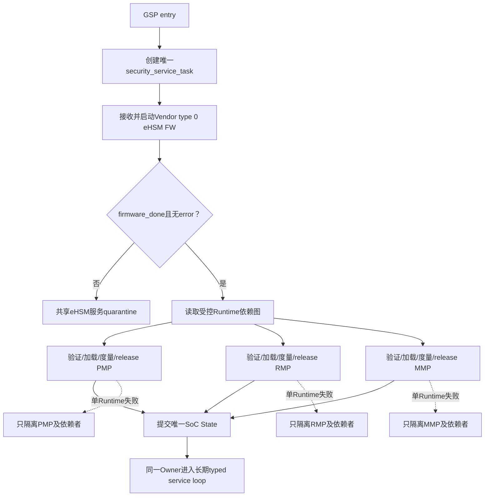

## 8.1 启动输入和阶段门禁

GSP普通scheduler服务开放前必须：

1. 验证自身实际entry是baremetal System Address且属于固定GSP Region；
2. 校验Measurement Header实际count/length及唯一FMC生产的GSP Entry；
3. 要求GSP条目verify/release authorized/commit/integrity通过；
4. 核对GSP rollback counter、FMC expected candidate和FMC初始化counter-after三者相同；
5. 建立GSP唯一eHSM service owner、静态queue/context和早期错误记录；
6. 完成GSP/FMC复用区、Measurement、Host ingress、PMP/RMP及MMP DDR Profile的Firewall/PMP基线；
7. 在普通caller、SPDM和依赖eHSM FW的Runtime前启动Vendor FW并确认ready；
8. 按受控依赖图验证/release PMP、RMP、MMP。

任一门禁失败，未满足依赖的task、transport、Runtime PC和外部服务均不可达。

## 8.2 GSP静态控制上下文

```c
typedef struct {
    uint32_t version;
    uint32_t state;
    uint64_t boot_instance_id;
    ngu_measurement_entry_view_t self_measurement;
    uint8_t committed_rollback_counter[16];

    ngu_ehsm_service_t ehsm_service;
    ngu_sec_request_queue_t request_queue;
    ngu_sec_runtime_record_t runtime[NGU_RUNTIME_OBJECT_COUNT];

    uint32_t service_state;
    uint32_t enabled_operation_mask;
    uint32_t firewall_profile;
    uint32_t attestation_state;
    ngu_sec_error_t error;
} ngu_gsp_context_t;
```

`NGU_RUNTIME_OBJECT_COUNT`只对应eHSM FW、PMP、RMP、MMP。Registry数值由公共ABI生成。Context、queue、task stack、SPDM/MCTP、证书和provider内存全部计入GSP RAM预算，不建立独立协议物理Region。

## 8.3 eHSM Service唯一Owner

GSP eHSM Service必须满足：

- 第一个、最高优先级`security_service_task`在scheduler可运行后首先执行；
- 它从bootstrap到runtime始终是唯一Vendor Host/Mailbox/context Owner；
- 启动阶段使用同一typed dispatcher直接处理内部bootstrap请求；
- gate通过后同一task进入长期queue loop，不发生Owner移交；
- 其他task只能提交typed request，不能取得raw Vendor handle、channel或context；
- 一个256字节静态slot、最多一条在途、全程poll、自动retry=0；
- timeout/BUSY异常使整个service进入`QUARANTINED`，所有后续request在触及Mailbox前失败；
- Quarantine只由平台RAS触发的新boot instance清除，不通过销毁/重建task恢复。

逻辑request：

```c
typedef struct {
    uint32_t version;
    uint32_t operation_id;
    uint32_t caller_id;
    uint32_t usage;
    uint64_t request_id;
    uint64_t deadline_us;
    ngu_sec_io_descriptor_t input;
    ngu_sec_io_descriptor_t output;
    uint32_t flags;
} ngu_sec_service_request_t;
```

dispatcher必须验证caller、operation、usage、LCS、地址/长度/domain、alias、quota和output ownership。Host输入不得直接转换为Vendor command；GSP先做项目policy，eHSM再根据实际LCS作最终允许/拒绝。

## 8.4 eHSM Vendor FW启动

eHSM FW使用Vendor原生type 0专用流程：

```text
SoC reset后eHSM持续只运行BL
  -> FMC release GSP
  -> GSP建立受控ingress并等待Host下发Vendor FW package
  -> seal完整type 0 package
  -> validate source/version/config
  -> GSP请求eHSM BL执行Vendor boot call: boot=true, image_out=NULL
  -> poll raw status
  -> require firmware_done=1 && firmware_err=0
  -> publish FW_READY
```

初始启动中，eHSM在GSP取得控制权并收到Host package之前始终只运行BL，不预置或提前启动FW。该Vendor type 0包不使用NGU Header Overlay，也不作为PMP/RMP/MMP之一；偏移1008～1023继续按Vendor原格式处理。GSP保存Vendor FW版本、package hash、经Vendor type 0认证的eHSM FW counter、raw BL/FW status和启动时间。FMC不得预加载；GSP失败不得伪造ready。

Vendor type 0 eHSM FW使用独立的eHSM FW counter域并遵守Vendor type 0验证/启动策略；它与type 1 SoC global counter没有数值相等要求。FMC已在初始化时通过BL staged-candidate接口完成SoC counter提交，GSP启动Vendor FW不得推进或重写SoC counter。

## 8.5 Runtime对象与依赖图

每个PMP/RMP/MMP由`ngu_sec_runtime_profile_t`描述：

```c
typedef struct {
    uint32_t image_type;
    uint32_t instance_id;
    uint32_t target_region_id;
    uint32_t die_id;
    uint64_t max_package_size;
    uint64_t max_code_size;
    uint32_t algorithm_profile_mask;
    uint32_t dependency_mask;
    uint32_t release_profile_id;
    uint32_t failure_policy;
} ngu_sec_runtime_profile_t;
```

profile必须由单一registry生成，依赖图必须无环。任一Runtime缺少依赖定义时保持`BLOCKED_BY_PROFILE_INPUT`。通用规则如下：

- 每个Runtime package的Vendor `Image_Type`固定为1，`rollback_counter`必须等于GSP已提交的SoC global counter，验证固定`check_version=0`；
- 每个镜像独立执行seal→preflight→verify/decrypt→Header Overlay/typed-stage policy→loader源摘要/copy/目标回读摘要→Measurement commit→release；
- consumer只有全部依赖对象`RELEASED`才可release；
- 单Runtime确定失败只隔离本对象，依赖它的对象保持`NOT_RELEASED`；
- 独立对象可继续，但不得扩大权限或把依赖失败误报为自身verify失败；
- shared eHSM completion unknown是全局service quarantine，不是单Runtime隔离；
- Runtime重发由Host决定，每次新request重新seal和验证。

Runtime状态：

```text
EMPTY -> STAGED -> SEALED -> VERIFYING -> VERIFIED
      -> LOADED -> MEASUREMENT_COMMITTED -> RELEASED
      -> ISOLATED
      -> QUARANTINED_SHARED
```

## 8.6 Runtime加载、Measurement和Release

PMP/RMP/MMP使用Vendor type 1 SoC package及NGU Header Overlay。PMP/RMP分别原地加载到固定256 KiB SRAM目标区；MMP不驻留该2 MiB而加载到MMP DDR Profile定义的受保护DDR carveout，Profile缺失时保持`NOT_RELEASED/BLOCKED_BY_PLATFORM_INPUT`。每个typed stage固定唯一`load_addr`，包内地址必须精确匹配，`entry_addr=load_addr`。Measurement只记录第9章ABI字段：image/instance/die/flags、SoC global counter、loader目标回读digest及hash算法、actual System Address load/entry、`verify_result=PASS`和`release_state=RELEASE_AUTHORIZED`。Profile、依赖快照、raw状态和详细policy结果进入GSP runtime record与审计，不写Measurement。

release流程：

1. 目标Region从默认deny转为loader `RW/NX`；
2. copy、源/目标readback摘要比较、write/release和指令侧同步完成；data clean/invalidate调用为0；
3. 目标code切为`RX`、data为`RW/NX`并readback；
4. 以`RELEASE_AUTHORIZED`语义最后commit Measurement；
5. 所有依赖和Firewall最终复验；
6. stage-owned release primitive只执行一次；
7. GSP撤销不再需要的写权限。

GSP接管后清零并回收固定128 KiB FMC区作为自身动态内存；该区不再作为任何Runtime backing。PMP/RMP只使用各自固定256 KiB，MMP只使用获批DDR Profile。

Measurement Table在唯一SoC State提交后保持本boot不可变。某个已经release的Runtime或Die1在运行期reset、失联或被隔离时，不原地把Entry改为失败，也不在同一boot重新加载/release；GSP使SPDM进入`NOT_READY/CONTENT_CHANGED`并由RAS/health记录运行期状态。恢复必须通过完整SoC reboot，重新执行验证、加载和Measurement构建。仅在对象首次release前、候选事务已确定完成且可安全清理时，才允许按stage策略接收新候选。

## 8.7 产品eHSM Operation集合

P0/P1必须能力：

- eHSM Vendor FW boot/status；
- SoC image verify/decrypt；
- SHA-256、RSA-2048-PSS、ECDSA-P256、AES-128-CBC；
- SM3、SM2、SM4-CBC；
- TRNG/random；
- Hash；
- 签名；
- LCS、Key/Certificate/Rotation及方案明确要求的受控能力；
- SPDM/Attestation所需sign/hash/random/cert provider。

三套Profile之外的Vendor算法仅属于baremetal能力/回归，不注册为产品service。通用算法只向受信任内部SoC模块开放，优先级较低，必须有typed API、caller ACL、usage、quota、buffer域和审计。GSP不向Host开放通用安全服务，禁止通用Host密码接口、Key/Certificate/Rotation路由和raw Vendor command透传。

## 8.8 GSP主状态机

| 值 | 状态 | 成功出口 |
|---:|---|---|
| 0 | `GSP_ENTRY` | `VALIDATE_SELF_MEAS` |
| 1 | `GSP_VALIDATE_SELF_MEAS` | `INIT_SERVICE` |
| 2 | `GSP_INIT_SERVICE` | `WAIT_EHSM_FW` |
| 3 | `GSP_WAIT_EHSM_FW` | `BOOT_EHSM_FW` |
| 4 | `GSP_BOOT_EHSM_FW` | `WAIT_FW_READY` |
| 5 | `GSP_WAIT_FW_READY` | `LOAD_RUNTIME_SET` |
| 6 | `GSP_LOAD_RUNTIME_SET` | `START_SERVICES` |
| 7 | `GSP_START_SERVICES` | `RUN_SERVICE` |
| 8 | `GSP_RUN_SERVICE` | 自循环 |
| 9 | `GSP_DEGRADED` | 仅保留Policy定义的最小错误/RAS控制面 |
| 127 | `GSP_QUARANTINED` | 无普通服务出口 |

`START_SERVICES`只发布已经满足依赖的Runtime和内部接口。SPDM/MCTP、普通密码caller、Host入口、更新/恢复服务分别有独立ready bit；不得用单一`security_ready=true`掩盖部分能力失败。

## 8.9 FreeRTOS、并发和任务模型

- security service task在任何普通业务task前创建和运行；
- queue在bootstrap完成前仅允许内部启动request；
- task等待queue时阻塞，poll operation使用绝对deadline；
- priority数值必须保证timer/RAS/必要中断可运行，不能靠无限busy loop维持“最高优先级”；
- Measurement和counter有独立锁，但锁不赋予调用Vendor权限；
- eHSM context只由service task访问，不设置ISR owner；
- provider不得在持有全局锁时进行无界Mailbox等待；
- callback/response只引用request ID和owned descriptor，不保存caller普通栈指针；
- warm reset、task异常或stack watermark失败均使service不可继续发布。

## 8.10 SPDM证明服务启动门禁

SPDM/MCTP Attestation只有在以下条件满足后启动：

- 上游FMC/GSP Measurement可信；
- 所需Runtime已release；
- eHSM FW ready且service未quarantine；
- Measurement snapshot机制可通过前后Header一致提供稳定视图；
- 证书链、key usage、LCS和算法Profile已绑定；
- transport、session/profile和错误限速已经配置；
- synthetic measurement、stub sign/cert/crypto/provider在产品构建不可达。

证明请求必须反映真实失败/隔离状态，不能因某Runtime未release而返回全局成功。具体SPDM合同见第11章。

## 8.11 API和代码落点

```c
_Noreturn void ngu_gsp_entry(void);
void ngu_security_service_task(void *static_context);
ngu_sec_status_t ngu_gsp_validate_self_measurement(ngu_gsp_context_t *);
ngu_sec_status_t ngu_gsp_boot_ehsm_fw(ngu_gsp_context_t *);
ngu_sec_status_t ngu_gsp_process_runtime(ngu_gsp_context_t *, uint32_t runtime_id);
ngu_sec_status_t ngu_gsp_dispatch_request(
    ngu_gsp_context_t *,
    const ngu_sec_service_request_t *,
    ngu_sec_service_response_t *);
```

GSP安全实现位于`solutions/gsp`首个security task和公共`components/security`。产品符号、image identity和任务统一使用GSP命名。QEMU test宏、hello loop、attestation/crypto/cert stub必须与product source graph物理分离。

## 8.12 错误、测试与平台配置

单个Runtime失败只隔离该Runtime及依赖者；eHSM Service timeout或协议状态未知使整个共享Service进入`QUARANTINED`。任何失败均不得扩大Firewall权限、生成成功Measurement或开放SPDM。

必须覆盖：

- GSP自身Measurement、Counter和entry不一致；
- eHSM Vendor FW type、boot、ready/error和timeout；
- PMP/RMP/MMP依赖图合法性、加载顺序和Release条件；
- Runtime Header、Profile、Counter、Loader、Measurement和Firewall逐点失败；
- 单Runtime隔离及依赖传播；
- Shared timeout导致全局quarantine；
- Queue ACL、地址、长度、usage、quota和LCS拒绝；
- SPDM启动前provider不可达；
- FMC 128 KiB回收、PMP/RMP固定区和MMP DDR装载。

| 平台配置 | 强制内容 | 缺失时行为 |
|---|---|---|
| Runtime registry | PMP/RMP/MMP source、最大尺寸、依赖、目标和Release primitive | 对应Runtime不可达 |
| Security task | Priority、stack、queue depth和operation deadline | GSP构建失败 |
| eHSM FW | Package来源、版本、签名Owner、最大尺寸和boot API | eHSM FW保持未启动 |
| Internal crypto ACL | Caller、operation、usage和quota | 请求默认拒绝 |
| SPDM Profile | Transport、消息/证书上限、block、session和Key/Cert绑定 | SPDM保持关闭 |
| RAS Profile | Degraded控制面和Runtime event/action | 失败进入GSP安全终态 |
| Shared memory | PMA、Firewall和Measurement实例数 | 对应Owner转换禁止 |
# 第9章 Verification、Loader、Counter与Measurement

本章定义type 1 SoC镜像的Verification、受控加载、16字节全局Counter和Measurement Table合同。

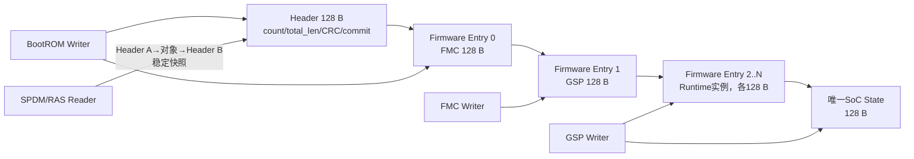

## 9.0 Counter产品语义

1. 所有Vendor type 1 SoC stage镜像共用一个16字节global `rollback_counter`，wire和内存接口统一表达为`uint8_t[16]`。
2. FMC、GSP、PMP、RMP、MMP和Die1属于SoC global counter域。FMC package给出本boot candidate；FMC初始化完成提交证明后，其他SoC镜像只允许匹配已提交值。
3. Vendor type 0 eHSM FW属于独立counter域，不要求与SoC global counter相等，也不得推进SoC counter。
4. BootROM以`check_version=0`验证FMC，使BL暂存认证candidate；BootROM不独立读取、比较或写stored counter。
5. FMC只从BootROM生产、verify PASS、`RELEASE_AUTHORIZED`且CRC/commit有效的FMC Entry取得`expected_candidate`。
6. FMC把`expected_candidate`回传BL；BL与RAM candidate逐字节一致后执行stored compare、必要单调写和权威readback。
7. 只有commit proof成立后FMC才接收GSP；GSP以`check_version=0`验证并必须与已提交值相等。

固定顺序：

```text
FMC candidate commit proven
 -> GSP verify/decrypt
 -> Header/stage policy
 -> Loader and counter equality
 -> GSP Measurement commit
 -> Release GSP
```

## 9.0.1 Vendor 16字节Counter合同

1. Vendor Native Header `Version_Counter`位于offset 608，长度16字节；SoC counter位于eHSM OTP固定资源。
2. Counter采用Vendor单向编码；项目只逐octet保存，比较和更新必须调用Vendor语义。
3. BL比较允许相同值。非naked type 1镜像验证成功后，BL保存candidate和valid状态；`check_version=0`只关闭自动比较，不关闭candidate暂存。
4. BL verify不写OTP。产品不得依赖eHSM FW启动或FW `SOC_VERIFY check_version=ON`推进SoC counter。
5. 通用`ehsm_read_counter(..., uint64_t *)`与16字节SoC Counter无关，产品不得映射或使用raw OTP替代专用接口。

Counter状态固定为：

```text
VENDOR_CANDIDATE_STAGED
  -> EXPECTED_CANDIDATE_MATCHED
  -> COMPARE_PASS_EQUAL | COMPARE_PASS_GREATER
  -> COMMIT_IN_PROGRESS
  -> COMMIT_PROVEN
```

- Vendor verify PASS和`VENDOR_CANDIDATE_STAGED`均不等于OTP已经提交。
- `stored_counter_before/after[16]`必须带权威来源和时点；只有`COMMIT_PROVEN`才可形成release级结果。
- `MEASUREMENT_ROLLBACK_CHECKED`只能来自真实Counter合同。
- 不可逆命令timeout或acceptance unknown禁止自动retry；service/context进入quarantine。

## 9.0.2 eHSM BL staged-candidate提交API

FMC使用以下typed API提交SoC candidate：

```c
int32_t ehsm_bl_commit_staged_soc_rollback_counter(
    ehsm_ctx_t *ctx,
    const uint8_t expected_candidate[16],
    ehsm_bl_rollback_counter_result_t *result);
```

API只操作固定SoC rollback-counter资源，并必须：

1. 将`expected_candidate`与BL验证FMC时记录的RAM candidate逐字节比较；
2. 在OTP改动前拒绝无candidate、invalid或不一致；
3. 低值拒绝、相等不写、更高值按Vendor单向编码写入；
4. 完成权威readback；
5. 在`result`返回before、after、比较关系、是否写入、readback和raw status。

Command ID、wire packing、LCS权限和适用eHSM BL版本必须由Vendor绑定配置生成。不得使用通用64位Counter、raw OTP、candidate暂存状态或eHSM FW启动副作用替代。
## 9.1 公共Verification流水线

FMC、GSP、PMP、RMP、MMP和Die1的Vendor type 1 SoC stage package固定执行下列完整流水线，不允许调用stage裁剪步骤或改变顺序：

```text
RECEIVED
  -> OUTER_BOUNDS_CHECKED
  -> VENDOR_HEADER_PREFLIGHT
  -> EHSM_VERIFY_DECRYPT
  -> AUTHENTICATED_HEADER_RECHECK
  -> HEADER_OVERLAY_CHECK
  -> POLICY_AND_EPOCH_CHECK
  -> LOAD_PLAN_VALIDATED
  -> LOADED_AND_READBACK_CHECKED
  -> MEASUREMENT_COMMITTED
  -> RELEASED
```

`LOADED_AND_READBACK_CHECKED`内部固定完成“按受信Profile计算认证源Code Region摘要→`target+1024`原地搬移→目标Region回读→同算法重算摘要→常量时间比较”，不存在独立`PAYLOAD_DIGEST_VERIFIED`或`PLAINTEXT_DIGEST_CHECK` release状态。任一步失败即停止后续步骤。`eHSM VERIFY_IMAGE PASS`只证明Vendor Header、Vendor支持的policy、签名和解密结果，不替代NGU Header Overlay、typed-stage固定目标、FMC/GSP rollback counter一致性、loader源/目标摘要、Measurement commit或release检查。

eHSM Vendor FW不使用NGU Header Overlay，也不进入上述SoC stage流水线；它固定执行Vendor type 0专用流程“package边界检查→Vendor BL认证/启动→`firmware_done=1 && firmware_err=0`→记录完整package blob Measurement”。不得为复用SoC流水线而伪造Overlay、loader或release状态。

## 9.2 Verification请求和结果合同

逻辑合同如下；精确padding与编译器布局不得直接作为跨组件ABI：

```c
typedef struct {
    uint64_t system_addr;
    uint64_t size;
} ngu_system_span_t;

typedef struct {
    uint32_t caller_stage;
    uint32_t image_type;
    uint32_t instance_id;
    uint32_t die_id;
    uint32_t expected_vendor_image_type;
    uint32_t policy_profile_id;
    uint32_t algorithm_profile_id;
    uint32_t target_region_id;
    uint64_t fixed_load_addr;
    uint64_t max_code_size;
} ngu_typed_stage_profile_t;

typedef enum {
    NGU_COMPLETION_NOT_SUBMITTED = 0,
    NGU_COMPLETION_COMPLETED = 1,
    NGU_COMPLETION_ACCEPTANCE_UNKNOWN = 2
} ngu_completion_state_t;

typedef enum {
    NGU_VERIFY_EMPTY = 0,
    NGU_VERIFY_PREFLIGHT_PASS = 1,
    NGU_VERIFY_VENDOR_PASS = 2,
    NGU_VERIFY_HEADER_PASS = 3,
    NGU_VERIFY_OVERLAY_PASS = 4,
    NGU_VERIFY_POLICY_PASS = 5,
    NGU_VERIFY_FAILED = 6,
    NGU_VERIFY_QUARANTINED = 7
} ngu_verify_state_t;

typedef struct {
    uint64_t request_id;
    const ngu_typed_stage_profile_t *stage_profile;
    ngu_system_span_t package;
    ngu_system_span_t output;
    uint32_t check_version;             /* SoC stage固定为0 */
    uint32_t vendor_boot_after_verify;  /* SoC stage固定为0 */
} ngu_verify_request_t;

typedef struct {
    uint64_t request_id;
    ngu_completion_state_t completion;
    ngu_verify_state_t state;
    uint32_t raw_vendor_status;
    uint32_t project_error;
    uint8_t authenticated_vendor_image_type;
    uint8_t authenticated_plain_flag;
    uint8_t authenticated_naked_flag;
    uint8_t reserved0;
    uint32_t authenticated_code_size;
    uint8_t authenticated_rollback_counter[16];
    uint64_t authenticated_load_addr;
    ngu_system_span_t authenticated_code_region;
    uint32_t trusted_image_type;
    uint32_t trusted_instance_id;
    uint32_t trusted_die_id;
    uint32_t validated_algorithm_profile;
} ngu_verify_result_t;
```

规则：

1. Request只引用调用者已经取得Owner的固定buffer；全部span使用baremetal 64位System Address并通过range/overflow检查，不携带domain。
2. Result由adapter根据真实eHSM响应、authenticated Header Overlay和typed-stage policy生成；调用者不得根据Expected构造PASS。`validated_algorithm_profile`来自受信stage registry/provisioning matrix，不表示Vendor response返回Profile。
3. `raw_vendor_status`原样保留用于诊断，产品控制流只消费归一化`state/project_error`和已验证字段。
4. Result不包含expected/source/target digest；rollback counter和System Address span不得指向临时Vendor响应，在context回收前复制到调用stage自己的受控对象。版本管理只存在于外部release metadata，不进入设备端包解析。
5. Verify成功后如任一后置检查失败，结果降级为`AUTHENTICATED_FORMAT_ERROR`或相应policy错误，禁止加载和release。

## 9.3 Loader、地址与release合同

```c
typedef struct {
    uint64_t request_id;
    const ngu_typed_stage_profile_t *stage_profile;
    ngu_system_span_t authenticated_package;
    uint32_t code_size;
    uint64_t authenticated_load_addr;
} ngu_loader_request_t;

typedef struct {
    uint64_t request_id;
    uint32_t status;
    uint32_t target_region_id;
    uint64_t bytes_loaded;
    uint64_t actual_load_addr;
    uint64_t actual_entry_addr;
    uint32_t digest_algorithm;
    uint32_t digest_size;
    uint8_t source_digest[64];
    uint8_t target_readback_digest[64];
} ngu_loader_result_t;
```

Loader按以下顺序执行：

1. 校验源buffer Owner、长度、对齐和当前generation；
2. 在64位无符号域中检查`base + size`溢出、目标Region边界、目标image唯一性，并固定`entry_addr=load_addr`；
3. 验证Header Overlay System Address与typed-stage固定目标精确相等；不得执行Local/System转换；
4. 撤销Host对目标区的访问，建立最小写权限；
5. 按`validated_algorithm_profile`计算`target+1024`开始、长度为`Code_Size`的已认证源Code `source_digest`；
6. 以`memmove(target,target+1024,Code_Size)`搬移后执行write/release与必要barrier，不执行data clean/invalidate；从目标回读同样`Code_Size`计算`target_readback_digest`，再常量时间比较；不相等时清零目标并保持NX；
7. 把目标区改为最终RX/RW权限并锁定；明文staging清零；
8. 返回实际System Address、实际长度、摘要算法及源/目标两个摘要。

Release是单独的不可伪造动作，必须同时满足`verify PASS`、`loader PASS`、`Measurement commit`、依赖满足和错误状态清洁。`release`不得隐式加载、验签或修改counter；失败不得继续执行旧内容。

## 9.4 Counter对象和原子性

产品公共层不暴露raw OTP，也不向BootROM或普通业务提供分离的read/compare/update三件套。唯一状态改变入口是FMC初始化可调用的typed adapter：

```c
typedef struct { uint8_t octets[16]; } ngu_rollback_counter_t;

ngu_status_t ngu_commit_staged_soc_rollback_counter(
    const ngu_rollback_counter_t *expected_candidate,
    ngu_counter_update_result_t *result);
```

该adapter必须绑定eHSM BL新增API并保持candidate精确匹配语义；BootROM、GSP普通任务、Runtime和Host不可调用。结果必须区分`NOT_ACCEPTED`、`REJECTED_CANDIDATE_MISMATCH`、`REJECTED_LOWER`、`ACCEPTED_NOT_PROVEN`、`PROVEN_EQUAL`、`PROVEN_UPDATED`和`FAILED_KNOWN`。不可逆提交一旦可能被eHSM接受，timeout后不得自动重发；只有权威读回与专用状态查询能关闭未知状态。

## 9.5 Measurement Table ABI v1

Measurement Table是跨stage可信事实记录和SPDM证明输入，不是Handoff、命令区、运行期事件日志或物理counter。物理Region固定为16 KiB，最多容纳126个Firmware Entry；产品必须按实际拓扑生成更小的`max_fw_entries`。

### 9.5.1 ABI约束

- State只记录SoC安全状态，不记录eHSM状态。
- BootROM是隐式可信测量根，不创建普通Firmware Entry。
- Firmware列表按实际独立验证、加载或release/隔离实例形成，`total_len/fw_entry_count`为实际值。
- 固定一个SoC State，不设置`state_entry_count`字段。
- Header不包含`generation`；每次启动必须先失效上次启动Header并清零整个Region。
- 保留CRC和32位`commit_marker`，每个结构只保留一个尾部`reserved[]`。
- Measurement只保存64位baremetal System Address，不设置地址domain；Header Overlay policy和loader负责System Address精确匹配、范围及Region校验。
- Measurement不包含`algorithm_profile`、`key_id/signer_id`、eHSM状态和时间戳。

### 9.5.2 可变长度布局

| 对象 | 大小/数量 |
|---|---|
| Header | 固定128 bytes |
| Firmware Entry | 每项128 bytes；数量=`fw_entry_count` |
| SoC State Entry | 固定1项、128 bytes |
| `total_len` | `256 + fw_entry_count × 128` |
| 物理Region | `align_up(256 + max_fw_entries × 128, firewall_granule)` |

```text
base+0x000  Header                              0x080
base+0x080  Firmware Entry[0]                  0x080
            Firmware Entry[1]                  0x080
            ...
            Firmware Entry[fw_entry_count-1]   0x080
            SoC State Entry                    0x080
base+total_len  logical end
```

Firmware列表必须紧凑无空洞。`total_len`必须满足公式、不得超过固定Region容量，所有乘加先做整数溢出检查。

### 9.5.3 Header

| Offset | Size | 字段 | 规则 |
|---:|---:|---|---|
| 0 | 4 | `magic` | `NGMT` / `0x544D474E` |
| 4 | 2 | `version` | `0x0100` |
| 6 | 2 | `header_len` | 128 |
| 8 | 4 | `total_len` | 当前实际逻辑长度 |
| 12 | 4 | `fw_entry_count` | 当前COMMITTED Firmware Entry实际数量 |
| 16 | 16 | `device_uuid` | 设备UUID |
| 32 | 16 | `chip_id` | 芯片唯一ID |
| 48 | 72 | `reserved` | 唯一预留区；全0 |
| 120 | 4 | `header_crc32c` | 覆盖0～119 |
| 124 | 4 | `commit_marker` | Header发布点 |

### 9.5.4 Firmware Entry

| Offset | Size | 字段 | 规则 |
|---:|---:|---|---|
| 0 | 4 | `fw_type` | 不包含BootROM普通Entry |
| 4 | 4 | `instance_id` | 来自受信typed-stage registry，不来自包内自声明 |
| 8 | 4 | `die_id` | Die0=0、Die1=1 |
| 12 | 4 | `flags` | boot/runtime/recovery分类，并标明`COUNTER_DOMAIN_SOC_GLOBAL`或`COUNTER_DOMAIN_EHSM` |
| 16 | 4 | `hash_algo` | SHA-256或SM3 |
| 20 | 4 | `hash_len` | 32 |
| 24 | 32 | `hash` | 实际测量结果 |
| 56 | 16 | `rollback_counter` | 固定16字节 |
| 72 | 4 | `verify_result` | 有效Entry必须PASS |
| 76 | 4 | `release_state` | 有效Entry必须`RELEASE_AUTHORIZED`；不声称目标已经运行 |
| 80 | 8 | `load_addr` | 64位baremetal System Address；不适用时0 |
| 88 | 8 | `entry_addr` | 64位baremetal System Address；不适用时0 |
| 96 | 24 | `reserved` | 唯一预留区；全0 |
| 120 | 4 | `entry_crc32c` | 覆盖0～119 |
| 124 | 4 | `commit_marker` | Entry发布点 |

一个Entry对应一个成功验证、加载且已获release授权的实例；`fw_type + die_id + instance_id`唯一。验证失败、未验证、未获release授权、隔离候选和受限非安全启动都不创建成功Firmware Entry，也不得伪造PASS。多个微核共享同一代码并作为一个整体release时只形成一项；分别release时即使Hash相同也分别形成Entry。

### 9.5.5 SoC State Entry

| Offset | Size | 字段 | 规则 |
|---:|---:|---|---|
| 0 | 4 | `lifecycle_state` | SoC LCS |
| 4 | 4 | `debug_enable_state` | SoC Debug总状态 |
| 8 | 4 | `anti_rollback_enable` | 防回滚状态 |
| 12 | 16 | `stored_global_counter` | 权威读回的16字节值 |
| 28 | 4 | `firewall_state` | SoC Firewall状态 |
| 32 | 4 | `oob_recovery_state` | SoC OOB/Recovery状态 |
| 36 | 4 | `boot_fail_reason` | 成功为0 |
| 40 | 4 | `die_num` | 当前有效Die数量 |
| 44 | 4 | `cert_slot_id` | 当前SPDM证书slot |
| 48 | 4 | `cert_chain_digest_algo` | 证书链摘要算法 |
| 52 | 4 | `cert_chain_digest_len` | 32 |
| 56 | 32 | `cert_chain_digest` | 当前证书链摘要 |
| 88 | 32 | `reserved` | 唯一预留区；全0 |
| 120 | 4 | `entry_crc32c` | 覆盖0～119 |
| 124 | 4 | `commit_marker` | State发布点；提交后Table完成 |

State不包含eHSM status/error/health、Key轮换Bitmap、Key/Signer内部slot、运行期RAS事件或时间戳。

### 9.5.6 类型、顺序、Hash和Counter

FMC必须为Entry 0，GSP必须为Entry 1；其余项由GSP按`fw_type、die_id、instance_id`稳定排序追加。包内不携带`measurement_slot`或实例身份；Entry身份由producer根据受信typed-stage registry、运行目标`die_id`和release profile生成。

FMC/GSP/PMP/RMP/MMP/Die1记录loader目标明文最终readback Hash，flags标记`COUNTER_DOMAIN_SOC_GLOBAL`；eHSM Vendor FW记录Vendor认证package blob Hash并要求FW done且无error，flags标记`COUNTER_DOMAIN_EHSM`，其`rollback_counter[16]`记录经Vendor type 0认证的eHSM FW counter。两域不要求相等。Counter字段只作已验证事实快照，SoC global compare/update/readback仍由eHSM BL权威API完成。

## 9.6 Producer、Consumer和Commit协议

| Producer | 可写对象 | 主要Consumer | 约束 |
|---|---|---|---|
| BootROM | Header、Entry 0 FMC | FMC、GSP/SPDM | 先清零全Region；FMC Entry验证回读后才跳转 |
| FMC | Entry 1 GSP | GSP/SPDM | counter proof后append并commit |
| GSP | Product Topology定义的实例、唯一State | SPDM、RAS、审计 | 实例紧凑追加；State最终提交后Table关闭 |
| SPDM/RAS | 无 | stable snapshot | 只读私有copy |

### 9.6.1 CRC-32C

Header、Firmware Entry和State Entry统一使用CRC-32C Castagnoli：reflected polynomial `0x82F63B78`、`init/xorout=0xFFFFFFFF`、refin/refout true，`"123456789"`校验值`0xE3069283`。所有对象都覆盖offset 0～119；CRC和commit不纳入计算，reserved全0并纳入CRC。

CRC只检测torn write和随机损坏。它不提供攻击者认证，不建立Measurement专用密钥；安全真实性来自受信writer和安全RAM隔离。若GSP、Host或其他master权限不满足本章边界，SPDM不得ready。

### 9.6.2 最终32位Commit

| Marker | Value | Consumer |
|---|---:|---|
| EMPTY | `0x00000000` | 不存在 |
| WRITING | `0x54495257` | 拒绝 |
| COMMITTED | `0x54494D43` | 继续完整校验 |
| 其他 | — | 损坏，拒绝 |

单个Entry固定顺序：

```text
require target append offset is empty and owned
  -> publish WRITING; write/release fence; readback
  -> build private complete object and zero reserved/invalid fields
  -> copy payload; calculate/write CRC
  -> release fence（data clean/invalidate=0）
  -> single aligned uint32 store COMMITTED
  -> release fence; readback marker
  -> execute consumer-style full validation
  -> only then authorize and execute the separate target release
```

Reader固定顺序：

```text
acquire read COMMITTED
  -> direct read under the selected NON_CACHEABLE or HARDWARE_COHERENT attribute
  -> copy full object to private buffer
  -> acquire fence and re-read shared marker
  -> validate header length/count/capacity or entry type/instance/die, then reserved/CRC
  -> return copied values, never shared mutable pointer
```

C908对齐32位store和跨master可见性必须由最终PMA Evidence证明。最终属性只允许`NON_CACHEABLE`或`HARDWARE_COHERENT`，两者均不执行data clean/invalidate，只使用write/release和acquire/read barrier。若不能证明，真实shared-RAM实现保持blocked；不得改变ABI、加入delay或循环读取伪装成功。

### 9.6.3 Stage顺序

BootROM先把旧Header置EMPTY并清零整个固定Region，再发布`fw_entry_count=0、total_len=256`的新Header。BootROM不创建自身Entry；它使用同一次FMC transaction的认证Header Overlay、typed-stage identity、loader readback和BL staged candidate事实追加Entry 0。验证Entry 0及更新后的Header后才release FMC。FMC入口按`fw_type=FMC、instance_id=0、die_id=0`查找和复制Entry，成功后必须先提交staged counter，证明成立前不得接收GSP。

FMC对GSP固定执行：

```text
consume FMC Entry
  -> pass FMC expected_candidate to BL
  -> require BL RAM candidate exact match
  -> authoritative counter equal/update/readback proof
  -> verify/decrypt/post-check GSP with check_version=0
  -> require GSP rollback_counter equals committed value
  -> loader/readback
  -> Header WRITING
  -> append Entry 1 GSP and COMMITTED
  -> update fw_entry_count/total_len/CRC
  -> Header COMMITTED and validate
  -> release GSP
```

GSP入口验证FMC/GSP Entry的type/instance/die、Hash、`RELEASE_AUTHORIZED`和16字节SoC counter一致性后才初始化security service。上游Entry保持只读；GSP按实际独立release实例和`fw_type、die_id、instance_id`稳定顺序紧凑追加eHSM FW/PMP/RMP/MMP/Die1。失败候选不增加count，可在首次release前按stage策略重新接收；成功Entry不可覆盖。全部计划对象处理完成后，GSP在Firmware前缀之后提交唯一State；State提交后不得再追加或修改。

## 9.7 Reset和SPDM snapshot

### 9.7.1 Reset清理

ABI v1不保存`generation`。BootROM每次安全启动固定执行：

1. 旧Header marker写EMPTY并执行write/release fence和readback；
2. 清零整个固定Measurement物理Region；
3. 执行write/release fence并验证整个固定Region为0；不执行data clean/invalidate；
4. 发布新的空Header；
5. 才开始FMC验证和追加。

任何清零、cache可见性或Header重新发布失败都阻断启动；不得保留旧Entry、使用时间戳替代清零或把旧Table交给SPDM。

### 9.7.2 Stable snapshot

SPDM/审计reader不持有写锁：

1. 复制并验证Header A的commit、CRC、长度公式、count上限和Region边界；
2. 按A中的count复制紧凑Firmware列表和唯一State；
3. 要求所有Entry及State COMMITTED并通过CRC、唯一性和字段校验；
4. 执行acquire/read fence；不执行data invalidate；
5. 再复制Header B；
6. 要求Header A/B逐字节一致且仍COMMITTED；
7. 变化时丢弃并重试一次，仍变化返回`SNAPSHOT_BUSY`。

Snapshot是`Header + copied Firmware entries + copied SoC State`的私有对象。协议层不能引用共享Table。SPDM block index、对外字段裁剪、地址披露和聚合规则必须由SPDM Profile固定生成。

## 9.8 错误、测试和实现门禁

必须覆盖：

- Header/Firmware/State逐字段golden vector和跨语言round-trip；
- magic/version/length公式、count/capacity/溢出、紧凑前缀和reserved非0；
- CRC-32C标准向量及三类128字节对象每个写入阶段torn write；
- WRITING、非法marker、先commit后payload、cache不可见和readback失败；
- wrong type/instance/die/producer、重复tuple和State后继续append；
- 16字节rollback counter的equal/greater/lower、update readback和timeout/unknown；
- loader目标篡改、Hash长度/算法错误，确认不复制Profile、Key/Signer和地址domain；
- cold/warm/unknown reset、Header先失效、完整Region清零及旧Entry残留；
- SPDM复制期间新Entry commit、一次重试和`SNAPSHOT_BUSY`；
- 相同Hash的共享实例与独立release实例；
- eHSM FW package digest、Vendor PASS、FW done/error组合；
- 确认BootROM不生成普通Entry、不自Hash伪证；
- State不包含eHSM状态、Key Bitmap和时间戳；
- 任一Measurement失败后release绕过。

实现门禁：

- 生成Measurement Region的唯一PMA属性、Firewall和System Address；
- 生成产品实际`max_fw_entries`，不得超过126项物理硬上限；
- 绑定eHSM BL专用Counter API的command、packing、LCS和适用版本；
- 生成Runtime package、依赖和Release Profile；
- 生成SPDM wire block/profile；
- 使用正式toolchain、flags、KMS、SBOM、兼容矩阵和Release Owner配置。

# 第10章 Lifecycle、Debug/RMA、Key、OTP/eFuse、证书与轮换

本章定义Lifecycle、Debug/RMA、Key层级、OTP对象、设备身份、证书、制造Provisioning和Key Rotation的最终工程合同，适用于RTL/DFT、KMS/CA、制造工具、C908 Provisioning FW、eHSM Adapter和GSP运行期服务。

以下边界贯穿本章：

1. Lifecycle、RTL Key、OTP Key、证书私钥、Debug和Key Rotation属于不可逆或高权限能力，禁止向外部Host开放raw eHSM、raw OTP或caller自选物理slot。
2. BootROM只读取`non_sec_boot`只读快照及按需读取SoC LCS/Strap，输出安全模式或非安全子Profile；不获得raw eFuse/LCS写能力、不安装Key、不发起eHSM自检。
3. 制造灌装由`non_sec_boot=0`、DEV/MANU、Strap=0下的独立`MANUFACTURING_PROVISIONING`子Profile承担；产品GSP、`RESTRICTED_NONSECURE`和`non_sec_boot=1`路径不提供制造Key/Certificate服务。
4. eHSM BL对制造命令作最终Lifecycle、硬件制造条件、signed recipe/ticket、设备绑定、usage、Key层级、依赖和物理资源判定；SoC侧检查不能代替BL检查，BL检查也不能代替制造Controller的recipe编排和审计。
5. 所有物理slot、usage、Lifecycle、Device binding、Recipe和证书字段必须由受控registry或Profile生成，调用者不得传入裸资源号或自由策略。

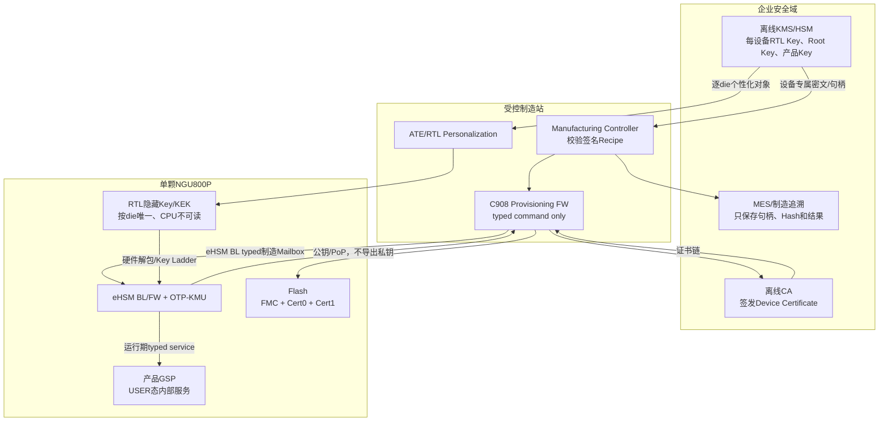

## 10.1 Lifecycle模型、启动策略与不可逆操作框架

### 10.1.1 Lifecycle状态

软件必须识别`TEST`、`DEV`、`MANU`、`USER`、`DEBUG`、`DESTROY`以及`INVALID/UNDEFINED`。产品常量必须从baremetal受控生成头取得，禁止复制文档裸值。

普通产品转换只允许相邻边：

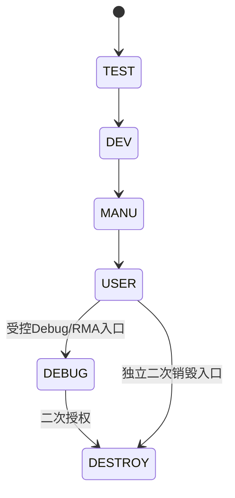

不得倒退、跳过必需检查或把未知raw值映射为宽松状态。`USER -> DESTROY`不是普通`ngu_lcs_change()`边，只能由独立二次授权销毁操作完成。

### 10.1.2 BootROM模式矩阵

| `non_sec_boot` | SoC LCS | `secure_boot=0` | `secure_boot=1` | Measurement/启动审计 |
|---|---|---|---|---|
| 有效且值1 | 任意/不消费 | `RESTRICTED_NONSECURE` | `RESTRICTED_NONSECURE` | 不创建Entry/State，不写启动审计，不开放制造接口 |
| 有效且值0 | USER | 强制安全启动 | 强制安全启动 | 只在安全链真实成功后提交 |
| 有效且值0 | DEV/MANU | `MANUFACTURING_PROVISIONING` | 安全启动 | 非安全制造路径不创建安全Entry/State、不写安全启动审计 |
| 有效且值0 | 其他已识别非USER | `RESTRICTED_NONSECURE` | 安全启动 | 受限路径不创建Entry/State、不写启动审计 |
| 有效且值0 | 读取失败、非法、`UNDEFINED`、来源无效或组合不允许 | 受限非安全启动 | 受限非安全启动 | 不创建Entry/State，不写启动审计 |
| 读取/ECC/镜像/来源异常 | 不消费 | 启动策略输入错误终态 | 启动策略输入错误终态 | 两条FMC release均阻断 |

`non_sec_boot`为最高优先级、默认0的1 bit eFuse启动策略位；值1只选择`RESTRICTED_NONSECURE`。BootROM只读取复位锁存的只读快照，不提供raw eFuse或烧写接口。SoC LCS读取不依赖eHSM Autoload、Ready或自检。只有值0、DEV/MANU、Strap=0和有效制造Profile的精确组合允许Provisioning FW调用eHSM BL typed制造接口；受限非安全启动不能开放OTP/eFuse/KMU写、counter写、raw eHSM、未鉴权Debug、证书私钥或Host任意执行权限。

### 10.1.3 不可逆操作通用状态

所有OTP/LCS/Key destroy/Bitmap commit操作统一遵守：

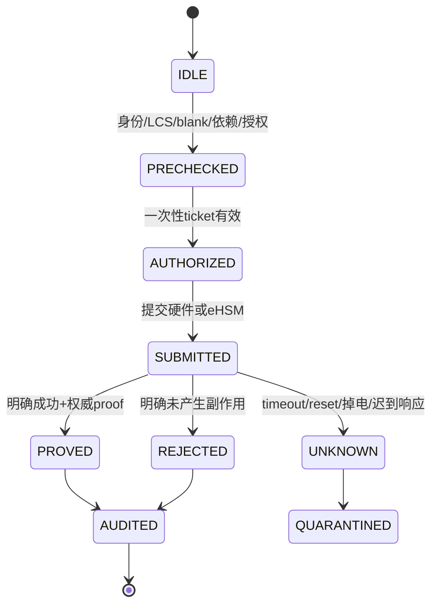

`SUBMITTED`之后禁止自动retry。只有能证明“命令未被接受且目标未改变”时才可由新operation重新开始；`UNKNOWN`必须隔离对象、context和相关服务，等待权威查询、全新boot或人工处置。

### 10.1.4 `non_sec_boot`烧写与生效

`non_sec_boot`不属于正常量产默认工序，也不属于产品GSP运行期服务。在DEV/MANU中，其设备侧写入口是构建隔离的`MANUFACTURING_PROVISIONING`子Profile中的typed不可逆操作`PROV_ASSERT_NON_SEC_BOOT`；在USER安全链已无法启动的场景中，若产品仍要求事后断言该位，必须另有不依赖C908产品FMC/GSP或Provisioning FW启动成功的强授权Secure ATE/维修端口或不可变eHSM BL窄操作。两类入口均固定遵守：

1. 请求不携带raw offset、bit号或目标值，操作语义只能是把当前逻辑0单向断言为1；
2. 执行前验证设备UID、一次性授权、批准的Lifecycle/Profile、当前值有效且为0、ECC/电源/写窗和审计可用；
3. 当前值已为1时只返回`ALREADY_ASSERTED`和权威readback，不重复烧写；
4. 提交后执行权威readback并证明逻辑值1、ECC/valid/镜像和锁定状态；timeout、掉电或结果未知进入`QUARANTINED`，禁止自动retry；
5. 成功后要求完整reset重新进入BootROM，由硬件重新锁存只读快照；当前boot的软件变量不能提前模拟生效；
6. 不存在1→0、清除、撤销、Host覆盖或BootROM写接口；`RESTRICTED_NONSECURE`、正常产品构建和普通非安全固件中该命令必须不可达；
7. USER维修入口未完成硬件可达性、强授权、readback和锁定绑定前，不得将该字段描述为“设备起不来后仍可开启”的逃生能力。字段一旦为1，下次BootROM仍只进入`RESTRICTED_NONSECURE`，不会获得制造灌装权限。

## 10.2 Lifecycle服务、Debug/RMA与Destroy

### 10.2.1 Lifecycle typed API

```c
ngu_status_t ngu_lcs_read(ngu_lcs_state_t *state, uint32_t *raw);
ngu_status_t ngu_lcs_query_transition(ngu_lcs_state_t target,
                                      ngu_lcs_transition_info_t *info);
ngu_status_t ngu_lcs_change(const ngu_lcs_change_request_t *request,
                            ngu_lcs_change_result_t *result);
```

`ngu_lcs_change()`只可由GSP Lifecycle服务或制造Provisioning FW的固定步骤调用。前置条件包括可信安全启动/制造启动、精确current/target边、一次性授权、eHSM Ready、没有Key/Debug/Update并发事务、审计可用和目标硬件写窗已最小化。调用前后分别读取SoC和eHSM相关状态；任何不一致进入安全错误。

### 10.2.2 Debug鉴权

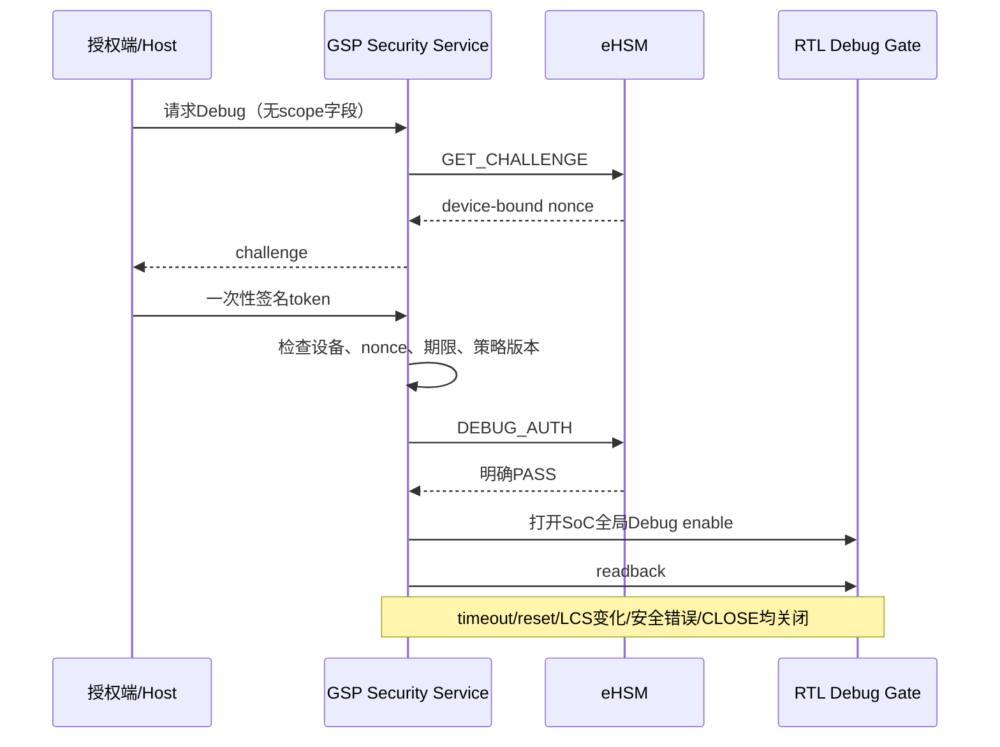

NGU800P没有Debug scope、Die/core bitmap或分级授权。Token不得携带caller可控scope；至少绑定设备、challenge、期限/计数、operation和策略版本。授权消费一次后关闭Vendor user-auth状态，不能复用于LCS、Key Rotation或其他事务。

SoC全局Debug enable只有`CLOSED/OPEN`两态，Die0/Die1跟随同一开关。打开/关闭均readback；无法证明关闭时上报RAS并阻断继续暴露。Debug开启不授予OTP、Key、明文固件、安全RAM或raw Mailbox访问。

### 10.2.3 RMA和Destroy

RMA由`DEBUG` LCS承载，但使用独立RMA授权和只读诊断白名单，不新增RMA LCS、不关闭安全启动。进入DEBUG前，必须先调用Vendor删除全部FW RAM/NVM用户Key并取得确定证明；若Key已删除而LCS写入失败或未知，进入`KEYS_DELETED_LCS_UNCHANGED`，不恢复Key、不报告成功。

DESTROY是不可恢复终态。执行前关闭外部接口、清理敏感资产、确认审计和二次授权；执行后只保留平台定义的最小设备识别和错误上报能力。

## 10.3 密钥资产、唯一性和层级

### 10.3.1 每设备、每产品和离线资产

| 资产类别 | 唯一性 | 产生/持有者 | 是否进入设备 | 是否可导出 |
|---|---|---|---|---|
| RTL Root/Install KEK | 每die唯一 | KMS/HSM + RTL Personalization | 隐藏硬件 | 不可读 |
| Chip Root Key | 每die唯一 | KMS或eHSM合格RNG | OTP-KMU | 不可导出 |
| Device Root Key | 每die唯一 | KMS或eHSM合格RNG | OTP-KMU | 不可导出 |
| UDS | 每die唯一 | Provisioning Profile固定来源，eHSM RNG优先 | OTP-KMU slot 13 | 不向Host导出 |
| Device Attestation Private Key | 每die唯一、每算法Profile | eHSM内部RNG | OTP-KMU | 只导出公钥 |
| Device Certificate | 每die唯一 | 离线CA | Cert0/Cert1 | 可读取 |
| Boot/Update Verify Key Object | 产品/SKU/客户级 | 离线签名KMS | OTP-KMU | 材料形态由Key Attribute Profile定义 |
| Firmware Encrypt Key | 产品/SKU/客户级明文，按设备封装 | KMS | OTP-KMU | 不可导出 |
| Debug/User Auth Key Object | 产品/授权域级 | 离线授权KMS | OTP-KMU | 材料形态由Key Attribute Profile定义 |
| 离线签名/CA私钥 | KMS/CA域 | 离线HSM | 不进入设备 | 不导出HSM |
| Session/Operation Key | 每会话/操作 | eHSM RNG/KDF | RAM/内部Key对象 | 到期清零 |

“产品级Key”表示明文可以按受控策略复用，不表示传输密文可以跨设备复用。一机一密RTL KEK使同一产品Key对不同设备形成不同外层密文；Recipe必须绑定设备。

### 10.3.2 Key层级

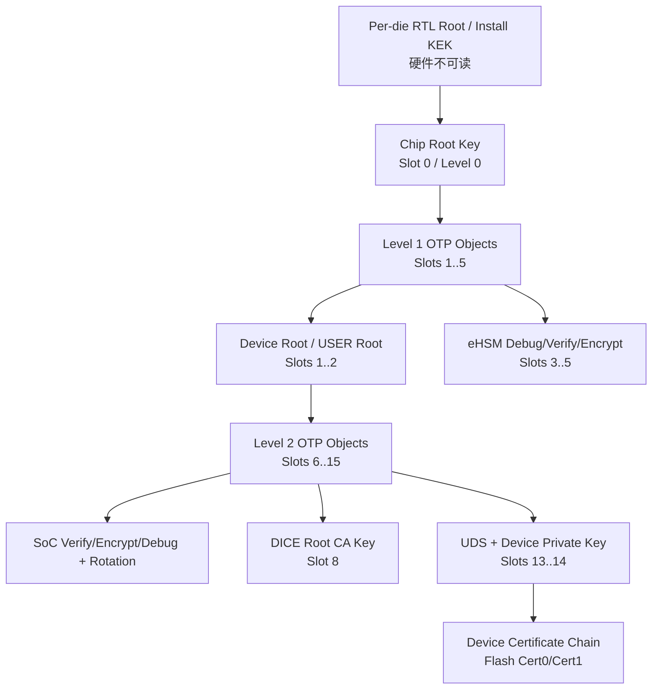

层级不变量：

1. Level1对象由Chip Root层级保护；slot 3～5固定为Level1。
2. Level2对象必须在Device Root存在并通过operation proof后安装。
3. DICE Root CA Key固定为slot 8/asymm、UDS固定为slot 13/asymm、Device Private Key固定为slot 14/asymm。
4. slot 8、13、14的OTP/KMU属性包含七项权限：签名/MAC、验签/MAC验证、加密、解密、派生/协商、删除和明文导入。产品软件仍通过typed service、Lifecycle和Provisioning Profile限制调用者，不向Host暴露raw Key能力。
5. Root、私钥和对称秘密不得经普通产品接口导出；slot 2类型、具体算法及asymm对象的公私钥材料形态必须由Key Attribute Profile定义。
6. 所有Key用途由OTP attribute和软件registry双重限制；“物理槽已写”不等于“usage正确”。

## 10.4 一机一密RTL Key量产合同

### 10.4.1 目标模型

量产设备的RTL Root/Install KEK必须按die唯一。Vendor TRM中的`OSR_RTL_KEY`、`OSR_RTL_KEY_INSTALL_KEK_EHSM`、`OSR_RTL_KEY_INSTALL_KEK_SOC`和`OSR_SCAN_RTL_KEY`只表示集成接口，不能把同一宏常量固化进全部量产die。

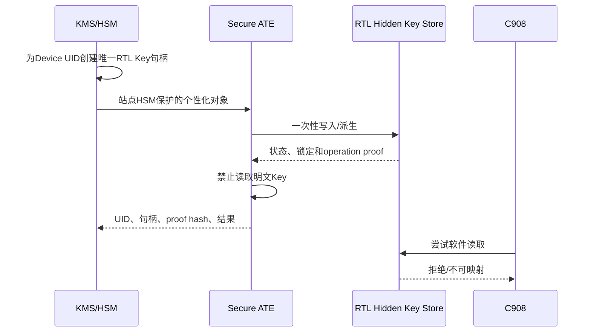

### 10.4.2 RTL/DFT必须提供的接口

| 输入 | 必须冻结的内容 | 失败处理 |
|---|---|---|
| 个性化载体 | hidden OTP/eFuse、PUF/Helper Data或Key Ladder类型 | 未实现不得量产 |
| Device绑定 | UID/ECID来源、唯一性、读取时点 | 不匹配立即隔离die |
| 写入/派生 | ATE命令、数据长度、端序、保护和认证 | 不自动重试不可逆步骤 |
| 可见性 | CPU/eHSM/Debug/Scan/DFT权限矩阵 | 软件可读即发布阻断 |
| Lock | 写锁/读锁/生命周期锁和readback | Lock不确定即报废/隔离 |
| Proof | KAT/unwrap operation、状态/ECC而非明文回读 | 无proof不得继续OTP灌装 |
| Reset/zeroize | POR、warm reset、tamper、DESTROY行为 | 与方案不符停止 |

RTL必须提供逐die个性化、不可读回和与eHSM Key Ladder连接的硬件绑定；缺失时量产Provisioning保持`BLOCKED_BY_RTL_BINDING`。

### 10.4.3 KMS数据最小化

KMS可以保存RTL秘密本身或只允许HSM内部使用的Key对象，但MES、普通数据库和repo只允许保存：

- `device_binding`；
- KMS Key handle和版本；
- 生成/使用策略ID；
- wrapped object hash；
- station/recipe ID；
- proof/result；
- 时间和授权者身份。

禁止保存Key明文、可跨设备复用的未绑定外层密文、完整Debug token、Device Private Key或站点HSM会话秘密。

## 10.5 16槽OTP-KMU最终对象基线

### 10.5.1 OTP内存映射

eHSM内部OTP基址固定为`0x33000000`。下表地址只能由eHSM访问；GSP没有安全域OTP直访通道，必须经Mailbox typed API请求eHSM访问。

| Field | Offset | Size/Word | Multi-update | Decoded by |
|---|---:|---:|---|---|
| Life Cycle | `0x000` | 1 | yes | HW |
| UID | `0x004` | 5 | no | FW |
| HW Control | `0x018` | 2 | yes | HW |
| FW Control-eHSM | `0x020` | 2 | yes | HW |
| FW Control-SoC | `0x028` | 2 | yes | HW |
| Error Response Control | `0x030` | 8 | no | FW |
| eHSM Version Counter | `0x050` | 4 | yes | FW |
| SoC Version Counter | `0x060` | 4 | yes | FW |
| OTP Key N Attribute | `0x070 + 0x28*N` | 1 | yes | HW |
| OTP Key N | `0x074 + 0x28*N` | 8 | no | HW |
| OTP Key N CRC | `0x094 + 0x28*N` | 1 | no | HW |

`Word=4 bytes`、`N=0..15`。每个Key record为10 words/40 bytes，Key区覆盖offset `0x070..0x2EF`。Key Attribute bit、CRC算法/覆盖、端序、ECC、锁位、blank polarity和backend编码必须由OTP Backend Profile生成。

### 10.5.2 槽位图

对象、表格顺序、物理Key ID、Level和Key类型以本表为准。Baremetal Key清单必须从同一registry生成。

| Slot | 对象 | Level | Key类型 | Record offset | 截图备注/用途 | 截图已给权限 |
|---:|---|---:|---|---:|---|---|
| 0 | Chip root key | 0 | symm | `0x070` | 芯片根密钥 | 未给出 |
| 1 | Device root key | 1 | symm | `0x098` | 设备根密钥 | 未给出 |
| 2 | USER root key | 1 | 未给出 | `0x0C0` | 未给出 | 未给出 |
| 3 | eHSM debug/verify key | 1 | asymm | `0x0E8` | eHSM鉴权验签密钥 | 未给出 |
| 4 | eHSM FW/update verify key | 1 | asymm | `0x110` | eHSM镜像验签密钥 | 未给出 |
| 5 | eHSM FW/update encrypt key | 1 | symm | `0x138` | eHSM镜像解密密钥 | 未给出 |
| 6 | SoC FW/update verify Rotation key | 2 | asymm | `0x160` | SoC验签轮换密钥 | 未给出 |
| 7 | SoC FW/update encrypt Rotation key | 2 | symm | `0x188` | SoC解密轮换密钥 | 未给出 |
| 8 | DICE root CA key | 2 | asymm | `0x1B0` | DICE root CA key，用于追溯 | 七项权限 |
| 9 | SoC debug verify key | 2 | asymm | `0x1D8` | SoC鉴权密钥 | 未给出 |
| 10 | SoC FW/update verify key | 2 | asymm | `0x200` | SoC镜像验签密钥 | 未给出 |
| 11 | SoC FW/update encrypt key | 2 | symm | `0x228` | SoC镜像解密密钥 | 未给出 |
| 12 | SoC debug verify Rotation key | 2 | asymm | `0x250` | SoC鉴权轮换密钥 | 未给出 |
| 13 | UDS | 2 | asymm | `0x278` | UDS | 七项权限 |
| 14 | Device private Key | 2 | asymm | `0x2A0` | DICE设备私钥、attestation key | 七项权限 |
| 15 | User auth key | 2 | asymm | `0x2C8` | 未给出 | 未给出 |

slot 8、13、14的七项权限为：签名或生成MAC、验签或验证MAC、加密、解密、派生或协商新密钥、删除、明文导入。权限是OTP/KMU对象属性能力；产品服务暴露和具体操作仍由Provisioning Profile、Lifecycle和typed policy限制。

### 10.5.3 层级与Profile规则

规则如下：

1. 设备保持DEV LCS完成Chip Root、其余Level1、目标Profile要求的Level2、证书和对象proof；slot6/7/12轮换位置保持blank。使用最终Key/证书/策略完成产品安全启动预演后，才进入相邻Lifecycle收口和最终USER提交。
2. Device Root必须在任一Level2对象之前可用；slot 3～5属于Level1，不依赖Device Root层级。
3. 软件和测试保留P-256/SM2两套能力，每台设备的Provisioning Profile只能选择一套进入槽14；不支持同机双长期私钥，也不允许跨曲线复用scalar。
4. UDS固定为slot 13/Level 2/asymm/七项权限；具体算法、材料形态和产品内部usage由Key Attribute/Profile固定。
5. 物理Key ID、Level、类型和地址公式固定；slot 2类型、具体算法、属性位、CRC/ECC、锁位、backend和材料来源必须由产品Profile生成。

### 10.5.4 Registry与生成规则

物理slot号只允许存在于`security_provisioning_release_matrix.yaml`及其生成物。每个对象至少生成：

```yaml
object_id: NGU_KEY_SOC_FW_VERIFY_PRIMARY
physical_slot: 10
level: 2
format: asymm_object
usage: [soc_boot_verify, soc_update_verify]
provision_lcs_mask: [DEV, MANU]
runtime_lcs_mask: [USER, DEBUG]
exportability: profile_controlled
rotation_group: soc_fw_verify
dependency: NGU_KEY_DEVICE_ROOT
proof_kind: vendor_operation_or_attr_readback
```

业务代码只使用`object_id`，不得接受caller传入的slot、level、usage、`last_key`或OTP offset。Registry和baremetal Key清单必须来自同一生成源；`last_key`必须由完整Recipe生成器根据Vendor OTP连续写/锁语义产生，不能手填。

## 10.6 KMS封装、外部灌装材料与敏感数据生命周期

### 10.6.1 初始灌装数据流

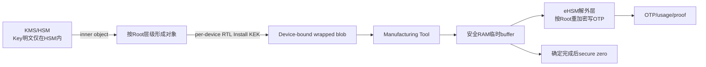

外层blob必须绑定至少`device_binding、object_id、recipe_id、object_version、nonce`。即使Vendor底层输入只接受固定密文，制造系统也必须在受控metadata中完成这些绑定并在提交前验证。

### 10.6.2 外部对象分类

| 对象 | KMS输出 | eHSM动作 | 允许证明 |
|---|---|---|---|
| 外部对称Key | per-device wrapped key | 解包、按Root加密、写OTP | usage/attr + KAT |
| 外部公钥Hash | per-device wrapped hash | 解包、写OTP | attr + 负/正签名验证 |
| eHSM内部随机Key | signed generation directive | 内部RNG生成、写OTP | 相关密码operation |
| Device Private Key（slot 14） | generation directive | 产品Profile优先内部生成；OTP属性虽允许明文导入，但Controller无任意导入接口 | 公钥导出 + PoP签名 |
| UDS（slot 13） | signed generation/import directive | 按Profile生成或导入；不向Host导出 | 对七项属性权限分别执行operation proof |
| 证书 | CA签名静态Issuer前缀+metadata | 写Cert0/1，不写OTP；动态Leaf只在GSP SRAM | Host验静态链/动态Leaf；Device验ticket/binding/key/hash并固定Profile组装 |

### 10.6.3 Vendor Adapter约束

- `ehsm_install_encrypted_key()`输入必须由设备RTL eHSM/SoC KEK保护，eHSM内部再按Level使用Chip/Device Root保护。
- 加密输入长度、32字节Key、CRC和attributes布局必须由匹配的Vendor接口定义生成。
- Level1只允许TEST/DEV；Level2只允许TEST/DEV/MANU及产品Profile明确列出的对象。
- Chip Root、Device Root和Level2安装必须使用各自typed operation，不得由通用接口猜测映射。
- Vendor版本必须通过16槽Recipe、Lifecycle、operation proof和写后readback兼容测试；任一不匹配时量产Provisioning构建失败。

## 10.7 制造系统角色、信任边界和部署

### 10.7.1 角色

| 角色 | 职责 | 禁止事项 |
|---|---|---|
| KMS/HSM | 生成/托管Key、wrap、签名recipe/ticket | 输出明文Key、复用设备blob |
| Offline CA | 签发Device Certificate/Chain | 接触Device Private Key |
| MES | 工单、设备状态和追溯 | 保存秘密或代替KMS授权 |
| Manufacturing Controller | 校验recipe、编排typed步骤、收集Evidence | raw OTP、caller自选slot |
| Secure ATE | RTL个性化和硬件proof | 回读/记录RTL明文Key |
| C908 Provisioning FW | 在DEV/MANU非安全制造子Profile中执行设备侧typed协议；等待并调用eHSM BL制造接口 | 作为信任根；产品USER服务、通用Host API、raw slot/OTP |
| eHSM BL | typed对象查询/安装/生成/证明/finalize/LCS；验证硬件制造条件、LCS、ticket、设备绑定和固定映射 | 向Host导出秘密；信任C908 caller；开放raw OTP/slot/usage/任意签名 |
| eHSM FW | USER运行期RNG/KDF/签名、轮换和受控内部服务 | 承担制造Root bootstrap；向Host导出秘密 |
| Flash Driver | 只写FMC/Cert0/Cert1固定分区 | 访问OTP或任意Flash |
| GSP Product FW | USER态内部安全服务、SPDM、轮换发起 | 向Host开放通用Key/Cert服务 |

### 10.7.2 部署要求

制造使用独立、签名且构建隔离的`C908 Provisioning FW`。BootROM仅在`non_sec_boot=0`、LCS为DEV/MANU、Strap=0且制造Profile有效时，通过`NON_SECURE_BOOT / MANUFACTURING_PROVISIONING`加载它；它不进入产品USER镜像，不包含stub、默认Key或raw shell。该镜像即使由制造发布系统签名，在eHSM BL看来仍是不可信caller，签名不能替代BL对LCS、硬件锁存启动条件、signed recipe/ticket、设备绑定、对象映射和顺序的检查。进入USER后，C908制造镜像和BL制造命令必须同时不可达。

制造Profile必须从PCIe、UART、JTAG或专用Mailbox中固定一种受控transport；transport不得改变typed语义。任何允许输入任意地址和长度的调试接口均不满足本设计。

### 10.7.3 两阶段信任建立

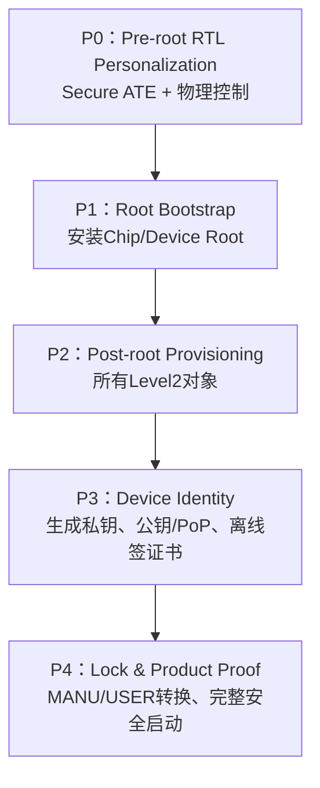

P0没有设备内根可用于验证远程ticket，只允许在受控ATE环境执行。P1完成后，后续步骤必须使用设备绑定的一次性operation ticket；ticket验证根、算法和transport由制造Profile固定，不能用“站点在内网”作为唯一授权。

### 10.7.4 eHSM BL制造API和信任边界

Vendor目标交付必须由eHSM BL提供下列typed能力，当前未交付项保持`BLOCKED_BY_VENDOR_DELIVERY`：

| BL能力 | 必须验证/执行 | 禁止暴露 |
|---|---|---|
| capability/identity query | BL版本、协议版本、UID/LCS、硬件制造条件 | raw OTP窗口和秘密状态 |
| object status query | 逻辑object、固定映射、blank/partial/valid/proved/locked/unknown | caller自选slot/Level/Attribute |
| wrapped install/internal generate | device/recipe/ticket、依赖、单向写兼容、写窗和顺序 | 明文Key、任意导入、`last_key` |
| public key/fixed PoP/object proof | 固定nonce结构、批准usage、freshness和结果摘要 | 任意消息或任意digest签名 |
| finalize/LCS transition | 完整对象矩阵、产品安全启动预演Evidence、相邻边和readback | 跳级、逆向或无Evidence进入USER |

BL不得把“调用者运行在C908”“BootROM选择了非安全启动”或“站点网络受控”单独视为授权。制造请求必须同时满足有效DEV/MANU LCS、硬件锁存的制造启动条件、设备绑定signed recipe/ticket、固定object→slot/Level/usage映射和依赖顺序。任一条件不满足时必须在不可逆接受点之前确定拒绝。

## 10.8 Signed Recipe与设备侧typed协议v1

Host侧固定使用canonical CBOR/COSE签名Recipe，设备侧使用固定二进制typed action。传输framing、数值command ID和最大payload必须由制造Profile生成。

本节`PROV_*`是Manufacturing Controller与C908 Provisioning FW之间的项目协议；Provisioning FW必须通过固定Adapter把每个action映射到10.7.4的eHSM BL typed能力。不得把Controller的字段直接透传为Vendor raw命令，也不得在C908侧模拟BL的Lifecycle、slot和写入状态裁决。

### 10.8.1 Recipe逻辑字段

```c
typedef struct {
    uint32_t recipe_format_version;
    uint32_t product_profile_id;
    uint8_t  device_binding[32];      /* UID/ECID的规范化Hash */
    uint32_t expected_lcs;
    uint32_t target_lcs;
    uint8_t  recipe_id[16];
    uint8_t  nonce[32];
    uint32_t action_count;
    uint8_t  action_list_digest[32];
    uint8_t  policy_digest[32];
    uint8_t  signer_id[16];           /* KMS对象标识，不是OTP signer_id */
} ngu_provisioning_recipe_v1_t;
```

该结构是逻辑schema，不是wire C ABI。Host侧使用canonical CBOR/COSE确定性签名容器；设备侧只接收Controller展开后的固定typed action和一次性ticket，避免在早期FW引入通用JSON解析器。字段packing、endianness和transport framing由制造/KMS Profile生成。

每个action至少绑定：

- `step_id`与前置`dependency_step_id`；
- typed `object_id`；
- 操作类型；
- expected blank/current state；
- wrapped blob或证书的Hash/长度；
- expected LCS；
- proof kind；
- 成功后的锁/权限状态；
- `on_failure=STOP_AND_QUARANTINE`；
- 是否不可逆。

### 10.8.2 命令集

| 命令 | 作用 | 是否改变设备 | 失败后可重发 |
|---|---|---:|---|
| `PROV_GET_CAPABILITIES` | 查询协议/算法/对象能力 | 否 | 是 |
| `PROV_GET_IDENTITY` | 读取UID/LCS/版本/状态Hash | 否 | 是 |
| `PROV_BEGIN` | 建立recipe/session并验证绑定 | 仅RAM | 新session |
| `PROV_QUERY_OBJECT` | 查询blank/valid/unknown/locked | 否 | 是 |
| `PROV_INSTALL_WRAPPED_KEY` | 安装外部密钥/公钥Hash | 是 | 提交后否 |
| `PROV_GENERATE_DEVICE_KEY` | eHSM内部生成Key/UDS | 是 | 提交后否 |
| `PROV_GET_DEVICE_PUBLIC_KEY` | 导出槽14公钥 | 否 | 是 |
| `PROV_SIGN_PROOF` | 对制造nonce做PoP签名 | 否 | 可按新nonce |
| `PROV_WRITE_CERT_SLOT` | 写Cert0/Cert1 inactive槽 | 是，可擦写 | 仅按A/B恢复规则 |
| `PROV_VERIFY_CERT_BINDING` | 链/设备/公钥/usage证明 | 否 | 是 |
| `PROV_TRANSITION_LCS` | 相邻LCS转换 | 是、不可逆 | 否 |
| `PROV_ASSERT_NON_SEC_BOOT` | 专用制造/维修Profile将`non_sec_boot`从逻辑0单向烧写为1；正常量产默认工序和产品构建不可达 | 是、不可逆 | 提交后否 |
| `PROV_FINALIZE` | 检查完整矩阵并关闭窗口 | 是 | 未提交时可重开 |
| `PROV_ABORT` | 仅清理未提交RAM状态 | 否 | 是 |

禁止命令：

- `OTP_READ(offset,len)`；
- `OTP_WRITE(offset,data)`；
- `EHSM_RAW_COMMAND(id,blob)`；
- `INSTALL_KEY(slot,level,last_key,...)`；
- `MEM_READ/MEM_WRITE(address,len)`。

这些底层字段由生成matrix和Adapter内部绑定，不属于制造Controller可控输入。

### 10.8.3 设备侧请求/响应逻辑头

```c
typedef struct {
    uint32_t magic;                   /* 逻辑占位；数值由wire绑定冻结 */
    uint16_t proto_version;
    uint16_t command;
    uint32_t request_len;
    uint64_t transaction_id;
    uint32_t step_id;
    uint32_t flags;                   /* v1必须为0 */
    uint8_t  recipe_id[16];
    uint8_t  device_binding[32];
    uint8_t  payload_digest[32];
} ngu_prov_request_header_v1_t;

typedef struct {
    uint32_t magic;
    uint16_t proto_version;
    uint16_t command;
    uint32_t response_len;
    uint64_t transaction_id;
    uint32_t step_id;
    uint32_t result_class;
    uint32_t project_status;
    uint32_t vendor_status;
    uint32_t proof_kind;
    uint8_t  result_digest[32];
    uint8_t  audit_record_digest[32];
} ngu_prov_response_header_v1_t;
```

`vendor_status`只作审计，不决定上层成功；成功必须同时满足project status、proof和postcondition。所有reserved/flags在v1非零即拒绝。精确packing、endianness、transport framing、数值command ID和最大payload属于实施绑定。

## 10.9 量产灌装完整顺序

### 10.9.1 制造工序

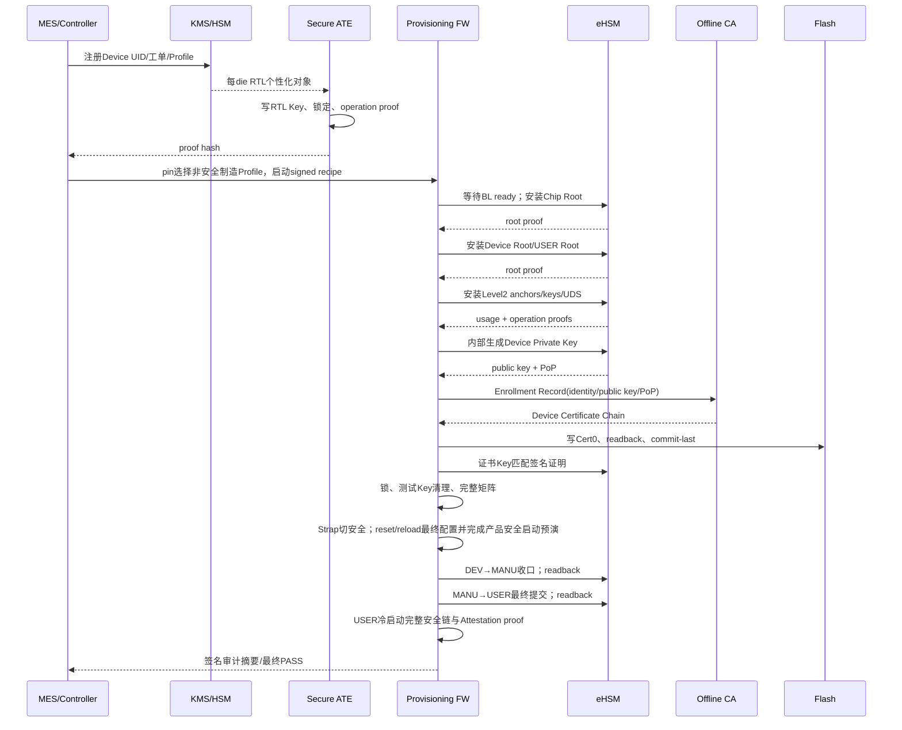

### 10.9.2 分步前置、动作和后置

| Step | 前置 | 动作 | 必须证明 | 失败终态 |
|---|---|---|---|---|
| P00 Register | UID唯一、工单有效 | KMS/MES创建设备记录 | UID/Profile/recipe绑定 | 不操作设备 |
| P10 RTL Personalize | TEST、Secure ATE | 写/派生每die RTL Key并锁 | 不可读、KAT、锁状态 | die隔离/报废 |
| P20 Chip Root | RTL proof有效、slot0 blank | RNG或wrapped安装 | Level0 usage/KAT | slot0 unknown则隔离 |
| P21 Device Root | Chip Root proof、slot1 blank | 在Level2前安装 | Level1 usage/KAT | 阻断全部Level2 |
| P22 USER Root | Root依赖满足、slot2 blank | 安装USER Root | usage/KAT | 阻断USER转换 |
| P30 eHSM Level1 | Chip Root有效 | slots3～5 | 各自正/负operation | 任一对象失败即不进入MANU |
| P31 SoC/Platform Level2 | Device Root有效 | slots8～11、15 | verify/decrypt/auth及anchor proof | 阻断产品启动 |
| P32 Device identity | Device Root有效 | slot13 UDS、slot14 Device Private内部生成/安装 | KDF KAT、公钥/PoP和不可导出 | 不重生成未知槽 |
| P33 Rotation reserve | 原始Key有效 | slots6、7、12保持blank/预留 | blank/映射状态 | 不得误写 |
| P40 Certificate | 槽14 proof有效 | CA签发并写Cert0 | chain/device/key匹配 | Cert0无效，保留可重写Cert1 |
| P50 Lock | 所有对象PASS | 关闭写窗、清test对象 | lock/readback/negative access | 不进入MANU |
| P55 Production rehearsal | 最终Key/证书/策略已锁定、仍处DEV或MANU | Strap切安全，reset/reload并运行与量产一致的完整安全启动 | FMC/GSP/Measurement/动态证书/SPDM/签名/audit | 留在可制造LCS；按对象状态继续或隔离 |
| P60 Lifecycle | P55全部PASS且MANU收口白名单完成 | DEV→MANU readback；MANU→USER作为最后一个不可逆提交 | 每条相邻边及最终USER readback | unknown quarantine；不得回退 |
| P70 Product proof | USER冷启动 | 完整安全启动/SPDM proof | boot、cert、signature、audit | 隔离；不得回到制造Profile |

### 10.9.3 `last_key`、写窗口和并发

- `last_key`不是业务字段，只能由Vendor最终OTP Map和生成recipe计算。
- 一次只允许一个不可逆action；eHSM保持单在途，制造Controller不得pipeline OTP操作。
- 每步打开最小写窗口，确定完成或确定失败后立即关闭；timeout时仍按unknown关闭上层session并隔离底层context。
- 对象状态只使用`BLANK/PROGRAMMING_PARTIAL/PROGRAMMED_INVALID/PROGRAMMED_VALID/PROVED/LOCKED/UNKNOWN`，不得把“请求返回”当作`PROGRAMMED_VALID`或`PROVED`。
- 同一recipe重复连接只能查询和继续未提交步骤；不可逆步骤不得因网络重连自动重发。

### 10.9.4 掉电恢复与USER最终提交

eHSM BL必须为每个不可逆对象定义接受点和部分写状态。OTP backend支持时，提交顺序优先固定为：

```text
Key Data
  -> CRC/ECC辅助字段
  -> 权威readback
  -> Attribute / valid / lock / last_key最后提交
  -> operation proof
```

重启后的Provisioning FW必须先调用`PROV_QUERY_OBJECT`，禁止根据MES“上一步已发送”直接续写。只有下列条件全部成立时，`PROGRAMMING_PARTIAL`才允许恢复：同一device binding、同一recipe、同一object、同一材料摘要、剩余OTP bit满足单向编程、CRC/ECC backend明确允许续写且BL返回可恢复证明。否则对象进入`PROGRAMMED_INVALID`或`UNKNOWN`并隔离/报废，不得更换材料、覆盖或盲重试。

设备保持DEV完成全部Key、证书、proof和P55产品安全启动预演。DEV阶段的普通中断可以再次由pin进入`MANUFACTURING_PROVISIONING`并按权威对象状态继续；DEV→MANU前必须完成全部Level1以及目标Profile列出的全部Key对象和proof。MANU只允许收口白名单，不补写需要DEV权限的对象。

`MANU→USER`固定为制造最后一个不可逆提交。调用前必须证明最终Key/证书/策略已用于一次reset/reload后的真实安全启动、Measurement、动态证书、SPDM和签名；调用后必须readback USER。`LCS=USER last`只保证普通中断发生在提交前时仍有机会重入制造流程，不能修复已半写且BL不支持恢复的OTP对象、LCS torn write或USER后的安全启动失败。

USER后不允许通过pin或`non_sec_boot=1`回到`MANUFACTURING_PROVISIONING`。若要求在产品安全链完全失效后仍能断言`non_sec_boot`，必须使用10.1.4定义的独立强授权维修路径；该路径未绑定时，USER后的启动失败只能隔离，不能宣称可由C908 Provisioning FW救回。

## 10.10 Device Private Key、PoP、离线签发与证书安装

### 10.10.1 私钥生成

Device Private Key固定由eHSM合格RNG在槽14内部生成，不允许Controller/KMS通过通用接口下发固定私钥，不使用RAM态通用Key代替持久身份。只允许：

- 导出匹配曲线的公钥；
- 对制造随机nonce执行proof-of-possession签名；
- 在USER态只用于签发当前设备的动态Firmware Alias Leaf；SPDM/Report签名由不导出的Alias Key完成；
- 由OTP usage限制其他用途。

16槽布局只提供一个Device Private Key槽（槽14）。每台设备必须由受控`attestation_profile`选择：

| Profile | 槽14对象 | 证书算法 | SPDM路径 |
|---|---|---|---|
| `ATTEST_P256` | P-256 private key | ECDSA/secp256r1 | P-256证书链 |
| `ATTEST_SM2` | SM2 private key | SM2/SM3 | SM2证书链 |

软件镜像和测试必须实现两条能力，但一台设备只灌装并使用其中一把Key；不支持同机同时使用两套长期身份。禁止用同一32字节scalar跨P-256和SM2复用。

### 10.10.2 轻量Enrollment与离线签发

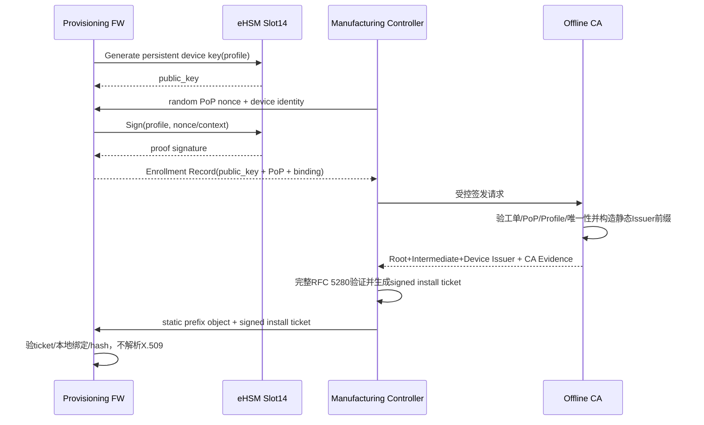

本工程固定采用“公钥+设备绑定+PoP受控CA接口”，不要求Device生成PKCS#10。Provisioning FW只构造固定宽度PoP输入，复杂的ASN.1、X.509字段、证书链和CA策略全部由Manufacturing Controller、Enrollment Service、KMS或离线CA承担。

CA适配器位于Host侧，负责把Enrollment Record转换为CA要求的请求格式。Device不生成PKCS#10，不提供任意digest签名接口，也不引入通用ASN.1 parser/encoder。

### 10.10.3 证书链内容

产品证明链固定为“三张静态Issuer前缀+一张GSP动态Leaf”。通用X.509字段和离线链验证遵守[RFC 5280](https://www.rfc-editor.org/rfc/rfc5280)，SPDM包装遵守[DMTF DSP0274 v1.2.1](https://www.dmtf.org/sites/default/files/standards/documents/DSP0274_1.2.1.pdf)。

```text
证书0：Offline Root CA（静态）
  -> 证书1：Intermediate/Product Attestation CA（静态）
     -> 证书2：Device Attestation Issuer（静态，槽14，pathLen=0）
        -> 证书3：Firmware Alias Leaf（GSP按当前TCB动态生成）
```

OTP槽8提供DICE Root公共身份operation proof。静态Device Attestation Issuer绑定规范化设备身份、槽14公钥、Profile和有效期/策略；它只允许签发本设备当前TCB的Firmware Alias Leaf，不直接作为SPDM最终签名Leaf。

Host/CA离线生成并验证的Flash对象只包含静态前缀及签名保护的紧凑issuer metadata：

```text
static_chain_prefix =
    root_cert_der
 || intermediate_cert_der
 || device_issuer_cert_der
```

离线Enrollment Validator必须证明静态前缀恰好解析三张证书、最终offset等于DER串长度。Cert0/Cert1保存静态前缀和metadata，不保存动态Leaf或最终SPDM `Length`。Root必须包含在前缀中。Device安装时不解析三张证书，只校验ticket、长度/摘要、本地槽14公钥、slot8 Root绑定和metadata；GSP运行期使用metadata构造动态Leaf，不把通用X.509 parser引入Device。

### 10.10.4 X.509字段Profile

所有字符串和OID必须来自受控Certificate Profile/Provisioning Matrix，不得由制造站自由填写。下表是CA和离线Enrollment Validator的强制Profile，不是Device端parser需求：

| 字段/扩展 | Root CA | Intermediate/Product CA | Device Attestation Issuer |
|---|---|---|---|
| `version` | v3 | v3 | v3 |
| `serialNumber` | CA分配、正整数、非0、最长20 octets | 同左；在Root issuer域唯一 | 同左；在Intermediate issuer域唯一 |
| `issuer` | 等于自身`subject` | 等于Root `subject` | 等于Intermediate `subject` |
| `subject` | Root模板 | Product/Profile CA模板 | Device Issuer模板；不得默认暴露原始UID |
| `SubjectPublicKeyInfo` | CA Root公钥 | Product CA公钥 | 必须等于槽14导出公钥 |
| `BasicConstraints` | critical，`CA=TRUE`，`pathLen=2` | critical，`CA=TRUE`，`pathLen=1` | critical，`CA=TRUE`，`pathLen=0` |
| `KeyUsage` | critical，只有`keyCertSign,cRLSign` | critical，只有`keyCertSign,cRLSign` | critical，包含`keyCertSign`，不得包含数据加密用途 |
| `SubjectKeyIdentifier` | 必须 | 必须 | 必须 |
| `AuthorityKeyIdentifier` | 必须，与自身SKI一致 | 必须匹配Root SKI | 必须匹配Intermediate SKI |
| `ExtendedKeyUsage` | 不允许 | 不允许 | 由受控Profile限制为Firmware Alias签发用途；不得作为通用子CA |
| Device binding | 不允许 | 可包含产品/Profile约束 | 必须包含32字节`device_binding_hash`，不得写入Key明文 |
| SPDM hardware identity | 不允许 | 不允许 | 设备身份约束可包含；当前启动TCB由动态Leaf绑定 |
| 未识别critical扩展 | 拒绝 | 拒绝 | 拒绝 |

Profile与证书/签名算法固定成对，禁止链内跨Profile降级：

| `attestation_profile` | 槽14公钥 | Issuer/动态Leaf签名 | 证书链摘要 | 约束 |
|---|---|---|---|---|
| `ATTEST_P256` | uncompressed P-256 `04 || X || Y` | ECDSA with SHA-256 | SHA-256，32 B | 静态Issuer与动态Alias均使用P-256 Profile |
| `ATTEST_SM2` | uncompressed SM2 `04 || X || Y` | SM2 with SM3 | SM3，32 B | 静态Issuer与动态Alias均使用SM2 Profile |

P-256和SM2的准确OID、AlgorithmIdentifier参数编码、SM2 ID、DN模板、Device Attestation EKU OID、Device Binding/TCB扩展OID和证书策略OID必须由CA/PKI Owner写入受控Profile并形成golden DER；GSP只消费由该Profile生成的固定模板/常量，不自行猜测。离线工具必须验证静态Issuer和动态Leaf，Vendor Device端X.509 parser仍不是安装前置。

动态Firmware Alias Leaf固定为X.509 v3、`CA=FALSE`、`KeyUsage=digitalSignature`，Subject Public Key等于eHSM派生的Alias Public Key，AKI指向Device Issuer。其受认证扩展绑定`attestation_profile、tcb_digest、fmc_digest、gsp_digest、lifecycle、debug_state、security_state`，DER不得超过4096字节；`TBSCertificate`由槽14签名。GSP负责ASN.1/DER组装，eHSM只负责Hash/KDF/KeyGen/Sign。

设备身份不直接依赖DN字符串比较。制造系统先按Device Binding Profile规范化Die/SoC身份输入，再计算：

```text
device_binding_hash =
    ProfileHash(
        "NGU800P-DEVICE-BINDING-V1"
     || product_id
     || silicon_revision
     || normalized_device_uid
     || die_topology_id
    )
```

具体编码必须使用固定长度字段或canonical CBOR，禁止直接拼接可歧义字符串。原始UID是否进入静态Issuer或动态Leaf的Subject/SAN由隐私和PKI策略决定；静态Issuer的Device Binding扩展由离线CA生成并由离线Validator比较，动态Leaf的同名绑定由GSP从本地受控上下文写入固定模板；Device安装阶段只把本地重新计算值与signed install ticket中的`device_binding_hash`比较。

### 10.10.5 固定PoP、Enrollment Record与Install Ticket

Device端唯一证书签发证明是fresh nonce PoP：

```text
pop_tbs =
    "NGU800P-DEVICE-POP-V1"
 || recipe_id
 || device_binding_hash
 || attestation_profile
 || issuer_public_key_hash
 || controller_nonce
```

`controller_nonce`必须由制造Controller的批准CSPRNG生成、单次使用并在MES/KMS侧防重放。Provisioning FW只填充上述固定宽度结构并调用槽14签名；接口输入是typed request，不接受任意消息、任意digest、Subject、Extension或物理Key ID。

Controller生成并提交给CA的`device_cert_enrollment_record_v1`至少包含：

| 字段 | 来源 | CA检查 |
|---|---|---|
| `recipe_id/product_id/silicon_revision` | 已验证signed recipe | 工单和目标Profile精确匹配 |
| `device_binding_hash` | Device本地计算 | MES设备记录匹配 |
| `attestation_profile` | recipe + 槽14对象类型 | 只允许P-256或SM2单Profile |
| `device_issuer_public_key`及hash | 槽14导出 | 格式、曲线、唯一性和PoP匹配 |
| `controller_nonce` | Controller CSPRNG | fresh、单次使用、防重放 |
| `pop_signature` | 槽14 | 对规范`pop_tbs`验签通过 |
| 制造Evidence | Controller/MES | LCS、Root/Level2前置和设备状态满足 |

CA不依赖PKCS#10，从批准Certificate Profile和Enrollment Record直接签发Device Attestation Issuer，并完成10.10.4静态前缀的X.509构造和验证。Host完成静态链验证后生成`signed_cert_install_ticket_v1`：

```text
signed_cert_install_ticket_v1 {
  format_version
  recipe_id
  device_binding_hash
  attestation_profile
  target_slot
  sequence
  cert_count = 3
  static_prefix_len
  static_prefix_digest
  root_spki_hash
  spdm_root_hash
  issuer_public_key_hash
  issuer_serial_hash
  issue_request_id
}
```

Ticket使用canonical CBOR/COSE制造信任链签名，不新增一套Device协议。Device验证外层签名后只比较固定字段和Hash，不解析X.509。PoP、nonce、Enrollment Record、CA Evidence和ticket进入受控外部审计；Device Flash不保存这些临时对象。

### 10.10.6 证书生成、签发与安装完整时序

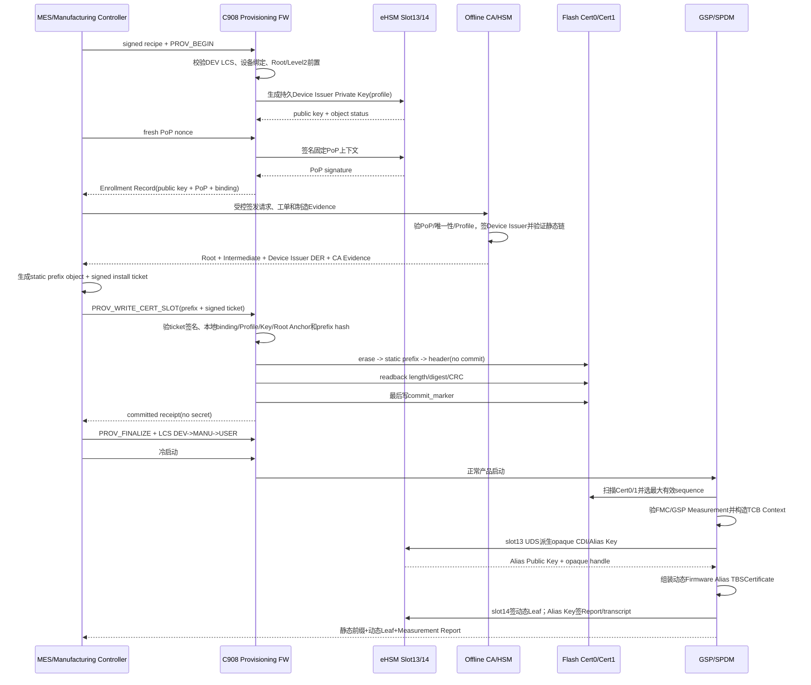

初次灌装固定写Cert0、`sequence=1`。Cert1保持擦除态。证书续签固定写较旧/无效槽并使用`selected.sequence+1`；设备私钥不变。`sequence`到达`UINT32_MAX`时不回绕，进入证书存储寿命终态并要求受控维修设计。

制造分步合同：

| 步骤 | 前置 | 动作 | 必须证明的后置 |
|---|---|---|---|
| Key生成 | DEV；槽14 BLANK；Device Root有效 | eHSM内部生成所选Profile私钥 | 槽14`PROGRAMMED_VALID`；私钥未导出 |
| 公钥取得 | 槽14有效 | 导出SPKI公钥 | 公钥格式/Profile正确；hash记录 |
| PoP | fresh nonce | 签固定上下文 | Controller验证通过；nonce被消费 |
| Enrollment | recipe/Profile/身份有效 | Controller形成公钥+PoP+设备绑定记录 | CA验证工单、PoP、唯一性和Profile |
| CA签发 | Enrollment Record有效 | 离线CA签Device Issuer并构造三证书静态前缀 | serial唯一；CA/pathLen/Profile/有效期和静态链满足策略 |
| 离线封装 | 静态链已验证 | Host构造prefix object及signed install ticket | ticket绑定prefix、设备、Profile、Root、Issuer公钥和sequence |
| Cert接收 | 目标槽擦除；`commit_marker`未写 | 分块接收prefix/ticket到受控buffer | 总长/digest与ticket一致 |
| 轻量校验 | ticket已验签 | 执行10.10.7固定检查 | `TICKET_VALID && KEY_BOUND && DEVICE_BOUND` |
| Flash写入 | 目标槽非active/较旧 | erase、写static prefix、写未提交Header | readback length/hash/CRC一致 |
| 提交 | 所有验证及readback成功 | 单独最后写commit | 断电后该槽可被确定扫描 |
| 量产证明 | 冷启动选中新槽 | GSP生成动态Leaf并执行SPDM/Report | 外部Requester完成静态链、动态Leaf、TCB扩展、Alias签名和设备身份验证 |

### 10.10.7 离线全量验证与Device轻量验证边界

离线CA/Enrollment Validator必须完成：

1. 严格DER解析恰好三张静态X.509 v3证书，顺序固定Root→Intermediate→Device Issuer，拒绝溢出、尾随、重叠、截断和非规范编码；
2. 校验Root self-signature、Root SPKI Anchor、Intermediate和Device Issuer完整签名链；
3. 校验Issuer/Subject、SKI/AKI、BasicConstraints、pathLen、KeyUsage、EKU、算法/OID/参数和所有critical扩展；
4. 校验Device Issuer的Device Binding、Profile、公钥及`CA=TRUE,pathLen=0,keyCertSign`等于Enrollment Record/Profile；
5. 校验时间策略、serial唯一性和CA策略，按制造策略处理吊销检查；
6. 生成golden static prefix、issuer metadata、全部摘要和signed install ticket，并保存可审计Evidence；另以测试向量验证GSP动态Leaf writer。

Device安装或启动时只执行：

1. 检查Cert Slot Header的magic/version/slot/sequence/长度/count/Profile/reserved/commit；
2. 使用64位中间值检查`static_prefix_len`和Flash范围，但不解析证书DER；
3. 安装阶段验证signed install ticket使用制造信任链签名，且recipe ID、目标slot、sequence和长度匹配；
4. 本地计算`device_binding_hash`并比较ticket/Header；
5. 从eHSM取得槽14公钥摘要并比较ticket/Header的`issuer_public_key_hash`；
6. 通过slot 8 DICE root CA typed operation取得Root公共身份证明并比较ticket的`root_spki_hash`；命令和编码由Key Attribute Profile生成，配置缺失时证书安装返回`DESIGN_BLOCKED_BY_KEY_ATTRIBUTE_INPUT`；
7. 计算static prefix摘要并比较ticket/Header的`chain_digest`；
8. 校验`issuer_serial_hash`、issuer metadata、`header_crc32c`和Flash readback，最后才允许commit；
9. 启动阶段不再需要ticket，只重复Header、边界、prefix长度、设备/Profile/槽14公钥摘要、prefix digest、metadata、CRC和commit检查。

Device不检查静态前缀的DN、OID、Extension、签名链、当前时间、CRL或OCSP，也不声称本地选中槽已经满足完整PKI策略。GSP只对受签名保护的issuer metadata做固定字段检查，并用固定Profile writer生成动态Leaf。完整有效性由制造冷启动后的真实SPDM Requester再次验证。任一轻量检查或动态证书生成失败只使证明服务`NOT_READY`，不允许回退静态Leaf或软件Key。

### 10.10.8 SPDM证书链包装

Flash Cert0/Cert1与SPDM Slot不是同一概念。设备内部A/B扫描后只向外暴露一个逻辑SPDM `SlotID=0`，Slot Mask只置bit0；物理Cert槽号不得进入wire。Flash只存静态前缀。GSP生成动态Leaf后，以scatter/gather虚拟只读链形成运行期SPDM对象，不要求复制整条静态链到SRAM：

```text
Offset  Size  Field
0       2     Length，little-endian，含本结构全部字节
2       2     Reserved = 0
4       H     RootHash = BaseHash(root_cert_der)
4+H     ...   root_cert_der
              || intermediate_cert_der
              || device_issuer_cert_der
              || dynamic_firmware_alias_leaf_der
```

`Length`由GSP按静态前缀、动态Leaf和`RootHash`实际长度计算；`H`由Provisioning Profile绑定的SPDM BaseHash决定。Flash Header中的`chain_digest`只覆盖static prefix object，Measurement SoC State的`cert_chain_digest`覆盖本boot运行期完整虚拟链。`RootHash`仍只覆盖完整Root DER。若Requester协商算法不匹配当前Profile，Responder必须拒绝，不能临时换链或降级。同一GET_CERTIFICATE事务必须锁定selected prefix、dynamic Leaf和总长度；分片从虚拟只读segments取得，任何segment变化都终止事务。

GSP生成动态Leaf前必须验证Measurement Entry 0/1分别是BootROM生产的FMC和FMC生产的GSP最终readback digest，并形成固定96字节TCB Context。eHSM用slot13 UDS执行不导出KDF和Alias KeyGen；GSP只取得Alias Public Key/opaque handle，使用槽14签TBSCertificate，随后用Alias Key签SPDM Challenge、Measurement或session transcript。动态Leaf只驻留当前boot GSP SRAM，reset后重新派生和组装。

### 10.10.9 时间、吊销和更新边界

- Root/Intermediate/Device Issuer的`notBefore/notAfter`由CA Profile确定；动态Leaf使用issuer metadata中经签名保护的固定有效期边界，不依赖Device RTC。
- Device不解析证书时间，也不自行判断证书是否过期；Requester/CA/MES负责时间和吊销策略。
- Device不在线下载CRL或访问OCSP，不把网络不可达解释为证书有效。
- 同一槽14私钥续签只更新Cert0/Cert1中的静态Issuer前缀。外部CA吊销旧Issuer后，新前缀仍须按A/B流程完成冷启动、动态Leaf生成和Attestation proof。
- Root或Intermediate替换必须同时满足OTP槽8 DICE root CA对象的绑定策略；OTP没有Root身份轮换资源，因此Root身份替换不属于普通证书续签，本版本不支持。
- Device Private Key没有备用槽，不支持仅靠Cert0/Cert1完成私钥轮换。

## 10.11 Flash FMC、Cert0和Cert1固定布局

### 10.11.1 顶层分区

Flash分区包含FMC固件、Cert0和Cert1。FMC分区的大小和地址由产品Flash Map定义；Cert0和Cert1各64 KiB并按真实Flash erase block对齐。各分区base由同一版本化Flash Map生成，软件不得定义第二套地址常量。

```text
低地址
┌──────────────────────────────────────────────┐
│ FMC Firmware Partition（由Flash Map定义）      │
├──────────────────────────────────────────────┤
│ Cert0：64 KiB，erase-block aligned            │
├──────────────────────────────────────────────┤
│ Cert1：64 KiB，erase-block aligned            │
└──────────────────────────────────────────────┘
高地址
```

如果真实最小擦除块大于64 KiB，则每槽扩大到一个完整擦除块；不得让Cert0/1共享同一不可独立擦除的物理块。

### 10.11.2 单个证书槽布局

每槽固定为：

```text
Offset 0x0000
┌──────────────────────────────────────────────┐
│ 0x0000..0x00FF  cert_slot_header_v2 (256 B)  │
├──────────────────────────────────────────────┤
│ 0x0100..0x03FF  issuer_metadata_v1            │
│ 0x0400..0x0FFF  reserved，擦除态必须为0xFF    │
├──────────────────────────────────────────────┤
│ 0x1000..0xFFFF  static certificate prefix DER │
│         Root||Intermediate||Device Issuer     │
│                    (Host预生成，<=60 KiB)     │
└──────────────────────────────────────────────┘
Offset 0x10000
```

Header v2精确逻辑布局：

| Offset | Size | Field | 规则 |
|---:|---:|---|---|
| 0 | 4 | `magic` | 新格式独立magic |
| 4 | 2 | `format_version` | 固定为2 |
| 6 | 2 | `header_len` | 256 |
| 8 | 4 | `slot_id` | 0或1 |
| 12 | 4 | `sequence` | 单调增加，不回绕 |
| 16 | 4 | `static_prefix_len` | 三张静态DER总长度，1..61440 |
| 20 | 4 | `cert_count` | 静态前缀证书数，固定3；运行期完整链为4 |
| 24 | 4 | `attestation_profile` | P-256或SM2 |
| 28 | 4 | `logical_key_id` | 槽14的逻辑对象ID |
| 32 | 32 | `device_binding_hash` | 规范化设备绑定 |
| 64 | 32 | `chain_digest` | Profile规定SHA-256或SM3，覆盖issuer metadata和static prefix |
| 96 | 32 | `issuer_public_key_hash` | 与槽14公钥匹配 |
| 128 | 32 | `issuer_serial_hash` | 静态Device Issuer审计/唯一性 |
| 160 | 88 | `reserved` | 写入时全0；读取非0拒绝 |
| 248 | 4 | `header_crc32c` | 覆盖0..247、issuer metadata及static prefix，不含commit |
| 252 | 4 | `commit_marker` | 最后一次对齐写提交 |

证书存储固定采用64 KiB A/B、commit-last和无active pointer机制。Header v2、issuer metadata、C结构体、static assert、制证工具schema和测试向量必须由单一registry生成。

### 10.11.3 A/B选择与掉电

禁止另设可撕裂的active pointer。Boot时扫描Cert0/Cert1：

1. 验证magic/version/header_len/reserved；
2. 验证`commit_marker`；
3. 检查static prefix和issuer metadata长度、边界；
4. 验证CRC及prefix object digest；
5. 验证device binding、Profile和槽14 Issuer公钥摘要；不解析X.509；
6. 在有效槽中选最大`sequence`；
7. 相同sequence但内容不同进入`CERT_RECOVERY_REQUIRED`；
8. 无有效槽时SPDM/Attestation保持NOT_READY，不能用test cert fallback。

更新时写inactive/较旧槽：先验signed install ticket，再擦除、写static prefix object、写未提交header、readback并验证固定字段/hash，最后单独写`commit_marker`。旧槽在新槽通过下一次真实boot、动态Leaf生成和外部Attestation proof前保留。

## 10.12 SoC Key轮换

### 10.12.1 对象和额度

| `key_type` | Primary | Rotation | 复用 | 额度 |
|---:|---:|---:|---|---|
| 0 SoC Verify | slot10 | slot6 | Boot+Update verify | 一次 |
| 1 SoC Encrypt | slot11 | slot7 | Boot+Update decrypt | 一次 |
| 2 SoC Debug | slot9 | slot12 | SoC Debug auth | 一次 |

物理槽映射必须与10.5节的16槽对象表一致。eHSM内部使用1字节OTP Bitmap管理active映射；GSP只提交typed `key_type`和固定封装，不指定slot、bit或destroy动作。Bitmap编码由版本化Vendor Key Rotation Profile生成。

### 10.12.2 双层KEK封装

```text
ciphertext_A = Protect_DEVICE_ROOT_KEY(new_soc_key[32])

payload_48 =
    key_attributes[4]
  | ciphertext_A[32]
  | crc32_of_plain_key[4]
  | key_type[4]
  | padding[4]

ciphertext_B = Protect_PER_DEVICE_RTL_SOC_KEK(payload_48)
```

这不是概念冲突：KMS按设备保存`RTL SoC KEK`和Device Root相关能力，生成设备专属`ciphertext_B`；eHSM先解外层，再按Device Root处理内层。制造/运行系统不得看到明文新Key。

算法、mode、IV、端序、attributes、CRC、padding和双份`key_type`一致性由Vendor Key Rotation Profile固定。Profile或匹配的Vendor实现缺失时，轮换功能返回`BLOCKED_BY_VENDOR_DELIVERY`。

### 10.12.3 USER态Owner和状态机

GSP唯一`security_service_task`是SoC侧轮换Owner，不向外部Host开放通用Rotation API。外部运维入口只能提交受控、设备绑定、一次性授权的轮换包。

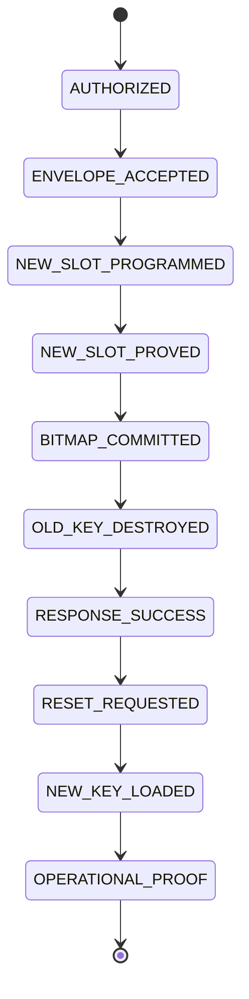

eHSM在返回成功前完成写新Key、proof、Bitmap和旧Key destroy。GSP只请求RAS/reset Owner执行eHSM硬件复位，不直接调用业务reset magic。授权在命令提交后无论终态均消费，不复用Debug授权或全局user-auth。

### 10.12.4 掉电和未知状态

| 中断点 | 可信结论 | 必须行为 |
|---|---|---|
| 鉴权/封装校验前 | OTP未改 | 确定失败、清零 |
| 新槽写入前 | 旧Key active | 不提交Bitmap |
| 新槽写入中/证明未知 | 新槽unknown | 不重写、不自动retry |
| 新槽证明后、Bitmap前 | 旧Key active，新槽占用 | 等待受控恢复 |
| Bitmap提交未知 | active未知 | Key域/eHSM quarantine |
| Bitmap已提交、destroy未知 | 新Key为目标，旧Key未知 | 不回旧Key |
| 旧Key已destroy、reset/首用失败 | 仅新Key可能可用 | fail-close受限恢复 |

轮换必须由匹配版本的Vendor typed command原子编排新槽写入、operation proof、Bitmap提交和旧Key destroy。任一命令、Bitmap持久化语义或destroy证明未配置时，功能保持`BLOCKED_BY_VENDOR_DELIVERY`，不得用通用安装命令或软件侧raw OTP访问替代。

## 10.13 证书更新、Key轮换与身份连续性

证书更新和OTP Key轮换是两种不同事务：

| 事务 | 私钥是否变化 | 存储 | 提交机制 | 恢复 |
|---|---|---|---|---|
| 同一Device Key续签证书 | 否 | Cert0/1 | commit-last + sequence | 旧证书槽保留 |
| Device Key替换 | 是，没有备用私钥槽 | OTP + Cert0/1 | 无可用提交资源 | 不支持 |
| SoC Verify/Encrypt/Debug轮换 | 是 | OTP slots8～10/13～15 | eHSM Bitmap + destroy | Vendor定制流程 |

Cert0/1是同一Device Private Key/Profile的证书A/B，不是P-256/SM2各占一个证书槽。证书私钥永远不写Flash。16槽布局没有备用Device Private槽，因此本版本不支持Device Attestation私钥轮换，不能通过只更新证书实现。

## 10.14 产品内部API与代码模块边界

### 10.14.1 模块

| 模块 | 目标仓库/组件 | 职责 |
|---|---|---|
| `security_prov_protocol` | Provisioning FW/制造工具 | typed request、recipe/ticket、错误 |
| `security_key_registry` | 生成配置 | object→slot/level/usage/dependency |
| `security_ehsm_key_adapter` | eHSM BL Adapter | Vendor typed查询/安装/生成/证明/finalize/LCS封装；不提供raw slot/OTP |
| `security_cert_store` | GSP/制造公共组件 | Cert0/1扫描、验证、commit |
| `security_lcs_service` | GSP/制造 | typed相邻转换和readback |
| `security_debug_service` | GSP | challenge/auth/全局开关 |
| `security_rotation_service` | GSP | Vendor typed rotation command适配 |
| `security_prov_audit` | 制造工具/MES | 无秘密审计记录 |

### 10.14.2 产品内部接口

```c
ngu_status_t ngu_key_query(ngu_key_object_id_t object,
                           ngu_key_object_status_t *status);

ngu_status_t ngu_key_install_wrapped(const ngu_key_install_request_t *request,
                                     ngu_key_install_result_t *result);

ngu_status_t ngu_key_generate_internal(const ngu_key_generate_request_t *request,
                                       ngu_key_generate_result_t *result);

ngu_status_t ngu_device_public_key_get(ngu_attestation_profile_t profile,
                                       uint8_t *out, size_t *inout_len);

ngu_status_t ngu_device_pop_sign(const ngu_device_pop_request_t *request,
                                 uint8_t *signature, size_t *inout_len);

ngu_status_t ngu_cert_slot_scan(ngu_cert_selection_t *selection);
ngu_status_t ngu_cert_slot_install(const ngu_cert_install_request_t *request,
                                   ngu_cert_install_result_t *result);

ngu_status_t ngu_soc_key_rotate(const ngu_soc_key_rotation_request_t *request,
                                ngu_soc_key_rotation_result_t *result);
```

`ngu_key_query()`和`ngu_key_install_wrapped()`只在`MANUFACTURING_PROVISIONING`中映射到eHSM BL typed API；`ngu_soc_key_rotate()`只能由GSP内部服务调用。它们都不是外部Host API。所有request使用逻辑object/profile和不可变recipe/ticket引用，不包含物理slot、raw OTP offset、Vendor command ID、`last_key`或caller自选usage。Adapter必须把BL返回的对象状态归一化为`BLANK/PROGRAMMING_PARTIAL/PROGRAMMED_INVALID/PROGRAMMED_VALID/PROVED/LOCKED/UNKNOWN`，任何无法无歧义映射的状态按`UNKNOWN`处理。

## 10.15 错误、审计、清零和追溯

### 10.15.1 错误分类

| 项目错误类 | 示例 | 副作用判断 | 行为 |
|---|---|---|---|
| `PROV_POLICY_REJECTED` | recipe签名/设备/Profile/LCS不符 | 无 | 确定拒绝 |
| `PROV_DEPENDENCY_MISSING` | Device Root未证明 | 无 | 阻断后续 |
| `PROV_OBJECT_NOT_BLANK` | 目标槽已写 | 已有状态 | 查询/隔离，不覆盖 |
| `PROV_OBJECT_PARTIAL` | BL证明对象处于部分写状态 | 可能可恢复 | 只按10.9.4完全相同材料和backend合同恢复，否则隔离 |
| `PROV_VENDOR_REJECTED` | eHSM明确在写前拒绝 | 需Vendor证明 | 确定无副作用才可新操作 |
| `PROV_ACCEPTANCE_UNKNOWN` | timeout/reset/掉电 | 未知 | quarantine |
| `PROV_PROOF_FAILED` | KAT/usage/lock/readback失败 | 可能已写 | 对象无效、停止 |
| `PROV_CERT_INVALID` | signed ticket/blob/device/key不符 | Flash可恢复 | 不commit |
| `PROV_FLASH_COMMIT_UNKNOWN` | commit write/reset | Cert槽未知 | 扫描两个槽 |
| `PROV_LCS_UNKNOWN` | 转换后readback失败 | 不可逆未知 | 设备隔离 |

保留Vendor raw status，但不能把`raw==0`直接映射为产品PASS；产品PASS还要求postcondition和proof。

### 10.15.2 追溯记录

每设备至少保存：

- Device UID/ECID的受控表示、lot/wafer/die；
- 产品/Profile/recipe ID和版本；
- RTL/FW/Vendor/KMS/CA/工具版本；
- RTL Key、Root Key和产品Key的KMS handle/version，不保存值；
- 每个OTP object的动作、结果、proof kind和digest；
- Device public key hash、证书serial/hash、Cert slot/sequence；
- LCS转换和锁定结果；
- station、操作者授权、时间；
- 失败、隔离、返修/报废原因；
- 最终审计记录链或签名摘要。

审计存储schema由制造系统配置，必须包含上述字段及记录完整性保护；保存年限由产品合规Profile定义。审计记录不得包含Key明文、wrapped blob正文、Device Private Key、完整token或敏感RAM dump。

### 10.15.3 清零

wrapped blob虽然是密文，仍按敏感对象处理。KMS/Controller/Provisioning FW/eHSM共享RAM中的Key blob、Enrollment Record临时数据、signed install ticket、PoP challenge和token按最短生命周期保存；确定事务闭环后使用受控volatile清零和barrier。timeout/late response时不得提前复用buffer；由第4、5、14章的context quarantine和RAM Owner规则接管。

## 10.16 测试与实施门禁

### 10.16.1 测试集合

至少覆盖：

1. RTL一机一密：不同die KAT结果不同、CPU/Debug/Scan不可读、共享默认宏扫描、lock和重复写。
2. Recipe：错设备、错Profile、错LCS、篡改、过期、nonce重放、step乱序、缺依赖。
3. OTP/eHSM BL制造API：16槽映射、错误slot/level/usage、C908伪造调用、LCS/硬件制造条件/ticket/device binding/顺序缺一、非blank、Device Root缺失、`last_key`不可由caller控制、MANU白名单、`PROGRAMMING_PARTIAL`同材料恢复与错材料拒绝、write/readback/operation proof。
4. Boot Policy Fuse：`non_sec_boot`默认0、DEV/MANU专用授权0→1、已为1不重写、读/ECC/镜像异常、掉电unknown、锁定、受限非安全/产品/Host写入不可达和reset重锁存；USER安全链失效时独立维修入口可达性及强授权；值1后仍不能进入制造Profile。
5. Device Key：内部生成、不可导出、公钥、PoP、错误曲线、同scalar跨曲线禁止。
6. UDS：slot13/Level2/asymm/七项权限；产品调用只允许Provisioning Profile列出的内部operation，不向Host开放raw sign/encrypt/decrypt/derive/import服务。
7. Certificate：离线工具覆盖截断/畸形DER、错链/扩展/时间策略；Device覆盖Cert0/1边界、ticket签名、错设备/Root/公钥/Profile、Blob长度/Reserved、CRC/hash、sequence相同冲突和每个掉电点。
8. Lifecycle：跳级/逆向、unknown、DEBUG前删Key、DEV中断重入、DEV→MANU对象完整性、MANU收口白名单、USER前最终配置安全启动预演、`MANU→USER`最后提交及USER后制造Profile不可达、DESTROY二次授权。
9. Rotation：封装/CRC/key_type副本、一次性授权、每个Bitmap/destroy掉电点、reset、首次新Key证明。
10. 审计/清零：日志秘密扫描、buffer生命周期、timeout quarantine、MES字段最小化。
11. 完整产品证明：冷启动FMC/GSP/Runtime、安全启动、SPDM证书/签名和负向路径。

### 10.16.2 编码和量产DoR

| 输入 | 缺失时阻断 |
|---|---|
| RTL逐die个性化、不可读、lock/proof合同 | 量产RTL Key实现 |
| Vendor eHSM BL typed制造API：DEV Chip Root→Level1→Level2、16槽Map、硬件制造授权、状态查询、部分写恢复、readback/operation proof、finalize和相邻LCS转换 | 最终可执行OTP recipe/Adapter和一机一密量产 |
| `non_sec_boot`物理位/编码、只读锁存、DEV/MANU烧写/readback/lock及USER独立维修可达性/授权 | BootROM产品port、`PROV_ASSERT_NON_SEC_BOOT`制造实现和USER事后逃生声明 |
| Vendor Key Rotation typed Host/BL/FW接口及版本说明 | USER Key Rotation |
| Flash base/erase/program粒度 | Cert0/1物理地址和driver |
| KMS/CA/MES接口和信任根 | 制造系统集成 |
| 制造command数值、packing、transport framing | Provisioning wire实现 |
| SPDM完整Profile | 对外Attestation wire发布 |

### 10.16.3 平台与外部系统配置

| 配置输入 | 使用方 | 缺失时行为 |
|---|---|---|
| Vendor BL制造命令版本、状态/partial-write/接受点/LCS合同，以及FW Key Attribute、KDF/KeyGen和轮换Profile | eHSM Adapter、Provisioning、DICE、轮换服务 | 对应能力返回`BLOCKED_BY_VENDOR_DELIVERY` |
| RTL逐die个性化、不可读、lock和proof合同 | Provisioning FW、量产测试 | 量产Provisioning不可执行 |
| OTP backend的CRC/ECC、blank、lock和持久化编码 | Registry生成器、OTP Adapter | OTP写入不可执行 |
| `non_sec_boot` word/bit/编码、valid/ECC/镜像、只读视图、复位锁存、DEV/MANU烧写Owner及USER独立维修入口 | BootROM platform port、Provisioning FW、Secure ATE/维修Owner | `BLOCKED_BY_NON_SEC_BOOT_BINDING`；读取/烧写不可发布，且不得声明USER事后逃生 |
| Flash base、erase/program/readback粒度 | 证书存储驱动 | Cert0/Cert1安装与选择不可执行 |
| KMS/CA/MES endpoint、schema和信任根 | 制造Controller、Enrollment Validator | 制造Enrollment不可执行 |
| Provisioning transport及typed command数值 | Provisioning FW、Controller | 制造wire服务不可发布 |
| Certificate/SPDM Profile | 证书工具、GSP Responder | Attestation服务保持`NOT_READY` |

所有配置必须由受控Profile或生成registry提供。产品代码不得使用猜测值、stub、raw OTP接口或临时常量补齐缺失输入。

# 第11章 Device Attestation、SPDM与内部密码服务

```mermaid
sequenceDiagram
  participant V as "外部Verifier"
  participant R as "GSP SPDM Responder"
  participant M as "Measurement Provider"
  participant E as "eHSM签名服务"
  V->>R: SPDM请求 + Nonce
  R->>R: 检查安全启动/证书/Profile门禁
  R->>M: 请求稳定Snapshot
  M->>M: Header A→Entries/State→Header B
  M-->>R: 稳定内部事实或SNAPSHOT_BUSY
  R->>R: 按Certificate/SPDM Profile映射为wire blocks
  R->>E: typed签名请求
  E-->>R: 真实签名
  R-->>V: 证书链 + blocks + nonce绑定签名
```

## 11.1 产品证明模型

Device Attestation由GSP运行期安全服务提供，前置条件是安全启动链、eHSM Vendor FW、必需Runtime和Measurement稳定可用。证明结果必须来自真实eHSM签名和前后Header一致的Measurement snapshot；不得使用软件私钥、固定签名、stub证书或Expected digest。

产品实现DICE风格一级动态证明：BootROM只提交FMC最终readback digest，FMC只提交GSP最终readback digest；二者不读取UDS、不生成CDI、Key或X.509。GSP验证这两个Measurement Entry后，用slot13 UDS和本次启动安全状态经eHSM不导出KDF派生单层Alias Key，组装动态Firmware Alias Leaf和Measurement Report。产品能力声明为“支持DICE风格动态证明证书链”，不声明符合TCG DICE全部Profile。

```mermaid
flowchart LR
  R["BootROM<br/>验证并加载FMC"] -->|"FMC最终readback Hash"| M["Measurement 16 KiB<br/>Entry 0/1"]
  F["FMC<br/>验证并加载GSP"] -->|"GSP最终readback Hash"| M
  M -->|"stable snapshot"| G["GSP<br/>96B TCB Context<br/>固定Profile X.509 writer"]
  U["eHSM slot13 UDS"] -->|"域分离KDF<br/>CDI/Alias private不导出"| E["eHSM Alias handle<br/>+ Alias Public Key"]
  G -->|"tcb_digest + binding + profile"| U
  E -->|"Alias Public Key"| G
  I["eHSM slot14<br/>Device Issuer Private"] -->|"签TBSCertificate"| G
  S["Flash Cert0/1<br/>三张静态Issuer前缀"] --> G
  G --> C["本boot动态Firmware Alias Leaf<br/>+ nonce绑定Report/SPDM transcript"]
  C --> H["Host/Requester<br/>验静态链→动态Leaf→TCB/Measurement→Alias签名"]
```

BootROM和FMC分别承担下一级镜像的Header Overlay/typed-stage policy、counter、load、release及Measurement提交；DICE相关输出仅为下一级镜像最终readback digest。动态证书及其工作区属于GSP受保护内存，不能占用固定Measurement Region。

## 11.2 SPDM 1.2 Profile

Responder提供以下逻辑能力：

1. `GET_VERSION`；
2. `GET_CAPABILITIES`；
3. `NEGOTIATE_ALGORITHMS`；
4. `GET_DIGESTS`；
5. `GET_CERTIFICATE`；
6. `CHALLENGE`；
7. `GET_MEASUREMENTS`。

SPDM secure session固定采用基于证书的`KEY_EXCHANGE -> FINISH`路径，不支持PSK，也不提供非安全fallback。软件镜像必须具备P-256和SM2两套DICE Alias能力；每台设备由Provisioning Profile选择其中一条，槽14保存匹配的Device Issuer私钥，slot13提供UDS派生，Cert0/Cert1保存同Profile静态Issuer前缀。GSP运行期追加匹配Profile的动态Leaf，同机不同时使用两套长期身份。transport、完整链与分片上限、消息容量、block index、session key生命周期、sequence/replay和reset关闭合同由SPDM Profile生成；任一必需项缺失时Responder保持`DESIGN_BLOCKED_BY_PROFILE_INPUT`。

## 11.3 SPDM组件边界

```text
Transport RX
 -> SPDM parser/state machine
 -> Certificate Provider（Flash静态Issuer前缀 + GSP动态Leaf，虚拟只读链）
 -> Measurement Provider（stable snapshot，只读）
 -> Signing Provider（typed request -> security_service_task -> eHSM）
 -> Transport TX
```

Transport、parser和业务Provider不持有eHSM raw handle。Certificate Provider扫描Cert0/1的Header v2、issuer metadata和static prefix，随后锁定本boot动态Leaf，以scatter/gather生成稳定SPDM分片；不解析静态X.509，也不存在active pointer。Signing Provider只能使用当前Alias opaque handle签nonce/transcript/Measurement，槽14只用于动态Leaf `TBSCertificate`签名。Measurement Provider必须验证实际count/length、Header/Entry commit和唯一State，不完整时返回busy/error，不能降级成空可信报告。

## 11.4 Measurement呈现

SPDM block至少覆盖：FMC、GSP、eHSM Vendor FW、PMP、RMP、MMP、Die1实例和当前安全状态；BootROM作为隐式RoTM不建立普通Entry。DICE TCB Context固定只取Entry 0的FMC digest、Entry 1的GSP digest及Lifecycle/Debug/Security State；GSP追加的Runtime条目继续进入Measurement Report，但不扩展为更多动态证书层。Die1即使与Die0镜像digest相同也保留独立实例。

报告还应包含可验证的LCS/Debug状态和安全启动模式，不包含Measurement generation或时间戳，也不泄露地址布局、eHSM内部状态、内部错误细节或敏感策略。对外固定不返回load/entry地址，只返回由稳定内部Entry派生的summary block；P-256证书路径使用SHA-256摘要，SM2证书路径使用SM3摘要。block index、transport编码和消息大小由SPDM Profile固定。

## 11.5 Attestation签名和证书

软件能力固定支持两种算法匹配对象：`ATTEST_ECDSA_P256`绑定P-256 Issuer/Alias链，`ATTEST_SM2`绑定SM2 Issuer/Alias链。槽14是持久不可导出的Device Issuer key，只签Certificate Profile定义的动态Leaf；Alias private key从UDS/TCB确定性派生、不可导出，只签本次启动的Report、SPDM transcript或Measurement摘要。

16槽物理布局中，slot13是UDS，slot14是Device Private/Issuer对象。代码、接口枚举、构建和测试保留两条算法路径；每台设备只选择一条路径进入slot13/14、Cert0/1和Alias派生；不能把同一私钥scalar跨曲线复用，也不能宣称单设备双路径能力。

算法/Profile选择必须唯一绑定同算法的static prefix、slot13/14对象、动态Leaf和Alias Public Key；任一公钥、算法、TCB扩展或Key对象不匹配时证明服务不可用并上报错误，不能跨算法替换、退回软件Key、静态Leaf或PSK。

Nonce、transcript、challenge和signature buffer使用GSP受控内存；完成或失败后清零。请求必须有最大长度、deadline和并发上限；唯一security service串行执行eHSM operation，SPDM层对busy做有界协议响应，不在底层自动retry不可判定操作。

### 11.5.1 DICE TCB Context、CDI和动态证书

GSP只能从stable snapshot读取DICE输入：Entry 0必须为BootROM生产的FMC，Entry 1必须为FMC生产的GSP，二者digest都必须来自loader最终目标readback。固定96字节`dice_tcb_context_v1`为：`magic[8]="NGDICE1\0"、version、attestation_profile、hash_algorithm、digest_len=32、lifecycle、debug_state、security_state、reserved=0、fmc_digest[32]、gsp_digest[32]`；整数little-endian。`tcb_digest=ProfileHash("NGU800P-DICE-TCB-v1" || context)`。

GSP经唯一security service调用：

```text
dice_derive_cdi(slot13, tcb_digest, device_binding_digest, profile)
    -> opaque_cdi_handle
dice_derive_alias_key(opaque_cdi_handle, profile)
    -> opaque_alias_handle + alias_public_key
dice_sign_leaf_tbs(slot14, tbs_digest)
    -> issuer_signature
dice_sign_report(opaque_alias_handle, report_or_transcript_digest)
    -> alias_signature
```

UDS、CDI和Alias private key不可进入C908 SRAM或Host接口。相同设备/Profile/TCB允许稳定重建相同Alias Public Key；Host nonce只进入Report/SPDM transcript签名以提供新鲜性。动态Leaf DER上限4096字节。GSP新增动态证明峰值预算不超过12 KiB，其中4 KiB最终Leaf、最多3 KiB TBS/DER scratch、1 KiB KDF/Sign I/O和4 KiB Report/链元数据；Measurement stable snapshot和既有SPDM transport缓冲不重复计入。任何证书工作区都不得使用固定16 KiB Measurement Region。

## 11.6 内部密码服务

GSP向受信任内部模块提供低优先级typed operation：RNG、Hash、签名/验签、对称加解密以及安全软件方案明确需要的key/cert操作。每个operation都声明caller、用途、算法Profile、输入/输出buffer、最大长度、deadline和敏感级别；security service验证ACL后调用eHSM。

禁止：

- raw Vendor command passthrough；
- caller指定任意key slot/OTP offset；
- 把私钥或根材料返回caller；
- 让低优先级通用算法阻塞启动/证明/安全恢复关键请求；
- 向Host注册通用算法、Key、Certificate、Rotation或raw Vendor命令路由。

## 11.7 状态机、错误与测试

```text
DISABLED
 -> PREREQUISITES_CHECKED
 -> MEASUREMENT_READY
 -> STATIC_ISSUER_BOUND
 -> DICE_CONTEXT_READY
 -> ALIAS_KEY_DERIVED
 -> DYNAMIC_CERT_READY
 -> RESPONDER_READY
 -> SERVING
 -> DEGRADED_OR_QUARANTINED
```

静态Issuer、slot13/14、Measurement、Alias派生、动态Leaf或eHSM任一前置条件失败时不得宣称Responder ready。测试必须分别完成P-256和SM2的静态链→动态Leaf→Report/SPDM端到端路径，并覆盖FMC/GSP digest变化导致Alias变化、相同TCB稳定重建、错误producer/entry、TCB扩展错配、非CA Issuer、pathLen/KeyUsage错误、动态DER超4096、CDI导出拒绝、跨设备Issuer、nonce重放、transcript篡改、Measurement并发、eHSM busy/timeout、reset后Leaf/handle失效和敏感数据残留。不得把多层动态证书或同机双Profile列为正向用例。

SPDM Profile必须定义transport与消息大小、证书slot/chain上限、算法协商、Measurement block映射、secure-session握手、密钥生命周期和关闭合同。Profile校验通过前，wire Responder保持`DESIGN_BLOCKED_BY_PROFILE_INPUT`。SPDM只提供标准协议能力，不向Host暴露GSP通用安全服务。

# 第12章 正常固件更新、OOB恢复与掉电一致性

```mermaid
flowchart TD
  U0["授权更新/OOB请求"] --> RX["写入inactive候选区"]
  RX --> VH["校验长度/hash/metadata"]
  VH --> CM["原子提交candidate metadata"]
  CM --> RB["reset进入新boot instance"]
  RB --> SB["BootROM/FMC/GSP完整安全启动"]
  SB --> OK{"全部验证、counter、Measurement、release通过？"}
  OK -->|"是"| AC["新镜像生效"]
  OK -->|"否"| ISO["候选隔离；不降rollback counter"]
  RX -. "任意掉电点" .-> REC["按commit状态恢复到旧有效或未完成候选"]
```

## 12.1 共同安全原则

正常更新、OOB写入和恢复都只能改变“候选存储状态”，不能自行宣布新固件可信。最终信任判定始终由下一次真实BootROM/FMC/GSP安全启动链完成。任何恢复路径都不得绕过签名、解密、Header Overlay/typed-stage policy、rollback counter、Measurement或release。

## 12.2 正常更新流水线

```text
IDLE
 -> REQUEST_AUTHORIZED
 -> PACKAGE_RECEIVING
 -> PACKAGE_COMPLETE
 -> PREVERIFY
 -> TARGET_INACTIVE_SLOT
 -> ERASE/WRITE
 -> READBACK_HASH
 -> METADATA_PREPARED
 -> ACTIVATION_COMMITTED
 -> RESET_REQUESTED
 -> NEXT_BOOT_FINAL_VERIFY
 -> SUCCESS | ROLLBACK_SAFE | RECOVERY_REQUIRED
```

Host只写入GSP控制的ingress/staging区，不直接写安全执行RAM或active Flash。对Vendor type 1 SoC镜像，GSP校验请求身份、目标image、长度和LCS，以`check_version=0`完成真实eHSM verify/decrypt与NGU policy检查后才允许写inactive slot；Vendor type 2/3在产品stage更新入口直接拒绝。预验证不得推进SoC OTP。Flash写入后按原始package重新读回hash；metadata必须包含image type、slot、package length、`version`、rollback counter、digest、状态、sequence和integrity。

Activation固定采用A/B两份metadata记录。每份记录包含单调递增`sequence`、完整性字段和最后写入的`commit`；更新只写inactive记录，写完payload和完整性字段并读回后最后提交`commit`。启动扫描仅接受完整性与commit都有效的记录，并选择`sequence`最大的记录；sequence相同但内容不同时进入`RECOVERY_REQUIRED`，不得猜测。旧active slot在新metadata commit完成前保持可启动；新slot被选中后，下一次启动仍完整验签。启动失败不得自动选择较低rollback counter或未批准旧镜像。

## 12.3 各镜像更新Owner

| 对象 | 接收/预检Owner | 存储写Owner | 下次启动最终验证 |
|---|---|---|---|
| FMC | GSP更新服务或OOB MCU外层处理 | 平台Flash服务/OOB MCU固定分区 | BootROM + eHSM |
| GSP | GSP受控更新入口 | 平台Flash服务 | FMC + eHSM |
| eHSM FW | GSP只接收并写inactive slot | 平台Flash服务 | reset后eHSM BL执行最终Vendor type 0验证/启动 |
| PMP/RMP/MMP | GSP | 平台Flash服务 | GSP + eHSM |
| 证书/策略 | GSP typed服务 | 专用安全分区服务 | GSP启动期校验 |

准确partition、slot数和Flash controller Owner保持配置化，不在业务代码散落绝对地址。

运行期Vendor FW已经执行时，更新服务不得复用BL type 0 verify/boot命令，也不得把候选FW加载到本次启动的eHSM运行环境。GSP只校验外层接收条件、把完整Vendor type 0 package写入inactive slot、读回并原子提交candidate metadata，然后请求平台reset。reset后eHSM先只运行BL，由BL从candidate slot执行最终type 0验证和启动；GSP启动后等待`firmware_done && !firmware_err`再开放依赖服务。本版本不提供eHSM FW online update路径。

## 12.4 掉电点和恢复

至少在erase前、erase后、每个write chunk、readback、metadata prepare、activation commit、counter commit和reset请求注入掉电。恢复扫描只接受：

- 完整且integrity通过的active metadata；
- package边界和hash匹配；
- rollback counter不低于权威stored值；
- 状态机明确为COMMITTED。

`WRITING/PREPARED/UNKNOWN`记录不能启动，可在鉴权后清理。SoC global counter不会在运行期预验证或Flash写入时推进；下一次启动仅在FMC通过完整验证、BL已暂存其candidate且FMC进入初始化后提交。若提交后GSP镜像/metadata不可用，不得回退到较低值旧GSP；只接受与已提交值相同的新GSP包，无法安全完成时进入受限恢复或整机重启。eHSM FW使用独立Vendor type 0 counter策略。

## 12.5 OOB恢复

OOB MCU与SoC安全启动链独立。OOB请求至少包含固定目标分区ID、长度、外部release版本、rollback counter、hash、nonce/sequence和授权token；OOB MCU验证外层命令、token、边界、版本和hash后，只能写预先批准的固定FMC候选分区并读回。它不能修改SoC LCS、counter、key、Measurement或强制BootROM接受镜像。

OOB完成后触发或请求平台reset；SoC下一次从BootROM开始执行真实eHSM验证、强制解密、Header Overlay/typed-stage policy、rollback-counter检查和Measurement。OOB返回“写入成功”不等于“安全更新成功”。OOB auth失败、越界、重放、写后hash错误或状态未知时保留旧可信slot并审计。

## 12.6 Recovery策略

Recovery仅提供有限命令：查询非敏感状态、清理未提交候选、重新接收被允许的package、请求reset。默认不提供shell、raw memory、raw Flash、raw eHSM或任意镜像选择。安全启动失败时security侧记录固定错误并请求RAS动作；只有不绕过下一次真实安全启动的受限GSP/OOB恢复可继续，watchdog、reset或人工恢复动作由RAS执行。

## 12.7 更新API合同

```c
ngu_status_t ngu_update_begin(const ngu_update_descriptor_t *desc,
                              ngu_update_handle_t *handle);
ngu_status_t ngu_update_write(ngu_update_handle_t handle,
                              uint64_t offset,
                              const void *data,
                              uint32_t length);
ngu_status_t ngu_update_finalize(ngu_update_handle_t handle,
                                 ngu_update_result_t *result);
ngu_status_t ngu_update_activate(const ngu_update_handle_t handle);
ngu_status_t ngu_update_abort(ngu_update_handle_t handle);
```

Handle绑定caller、target、generation和唯一事务；chunk offset必须从0开始严格连续递增，重复、乱序和跳洞固定拒绝，不启用bitmap乱序模式。Abort只能清理未到不可逆点的事务。所有buffer、Flash权限和临时明文在终态回收/清零。

## 12.8 测试与平台配置

测试覆盖错误签名/加密/profile/rollback counter、type 1预验证强制`check_version=0`且OTP不变、type 2/3拒绝、目标错配、超长/截断、重复/乱序chunk、active slot写保护、每个掉电点、A/B metadata torn write、sequence回绕/相同值冲突、FMC初始化已提交counter但GSP slot无效、运行中FW不得复用BL type 0命令、eHSM FW只写inactive且reset后由BL最终验证、OOB token重放/错设备/越界、OOB写成功但BootROM拒绝、低值fallback以及Host反复下发。

精确Flash分区与slot、transport、OOB token/anti-replay和Flash Owner必须由平台Profile生成。Profile缺失时对应更新入口保持禁用，业务代码不得编码绝对分区或临时transport参数。

# 第13章 Multi-Die、UCIe与跨Die安全控制

```mermaid
flowchart LR
  H["Host候选包"] --> D0["Die0 GSP seal"]
  D0 --> E["Die0 eHSM verify/decrypt"]
  E --> P["Header Overlay/typed-stage policy/counter"]
  P --> L["loader计算源摘要"]
  L --> U["受控UCIe传输"]
  U --> D1["Die1保护RAM"]
  D1 --> RH["目标回读摘要并与源常量时间比较"]
  RH --> FW["两侧Firewall/权限readback"]
  FW --> ME["创建独立die_id=1 Measurement"]
  ME --> REL["Die0批准release Die1"]
  P -. "失败" .-> I["仅隔离Die1及其依赖者"]
```

## 13.1 信任模型

Die0是系统安全根和安全策略Owner；Die1不建立独立于Die0的产品root of trust。Die1固件由Die0 GSP接收，由Die0 eHSM完成验签、解密、Header Overlay/typed-stage policy和rollback counter检查，再由loader完成源摘要、受控UCIe传输和目标回读摘要比较，最后由Die0批准release。

Die1是独立image instance：必须产生独立Measurement entry、独立release状态和独立失败记录。即使两Die使用相同binary和digest，也不得合并内部记录。

## 13.2 Die1加载状态机

```text
DIE1_HELD_IN_RESET
 -> DIE1_PACKAGE_VERIFIED_ON_DIE0
 -> DIE1_FIREWALL_STAGED
 -> UCIE_TRANSFER_PREPARED
 -> TRANSFER_IN_PROGRESS
 -> DESTINATION_READBACK_PROVEN
 -> DIE1_MEASUREMENT_COMMITTED
 -> DIE1_PERMISSIONS_FINALIZED
 -> DIE1_RELEASED
```

任一步失败只隔离Die1及依赖它的功能，不影响已安全运行且不依赖Die1的Runtime；不得因Die1失败降低Die0安全策略。具体RAS动作由依赖图和平台Profile生成。

## 13.3 UCIe传输合同

传输descriptor至少包含image instance、源/目标die_id及各自64位System Address、长度、chunk序号、总chunk数、plaintext digest、rollback counter、nonce/generation和状态，不携带Local/System domain字段。每个chunk检查边界、顺序和完整性；完成后由Die1侧或Die0可验证读回路径对最终目标重算digest。

明文firmware只存在于Die0本次加载的`LOADER_RW_NX`目标区、UCIe受保护传输窗口和Die1目标保护RAM；没有独立SRAM plaintext Region。Host/BMC不可映射这些窗口。UCIe链路必须由平台Profile声明机密性与完整性能力；能力不足时必须启用端到端保护，不能默认为链路安全。

timeout、link reset、重复ACK或sequence不一致使本次transfer失效；清零两端暂存区、保持Die1 reset并上报。不得从中断点继续拼接未证明的旧generation数据。

## 13.4 Firewall与权限

跨Die加载分四个权限阶段：

1. `HELD`：Die1 CPU reset，目标RAM不可执行；
2. `TRANSFER`：仅Die0受控transfer master可写，Die1 CPU不可读写执行；
3. `VERIFY`：写权限关闭，只允许批准的digest/readback；
4. `RUN`：目标Region变为Die1 CPU RX或所需RW，Host/其他master无访问，配置锁定。

eHSM在Die0侧按第5章信任边界可访问整个安全RAM；这不等于任意Host或Die1 master可访问。Firewall、PMP/RMP/MMP权限来自统一layout/stage profile生成物，不允许不同模块各自硬编码窗口。

## 13.5 跨DieDebug、reset和Lifecycle

Die1没有独立Debug scope或开关；成功Debug鉴权后由Die0 GSP控制唯一SoC全局Debug enable，Die0/Die1同时跟随，并在本地最大开放时长、reset、LCS变化、安全错误或显式CLOSE时关闭。Die1不得接受独立Host token。SoC LCS和启动模式是系统级policy输入；非安全启动也不自动开放Die1安全RAM、OTP或raw UCIe控制。

Die1 reset不应使Die0对外证明误报为仍在运行；运行期实例状态由RAS/health管理，并使相关SPDM证明进入`NOT_READY/CONTENT_CHANGED`。启动完成后的不可变Table不得原地覆盖，同一boot不得重新加载或release已经release过的Die1实例；恢复要求完整SoC reboot并重新验证、加载和构建Measurement。Die0 reset必须先失效并清零整个Measurement Region。

## 13.6 API、测试与平台配置

```c
ngu_status_t ngu_die_load_prepare(const ngu_die_image_t *image,
                                  ngu_die_transfer_t *transfer);
ngu_status_t ngu_die_transfer_execute(ngu_die_transfer_t *transfer);
ngu_status_t ngu_die_release(const ngu_die_release_request_t *request);
ngu_status_t ngu_die_isolate(uint32_t die_id, uint32_t reason);
```

测试覆盖错误die_id/地址、UCIe断链、chunk丢失/重复/乱序、目的digest错误、Host窥探、Firewall早开、release绕过、Die1 reset后SPDM not-ready且同boot禁止重新release、相同digest独立实例、唯一SoC Debug开关同步作用于Die0/Die1以及单Die失败隔离。

Die1镜像、地址、容量、UCIe descriptor与链路参数、transfer/readback primitive、master/target ID、Firewall粒度、reset/release寄存器、依赖图和RAS数值必须由RTL/平台Profile生成。配置不完整时Die1保持reset并返回`BLOCKED_BY_PLATFORM_INPUT`。

# 第14章 统一错误、RAS、日志、并发、Cache与敏感数据清零

```mermaid
flowchart TD
  ER["检测到错误"] --> CL{"completion是否可证明？"}
  CL -->|"确定失败"| BL["阻断release"]
  BL --> REC["安全路径记录首错和raw状态"]
  REC --> RV["撤销临时权限"]
  RV --> Z["只清零确认不再被eHSM访问的对象"]
  Z --> RA["向RAS请求动作"]
  CL -->|"ACCEPTANCE_UNKNOWN"| Q["quarantine context/channel/buffer/service"]
  Q --> RA
  RA --> ACT["RAS决定reset/隔离/watchdog/WFI"]
  NS["受限非安全路径"] -->|"不写启动审计"| NSA["仅撤权并进入受限终态"]
```

## 14.1 错误对象

所有stage使用相同逻辑错误对象：

```c
typedef struct {
    uint32_t code;          /* domain:8 | reason:24 */
    uint16_t stage;
    uint16_t severity;
    uint32_t operation;
    uint32_t image_instance;
    uint32_t vendor_status;
    uint32_t state;
    uint64_t sequence;
    uint64_t timestamp;
    uint32_t action_request;
    uint32_t flags;
} ngu_security_error_t;
```

错误domain只使用第3章公共Registry的规范集合：`ARG、FORMAT、TRANSPORT、EHSM、POLICY、COUNTER、LOADER、MEASUREMENT、RELEASE、PLATFORM、LIFECYCLE、KEY、DEBUG、ATTESTATION、UPDATE、MULTIDIE、MEMORY、INTERNAL`。`BOOT`是stage而不是domain；package格式错误使用`FORMAT`，版本计数错误使用`COUNTER`。`vendor_status`原样保存但不直接作为产品分支。Reason必须稳定、可测试、禁止与日志字符串绑定。

Severity与动作分离：`INFO/WARN/ERROR/FATAL`描述安全影响，`action_request`只请求RAS执行`NONE/ISOLATE/WAIT_RECOVERY/HALT/RESET/WATCHDOG`等策略；security代码不自行决定平台reset。

## 14.2 失败终态

| 场景 | security侧固定行为 |
|---|---|
| BootROM eHSM/FMC失败 | 不release FMC；记录静态错误；撤销权限/清零；请求RAS；不可用时关闭普通中断并进入无限WFI fail-stop循环 |
| FMC GSP失败 | 不release GSP；允许仅对确定可清理的接收失败重新arm；不可逆状态未知时终止 |
| GSP单Runtime失败 | 隔离对应Runtime及依赖者；保留不依赖的安全控制面 |
| eHSM timeout/late response | service/context quarantine；不自动retry；等待新boot instance或批准恢复 |
| Counter/OTP状态未知 | 阻断release和同对象后续写；权威查询/人工处置 |
| Measurement不一致 | 不出具证明、不release对应对象；新boot全清零重建或fail-close |

security只请求动作，不直接reset；精确event/action ID、通道和平台动作表由平台RAS Profile生成。

## 14.3 日志和审计

运行日志服务于调试，审计记录服务于安全追责，两者分开。审计至少覆盖：

- LCS读取异常和转换；
- key/cert安装、轮换和active切换；
- Debug challenge/auth/open/close；
- 安全启动每个image最终结果；
- counter比较/提交；
- update/OOB/recovery；
- Die1 transfer/release/isolation；
- 关键RAS请求和安全服务quarantine。

每条审计固定包含事件ID、设备ID、boot instance、stage、主体、对象ID、结果和64位单调`event_sequence`；格式不包含timestamp字段，deadline用可复位单调Timer只作诊断，不宣称可信时间。审计不包含私钥、plaintext firmware、完整证书以外的敏感数据、challenge/token、session key或完整Mailbox包。USER态日志默认最小化；详细调试日志必须受LCS/授权控制。

审计commit失败不能被记录成业务成功。对于LCS、Debug、key rotation等高权限操作，如方案要求“成功且可审计”，审计不可用时操作应在不可逆点前拒绝。

## 14.4 并发与deadline

1. BootROM、FMC为单线程单eHSM在途。
2. GSP只有`security_service_task`持有eHSM context；caller使用typed queue。
3. 每个请求带operation class、priority、caller、deadline和buffer lifetime；queue等待与硬件执行deadline分开。
4. 启动验证、Debug关闭、RAS恢复优先于通用算法；低优先级请求不可导致priority inversion。
5. 所有eHSM operation的自动retry和协议层重新提交次数均固定为0；`NOT_ACCEPTED`按本次调用失败返回，异常`BUSY`或completion unknown直接quarantine，均不得在同一boot instance自动重发。
6. timeout后的buffer/context在迟到响应闭环前不可回收复用。

priority、stack、queue depth、各operation deadline和eHSM port参数由版本化平台运行Profile生成；配置缺失时相关服务不得启动。

## 14.5 Cache、PMA与barrier

Context arena与Measurement/共享区的PMA只允许由平台Profile选择`NON_CACHEABLE`或`HARDWARE_COHERENT`。Profile未选择或硬件证明不匹配时，production初始化返回`BLOCKED_BY_PMA_INPUT`。禁止配置`CACHED_WITH_MAINTENANCE`，eHSM访问不携带可由软件依赖的non-cacheable属性。

- 选择`NON_CACHEABLE`时，data clean/invalidate钩子固定为空操作，但doorbell前release barrier、完成状态后的acquire barrier及Owner/Firewall转换full-system barrier必须保留；
- 选择`HARDWARE_COHERENT`时，必须由平台硬件合同和EMU Evidence证明数据可见性，data clean/invalidate钩子固定为空操作，上述barrier仍必须保留；
- DMA/UCIe使用独立coherence合同，不得从context arena属性类推，也不得用`volatile`替代barrier。

所有System Address span仍按64-byte cache line检查独占、地址溢出和Region边界，不能因所选属性不执行data cache维护而放松descriptor校验。PMA/coherence配置必须随发布产物携带匹配的硬件与EMU Evidence。

## 14.6 清零

必须清零：目标Region中原地加载后残留的旧包尾/padding、确定失败的明文写入范围、eHSM packet/context临时敏感字段、hash/sign transcript、Debug token/challenge、更新临时buffer、失败的Die1 transfer区以及FMC复用区回收前内容。清零使用不会被编译器删除的primitive，随后固定执行write/release fence、full-system barrier和受控路径readback验证；两种允许的PMA配置均不执行data clean/invalidate，验证成功后撤销旧Owner访问。

不应“清零”的对象包括Flash历史slot、OTP和Measurement审计事实；它们使用失效标记、访问控制或受控擦除。清零失败为安全错误，禁止把Region转交给低信任Owner。

## 14.7 测试与平台配置

测试包括每个错误domain、Vendor错误映射、日志脱敏、审计掉电/满、queue饱和、deadline边界、busy/timeout/late response、priority、cache stale、跨line非对齐、reset中清零、编译优化后的secure zero及RAS不可用终态。

RAS event/action、审计容量与时间源、queue/deadline和清零硬件数值必须由EMU/平台Profile生成。配置缺失时依赖该配置的服务保持禁用或返回`BLOCKED_BY_PLATFORM_INPUT`。

# 第15章 构建、配置、Linker、禁止Stub与发布产物

```mermaid
flowchart LR
  RTL["RTL生成头<br/>地址/寄存器/IRQ"] --> GEN["受控生成与绑定"]
  V["Vendor匹配交付<br/>wire/command"] --> GEN
  R["Product registry/profile<br/>镜像/算法/策略"] --> GEN
  GEN --> H["公共C Header"]
  GEN --> T["制包/解析工具常量"]
  GEN --> F["baremetal fixture常量"]
  GEN --> J["ABI JSON/golden vector"]
  H --> B["BootROM/FMC/GSP构建"]
  T --> PKG["真实签名/加密package"]
  B --> GATE["符号/map/linker/no-stub门禁"]
  PKG --> GATE
  GATE --> REL["版本化Release + Evidence"]
```

## 15.1 仓库和产物边界

产品实现位于`gsp-pmp-rmp-omp`；baremetal eHSM能力case的实现位于`baremetal`。正式软件发布对象及其配置、ABI和验证要求以本详设为准。

发布对象为BootROM、FMC、GSP、eHSM Vendor FW、PMP、RMP、MMP和必要证书/策略；不存在独立OMP产品镜像。

## 15.2 配置分层与生成

每个配置字段只有一个Owner，跨仓消费者统一使用生成物：

1. SoC地址、寄存器、IRQ和硬件状态位由RTL同步baremetal生成头提供；项目配置只引用宏名和生成版本，不复制裸数值。
2. eHSM Mailbox command、packet、channel和Vendor状态常量由匹配版本的Vendor接口包提供；项目adapter只做port映射。
3. 项目自有ABI和产品策略由受控registry/profile维护，包括image type、algorithm profile、key usage、error/Measurement ID、每个SKU/board/LCS的provisioning/release matrix、项目RAM Region身份/权限、stage依赖、Flash/证书逻辑slot和发布门禁。
4. 需要结合平台数据的load/entry、Firewall、release primitive、物理partition等字段保存“权威宏引用+来源版本+项目语义”，不能另造第二套硬件常量。

配置按职责拆成ABI Registry、Product Profile和Provisioning Matrix等少量文件；同一字段不得在多个仓库手工维护多份。生成物包括C header、linker include、制包/测试schema和可审查JSON/YAML快照，必须带schema version、输入版本和source hash。生成器不产生密钥、不包含秘密，也不覆盖RTL/Vendor接口定义。

## 15.3 编译与链接门禁

构建必须启用严格warning、溢出/转换检查和适用的stack保护。公共wire结构使用显式编码/解码，不依赖C bitfield、host endian或默认packing；必要的layout使用`static_assert(sizeof/offsetof/alignment)`。

每个stage的link map验证：

- 代码/data/bss/stack/heap不越过分配Region；
- 启动复用区生命周期不重叠；
- GSP/Measurement连续窗口和Runtime Region满足Firewall粒度；
- entry位于可执行区；
- 敏感RW不误标为Host可见；
- 所有地址转换都通过唯一port/loader。

生产linker必须由第5章固定SRAM布局、PMA/Firewall Profile、release footprint和MMP DDR Profile共同生成；任一输入缺失时构建失败。

## 15.4 禁止Stub和测试流程替代产品实现

产品/EMU构建必须扫描并拒绝：

- stub/simulated success/always-pass provider；
- 固定私钥、test key/cert、全零签名或伪RNG；
- 跳过eHSM、Header Overlay/typed-stage policy、rollback counter、digest、Measurement或release；
- 以demo/test Expected定义产品行为；
- raw Vendor command/OTP passthrough；
- 非Profile生成的hardcode地址、位号或slot；
- silent fallback到非安全算法或低版本。

允许的unit mock只能在明确的host-unit target中，通过构建隔离且不能链接进EMU/产品。构建Evidence要证明产品符号表和map中没有mock/stub provider。

## 15.5 发布包与可复现性

每次release保存：

- 源版本和dirty-state声明；
- toolchain、制包器、registry/schema版本；
- 每个binary、map、symbol、size和hash；
- Vendor Native Header（含offset1008/1016/1020 Overlay和Header CRC）、typed-stage registry、签名/加密Profile和package hash；
- provisioning/board/LCS profile ID；
- SBOM/依赖和Vendor FW版本；
- 对应case结果、EMU/硬件Evidence和未关闭风险批准。

私钥、明文production key、未脱敏token不得进入构建目录或release包。正式签名由KMS/HSM工作流完成，构建系统只接收签名结果和审计引用。相同输入应得到可解释的相同Code Region；签名随机性等非确定字段必须在外部release记录中可审计。

## 15.6 版本兼容

不同对象按各自版本合同管理兼容性：安全RAM布局固定使用第5.4节`security_ram_layout.yaml` schema v2并只生成编译期常量；Measurement固定使用第9章`magic + version=0x0100 + header_len=128`；NGU type 1 SoC包固定使用`Native Header[1024] + Code[Code_Size]`，Header偏移1008为LE64 `load_addr`、偏移1016为LE32 Header CRC32、偏移1020为4B零reserved；运行期typed C接口由同一registry生成并通过`sizeof/offsetof`静态断言和Vendor/Host兼容矩阵门禁。BootROM只实现第3章定义的固定Header Overlay解析集合，CRC只校验固定Header范围，尾16B不得承载其他语义。

Vendor FW、Host adapter和package tool必须有兼容矩阵；版本未知或未测试组合不得发布。ABI、registry和制包格式的版本必须在parser、工具及negative corpus中一致。

## 15.7 构建输入与编码准入

Feature只有在ABI、状态机、错误、内存和测试合同完整，且所有依赖配置可用或明确隔离后才能进入产品构建。实现任务必须列目标文件/符号、禁止修改范围、验证命令和Evidence。

产品/EMU不得包含stub/test资产，mock只允许在独立host-unit target且必须以符号表/map证明隔离。Registry/profile固定为“每类字段一个配置源、由同一生成器输出跨仓产物”，不使用巨型全局配置，也不允许手工复制枚举：

- `components/security/config/security_abi_registry.yaml`：项目自有ABI ID、固定布局和错误Registry；
- `components/security/config/security_product_profiles.yaml`：三套完整算法Profile和one-shot产品operation绑定；
- `components/security/config/security_provisioning_release_matrix.yaml`：设备/SKU/镜像的Profile、key、board和LCS绑定；
- `components/security/config/security_ram_layout.yaml`：System Address Region/Firewall/PMA绑定；平台参数缺失时不得生成production值。

统一生成器输出C header、linker include、制包/测试schema和`security_abi_registry.json`审计快照；生成器引用RTL/Vendor常量及版本，不复制其定义，不接触或生成密钥。toolchain/flags、KMS、SBOM、Vendor/Host兼容矩阵和发布Owner是外部发布输入；缺失时阻断产品release。

# 第16章 测试设计、追溯、EMU与流片前发布门禁

```mermaid
flowchart LR
  S["产品Requirement"] --> D["主详设章节"]
  D --> C["目标代码/配置"]
  D --> TC["版本化测试Case"]
  C --> UT["Host Unit/Contract"]
  TC --> BM["baremetal eHSM能力测试"]
  TC --> EMU["EMU端到端/故障注入"]
  UT --> EV["Evidence"]
  BM --> EV
  EMU --> EV
  EV --> TR["双向追溯与缺陷关闭"]
  TR --> G{"流片前Gate"}
  G -->|"全部满足"| REL["释放安全方案与产物"]
  G -->|"BLOCKED/waiver未批准"| STOP["禁止发布"]
```

## 16.1 两条工作流

测试规划和Evidence在`security_-scheme`受控；可执行代码不在此仓库：

1. `baremetal`：独立baremetal软件栈运行在安全核上，按Vendor `ehsm_demo_test`覆盖全部eHSM功能和接口；顶层调用遵守baremetal框架，command拼装可复用Vendor Host。该路径不进入GSP固件task/service；
2. `gsp-pmp-rmp-omp`：实现BootROM/FMC/GSP和SoC产品安全软件栈，只实现本详设及产品Feature实际需要的eHSM能力，不承担Vendor全能力验证。

stub、test和demo不是产品验收oracle。EMU构建不得包含stub。

## 16.2 测试层级

| 层级 | 环境 | 目标 |
|---|---|---|
| L0 | 静态/host工具 | schema、parser、地址溢出、构建、no-stub、制包negative corpus |
| L1 | Host unit | 状态机、错误映射、Header Overlay/Measurement编码、掉电模型 |
| L2 | baremetal/单模块 | eHSM command与全部Vendor Demo能力、MMIO/cache/timer |
| L3 | EMU C908+eHSM | 完整BootROM→FMC→GSP→Runtime、Firewall、reset、OTP/Flash、SPDM |
| L4 | FPGA/样片/流片前目标 | 真实时序、电源/reset、不可逆资源、压力、攻击和性能 |

EMU准备前完成L0/L1设计和case、L2移植清单与可编译入口、L3故障注入脚本需求；环境到位后按波次执行，不临时发明Expected。

## 16.3 Case工作簿规则

正式测试工作簿位于`docs/06-verification/test-cases/`并按测试配置管理规范版本化。本详设只规定每个case的必需字段和产品Expected。

每个case至少包含：

- 稳定Case ID、Feature/Requirement/Design引用；
- 适用stage、`non_sec_boot`、LCS、Strap、Die、算法Profile和环境；
- 前置镜像/key/counter/Measurement/Firewall状态；
- 输入和故障注入点；
- 可观察步骤和Expected状态转移；
- 错误/RAS/日志/清零/隔离Expected；
- 不可逆资源保护和恢复步骤；
- Evidence文件名、版本、结果和缺陷引用。

## 16.4 必测集合

产品验证至少覆盖：

- `non_sec_boot`值0兼容、值1覆盖、读取/ECC/镜像异常、0→1烧写与复位重锁存；`boot_pin.secure_boot[3]`、SoC LCS、`MANUFACTURING_PROVISIONING`和`RESTRICTED_NONSECURE`的完整矩阵、Profile隔离、无fallback及USER后制造不可达；
- eHSM Ready的`bootloader_done/bootloader_err`组合、自检bitmap和16通道Mailbox；
- 三套产品算法Profile及其他Vendor算法被产品路径拒绝；
- 包截断/超长、签名/密文/Header Overlay/reserved/digest/地址/rollback-counter错误；
- counter equal/greater/lower、timeout/unknown和寿命边界；
- Measurement可变count/length、commit、warm reset全清零、Die1独立实例和SPDM snapshot；
- LCS矩阵、Debug重放/过期/单一全局开关、key/cert安装轮换和掉电；
- 正常更新/OOB/恢复所有不可逆点；
- Runtime单实例失败隔离、UCIe断链和Firewall权限；
- cache/coherence、queue/deadline、late response、清零和敏感日志；
- no-stub、release artifact、错误Vendor/Host组合。

## 16.5 EMU执行波次

```text
E0 环境验收：版本、加载、reset、日志、timer、Mailbox、OTP/Flash/Firewall/UCIe能力
E1 eHSM BL/Host：ready/self-test、16 channel、cache、timeout、三套算法
E2 BootROM/FMC：模式矩阵、FMC验证、GSP接收、counter/Measurement/release
E3 GSP/Runtime：eHSM FW、PMP/RMP/MMP、隔离和服务并发
E4 高级安全：LCS/Debug、key/cert、SPDM、update/OOB、Multi-Die
E5 鲁棒性：掉电/reset、late response、压力、负例和长稳
```

每个波次只有前一波次环境/公共合同通过后进入；硬件能力缺失标为`BLOCKED_BY_ENV`，不能伪造成PASS。

## 16.6 Trace与Evidence

完整链为：

```text
Product Requirement
 -> Design chapter + state/ABI
 -> Code symbol/build
 -> Case ID
 -> Evidence artifact
 -> defect/risk acceptance/release status
```

Evidence目录按环境/版本/日期/Case ID组织，保存原始日志、寄存器/内存快照、包/hash、构建map、工具输出和结果摘要。人工判读必须保留依据；截图不能替代机器可解析日志。失败case关闭后重新执行原case并关联修复版本。

## 16.7 流片前安全方案发布门禁

发布前必须满足：

1. 16章详设、Requirement、接口合同及平台Profile完整，所有阻断项已消除或具有签署的隔离/风险接受；
2. Feature 001～020都有实现、case和Evidence；
3. BootROM/eHSM/FMC/GSP/PMP/RMP/MMP及Multi-Die完整正反链通过；
4. 三套目标Profile在适用产品矩阵中通过，test key/stub扫描为零；
5. Counter、OTP、LCS、Debug、rotation、update掉电和恢复完成受控验证；
6. Firewall/PMA/cache、地址、linker和release map与RTL/baremetal权威基线一致；
7. 所有高严重度缺陷关闭；剩余风险有Owner、边界、期限和批准；
8. release artifact可重建、可追溯且不含秘密。

验证计划必须定义EMU版本、能力、日期、不可逆资源策略、覆盖阈值、Owner和签署名单。环境缺失的case标记`BLOCKED_BY_ENV`；高严重度缺陷未关闭、waiver未签署或Feature 001～020追溯不完整时禁止发布。

# 附录A 公共逻辑ABI、枚举与Registry

下表是跨章节唯一逻辑命名；精确数值由中心registry生成：

| 类别 | 必需项 |
|---|---|
| Stage | INVALID、BOOTROM、FMC、GSP、PMP、RMP、MMP；eHSM FW是Image而不是C908 caller Stage |
| Image | INVALID、FMC、GSP、PMP、RMP、MMP、EHSM_FW、DIE1_FW |
| LCS | INVALID、TEST、DEV、MANU、USER、DEBUG、DESTROY |
| Boot Policy Fuse | INVALID、NON_SEC_BOOT_DEASSERTED、NON_SEC_BOOT_ASSERTED；输入异常使用`BOOT_POLICY_INPUT_ERROR` |
| Boot Mode | INVALID、SECURE_BOOT、NON_SECURE_BOOT |
| Non-secure Subprofile | INVALID、MANUFACTURING_PROVISIONING、RESTRICTED_NONSECURE |
| Algorithm Profile | 1 RSA-PSS/SHA-256/AES-128-CBC；2 ECDSA-P256/SHA-256/AES-128-CBC；3 SM2/SM3/SM4-CBC |
| Address | C908、Header Overlay、loader、linker和eHSM共享descriptor只使用64位System Address且不分配address-domain枚举；UCIe remote与Flash offset只存在于各自专用传输接口 |
| Operation | VERIFY_IMAGE、RNG、HASH、SIGN、VERIFY、ENCRYPT、DECRYPT、KDF、DICE_DERIVE、LCS、ASSERT_NON_SEC_BOOT、DEBUG、KEY、CERT、COUNTER、ATTEST、UPDATE |
| State | EMPTY、IN_PROGRESS、PASS、FAILED、UNKNOWN、QUARANTINED、COMMITTED、RELEASED、ISOLATED |
| Error domain | ARG、FORMAT、TRANSPORT、EHSM、POLICY、COUNTER、LOADER、MEASUREMENT、RELEASE、PLATFORM、LIFECYCLE、KEY、DEBUG、ATTESTATION、UPDATE、MULTIDIE、MEMORY、INTERNAL |

公共值对象：

```c
typedef uint64_t ngu_system_addr_t;
typedef struct { uint8_t octets[16]; } ngu_rollback_counter_t;
typedef struct { uint16_t image_type; uint8_t die_id; uint8_t instance_id; } ngu_image_instance_t;
typedef uint32_t ngu_status_t;
```

所有wire/Flash/共享RAM对象显式指定endian、offset、length、version和integrity；所有公开API返回`ngu_status_t`并通过result对象返回Vendor状态和实际结果。C908共享RAM接口只传System Address或受控handle，不传Local Address或裸指针。

必须由最终header/schema固化的对象包括：

- 固定16字节`ngu_header_overlay_v2`描述和typed-stage registry（offset1008 LE64 load、offset1016 LE32 CRC32、offset1020 4B reserved=0）；
- verify/load/release request/result；
- eHSM operation request/result和context状态；
- Measurement header/entry/snapshot；
- 96字节`dice_tcb_context_v1`、动态证书metadata和Report签名输入；
- error/audit record；
- lifecycle/debug/key/cert/rotation request/result；
- update metadata/transaction；
- Die transfer descriptor；
- stage/runtime/release profile。

Header Overlay和Measurement使用本详设定义的固定packing；error、audit、update、Die-transfer对象packing、最大实例数量和各Region offset由对应ABI Registry与平台Profile生成。缺失字段不得进入产品构建。
