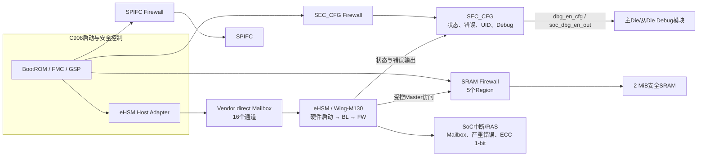

# NGU800P eHSM、Firewall与SEC_CFG总体介绍

## 1. 文档定位

本文面向项目组做总体介绍，说明eHSM、Firewall和SEC_CFG在NGU800P D0中的位置、主要能力、默认安全状态、SoC集成关系以及安全测试用例的总体构成。本文只保留方案级信息，不展开Mailbox命令参数、Firewall IP细节、寄存器逐bit定义和单条Case步骤。

项目当前最终基线为[飞书安全测试Case表](https://mx4lbik1jc.feishu.cn/wiki/HsC6wEjSqivStckreWqc6gIVnXG?sheet=o4uhR0)。2026-08-20已在登录状态下逐行核对；受企业策略限制不能下载/导出，因此[NGU800P安全测试最终表v5](../../tests/cases/outputs/20260813-security-final/NGU800P_Security_Case_Table_Final_v5.xlsx)仅保留为历史快照。更详细的功能和Case说明见[NGU800P安全架构、功能与测试用例说明](NGU800P安全架构功能与测试用例说明.md)。

当前结论适用于`NGU800P D0`。已确认的功能方向与尚未冻结的数值绑定在本文中分开描述，不能把候选地址或截图复位值直接用于产品代码。

## 2. 总体架构

NGU800P安全启动由C908侧的BootROM、FMC和GSP进行编排。eHSM是独立的安全硬件与固件执行单元，内部依次经历硬件启动、BL阶段和FW阶段；C908不直接调用eHSM内部CSR，而是通过Host Adapter和Vendor direct Mailbox提交命令。

SEC_CFG位于SoC管理/安全域，是eHSM状态、错误、生命周期、UID和Debug状态的汇聚观察窗口。Firewall位于受保护目标的访问路径前端，决定哪个发起方可以访问SEC_CFG、SPIFC和安全SRAM。

图中表示功能关系，不代表绝对地址、IRQ映射和全部复位数值已经冻结。

## 3. 三个模块的总体关系

| 模块 | 在SoC中的位置 | 主要职责 | 与其他模块的关系 | 事实状态与依据 |
|---|---|---|---|---|
| eHSM | 独立安全子系统，通过NoC、Mailbox和状态/错误信号接入SoC | 密码算法、密钥、OTP、生命周期、镜像验证、Debug鉴权和安全状态管理 | C908通过Mailbox调用；状态/错误映射到SEC_CFG；作为Master访问安全SRAM；产生Mailbox和错误中断 | `VENDOR_IMPLEMENTATION / DOCUMENTED`，SRC-0005、SRC-0012、SRC-0018；SoC数值绑定依赖SRC-0022 |
| SEC_CFG | SoC管理/安全域中的受控观察窗口，位于SEC_CFG Firewall之后 | 汇聚eHSM状态、错误、LCS、UID和Debug配置/输出 | 启动核读取状态；Debug模块使用其配置/输出；eHSM状态线直接映射到该窗口 | `DOCUMENTED_WITH_OPEN_BINDINGS`，SRC-0026；绝对地址受`OPEN-CONFLICT-015`约束 |
| Firewall | 位于SEC_CFG、SPIFC和安全SRAM三个目标的访问路径前端 | 按发起方、读写权限和Region阻断未授权访问 | 保护SEC_CFG/SPIFC；对安全SRAM提供5个Region；三个实例均由启动核配置 | 安全权限方向为`DOCUMENTED`，SRC-0029、SRC-0030；CSR数值受`OPEN-CONFLICT-014`约束 |

## 4. eHSM总体情况

### 4.1 位置与工作方式

eHSM既是安全硬件，也是运行BL/FW的安全固件平台，两部分都是本项目的测试对象。其典型工作链为：

1. eHSM硬件启动并进入BL；
2. C908侧通过Vendor direct Mailbox调用BL命令；
3. GSP完成eHSM FW加载、验证和启动后，业务进入FW命令阶段；
4. eHSM的状态、硬件错误和固件错误输出进入SEC_CFG，并通过SoC中断/RAS路径上报异常。

首版产品命令通路采用轮询方式，每个阶段最多一条在途事务；中断能力单独作为SoC集成Case验证，不改变首版轮询主路径。该方向依据SRC-0018和[eHSM Mailbox接口说明](../04-interfaces/ehsm-mailbox.md)，事实状态为`VENDOR_IMPLEMENTATION / DOCUMENTED`。

### 4.2 Mailbox和Host可见接口组

eHSM不作为一组供C908直接遍历的普通SoC CSR使用。项目侧主要接触以下接口组：

| 接口组 | 项目组需要知道的内容 | 当前状态 |
|---|---|---|
| Vendor direct Mailbox | 16个服务通道，每通道stride为`0x1000`；通过info/note类寄存器发布请求并取得响应 | 通道数和布局方向已冻结；准确base待SRC-0022/RTL同步 |
| Command/Response共享对象 | 命令包含command ID及参数，响应包含eHSM返回码和输出；共享地址使用64-bit System Address | Vendor协议已定义；SoC内存属性仍需集成确认 |
| Host可见状态/错误 | 保存硬件启动、BL、FW、SoC验签和错误原始值，并通过SEC_CFG观察 | 位含义部分已定义；准确Host寄存器绑定待RTL同步 |
| Mailbox IRQ | SoC已枚举16路eHSM Mailbox IRQ，用于中断路径验证 | IRQ数已知；通道与IRQ逐项映射仍需冻结 |

### 4.3 默认安全状态和访问关系

| 项目 | 默认/目标状态 | 事实状态与依据 |
|---|---|---|
| 启动阶段 | 上电后先完成eHSM硬件启动并进入BL，FW由后续安全启动流程加载和启动 | `DOCUMENTED`，SRC-0005、SRC-0016、SRC-0018 |
| Debug | 默认关闭；只有通过批准的Debug流程后才允许开放，`CLOSE_DEBUG`后必须恢复关闭 | `DOCUMENTED`，SRC-0026及最终Case基线 |
| SEC_CFG/SPIFC数据访问 | eHSM默认无权访问 | `DOCUMENTED`，SRC-0029，适用于NGU800P D0 |
| 安全SRAM数据访问 | eHSM默认可访问5个Region对应的安全SRAM范围 | `DOCUMENTED`，SRC-0027/SRC-0029，适用于NGU800P D0 |
| Firewall配置 | eHSM无权配置SEC_CFG、SPIFC或SRAM Firewall | `DOCUMENTED`，SRC-0030，适用于NGU800P D0 |

## 5. SEC_CFG总体情况

### 5.1 位置与职责

SEC_CFG是SoC安全状态观察窗口，不是eHSM内部完整寄存器空间，也不负责eFuse编程或Firewall策略配置。访问SEC_CFG之前先经过SEC_CFG Firewall；当前默认策略只允许启动核访问，eHSM和其他核均无权限。

SEC_CFG共包含17个32-bit寄存器，逻辑offset为`0x000～0x040`。其组成如下：

| 寄存器组 | 数量 | 访问属性 | 主要内容 |
|---|---:|---|---|
| `hsm_status0/1` | 2 | RO | `o_hsm_status[63:0]`，反映硬件启动、BL/FW、SoC验签、生命周期和Debug状态 |
| `hsm_err_hw0/1` | 2 | RO | `o_hsm_err_hw[63:0]`，反映watchdog、TRNG、总线和ECC等硬件错误 |
| `hsm_err_fw0/1` | 2 | RO | `o_hsm_err_fw[63:0]`，保存FW错误原始值 |
| `lcs` | 1 | RO | 生命周期状态 |
| `uid0～uid4` | 5 | RO | 160-bit芯片UID |
| `dbg_en_cfg` | 1 | `bits[1:0]`为RW | 主Die控制从DieDebug通道 |
| `soc_dbg_en_out0～3` | 4 | RO | eHSM Debug鉴权后的128-bit最终输出状态 |
| **合计** | **17** |  |  |

寄存器表依据[SEC_CFG机读寄存器表](../../requirements/sec-cfg-register-map.yaml)和SRC-0026，事实状态为`DOCUMENTED_WITH_OPEN_BINDINGS`。

### 5.2 默认值与Debug边界

- 17个寄存器的文档化复位值均为`0x00000000`；但`hsm_status*`、`hsm_err_*`、`lcs`、`uid*`和`soc_dbg_en_out*`是外部状态镜像，复位释放后可以立即变化，不能把“reset为0”理解为运行期恒为0。
- `dbg_en_cfg[1:0]`默认值为0，表示从Die Debug通道关闭。启动核写入批准值后，需要用真实Debug通路验证打开；恢复0后，真实Debug访问必须再次被拒绝。
- `soc_dbg_en_out[127:0]`不是`dbg_en_cfg`的扩展。它反映eHSM Mailbox Debug鉴权的最终输出，必须与Debug鉴权响应和实际Debug访问结果同步。
- SEC_CFG自身没有错误清除寄存器；错误清除和中断清除属于对应错误源或SoC集成逻辑，不能通过写SEC_CFG错误镜像完成。

SEC_CFG候选绝对地址目前存在SRC-0026与SRC-0022不一致，受`OPEN-CONFLICT-015`约束；项目介绍和测试设计只冻结offset与功能分组，实际实现必须取RTL同步生成头。

## 6. Firewall总体情况

### 6.1 安全方案使用的三个实例

本项目只验证安全方案实际使用的访问控制，不做Firewall IP完整功能回归。

| Firewall实例 | 默认数据访问权限 | 是否在安全Case中成功重新配置 | 配置Owner |
|---|---|---|---|
| SEC_CFG Firewall | 仅启动核可读写；eHSM和其他核拒绝 | 否，只验证默认权限 | 仅启动核 |
| SPIFC Firewall | 仅启动核可读写；eHSM和其他核拒绝 | 否，只验证默认权限 | 仅启动核 |
| SRAM Firewall | 启动核和eHSM可读写；其他核拒绝；覆盖5个Region | 是，由启动核在同一Case内依次覆盖5个Region | 仅启动核 |

数据访问权限与配置权限是两个不同概念：eHSM可以按默认策略访问安全SRAM数据，但不能修改SRAM Firewall配置。以上结论适用于NGU800P D0，依据SRC-0029和SRC-0030，事实状态为`DOCUMENTED`。

### 6.2 寄存器组成

Firewall寄存器按功能分为以下几组：

| 寄存器组 | 作用 | 项目使用方式 |
|---|---|---|
| 实例控制 | `F_SRAM_ENABLE`、`F_SECCFG_ENABLE`、`F_SPIFC_ENABLE`候选控制组，包含检查/隐藏等控制 | 由启动核读取或配置；SEC_CFG/SPIFC不在安全Case中做成功重配 |
| SRAM Region配置 | 5个Region的使能、地址范围和authority | 启动核保存原配置、修改地址范围和允许Master ID、验证后恢复 |
| Authority | 为有效发起方分别提供读写授权位 | 测试只使用批准的Master与读写组合，不穷举Firewall IP全部编码 |
| 错误诊断与清除 | 记录失败地址、读写方向、UserId/Region等，并提供清除路径 | 用于失败证据和恢复；精确CSR由RTL规格冻结 |

SRC-0025已记录上述逻辑和候选寄存器组，但当前CSR base、部分reset、Region默认窗口及若干字段仍存在冲突，受`OPEN-CONFLICT-014`约束。因此，项目当前冻结的是安全权限方向，不在介绍文档中宣称候选数值已经成为量产默认值。

## 7. SoC集成要点

| 集成项 | 当前集成关系 | 测试关注点 |
|---|---|---|
| eHSM命令通路 | C908 → Host Adapter → Vendor direct Mailbox → eHSM BL/FW | 命令真实到达eHSM，返回码、输出和副作用形成闭环 |
| 状态观察 | eHSM `o_hsm_status/o_hsm_err_hw/o_hsm_err_fw` → SEC_CFG → 启动核/诊断软件 | 17寄存器可读、拼接正确、与启动场景一致 |
| Debug | `dbg_en_cfg`控制主Die到从DieDebug；`soc_dbg_en_out`反映eHSM鉴权结果 | 寄存器、Mailbox鉴权结果和实际Debug通路三者一致 |
| SEC_CFG/SPIFC隔离 | 目标前端Firewall默认仅放行启动核 | eHSM和其他核被拒绝，目标内容和Firewall配置不变 |
| SRAM隔离 | SRAM Firewall提供5个Region | 默认权限、启动核重配置、范围和Master ID变更、恢复默认 |
| Mailbox中断 | eHSM真实响应触发SoC IRQ | 路由、屏蔽、清除、重触发和无中断风暴 |
| 错误中断 | 严重错误组合为一根中断；ECC 1-bit为独立脉冲/中断 | 需要RTL-DV/EDA注入，并由软件观察寄存器、中断和清除结果 |

严重错误组合包括watchdog、OTP Key CRC、TRNG异常和不可纠正ECC；ECC 1-bit可纠正错误使用另一条独立路径，并需要SoC侧转换成可查询、可清除和可计数的状态。该集成方向依据SRC-0027，事实状态为`DOCUMENTED_WITH_OPEN_BINDINGS`，精确中断号、清除寄存器和计数器字段仍需RTL/CSR Evidence冻结。

## 8. 安全测试Case总体说明

### 8.1 数量和分类

本节以2026-08-20在线飞书最终表复核结果为统计基线，不再使用本地v5工作簿的76条统计。飞书最终表共有63条Case，连续编号为`NGU800P-D0-SECURITY-001～063`；63条均标记为“功能正确性”、优先级`P0`。

| 编号范围 | 数量 | 分类 | 主要内容 | 执行层 |
|---|---:|---|---|---|
| `001～015` | 15 | eHSM BL Mailbox BASIC | BL阶段基础命令，以及OTP密钥安装和SoC密钥轮换综合验证 | baremetal + 真实eHSM |
| `016～047` | 32 | eHSM FW Mailbox BASIC | FW阶段密码、OTP、Debug、镜像验签、状态和Key管理等正常功能 | baremetal + 真实eHSM |
| `048～054` | 7 | eHSM负向安全功能 | 镜像/防回滚、BL/FW Debug鉴权、Key材料、OTP越界和非法状态转换拒绝 | baremetal + 真实eHSM |
| `055～061` | 7 | SoC软件/协同 | SEC_CFG、Debug、三个Firewall场景、SRAM重配置和Mailbox IRQ | baremetal + Debug/SoC集成 |
| `062～063` | 2 | EDA/硬件协同 | 严重错误组合IRQ和ECC 1-bit独立中断 | RTL-DV/EDA + 软件观察器 |
| **合计** | **63** |  |  |  |

从测试对象角度可再汇总为：eHSM相关54条（47条Mailbox BASIC + 7条负向）、SoC软件/协同7条、EDA/硬件协同2条。编号`001～061`为软件/BSP主导的实现与协同范围；`062～063`需要RTL-DV/EDA完成故障注入，软件侧负责寄存器、中断、清除和计数结果的观察。飞书表的“归属团队”列当前63条均填写为`软件平台部_BSP`，但这不改变最后两条对RTL-DV/EDA激励的依赖。

与旧文档相比，最终飞书表将Mailbox BASIC由52条收敛为47条、eHSM负向由14条收敛为7条、EDA/硬件由3条收敛为2条；SoC软件/协同仍为7条，因此总数由76条调整为63条。

### 8.2 SoC相关7条Case

1. `055 / SOC-SECCFG-001`：一次遍历全部17个SEC_CFG寄存器并与场景期望比较；
2. `056 / SOC-SECCFG-DBG-001`：验证`dbg_en_cfg`默认关闭、打开、实际Debug联通和恢复关闭；
3. `057 / SOC-FW-SECCFG-001`：验证SEC_CFG Firewall默认仅启动核可访问；
4. `058 / SOC-FW-SPIFC-001`：验证SPIFC Firewall默认仅启动核可访问；
5. `059 / SOC-FW-SRAM-001`：在一个Case内遍历5个Region的默认权限；
6. `060 / SOC-FW-SRAM-RECFG-001`：由启动核在一个Case内遍历SRAM 5个Region，修改地址范围和允许Master ID并恢复；该Case本身不包含非启动核/eHSM配置写拒绝矩阵；
7. `061 / SOC-MAILBOX-IRQ-001`：用真实eHSM响应验证Mailbox中断路由与清除。

### 8.3 EDA/硬件协同2条Case

- `062 / EDA-ERR-CRITICAL-IRQ-001`：逐源/组合注入严重错误，验证`o_hsm_err_hw`映射和组合中断；
- `063 / EDA-ERR-ECC1B-IRQ-001`：逐RAM注入ECC 1-bit错误，验证脉冲、独立中断、清除和计数。

最终飞书表已不再包含原`EDA-FW-EHSM-MASTER-001`独立Case，因此本节不再将其计入用例总数。

### 8.4 两个开发前必须澄清的边界

1. 在线Debug鉴权Case记录了`soc_dbg_en_out`判据，但没有写明挑战类型。若使用`SOC_DEBUG`挑战，应检查`soc_dbg_en_out`和真实SoC JTAG；若使用`EHSM_DEBUG`挑战，应检查`hsm_dbg_en/o_hsm_status[16]`和真实eHSM DAP。挑战类型未冻结时不能按其中一条链猜测PASS。
2. 产品方案已冻结三个Firewall只有启动核具备配置权，但在线Case 060只直接验证启动核成功重配SRAM五Region。非启动核/eHSM配置写拒绝仍需在最终Case或RTL-DV/集成Evidence中补齐，不能由Case 060的PASS自动推导。

## 9. 当前状态和项目组注意事项

1. Case设计和最终飞书表已经完成，但63条Case尚未形成执行通过证据，不能据此宣称RTL、eHSM或SoC集成已经通过。
2. eHSM Mailbox绝对base、Host status/error绑定、通道到IRQ的逐项映射仍需RTL同步资料关闭。
3. SEC_CFG的17个offset和功能分组可用于测试设计，但绝对base/size必须在`OPEN-CONFLICT-015`关闭后取权威生成头。
4. Firewall安全权限方向已经冻结；CSR base、部分reset、Region默认窗口和精确字段仍受`OPEN-CONFLICT-014`约束。
5. 软件测试负责功能激励和可见结果判断；错误注入、互连内部阻断、ECC脉冲等软件不便证明的内容必须由RTL-DV/EDA Evidence补齐。
6. Debug挑战类型和Firewall配置Owner负向覆盖是后续代码/执行计划的显式输入，不得在实现中静默假设。

## 10. 参考资料

- [NGU800P安全架构、功能与测试用例说明](NGU800P安全架构功能与测试用例说明.md)
- [eHSM Mailbox接口说明](../04-interfaces/ehsm-mailbox.md)
- [SEC_CFG安全状态观察架构](../03-architecture/sec-cfg-status-observation.md)
- [Firewall与隔离架构](../03-architecture/firewall-isolation.md)
- [SEC_CFG机读寄存器表](../../requirements/sec-cfg-register-map.yaml)
- [Firewall需求](../../requirements/firewall-requirements.yaml)
- [SRC-0029：SEC_CFG/SPIFC默认权限修正](../../sources/source-cards/SRC-0029.md)
- [SRC-0030：Firewall配置Owner修正](../../sources/source-cards/SRC-0030.md)
