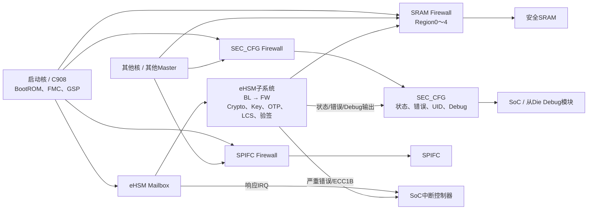

# NGU800P 安全架构、功能与测试用例说明

## 1. 文档目的

本文面向测试开发人员，说明eHSM、SEC_CFG、Debug、Firewall、Mailbox中断和错误上报在SoC中的关系，并解释[飞书最终安全测试表](https://mx4lbik1jc.feishu.cn/wiki/HsC6wEjSqivStckreWqc6gIVnXG?sheet=o4uhR0)的63条Case应由哪一层实现和判断。

本文是总体说明，不代替在线表每一行的“前置条件、输入、输出、测试目的、通过准则”。后续代码映射见[Codex移植指导](NGU800P安全测试用例设计与Codex移植指导.md)，编号目录见[CASE_TABLE.md](../../tests/cases/security/CASE_TABLE.md)。全部Case仍为`NOT_EXECUTED`。

## 2. SoC总体架构

逻辑上分成三层：

1. eHSM是安全功能DUT，负责密码算法、密钥、OTP、生命周期、镜像验证和Debug鉴权。
2. SEC_CFG是SoC侧的受控观察/配置窗口，汇聚eHSM状态和错误，并提供从DieDebug配置及SoC Debug输出观察。
3. Firewall位于SEC_CFG、SPIFC和安全SRAM前端，按真实发起方身份控制数据访问；配置窗口本身只有启动核拥有配置权。

图中只表示方案关系，不表示绝对地址、Master ID、IRQ号和清除寄存器已全部冻结。数值绑定必须取目标D0的RTL/CSR和生成头文件。

## 3. eHSM与Mailbox

### 3.1 eHSM在SoC中的位置

eHSM是独立安全子系统，内部从BL进入FW阶段。启动核通过Mailbox调用其服务；eHSM以真实硬件/固件执行密码、Key、OTP、验签、生命周期和Debug鉴权，并把部分状态/错误输出映射到SoC。

在安全测试中，eHSM固件和硬件都属于被测对象，Host适配代码不是DUT。Host可以做输入合法性检查，但Host本地拒绝不能证明eHSM正确拒绝。

### 3.2 Mailbox Case的三层判定

Mailbox Case不能只看API返回码，应按功能需要组合：

- 事务层：请求确实提交到指定Mailbox，command ID与原始响应可追踪；
- 功能层：输出数据、算法结果、读回值或正反向闭环正确；
- 安全副作用层：OTP、Key、Debug、生命周期、release等状态只发生Case允许的变化，失败时保持不变。

最终表有47条BASIC：BL 15条、FW 32条。另有7条负向安全Case，用于证明错误签名/载荷、回滚、错误Debug响应、篡改Key材料、非法OTP访问和非法状态转换由eHSM拒绝。

### 3.3 BASIC和负向的关系

BASIC验证合法输入的正常功能闭环；负向Case从一个已通过的合法基线出发，每次只改变一个安全属性，验证eHSM拒绝且无禁止副作用。负向Case不是Host健壮性测试，也不是为每个参数穷举边界。

## 4. SEC_CFG

### 4.1 作用与位置

SEC_CFG位于SoC管理/安全域，是eHSM状态、错误、生命周期、UID和Debug相关信号的SoC观察窗口。访问SEC_CFG之前先经过SEC_CFG Firewall；默认只有启动核能访问，eHSM和其他核均被拒绝。

SEC_CFG不是eHSM内部完整寄存器空间，不负责eFuse编程，也不配置Firewall策略。

### 4.2 最终Case使用的17个寄存器

最终Case 055在一个Case中遍历offset `0x000～0x040`的17个32-bit寄存器：

| Offset范围 | 数量 | 主要内容 |
|---|---:|---|
| `0x000～0x004` | 2 | `hsm_status[63:0]`，包括eHSM状态及`hsm_dbg_en`的SoC可见映射 |
| `0x008～0x00c` | 2 | `hsm_err_hw[63:0]`，硬件错误与ECC错误 |
| `0x010～0x014` | 2 | `hsm_err_fw[63:0]`，固件错误 |
| `0x018` | 1 | 生命周期观察 |
| `0x01c～0x02c` | 5 | UID及有效性相关观察 |
| `0x030` | 1 | `dbg_en_cfg`，主Die控制从DieDebug，批准位可读写 |
| `0x034～0x040` | 4 | `soc_dbg_en_out[127:0]`，SoC Debug鉴权输出观察 |

Case 055默认全部读取，不设计“选择某个寄存器”的用例参数。软件保存单寄存器raw值和需要的跨32-bit拼接值，再与当前场景的批准期望比较。若期望值、跨字读取顺序或绝对base未冻结，结果为`INCONCLUSIVE`，不能用全0/全1等猜测值判PASS。

## 5. Debug控制必须分清三类信号

### 5.1 `dbg_en_cfg`

`dbg_en_cfg`是SoC SEC_CFG中的可读写配置，作用是主Die控制从DieDebug通道。Case 056验证：默认关闭、打开前真实通路拒绝、主Die写开并回读、真实从Die通路可联通、写回关闭并回读、真实通路再次拒绝。

它不依赖eHSM Mailbox鉴权，不能用`soc_dbg_en_out`代替。

### 5.2 `soc_dbg_en_out`

`soc_dbg_en_out[127:0]`是eHSM处理SoC Debug鉴权后提供给SoC的输出状态。若Mailbox Case使用`SOC_DEBUG`挑战，鉴权成功、`soc_dbg_en_out`和实际SoC JTAG开放必须一致；`CLOSE_DEBUG`后两者同步关闭。

### 5.3 `hsm_dbg_en`

`hsm_dbg_en`由eHSM内部产生，SoC可通过`o_hsm_status[16]`观察。该信号在eHSM wrapper/subsystem内用于eHSM JTAG/DAP路径选择，不是SoC全局JTAG的通用门控信号。若Mailbox Case使用`EHSM_DEBUG`挑战，必须检查`hsm_dbg_en/o_hsm_status[16]`以及真实eHSM DAP通路。

最终在线Case当前没有在Debug鉴权行中写清挑战类型。代码开发前必须冻结`SOC_DEBUG`或`EHSM_DEBUG`；未冻结时不得只查`soc_dbg_en_out`后宣称通路正确。

## 6. Firewall

### 6.1 本轮测试范围

本轮只验证安全方案实际使用的访问控制，不做Firewall IP完整回归，不发散到所有寄存器编码、burst、Hide、内部优先级等细节。

| Firewall | 默认数据访问 | 最终Case是否成功重配置 | 产品配置Owner |
|---|---|---|---|
| SEC_CFG | 仅启动核允许；eHSM和其他核拒绝 | 否，只测默认权限 | 仅启动核 |
| SPIFC | 仅启动核允许；eHSM和其他核拒绝 | 否，只测默认权限 | 仅启动核 |
| SRAM Region0～4 | 启动核和eHSM允许；其他核拒绝 | 是，启动核逐Region修改地址范围和允许Master ID | 仅启动核 |

数据访问权和配置权是两个概念。eHSM默认可访问SRAM数据，但没有SRAM Firewall配置权。

### 6.2 默认权限测试

SEC_CFG和SPIFC各一条Case，配置保持不变：启动核执行批准的读写，eHSM和其他核逐一访问并被拒绝。未授权读不能取得受保护真值，未授权写不能改变目标或相邻哨兵。

SRAM默认权限保持一条Case，但Case内部必须遍历Region0～4。每个Region都验证启动核和eHSM可访问、其他核被拒绝，并检查目标和相邻哨兵。

### 6.3 SRAM重新配置

SRAM重新配置保持另一条独立Case，Case内部同样遍历Region0～4。每次只由启动核修改当前Region的起止地址和允许Master ID，检查配置读回、新Master只可访问新范围、未授权或越界访问被拒绝、其他Region不变，最后恢复。

产品方案规定三个Firewall均只有启动核能配置；但是飞书Case 060当前只写了启动核成功重配SRAM五Region，没有写eHSM/其他核配置写拒绝步骤。因此Case 060 PASS只能证明启动核重配置功能，不能自动证明完整配置Owner负向矩阵。该缺口需要Case Owner后续在最终表或RTL-DV/集成Evidence中明确关闭。

## 7. Mailbox中断

eHSM处理Mailbox命令后，响应事件通过SoC中断路径通知Host。Case 061应使用真实、无副作用的Mailbox命令作为激励，并在适用通道上验证：

1. 响应到达时产生正确IRQ，ISR来源和计数正确；
2. 清除后不持续重入或形成中断风暴；
3. 再次发命令能够重新触发；
4. 屏蔽中断后ISR不执行，但轮询仍能完成同一事务；
5. 最后恢复原中断/轮询配置。

单纯轮询成功只能证明Mailbox事务，不等于中断路由通过。

## 8. 错误上报和EDA分工

### 8.1 严重错误组合中断

watchdog超时、OTP Key CRC、TRNG异常和各RAM不可纠正ECC等严重错误映射到`o_hsm_err_hw`，并组合成一根SoC中断。Case 062要求RTL-DV/EDA逐源及组合注入，检查位映射、组合IRQ、清除、重触发和无无关位。

### 8.2 ECC 1-bit独立路径

PKE0～3、KMU、DRAM、IRAM和IROM的可纠正ECC 1-bit错误使用另一条独立脉冲/中断路径。Case 063要求RTL-DV/EDA逐RAM注入，检查脉冲到SoC锁存/计数、独立IRQ、清除、重触发和计数边界。

软件可以实现状态读取、ISR、清除和计数观察器，但真实故障注入由RTL-DV/EDA完成。写一个软件状态位或制造Host错误不能替代上述硬件Evidence。

## 9. 最终Case数量和编号

2026-08-20核对的飞书最终表共有63条，编号连续：

| 编号 | 数量 | 分类 | 执行层 |
|---|---:|---|---|
| `001～015` | 15 | BL Mailbox BASIC | 软件/BSP + 真实eHSM |
| `016～047` | 32 | FW Mailbox BASIC | 软件/BSP + 真实eHSM |
| `048～054` | 7 | eHSM负向安全功能 | 软件/BSP + 真实eHSM |
| `055～061` | 7 | SoC软件/协同 | 软件/BSP + Debug/SoC集成 |
| `062～063` | 2 | EDA/硬件协同 | RTL-DV/EDA激励 + 软件观察 |
| **合计** | **63** |  |  |

`001～061`是软件/BSP主导范围，但部分Case需要Debug模块、真实Master或SoC IRQ环境协同。`062～063`不是普通baremetal故障注入Case。

与历史v5相比，最终飞书表把Mailbox BASIC从52条收敛到47条、eHSM负向从14条收敛到7条、EDA从3条收敛到2条；SoC软件/协同仍为7条。旧`EDA-FW-EHSM-MASTER-001`不再计入最终Case。

## 10. SoC相关9条Case速览

| 编号 | 追踪ID | 说明 |
|---:|---|---|
| 055 | `SOC-SECCFG-001` | 遍历17个SEC_CFG寄存器并比较场景期望 |
| 056 | `SOC-SECCFG-DBG-001` | `dbg_en_cfg`默认关闭、写开、真实从DieDebug联通、恢复关闭 |
| 057 | `SOC-FW-SECCFG-001` | SEC_CFG默认仅启动核访问，eHSM和其他核拒绝，不改配置 |
| 058 | `SOC-FW-SPIFC-001` | SPIFC默认仅启动核访问，eHSM和其他核拒绝，不改配置 |
| 059 | `SOC-FW-SRAM-001` | 单Case遍历5个Region的默认数据权限 |
| 060 | `SOC-FW-SRAM-RECFG-001` | 启动核在单Case内遍历5个Region，修改范围和允许Master ID后恢复 |
| 061 | `SOC-MAILBOX-IRQ-001` | 真实eHSM响应的IRQ路由、屏蔽、清除和重触发 |
| 062 | `EDA-ERR-CRITICAL-IRQ-001` | 严重错误逐源/组合注入、错误位和组合IRQ |
| 063 | `EDA-ERR-ECC1B-IRQ-001` | ECC 1-bit逐RAM注入、独立IRQ、锁存/计数和清除 |

## 11. 测试输出和Evidence原则

每条软件Case必须输出：最终编号和追踪ID、运行阶段、目标版本、输入摘要、实际API/总线结果、关键数据或状态、恢复结果以及唯一的`PASS/FAIL/INCONCLUSIVE`。

负向Case还必须证明请求真实到达eHSM、原始拒绝响应、禁止副作用未发生以及合法复测结果。SoC权限Case要记录真实发起方、目标地址、读写方向、总线结果、目标/哨兵前后值和Firewall配置前后值。EDA Case需关联注入点、波形、预期位、IRQ、清除和计数Evidence。

## 12. 当前开放输入

- Mailbox正式API/命令ID、错误码及BL/FW可用阶段需要与目标eHSM版本绑定；
- Debug挑战类型和真实SoC JTAG/eHSM DAP操作方法需接口Owner冻结；
- SEC_CFG绝对base、场景期望、Firewall CSR、Master ID和Region默认窗口需目标D0 RTL/CSR冻结；
- Mailbox和错误中断号、mask/clear寄存器及ECC计数合同需SoC/RTL冻结；
- Firewall“仅启动核可配置”的负向验证尚未在在线最终Case中闭环。

这些缺口不删除Case，也不允许猜测PASS；相应子项在输入未冻结时记为`INCONCLUSIVE`。
