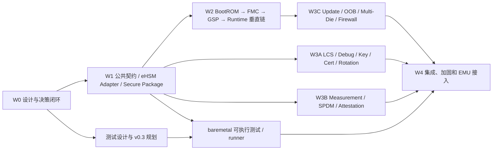

# 计划定位

本文是`TASK-SEC-SOC-FW-001`的从属开发波次计划，不是第三个顶层任务。两个顶层任务及其边界以[NGU800P两项任务总计划](NGU800P两项任务总计划.md)为准。

本文把[安全 Feature 落实矩阵](SECURITY-FEATURE-REALIZATION-MATRIX.md)和[正式详细设计](../05-software-design/NGU800P安全软件详细设计.md)转换为可执行的开发波次、候选任务、代码落点、测试出口和完成门禁，是 `security_-scheme` 中SoC安全固件开发排程与追溯的子计划。

本文不是代码实现授权。候选任务只有在对应 Feature 的详细设计、冲突、Requirement、测试 oracle 和 OpenSpec 审批满足准入条件后，才会单独创建实施任务。当前启动的是 `W0` 设计与开发准备，不修改 `gsp-pmp-rmp-omp` 或 `baremetal`。

# 不可突破的约束

1. SRC-0017 是系统/架构上位基线；SRC-0016 是软件工程落地下位基线。软件实现必须同时满足上位硬件/架构原则和当前有效软件方案。
2. Vendor 仅指 eHSM 及其内部 Core。Vendor 文档和 SRC-0018 代码只作为 `DOCUMENTED`/`VENDOR_IMPLEMENTATION` 输入，不能单独定义 SoC 行为；采纳内容最终必须进入有效软件方案。
3. 发现方案、Vendor、公司代码或测试之间有明显冲突时，受影响任务保持 `CONFLICTING`/阻塞并提交负责人裁决，不用“软件方案为准”掩盖实现差距。
4. 计划、任务、正式详设、测试规划、工作簿和开发追溯只写入 `security_-scheme`；正式软件实现只进入 `../gsp-pmp-rmp-omp`；可执行测试、EMU runner、工具和必要测试数据只进入 `../baremetal`。
5. 允许在多人仓库默认分支工作区直接修改，但所有任务均不需要 Git 提交。Codex 不执行任何 Git 命令，不执行 `add`、`commit`、`push`、merge、rebase 或 tag，不修改 `.git`。
6. `gsp-pmp-rmp-omp` 在盘点时已有大量未提交修改。每个实施任务必须先由负责人确认计划修改文件的归属和允许覆盖范围；无法区分时停止该文件的修改。
7. 私钥、生产密钥、授权 token 和真实不可逆 OTP/eFuse 数据不得进入任一仓库。工具只接收受控 KMS/HSM 输入或测试专用材料。
8. 现有两个代码仓中的 test/stub/demo/synthetic flow 和历史 Expected 只记录 `CODE_FACT` 与差距，不作为目标流程、最终 test oracle、验收或发布依据。最终依据是有效方案、批准的 Requirement/OpenSpec/ADR、最新版本化测试工作簿和目标 Evidence。
9. EMU/产品实现不允许 stub、simulated success、test key/cert/provider、未批准 hardcode、silent fallback 或其他可能遗留最终落地风险的编码方式；未完成能力必须不可达、禁用或 fail-close。现有 runner/build 机制可复用，但不能沿用其 stub 行为和历史 Expected。
10. SRC-0018 Vendor Demo是eHSM能力覆盖输入：`baremetal`必须完整盘点并覆盖`ehsm_demo_test()`功能/case，但Vendor Demo的顶层顺序和最终打印不是SoC发布oracle；`gsp-pmp-rmp-omp`不得把Demo编排当作产品流程。

# 基线事实与当前起点

| 依据 | 状态 | 对开发计划的含义 |
|---|---|---|
| SRC-0017 pp.13–18、19–33、44–55 | `PROPOSED` 系统基线 | 给出安全启动/升级、LCS/Debug/Key、SPDM、Multi-Die/Firewall 的上位边界；具体软件 ABI 仍需详设。 |
| SRC-0016 pp.1–12 | `PROPOSED` 软件基线 | 目标链路为 BootROM→eHSM→FMC、FMC→GSP、GSP→Runtime，正式镜像要求验签+解密、反回滚、measurement 和 fail-close。 |
| SRC-0015、SRC-0016 pp.17–31、ADR-0021 | 密钥轮换策略/机制已批准，物理绑定开放 | 已冻结LCS/Debug总体原则及SoC Verify/Encrypt/Debug每类一次、HSM Bitmap、48字节封装、写Key→Bitmap→destroy→reset；Vendor定制ABI、slot/bit、掉电/KMS/recipe待补。 |
| SRC-0016 pp.32–33 | `PROPOSED` 软件基线 | 给出 OOB 恢复和 Multi-Die 目标边界；存在 Die1 measurement 内部矛盾。 |
| CE-SEC-001 | `CODE_FACT` | BootROM 默认是 hello-world；可选 demo 使用 synthetic package 和 eHSM stub，没有 ready/LCS/Mailbox/loader/jump 生产链。 |
| CE-SEC-002 | `CODE_FACT` | FMC/GSP 默认是 hello-world；制包工具不签名/加密，anti-rollback 和 measurement 是骨架，没有生产 caller/release。 |

因此开发不能从“在现有main中直接补调用”开始，也不能把现有test/stub flow当作目标。DD-02拆为两个实施方向：baremetal完整验证Vendor Demo能力并形成case list；BootROM/FMC/GSP产品代码第一阶段主要以`bl_demo`能力为输入，复用底层通用实现和command格式，但实际payload、调用顺序、安全启动和SPDM串联由软件方案决定。NGU800P port、构建隔离、项目ABI、错误和安全门禁仍需独立落实。关键路径先建立production安全边界、共同错误契约、NGU800P eHSM adapter、secure package/counter/Measurement Table契约，再接入BootROM/FMC/GSP；当前不采用版本化Handoff。

# 开发目标和完成边界

## EMU 前目标

- 20 个 Feature 的软件细节全部进入可评审详设；不能确定的部分有明确冲突、Owner 和裁决日期。
- 首批安全启动垂直链达到可编码状态，并尽量完成 Host/mock/QEMU 可验证部分。
- 生产 target 不再隐式链接或调用 test-only stub；尚未接硬件的路径显式失败，不能模拟成功。
- `security_-scheme` 的测试工作簿和 `baremetal` 的可执行测试包具备明确映射，EMU 到位后可直接冒烟。

## 流片前最终目标

- Feature→Requirement→Design→OpenSpec→Code→Case→Evidence 链完整。
- BootROM、eHSM、FMC、GSP、Runtime、更新/OOB、LCS/Debug、Key/Cert/Rotation、SPDM、Multi-Die/Firewall 的成功和失败路径均有目标环境 Evidence。
- 所有 P0 风险已验证关闭，或有负责人批准的书面风险处置；“代码已写”或“用例已列”不等同于风险释放。

# 任务状态模型

| 状态 | 含义 |
|---|---|
| `candidate` | 仅在本计划登记范围和依赖，未授权修改代码。 |
| `design_closure` | 正在关闭详设、冲突、Requirement 和测试 oracle。 |
| `ready_for_openspec` | 设计信息已足够，可创建行为变更 proposal。 |
| `approved_for_code` | OpenSpec/负责人批准，已创建单独实施任务并确认文件范围。 |
| `implementing` | 正在批准范围内修改目标代码仓工作区。 |
| `host_verified` | 构建和 Host/unit/QEMU 验证通过，但尚无目标硬件结论。 |
| `emu_verified` | 指定 EMU 版本上的目标用例和 Evidence 通过。 |
| `release_ready` | 追溯、回归、风险和发布签核完整。 |

# 依赖和开发波次

## 相对排期

排期以 EMU 首个可用日 `T0` 为锚点；日期变化时整体平移。以下成立的前提是 GSP 至少能并行推进“启动链”和“生命周期/认证”两个开发流，并且 W0 所列硬件参数和裁决能在一周内取得。

| 时间 | 主要工作 | 出口 |
|---|---|---|
| T-4 / 当前 | W0：R1-05和D1～D3已裁决；关闭DD-01～03/05首批开发契约；分配Owner；确认代码仓重叠修改归属 | 首批候选任务达到`ready_for_openspec`，但仍不自动开始编码 |
| T-3 | W1：公共契约、production/test 构建隔离、eHSM adapter、package/parser/counter/measurement；同时生成对应 Host/mock 用例 | 生产和测试实现明确隔离；公共契约可由 BootROM/FMC/GSP 共用 |
| T-2 | W2：按BootROM→FMC→GSP→Runtime顺序接入验证、加载、Measurement记录和release；并行启动W3A | 安全启动垂直链在Host/QEMU可观测，未接硬件能力显式失败 |
| T-1 | W3A/W3B/W3C：LCS/Debug/Key/Cert/Rotation、SPDM、更新/OOB、Multi-Die/Firewall 的可前移实现和 runner dry-run | EMU 软件包、测试输入、命令骨架、Expected 和 Evidence 目录冻结 |
| T0 及以后 | W4：EMU bring-up、硬件参数收敛、故障注入、全量回归和发布风险关闭 | `emu_verified` 后才可进入 `release_ready` |

如果 Owner、硬件寄存器/地址、算法 profile 或不可逆策略未按时确定，排期只冻结受影响任务；其他任务继续按依赖推进。不得用硬编码占位值换取表面进度。

# 开发候选任务目录

下表中的 ID 是候选开发单元，不是已创建的活动编码任务。每次只实例化近期、依赖已满足的任务，避免批量生成空任务。

| 波次 / ID | 范围与 Feature | `gsp-pmp-rmp-omp` 目标 | 主要准入依赖 | 软件出口 | 当前状态 |
|---|---|---|---|---|---|
| W1 / DEV-SEC-001 生产与测试构建边界 | 全部，重点 002～006/010/019 | `components/security/sub.mk`、BootROM/FMC/GSP `Makefile/sub.mk`、test runner | 现有未提交修改归属；production/test 定义 | EMU/产品目标不存在 stub/simulated success；测试基础设施不能定义产品行为，缺能力显式失败 | `candidate` |
| W1 / DEV-SEC-002 公共错误与Measurement上下文 | 001/005/009/019 | `components/security/include/security/`、`src/`；具体新文件名由DD-08冻结 | ADR-0022已批准可变紧凑Measurement、唯一SoC State、CRC/commit和reset全清零；当前不采用Handoff | 落实128B Header/Entry、实际count/length、实例唯一tuple、顺序append和snapshot；先补齐OPEN-DESIGN-021及PMA/Firewall，security不直接reset | `design_approved_platform_pending` |
| W1 / DEV-SEC-003 NGU800P eHSM 生产 Adapter | 002/004/016/019 | OSR Host底层通用函数和command格式、候选`ehsm_service.*`/`ehsm_policy.*`/`ehsm_port_ngu800p.c`、board/chip port glue | DD-02B；`bl_demo` A/B/C/D复用表；direct MMIO、最终PMA、operation timeout和RAS参数；ADR-0003/0006/0010/0011 | 按`ehsm-host-adapter.md`实现一个256字节slot/单在途/GSP串行service、active cache/timeout scope、零自动retry和timeout quarantine；不带入Demo/platform reset magic | `design_closure` |
| W1 / DEV-SEC-004 Secure Package、Policy、Counter与Measurement | 003/004/005/006/009 | `ehsm_image.*`、删除production `manifest.*`、新增Header Overlay/CRC/typed-stage policy、`verify_flow.*`、`measurement.*`、loader/registry、`tools/image_packager/` | ADR-0014/0017/0019/0020/0022/0030/0033；OPEN-CONFLICT-006；OPEN-DESIGN-019/021；实际provisioning matrix行 | 固定Header offset1008/1016/1020、CRC-32/ISO-HDLC双检、`Code_Size`唯一长度、entry=load；拒绝旧Manifest/旧8B reserved/dual parser；Measurement按批准ABI生成并替换旧epoch/32位counter/BSS表和stub工具；matrix缺失默认拒绝 | `design_approved_platform_build_inputs_pending` |
| W1 / DEV-SEC-004A eHSM BL Rollback Counter API | 006/019 | eHSM BL正式交付边界、Host header/adapter、FMC counter client | ADR-0019；实现前冻结command ID、wire packing、产品LCS权限、readback/status和交付版本 | 新增FMC专用16字节`ehsm_bl_commit_staged_soc_rollback_counter()`；先与BL RAM candidate exact-match，再执行低值拒绝、相等不写、高值更新和权威读回；禁止通用64位Counter/raw OTP/GSP值/FW副作用替代 | `design_approved_implementation_not_authorized` |
| W2 / DEV-SEC-005 BootROM→FMC安全启动 | 001～005/019 | `solutions/bootrom/app/`、BootROM board/chip glue、公共security | DEV-001～004；FMC Flash/固定load、Measurement最终ABI和失败终态 | ready→verify/decrypt→Header Overlay/typed FMC policy→提交唯一FMC Measurement及`rollback_counter[16]`→load/jump；任一失败不跳转；不创建Handoff | `candidate` |
| W2 / DEV-SEC-006 FMC→GSP验证与release | 003～006/009/019 | `solutions/fmc/app/`、FMC board/chip glue、公共security | DEV-001～004A；GSP source/release ABI；各master aperture待Evidence | 初始化读取FMC Measurement expected candidate→调用BL exact-match commit/readback→proof后接收并以`check_version=0`验证同值GSP→提交GSP Measurement→release；candidate暂存本身不算commit | `candidate_waiting_api_binding` |
| W2 / DEV-SEC-007 GSP→Runtime 验证与 release | 003～006/009/019 | `solutions/gsp/app/`、公共 security、目标微核 release glue | DEV-001～004/006；Runtime 清单、地址、Owner 和 release 顺序 | 每类 Runtime 的验证、measurement、release、重试/拒绝和审计入口 | `candidate` |
| W3A / DEV-SEC-008 LCS、Debug/RMA 与权限控制 | 011/012/018/019 | 候选 `components/security/src/lifecycle/`、`debug/` 和平台 gating glue | ADR-0020；LCS raw/转换、全局Debug enable/expiry和RAS数值Profile | typed状态机、无scope challenge/auth、一次性授权、Die0/Die1同一开关、自动关闭、reset/fault gating和审计 | `candidate_with_platform_inputs` |
| W3A / DEV-SEC-009 Key、Certificate、Rotation 与制造灌装 | 013～015/020 | 候选 `key/`、`cert/`、`provisioning/`；现有 attest/cert provider | SRC-0024/0032、ADR-0021/0025/0026/0029；Vendor定制、RTL逐die个性化、Key Attribute/backend、Flash/KMS/CA/MES和wire输入 | 一机一密、Table 34、16槽、独立Provisioning FW、typed recipe、slot14 Device Issuer/固定PoP、Host/CA离线签发静态前缀、signed install ticket、Cert0/1、GSP动态Leaf与内部轮换、unknown quarantine和清零；制造路径不解析通用X.509、不导出真实密钥 | `accepted_baseline_with_dynamic_profile` |
| W3B / DEV-SEC-010 Measurement、SPDM与Attestation | 009/010/014 | `measurement.*`、`src/attest/`、`src/spdm/`、`src/mctp/` | DEV-002/004/009；ADR-0020/0029；OPEN-DESIGN-015/023完整transport、eHSM、OID、slot/block/session合同 | ROM/FMC只交Hash，GSP固定Profile生成一级动态Firmware Alias Leaf，eHSM派生/签名，真实digest/cert/sign provider、Die1实例可验证、SPDM 1.2认证与secure session、无降级/stub/伪成功 | `DESIGN_BLOCKED_BY_PROFILE_INPUT` |
| W3C / DEV-SEC-011 正常更新与 OOB 恢复 | 006～008/019 | 候选 update/recovery 模块、FMC/GSP/Flash glue；OOB 仅实现 SoC 侧契约 | ADR-0020；Flash分区/transport/token/Owner平台Profile | inactive写入/读回/原子metadata/reset状态机；OOB写后仍由BootROM+eHSM最终裁决；禁止低rollback counter fallback | `candidate_with_platform_inputs` |
| W3C / DEV-SEC-012 Multi-Die、UCIe与Firewall | 017/018/019 | 候选platform security/firewall/multidie模块及Die0/Die1管理入口 | ADR-0020；C908地址视图、RTL地址/USERID/PMA/lock/reset默认值；OPEN-CONFLICT-006 | Die0验证、UCIe搬运/读回、Die1独立Measurement/release、Firewall证明和局部隔离 | `blocked_by_open_conflict` |
| W4 / DEV-SEC-013 全局加固、集成与发布 | 全部 | 上述模块、统一日志/审计/清零/fault hooks、build/release glue | ADR-0020；DEV-001～012目标切片；EMU manifest；OPEN-DESIGN-019剩余发布流程 | no-stub/test资产隔离；无silent fallback；Feature→Evidence闭环、高严重度缺陷关闭、waiver和签署门禁一致 | `candidate_waiting_release_profile` |

# 测试开发配套

测试任务的项目计划和 case 元数据仍保存在 `security_-scheme`；只有可执行代码进入 `baremetal/components/ngu_security/`。实现侧小粒度 unit/contract test 可以随生产模块保留在 `gsp-pmp-rmp-omp/components/security/tests/`。

| 测试候选 ID | 对应开发 | `baremetal` 目标 | 关键出口 |
|---|---|---|---|
| TST-SEC-001 Package/Parser/Counter/Measurement | DEV-002/004 | `tests/`、`tools/image_packager/`、negative corpus | 边界、overflow、signature/decrypt result、counter、digest、address-domain 的 Host 测试；冲突项标探索性 |
| TST-SEC-002A eHSM全部能力 | DD-02A / DEV-003 | `tests/ehsm/`、EMU runner | 以`EHSM-DEMO-CASE-CATALOG.md`为覆盖入口，展开`ehsm_demo_test()`全部BL/FW/可选/破坏性case；组包可复用，顶层follow baremetal；每case保留raw result |
| TST-SEC-002B 产品eHSM/Boot链 | DEV-003/005/006/007 | `tests/ehsm/`、`tests/boot/`、EMU runner | 从安全软件方案派生ready/timeout/busy/self-test、cache可见性、单在途、acceptance unknown、零retry、late-response quarantine、RAS reset和禁止release；不以Vendor Demo流程为oracle |
| TST-SEC-003 LCS/Debug/Key/Cert/Rotation | DEV-008/009 | `tests/lifecycle/`、`tests/key/`、测试证书和测试 token/config | 权限矩阵、非法跳转、鉴权/过期、三类Key、重复轮换、48字节封装、slot/bitmap/destroy逐点掉电、reset/首次新Key失败、回退禁止和清零 |
| TST-SEC-004 SPDM/Update/OOB/Multi-Die/Firewall | DEV-010～012 | `tests/spdm/`、`tests/update/`、`tests/multidie/`、runner | 协议负向、证书/measurement、更新原子性、OOB 后再验证、UCIe/Firewall 拒绝路径 |
| TST-SEC-005 EMU 回归与 Evidence | DEV-013 | `tests/emu/`、`tools/runner/`、日志解析 | Day-0 冒烟、全量波次、稳定 PASS/FAIL/INCONCLUSIVE、版本 manifest 和日志哈希 |

更新测试工作簿时必须从 v0.2 生成新版本，不覆盖旧文件；修改项黄色、新增项绿色、冲突/待确认项橙色。每个 DEV 任务至少关联一个正向、一个权限/边界和一个失败路径 case。可执行测试及其 Expected 从该最新有效工作簿和批准方案派生，不从原仓库 test/stub 流程反推。

# 编码准入 Definition of Ready

候选任务只有同时满足以下条件，才能变为 `approved_for_code`：

- Feature、SRC-0017 上位原则、SRC-0016 软件要求和适用版本明确。
- 相关详设已写明 ABI、字段、状态机、权限、错误、timeout/retry/reset、掉电、清零和并发/内存规则。
- 所有影响该切片的冲突已裁决、被接口隔离或有书面风险处置；不得把 UNKNOWN 参数硬编码。
- Requirement ID、工作簿 case、baremetal 可执行入口、Expected 和 Evidence 路径已登记。
- 行为变更已有批准的 OpenSpec change；重大安全策略另有 ADR/amendment。
- 目标仓库、目标文件/符号、禁止修改范围、已有工作区修改归属和停止条件已经确认。
- 实施任务使用 `tasks/templates/IMPLEMENTATION-TASK-template.md` 创建，且明确无 Git 操作。

# 完成 Definition of Done

- 仅修改批准文件；RESULT 记录实际文件、未提交 diff 摘要和剩余风险。
- EMU/产品构建不存在 stub、simulated success、test key/cert/provider、未批准 hardcode 或 silent fallback；未完成路径不可达、禁用或 fail-close。
- 指定编译、unit/contract/Host/QEMU 测试通过；未运行项明确记录原因，不能写成通过。
- 失败路径、资源清零、reset/掉电和权限边界达到任务验收条件。
- Requirement、Design、Code、Case 和 Evidence 链可以解析；项目状态和 Feature 矩阵同步更新。
- 目标硬件相关任务必须取得指定 EMU/RTL/样片 Evidence 才可标为 `emu_verified`。
- 未执行任何 Git 命令或提交工作，未修改 `.git`，未覆盖无关工作区修改。

# W0 当前执行清单

| 顺序 | 当前动作 | 产出 | 需要负责人输入 | 状态 |
|---|---|---|---|---|
| 1 | 登记 W0 评审结论并解释 R1-05 | [W0首轮设计评审包](W0首轮设计评审包.md)、ADR-0003 | R1-05批准/修改/删除；R1-01～04、06～11已批准 | active |
| 2 | 冻结 DD-02双路径合同 | DD-02A Vendor Demo一级case catalog和baremetal规则；DD-02B `bl_demo`底层/格式复用边界；Host Adapter结构/API/状态机；ready/raw self-test/Vendor Mailbox/buffer/cache/timer/error/RAS表；主体已合入主详设第4章 | 二级case展开；Vendor direct aperture/status权威宏；最终PMA、operation timeout、service channel/arena容量和RAS report数值 | integrated_with_platform_inputs；Vendor源码只读/direct布局、三stage首版poll、单在途/cache/timeout/retry/late-response及RAS未ready终态已冻结 |
| 3 | 冻结DD-03 package/counter/Measurement契约 | ADR-0030/0033冻结无Manifest包、Header offset1008/1016/1020与CRC、`Code_Size`唯一长度和entry=load；ADR-0019冻结16B counter/FMC主动BL API，ADR-0022批准Measurement逻辑ABI | eHSM BL command/packing/LCS/交付版本；OPEN-DESIGN-021最大实例；PMA/Firewall/MMP DDR | active / package_and_measurement_design_approved |
| 4 | 冻结公共stage error/zeroization和Measurement职责 | 错误、清零、可变Measurement和release契约；不创建Handoff ABI；ADR-0022冻结layout/integrity/reset全清零 | 日志/审计精确实现参数；最大实例与平台DoR | active / platform_inputs_pending |
| 5 | 完成编码前落实性审查 | [SOC安全固件编码前落实性审查-v1](SOC安全固件编码前落实性审查-v1.md)、CE-SEC-014；区分纯逻辑/平台/Vendor/延期功能 | 后续实际修改前确认代码授权和重叠文件归属 | review_complete / implementation_not_authorized |
| 6 | 同步测试 v0.3 规划 | 每个近期 DEV 的 case/oracle/载体/Evidence 映射 | 测试 Owner、EMU 能力和版本 | pending |

编码前落实性审查后，推荐首个产品代码切片调整为`DEV-SEC-001 + DEV-SEC-002/004纯逻辑`：先消除EMU/产品target对stub/simulated success/null provider的依赖，删除production Manifest parser，并实现Header Overlay、typed-stage policy、Measurement、公共错误/状态机及host单元测试。`DEV-SEC-003`真实NGU800P eHSM adapter等待平台direct/status/PMA和匹配Vendor Host输入，不与第一切片捆绑宣称完成。baremetal全功能验证仍应另建TST-SEC-002A实施任务，不能与产品代码修改混成一个跨仓任务。所有代码工作仍需负责人单独授权，当前切片不包含Handoff。

# 当前阻塞和决策清单

| ID / 主题 | 阻塞范围 | 不受阻范围 | 负责人需要决定 |
|---|---|---|---|
| 算法provisioning/release绑定 | 三套Secure Package组合及公共ID已由ADR-0017冻结 | 公共parser、状态机、三Profile测试corpus | 每设备/SKU和镜像选择、key域、boot/upgrade key、board/LCS绑定；首批EMU产品包前冻结 |
| 平台参数 | 真实eHSM/Flash/Firewall/RAS接入 | Host mock、接口和错误模型 | 寄存器、2 MiB地址/Region、cache、timeout、Flash分区、Firewall lock/reset默认值、RAS report/action映射 |
| 工作区归属 | 与既有修改重叠的文件 | 新文档和不重叠文件 | 哪些未提交修改属于当前安全开发、允许在其上继续修改 |
| EMU 能力 | 最终命令、故障注入和 Evidence | runner 架构、case/oracle 规划 | 可用日期、RTL/eHSM/BootROM 版本、加载/日志/reset/power-cut/OTP/Flash 能力 |
| ADR-0019 Counter API实施 | eHSM BL新增专用16字节staged-candidate commit API | 方案方向已冻结，不再重开Owner | 编码前确认command/packing/LCS/交付版本、candidate生命周期和readback/status；EMU验证candidate缺失/失效/不一致、低/同/高及timeout unknown |

# 计划维护规则

- 开发主计划由 `TASK-SEC-DEV-PLAN-001` 跟踪；正式详设继续由 `TASK-SEC-DD-001` 跟踪。
- 每周按 Feature 检查状态，不按文档数量统计进度。一个 Feature 可在其他 Feature 未完成时独立进入编码。
- 只创建下一波 1～3 个可执行实施任务；其余留在候选目录。
- 每个实施任务结束后更新本计划状态、Feature 矩阵、相关详设、测试追溯、PROJECT_STATUS 和 Evidence。
- 任何方案变化先走 OpenSpec/ADR/amendment；代码现状不能反向静默定义正式方案。

# Change history

- 2026-08-21：接受ADR-0030；DEV-SEC-004/005目标从128B Manifest改为删除production parser、实现Header offset1008/1016 Overlay、typed-stage registry、`target+1024`/`Code_Size` loader和旧Manifest拒绝；仍未授权编码。
- 2026-07-28：同步最终Counter时序、无scope全局Debug、静态X.509/SPDM Profile阻断和Key Rotation `BLOCKED_BY_VENDOR_DELIVERY`状态。
- 2026-07-27：完成BootROM/FMC/GSP编码前落实性审查；确认三个产品入口均非目标链，公共Manifest/Measurement/verify、no-stub source graph和linker需重构；形成纯逻辑可开始项、平台/Vendor阻断和延期功能分级。未授权或修改代码、Vendor、baremetal、工作簿，未执行Git。
- 2026-07-27：负责人批准ADR-0022 Measurement逻辑ABI；DEV-SEC-002/004不再等待逻辑ABI裁决，但实现仍需OPEN-DESIGN-021最大实例容量、OPEN-CONFLICT-006物理PMA/Firewall和单独编码授权。未修改代码或工作簿。
- 2026-07-27：建立OpenSpec `measurement-table-abi-v1`和ADR-0022候选；DEV-SEC-002/004进入等待负责人批准状态，未授权代码或工作簿修改。
- 2026-07-27：接受ADR-0019；新增DEV-SEC-004A eHSM BL专用rollback-counter API候选任务，更新DEV-SEC-004/006的Manifest和FMC主动提交合同；当前未授权编码。
- 2026-07-24：SRC-0023 `secureboot.001～007`、BootROM模式/ready/verify/Manifest/epoch/load/Measurement/release及失败闭锁完整合入主详设第6章；登记OPEN-CONFLICT-010/OPEN-DESIGN-012，下一正文切片为第7章FMC。
- 2026-07-24：2 MiB双地址、P1常驻/启动复用、统一layout源、权限/Owner转换、Host ingress/plaintext/执行区、Firewall/PMP/PMA分工、cache和清零合同完整合入主详设第5章；下一正文切片为第6章BootROM。
- 2026-07-24：eHSM BL/Host双路径、Vendor direct Mailbox、typed Adapter、cache/deadline/quarantine、GSP终身Owner和RAS合同完整合入主详设第4章；DD-02主体转为`integrated_with_platform_inputs`，下一正文切片为第5章安全RAM/地址域/Firewall/清零。
- 2026-07-24：接受ADR-0017并关闭OPEN-DESIGN-004；冻结三套产品Secure Package Profile及ID 1/2/3，其他Vendor算法只作baremetal能力/回归输入；开发阻断缩小为OPEN-DESIGN-011的具体provisioning/release绑定。
- 2026-07-24：Package、Manifest v1、公共Registry、stage准入、制包发布和negative corpus完整合入主详设第3章；DD-03从专题`review_ready`转为正文已合入、具体profile/地址/Counter/Measurement绑定仍开放。
- 2026-07-24：完成CE-SEC-011并登记OPEN-CONFLICT-009；Vendor BL仅暂存候选、Vendor FW启动才提交OTP，与批准的FMC pre-release commit顺序冲突，DEV-SEC-004/006改为冲突阻断。
- 2026-07-24：负责人决定Counter细节延期；按16字节值和默认FMC接口继续规划，DEV-SEC-004恢复设计评审、DEV-SEC-006改为带延期绑定的候选。
- 2026-07-23：完成CE-SEC-009；DEV-SEC-004改为设计评审状态，新增Manifest v1、typed verify、loader和发布工具替换范围，并登记OPEN-CONFLICT-008/OPEN-DESIGN-008。
- 2026-07-23：回填Measurement→FMC epoch的历史顺序；Counter部分已由2026-07-28 staged-candidate exact-match时序取代。
- 2026-07-22：DD-02拆为baremetal完整`ehsm_demo_test()`能力验证和gsp产品安全链移植；新增TST-SEC-002A/002B边界，明确组包复用、产品payload/编排和两仓独立任务规则。
- 2026-07-22：接受ADR-0004；关闭OPEN-CONFLICT-002/003，写入Die1独立Measurement实例和GSP NoC/system canonical地址；R1-05当前不采用，开发计划移除Handoff前提。
- 2026-07-22：登记W0-R1批准状态和R1-11全局约束；OPEN-CONFLICT-001按Bootloader位图关闭；明确BootROM/FMC/GSP优先复用OSR Host通用业务代码、现有test/stub不作为目标依据，R1-05仍待评审。
- 2026-07-22：基于 SRC-0016/SRC-0017 章节核对、CE-SEC-001/002 和 20 项 Feature 矩阵建立首版开发计划；启动 W0，登记 DEV-SEC-001～013 和 TST-SEC-001～005 候选任务。未修改两个代码仓，未执行 Git、构建或测试。
- 2026-07-22：形成W0首轮设计评审包，补齐版本化handoff和统一error契约；W0-1进入`review_ready`，W0-2启动。
