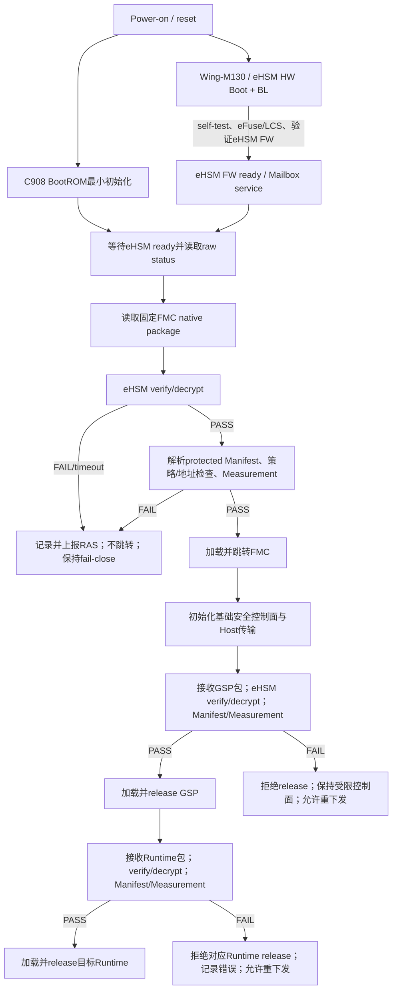

# 评审目的

> **历史评审说明（2026-08-21）**：本文中的128B NGU Manifest、`payload_offset=128`、独立`payload_size`和包内`entry_addr/version/Profile`已由SRC-0033/ADR-0030替代。当前实现依据是主详设第3/5～9章及`native-header-load-address-v1`；本文只保留首轮评审过程，不得直接生成Manifest实现任务。

这是顶层任务二`TASK-SEC-SOC-FW-001`的第一轮详细设计输入，聚焦Wing-M130/eHSM BL、C908 BootROM/FMC/GSP启动链和后续实现必须冻结的核心数据合同。

本轮目标不是开始编码，而是：

1. 把SRC-0017的系统原则和SRC-0016的软件流程转换成明确的stage职责、输入、输出和失败终态。
2. 建立Package、Manifest、eHSM verify、loader、Measurement、security RAM、error和release合同清单。
3. 区分已经批准的语义、可以提出的候选ABI和当前不能冻结的冲突字段。
4. 明确下一轮逐字段/逐API冻结工作的顺序。

# 基线复核结果

## SRC-0017系统/架构约束

- 第5～6页§7.1/7.1.1：Wing-M130/eHSM位于安全管理子系统，内部有独立Boot ROM、IRAM/SRAM/KMU RAM；外部C908通过Mailbox传递command/response，通过SOC_MEM交换输入输出数据。
- 第13～16页§8.1：系统启动顺序包含eHSM硬件Boot、eHSM Bootloader、eHSM FW、SoC Bootloader和SoC FW；C908只有收到eHSM ready后才进入安全镜像验证。
- eHSM Bootloader负责自身密码算法自检和eHSM FW校验；eHSM FW进入命令处理状态，为C908提供镜像验签/解密和安全服务。
- 镜像校验失败必须停止对应固件启动；Host或其他不可信master不能获得release权限。

## SRC-0016软件落地要求

- 第1～4页§1～2：产品链为BootROM等待eHSM→读取固定FMC包→eHSM verify/decrypt→Manifest策略→Measurement→加载/跳转FMC；FMC验证/解密并release GSP；GSP验证/解密并release Runtime。
- 第4～7页§2.2～2.5：BootROM失败不跳转，等待reset/OOB；FMC验证GSP失败时保持基础安全控制面并允许Host重下发；GSP验证Runtime失败时拒绝release对应微核。
- 第7～11页§3：FMC/GSP/Runtime使用eHSM native secure package，不再定义第二套native header；NGU protected Manifest和payload位于受保护Code Region，只有eHSM PASS后调用方才可解析Manifest。
- 第12～15页§4：GSP提供SPDM Responder；内部Measurement Table保存固件和SoC安全状态，SPDM response从受控table构造，不直接把内部结构原样返回Host。

# 产品启动链冻结基线

以上是当前产品目标；Vendor Demo顶层调用关系不进入该状态机。

# Stage职责和交付边界

| Stage | 主要职责 | 输入 | 成功输出 | 失败终态 | 当前冻结状态 |
|---|---|---|---|---|---|
| Wing-M130/eHSM BL | 硬件/算法自检、eFuse/LCS恢复、校验并启动eHSM FW | eHSM ROM/eFuse、eHSM FW镜像 | eHSM FW进入命令处理、ready/raw self-test可读 | 不提供ready；保留raw状态并上报；reset动作由RAS策略决定 | 业务逻辑原则上保持Vendor基线；版本/配置/接口待冻结 |
| C908 BootROM | 最小初始化、等待eHSM、读取FMC包、verify/decrypt、Manifest、Measurement、加载/跳转 | 固定NOR FMC包、eHSM服务、启动配置 | 可信FMC明文被加载到批准地址并跳转 | 不跳转；记录并上报RAS；保持fail-close；不自行reset | 流程语义已由SRC-0016和ADR-0006定义 |
| C908 FMC | 初始化基础环境/Host传输，接收GSP包，验证/解密/加载/release | Host staging GSP包、eHSM服务 | GSP被加载到canonical目标并release | 拒绝release；保留最小控制面；允许重下发 | 流程语义已定义；接口/状态机待冻结 |
| C908 GSP | Runtime验证/解密/加载/release，Measurement维护，SPDM Responder，后续安全控制 | Runtime包、eHSM、证书/Measurement/平台控制 | 目标Runtime可信运行，SPDM可读取受控状态 | 仅拒绝失败目标release，允许受控重下发 | 流程语义已定义；服务ABI待冻结 |

# Wing-M130/eHSM BL处理原则（已批准）

Wing-M130/eHSM BL不是本轮重新设计对象。其产品处理规则如下：

1. 以SRC-0018 Vendor BL交付为默认业务基线，不因C908软件开发复制或重写其内部功能。
2. 必须冻结交付版本/哈希、与eHSM FW/Host配套关系、构建配置、自检位图、eHSM FW验证profile、ready/error寄存器、Mailbox兼容和升级/回退方式。
3. 已批准采用Bootloader自检位图：bit18/`0x40000`=`TRNG`，bit19/`0x80000`保持unknown/reserved；Host旧定义错误。
4. 只有出现NGU800P配置、接口、版本配套、安全缺陷或Vendor正式变更时，才为Wing-M130/eHSM BL创建单独变更任务。
5. baremetal中的`bl_demo`测试代码不是Wing-M130 BL产品固件本身；前者用于接口验证，后者是eHSM内部启动固件。

# 核心合同登记表

| Contract ID | 合同 | Producer / Consumer | 来源 | 本轮状态 | 完成冻结需要的内容 |
|---|---|---|---|---|---|
| FW-C-001 | eHSM ready/self-test/status | eHSM BL/FW → BootROM/FMC/GSP | SRC-0017 §7/8、SRC-0018、ADR-0003 | partial | 寄存器/bit、稳定窗口、timeout、reset domain、raw error |
| FW-C-002 | Host command/transport | C908 stage ↔ eHSM | SRC-0017 §7.1.1、SRC-0018 | partial | command/request/response、channel、System Address、PMA/barrier、固定poll和单在途 |
| FW-C-003 | eHSM native package | 制作工具 → eHSM | SRC-0012/0016/0018、CE-SEC-009、ADR-0014/0017 | approved_with_follow_up | 固定1024字节Header、Vendor 0/1/2/3、双阶段Code_Size门禁和三套算法Profile已批准；最大尺寸及具体provisioning绑定待定 |
| FW-C-004 | NGU protected Manifest | 制作工具 → BootROM/FMC/GSP | SRC-0016、CE-SEC-009、ADR-0014/0019/0024 | approved_with_follow_up | 128字节固定ABI、`rollback_counter[16]`、Host可读`uint32_t version`、64位System Address已批准；无地址domain、expected digest、digest元数据或extension；三套Profile均须实现和测试 |
| FW-C-005 | verify/decrypt request/result | BootROM/FMC/GSP ↔ eHSM adapter | SRC-0014/0016/0018、CE-SEC-009 | review_ready | typed request/result、raw status、completion、Header/Manifest分层已形成；deadline/profile数值待定 |
| FW-C-006 | loader/load/entry | Manifest/verified buffer → 当前stage loader | SRC-0016、ADR-0004/0005/0024、CE-SEC-009 | review_ready | 64位baremetal System Address、无Local/System转换、range/overlap/W^X、源摘要/copy/目标读回摘要比较、actual-result和release分层已形成；最终Region offset等待OPEN-CONFLICT-006 |
| FW-C-007 | Measurement Table与rollback counter提交 | BootROM/FMC/GSP → GSP/SPDM | SRC-0016 §4.3、ADR-0004/0012/0019、CE-SEC-011、ADR-0022 | design_approved_platform_pending | Producer/counter/release门禁及可变table ABI/CRC/commit/reset清理已批准；最大实例容量、counter command与平台PMA/Firewall仍为实现DoR |
| FW-C-008 | unified security error | 各stage/eHSM → 日志/控制面 | SRC-0016 §2.2、现有error详设 | proposed | stage/domain/code/raw、severity、retryable、terminal action、脱敏 |
| FW-C-009 | target release | BootROM/FMC/GSP → 下一级/目标核 | SRC-0016 §1/2 | proposed | prerequisite、Firewall/clock/reset顺序、失败不可达、可重复性 |
| FW-C-010 | SPDM provider | GSP ↔ Measurement/Cert/eHSM sign | SRC-0016 §4 | proposed | Measurement转换、slot、nonce/transcript、sign API、并发和错误 |
| FW-C-011 | 固件制作工具合同 | KMS/build → native package | SRC-0016 §3.5 | proposed | 输入清单、密钥句柄、header/Manifest生成、签名/加密、版本manifest、可重现构建 |
| FW-C-012 | 2 MiB安全RAM与Firewall合同 | BootROM/FMC/GSP/PMP/RMP/MMP/eHSM/Host/RAS | ADR-0006～0008、CE-SEC-004/005/010、主详设第5章 | integrated_with_open_bindings | 双地址、常驻/启动复用Region、layout源、owner、W^X、Firewall/PMA分工、cache/clear已合入；P1容量为样例，最终地址/linker等待OPEN-CONFLICT-006剩余项 |

# “FW-C-001～012核心合同清单”的实际含义

这里的“合同”是模块之间必须写清楚的接口边界，不是要求负责人一次批准12套结构体。FW-C-012是根据本轮新增的安全RAM输入补入；将其列入清单，只表示正式详设不能遗漏该边界。字段、API、分区大小和状态机仍在B0-R2～R5逐项评审。

| ID | 需要冻结的具体问题 | 哪些内容需要负责人裁决 |
|---|---|---|
| FW-C-001 | eHSM何时算ready，自检/raw status如何读取，等待多久，失败后如何上报RAS | ready门禁、timeout和失败终态；寄存器细节由Vendor/RTL证据给出；reset由RAS决定 |
| FW-C-002 | Mailbox command/response、System Address buffer、PMA/barrier、固定poll、单在途和超时 | 协议机制follow Vendor、单在途/静态slot/零retry已冻结；仍需绑定service channel、deadline和direct MMIO/status |
| FW-C-003 | Vendor native package header、Code Region、签名/加密profile和最大尺寸 | 产品启用的算法/profile和包限制；原生格式follow Vendor |
| FW-C-004 | NGU Manifest字段、offset、版本兼容、地址域和policy | 哪些策略字段属于产品、兼容规则和安全默认值 |
| FW-C-005 | verify/decrypt请求、真实PASS条件、raw error、输出buffer和digest | 调用方/owner、允许重试和失败语义；command格式follow Vendor |
| FW-C-006 | loader的地址检查、copy/DMA、cache、jump/release顺序 | 各stage允许地址范围、失败终态和release前置条件 |
| FW-C-007 | Measurement布局、owner、commit、完整性、reset和SPDM映射 | ADR-0022已批准逻辑ABI；ADR-0028固定16 KiB物理Region和126项硬上限；产品实际实例数和SPDM wire profile继续开放 |
| FW-C-008 | 统一错误的stage/domain/raw code、严重度、日志、RAS上报和终态 | 哪些错误允许重试/受限服务/OOB；security不执行reset，RAS动作映射由RAS Owner提供 |
| FW-C-009 | 目标核/固件release前的Firewall、clock、reset和entry检查 | release条件和失败后系统行为 |
| FW-C-010 | SPDM Measurement、证书slot、签名provider、并发和协议边界 | SPDM对外profile、证书/算法策略及是否启用相应能力 |
| FW-C-011 | 制包输入、KMS/HSM句柄、签名/加密、版本清单和可重现构建 | 发布流程Owner、密钥边界和批准的输出profile |
| FW-C-012 | 2 MiB安全RAM的固定Region、System Address、owner、权限转换、原地加载、清零和Firewall | ADR-0028已冻结GSP静态880 KiB、FMC复用128 KiB、Measurement 16 KiB、PMP/RMP各256 KiB和Host ingress 512 KiB；MMP驻留DDR，独立plaintext取消；仍需冻结one-shot arena容量、`NON_CACHEABLE/HARDWARE_COHERENT`唯一属性、Firewall、MMP DDR与release footprint证据 |

因此，负责人不需要现在对“清单”本身给出技术批准；只需指出是否有不属于本工程或明显缺失的合同。Codex负责先依据方案、Vendor文档/代码形成逐项候选，只有出现安全策略、冲突、Owner边界或不可逆行为时再提交明确选项。

# FW-C-003～006：Package、Manifest、Verify与Loader当前候选

INV/CE-SEC-009已经读取Vendor Host/BL关键函数体，并把本节原来的方向性字段表替换为两份可独立评审的接口合同：

- [`安全固件包与NGU Manifest v1合同`](../04-interfaces/secure-firmware-package.md)：Vendor固定1024字节Header、SoC stage固定Vendor type 1、128字节Manifest布局、`rollback_counter[16]`、Host可读`uint32_t version`、64位baremetal System Address、无expected digest/extension，以及loader源/目标读回双摘要和发布工具门禁。
- [`镜像验签解密、Loader与Release接口合同`](../04-interfaces/image-verify-loader.md)：request/result、completion、raw Vendor status、preflight/PASS后复验、Manifest/policy/digest、loader、Measurement和stage release状态机。

当前明确结论：

1. Vendor公共`ehsm_verify_image()`只有32位raw返回码；SoC输出默认包含1024字节Header和解密Code Region。项目必须在PASS后构造typed result。
2. Vendor PASS只完成密码层；Header/Manifest/policy/payload digest/loader/Measurement/counter/release必须分层完成。
3. eHSM Vendor FW保持Vendor type 0专用包，由GSP使用`boot=true/image_out=NULL`加载；FMC/GSP/PMP/RMP/MMP使用SoC package并在protected Manifest区分。
4. 两个公司仓当前64/72字节Manifest、32位counter、stub和零签名制包器均不是目标ABI。
5. OPEN-CONFLICT-008/OPEN-DESIGN-008已按ADR-0014关闭；SRC-0016文档修正进入下一受控版本/amendment，最终地址/profile/counter/Measurement实现仍由对应开放项管理。

# FW-C-007：Measurement Table冻结边界

已批准：

- Measurement Table是跨stage持久度量的正式载体，不新增Handoff ABI。
- Die1始终形成`NGU_FW_TYPE_DIE1_FW`、`die_id=1`的独立实例记录。
- GSP/SPDM从内部table构造对外Measurement record，不能把内存结构原样泄露给Host。
- 负责人已裁决：Measurement `load_addr`和`entry_addr`均保留并改为`uint64_t`，分别携带显式address domain；二者只作loader成功执行后的审计快照，Manifest/loader保持执行地址Owner。
- 负责人已裁决：产品统一使用Vendor 16字节逻辑格式`rollback_counter[16]`，禁止沿用32位最终ABI或截断；Manifest中的`uint32_t version`只供Host工具读取，不参与防回滚。
- BootROM在跳转FMC前提交当前启动Table中唯一、BootROM生产、verify PASS且release authorized的FMC条目；其中16字节`rollback_counter`是FMC自身值的唯一跨stage输入。
- FMC只从该已提交FMC条目取得`expected_candidate`，不重新验证自身package，也不新增Handoff；初始化时回传BL并与RAM candidate exact-match后完成stored compare、必要单向写和权威readback。
- FMC是global counter唯一提交发起Owner；proof成立后才接收以`check_version=0`验证且counter等于已提交值的GSP，再提交GSP Measurement条目，最后release GSP。
- GSP接管时只接受当前启动Table中唯一、FMC生产、verify PASS、release authorized且已提交的GSP条目；不得以空BSS Measurement store代替上游证据。

CE-SEC-011补充的Vendor实现事实：

- Vendor 16字节Version Counter采用从首octet开始推进的thermometer/unary位模式；项目仍按opaque 16-octet值传递和比较，不自行转换成普通整数。
- Vendor BL验证SoC非naked镜像成功后只在eHSM DRAM中暂存candidate和valid标记，`check_version=OFF`也不关闭该暂存；这不是持久化commit。
- Vendor FW的`secboot_entry()`启动后才消费candidate、写OTP并执行写后回读校验。
- 当前匹配Host声明的64位通用Counter API在匹配FW中没有命令注册、dispatch和service/driver实现，且与16字节Version Counter不是同一合同。

当前不能直接冻结SRC-0016第14～15页示例结构体，原因如下：

1. `load_addr/entry_addr`宽度和职责已关闭：最终均为64位baremetal System Address且不带domain；Manifest提出固定System Address，loader按stage profile验证并返回实际结果，Measurement只保存loader结果快照。C908、Manifest、loader、linker和eHSM共享descriptor不建立Local/System映射，见ADR-0005/0022/0024。
2. counter宽度、Vendor代码事实、BootROM candidate暂存、FMC初始化exact-match commit/readback、GSP同值门禁及Measurement→release顺序已明确。ADR-0019要求eHSM BL新增FMC专用16字节API；准确command/packing/LCS/status/readback/交付版本、初值/寿命属于实现DoR。
3. 未定义table最终C layout、最大entry数、hash上限、完整性算法、commit原子宽度、reset生命周期、并发和SPDM快照一致性。

OPEN-CONFLICT-004/005/009已关闭。ADR-0019统一`rollback_counter[16]`并要求FMC主动调用eHSM BL新增专用API；Manifest另有Host可读`uint32_t version`。ADR-0022已批准Measurement逻辑C layout/integrity/commit/reset全清零。

# FW-C-008：统一错误最小语义

| 字段族 | 必须表达的内容 |
|---|---|
| 来源 | stage、domain、operation/command |
| 规范错误 | stable project error code、severity、retryable/terminal |
| 原始证据 | raw transport/eHSM/status/self-test bitmap；不得丢失 |
| 受控上下文 | image type、地址域、范围/长度、counter/slot；不得记录密钥或明文payload |
| 终态 | security侧halt/wait/restricted-service/refuse-release；reset/watchdog/隔离动作由RAS策略决定 |
| 审计 | boot instance/sequence、软件和eHSM版本、时间/轮询次数（若可用） |

# 第一轮发现的阻断项

| ID | 问题 | 阻断范围 | 可继续范围 | 推荐方向 |
|---|---|---|---|---|
| OPEN-CONFLICT-004 | 已关闭：`load_addr/entry_addr`均为64位`SOC_PA`且不带domain，只作loader结果快照 | 不再阻断地址字段语义 | ADR-0022已冻结offset/layout；物理容量/PMA另行管理 | 按ADR-0005/0022落实，不作为load/jump输入 |
| OPEN-CONFLICT-005 | 已由ADR-0019关闭；Vendor手册/Header/代码均为16字节，旧差异是32位/4字节而非32字节 | 不再阻断宽度、命名和Owner | `rollback_counter[16]` ABI、FMC Measurement输入及stage逻辑门禁 | 实现前补齐Vendor物理资源、未烧写值、寿命和恢复合同 |
| ADR-0019 API实施 | eHSM BL新增FMC专用16字节staged-candidate commit API | command/packing/LCS/交付版本、candidate生命周期及EMU证明 | Counter状态机、Measurement和FMC→GSP方案已冻结 | 实现前绑定，EMU验证candidate缺失/失效/不一致、低/同/高和unknown |
| OPEN-DESIGN-007 | resolved：ADR-0022批准逻辑ABI；ADR-0028固定16 KiB物理Region和126项硬上限 | 产品实际实例数转OPEN-DESIGN-021；PMA/Firewall和SPDM wire另行管理 | BootROM/FMC/GSP逻辑API可继续 | 产品实现继续受OPEN-DESIGN-021和OPEN-CONFLICT-006门禁 |
| OPEN-DESIGN-001 | CE-SEC-010已确认16路IRQ准确编码；direct aperture、Host status/error、2 MiB PMA/coherence和RAS-report平台参数仍未知 | 真实NGU800P port、shared context和RAS上报 | 首版poll、Host逻辑API和错误模型 | RTL补齐direct/status；平台Owner补齐PMA/coherence及RAS通道；reset执行不属于security port |
| OPEN-DESIGN-003 | 已由ADR-0020关闭：各stage fail-close、Runtime局部隔离、timeout quarantine和security只请求RAS动作已冻结 | 不再阻断原则 | 精确event/action ID、通道和平台动作表作为集成输入 | 按平台/EMU Profile生成数值 |
| OPEN-CONFLICT-006 | System Address和2 MiB精确Region已由ADR-0028裁决；现有BootROM/FMC旧local linker属于待替换遗留 | PMA/Firewall、MMP DDR、release footprint、最终linker和精确Expected | 固定Region范围检查、受控原地加载、GSP替代OMP、eHSM full aperture及stage-local arena | 平台/Runtime Owner补齐release map、高水位、PMA/Firewall和MMP DDR后生成量产linker/Expected |
| OPEN-CONFLICT-008 | 已由ADR-0014关闭：保留Vendor 0/1/2/3 wire/代码，release工具和adapter双阶段精确校验`Code_Size` | 不再阻断方向 | 发布制包器和真实verify wrapper按已批准合同实现 | 实现/测试阶段验证长度负向corpus |
| OPEN-DESIGN-008 | 已由ADR-0014/0019/0024关闭：Manifest v1 exact ABI和中心registry已批准 | 不再阻断布局 | 128字节固定布局、`rollback_counter[16]`、Host可读`uint32_t version`、64位System Address、无expected digest/digest元数据/extension | 生成器/跨仓ABI按v1实现 |

# 本轮需要负责人确认的设计方向

以下不是编码批准，只决定下一轮详细设计如何收敛：

已确认：本工程使用“两项顶层任务”视图，其他DD/INV/DEV/TST均为子工作。

1. 已批准：Wing-M130/eHSM BL保持Vendor业务基线，只处理确认的集成缺口。
2. FW-C-001～012作为设计检查表，不要求一次性批准具体ABI；FW-C-012是本轮根据安全RAM输入新增，负责人只需指出缺项或不适用项。
3. 已关闭：OPEN-CONFLICT-004采用`load_addr/entry_addr=uint64_t+domain`，且仅作loader结果快照。
4. OPEN-CONFLICT-005/009已关闭；FMC主动调用eHSM BL新增专用16字节API，不重裁决FW加载Owner。
5. 已批准ADR-0006～0008及ADR-0028：安全RAM唯一产品System Address基址`0x1010_0500_0000`、大小2 MiB并替代旧080x；固定布局为GSP静态880 KiB、FMC复用128 KiB、Measurement 16 KiB、PMP/RMP各256 KiB和Host ingress 512 KiB，MMP驻留DDR，独立plaintext取消并采用受控原地加载。eHSM可访问整个2 MiB；独立Mailbox Region继续采用stage-local固定`.ehsm_context_arena`，首版禁止异步/流式且timeout未闭环context不得放普通函数栈。

# 下一轮工作

当前继续B0-R2平台参数和B0-R3状态机切片；主详设第3～6章主体已经合入：

1. CE-SEC-009和ADR-0014已完成Vendor verify调查及包/Manifest裁决，规范性内容已完整合入主详设第3章；CE-SEC-006～010及ADR-0010/0011/0015形成的eHSM BL、Host Adapter、Mailbox、Port、cache/deadline/quarantine和GSP长期唯一Owner已完整合入第4章。
2. 中心image type和三套算法Profile registry已冻结；ADR-0028已冻结SRAM stage最大package/target上限；继续补设备/镜像/key/board/LCS provisioning matrix、MMP DDR和release footprint。
3. ADR-0022已冻结[`measurement-table.md`](../04-interfaces/measurement-table.md)逻辑C layout、CRC-32C、32位commit、reset全清零及producer/consumer顺序；ADR-0028固定16 KiB/126项硬上限，下一步收集OPEN-DESIGN-021产品实际实例数，并由OPEN-DESIGN-015收敛SPDM wire映射。
4. 分别形成BootROM、FMC、GSP函数级状态机、API表和目标文件/符号映射。
5. CE-SEC-010已冻结首版不依赖IRQ映射及当前地址/linker事实；下一步取得direct/status寄存器、各stage reset/release PC aperture、2 MiB物理PMA/coherence、各release link map、stack/heap高水位、MMP DDR及Firewall窗口/粒度/master权限；固定布局见[安全RAM布局](../03-architecture/security-ram-layout.md)，OPEN-CONFLICT-006剩余问题关闭前不发布量产linker。
6. 按ADR-0019落实eHSM BL专用API实现DoR：在Counter适配实现/EMU前补齐准确command/packing、BL交付版本、产品LCS权限、status/readback证明和寿命；不重开OPEN-CONFLICT-009，也不阻断后续详设章节。
7. 已按整本顺序把第5章2 MiB安全RAM、地址域、Firewall与清零合入主详设；生命周期、权限、复用和清零不变量已冻结，最终offset/容量/linker继续等待OPEN-CONFLICT-006和OPEN-DESIGN-010。
8. 单一主详设第3～16章及附录A～C已全部形成。ADR-0018已关闭Strap/LCS模式绑定；剩余裁决集中在主详设附录B和`open-questions.yaml`，本首轮评审包不再作为最新完整设计入口。

# Change history

- 2026-07-27：负责人批准ADR-0022最终逻辑ABI；删除generation和固定slot，改为实际count/length紧凑列表、唯一State及reset整区清零。OPEN-DESIGN-007关闭，物理容量转OPEN-DESIGN-021。
- 2026-07-24：主详设全章收敛完成；ADR-0018关闭OPEN-CONFLICT-010/OPEN-DESIGN-012，本文件降为首轮历史评审包。
- 2026-07-24：SRC-0023 `secureboot.001～007`已完整合入主详设第6章；新增模式判定、OPEN-CONFLICT-010/OPEN-DESIGN-012、真实verify/Manifest/epoch/load/Measurement/release和失败闭锁，下一章为FMC。
- 2026-07-24：FW-C-012的2 MiB双地址、P1生命周期、layout/owner、Host ingress/plaintext/执行区、Firewall/PMP/PMA、cache和清零规范性内容完整合入主详设第5章；状态转为`integrated_with_open_bindings`，下一章为BootROM。
- 2026-07-24：主详设第4章完成规范性合入；下一正文切片转为第5章安全RAM、地址域、Firewall与清零，平台数值缺口保持原位开放。
- 2026-07-24：接受ADR-0017并关闭OPEN-DESIGN-004；FW-C-003的三套产品算法Profile及公共ID已冻结，具体设备/镜像/key/board/LCS绑定转入OPEN-DESIGN-011。
- 2026-07-24：将FW-C-003/004/011及相关公共ABI、stage准入和negative corpus规范性内容完整合入主详设第3章；专题继续保留评审证据，下一章转入eHSM BL/Host Adapter/Mailbox/平台Port整合。
- 2026-07-24：完成CE-SEC-011；冻结Vendor 16字节counter编码、BL candidate暂存、FW启动OTP提交/readback事实，登记OPEN-CONFLICT-009，FW-C-007实际counter提交/release进入冲突阻断。
- 2026-07-27：形成ADR-0022/OpenSpec `measurement-table-abi-v1`候选；FW-C-007进入`proposal_ready`，等待负责人批准内部ABI，未授权编码。
- 2026-07-24：负责人决定Counter细节延期；FW-C-007按16字节默认接口继续，具体Vendor绑定改为实现/EMU前门禁。
- 2026-07-24：接受ADR-0016；确认GSP替代旧OMP/Q&P产品固件，关闭FW-C-012和OPEN-CONFLICT-006中的OMP角色子项。
- 2026-07-24：完成CE-SEC-010；确认eHSM IRQ1～16编码、2 MiB双地址和当前混合linker视图，明确direct/status、PMA/coherence、Firewall及新D0 PC视图仍需平台输入。
- 2026-07-23：完成CE-SEC-009；FW-C-003～006进入`partial/review_ready`，新增两份package/Manifest和verify/loader/release候选合同，登记OPEN-CONFLICT-008与OPEN-DESIGN-008。
- 2026-07-23：FW-C-007由`blocked_by_conflict`改为`partial`；回填BootROM committed FMC epoch、FMC/GSP一致性、counter update→GSP commit→release及GSP接管门禁，剩余ABI问题转OPEN-DESIGN-007。
- 2026-07-23：按ADR-0008将eHSM改为整个2 MiB full aperture；负责人批准Vendor context评估结论，取消独立Mailbox Region，改用stage-local固定arena，并禁止普通函数栈承载通用异步/流式/timeout未闭环context。
- 2026-07-22：接受ADR-0007；FW-C-012改为生命周期复用合同，旧080x被替代，PMP/RMP/MMP常驻，BootROM/FMC尾部回收，GSP/Measurement/Mailbox连续且SPDM并入GSP；P1容量未冻结。
- 2026-07-22：进入B0-R2；新增FW-C-012安全RAM合同，冻结Mailbox follow Vendor和security只上报/RAS决定reset边界；登记OPEN-CONFLICT-006，P0分区大小和linker仍未冻结。
- 2026-07-22：复核SRC-0017第5～6、13～16页及SRC-0016第1～15页，形成Wing-M130/eHSM BL和BootROM/FMC/GSP启动链、11项核心合同、Manifest/verify/loader候选语义及两个新ABI冲突。未修改代码仓。
- 2026-07-22：负责人部分裁决OPEN-CONFLICT-004，Measurement `load_addr`保留并改为64位；当时显式domain继续适用，`entry_addr`和字段职责待补充；最终domain后由ADR-0022删除。
- 2026-07-22：负责人确认counter宽度以Vendor为准采用16字节，并批准Wing-M130/eHSM BL保持Vendor业务基线、仅处理确认的集成缺口；核心合同清单改为逐项设计检查表，不要求一次性批准ABI。
- 2026-07-22：负责人确认Measurement `entry_addr`同样保留并改为64位；当时地址字段均为64位+domain的loader结果快照，OPEN-CONFLICT-004关闭；最终Measurement domain后由ADR-0022删除，两字段统一为`SOC_PA`。
