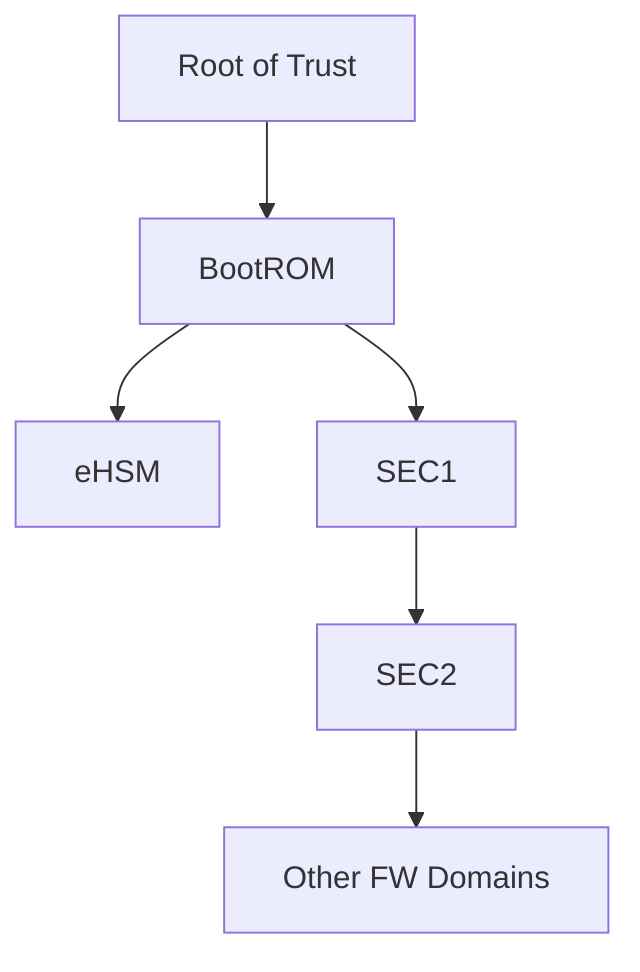
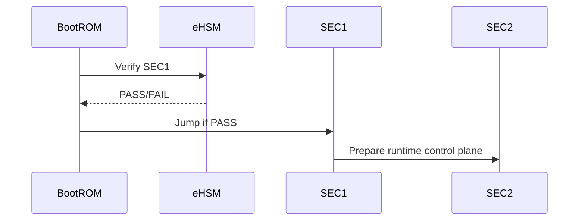

# NGU800 设计基线

> 目的：把约束表收敛成一页可执行的“设计基础口径”。  
> 详细设计必须完全遵守本文件。

## 1. 基线摘要

| 主题 | 当前基线结论 | 来源 / 依据 | 状态 |
|---|---|---|---|
| Root of Trust |  |  |  |
| First Mutable Stage |  |  |  |
| First Cryptographic Verifier |  |  |  |
| BootROM Role |  |  |  |
| SEC1 Role |  |  |  |
| SEC2 Role |  |  |  |
| eHSM Role |  |  |  |
| Host Trust Model |  |  |  |
| Board Trust Model |  |  |  |
| Dual-Algorithm Strategy |  |  |  |

## 2. 角色与边界口径

### 2.1 BootROM
- 必须承担：
- 不得承担：

### 2.2 SEC1
- 必须承担：
- 不得承担：

### 2.3 SEC2
- 必须承担：
- 不得承担：

### 2.4 eHSM
- 必须承担：
- 不得承担：

### 2.5 Host
- 允许：
- 不允许：

### 2.6 BMC / OOB / Sideband
- 当前信任级别：
- 当前允许动作：
- 当前禁止动作：

## 3. 冻结敏感项

| Item | Why Sensitive | Current Status | Needed Before Freeze |
|---|---|---|---|

## 4. 基线架构图

## 5. 基线时序图

## 6. 当前基线是否可进入详细设计

- 结论：
- 限制条件：
