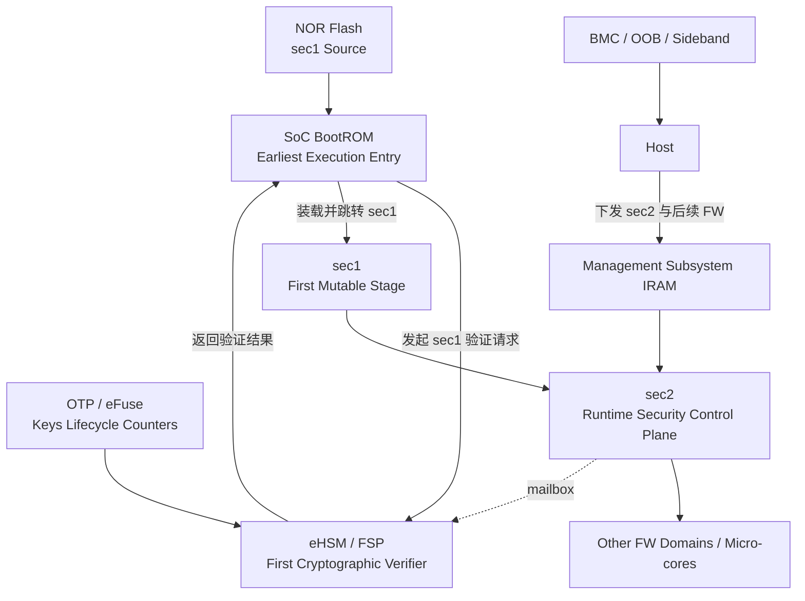
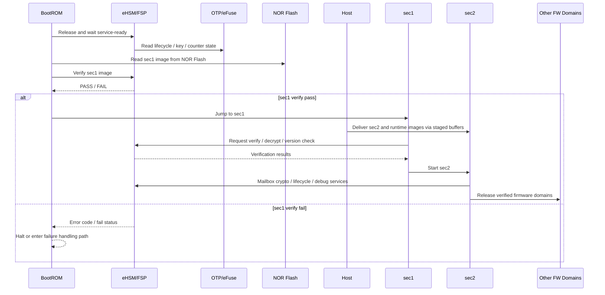

# NGU800 设计基线

> 目的：把约束表收敛成一页可执行的“设计基础口径”。  
> 详细设计必须完全遵守本文件。  
> 输入依据：`security_workflow/01_constraints.md`

## 1. 基线摘要

| 主题 | 当前基线结论 | 来源 / 依据 | 状态 |
|---|---|---|---|
| Root of Trust | 采用分层口径：SoC BootROM 是系统最早执行入口；eHSM 内部核/FSP 联合 OTP/eFuse 密钥材料构成首个密码学信任根 | `C-BOOT-001`, `C-BOOT-002`, `C-TRUST-003`, `CF-003` | `[CONFIRMED]` |
| First Mutable Stage | `sec1` 是系统侧第一级可变安全管理固件，镜像来自 NOR Flash，由 BootROM/eHSM 路径验证并装载，负责最小 bring-up 和后续固件下载准备 | `C-BOOT-004`, `CF-001` | `[CONFIRMED]` |
| First Cryptographic Verifier | `eHSM/FSP` 是首个执行镜像验签、版本检查、可选解密和吊销判断的密码学验证主体 | `C-BOOT-002`, `C-KEY-001`, `C-UPDATE-001` | `[CONFIRMED]` |
| BootROM Role | 只负责启动编排、模式分流、拉起 eHSM、请求验证和按结果跳转；不直接承担镜像密码学校验 | `C-BOOT-001`, `C-BOOT-002` | `[CONFIRMED]` |
| SEC1 Role | `sec1` 负责最小平台初始化、PCIe 建链、Host 通道和后续固件接收准备；镜像来源为 NOR Flash，不承担完整运行期安全控制平面 | `C-BOOT-004`, `C-HOST-001` | `[CONFIRMED]` |
| SEC2 Role | `sec2` 负责运行期安全控制面，包括后续固件校验编排、measurement、升级控制、调试鉴权和生命周期策略执行 | `C-BOOT-004`, `C-UPDATE-001`, `C-DEBUG-001` | `[CONFIRMED]` |
| eHSM Role | eHSM 提供安全服务后端，负责安全启动、密钥/OTP/eFuse、版本计数器、challenge-response、调试鉴权和密码学服务 | `C-INTF-001`, `C-KEY-001`, `C-UPDATE-001`, `C-TRUST-003` | `[CONFIRMED]` |
| eHSM Reuse Rule | eHSM 已明确的固件字段、OTP/eFuse 排布、key slot 语义、计数器和生产阶段操作优先直接沿用；项目实现仅在 eHSM 未覆盖处做兼容性扩展 | `C-EHSM-001`, `C-KEY-001`, `C-UPDATE-002` | `[CONFIRMED]` |
| Host Trust Model | Host 仅拥有 `sec2` 及后续固件的投递和管理辅助能力，不拥有最终执行放行权；`sec1` 来源于 NOR Flash，不由 Host 下发 | `C-HOST-001`, `C-BOOT-005`, `CF-002` | `[CONFIRMED]` |
| Board Trust Model | BMC/OOB/sideband 当前仅视为板级管理参与者，不纳入芯片内 Root of Trust；可作为更新/控制通道，但不能替代芯片内信任裁决 | `C-HOST-001` 及 `01_constraints.md` 缺失项处理 | `[ASSUMED]` |
| Dual-Algorithm Strategy | 方案必须同时支持国密和国际标准两套算法；先定义算法无关框架，再给出国密映射和国际映射 | `C-ALG-001`, `SRC-002`, `CHG-002` | `[CONFIRMED]` |

## 2. 角色与边界口径

### 2.1 BootROM
- 必须承担：
  - 上电最小初始化和启动模式分流
  - 拉起 eHSM 并等待其进入可服务状态
  - 从 NOR Flash 定位 `sec1` 镜像并向 eHSM 发起验证请求
  - 根据 eHSM 返回结果决定是否装载并跳转到 `sec1`
  - 记录早期启动状态和失败码
- 不得承担：
  - `sec1` 的签名验签、版本检查、吊销检查和镜像解密
  - 运行期密码学服务
  - 后续微核固件的长期安全策略管理

### 2.2 SEC1
- 必须承担：
  - 作为第一级可变安全管理固件执行最小平台 bring-up
  - 作为来自 NOR Flash 的首级可变安全管理固件被 BootROM/eHSM 路径放行后执行
  - 初始化 PCIe 和 Host 基础通道
  - 建立后续固件接收、缓存、通知和转交流程
  - 为 `sec2` 和后续微核固件下载准备运行环境
- 不得承担：
  - 完整运行期安全控制平面
  - 最终调试策略裁决
  - 独立替代 eHSM 做根级信任判断

### 2.3 SEC2
- 必须承担：
  - 运行期安全控制平面初始化
  - 通过 Mailbox 调用 eHSM 完成后续固件验签、可选解密和版本检查
  - 维护 measurement、升级状态和恢复路径
  - 承接调试鉴权、生命周期策略执行和运行期安全策略管理
- 不得承担：
  - 绕过 eHSM 直接访问根密钥或自建独立信任根
  - 允许未经校验的后续微核直接执行

### 2.4 eHSM
- 必须承担：
  - 作为首个密码学验证主体完成 `sec1` 验签、版本检查和可选解密
  - 提供签名验签、HASH、对称/AEAD、随机数、密钥管理和计数器服务
  - 提供 OTP/eFuse、生命周期、challenge-response 和调试鉴权能力
  - 通过 Mailbox 作为安全服务后端与 SoC 交互
- 不得承担：
  - 让任意 Core/Master 直接访问其私有安全资源
  - 把 Host 或板级实体提升为等价密码学信任根

### 2.5 Host
- 允许：
  - 通过 PCIe 等通道投递 `sec2` 和其他后续固件
  - 把其他后续固件写入管理子系统 IRAM
  - 承担管理、升级编排和板级协同动作
- 不允许：
  - 负责 `sec1` 的供应或加载路径
  - 绕过 `sec1` / `sec2` / eHSM 直接放行固件执行
  - 直接裁决安全启动结果、版本回滚和调试授权结果

### 2.6 BMC / OOB / Sideband
- 当前信任级别：
  - 属于板级高权限管理参与者，但不属于芯片内 Root of Trust
  - 当前仅可按业内常规方式补足板级边界，未知部分不写死
- 当前允许动作：
  - 参与板级上电、版本管理、更新协同和日志/状态收集
  - 作为 sideband 管理路径承载控制和升级辅助
- 当前禁止动作：
  - 直接替代 eHSM/SEC 裁决镜像可信性
  - 通过 SMBus 或其他 sideband 通道绕过 SoC 内安全控制链直接放行执行

## 3. 双算法策略

### 3.1 通用框架
- 安全启动、升级、调试鉴权、证书链和密钥层级先定义算法无关流程。
- 镜像头、证书、challenge、measurement 和 KDF 标签中，算法相关字段显式参数化。
- OTP/eFuse 的 key slot、verify key、encrypt key、upgrade key 和计数器框架先按“用途”分层，不按单一算法写死。
- 若 eHSM 文档已给出明确字段、排布或 on-wire 格式，详细设计应优先复用 eHSM 原定义，不单独发明平行字段体系。

### 3.2 国密映射
- 非对称：`SM2`
- 摘要：`SM3`
- 对称与加密保护：`SM4`
- 适用章节：安全启动验签、调试 challenge-response、证书链、升级封装、KDF/认证相关字段

### 3.3 国际标准映射
- 非对称：`ECC/ECDSA` 和/或 `RSA`
- 摘要：`SHA-256` / `SHA-384`
- 对称与加密保护：`AES`
- 适用章节：与国密栈并行，采用相同框架和不同算法映射字段

### 3.4 基线要求
- 后续详细设计必须同时给出国密和国际算法两套映射，不得只实现单栈文档口径。
- 当某一章节暂缺项目级算法选择时，先保留双栈并行设计，不提前裁剪。

## 4. 冻结敏感项

| Item | Why Sensitive | Current Status | Needed Before Freeze |
|---|---|---|---|
| Root of Trust 分层表述 | 直接影响启动责任划分和术语一致性 | BootROM earliest entry、eHSM first cryptographic root 已冻结 | 在详设各章节保持同一术语，不再混用 FSP/sec1/sec2 |
| `sec1` / `sec2` 边界 | 直接影响启动时序、镜像布局和模块职责 | 已冻结为两级固件模型 | 需要在详设中补齐地址、镜像头和异常处理细节 |
| Host 固件落点 | 影响内存布局、firewall、IRAM 和升级路径 | 已冻结：Host 仅下发 `sec2` 及后续固件到管理子系统 IRAM；`sec1` 来自 NOR Flash | 需要补齐 IRAM region、权限位和具体缓冲协议 |
| OTP/eFuse 框架 | 影响生命周期、anti-rollback、调试和量产密钥 | 已冻结为 eHSM 基线、单控制器方案 | 需要补齐 bit offset、字段 owner 和扩展策略 |
| eHSM 已定义技术细节复用规则 | 影响镜像头字段、OTP/eFuse 排布、升级封装和制造操作 | 已冻结为“eHSM 明确处优先沿用” | 需在详设中把“逻辑映射”和“eHSM 原生字段”明确区分 |
| 双算法栈 | 影响镜像、证书、调试和 KDF 接口格式 | 已冻结为双栈并行 | 需要补齐算法字段、key slot 和证书格式细节 |
| 板级信任边界 | 影响 BMC/OOB/SMBus 风险和升级路径 | 仅形成通用基线，非完全冻结 | 需要真实板级资料才能完成板级 freeze |
| Host 外部安全协议 | 影响 SPDM/PLDM/DOE 和 attestation 报文 | 当前未冻结 | 需要 Host 需求文档补齐 |
| 制造/RMA 流程 | 影响 provisioning、debug、证书 owner 和返修审批 | 当前仅对齐 eHSM 推荐方向 | 需要制造和售后流程输入补齐 |

## 5. 基线架构图

## 6. 基线时序图

## 7. 当前基线是否可进入详细设计

- 结论：
  - 可以进入详细设计。
  - 当前基线已经把 Root of Trust、首级可变阶段、首个密码学验证者、`sec1/sec2` 边界、Host 信任模型和双算法策略收敛成统一口径。
- 限制条件：
  - Host 外部协议字段、板级真实边界、制造/RMA owner、eFuse 细化位分配仍未完全冻结。
  - 因此 `03_detailed_design.md` 可以继续写，但上述章节必须保留必要的 `[TBD]`，不能伪装成 fully freeze-ready。
