# NGU800P 安全详细设计说明书

## 1. 文档概述
### 1.1 文档目的
本文档用于在 `security_workflow/01_constraints.md` 和 `security_workflow/02_baseline.md` 已收敛的前提下，形成 NGU800P 可执行、可评审、可继续冻结的安全详细设计说明书。本文档重点覆盖：
- 片上 Root of Trust 与启动链
- `sec1` / `sec2` / eHSM / Host / Board 的职责边界
- 双算法栈下的镜像、密钥、证书、度量、调试和生命周期设计
- 可落到实现级的接口、结构、位图、表格和流程

### 1.2 术语描述列表

| 术语 | 全称/中文 | 本文口径 |
|---|---|---|
| BootROM | 启动 ROM | SoC 上电后最早执行的不可变代码，仅负责启动编排和验证请求发起 |
| eHSM | Embedded Hardware Security Module | 片上安全服务后端，提供安全启动、密钥、OTP/eFuse、计数器、调试和生命周期能力 |
| FSP | eHSM 内部核 | 本文中 FSP 明确指 eHSM 内部执行核，不与 `sec1` / `sec2` 混用 |
| `sec1` | First Mutable Stage | 系统侧第一级可变安全管理固件，镜像来自 NOR Flash |
| `sec2` | Runtime Security Control Plane | 运行期安全控制固件，由 `sec1` 完成下载准备后启动 |
| NOR Flash | SPI NOR Flash | `sec1` 镜像的当前主来源 |
| OTP/eFuse | 一次性可编程存储 / 熔丝 | 保存 UID、生命周期、控制字段、验证/加密/升级密钥和计数器基线 |
| Host | 主机侧管理者 | 负责下发 `sec2` 与后续固件，但不拥有执行放行权 |
| BMC / OOB | 板级管理控制器 / 带外管理控制器 | 板级高权限参与者，但不属于片内 Root of Trust |
| Mailbox | 安全服务命令通道 | SoC 侧访问 eHSM 的统一服务边界 |
| Measurement | 度量值 | 对固件和策略对象的摘要记录，用于证明和审计 |
| Attestation | 远程度量证明 | 由 `sec2` 编排、eHSM 提供签名能力的设备证明流程 |

### 1.3 适用范围
本文档适用于以下对象：
- SoC BootROM
- eHSM 内部核/FSP、Bootloader、运行期安全服务
- `sec1`
- `sec2`
- 管理子系统中的其他微核固件
- Host 固件下载与管理通道
- BMC / OOB / Sideband 板级协同路径

### 1.4 输入依据
本文件仅以以下收敛输入为主，不回退为“重新从原始材料自由发挥”：
- `security_workflow/01_constraints.md`
- `security_workflow/02_baseline.md`
- `security_inputs/inputs_manifest.md`

补充来源标记规则：
- `SRC-001`：当前安全方案基线
- `SRC-002`：eHSM 目录级资料
- `SRC-003`：启动方案
- `SRC-004`：安全子系统硬件方案

### 1.5 设计标记口径
- `[CONFIRMED]`：已由约束和基线收敛，可作为当前设计结论
- `[ASSUMED]`：现阶段缺少更强输入，但为了让设计继续推进而采用的工程假设
- `[TBD]`：当前必须保留的未冻结项

### 1.6 文档质量说明
- 本文档已经满足进入实现讨论和跨团队接口讨论的要求。
- Host 外部协议字段、板级真实边界、制造/RMA owner、eFuse 精细位分配仍未 fully freeze。
- 因此本文档是“可继续细化实现”的详设，不是“所有章节均已签核”的最终冻结版。

### 1.7 架构图
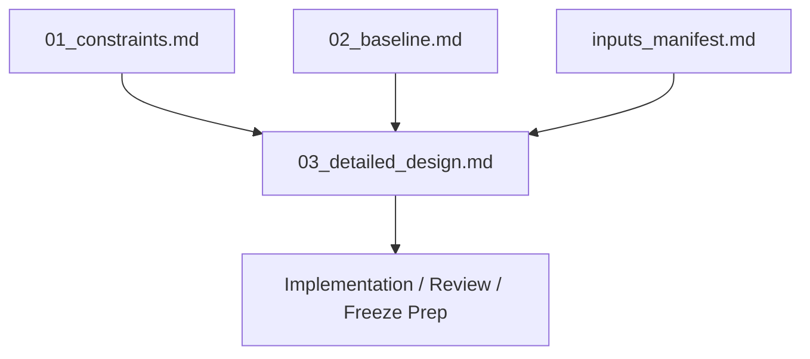
```mermaid
graph TD
    IN1[01_constraints.md]
    IN2[02_baseline.md]
    IN3[inputs_manifest.md]
    DOC[03_detailed_design.md]
    OUT[Implementation / Review / Freeze Prep]

    IN1 --> DOC
    IN2 --> DOC
    IN3 --> DOC
    DOC --> OUT
```

### 1.8 时序图
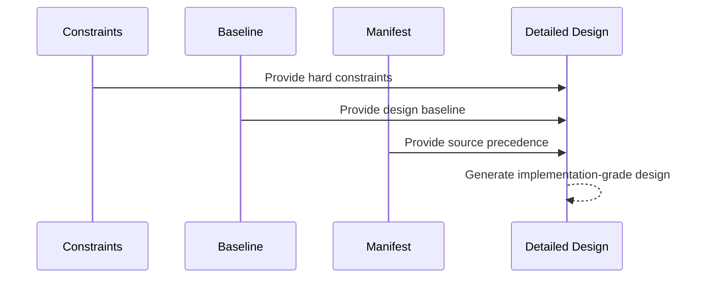
```mermaid
sequenceDiagram
    participant C as Constraints
    participant B as Baseline
    participant M as Manifest
    participant D as Detailed Design

    C->>D: Provide hard constraints
    B->>D: Provide design baseline
    M->>D: Provide source precedence
    D-->>D: Generate implementation-grade design
```

## 2. 输入材料与设计基线
### 2.1 输入状态表

| 输入项 | 当前状态 | 用法 | 当前结论 |
|---|---|---|---|
| `01_constraints.md` | 已冻结当前轮约束 | 作为全部章节的约束上界 | 不得与硬约束冲突 |
| `02_baseline.md` | 已收敛设计口径 | 作为职责、边界、双算法和冻结敏感项的直接依据 | 不得重写基线结论 |
| `inputs_manifest.md` | 已更新用户补充决议 | 用于来源优先级、Use Policy、冲突结论和变更记录 | 作为 traceability 顶层索引 |
| `SRC-003` 启动方案 | 当前启动流程主参考 | 确认启动方式、微核数量和职责 | 安全/非安全流程按此文件执行 |
| `SRC-002` eHSM 资料 | 当前能力边界主参考 | 确认 Mailbox、OTP/eFuse、生命周期、调试、升级、计数器能力 | eFuse 基线按 eHSM，单控制器方案 |

### 2.2 已确认基线事实
1. `[CONFIRMED]` SoC BootROM 是系统最早执行入口，但不是首个密码学验证者。来源：`02_baseline.md`，`C-BOOT-001`，`C-BOOT-002`。
2. `[CONFIRMED]` eHSM/FSP 是首个密码学验证主体。来源：`02_baseline.md`，`C-BOOT-002`。
3. `[CONFIRMED]` `sec1` 是 First Mutable Stage，镜像来自 NOR Flash，`sec2` 是运行期安全控制平面。来源：`02_baseline.md`，`C-BOOT-004`。
4. `[CONFIRMED]` Host 仅下发 `sec2` 及其后续固件，没有最终执行放行权，也不负责 `sec1` 供应路径。来源：`02_baseline.md`，`C-HOST-001`。
5. `[CONFIRMED]` 方案必须同时支持国密和国际标准两套算法。来源：`02_baseline.md`，`C-ALG-001`。
6. `[CONFIRMED]` eHSM 中已明确的固件字段、OTP/eFuse 排布、key slot 语义和生产阶段操作优先按 eHSM 原定义集成，项目侧仅做兼容性增量扩展。来源：`02_baseline.md`，`C-EHSM-001`。

### 2.3 架构图
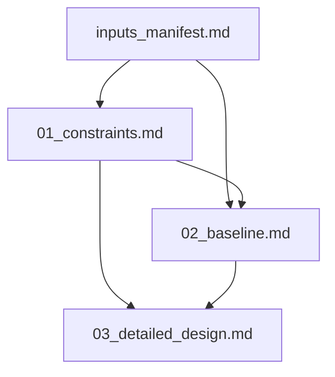
```mermaid
graph TD
    MANIFEST[inputs_manifest.md]
    CONS[01_constraints.md]
    BASE[02_baseline.md]
    DD[03_detailed_design.md]

    MANIFEST --> CONS
    MANIFEST --> BASE
    CONS --> BASE
    CONS --> DD
    BASE --> DD
```

### 2.4 时序图
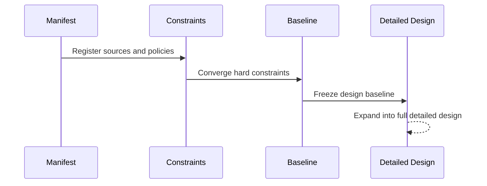
```mermaid
sequenceDiagram
    participant M as Manifest
    participant C as Constraints
    participant B as Baseline
    participant D as Detailed Design

    M->>C: Register sources and policies
    C->>B: Converge hard constraints
    B->>D: Freeze design baseline
    D-->>D: Expand into full detailed design
```

## 3. 安全目标、保护资产与威胁边界
### 3.1 设计要求
- 系统必须阻止未经授权的可变固件执行。
- 系统必须将“最早执行入口”和“首个密码学验证主体”分层。
- 系统必须保证根密钥、OTP/eFuse、调试控制、版本计数器和生命周期状态不被 Host 或普通微核越权修改。
- 系统必须支持安全启动和非安全启动两种模式，但量产态必须强制进入安全启动路径。
- 系统必须同时兼容国密和国际标准两套算法栈。

来源追踪：`C-BOOT-001`、`C-BOOT-002`、`C-BOOT-003`、`C-KEY-001`、`C-ALG-001`。

### 3.1.1 eHSM 优先复用规则
- 凡 `SRC-002` 已明确定义的镜像字段、OTP/eFuse 字段、key slot 语义、计数器和生产阶段操作，本文优先复用 eHSM 原定义。
- 为了便于 SoC 集成描述，本文可以给出“逻辑分区”和“字段映射”视图，但这不代表另起一套独立于 eHSM 的 on-wire/on-OTP 格式。
- 若项目新增需求超出 eHSM 已覆盖范围，必须以增量扩展方式补充，并保持对 eHSM 既有字段和流程兼容。

来源追踪：`C-EHSM-001`、`C-KEY-001`、`C-UPDATE-002`。

### 3.2 架构图
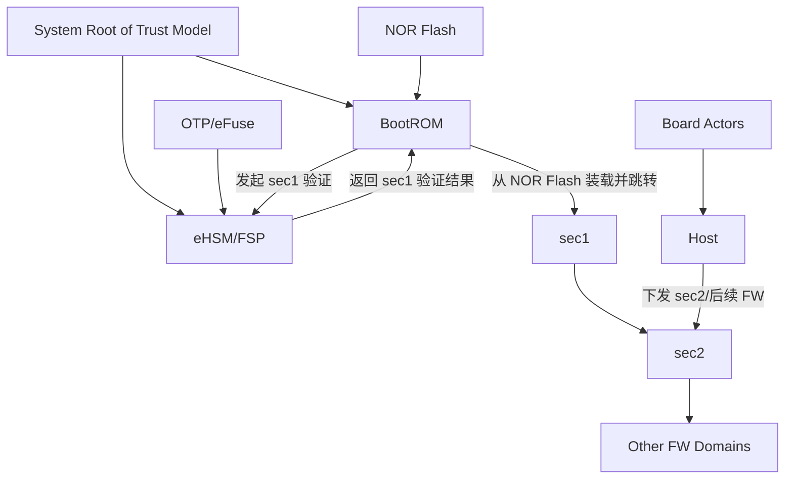
```mermaid
graph TD
    ROT[System Root of Trust Model]
    BR[BootROM]
    EH[eHSM/FSP]
    OTP[OTP/eFuse]
    F[NOR Flash]
    S1[sec1]
    S2[sec2]
    MC[Other FW Domains]
    HOST[Host]
    BOARD[Board Actors]

    ROT --> BR
    ROT --> EH
    OTP --> EH
    F --> BR
    BR -->|发起 sec1 验证| EH
    EH -->|返回 sec1 验证结果| BR
    BR -->|从 NOR Flash 装载并跳转| S1
    S1 --> S2
    S2 --> MC
    HOST -->|下发 sec2/后续 FW| S2
    BOARD --> HOST
```

图示说明：
- `BootROM -> eHSM` 表示启动编排阶段发起 `sec1` 验签、版本检查和可选解密请求，不表示 BootROM “控制” eHSM 内核执行。
- `NOR Flash -> BootROM -> sec1` 表示 `sec1` 镜像来源于 NOR Flash，由 BootROM 读取、经 eHSM 验证通过后装载并跳转。
- `Host -> sec2` 表示 Host 仅承担 `sec2` 与后续固件的投递职责，不参与 `sec1` 来源路径。

### 3.3 时序图
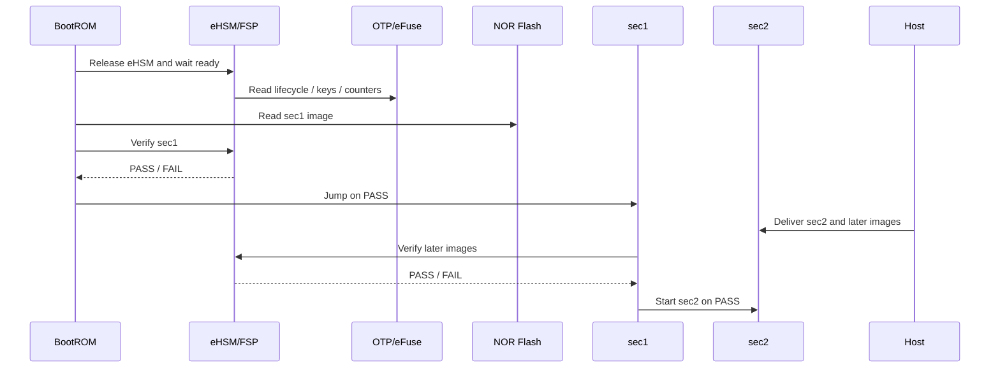
```mermaid
sequenceDiagram
    participant BR as BootROM
    participant EH as eHSM/FSP
    participant OTP as OTP/eFuse
    participant F as NOR Flash
    participant S1 as sec1
    participant S2 as sec2
    participant H as Host

    BR->>EH: Release eHSM and wait ready
    EH->>OTP: Read lifecycle / keys / counters
    BR->>F: Read sec1 image
    BR->>EH: Verify sec1
    EH-->>BR: PASS / FAIL
    BR->>S1: Jump on PASS
    H->>S2: Deliver sec2 and later images
    S1->>EH: Verify later images
    EH-->>S1: PASS / FAIL
    S1->>S2: Start sec2 on PASS
```

流程说明：
1. BootROM 拉起 eHSM 并等待其进入可服务状态。
2. eHSM 从 OTP/eFuse 恢复生命周期、验证密钥和计数器状态。
3. BootROM 从 NOR Flash 读取 `sec1` 镜像，并提交给 eHSM 完成首个密码学校验。
4. 验证通过后 BootROM 才装载并跳转到 `sec1`。
5. Host 在后续阶段仅向 `sec2` 路径提供 `sec2` 与其他运行期固件。

### 3.4 受保护资产

| 资产 | 安全目标 | 主要保护主体 | 备注 |
|---|---|---|---|
| BootROM 代码 | 不可变、不可篡改 | SoC 设计/Mask ROM | 系统最早执行入口 |
| eHSM 私有代码和状态 | 完整性、机密性 | eHSM/FSP | 不对 SoC 普通 Master 直接开放 |
| OTP/eFuse 根数据 | 完整性、一次性、访问受限 | eHSM | 单控制器方案 |
| `sec1` 镜像 | 完整性、版本合法性、可选机密性 | eHSM + BootROM | 首个 SoC 可变阶段 |
| `sec2` 镜像 | 完整性、版本合法性、可选机密性 | eHSM + `sec1` | 运行期安全控制平面 |
| 后续微核固件 | 完整性、版本合法性、放行控制 | eHSM + `sec2` | 执行前必须校验 |
| 版本计数器 | 不可回退 | eHSM | Root of Trust 裁决项 |
| 调试授权状态 | 完整性、最小授权 | eHSM + 生命周期规则 | 量产态不得开放无限制调试 |

### 3.5 威胁边界

| 威胁源 | 边界位置 | 当前处理 |
|---|---|---|
| Host 恶意或被攻陷 | PCIe/下载通道 | Host 不拥有执行放行权，镜像执行前必须经 eHSM 路径校验 |
| 普通微核越权 | 管理子系统 IRAM / 总线访问 | 通过 firewall、userid、SEC 控制面进行隔离 |
| 调试口滥用 | JTAG / 调试服务接口 | challenge-response + 生命周期门控 |
| 侧带通道绕过 | BMC/OOB/SMBus | 当前按板级高权限管理参与者处理，但不纳入芯片内信任根 [ASSUMED] |
| 回滚旧镜像 | 镜像加载与升级路径 | 版本计数器/单调计数器裁决 |

## 4. NGU800 安全总体架构
### 4.1 设计要求
- 形成“BootROM 编排 + eHSM 密码学验证 + `sec1` 最小 bring-up + `sec2` 运行期控制”的分层架构。
- 片上安全服务边界统一走 Mailbox。
- Host 仅作为管理和投递参与者，不提升为 Root of Trust。

来源追踪：`02_baseline.md`；`C-BOOT-004`、`C-INTF-001`、`C-HOST-001`。

### 4.2 架构图
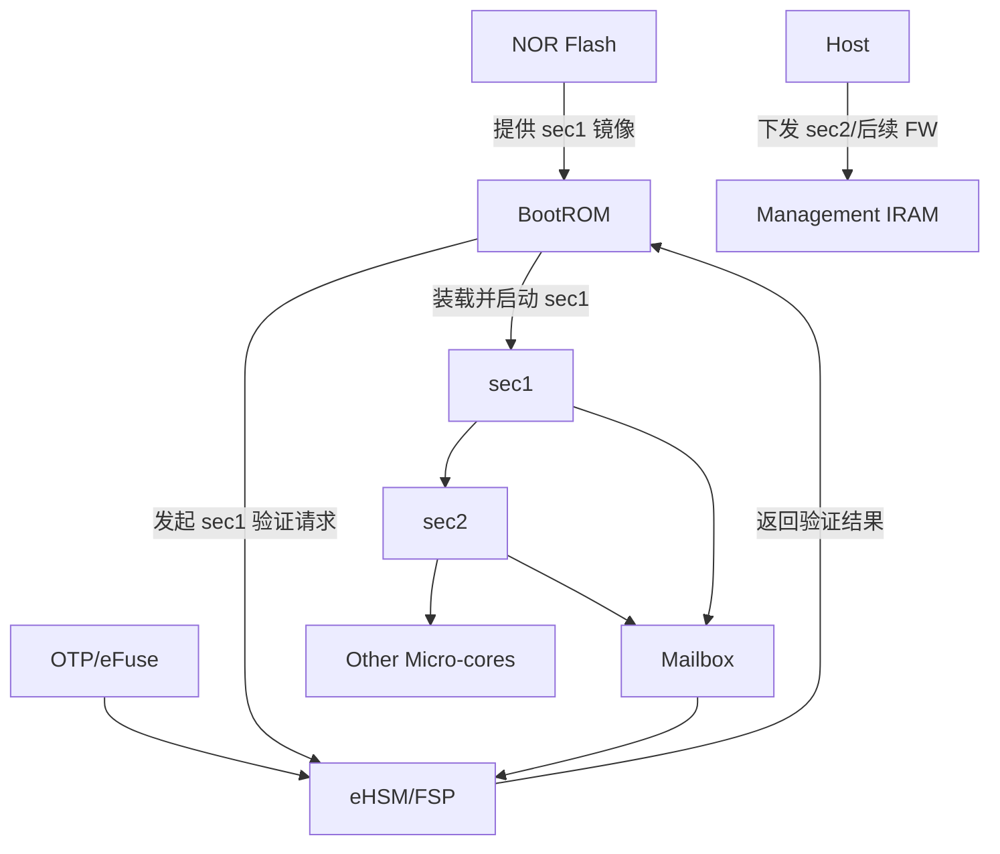
```mermaid
graph TD
    BR[BootROM]
    EH[eHSM/FSP]
    OTP[OTP/eFuse]
    F[NOR Flash]
    S1[sec1]
    S2[sec2]
    MIRAM[Management IRAM]
    MCU[Other Micro-cores]
    HOST[Host]
    MB[Mailbox]

    OTP --> EH
    F -->|提供 sec1 镜像| BR
    BR -->|发起 sec1 验证请求| EH
    EH -->|返回验证结果| BR
    BR -->|装载并启动 sec1| S1
    S1 --> S2
    S2 --> MCU
    HOST -->|下发 sec2/后续 FW| MIRAM
    S1 --> MB
    S2 --> MB
    MB --> EH
```

图示说明：
- `BootROM -> eHSM` 的箭头表示“验证请求与结果交互”，不是表示 eHSM 被 BootROM 挂接为普通外设寄存器。
- `Host -> Management IRAM` 表示 Host 只负责 `sec2` 和其他后续固件的下发缓存路径，不再承担 `sec1` 的下发。
- `sec1 -> Mailbox -> eHSM` 与 `sec2 -> Mailbox -> eHSM` 表示运行期所有关键安全服务统一走 Mailbox 服务边界。

### 4.3 时序图
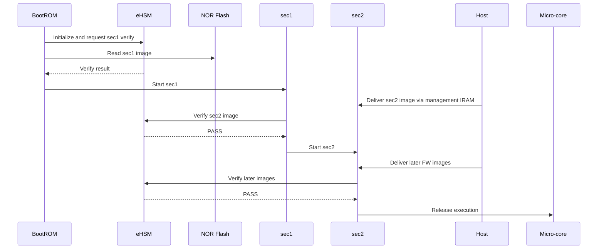
```mermaid
sequenceDiagram
    participant BR as BootROM
    participant EH as eHSM
    participant F as NOR Flash
    participant S1 as sec1
    participant S2 as sec2
    participant H as Host
    participant MC as Micro-core

    BR->>EH: Initialize and request sec1 verify
    BR->>F: Read sec1 image
    EH-->>BR: Verify result
    BR->>S1: Start sec1
    H->>S2: Deliver sec2 image via management IRAM
    S1->>EH: Verify sec2 image
    EH-->>S1: PASS
    S1->>S2: Start sec2
    H->>S2: Deliver later FW images
    S2->>EH: Verify later images
    EH-->>S2: PASS
    S2->>MC: Release execution
```

流程步骤：
1. BootROM 初始化并拉起 eHSM。
2. BootROM 从 NOR Flash 读取 `sec1` 镜像，并向 eHSM 请求首轮验证。
3. eHSM 返回验证结果后，BootROM 决定是否启动 `sec1`。
4. `sec1` 建立 PCIe/Host 通道与管理子系统固件接收环境。
5. Host 将 `sec2` 与后续固件写入管理子系统 IRAM。
6. `sec1`/`sec2` 通过 Mailbox 请求 eHSM 完成验签、版本检查和可选解密。
7. 只有验证通过的后续微核固件才被 `sec2` 放行执行。

### 4.4 职责划分

| 角色 | 主要职责 | 不承担职责 | 来源 |
|---|---|---|---|
| BootROM | 启动编排、模式分流、拉起 eHSM、请求 `sec1` 验证、按结果跳转 | 密码学验签、解密、运行期安全服务 | `C-BOOT-001` |
| eHSM/FSP | 首次密码学验证、密钥/OTP/eFuse/计数器/调试/生命周期服务 | 向任意 Core 暴露私有安全资源 | `C-BOOT-002`, `C-KEY-001` |
| `sec1` | 最小 bring-up、PCIe 建链、下载准备、后续镜像引导 | 完整运行期安全控制平面 | `C-BOOT-004` |
| `sec2` | 运行期安全控制、校验编排、measurement、升级、调试策略 | 自建独立 Root of Trust | `C-BOOT-004`, `C-UPDATE-001` |
| Host | 投递镜像、管理协同、板级配合 | 放行未验证镜像执行 | `C-HOST-001` |
| Board Actors | 上电协同、状态采集、板级管理 | 替代片内信任裁决 | `[ASSUMED]`，`02_baseline.md` |

### 4.5 架构冻结敏感项

| 项目 | 当前结论 | 状态 |
|---|---|---|
| Root of Trust 口径 | BootROM earliest entry，eHSM first cryptographic root | `[CONFIRMED]` |
| `sec1` / `sec2` 边界 | 两级固件模型已冻结 | `[CONFIRMED]` |
| Host 落点 | Host 仅下发 `sec2` 与其他后续固件到管理 IRAM；`sec1` 来自 NOR Flash | `[CONFIRMED]` |
| FSP 术语 | 明确指 eHSM 内部核 | `[CONFIRMED]` |

## 5. Root of Trust、密钥体系与证书体系
### 5.1 设计要求
- Root of Trust 必须由不可变执行入口、eHSM 内部验证能力和 OTP/eFuse 密钥材料共同建立。
- 根密钥、验证密钥、加密密钥、升级密钥、调试授权密钥必须区分用途和生命周期。
- 双算法栈必须在密钥对象和证书层级中并行表达。

来源追踪：`C-BOOT-002`、`C-KEY-001`、`C-ALG-001`。

### 5.2 架构图
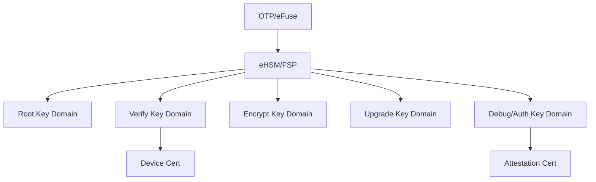
```mermaid
graph TD
    OTP[OTP/eFuse]
    EH[eHSM/FSP]
    KR[Root Key Domain]
    KV[Verify Key Domain]
    KE[Encrypt Key Domain]
    KU[Upgrade Key Domain]
    KD[Debug/Auth Key Domain]
    DC[Device Cert]
    AC[Attestation Cert]

    OTP --> EH
    EH --> KR
    EH --> KV
    EH --> KE
    EH --> KU
    EH --> KD
    KV --> DC
    KD --> AC
```

图示说明：
- OTP/eFuse 只提供根数据和策略基线，不直接暴露给 Host 或普通微核。
- eHSM 是密钥对象和证书对象的统一访问与策略执行主体。

### 5.3 时序图
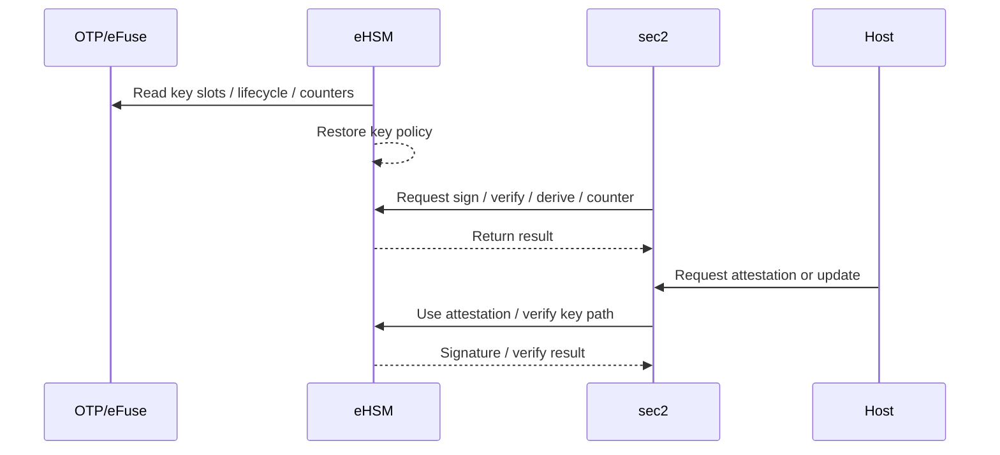
```mermaid
sequenceDiagram
    participant OTP as OTP/eFuse
    participant EH as eHSM
    participant S2 as sec2
    participant H as Host

    EH->>OTP: Read key slots / lifecycle / counters
    EH-->>EH: Restore key policy
    S2->>EH: Request sign / verify / derive / counter
    EH-->>S2: Return result
    H->>S2: Request attestation or update
    S2->>EH: Use attestation / verify key path
    EH-->>S2: Signature / verify result
```

流程说明：
1. eHSM 上电后先恢复 OTP/eFuse 中的生命周期、key slot 和计数器状态。
2. `sec2` 在运行期通过 Mailbox 请求签名、验签、派生和计数器服务。
3. Host 若发起 attestation 或 update 请求，实际密码学动作仍由 eHSM 完成。

### 5.4 密钥对象表

| Key ID | 用途 | 存储位置 | 使用主体 | 生命周期限制 | 国密映射 | 国际映射 |
|---|---|---|---|---|---|---|
| K-ROOT-DEV | 设备根密钥派生根 | OTP/eFuse 或 eHSM 私有密钥槽 | eHSM | USER/RMA 可用，不外导 | SM2/SM4 体系派生根 | ECC/RSA/AES 体系派生根 |
| K-SEC1-VERIFY | `sec1` 验签 | OTP/eFuse | eHSM | 量产态只读 | SM2 公钥或摘要验证材料 | ECDSA/RSA 验证公钥 |
| K-SEC1-ENC | `sec1` 解密 | OTP/eFuse | eHSM | 量产态只读 | SM4 密钥 | AES 密钥 |
| K-SOC-VERIFY | `sec2` 和其他 SoC FW 验签 | OTP/eFuse | eHSM | 量产态只读 | SM2 公钥 | ECDSA/RSA 公钥 |
| K-SOC-ENC | `sec2` 和其他 SoC FW 解密 | OTP/eFuse | eHSM | 量产态只读 | SM4 | AES |
| K-UPG-VERIFY | 升级包验签 | OTP/eFuse | eHSM | 量产态只读 | SM2 | ECDSA/RSA |
| K-UPG-ENC | 升级包解密 | OTP/eFuse | eHSM | 量产态只读 | SM4 | AES |
| K-DBG-AUTH | 调试鉴权 | OTP/eFuse 或证书链 | eHSM | TEST/DEVE/RMA 按策略开放 | SM2 | ECDSA/RSA |
| K-ATTEST | 设备证明签名 | eHSM 私有槽 | eHSM | USER 可用 | SM2 私钥 | ECDSA/RSA 私钥 |

来源追踪：`SRC-002` 目录级策略与 `C-KEY-001`、`C-ALG-001`；具体 key slot ID 仍为 `[TBD]`。

### 5.5 OTP/eFuse 布局表

当前采用单控制器布局口径，OTP/eFuse 字段体系以 eHSM 已定义内容为主基线；以下表格用于 NGU800 集成对齐和章节说明。若 eHSM 文档已明确给出具体 offset、bit 定义或 slot 语义，应直接沿用 eHSM 原定义，不再另行重定义。

区段总表：

| 区段 | 偏移范围 | 容量 | 主要内容 | 与 eHSM 关系 | 状态 |
|---|---|---|---|---|---|
| `SEG-0` | `0x000-0x01F` | `32B` | 生命周期、启动控制、调试策略、设备 UID 头部 | eHSM 启动早期恢复字段基线 | `[CONFIRMED]` |
| `SEG-1` | `0x020-0x03F` | `32B` | UID 完整性、Boot Policy、版本计数器基值 | eHSM 控制/计数基线，未定义位可扩展 | `[ASSUMED]` |
| `SEG-2` | `0x040-0x07F` | `64B` | `sec1` 验签/解密 key slot | eHSM `sec1` key slot 基线分区 | `[CONFIRMED]` |
| `SEG-3` | `0x080-0x0BF` | `64B` | `sec2` 与其他 SoC FW 验签/解密 key slot | eHSM SoC FW key slot 基线分区 | `[CONFIRMED]` |
| `SEG-4` | `0x0C0-0x0FF` | `64B` | 升级包验签/解密 key slot | eHSM 升级 key slot 基线分区 | `[CONFIRMED]` |
| `SEG-5` | `0x100-0x13F` | `64B` | 证明与调试授权相关材料 | eHSM 若已有槽位则直接复用 | `[ASSUMED]` |
| `SEG-6` | `0x140-0x17F` | `64B` | 板级绑定、产品 SKU、扩展控制字段 | 项目增量扩展区，不覆盖 eHSM 已定义字段 | `[ASSUMED]` |

字段明细表：

| 偏移范围 | 字段组 | 典型字段 | 与 eHSM 关系 | 状态 |
|---|---|---|---|
| `0x000-0x003` | `LIFECYCLE_STATE` | `TEST/DEVE/MANU/USER/RMA/DEST` | eHSM 已覆盖的生命周期字段，按其定义优先 | `[CONFIRMED]` |
| `0x004-0x007` | `SECURE_BOOT_CTRL` | 安全启动使能、非安全启动许可、patch 开关 | eHSM 控制字段基线，项目侧不重定义语义 | `[CONFIRMED]` |
| `0x008-0x00B` | `DEBUG_POLICY_LO` | 调试位图低 32bit | eHSM 调试策略字段低位映射 | `[CONFIRMED]` |
| `0x00C-0x00F` | `DEBUG_POLICY_HI` | 调试位图高 32bit / 扩展位 | 若 eHSM 明确高位排布则直接沿用，否则作为扩展区 | `[ASSUMED]` |
| `0x010-0x01F` | `DEVICE_UID` | 16B UID | eHSM 设备身份字段基线 | `[CONFIRMED]` |
| `0x020-0x023` | `UID_CRC32` | UID 完整性校验 | eHSM 若已定义完整性字段则优先按其编码 | `[ASSUMED]` |
| `0x024-0x02F` | `BOOT_POLICY` | 镜像类别、生命周期掩码、board policy 使能 | eHSM 已定义处优先沿用；未定义位再扩展 | `[ASSUMED]` |
| `0x030-0x03F` | `VERSION_BASE` | `CTR_SEC1`、`CTR_SOC_RUNTIME` 基值 | eHSM 计数器基线 | `[CONFIRMED]` |
| `0x040-0x07F` | `SEC1_KEY_AREA` | `K-SEC1-VERIFY`、`K-SEC1-ENC` | eHSM key slot 基线分区 | `[CONFIRMED]` |
| `0x080-0x0BF` | `SOC_KEY_AREA` | `K-SOC-VERIFY`、`K-SOC-ENC` | eHSM key slot 基线分区 | `[CONFIRMED]` |
| `0x0C0-0x0FF` | `UPGRADE_KEY_AREA` | `K-UPG-VERIFY`、`K-UPG-ENC` | eHSM 升级 key slot 基线分区 | `[CONFIRMED]` |
| `0x100-0x13F` | `ATTEST_DBG_KEY_AREA` | `K-ATTEST`、`K-DBG-AUTH` 关联材料 | eHSM 若已有证明/调试材料槽位则直接复用 | `[ASSUMED]` |
| `0x140-0x17F` | `BOARD_POLICY_AREA` | 板级绑定、产品 SKU、扩展控制字段 | 属于项目增量扩展区，不覆盖 eHSM 已定义字段 | `[ASSUMED]` |

布局说明：
1. 本表是“NGU800 对 eHSM OTP/eFuse 基线的集成视图”，不是替代 eHSM 原始字段表的第二套定义。
2. `sec1`、SoC FW、Upgrade 三类密钥槽按用途分区，不混用，具体 slot 编号和位级定义以 eHSM 文档为准。
3. 生命周期、调试位图、版本计数器位于布局前部，便于 eHSM 启动早期快速恢复。
4. 板级绑定与扩展字段放在尾部，后续扩充时不破坏前部已冻结字段。

### 5.6 证书层级
当前推荐的证书层级如下：
1. `[ASSUMED]` 制造商根证书 `OEM Root CA`
2. `[ASSUMED]` 产品线中级证书 `NGU800 Product CA`
3. 设备证明证书 `Device Attestation Cert`
4. 调试授权证书 `Debug Authorization Cert`

建议：
- 启动验签公钥优先来自 OTP/eFuse 固定槽，不强依赖在线证书链。
- 远程度量证明和调试鉴权走证书链模型。
- 调试授权证书与证明证书分离，避免单证书承担全部高风险能力。

### 5.7 推荐 KDF Label

| Label | 用途 | 备注 |
|---|---|---|
| `NGU800/DEV/ATTEST` | 设备证明密钥派生 | 固定与设备身份绑定 |
| `NGU800/DEV/MEASURE` | 度量签名或 HMAC 派生 | 用于证明会话 |
| `NGU800/IMG/SEC1` | `sec1` 相关派生 | 镜像类别区分 |
| `NGU800/IMG/SOC` | `sec2` 和其他 SoC FW | 镜像类别区分 |
| `NGU800/UPG/PKG` | 升级封装密钥派生 | 与升级流程绑定 |
| `NGU800/DBG/AUTH` | 调试鉴权派生 | 与 challenge-response 绑定 |

### 5.8 双算法映射

| 设计域 | 国密 | 国际标准 |
|---|---|---|
| 启动验签 | SM2 + SM3 | ECDSA/RSA + SHA-256/SHA-384 |
| 镜像保密 | SM4 | AES |
| 调试 challenge | SM3-SM2 / SM4-CMAC | SHA2-ECDSA / RSA-PSS / AES-CMAC |
| 设备证明 | SM2 证书链 | ECC/RSA 证书链 |
| KDF | SM3/HMAC-SM3 体系 [ASSUMED] | HKDF-SHA256/HKDF-SHA384 |

## 6. 安全启动详细设计
### 6.1 设计要求
- 安全启动链必须从 BootROM 编排开始，但首个密码学判断由 eHSM 完成。
- `sec1` 必须先于 `sec2` 启动。
- 后续微核在未通过验证前不得执行。
- 非安全启动路径保留，但在量产态不得作为默认或可随意切换路径。

来源追踪：`C-BOOT-001` 至 `C-BOOT-005`。

### 6.2 架构图
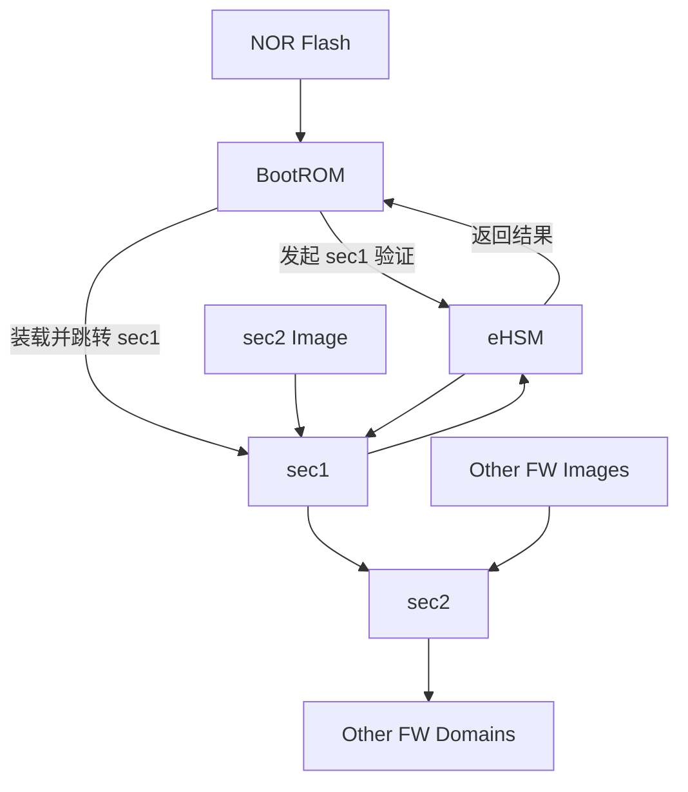
```mermaid
graph TD
    BR[BootROM]
    EH[eHSM]
    F[NOR Flash]
    S1[sec1]
    S2IMG[sec2 Image]
    S2[sec2]
    OIMG[Other FW Images]
    MCU[Other FW Domains]

    F --> BR
    BR -->|发起 sec1 验证| EH
    EH -->|返回结果| BR
    BR -->|装载并跳转 sec1| S1
    S2IMG --> S1
    S1 --> EH
    EH --> S1
    S1 --> S2
    OIMG --> S2
    S2 --> MCU
```

图示说明：
- `F -> BR` 表示 `sec1` 镜像物理来源是 NOR Flash。
- `BR <-> EH` 表示 `sec1` 启动前的验证交互，而不是运行期服务关系。
- `S2IMG -> S1` 与 `OIMG -> S2` 表示 Host/管理路径下发的后续镜像在各阶段由控制平面接管。

### 6.3 时序图
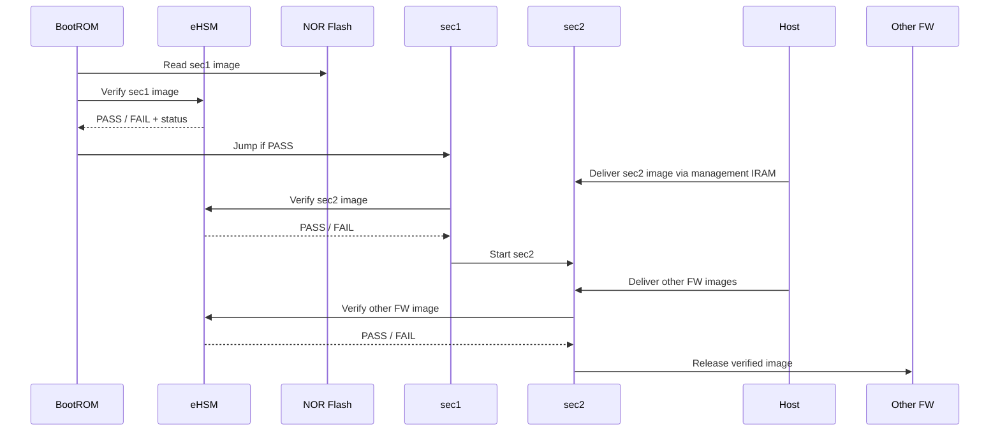
```mermaid
sequenceDiagram
    participant BR as BootROM
    participant EH as eHSM
    participant F as NOR Flash
    participant S1 as sec1
    participant S2 as sec2
    participant H as Host
    participant MC as Other FW

    BR->>F: Read sec1 image
    BR->>EH: Verify sec1 image
    EH-->>BR: PASS / FAIL + status
    BR->>S1: Jump if PASS
    H->>S2: Deliver sec2 image via management IRAM
    S1->>EH: Verify sec2 image
    EH-->>S1: PASS / FAIL
    S1->>S2: Start sec2
    H->>S2: Deliver other FW images
    S2->>EH: Verify other FW image
    EH-->>S2: PASS / FAIL
    S2->>MC: Release verified image
```

流程步骤：
1. BootROM 从 NOR Flash 读取 `sec1` 镜像。
2. BootROM 将 `sec1` 镜像提交 eHSM 完成首个密码学校验。
3. 只有 `sec1` 验证通过后，BootROM 才跳转到 `sec1`。
4. `sec1` 完成最小 bring-up 和 Host 通道建立。
5. Host 把 `sec2` 下发到管理子系统 IRAM，由 `sec1` 发起验证。
6. `sec2` 启动后接管其他微核固件的验证和放行。

### 6.4 启动模式矩阵

| BootMode | SecureBoot | 生命周期 | 启动路径 | 备注 |
|---|---|---|---|---|
| SPI NOR | 0 | TEST/DEVE/MANU | 非安全启动 | 仅用于 bring-up、调试或显式允许场景 |
| SPI NOR | 1 | TEST/DEVE/MANU/USER | 安全启动 | 主路径 |
| UART | 0 | TEST/DEVE | 非安全调试启动 | 仅开发调试 |
| UART | 1 | TEST/DEVE | 安全调试启动 | 调试验证场景 |
| UCIe 从 Die | 跟随主 Die 策略 | MANU/USER | 从 Die 跟随受控启动 | 从 Die 不能绕过主控制面执行 |

来源追踪：`SRC-003` 为主，结合 `C-BOOT-000`、`C-LC-001`。

### 6.5 可信镜像分类

| Image Type | 说明 | 存储/投递位置 | 验证主体 | 执行放行主体 |
|---|---|---|---|---|
| `IMG_SEC1` | 首级可变安全管理固件 | NOR Flash（源） | eHSM | BootROM |
| `IMG_SEC2` | 运行期安全控制固件 | 管理子系统 IRAM | eHSM | `sec1` |
| `IMG_PM` | PM 微核固件 | 管理子系统 IRAM | eHSM | `sec2` |
| `IMG_RAS` | RAS 微核固件 | 管理子系统 IRAM | eHSM | `sec2` |
| `IMG_CODEC0/1` | Codec 微核固件 | 管理子系统 IRAM | eHSM | `sec2` |
| `IMG_PATCH` | eHSM/SoC Patch [ASSUMED] | 专用 patch 区或 RAM | eHSM | eHSM 或 `sec2` |

### 6.6 镜像格式对齐原则

本项目不单独发明一套独立于 eHSM 的镜像格式。镜像头、升级封装和关键字段应以 eHSM Bootloader/FW 已定义格式为主基线；下表仅给出 NGU800 集成时需要关注的逻辑字段映射，便于 SoC、固件和文档对齐。

| 逻辑字段 | 典型含义 | 与 eHSM 关系 | 说明 |
|---|---|---|---|
| `magic` | 镜像类型识别 | 复用 eHSM 头标识字段 | 具体取值按 eHSM 已定义格式 |
| `hdr_ver` | 头版本 | 复用 eHSM 版本字段 | 用于兼容头版本演进 |
| `image_type` | 镜像类别 | 复用 eHSM 或映射到其镜像类别字段 | 需能区分 `sec1`、`sec2`、runtime FW、patch |
| `alg_suite` | 算法套件编号 | 复用或映射到 eHSM 算法选择字段 | 同时支持国密和国际标准 |
| `flags` | 加密/压缩/调试/patch 标志 | 复用 eHSM 标志位定义优先 | 未覆盖位才做扩展 |
| `header_size` | 头长度 | 复用 eHSM 头长度字段 | 用于解析可变头 |
| `image_size` | 代码区长度 | 复用 eHSM 镜像长度字段 | 必须参与边界检查 |
| `load_addr` | 目标加载地址 | 若 eHSM 已定义则直接沿用 | 需受当前 image type 的执行区域约束 |
| `entry_addr` | 入口地址 | 若 eHSM 已定义则直接沿用 | 必须落在合法镜像区 |
| `version_ctr` | 版本计数值 | 复用 eHSM 版本/计数比较字段 | 由 eHSM 与 OTP/eFuse 状态联动裁决 |
| `key_slot_id` | 验签/解密槽位 | 复用 eHSM key slot 语义 | 不重新发明并行 slot 编号体系 |
| `sig_alg` | 签名算法 | 复用 eHSM 签名算法枚举 | 与 `alg_suite` 一致 |
| `enc_alg` | 加密算法 | 复用 eHSM 加密算法枚举 | 与 `alg_suite` 和密钥槽匹配 |
| `iv_size` / `iv_offset` | IV 信息 | 若采用加密镜像则复用 eHSM 相应字段 | 仅在加密场景有效 |
| `sig_offset` / `sig_size` | 签名定位信息 | 复用 eHSM 签名区字段 | 便于 eHSM 解析验签 |
| `meta_hash` | 元数据摘要 | 复用 eHSM 摘要字段 | 用于头部完整性校验 |
| `ext_len` | 扩展区长度 | 复用 eHSM 扩展长度字段优先 | 项目新增字段仅放在兼容扩展区 |

实现规则：
- 若 eHSM 文档已定义某字段名称、顺序、编码或长度，工程实现必须直接沿用，不以本文表格替换其 on-wire 定义。
- `alg_suite` 与 `sig_alg` / `enc_alg` 必须一致。
- `version_ctr` 由 eHSM 与 OTP/eFuse 计数状态对比。
- `load_addr` 必须受当前 image type 对应的执行区域约束。
- 项目新增字段只能放入 eHSM 允许的兼容扩展区，不得破坏其既有头解析逻辑。

### 6.7 校验规则

| 校验项 | 执行主体 | 规则 |
|---|---|---|
| Header 魔数与版本 | eHSM | 魔数不符直接拒绝 |
| `image_type` 合法性 | eHSM | 必须匹配当前阶段允许类型 |
| `load_addr` 合法性 | eHSM + `sec1`/`sec2` | 目标区域必须在许可区间内 |
| `entry_addr` 合法性 | eHSM + `sec1`/`sec2` | 必须落在镜像加载区 |
| 摘要/签名 | eHSM | 必须通过 |
| 可选解密 | eHSM | 解密成功后再验签或按镜像策略执行 |
| `version_ctr` | eHSM | 不得小于当前 OTP/eFuse 或计数器基线 |
| 生命周期兼容性 | eHSM | 量产态不得接受开发类镜像标志 |

### 6.8 非安全启动规则
- `[CONFIRMED]` 非安全启动路径仅作为 bring-up、开发、调试或显式允许模式。
- `[CONFIRMED]` USER/量产态必须强制安全启动。
- `[ASSUMED]` 非安全启动下仍建议保留最小审计日志和错误码记录，避免完全不可追踪。

## 7. 固件完整性、保密性、防回滚与恢复
### 7.1 设计要求
- 所有进入执行态的可变固件必须具备完整性保护。
- 对量产和客户敏感镜像，应支持可选保密性保护。
- 防回滚必须由 Root of Trust 裁决。
- 失败必须进入明确的恢复或保持失败态。

来源追踪：`C-UPDATE-001`、`C-UPDATE-002`、`C-BOOT-005`。

### 7.2 架构图
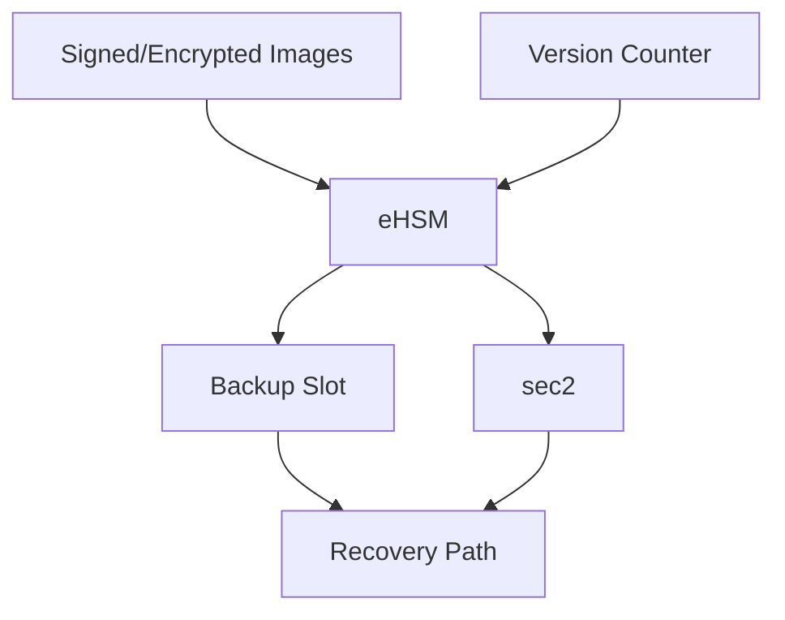
```mermaid
graph TD
    IMG[Signed/Encrypted Images]
    EH[eHSM]
    CNT[Version Counter]
    S2[sec2]
    BKP[Backup Slot]
    RCV[Recovery Path]

    IMG --> EH
    CNT --> EH
    EH --> S2
    EH --> BKP
    BKP --> RCV
    S2 --> RCV
```

### 7.3 时序图
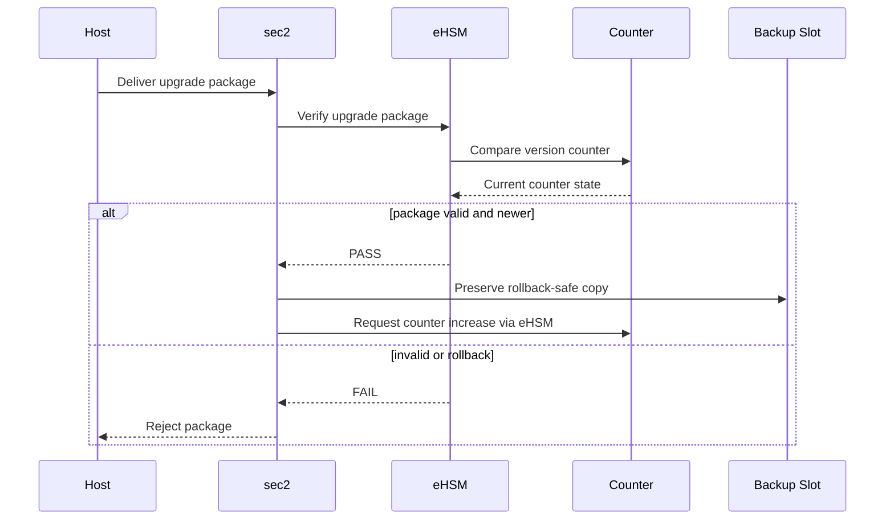
```mermaid
sequenceDiagram
    participant H as Host
    participant S2 as sec2
    participant EH as eHSM
    participant CNT as Counter
    participant BK as Backup Slot

    H->>S2: Deliver upgrade package
    S2->>EH: Verify upgrade package
    EH->>CNT: Compare version counter
    CNT-->>EH: Current counter state
    alt package valid and newer
        EH-->>S2: PASS
        S2->>BK: Preserve rollback-safe copy
        S2->>CNT: Request counter increase via eHSM
    else invalid or rollback
        EH-->>S2: FAIL
        S2-->>H: Reject package
    end
```

### 7.4 回滚策略

| 场景 | 策略 |
|---|---|
| `sec1` 回滚 | 必须由 eHSM 依据 OTP/eFuse 中的 `sec1` 版本基线裁决 |
| `sec2` 回滚 | 必须由 eHSM 依据 SoC FW 版本基线裁决 |
| 其他微核 FW 回滚 | 统一纳入 SoC FW 或细分计数器域 [ASSUMED] |
| 升级包回滚 | 先校验升级包版本，再校验包内镜像版本 |

建议计数器域：
- `CTR_SEC1`
- `CTR_SOC_RUNTIME`
- `CTR_PATCH`
- `CTR_DEBUG_POLICY` [ASSUMED]

### 7.5 升级规则
1. Host/BMC 只能投递升级包，不能决定安装成功。
2. 升级包验签与可选解密必须由 eHSM 完成。
3. 安装前必须做版本比较。
4. 安装后必须刷新计数器和状态记录。
5. `[ASSUMED]` 建议保留 A/B 或 golden/recovery 策略，以降低升级失败不可恢复风险。

### 7.6 恢复规则

| 失败点 | 恢复动作 |
|---|---|
| `sec1` 验证失败 | BootROM 停止跳转，记录错误码，进入失败保持态 |
| `sec2` 验证失败 | `sec1` 不释放 `sec2`，可保留升级/救援窗口 |
| 其他 FW 验证失败 | `sec2` 不释放对应微核，系统进入降级运行 |
| 升级安装中断 | 回退到上一有效镜像或 recovery slot [ASSUMED] |
| 计数器更新失败 | 升级失败，禁止将镜像标记为活动镜像 |

## 8. 设备身份与远程度量证明设计
### 8.1 设计要求
- 设备必须具备稳定设备身份。
- 度量和证明必须由 `sec2` 编排、eHSM 提供签名/密钥服务。
- 外部承载协议可后续映射到 SPDM/DOE/PLDM，但内部 canonical report 结构应先冻结。

来源追踪：`02_baseline.md`，`C-ALG-001`；外部协议部分为 `[TBD]`。

### 8.2 架构图
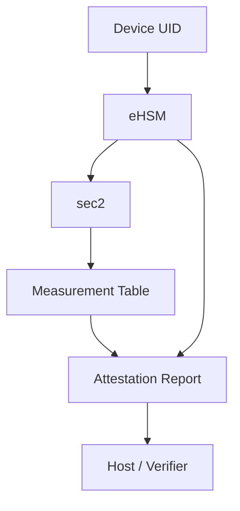
```mermaid
graph TD
    UID[Device UID]
    EH[eHSM]
    S2[sec2]
    MT[Measurement Table]
    RP[Attestation Report]
    H[Host / Verifier]

    UID --> EH
    EH --> S2
    S2 --> MT
    MT --> RP
    EH --> RP
    RP --> H
```

### 8.3 时序图
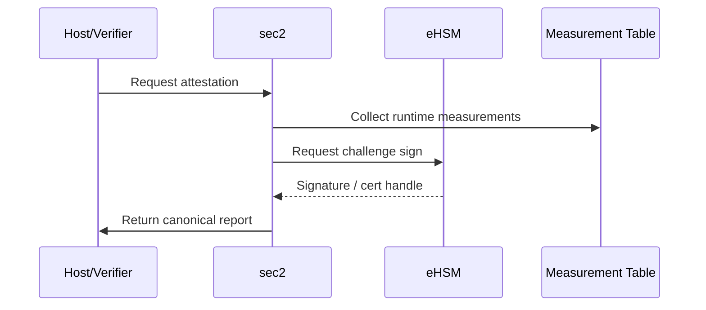
```mermaid
sequenceDiagram
    participant H as Host/Verifier
    participant S2 as sec2
    participant EH as eHSM
    participant MT as Measurement Table

    H->>S2: Request attestation
    S2->>MT: Collect runtime measurements
    S2->>EH: Request challenge sign
    EH-->>S2: Signature / cert handle
    S2->>H: Return canonical report
```

### 8.4 身份与证书模型

| 对象 | 内容 | 生成位置 | 使用位置 |
|---|---|---|---|
| Device UID | 设备唯一标识 | OTP/eFuse | eHSM / 证明报告 |
| Device Identity | UID + product info + lifecycle | `sec2` 组装 | Host / Verifier |
| Attestation Cert | 设备证明证书 | 制造/灌装阶段 [ASSUMED] | eHSM |
| Debug Auth Cert | 调试授权证书 | 制造/售后流程 [ASSUMED] | eHSM |

### 8.5 报告头结构

建议报告头 `ngu800_attest_report_hdr`：

| 偏移 | 字段 | 长度 | 说明 |
|---|---|---|---|
| `0x00` | `magic` | 4B | `NATR` |
| `0x04` | `report_ver` | 2B | 报告版本 |
| `0x06` | `hdr_len` | 2B | 头长度 |
| `0x08` | `alg_suite` | 2B | 算法套件 |
| `0x0A` | `lifecycle` | 2B | 当前生命周期 |
| `0x0C` | `report_flags` | 4B | debug/partial/board-bind 等 |
| `0x10` | `device_uid_hash` | 32B | UID 哈希 |
| `0x30` | `challenge_hash` | 32B / 48B | 外部挑战摘要 |
| `0x50` | `measurement_count` | 4B | 度量条目数 |
| `0x54` | `measurement_off` | 4B | 度量区偏移 |
| `0x58` | `sig_off` | 4B | 签名偏移 |
| `0x5C` | `sig_len` | 4B | 签名长度 |

### 8.6 度量结构

| 字段 | 长度 | 说明 |
|---|---|---|
| `index` | 2B | 度量序号 |
| `component_type` | 2B | 组件类型 |
| `alg_suite` | 2B | 算法套件 |
| `flags` | 2B | 是否启动项、是否运行态 |
| `version_ctr` | 16B | 版本计数 |
| `digest_len` | 2B | 摘要长度 |
| `digest` | 32B / 48B | 组件摘要 |
| `svn` | 4B | 安全版本号 [ASSUMED] |
| `lifecycle_mask` | 4B | 生命周期适用范围 [ASSUMED] |

### 8.7 度量集合
建议至少覆盖：
- `sec1`
- `sec2`
- PM 微核
- RAS 微核
- Codec 微核
- debug policy bitmap
- lifecycle state
- board policy digest `[ASSUMED]`

### 8.8 双算法报告映射

| 报文字段 | 国密 | 国际标准 |
|---|---|---|
| `alg_suite` | `ALG_SM2_SM3_SM4` | `ALG_ECDSA_SHA256_AES` / `ALG_RSA_SHA256_AES` |
| `challenge_hash` | SM3 | SHA-256 / SHA-384 |
| `digest` | SM3 | SHA-256 / SHA-384 |
| `signature` | SM2 签名 | ECDSA 或 RSA-PSS |

## 9. 安全调试与生命周期控制
### 9.1 设计要求
- 调试必须走 challenge-response。
- 生命周期必须控制调试、OTP/eFuse 访问、非安全启动和镜像接受范围。
- USER 态必须关闭无限制调试。

来源追踪：`C-LC-001`、`C-DEBUG-001`、`C-KEY-001`。

### 9.2 架构图
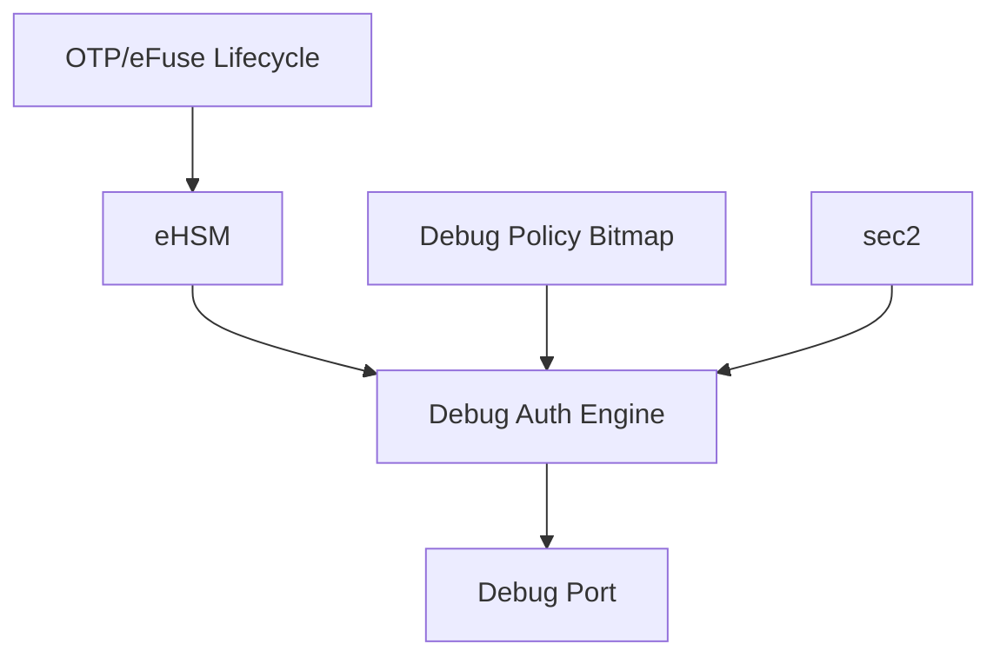
```mermaid
graph TD
    OTP[OTP/eFuse Lifecycle]
    EH[eHSM]
    DBG[Debug Auth Engine]
    S2[sec2]
    PORT[Debug Port]
    POL[Debug Policy Bitmap]

    OTP --> EH
    EH --> DBG
    POL --> DBG
    DBG --> PORT
    S2 --> DBG
```

### 9.3 时序图
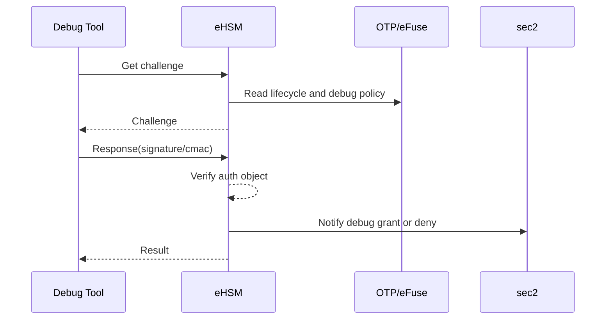
```mermaid
sequenceDiagram
    participant Tool as Debug Tool
    participant EH as eHSM
    participant OTP as OTP/eFuse
    participant S2 as sec2

    Tool->>EH: Get challenge
    EH->>OTP: Read lifecycle and debug policy
    EH-->>Tool: Challenge
    Tool->>EH: Response(signature/cmac)
    EH-->>EH: Verify auth object
    EH->>S2: Notify debug grant or deny
    EH-->>Tool: Result
```

### 9.4 生命周期统一模型

| 生命周期 | 含义 | 调试策略 | 启动策略 |
|---|---|---|---|
| `TEST` | 产测态 | 允许较高调试权限 | 可安全/非安全启动 |
| `DEVE` | 开发态 | 允许开发调试 | 可安全/非安全启动 |
| `MANU` | 板级开发/工程生产态 | 有限调试 | 优先安全启动 |
| `USER` | 量产态 | 严格禁用或最小授权调试 | 强制安全启动 |
| `RMA` | 返修态 | 经授权后有限开放 | 仅救援和受控启动 |
| `DEST` | 销毁态 | 不允许调试 | 不允许正常启动 |

### 9.5 调试位图与范围

建议定义 `debug_policy_bitmap`：

| Bit | 名称 | 含义 |
|---|---|---|
| `0` | `DBG_UART_LOG` | 允许安全日志输出 |
| `1` | `DBG_JTAG_SOC` | 允许 SoC JTAG |
| `2` | `DBG_JTAG_EHSM` | 允许 eHSM 调试 |
| `3` | `DBG_MEM_READ` | 允许受控内存读 |
| `4` | `DBG_MEM_WRITE` | 允许受控内存写 |
| `5` | `DBG_REG_ACCESS` | 允许寄存器访问 |
| `6` | `DBG_TRACE` | 允许 trace |
| `7` | `DBG_PATCH_LOAD` | 允许 patch 装载 |
| `8` | `DBG_NONSEC_BOOT` | 允许非安全启动 |
| `9` | `DBG_OTP_RW` | 允许 OTP/eFuse 调试读写 |
| `10` | `DBG_RMA_RECOVERY` | 允许返修恢复 |
| `11:31` | `RSV` | 保留 |

### 9.6 生命周期切换规则
1. 生命周期切换必须由 eHSM 执行。
2. USER 到 RMA 必须经过授权链和审计记录 `[ASSUMED]`。
3. DEST 为单向终态，不允许回退。
4. 非安全启动能力不得在 USER 态保留。

## 10. 板级安全设计
### 10.1 当前状态
板级专项资料尚未单独提供，因此本章以约束和基线中的通用口径为基础展开。涉及板级真实拓扑、BMC 固件职责、OOB-MCU 细节和 sideband 协议的地方，均显式标注 `[ASSUMED]` 或 `[TBD]`。

### 10.2 设计要求
- BMC/OOB/sideband 属于板级高权限管理参与者，但不属于片内 Root of Trust。
- 板级通道可参与上电、更新、状态采集和恢复，但不得绕过 eHSM/SEC 放行片内固件执行。
- 若引入板级绑定，应与设备身份和生命周期协调。

来源追踪：`02_baseline.md`，`01_constraints.md` 缺失输入处理。

### 10.3 架构图
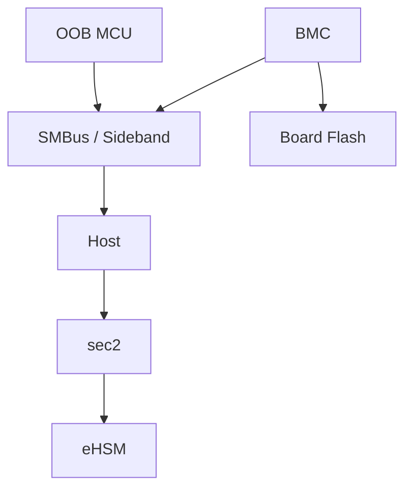
```mermaid
graph TD
    BMC[BMC]
    OOB[OOB MCU]
    SMB[SMBus / Sideband]
    HOST[Host]
    S2[sec2]
    EH[eHSM]
    BF[Board Flash]

    BMC --> SMB
    OOB --> SMB
    SMB --> HOST
    HOST --> S2
    S2 --> EH
    BMC --> BF
```

### 10.4 时序图
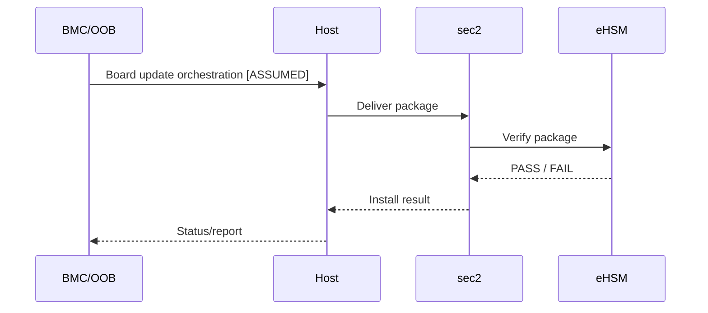
```mermaid
sequenceDiagram
    participant BMC as BMC/OOB
    participant H as Host
    participant S2 as sec2
    participant EH as eHSM

    BMC->>H: Board update orchestration [ASSUMED]
    H->>S2: Deliver package
    S2->>EH: Verify package
    EH-->>S2: PASS / FAIL
    S2-->>H: Install result
    H-->>BMC: Status/report
```

### 10.5 板级信任模型

| 板级实体 | 当前定位 | 可做 | 不可做 |
|---|---|---|---|
| BMC | 板级管理者 | 协调更新、收集状态、发起管理请求 | 直接替代 eHSM 作签名/版本裁决 |
| OOB MCU | 带外控制者 `[ASSUMED]` | 电源/复位/状态协同 | 放行未验证固件 |
| SMBus/Sideband | 管理路径 | 传递状态、命令、升级辅助 | 绕过 SoC 内验证链 |
| Board Flash | 板级存储实体 `[ASSUMED]` | 存放板级固件/元数据 | 作为片内镜像可信性最终依据 |

### 10.6 板级绑定
推荐采用可选板级绑定对象：

| 字段 | 用途 | 状态 |
|---|---|---|
| `board_vendor_id` | 板厂识别 | `[ASSUMED]` |
| `board_model_id` | 板型识别 | `[ASSUMED]` |
| `board_serial_hash` | 板序列哈希 | `[ASSUMED]` |
| `board_policy_hash` | 板级策略摘要 | `[ASSUMED]` |

说明：
- 当前不强制要求板级绑定成为启动前置条件。
- 若后续板级资料确认需要，建议仅把板级绑定用于证明和策略附加条件，而不是替代片内 Root of Trust。

## 11. 内外部接口设计
### 11.1 设计要求
- SoC 到 eHSM 的关键安全服务统一走 Mailbox。
- Host 外部接口当前只冻结访问控制规则，不冻结最终外部协议字段。
- 关键结构必须可直接映射到驱动或固件实现。

来源追踪：`C-INTF-001`、`C-HOST-001`、`C-UPDATE-002`。

### 11.2 架构图
```mermaid
graph TD
    HOST[Host]
    MIRAM[Management IRAM]
    S2[sec2]
    MB[Mailbox]
    EH[eHSM]
    SHM[Shared Buffer]

    HOST --> MIRAM
    MIRAM --> S2
    S2 --> SHM
    S2 --> MB
    MB --> EH
    EH --> SHM
```

### 11.3 时序图
```mermaid
sequenceDiagram
    participant S2 as sec2
    participant MB as Mailbox
    participant EH as eHSM
    participant SHM as Shared Buffer

    S2->>SHM: Write request payload
    S2->>MB: Ring command doorbell
    MB->>EH: Notify request
    EH->>SHM: Read payload
    EH-->>SHM: Write response
    EH-->>MB: Raise response interrupt
    MB-->>S2: Notify completion
```

### 11.4 Mailbox 通用头

建议统一头 `ngu800_mailbox_hdr`：

| 偏移 | 字段 | 长度 | 说明 |
|---|---|---|---|
| `0x00` | `magic` | 4B | `NMBX` |
| `0x04` | `hdr_ver` | 1B | 头版本 |
| `0x05` | `cmd_id` | 1B | 命令号 |
| `0x06` | `flags` | 2B | 请求/响应、同步/异步 |
| `0x08` | `txn_id` | 4B | 事务号 |
| `0x0C` | `hdr_len` | 2B | 头长度 |
| `0x0E` | `status` | 2B | 响应状态 |
| `0x10` | `payload_len` | 4B | 载荷长度 |
| `0x14` | `payload_addr` | 8B | 共享缓冲区地址 |
| `0x1C` | `rsv` | 4B | 保留 |

`status` 推荐编码：
- `0x0000`：成功
- `0x0001`：参数错误
- `0x0002`：鉴权失败
- `0x0003`：版本回滚
- `0x0004`：生命周期不允许
- `0x0005`：地址非法
- `0x0006`：验签失败
- `0x0007`：解密失败
- `0x0008`：内部错误

### 11.5 命令表

| `cmd_id` | 命令 | 请求方 | 响应方 | 说明 |
|---|---|---|---|---|
| `0x01` | `VERIFY_IMAGE` | `sec1`/`sec2` | eHSM | 验签、可选解密、版本比较 |
| `0x02` | `HASH_DATA` | `sec1`/`sec2` | eHSM | 哈希服务 |
| `0x03` | `SIGN_DATA` | `sec2` | eHSM | 证明或认证签名 |
| `0x04` | `GET_RANDOM` | `sec1`/`sec2` | eHSM | 随机数 |
| `0x05` | `READ_COUNTER` | `sec2` | eHSM | 计数器读取 |
| `0x06` | `INCREASE_COUNTER` | `sec2` | eHSM | 防回滚更新 |
| `0x07` | `GET_CHALLENGE` | `sec2` | eHSM | 调试 challenge |
| `0x08` | `DEBUG_AUTH` | `sec2`/debug agent | eHSM | 调试授权 |
| `0x09` | `CHANGE_LIFECYCLE` | 制造/RMA agent `[ASSUMED]` | eHSM | 生命周期切换 |
| `0x0A` | `READ_OTP` | 制造/调试态 agent | eHSM | 受生命周期限制 |
| `0x0B` | `WRITE_OTP` | 制造/调试态 agent | eHSM | 受生命周期限制 |

### 11.6 Verify Image 结构

建议载荷 `ngu800_verify_image_req`：

| 偏移 | 字段 | 长度 | 说明 |
|---|---|---|---|
| `0x00` | `image_type` | 2B | 镜像类别 |
| `0x02` | `alg_suite` | 2B | 算法套件 |
| `0x04` | `flags` | 4B | 校验/解密/升级等 |
| `0x08` | `image_addr` | 8B | 镜像输入地址 |
| `0x10` | `image_size` | 4B | 输入长度 |
| `0x14` | `image_out_addr` | 8B | 解密或复制输出地址 |
| `0x1C` | `expected_load_region` | 4B | 目标区域编号 |
| `0x20` | `key_slot_id` | 2B | 指定槽位，可为自动 |
| `0x22` | `lifecycle_mask` | 2B | 允许的生命周期 |
| `0x24` | `min_version_ctr_off` | 4B | 头内版本字段偏移 |
| `0x28` | `policy_digest_off` | 4B | 头内策略摘要偏移 `[ASSUMED]` |

响应 `ngu800_verify_image_rsp`：

| 字段 | 长度 | 说明 |
|---|---|---|
| `result` | 4B | 0 成功，其他失败 |
| `measured_digest_len` | 2B | 摘要长度 |
| `measured_digest` | 32B / 48B | 实际摘要 |
| `used_key_slot` | 2B | 实际使用槽位 |
| `new_version_ok` | 1B | 版本是否合法 |
| `image_plain_size` | 4B | 明文长度 |

### 11.7 外部访问控制规则

| 发起方 | 资源 | 允许级别 | 规则 |
|---|---|---|---|
| Host | 管理子系统 IRAM 镜像缓冲 | 受控写 | 仅允许写入 `sec2` 和后续固件指定窗口 |
| Host | 管理子系统 IRAM | 受控写 | 仅允许写入待验证镜像区 |
| Host | eHSM 私有内存 | 禁止 | 无直接访问 |
| `sec1` | Mailbox | 允许 | 仅安全服务请求 |
| `sec2` | Mailbox | 允许 | 仅安全服务请求 |
| 普通微核 | eHSM 私有内存 | 禁止 | 无直接访问 |
| BMC/OOB | 片内执行放行路径 | 禁止 | 不得绕过 `sec2` / eHSM |

## 12. 制造、灌装、部署与 RMA
### 12.1 设计要求
- 制造与灌装必须完成密钥、证书、生命周期和计数器基线初始化。
- 生产阶段操作尽量与 eHSM 推荐方式对齐。
- RMA 必须受授权和审计约束。

来源追踪：`inputs_manifest.md` 中 `CHG-002`；`02_baseline.md`。

### 12.2 架构图
```mermaid
graph TD
    MFG[Manufacturing]
    EH[eHSM]
    OTP[OTP/eFuse]
    CERT[Cert Bundle]
    IMG[Golden Images]
    RMA[RMA Flow]

    MFG --> EH
    MFG --> OTP
    MFG --> CERT
    MFG --> IMG
    RMA --> EH
```

### 12.3 时序图
```mermaid
sequenceDiagram
    participant M as Manufacturing
    participant EH as eHSM
    participant OTP as OTP/eFuse
    participant S2 as sec2
    participant R as RMA Agent

    M->>EH: Install initial key/cert material
    EH->>OTP: Program lifecycle / verify keys / counters
    M->>S2: Load golden sec1/sec2 images
    R->>EH: Request RMA transition [ASSUMED]
    EH-->>R: Allow / deny
```

### 12.4 灌装交付项

| 交付项 | 内容 | 状态 |
|---|---|---|
| OTP/eFuse 配置清单 | 生命周期初值、UID、验证/加密/升级槽规划 | `[CONFIRMED]` 框架，位分配 `[TBD]` |
| Golden 镜像集 | `sec1`、`sec2`、基础微核固件 | `[CONFIRMED]` |
| 设备证书包 | Attestation/Debug 证书链 | `[ASSUMED]` |
| 生命周期策略文件 | TEST/DEVE/MANU/USER/RMA/DEST 权限矩阵 | `[CONFIRMED]` |
| 调试授权策略 | Debug bitmap 默认值和允许流程 | `[ASSUMED]` |

### 12.5 RMA 规则
1. RMA 进入必须经过授权。
2. RMA 态仅允许受控救援启动和故障分析。
3. 修复后必须重新回到量产安全状态 `[ASSUMED]`。
4. `[ASSUMED]` 如涉及客户数据，RMA 前应先执行敏感数据擦除。

## 13. 失败处理与异常场景
### 13.1 设计要求
- 所有关键失败都必须落到明确定义的状态机。
- 不得以“失败后继续执行未验证代码”的方式处理。
- 异常信息必须可被 BootROM、`sec1`、`sec2` 或 Host/BMC 读取到最小必要状态。

来源追踪：`C-BOOT-002`、`C-BOOT-005`、`C-UPDATE-001`。

### 13.2 架构图
```mermaid
graph TD
    ERR[Error Source]
    BR[BootROM]
    EH[eHSM]
    S1[sec1]
    S2[sec2]
    LOG[Error Log]
    SAFE[Safe Halt / Recovery]

    ERR --> BR
    ERR --> EH
    ERR --> S1
    ERR --> S2
    BR --> LOG
    EH --> LOG
    S1 --> LOG
    S2 --> LOG
    LOG --> SAFE
```

### 13.3 时序图
```mermaid
sequenceDiagram
    participant H as Host
    participant S2 as sec2
    participant EH as eHSM
    participant LOG as Error Log

    S2->>EH: Verify image
    EH-->>S2: FAIL(code)
    S2->>LOG: Record failure
    S2-->>H: Reject execution / report error
```

### 13.4 异常场景表

| 场景 | 检测点 | 处置 |
|---|---|---|
| `sec1` 验签失败 | BootROM/eHSM | 不跳转 `sec1`，记录并停机 |
| `sec2` 验签失败 | `sec1`/eHSM | 不启动 `sec2`，保留升级窗口 |
| 后续微核验签失败 | `sec2`/eHSM | 不释放对应微核 |
| 回滚镜像 | eHSM | 返回回滚错误码 |
| OTP/eFuse 写入失败 | eHSM | 停止制造或升级流程 |
| 调试鉴权失败 | eHSM | 保持关闭调试状态 |
| 生命周期非法切换 | eHSM | 拒绝并记录审计 |
| Mailbox 超时 | `sec1`/`sec2` | 超时重试一次，失败则进入错误处理 `[ASSUMED]` |

## 14. 风险、依赖、冻结项与开放问题
### 14.1 架构图
```mermaid
graph TD
    R[Current Risks]
    H1[Host Protocol Undefined]
    B1[Board Real Boundary Missing]
    E1[eFuse Fine Layout Missing]
    M1[Manufacturing/RMA Owner Missing]
    F1[Freeze-sensitive Items]

    R --> H1
    R --> B1
    R --> E1
    R --> M1
    R --> F1
```

### 14.2 时序图
```mermaid
sequenceDiagram
    participant Arch as Architecture
    participant Sec as Security
    participant Host as Host Team
    participant Board as Board Team
    participant MFG as Manufacturing

    Arch->>Sec: Freeze current baseline
    Sec->>Host: Request protocol definition
    Sec->>Board: Request board boundary inputs
    Sec->>MFG: Request provisioning/RMA owner
    Host-->>Sec: [TBD]
    Board-->>Sec: [TBD]
    MFG-->>Sec: [TBD]
```

### 14.3 风险与冻结表

| 项目 | 类型 | 当前状态 | 风险 | 后续动作 |
|---|---|---|---|---|
| Root of Trust 分层表述 | Freeze-sensitive | 已冻结 | 后续章节若混用术语会导致实现偏差 | 全文保持 BootROM/eHSM/FSP/sec1/sec2 一致口径 |
| `sec1` / `sec2` 模型 | Freeze-sensitive | 已冻结 | 地址和镜像头未细化时可能影响实现 | 在驱动和链接脚本阶段继续细化 |
| Host 外部协议 | 风险 | `[TBD]` | 无法冻结 SPDM/DOE/PLDM 字段 | 待 Host 需求输入 |
| 板级真实边界 | 风险 | `[ASSUMED]` | 板级攻击面可能与实际不一致 | 待 Board/BMC 资料输入 |
| eFuse 细化位分配 | 风险 | `[TBD]` | 影响 RTL/固件寄存器定义 | 需输出单独字段表 |
| 制造/RMA owner | 风险 | `[TBD]` | 审批链和责任不清 | 待制造/RMA 流程 owner 明确 |
| 双算法栈 | Freeze-sensitive | 已冻结 | 接口若只实现单栈会偏离方案 | 详设和实现都必须双栈并行 |

### 14.4 开放问题
1. `[TBD]` Host 外部协议最终承载 DOE / SPDM / PLDM 的边界如何分工。
2. `[TBD]` eFuse 最终 bit offset、field owner 和扩展字段表。
3. `[TBD]` 板级 BMC/OOB 的真实拓扑、权限和 sideband 流程。
4. `[TBD]` 制造阶段证书 owner、密钥灌装 owner、RMA 授权审批链。
5. `[ASSUMED]` A/B 升级和 recovery slot 方案是否作为量产强制要求。

## 15. 附录
### 15.1 功能到实现映射

| 功能 | 主要实现主体 | 次级实现主体 |
|---|---|---|
| `sec1` 验证 | eHSM | BootROM |
| `sec2` 验证 | eHSM | `sec1` |
| 其他固件验证 | eHSM | `sec2` |
| 升级计数器管理 | eHSM | `sec2` |
| 远程度量报告生成 | `sec2` | eHSM |
| 调试 challenge-response | eHSM | `sec2` |
| 生命周期切换 | eHSM | 制造/RMA agent |

### 15.2 生命周期状态表

| 状态 | 安全启动 | 非安全启动 | 调试 | OTP/eFuse |
|---|---|---|---|---|
| TEST | 允许 | 允许 | 较高权限 | 允许受控操作 |
| DEVE | 允许 | 允许 | 开发权限 | 允许受控操作 |
| MANU | 优先开启 | 限制 | 有限权限 | 允许制造操作 |
| USER | 强制开启 | 禁止 | 禁止或最小授权 | 只读/受限 |
| RMA | 受控开启 | 不建议 | 经授权有限开放 | 受控 |
| DEST | 禁止正常启动 | 禁止 | 禁止 | 擦除后不可恢复 |

### 15.3 回滚计数器建议表

| Counter | 保护对象 | 推荐位宽 | 说明 |
|---|---|---|---|
| `CTR_SEC1` | `sec1` | 128bit | 启动级关键镜像 |
| `CTR_SOC_RUNTIME` | `sec2` 和其他运行期 FW | 128bit | SoC 运行期域 |
| `CTR_PATCH` | Patch | 64bit / 128bit | Patch 频繁度较高 |
| `CTR_DEBUG_POLICY` | 调试策略版本 | 64bit [ASSUMED] | 仅在策略需版本化时使用 |

### 15.4 访问控制汇总

| 主体 | 资源 | 访问 |
|---|---|---|
| BootROM | `sec1` 镜像装载路径 | 读/跳转 |
| eHSM | OTP/eFuse、密钥、计数器 | 完整受控访问 |
| `sec1` | Mailbox、下载缓冲 | 受控访问 |
| `sec2` | Mailbox、管理 IRAM、度量表 | 受控访问 |
| Host | 管理 IRAM 指定窗口 | 受控写 |
| 普通微核 | 仅自身加载后运行区 | 最小访问 |

### 15.5 来源追踪摘要

| 关键结论 | 追踪来源 |
|---|---|
| BootROM 不是首个密码学验证者 | `C-BOOT-001`, `C-BOOT-002`, `02_baseline.md` |
| `sec1` / `sec2` 为两级固件模型 | `C-BOOT-004`, `CF-001`, `02_baseline.md` |
| Host 无执行放行权 | `C-HOST-001`, `CF-002`, `02_baseline.md` |
| FSP 指 eHSM 内部核 | `C-TRUST-003`, `CF-003`, `inputs_manifest.md` |
| 双算法栈必须并行支持 | `C-ALG-001`, `CHG-002`, `02_baseline.md` |
| eFuse 以 eHSM 为基线、单控制器方案 | `C-KEY-001`, `inputs_manifest.md` |

### 15.6 文档就绪性声明
- 本文档已达到“进入实现分工、接口细化、评审冻结前准备”的就绪性。
- 第 11、10、12、14 章中的 `[ASSUMED]` 和 `[TBD]` 项是当前剩余的主要风险集中区。
- 后续如新增 `Host/BMC/OOB/eFuse` 细化资料，应先回写 `inputs_manifest.md`，再按流程更新 `01_constraints.md`、`02_baseline.md` 和本文档。

### 15.7 架构图
```mermaid
graph TD
    APP1[Implementation Mapping]
    APP2[Lifecycle Table]
    APP3[Counter Table]
    APP4[Access Summary]
    APP5[Traceability]
    READY[Readiness Statement]

    APP1 --> READY
    APP2 --> READY
    APP3 --> READY
    APP4 --> READY
    APP5 --> READY
```

### 15.8 时序图
```mermaid
sequenceDiagram
    participant A as Appendix Tables
    participant T as Traceability
    participant R as Readiness Review

    A->>R: Provide implementation reference
    T->>R: Provide source trace summary
    R-->>R: Confirm document readiness
```
