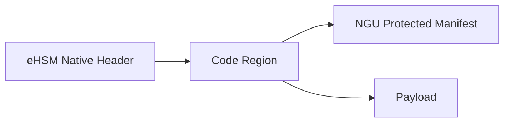

# Boot Image / FW Header 模板

## 1. Image Classes

- SEC1
- SEC2
- PM / RAS / Codec
- Recovery
- Sensitive blob if applicable

## 2. eHSM Native Header Rule

- SEC1 / SEC2 physical verification/decrypt container MUST use eHSM native secure boot image header.
- NGU MUST NOT define a second physical verification header.
- eHSM `Image_Type` keeps eHSM TRM semantics.
- NGU `SEC1 / SEC2 / PM / RAS / Codec / Recovery` image type goes into NGU protected manifest.

## 3. NGU Protected Manifest

Describe manifest semantics:

- `ngu_image_type`
- `security_policy_flags`
- `rollback_domain`
- `measurement_slot`
- `lifecycle_mask`
- `expected_algorithm_profile`
- `payload_digest`

Keep bit-level ABI as `[TBD]` unless backed by accepted CR / owner decision.

## 4. Firmware Package Layout Diagram

Include Mermaid layout:



## 5. Platform-Side Build Flow

Include steps:

1. read payload / image class / product profile
2. generate NGU protected manifest
3. build Code region as `manifest + payload`
4. select eHSM boot/upgrade profile
5. generate eHSM native package
6. produce manifest dump / source-conformance report / policy report / golden vector

## 6. Device-Side Verify/Decrypt Flow

Include steps:

1. BootROM / SEC locates package and checks address whitelist
2. BootROM / SEC calls `bl_verify_image` / `soc_verify` or owner-confirmed equivalent
3. eHSM checks native header, signature, rollback and decrypt output
4. BootROM / SEC parses NGU manifest only after eHSM PASS
5. BootROM / SEC performs policy check, measurement and controlled release

## 7. Deprecated Historical Format

State explicitly:

```text
header + Signed Region + signature + wrapped_cek + enc_payload
```

is historical flow intent only, not final NGU800 physical wire/storage ABI.

## 8. TBD Guardrails

Do not mark the following as `[CONFIRMED]` unless backed by accepted CR / owner decision:

- manifest bit-level ABI
- exact eHSM key ID
- exact OTP/control bit
- per-image rollback counter
- per-image CEK / wrapped CEK
- image packager CLI / golden vector format
