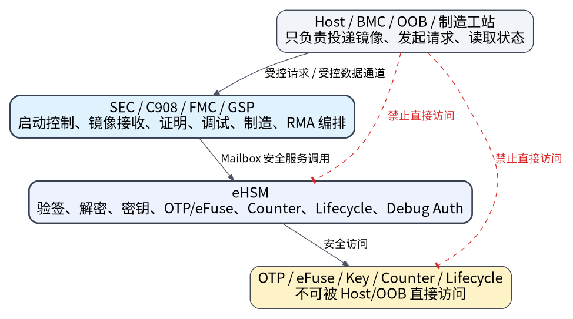
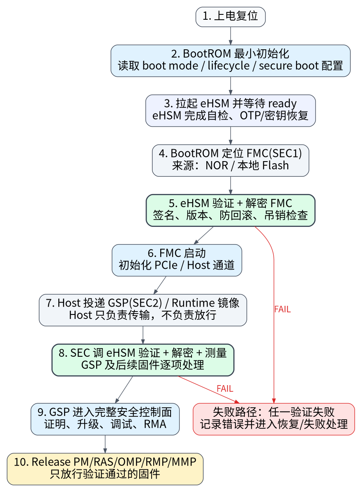
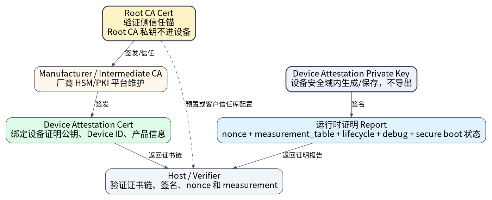
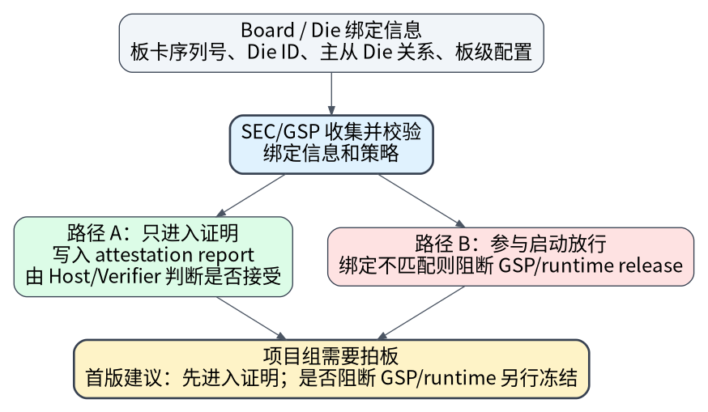
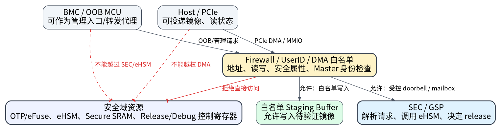
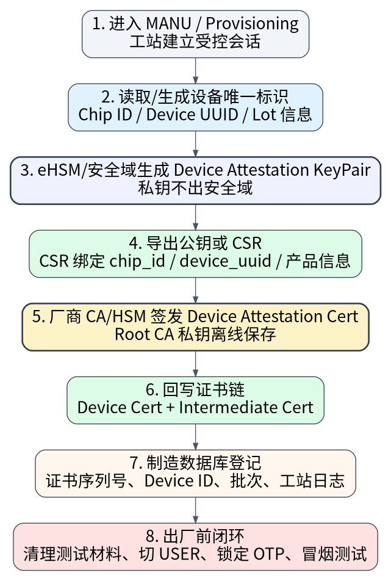

# NGU800 安全方案功能范围与当前结论

## 1. 本方案涉及的安全功能


先把安全功能范围说清楚，避免后续各团队只从自己负责的模块理解这套方案。当前安全方案建议按下面这些功能点来收敛。这里列的是“方案需要覆盖的安全能力”，不是说每一项都已经完成实现，也不是每一项都必须在首版做到最复杂形态；但这些能力需要在方案、硬件边界、接口契约、制造流程和验证计划里有明确归属。

| 功能点 | 当前口径 | 主要涉及模块 | 是否需要项目组拍定 |
|---|---|---|---|
| 系统 Root of Trust 与安全边界 | eHSM 作为唯一 RoT，BootROM 只做最小编排，SEC 作为安全控制面 | eHSM / BootROM / SEC / OTP-eFuse | 需要确认总体路线 |
| 安全启动 | FMC/SEC1 本地 Flash 获取，执行前由 eHSM 验签、解密、防回滚；GSP/SEC2 和后续固件由 Host 投递但必须经 SEC/eHSM 验证后 release | BootROM / FMC / GSP / eHSM / Host | 需要冻结主流程 |
| 非安全启动 / Debug Boot | 保留给 TEST、DEVE、bring-up 和问题定位，USER 态默认关闭或强约束 | BootROM / Strap / lifecycle / debug | 需要明确生命周期策略 |
| 固件签名、加密与镜像包 | FMC/GSP 强制签名+加密；runtime 镜像 USER/PROD 默认签名+加密；固件包尽量复用 eHSM native header + NGU protected manifest | Packager / BootROM / SEC / eHSM / Host | 需要冻结工具 ABI 和例外白名单 |
| 防回滚与吊销 | 固件版本、防回滚、signer/revoke 策略由 eHSM counter/OTP/control field 支撑 | eHSM / OTP-eFuse / 固件升级工具 | 需要冻结 counter 和 rollback domain |
| Host 固件投递与 release 控制 | Host 只负责投递镜像、配置描述符、读状态；不能控制 release、不能改 secure boot/debug/lifecycle | Host driver / PCIe / SEC / Firewall | 需要冻结 DMA/MMIO 权限 |
| 微核固件分发与运行态校验 | PM/RAS/OMP/RMP/MMP 等后续固件由 GSP 统一验证、测量、分发和 release | GSP / eHSM / 各微核 / 管理子系统 | 需要确认各微核范围和顺序 |
| 设备身份与证书链 | 制造阶段生成或绑定设备证明密钥，签发 Device Attestation Cert，运行时返回证书链证明“设备是谁” | eHSM / 制造工站 / CA-HSM / GSP / Host | 需要冻结 PKI 和证书存储方式 |
| 远程度量证明 | GSP 维护 measurement_table，组合 secure boot、lifecycle、debug、image protection 等状态并签名返回 | GSP / eHSM / SPDM / Host verifier | 需要冻结 report 字段 |
| 安全升级与恢复 | 固件升级必须验签、解密、防回滚；Recovery 镜像使用独立 signer 和独立授权策略 | GSP / eHSM / Host / RMA 工具 | 需要拍定 recovery 策略 |
| 生命周期管理 | TEST/DEVE/MANU/USER/DEBUG-RMA/DEST 对应不同启动、调试、灌装和锁定策略 | OTP-eFuse / eHSM / BootROM / 制造 | 需要流片前冻结 |
| 安全调试与 RMA | USER 默认关闭 JTAG/debug；RMA 通过 challenge-response、scope、expire、audit 临时开启 | eHSM / SEC / JTAG-MUX / BMC-OOB / RMA 工具 | 需要冻结 scope 和硬件控制权 |
| 制造灌装与出厂锁定 | Root/anchor、key slot、counter、设备证书链、test key 清理、USER 锁定和审计必须形成闭环 | 制造工站 / eHSM / OTP-eFuse / CA-HSM / 质量系统 | 需要作为量产前必备流程 |
| 访问控制与硬件隔离 | 通过 Firewall/UserID/secure register/DMA 白名单隔离 Host、管理子系统、DMA 和安全域 | NoC / Firewall / PCIe / SEC / eHSM | 强硬件依赖，必须流片前确认 |
| Board/OOB/BMC 管理安全 | BMC/OOB 可作为管理和代理入口，但不进入 RoT，不能绕过 SEC/eHSM 直接操作高权限资源 | OOB MCU / BMC / GSP / board logic | 需要确认代理边界 |
| 密码服务与算法策略 | 支持国密和国际算法栈；签名验签、HASH、加解密、随机数、KDF、密钥管理等由 eHSM 提供 | eHSM / SEC adapter / 工具链 | 需要确认算法 profile 和客户口径 |
| 安全事件、错误和审计 | secure boot fail、decrypt fail、rollback fail、debug open、RMA state、provisioning 结果需要可记录、可上报、可追溯 | BootROM / GSP / eHSM / Host / 制造数据库 | 需要冻结错误码和日志字段 |

从首版范围和策略裁剪角度看，这些功能点可以分成三类：

| 类型 | 功能点 | 处理口径 |
|---|---|---|
| 首版必须闭环 | RoT、安全启动、固件验签/解密、防回滚、Host 边界、Firewall/UserID、制造灌装、USER 锁定 | 作为首版基本盘，进入冻结清单和验证计划 |
| 首版建议具备基础能力 | 设备证书链、远程度量证明、安全升级、RMA 授权、错误审计 | 首版可做基础能力，但接口和数据结构要预留 |
| 可按产品策略裁剪 | runtime 镜像是否全部加密、板卡/Die 绑定信息是只写入证明报告还是直接影响 GSP/runtime 启动、完整 X.509/SPDM chain 首版复杂度、BMC/OOB 可以转发哪些受控请求 | 需要明确裁剪边界和后续兼容方式 |

建议先把这张功能点清单过一遍：哪些属于 NGU800 首版必须承诺，哪些属于方案预留，哪些可以作为后续版本增强。否则不同团队会出现理解偏差：硬件认为只是接一个 eHSM，软件认为只是做 secure boot，制造认为只是烧 key，Host 认为只是传固件；但实际安全方案需要把这些功能点串成闭环。

## 2. 当前方案和结论情况

### 2.1 总体结论

目前安全方案已经从“技术细节讨论”收敛成一条比较清晰的主线：**eHSM 作为片上唯一 Root of Trust，BootROM 只做最小启动编排，SEC/C908 作为安全控制面，Host、BMC/OOB、管理子系统都只能作为外部通道或管理入口，不进入信任根。**

这套方案现在可以作为项目组继续推进的总体方向。接下来需要尽快拍定的，不是 mailbox 每个字段、manifest 每个 bit 这类实现细节，而是会影响 RTL、BootROM、eFuse/OTP、制造灌装、调试策略和客户接口的边界性决策。

我建议这次评审重点解决三件事：

| 要解决的问题 | 需要形成的结论 |
|---|---|
| 方案主线是否确认 | 是否按“BootROM 编排 + SEC 控制 + eHSM 安全服务”继续推进 |
| 硬件相关边界是否确认 | eHSM、OTP/eFuse、Firewall/UserID、JTAG、DMA、staging buffer、debug MUX 等是否按当前安全边界冻结 |
| 流片前必须定什么 | 制造灌装、设备证书链、生命周期、RMA、固件保护、证明报告、板卡绑定/OOB 策略是否进入冻结清单 |

一句话概括：**总体路线可以定，但流片前必须把硬件安全边界、设备身份与证书链、制造灌装流程和若干产品策略项拍定，否则后面 BootROM、固件、工具链、验证和生产流程都会反复返工。**

### 2.2 总体架构

{width=86%}

当前方案不是让每个模块各自做安全判断，而是把安全裁决集中到 SEC/eHSM 这条路径上。

```text
Host / BMC / OOB / 工站
        │
        │ 只负责投递镜像、发起请求、读取状态
        ▼
SEC / C908 / FMC / GSP
        │
        │ 负责启动控制、镜像接收、证明、调试、制造、RMA 编排
        ▼
eHSM
        │
        │ 负责验签、解密、密钥、OTP/eFuse、counter、lifecycle、debug auth
        ▼
OTP / eFuse / Key / Counter / Lifecycle
```

这套分工的好处是：BootROM 保持简单，Host 和 BMC/OOB 不进入信任链，安全相关动作都能被 SEC/eHSM 统一控制、统一审计、统一证明。

| 角色 | 当前口径 | 需要避免的错误理解 |
|---|---|---|
| BootROM | 最小启动编排者 | 不是密码学根，不负责复杂验签/解密 |
| eHSM | 唯一 Root of Trust 和密码服务后端 | 不是普通加速器，而是 key、counter、lifecycle、debug auth 的安全根 |
| SEC/C908 | 安全控制面 | 不只是普通 MCU，而是启动、release、证明、debug/RMA 的收口点 |
| FMC/SEC1 | 第一级可变固件，本地 Flash 加载 | 不由 Host 下发 |
| GSP/SEC2 | 完整安全管理固件，Host 投递后由 SEC/eHSM 验证 | Host 只负责传输，不负责放行 |
| Host | 镜像投递和状态交互方 | 不可信，不参与信任链，不接触密钥 |
| BMC/OOB | 管理链路或代理入口 | 不作为 RoT，不能绕过 SEC/eHSM 做高权限动作 |

### 2.3 启动链



安全启动主线按下面的流程走：

```text
上电复位
  ↓
BootROM 做最小初始化
  ↓
读取 boot mode / lifecycle / secure boot 配置
  ↓
拉起 eHSM，并等待 eHSM ready
  ↓
BootROM 从 NOR / 本地 Flash 定位 FMC(SEC1)
  ↓
eHSM 对 FMC 做签名验证、解密、防回滚和吊销检查
  ↓
FMC 启动，完成 PCIe / Host 通道初始化
  ↓
Host 投递 GSP(SEC2)
  ↓
FMC/GSP 调 eHSM 验证、解密 GSP
  ↓
GSP 进入完整安全控制面
  ↓
Host 投递 PM / RAS / OMP / RMP / MMP 等后续固件
  ↓
GSP 调 eHSM 验证、测量，并按策略 release 对应微核
```

这里有几个关键点需要保持一致：

| 项目 | 当前结论 |
|---|---|
| FMC/SEC1 获取方式 | NOR / 本地 Flash，不由 Host 下发 |
| FMC/SEC1 保护 | 安全启动下强制签名 + 加密 |
| GSP/SEC2 获取方式 | Host 投递，但必须由 FMC/GSP 调 eHSM 验证后才能执行 |
| GSP/SEC2 保护 | 安全启动下强制签名 + 加密 |
| 后续 runtime 固件 | Host 投递，GSP 调 eHSM 验证和测量后 release |
| 非安全启动 | 可保留给 bring-up / TEST / DEVE，但 USER 态默认应关闭或强约束 |

### 2.4 固件保护策略

固件保护策略建议按“默认强保护，例外白名单”的方式推进。

| 镜像类型 | 当前建议 | 是否还需要拍定 |
|---|---|---|
| FMC/SEC1 | 强制签名 + 加密 | 已基本定 |
| GSP/SEC2 | 强制签名 + 加密 | 已基本定 |
| PM/RAS/OMP/RMP/MMP 等 runtime 镜像 | USER/PROD 默认签名 + 加密 | 需要确认是否允许个别 signature-only 例外 |
| Recovery / Rescue 镜像 | 独立 signer / trust anchor / rollback domain | 需要冻结 |
| Patch / Update 包 | 复用 eHSM native package + NGU protected manifest | 工具 ABI 和 golden vector 需要冻结 |

建议：除非产品明确说明某类镜像完全不敏感，否则首版不要轻易开放 signature-only。即使允许例外，也要进入产品白名单，并在 attestation report 里体现出来，避免后续客户质疑“为什么某些固件没有加密”。

### 2.5 设备身份和证书链



这里需要补充一个单独结论：证书链不是启动链本身，也不是每一级固件都生成一张证书。当前建议把“设备是谁”和“当前运行状态是否可信”分开处理。

| 内容 | 当前建议 | 说明 |
|---|---|---|
| 证书链 | 静态设备身份证书链 | 用来证明这颗芯片/这张卡是谁 |
| 度量链 | measurement_table + 运行时证明报告 | 用来证明当前启动了哪些固件、处于什么安全状态 |
| 签名主体 | 设备证明私钥 / attestation key | 用于 SPDM Challenge 响应和证明报告签名 |
| 证书返回 | 运行时由 GSP/SEC 安全域向 Host/Verifier 返回 | Host 负责验证，不参与证书生成和密钥持有 |

证书链建议由三层组成：

| 层级 | 谁持有/维护 | 作用 |
|---|---|---|
| Root CA Cert | 我司离线维护；Root CA 私钥不进设备 | 整条设备证书链的最终信任锚，由 Host/Verifier 预置或通过客户信任库配置 |
| Manufacturer CA / Intermediate CA | 厂商 HSM/PKI 平台维护 | 用于签发设备证明证书，是否设置中间 CA 取决于内部 PKI 体系 |
| Device Attestation Cert | 制造阶段签发后写入设备安全存储或安全分区 | 绑定设备证明公钥、chip_id/device_uuid/产品信息，运行时随证明流程返回 |

按这个口径，设备证明私钥不应该出设备安全域；Root CA 私钥也不应该进入设备或生产工站普通环境。制造阶段只导出设备证明公钥或 CSR，由厂商 HSM/CA 签发 Device Attestation Cert，再把证书链产物回写到设备侧安全存储。

运行时认证可以按下面的关系理解：

```text
设备侧：Device Attestation Private Key 签名 Challenge / Report
        │
        ├─ 返回 Device Attestation Cert + Intermediate CA Cert（如有）
        └─ 返回 measurement_table / lifecycle / debug / secure boot 状态

验证侧：使用 Root CA Cert 验证证书链
        │
        ├─ 验证 report 签名和 nonce
        ├─ 检查证书有效期/吊销/产品身份
        └─ 检查 measurement 与安全状态是否符合策略
```

这里还需要项目组拍定一点：首版是强制支持完整 X.509/SPDM 风格证书链，还是先支持简化证书/证书哈希并预留完整证书链。我的建议是面向客户认证和长期演进，至少在方案和制造流程上按完整证书链设计；如果首版实现要裁剪，也要明确裁剪边界和后续兼容方式。

### 2.6 板级、OOB/BMC 和 Die 相关策略

板级相关策略建议放在总体方案里统一说明，不作为单独的安全主线来拆开。这里的核心口径是：**BMC/OOB、板级 MCU、管理子系统、双 Die 连接关系都可以参与管理流程和状态上报，但不能因此绕过 SEC/eHSM 的安全裁决。**

对于板卡、Die 或模组绑定关系，建议按更直白的方式理解：系统可以读取板卡序列号、Die ID、主从 Die 关系、模组配置等信息，并把这些信息写入证明报告和审计日志，用来让 Host、客户验证侧或运维系统判断“当前设备组合是否符合预期”。如果项目希望在绑定不匹配时直接阻断 GSP 或 runtime 固件启动，也可以做，但这会影响板卡替换、返修、双 Die 组合、产线测试和现场运维，因此需要作为产品策略单独拍定。当前建议是：**首版至少进入证明报告和审计；是否作为 GSP/runtime release 的硬阻断条件，需要在流片前给出明确策略。**



对于 OOB/BMC，建议按“受控转发入口”来定位。BMC/OOB 可以承载固件升级请求、设备证明请求、RMA 请求、制造工站请求或板级运维请求，但它只是通道和代理入口，不是信任根。它不能持有设备私钥，不能直接写 OTP/eFuse，不能直接打开 JTAG/debug，不能直接改写flash，不能直接修改 lifecycle，也不能直接 release 任意微核。所有高权限动作必须回到 SEC/GSP，由 SEC/GSP 再调用 eHSM 完成认证、鉴权、验签、解密、计数器更新、debug 授权或审计记录。



板级和 Die 相关待确认点可以收敛成下面几项：

| 事项 | 当前建议 | 不拍定的影响 |
|---|---|---|
| 板卡/Die 绑定信息怎么用 | 至少进入证明报告和审计；是否阻断 GSP/runtime release 由产品策略决定 | 影响双 Die 组合、板卡替换、返修和客户验证策略 |
| BMC/OOB 能转发哪些请求 | 固件升级、设备证明、RMA、制造灌装等请求可以转发，但必须走 SEC/GSP 鉴权和审计 | 范围过大可能绕过安全链，范围过小会影响板级管理和产线流程 |
| BMC/OOB 自身安全要求 | OOB 自身需要有独立安全启动和升级策略，不能依赖 device 证明自身可信 | OOB 被攻破后可能成为高权限请求入口 |
| 板级 JTAG/MUX/CPLD 控制权 | USER 态默认关闭，RMA 只能按授权 scope 临时打开 | 板级直通调试可能绕过 secure boot 和密钥保护 |
| Power/reset/PG/FAULT 事件 | 与安全启动、RMA、attestation 相关的事件建议纳入安全状态和日志 | 异常复位或电源事件可能造成状态不可追溯 |
| 双 Die 主从关系 | 主从 Die 身份、UserID、固件分发顺序和证明汇总方式要明确 | 影响多 Die 产品启动、证明和故障定位 |

这部分放在总体方案阶段先讲清楚即可，后续实现时再展开到具体接口、状态位、错误码和验证 case。

## 3. 还需要进一步确认什么

下面这些不是普通实现细节，而是会影响产品口径、硬件设计、量产流程或客户交付的事项。

| 编号 | 需要确认的事项 | 不确认的风险 | 建议口径 |
|---|---|---|---|
| 1 | runtime 镜像是否全部强制签名 + 加密 | 影响客户安全承诺和固件保护强度 | 默认全部签名+加密，例外走白名单 |
| 2 | Recovery / Rescue 镜像策略 | 返修入口可能变成绕过安全启动的后门 | 使用独立 signer、独立 rollback、独立授权流程 |
| 3 | 板卡/Die 绑定信息是只进入证明和审计，还是也作为 GSP/runtime 启动放行条件 | 影响双 Die、板级兼容和量产替换 | 首版建议进入证明，不默认阻断 FMC；是否阻断 GSP/runtime 需拍定 |
| 4 | SPDM report 字段范围 | 后续客户验收、运维证明和安全声明会受影响 | 必须覆盖 measurement、lifecycle、debug、secure boot、image protection |
| 4a | 设备证书链是否首版按完整 X.509/SPDM chain 落地 | 影响 Host/Verifier 对接、客户认证和制造 PKI 投入 | 建议按完整证书链设计；如首版裁剪，必须保留兼容路径 |
| 4b | 制造阶段 Device Attestation Cert 由谁签、证书放哪里 | 影响工站、HSM/CA、设备安全存储和出厂审计 | 由厂商 CA/HSM 签发，证书链写回设备安全存储并登记制造数据库 |
| 5 | OOB/BMC 是否允许作为制造灌装、升级、证明或 RMA 请求的转发入口 | 影响制造和板级管理链路安全 | 可以转发受控请求，但不能接触密钥、不能直接写 OTP/eFuse、不能直接打开 debug，必须认证和审计 |
| 6 | JTAG/debug scope 如何定义 | USER 态调试权限过大可能绕过安全链 | USER 默认关闭；RMA 按 challenge-response、scope、expire、audit 打开 |
| 7 | Host PCIe DMA 能访问哪些地址 | Host 不可信，DMA 如果越权会绕过软件安全 | 只允许写白名单 staging buffer |
| 8 | eFuse/OTP 字段和 eHSM key/counter 映射 | 一旦 RTL/制造冻结后很难改 | 以 eHSM 已定义字段为主，NGU 只做 logical alias |
| 9 | 固件包格式和工具链 ABI | BootROM、SEC、Host 工具、eHSM 适配会反复返工 | 冻结 manifest ABI、packager 参数、golden vector、错误码 |
| 10 | 制造阶段测试 key/test cert 清理动作 | 测试信任材料残留会影响量产安全 | MANU -> USER 前强制清理并审计 |
| 11 | RMA 完成后的状态恢复和证明 | 返修后设备状态不可证明 | RMA 后必须重新回到可证明的 USER/受控状态 |

## 4. 哪些对硬件设计有依赖

这些事项建议纳入硬件冻结检查表，不能期望后期单靠软件兜底。

| 硬件依赖 | 为什么必须流片前明确 | 需要项目组给出的结论 |
|---|---|---|
| eHSM 集成方式 | eHSM 是 RoT，接口错了会影响整个启动链 | 时钟/复位、ready/status、mailbox、SOC_MEM、DMA、错误中断、访问权限 |
| OTP/eFuse 规划 | root/key/counter/lifecycle/debug 都是不可逆配置 | 字段、lock bit、key slot、counter、读回策略、生命周期切换策略 |
| BootROM 与 eHSM 协同 | 决定 FMC 是否能在执行前验证/解密 | eHSM ready 等待、VERIFY_FMC 调用、失败处理、错误码、恢复入口 |
| Secure SRAM / staging buffer | Host 投递镜像和 eHSM 解密输出都依赖缓冲区 | Host 可写区、SEC/eHSM 专用区、解密输出区、是否 firewall 隔离 |
| Firewall / UserID | 这是 Host/DMA/管理子系统访问隔离的硬边界 | UserID 分配、region 划分、读写权限、隐藏错误、复位默认值 |
| Host PCIe DMA / MMIO | Host 是不可信输入源 | DMA 只能写白名单 buffer，不能碰 eHSM/OTP/Secure SRAM/release 寄存器 |
| Debug/JTAG/MUX/CPLD | 板级直通会绕过安全启动 | MUX 控制权、debug enable 归属、scope bitmap、RMA 打开流程 |
| 管理子系统/OOB/BMC | 涉及电源、复位、运维、升级和可能的制造代理 | OOB 可访问范围、reset/power 事件审计、OOB 自身安全启动要求 |
| 单 Die / 双 Die 支持 | 影响启动分发、Die 绑定、report 汇总 | 主从 Die UserID、跨 Die 固件分发、跨 Die 证明策略 |
| eHSM UTC / counter | 影响证书时效、防回滚和审计 | 是否接 32K/UTC、counter 数量和归属、证书有效期策略 |
| 错误和状态寄存器 | 影响失败诊断和 attestation | secure boot fail、decrypt fail、rollback fail、debug open、RMA state 如何上报 |

特别关注三项：**eFuse/OTP、Firewall/UserID、Debug/JTAG/MUX**。这三项一旦流片后发现边界不对，软件补救空间很小。

## 5. 制造、灌装、部署和 RMA 哪些要流片前确定

安全方案不能只覆盖启动，还必须覆盖“芯片怎么被生产出来、怎么进入量产态、返修时怎么打开、返修后怎么恢复”。这些流程如果不提前定，后面会出现硬件已经定了，但工站、证书、密钥、RMA 流程无法闭环的问题。

### 5.1 制造阶段要定的内容

| 环节 | 需要定什么 | 为什么要流片前定 |
|---|---|---|
| 初始生命周期 | TEST / DEVE / MANU / USER / DEBUG-RMA / DEST 的状态和切换规则 | 影响 eFuse/OTP 和调试权限设计 |
| Root/anchor 灌装 | root key、signer hash、device identity、attestation key/cert 如何生成或注入 | 影响 OTP/eFuse 字段、安全工站和设备身份体系 |
| 设备证书链 | Root CA / Intermediate CA / Device Attestation Cert 的生成、签发、回写和保存方式 | 影响 PKI/HSM、制造数据库、Host/Verifier 验证和客户交付 |
| 固件保护材料 | FW verify key、encrypt key、upgrade key、counter 如何映射 | 影响 eHSM key slot 和固件包制作 |
| 防回滚 | 每类镜像对应哪个 counter / version domain | 影响 eHSM counter 和升级策略 |
| 测试材料清理 | test key、test signer、test cert 如何清掉或失效 | 防止测试权限进入量产态 |
| USER 锁定 | MANU -> USER 前需要锁哪些 bit、关哪些 debug、冻结哪些策略 | 影响出厂安全状态 |


### 5.2 建议的制造流程口径

```text
芯片初测 / 板级 bring-up
  ↓
进入 MANU / provisioning 状态
  ↓
写入或生成设备唯一根材料
  ↓
配置 secure boot trust anchor / signer hash / key slot / counter
  ↓
生成设备证明公钥或 CSR
  ↓
厂商 CA/HSM 签发设备证书并回写
  ↓
写入量产固件保护策略和 debug 策略
  ↓
执行 secure boot / attestation / debug-close 检查
  ↓
清理测试 key / test cert / 临时权限
  ↓
切 USER，锁定 root/key/lifecycle/debug 相关字段
  ↓
生成出厂审计记录
```

### 5.3 制造阶段证书链怎么生成



制造阶段要把设备身份一次性做对。这里不是简单“烧一个证书”，而是要把设备唯一根、设备证明密钥、CSR、厂商 CA/HSM、证书回写、制造数据库和 USER 锁定串成一个闭环。

```text
进入 MANU / provisioning 状态
  ↓
设备侧生成或安装设备唯一根材料（HUK / UDS / Device Root Key）
  ↓
eHSM/安全域生成 Device Attestation KeyPair，私钥不可导出
  ↓
设备侧导出公钥或 CSR，CSR 绑定 chip_id / device_uuid / 产品型号 / 批次信息
  ↓
制造系统把 CSR 送到厂商 HSM / CA 平台
  ↓
厂商 CA/HSM 完成合法性检查、证书模板匹配、用途/有效期填充和 CA 签名
  ↓
输出 Device Attestation Cert，以及可选 Intermediate CA Cert
  ↓
工站把设备证书链写回设备安全存储或安全分区
  ↓
制造数据库登记 chip_id、cert serial、cert hash、批次、profile、lifecycle
  ↓
执行证书读取、SPDM/Challenge 冒烟测试和安全启动检查
  ↓
清理测试证书/测试 key/临时权限，切换 USER 并锁定
```

这一段建议在评审会上明确成下面几个结论：

| 事项 | 建议口径 | 需要谁确认 |
|---|---|---|
| 设备证明私钥来源 | 由 eHSM/设备安全域生成，或由设备唯一根派生；私钥不可导出 | 安全 / eHSM IP / 制造 |
| CSR 内容 | 至少绑定 chip_id、device_uuid、产品型号、批次或 profile | 安全 / 制造 / 质量 |
| 签发主体 | Device Attestation Cert 由厂商 CA/HSM 签发，Root CA 私钥离线保存 | 安全 / IT/PKI / 制造 |
| 证书保存 | 设备证书和中间证书写入设备安全存储或安全分区，运行时可由 SEC/GSP 返回 | 安全 / 固件 / 存储规划 |
| Host/Verifier 信任锚 | Root CA Cert 由 Host/Verifier 预置或客户信任库管理，不由设备生成 | Host / 客户接口 / 安全 |
| 制造数据库 | 登记 cert serial、cert hash、chip_id、批次、provision profile、lifecycle | 制造 / 质量 / 安全 |
| 出厂检查 | 至少做证书读取、证书链验证、Challenge 签名、secure boot 状态检查 | 制造 / 测试 / 安全 |
| 首版裁剪 | 如果首版不做完整 X.509 chain，需要明确替代格式和后续兼容路径 | 架构 / 安全 / 客户接口 |

这个流程和普通固件签名证书不同。固件签名证书/公钥主要回答“这个固件是不是我司签的”；设备证明证书主要回答“这颗设备是不是我司生产并完成安全灌装的设备”。两者不能混在一起，也不要让 Host 或 BMC/OOB 参与私钥生成和保存。

### 5.4 RMA 要定的内容

| RMA 环节 | 建议策略 |
|---|---|
| 进入 RMA | 必须经过厂商授权，不能通过普通 Host/BMC 请求直接进入 |
| 打开调试 | challenge-response 鉴权，限定 scope、限定时间、记录日志 |
| 数据保护 | 需要明确是否先擦除客户敏感数据，再开放更高权限调试 |
| 救援固件 | 只能加载厂商签名的 recovery/rescue 镜像 |
| 退出 RMA | 重新刷回量产固件，恢复 USER 或受控状态 |
| 返修后证明 | 重新生成或更新设备状态摘要，证明 debug 已关闭、固件和 lifecycle 合规 |

## 6. 流片前建议冻结的事项

我建议把下面这些作为流片前安全冻结项，不要留到软件阶段再讨论。

| 优先级 | 冻结项 | 责任接口 |
|---|---|---|
| 必须冻结 | eHSM 集成接口、ready/status、mailbox、SOC_MEM、错误中断 | RTL / 安全 / eHSM IP |
| 必须冻结 | OTP/eFuse 字段、key slot、counter、lifecycle、debug lock | RTL / 安全 / 制造 |
| 必须冻结 | BootROM 与 eHSM 的 FMC 验证/解密流程 | BootROM / 安全 / eHSM |
| 必须冻结 | Firewall/UserID/Host DMA/管理子系统访问白名单 | RTL / NoC / PCIe / 安全 |
| 必须冻结 | JTAG/debug MUX、scope bitmap、USER/RMA 调试策略 | RTL / 板级 / 安全 / 测试 |
| 必须冻结 | Secure SRAM / staging buffer / 解密输出 buffer 边界 | RTL / BootROM / SEC |
| 必须冻结 | 制造灌装、设备证书链生成/回写、USER 锁定、测试 key 清理、审计日志 | 制造 / 安全 / PKI |
| 必须冻结 | Device Attestation Key/CSR/证书链/制造数据库登记规则 | 制造 / 安全 / PKI / Host |
| 建议冻结 | SPDM report 基础字段、证书链返回方式和 measurement slot | 安全 / Host / 客户接口 |
| 建议冻结 | Recovery / Rescue 独立 signer 和 rollback 规则 | 安全 / RMA / 固件升级 |
| 建议冻结 | 板卡/Die 绑定信息是否影响 GSP/runtime 启动放行 | 架构 / 板级 / 安全 |
| 建议冻结 | Power/reset/PG/FAULT 是否进入安全事件或 report | 板级 / RAS / 安全 |

## 7. 这次评审建议形成的决议

这次评审建议不要只停留在“原则上认可”，而是形成下面几类明确决议：

| 决议类型 | 建议输出 |
|---|---|
| 功能范围决议 | 确认当前方案覆盖 RoT、安全启动、固件保护、设备身份/证书链、远程度量证明、安全升级、生命周期、调试/RMA、制造灌装、访问控制和 OOB/BMC 管理安全等功能点，并区分首版必须闭环、基础预留和产品策略裁剪 |
| 总体路线决议 | 确认采用 eHSM RoT + SEC 控制面 + BootROM 最小编排路线 |
| 启动链决议 | 确认 FMC 来自本地 Flash，GSP 和后续镜像由 Host 投递但必须由 SEC/eHSM 验证后 release |
| 硬件冻结决议 | 明确 eFuse/OTP、Firewall/UserID、Debug/JTAG、staging buffer、DMA 白名单进入流片前冻结清单 |
| 制造流程决议 | 明确 provisioning、设备证书链生成/回写、key/cert 灌装、USER 锁定、测试材料清理、审计日志为量产必备流程 |
| 开放问题决议 | 对 runtime signature-only、完整证书链首版策略、板卡/Die 绑定策略、RMA、OOB/BMC 受控转发入口、SPDM report 字段给出责任人和截止时间 |

建议结论是：**安全方案主线可以先定下来；后续工作重点从“继续讨论大方向”转为“把硬件边界、制造流程和接口契约逐项冻结”。**

最后需要强调的是：这份方案现在的重点不再是继续讨论“安全功能要不要做”，而是把已经收敛的安全主线落实成硬件边界、BootROM/SEC/eHSM 接口、制造证书链和量产锁定流程都能执行的冻结项。
