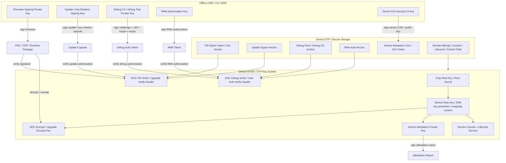
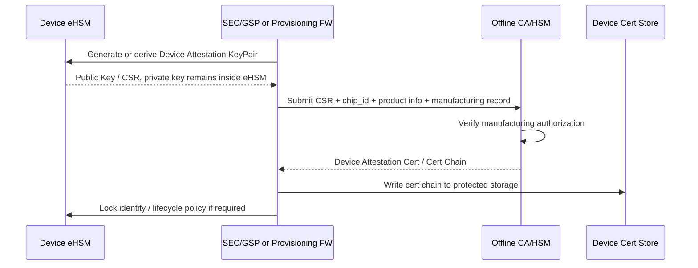
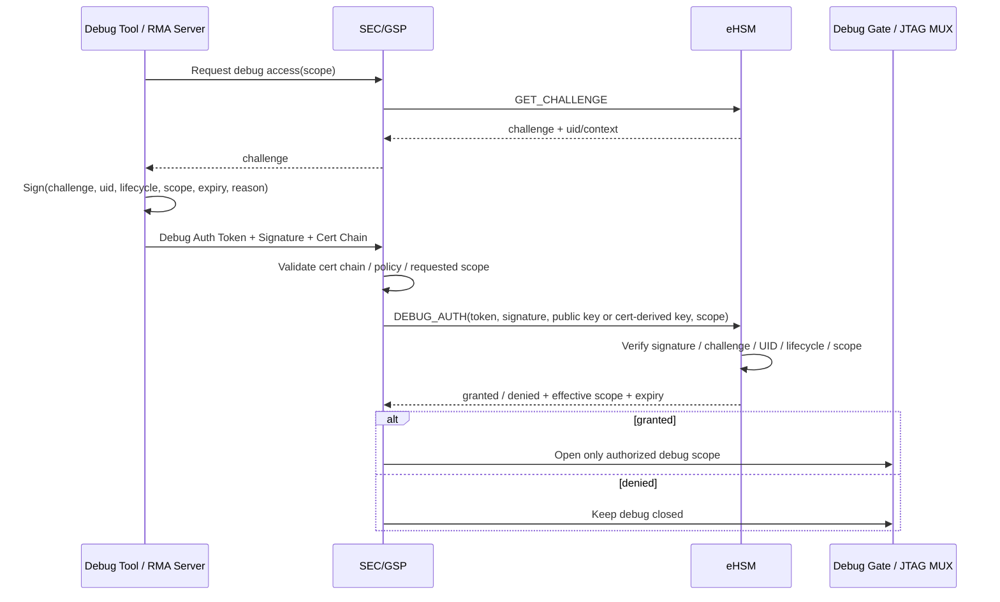
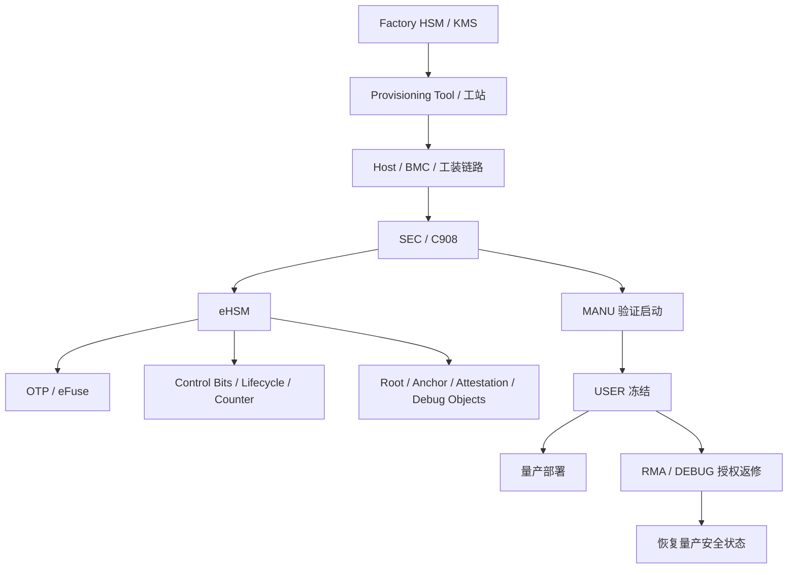
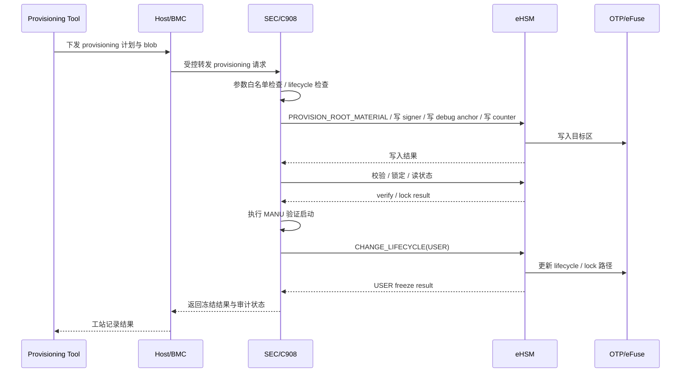
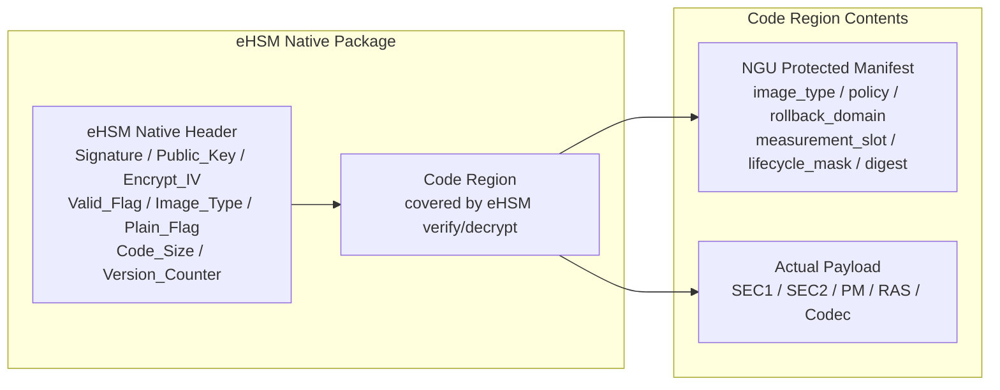
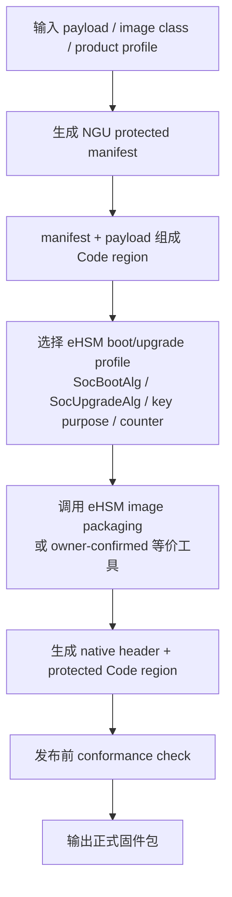
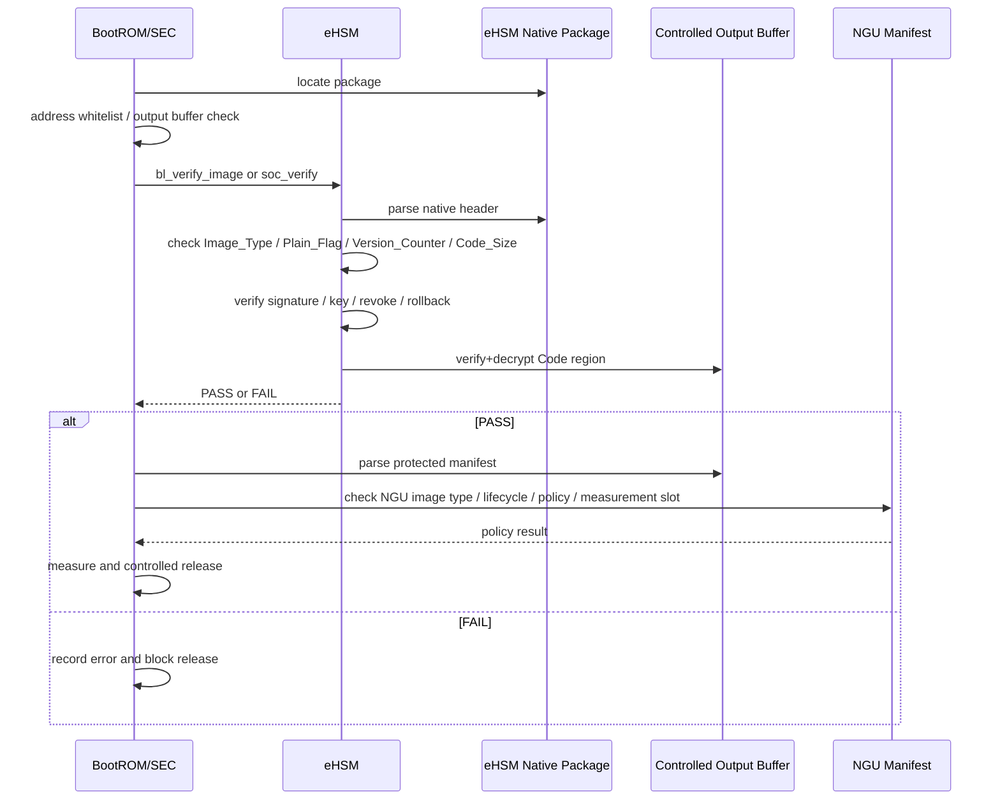
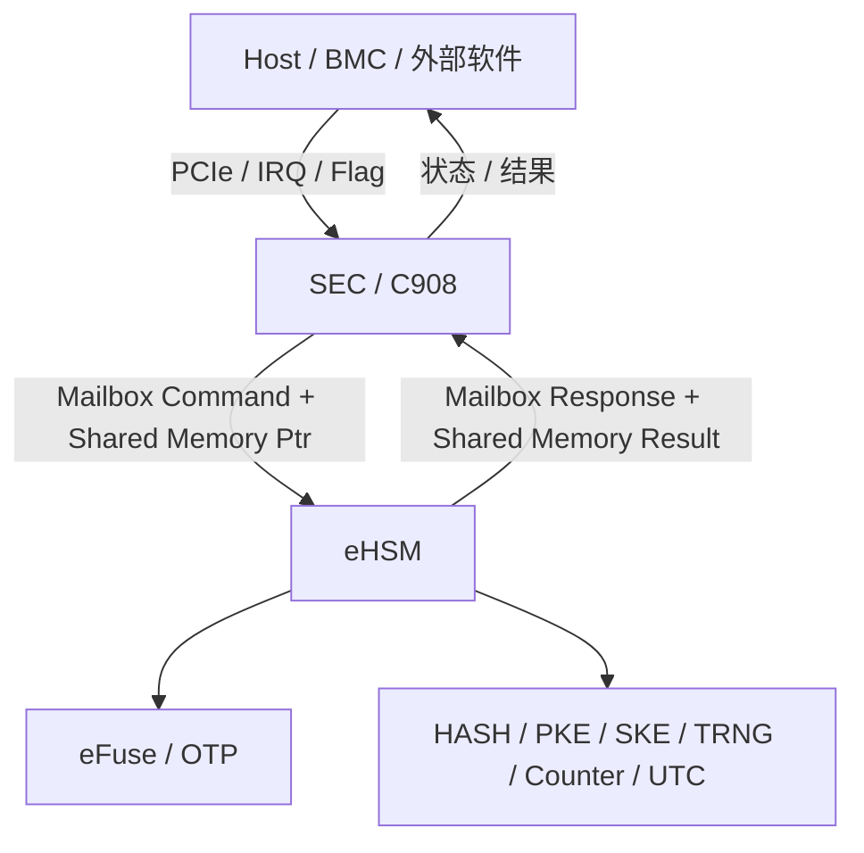
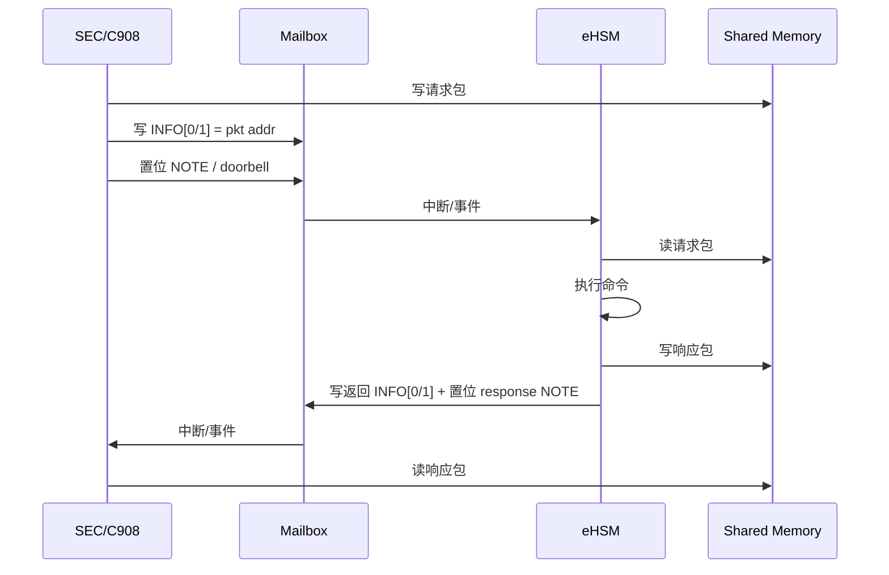

# 8. Root of Trust、密钥体系与证书体系

> 当前方案源：2026-06-03 起，`security_inputs/current_plan/芯片安全软件方案_2.0.pdf` 为当前收敛方案基线；除后续特殊说明外，本章按该版与 `security_workflow/03_detailed_design/10_full_design.md` 解释。

## 8.1 本章修正后的核心口径

本章重新定义 NGU800 的 Root of Trust、密钥体系、证书体系和 Debug Auth 关系。核心修正是：**不再采用“UDS / Root Secret → DRK → FW Verify / FW Encrypt / Attestation / Debug Auth 四个分支”的单棵密钥树模型**，因为该模型会把设备内部密钥、外部签名密钥、证书 CA 密钥和调试授权密钥混在一起。

修正后的密钥体系分为三套相互关联、但职责不同的体系：

| 体系 | 私钥位置 | 设备侧保存内容 | 主要用途 |
|---|---|---|---|
| 外部签名 / 授权体系 | 离线 HSM / CA / KMS / 签名服务器 | public key hash、cert anchor、signer hash、revoke policy | 固件签名、升级授权、Debug Auth 授权、RMA 授权、设备证书签发 |
| 设备内部 eHSM key 体系 | eHSM / OTP / KMU 内部，不导出 | key handle、OTP key、control field、counter、lifecycle | 固件解密、key unwrap、设备证明私钥使用、Debug Auth 验签执行、counter/lifecycle 管控 |
| 设备身份与证书体系 | 设备证明私钥在 eHSM 内部；CA 私钥在离线 HSM | Device Attestation Cert / cert chain / root anchor | 设备向外证明身份与当前运行状态 |

本章中的 `DRK(Device Root Key)` 仅表示 eHSM/OTP 内部的 **device-local key protection / wrapping context** 或等价设备内部根保护语义，不表示所有用途私钥都从设备内派生，也不表示离线签名系统能从设备获取私钥。

关键规则如下：

1. 固件签名私钥、升级授权私钥、Debug CA 私钥、Debug Tool 私钥、RMA 授权私钥、设备证书签发 CA 私钥均属于**外部授权密钥**，必须由离线 HSM/CA/KMS 管理，不由设备 DRK 派生。
2. 设备侧只保存这些外部授权密钥对应的 public key hash、cert anchor、signer hash、root hash 或 revoke policy，用于 eHSM/SEC 验证外部签名。
3. 设备内部私钥，例如 Device Attestation Private Key，不得离开 eHSM；设备可导出公钥/CSR，由离线 CA/HSM 签发设备证明证书。
4. 固件解密密钥、SoC Encrypt Key、Upgrade Encrypt Key、key unwrap key、counter/lifecycle 相关状态属于设备内部 eHSM key 体系，Host/普通核/OOB/BMC 不得读取。
5. Debug Auth 的方向是“外部授权方签名、设备侧验签”，不是设备生成 Debug Auth 私钥给外部使用。

---

## 8.2 修正后的密钥体系总图



### 图下说明

1. **外部 HSM/CA/KMS 持有签名私钥**，负责签固件、签升级包、签 Debug Auth token、签 RMA token、签设备证书。
2. **设备不持有外部签名私钥**，只保存外部公钥锚点、证书锚点、signer hash、revoke bitmap 和 policy。
3. **eHSM 持有或管理设备内部密钥材料**，用于固件解密、key unwrap、设备证明签名、Debug Auth 验签执行、counter/lifecycle 管控。
4. `DRK` 仅表示 eHSM 内部 key protection / wrapping context，不是外部签名私钥的来源。
5. Host/BMC/OOB 是运行时请求方或传输方，不应持有固件签名私钥、Debug CA 私钥、设备证明私钥或 root secret。

---

## 8.3 密钥分类与边界

### 8.3.1 外部签名 / 授权密钥

| Key Object | 私钥位置 | 设备侧保存 | 主要用途 | 备注 |
|---|---|---|---|---|
| Firmware Signing Key | 离线 HSM / KMS / 签名服务器 | FW signer hash / cert anchor / public key hash | 签 FMC/GSP/runtime 固件 | 设备只验签，不持有该私钥 |
| Firmware Update / Key Rotation Signing Key | 离线 HSM / KMS | update signer anchor / revoke policy | 签升级包、key rotation capsule | 用于授权新 signer、新 key epoch、新 FMC slot 切换 |
| Debug Root / Debug CA Key | 离线 HSM / CA | debug root hash / debug CA anchor | 签 Debug Tool Cert 或直接签 Debug Auth token | 设备侧用于验证调试授权来源 |
| Debug Tool Key | 调试工具安全存储 / RMA 服务端 / HSM | Debug Tool Cert / public key | 签本次 challenge、UID、scope、expiry | 可由 Debug CA 签发证书 |
| RMA Authorization Key | 离线 RMA HSM / 服务系统 | RMA auth anchor | 签 RMA token、维修授权 | 不应在 USER 态形成常开后门 |
| Device Cert Issuing CA Key | 厂商 CA / HSM | root/intermediate cert chain 或 root hash | 签发 Device Attestation Cert | CA 私钥永不进入设备 |
| Customer Update Authorization Key | 客户 HSM / KMS | customer signer anchor / revoke bitmap | 客户授权升级、签名、key rotation | 与 key epoch / FMC A/B 状态机绑定 |

### 8.3.2 设备内部 eHSM 密钥与状态

| Key / State Object | 位置 | 是否可导出 | 主要用途 | 备注 |
|---|---|---:|---|---|
| UDS / Root Secret / Chip Root Key | OTP/eFuse / eHSM 安全区 | 否 | 设备内部根材料 | Host/SEC/普通核不可读 |
| Device Root Key / DRK | eHSM 内部或 OTP key hierarchy 语义 | 否 | key protection、wrapping、device-local root context | 不代表所有用途私钥来源 |
| SOC Encrypt Key | eHSM / OTP / KMU | 否 | 安全启动镜像解密 | FMC/GSP 正式路径强制签名+加密 |
| SOC Upgrade Encrypt Key | eHSM / OTP / KMU | 否 | 升级包解密或 key material 保护 | 具体用途需和 eHSM owner 冻结 |
| SOC FW Verify / Upgrade Verify Handle | eHSM key handle / public anchor / OTP policy | 不导出私钥；可使用 public anchor | 固件/升级包验签 | 对应外部签名体系的公钥锚点或 key handle |
| SOC Debug Verify / User Auth Verify Handle | eHSM key handle / public anchor / OTP policy | 不导出私钥 | Debug Auth / RMA Auth 验签 | 对应 Debug CA / Tool / RMA 公钥锚点 |
| Device Attestation Private Key | eHSM 内部 | 否 | 签署 attestation report | 公钥/CSR 可导出给 CA 签证书 |
| Version Counter / Lifecycle / Control Field | eHSM / OTP / 安全寄存器 | 不可由 Host 修改 | rollback、生命周期、算法 profile、debug gate | 是启动和 attestation 的策略输入 |

### 8.3.3 证书与锚点对象

| Cert / Anchor Object | 位置 | 用途 | 写入/更新时机 |
|---|---|---|---|
| FW Signer Hash / Cert Anchor | OTP/eFuse 或安全存储 | 验证固件签名链 | 制造阶段写入，key rotation 时受控更新 |
| Update Signer Anchor | OTP/eFuse 或安全存储 | 验证升级包 / key rotation capsule | 制造或客户授权更新 |
| Debug Root / Debug CA Anchor | OTP/eFuse 或安全存储 | 验证 Debug Tool Cert / Debug Auth token | 制造阶段写入，USER 前锁定 |
| RMA Auth Anchor | OTP/eFuse 或安全存储 | 验证 RMA 授权 | 制造阶段写入或客户策略注入 |
| Device Attestation Cert | Flash 安全区 / 证书分区 / eHSM 管理存储 | 证明设备公钥属于合法设备 | 制造阶段由 CA 签发后写回 |
| Intermediate / Root CA Cert | 设备证书链区或 Verifier 侧预置 | Verifier 验证设备证书链 | 按客户接入模式决定是否内嵌 |
| Revoke Bitmap / Key Epoch Policy | OTP/eFuse / 安全 NVM / metadata | 吊销 signer / key epoch / debug key | 受控升级或制造阶段 |

---

## 8.4 Root of Trust 与 eHSM 角色

NGU800 的 Root of Trust 由以下对象共同构成：

| 组件 | 职责 | 边界 |
|---|---|---|
| OTP / eFuse | 保存 root secret、key anchor、control field、counter、lifecycle、revoke bitmap 等持久状态 | Host/BMC/OOB/普通核不得直接访问敏感字段 |
| eHSM | 使用 OTP/eFuse 中的根材料和策略，执行验签、解密、key use、counter、lifecycle、debug auth、attestation signing | 是安全执行面，不向外导出设备内部私钥或 root secret |
| BootROM | 最小启动编排，定位 FMC_A/B，调用 eHSM verify/decrypt，处理 fallback | 不是密钥管理中心，不持有 Root Private Key |
| SEC/GSP | 运行期安全控制面，收敛 Host/OOB 请求，调用 eHSM 服务，维护 measurement/report/debug/RMA 流程 | 不直接读取 root secret 或设备私钥 |

Root of Trust 的作用不是“生成所有签名私钥”，而是：

1. 为设备内部安全服务提供不可伪造的根状态。
2. 约束 eHSM 使用密钥、counter、lifecycle、debug gate 和算法 profile。
3. 让设备能够验证外部授权签名，能够解密受保护固件，能够对自身状态进行证明。

---

## 8.5 固件签名与验签体系

### 8.5.1 签名方向

固件签名方向如下：

```text
Offline HSM / KMS / Firmware Signing Server
    使用 Firmware Signing Private Key 签名
        ↓
FMC / GSP / Runtime secure image package
        ↓
Device eHSM 使用 FW signer anchor / public key / cert chain 验签
```

设备内部不会生成固件签名私钥，离线端也不会从设备拿到固件签名私钥。设备侧只需要保存验签所需的信任锚。

### 8.5.2 设备侧验签输入

设备侧固件验签至少依赖以下信息：

| 输入 | 来源 | 用途 |
|---|---|---|
| eHSM native header 中的签名、公钥/认证材料、Code_Size、Version_Counter、Plain_Flag 等 | 固件包 | eHSM native verify/decrypt |
| FW signer hash / cert anchor | OTP/eFuse 或安全存储 | 判断签名方是否可信 |
| revoke bitmap | OTP/eFuse / 安全 NVM | 判断 signer/key 是否被吊销 |
| lifecycle / control field | eHSM/OTP | 判断当前生命周期下是否允许该镜像 |
| Version Counter / rollback policy | eHSM/OTP/counter service | 防回滚 |
| NGU protected manifest | eHSM Code region 内，verify/decrypt PASS 后解析 | 确认 `ngu_image_type`、load/entry、measurement_slot、expected profile 等项目策略 |

### 8.5.3 FMC/GSP 正式路径要求

- FMC_A/FMC_B 均必须签名 + 加密，且走 eHSM verify + decrypt output path。
- GSP 正式路径必须签名 + 加密，解密失败必须阻断安全控制面启动。
- PM/RAS/Codec 等关键 runtime 在 USER/PROD 默认签名 + 加密；signature-only 只能作为产品白名单例外，并进入 attestation/report。
- eHSM native header 中的 `Image_Type` 不承载 NGU 项目级 FMC/GSP/runtime 类型；项目级类型必须在 NGU protected manifest 中表达。

---

## 8.6 固件加密与解密体系

固件加密/解密体系与固件签名体系不同：

| 方向 | 说明 |
|---|---|
| 离线打包端 | 使用 eHSM owner 确认的 packaging 规则、HSM/KMS、SOC Encrypt/Upgrade Encrypt 相关机制，生成设备可解密的 secure image package |
| 设备端 | eHSM 使用 SOC Encrypt Key / Upgrade Encrypt Key / unwrap key 或等价 key handle，对 Code region 或升级包执行解密/unwrap |

设备端解密密钥不可导出。离线端不应直接持有设备内部明文解密 key，除非该 key 属于制造/客户共同定义的 HSM 管理材料，并且以 HSM/KMS 受控方式参与打包，不能进入普通软件或 Host。

推荐区分如下：

| 对象 | 说明 | 状态 |
|---|---|---|
| SOC Encrypt Key | 安全启动 Code region 解密或等价 eHSM decrypt key | FMC/GSP 强制使用 |
| SOC Upgrade Encrypt Key | 升级包、key material 或外层更新容器的解密/保护 key | 需和 eHSM owner 冻结 exact 用法 |
| FW_KEK | 项目逻辑名，表示固件内容加密/CEK 包裹相关 key | 不直接等同于固定 OTP 物理字段 |
| CEK / wrapped CEK | per-image content key 或其包裹形式 | 首版不作为已冻结字段；仅在 eHSM owner 确认扩展后启用 |

关键规则：

1. FMC/GSP 的机密性保护不应由 Host 或普通软件执行。
2. eHSM 解密输出必须进入 BootROM/SEC 认可的受控 output buffer 或执行区。
3. 解密失败、key policy mismatch、lifecycle mismatch 不得降级为明文启动。
4. manifest 中的 `decrypt_required` 必须与 eHSM native header / control field 的实际保护状态一致。

---

## 8.7 设备身份与证书体系

设备身份体系用于回答“这颗设备是谁”。它与固件签名体系不同。

### 8.7.1 制造阶段流程



### 8.7.2 运行时证明流程

```text
Device eHSM 使用 Device Attestation Private Key 签署 attestation report
        ↓
Host / Verifier 使用 Device Attestation Cert 和 Root CA 验证报告签名
```

### 8.7.3 边界规则

- Device Attestation Private Key 在设备内部生成或派生，不导出。
- 离线 CA/HSM 不需要也不应获得 Device Attestation Private Key。
- 离线 CA/HSM 只使用 CA Private Key 对设备公钥/CSR 签发证书。
- Device Attestation Cert / cert chain 可以写回设备，也可以部分由 Verifier 侧预置，取决于客户接入模式。
- Attestation report 必须绑定 nonce、measurement、lifecycle、debug state、secure boot state、rollback state、FMC slot/key epoch 等安全状态。

---

## 8.8 Debug Auth 与 RMA 授权体系

Debug Auth 用于回答“外部调试请求是否被授权”。其方向是：**外部授权方签名，设备侧验签并打开受限 scope**。

### 8.8.1 Debug Auth 证书与 token

建议采用两层对象：

| 对象 | 签名方 | 内容 | 设备侧检查 |
|---|---|---|---|
| Debug Tool Cert | Debug CA / Root CA | tool public key、key usage、product、allowed lifecycle、max scope、validity | 证书链回到 debug root/debug CA anchor |
| Debug Auth Token | Debug Tool Key 或 RMA HSM | challenge、device_uid、lifecycle、scope_bitmap、expiry、reason、session_id | 签名、challenge、UID、scope、时效、lifecycle |

### 8.8.2 Debug Auth 时序



### 8.8.3 Debug Auth 规则

1. Debug CA Private Key 和 Debug Tool Private Key 在离线 HSM、RMA 服务端或受保护调试工具中，不进入设备。
2. 设备侧保存 debug root hash、debug CA anchor、debug signer hash 或等价验证锚点。
3. eHSM/SEC 必须校验 challenge、UID、scope、lifecycle、expiry、replay counter 和证书用途。
4. Debug Auth 通过只表示“允许打开某个受限 debug scope”，不表示设备安全可信。
5. debug scope 必须支持自动关闭、复位清零、授权超时关闭、安全错误关闭和审计记录。
6. RMA 授权不得绕过 FMC/GSP 签名+加密策略；深度调试应绑定 erase_done 或客户授权策略。

---

## 8.9 Key Epoch、Key Rotation 与 FMC A/B 的关系

`key epoch / active / next / deprecated / revoked` 是 NGU 为客户密钥轮换和 FMC A/B 防变砖定义的**逻辑状态机**，不是 eHSM 手册中直接定义的完整状态机，也不等于固定物理 key slot。

| 状态 | 含义 | 与 FMC A/B 的关系 |
|---|---|---|
| `PENDING / NEXT` | 新 signer/key policy 已安装或已授权，但还没成为正式 active | 必须先验证 inactive FMC slot |
| `ACTIVE` | 当前正式生效的 signer/key policy | active FMC 默认使用该策略 |
| `DEPRECATED` | 旧 key 过渡期仍可验证 fallback FMC，但不得用于签发新 FMC | 防止新 FMC 未稳定时旧 fallback 立即失效 |
| `REVOKED` | 已吊销，不得用于 verify/decrypt/update/debug auth | 只有新 key 体系下已有 confirmed fallback 后才允许 |
| `LOCKED` | USER freeze 或策略锁定后不允许修改 | 制造锁定、客户策略锁定 |

密钥轮换不是设备派生外部 signing private key，而是：

```text
1. 外部客户/厂商 HSM 生成或启用 new signing key / new cert anchor
2. 通过旧 active key 或 owner authority 签署 key rotation capsule
3. 设备验证 capsule 后安装 new signer anchor / key epoch policy 为 PENDING
4. 使用 new signer/key policy 验证 inactive FMC slot
5. pending FMC boot confirm 成功后，new key epoch 变为 ACTIVE
6. old key 进入 DEPRECATED
7. 形成新 key 体系下 confirmed fallback 后，才允许 revoke old key
```

---

## 8.10 双算法与算法 authority

NGU 支持国密和国际算法，但算法选择权不能由未验证的 manifest 或 Host 请求决定。

| 用途 | 国密路径 | 国际路径 | Authority |
|---|---|---|---|
| 固件签名 | SM2 + SM3 | ECDSA/RSA + SHA-256/SHA-384 | eHSM `SocBootAlg / SocUpgradeAlg` 或等价 control field |
| 固件加密 | SM4 | AES | eHSM control field / packaging profile |
| Device Attestation | SM2 签名 | ECDSA/RSA 签名 | 设备证书 profile / attestation policy |
| Debug Auth | SM2 / SM3 或 SM4-CMAC | ECDSA/RSA 或 HMAC/CMAC | debug anchor / eHSM debug auth profile |
| KDF / wrapping | SM3-based KDF | HKDF-SHA256/SHA384 | eHSM owner-confirmed key service |

规则：

1. eHSM OTP/control field 是 secure boot / upgrade 算法选择 authority。
2. NGU protected manifest 中的 `expected_algorithm_profile` 只用于一致性检查、审计和 attestation，不得覆盖 eHSM control field。
3. Debug Auth token/cert 中的算法 profile 必须与设备内 debug anchor 和 eHSM debug auth profile 一致。
4. Attestation report 必须显式表达 hash/signature/cert profile，方便 verifier 支持国密和国际算法。

---

## 8.11 制造、灌装与锁定

### 8.11.1 制造阶段需要完成的对象

| 类别 | 制造阶段动作 | USER 前要求 |
|---|---|---|
| 设备根材料 | 写入或生成 UDS / Root Secret / Chip Root Key / Device Root Key 相关 eHSM key material | 锁定、不可读、不可回退 |
| 固件验签锚点 | 写入 FW signer hash / cert anchor / update signer anchor | 清理测试 signer，锁定量产 anchor |
| 固件解密 key policy | 配置 SOC Encrypt Key / Upgrade Encrypt Key / FW_KEK policy | FMC/GSP 强制加密策略锁定 |
| 设备证明 key | 设备侧生成 Device Attestation KeyPair，导出 CSR/public key | 私钥不导出；证书链写回并受保护 |
| Debug/RMA anchor | 写入 debug root/debug CA anchor、RMA auth anchor、scope policy | USER 默认关闭 debug，测试 debug trust 清理 |
| Counter / lifecycle / control field | 初始化 version counter、rollback policy、algorithm profile、secure boot enable | MANU→USER 前推进 lifecycle 并锁定 |
| 证书与审计 | 记录 chip_id、cert serial/hash、provision profile、lock result | 留存制造审计记录 |

### 8.11.2 USER 前必须完成的检查

1. Root / key / anchor 区已锁定，普通软件无法写入。
2. 测试 signer、测试 debug CA、测试证书链、临时 manufacturing token 已清理或吊销。
3. FMC/GSP 签名+加密策略已开启并不可被 Host 关闭。
4. rollback counter / version counter 初始状态已设置。
5. Device Attestation Cert 已写回或 verifier 侧有可验证链路。
6. lifecycle 已推进到 USER/PROD，未授权 debug 关闭。
7. 量产记录中包含 chip_id、cert serial/hash、signer profile、debug profile、counter/lifecycle lock result。

---

## 8.12 对 SoC / 硬件设计的需求

| 需求项 | 设计要求 | 硬件/制造依赖 |
|---|---|---|
| OTP/eFuse 布局 | 区分 root secret、control field、version counter、lifecycle、FW signer anchor、debug anchor、attestation anchor、revoke bitmap | OTP/eFuse map、ECC/冗余、烧录权限、读写锁定 |
| eHSM key system | 支持 SOC Encrypt Key、Upgrade Encrypt Key、FW verify handle、Debug/User Auth verify handle、Device Attestation Private Key 使用 | eHSM KMU/key handle、OTP key purpose、owner-confirmed key mapping |
| 外部授权 anchor | 固件签名、升级授权、Debug Auth、RMA Auth 的私钥在离线 HSM；设备只保存公钥锚点 | signer hash slot、cert anchor slot、debug root hash、revoke bitmap |
| 固件加密路径 | FMC/GSP 必须签名+加密，eHSM 解密输出进入受控 buffer | verify+decrypt command、output buffer 白名单、SEC-only release |
| Device Attestation key | 设备证明私钥在 eHSM 内部生成/派生，不导出；公钥/CSR 可导出给 CA 签证书 | eHSM PKE/TRNG/KMU、cert store、CSR/provisioning command |
| Debug Auth gate | Debug Auth 必须支持 challenge、UID、scope、expiry、cert anchor、复位关闭和审计 | eHSM debug auth command、debug scope bitmap、JTAG MUX/debug gate |
| Key epoch / rotation | active/next/deprecated/revoked 为逻辑状态，需绑定 FMC_A/B 和 rollback/counter | key epoch metadata、revoke bitmap、counter、fmc_slot_metadata |
| 双算法配置 | secure boot / upgrade / debug / attestation 算法 profile 由 eHSM control field 或证书 profile 驱动 | SocBootAlg/SocUpgradeAlg、debug auth profile、attestation profile |
| 证书链存储 | 设备证书链、intermediate/root anchor、cert hash/serial 需要安全存储和写保护 | Flash 安全分区、OTP anchor、证书区防篡改 |

---

## 8.13 本章结论

本章修正后的密钥体系不再使用“UDS→DRK→所有 branch”的单棵树模型，而采用三套并列体系：

1. **外部签名 / 授权体系**：离线 HSM/CA/KMS 持有固件签名、升级授权、Debug Auth、RMA、证书签发私钥；设备只保存公钥锚点并验签。
2. **设备内部 eHSM key 体系**：eHSM/OTP/KMU 管理 root secret、DRK/key wrapping context、SOC Encrypt/Upgrade Encrypt、Device Attestation Private Key、counter、lifecycle 和 debug gate。
3. **设备身份与证书体系**：设备内部生成或派生证明私钥，离线 CA 只对设备公钥/CSR 签发证书，运行时设备使用内部私钥签署 attestation report。

`DRK` 在本方案中只保留为 eHSM 内部 key protection / wrapping / device-local root context，不作为固件签名私钥、Debug Auth 私钥或 CA 私钥的上游。固件验签、Debug Auth 和证书签发的签名方向均为外部 HSM/CA 签名、设备侧 eHSM/SEC 验证；设备内部私钥只用于设备向外证明自身身份和状态。


# 9. 制造、灌装、部署与 RMA

## 9.5 架构图



### 图下说明

1. 工厂 HSM/KMS 是制造密钥材料的上游管理端，但不直接替代设备内部 Root of Trust。
2. SEC/C908 是制造流程的控制面，eHSM 是真正执行 Root / OTP / lifecycle / lock 操作的安全执行面。
3. USER 冻结不是单条命令，而是一组必须全部成功的冻结动作集合。
4. RMA 路径是受控旁路，只能临时开放，并且必须回收。

## 9.6 时序图



### 图下说明

1. Provisioning Tool 不直接向 eHSM 发命令，而是通过 Host/BMC 链路与 SEC/C908 协作。
2. 生命周期推进前，必须先完成写入校验和锁定。
3. USER 冻结前必须先做 MANU 验证启动，确保量产条件已满足。

## 9.7 生命周期与制造阶段映射

### 9.7.1 生命周期总体映射

| 生命周期 | 制造/部署语义 | 典型用途 | 默认安全策略 |
| --- | --- | --- | --- |
| TEST | 裸片 / 封测 / 初测 | 基础功能验证 | 可开放测试路径，不得等价于量产 |
| DEVE | 开发板 / EVB 调试 | 软件 bring-up、接口联调 | 可有限开放调试 |
| MANU | 正式制造 / 板级灌装 | 写入根材料、建立量产前状态 | 基础安全校验生效 |
| USER | 量产交付 | 面向客户部署 | 强制 secure boot、关闭未授权 debug |
| DEBUG / RMA | 受权返修 / 厂商分析 | 故障定位、临时调试 | 仅授权开启 |
| DEST | 销毁 | 退役 / 擦除 | 不再允许正常使用 |

### 9.7.2 制造阶段推荐细分

| 阶段 ID | 阶段名称 | 主要动作 |
| --- | --- | --- |
| MFG-0 | 封测初测 | 测试路径、基础 bring-up、早期健康检查 |
| MFG-1 | 板级 bring-up | 电源、时钟、基础接口、主从Die连通 |
| MFG-2 | Provisioning 准备 | 工站认证、算法栈选择、blob 准备 |
| MFG-3 | Root / Anchor Provisioning | 写 UDS / Root / signer / debug / attest |
| MFG-4 | Control Bit Provisioning | 写 secure boot / debug / attestation / rollback 控制位 |
| MFG-5 | 校验与锁定 | 写入校验、锁位、状态确认、审计 |
| MFG-6 | MANU 验证启动 | 带验证的近量产启动检查 |
| MFG-7 | USER 冻结 | 清理测试 trust、推进 USER、关闭未授权 debug |
| MFG-8 | 出厂验收 | 形成最终记录、出厂状态确认 |

## 9.8 灌装交付项

### 9.8.1 必须灌装对象

| 对象 | 是否首版必须 | 说明 |
| --- | --- | --- |
| UDS / Root Secret | 是 | 根种子 / Root 材料上游 |
| Root Key / Root KEK 材料 | 视模式 | 可直接写入，或由 UDS 内部派生 |
| FW Signer Hash / Trust Anchor | 是 | 支撑 SEC1 / SEC2 / 运行期 FW 验签 |
| FW_KEK / Image Protect Key | 是 | 支撑 SEC1 强制加密镜像的 CEK unwrap / 解密策略 |
| Debug Auth Anchor | 是 | 支撑 DEBUG/RMA 调试鉴权 |
| Attestation Seed / Anchor | 是 | 支撑设备证明 |
| Rollback Counter 初值 / 版本地板 | 是 | 支撑 anti-rollback |
| Secure Boot / Debug / Attestation / Rollback 控制位 | 是 | 建立量产策略 |
| Board Binding 信息 | 可选 | 视产品线策略启用 |
| Die Binding 信息 | 双Die 推荐 | 主从Die 一致性约束 |

### 9.8.2 禁止残留的对象

| 对象 | 原因 |
| --- | --- |
| 测试 signer key / 测试 cert anchor | USER 前必须清理 |
| 测试 debug 白名单 | USER 前必须清理 |
| 非量产 bypass 配置 | USER 前必须关闭 |
| 明文可导出的 Root 私钥 | 根本不允许存在于最终流程 |

## 9.9 灌装顺序设计

### 9.9.1 推荐顺序

```text
(1) 读取 lifecycle 与 OTP 当前状态
    ↓
(2) 校验设备处于允许 provisioning 的状态
    ↓
(3) 写入 UDS / Root Secret / Root 材料
    ↓
(4) 写入 FW signer hash / trust anchor
    ↓
(5) 写入 FW_KEK / image protect key 策略或其 eHSM 内部派生种子
    ↓
(6) 写入 Debug auth anchor
    ↓
(7) 写入 Attestation seed / anchor
    ↓
(8) 写入 counter 初值 / rollback floor
    ↓
(9) 写入 secure boot / FW encrypt / debug / attestation / rollback 控制位
    ↓
(10) 校验写入结果
    ↓
(11) 锁定 key / FW_KEK 策略 / anchor / control bits
    ↓
(12) 执行 MANU 验证启动
    ↓
(13) 执行 USER 冻结
```

### 9.9.2 顺序理由

- Root 材料必须先于 signer / attest / debug anchor 生效，否则没有可信根。
- counter 初值必须在正式量产前建立，否则 anti-rollback 没有基线。
- control bits 必须在信任锚完成注入后再打开，避免出现“策略已要求 secure boot，但锚尚未就绪”的中间态。
- 锁定位只能在校验通过后执行，否则可能把错误数据永久锁死。

## 9.10 Provisioning 接口设计口径

### 9.10.1 项目接口裁决

- 制造相关动作必须复用 SEC/C908 → eHSM 的受控路径
- Provisioning Tool 不得直接进入 eHSM 内部命令面
- 制造相关命令只能在允许的 lifecycle 下可用

### 9.10.2 命令族

本章直接列出制造/provisioning 需要进入受控 Mailbox 的命令族；第 10 章给出对应实现级接口、命令字段和制造流程。核心命令包括：

- `PROVISION_ROOT_MATERIAL`
- `CHANGE_LIFECYCLE`
- `READ_COUNTER`
- `INCREASE_COUNTER`（受策略控制）
- `GET_CHALLENGE`
- `DEBUG_AUTH`

### 9.10.3 章节级规则

1. `PROVISION_ROOT_MATERIAL` 只能在 MANU 或受控 provisioning 状态可用
2. `CHANGE_LIFECYCLE(USER)` 必须晚于写入校验和锁定
3. `DEBUG_AUTH` 在制造态仅用于必要的 bring-up / RMA，不得作为长期打开调试的替代
4. 所有 provisioning blob 的地址和长度必须受 SEC 白名单和 eHSM 范围检查双重保护

## 9.11 校验策略

### 9.11.1 写入后校验

每类 provisioning 写入后，至少需要以下检查：

1. 命令返回状态成功
2. 若目标区允许读回，则做读回一致性校验
3. 若目标区不允许直接读回，则通过：
   - eHSM 内部状态确认
   - 试运行校验
   - challenge / verify / report 侧间接确认
4. 状态必须进入工站审计记录

### 9.11.2 MANU 验证启动最小检查项

| 检查项 | 说明 |
| --- | --- |
| SEC1 / SEC2 验签 | 核心启动链验证 |
| SEC1 解密 / unwrap | 验证 SEC1 签名 + 加密策略、FW_KEK / wrapped CEK 和输出 buffer 约束 |
| rollback counter 读取 | 反回滚路径验证 |
| lifecycle / control bits 读取 | 状态验证 |
| challenge / report 最小链路 | 证明能力基础验证 |
| debug 默认状态检查 | 验证未授权 debug 未默认放开 |

### 9.11.3 错误处理原则

- 任一关键对象写入失败，不得继续推进 USER 冻结
- 锁定失败必须视为 provisioning 失败
- （待确认）校验失败后设备可停留在 MANU / 故障态，而不是进入“半冻结 USER”状态

## 9.12 锁定策略

### 9.12.1 必须锁定的对象

| 对象 | 锁定时机 | 说明 |
| --- | --- | --- |
| Root / UDS 区 | 写入并校验通过后 | 防止重复覆盖 |
| signer hash / trust anchor 区 | 写入校验后 | 防止验签锚被替换 |
| FW_KEK / image protect key 策略 | 写入校验后 | 防止 SEC1 解密策略被替换或降级 |
| debug auth anchor 区 | 写入校验后 | 防止调试授权根被替换 |
| attestation anchor 区 | 写入校验后 | 防止证明身份根被替换 |
| control bits 区 | USER 冻结前 | 防止量产策略回退 |
| lifecycle 回退路径 | USER 推进后 | 防止回退到开发态 |

### 9.12.2 锁定原则

- 锁定动作必须显式执行，不得假设“默认已锁”
- 锁定结果必须可审计
- 锁定失败不得推进生命周期
- （待确认）若部分区支持一次性写入后天然只读，仍需在工程文档中显式标记为“已锁语义”

## 9.13 USER 冻结动作

### 9.13.1 必须完成的动作集合

进入 USER 前，必须完成：

1. `SECURE_BOOT_EN = 1`
2. `DEBUG_AUTH_EN = 1`
3. `JTAG_FORCE_DISABLE = 1`
4. `ANTI_ROLLBACK_EN = 1`
5. `FW_ENCRYPT_EN = 1`，且至少覆盖 SEC1 + SEC2
6. Root / signer / debug / attestation / SEC1/SEC2 解密相关 eHSM key policy / FW_KEK 策略完成锁定
7. 测试 signer / 测试 cert / 测试 debug 白名单全部清理
8. 如启用 attestation，则 `ATTEST_EN = 1`
9. 推进 lifecycle 到 USER
10. 锁定 lifecycle 回退路径
11. 生成冻结完成的审计记录

### 9.13.2 事务性要求

这些动作不一定由单条命令完成，但在流程语义上必须视为**一个事务性步骤集合**：

- 任何一步失败，都不得报告“USER 冻结成功”
- 失败后必须进入 MANU 故障处理流程
- 不得形成“部分已冻结、部分未冻结”的不可解释状态

## 9.14 部署阶段设计

### 9.14.1 量产部署后的默认状态

在 USER 生命周期下，默认应满足：

| 项目 | 期望状态 |
| --- | --- |
| Secure Boot | 开启 |
| SEC1 Image Protection | 签名 + 加密强制开启 |
| Anti-Rollback | 开启 |
| 未授权 Debug | 关闭 |
| 测试 Signer / Trust | 已清除 |
| Attestation | 按产品策略开启 |
| Provisioning 接口 | 关闭 |
| Lifecycle 回退 | 不允许 |

### 9.14.2 部署后可允许的操作

- 受控 firmware update
- attestation / report generation
- 状态查询
- 受策略控制的 challenge / 认证类请求

### 9.14.3 部署后禁止的操作

- 再次 provisioning Root 材料
- 覆盖 signer anchor
- 恢复测试 trust
- 直接打开 debug
- 回退 lifecycle 到开发态

## 9.15 RMA 规则

### 9.15.1 RMA 基本原则

RMA / DEBUG 不是普通用户态能力，而是：

> **受授权、可审计、可恢复的返修旁路**

必须满足：

1. 先鉴权，后开放
2. 权限受 scope 和时间窗口约束
3. 维修后必须恢复量产安全状态
4. 全程可审计

### 9.15.2 推荐流程

```text
接收返修设备
    ↓
校验工单 / 设备身份 / 厂商授权
    ↓
发起 challenge / debug auth
    ↓
在受限 scope 下开放调试能力
    ↓
读取故障信息 / 维修 / 受控刷写恢复
    ↓
重新恢复量产镜像和状态
    ↓
关闭调试能力
    ↓
恢复 USER 安全状态
    ↓
生成 RMA 审计结案记录
```

### 9.15.3 RMA 约束

- 不得因为进入 RMA 就长期常开 debug
- 不得跳过 challenge / auth 直接开调试口
- 返修完成后不得带着测试 trust 或开放调试出厂
- RMA 不得长期开放 FMC(SEC1) / GSP(SEC2) 解密绕过路径；首版 FMC 修复依赖 FMC_A/FMC_B fallback 与受控 inactive slot 重写，不依赖常驻静态 recovery 镜像
- 若后续引入静态 rescue/recovery 镜像，不得形成 SoC 厂商单方可启动的后门路径，必须纳入客户密钥轮换、eHSM 验证和审计策略
- （待确认）RMA 完成后，建议重新生成与当前状态一致的最小 report / status 记录，用于归档

## 9.16 审计模型

### 9.16.1 必须记录的事件

| Audit Event | 至少应记录的内容 |
| --- | --- |
| PROVISION_START | 设备 ID、工站 ID、时间、操作员、工单 |
| ROOT_WRITE | 写入对象类型、target slot、结果 |
| FW_KEK_WRITE | FW_KEK / image protect key 策略写入、slot、结果 |
| ANCHOR_WRITE | signer/debug/attest anchor 类型、结果 |
| CTRL_BITS_WRITE | 控制位变化前后、结果 |
| LOCK_APPLY | 锁定对象、结果 |
| MANU_BOOT_VERIFY | 验证启动结果、错误码 |
| USER_FREEZE | lifecycle 变化前后、结果 |
| RMA_AUTH | challenge / auth 结果、scope |
| RMA_CLOSE | 恢复状态、结案结果 |
| PROVISION_END | 总结果、日志索引 |

### 9.16.2 审计要求

- 审计日志不得记录明文私钥或 Root 材料
- 审计日志必须至少可关联：
  - 设备
  - 工站
  - 时间
  - 操作员 / 工单
  - 结果
- （待确认）审计日志应支持导出到制造后台系统或至少可离线归档

## 9.17 与其他章节 / 实现层的映射关系

| 本章主题 | 对应章节 / 实现层 |
| --- | --- |
| lifecycle 与冻结语义 | `03_detailed_design/04_lifecycle_debug.md` |
| Root / signer / control bits 灌装对象 | `efuse_key_fw_header_design.md` |
| Provisioning 命令与 req/resp | `mailbox_if.md` |
| report 中 lifecycle / debug / board 状态表达 | `spdm_report.md` |
| 具体流程状态机 / 审计要求 | `manufacturing_provisioning.md` |

## 对 SoC / 硬件设计的需求

| 需求项 | 设计要求 | 需要项目组冻结的点 |
| --- | --- | --- |
| MANU 灌装窗口 | Root/key/cert/counter/control field 只能在 MANU 或等价受控阶段灌装 | lifecycle gating、工站链路、eHSM provisioning command |
| USER 冻结 | 进入 USER 前必须锁定 Root/key/anchor、清理测试 key/debug 白名单、关闭 provisioning 接口 | OTP lock、test key revoke、debug fuse/control field |
| 制造审计 | chip_id、cert serial/hash、key profile、lifecycle transition、smoke result 需要可追溯 | 工站数据库、设备日志、安全状态导出 |
| RMA 受控 | RMA 需要授权、scope、erase_done、重新刷写量产固件和恢复 USER 安全态 | RMA lifecycle、secure erase、debug gate、audit |
| 灌装失败恢复 | 灌装失败不得留下半锁定、半可用状态；需要原子流程和失败回滚/报废策略 | OTP write sequence、状态机、错误码、锁定位 |

# 10. 实现级落地详设全集

> 本章是  后的代码落地完整实现级详设。
> 本章保留实现级落地细节，并按本文件章节编号组织。
> 若实现细节与 official TRM 存在冲突，以 official TRM 和本章冻结口径为准。

## 10.1 eFuse / Key / eHSM FW Header 对齐设计

### 10.1.2 eHSM 对齐 原则

### 10.1.3 eHSM-native 优先

`eHSM Firmware TRM` 与 `eHSM Bootloader TRM` 已定义的字段均作为 physical fact：

- secure boot image header
- `Image_Type / Plain_Flag / Naked_Flag / Version_Counter`
- `SocBootAlg / SocUpgradeAlg` 等 control field
- OTP key ID / level / purpose
- SOC FW / eHSM FW Version Counter
- `bl_verify_image / soc_verify / fw_upgrade` 等命令语义

### 10.1.4 NGU 字段分类

任何 NGU 字段必须归入以下类别之一：

| Mapping Type | 含义 |
| --- | --- |
| `eHSM-native` | eHSM TRM 已定义的 physical field / command |
| `NGU-logical-alias` | NGU 文档阅读视图，不表达 physical offset / key slot |
| `manifest-extension` | 放入 eHSM Code region 的 NGU protected manifest |
| `eHSM-customization-TBD` | 需要 eHSM owner / TRM / firmware customization 支撑 |
| `NGU-SoC-integration-TBD` | 属于 SoC/RTL/board 集成字段，非 eHSM physical field |

### 10.1.5 eHSM Native Secure Boot Image Header

### 10.1.6 Header 布局

`[CONFIRMED]` SEC1 / SEC2 的密码学 verify/decrypt container 采用 eHSM native secure boot image header。

| eHSM Field | Offset | Size | Mapping Type | NGU 使用规则 |
| --- | --- | --- | --- | --- |
| `Signature` | 0 | 256 | `eHSM-native` | 签名/MAC 值，长度由 eHSM control field 的算法选择决定 |
| `Public_Key` | 256 | 320 | `eHSM-native` | 非对称算法公钥字段；CMAC 模式无效 |
| `Encrypt_IV` | 576 | 16 | `eHSM-native` | AES/SM4 CBC/CMAC 相关 IV；具体语义按 eHSM TRM |
| `Valid_Flag` | 592 | 4 | `eHSM-native` | eHSM image valid marker |
| `Image_Type` | 596 | 1 | `eHSM-native` | eHSM TRM 定义，不写入 NGU SEC1/SEC2/runtime 编码 |
| `Plain_Flag` | 597 | 1 | `eHSM-native` | Code region 是否明文；SEC1/SEC2 正式路径必须为密文 profile |
| `Naked_Flag` | 598 | 1 | `eHSM-native` | 裸镜像仅用于 TRM 允许的开发生命周期 |
| `Reserved` | 599 | 5 | `eHSM-native` | 必须按 TRM 置 0；不得擅自承载 NGU 字段 |
| `Code_Size` | 604 | 4 | `eHSM-native` | Code region 大小 |
| `Version_Counter` | 608 | 16 | `eHSM-native` | eHSM 128-bit one-way counter |
| `Public_Key_Ext` | 624 | 400 | `eHSM-native` | RSA3072 扩展字段 |
| `Code` | 1024 | `Code_Size` | `eHSM-native` | 明文或密文 Code region；NGU manifest 放在此区域 |

### 10.1.7 Physical Header 使用规则

FMC/GSP 的最终 wire/storage 镜像格式采用 eHSM native secure boot image header。`ngu_fw_min_hdr_t`、`ngu_fw_signed_hdr_t` 等项目侧结构只可作为工具内部中间结构或 manifest 语义参考，不作为安全启动镜像的 physical verification header。

### 10.1.8 NGU Protected Manifest

### 10.1.9 放置原则

`[CONFIRMED]` NGU 项目级 metadata 放入 eHSM Code region 的 protected manifest / policy table。

推荐布局：

```text
[eHSM Native Image Header, 1KB, plaintext]

[Code region, verified/decrypted by eHSM]
  ngu_image_manifest_t or equivalent manifest extension
  actual firmware payload
```

### 10.1.10 Manifest 语义

manifest 可承载以下 NGU 项目级逻辑：

| Manifest Concept | Status | 说明 |
| --- | --- | --- |
| `ngu_image_type` | `[CONFIRMED]` | NGU `SEC1 / SEC2 / PM / RAS / Codec / Recovery` 项目级类型 |
| `security_policy_flags` | `[CONFIRMED]` | sign/encrypt/rollback/measurement/release policy 的项目表达 |
| `rollback_domain` | `[CONFIRMED]` | NGU logical rollback domain，不是 physical OTP 32-bit counter |
| `measurement_slot` | `[CONFIRMED]` | measurement / attestation slot |
| `lifecycle_mask` | `[CONFIRMED]` | NGU policy gate；最终生命周期 authority 仍在 eHSM/OTP |
| `product_sku_mask` | `[ASSUMED]` | 产品策略 |
| `board_binding_policy` | `[ASSUMED]` | board binding 默认进入 attestation；是否参与 release 仍 TBD |
| `expected_algorithm_profile` | `[CONFIRMED]` | 仅做一致性检查/审计，不覆盖 eHSM control field |
| `payload_digest` | `[ASSUMED]` | 用于 manifest 内 payload 描述；具体 hash profile 跟随 eHSM/产品策略 |

### 10.1.11 Manifest ABI 开放项

以下内容保持 `[TBD]`：

1. `ngu_image_manifest_t` bit-level ABI。
2. manifest 是否必须位于 Code region 起始位置。
3. manifest extension / TLV 格式。
4. eHSM firmware / bootloader 是否直接解析 manifest。
5. manifest 中 board binding 是否参与 SEC2/runtime release decision。

#### 固件包格式与制作/验证流程

##### 固件包正式格式

NGU800 最终 physical wire/storage 格式采用 eHSM native secure boot image header 与 eHSM Code region 组合，不再定义第二套并列的物理 verification header。正式包格式为：

```text
[eHSM Native Secure Boot Image Header, 1KB plaintext]

[eHSM Code region, verified/decrypted by eHSM]
  NGU protected manifest / policy table
  actual firmware payload
```

规则：

- eHSM native header 是唯一 physical verification/decrypt header。
- NGU 不再定义 `common_firmware_header` / `signed_region_v1` 作为设备侧 wire/storage ABI。
- Signed Region 中原本想表达的 `firmware_type / version / rollback / key_id / payload_hash / policy`，必须迁移到 eHSM native field、NGU protected manifest 或 eHSM owner-confirmed key/counter mapping。
- `wrapped_cek` 仅在 eHSM owner 后续确认 per-image CEK / wrap extension 时才可作为 `eHSM-customization-TBD` 进入实现；当前不得被工具链写死。

##### 固件包布局图



图下说明：

1. `Image_Type / Plain_Flag / Version_Counter / Code_Size` 由 eHSM TRM 定义。
2. `ngu_image_type / security_policy_flags / rollback_domain / measurement_slot` 由 NGU manifest 表达。
3. payload digest 应由 manifest 或 eHSM owner-confirmed metadata 表达；具体 hash profile 跟随 eHSM control field / product profile。
4. load address / entry point 若进入 manifest，必须等 eHSM PASS 后才能被 BootROM / SEC 使用。

##### 平台侧固件制作流程



平台侧制作规则：

| Step | 工具动作 | 输出 / 检查 |
| --- | --- | --- |
| 1 | 读取 payload、image class、版本、产品 profile | 明确 `SEC1 / SEC2 / PM / RAS / Codec / Recovery` 的 NGU 项目级类型 |
| 2 | 生成 NGU protected manifest | `ngu_image_type`、policy、rollback domain、measurement slot、lifecycle mask、expected algorithm profile、payload digest |
| 3 | 拼接 eHSM Code region | `manifest + payload`，manifest 必须处于 verify/decrypt 保护范围 |
| 4 | 选择 eHSM profile | 算法 authority 来自 eHSM control field；工具只能选择 owner-confirmed profile |
| 5 | 生成 eHSM native header | Header 字段必须逐项通过 eHSM 对齐 matrix |
| 6 | 执行签名/加密封装 | 按 eHSM TRM / owner-confirmed tool 完成，不由 NGU 工具发明 physical crypto metadata |
| 7 | 发布前检查 | 检查 `Image_Type` 未误用、`Plain_Flag` 符合 sign+encrypt policy、Version Counter / rollback domain 一致、manifest 可解析 |

##### 设备侧 verify/decrypt 流程



设备侧规则：

1. BootROM / SEC 不得在 eHSM PASS 前信任 NGU manifest。
2. BootROM / SEC 不得自行执行正式安全路径签名验证、复杂解密或 key unwrap。
3. SEC1 / SEC2 必须走 eHSM verify+decrypt output path；NVM only verify 不适用于 sign+encrypt 镜像。
4. output buffer / destination address 必须由 BootROM / SEC 预先白名单，eHSM 侧再次检查。
5. eHSM PASS 后，BootROM / SEC 才能解析 NGU manifest 并执行项目级 policy：
   - `ngu_image_type` 与当前启动阶段匹配；
   - `security_policy_flags` 满足 SEC1/SEC2 mandatory sign+encrypt；
   - `rollback_domain` 与 eHSM Version Counter / owner-confirmed rollback policy 一致；
   - `lifecycle_mask` 允许当前 lifecycle；
   - `measurement_slot` 合法；
   - `expected_algorithm_profile` 与 eHSM control field 不冲突；
   - board binding policy 按 /后续项目裁决执行。

##### 工具链交付物

首版 image packager 至少应输出以下可审查产物：

| Artifact | 用途 | 状态 |
| --- | --- | --- |
| eHSM native package | 正式发布固件包 | `[CONFIRMED direction]` |
| package manifest dump | 供 review / CI 检查 NGU manifest 语义 | `[ASSUMED]` |
| eHSM 对齐 report | 检查 header、manifest、key/counter/profile 来源 | `[ASSUMED]` |
| golden vector | BootROM / SEC / eHSM adapter 联调用例 | `[TBD exact format]` |
| policy check report | 检查 sign+encrypt、rollback、lifecycle、measurement slot | `[ASSUMED]` |

注意：这些工具链交付物不改变 eHSM physical ABI；它们用于工程检查和联调。

### 10.1.12 Image Type 分层

| 概念 | 承载位置 | Authority | 状态 |
| --- | --- | --- | --- |
| eHSM `Image_Type` | eHSM native header offset 596 | eHSM TRM | `[CONFIRMED]` |
| NGU `SEC1 / SEC2 / PM / RAS / Codec / Recovery` | NGU protected manifest | NGU SEC/Boot policy | `[CONFIRMED]` |
| eHSM firmware 直接理解 NGU image type | eHSM customization | eHSM owner | `[TBD]` |

规则：

- 不得把 NGU `IMAGE_TYPE_SEC1 / SEC2 / PM / RAS / Codec / Recovery` 直接写成 eHSM native `Image_Type` 编码。
- eHSM `Image_Type` 只用于 eHSM 已定义的镜像/key profile。
- NGU `ngu_image_type` 用于 release policy、measurement slot、runtime image policy 和 attestation 映射。

### 10.1.13 Algorithm Authority

`[CONFIRMED]` secure boot / upgrade 的算法 authority 来自 eHSM OTP/control field，例如：

- `EhsmCodeVerifyAlg`
- `EhsmCodeUpgradeAlg`
- `SocBootAlg`
- `SocUpgradeAlg`

规则：

- NGU manifest 可记录 `expected_algorithm_profile`。
- `expected_algorithm_profile` 仅用于一致性检查、审计、attestation。
- 若 manifest expected profile 与 eHSM control field 冲突，必须失败或记录 policy mismatch。
- NGU 不得通过 header/manifest 覆盖 eHSM control field 的算法选择。

### 10.1.14 OTP / eFuse Logical View

### 10.1.15 NGU logical view

`[CONFIRMED]` `OTP-0..OTP-7` 仅保留为 NGU logical view，不表达 physical OTP/eFuse offset。

| NGU Logical View | 语义 | Mapping Type | Physical Authority |
| --- | --- | --- | --- |
| OTP-0 lifecycle view | lifecycle / lock / destroy state | `NGU-logical-alias` | eHSM lifecycle / control field / SoC integration |
| OTP-1 control view | secure boot / debug / algo / rollback policy | `NGU-logical-alias` | eHSM FW Control / SOC Control / hardware control field |
| OTP-2 root material view | root / UDS / DRK upstream | `NGU-logical-alias` | eHSM OTP key layout / secure storage |
| OTP-3 anchor view | signer / debug / attest anchor | `NGU-logical-alias` | eHSM key ID / purpose / owner-confirmed anchor slot |
| OTP-4 rollback view | rollback domain / version state | `NGU-logical-alias` | eHSM Version Counter / customization TBD |
| OTP-5 identity view | UID / device identity seed | `NGU-logical-alias` | eHSM UID / key layout / attestation design |
| OTP-6 board/die binding view | board / die binding policy | `NGU-SoC-integration-TBD` | SoC/board integration |
| OTP-7 non-secure config view | non-secure readonly config | `NGU-SoC-integration-TBD` | SoC/board integration |

### 10.1.16 Control Fields

`SECURE_BOOT_EN / DEBUG_AUTH_EN / JTAG_FORCE_DISABLE / FW_ENCRYPT_EN / ATTEST_EN / ANTI_ROLLBACK_EN` 表达为 NGU 逻辑策略位，最终需映射到 eHSM control field、OTP/eFuse 位或项目确认的硬件配置。

| NGU Logical Field | Mapping Type | 说明 |
| --- | --- | --- |
| `SECURE_BOOT_EN` | `eHSM-native` / `NGU-SoC-integration-TBD` | 对齐 eHSM / hardware control field |
| `DEBUG_AUTH_EN` | `eHSM-native` / `NGU-SoC-integration-TBD` | 对齐 eHSM debug auth / lifecycle policy |
| `JTAG_FORCE_DISABLE` | `NGU-SoC-integration-TBD` | 依赖 SoC/board JTAG MUX / firewall / lifecycle |
| `FW_ENCRYPT_EN` | `manifest-extension` / policy | SEC1/SEC2 mandatory encrypt 是项目策略，不应伪装为单一 physical bit |
| `ATTEST_EN` | `NGU-logical-alias` / `NGU-SoC-integration-TBD` | 证明服务 enable policy |
| `ANTI_ROLLBACK_EN` | `eHSM-native` / policy | 对齐 eHSM Version Counter / update policy |

### 10.1.17 Version Counter / Rollback

`[CONFIRMED]` eHSM TRM 定义 eHSM FW 和 SOC FW Version Counter，长度为 16 字节，采用单向计数语义。

| NGU Old Field | New Status | Physical Mapping |
| --- | --- | --- |
| `SEC1_MIN_VER` | `NGU-logical-alias` | eHSM SOC FW Version Counter / owner-confirmed rollback policy |
| `SEC2_MIN_VER` | `NGU-logical-alias` | eHSM SOC FW Version Counter / owner-confirmed rollback policy |
| `PMP_MIN_VER / RMP_MIN_VER / OMP_MIN_VER / MMP_MIN_VER` | `NGU-logical-alias` | per-image rollback customization TBD |

规则：

- NGU `*_MIN_VER` 不得写成 physical OTP 32-bit counter。
- V1 可使用 eHSM SOC FW Version Counter 作为物理 rollback 基础候选。
- 若要求 SEC1 / SEC2 / PM / RAS / Codec 独立 rollback counter，必须通过 eHSM customization 或 owner-confirmed monotonic counter service 冻结。

### 10.1.18 Key Hierarchy / Key Slot Mapping

`[CONFIRMED]` eHSM TRM 已定义 OTP key ID / level / purpose。NGU key name 是 logical alias，不是新增 physical key slot。

| NGU Key Concept | Mapping Type | eHSM Mapping Direction | Status |
| --- | --- | --- | --- |
| UDS / Root Secret | `eHSM-native` / logical root | Chip Root Key / Device Root Key / secure storage | `[CONFIRMED]` |
| FW Verify Key | `NGU-logical-alias` | Soc FW Verify Key / Soc Upgrade Verify Key / owner mapping | `[TBD exact ID]` |
| FW Encrypt Key / FW_KEK | `NGU-logical-alias` | Soc Encrypt Key / Soc Upgrade Encrypt Key / owner mapping | `[TBD exact ID]` |
| Debug Auth Key / Seed | `NGU-logical-alias` | Soc Debug Verify Key / User Auth Key / owner mapping | `[TBD exact ID]` |
| Attestation Key / Seed | `NGU-logical-alias` | Soc Private Key / Secret Key / owner mapping | `[TBD exact ID]` |
| Image CEK / wrapped CEK | `eHSM-customization-TBD` | per-image CEK extension requires eHSM support | `[TBD]` |

规则：

- 私钥、root secret、FW_KEK 明文不得离开 eHSM / 受控安全环境。
- exact key ID 不得由 SEC/Host/Tool 自行发明。
- manufacturing provisioning 必须使用 eHSM install / change lifecycle / change control field 等官方或 owner-confirmed command。

### 10.1.18.1 FMC A/B Key Slot Rotation Mapping

 后，本方案中的 key slot 轮换只表达客户密钥自主控制、轮换、撤销和过渡期兼容，不表达 GSP/runtime 固件 A/B 分区。key slot 轮换必须与 FMC_A / FMC_B 防变砖状态机绑定。

结合 `eHSM Firmware TRM` 与 `eHSM Bootloader TRM`，eHSM 已定义以下 SOC 侧 key / counter 能力：

| eHSM TRM 能力 | NGU 逻辑用途 | 采用方式 |
| --- | --- | --- |
| `Soc FW Verify Key` | 正常 FMC 启动镜像验签 | `normal_fmc_signer` 的首选映射方向，exact key ID 待 eHSM owner 冻结 |
| `Soc Encrypt Key` | 正常 FMC 启动镜像解密 | `normal_fmc_fw_kek` 的首选映射方向，exact key ID 待 eHSM owner 冻结 |
| `Soc Upgrade Verify Key` | FMC 升级包 / key rotation capsule 外层授权验签 | `fmc_update_authority` / `key_rotation_authority` 的候选映射方向 |
| `Soc Upgrade Encrypt Key` | FMC 升级包保护、new key policy 保护材料 | `fmc_update_encrypt_policy` 的候选映射方向 |
| `SOC FW Version Counter` | FMC rollback / key epoch 顺序 | V1 物理 counter 基础候选；更细粒度 key epoch 需 eHSM customization 或 owner-confirmed counter service |
| counter command family | owner-defined key epoch / revoke 辅助状态 | 仅可在 eHSM owner 确认后作为扩展机制 |

NGU 侧建议的 logical key slot / key epoch 状态如下，均不得直接理解为 eHSM physical key ID：

| NGU logical slot | 推荐 eHSM 映射方向 | 状态机 | 用途 |
| --- | --- | --- | --- |
| `normal_fmc_signer_0/1` | `Soc FW Verify Key` / owner mapping | `EMPTY/PENDING/ACTIVE/DEPRECATED/REVOKED/LOCKED` | FMC_A/B 正常启动镜像验签 |
| `normal_fmc_fw_kek_0/1` | `Soc Encrypt Key` / owner mapping | 同上 | FMC_A/B 正常启动镜像解密 |
| `fmc_update_authority_0/1` | `Soc Upgrade Verify Key` / owner mapping | 同上 | FMC 升级包和 key rotation capsule 授权 |
| `fmc_update_encrypt_0/1` | `Soc Upgrade Encrypt Key` / owner mapping | 同上 | FMC 升级包或 key policy 保护材料 |

key slot rotation 的设备侧检查顺序：

1. key rotation capsule 必须由当前 active authority 或 owner-confirmed higher authority 授权。
2. new signer / new FW_KEK policy 只能进入 inactive key slot 或 pending key epoch。
3. inactive FMC slot 必须使用 new key policy 完成 eHSM verify + decrypt。
4. inactive FMC slot 的 manifest 必须声明与 pending key epoch 一致的 `slot_key_epoch` / `rollback_domain` / `sign+encrypt policy`。
5. BootROM 必须启动 pending FMC 并等待 boot confirm。
6. boot confirm 成功后，pending key epoch 才能成为 active。
7. key 只能先进入 deprecated；只有形成新 key 体系下的可恢复 FMC fallback 后，才允许 revoke key。

不允许的实现：

- 用 Host 请求字段直接指定 eHSM physical key ID。
- 在 new key 未验证 inactive FMC 前覆盖 active key。
- 在 pending FMC 未启动确认前推进 rollback counter 或 revoke key。
- 在只有一个可启动 FMC slot 时 revoke key。
- 将 SoC/test signer 保留为 USER 态 recovery 入口。

### 10.1.19 SEC1 / SEC2 Verify+Decrypt Path

### 10.1.20 Deployment Rule

`[CONFIRMED]` SEC1 / SEC2 sign+encrypt 不得使用 eHSM NVM only verify。

| Path | eHSM TRM 语义 | NGU 采用 |
| --- | --- | --- |
| RAM deploy / output buffer | verify + decrypt to RAM / output address | SEC1 / SEC2 mandatory |
| NVM only verify | only verify, image cannot be encrypted | 不适用于 SEC1 / SEC2 sign+encrypt |

### 10.1.21 Command Mapping

| NGU Profile | eHSM Direction | Status |
| --- | --- | --- |
| `VERIFY_SEC1` | eHSM Bootloader `bl_verify_image` 或等价 ROM path | `[ASSUMED]` early boot mapping，需 BootROM/eHSM 集成确认 |
| `VERIFY_IMAGE(SEC2)` | eHSM Firmware `soc_verify` 或 SEC wrapper | `[CONFIRMED direction]` runtime/load direction，接口字段以 mailbox_if 为准 |
| `fw_upgrade` | eHSM upgrade image -> boot image | `[CONFIRMED]` manufacturing/update path reference |

### 10.1.22 Output Buffer Rule

- output buffer / destination address 必须由 BootROM / SEC 预先白名单。
- eHSM 侧必须再次做范围检查。
- Host / OOB / 管理子系统 DMA 默认不得访问 output buffer、SEC1/SEC2 执行区、manifest policy area、measurement_table 安全写区。
- decrypt fail / policy mismatch / address invalid 必须阻断 boot 或 runtime release。

### 10.1.23 Manufacturing / Provisioning 对齐

制造灌装必须改为 eHSM command / field mapping：

| Manufacturing Concept | eHSM Mapping | Status |
| --- | --- | --- |
| root / key material install | `install_random_key` / `install_encrypt_key` / owner-confirmed provisioning command | `[CONFIRMED direction]` |
| lifecycle change | `change_lifecycle` | `[CONFIRMED direction]` |
| control field change | `change_control_field` | `[CONFIRMED direction]` |
| version counter init / check | eHSM Version Counter / command policy | `[TBD exact process]` |
| OTP readback validation | eHSM readback/status/attested validation | `[TBD]` |

### 10.1.24 eHSM 对齐 Matrix

字段级 mapping 已完整展开在本文第 10 章 `eHSM eHSM 对齐 Matrix`。

任何后续涉及 header、OTP、key、counter、manufacturing command 的变更，必须同步更新 matrix。

### 10.1.25 待冻结事项

| Issue | Status | Owner |
| --- | --- | --- |
| `ngu_image_manifest_t` bit-level ABI | `[TBD]` | Security Owner / SEC FW |
| eHSM firmware / bootloader 是否解析 NGU manifest | `[TBD]` | eHSM Owner |
| exact OTP/control bit mapping | `[TBD]` | eHSM / RTL Owner |
| exact NGU key alias -> eHSM key ID mapping | `[TBD]` | eHSM / Security Owner |
| per-image rollback counter | `[TBD]` | eHSM / Product Security |
| per-image CEK / wrapped CEK | `[TBD]` | eHSM Owner |
| FMC A/B metadata 与 key slot rotation policy | `[TBD]` | BootROM / eHSM / Security Owner |
| board binding release decision | `[TBD]` | Security / Board Owner |
| image packager CLI / golden vector / package conformance report | `[TBD]` | Tooling Owner / SEC FW Owner |

## 10.2 eHSM eHSM 对齐 Matrix

### 10.2.1 使用规则

任何实现级 physical field 必须满足以下条件之一：

1. 映射到 eHSM TRM / Host API / Bootloader TRM 已定义字段或命令。
2. 映射到已经冻结的设计决策。
3. 明确标记为 `manifest-extension`、`NGU-logical-alias`、`eHSM-customization-TBD` 或 `NGU-SoC-integration-TBD`。


### 10.2.2 Header / Image Format

| NGU Concept | NGU 逻辑字段 | eHSM Native Field / Command | Mapping Type | Status | Notes |
| --- | --- | --- | --- | --- | --- |
| Physical secure boot image header | `ngu_fw_min_hdr_t`, `ngu_fw_signed_hdr_t` | eHSM 1KB Image Head | `eHSM-native` | `[CONFIRMED]` | NGU struct 仅作为逻辑字段参考，不作为 physical wire/storage format |
| Signature | `sig_off / sig_len` | `Signature` offset 0 size 256 | `eHSM-native` | `[CONFIRMED]` | 长度由 eHSM algorithm control field 决定 |
| Public key | `cert_off / cert_len`, signer fields | `Public_Key`, `Public_Key_Ext` | `eHSM-native` | `[CONFIRMED]` | cert chain 是否进入 manifest/report 另行冻结 |
| Encryption IV | `nonce_iv_*` | `Encrypt_IV` | `eHSM-native` | `[CONFIRMED]` | 语义按 eHSM TRM |
| eHSM image type | `image_type` mixed use | `Image_Type` | `eHSM-native` | `[CONFIRMED]` | 不承载 NGU SEC1/SEC2/runtime 编码 |
| NGU project image type | `IMAGE_TYPE_SEC1/SEC2/...` | NGU manifest `ngu_image_type` | `manifest-extension` | `[CONFIRMED]` | release/measurement/attestation 使用 |
| Algorithm fields | `algo_family/hash_algo/sig_algo/enc_algo` | `SocBootAlg/SocUpgradeAlg` or equivalent control field | `eHSM-native` + `manifest-extension` | `[CONFIRMED]` | eHSM control field 是 authority；manifest 仅 expected profile |
| Code size | `payload_len/ciphertext_len` | `Code_Size` | `eHSM-native` | `[CONFIRMED]` | NGU manifest 可再描述 payload |
| Protected NGU metadata | project-level manifest fields | Code region manifest | `manifest-extension` | `[CONFIRMED] / [TBD ABI]` | manifest ABI 未冻结 |
| per-image wrapped CEK | `wrapped_cek_*` | no confirmed native field | `eHSM-customization-TBD` | `[TBD]` | 需 eHSM owner 确认 |

### 10.2.3 OTP / Control / Counter

| NGU Concept | NGU 逻辑字段 | eHSM Native Field / Command | Mapping Type | Status | Notes |
| --- | --- | --- | --- | --- | --- |
| OTP logical partition | `OTP-0..OTP-7` | eHSM OTP/control/key/counter layout | `NGU-logical-alias` | `[CONFIRMED]` | 不表达 physical offset |
| Lifecycle | `LIFECYCLE_STATE` | eHSM lifecycle / hardware lifecycle field | `eHSM-native` / `NGU-SoC-integration-TBD` | `[CONFIRMED] / [TBD bit]` | exact encoding 需 owner/RTL 确认 |
| Secure boot enable | `SECURE_BOOT_EN` | eHSM / hardware control field | `eHSM-native` / `NGU-SoC-integration-TBD` | `[CONFIRMED direction]` | exact bit 未冻结 |
| Algorithm select | `algo_family` | `SocBootAlg`, `SocUpgradeAlg`, `EhsmCodeVerifyAlg`, `EhsmCodeUpgradeAlg` | `eHSM-native` | `[CONFIRMED]` | NGU 不覆盖 |
| Anti-rollback counter | `SEC1_MIN_VER`, `SEC2_MIN_VER`, `*_MIN_VER` | eHSM SOC FW / eHSM FW Version Counter | `eHSM-native` + `NGU-logical-alias` | `[CONFIRMED] / [TBD per-image]` | fields are logical rollback domains |
| JTAG force disable | `JTAG_FORCE_DISABLE` | SoC/board JTAG MUX + lifecycle/debug auth | `NGU-SoC-integration-TBD` | `[TBD bit]` | 不写成 eHSM physical OTP bit |
| Attestation enable | `ATTEST_EN` | eHSM / SEC policy | `NGU-logical-alias` / `NGU-SoC-integration-TBD` | `[TBD bit]` | report/service policy |

### 10.2.4 Key Slot / Key Purpose

| NGU Concept | NGU 逻辑字段 | eHSM Native Field / Command | Mapping Type | Status | Notes |
| --- | --- | --- | --- | --- | --- |
| Chip Root | `UDS / Root Secret` | Chip Root Key / secure storage | `eHSM-native` | `[CONFIRMED role] / [TBD provisioning flow]` | provisioning flow 待 eHSM/ATE 联调冻结 |
| Device Root | `DRK` | Device Root Key | `eHSM-native` / `NGU-logical-alias` | `[CONFIRMED]` | DRK may be semantic only |
| FW verify | `FW Verify Key` | Soc FW Verify Key / Soc Upgrade Verify Key | `NGU-logical-alias` | `[TBD exact ID]` | owner must freeze mapping |
| FW decrypt | `FW Encrypt Key / FW_KEK` | Soc Encrypt Key / Soc Upgrade Encrypt Key | `NGU-logical-alias` | `[TBD exact ID]` | SEC1/SEC2 mandatory use |
| Debug auth | `Debug Auth Seed / Key` | Soc Debug Verify Key / User Auth Key | `NGU-logical-alias` | `[TBD exact ID]` | debug branch independent from attestation |
| Attestation | `Attestation Seed / Device Identity Key` | Soc Private Key / Secret Key / owner mapping | `NGU-logical-alias` | `[TBD exact ID]` | attestation model TBD |

### 10.2.5 Secure Boot / Upgrade Commands

| NGU Profile | eHSM Native Field / Command | Mapping Type | Status | Notes |
| --- | --- | --- | --- | --- |
| `VERIFY_SEC1` | Bootloader `bl_verify_image` or equivalent ROM path | `eHSM-native` wrapper | `[ASSUMED]` | exact BootROM callable path TBD |
| `VERIFY_IMAGE(SEC2)` | Firmware `soc_verify` | `eHSM-native` wrapper | `[CONFIRMED direction]` | NGU wrapper adds manifest policy |
| encrypted SEC1/SEC2 deploy | RAM deploy / output buffer | `eHSM-native` | `[CONFIRMED]` | NVM only verify not allowed for encrypted images |
| NVM only verify | NVM deploy | `eHSM-native` | `[CONFIRMED not for SEC1/SEC2 encrypted]` | image cannot be encrypted |
| FW upgrade | `fw_upgrade` / `bl_fw_upgrade` | `eHSM-native` wrapper | `[CONFIRMED direction]` | output boot image |

### 10.2.6 Manufacturing Commands

| NGU Concept | eHSM Native Field / Command | Mapping Type | Status | Notes |
| --- | --- | --- | --- | --- |
| Key install | `install_random_key`, `install_encrypt_key` | `eHSM-native` | `[CONFIRMED direction]` | exact slot mapping TBD |
| Lifecycle change | `change_lifecycle` | `eHSM-native` | `[CONFIRMED direction]` | SEC is control plane |
| Control field change | `change_control_field` | `eHSM-native` | `[CONFIRMED direction]` | exact bit mapping TBD |
| OTP readback / validation | eHSM status / readback / attested validation | `eHSM-native` / `eHSM-customization-TBD` | `[TBD]` | sensitive fields may be non-readable |

### 10.2.7 待冻结事项

| Item | Status | Blocking Area |
| --- | --- | --- |
| manifest ABI bit-level layout | `[TBD]` | SEC FW / tools |
| eHSM manifest parser | `[TBD]` | eHSM firmware |
| exact OTP/control bit mapping | `[TBD]` | RTL / eHSM |
| exact key ID mapping | `[TBD]` | eHSM / security owner |
| per-image rollback counter | `[TBD]` | product update policy |
| per-image CEK / wrapped CEK | `[TBD]` | eHSM customization |
| FMC A/B metadata 与 key slot rotation policy | `[TBD]` | BootROM / eHSM / Security Owner |

## 10.3 Mailbox 接口实现级设计

定位：供 RTL、SEC FW、eHSM 适配层、Driver、Host 代理层对齐使用

### 10.1.5 总体架构

### 10.1.6 逻辑关系



### 10.1.7 角色分工

| 角色 | 职责 | 不允许做的事 |
| --- | --- | --- |
| Host | 投递镜像 / 请求；读取结果 | 直接调用 eHSM；直接 release 执行；直接访问 key/OTP |
| SEC/C908 | 唯一 Mailbox caller；参数封装；生命周期/权限检查；状态机控制 | 绕过 eHSM 进行正式安全路径验签 |
| eHSM | 安全服务执行者；verify / key / lifecycle / auth / counter / UTC | 接收非 C908 发来的任务 |
| RTL/Mailbox HW | 提供通道、寄存器、note、中断 | 承担协议级安全语义判断 |

### 10.1.8 硬件寄存器使用模型

### 10.1.9 Mailbox 硬件资源

每个 Mailbox 通道按硬件能力包含：

#### 下行（SoC → eHSM）
- `MB_S2H_INFO[0]`
- `MB_S2H_INFO[1]`
- `MB_S2H_NOTE`

#### 上行（eHSM → SoC）
- `MB_H2S_INFO[0]`
- `MB_H2S_INFO[1]`
- `MB_H2S_NOTE`

此外项目侧必须使用：
- `eHSM_STATUS_0`
- `eHSM_STATUS_1`
- `MB_INT_ALL`
- `MB_HSM_CFG0`
- `MB_HSM_CFG1`

### 10.1.10 本项目对 INFO 寄存器的使用约定

#### 约定原则
由于硬件每个方向只有 2 个 data 寄存器，本项目不把完整请求包直接塞入寄存器，而采用：

> **寄存器只传“包地址 + 控制信息”，真实包体放在共享内存。**

#### 推荐映射

| 寄存器 | 含义 |
| --- | --- |
| `MB_S2H_INFO[0]` | `pkt_addr_l`：请求包物理地址低 32 位 |
| `MB_S2H_INFO[1]` | `pkt_addr_h`：请求包物理地址高 32 位 |
| `MB_S2H_NOTE` | doorbell / 请求有效标记 |
| `MB_H2S_INFO[0]` | `rsp_addr_l`：响应包地址低 32 位（可选与请求相同） |
| `MB_H2S_INFO[1]` | `rsp_addr_h`：响应包地址高 32 位 |
| `MB_H2S_NOTE` | response ready / 完成标记 |

说明：
- 若请求和响应共用同一片共享内存包体，则 `MB_H2S_INFO[0/1]` 可返回同地址。
- `NOTE` 位的置位/清除语义必须在 RTL / FW 联调时统一，不得双方各自假设。

### 10.1.11 通道分配建议

### 10.1.12 通道总体原则
虽然硬件支持最多 16 通道，但首版项目不建议“命令一类一个通道”，避免把接口复杂度前移到 RTL/FW 交互层。

建议首版采用：

| 通道号 | 用途 | 说明 |
| --- | --- | --- |
| CH0 | 通用控制面通道 | verify / lifecycle / debug auth / key / counter / UTC |
| CH1 | 长耗时镜像服务通道 | 大镜像 verify / decrypt / install |
| CH2 | 预留 | attestation / SPDM 扩展 |
| CH3~15 | 预留 | 后续扩展 |

首版最小可行实现：
- **CH0 必须实现**
- CH1 可按镜像路径复杂度决定是否首版启用

### 10.1.13 共享内存包格式

### 10.1.14 通用请求头

```c
typedef struct {
    uint16_t cmd_id;            /* 命令号 */
    uint16_t hdr_ver;           /* header版本 */
    uint32_t total_len;         /* 整个请求包长度 */
    uint32_t token;             /* 请求-响应配对 token */
    uint32_t caller_id;         /* 固定为 SEC/C908 caller id */
    uint32_t lifecycle_state;   /* 当前发起时 lifecycle */
    uint32_t flags;             /* 同步/异步、是否跳转、是否更新计数等 */
    uint32_t payload_off;       /* 负载偏移 */
    uint32_t payload_len;       /* 负载长度 */
    uint32_t resp_buf_off;      /* 响应区域偏移，可与请求同包 */
    uint32_t resp_buf_len;      /* 响应缓冲长度 */
} ngu_mb_req_hdr_t;
```

### 10.1.15 通用响应头

```c
typedef struct {
    uint16_t cmd_id;            /* 与请求一致 */
    uint16_t hdr_ver;           /* header版本 */
    uint32_t total_len;         /* 整个响应包长度 */
    uint32_t token;             /* 与请求配对 */
    uint32_t status;            /* SUCCESS / FAIL / BUSY / RETRY 等 */
    uint32_t err_code;          /* 细粒度错误码 */
    uint32_t detail0;           /* 附加返回值 */
    uint32_t detail1;           /* 附加返回值 */
    uint32_t detail2;           /* 附加返回值 */
    uint32_t detail3;           /* 附加返回值 */
} ngu_mb_resp_hdr_t;
```

### 10.1.16 头字段约束

- `caller_id` 在本项目中必须固定代表 SEC/C908 安全调用面。
- `lifecycle_state` 不是最终授权依据，但 eHSM 可用其做快速拒绝；最终仍以 eHSM 侧状态/OTP 为准。
- `token` 必须由 SEC 生成，避免并发时响应错配。
- 所有长度字段必须由 SEC 先做边界检查，再提交到 eHSM。

### 10.1.17 命令 ID 规划（项目建议）

### 10.1.18 命令分组

| 范围 | 组别 |
| --- | --- |
| 0x0001 ~ 0x001F | Boot / Verify |
| 0x0020 ~ 0x003F | Debug / Auth / Lifecycle |
| 0x0040 ~ 0x005F | Counter / UTC / Status |
| 0x0060 ~ 0x007F | Key Service |
| 0x0080 ~ 0x009F | Attestation / SPDM |
| 0x00A0 ~ 0x00BF | Provisioning / Manufacturing |
| 0x00C0 ~ 0x00FF | Vendor Reserved |

### 10.1.19 首版强制命令

| Cmd ID | Name | 说明 |
| --- | --- | --- |
| 0x0001 | VERIFY_FMC / VERIFY_SEC1 | FMC（SEC1）验签 + 强制解密 + rollback + measurement |
| 0x0002 | VERIFY_IMAGE | eHSM native image verify/decrypt + NGU manifest policy check；GSP（SEC2）解密强制 |
| 0x0003 | VERIFY_AND_MEASURE | 验签、按策略解密并写入 measurement |
| 0x0020 | GET_CHALLENGE | 获取 challenge |
| 0x0021 | DEBUG_AUTH | 调试鉴权 |
| 0x0022 | CLOSE_DEBUG | 关闭调试 |
| 0x0023 | CHANGE_LIFECYCLE | 切换生命周期 |
| 0x0040 | READ_COUNTER | 读取计数器 |
| 0x0041 | INCREASE_COUNTER | 提升计数器 |
| 0x0042 | GET_UTC | 获取 UTC |
| 0x0043 | SET_UTC | 设置 UTC |
| 0x0060 | KEY_DERIVE | 密钥派生 |
| 0x0061 | IMPORT_WRAP_KEY | 导入封装密钥（如策略允许） |
| 0x0080 | GEN_ATTEST_REPORT | 生成证明报告 |
| 0x00A0 | PROVISION_ROOT_MATERIAL | 制造灌装阶段专用 |

### 10.1.20 关键命令结构体

### 10.1.21 VERIFY_FMC / VERIFY_SEC1 / VERIFY_IMAGE

`VERIFY_FMC` 是工程命名，安全抽象上等价 `VERIFY_SEC1`。该 profile 可在实现上复用 `VERIFY_IMAGE` 包格式，但策略不可被 caller 降级。该 profile 不定义新的 eHSM physical header，而是映射到 eHSM Bootloader `bl_verify_image` 或等价 ROM path：

- eHSM native header 必须是 physical verification container
- NGU `FMC/SEC1` 类型来自 manifest / SEC policy，不写入 eHSM `Image_Type`
- `decrypt_required` 固定为 1
- `rollback_policy` 固定启用
- `measurement_slot` 必须有效
- 输出地址只能落在 BootROM / SEC 认可的受控执行区或 staging 区
- Host 不得直接调用该命令，BootROM / SEC 也不得关闭 FMC（SEC1）解密

`VERIFY_IMAGE` 中 `image_type == GSP/SEC2` 时也必须采用 mandatory decrypt profile：

- 底层优先映射到 eHSM Firmware `soc_verify` 或 owner-confirmed wrapper
- `decrypt_required` 固定为 1
- `rollback_policy` 固定启用
- decrypt failure / policy mismatch 必须阻断 GSP（SEC2）release

PM / RAS / Codec 等 runtime image 在 USER/PROD 默认走 verify + decrypt profile；signature-only 只能由产品策略和 image_type 白名单允许。

#### Request

```c
typedef struct {
    ngu_mb_req_hdr_t hdr;
    uint64_t image_addr;
    uint32_t image_len;
    uint32_t ehsm_image_type_expected; /* eHSM native Image_Type profile */
    uint32_t ngu_image_type_expected;  /* FMC(SEC1) / GSP(SEC2) / PMP / RMP / OMP / MMP / RECOVERY */
    uint32_t verify_policy;     /* verify only / verify+decrypt / verify+measure */
    uint32_t expected_lcs_mask; /* 允许的 lifecycle */
    uint32_t decrypt_required;  /* FMC(SEC1)/GSP(SEC2) 时必须为 1 */
    uint32_t rollback_policy;   /* rollback required / optional / recovery policy */
    uint32_t expected_algorithm_profile; /* audit/check only, not algorithm authority */
    uint32_t measurement_slot;
    uint32_t jump_on_pass;      /* 仅对 eHSM FW 或特定路径有效 */
    uint64_t dst_addr;          /* 解密输出地址，0 表示原地/策略定义 */
} ngu_mb_verify_image_req_t;
```

#### Response

```c
typedef struct {
    ngu_mb_resp_hdr_t hdr;
    uint32_t ehsm_version_counter_checked;
    uint32_t ngu_rollback_domain;
    uint32_t signer_key_ref;
    uint32_t measurement_slot;
    uint32_t rollback_checked;  /* 0/1 */
    uint32_t decrypt_applied;   /* 0/1 */
    uint32_t decrypt_result;    /* none / success / fail / policy_mismatch */
    uint32_t policy_state;      /* applied policy summary */
} ngu_mb_verify_image_resp_t;
```

#### 约束
- `ehsm_image_type_expected` 保持 eHSM TRM 定义；`ngu_image_type_expected` 来自 NGU manifest / policy table。
- `VERIFY_FMC / VERIFY_SEC1` 时，`decrypt_required` 不可被 caller 关闭；若 eHSM native header / manifest policy 不满足加密要求，必须返回 policy mismatch / key error。
- `VERIFY_IMAGE(GSP/SEC2)` 时，`decrypt_required` 不可被 caller 关闭；若 eHSM native header / manifest policy 不满足加密要求，必须返回 policy mismatch / key error 并阻断安全控制面启动。
- PM / RAS / Codec 若进入 signature-only 白名单，响应中的 `policy_state` 必须能反映该例外路径，供 measurement / attestation 使用。
- `expected_algorithm_profile` 只能用于一致性检查和审计，不得覆盖 eHSM `SocBootAlg / SocUpgradeAlg` 或等价 control field。
- eHSM key slot / key ID mapping 必须来自 eHSM TRM 或 `ehsm_source_conformance_matrix.md`，不得由 wrapper 自行发明。
- per-image CEK / wrapped CEK 不作为已冻结字段；若后续需要，必须通过 eHSM customization 方案增补。
- `VERIFY_FMC / VERIFY_SEC1` 必须完成 eHSM native header 解析、key_id / signer 检查、revoke bitmap、eHSM Version Counter / NGU rollback domain、signer hash / trust anchor、signature、Code region verify/decrypt output 和 measurement 记录。
- `VERIFY_FMC / VERIFY_SEC1` 的认证覆盖契约必须满足 `AuthCoverage >= full Code region`，其中 full Code region 至少包含 `NGU protected manifest + FMC payload + padding/alignment counted by Code_Size`。
- `VERIFY_FMC / VERIFY_SEC1` 的解密输出必须是受控 output buffer 中的 plaintext Code region；BootROM 只能在 eHSM PASS 后解析 manifest，并依据 `payload_offset / payload_size` 定位 FMC payload。
- `VERIFY_FMC / VERIFY_SEC1` 不得从未认证保护的 header 字段中直接读取 NGU 项目级 release 决策，例如 `FMC/GSP/runtime` 项目类型、load/entry 地址、lifecycle mask 或 measurement slot；这些语义必须来自已认证保护的 manifest。
- `VERIFY_IMAGE` 对 GSP（SEC2）使用同等覆盖原则；runtime image 若允许 signature-only 例外，仍必须保证 manifest 和 payload 位于 eHSM 认证覆盖范围内。
- QEMU / stub / golden vector 必须覆盖 tamper case：篡改 manifest `ngu_image_type`、`entry_addr`、`version_counter`、payload 字节、`Code_Size` 或截断 Code region 后不得 release。
- `jump_on_pass` 只允许在明确受控路径启用；不允许让 Host 通过该字段间接控制跳转。
- `dst_addr` 必须由 SEC 预先做地址白名单检查；FMC（SEC1）解密结果只能进入 BootROM / SEC 认可的受控执行区或 staging 区。

### 10.1.22 GET_CHALLENGE

#### Request

```c
typedef struct {
    ngu_mb_req_hdr_t hdr;
    uint32_t auth_type;         /* eHSM debug / SOC debug / USER control */
    uint32_t nonce_len_req;     /* 请求 challenge 长度 */
} ngu_mb_get_challenge_req_t;
```

#### Response

```c
typedef struct {
    ngu_mb_resp_hdr_t hdr;
    uint32_t challenge_len;
    uint8_t  challenge[64];
    uint8_t  uid_hash[32];
} ngu_mb_get_challenge_resp_t;
```

### 10.1.23 DEBUG_AUTH

#### Request

```c
typedef struct {
    ngu_mb_req_hdr_t hdr;
    uint32_t auth_type;         /* eHSM debug / SOC debug */
    uint32_t scope_words;       /* 端口位图长度（word） */
    uint64_t sig_addr;          /* 签名/MAC 地址 */
    uint32_t sig_len;
    uint64_t scope_bitmap_addr; /* SOC debug 端口位图地址 */
    uint64_t cert_or_keyblob_addr;
    uint32_t cert_or_keyblob_len;
} ngu_mb_debug_auth_req_t;
```

#### Response

```c
typedef struct {
    ngu_mb_resp_hdr_t hdr;
    uint32_t granted;
    uint32_t granted_scope_words;
    uint32_t expire_policy;
} ngu_mb_debug_auth_resp_t;
```

### 10.1.24 CHANGE_LIFECYCLE

#### Request

```c
typedef struct {
    ngu_mb_req_hdr_t hdr;
    uint32_t from_lcs;
    uint32_t to_lcs;
    uint32_t auth_type;
    uint64_t auth_blob_addr;
    uint32_t auth_blob_len;
} ngu_mb_change_lcs_req_t;
```

#### Response

```c
typedef struct {
    ngu_mb_resp_hdr_t hdr;
    uint32_t old_lcs;
    uint32_t new_lcs;
} ngu_mb_change_lcs_resp_t;
```

### 10.1.25 COUNTER 命令

#### READ_COUNTER Request

```c
typedef struct {
    ngu_mb_req_hdr_t hdr;
    uint32_t counter_id;
} ngu_mb_read_counter_req_t;
```

#### READ_COUNTER Response

```c
typedef struct {
    ngu_mb_resp_hdr_t hdr;
    uint32_t counter_id;
    uint64_t counter_val;
} ngu_mb_read_counter_resp_t;
```

#### INCREASE_COUNTER Request

```c
typedef struct {
    ngu_mb_req_hdr_t hdr;
    uint32_t counter_id;
    uint64_t increment;
} ngu_mb_inc_counter_req_t;
```

#### INCREASE_COUNTER Response

```c
typedef struct {
    ngu_mb_resp_hdr_t hdr;
    uint32_t counter_id;
    uint64_t counter_val_new;
} ngu_mb_inc_counter_resp_t;
```

### 10.1.26 GEN_ATTEST_REPORT

#### Request

```c
typedef struct {
    ngu_mb_req_hdr_t hdr;
    uint64_t nonce_addr;
    uint32_t nonce_len;
    uint32_t session_flags;
    uint32_t measurement_mask;
    uint64_t out_report_addr;
    uint32_t out_report_max_len;
} ngu_mb_gen_att_report_req_t;
```

#### Response

```c
typedef struct {
    ngu_mb_resp_hdr_t hdr;
    uint32_t report_len;
    uint32_t sig_algo;
    uint32_t hash_algo;
} ngu_mb_gen_att_report_resp_t;
```

### 10.1.27 状态机与握手语义

### 10.1.28 请求路径



### 10.1.29 NOTE 语义（项目建议）

- `REQ_VALID`：SEC 已写好请求包，可处理
- `REQ_BUSY`：eHSM 已接收，处理中
- `RSP_VALID`：eHSM 已写好响应
- `RSP_DONE_ACK`：SEC 已完成响应消费

若硬件 NOTE 仅提供单 bit，则用“置位触发 + 软件状态字段”方式实现，不在 NOTE bit 上塞太多语义。

### 10.1.30 Cache / DMA / 内存一致性规则

### 10.1.31 请求写入责任
- SEC 负责把请求包写入共享内存。
- 若共享内存位于 cacheable 区域，SEC 必须在 doorbell 前完成 cache flush / clean。
- eHSM 侧如通过 DMA/AXI 读取共享内存，必须保证读到 flush 后数据。

### 10.1.32 响应读取责任
- eHSM 写完响应包并置 response ready 后，SEC 在读取前必须做 invalidate / barrier（如区域可 cache）。

### 10.1.33 地址合法性
- `pkt_addr` / `dst_addr` / `scope_bitmap_addr` 等所有地址必须由 SEC 先做白名单检查。
- eHSM 侧应再做一次范围检查，防止越界或越权访问。
- 管理子系统 DMA / Host DMA / OOB DMA 对安全资源默认拒绝，只允许访问 firewall 显式白名单 staging/data buffer。
- DMA 不得访问 eHSM internal memory、OTP/eFuse、Secure SRAM、SEC1/SEC2 执行区、recovery 区、cert/policy/metadata 安全区、measurement_table 安全写区域、debug/lifecycle/rollback 控制寄存器。
- （待冻结）具体 UserID、firewall region、地址范围、错误隐藏策略和审计字段由 RTL/实现设计冻结。

### 10.1.34 生命周期限制矩阵

| Command | TEST | DEVE | MANU | USER | DEBUG/RMA | DEST |
| --- | --- | --- | --- | --- | --- | --- |
| VERIFY_IMAGE | Y | Y | Y | Y | Y | N |
| GET_CHALLENGE | Y | Y | Y | 受控 | Y | N |
| DEBUG_AUTH | Y | Y | 受控 | 默认 N / 受策略 | Y | N |
| CLOSE_DEBUG | Y | Y | Y | Y | Y | N |
| CHANGE_LIFECYCLE | Y | Y | Y | 受限 | 受限 | N |
| READ_COUNTER | Y | Y | Y | Y | Y | N |
| INCREASE_COUNTER | Y | Y | Y | Y | 受控 | N |
| GEN_ATTEST_REPORT | 可选 | 可选 | 可选 | Y | 可选 | N |
| PROVISION_ROOT_MATERIAL | N | N | Y | N | N | N |

### 10.1.35 错误码模型（项目建议）

| Code | 名称 | 含义 |
| --- | --- | --- |
| 0x0000 | EHSM_OK | 成功 |
| 0x0001 | EHSM_ERR_INVALID_CMD | 无效命令 |
| 0x0002 | EHSM_ERR_INVALID_HDR | 头格式非法 |
| 0x0003 | EHSM_ERR_INVALID_LEN | 长度非法 |
| 0x0004 | EHSM_ERR_INVALID_STATE | 状态不允许 |
| 0x0005 | EHSM_ERR_INVALID_LCS | 生命周期不允许 |
| 0x0006 | EHSM_ERR_ACCESS_DENY | 权限不足 |
| 0x0007 | EHSM_ERR_ADDR_RANGE | 地址越界 |
| 0x0008 | EHSM_ERR_VERIFY_FAIL | 验签失败 |
| 0x0009 | EHSM_ERR_DECRYPT_FAIL | 解密失败 |
| 0x000A | EHSM_ERR_ROLLBACK_FAIL | 版本回退 |
| 0x000B | EHSM_ERR_AUTH_FAIL | 鉴权失败 |
| 0x000C | EHSM_ERR_BUSY | 通道忙 |
| 0x000D | EHSM_ERR_TIMEOUT | 超时 |
| 0x000E | EHSM_ERR_NOT_SUPPORTED | 功能未实现 |
| 0x000F | EHSM_ERR_INTERNAL | 内部错误 |
| 0x0010 | EHSM_ERR_KEY_REF_INVALID | eHSM key reference / key policy 无效或与 image policy 不匹配 |
| 0x0011 | EHSM_ERR_POLICY_MISMATCH | 请求策略、镜像头策略或 lifecycle policy 不一致 |

### 10.1.36 超时 / 重试 / 并发语义

### 10.1.37 最小要求
- CH0 首版建议单 outstanding。
- 若请求处理中，重复提交同通道请求应返回 `EHSM_ERR_BUSY`。
- `token` 必须在单通道范围内唯一，直到响应被消费。

### 10.1.38 重试规则
- 对 `BUSY` 可重试
- 对 `VERIFY_FAIL / AUTH_FAIL / INVALID_LCS / ACCESS_DENY` 不可盲重试
- 对 `TIMEOUT` 需先读 `eHSM_STATUS` 再决定是否恢复通道

### 10.1.39 与 Host 的关系（项目强规则）

1. Host 不直接向 eHSM 发送安全命令
2. Host 只能把镜像或请求交给 SEC 控制面
3. SEC 负责：
   - 参数白名单检查
   - 生命周期检查
   - 权限检查
   - 请求封装
4. eHSM 只接受来自 C908/SEC 的安全任务

### 10.1.40 RTL / FW / Driver 影响

### 10.1.41 RTL 侧
- 需要冻结 NOTE 位语义或支持软件状态字段协同
- 需要冻结 INFO[0/1] 的读写时序
- 需要明确中断清除时机
- 需要明确 shared memory 地址位宽（32/64）

### 10.1.42 SEC FW 侧
- 需要实现请求包封装层
- 需要实现 cache flush / invalidate
- 需要实现 token 管理与 timeout 管理
- 需要实现 command dispatch 封装

### 10.1.43 Driver 侧
- 需要实现寄存器访问封装
- 需要实现同步/异步等待接口
- 需要实现错误码到上层错误模型的映射

### 10.1.44 冻结建议

当前建议先冻结以下内容：

1. `INFO[0/1] = packet address low/high`
2. `NOTE` 仅做 doorbell/response ready，不承载复杂多状态
3. CH0 为首版唯一强制实现通道
4. Host 不直接调用 eHSM
5. VERIFY / DEBUG_AUTH / CHANGE_LIFECYCLE / COUNTER / ATTEST 五类命令结构先冻结
6. 所有地址参数必须双重检查（SEC + eHSM）

## 10.4 制造 / 灌装 / Provisioning / RMA 实现级设计

定位：供安全架构评审、SEC/C908 FW、eHSM 适配层、制造工站、Provisioning Tool、测试团队对齐使用

### 10.2.3 当前项目已采用的事实

当前项目已经明确或基本收敛的事实包括：

- eHSM 是安全服务根和首个密码学验证主体
- Root Secret / Root Key 不应离开 eHSM 使用域
- SEC1 在正式安全启动路径中必须签名 + 加密，SEC1 解密 key / FW_KEK 使用必须受 lifecycle gating
- 生命周期必须受 OTP / eFuse 与 eHSM 联合控制
-  已确认 physical OTP/control/key/counter 排布优先按 eHSM TRM；本文件中的 OTP/eFuse 名称均为 NGU logical view，不能理解为新增 physical offset
- USER 生命周期必须关闭未授权 debug
- Host 不进入信任链，只能作为受控投递方
- 制造阶段必须定义 key 注入、锁定、审计和生命周期推进
- 方案必须同时考虑国密与国际算法双栈

### 10.2.5 生命周期与制造阶段映射

### 10.2.6 生命周期总体映射

| 生命周期 | 制造阶段语义 | 目标 | 默认安全策略 |
| --- | --- | --- | --- |
| TEST | 晶圆 / 封测 / 初始 bring-up | 验证硬件基本功能 | 可开放测试路径，不得等价于量产 |
| DEVE | 开发板 / EVB 调试 | 软件 bring-up / 调试 | 可有限开放 debug |
| MANU | 正式制造 / 板级生产 / 工站灌装 | 注入根材料、配置控制位、建立量产基础 | 启用基础安全校验 |
| USER | 量产交付 | 面向客户交付 | 关闭未授权 debug、锁定根材料 |
| DEBUG / RMA | 返修 / 厂商授权分析 | 故障定位与返修 | 仅限授权开启 |
| DEST | 销毁 | 退役 / 数据清除 | 不再允许正常启动 |

### 10.2.7 制造阶段建议分解

为方便工程落地，建议把制造过程进一步分解为：

| 阶段 ID | 阶段名称 | 主要动作 |
| --- | --- | --- |
| MFG-0 | 裸片 / 封测初测 | 测试路径、基础检查、非量产 trust |
| MFG-1 | 板级 bring-up | 板卡电源、时钟、接口连通性验证 |
| MFG-2 | 安全灌装准备 | 建立工站认证、选择算法栈、装载 provisioning agent |
| MFG-3 | Root Material Provisioning | 注入 Root / UDS / anchor / counter 初值 |
| MFG-4 | 安全控制位配置 | 写 secure boot / debug / attestation / anti-rollback 控制位 |
| MFG-5 | 校验与锁定 | 写入结果校验、锁位、审计归档 |
| MFG-6 | MANU 验证启动 | 在 MANU 策略下进行带验证启动 |
| MFG-7 | USER 冻结 | 清除测试 trust、推进 USER、关闭未授权 debug |
| MFG-8 | 出厂验收 | 生成验收报告、归档审计记录 |

### 10.2.8 角色与职责边界

### 10.2.9 角色分工

| 角色 | 职责 | 不允许做的事 |
| --- | --- | --- |
| Provisioning Tool / 工站 | 组织灌装步骤、提交请求、记录审计、接收结果 | 直接持有设备证明私钥、直接控制 eHSM 内部策略 |
| Host / BMC（制造场景） | 作为链路承载方、传输工站请求、获取状态 | 参与 Root of Trust 决策、直接写 Root 密钥到最终安全区 |
| SEC / C908 | 唯一 provisioning 控制面；参数校验；流程编排；调用 eHSM；状态收敛 | 绕过 eHSM 直接完成正式安全路径密钥使用 |
| eHSM | OTP/eFuse 写入控制、锁定、lifecycle、counter、debug auth、key 服务执行 | 接受非 SEC 的非受控制造命令 |
| OTP / eFuse | 按 eHSM TRM 持久保存生命周期、control field、Root 材料、key ID / level / purpose、Version Counter | 被 Host 或普通核直接改写，或被 NGU 自定义 physical layout 覆盖 |

### 10.2.10 强边界规则

1. Provisioning Tool 可以发起“灌装动作”，但不能直接触达 eHSM 内部寄存器语义。
2. Host/BMC 在制造阶段仍然不进入信任链，只是链路承载者。
3. SEC/C908 必须是唯一 provisioning caller。
4. eHSM 必须是唯一 Root 材料写入与锁定执行者。
5. OTP / eFuse 的最终控制位不得通过普通非安全路径直接改写。

### 10.2.11 制造对象清单

### 10.2.12 必须灌装对象

| 对象 | 是否必需 | 说明 |
| --- | --- | --- |
| UDS / Root Secret | 必需 | 根种子 / 根材料 |
| Root Key / Root KEK 材料 | 必需 | 可直接写入或由 UDS 派生 |
| FW signer hash / trust anchor | 必需 | 支撑固件验签 |
| FW_KEK / Image Protect Key | 必需 | 支撑 SEC1/SEC2 强制加密镜像解密策略；exact eHSM key ID mapping 仍需冻结 |
| Debug auth anchor | 必需 | 支撑 RMA / DEBUG 调试鉴权 |
| Attestation anchor / identity seed | 必需 | 支撑设备证明 |
| 版本计数初值 | 必需 | 支撑 anti-rollback；物理承载优先映射 eHSM Version Counter，不再定义多个 32-bit physical counter |
| Secure boot / debug / attestation 控制位 | 必需 | 建立量产策略 |
| Board binding 信息 | 可选 | 按产品策略启用 |
| 主 / 从 Die binding 信息 | 双Die 推荐 | 支撑多Die一致性约束 |

### 10.2.13 不允许在制造阶段永久保留的对象

| 对象 | 原因 |
| --- | --- |
| 测试 signer key / 测试证书锚点 | 进入 USER 前必须清除 |
| 测试 debug 白名单 | 进入 USER 前必须清除 |
| 非量产 secure boot bypass 配置 | 进入 USER 前必须关闭 |
| 明文导出的 Root 私钥 | 根本不允许存在于最终流程 |

### 10.2.14 OTP / eFuse 灌装内容与顺序

### 10.2.15 推荐灌装顺序

建议顺序如下：

```text
(1) 读取当前生命周期和 OTP 状态
    ↓
(2) 验证设备处于允许灌装状态（MANU 或受控 provisioning 态）
    ↓
(3) 写入 UDS / Root Secret / Root Key 材料
    ↓
(4) 写入 FW signer hash / trust anchor
    ↓
(5) 写入 FW_KEK / image protect key 策略或其 eHSM 内部派生种子
    ↓
(6) 写入 debug auth anchor
    ↓
(7) 写入 attestation seed / anchor
    ↓
(8) 写入 eHSM Version Counter 初始状态 / owner-confirmed rollback policy
    ↓
(9) 写入 secure boot / FW encrypt / debug / attestation / algorithm 控制位
    ↓
(10) 读回校验或等价校验
    ↓
(11) 锁定 key / FW_KEK 策略 / 控制位 / 生命周期回退路径
    ↓
(12) 执行 MANU 验证启动
    ↓
(13) 执行 USER 冻结
```

### 10.2.16 为什么不能乱序

- Root 材料必须先于 signer / attestation 生效，否则后续校验没有可信根。
- eHSM Version Counter / rollback policy 必须在正式启动前建立，否则 anti-rollback 没有约束基线。
- 控制位必须在写入关键 anchor 后再打开，避免系统处于“要求安全启动但尚未具备信任锚”的中间态。
- 锁定位必须在校验通过后再写，避免把错误内容永久锁死。

### 10.2.17 Provisioning 命令模型

### 10.2.18 建议与 Mailbox 对接

制造阶段不建议引入完全独立的新链路，而建议复用受控 Mailbox / Shared Memory 模型。

对应 `mailbox_if.md` 中建议命令：

- `PROVISION_ROOT_MATERIAL`
- `CHANGE_LIFECYCLE`
- `READ_COUNTER`
- `INCREASE_COUNTER`（制造初始写入时按策略使用）
- `GET_CHALLENGE`
- `DEBUG_AUTH`（仅 RMA/DEBUG 场景）

### 10.2.19 Provisioning 请求结构建议

```c
typedef struct {
    ngu_mb_req_hdr_t hdr;
    uint32_t provision_type;        /* ROOT / SIGNER_HASH / DEBUG_ANCHOR / ATTEST / CTRL_BITS */
    uint32_t algo_family;           /* GM / INTL */
    uint32_t write_flags;           /* write / verify / lock / advance_lcs */
    uint64_t blob_addr;             /* 写入包地址 */
    uint32_t blob_len;              /* 写入包长度 */
    uint32_t target_ref;            /* eHSM key ID / control field / logical alias reference */
} ngu_mb_provision_req_t;
```

### 10.2.20 Provisioning 响应结构建议

```c
typedef struct {
    ngu_mb_resp_hdr_t hdr;
    uint32_t provision_type;
    uint32_t write_result;          /* success / partial / verify_fail */
    uint32_t lock_result;           /* 0/1 */
    uint32_t lcs_after;             /* 若发生生命周期推进 */
} ngu_mb_provision_resp_t;
```

### 10.2.21 关键约束

- `write_flags` 不得允许任意组合；必须由 SEC 侧先做合法性白名单检查。
- `target_ref` 必须映射到 eHSM key ID / control field / Version Counter 或已冻结方案中的 logical alias。
- Provisioning Tool 不得把 `OTP-0..OTP-7` 当成 physical offset。
- `blob_addr/blob_len` 必须满足共享内存白名单和长度边界检查。
- provisioning 命令必须只允许在受控 lifecycle 下执行。

### 10.2.22 eHSM 命令映射

 后，制造命令必须优先映射到 eHSM 已定义命令或 owner-confirmed wrapper：

| Manufacturing Action | eHSM Mapping Direction | 状态 |
| --- | --- | --- |
| 安装随机/派生 key | `install_random_key` / owner-confirmed key install path | `[CONFIRMED direction]` |
| 安装加密 key blob | `install_encrypt_key` / owner-confirmed encrypted key install path | `[CONFIRMED direction]` |
| 生命周期推进 | `change_lifecycle` | `[CONFIRMED direction]` |
| control field 更新 | `change_control_field` | `[CONFIRMED direction]` |
| 版本计数 / rollback 状态 | eHSM Version Counter / owner-confirmed counter command | `[TBD exact process]` |
| OTP readback / 验收 | readback / status / attested validation | `[TBD]` |

### 10.2.23 Root Material Provisioning 细化

### 10.2.24 支持两种注入模式

#### 模式 A：直接写入根材料
- 工站侧准备 Root Secret / Root KEK 材料
- 通过受控通道写入 OTP/eFuse 安全区
- 适合工厂中心化生成密钥模型

#### 模式 B：写入种子 / 设备标识后由 eHSM 内部派生
- 工站只写入 UDS / seed / identity seed
- Root 派生由 eHSM 内部完成
- 更利于减少明文根材料在工站流转

### 10.2.25 当前项目建议

当前优先建议：

> **优先采用“Seed / UDS 注入 + eHSM 内部派生”的模式。**

原因：
1. 更符合“私钥不出 eHSM”的长期方向
2. 减少制造链路中的明文高敏根材料暴露
3. 更利于后续 attestation / key hierarchy 一致化

若项目现实约束要求直接写入 Root 材料，也必须满足：
- 工站 HSM/KMS 保护
- 不落明文磁盘
- 写入后立即锁定
- 全流程审计

### 10.2.26 控制位配置策略

### 10.2.27 必须配置的控制位

| 控制位 | 建议 USER 前状态 | 说明 |
| --- | --- | --- |
| `SECURE_BOOT_EN` logical policy | 1 | 映射 eHSM / hardware control field，exact bit TBD |
| `DEBUG_AUTH_EN` logical policy | 1 | 映射 eHSM debug auth / lifecycle policy，exact bit TBD |
| `JTAG_FORCE_DISABLE` SoC integration policy | 1 | USER 默认关闭 JTAG；属于 SoC/board integration，非 NGU 自定义 eHSM OTP bit |
| `FW_ENCRYPT_EN` logical policy | 1（至少覆盖 SEC1 + SEC2） | SEC1/SEC2 强制签名 + 加密；PM/RAS/Codec USER/PROD 默认签名 + 加密 |
| `ATTEST_EN` logical policy | 1 | 启用设备证明；exact control mapping TBD |
| `ANTI_ROLLBACK_EN` logical policy | 1 | 启用反回滚；物理承载对齐 eHSM Version Counter / owner-confirmed counter |
| `DUAL_ALGO_EN` product policy | 1 | 允许双算法栈共存；算法 authority 仍来自 eHSM control field |

### 10.2.28 控制位写入原则

- 控制位写入必须晚于根材料 / signer anchor 写入
- USER 前必须确保控制位与实际信任锚一致
- 不得出现“开启 secure boot，但信任锚还未完成注入”的中间状态

### 10.2.29 校验与锁定策略

### 10.2.30 校验策略

推荐按以下顺序校验：

1. 校验写入命令执行返回状态
2. 读回校验（若策略允许）
3. 若不可读回，则通过 eHSM 内部状态校验 / 试运行校验
4. 进行一轮 MANU 策略下的验证启动
5. 校验 debug / lifecycle / attestation / rollback 状态是否符合预期

### 10.2.31 锁定对象

| 对象 | 锁定时机 | 说明 |
| --- | --- | --- |
| Root Secret / Root Key 区 | 灌装校验通过后 | 防止重复覆盖 |
| signer hash / anchor 区 | 校验通过后 | 防止验签根被替换 |
| FW_KEK / image protect key 策略 | 灌装校验通过后 | 防止 SEC1/SEC2 解密策略被替换或降级 |
| debug anchor 区 | 校验通过后 | 防止调试授权根被替换 |
| 控制位区 | USER 冻结前 | 防止量产策略回退 |
| lifecycle 回退路径 | USER 推进后 | 防止回退到开发态 |

### 10.2.32 锁定规则

- 锁定必须是 provisioning 流程中的显式步骤，不允许“假设已经锁定”
- 锁定动作本身必须被审计记录
- 若锁定失败，不得继续推进 USER 生命周期

### 10.2.33 MANU 验证启动

### 10.2.34 目标

在进入 USER 前，必须先在 MANU 策略下完成一次“接近量产条件”的验证启动，用于确认：

- secure boot 可正常工作
- signer anchor 可正确校验
- anti-rollback 路径可正常读取
- mailbox / verify / counter 基本命令可工作
- attestation 基本能力可用

### 10.2.35 最小验证项

| 验证项 | 说明 |
| --- | --- |
| 验签 SEC1 / SEC2 | 核心启动链验证 |
| SEC1 verify/decrypt output | 验证 SEC1 eHSM native header、manifest policy、FW decrypt key mapping 和输出 buffer 约束 |
| SEC2 verify/decrypt output | 验证 SEC2 eHSM native header、manifest policy、FW decrypt key mapping 和安全控制面 release 约束 |
| 读取 eHSM Version Counter / rollback state | 反回滚链路验证 |
| 读取 lifecycle | 生命周期状态验证 |
| 生成 challenge / 或最小 report | 证明路径基本可用 |
| debug 默认策略检查 | 验证未授权 debug 未被放开 |

### 10.2.36 MANU → USER 冻结动作

### 10.2.37 必须冻结的动作集合

进入 USER 前，必须完成以下动作：

1. `SECURE_BOOT_EN = 1`
2. `DEBUG_AUTH_EN = 1`
3. `JTAG_FORCE_DISABLE = 1`
4. `ANTI_ROLLBACK_EN = 1`
5. `FW_ENCRYPT_EN = 1`，且至少覆盖 SEC1 + SEC2
6. Root Key / UDS / signer anchor / SEC1/SEC2 解密相关 eHSM key policy / FW_KEK 策略完成锁定
7. 测试 signer / 测试证书链 / 测试调试白名单全部清除
8. 如启用 attestation，则 `ATTEST_EN = 1`
9. 将生命周期推进到 USER
10. 锁定生命周期回退路径
11. 生成冻结完成审计记录

### 10.2.38 原子性要求

这些动作在工程实现上不一定要单条命令原子完成，但在**流程语义上必须被当成一个事务性步骤集合**处理：

- 任何一步失败，都不得报告“已完成 USER 冻结”
- 出错后必须进入可恢复的 MANU 故障处理分支
- 不得进入“部分已冻结、部分未冻结”的不明状态

### 10.2.39 Audit / 审计模型

### 10.2.40 审计事件建议

| Audit Event | 必须记录内容 |
| --- | --- |
| PROVISION_START | 设备 ID、工站 ID、时间、操作员 |
| ROOT_WRITE | 写入对象类型、slot、结果 |
| ANCHOR_WRITE | signer/debug/attest anchor 类型、结果 |
| CTRL_BITS_WRITE | 控制位变化前后、结果 |
| LOCK_APPLY | 锁定对象、结果 |
| MANU_BOOT_VERIFY | 验证启动结果 |
| USER_FREEZE | 生命周期变化前后、结果 |
| PROVISION_END | 总结果、失败码、日志索引 |

### 10.2.41 审计要求

- 审计日志不得包含明文 Root 私钥材料
- 可以记录 hash / ID / slot / result，但不能记录敏感明文
- 审计日志至少需可关联：
  - 设备
  - 工站
  - 时间
  - 操作员 / 工单
  - 结果

### 10.2.42 RMA / DEBUG 流程

### 10.2.43 基本原则

RMA / DEBUG 不是普通制造路径，而是**受授权的返修分析路径**。

必须满足：

1. 不直接破坏 USER trust state
2. 必须先经过授权
3. 必须记录审计日志
4. 必须在维修后恢复量产安全状态

### 10.2.44 建议流程

```text
接收返修设备
    ↓
校验工单 / 设备身份 / 厂商授权
    ↓
执行 challenge / debug auth
    ↓
按策略打开受限 debug 能力
    ↓
读取故障信息 / 维修 / 刷写恢复
    ↓
重新写回量产镜像
    ↓
恢复 USER 安全状态
    ↓
记录 RMA 审计结案
```

### 10.2.45 RMA 约束

- 不得因为进入 RMA 就默认长期开放 debug
- 不得跳过 challenge / auth
- 不得允许返修后继续带测试 trust 出厂
- 不得长期开放 FMC(SEC1) / GSP(SEC2) 解密绕过路径；首版 FMC 修复依赖 FMC_A/FMC_B fallback 与受控 inactive slot 重写
- 若后续引入静态 rescue/recovery 镜像，必须重新冻结 signer / decrypt / authorization policy，且不得绕过客户密钥轮换、eHSM 验证和审计策略

### 10.2.46 与其他实现文件的对接

### 10.2.47 与 `efuse_key_fw_header_design.md`
- 该文件定义“灌什么”
- 本文件定义“怎么灌、何时锁、何时推进生命周期”

### 10.2.48 与 `mailbox_if.md`
- 该文件定义 provisioning 命令如何走 SEC → eHSM
- 本文件定义这些命令在哪些阶段被允许执行

### 10.2.49 与 `spdm_report.md`
- 该文件定义 report 如何表达 lifecycle/debug/board 状态
- 本文件定义这些状态在制造 / USER / RMA 阶段如何变化

### 10.2.50 与 `05_code_rules.md`
- 本文件的流程冻结点必须转化为 MUST / MUST NOT 开发规则

### 10.2.51 RTL / FW / Tool 影响

### 10.2.52 RTL 侧
- 需要支持 OTP/eFuse 写入控制位与锁位语义
- 需要支持生命周期状态持久化与回退限制
- 需要为 provisioning 命令保留合法状态机支撑

### 10.2.53 SEC FW 侧
- 需要实现 provisioning state machine
- 需要实现写入顺序控制、失败回滚、阶段状态记录
- 需要实现 MANU 验证启动和 USER 冻结动作编排

### 10.2.54 eHSM 适配层
- 需要支持 Root / anchor / counter / lifecycle / debug auth 的命令封装
- 需要支持写入后校验和锁定状态读取

### 10.2.55 Provisioning Tool
- 需要实现设备识别、工站认证、blob 管理、日志审计
- 需要显式区分“写入成功”“锁定成功”“USER 冻结完成”

### 10.2.56 冻结建议

当前建议优先冻结以下内容：

1. 制造阶段推荐顺序（MFG-0 ~ MFG-8）
2. Root / signer / debug / attestation / counter / ctrl_bits 的灌装顺序
3. MANU 验证启动的最小检查项
4. USER 冻结动作集合
5. 审计事件最小集合
6. RMA 需先 challenge / auth，再开受限 debug

## 10.5 SPDM / Attestation Report 实现级设计

目标：定义设备证明报告的字段级结构和签名覆盖范围

### 10.1.2 Report Header 建议

`algo_family / hash_algo / sig_algo` 在 report 中表示证明报告自身的签名 / hash profile，不是 secure boot / upgrade 的算法 authority。secure boot / upgrade 算法选择仍以 eHSM `SocBootAlg / SocUpgradeAlg` 或等价 control field 为准。

```c
typedef struct {
    uint16_t report_version;
    uint16_t algo_family;
    uint16_t hash_algo;
    uint16_t sig_algo;
    uint32_t report_len;
    uint32_t nonce_len;
    uint32_t session_binding_flags;
    uint32_t measurement_count;
    uint32_t lifecycle_state;
    uint32_t debug_state;
    uint32_t secure_boot_state;
    uint32_t image_confidentiality_policy;
    uint32_t rollback_state;
    uint32_t board_bind_result;
    uint32_t event_log_policy;
} ngu_att_report_hdr_t;
```

### 10.1.3 Identity Block

```c
typedef struct {
    uint8_t  device_id[32];
    uint8_t  die_id[32];
    uint8_t  board_id_hash[32];
    uint8_t  signer_id[32];
} ngu_att_identity_block_t;
```

### 10.1.4 Measurement Block

```c
typedef struct {
    uint32_t slot_id;
    uint32_t ehsm_image_type;
    uint32_t ngu_image_type;
    uint32_t image_version;
    uint32_t ehsm_version_counter_checked;
    uint32_t ngu_rollback_domain;
    uint32_t rollback_checked;
    uint32_t decrypt_applied;
    uint32_t image_policy_state;
    uint8_t  measurement_hash[48];
    uint32_t flags;
} ngu_att_measurement_block_t;
```

建议 measurement 至少覆盖：
- SEC1
- SEC2
- PM / RAS / Codec 等关键 runtime image
- lifecycle/debug 状态

SEC1 / SEC2 对应 measurement 必须反映 verify + decrypt 成功后的受控镜像状态，不能只记录未解密包体存在性。`flags` 至少需要能表达 `SIGN_VERIFIED`、`DECRYPT_APPLIED`、`ROLLBACK_CHECKED`、`POLICY_MATCHED` 和 `SIGNATURE_ONLY_EXCEPTION` 等语义。

字段语义：
- `ehsm_image_type` 来自 eHSM native header，保持 eHSM TRM 定义。
- `ngu_image_type` 来自 NGU protected manifest / policy table，用于 SEC1 / SEC2 / PM / RAS / Codec / Recovery 等项目级证明语义。
- `ehsm_version_counter_checked` 与 `ngu_rollback_domain` 分别表达物理计数器检查结果和 NGU 逻辑 rollback domain，不得把 `*_MIN_VER` 当成 physical OTP counter。

### 10.1.5 Lifecycle / Debug Status Block

```c
typedef struct {
    uint32_t lifecycle_state;
    uint32_t debug_enable_state;
    uint32_t anti_rollback_state;
    uint32_t secure_boot_state;
    uint32_t rollback_state;
    uint32_t image_confidentiality_policy; /* 至少表达 SEC1/SEC2 强制签名 + 加密策略 */
    uint32_t board_bind_result;            /* [ASSUMED] board binding 默认进入证明 */
} ngu_att_lifecycle_block_t;
```

### 10.1.6 Certificate Chain Block

```c
typedef struct {
    uint32_t cert_format;
    uint32_t cert_chain_len;
    uint32_t cert_chain_off;
} ngu_att_cert_chain_block_t;
```

### 10.1.7 Signature Block

```c
typedef struct {
    uint32_t sig_format;
    uint32_t sig_len;
    uint32_t sig_off;
} ngu_att_sig_block_t;
```

### 10.1.8 签名覆盖范围

必须覆盖：
- Report Header
- Identity Block
- Measurement Blocks
- Lifecycle/Debug Block
- Secure boot / image protection policy fields
- Rollback state
- Board binding result if present
- Nonce / Session Binding 信息

私钥不得离开 eHSM。

字段
- measurement、lifecycle、debug_state、secure_boot_state、rollback_state 必须被签名覆盖。
- （待确认）image protection policy、decrypt_applied、`ngu_image_type` policy 和 board_bind_result 进入 report 或 measurement flags。
- （待冻结）PowerBrake / PG / FAULT / reset event 进入主 report 还是扩展 event log。

### 10.1.9 GM / 国际算法映射

| algo_family | hash_algo | sig_algo |
| --- | --- | --- |
| GM | SM3 | SM2 |
| INTL | SHA-256 / SHA-384 | ECDSA / RSA |

### 10.1.10 当前阶段结论

本文件已经给出 report 字段级方向。
后续应结合真实 verifier 需求进一步细化 slot、证书模型、image protection policy / decrypt_applied / `ehsm_image_type` / `ngu_image_type` / board_bind_result 编码、event log 策略和 session 绑定语义。

---
## 对 SoC / 硬件设计的需求

| 需求项 | 设计要求 | 对接对象 |
| --- | --- | --- |
| eHSM native header 对齐 | 固件制作工具、BootROM、SEC、eHSM adapter 必须使用同一套 eHSM native header + NGU protected manifest 契约 | 工具链、BootROM、SEC FW、eHSM owner |
| Manifest ABI | `ngu_image_type/security_policy_flags/rollback_domain/measurement_slot/lifecycle_mask/load_addr/entry_addr` 等字段需结构级冻结 | SEC FW、BootROM、attestation、测试向量 |
| Mailbox command ABI | verify、debug、lifecycle、counter、attestation、provisioning 命令需要字段级冻结 | RTL、SEC FW、eHSM FW、Host driver |
| Counter/rollback | eHSM Version Counter / monotonic counter 与 NGU rollback domain 的映射需冻结 | eHSM owner、OTP owner、固件升级工具 |
| Golden/tamper vector | 固件包、manifest、签名、解密、rollback、key revoke、A/B fallback 都需要可复现测试向量 | DV、软件测试、QEMU/eHSM mock |

# 11. 风险、依赖、冻结项与开放问题

## 11.1 仍需冻结的开放问题

| Open Item | Blocking Area | 当前状态 | 需要的决策 |
| --- | --- | --- | --- |
| 除 SEC1/SEC2 外，哪些非敏感 runtime image 允许 signature-only | Boot / Key / Product Policy | `[OPEN]` | SEC2 已强制加密；冻结 PM/RAS/Codec 或其他 runtime image 的白名单和准入条件 |
| FMC A/B slot metadata ABI | Boot / Flash / Recovery | `[OPEN]` | 冻结 `fmc_slot_metadata` bit-level ABI、认证保护方式、metadata rollback 防护、boot confirm 和 failure counter |
| FMC key slot rotation mapping | Boot / Key / eHSM / Manufacturing | `[OPEN]` | 冻结 normal signer、normal FW_KEK、upgrade verify/encrypt authority 到 eHSM key ID / purpose / level / revoke / counter 的映射 |
| X.509 full cert chain 是否首版强制 | Key / Cert / Attestation | `[TBD]` | 冻结证书基础设施成熟度与 report / image 携带方式 |
| report 中 image protection policy / decrypt_applied / board_bind_result 字段位置 | Attestation / SPDM | `[OPEN]` | 冻结放在 measurement flags、lifecycle block 还是独立 policy block |
| board binding 是否参与 SEC2/runtime release decision | Board / Boot / Manufacturing | `[TBD]` | V2.4 默认进入 attestation、不阻断 SEC1；后续冻结 release decision |
| JTAG scope bitmap 与 CPLD/MUX 控制权 | Debug / Board / RTL | `[TBD]` | 冻结 scope 位图、MUX 控制寄存器、关闭策略 |
| DMA / firewall / UserID / 地址白名单 | Board / Interface / RTL | `[TBD]` | 冻结管理子系统 DMA 可访问 buffer、UserID 和 firewall region |
| OOB/BMC provisioning transport proxy 字段级设计 | Manufacturing / Board | `[OPEN]` | 允许 transport proxy，但需冻结命令格式、认证、审计、失败回滚、rate limit / lockout |
| PowerBrake / PG / FAULT / reset 是否进入主 report | Board / Attestation | `[OPEN]` | 冻结哪些电源/复位事件进入安全状态机、审计、主 report 或扩展 event log |
| RMA 完成后是否强制重新生成 attestation / 状态摘要 | RMA / Attestation | `[OPEN]` | 冻结返修交付闭环要求 |
| Image packager CLI / manifest ABI / golden vector | Tooling / BootROM / SEC FW / eHSM Adapter | `[OPEN]` | 冻结 `ngu_image_manifest_t` bit-level ABI、packager CLI、eHSM 对齐 report 和联调用 golden vector |

## 11.2 依赖项

| Dependency | 影响 | 当前处理 |
| --- | --- | --- |
| eHSM 字段级 TRM / key policy 细节 | FW_KEK、per-image CEK extension、Version Counter、OTP/control field 字段冻结 | 当前按 eHSM 对齐 matrix 跟踪；未获 eHSM owner 确认的项保持 `[TBD]` |
| 管理子系统字段级接口 | OOB、JTAG、DMA、power/reset 安全控制字段 | 当前遵循总体架构和流程，安全边界以安全基线裁决 |
| 产品安全策略 | runtime signature-only 白名单、非安全启动例外、debug 售后策略 | 当前强制 SEC1/SEC2；PM/RAS/Codec 默认 sign+encrypt，signature-only 白名单保留策略冻结项 |
| 制造工站 / HSM / KMS | Root/UDS/FW_KEK/provisioning 审计流程 | 当前定义流程级要求，工站接口需进一步冻结 |

## 对 SoC / 硬件设计的需求

| 需求项 | 设计要求 | 决策输出 |
| --- | --- | --- |
| 流片前冻结清单 | BootROM/eHSM early verify、FMC_A/B metadata、OTP/key/counter、Mailbox ABI、Firewall/UserID、Debug/JTAG、制造灌装流程必须冻结 | RTL freeze checklist / Security freeze checklist |
| Owner 对齐 | eHSM owner、BootROM owner、SEC FW owner、RTL owner、制造/工站 owner 需要确认接口和字段 | issue/decision list |
| 验证计划 | 每个安全边界都需要正向、负向、异常复位、掉电、Host 越权、DMA 越权、key revoke、rollback 的验证 case | DV plan / bring-up plan |
