# 修订说明

> 当前方案源：2026-06-03 起，`security_inputs/current_plan/芯片安全软件方案_2.0.pdf` 为当前收敛方案基线；除后续特殊说明外，本文按该版解释。

本文基于《芯片安全软件方案_2.0》和《NGU800 安全方案详细设计说明书》重新整理，版式和精简度参考历史《安全软件方案》。本版只生成 Markdown 文档，保留关键 Mermaid 架构图、流程图、时序图和状态机图。

本次修订将 FMC 防变砖策略从“BootROM 管理 FMC 固定分区 自动 fallback”调整为：

> **首版不在 BootROM 中实现 FMC A/B 分区和 slot metadata 状态机，采用单 FMC 固定分区，并将“正常固件更新”和“刷机恢复”定义为两条独立流程。**

该调整的核心目标是降低 BootROM 复杂度，并把不同维护场景拆清楚：

- **正常固件更新**：SoC 已经正常启动，Host 通过 PCIe 下发 GSP 或 Runtime protected package，FMC/GSP 调用 eHSM 完成验签、解密、measurement 和 release。
- **刷机恢复**：Host 发现卡连接超时、PCIe 枚举失败或心跳超时，触发 BMC/OOB Host -> OOB MCU 的刷机流程；OOB MCU 基于自身独立信任链验证刷机命令和刷机包，并通过 QSPI 直接擦写 NOR Flash 固定 FMC 分区。刷机过程不经过 SoC，不依赖 BootROM/FMC/GSP/eHSM 在线参与。

OOB MCU 负责“刷写合法性”和写后校验；SoC eHSM 负责“启动可信性”。OOB MCU 刷写完成后，FMC 是否可执行仍由下一次上电或复位后的 BootROM + eHSM 完成最终裁决。

本版采用以下整理原则：

1. 以 `芯片安全软件方案_2.0.pdf` 和 NGU800 最新详细设计为事实源；旧版《安全方案》仅作为历史章节组织和表述颗粒度参考。
2. 正文使用确定性方案口径；未冻结内容集中放入最后一章“冻结项”。
3. 保留详细设计中的关键图形化流程，并将原 FMC A/B 相关图替换为“单 FMC 分区 + OOB MCU 刷机恢复”相关图。
4. 启动链以 `BootROM -> FMC(SEC1) -> GSP(SEC2) -> Runtime FW` 为主线；Host 只投递 GSP 及后续镜像，不通过 SoC 安全启动链路下发或替换 FMC。
5. OOB MCU 纳入板级安全边界，可作为受控带外刷机主体通过 QSPI 更新 NOR Flash 中的固定 FMC 分区；OOB MCU 不持有 eHSM 根材料，不替代 eHSM 验证结果，不直接放行 FMC。
6. 证书体系采用静态 Device Attestation Cert + measurement report 的证明模式，不把动态 Alias 证书链作为首版强制路径。
7. 新增独立“密钥轮换管理与鉴权策略”章节，统一定义需要轮换的密钥、槽位预留、状态机、正常更新轮换流程、OOB 刷机授权轮换流程和撤销条件。

# 1. 概述

本方案面向 NGU800 的全生命周期安全能力建设，覆盖安全启动、固件验签与解密、安全服务接口、生命周期与安全 Debug、设备远程认证、制造灌装、RMA 以及板级/OOB 安全边界。

## 1.1 总体目标

- 建立以 eHSM 为唯一 Root of Trust 的安全启动与安全服务体系。
- 保证 FMC(SEC1)、GSP(SEC2) 和关键 Runtime 固件在执行前完成验签、解密、反回滚和 release policy 检查。
- 将 Host/BMC 等外部管理实体限定为不可信请求方或链路承载方；将 OOB MCU/板级安全 MCU 纳入板级安全边界，作为受控带外刷写、电源复位和管理代理，但不进入 eHSM Root of Trust。
- 采用单 FMC 固定分区，降低 BootROM 中的 slot 选择、metadata 状态机、boot confirm 和 fallback 逻辑复杂度。
- 将 FMC 损坏恢复能力转移到 OOB MCU + QSPI 板级恢复通道；允许 Host/BMC/运维工具通过 OOB 通路重发 FMC 包并触发重刷。
- 建立可导出的 measurement table 和 attestation report，使验证方能够判断设备身份、固件版本、生命周期、Debug 状态、安全启动状态和 OOB 刷机恢复状态。
- 建立制造灌装、USER 冻结、密钥轮换、RMA 和审计流程，支撑量产部署和售后闭环。


## 1.2 核心裁决

| 项目 | 裁决 |
| --- | --- |
| Root of Trust | eHSM 是 SoC 唯一 Root of Trust；Root Secret、key usage、counter、lifecycle、debug auth 和 attestation key 使用均由 eHSM 控制。 |
| BootROM 角色 | BootROM 是最早启动编排者，负责最小初始化、读取固定 FMC 分区、调用 eHSM verify/decrypt、最小 manifest 检查、measurement 和跳转；不实现复杂密码库，不持有私钥，不实现 FMC A/B 状态机。 |
| First Mutable Stage | FMC 是 SEC1，对应 `fmc-bm.bin` / `solutions/fmc`，来自本地 NOR Flash 固定分区，不通过 Host PCIe 正常更新链路下发。 |
| Runtime Security Control | GSP 是 SEC2，对应 `gsp-bm.bin` / `solutions/gsp`，负责 Host/OOB 请求收敛、后续固件验证、measurement、attestation、debug/RMA 和 provisioning 编排。 |
| 正常固件更新 | SoC 正常运行后，Host 通过 PCIe 下发 GSP 或 Runtime protected package；FMC/GSP 调 eHSM 完成 `VERIFY_IMAGE`、必要解密、measurement 和 release。该流程不直接刷写 NOR Flash 固定 FMC 分区。 |
| 刷机恢复 | Host 发现 PCIe 枚举失败、卡连接超时或心跳超时后，触发 BMC/OOB Host -> OOB MCU 刷机流程；OOB MCU 通过自身信任链验证恢复刷机命令和包，并通过 QSPI 直接擦写 NOR Flash 固定 FMC 分区。 |
| Host 边界 | Host 是外部不可信请求方。正常更新时只负责传输 GSP/Runtime 包，不拥有 release 权；刷机恢复时只触发 OOB MCU，不直接访问 SoC Root、eHSM、eFuse、Secure SRAM 或 release 寄存器。 |
| OOB MCU 边界 | OOB MCU/板级安全 MCU 纳入板级安全边界，具备独立 Secure Boot、独立信任链和刷机授权校验能力；刷机过程不经过 SoC。OOB MCU 不作为 SoC RoT，不访问 SoC Root Key，不替代 eHSM 启动裁决。 |
| FMC 防变砖模型 | 首版取消 BootROM 管理的 FMC A/B 自动 fallback。FMC 损坏、刷写中断或单分区不可启动时，通过 Host/BMC 触发 OOB MCU 重刷固定 FMC 分区；BootROM 只在下一次启动时验证并放行。 |
| 固件保护 | FMC、GSP 正式路径强制签名 + 加密；PM/RAS/Codec 等关键 Runtime 固件默认签名 + 加密，产品白名单允许的非敏感固件可采用 signature-only。 |
| 镜像格式 | 采用 eHSM native secure image package；NGU 项目级 metadata 放入被 eHSM 认证/解密保护的 NGU protected manifest。 |
| 算法策略 | 支持国密和国际算法栈；算法 authority 来自 eHSM control field，manifest/report 只记录 expected profile。 |
| Attestation | 采用静态设备证明证书 + measurement report。报告必须覆盖 nonce、measurement、lifecycle、debug、secure boot、rollback、image protection policy 和必要的 OOB/恢复状态。 |
| Debug/RMA | USER/PROD 默认关闭 Debug；Debug/RMA 必须 challenge-response、scope、expire 和 audit。 |
| 密钥轮换 | 根材料保持稳定；boot/update/debug/OOB recovery 等授权锚支持 slot/epoch 轮换和 revoke；单 FMC 分区下采用 PENDING/ACTIVE/DEPRECATED/REVOKED 状态机，旧 key 在 OOB recovery 可用前不得撤销。 |

## 1.3 安全基线架构

### 图 1-1 安全基线最小架构

```mermaid
graph TD
    subgraph SOC["SoC 安全域"]
        BR[BootROM]
        EH[eHSM<br/>SoC RoT]
        EF[eFuse / Root / Counter / Lifecycle]
        FMC[FMC / SEC1]
        GSP[GSP / SEC2]
        FW[GSP 后续 Runtime FW]
        DIAG[Boot Diagnostic Status<br/>optional]
    end

    subgraph BOARD["板级安全边界 / OOB Security Domain"]
        OOB[OOB MCU / 板级安全 MCU<br/>独立 Secure Boot / 独立信任链]
        QSPI[QSPI / Flash Controller]
        NOR[NOR Flash<br/>Fixed FMC Partition]
    end

    subgraph EXT["外部 / 非可信域"]
        HOST[Host / Driver]
        BMC[BMC / OOB Host]
    end

    NOR -->|read fixed FMC package| BR
    BR -->|VERIFY_FMC: verify + mandatory decrypt| EH
    EH --> EF
    EH -->|PASS / FAIL| BR
    BR -->|PASS: load + jump| FMC
    BR -. optional diagnostic .-> DIAG
    OOB -. optional read diagnostic .-> DIAG

    HOST -->|正常更新: PCIe deliver GSP package| FMC
    FMC -->|VERIFY_IMAGE(GSP)| EH
    FMC -->|PASS 后 release| GSP
    HOST -->|正常更新: PCIe deliver runtime package| GSP
    GSP -->|VERIFY_IMAGE(runtime FW)| EH
    GSP -->|verify / measure / release| FW

    HOST -. PCIe timeout / card not connected .-> BMC
    BMC -->|recovery flash command + package| OOB
    OOB -->|verify by OOB trust chain| OOB
    OOB -->|erase / program / readback| QSPI
    QSPI -->|刷机不经过 SoC| NOR

    HOST -. untrusted for boot root path .-> EH
    OOB -. non SoC RoT / no SoC root key access .-> EH
```

**图下步骤说明：**

1. BootROM 只从 NOR Flash 固定 FMC 分区读取启动包，不做 A/B slot 选择。
2. BootROM 调 eHSM 执行 VERIFY_FMC，eHSM 结合 eFuse/Root/Counter/Lifecycle 完成启动可信裁决。
3. FMC 启动后进入正常更新路径：Host 通过 PCIe 下发 GSP/Runtime 包，FMC/GSP 调 eHSM 验证后 release。
4. Host 超时或卡不可连接时，BMC/OOB Host 触发 OOB MCU；OOB MCU 按自身信任链验包后通过 QSPI 刷写固定 FMC 分区。
5. Boot Diagnostic Status 只用于可选诊断，OOB MCU 不通过它获得 SoC Root 权限。


### 图 1-2 安全启动、正常更新与刷机总时序

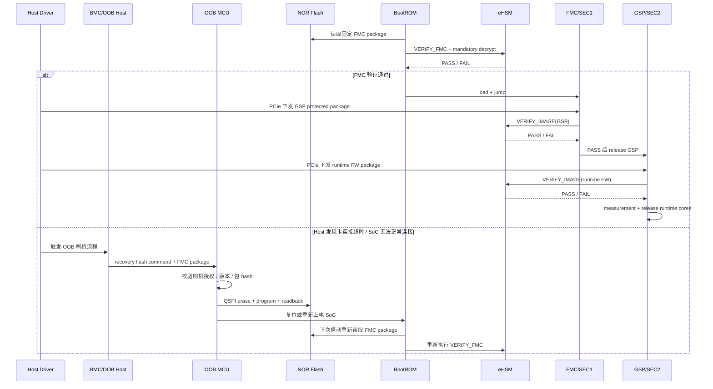

**图下步骤说明：**

1. BootROM 上电后读取固定 FMC 包，并调用 eHSM 进行验签和强制解密。
2. FMC 验证通过后，BootROM 做最小 manifest 检查并跳转 FMC。
3. SoC 正常连接后，Host 通过 PCIe 下发 GSP 和 Runtime 固件，FMC/GSP 分别调用 eHSM 验证。
4. 若 Host 发现卡连接超时，则不再依赖 SoC 通路，转而触发 BMC/OOB Host 和 OOB MCU。
5. OOB MCU 验证刷机命令和包，通过 QSPI 重写固定 FMC 分区，并复位 SoC，等待下一次 BootROM/eHSM 验证。


# 2. 安全总体架构

## 2.1 逻辑架构

### 图 2-1 总体安全架构

> 图片版总体架构图可与本文一同下载：`总体安全架构示意图.png`。
>
> 

```mermaid
flowchart LR
    subgraph OOB["板级安全域 / OOB Security Domain"]
        MCU["OOB MCU / 板级安全 MCU<br/>独立 Secure Boot / 独立信任链<br/>非 SoC RoT / 不访问 SoC Root Key"]
        QSPI["QSPI / Flash Controller"]
        FLASH["NOR Flash / Fixed FMC Partition<br/>NOR Flash 固定 FMC 分区"]
    end

    subgraph SOC["SoC 安全域 / SoC Security Domain"]
        BR["BootROM"]
        EH["eHSM<br/>(RoT)"]
        EF["eFuse / Root / Counter / Lifecycle"]
        FMC["FMC / SEC1"]
        GSP["GSP / SEC2"]
        FW["PM / RAS / OMP / RMP / Other FW"]
        DIAG["Boot Diagnostic Status<br/>(optional)<br/>boot_fail_reason / last_ehsm_status"]
    end

    subgraph EXT["外部 / 非可信域"]
        HOST["Host"]
        BMC["BMC / OOB Host"]
        TIMEOUT["PCIe timeout / card not connected<br/>trigger flashing"]
    end

    FLASH -->|read fixed FMC package| BR
    BR -->|VERIFY_FMC: verify + mandatory decrypt| EH
    EH --> EF
    EH -->|PASS / FAIL| BR
    BR -->|PASS: load + jump| FMC

    HOST -->|PCIe deliver GSP protected package| FMC
    FMC -->|VERIFY_IMAGE\nGSP| EH
    FMC -->|PASS 后 release| GSP
    HOST -->|PCIe deliver runtime FW package| GSP
    GSP -->|VERIFY_IMAGE\nruntime FW| EH
    GSP -->|verify / measure / release| FW

    HOST -.->|连接超时 / 未枚举| TIMEOUT
    TIMEOUT -.->|触发刷机| BMC
    BMC -->|recovery flash command + package| MCU
    MCU -->|erase / program / readback| QSPI
    QSPI -->|刷机不经过 SoC| FLASH

    BR -. optional diagnostic .-> DIAG
    EH -. optional diagnostic .-> DIAG
    MCU -. optional read diagnostic .-> DIAG

    HOST -. 不参与启动根路径 .-> EH
    MCU -. 非 SoC RoT .-> EH
```

**图下步骤说明：**

1. 安全启动根路径位于 SoC 域内：NOR Flash 固定 FMC 包 -> BootROM -> eHSM -> FMC。
2. 正常固件更新路径位于 SoC 正常运行态：Host 经 PCIe 下发 GSP/Runtime 包，FMC/GSP 调 eHSM 验证。
3. 刷机恢复路径位于板级 OOB 域：Host/BMC 触发 OOB MCU，OOB MCU 通过 QSPI 直接写 NOR Flash。
4. OOB MCU 具备独立信任链，只负责刷写合法性和写后校验，不访问 SoC Root Key。
5. eHSM 是 SoC RoT，负责下一次启动时判断 FMC 是否可执行。


## 2.2 角色职责

| 角色 | 软件职责 | 安全边界 |
| --- | --- | --- |
| BootROM | 最小平台初始化、读取 secure boot/lifecycle 配置、从固定 NOR Flash 地址读取 FMC package、调用 eHSM 验证和解密、做最小 manifest 检查、记录 measurement、跳转 FMC。 | 不持有私钥，不直接实现复杂验签/解密，不信任 Host 输入，不实现 A/B slot 选择和 fallback。 |
| FMC(SEC1) | 建立基础安全运行环境、初始化 Host PCIe 通道、接收 GSP protected package、调用 eHSM 验证 GSP、向 GSP 转交运行期安全控制面。 | 只在 eHSM PASS 和 manifest policy PASS 后放行 GSP。 |
| GSP(SEC2) | 后续 Runtime 固件验证、release 控制、measurement 维护、SPDM Responder、Debug/RMA、Provisioning 编排。 | 是运行期安全控制面，外部请求必须经其收敛。 |
| eHSM | Root Secret 使用、签名验证、解密、KDF/key unwrap、counter、lifecycle、debug auth、attestation signing。 | 私钥和根材料不出 eHSM，不接受 Host/OOB 直连调用。 |
| Host/Driver | 正常运行态通过 PCIe 传输 GSP/Runtime 固件包，发起 SPDM、状态查询、升级、Debug/RMA 请求；连接超时或卡不可达时，触发 OOB 刷机流程。 | 不可信，不参与启动根路径，不拥有 release 权，不直接写 NOR Flash、eHSM/eFuse/secure SRAM。 |
| BMC/OOB Host | 发起带外管理、运维、刷机恢复和电源控制请求；向 OOB MCU 发送 recovery flash command + package。 | 外部请求方，不直接访问 SoC Root；刷机包必须由 OOB MCU 进行授权检查。 |
| OOB MCU/板级安全 MCU | 纳入板级安全边界；自身具备独立 Secure Boot 和独立信任链；负责刷机包授权检查、QSPI 擦写、写后读回校验、电源/复位/JTAG MUX 等板级控制。 | 不进入 SoC eHSM Root of Trust，不持有 SoC Root Key，不替代 eHSM 判断 FMC 是否可启动。 |


## 2.3 信任边界

- **SoC 安全域**：eHSM、eFuse、Secure SRAM、SEC 执行区、证书/策略区属于 SoC 安全域；eHSM 是 SoC 启动可信性的唯一 RoT。
- **板级安全域**：OOB MCU 属于板级安全边界内的受控执行体。它的信任链与 SoC eHSM 信任链独立，负责“能不能刷”和“刷写是否一致”。
- **外部非可信域**：Host、BMC/OOB Host、运维工具属于外部请求方；它们可以传输包、触发流程、读取结果，但不能直接访问 SoC 根材料和安全控制寄存器。
- **正常更新边界**：Host PCIe 更新路径依赖 SoC 已启动到 FMC/GSP；Host 只下发 GSP/Runtime 包，FMC/GSP 调 eHSM 验证后装载和 release。
- **刷机恢复边界**：Host 发现卡连接超时后触发 OOB MCU；OOB MCU 通过 QSPI 直接写 NOR Flash 固定 FMC 分区。刷机过程不经过 SoC，不依赖 BootROM/FMC/GSP/eHSM 在线参与。
- **最终启动裁决**：OOB MCU 写入的 FMC package 在下一次 SoC 启动时仍必须经过 BootROM + eHSM verify + mandatory decrypt。OOB MCU 的写后校验只证明写入一致性，不证明 FMC 可执行。
- **诊断状态**：`boot_fail_reason / last_ehsm_status` 等 Boot Diagnostic Status 是可选故障定位信息，不作为刷机流程的必需触发条件。

## 2.4 顶层安全路径时序

### 图 2-2 BootROM / SEC / eHSM / Host / OOB 交互时序

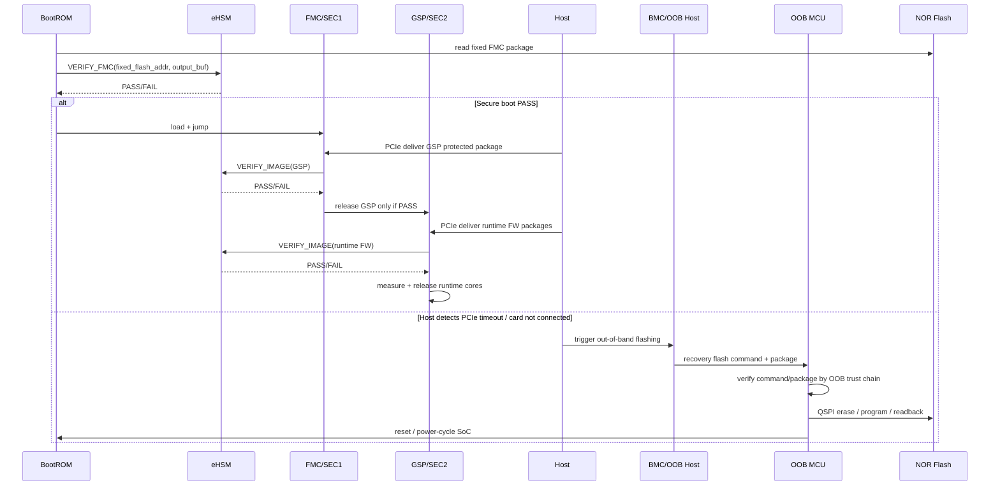

**图下步骤说明：**

1. BootROM 读取固定 FMC 包并调用 eHSM 验证。
2. 验证通过后，BootROM 加载并跳转 FMC。
3. Host 通过 PCIe 下发 GSP/Runtime，FMC/GSP 调 eHSM 验证并 release。
4. 当 Host 检测到卡不可连接或超时时，触发 OOB 刷机。
5. OOB MCU 独立完成刷机包验证、QSPI 写入和复位，不依赖 SoC 在线参与。


# 3. 安全启动

## 3.1 安全启动架构

### 图 3-1 安全启动架构

```mermaid
graph TD
    PR[Power / Reset] --> BR[SoC BootROM]
    PR --> EH[eHSM ROM/BL/FW]
    PR --> OOB[OOB MCU secure boot]

    OOB -->|QSPI flash path only| FLASH[NOR Flash<br/>Fixed FMC Partition]
    BR --> CFG[secure_boot_enable / lifecycle / strap / control field]
    EH --> eFuse[eFuse / Key / Lifecycle]

    BR -->|read fixed FMC package| FLASH
    BR -->|VERIFY_FMC via eHSM| EH
    EH -->|verify + decrypt PASS/FAIL| BR
    BR -->|PASS: load + jump| SEC1[FMC / SEC1]
    BR -. optional fail status .-> STATUS[Boot Diagnostic Status]
    OOB -. optional read diagnostic .-> STATUS

    SEC1 -->|PCIe init / Host channel| HOST[Host]
    HOST -->|normal update: deliver GSP package| SEC1
    SEC1 -->|VERIFY_IMAGE(GSP)| EH
    SEC1 -->|PASS: release GSP| SEC2[GSP / SEC2]
    HOST -->|normal update: deliver runtime FW package| SEC2
    SEC2 -->|VERIFY_IMAGE + measure + release| OTHERS[PM/RAS/Codec Cores]

    HOST -. timeout / card not connected .-> BMC[BMC / OOB Host]
    BMC -->|recovery flash command + package| OOB
    OOB -->|erase / program / readback| FLASH
```

**图下步骤说明：**

1. 上电后 BootROM、eHSM 和 OOB MCU 分别进入各自初始化路径。
2. BootROM 从固定 FMC 分区读取包，并调用 eHSM 做 VERIFY_FMC。
3. 验证通过后进入 FMC/GSP 正常启动与 PCIe 更新路径。
4. 验证失败时 BootROM 可选记录诊断状态，但刷机触发主要来自 Host 超时。
5. OOB MCU 通过 QSPI 写 NOR Flash，只承担带外刷机，不参与 SoC 启动 RoT。


## 3.2 安全启动详细时序

### 图 3-2 安全启动详细时序

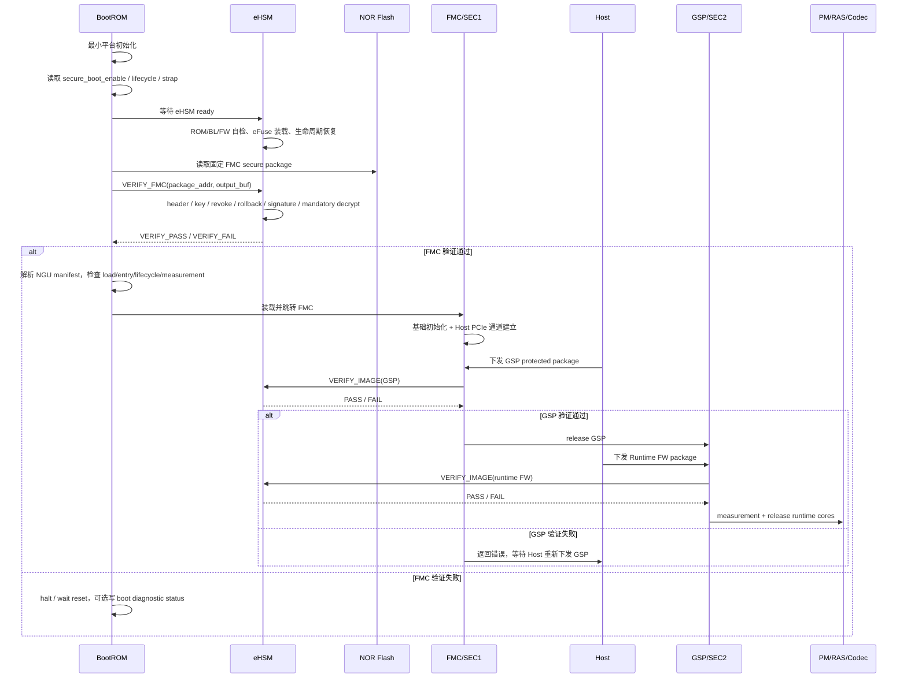

**图下步骤说明：**

1. BootROM 完成最小初始化并等待 eHSM ready。
2. eHSM 解析 FMC 包，完成 key、吊销、rollback、签名和强制解密检查。
3. FMC 通过后，BootROM 检查 manifest、load/entry 和 measurement，然后跳转。
4. FMC 建立 PCIe 通道后接收 GSP，调用 eHSM 验证并 release。
5. GSP 接收 Runtime 固件，验证、测量并 release 对应微核。


## 3.3 启动链

```text
BootROM -> FMC(SEC1, fixed NOR Flash partition) -> GSP(SEC2, Host 下发) -> PM/RAS/Codec/Other Runtime FW
```

关键规则：

1. FMC 来自 NOR Flash 固定分区，不由 Host 通过 SoC 启动链路下发。
2. BootROM 不选择 slot，不解析复杂 slot metadata，不执行 boot confirm/fallback 状态机。
3. BootROM 必须等待 eHSM ready，并调用 eHSM 完成 FMC 的 verify + decrypt。
4. FMC 和 GSP 在正式路径中必须签名 + 加密。
5. GSP 及后续 Runtime 固件由 Host 传输到 staging buffer，由 FMC/GSP 调 eHSM 验证后 release。
6. 任一关键镜像验证失败，不允许降级为继续执行。
7. FMC 验证失败后进入 OOB 刷机恢复等待，由 OOB MCU 通过 QSPI 重刷固定 FMC 分区。

## 3.4 启动阶段

| 阶段 | 执行体 | 输入 | 动作 | 输出 |
| --- | --- | --- | --- | --- |
| A. BootROM early | BootROM | strap、lifecycle、control field | 最小初始化，等待 eHSM ready，定位固定 FMC 分区。 | eHSM ready 或失败码。 |
| B. FMC 验证 | BootROM + eHSM | 固定 FMC package | eHSM native verify/decrypt、rollback、revoke、manifest policy。 | FMC plaintext code region 或失败码。 |
| C. FMC 装载 | BootROM | eHSM 输出 buffer、NGU manifest | load/entry 白名单、measurement、跳转。 | FMC 执行。 |
| D. GSP 验证 | FMC + eHSM | Host 下发 GSP package | verify/decrypt、rollback、manifest policy、measurement。 | GSP 执行。 |
| E. Runtime 验证 | GSP + eHSM | Host 下发 Runtime FW | verify/decrypt 或 signature-only 白名单检查、measurement。 | PM/RAS/Codec release。 |
| F. OOB 刷机恢复 | OOB MCU | Host/BMC 下发 FMC recovery package | 授权检查、QSPI 擦写、写后读回校验、触发 SoC reset。 | 新 FMC 等待 BootROM/eHSM 验证。 |

## 3.5 镜像策略

| 镜像 | 来源 | 验证发起 | 验证执行 | 强制保护 | Release Owner |
| --- | --- | --- | --- | --- | --- |
| FMC(SEC1) | 本地 NOR Flash 固定分区 | BootROM | eHSM | 强制签名 + 加密 + rollback + revoke | BootROM |
| GSP(SEC2) | Host/PCIe staging buffer | FMC | eHSM | 强制签名 + 加密 + rollback + revoke | FMC/GSP |
| PM/RAS/Codec | Host/PCIe staging buffer | GSP | eHSM | USER/PROD 默认签名 + 加密；signature-only 需白名单 | GSP |
| FMC recovery package | Host/BMC -> OOB MCU | OOB MCU 预检查；最终 BootROM/eHSM 裁决 | OOB MCU 授权检查 + BootROM/eHSM verify/decrypt | 包授权 + FMC 自身签名加密 | OOB MCU 只负责刷写，BootROM 最终放行 |


## 3.6 失败处理

- FMC verify/decrypt 失败：BootROM 停止跳转 FMC，可选记录 `boot_fail_reason`、`ehsm_status`、`manifest_status` 等诊断信息，等待复位或下一次刷机后重启。
- FMC manifest policy 失败：按 FMC 验证失败处理，不跳转。
- GSP 验证失败：FMC 拒绝跳转 GSP，保持基础安全控制面，允许 Host 通过 PCIe 重新下发 GSP。
- Runtime 固件验证失败：GSP 拒绝对应微核 release，Host 可重新下发对应 Runtime 包。
- eHSM 未 ready 或 mailbox 超时：BootROM/FMC/GSP 进入受控失败路径，不允许旁路。
- Host 发现卡连接超时、PCIe 枚举失败或心跳超时：Host/BMC 触发 OOB MCU 刷机流程；该触发不依赖 BootROM 已经写入 `recovery_required`。
- USER/PROD 生命周期不允许自动降级到非安全启动。

### 图 3-3 BootROM 单 FMC 分区状态机

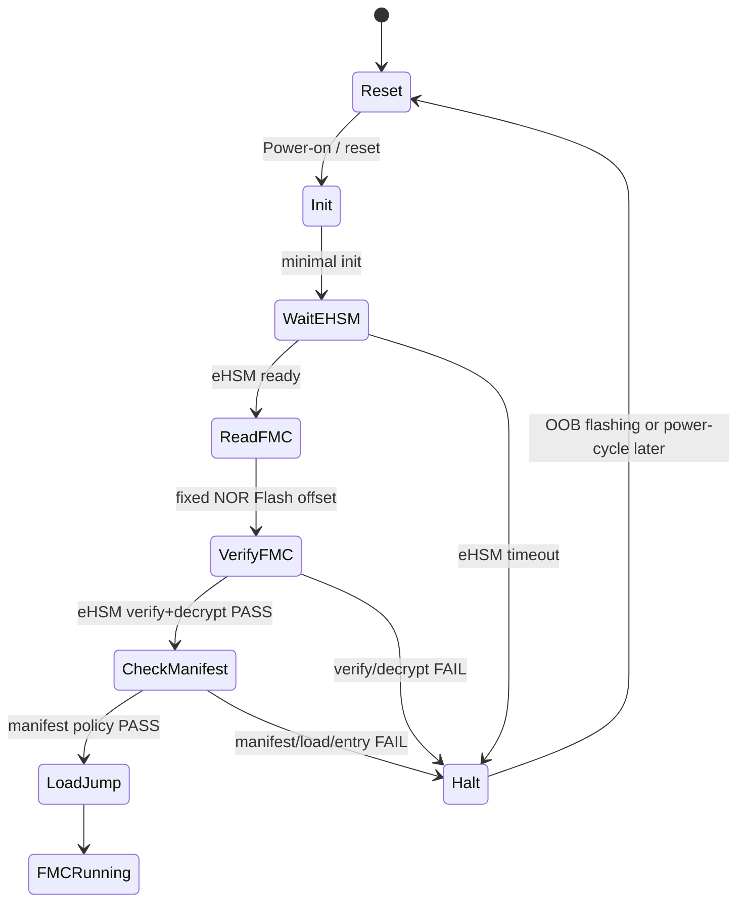

**图下步骤说明：**

1. Reset 后 BootROM 做最小初始化并等待 eHSM。
2. eHSM ready 后，BootROM 从固定 NOR Flash 偏移读取 FMC。
3. eHSM verify/decrypt 通过后进入 manifest 检查。
4. manifest、load/entry 通过后加载并跳转 FMC。
5. 任一失败进入 Halt，等待 OOB 刷机或电源复位后重新启动。


## 3.7 FMC 单分区 + OOB MCU 刷机恢复

### 3.7.1 设计定位

本方案将“固件更新”和“刷机恢复”拆成两条独立路径：

```text
正常固件更新：
SoC 已启动到 FMC/GSP
    -> Host 通过 PCIe 下发 GSP 或 Runtime protected package
    -> FMC/GSP 调 eHSM VERIFY_IMAGE
    -> 验证通过后装载、measurement、release

刷机恢复：
Host 发现卡连接超时 / PCIe 枚举失败 / 心跳超时
    -> Host/BMC 触发 OOB MCU
    -> OOB MCU 验证 recovery flash command + FMC package
    -> OOB MCU 经 QSPI 擦写 NOR Flash 固定 FMC 分区
    -> OOB MCU 复位或重新上电 SoC
    -> BootROM + eHSM 在下一次启动中验证 FMC
```

该方案的设计边界如下：

| 项目 | 裁决 |
| --- | --- |
| 正常更新对象 | GSP、PM/RAS/OMP/RMP/Codec 等 Runtime 固件。 |
| 正常更新通路 | Host PCIe -> SoC staging buffer -> FMC/GSP -> eHSM `VERIFY_IMAGE`。 |
| 刷机对象 | NOR Flash 固定 FMC 分区。 |
| 刷机通路 | Host/BMC/OOB Host -> OOB MCU -> QSPI -> NOR Flash。 |
| 是否经过 SoC | 正常更新经过 SoC；刷机恢复不经过 SoC。 |
| 自动 fallback | 首版不支持 BootROM A/B fallback，由 OOB MCU 刷机恢复替代。 |
| 掉电刷写保护 | 不要求 BootROM 具备掉电恢复状态机；若刷写中断，Host/BMC 可重新发包，OOB MCU 可重新刷写。 |
| BootROM 复杂度 | 删除 slot metadata、active/fallback、boot confirm、boot attempt counter、metadata 原子更新逻辑。 |
| 最终可信裁决 | OOB MCU 只负责刷写授权和写后校验；FMC 是否可信仍由 BootROM + eHSM 决定。 |

### 图 3-4 固件更新与刷机恢复双路径流程

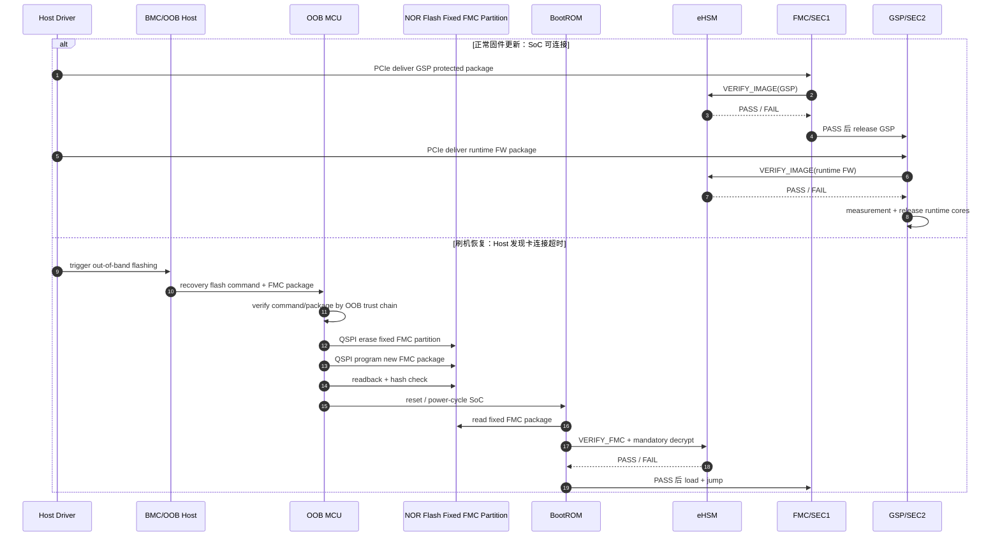

**图下步骤说明：**

1. 正常更新分支：Host 通过 PCIe 下发 GSP，FMC 调 eHSM 验证，通过后 release GSP。
2. GSP 运行后，Host 继续通过 PCIe 下发 Runtime FW，GSP 调 eHSM 验证、测量并 release。
3. 刷机恢复分支：Host 发现卡连接超时后触发 BMC/OOB Host。
4. OOB MCU 验证刷机命令和 FMC 包后，通过 QSPI 擦写、编程和读回校验固定 FMC 分区。
5. 复位后，BootROM/eHSM 对新刷入的 FMC 再次执行启动级验证。


### 图 3-5 OOB 刷机恢复状态机

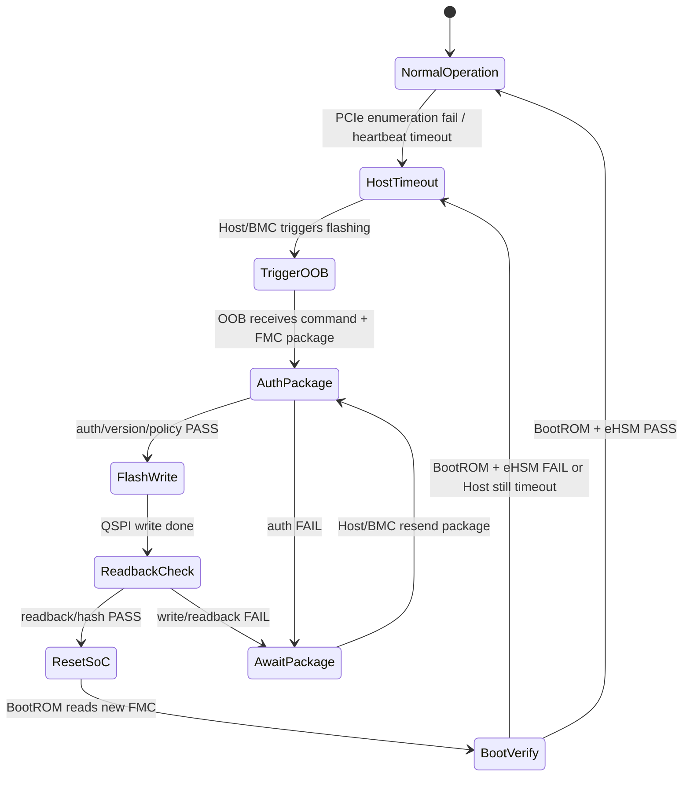

**图下步骤说明：**

1. 设备正常运行时处于 NormalOperation。
2. Host 检测到 PCIe 枚举失败或心跳超时后进入 HostTimeout。
3. BMC/OOB Host 触发 OOB MCU 并下发刷机命令和 FMC 包。
4. OOB MCU 授权验证通过后写 Flash，失败则等待重发。
5. 写后校验通过后复位 SoC，BootROM/eHSM 决定是否回到正常运行。


### 3.7.2 OOB MCU 刷写约束

| 项目 | 约束 |
| --- | --- |
| OOB MCU 自身可信 | OOB MCU 必须有独立 secure boot、升级鉴权、调试关闭、生命周期或板级授权状态。 |
| 触发条件 | Host PCIe 枚举失败、连接超时、心跳超时、运维/RMA/制造授权刷机；不要求 BootROM 先设置 `recovery_required`。 |
| QSPI ownership | OOB MCU 执行刷写前必须获得 NOR Flash QSPI ownership，SoC 侧不得同时访问。 |
| 写入范围 | OOB MCU 只允许写固定 FMC 分区和授权允许的恢复状态区，不得写 eHSM/eFuse/SEC 执行区/证书私钥区。 |
| 包授权 | FMC recovery package 必须有 update authorization token 或等价签名授权。 |
| 写后校验 | OOB MCU 必须执行 readback/hash 校验；该校验只证明写入一致性，不证明 FMC 可执行。 |
| 最终验证 | BootROM/eHSM 必须在下一次启动时重新验证签名、解密、rollback、manifest policy 和 load/entry 白名单。 |
| 重发重刷 | 若掉电或写入失败，Host/BMC 可重新下发 package，OOB MCU 可重复擦写固定 FMC 分区。 |
| 审计 | recovery package ID、version、hash、授权方、刷写结果、BootROM 验证结果进入 audit/attestation 可见状态。 |

## 3.8 单分区模式下的密钥轮换边界

取消 FMC A/B 后，密钥轮换不再依赖 inactive slot 的启动确认。本章只保留与启动链相关的结论：

1. BootROM 不维护 key rotation 状态机，只消费 eHSM/eFuse/control field 中已经生效的 key slot、revoke bitmap、version counter 和 policy 结果。
2. 新旧 key 过渡期必须由 eHSM key policy、升级授权 capsule、OOB 刷机恢复包和 attestation 状态共同约束。
3. 旧 key 不得在新 FMC 启动成功、OOB recovery 包可用、rollback/counter 状态一致之前被撤销。
4. 密钥轮换的完整对象、槽位、状态机和流程在第 7 章“密钥轮换管理与鉴权策略”中统一定义。


# 4. 固件包格式与验证解密流程

### 图 4-1 eHSM native package 与 NGU manifest 分层

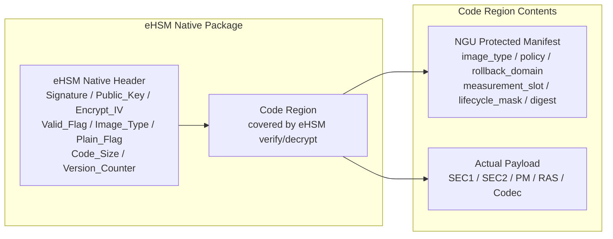

**图下步骤说明：**

1. eHSM native header 承载 eHSM 原生认证/加密控制字段。
2. Code region 由 eHSM verify/decrypt 保护。
3. NGU protected manifest 位于 Code region 内，eHSM PASS 后才可被 BootROM/SEC 解析。
4. payload 也位于受保护 Code region 内，manifest 指示其类型、版本、load/entry 和 measurement slot。


### 图 4-2 SEC1 secure image file 组成

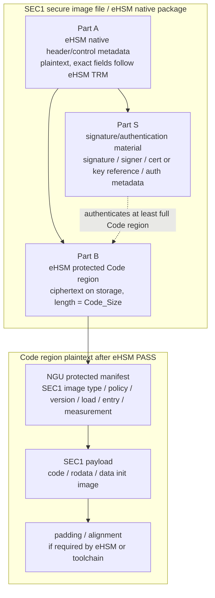

**图下步骤说明：**

1. Part A 是 eHSM native header/control metadata，用于 eHSM 解密前解析。
2. Part S 是 eHSM 原生签名/认证材料，认证至少覆盖完整 Code region。
3. Part B 是受保护 Code region，正式路径下为密文。
4. eHSM PASS 后，Code region 明文包含 NGU manifest、SEC1 payload 和 padding。


## 4.1 eHSM native package

FMC、GSP 和受保护 Runtime 固件采用 eHSM native secure image package。物理格式以 eHSM TRM 为准，NGU 不再定义第二套 physical verification header。

```text
[eHSM native header, plaintext, 1KB]
    Signature / Public_Key / IV / Valid_Flag / Image_Type / Plain_Flag
    Naked_Flag / Code_Size / Version_Counter / Public_Key_Ext / Reserved

[Code region, verified/decrypted by eHSM]
    NGU protected manifest
    firmware payload
    padding/alignment
```

## 4.2 eHSM header 字段使用规则

| 字段 | NGU 使用规则 |
| --- | --- |
| Signature | eHSM 原生签名或认证材料，NGU 不另行定义尾随 signature。 |
| Public_Key / Public_Key_Ext | eHSM 原生公钥或 key material 字段，不作为 NGU 证书区。 |
| Encrypt_IV | 加密 IV/nonce 元数据，语义跟随 eHSM profile。 |
| Valid_Flag | eHSM image valid marker，不扩展为 NGU release policy。 |
| Image_Type | 只表达 eHSM 原生类型，不承载 NGU 的 FMC/GSP/PM/RAS/Codec。 |
| Plain_Flag | 必须与 NGU manifest 的 decrypt_required 一致；FMC/GSP 正式路径不得为明文 profile。 |
| Naked_Flag | 仅用于 eHSM 允许的测试/开发 profile，USER 不依赖裸镜像。 |
| Code_Size | 覆盖 manifest、payload、padding 的完整 Code region。 |
| Version_Counter | eHSM physical anti-rollback 输入；NGU rollback_domain 只能映射到该机制。 |
| Reserved | 必须按 TRM 处理，不承载 NGU 自定义字段。 |

## 4.3 NGU protected manifest

NGU 项目级字段全部放入 eHSM 认证/解密后的 Code region。BootROM/FMC/GSP 只能在 eHSM PASS 后解析 manifest。

| 字段语义 | 用途 |
| --- | --- |
| magic / manifest_version / manifest_size | 标识 manifest ABI，拒绝未知或不兼容版本。 |
| ngu_image_type | 表达 FMC、GSP、PM、RAS、Codec 等项目级类型。 |
| security_policy_flags | 表达 sign_required、decrypt_required、rollback_required、measure_required、release_policy。 |
| payload_offset / payload_size | 定位 payload，必须完全落入 Code_Size。 |
| load_addr / entry_addr | 装载和跳转地址，必须命中白名单。 |
| rollback_domain / version | 项目级版本视图，映射到 eHSM version counter。 |
| measurement_slot | 指定进入 measurement table 的 slot。 |
| lifecycle_mask | 指定允许的 lifecycle 集合，最终以 eHSM/eFuse lifecycle 为准。 |
| product_sku_mask | 产品/SKU 策略。 |
| board_binding_policy | 板级绑定结果的 attestation/release 表达。 |
| expected_algorithm_profile | 与 eHSM control field 做一致性检查，不覆盖 eHSM 算法选择。 |
| payload_digest | payload digest 描述，hash profile 跟随产品策略。 |
| extension_offset / extension_size | TLV 或扩展区，必须边界检查。 |

## 4.4 设备侧验证解密流程

1. BootROM/FMC/GSP 定位 package，检查 `image_addr`、`image_len`、`output_addr` 是否处于白名单区域。
2. 调用 eHSM `bl_verify_image`、`soc_verify` 或项目 wrapper。
3. eHSM 解析 native header，检查 `Image_Type`、`Plain_Flag`、`Code_Size`、`Version_Counter`、key/signer/revoke/rollback/signature。
4. eHSM 对 Code region 进行认证和解密，输出 plaintext Code region 到受控 output buffer。
5. 调用方在 eHSM PASS 后解析 NGU manifest。
6. 调用方检查 `ngu_image_type`、policy flags、lifecycle、rollback、load/entry、measurement slot、algorithm profile。
7. 通过后记录 measurement，装载 payload，并执行 release 或 jump。

## 4.5 固件包制作与设备侧校验流程图

### 图 4-3 平台侧 SEC1 固件制作流程

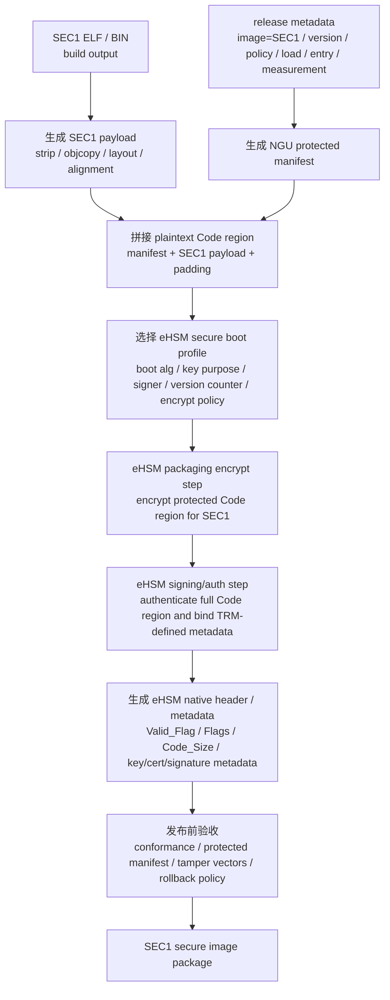

**图下步骤说明：**

1. 从 SEC1 ELF/BIN 生成 payload。
2. 根据发布元数据生成 NGU protected manifest。
3. manifest 与 payload 拼接为 plaintext Code region。
4. 选择 eHSM profile 后执行加密和签名/认证。
5. 发布前用 golden/tamper vector 做一致性和失败路径检查。


### 图 4-4 通用固件包制作流程

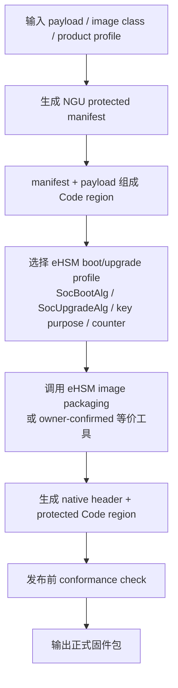

**图下步骤说明：**

1. 输入 payload、镜像类型和产品 profile。
2. 生成 NGU protected manifest 并和 payload 组成 Code region。
3. 选择 eHSM boot/upgrade profile、key/counter 和算法配置。
4. 生成 eHSM native package。
5. 输出前完成格式、策略、rollback 和 tamper 检查。


### 图 4-5 设备侧 verify/decrypt 与 manifest policy 流程

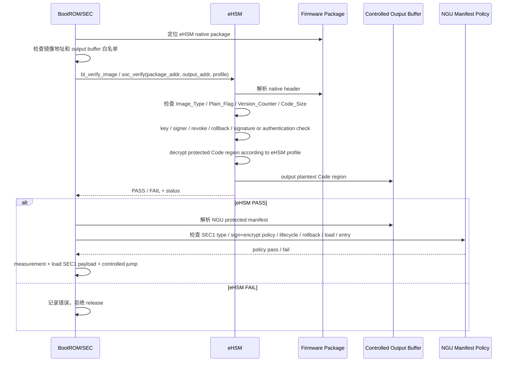

**图下步骤说明：**

1. BootROM/SEC 先定位包并准备受控输出 buffer。
2. eHSM 解析 native header 并完成 key、签名、rollback 和解密。
3. eHSM PASS 前，BootROM/SEC 不信任 manifest。
4. PASS 后解析 NGU manifest 并执行 policy 检查。
5. policy 通过后才 measurement、load 和 release。


### 图 4-6 实现级设备侧包校验流程

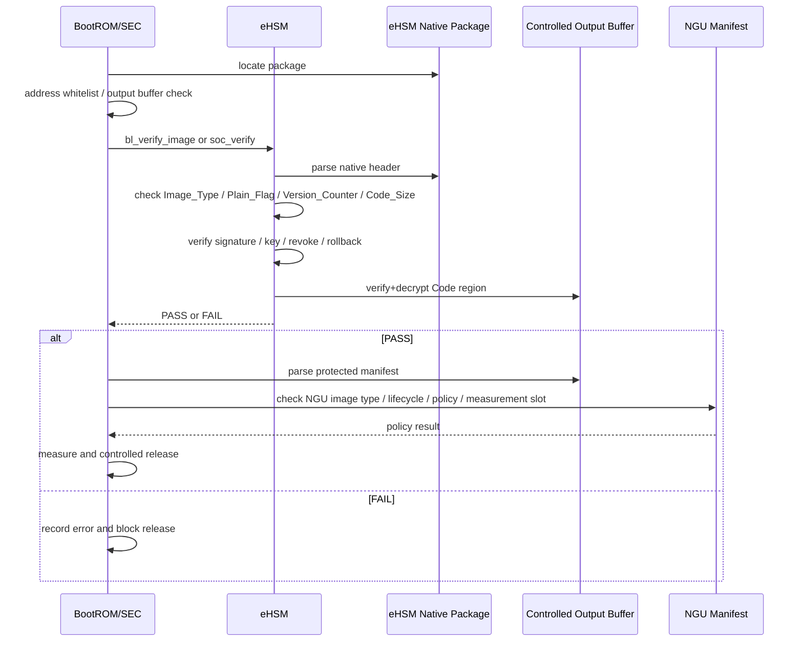

**图下步骤说明：**

1. BootROM/SEC 将包地址和输出 buffer 传给 eHSM。
2. eHSM 完成原生包解析、验签、反回滚和解密输出。
3. BootROM/SEC 对 manifest 的 image_type、policy、地址和长度做白名单检查。
4. 检查通过后记录 measurement。
5. 最终按当前阶段执行 jump 或 release。


# 5. SEC 与 eHSM 接口

## 5.1 接口模型

SEC 与 eHSM 之间使用 Mailbox + shared memory。Mailbox 寄存器只传递包地址、doorbell 和状态，完整请求/响应包放在共享内存。Host、BMC/OOB Host 不得直接调用 eHSM Mailbox；OOB MCU 即使纳入板级安全边界，也只能通过 SEC/GSP 代理或受控板级接口协作，不能直连 eHSM 原生命令。
### 图 5-1 内外部接口架构

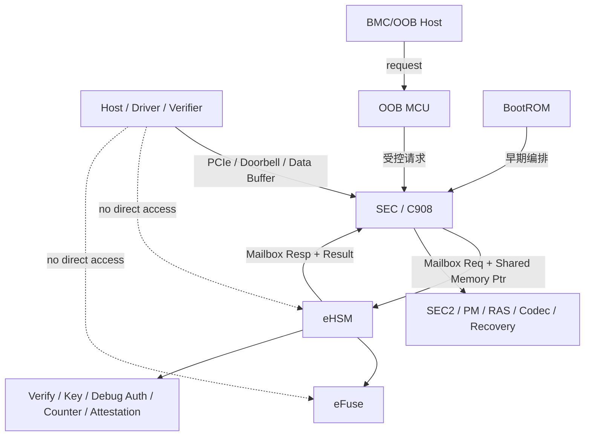

**图下步骤说明：**

1. Host/BMC/OOB 请求先进入 SEC/GSP 或 OOB MCU 受控路径。
2. SEC 通过 Mailbox 和 Shared Memory 调用 eHSM。
3. eHSM 访问 eFuse 并执行 verify/key/debug/counter/attestation 服务。
4. 外部实体不得直连 eHSM/eFuse。
5. OOB 刷机走 QSPI，不属于 SEC->eHSM 正常安全服务调用。


### 图 5-2 Host/BMC 经 SEC 调用 eHSM 的时序

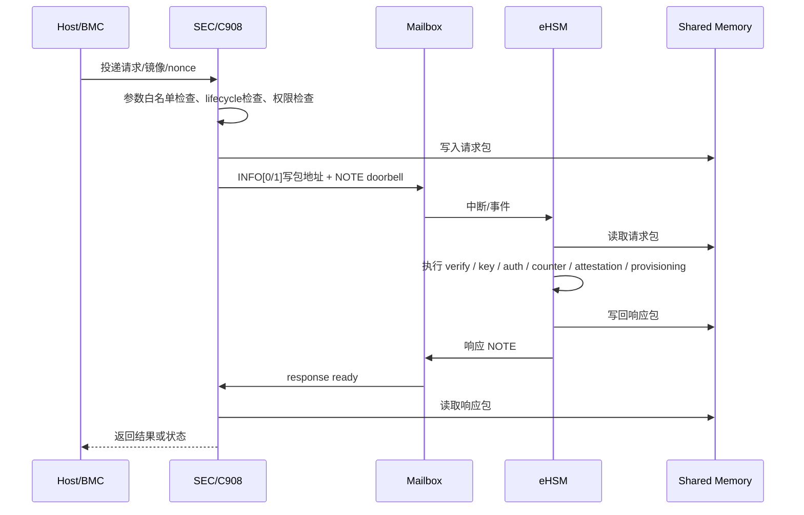

**图下步骤说明：**

1. Host/BMC 将请求投递给 SEC。
2. SEC 做参数、地址、lifecycle 和权限检查。
3. SEC 在共享内存构造请求包并通过 mailbox doorbell 通知 eHSM。
4. eHSM 执行安全服务并写回响应。
5. SEC 读取响应并将结果返回外部请求方。


### 图 5-3 Mailbox 实现级逻辑关系

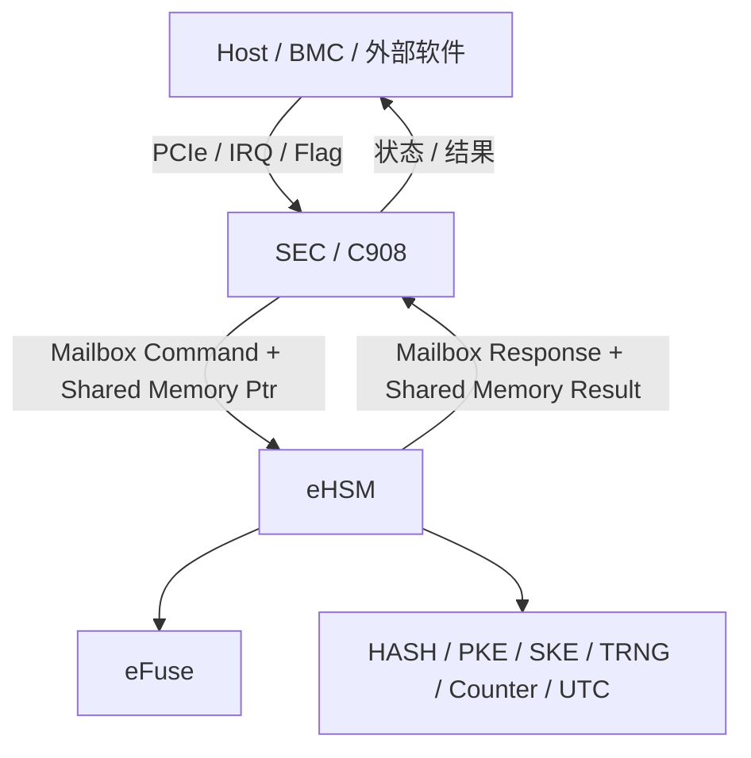

**图下步骤说明：**

1. Host/BMC 只和 SEC 控制面交互。
2. SEC 将命令和共享内存指针写入 Mailbox。
3. eHSM 从共享内存读取请求并执行安全操作。
4. eHSM 写回响应，SEC 再消费结果。
5. 安全 buffer 需受地址白名单和 firewall 保护。


### 图 5-4 Mailbox 请求路径时序

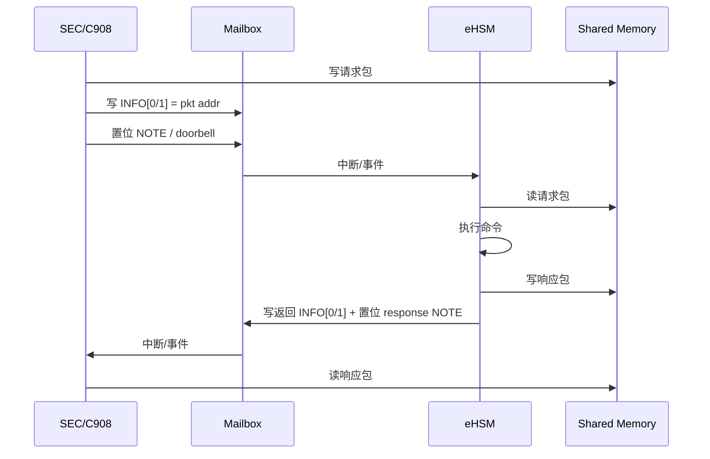

**图下步骤说明：**

1. SEC 写请求包到共享内存。
2. SEC 写 Mailbox INFO/doorbell 触发 eHSM。
3. eHSM 读取请求包、执行命令并写响应包。
4. eHSM 通过响应 doorbell 通知 SEC。
5. SEC 做 cache invalidate/barrier 后读取响应。


## 5.2 通用请求头

```c
typedef struct {
    uint16_t cmd_id;
    uint16_t hdr_ver;
    uint32_t total_len;
    uint32_t token;
    uint32_t caller_id;
    uint32_t lifecycle_state;
    uint32_t flags;
    uint32_t payload_off;
    uint32_t payload_len;
    uint32_t resp_buf_off;
    uint32_t resp_buf_len;
} ngu_mb_req_hdr_t;
```

## 5.3 通用响应头

```c
typedef struct {
    uint16_t cmd_id;
    uint16_t hdr_ver;
    uint32_t total_len;
    uint32_t token;
    uint32_t status;
    uint32_t err_code;
    uint32_t detail0;
    uint32_t detail1;
    uint32_t detail2;
    uint32_t detail3;
} ngu_mb_resp_hdr_t;
```

## 5.4 命令表

| Cmd ID | 命令 | 用途 | Caller |
| --- | --- | --- | --- |
| 0x0001 | VERIFY_SEC1 / VERIFY_FMC | FMC 验签、强制解密、rollback、measurement。 | BootROM early path / SEC |
| 0x0002 | VERIFY_IMAGE | GSP/Runtime package verify/decrypt 和 manifest policy。 | SEC |
| 0x0003 | VERIFY_MEASURE | 验签、按策略解密并更新 measurement。 | SEC |
| 0x0020 | GET_CHALLENGE | Debug/SPDM/RMA challenge。 | SEC |
| 0x0021 | DEBUG_AUTH | Debug/RMA 授权校验。 | SEC |
| 0x0022 | CLOSE_DEBUG | 关闭 Debug scope。 | SEC |
| 0x0023 | CHANGE_LIFECYCLE | 生命周期切换。 | SEC |
| 0x0040 | READ_COUNTER | 读取 rollback/version counter。 | SEC |
| 0x0041 | INCREASE_COUNTER | 提升 counter。 | SEC |
| 0x0060 | KEY_DERIVE | eHSM 控制的 KDF/key unwrap。 | SEC |
| 0x0080 | GEN_ATTEST_REPORT | 生成或签署 attestation report。 | SEC |
| 0x00A0 | PROVISION_ROOT | 制造阶段灌装根材料、anchor 和 policy。 | SEC / MANU |

## 5.5 Verify Image 请求/响应字段

```c
typedef struct {
    ngu_mb_req_hdr_t hdr;
    uint64_t image_addr;
    uint32_t image_len;
    uint32_t ehsm_image_type_expected;
    uint32_t ngu_image_type_expected;
    uint32_t verify_policy;
    uint32_t expected_lcs_mask;
    uint32_t decrypt_required;
    uint32_t rollback_required;
    uint32_t expected_algorithm_profile;
    uint32_t measurement_slot;
    uint32_t jump_on_pass;
    uint64_t dst_addr;
} ngu_mb_verify_image_req_t;

typedef struct {
    ngu_mb_resp_hdr_t hdr;
    uint32_t ehsm_version_counter_checked;
    uint32_t ngu_rollback_domain;
    uint32_t signer_key_ref;
    uint32_t measurement_slot;
    uint32_t rollback_checked;
    uint32_t decrypt_applied;
    uint32_t decrypt_result;
    uint32_t policy_state;
} ngu_mb_verify_image_resp_t;
```

关键约束：

- `ehsm_image_type_expected` 只使用 eHSM TRM 语义。
- `ngu_image_type_expected` 用于 NGU release policy、measurement 和 attestation 映射。
- `expected_algorithm_profile` 只做一致性检查，不覆盖 eHSM control field。
- `jump_on_pass` 不能让 Host 间接控制跳转。
- `dst_addr` 必须命中 SEC/BootROM 白名单。
- `decrypt_result` 必须区分未执行、成功、失败和 policy mismatch。

# 6. 密钥、证书与制造灌装

### 图 6-1 Root of Trust、密钥与证书体系架构

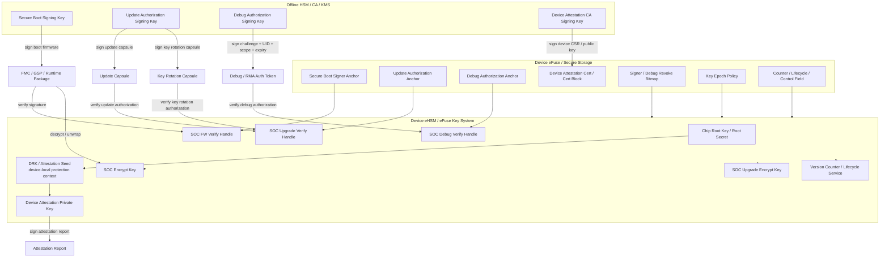

**图下步骤说明：**

1. 离线 HSM/CA/KMS 持有启动签名、升级授权、Debug 授权和设备证书签发私钥。
2. 设备侧保存 anchor、revoke policy、key epoch 和证书块。
3. eHSM 内部使用 root/key/counter/lifecycle 服务执行固件验签、解密、证明和 Debug 授权。
4. 外部私钥不进入设备，设备 root key 不出 eHSM。


### 图 6-2 密钥、固件验证、证明与 Debug 授权时序

```mermaid
sequenceDiagram
    participant HSM as Offline HSM/CA/KMS
    participant EF as eFuse
    participant EH as eHSM
    participant SEC as SEC/C908
    participant FW as Firmware Package
    participant V as Verifier
    participant DBG as Debug Client

    HSM->>FW: sign boot firmware / update capsule / key rotation capsule
    HSM->>DBG: issue debug or RMA scoped token
    EF->>EH: 提供 UDS / Root Secret / signer anchor / lifecycle / counter / key slot policy
    EH->>EH: 初始化 eHSM key domains
    EH->>EH: 准备 device-local DRK / Attestation Seed / Device Identity KeyPair
    EH->>EH: 绑定 FW verify / encrypt key slots 与 lifecycle / key slot policy
    EH->>EH: 绑定 Debug authorization anchor 与 scope policy

    SEC->>EH: VERIFY / DECRYPT_IMAGE(req)
    EH->>FW: 使用 Soc FW Verify / Upgrade Verify key 或 signer anchor 校验镜像
    FW-->>EH: PASS / FAIL
    EH->>FW: 按 Soc Encrypt / Upgrade Encrypt / FW_KEK policy 解密输出
    FW-->>EH: decrypt output / policy result
    EH-->>SEC: verify / decrypt result

    V->>SEC: challenge / nonce
    SEC->>EH: GEN_ATTEST_REPORT
    EH->>EH: 使用 Device Attestation KeyPair / Attestation Seed 组织并签署 report
    EH-->>SEC: signed report
    SEC-->>V: report + Device Attestation Cert / cert reference
    V->>V: verify report by device attestation issuer anchor

    DBG->>SEC: debug/RMA auth request + scoped token
    SEC->>EH: DEBUG_AUTH
    EH->>EH: 使用 Debug authorization anchor 校验 challenge / UID / scope / expiry / reason
    EH-->>SEC: granted / denied
```

**图下步骤说明：**

1. 离线 HSM 生成固件包、升级授权和 Debug/RMA token。
2. eFuse/eHSM 初始化根材料、anchor、counter 和 lifecycle。
3. SEC 请求 eHSM 验证/解密固件。
4. Verifier 发起 challenge，eHSM 使用设备证明密钥签署报告。
5. Debug client 提交授权 token，eHSM 校验后返回 scope。


## 6.1 密钥体系

NGU800 密钥体系分为三类，不把所有密钥描述为一棵设备内派生树。

| 体系 | 私钥位置 | 设备侧保存内容 | 主要用途 |
| --- | --- | --- | --- |
| 外部签名/授权体系 | 离线 HSM/CA/KMS/签名服务器 | signer anchor、public key hash、revoke bitmap、debug anchor、update anchor | 固件签名、升级授权、Debug/RMA token、设备证书签发。 |
| 设备内部 eHSM key 体系 | eHSM/eFuse/KMU 内部 | key handle、control field、counter、lifecycle、key slot policy | 固件解密、key unwrap、attestation private key 使用、counter/lifecycle 控制。 |
| 设备身份与证书体系 | 证明私钥在 eHSM；证书签发私钥在离线 CA/HSM | Device Attestation Cert、issuer anchor、cert serial/hash | 设备身份和 report 签名验证。 |

## 6.2 外部签名/授权密钥

| 对象 | 用途 | 设备侧对应 |
| --- | --- | --- |
| secure_boot_signing_key | 签 FMC/GSP/Runtime 启动固件包。 | secure_boot_signer_anchor / signer hash。 |
| firmware_packaging_encrypt_key | 制作加密固件包或包裹 per-image CEK。 | soc_encrypt_key / soc_upgrade_encrypt_key / FW_KEK policy。 |
| update_authorization_signing_key | 签 update capsule、key rotation capsule。 | update_authorization_anchor / key_epoch_policy。 |
| debug_authorization_signing_key | 签 Debug/RMA scoped token。 | debug_authorization_anchor / debug revoke bitmap。 |
| device_attestation_ca_signing_key | 签 Device Attestation Cert。 | device_attestation_issuer_anchor 或 Verifier trust anchor。 |

## 6.3 设备内部 eHSM 对象

| 对象 | 位置 | 是否导出 | 用途 |
| --- | --- | --- | --- |
| UDS / Root Secret | eFuse/eHSM 安全区 | 否 | 设备内部根材料上游。 |
| chip_root_key / DRK | eHSM 内部 | 否 | device-local protection / attestation seed 域。 |
| soc_encrypt_key | eHSM/KMU | 否 | FMC/GSP Code region 解密。 |
| soc_upgrade_encrypt_key | eHSM/KMU | 否 | 升级包和 key material 保护。 |
| soc_fw_verify_handle | eHSM key handle / anchor | 不导出私钥 | 固件验签。 |
| soc_upgrade_verify_handle | eHSM key handle / anchor | 不导出私钥 | 升级/轮换授权验签。 |
| soc_debug_verify_handle | eHSM key handle / anchor | 不导出私钥 | Debug/RMA token 验签。 |
| device_attestation_private_key | eHSM 内部 | 否 | 签署 attestation report。 |
| version counter / lifecycle state | eHSM/eFuse | Host 不可写 | rollback、lifecycle gating。 |

## 6.4 设备证明证书流程
### 图 6-3 Device Attestation Key / CSR / 证书签发流程

```mermaid
sequenceDiagram
    participant DEV as Device eHSM
    participant SEC as SEC/GSP or Provisioning FW
    participant CA as Offline CA/HSM
    participant STORE as Device Cert Store

    SEC->>DEV: Generate or derive Device Attestation KeyPair
    DEV-->>SEC: Public Key / CSR, private key remains inside eHSM
    SEC->>CA: Submit CSR + chip_id + product info + manufacturing record
    CA->>CA: Verify manufacturing authorization
    CA-->>SEC: Device Attestation Cert / Cert Block
    SEC->>STORE: Write cert block to protected storage
    SEC->>DEV: Lock identity / lifecycle policy if required
```

**图下步骤说明：**

1. eHSM 在设备内部生成或派生设备证明密钥。
2. Provisioning FW/SEC 导出公钥或 CSR。
3. 离线 CA/HSM 校验制造记录后签发 Device Attestation Cert。
4. 证书写回设备证书区。
5. 运行期 attestation report 携带证书或证书引用。


```text
Device eHSM 生成或派生 Device Attestation KeyPair
    -> 仅导出 Public Key / CSR
    -> Offline CA/HSM 校验制造记录、chip_id、product info
    -> CA 签发 Device Attestation Cert / Cert Block
    -> 设备写入受保护证书区或由 Verifier 侧预置
    -> eHSM 使用私钥签署 report，Verifier 使用证书和 issuer anchor 验证
```

边界规则：

- Device Attestation Private Key 不导出。
- Offline CA/HSM 只获得 CSR/公钥，不获得设备私钥。
- Attestation report 必须绑定 nonce、measurement、lifecycle、debug、secure boot、rollback、FMC 固定分区版本/key epoch/recovery state 等状态。
- 固件验签、Debug 授权和设备证明使用不同授权域，不用 Device Attestation 成功替代 Debug Auth。

## 6.5 制造灌装流程

### 图 6-4 制造灌装架构

```mermaid
graph TD
    HSM[Factory HSM / KMS] --> TOOL[Provisioning Tool / 工站]
    TOOL --> HOST[Host / BMC / 工装链路]
    HOST --> SEC[SEC / C908]
    SEC --> EH[eHSM]
    EH --> eFuse[eFuse]
    EH --> CFG[Control Bits / Lifecycle / Counter]
    EH --> KEY[Root / Anchor / Attestation / Debug Objects]

    SEC --> BOOT[MANU 验证启动]
    BOOT --> USER[USER 冻结]
    USER --> DEPLOY[量产部署]
    USER --> RMA[RMA / DEBUG 授权返修]
    RMA --> RESTORE[恢复量产安全状态]
```

**图下步骤说明：**

1. Factory HSM/KMS 准备根材料、anchor、证书和策略。
2. Provisioning Tool 通过 Host/BMC/工装链路进入 SEC。
3. SEC 调用 eHSM 完成灌装、锁定和验证。
4. eFuse 持久保存 root/control/counter/lifecycle。
5. 审计系统记录灌装与生命周期推进结果。


### 图 6-5 制造灌装时序

```mermaid
sequenceDiagram
    participant TOOL as Provisioning Tool
    participant HOST as Host/BMC
    participant SEC as SEC/C908
    participant EH as eHSM
    participant eFuse as eFuse

    TOOL->>HOST: 下发 provisioning 计划与 blob
    HOST->>SEC: 受控转发 provisioning 请求
    SEC->>SEC: 参数白名单检查 / lifecycle 检查
    SEC->>EH: PROVISION_ROOT_MATERIAL / 写 signer / 写 debug anchor / 写 counter
    EH->>eFuse: 写入目标区
    EH-->>SEC: 写入结果
    SEC->>EH: 校验 / 锁定 / 读状态
    EH-->>SEC: verify / lock result
    SEC->>SEC: 执行 MANU 验证启动
    SEC->>EH: CHANGE_LIFECYCLE(USER)
    EH->>eFuse: 更新 lifecycle / lock 路径
    EH-->>SEC: USER freeze result
    SEC-->>HOST: 返回冻结结果与审计状态
    HOST-->>TOOL: 工站记录结果
```

**图下步骤说明：**

1. Provisioning Tool 发起制造灌装流程。
2. SEC 检查生命周期和权限后调用 eHSM。
3. eHSM 写入 root/anchor/counter/control field。
4. SEC/Tool 执行读回校验和 smoke validation。
5. 完成后推进 MANU -> USER 并锁定测试入口。


| 阶段 | 主要动作 |
| --- | --- |
| MFG-0 封测初测 | 测试路径、基础 bring-up、健康检查。 |
| MFG-1 板级 bring-up | 电源、时钟、接口、Die 连通性。 |
| MFG-2 Provisioning 准备 | 工站认证、算法 profile、灌装 blob 准备。 |
| MFG-3 Root/Anchor Provisioning | 写入 UDS/Root、secure boot anchor、update anchor、debug anchor、attestation anchor/cert。 |
| MFG-4 Control Bit Provisioning | 写 secure boot、debug、attestation、rollback、algorithm control field。 |
| MFG-5 校验与锁定 | 写入后校验、锁位、状态确认、审计。 |
| MFG-6 MANU 验证启动 | 使用正式策略进行近量产安全启动检查。 |
| MFG-7 USER 冻结 | 清理测试 trust，关闭未授权 debug，推进 USER lifecycle。 |
| MFG-8 出厂验收 | 形成最终审计记录和出厂状态。 |

USER 冻结前必须完成：根材料写入与锁定、signer/debug/update/attestation anchor 写入、counter/control field 配置、测试 key 和测试白名单清理、FMC/GSP 安全启动验证、设备证明证书或 anchor 配置、审计记录归档。

# 7. 密钥轮换管理与鉴权策略

本章单独定义 NGU800 的密钥轮换对象、槽位预留、状态机、正常更新场景下的轮换流程、OOB 刷机恢复场景下的轮换流程，以及单 FMC 固定分区下的撤销策略。其目标是把“启动可信”“正常更新授权”“OOB 刷机授权”“Debug/RMA 授权”和“设备证明证书更新”分开管理，避免把所有密钥都简单理解为从同一根密钥派生并同时轮换。

## 7.1 背景与设计目标

NGU800 采用“单 FMC 固定分区 + 正常固件更新 / OOB 刷机恢复双路径”方案后，密钥轮换策略需要从原先的 FMC A/B inactive slot 确认模式调整为：

- 正常运行时，Host 通过 PCIe 下发 update package 或 key rotation capsule，GSP 调用 eHSM 完成授权验证、策略更新和必要的 Flash 写入。
- 启动失败或 Host 连接超时时，Host/BMC 触发 OOB MCU 刷机；OOB MCU 按自身独立信任链验证 recovery capsule，并通过 QSPI 直接刷写 NOR Flash 固定 FMC 分区。
- OOB MCU 负责“能不能刷”，SoC BootROM + eHSM 负责“刷入的 FMC 能不能启动”。
- 取消 FMC A/B 后，key rotation 的安全性依赖新旧 key 并存窗口、PENDING/ACTIVE/DEPRECATED/REVOKED 状态机、anti-rollback/counter、OOB recovery 包可用性和 attestation 可见性。

本章设计目标如下：

| 目标 | 说明 |
| --- | --- |
| 根材料稳定 | UDS、Root Secret、Chip Root Key 不作为常规现场轮换对象，避免根信任频繁变更。 |
| 授权锚可轮换 | 固件签名、升级授权、OOB 刷机授权、Debug/RMA 授权等 public anchor / key hash 必须支持轮换和撤销。 |
| 单分区可恢复 | 没有 FMC A/B 自动回退时，旧 key 不能过早 revoke，必须保留 OOB 可恢复路径。 |
| 轮换可审计 | key slot 状态、key epoch、revoke bitmap、rollback counter 和 OOB 刷机事件需要进入日志和 attestation。 |
| 设备证明稳定 | Device Attestation Private Key 不做常规现场轮换；证书链和 issuer anchor 可按 slot 续期或切换。 |

## 7.2 需要支持轮换的密钥与锚点

NGU800 中需要预留轮换能力的对象，主要是外部授权体系对应的 trust anchor、public key hash、key epoch 和 revoke policy，而不是所有设备内部密钥。

| 对象 | 是否需要轮换 | 建议槽位 | 管理主体 | 用途 |
| --- | --- | ---: | --- | --- |
| `secure_boot_signer_anchor` / SoC FW Verify Anchor | 是 | 2~4 | eHSM / eFuse / 受保护 key manifest | 验证 FMC、GSP、Runtime 固件签名。 |
| `update_authorization_anchor` | 是 | 2~4 | eHSM / eFuse / 受保护 key manifest | 验证正常升级包、key rotation capsule、FMC update package。 |
| `fw_encrypt_key_epoch` / FW_KEK policy | 是，按 epoch 轮换 | 2~4 epoch | eHSM key policy / counter | 控制固件包加密、CEK unwrap 或镜像解密代际。 |
| `oob_flash_authorization_anchor` | 是 | 2~4 | OOB MCU 安全存储 / OOB eFuse / OOB secure storage | 验证 OOB recovery flash capsule，决定“能不能刷”。 |
| `debug_authorization_anchor` | 是 | 2~4 | eHSM / eFuse / 受保护 key manifest | 验证 Debug/RMA scoped token。 |
| `oob_debug_authorization_anchor` | 是 | 2~4 | OOB MCU | 控制 OOB MCU 自身调试和维修路径。 |
| `oob_mcu_fw_signer_anchor` | 是 | 2~4 | OOB MCU | 验证 OOB MCU 自身固件更新。 |
| `device_attestation_cert_chain` | 是，证书链可切换 | 2~8 | 证书分区 / eHSM 管理存储 / Flash 安全区 | 支持证书续期、CA rollover、客户接入。 |
| `device_attestation_issuer_anchor` | 可选轮换 | 2~4 | eFuse / 证书分区 / Verifier 侧 | 支持设备证明签发方切换。 |
| `signer_revoke_bitmap` | 是 | 与 slot 对齐 | eHSM / 受保护策略区 | 撤销固件 signer 或升级授权 signer。 |
| `debug_revoke_bitmap` | 是 | 与 slot 对齐 | eHSM / 受保护策略区 | 撤销 Debug/RMA 授权方或 token serial。 |
| `oob_recovery_revoke_bitmap` | 是 | 与 slot 对齐 | OOB MCU | 撤销 OOB 刷机授权方或 recovery capsule serial。 |

### 不作为常规现场轮换对象的密钥

| 对象 | 轮换策略 | 原因 |
| --- | --- | --- |
| `uds` / Root Secret | 不做常规现场轮换 | 设备硬件根材料，变更会破坏整个派生体系。 |
| Chip Root Key / eHSM Root Key | 不做常规现场轮换 | 作为 eHSM 内部根保护上下文，泄露通常走 RMA、报废或重新灌装流程。 |
| Device Attestation Private Key | 不做常规现场轮换 | 代表设备长期身份；通常轮换证书链而不是轮换设备私钥。 |
| Attestation Alias / Session Key | 不需要 eFuse 槽位 | 启动或会话期动态生成，用后丢弃。 |
| Per-image CEK | 不需要 eFuse 槽位 | 每个镜像包随机生成或由 KMS 管理，再由 FW_KEK / wrapping key 包裹。 |
| SPDM Session Key | 不需要持久槽位 | 会话密钥由协议协商产生，生命周期短。 |

## 7.3 槽位与存储建议

密钥槽位可以直接放在 eFuse，也可以采用“eFuse Root Anchor + signed key manifest”的方式承载。前者简单直接，后者更节省 eFuse 并便于客户接管。

| 资源 | 最低配置 | 推荐配置 | 存储建议 |
| --- | ---: | ---: | --- |
| Boot/FW signer anchor slot | 2 | 4 | eFuse hash slot 或 signed key manifest。 |
| Update authorization anchor slot | 2 | 4 | eFuse hash slot 或 signed key manifest。 |
| FW_KEK / encrypt epoch | 2 | 4 | eHSM key policy + counter / epoch，不一定是多把物理 key。 |
| Debug/RMA authorization anchor | 2 | 4 | eFuse hash slot 或 signed debug policy。 |
| OOB recovery flash authorization anchor | 2 | 4 | OOB MCU secure storage / OOB eFuse。 |
| OOB MCU firmware signer anchor | 2 | 4 | OOB MCU 自身 RoT 策略。 |
| Device cert chain slot | 2 | 4~8 | Flash 安全证书区或 eHSM 管理存储。 |
| Revoke bitmap | 每类 1 组 | 每类 1 组 | 与 key slot 对齐，必须具备写保护和审计。 |
| Rollback/SVN counter | 每 domain 至少 1 个 | 按 FMC/GSP/runtime 分 domain | eHSM counter / eFuse monotonic counter。 |

如果 eFuse 资源紧张，建议优先保证以下对象：

1. Boot/FW signer anchor。
2. Update authorization anchor。
3. OOB recovery flash authorization anchor。
4. Debug/RMA authorization anchor。
5. FW_KEK epoch / rollback counter。
6. Device cert chain slot。

## 7.4 密钥状态机

所有可轮换的授权锚和 key epoch 采用统一状态机。

### 图 7-1 密钥槽位状态机

```mermaid
stateDiagram-v2
    [*] --> EMPTY
    EMPTY --> PENDING: install new key / anchor
    PENDING --> ACTIVE: verify package + boot/update confirm
    ACTIVE --> DEPRECATED: new key becomes ACTIVE
    DEPRECATED --> REVOKED: recovery window closed + revoke authorized
    PENDING --> REVOKED: install failed / policy rejected
    ACTIVE --> REVOKED: emergency revoke, only with recovery path ready
    REVOKED --> [*]
```

**图下步骤说明：**

1. `EMPTY` 表示槽位未使用。
2. 新 key 或 anchor 写入后先进入 `PENDING`，不得立即替代当前 `ACTIVE`。
3. 只有新包通过验证、启动或更新确认完成后，`PENDING` 才能变为 `ACTIVE`。
4. 旧 `ACTIVE` 不直接撤销，先进入 `DEPRECATED`，用于过渡期恢复和兼容旧包。
5. 确认 OOB recovery 包、rollback counter、attestation 状态均切到新策略后，旧 key 才能进入 `REVOKED`。
6. 紧急撤销必须确认至少存在一条可用恢复路径，否则可能导致单 FMC 分区设备不可恢复。

状态语义如下：

| 状态 | 语义 | 是否允许验签 | 是否允许签发新包 | 是否允许撤销 |
| --- | --- | --- | --- | --- |
| `EMPTY` | 未安装 | 否 | 否 | 不适用 |
| `PENDING` | 已安装，等待验证/确认 | 受限允许，用于新包预验证或一次启动验证 | 否 | 可回滚为 REVOKED |
| `ACTIVE` | 当前主用 key | 是 | 是 | 需要授权 capsule |
| `DEPRECATED` | 过渡期兼容旧包或恢复包 | 受限允许 | 否 | 满足条件后可撤销 |
| `REVOKED` | 已撤销 | 否 | 否 | 不可恢复为有效态 |
| `LOCKED` | 可选锁定态 | 取决于策略 | 否 | 取决于生命周期 |

## 7.5 正常固件更新中的密钥轮换流程

正常固件更新路径运行在 SoC 已经正常启动之后，Host 通过 PCIe 将 key rotation capsule 或 firmware update package 下发给 GSP，GSP 调 eHSM 完成鉴权和策略更新。

### 图 7-2 正常更新路径下的 key rotation 时序

```mermaid
sequenceDiagram
    participant H as Host
    participant GSP as GSP / SEC2
    participant EH as eHSM
    participant POL as Key Policy / Slot Table
    participant FA as SoC Flash Update Agent
    participant NOR as NOR Flash Fixed FMC Partition
    participant BR as BootROM after reset

    H->>GSP: deliver key rotation capsule
    GSP->>EH: VERIFY_UPDATE_AUTH(capsule)
    EH->>POL: check active update_authorization_anchor / revoke bitmap
    EH-->>GSP: capsule PASS / FAIL
    alt capsule PASS
        GSP->>POL: install new anchor / FW_KEK epoch as PENDING
        H->>GSP: deliver FMC update package signed/encrypted by new policy
        GSP->>EH: PRE_VERIFY_FMC_UPDATE(package)
        EH-->>GSP: PASS / FAIL
        alt package PASS
            GSP->>FA: erase / program / readback fixed FMC partition
            FA->>NOR: write new FMC package
            GSP->>POL: mark new key usable for next boot
            GSP->>BR: request reset / reboot
            BR->>EH: VERIFY_FMC with ACTIVE + PENDING policy
            EH-->>BR: PASS
            BR->>GSP: FMC/GSP boot confirm later
            GSP->>POL: PENDING -> ACTIVE, old ACTIVE -> DEPRECATED
        else package FAIL
            GSP->>POL: keep old ACTIVE, reject update
        end
    else capsule FAIL
        GSP->>GSP: reject key rotation
    end
```

**图下步骤说明：**

1. Host 通过 PCIe 下发 key rotation capsule。
2. GSP 调 eHSM 使用当前 update authorization anchor 验证 capsule。
3. 验证通过后，新 boot signer、update anchor 或 FW_KEK epoch 先安装为 `PENDING`。
4. Host 下发使用新策略签名/加密的 FMC update package。
5. GSP 调 eHSM 预验证新 FMC 包，通过后才允许 SoC Flash Update Agent 写固定 FMC 分区。
6. 重启后，BootROM/eHSM 允许 `ACTIVE + PENDING` 集合验证 FMC。
7. 新 FMC/GSP 启动确认后，新 key 从 `PENDING` 切到 `ACTIVE`，旧 key 进入 `DEPRECATED`。
8. 如果 capsule 或 package 验证失败，旧 `ACTIVE` 保持不变，不执行 revoke。

## 7.6 OOB 刷机恢复路径中的密钥轮换流程

OOB 刷机恢复路径不经过 SoC，不依赖 BootROM/FMC/GSP/eHSM 在线参与。因此 OOB MCU 必须使用自身独立信任链验证 recovery flash capsule。刷入 NOR Flash 的内层 FMC secure image，下一次 SoC 启动时仍由 BootROM + eHSM 验证。

### 图 7-3 OOB 刷机恢复包的双层信任结构

```mermaid
flowchart TB
    CAPSULE[OOB Recovery Flash Capsule]
    OUTER[Outer Layer<br/>OOB recovery command<br/>board/card target<br/>version / nonce / counter<br/>OOB flash authorization signature]
    INNER[Inner Layer<br/>FMC secure image package<br/>eHSM native header<br/>auth material<br/>encrypted Code region]
    MCU[OOB MCU<br/>verify outer layer]
    NOR[NOR Flash<br/>Fixed FMC Partition]
    BR[BootROM]
    EH[eHSM<br/>verify inner FMC]

    CAPSULE --> OUTER
    CAPSULE --> INNER
    OUTER --> MCU
    MCU -->|authorized erase / program / readback| NOR
    INNER --> NOR
    NOR --> BR
    BR --> EH
```

**图下步骤说明：**

1. OOB recovery flash capsule 外层由 OOB MCU 验证，用于判断刷机命令是否合法。
2. 外层至少绑定目标板卡、版本、nonce/counter、授权签名和用途范围。
3. 内层是 SoC 可启动的 FMC secure image package，格式仍遵循 eHSM native package。
4. OOB MCU 只根据外层授权决定是否执行擦写，不解析 SoC root key，也不替代 eHSM 裁决。
5. OOB MCU 将内层 FMC 包写入固定 FMC 分区后，下一次 SoC 启动仍由 BootROM/eHSM 验证内层包。

### OOB 刷机授权 key 的轮换规则

| 规则 | 要求 |
| --- | --- |
| OOB recovery 授权独立 | OOB recovery flash authorization anchor 不与 SoC update authorization anchor 混用。 |
| 外层包防重放 | recovery capsule 必须包含 nonce、counter、serial 或等价防重放字段。 |
| OOB key 先 pending | 新 OOB flash authorization key 先进入 PENDING，验证至少一个测试 capsule 后再 ACTIVE。 |
| 旧 OOB key 保留窗口 | 旧 key 进入 DEPRECATED，确认新 key 可刷入合法 FMC recovery 包后才 revoke。 |
| OOB MCU 自身安全 | OOB MCU secure boot key、OOB MCU FW update key、OOB debug key 也必须有独立轮换与撤销策略。 |
| SoC 启动裁决独立 | 即使 OOB 外层授权通过，FMC 启动仍必须由 BootROM + eHSM 裁决。 |

## 7.7 单 FMC 固定分区下的撤销策略

取消 FMC A/B 后，key revoke 必须比 A/B 方案更保守。因为一旦唯一 FMC 分区被写入无法被新 key 接受的包，设备只能依赖 OOB MCU 重新刷机恢复。

旧 key 进入 `REVOKED` 前必须满足以下条件：

| 条件 | 是否必须 | 说明 |
| --- | --- | --- |
| 新 key 已经从 `PENDING` 切到 `ACTIVE` | 必须 | 新启动链已经实际可用。 |
| 新 FMC 已经完成至少一次 BootROM/eHSM 验证启动 | 必须 | 不能只靠离线验包判定。 |
| GSP 已经记录 boot/update confirm | 建议必须 | 用于审计和策略确认。 |
| OOB MCU 可刷入使用新 key 策略的 FMC recovery 包 | 必须 | 单分区恢复路径必须可用。 |
| OOB recovery flash authorization key 仍有效 | 必须 | 确保启动失败时还能刷机。 |
| rollback counter / SVN 已经按新策略推进 | 必须 | 防止旧包回滚。 |
| attestation report 可见新 key epoch / revoke 状态 | 建议必须 | 便于 Verifier 和运维平台确认。 |
| 客户/运维观察窗口结束 | 建议必须 | 避免批量设备刚升级即不可回退。 |

禁止以下行为：

- 在新 FMC 首次启动确认前 revoke 旧 boot signer。
- 在 OOB recovery 包未准备好前 revoke 旧 boot signer 或旧 OOB flash auth key。
- 由普通 FMC update package 自行修改 revoke bitmap。
- Host 直接指定 key slot、key purpose 或 revoke policy。
- 在 USER/PROD 下启用测试 key、测试 signer 或测试 debug anchor。

## 7.8 轮换事件与 Attestation / Audit

密钥轮换结果必须进入审计和证明路径，至少包括：

| 字段 | 说明 |
| --- | --- |
| `key_epoch` | 当前生效的固件 signer 或 FW_KEK epoch。 |
| `active_key_slot` | 当前使用的 boot/update/debug/OOB key slot。 |
| `pending_key_slot` | 如存在 pending key，需可导出状态摘要。 |
| `deprecated_key_slot` | 过渡期兼容 key 的状态。 |
| `revoke_bitmap_hash` | revoke bitmap 摘要，避免直接暴露完整策略也能被验证。 |
| `rollback_counter` | 当前 rollback/SVN 计数器。 |
| `last_key_rotation_result` | 最近一次轮换成功/失败摘要。 |
| `oob_recovery_key_epoch` | OOB recovery flash authorization key epoch。 |
| `last_oob_flash_event` | 最近一次 OOB 刷机事件摘要，可选进入 report 或 audit log。 |

建议 attestation report 中至少体现：

```text
key_epoch
active_signer_id
firmware_security_version
rollback_counter
revoke_policy_digest
oob_recovery_policy_digest
image_protection_policy
```

这样 Verifier 不仅能判断“当前跑的固件 hash 是否正确”，还能判断“当前使用的是哪一代 key、旧 key 是否已经撤销、OOB recovery 策略是否处于允许状态”。

## 7.9 软件实现要求

| 模块 | 实现要求 |
| --- | --- |
| BootROM | 不实现 key rotation 状态机；只读取 eHSM 返回的 key/counter/policy 结果。 |
| eHSM adapter | 提供 verify/update/key policy/counter/revoke 查询接口；隐藏物理 key ID。 |
| GSP key manager | 管理 key rotation capsule、slot state、boot/update confirm、audit log。 |
| Flash Update Agent | 只接受 GSP 授权后的写请求，不接受 Host 直接写固定 FMC 分区。 |
| OOB MCU recovery manager | 验证 OOB recovery capsule，执行 QSPI 擦写、读回校验、复位控制和刷机日志。 |
| Host update tool | 区分 normal update package、key rotation capsule、OOB recovery flash capsule。 |
| Attestation module | 把 key epoch、revoke policy digest、rollback counter、OOB recovery 状态纳入报告。 |

## 7.10 冻结项

| 冻结项 | 需要确定的内容 |
| --- | --- |
| eFuse key slot 数量 | Boot/FW signer、update auth、debug auth、issuer anchor 的槽位数量。 |
| signed key manifest 格式 | 如果不用多 eFuse slot，需要定义 key manifest 的签名、版本、用途和撤销格式。 |
| key slot state ABI | `EMPTY/PENDING/ACTIVE/DEPRECATED/REVOKED/LOCKED` 的 bit-level 表达。 |
| revoke bitmap 存储 | eFuse、受保护 Flash、eHSM NVM 或 owner-confirmed storage。 |
| OOB recovery capsule 格式 | 外层授权字段、目标绑定、版本、防重放、签名算法和包格式。 |
| FW_KEK / CEK 模式 | 是否使用 per-image CEK、wrapped CEK，以及 FW_KEK epoch 的物理承载。 |
| counter domain | FMC、GSP、Runtime、OOB recovery 是否分 domain 计数。 |
| attestation 字段 | key epoch、revoke digest、OOB recovery policy 是否进入首版 report。 |
| 客户接管策略 | vendor key、customer/owner key、RMA key 的优先级和轮换权限。 |


# 8. 生命周期与安全 Debug

### 图 8-1 生命周期与 Debug 控制架构

```mermaid
graph TD
    HOST[Host / BMC / OOB] -->|受控请求| SEC2[SEC2]
    SEC2 -->|DEBUG_AUTH / CHANGE_LIFECYCLE| EH[eHSM]
    EH --> eFuse[eFuse Lifecycle / Control Bits]
    EH --> DBG[Debug Auth / Challenge / Scope Control]
    SEC2 --> STATE[Secure Boot / Debug / Update / Non-secure Boot Policy]
    STATE --> REPORT[Attestation Report State Block]
```

**图下步骤说明：**

1. Host/BMC/OOB 发起 lifecycle/debug 请求。
2. SEC2 做入口收敛和策略检查。
3. SEC2 调用 eHSM 执行 DEBUG_AUTH 或 CHANGE_LIFECYCLE。
4. eHSM 结合 eFuse lifecycle/control bits 做最终裁决。
5. 状态进入 attestation report。


## 8.1 生命周期模型

| 状态 | 语义 | 启动策略 | Debug 策略 | Provisioning |
| --- | --- | --- | --- | --- |
| TEST | 裸片/封测/初测 | 可开放测试路径，不等价量产 | 实验室开放 | 最小测试 |
| DEV | 开发/EVB | 可安全/非安全启动 | 开发授权 | 开发升级 |
| MANUFACTURE | 正式制造 | 优先安全启动 | 有限受控 | 正式灌装 |
| PROD/USER | 量产交付 | 强制安全启动 | 默认关闭，仅授权临时开启 | 禁止根材料写入 |
| RMA/DEBUG | 受权返修 | 受控签名启动 | 授权后有限开放 | 维修流程 |
| DEST/DECOMMISSIONED | 销毁 | 不允许正常启动 | 关闭 | 禁止 |

生命周期主路径为：

```text
TEST -> DEV -> MANUFACTURE -> PROD
PROD -> RMA (authorized)
ANY -> DECOMMISSIONED (irreversible)
```

## 8.2 Debug 授权流程

### 图 8-2 Debug 授权与生命周期切换时序

```mermaid
sequenceDiagram
    participant H as Host/Service Tool
    participant SEC as SEC2
    participant EH as eHSM
    participant eFuse as eFuse

    H->>SEC: debug request / lifecycle request
    SEC->>SEC: 参数白名单检查 / 当前状态检查
    alt Debug 授权
        SEC->>EH: GET_CHALLENGE
        EH-->>SEC: challenge
        H->>SEC: auth blob / cert / signature
        SEC->>EH: DEBUG_AUTH
        EH->>EH: challenge-response / policy check / scope check
        EH-->>SEC: granted / denied + scope
        SEC-->>H: result
    else Lifecycle 切换
        SEC->>EH: CHANGE_LIFECYCLE
        EH->>eFuse: update lifecycle / control field / lock path
        EH-->>SEC: success / fail
        SEC-->>H: result
    end
```

**图下步骤说明：**

1. 工具发起 Debug 或生命周期请求。
2. SEC2 检查当前状态、命令白名单和目标 scope。
3. Debug 路径先获取 challenge，再提交授权 blob。
4. eHSM 校验证书、签名、scope 和 lifecycle 后返回 granted/denied。
5. 生命周期切换由 eHSM 写 eFuse/control field 并返回结果。


1. Host/BMC/服务工具向 GSP 发起 debug request，携带目标、scope 和用途。
2. GSP 检查 lifecycle、目标白名单、当前 secure boot 状态和请求格式。
3. GSP 调用 eHSM `GET_CHALLENGE`。
4. 工具提交 Debug/RMA scoped token，对 challenge、UID、scope、expiry、reason 签名。
5. GSP 调用 eHSM `DEBUG_AUTH`。
6. eHSM 校验 token、证书/anchor、revoke、lifecycle、scope 和过期策略。
7. 通过后返回 granted scope、expire policy、audit id。
8. GSP 只打开授权范围内的 JTAG/trace/debug window，并设置自动关闭条件。
9. 超时、复位、生命周期切换、安全错误或显式 `CLOSE_DEBUG` 时关闭 scope 并记录审计。

## 8.3 Debug scope

| Scope | USER 默认 | 授权要求 |
| --- | --- | --- |
| CPU halt / single-step | 关闭 | Debug auth + time limit。 |
| Trace visibility | 关闭 | Debug auth + trace scope。 |
| Secure memory visibility | 关闭 | RMA 特批 + narrow scope + audit。 |
| GPU register / DRAM access | 关闭 | target whitelist + range whitelist。 |
| Flash access/update | 关闭 | signed image + update/debug auth。 |
| 安全子系统访问 | 关闭 | eHSM debug auth + minimal scope。 |
| Boundary scan | 关闭 | manufacturing lifecycle gating。 |

# 9. 设备远程认证

### 图 9-1 设备认证架构

```mermaid
graph TD
    V[Verifier / Host] -->|Challenge / Nonce / Request| SEC2[SEC2]
    SEC2 -->|Mailbox GEN_ATTEST_REPORT| EH[eHSM]
    EH --> eFuse[eFuse / Root / Lifecycle / Counter]
    SEC2 --> MT[measurement_table]
    SEC2 --> ST[secure boot / debug / version state]
    EH -->|sign / key use| REP[Signed Report]
    SEC2 -->|organize blocks| REP
    REP --> V
```

**图下步骤说明：**

1. Verifier/Host 发送 challenge、nonce 或 measurement 请求。
2. SEC2 维护 measurement_table 和安全状态。
3. SEC2 调用 eHSM 生成或签署 attestation report。
4. eHSM 使用受保护证明密钥并绑定 nonce。
5. Verifier 校验证书链、签名、measurement 和状态策略。


### 图 9-2 认证报告生成时序

```mermaid
sequenceDiagram
    participant V as Verifier/Host
    participant S2 as SEC2
    participant EH as eHSM
    participant MT as measurement_table

    V->>S2: Challenge / Nonce / Get Measurements
    S2->>S2: 收敛 session / challenge / policy
    S2->>MT: 读取 SEC1/SEC2/微核/状态度量
    S2->>EH: GEN_ATTEST_REPORT(req)
    EH->>EH: 选择 attestation key / 绑定 nonce / 签名
    EH-->>S2: signed report or signed region
    S2->>S2: 组装完整 report（若采用 SEC2 组装模式）
    S2-->>V: report + cert chain / anchor info
    V->>V: 校验签名、nonce、状态、measurement
```

**图下步骤说明：**

1. Verifier 发起 challenge/nonce。
2. SEC2 汇总 measurement_table、lifecycle、debug 和 secure boot 状态。
3. SEC2 请求 eHSM 签名报告或签名区域。
4. eHSM 选择证明密钥并绑定 nonce/session。
5. SEC2 返回 report、证书链或 anchor 信息给 verifier。


## 9.1 角色

| 角色 | 位置 | 职责 |
| --- | --- | --- |
| Requester | Host driver / Host security agent | 发起 SPDM、获取证书、challenge、measurements、report。 |
| Responder | GSP(SEC2) | SPDM Responder 状态机、measurement 汇总、report 组织。 |
| Signing service | eHSM | 使用 Device Attestation Private Key 对 report 或 signed region 签名。 |
| Verifier | Host 本地策略模块或远端验证服务 | 校验证书链、签名、nonce、measurement、lifecycle、debug、rollback 和策略。 |

## 9.2 SPDM 流程

1. 版本、能力和算法协商：`GET_VERSION`、`GET_CAPABILITIES`、`NEGOTIATE_ALGORITHMS`。
2. 获取证书：`GET_DIGESTS`、`GET_CERTIFICATE`。
3. 挑战认证：Host 发起 `CHALLENGE`，设备使用证明私钥签署 challenge 上下文。
4. 会话建立：需要加密会话时执行 `KEY_EXCHANGE`、`FINISH`。
5. 获取测量：Host 发起 `GET_MEASUREMENTS`，GSP 从 measurement table 读取度量和状态，调用 eHSM 签名后返回 report。
6. 策略判定：Verifier 校验证书、签名、nonce、版本、状态、measurement 和 rollback 门限。

国密路径使用 SM3 作为 hash、SM2 作为 signature/cert key，安全会话可采用 SM4-GCM。国际路径保留 SHA-256/SHA-384、ECDSA-P256/P384、RSA3072 等 profile。

## 9.3 Measurement table

measurement table 至少覆盖：

- BootROM / immutable identity / ROM version。
- FMC(SEC1) hash、version、rollback counter、image protection policy、decrypt_applied。
- GSP(SEC2) hash、version、rollback counter、image protection policy、decrypt_applied。
- PM/RAS/Codec 等 Runtime 固件 hash、version、rollback counter。
- lifecycle state、debug state、secure boot enable、anti-rollback enable。
- chip_id / device_uuid / die info。
- FMC 固定分区版本、key epoch、OOB recovery state、board/die binding state。

## 9.4 Report 结构

```text
Report Header
+ Identity Block
+ Nonce / Session Binding Block
+ Measurement Block(s)
+ Lifecycle / Debug / Secure Boot Block
+ Firmware Version / Rollback Block
+ Optional Cert Chain Block
+ Signature Block
```

### Report Header

```c
typedef struct {
    uint32_t magic;
    uint32_t header_len;
    uint32_t total_len;
    uint8_t  report_uuid[16];
    uint8_t  device_uuid[16];
    uint8_t  requester_nonce[32];
    uint32_t lifecycle_state;
    uint32_t debug_state;
    uint32_t session_id;
    uint32_t hash_algo;
    uint32_t sig_algo;
    uint32_t cert_format;
    uint32_t block_count;
    uint32_t signed_region_offset;
    uint32_t signed_region_len;
} ngu_attest_report_header_t;
```

### Measurement Block

```c
typedef struct {
    uint16_t block_type;
    uint16_t block_version;
    uint32_t block_len;
    uint32_t flags;
    uint32_t reserved0;
} ngu_measurement_block_header_t;

typedef struct {
    uint32_t fw_type;
    uint8_t  hash[32];
    uint32_t fw_version;
    uint32_t rollback_counter;
    uint32_t reserved0;
} ngu_meas_fw_info_t;

typedef struct {
    uint32_t lifecycle_state;
    uint32_t debug_state;
    uint32_t secure_boot_enable;
    uint32_t anti_rollback_enable;
    uint8_t  chip_id[16];
    uint32_t reserved0;
} ngu_meas_state_t;
```

签名覆盖范围必须包含 header、identity、nonce/session、measurement、lifecycle/debug/secure boot/rollback、firmware version 和 cert chain metadata。Verifier 不能只校验签名，还必须校验状态和策略。


# 10. 安全引擎与软件模块

## 10.1 安全引擎使用边界

| 场景 | 使用位置 | 说明 |
| --- | --- | --- |
| 安全启动 / 固件解密 / 设备认证 | eHSM / 安全域 | Root key、派生 key、证明私钥不离开安全域。 |
| Runtime 数据保护 / 多租户隔离 | 设备侧受控加密引擎 | 由安全控制面配置 key 和策略，不接受 Host 直接下发密钥。 |
| Host SPDM / 证书验证 / 会话保护 | Host 软件库或主机加速引擎 | Host 可验证证书链和 report，不接触设备内部私钥。 |
| OOB FMC 刷机恢复 | OOB MCU / 板级安全域 | OOB MCU 只执行授权检查、QSPI 写入和写后校验；不执行 eHSM Root 裁决。 |

## 10.2 Host 侧模块

| 模块 | 职责 |
| --- | --- |
| `gpu_secure_transport` | 对接 PCIe BAR、doorbell、mailbox/shared buffer，处理请求投递、响应读取、超时、分片。 |
| `gpu_fw_loader` | 下发 GSP 和 Runtime 固件包到 staging buffer，管理 descriptor 和重试。 |
| `gpu_oob_recovery_client` | 通过 BMC/OOB 通道向 OOB MCU 下发 FMC recovery package，处理重发、重刷、状态查询。 |
| `gpu_spdm_requester` | SPDM Requester 状态机，发起版本/能力/算法协商、证书、challenge、measurement 和 session。 |
| `gpu_attest_verify` | 校验证书链、report 签名、nonce、measurement、lifecycle/debug/rollback/OOB recovery 状态策略。 |
| `gpu_policy_agent` | 将认证结果映射为驱动策略，决定是否继续初始化、开放业务队列、进入集群或降级。 |
| `gpu_debug_tool_proxy` | Debug/RMA 请求代理，组织 scope、challenge、token 和结果展示。 |

## 10.3 Device 侧模块

| 模块 | 运行位置 | 职责 |
| --- | --- | --- |
| `bootrom_secure_boot` | BootROM | eHSM ready、固定 FMC 分区读取、VERIFY_FMC、output buffer、manifest check、measurement、jump、可选 boot diagnostic 状态设置。 |
| `fmc_boot_mgr` | FMC | Host channel、GSP package 接收、GSP verify/decrypt、基础错误上报。 |
| `gsp_image_mgr` | GSP | Runtime 固件接收、verify/decrypt、measurement、release。 |
| `ehsm_mailbox_client` | FMC/GSP | 封装 eHSM mailbox request/response、token、timeout、cache flush/invalidate。 |
| `measurement_mgr` | GSP | 维护 measurement table，提供启动阶段写入和运行态状态更新。 |
| `spdm_responder` | GSP | SPDM Responder 状态机、证书/挑战/测量/会话处理。 |
| `attest_store` | GSP/eHSM adapter | 管理 Device Attestation Cert block、cert digest、issuer anchor 引用。 |
| `debug_lifecycle_mgr` | GSP | Debug/RMA challenge、scope、expire、lifecycle gating、audit。 |
| `provisioning_mgr` | GSP/MANU FW | MANU 阶段灌装、校验、锁定、USER 冻结和审计。 |
| `crypto_hal` | SEC/eHSM adapter | 统一封装 SM2/SM3/SM4、SHA/ECDSA/RSA、KDF、eHSM command。 |
| `policy_mgr` | GSP | lifecycle、SKU、rollback、board binding、debug、attestation 输出策略。 |

## 10.4 OOB MCU 侧模块

| 模块 | 运行位置 | 职责 |
| --- | --- | --- |
| `oob_secure_boot` | OOB MCU ROM/FW | OOB MCU 自身安全启动、固件验签、生命周期/调试控制。 |
| `oob_recovery_agent` | OOB MCU | 接收 Host/BMC 下发的 FMC recovery package，执行授权检查、版本检查、重发控制和恢复状态机。 |
| `qspi_flash_writer` | OOB MCU | 获取 QSPI ownership，擦写固定 FMC 分区，执行 readback/hash 校验。 |
| `soc_status_reader` | OOB MCU | 读取 BootROM 暴露的 `boot_fail_reason`、`ehsm_status` 等状态。 |
| `oob_audit_log` | OOB MCU | 记录 package ID、hash、版本、授权方、刷写结果、复位原因和恢复次数。 |
| `board_debug_mux_mgr` | OOB MCU | 接收 SEC/eHSM 授权结果后配置 JTAG/CPLD/MUX scope。 |

# 11. 板级/OOB 安全边界

本章将 OOB MCU / 板级安全 MCU 纳入板级安全边界。BMC/OOB Host 仍按外部不可信请求方处理；OOB MCU 是板级安全控制点，可以承载带外管理、电源/复位、JTAG MUX 控制和 QSPI 刷写 FMC，但不替代 eHSM Root of Trust，不持有根密钥，不直接放行任何 SoC 固件。

## 11.1 板级/OOB 安全架构

### 图 11-1 板级/OOB 安全架构

```mermaid
graph TD
    BMC[BMC / OOB Host] -->|recovery flash command + package| MCU[OOB MCU / 板级安全 MCU]
    BMC -->|管理 / Debug / 电源请求| MCU

    subgraph OOB["板级安全域"]
        MCU -->|独立 Secure Boot / 独立信任链| MCU
        MCU -->|QSPI ownership + erase/program/readback| NOR[NOR Flash<br/>Fixed FMC Partition]
        MCU -->|Power / Reset / PG / Fault| PWR[电源与复位控制]
        MCU -->|scope-gated control| MUX[JTAG / CPLD / MUX]
    end

    subgraph SOC["SoC 安全域"]
        BR[BootROM]
        SEC[SEC / GSP]
        EH[eHSM / SoC RoT]
        EF[eFuse / Lifecycle / Counter]
        STAT[Boot Diagnostic Status<br/>optional]
    end

    NOR -->|BootROM reads fixed FMC package| BR
    BR -->|VERIFY_FMC + mandatory decrypt| EH
    EH --> EF
    BR -. optional boot_fail_reason .-> STAT
    MCU -. optional read diagnostic .-> STAT
    MCU -->|受控管理请求，SoC 正常运行时| SEC
    SEC -->|Mailbox + Shared Memory| EH
    MUX --> DBG[CPU / GPU / Flash / DRAM / 安全子系统]
    SEC -->|debug auth result / scope| MCU

    MCU -. not SoC RoT / no root key access .-> EH
    BMC -. external untrusted requestor .-> EH
```

**图下步骤说明：**

1. BMC/OOB Host 向 OOB MCU 发送管理、Debug、电源或刷机请求。
2. OOB MCU 在板级安全域内执行独立 secure boot 和授权检查。
3. 刷机时，OOB MCU 获得 QSPI ownership 后直接写 NOR Flash 固定 FMC 分区。
4. SoC 正常运行时，OOB MCU 可以把受控管理请求转发给 SEC/GSP。
5. OOB MCU 不访问 eHSM Root Key，不替代 eHSM 启动裁决。


## 11.2 OOB MCU 安全定位

| 对象 | 边界定位 | 允许 | 禁止 |
| --- | --- | --- | --- |
| BMC/OOB Host | 外部不可信请求方 | 发起管理、恢复、Debug、状态查询请求 | 直接写 eHSM/eFuse、直接打开 debug、直接 release SoC 核 |
| OOB MCU / 板级安全 MCU | 板级安全边界内的受控执行体 | 受控转发请求、执行电源/复位、控制 JTAG MUX、通过 QSPI 重刷固定 FMC 分区 | 读取根密钥、替代 eHSM 验签、直接 release SoC 核、直接判定 FMC 可信 |
| SEC/GSP | SoC 运行期安全控制面 | 收敛 Host/OOB 请求、调用 eHSM、维护 measurement 和 audit | 暴露私钥或根材料给 Host/OOB |
| eHSM | SoC Root of Trust | 验签、解密、counter、lifecycle、debug auth、attestation signing | 接受 Host/BMC/OOB 直连调用 |

OOB MCU 的权限扩大到 QSPI 写 NOR Flash，但该权限只用于授权维护和 FMC 刷机恢复，不能成为绕过 SoC secure boot 的后门。固定 FMC 分区被 OOB MCU 重写后，仍必须由 BootROM + eHSM 在下一次启动中完成验证。


## 11.3 OOB MCU 通过 QSPI 刷写 FMC

OOB MCU 刷机流程是独立于 SoC 正常运行态更新的带外流程。触发条件是 Host/BMC 发现卡无法连接、PCIe 枚举失败、心跳超时或运维/RMA/制造授权刷机。刷机过程不经过 SoC；SoC 只在下一次启动时验证刷入的 FMC。

### 图 11-2 OOB MCU QSPI 刷写与 SoC 启动验证关系

```mermaid
sequenceDiagram
    autonumber
    participant Host as Host Driver
    participant Tool as BMC/OOB Host/Service Tool
    participant OOB as OOB MCU
    participant NOR as NOR Flash Fixed FMC Partition
    participant BR as BootROM
    participant EH as eHSM
    participant FMC as FMC/SEC1

    Host->>Host: PCIe enumeration / heartbeat timeout
    Host->>Tool: trigger out-of-band flashing
    Tool->>OOB: recovery flash command + FMC package
    OOB->>OOB: verify command / token / package hash / version policy
    OOB->>NOR: obtain QSPI ownership
    OOB->>NOR: erase fixed FMC partition
    OOB->>NOR: program new FMC package
    OOB->>NOR: readback + hash check
    alt write check PASS
        OOB->>BR: reset / power-cycle SoC
        BR->>NOR: read fixed FMC package
        BR->>EH: VERIFY_FMC + mandatory decrypt
        EH-->>BR: PASS / FAIL
        alt eHSM PASS
            BR->>FMC: load + jump
        else eHSM FAIL
            BR->>BR: halt and wait next OOB flashing
        end
    else write check FAIL
        OOB->>Tool: report failure and request resend/reflash
    end
```

**图下步骤说明：**

1. Host 检测 PCIe 枚举失败或心跳超时。
2. Host/BMC/OOB Host 向 OOB MCU 下发 recovery flash command 和 FMC package。
3. OOB MCU 校验命令、token、包 hash 和版本策略。
4. OOB MCU 通过 QSPI 擦除、写入并读回校验固定 FMC 分区。
5. 复位 SoC 后，BootROM/eHSM 对新 FMC 执行 verify + mandatory decrypt，决定是否跳转。


## 11.4 OOB 刷写安全规则

| 项目 | 规则 |
| --- | --- |
| 入口控制 | OOB MCU 可在 Host 连接超时、PCIe 枚举失败、心跳超时、MANU/RMA/授权维护场景执行 FMC 刷机；不要求 SoC 先运行到可响应状态。 |
| 包授权 | FMC recovery package 必须携带 update authorization token、签名或等价授权；OOB MCU 先验证“能不能刷”。 |
| 双层信任 | 外层 recovery capsule 由 OOB MCU 验证，内层 FMC secure image 由 BootROM/eHSM 在下一次启动时验证。 |
| 版本策略 | OOB MCU 可执行包版本预检查；rollback 的最终裁决仍由 eHSM counter/control field 完成。 |
| 写入范围 | OOB MCU 只写固定 FMC 分区和允许的恢复状态记录区；不得写 eFuse、eHSM 私有区、SEC/GSP 执行区、证书私钥区。 |
| QSPI 仲裁 | OOB MCU 写 Flash 前必须获得 QSPI ownership；SoC 访问必须被关闭或硬件仲裁。 |
| 掉电模型 | 不要求一次刷写具备掉电原子性；掉电或写入失败后允许 Host/BMC 重新发包并由 OOB MCU 重刷。 |
| 写后校验 | OOB MCU 必须 readback/hash 校验写入一致性。 |
| 最终放行 | BootROM/eHSM 是 FMC 可执行性的最终裁决者。 |
| 诊断信息 | `boot_fail_reason / last_ehsm_status` 为可选诊断信息，仅用于故障定位，不作为刷机入口的必需条件。 |
| 审计 | OOB MCU 和 SoC 分别记录恢复请求、授权、刷写结果、复位原因、eHSM 验证结果。 |

## 11.5 板级 Debug/OOB 请求时序

### 图 11-3 板级 Debug/OOB 请求时序

```mermaid
sequenceDiagram
    participant Tool as BMC/OOB/Service Tool
    participant MCU as OOB MCU
    participant SEC as SEC/GSP
    participant EH as eHSM
    participant MUX as JTAG MUX/CPLD
    participant Target as GPU/CPU/Flash/安全子系统

    Tool->>MCU: 管理请求 / debug request / power request
    MCU->>SEC: 转发受控请求
    SEC->>SEC: 检查 lifecycle / command whitelist / target scope
    alt 安全调试请求
        SEC->>EH: GET_CHALLENGE / DEBUG_AUTH
        EH->>EH: 校验证书、签名、scope、lifecycle
        EH-->>SEC: granted / denied + scope + expire policy
        alt 授权通过
            SEC->>MCU: 下发授权 scope / expire
            MCU->>MUX: 配置受限 JTAG scope
            MUX->>Target: 打开受限调试路径
            MCU->>MCU: 记录审计事件
        else 授权失败
            SEC-->>MCU: deny
        end
    else 普通管理请求
        SEC->>SEC: 地址/权限/状态检查
        SEC-->>MCU: result / status
    end
```

**图下步骤说明：**

1. BMC/OOB/Service Tool 向 OOB MCU 发起管理、Debug 或电源请求。
2. OOB MCU 将需要 SoC 安全裁决的请求转发给 SEC/GSP。
3. SEC/GSP 检查 lifecycle、命令白名单和目标 scope。
4. Debug 请求由 eHSM 完成 challenge-response 和 scope 裁决。
5. 授权通过后才配置 JTAG MUX/CPLD，并记录审计。


## 11.6 带外通道策略

| 通道 | 管理用途 | 安全要求 |
| --- | --- | --- |
| SMBus/I2C | 低速状态查询、传感器、电源管理、OOB 管理 | 命令白名单、状态只读优先，高权限命令必须经 OOB MCU/SEC/eHSM。 |
| I3C | 高性能带外业务、固件更新、高频状态采集 | 数据路径隔离，更新/调试/provisioning 必须鉴权。 |
| SPI/QSPI | NOR Flash FMC 刷机恢复 | OOB MCU 可通过 QSPI 重刷固定 FMC 分区；必须有 ownership、写保护、授权检查和 BootROM/eHSM 二次验证。 |
| PCIe VDM | 带外数据 over PCIe | 默认关闭；启用前纳入 Host 不可信模型。 |
| UART | 调试输入输出 | 默认关闭；启用必须按 debug 接口管控。 |
| JTAG | GPU/CPU/DRAM/Flash/安全子系统调试 | USER 默认关闭，需 challenge-response、scope bitmap、MUX gating、审计。 |
| 管理 DMA | OOB/管理子系统内部数据搬运 | 只能访问白名单 buffer，不得访问 eHSM/eFuse/Secure SRAM/SEC 执行区。 |

## 11.7 单 Die / 双 Die

- 单 Die / 双 Die 差异不应暴露为安全策略绕过路径。
- 跨 Die 访问必须经过地址映射、权限和 firewall 检查。
- OOB MCU 对多 Die 或多 Flash 形态执行带外刷写时，必须明确 `die_id`、`flash_id`、固定 FMC 分区偏移和版本策略，避免刷错目标或跨 Die 降级。
- board binding / die binding 默认进入 attestation measurement 或状态摘要；是否阻断 runtime release 由产品策略冻结。

# 12. 图表保留说明

本版已保留并融入详细设计中的主要框架图、流程图、时序图和状态机图，覆盖总体架构、启动链、固件包格式、包制作与设备侧校验、单 FMC 分区启动、OOB MCU QSPI 刷机恢复、key rotation、SEC/eHSM Mailbox、密钥/证书/制造、生命周期与 Debug、设备认证、板级/OOB 安全边界。后续如需导出 PDF，可直接使用支持 Mermaid 的 Markdown/Pandoc 流水线。

# 13. SoC/硬件依赖与冻结项

## 13.1 硬件依赖

| 依赖项 | 要求 |
| --- | --- |
| eHSM 集成 | 支持 secure boot verify/decrypt、key/counter/lifecycle/debug/attestation 服务。 |
| eFuse/control field | 固化 Root Secret、signer anchor、lifecycle、counter、算法 profile、revoke policy。 |
| BootROM 固定启动地址 | BootROM 能从 NOR Flash 固定偏移读取 FMC package，并调用 eHSM verify/decrypt。 |
| Boot Diagnostic Status | BootROM 能输出 `boot_fail_reason`、`ehsm_status`、`manifest_status`、`recovery_required`，供 OOB MCU 读取。 |
| Firewall/UserID | 保护 eHSM、eFuse、Secure SRAM、SEC 执行区、证书/策略区、secure status register。 |
| Mailbox/SOC_MEM | 支持 SEC 与 eHSM 的请求/响应、镜像输出 buffer、attestation report buffer。 |
| Release gate | GSP、PM、RAS、Codec 等微核 reset/release/fetch_enable 只能由安全控制面控制。 |
| NOR Flash 分区 | 支持固定 FMC 分区，具备 SoC BootROM 读取和 OOB MCU QSPI 擦写路径。 |
| OOB MCU + QSPI 刷写 | OOB MCU 纳入板级安全边界，支持独立安全启动、授权更新、QSPI ownership/arbiter、NOR boot-critical 写保护、固定 FMC 分区重刷和审计。 |
| Debug MUX | JTAG/CPLD/MUX 受 SEC/eHSM 授权结果控制，复位和超时自动关闭。 |
| 状态可观测 | secure boot、FMC version、rollback、debug、lifecycle、attestation、OOB recovery、board binding 状态可记录、可导出、可审计。 |

## 13.2 冻结项

| 冻结项 | 影响范围 |
| --- | --- |
| 固定 FMC 分区地址、大小、擦写粒度、对齐和 BootROM 读取规则。 | BootROM、NOR Flash layout、OOB QSPI、制造烧录。 |
| BootROM 最小 manifest 检查字段：`ngu_image_type`、policy flags、payload offset/size、load/entry、lifecycle、measurement slot、algorithm profile。 | BootROM、FMC package、eHSM adapter。 |
| Boot Diagnostic Status ABI：`boot_fail_reason`、`ehsm_status`、`manifest_status`、恢复计数。 | BootROM、OOB MCU、BMC/运维工具、attestation。 |
| OOB MCU QSPI 刷写策略：OOB MCU secure boot、授权格式、QSPI ownership、固定 FMC 分区写入范围、重发重刷流程、审计字段。 | 板级 MCU、NOR Flash、BootROM、RMA/工装工具。 |
| 掉电恢复模型：首版接受重发重刷，不在 BootROM 中实现自动 fallback。 | 产品可用性、运维流程、OOB recovery 工具。 |
| key rotation 策略：单分区模式下的双 key 过渡、old key revoke 条件、OOB recovery package 与新 key policy 的绑定。 | eHSM key policy、升级授权、OOB 刷机恢复、制造。 |
| eHSM native header + NGU protected manifest ABI。 | 打包工具、BootROM、FMC、GSP、eHSM。 |
| Mailbox ABI：cmd_id、req/resp header、token、status、err_code、共享内存规则。 | SEC FW、eHSM FW、QEMU/stub、驱动。 |
| SPDM report ABI：block type、cert block、signature block、measurement slot、算法 ID。 | Host verifier、GSP SPDM、eHSM signing。 |
| Debug scope bitmap：CPU/GPU/Flash/DRAM/安全子系统/板级 MCU/JTAG boundary scan。 | Debug MUX、OOB MCU、SEC/eHSM、RMA 工具。 |
| Manufacturing provisioning：灌装对象、锁定顺序、测试 key 清理、USER freeze checklist。 | 工站、eFuse、eHSM、审计系统。 |

# 14. 附：最小软件落地清单

| 阶段 | 软件任务 |
| --- | --- |
| QEMU/stub 阶段 | 定义 eHSM adapter API、secure image parser、manifest parser、错误码、measurement table stub。 |
| BootROM 联调阶段 | eHSM ready 等待、固定 FMC 地址读取、VERIFY_FMC、output buffer、manifest check、measurement、jump、recovery_required 设置。 |
| FMC 阶段 | Host channel、GSP package 接收、VERIFY_IMAGE(GSP)、GSP release、基础错误上报。 |
| GSP 阶段 | Runtime FW verify/decrypt、measurement、SPDM responder、attestation report、debug/RMA、provisioning。 |
| OOB MCU/QSPI 阶段 | OOB MCU secure boot、FMC recovery package 鉴权、QSPI ownership、固定 FMC 分区重刷、readback/hash、重发重刷、BootROM/eHSM 二次验证、审计。 |
| Host 阶段 | GSP/runtime loader、SPDM requester、verifier、policy agent、OOB recovery client。 |
| 制造阶段 | Root/anchor/cert provisioning、test key 清理、USER lock、audit log。 |
| 测试阶段 | golden/tamper vector、verify fail、decrypt fail、rollback fail、OOB recovery 重刷、掉电中断后重发、debug auth fail/pass、attestation 校验。 |
