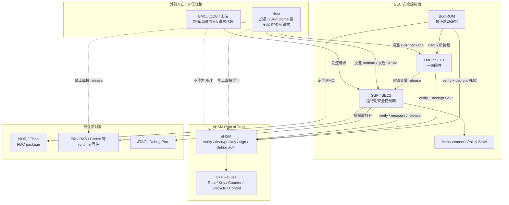
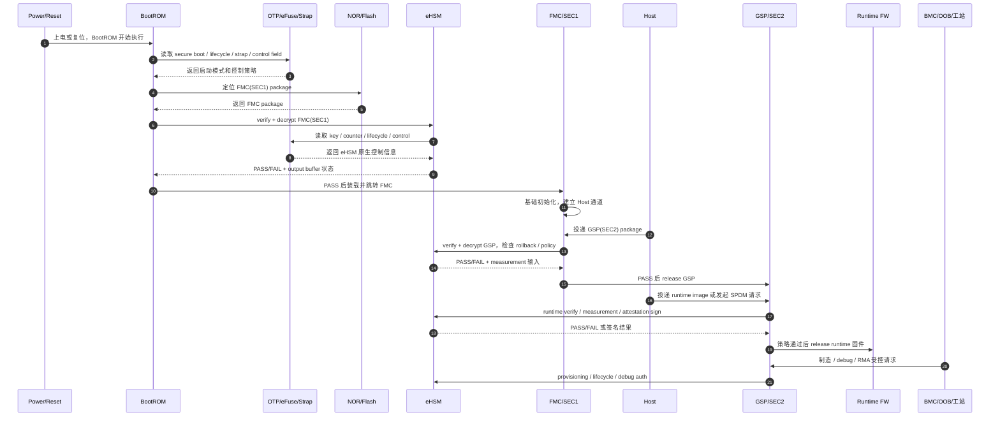
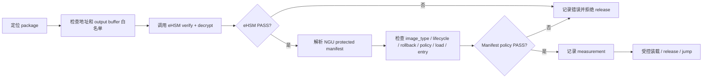
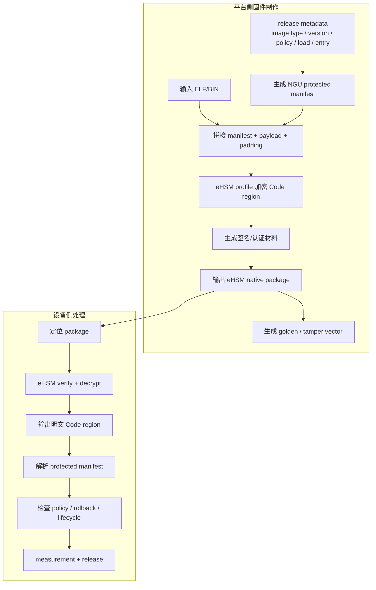
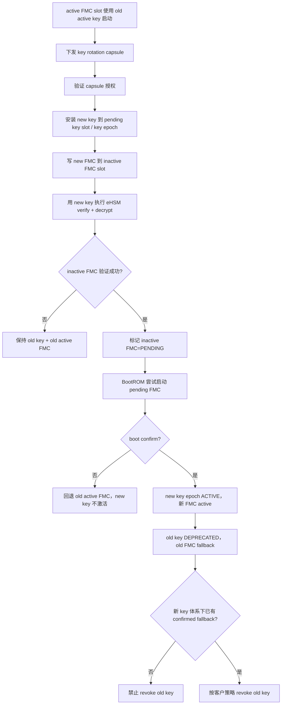
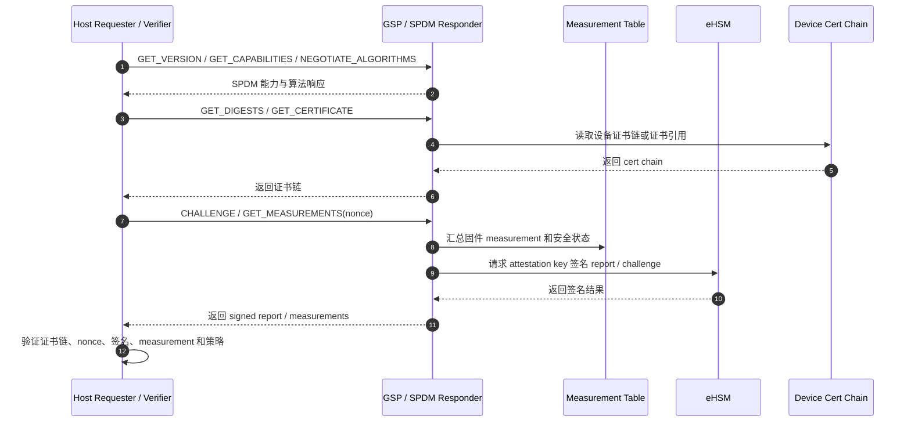
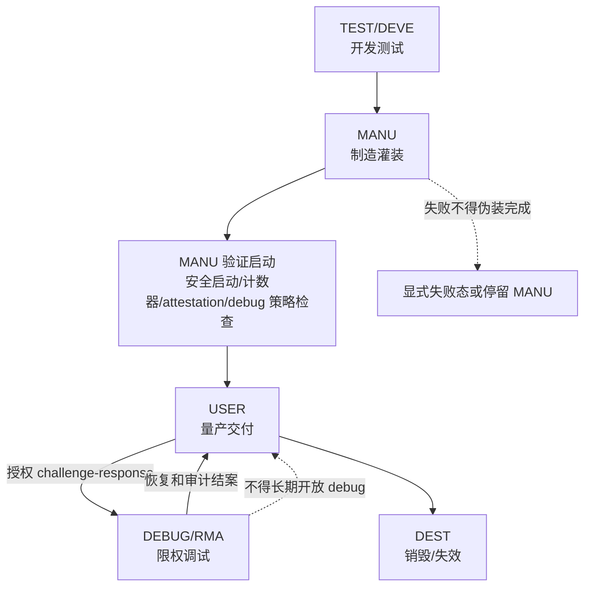
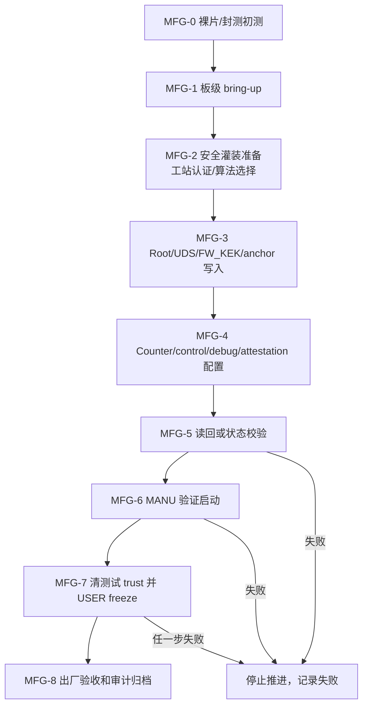

# NGU800 安全方案功能框架与软硬件需求对齐文档

版本：V1.0  
日期：2026-05-18  
定位：面向项目组评审、硬件设计对齐、eHSM/OTP/BootROM/SoC 集成需求确认的安全方案说明文档。  
主要来源：`security_workflow/03_detailed_design/10_full_design.md`、`security_inputs/inputs_manifest.md`、已接受 CR 结论、eHSM Firmware / Bootloader TRM 输入策略。

---

## 1. 文档目的

本文件用于回答项目组和硬件设计同事最关心的几个问题：

1. 当前 NGU800 安全方案包含哪些功能点。
2. 总体安全框架是什么样的，谁是信任根，谁是控制面，谁只是传输方。
3. 每个安全功能点准备通过什么详细方案实现。
4. 这些方案分别需要软件、eHSM、OTP/eFuse、BootROM、Firewall/DMA、JTAG/MUX、板级/OOB 和制造工站提供什么能力。
5. 哪些软硬件接口、字段、流程需要在流片前冻结。

本文件不是 `10_full_design.md` 的替代品，不展开完整结构体、寄存器和代码实现细节；它是面向项目决策和软硬件对齐的中间层材料。

---

## 2. 当前方案一句话

NGU800 安全方案以 **eHSM 作为唯一 Root of Trust**，由 **BootROM 做最小启动编排**，由 **FMC(SEC1) 和 GSP(SEC2) 承接安全启动与运行期安全控制面**，Host / BMC / OOB / 工站只作为不可信或低可信通道，所有关键固件 release、密钥、生命周期、调试、证明和制造动作都必须通过 SEC/GSP 与 eHSM 受控路径完成。

---

## 3. 术语与工程名映射

| 安全方案名 | 工程/固件名 | 典型制品 | 当前职责 |
|---|---|---|---|
| SEC1 | FMC | `fmc-bm.bin` | First Mutable Stage，来自本地 NOR / Flash，由 BootROM 调 eHSM verify + decrypt 后装载 |
| SEC2 | GSP | `gsp-bm.bin` | 二级安全管理固件，由 Host 投递，但必须由 FMC/GSP 调 eHSM 验证、解密、测量后 release |
| runtime image | PM / RAS / Codec 等 | `*-bm.bin` 或后续 runtime 包 | 由 Host 投递，GSP 调 eHSM 验证、测量，并按策略 release |
| Root of Trust | eHSM | eHSM ROM/Bootloader/Firmware | 密钥、验签、解密、counter、lifecycle、debug auth、attestation key 的安全根 |
| 外部通道 | Host / BMC / OOB / 工站 | PCIe / OOB / 工站链路 | 可以投递包、发起请求、读取状态；不能作为信任根，不能直接 release |

---

## 4. 安全功能点总览

### 4.1 功能点地图

```mermaid
flowchart TD
    A[NGU800 安全方案功能范围]

    A --> B[安全启动与固件保护]
    B --> B1[FMC/SEC1 签名+加密]
    B --> B2[GSP/SEC2 签名+加密]
    B --> B3[Runtime image 默认签名+加密]
    B --> B4[固件包制作与 verify/decrypt]

    A --> C[Root / Key / Cert / Algorithm]
    C --> C1[eHSM Root of Trust]
    C --> C2[Root/FW_KEK/debug/attestation key]
    C --> C3[设备证书链]
    C --> C4[国密与国际算法策略]

    A --> D[版本 / 升级 / 恢复]
    D --> D1[Anti-rollback]
    D --> D2[Signer / revoke]
    D --> D3[Recovery / rescue image]
    D --> D4[Known-good 回退策略]

    A --> E[运行期安全控制]
    E --> E1[Measurement table]
    E --> E2[SPDM / Attestation]
    E --> E3[Attestation report]
    E --> E4[Host/OOB 请求收敛]

    A --> F[生命周期 / Debug / RMA]
    F --> F1[TEST/DEVE/MANU/USER/RMA]
    F --> F2[USER 默认关闭 debug]
    F --> F3[Challenge-response debug auth]
    F --> F4[RMA 限权/超时/审计]

    A --> G[制造 / 灌装 / USER 冻结]
    G --> G1[Root/anchor/control 写入]
    G --> G2[Version counter 初始化]
    G --> G3[MANU 验证启动]
    G --> G4[USER freeze 和审计]

    A --> H[访问控制与硬件隔离]
    H --> H1[Firewall/UserID]
    H --> H2[Secure RAM / staging / output buffer]
    H --> H3[DMA 隔离]
    H --> H4[JTAG/MUX/CPLD 控制]
```

### 4.2 功能点清单

| 功能域 | 功能点 | 当前方案口径 | 软件实现责任 | 硬件 / eHSM 主要需求 |
|---|---|---|---|---|
| 安全启动 | BootROM -> FMC(SEC1) -> GSP(SEC2) -> runtime image | 主链路已明确 | BootROM/FMC/GSP 编排 verify/decrypt、measurement、release | eHSM verify/decrypt ABI、BootROM 可调用路径、受控输出 buffer |
| FMC 保护 | FMC 来自 NOR / Flash，正式路径签名 + 加密 | 已明确 | BootROM 定位 FMC 包，调用 eHSM，解析 protected manifest 后跳转 | NOR/Flash 访问、eHSM early boot verify+decrypt、SEC1 执行区隔离 |
| GSP 保护 | GSP 由 Host 投递，但 Host 不参与放行 | 已明确 | FMC 接收 GSP 包，调用 eHSM verify/decrypt，按 policy release | Host staging buffer、DMA/firewall、eHSM Firmware `soc_verify` 或等价接口 |
| Runtime image 保护 | PM/RAS/Codec 等 USER/PROD 默认签名 + 加密 | 方向明确，白名单待冻结 | GSP 统一验证、测量、release | per-image policy、counter、staging/output buffer、release 控制信号 |
| 固件包格式 | follow eHSM native header，NGU metadata 放 protected manifest | 已接受 CR-0004 方向 | packager 生成 eHSM package + NGU manifest；设备侧按同一契约解析 | eHSM native header 字段、认证覆盖范围、Code region 输出规则 |
| 反回滚 | 对齐 eHSM Version Counter / owner-confirmed counter | 方向明确，粒度待冻结 | manifest rollback domain 与 eHSM counter 映射检查 | counter 数量、粒度、更新规则、读写/锁定语义 |
| 吊销 | signer / anchor / 版本策略可 revoke | 方案覆盖，字段待冻结 | verify path 检查 signer/revoke policy | eHSM revoke/control field、OTP/eFuse 锁定位 |
| 密钥体系 | Root、FW_KEK、debug anchor、attestation key 分域 | 方案覆盖，exact key ID 待冻结 | 只通过 eHSM key service 使用，不导出私钥 | key slot、purpose、lifecycle gating、访问控制 |
| 证书体系 | 支持设备认证证书链和固件验签 trust chain | 方向明确，首版复杂度待拍板 | GSP/attestation 返回证书链或证书引用 | attestation key、证书存储区、制造签发回写路径 |
| SPDM/设备认证 | Host requester 认证设备，读取 report/measurement | 方向明确，libspdm 对接中 | GSP 作为 responder 控制面，eHSM 完成签名/密钥服务 | SPDM transport、证书链、签名服务、report 字段 |
| Measurement | 记录 verify/decrypt/rollback/policy/release 状态 | 必须项明确 | BootROM/FMC/GSP 在关键节点记录 | measurement 安全存储区、Host 不可写、复位/故障策略 |
| Attestation report | 覆盖 measurement、lifecycle、debug、secure boot、rollback | 必须项明确，字段位置待冻结 | GSP 汇总 report，eHSM 签名 | attestation key、nonce/session 绑定、证书链、event log 可选区 |
| Host 边界 | Host 不可信，只能投递和读取状态 | 已明确 | Host 接口只暴露投递、查询、认证请求 | DMA/firewall/UserID、错误隐藏、状态寄存器权限 |
| OOB/BMC 边界 | OOB/BMC 可作代理，不作 RoT | 已明确，代理范围待冻结 | GSP 认证/限流/审计 OOB 请求 | OOB 通道隔离、proxy auth、anti-replay、rate limit |
| Mailbox/shared memory | SEC/GSP 与 eHSM/Host/OOB 的受控命令通道 | 方案覆盖，字段待冻结 | 定义 req/resp、doorbell、超时、错误码 | mailbox 寄存器、共享内存、cache/DMA 一致性、UserID |
| 安全内存隔离 | staging/output/secure buffer 分权管理 | 方案覆盖，地址待冻结 | 软件做地址白名单和清零 | secure RAM、firewall region、DMA 禁止区、非法访问处理 |
| 生命周期 | TEST/DEVE/MANU/USER/RMA/DEST 控制策略 | 方案覆盖，映射待冻结 | GSP/BootROM 按 lifecycle gating 功能 | OTP/eFuse lifecycle bit、不可逆推进、回退限制 |
| 安全调试 | USER 默认关闭，授权后限时/限范围开启 | 方向明确，scope 待冻结 | challenge/debug auth、scope、timeout、audit | JTAG MUX/CPLD、debug scope bitmap、默认关闭状态 |
| FMC 防变砖 / Recovery | Flash 中 FMC_A / FMC_B 双分区；GSP/runtime 由 Host 重新下发，不设计片上 recovery 分区 | CR-0008 已收敛，metadata ABI 待冻结 | BootROM 按 `fmc_slot_metadata` 选择 active/fallback；FMC 升级写 inactive slot 并 boot confirm | Flash 分区、metadata 保护、eHSM verify/decrypt、BootROM fallback |
| 密钥 slot 轮换 | key slot 用于客户自主 key 轮换、撤销和过渡期兼容，不是固件 A/B slot | CR-0008 已收敛，exact eHSM key ID 待冻结 | key rotation capsule、pending key epoch、inactive FMC 验证、boot confirm、delayed revoke | eHSM SOC FW Verify/Encrypt Key、SOC Upgrade Verify/Encrypt Key、Version Counter、revoke 表达 |
| 制造灌装 | 工站通过 SEC/GSP 受控路径调用 eHSM | 方向明确 | provisioning tool -> SEC/GSP -> eHSM；记录审计 | OTP/eFuse 写入/锁定、HSM/KMS、工站认证、readback |
| USER 冻结 | 清测试 trust、锁 key/control、推进 USER | 必须闭环 | MANU 验证启动后执行 freeze 动作集合 | lifecycle 推进、lock bit、测试 bypass 清理、失败原子性 |
| 审计 | 制造/debug/RMA/关键状态变化可追溯 | 方案覆盖，落点待冻结 | GSP/工具记录事件和结果 | 审计存储、事件字段、读取权限、防篡改要求 |

---

## 5. 总体安全框架

### 5.1 信任与控制关系

图下说明：

1. eHSM 是唯一 Root of Trust，OTP/eFuse 是持久根材料、控制位、counter 和 lifecycle 的承载。
2. BootROM 不实现复杂密码学，只负责最小编排、定位 FMC、调用 eHSM、根据结果装载或拒绝。
3. FMC(SEC1) 是一级固件，来自本地 NOR / Flash；Host 不下发 FMC。
4. GSP(SEC2) 是运行期安全控制面，Host 只负责投递 GSP 和后续 runtime 包，不拥有放行权。
5. BMC/OOB/工站可以作为管理或制造通道，但不能绕过 GSP/SEC/eHSM 直接写 OTP、打开 debug 或 release 固件。

### 5.2 主启动与运行期 release 时序

---

## 6. 功能点如何通过详细方案实现

### 6.1 安全启动与固件 release

**目标**：确保 FMC、GSP 和关键 runtime 固件在执行前经过受控验证、解密、反回滚、吊销和策略检查。

**当前方案**：

- FMC(SEC1) 从 NOR / 本地 Flash 获取，不由 Host 下发。
- FMC(SEC1) 和 GSP(SEC2) 在正式安全启动路径中强制签名 + 加密。
- GSP(SEC2) 由 Host 投递，但 release 权属于 FMC/GSP 安全控制面。
- PM/RAS/Codec 等关键 runtime image 在 USER/PROD 默认签名 + 加密；signature-only 只能作为产品白名单例外。
- eHSM 先完成 native package verify/decrypt，BootROM/FMC/GSP 再解析 NGU protected manifest 并做 release decision。

**实现路径**：

**软件责任**：

| 软件模块 | 责任 |
|---|---|
| BootROM | 定位 FMC package，准备 eHSM 输入输出参数，检查 output buffer，按 eHSM 和 manifest 结果决定是否跳转 FMC |
| FMC(SEC1) | 建立 Host 通道，接收 GSP package，调用 eHSM verify/decrypt，按 policy release GSP |
| GSP(SEC2) | 统一处理 runtime image verify/measure/release、attestation、debug/RMA、制造请求 |
| image packager | 生成 eHSM native package + NGU protected manifest，产生 golden/tamper vector |

**硬件 / eHSM 需求**：

| 需求项 | 需要提供的能力 |
|---|---|
| eHSM verify/decrypt command | 支持 FMC early boot verify+decrypt 和 GSP/runtime verify+decrypt；明确命令 ABI、错误码、超时、并发限制 |
| Output buffer | 解密输出必须进入受控 RAM / staging / execution 区，地址由 BootROM/SEC 白名单检查 |
| OTP/eFuse control field | 提供 secure boot enable、algorithm control、key policy、counter、lifecycle |
| Counter / rollback | 支持 image/domain 级 counter 或 owner-confirmed 映射 |
| Firewall/DMA | Host DMA 不得访问 SEC 执行区、eHSM 内部区、OTP/eFuse、secure shared buffer |

**待项目组拍板**：

- Runtime image 是否全部强制签名 + 加密，哪些允许 signature-only 白名单。
- `fmc_slot_metadata` ABI、BootROM fallback 规则、key slot rotation exact eHSM key ID / revoke 表达如何冻结。
- BootROM 调 eHSM 的 exact ABI 与输出 buffer 约束。

### 6.2 固件包制作与设备侧 verify/decrypt 对应关系

**目标**：平台制作端和设备执行端使用同一套固件包契约，避免“工具这样做、设备那样验”的分裂。

| 制作端动作 | 设备侧对应动作 | 硬件/eHSM 需求 |
|---|---|---|
| 生成 NGU protected manifest | eHSM PASS 后解析 manifest | manifest 必须落在 eHSM 认证覆盖和解密输出范围内 |
| 填写 image type / version / rollback domain | 检查当前阶段是否接受该 image type，检查 counter/policy | eHSM Version Counter 或等价 counter 映射 |
| 加密 Code region | eHSM 解密输出到受控 buffer | verify+decrypt output path，不走 NVM only verify |
| 生成签名/认证材料 | eHSM 验签/认证失败则拒绝输出可信明文 | eHSM native header / authentication material 规则 |
| 生成 golden/tamper vector | QEMU/stub/FPGA/真实 eHSM 联调复用 | 工具和设备侧错误码、失败路径一致 |

### 6.3 Host / OOB 边界与访问控制

**目标**：Host、BMC、OOB、工站都只能作为传输或请求入口，不能成为信任根，不能绕过 SEC/eHSM。

**当前方案**：

- Host 允许投递 GSP/runtime 包、配置普通 descriptor、读取普通状态、发起 SPDM 请求。
- Host 禁止下发或替换 FMC，禁止直接 release，禁止修改 lifecycle/debug/secure boot，禁止访问 OTP/eFuse、eHSM 内部区、Secure SRAM。
- BMC/OOB/工站可作制造、调试、RMA 的代理入口，但必须进入 GSP/SEC 受控路径。

**硬件需求**：

| 硬件点 | 需求 |
|---|---|
| Firewall / UserID | 区分 Host DMA、OOB DMA、SEC、eHSM、各管理核访问权限 |
| DMA 白名单 | Host/OOB 只允许访问 staging/data buffer，不允许访问 secure buffer、执行区、OTP/eFuse |
| MMIO 权限 | secure boot、debug、lifecycle、rollback 控制寄存器不可被 Host/OOB 直接写 |
| 错误处理 | 非法访问要有可诊断状态；是否上报给 Host 需受错误隐藏策略约束 |
| OOB 代理 | 需要 request authentication、anti-replay、rate limit、audit、failure rollback 策略 |

### 6.4 密钥、证书和算法体系

**目标**：把密钥使用、证书链、固件验签、设备认证和算法选择都收敛到 eHSM 与制造受控流程。

**当前方案**：

- Root / UDS / FW_KEK / debug anchor / attestation key 等材料分域管理。
- 私钥不得导出普通软件域。
- secure boot / upgrade 的算法 authority 来自 eHSM OTP/control field，NGU manifest/report 只记录 expected profile 或 audit profile。
- 方案结构上同时支持国密和国际算法栈。
- 设备认证证书链建议按完整设备证书链设计，首版实现复杂度需项目组拍板。

**硬件 / eHSM 需求**：

| 需求项 | 说明 |
|---|---|
| Key slot / purpose | eHSM 需要提供 Root/FW_KEK/debug/attestation 等用途绑定 |
| Lifecycle gating | key 使用必须受 TEST/DEVE/MANU/USER/RMA 生命周期约束 |
| Algorithm control field | secure boot / upgrade / attestation 的算法选择需要可配置、可锁定、可读出状态 |
| Cert storage | 需要明确设备证书链存储在 eHSM NVM、安全 Flash、secure partition 还是外部受保护区 |
| Attestation signing | eHSM 需要提供 report/challenge 签名能力或等价 key service |

### 6.5 Anti-rollback、吊销、FMC A/B 与密钥 slot 轮换

**目标**：防止旧版本、被吊销 signer、错误 key rotation 或降级策略绕过安全启动，同时避免 FMC 升级失败导致设备不可恢复。

**当前方案**：

- 物理反回滚机制优先对齐 eHSM Version Counter / owner-confirmed monotonic counter。
- NGU `rollback_domain` 是 logical view，不再定义并列 physical OTP counter。
- signer/revoke 通过 eHSM control field、trust anchor 或证书策略表达。
- Flash 中只有 FMC 需要片上备份保护，采用 FMC_A / FMC_B 双分区和受保护 `fmc_slot_metadata`。
- GSP 及后续 runtime 固件由 Host 下发，失败后重新下发，不设计片上 recovery 分区。
- 首版不引入长期静态独立 recovery FMC，也不把 `recovery_boot_auth blob` 作为必选机制。
- 密钥 slot 轮换必须与 FMC_A/B 状态机绑定：先安装 pending key，再用 pending key 验证 inactive FMC，boot confirm 后才允许 revoke old key。

**硬件需求**：

| 需求项 | 说明 |
|---|---|
| Version Counter | 数量、粒度、更新时机、锁定策略、失败处理需要冻结 |
| Revoke field | signer revoke、anchor revoke、版本吊销的表达方式需要 eHSM/OTP 支持 |
| `fmc_slot_metadata` | 需要受保护地记录 active/fallback、slot state、key epoch、boot confirm、failure counter、metadata sequence |
| eHSM key mapping | normal signer/FW_KEK 与 update authority 必须映射到 eHSM TRM 已定义的 SOC FW Verify Key、SOC Encrypt Key、SOC Upgrade Verify Key、SOC Upgrade Encrypt Key 或 owner-confirmed customization |
| Delayed revoke | old key 必须先进入 deprecated，确认新 key 体系下仍有可启动 fallback 后才允许 revoke |

### 6.6 SPDM / 设备认证 / Attestation

**目标**：Host requester 能够证明“设备是谁”和“设备当前处于什么安全状态”。

**report 必须覆盖的内容**：

- 设备身份或设备证书链引用。
- Host challenge / nonce / session 绑定。
- FMC/GSP/runtime measurement。
- secure boot、lifecycle、debug、anti-rollback、image protection policy。
- SEC1/SEC2 是否执行了 sign+encrypt，是否有 signature-only 例外。
- board/die binding 结果默认进入 attestation；是否参与 release decision 待冻结。

**硬件 / eHSM 需求**：

| 需求项 | 说明 |
|---|---|
| Attestation key | 私钥不导出，签名服务由 eHSM 提供 |
| Device cert chain | 制造阶段签发并回写，运行时可被 GSP 返回 |
| Measurement 安全存储 | Host 不可写，复位/异常场景更新策略明确 |
| Nonce/session binding | report 签名覆盖 nonce/session，防重放 |
| SPDM transport | Host/GSP 之间的物理通道可替换，但协议栈使用标准 libspdm 路径 |

### 6.7 生命周期、安全调试与 RMA

**目标**：USER 态默认关闭未授权 debug，RMA/debug 只能在授权、限权、限时、可审计条件下开启。

**软件实现路径**：

- GSP 提供 debug/RMA 编排入口。
- eHSM 提供 challenge、debug auth、key/lifecycle gating。
- debug scope bitmap 限制可打开的端口或功能。
- timeout/expire 到期后关闭 debug。
- 所有 debug/RMA 开启、关闭、失败、恢复动作进入审计。

**硬件需求**：

| 需求项 | 说明 |
|---|---|
| Lifecycle bits | TEST/DEVE/MANU/USER/RMA/DEST 状态、推进规则、回退限制 |
| JTAG MUX/CPLD | USER 默认关闭，只有授权后由 SEC/GSP/eHSM 受控打开 |
| Debug scope bitmap | 需要冻结每个 bit 对应的 debug port 或能力 |
| Timeout/lockout | 支持失败次数、时间窗口、自动关闭 |
| Audit storage | 记录 challenge、scope、结果、时间窗口、恢复状态 |

### 6.8 制造、灌装、USER 冻结

**目标**：把 Root/anchor/key/counter/control/lifecycle 写入、校验、锁定、审计和 USER freeze 做成闭环，而不是人工口头流程。

**必须灌装或配置的对象**：

| 对象 | 作用 | 硬件/eHSM 需求 |
|---|---|---|
| Root / UDS / Root secret | 建立设备根 | OTP/eFuse 安全写入、锁定、生命周期 gating |
| FW_KEK / image protect key policy | 支撑 FMC/GSP 解密 | eHSM key slot、purpose、不可导出策略 |
| Firmware signer anchor | 固件验签 trust anchor | signer hash / cert anchor / revoke 表达 |
| Debug auth anchor | RMA/debug 授权根 | challenge-response、scope、lockout |
| Attestation seed / key / cert | 设备认证 | CSR/公钥导出、CA 签发、证书链回写 |
| Version counter 初值 | 反回滚 | eHSM counter 初始化和锁定 |
| secure boot/debug/attestation/algorithm control | 量产安全策略 | control field 写入、读回、锁定 |

**USER freeze 必须动作集合**：

- Root/key/control/counter 写入完成并校验。
- FMC/GSP sign+encrypt 策略启用。
- Anti-rollback 启用。
- Debug auth 策略启用，未授权 debug/JTAG 默认关闭。
- 测试 signer、测试证书链、测试 debug 白名单、测试 bypass 清除。
- MANU 验证启动通过。
- 生命周期推进到 USER。
- freeze 成功/失败都有审计记录；任一步失败不得报告 USER freeze 完成。

---

## 7. 软硬件结合点与硬件需求矩阵

### 7.1 按硬件 / 平台模块划分

| 模块 / Owner | 软件侧需要的能力 | 硬件 / eHSM 需要提供或冻结的内容 | 影响功能点 | 流片前是否建议冻结 |
|---|---|---|---|---|
| eHSM Bootloader / Firmware | verify/decrypt、key service、counter、debug auth、attestation sign | 命令 ABI、profile、错误码、超时、输入输出 buffer、并发限制、NVM only verify 与 RAM deploy 区分 | 安全启动、固件保护、制造、SPDM、debug/RMA | 是 |
| OTP/eFuse | 持久保存 root/key/control/counter/lifecycle/lock | physical layout、lock bit、读回策略、写入权限、生命周期推进规则 | 密钥、反回滚、制造、USER freeze | 是 |
| BootROM | 最小编排 FMC verify/decrypt | BootROM 可调用 eHSM early boot path、失败处理、恢复入口、FMC 地址来源 | FMC 启动、失败恢复 | 是 |
| NOR / Flash | 保存 FMC package | BootROM 可定位、完整性由 eHSM 保护、更新策略 | FMC 启动 | 是 |
| Secure RAM / SRAM | 承载 output buffer、manifest、payload、measurement | 地址范围、访问权限、清零策略、ECC/错误处理 | verify/decrypt、release、attestation | 是 |
| Staging buffer | Host/OOB 投递 GSP/runtime 包 | Host DMA 可写但不可越权；SEC 可读；eHSM 访问一致性 | GSP/runtime 验证 | 是 |
| Firewall / UserID / NoC | 阻止 Host/OOB/DMA 访问安全资源 | master ID、region、白名单、非法访问响应、审计 | Host 边界、DMA 隔离 | 是 |
| Mailbox / Shared Memory | SEC/GSP 调 eHSM、Host/OOB 发起受控请求 | doorbell、req/resp、cache/DMA 一致性、超时、重试、错误码 | eHSM 服务、制造、debug、SPDM | 是 |
| JTAG / Debug MUX / CPLD | USER 默认关闭，授权后限权打开 | scope bitmap、MUX 控制权、默认关闭状态、lockout | debug/RMA | 是 |
| Reset / Power / Fault | 影响安全状态机和证明报告 | 哪些事件清 measurement，哪些进入 event log，异常恢复策略 | attestation、recovery、审计 | 建议冻结 |
| Board / OOB / BMC | 管理/制造代理，不作为 RoT | proxy auth、anti-replay、rate limit、访问边界、电源复位控制边界 | 制造、RMA、板级安全 | 建议冻结 |
| Host 接口 / PCIe | 投递 GSP/runtime、发起 SPDM、读状态 | DMA window、doorbell、状态寄存器、错误可见性 | GSP release、SPDM | 建议冻结 |
| 制造工站 / HSM / KMS | 组织灌装、签发证书、记录审计 | 工站认证、Root/CSR/证书链流程、审计落点、失败重试策略 | provisioning、USER freeze | 量产前必须冻结，流片前定方向 |

### 7.2 按安全功能点划分

| 功能点 | 软件实现点 | 硬件结合点 | 必须明确的问题 |
|---|---|---|---|
| FMC 安全启动 | BootROM 调 eHSM verify/decrypt，解析 manifest，跳转 FMC | eHSM early boot path、NOR/Flash、OTP/eFuse、output buffer | BootROM -> eHSM ABI、FMC package 格式、失败处理 |
| GSP 安全启动 | FMC 接收 Host 投递包，调 eHSM，release GSP | Host staging buffer、DMA/firewall、eHSM Firmware path | GSP buffer、错误码、release 状态机 |
| Runtime release | GSP 验证、测量、release PM/RAS/Codec | per-core release signal、counter、buffer | 哪些 runtime 强制加密，哪些白名单例外 |
| Firmware package | packager 生成 eHSM native package + NGU manifest | eHSM native header、认证覆盖范围、Code region | manifest ABI、golden/tamper vector |
| Anti-rollback | rollback domain 与 eHSM counter 对齐 | Version Counter、锁定位、更新原子性 | counter 粒度、升级时机、失败策略 |
| SPDM/Attestation | libspdm responder、report 汇总、eHSM 签名 | attestation key、证书链存储、measurement 安全区 | report 字段、证书模式、session 策略 |
| Debug/RMA | challenge/auth/scope/timeout/audit | JTAG MUX、debug scope、lifecycle、lockout | scope bitmap、RMA 后恢复策略 |
| Manufacturing | provisioning tool -> GSP/SEC -> eHSM | OTP/eFuse 写入、锁定、HSM/KMS、审计 | 工站接口、USER freeze 原子性 |
| Host/OOB 边界 | API 限权、状态查询、请求认证 | Firewall/UserID/DMA/OOB proxy | Host/OOB 可访问范围、非法访问响应 |

---

## 8. 流片前建议必须冻结的事项

| 冻结项 | 为什么必须早冻结 | 影响模块 |
|---|---|---|
| BootROM -> eHSM verify/decrypt exact ABI | BootROM 固化后修改成本极高 | BootROM、eHSM、FMC |
| FMC/GSP eHSM native package + NGU protected manifest 最小 ABI | 影响工具、BootROM、FMC/GSP、eHSM 联调 | packager、BootROM、SEC FW |
| eHSM key ID / purpose / lifecycle gating | 影响验签、解密、debug、attestation、制造 | eHSM、OTP/eFuse、制造 |
| OTP/eFuse control field / key field / counter field / lock bit | physical layout 流片后难以变更 | RTL、eHSM、制造 |
| Version Counter / rollback domain 映射 | 影响升级、恢复、证明一致性 | eHSM、GSP、工具链 |
| Secure RAM / staging / output buffer 地址和权限 | 影响 Host 投递和 eHSM 解密输出安全性 | SoC memory map、Firewall、DMA |
| Firewall / UserID / DMA 白名单 | 防止 Host/OOB 绕过软件边界 | NoC、PCIe、OOB、管理子系统 |
| Mailbox / shared memory 基础模型 | 影响 eHSM 服务、制造、debug、SPDM 请求路径 | SEC FW、eHSM、Host/OOB |
| Lifecycle 状态机和 MANU -> USER 推进规则 | 影响量产安全闭环 | OTP/eFuse、eHSM、制造 |
| JTAG/debug scope bitmap 和 MUX 控制权 | 影响 USER 态 debug 是否真正关闭 | RTL、板级、CPLD/MUX |
| Attestation report 必须字段 | 影响 Host verifier、客户验收和安全证明 | GSP、eHSM、Host |
| 制造灌装主流程和 USER freeze 动作集合 | 影响产线、HSM/KMS、出厂验收 | 工站、eHSM、GSP、质量系统 |

---

## 9. 当前需要项目组拍板的问题

| 问题 | 当前建议 | 不拍板的风险 |
|---|---|---|
| Runtime image 是否全部强制签名 + 加密 | FMC/GSP 强制；PM/RAS/Codec 默认强制；例外用白名单 | 影响性能、安全等级、attestation 口径 |
| Signature-only 例外准入条件 | 绑定 image_type、lifecycle、SKU、debug、release、rollback、敏感性 | 后续客户质疑保护不一致 |
| Board / Die binding 是否阻断 release | 当前默认进入 attestation，不阻断 FMC；是否阻断 GSP/runtime 待定 | 影响维修换板、多 Die、量产组合 |
| 首版是否强制完整 X.509 / SPDM cert chain | 建议方案按完整证书链设计，首版实现可裁剪但要预留 | 影响客户认证、制造 PKI、report 格式 |
| FMC A/B 与 key slot 轮换策略 | FMC_A/B metadata ABI、key epoch、old key delayed revoke、BootROM fallback | 轮换错误可能导致 FMC 无法恢复或 old key 过早吊销 |
| RMA 完成后是否重新生成状态摘要 | 建议至少更新 audit 和 attestation 可见状态 | 返修后设备可信状态不可证明 |
| OOB/BMC proxy 范围 | 只做代理入口，不作为 RoT，不直接写 OTP/eHSM | OOB/BMC 可能绕过 SEC/eHSM |
| 制造 audit 落点 | 工站 + 设备侧状态均需留痕，字段和防篡改策略待定 | 出厂问题无法追溯 |

---

## 10. 建议评审方式

建议项目组按下面顺序评审，而不是直接讨论结构体字段：

1. **先确认总体框架**：eHSM RoT、BootROM 最小编排、FMC/GSP 安全控制面、Host/OOB 不进信任链。
2. **再确认首版功能范围**：FMC/GSP 强制签名 + 加密，runtime 默认保护，SPDM/attestation、debug/RMA、制造闭环是否进入首版。
3. **然后确认硬件冻结项**：OTP/eFuse、eHSM ABI、Firewall/DMA、JTAG/MUX、secure RAM、mailbox。
4. **最后确认实现阶段节奏**：先 BootROM/FMC/GSP 主链路，再 SPDM/attestation，再制造/USER freeze，再 debug/RMA/board hardening。

---

## 11. 与详细设计的对应关系

| 本文件主题 | 详细设计对应章节 |
|---|---|
| 总体安全框架 | `10_full_design.md` 第 1、2 章 |
| 安全启动与固件 release | `10_full_design.md` 第 3 章 |
| 设备身份、SPDM、attestation | `10_full_design.md` 第 4 章、第 10.7 节 |
| 生命周期、安全调试、RMA | `10_full_design.md` 第 5 章、第 10.6 节 |
| Host/OOB/Board 边界 | `10_full_design.md` 第 6、7 章 |
| Root、Key、Cert、Algorithm | `10_full_design.md` 第 8 章 |
| 制造、灌装、USER freeze | `10_full_design.md` 第 9 章、第 10.6 节 |
| eHSM native header、OTP/key/counter 对齐 | `10_full_design.md` 第 3.10 节、第 10 章 |
| 风险、冻结项和开放问题 | `10_full_design.md` 第 11 章 |

---

## 12. 结论

当前 NGU800 安全方案已经形成可评审的主线：

- **信任根**：eHSM 是唯一 Root of Trust。
- **启动链**：BootROM -> FMC(SEC1) -> GSP(SEC2) -> runtime image。
- **控制面**：FMC/GSP 负责安全启动、后续固件 release、measurement、attestation、debug/RMA、制造流程编排。
- **外部边界**：Host/BMC/OOB/工站只作为传输或请求入口，不作为信任根，不拥有 release 权。
- **硬件重点**：OTP/eFuse、eHSM ABI、secure RAM、Firewall/DMA、Mailbox、JTAG/MUX、lifecycle 和 manufacturing path 需要尽快对齐。
- **流片前重点**：凡是涉及 BootROM 固化、OTP/eFuse physical layout、eHSM key/counter/control、Firewall/DMA/JTAG 访问边界的内容，都不宜推迟到软件后期再决定。

下一步建议把第 8 章“流片前建议必须冻结的事项”和第 9 章“需要项目组拍板的问题”作为评审 checklist，逐项指定 owner 和关闭时间。
