# NGU800 安全方案功能框架与软硬件需求对齐文档（详细落地版）

版本：V1.1  
日期：2026-05-18  
定位：面向项目组评审、硬件设计对齐、eHSM/OTP/BootROM/制造/Host/GSP 联调的安全方案落地说明。  
来源：`security_workflow/03_detailed_design/10_full_design.md` V2.5、已接受 CR-0004/CR-0006/CR-0008、eHSM Firmware / Bootloader TRM source-conformance 口径。

---

## 1. 本文怎么读

原始版 `ngu800_security_solution_feature_framework_hw_requirements.md` 更适合快速汇报“安全方案有哪些功能点”。本文保留这个完整功能范围，但进一步回答工程落地问题：

1. 安全固件最终生成的包长什么样。
2. FMC / GSP / runtime 分别怎么制作、怎么验签、怎么解密、怎么 release。
3. 签名材料在哪里，哪些区域被签名覆盖。
4. 哪些区域被加密，设备侧用什么 key 解密。
5. 公钥、证书、trust anchor、FW_KEK、attestation key 分别放在哪里。
6. FMC A/B、key slot 轮换、反回滚、吊销如何避免设备变砖。
7. 每个功能点需要硬件/eHSM/OTP/Firewall/JTAG/制造提供什么。
8. 每个结论在 `10_full_design.md` 中对应哪一节。

本文使用两个层次：

| 层次 | 用途 |
|---|---|
| 功能点总表 | 保持安全方案全貌，防止只盯某个技术细节 |
| 功能域落地卡片 | 对每个功能域说明对象、流程、密钥、硬件依赖、详设索引 |

术语说明：

| 本文术语 | 工程含义 |
|---|---|
| FMC / SEC1 | 一级可变固件，来自本地 Flash，BootROM 调 eHSM 验签解密后启动 |
| GSP / SEC2 | 二级安全管理固件，由 Host 投递，FMC/GSP 调 eHSM 验签解密后 release |
| runtime image | PM / RAS / Codec 等后续固件，由 Host 投递，GSP 负责验证、测量、release |
| eHSM native package | eHSM TRM 定义的 secure boot image physical container |
| NGU protected manifest | NGU 项目级 metadata，放在 eHSM protected Code region 中 |
| key slot | eHSM key ID / key purpose / logical key epoch / revoke 状态，不是 GSP/runtime 固件 A/B 分区 |

---

## 2. 安全功能点全貌

### 2.1 功能点地图

```mermaid
flowchart TD
    A[NGU800 安全方案]

    A --> B[安全启动与固件保护]
    B --> B1[FMC/SEC1 签名+加密]
    B --> B2[GSP/SEC2 签名+加密]
    B --> B3[Runtime image 默认签名+加密]
    B --> B4[eHSM native 固件包制作]
    B --> B5[设备侧 verify/decrypt/release]

    A --> C[Root / Key / Cert / Algorithm]
    C --> C1[eHSM Root of Trust]
    C --> C2[FW verify key / FW_KEK]
    C --> C3[Upgrade key / key rotation]
    C --> C4[Device cert / attestation key]
    C --> C5[国密/国际算法 control field]

    A --> D[版本 / 升级 / 恢复]
    D --> D1[Anti-rollback]
    D --> D2[Signer / key revoke]
    D --> D3[FMC_A/FMC_B 防变砖]
    D --> D4[key slot 轮换 delayed revoke]

    A --> E[运行期安全控制]
    E --> E1[Measurement table]
    E --> E2[SPDM responder]
    E --> E3[Attestation report]
    E --> E4[Host/OOB 请求边界]

    A --> F[生命周期 / Debug / RMA]
    F --> F1[TEST/DEVE/MANU/USER/RMA]
    F --> F2[Challenge-response debug auth]
    F --> F3[Debug scope / timeout / audit]

    A --> G[制造 / 灌装 / USER freeze]
    G --> G1[Root/key/counter/control provisioning]
    G --> G2[Cert / CSR / HSM-KMS]
    G --> G3[MANU 验证启动]
    G --> G4[测试 trust 清理和 USER 锁定]

    A --> H[硬件隔离]
    H --> H1[Firewall / UserID / DMA]
    H --> H2[Secure RAM / output buffer]
    H --> H3[Mailbox / shared memory]
    H --> H4[JTAG/MUX/CPLD]
```

### 2.2 功能点总表

| 功能域 | 功能点 | 当前结论 | 关键落地对象 | 主要硬件/eHSM依赖 | 详设索引 |
|---|---|---|---|---|---|
| 安全启动 | BootROM -> FMC -> GSP -> runtime | 主链路已明确 | BootROM 状态机、FMC/GSP package、measurement | eHSM verify/decrypt、OTP/eFuse、secure RAM | `3.7`、`3.9`、`3.11` |
| FMC 保护 | FMC 来自 Flash，强制签名+加密 | 已确认 | `FMC_A/FMC_B` eHSM package | Flash、BootROM early eHSM path、FW verify/encrypt key | `3.10`、`3.14.3` |
| GSP 保护 | Host 投递，但 Host 不放行 | 已确认 | GSP eHSM package、staging buffer | DMA/firewall、eHSM Firmware verify path | `3.12`、`10.5.21` |
| runtime 保护 | PM/RAS/Codec 默认签名+加密 | 方向明确，白名单待冻结 | runtime package、release policy | per-image policy、release 控制 | `3.9`、`3.11.2` |
| 固件包格式 | follow eHSM native header | 已确认 | header + auth material + encrypted Code region | eHSM TRM header/profile | `3.10.5` |
| 固件制作 | 工具生成 eHSM package + NGU manifest | 已确认 | packager、golden/tamper vector | eHSM packaging/signing profile | `3.10.6` |
| 设备侧验证 | eHSM PASS 后才解析 manifest | 已确认 | output buffer、manifest parser、release decision | eHSM verify+decrypt output path | `3.10.7` |
| 反回滚 | 对齐 eHSM Version Counter | 方向明确，粒度待冻结 | rollback domain、counter state | SOC FW Version Counter / owner counter | `10.3.17` |
| 吊销 | signer/key/version 可 revoke | 机制待 owner 冻结 | revoke field、key state | eHSM control/revoke field | `10.3.18` |
| FMC 防变砖 | 首版使用 FMC A/B | CR-0008 已确认 | `fmc_slot_metadata` | metadata 保护、BootROM fallback | `3.14.3` |
| key slot 轮换 | 与 FMC A/B 绑定，old key delayed revoke | CR-0008 已确认 | pending key epoch、inactive FMC | SOC FW/Upgrade Verify/Encrypt Key | `3.14.4`、`10.3.18.1` |
| 设备认证 | SPDM + attestation report | 方向明确 | cert chain、measurement、signed report | attestation key service、cert storage | `4`、`10.7` |
| Measurement | 记录启动和 release 状态 | 必须项 | measurement table / event state | secure storage、Host 不可写 | `4.9`、`4.14` |
| Host 边界 | Host 只投递，不作为 RoT | 已确认 | staging buffer、doorbell、status | Firewall/UserID/DMA | `1.6`、`3.12`、`6` |
| OOB/BMC 边界 | 可做代理，不作为 RoT | 已确认，范围待冻结 | OOB request path、audit | proxy auth、anti-replay、rate limit | `7` |
| 生命周期 | TEST/DEVE/MANU/USER/RMA gating | 方向明确 | lifecycle state、command gating | OTP/eFuse lifecycle bit | `5` |
| Debug/RMA | USER 默认关闭，授权限时开启 | 方向明确 | challenge、scope、timeout、audit | debug auth key、JTAG MUX | `5.9`、`5.10` |
| 制造灌装 | 工站通过受控路径写 key/counter/control | 方向明确 | provisioning flow、USER freeze checklist | HSM/KMS、OTP/eFuse write/lock | `9`、`10.6` |
| 硬件隔离 | Host/OOB/DMA 不能访问安全资源 | 必须项 | firewall table、secure buffer | NoC/UserID/DMA/JTAG | `6`、`7` |

---

## 3. 总体架构和主流程

### 3.1 信任边界

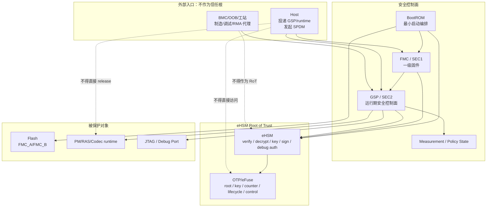

核心判断：

1. eHSM 是唯一 Root of Trust。
2. BootROM 是 first verifier 的编排者，不做复杂密码学。
3. Host、OOB、工站都不是信任根，只是数据或请求入口。
4. 所有关键 release、debug、provisioning、attestation 都要经过 SEC/GSP 与 eHSM 受控路径。

### 3.2 主启动时序

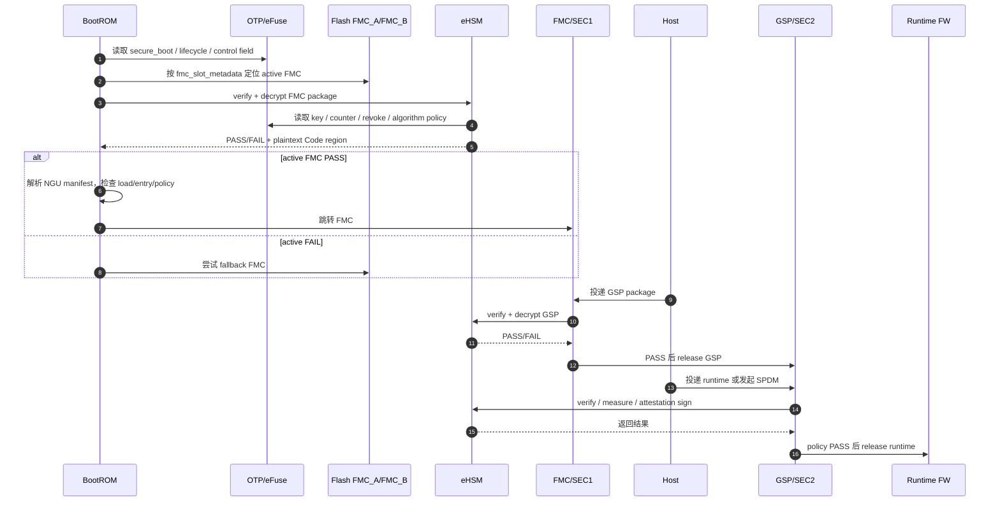

---

## 4. 功能域一：安全固件包与启动 release

### 4.1 功能目标

确保 FMC、GSP 和关键 runtime 固件在执行前满足：

- 完整性：未被篡改。
- 机密性：正式路径下密文存储或传输，设备内受控解密。
- 版本安全：不能回滚到低版本。
- 吊销安全：被吊销 signer/key/version 不能继续启动。
- release 安全：Host/OOB 不能绕过 SEC/eHSM 直接放行。

### 4.2 最终制品长什么样

FMC/GSP/runtime 的正式固件包都采用 eHSM native package。FMC 存在 Flash，GSP/runtime 由 Host 投递。

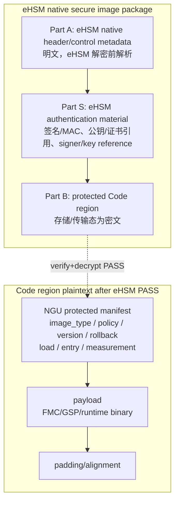

| 对象 | 明文/密文 | 认证覆盖 | 加密覆盖 | 工程含义 |
|---|---|---|---|---|
| eHSM native header | 明文 | 按 eHSM TRM profile，可能部分作为 AAD | 否 | eHSM 解密前需要读取 `Code_Size`、profile、key/counter reference 等 |
| authentication material | 明文或 TRM 指定 | 是 | 通常不作为 payload 加密对象 | 签名/MAC、公钥/证书引用、signer/key reference；物理位置以 eHSM TRM 为准 |
| protected Code region | 存储态密文 | 必须完整认证 | FMC/GSP 正式路径必须加密 | eHSM PASS 后输出明文 |
| NGU manifest | eHSM PASS 后明文 | 必须认证 | 随 Code region 加密 | NGU 项目级 release 决策字段 |
| payload | eHSM PASS 后明文 | 必须认证 | 必须加密 | 最终执行固件 |

需要说明清楚：

1. 签名材料不放在解密后的 NGU manifest 里，也不是 NGU 自定义尾随字段。
2. NGU `FMC/GSP/PM/RAS/Codec` 类型不写入 eHSM native `Image_Type` 来表达，而是写入受保护 NGU manifest。
3. eHSM native header 的 exact offset、字段长度、公钥/证书字段位置以 eHSM TRM 为准。

### 4.3 固件制作端流程

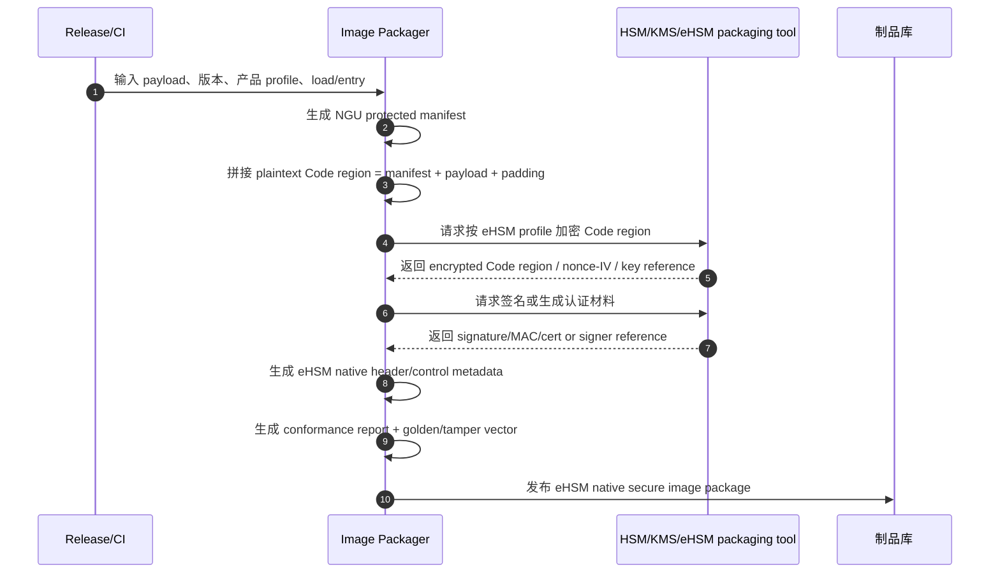

制作端必须生成或检查：

| 项 | FMC | GSP | runtime |
|---|---|---|---|
| `ngu_image_type` | `FMC/SEC1` | `GSP/SEC2` | `PM/RAS/Codec/...` |
| sign policy | 强制 | 强制 | USER/PROD 默认强制 |
| encrypt policy | 强制 | 强制 | USER/PROD 默认强制，例外需白名单 |
| rollback domain | 必须 | 必须 | 按产品策略 |
| lifecycle mask | 必须 | 必须 | 必须 |
| measurement slot | 必须 | 必须 | 必须 |
| load/entry | 必须白名单 | 必须白名单 | 按 release 控制 |
| golden/tamper vector | 必须 | 必须 | 建议 |

### 4.4 设备侧 verify/decrypt/release 流程

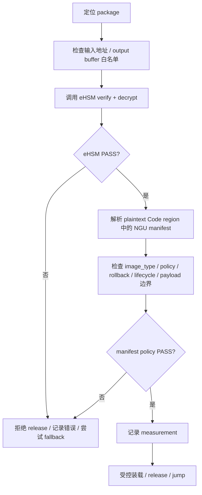

设备侧禁止项：

- 不得在 eHSM PASS 前信任 manifest。
- 不得由 BootROM/FMC/GSP 自行做正式路径签名验证、解密或 key unwrap。
- 不得从未认证保护的 header 字段读取 NGU 项目级 release 决策。
- 不得让 Host/OOB 直接指定 release 结果。

### 4.5 使用的密钥和存储位置

| 用途 | 逻辑名 | eHSM TRM 对齐方向 | 存储/使用位置 | 状态 |
|---|---|---|---|---|
| FMC 正常启动验签 | `normal_fmc_signer_0/1` | `Soc FW Verify Key` / owner mapping | trust anchor、公钥或证书引用由 eHSM/OTP/eHSM NVM/package profile 管理 | exact key ID `[TBD]` |
| FMC 正常启动解密 | `normal_fmc_fw_kek_0/1` | `Soc Encrypt Key` / owner mapping | FW_KEK / image protect key 在 eHSM key slot 或受控 OTP/eFuse/NVM 中，不导出 | exact key ID `[TBD]` |
| GSP 正常启动验签 | `normal_gsp_signer` | `Soc FW Verify Key` 或 owner-confirmed SEC2 mapping | eHSM 验签服务使用 | `[TBD]` |
| GSP 正常启动解密 | `normal_gsp_fw_kek` | `Soc Encrypt Key` 或 owner-confirmed SEC2 mapping | eHSM 解密服务使用 | `[TBD]` |
| runtime 验签/解密 | `runtime_signer/runtime_fw_kek` | eHSM FW verify/encrypt key 或 owner customization | GSP 调 eHSM 使用 | `[TBD]` |
| FMC 升级授权验签 | `fmc_update_authority_0/1` | `Soc Upgrade Verify Key` / owner mapping | key rotation capsule / upgrade package 授权 | `[TBD]` |
| FMC 升级保护 | `fmc_update_encrypt_0/1` | `Soc Upgrade Encrypt Key` / owner mapping | upgrade package / new key policy 保护材料 | `[TBD]` |

关于“公钥”和“解密公钥”：

- 验签可以涉及公钥、证书链、signer hash、trust anchor 或 key reference。
- 公钥/证书可以位于 package 的 eHSM authentication material、eHSM NVM、安全 Flash/分区，或由 OTP/eFuse 中的 root/trust anchor 约束；exact storage 需要 eHSM owner 冻结。
- 固件解密不应理解成“用解密公钥”。当前方案中，解密依赖 eHSM 内部 key/FW_KEK/image protect key/CEK wrapping 等 TRM 或 owner-confirmed 机制；普通软件不能拿到解密 key。

### 4.6 硬件/eHSM需求

| 模块 | 需求 |
|---|---|
| eHSM | native secure boot image header/profile、verify+decrypt command、错误码、超时、output buffer 规则 |
| OTP/eFuse | key/counter/control/lifecycle/revoke/lock bit |
| BootROM | early eHSM 调用 ABI、FMC slot 选择和 fallback |
| Flash | `FMC_A/FMC_B` 分区、metadata 存储区 |
| Secure RAM | eHSM 解密输出区、BootROM/FMC/GSP 执行区、清零策略 |
| Firewall/DMA | Host/OOB 不能访问 secure output buffer、eHSM 内部区、OTP/eFuse |

详设索引：

| 问题 | `10_full_design.md` |
|---|---|
| 固件包布局 | `3.10.5` |
| 平台侧制作流程 | `3.10.6` |
| 设备侧 verify/decrypt | `3.10.7` |
| eHSM source-conformance | `10.3` |
| VERIFY_FMC / VERIFY_IMAGE | `10.5.21` |

---

## 5. 功能域二：Root、Key、Cert、Algorithm

### 5.1 功能目标

让固件验签、固件解密、升级授权、debug 授权、设备认证和算法选择都由 eHSM/OTP/eFuse 受控，而不是由 Host、普通软件或临时字段决定。

### 5.2 密钥和证书对象

| 对象 | 作用 | 建议存储/管理位置 | 硬件/eHSM需求 |
|---|---|---|---|
| Root / UDS / root secret | 设备根材料 | eHSM / OTP/eFuse / secure NVM | 不导出、lifecycle gating、锁定 |
| FW verify trust anchor | FMC/GSP/runtime 验签根 | eHSM/OTP/eFuse/eHSM NVM/package profile | signer revoke、cert/hash 校验 |
| FW_KEK / image protect key | 固件解密 | eHSM key slot / secure key policy | 不导出、purpose 绑定 |
| Upgrade verify key | FMC 升级 / key rotation 授权 | `Soc Upgrade Verify Key` 对齐方向 | old->new key 授权 |
| Upgrade encrypt key | 升级包或 new key policy 保护 | `Soc Upgrade Encrypt Key` 对齐方向 | 保护更新材料 |
| Attestation key | report / SPDM 签名 | eHSM 内部 key service | 私钥不导出，支持 nonce 签名 |
| Device certificate chain | Host 验证设备身份 | eHSM NVM / secure Flash / secure partition / package response | exact storage `[TBD]` |
| Debug auth key | challenge-response debug/RMA | eHSM / OTP/eFuse | scope、timeout、lockout |
| Algorithm control field | secure boot / upgrade / attestation 算法选择 | eHSM control field / OTP/eFuse | 可锁定、可读回、一致性检查 |

### 5.3 证书链建议

```text
Product Root CA
    -> Batch / SKU / Device Intermediate CA
        -> Device Attestation Certificate
            -> Attestation public key
```

| 证书/密钥 | 谁持有 | 用途 |
|---|---|---|
| Root CA private key | 厂商 HSM/KMS | 签发中间证书，不进设备 |
| Intermediate CA private key | 厂商 HSM/KMS | 签发设备证书，不进普通设备软件 |
| Device attestation private key | eHSM 内部 | 签名 attestation report / SPDM challenge |
| Device attestation certificate | 设备安全存储或受保护区域 | 返回给 Host verifier |
| Root/Intermediate public cert | Host verifier trust store 或设备返回链 | Host 验证设备证书 |

### 5.4 还需要硬件/eHSM冻结的点

| 冻结项 | 原因 |
|---|---|
| exact key ID / purpose / level | 避免软件写死错误 key slot |
| public key / cert chain 存储位置 | 影响 SPDM GET_CERTIFICATE 和验签路径 |
| FW_KEK 导入、派生或存储方式 | 影响固件解密能否落地 |
| revoke/control field 表达 | 影响 key rotation 和 signer 吊销 |
| algorithm control field | 影响国密/国际算法选择权归属 |

详设索引：`4.8`、`8`、`10.3.18`、`10.7`。

---

## 6. 功能域三：反回滚、FMC A/B 和 key slot 轮换

### 6.1 反回滚和吊销

| 机制 | 当前口径 | 落地对象 | 待冻结 |
|---|---|---|---|
| rollback domain | NGU manifest 中表达逻辑域 | manifest field | manifest ABI |
| physical counter | 优先对齐 eHSM SOC FW Version Counter | eHSM counter/control | 粒度、更新时机 |
| signer revoke | eHSM control/revoke field 或证书策略 | eHSM/OTP/eFuse | revoke 表达 |
| key revoke | key slot state 从 active/deprecated 到 revoked | eHSM key state / owner policy | exact key ID/state |

### 6.2 FMC A/B 防变砖

首版只有 FMC 需要片上防变砖。GSP/runtime 由 Host 下发，失败后重新下发，不设计片上 recovery 分区。

```text
Flash:
  FMC_A: eHSM native FMC package
  FMC_B: eHSM native FMC package
  fmc_slot_metadata: active/fallback/state/version/key_epoch/seq/auth
```

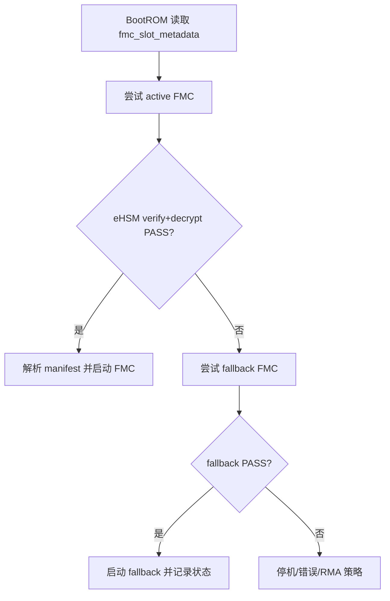

`fmc_slot_metadata` 至少需要：

| 字段语义 | 用途 |
|---|---|
| `active_slot` / `fallback_slot` | BootROM 选择启动顺序 |
| `slot_state[A/B]` | EMPTY/VALID/PENDING/CONFIRMED/BAD/REVOKED |
| `slot_version[A/B]` | rollback 对齐 |
| `slot_key_epoch[A/B]` | key rotation 对齐 |
| `boot_attempt_counter[A/B]` | 防止反复失败 |
| `metadata_seq` | 原子更新 |
| `metadata_auth` | 防篡改 |

### 6.3 key slot 轮换

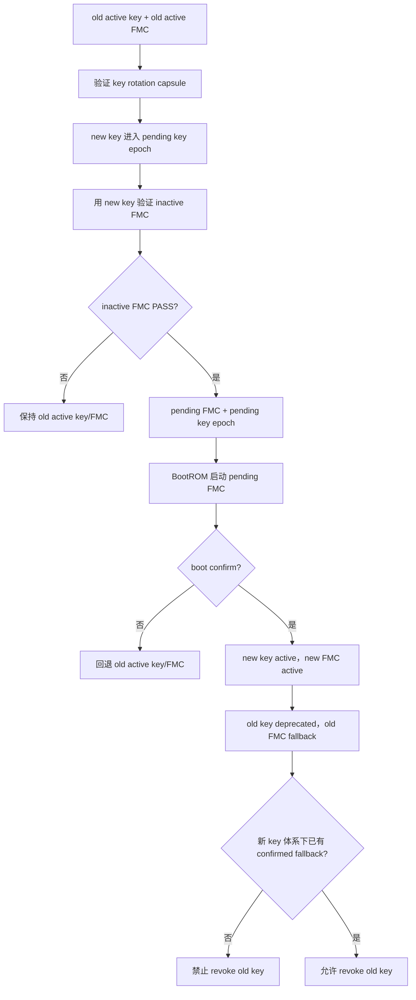

强规则：

1. 新 key 只能先进入 pending，不能覆盖 active key。
2. new key 必须验证 inactive FMC，才可绑定到 pending FMC。
3. pending FMC 必须 boot confirm，new key 才能 active。
4. old key 必须先 deprecated，不能过早 revoked。
5. 新 key 体系下形成可恢复 fallback 后，才允许 revoke old key。

详设索引：`3.14.3`、`3.14.4`、`10.3.17`、`10.3.18.1`。

---

## 7. 功能域四：Host/OOB 边界、Mailbox 和硬件隔离

### 7.1 Host 允许和禁止的行为

| Host 行为 | 是否允许 | 说明 |
|---|---|---|
| 投递 GSP/runtime package | 允许 | 只作为数据来源 |
| 发起 SPDM 请求 | 允许 | GSP responder 决定返回内容 |
| 读取普通状态 | 允许 | 受权限和错误隐藏策略约束 |
| 下发/替换 FMC | 不允许 | FMC 来自 Flash，BootROM/eHSM 控制 |
| 直接 release runtime | 不允许 | release 权在 GSP |
| 直接写 OTP/eFuse/key/counter/control | 不允许 | 必须走制造/安全路径 |
| 访问 secure output buffer | 不允许 | Firewall/DMA 阻断 |

### 7.2 OOB/BMC/工站边界

OOB/BMC/工站可以作为代理入口，但不能作为 RoT。制造、debug、RMA 请求都必须进入 GSP/SEC/eHSM 受控路径。

| 能力 | 需求 |
|---|---|
| proxy auth | OOB 请求需要认证 |
| anti-replay | 防止重放制造/debug/RMA 请求 |
| rate limit / lockout | 防止暴力尝试 |
| audit | 记录请求、结果、失败原因 |
| access boundary | 不能直接写 eHSM/OTP/security MMIO |

### 7.3 硬件隔离需求

| 模块 | 需求 |
|---|---|
| Firewall / UserID | 区分 Host、OOB、SEC、GSP、eHSM、各管理核访问权限 |
| DMA window | Host/OOB 只能访问 staging buffer |
| Secure RAM | output buffer、manifest、measurement table 不可被 Host 写 |
| Mailbox/shared memory | doorbell、req/resp、timeout、cache/DMA 一致性 |
| Illegal access response | 非法访问要可诊断，是否暴露给 Host 需按错误隐藏策略 |

详设索引：`1.6`、`6`、`7`、`10.5`。

---

## 8. 功能域五：Measurement、SPDM 和 Attestation

### 8.1 Measurement 要记录什么

| 对象 | 记录内容 |
|---|---|
| FMC | verify/decrypt 成功状态、digest、version、rollback、key epoch、slot |
| GSP | verify/decrypt 成功状态、digest、version、release state |
| runtime | image type、digest、policy、signature-only 例外状态 |
| lifecycle | TEST/DEVE/MANU/USER/RMA |
| debug | debug 是否打开、scope、授权状态 |
| rollback/revoke | counter/revoke/key state |
| board/die binding | 是否进入 release decision 或 attestation |

### 8.2 SPDM / Attestation 流程

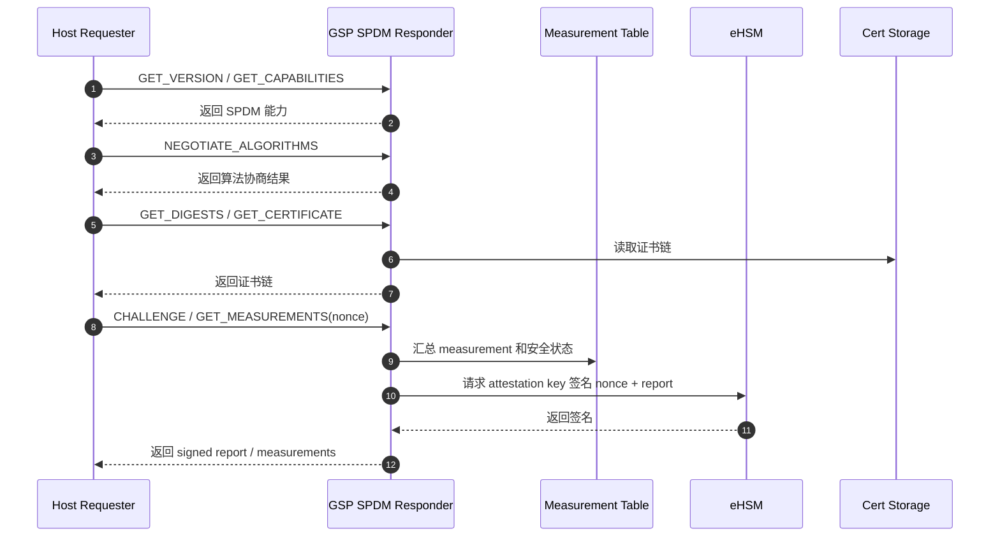

### 8.3 证书链和报告签名

| 对象 | 位置 | 说明 |
|---|---|---|
| Attestation private key | eHSM 内部 | 私钥不导出 |
| Attestation public key | 设备证书中 | Host 验证 report |
| Device certificate | eHSM NVM / secure Flash / secure partition / owner-confirmed storage | exact storage `[TBD]` |
| Root/Intermediate cert | Host verifier trust store 或设备返回链 | 产品策略决定 |
| Report signature | eHSM 生成 | 覆盖 nonce、measurement、安全状态 |

详设索引：`4.8`、`4.9`、`4.11`、`4.15`、`10.7`。

---

## 9. 功能域六：生命周期、Debug、RMA

### 9.1 生命周期矩阵

| 生命周期 | 安全启动 | Debug | key/provisioning | 典型用途 |
|---|---|---|---|---|
| TEST/DEVE | 可允许受控非安全路径 | 可较宽 | 测试材料 | bring-up |
| MANU | 必须验证制造路径 | 受控 | 写入 root/key/cert/counter/control | 量产灌装 |
| USER | 默认安全启动 | 默认关闭 | key/control 锁定 | 出厂量产 |
| DEBUG/RMA | 不绕过安全策略 | challenge-response 限权开启 | 受控返修 | 维修 |
| DEST | 失效 | 关闭 | 销毁/不可用 | 报废 |

### 9.2 Debug/RMA 最小流程

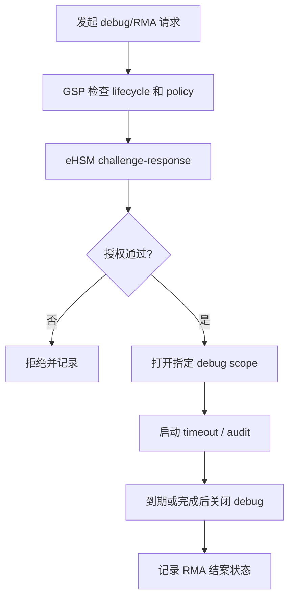

硬件需求：

| 模块 | 需求 |
|---|---|
| JTAG/MUX/CPLD | USER 默认关闭，只能受控打开 |
| Debug scope bitmap | 定义每个 bit 对应能力 |
| eHSM debug auth | challenge-response、失败计数、lockout |
| lifecycle gating | 非授权生命周期不得开启 |
| audit storage | 记录 scope、时间、结果 |

详设索引：`5`、`10.6`。

---

## 10. 功能域七：制造、灌装和 USER freeze

### 10.1 制造要写什么

| 对象 | 作用 | 写入/建立位置 |
|---|---|---|
| Root / UDS / root secret | 设备根 | eHSM / OTP/eFuse / secure NVM |
| FW verify trust anchor | 固件验签根 | eHSM/OTP/eFuse/eHSM NVM |
| FW_KEK / image protect key policy | 固件解密 | eHSM key slot / key policy |
| Upgrade verify/encrypt authority | 升级和 key rotation | eHSM key mapping |
| Attestation key / CSR / cert | 设备认证 | eHSM key + cert storage |
| Debug auth anchor | Debug/RMA | eHSM/OTP/eFuse |
| Version Counter 初值 | Anti-rollback | eHSM counter |
| Control field / algorithm | 安全策略 | eHSM/OTP/eFuse |
| Lifecycle | MANU -> USER | OTP/eFuse lifecycle |

### 10.2 USER freeze 前必须验证什么

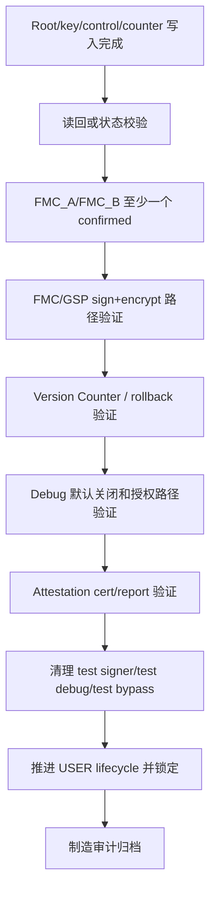

失败原则：

- 任一步失败，不得报告 USER freeze 完成。
- 测试 key、测试 signer、测试 debug 白名单不得进入 USER。
- USER freeze 后，Host/OOB 不得直接写 key/counter/control/lifecycle。

详设索引：`1.9`、`9`、`10.6`。

---

## 11. 硬件 / eHSM 需求矩阵

| Owner | 必须提供或冻结 | 支撑功能 |
|---|---|---|
| eHSM Bootloader/Firmware | native header/profile、verify+decrypt、key service、counter、debug auth、attestation sign | 启动、固件保护、debug、attestation |
| OTP/eFuse | root/key/control/counter/lifecycle/lock/revoke physical layout | RoT、反回滚、USER freeze |
| BootROM | eHSM early ABI、FMC_A/B fallback、metadata 处理、失败策略 | FMC 启动、防变砖 |
| Flash | FMC_A/FMC_B、metadata 存储区、更新保护 | FMC 防变砖 |
| Secure RAM | output buffer、execution buffer、measurement table 区域和权限 | verify/decrypt/release |
| Firewall/UserID/DMA | Host/OOB/SEC/GSP/eHSM 访问边界 | Host/OOB 隔离 |
| Mailbox/shared memory | req/resp、doorbell、timeout、cache/DMA 一致性 | eHSM 服务、Host/OOB 请求 |
| JTAG/MUX/CPLD | USER 默认关闭、scope、授权打开路径 | debug/RMA |
| Host/PCIe | staging buffer、doorbell、状态读取边界 | GSP/runtime 投递、SPDM |
| 制造工站/HSM/KMS | key/cert/counter/control provisioning、审计 | MANU/USER freeze |

---

## 12. 当前需要项目组拍定的问题

| 问题 | 当前建议 | 责任方 |
|---|---|---|
| eHSM exact key ID / purpose / level | NGU 保持 logical alias，exact mapping 由 eHSM owner 冻结 | eHSM owner / Security owner |
| 公钥/证书链存储位置 | 区分固件验签 anchor 和 attestation cert chain | eHSM owner / Manufacturing / Host |
| FW_KEK / image protect key 导入和存储 | 只在 eHSM/受控安全环境使用，不导出 | eHSM owner / Manufacturing |
| `fmc_slot_metadata` ABI | active/fallback/state/version/key_epoch/seq/auth | BootROM / RTL / Security |
| Version Counter 粒度 | 至少支持 FMC/GSP rollback，per-image 粒度待定 | eHSM owner / Product security |
| runtime signature-only 白名单 | 默认 sign+encrypt，例外必须进入 attestation | Product security / GSP |
| SPDM 首版证书链复杂度 | 按完整链设计，可裁剪实现但 ABI 预留 | GSP / Host / Manufacturing |
| debug scope bitmap | 每个 debug 能力、生命周期、授权条件明确 | RTL / Board / Security |
| 制造工站接口 | HSM/KMS、CSR、证书回写、audit、失败重试 | Manufacturing / eHSM |

---

## 13. 详细设计快速索引

| 问题 | `10_full_design.md` 位置 |
|---|---|
| 总体安全框架 | `1`、`2` |
| FMC/GSP 为什么必须签名+加密 | `1.2`、`3.5`、`3.9` |
| 固件包最终长什么样 | `3.10.5` |
| 签名在哪里、覆盖哪些区域 | `3.10.5`、`10.3.20` |
| 加密覆盖哪些区域 | `3.10.5`、`3.10.6` |
| NGU manifest 放在哪里 | `3.10.2`、`3.10.5` |
| 平台侧怎么制作固件 | `3.10.6` |
| 设备侧怎么 verify/decrypt | `3.10.7` |
| BootROM/FMC/GSP 分工 | `3.7`、`3.11` |
| Host staging buffer | `3.12` |
| eHSM key/counter mapping | `10.3.17`、`10.3.18` |
| FMC A/B 状态机 | `3.14.3` |
| key slot 轮换 | `3.14.4`、`10.3.18.1` |
| SPDM/设备认证 | `4`、`10.7` |
| 生命周期/debug/RMA | `5`、`10.6` |
| 制造灌装/USER freeze | `9`、`10.6` |
| 开放问题 | `11.2` |

---

## 14. 结论

本文把 NGU800 安全方案重新组织为“功能全貌 + 落地卡片”的形式：

1. 功能点范围保持完整：启动、固件保护、密钥、证书、反回滚、恢复、SPDM、attestation、debug、制造、硬件隔离都保留。
2. 对最容易误解的固件包部分，明确最终制品为 eHSM native package，而不是 NGU 自定义 header。
3. 对签名和加密做了分离说明：验签使用公钥/证书/trust anchor，解密使用 eHSM 内部 key/FW_KEK/image protect key，不存在设备侧“解密公钥”路径。
4. 对 FMC A/B 和 key slot 轮换明确了防变砖状态机，避免过早 revoke old key。
5. 对硬件同事需要冻结的内容给出了 owner 维度矩阵和项目组待拍板表。
