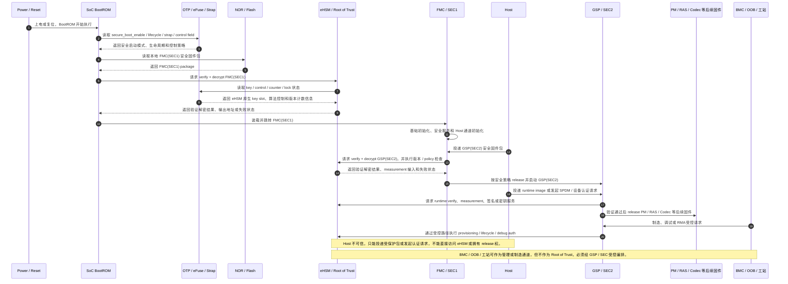
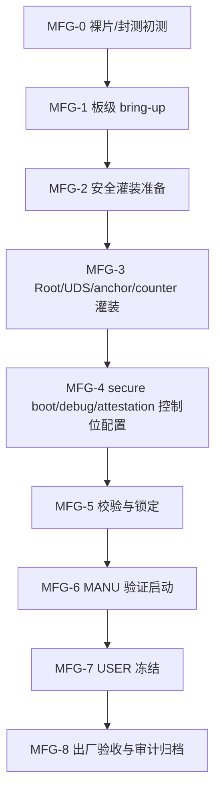

# NGU800 安全方案领导汇报材料

版本：V1.0  
日期：2026-05-15  
来源：`security_workflow/03_detailed_design/10_full_design.md`（整合版 V2.4，pending review）  
定位：面向领导和项目组的方案汇报材料，用于说明当前安全方案方向、实施路径、待拍板事项、硬件依赖和流片前必须冻结内容。

---

## 1. 汇报目的

本材料不替代详细设计文档，不展开具体结构体、寄存器、命令字段和代码实现细节。目标是帮助项目组快速形成共识：

1. 当前安全方案已经定下来的主方向是什么。
2. 后续准备按什么节奏落地。
3. 哪些内容还需要项目组拍板。
4. 哪些内容依赖硬件 / eHSM / OTP / 板级设计。
5. 哪些流程，尤其是制造、灌装、调试、RMA，需要在流片前明确。

---

## 2. 方案一句话

NGU800 安全方案以 **eHSM 作为唯一 Root of Trust**，由 **BootROM 做最小启动编排**，由 **FMC(SEC1) 和 GSP(SEC2) 承接安全启动与运行期安全控制面**，Host / BMC / OOB 仅作为不可信投递或管理通道，所有关键固件、密钥、生命周期、调试、认证和制造动作都通过 eHSM 与 SEC 控制面收敛。

---

## 3. 当前已形成的方案主线

### 3.1 信任根与启动链

已形成的主线如下：

```text
BootROM -> FMC(SEC1) -> GSP(SEC2) -> 后续子系统固件
```

当前方案定位：

- eHSM 是唯一 Root of Trust，也是首个密码学验证主体。
- BootROM 只做最小启动编排，不内嵌复杂验签和复杂解密逻辑。
- FMC 是一级固件，也就是安全抽象中的 SEC1，来自本地 Flash / NOR，不由 Host 下发。
- GSP 是二级安全管理固件，也就是安全抽象中的 SEC2，由 Host 投递，但 Host 只负责投递，不参与信任链。
- FMC(SEC1) 和 GSP(SEC2) 在正式安全启动路径中都必须签名 + 加密。
- 后续 PM / RAS / Codec 等 runtime image 默认按签名 + 加密设计，是否允许 signature-only 需要产品策略白名单进一步拍板。

### 3.2 信任边界

当前方案把系统角色划分为：

| 角色 | 安全定位 |
|---|---|
| eHSM | Root of Trust，负责密钥、验证、解密、生命周期、调试授权、反回滚和证明密钥使用 |
| BootROM | 最早启动编排者，负责定位 FMC、调用 eHSM、安全失败处理 |
| FMC(SEC1) | 一级固件，建立基础平台和 Host 通道，承接 GSP 验证编排 |
| GSP(SEC2) | 运行期安全控制面，负责后续固件验证、measurement、attestation、debug/RMA、制造流程编排 |
| Host | 不可信投递方，只能投递 GSP 和后续受保护包，不能下发 FMC，不能 release 固件 |
| BMC/OOB/管理子系统 | 可作为管理和制造链路承载方，但不进入 Root of Trust |

### 3.3 固件包与 eHSM 对齐原则

当前方案已明确：FMC/GSP 的密码学 verify/decrypt container 尽量跟随 eHSM 原生 secure boot image header，NGU 项目级 metadata 放在受保护 manifest / policy table 中。

这意味着：

- 不再另起一套与 eHSM 冲突的 physical 固件头格式。
- 平台侧固件制作工具和设备侧 verify/decrypt 逻辑必须使用同一套固件包契约。
- eHSM 先完成 verify/decrypt，BootROM / FMC / GSP 再解析 NGU manifest 并做 release policy 判断。

### 3.4 安全服务范围

当前安全方案覆盖以下主路径：

- 安全启动与固件验签 / 解密。
- 固件版本检查、反回滚和吊销。
- 密钥、证书、算法策略和生命周期控制。
- Host / OOB / 管理子系统边界。
- 安全调试、RMA 和受限 debug。
- 设备认证、measurement 和 SPDM attestation。
- 制造、灌装、USER 冻结和审计。

### 3.5 安全方案功能点清单

为便于项目组理解当前安全方案的功能范围，按功能域整理如下。这里列的是方案级功能点，不展开寄存器、结构体和命令字段。

| 功能域 | 功能点 | 当前方案状态 | 需要项目组关注 |
|---|---|---|---|
| 安全启动主链路 | BootROM -> FMC(SEC1) -> GSP(SEC2) -> runtime image 的受控启动链 | 主方向已明确 | BootROM/eHSM/FMC/GSP 的 exact ABI 仍需冻结 |
| FMC(SEC1) 保护 | FMC 来源本地 Flash / NOR，正式路径必须签名 + 加密，Host 不下发 FMC | 已明确 | BootROM 调 eHSM verify/decrypt 路径需流片前冻结 |
| GSP(SEC2) 保护 | GSP 由 Host 投递，但必须经签名 + 加密验证后 release | 已明确 | GSP 包格式、staging buffer、release policy 需冻结 |
| Runtime image 保护 | PM/RAS/Codec 等关键 runtime image 默认签名 + 加密 | 方向已形成，白名单未冻结 | 哪些镜像允许 signature-only 需要项目组拍板 |
| 固件包格式 | follow eHSM native header，NGU metadata 放入受保护 manifest / policy table | 主方向已明确 | manifest ABI、packager CLI、golden vector 需冻结 |
| 固件制作流程 | 平台工具生成受保护固件包，设备侧按同一契约 verify/decrypt | 已纳入方案 | 工具链 owner、发布流程、签名加密材料管理需明确 |
| 设备侧 verify/decrypt 流程 | eHSM 先完成 verify/decrypt，BootROM/FMC/GSP 再解析 manifest 并决策 release | 已纳入方案 | 输出 buffer、安全内存、错误处理、失败恢复需冻结 |
| 反回滚 | 使用 eHSM Version Counter / owner 确认的等价机制支撑 rollback check | 方向已明确 | counter 粒度、更新时机、失败处理仍需冻结 |
| 吊销 / revoke | 支持 signer、版本、策略等吊销能力 | 方案已覆盖 | eHSM control field、证书/anchor revoke 表达需冻结 |
| 密钥体系 | Root / UDS / FW_KEK / debug anchor / attestation key 等分域管理 | 方案已覆盖 | exact key ID、用途、生命周期 gating 需 eHSM owner 确认 |
| 证书体系 | 支持固件验签证书链和设备认证证书链方向 | 方案已覆盖 | 首版是否强制 X.509 full chain 需拍板 |
| 双算法策略 | 支持国密和国际算法栈，算法 authority 来自 eHSM control field | 方向已明确 | 算法组合、切换策略、制造控制位需冻结 |
| Host 边界 | Host 不可信，只投递 GSP / runtime 包，不进入信任链，不拥有 release 权 | 已明确 | Host 接口错误码、状态查询、失败可见性需冻结 |
| OOB / BMC / 管理子系统边界 | OOB/BMC 可作管理或制造 transport proxy，不作为 trust anchor | 已明确 | proxy 认证、审计、rate limit、失败回滚需冻结 |
| Mailbox / Shared Memory | SEC 与 eHSM、Host/OOB 请求之间的受控命令通道 | 方案已覆盖 | doorbell、req/resp、超时、重试、错误隐藏策略需冻结 |
| 安全内存与访问隔离 | staging/output/secure buffer 必须受权限和 DMA/firewall 约束 | 方案已覆盖 | 地址范围、UserID、firewall region 需 RTL 冻结 |
| Measurement | 记录固件验证、解密、rollback、policy、release 等安全状态 | 方案已覆盖 | measurement slot、字段编码、清零/更新时机需冻结 |
| SPDM / 设备认证 | Host requester 可认证设备，读取 measurement / attestation report | 方向已明确，代码已开始对接 libspdm | 证书链、report 字段、session 策略需冻结 |
| Attestation report | report 覆盖 measurement、lifecycle、debug、secure boot、rollback 等状态 | 必须项已明确 | board binding、event log、image protection 字段位置需拍板 |
| 生命周期控制 | TEST / DEVE / MANU / USER / DEBUG-RMA / DEST 状态约束 | 方案已覆盖 | lifecycle bit、推进规则、回退限制需流片前冻结 |
| 安全调试 | USER 默认关闭未授权 debug，经 challenge/auth 后限时、限范围开启 | 方向已明确 | debug scope bitmap、JTAG MUX/CPLD 控制权需冻结 |
| RMA / Recovery | RMA 需授权、审计、恢复 USER 安全状态；recovery image 需独立策略 | 方案已覆盖，细节待拍板 | recovery signer、rollback、trust anchor、返修闭环需冻结 |
| 制造灌装 | 工站通过 SEC/C908 受控路径调用 eHSM 完成 root/anchor/control 写入 | 方向已明确 | 工站接口、HSM/KMS、灌装模式、审计落点需冻结 |
| USER 冻结 | MANU 验证启动后清测试 trust、锁 key/control、推进 USER | 方案已覆盖 | freeze 原子性、失败处理、验收报告需产线共同确认 |
| 审计 | 制造、debug、RMA、关键状态变化需记录审计 | 方案已覆盖 | 审计字段、存储位置、读取权限需冻结 |
| 板级绑定 | 默认进入 attestation，不默认阻断 FMC；是否参与 GSP/runtime release 待定 | 阶段策略已明确 | 是否阻断 release 需要项目组拍板 |
| 电源 / 复位 / fault 事件 | 影响安全状态机、恢复和 attestation | 方案已覆盖 | 哪些事件进入主 report 或 event log 需拍板 |
| 工具与测试 | image packager、golden vector、host test、QEMU/stub bring-up | 已开始落地 | 工具输出格式、CI 策略、硬件联调计划需明确 |

---

## 4. 总体流程架构示意



图示说明：

- 可信根在 eHSM，不在 Host、不在 BMC/OOB，也不在普通软件。
- BootROM 负责最小启动编排，FMC(SEC1) 是一级固件，GSP(SEC2) 是后续安全控制面。
- FMC(SEC1) 来自本地 NOR / Flash；Host 只投递 GSP(SEC2) 和后续 runtime image，不下发 FMC。
- FMC(SEC1) 和 GSP(SEC2) 都必须走 eHSM verify + decrypt 路径，不能绕过 eHSM 直接 release。
- GSP(SEC2) 启动后承接 runtime image release、SPDM / 设备认证、measurement、制造、debug 和 RMA 编排。
- Host / BMC / OOB / 工站可以作为传输或管理入口，但不能作为信任根，也不能直接决定固件 release。

---

## 5. 计划如何落地

建议按“先主链路、再证明、再制造闭环、最后硬化”的节奏推进。

| 阶段 | 目标 | 主要产出 |
|---|---|---|
| P0：方案冻结准备 | 关闭关键待确认项，确定硬件依赖 | 决策清单、接口冻结项、流片前 checklist |
| P1：安全启动主链路 | BootROM -> FMC -> GSP 跑通签名 + 加密验证链 | eHSM adapter、固件包工具、manifest、启动失败处理 |
| P2：GSP 安全控制面 | GSP 承接后续固件验证、measurement 和 release | runtime image policy、measurement table、release policy |
| P3：设备认证 / SPDM | 支持 Host requester 对设备侧发起认证和读取 report | SPDM stack、证书/证明链、attestation report |
| P4：制造 / 灌装 / USER 冻结 | 把 Root、signer、FW_KEK、debug anchor、lifecycle 写入和锁定流程闭环 | provisioning 流程、工站接口、审计、USER freeze |
| P5：RMA / Debug / 安全硬化 | 受授权 debug、RMA 恢复、board/OOB/DMA/JTAG 边界闭环 | debug auth、scope、timeout、审计、恢复策略 |

当前代码落地建议仍聚焦 `bootrom / FMC / GSP`，其他 PM / RAS / OMP / RMP 先保持策略预留，不修改各自入口流程，避免过早影响其他团队开发。

---

## 6. 需要项目组拍板的关键事项

以下事项不建议由软件实现侧单独决定，需要项目组或安全 owner 拍板。

| 决策项 | 当前建议 | 为什么需要拍板 |
|---|---|---|
| Runtime image 是否全部强制签名 + 加密 | SEC1/FMC、SEC2/GSP 强制；其他关键 runtime 默认强制，signature-only 只允许白名单例外 | 影响性能、包大小、启动时延、产品安全等级 |
| NGU protected manifest ABI | 放在 eHSM verify/decrypt 后受保护区域，由 BootROM/FMC/GSP 解析 | 影响固件工具、BootROM、SEC FW 和后续兼容性 |
| eHSM key ID / control bit / counter 映射 | physical 字段以 eHSM TRM 为准，NGU 只保留 logical alias | 影响 RTL、eFuse/OTP、制造灌装和调试 |
| BootROM 调 eHSM 的 exact ABI | BootROM 不做复杂 crypto，只调用 eHSM verify/decrypt path | 影响 BootROM 固化代码，必须尽早冻结 |
| Board binding 策略 | 当前默认进入 attestation，不阻断 FMC；是否阻断 GSP/runtime 需拍板 | 影响量产兼容性、维修换板、双 Die 场景 |
| JTAG / debug scope 策略 | USER 默认关闭，授权后限时、限范围、可审计打开 | 影响 RTL/板级 MUX/CPLD、售后和 bring-up |
| 管理子系统 DMA / firewall / UserID | 安全资源默认拒绝，只允许访问白名单 buffer | 影响 SoC interconnect、firewall、错误上报 |
| SPDM / attestation report 字段 | 必须覆盖 measurement、lifecycle、debug、secure boot、rollback | 影响 Host verifier、证书体系和合规证明 |
| 制造 provisioning 链路 | 工站通过 SEC/C908 受控路径调用 eHSM，不直接触达 RoT | 影响工站、HSM/KMS、产线节拍和审计 |
| Recovery / RMA 策略 | RMA 需 challenge/auth 后限权 debug，恢复后回到 USER 安全状态 | 影响售后可用性和量产安全闭环 |

---

## 7. 对硬件设计的主要依赖

以下内容对硬件、eHSM、OTP/eFuse、SoC 集成或板级设计有直接依赖。

| 依赖项 | 影响范围 | 需要硬件 / eHSM / 板级提供的信息 |
|---|---|---|
| eHSM secure boot / verify / decrypt 命令 | BootROM、FMC、GSP 安全启动 | 命令 ABI、输入输出 buffer 规则、错误码、超时、并发限制 |
| OTP/eFuse physical layout | 密钥、生命周期、控制位、反回滚 | exact bit/field、锁位、读回策略、生命周期推进规则 |
| eHSM key policy | FW_KEK、Root/UDS、debug anchor、attestation key | key ID、用途、访问控制、生命周期 gating |
| Version Counter / rollback 机制 | 防回滚和升级策略 | counter 类型、粒度、更新规则、失败处理 |
| Secure RAM / staging/output buffer | verify/decrypt 输出、Host 投递包、manifest 解析 | 地址范围、访问权限、清零策略、DMA 隔离 |
| Mailbox / shared memory | SEC 调 eHSM、制造命令、debug/RMA 命令 | doorbell、req/resp、超时、重试、错误隐藏策略 |
| Firewall / DMA / UserID | Host/OOB/管理子系统隔离 | master ID、region、白名单 buffer、非法访问处理 |
| JTAG / debug MUX / CPLD | USER 态 debug 关闭和授权打开 | scope bitmap、MUX 控制权、默认状态、锁定机制 |
| Reset / power / fault 事件 | attestation、恢复、审计 | 哪些事件进入安全状态机，哪些进入 report 或 event log |
| 双 Die / board binding | 板级绑定、设备证明、维修替换 | binding 数据来源、生命周期、是否参与 release decision |

---

## 8. 流片前建议必须冻结的内容

下表是建议在流片前冻结的安全相关内容。若不冻结，后续可能导致 RTL 返工、BootROM ABI 不兼容、产线流程无法闭环或量产安全策略无法执行。

| 必须冻结项 | 冻结原因 |
|---|---|
| OTP/eFuse control field、key field、counter field、lock bit | 直接影响 RTL 和制造灌装，不宜流片后再改 |
| lifecycle 状态机和 MANU -> USER 推进规则 | 影响量产冻结、debug 关闭、RMA 状态转换 |
| BootROM -> eHSM verify/decrypt 调用 ABI | BootROM 固化后修改成本极高 |
| FMC/GSP 固件包契约和 protected manifest 最小 ABI | 影响工具、BootROM/FMC/GSP/eHSM adapter 联调 |
| eHSM key ID 和 FW_KEK / signer / debug / attestation anchor 映射 | 影响密钥灌装、验签、解密、debug、证明 |
| Secure RAM / output buffer / staging buffer 地址和权限 | 影响 verify/decrypt 输出安全性和 Host 投递隔离 |
| mailbox/shared memory 安全命令基础模型 | 影响 SEC 调 eHSM、制造、RMA、debug 的统一接口 |
| firewall / DMA / UserID / 安全区访问控制 | 影响 Host/OOB/管理核是否能绕过安全边界 |
| JTAG/debug scope bitmap、MUX/CPLD 默认控制权 | 影响 USER 态是否能真正关闭未授权 debug |
| 制造测试路径与量产关闭机制 | 影响测试 bypass 是否会遗留到 USER |
| MANU 验证启动与 USER freeze 最小验收项 | 影响产线是否能证明设备进入正确安全状态 |
| RMA/debug 授权、限权、超时和审计模型 | 影响售后可用性和量产安全边界 |
| attestation report 必须覆盖的安全状态 | 影响 Host/verifier 能否判断设备真实安全状态 |

---

## 9. 制造、灌装、部署与 RMA 流程要求

制造流程不是后期软件流程，至少以下原则需要在流片前确定方向，在量产前完成细化。

### 9.1 制造阶段建议流程



### 9.2 制造阶段必须明确的内容

- Root / UDS / signer anchor / FW_KEK / debug anchor / attestation anchor 的灌装模式。
- 是否采用“Seed / UDS 注入 + eHSM 内部派生”为首选模式。
- 工站、Host、BMC 是否仅作为传输通道，不进入信任链。
- SEC/C908 是否作为唯一 provisioning 控制面。
- 哪些 OTP/eFuse 字段可以读回，哪些只能通过 eHSM 状态或试运行验证。
- USER 冻结失败时停留在 MANU、进入故障态，还是允许返工。
- 审计日志记录字段、保存位置和追溯方式。

### 9.3 USER 冻结前必须完成的动作

进入 USER 生命周期前，至少应完成：

- 开启 secure boot。
- 开启 anti-rollback。
- FMC/GSP 的签名 + 加密策略生效。
- Root / signer / FW_KEK / debug / attestation 相关 anchor 写入并锁定。
- 测试 signer、测试证书链、测试 debug 白名单清除。
- JTAG / 未授权 debug 默认关闭。
- 完成一次接近量产条件的 MANU 验证启动。
- 生成 USER freeze 审计记录。

### 9.4 RMA / DEBUG 原则

RMA 不应等价于“打开所有 debug”。建议原则：

- 必须有设备身份校验、工单或授权校验。
- 必须走 challenge / debug auth。
- debug 打开必须限范围、限时、可审计。
- 维修后必须恢复量产安全状态。
- RMA 结束后建议重新生成设备安全状态摘要或 attestation 相关记录。

---

## 10. 当前主要风险

| 风险 | 影响 | 建议动作 |
|---|---|---|
| eHSM 字段级 TRM / key policy 未完全冻结 | 影响 BootROM、FW_KEK、OTP、counter、制造灌装 | 尽快和 eHSM owner 建立字段级对齐表 |
| BootROM -> eHSM ABI 未冻结 | 影响 ROM 固化和早期 bring-up | 列为流片前高优先级冻结项 |
| manifest ABI / packager CLI 未冻结 | 影响软件工具、固件格式、联调 golden vector | 由 SEC FW + Tool + eHSM adapter 联合冻结 |
| runtime image 白名单未定 | 影响性能、启动时延和安全等级 | 项目组拍板哪些镜像可 signature-only |
| debug/JTAG/OOB/DMA 边界未字段化 | 可能产生绕过安全启动和密钥边界的路径 | RTL/Board/安全共同评审 |
| 制造 / USER freeze 流程未落到产线接口 | 量产时可能无法证明设备已进入安全状态 | 制造团队提前参与流程冻结 |

---

## 11. 建议项目组近期拍板议题

建议组织一次安全方案冻结评审，议题按优先级排序如下：

1. 确认安全启动主链路：eHSM RoT、BootROM 最小编排、FMC/GSP 强制签名 + 加密。
2. 确认流片前冻结项清单，并指定 owner。
3. 冻结 BootROM -> eHSM verify/decrypt 最小 ABI 方向。
4. 冻结 OTP/eFuse / lifecycle / key / counter 的字段级对齐计划。
5. 拍板 runtime image 加密策略和 signature-only 白名单原则。
6. 拍板 board binding 是否参与 GSP/runtime release decision。
7. 拍板 JTAG / debug / DMA / OOB 的硬件边界和默认关闭策略。
8. 拍板制造灌装路径：工站 -> SEC/C908 -> eHSM，Host/BMC 仅作为传输通道。
9. 拍板 MANU -> USER freeze 最小验收项和审计要求。
10. 拍板 attestation report 必须覆盖的安全状态。

---

## 12. 结论

当前 NGU800 安全方案已经形成比较清晰的主线：以 eHSM 为信任根，以 FMC/GSP 为安全启动和运行期控制面，以 Host/BMC/OOB 为不可信或低可信承载通道，以制造灌装和生命周期冻结保证量产安全状态。

下一步的关键不是继续扩展技术细节，而是尽快由项目组对 **硬件依赖、流片前冻结项、制造流程、runtime 策略、debug/OOB 边界和 attestation 字段** 做方案级拍板。拍板后，软件侧可以继续按 BootROM/FMC/GSP 主链路推进代码、测试、工具和联调闭环。
