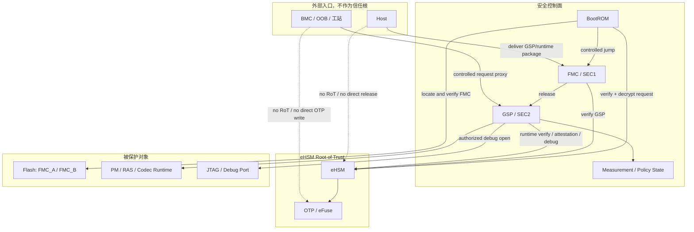
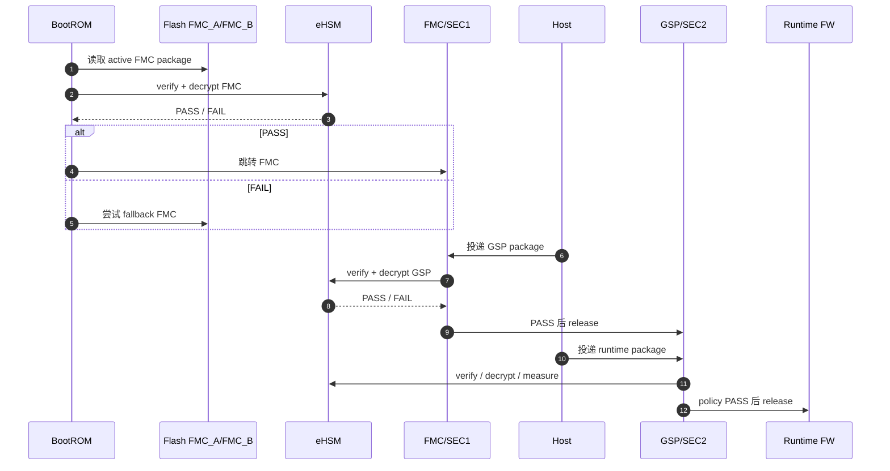
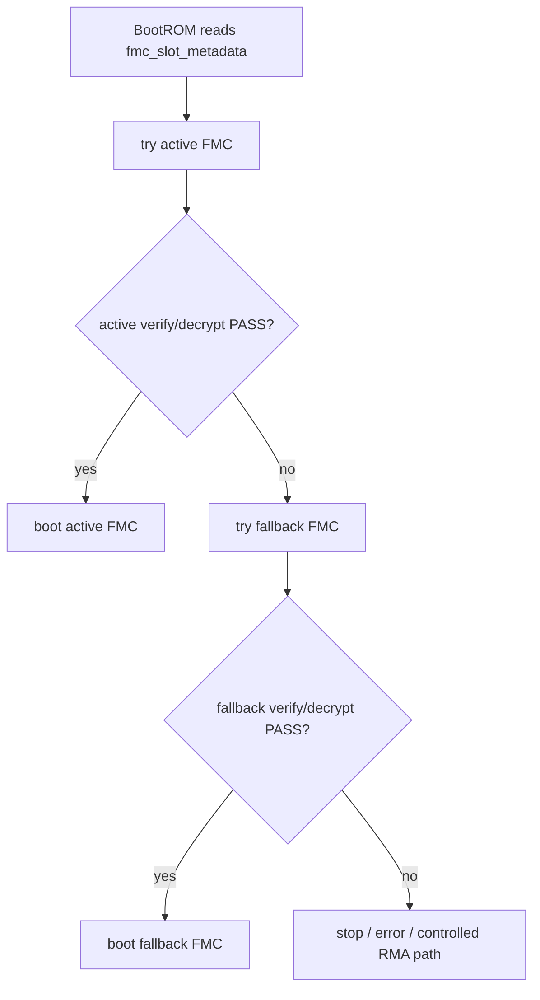
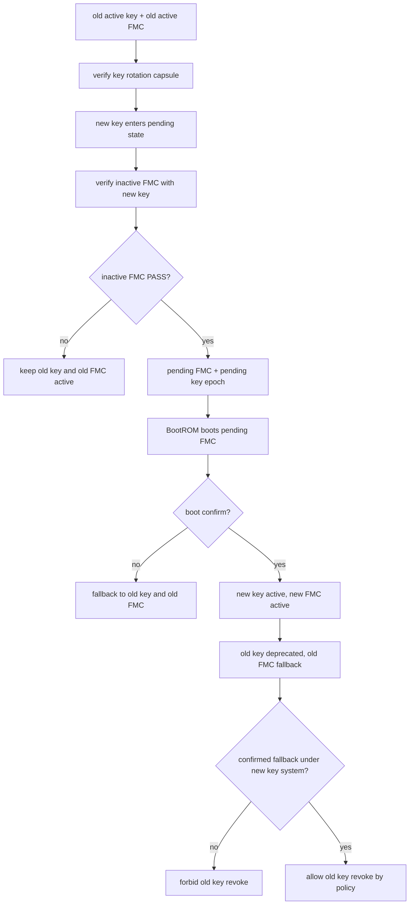
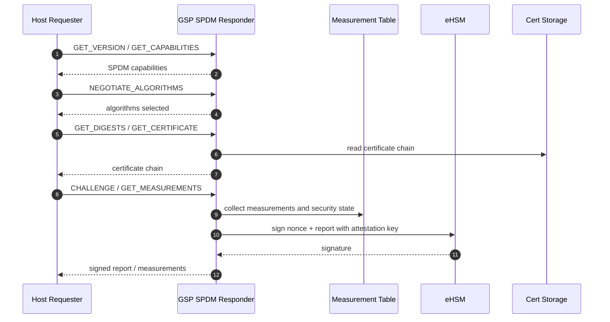
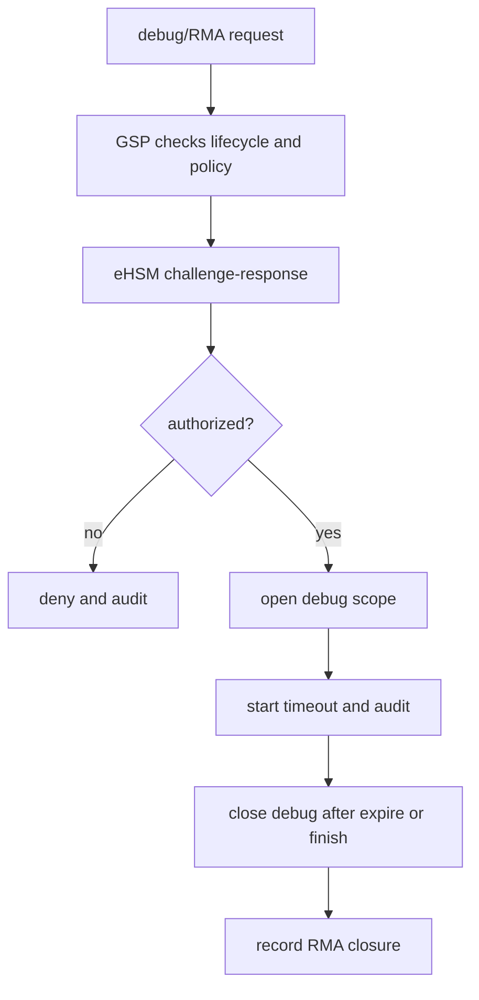
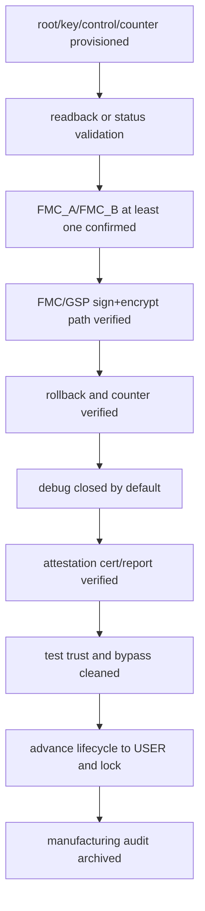

# NGU800 安全方案项目组汇报文档

版本：V1.0  
日期：2026-05-18  
用途：面向项目组、安全、SoC/RTL、eHSM、BootROM、GSP/FMC、Host、制造和验证团队，对齐当前安全方案、软硬件分工、硬件设计需求和待拍板事项。  
依据：`security_workflow/03_detailed_design/10_full_design.md` V2.5。

---

## 1. 汇报目标

本文用于回答项目组评审时最关心的问题：

1. 当前 NGU800 安全方案包含哪些功能点。
2. 总体安全框架如何分层，谁是信任根，谁负责控制，Host/OOB 能做什么。
3. 安全启动、固件保护、密钥、设备认证、debug、制造等功能如何落地。
4. 每个功能点对 SoC、eHSM、OTP/eFuse、BootROM、Firewall、JTAG、Mailbox 和制造平台有什么需求。
5. 哪些软硬件接口、字段、状态机和流程需要项目组尽快拍板。

本文定位为项目组拍板用的最终方案说明，正文只呈现结论、分工、流程和硬件需求。

---

## 2. 总体结论

NGU800 安全方案以 **eHSM 作为唯一 Root of Trust**，以 **BootROM -> FMC(SEC1) -> GSP(SEC2) -> runtime 固件** 作为启动与运行期安全链路。

核心结论如下：

| 主题 | 当前方案 |
|---|---|
| Root of Trust | eHSM 是唯一密码学信任根，持有或受控使用 root/key/counter/control/lifecycle 等安全资源 |
| BootROM | 只做最小启动编排，不实现复杂验签和复杂解密 |
| FMC / SEC1 | 一级可变固件，来自本地 Flash，正式路径必须签名 + 加密 |
| GSP / SEC2 | 二级安全管理固件，由 Host 投递，但必须经 FMC/GSP 调 eHSM 验签、解密、测量后 release |
| Runtime 固件 | PM/RAS/Codec 等由 Host 投递，USER/PROD 默认签名 + 加密，例外需要产品白名单 |
| 固件包格式 | 采用 eHSM native secure image package；NGU 项目级字段放入受保护的 manifest |
| 防变砖 | 仅 FMC 在片上 Flash 设计 `FMC_A / FMC_B` 双分区和受保护 `fmc_slot_metadata` |
| 密钥轮换 | key slot 轮换绑定 FMC A/B 状态机，避免撤销上一代 key 后设备不可恢复 |
| Host/OOB | 只作为投递、请求或代理通道，不进入信任链，不拥有 release 权 |
| SPDM / Attestation | GSP 作为设备侧 responder，eHSM 提供 attestation key 签名服务 |
| Debug / RMA | USER 默认关闭，授权后按 scope、timeout、audit 受控开启 |
| 制造 / USER freeze | Root/key/counter/control/cert/debug policy 写入、验证、清测试状态、推进 USER 必须闭环 |

---

## 3. 安全功能范围总览

```mermaid
flowchart TD
    A["NGU800 安全方案"]

    A --> B["安全启动与固件保护"]
    B --> B1["FMC/SEC1 签名+加密"]
    B --> B2["GSP/SEC2 签名+加密"]
    B --> B3["Runtime 固件默认签名+加密"]
    B --> B4["eHSM native 固件包"]
    B --> B5["设备侧 verify/decrypt/release"]

    A --> C["Root / Key / Cert / Algorithm"]
    C --> C1["eHSM Root of Trust"]
    C --> C2["FW verify key / FW_KEK"]
    C --> C3["Upgrade key / key rotation"]
    C --> C4["Device cert / attestation key"]
    C --> C5["算法 control field"]

    A --> D["版本 / 升级 / 恢复"]
    D --> D1["Anti-rollback"]
    D --> D2["Signer / key revoke"]
    D --> D3["FMC_A/FMC_B 防变砖"]
    D --> D4["key slot 轮换"]

    A --> E["运行期安全控制"]
    E --> E1["Measurement table"]
    E --> E2["SPDM responder"]
    E --> E3["Attestation report"]
    E --> E4["Host/OOB 请求边界"]

    A --> F["生命周期 / Debug / RMA"]
    F --> F1["TEST/DEVE/MANU/USER/RMA"]
    F --> F2["Challenge-response debug auth"]
    F --> F3["Debug scope / timeout / audit"]

    A --> G["制造 / 灌装 / USER freeze"]
    G --> G1["Root/key/counter/control provisioning"]
    G --> G2["Cert / CSR / HSM-KMS"]
    G --> G3["MANU 验证启动"]
    G --> G4["测试状态清理和 USER 锁定"]

    A --> H["硬件隔离"]
    H --> H1["Firewall / UserID / DMA"]
    H --> H2["Secure RAM / output buffer"]
    H --> H3["Mailbox / shared memory"]
    H --> H4["JTAG / MUX / CPLD"]
```



**SoC/硬件设计需求**

| 需求项 | 说明 |
|---|---|
| 安全资源归属 | eHSM、OTP/eFuse、secure RAM、debug 控制、lifecycle 控制必须有明确访问 owner |
| 访问隔离 | Host/OOB/DMA 不得访问 eHSM 内部区、OTP/eFuse、secure output buffer、measurement 安全写区 |
| 控制链路 | BootROM/FMC/GSP 调 eHSM 的路径、Mailbox、shared memory、doorbell、错误码需要冻结 |
| 生命周期 | TEST/DEVE/MANU/USER/RMA/DEST 的硬件状态和推进规则需要冻结 |
| 可观测性 | secure boot、rollback、debug、measurement、attestation、provisioning 的状态需要可审计 |

---

## 4. 总体安全架构



### 4.1 软件分工

| 模块 | 责任 |
|---|---|
| BootROM | 读取启动控制状态，选择 FMC slot，调用 eHSM verify+decrypt，验证通过后跳转 FMC |
| FMC / SEC1 | 接收 Host 投递的 GSP 包，调用 eHSM 验证解密，记录 measurement，release GSP |
| GSP / SEC2 | 运行期安全控制面，负责 runtime 固件验证、SPDM、attestation、debug/RMA、制造请求收敛 |
| Host | 投递 GSP/runtime 包、发起 SPDM、读取受控状态；不参与信任判断 |
| OOB / BMC / 工站 | 作为管理、制造、debug、RMA 请求入口；必须进入 GSP/eHSM 受控路径 |

### 4.2 SoC/硬件设计需求

| 需求项 | 说明 |
|---|---|
| BootROM -> eHSM early path | BootROM 固化前必须冻结 eHSM 调用方式、参数、返回状态和失败处理 |
| Flash 启动分区 | Flash 需要预留 `FMC_A`、`FMC_B` 和 `fmc_slot_metadata` |
| Secure output buffer | eHSM 解密输出必须进入 BootROM/FMC/GSP 可控、Host/DMA 不可写的区域 |
| Host staging buffer | Host 可投递 GSP/runtime 包，但 staging buffer 与 secure buffer 必须隔离 |
| Firewall / UserID | 区分 Host、OOB、FMC/GSP、eHSM、管理核访问权限 |
| Debug MUX | JTAG/debug 默认关闭，只能由授权安全路径打开 |

---

## 5. 安全启动与固件保护

### 5.1 启动链路



### 5.2 固件包最终形态

FMC、GSP、runtime 正式包均采用 eHSM native secure image package。

```text
eHSM native secure image package
  Part A: eHSM native header / control metadata
  Part S: eHSM authentication material
  Part B: eHSM protected Code region
      B1: NGU protected manifest
      B2: firmware payload
      B3: padding / alignment
```

| 对象 | 当前方案 |
|---|---|
| eHSM native header | 明文 1KB image head，包含 eHSM native `Signature / Public_Key / Encrypt_IV / Valid_Flag / Image_Type / Plain_Flag / Naked_Flag / Code_Size / Version_Counter / Public_Key_Ext / Code` 等字段 |
| NGU protected manifest | 位于 eHSM protected Code region 内，承载 `ngu_image_type / security_policy_flags / payload_offset / payload_size / load_addr / entry_addr / rollback_domain / measurement_slot / lifecycle_mask / expected_algorithm_profile` 等项目字段 |
| 签名覆盖 | 至少覆盖完整 Code region，即 manifest + payload + padding/alignment |
| 加密覆盖 | FMC/GSP 正式路径下 Code region 必须加密 |
| release 决策 | eHSM PASS 后，BootROM/FMC/GSP 才能解析 NGU manifest 并做项目级 release decision |

### 5.3 固件制作流程

| 步骤 | 动作 |
|---|---|
| 1 | 输入 FMC/GSP/runtime payload、版本、产品 profile、load/entry、policy |
| 2 | 生成 NGU protected manifest |
| 3 | 拼接 plaintext Code region：manifest + payload + padding |
| 4 | 选择 eHSM secure boot / upgrade profile、key purpose、counter、算法 profile |
| 5 | 对 Code region 加密 |
| 6 | 生成 eHSM authentication material |
| 7 | 生成 eHSM native header |
| 8 | 输出 package、manifest dump、conformance report、golden/tamper vector |

### 5.4 设备侧验证流程

| 步骤 | 动作 |
|---|---|
| 1 | BootROM/FMC/GSP 定位 package 和 output buffer |
| 2 | 检查输入地址、长度、output buffer 白名单 |
| 3 | 调 eHSM 执行 native verify+decrypt |
| 4 | eHSM 检查 header、key、signer、revoke、counter、signature、Code region |
| 5 | eHSM PASS 后输出 plaintext Code region |
| 6 | BootROM/FMC/GSP 解析 NGU manifest |
| 7 | 检查 image type、policy、rollback、lifecycle、payload 边界、load/entry、measurement slot |
| 8 | 记录 measurement 并受控 release |

### 5.5 SoC/硬件设计需求

| 需求项 | 说明 |
|---|---|
| eHSM native header 支持 | eHSM/BootROM/GSP 工具链需要对齐 header 字段、offset、大小和 profile |
| eHSM verify+decrypt path | FMC/GSP 正式路径必须支持认证 + 解密输出 |
| Output buffer | 解密输出区必须受 firewall 保护，Host/OOB/DMA 不可写 |
| Package staging | Host 投递 GSP/runtime 的 staging buffer 需要地址范围和一致性策略 |
| Golden/tamper vector | eHSM、BootROM、FMC、GSP、QEMU/stub、CI 需要共享测试向量 |
| Runtime release 控制 | GSP release PM/RAS/Codec 需要硬件可控 release 或 mailbox/doorbell 机制 |

---

## 6. Root、Key、Cert 与算法策略

### 6.1 密钥和证书对象

| 对象 | 用途 | 存放/使用位置 |
|---|---|---|
| Root / UDS / root secret | 设备根材料 | eHSM / OTP/eFuse / secure NVM |
| FW verify trust anchor | FMC/GSP/runtime 验签 | eHSM/OTP/eFuse/eHSM NVM/package profile |
| FW_KEK / image protect key | FMC/GSP/runtime 解密 | eHSM key slot / secure key policy |
| Upgrade verify key | FMC 升级与 key rotation 授权 | eHSM upgrade verify key mapping |
| Upgrade encrypt key | 升级包或 new key policy 保护 | eHSM upgrade encrypt key mapping |
| Attestation private key | report / SPDM 签名 | eHSM 内部，私钥不导出 |
| Device certificate chain | Host 验证设备身份 | eHSM NVM / secure Flash / secure partition / owner-confirmed storage |
| Debug auth key | Debug/RMA 授权 | eHSM / OTP/eFuse |
| Algorithm control field | secure boot / upgrade / attestation 算法选择 | eHSM control field / OTP/eFuse |

### 6.2 固件签名与解密的密钥关系

| 用途 | eHSM 对齐方向 | 说明 |
|---|---|---|
| FMC 正常启动验签 | SOC FW Verify Key | exact key ID / purpose / level 需 eHSM owner 冻结 |
| FMC 正常启动解密 | SOC Encrypt Key | FW_KEK / image protect key 不导出普通软件域 |
| FMC 升级授权验签 | SOC Upgrade Verify Key | 用于升级包和 key rotation capsule 授权 |
| FMC 升级保护 | SOC Upgrade Encrypt Key | 用于升级包或 new key policy 保护 |
| GSP/runtime 验签和解密 | SOC FW Verify/Encrypt Key 或 owner mapping | 按 image type / product policy 冻结 |
| Attestation 签名 | Attestation key service | report 私钥只在 eHSM 内部使用 |

### 6.3 算法策略

安全启动和升级的算法 authority 来自 eHSM control field。NGU manifest 和 report 可以记录 expected profile，用于一致性检查、审计和 attestation，但不能覆盖 eHSM 的算法选择。

### 6.4 SoC/硬件设计需求

| 需求项 | 说明 |
|---|---|
| eHSM key layout | 需要冻结 SOC FW Verify/Encrypt、SOC Upgrade Verify/Encrypt、debug、attestation 等 key 的 exact ID / purpose / level |
| OTP/eFuse control field | secure boot enable、algorithm select、lifecycle、counter、revoke、lock bit 需要冻结 |
| key 使用 gating | key 使用必须受 lifecycle、purpose、owner policy 控制 |
| cert storage | 设备证书链存储位置、读取路径、Host 返回策略需要冻结 |
| revoke 表达 | signer/key/version revoke 的 eHSM/OTP 表达方式需要冻结 |

---

## 7. 反回滚、FMC A/B 和密钥轮换

### 7.1 反回滚与吊销

| 机制 | 当前方案 |
|---|---|
| 物理 counter | 优先对齐 eHSM SOC FW Version Counter 或 owner-confirmed monotonic counter |
| NGU rollback domain | 放在 protected manifest 中，作为项目级逻辑域 |
| signer/key revoke | 通过 eHSM control/revoke field 或证书策略表达 |
| measurement | rollback/revoke/key state 需要进入 measurement/attestation 可见状态 |

### 7.2 FMC A/B 防变砖

Flash 中预留：

```text
FMC_A
FMC_B
fmc_slot_metadata
```

FMC_A 和 FMC_B 都是 FMC(SEC1) 的等价启动分区，均走相同 eHSM verify+decrypt、rollback、revoke 和 manifest policy。



### 7.3 密钥 slot 轮换

密钥轮换必须绑定 FMC A/B 状态机：



### 7.4 SoC/硬件设计需求

| 需求项 | 说明 |
|---|---|
| `fmc_slot_metadata` ABI | 需要表达 active/fallback、slot state、version、key epoch、boot confirm、failure counter、metadata seq/auth |
| metadata 保护 | 需要完整性保护、原子更新、rollback 防护和损坏处理 |
| Flash 更新保护 | FMC 升级只能写 inactive slot，不得覆盖 active slot |
| Boot confirm | BootROM/FMC 需要确认 pending FMC 启动成功的机制 |
| Version Counter | counter 粒度、更新时机、失败回滚策略需要冻结 |
| key revoke | old key 从 active -> deprecated -> revoked 的硬件/eHSM表达需要冻结 |

---

## 8. Host/OOB 边界、Mailbox 与硬件隔离

### 8.1 Host 边界

| Host 行为 | 策略 |
|---|---|
| 投递 GSP/runtime package | 允许，仅作为数据来源 |
| 发起 SPDM 请求 | 允许，由 GSP responder 处理 |
| 读取状态 | 允许，受权限和错误隐藏策略控制 |
| 下发或替换 FMC | 不允许 |
| 直接 release 固件 | 不允许 |
| 直接写 OTP/eFuse/key/counter/control | 不允许 |
| 访问 secure output buffer | 不允许 |

### 8.2 OOB/BMC/工站边界

OOB/BMC/工站可以作为请求代理，但所有制造、debug、RMA、安全状态变更都必须进入 GSP/eHSM 受控路径。

### 8.3 Mailbox 模型

Mailbox 用于 SEC/GSP 与 eHSM 的受控命令交互：

| 机制 | 当前方案 |
|---|---|
| caller | SEC/GSP 安全控制面 |
| callee | eHSM |
| 数据承载 | mailbox 寄存器 + shared memory |
| 命令族 | verify、debug auth、lifecycle、counter、key、attestation、provisioning |
| Host 关系 | Host 不得直接调用 eHSM mailbox |

### 8.4 SoC/硬件设计需求

| 需求项 | 说明 |
|---|---|
| Mailbox 寄存器 | channel、doorbell、status/note、interrupt 语义需要冻结 |
| Shared memory | req/resp 结构、cache 一致性、DMA 一致性、地址范围需要冻结 |
| Firewall/UserID | Host/OOB/SEC/GSP/eHSM master ID 和 region 权限需要冻结 |
| DMA 限制 | Host/OOB DMA 只能访问 staging window，不得访问 secure memory |
| 错误响应 | 非法访问、超时、busy、auth fail、verify fail、rollback fail 的可见性需要定义 |

---

## 9. Measurement、SPDM 与 Attestation

### 9.1 Measurement 内容

| 对象 | 必须体现的状态 |
|---|---|
| FMC | verify/decrypt 状态、digest、version、rollback、slot、key epoch |
| GSP | verify/decrypt 状态、digest、version、release 状态 |
| Runtime | image type、digest、policy、signature-only 例外状态 |
| Lifecycle | 当前 lifecycle |
| Debug | debug 是否开启、scope、授权结果 |
| Rollback/Revoke | counter、revoke、key state |
| FMC A/B | active/fallback、boot confirm、fallback 事件 |

### 9.2 SPDM / Attestation 流程



### 9.3 SoC/硬件设计需求

| 需求项 | 说明 |
|---|---|
| Measurement 安全存储 | Host/OOB 不可写，GSP/FMC/BootROM 写入路径受控 |
| Attestation key | eHSM 内部私钥，不导出 |
| Cert storage | 设备证书链位置、读取权限、返回策略需要冻结 |
| Nonce/session binding | report 签名必须覆盖 Host nonce/session |
| SPDM transport | Host-GSP 物理通道可替换，但协议状态机使用标准 SPDM/libspdm 路径 |

---

## 10. 生命周期、Debug 与 RMA

### 10.1 生命周期策略

| 生命周期 | 策略 |
|---|---|
| TEST/DEVE | 允许受控 bring-up 和测试能力 |
| MANU | 允许制造灌装、校验、锁定、USER freeze |
| USER | 默认安全启动，debug 默认关闭，provisioning 关闭 |
| DEBUG/RMA | 受授权、限权、限时、可审计 |
| DEST | 停止正常安全服务 |

### 10.2 Debug/RMA 流程



### 10.3 SoC/硬件设计需求

| 需求项 | 说明 |
|---|---|
| Lifecycle bits | 状态编码、推进规则、回退限制、锁定策略需要冻结 |
| JTAG/MUX/CPLD | USER 默认关闭，授权后由安全路径按 scope 打开 |
| Debug scope bitmap | 每个 bit 对应的 debug 能力需要冻结 |
| Timeout/lockout | 授权失败次数、时间窗口、自动关闭策略需要支持 |
| RMA audit | debug/RMA 的请求、授权、scope、关闭、恢复状态需要记录 |

---

## 11. 制造、灌装与 USER freeze

### 11.1 制造灌装对象

| 对象 | 用途 |
|---|---|
| Root / UDS / root secret | 设备根材料 |
| FW verify trust anchor | 固件验签根 |
| FW_KEK / image protect key policy | 固件解密 |
| Upgrade verify/encrypt authority | 升级和 key rotation |
| Attestation key / CSR / cert | 设备认证 |
| Debug auth anchor | Debug/RMA 授权 |
| Version Counter 初值 | Anti-rollback |
| Control field / algorithm policy | secure boot、debug、attestation、algorithm |
| Lifecycle | MANU -> USER 推进 |

### 11.2 USER freeze 前验证



### 11.3 SoC/硬件设计需求

| 需求项 | 说明 |
|---|---|
| OTP/eFuse 写入 | root/key/control/counter/lifecycle/lock 写入权限和顺序需要冻结 |
| Readback/status | 敏感区是否可读回、哪些只能 status 校验需要定义 |
| HSM/KMS 接口 | root/key/cert 签发、CSR、审计、失败重试需要冻结 |
| USER lock | key/control/counter/lifecycle/debug 的锁定条件和失败原子性需要定义 |
| 审计存储 | 制造写入、校验、失败、USER freeze 结果需要可追溯 |

---

## 12. 流片前建议冻结清单

| 冻结项 | 影响模块 |
|---|---|
| BootROM -> eHSM verify/decrypt ABI | BootROM、eHSM、FMC |
| eHSM native header / profile / command mapping | eHSM、BootROM、packager、GSP |
| NGU protected manifest ABI | BootROM、FMC、GSP、工具链、attestation |
| `fmc_slot_metadata` ABI 和保护机制 | BootROM、Flash、FMC、RTL |
| eHSM key ID / purpose / level / lifecycle gating | eHSM、OTP/eFuse、制造、工具 |
| SOC FW Version Counter / rollback domain 映射 | eHSM、FMC/GSP、工具、attestation |
| Firewall/UserID/DMA region | NoC、PCIe、OOB、SEC/GSP、eHSM |
| Secure RAM / output buffer 地址和权限 | memory map、eHSM、BootROM、GSP |
| Mailbox / shared memory / cache 一致性 | RTL、eHSM、GSP、driver |
| JTAG/debug scope bitmap 和 MUX 控制 | RTL、板级、CPLD/MUX、GSP |
| Attestation report 字段和证书链存储 | GSP、eHSM、Host、制造 |
| MANU -> USER freeze 动作集合 | eHSM、OTP/eFuse、制造、质量系统 |

---

## 13. 项目组当前待拍板问题

| 问题 | 当前建议 | 责任方 |
|---|---|---|
| Runtime signature-only 例外 | 默认签名+加密，例外必须白名单并进入 attestation | 产品安全 / GSP |
| eHSM exact key mapping | NGU 只保留 logical alias，exact key ID/purpose/level 由 eHSM owner 冻结 | eHSM / 安全 |
| `fmc_slot_metadata` ABI | 固化 active/fallback/state/version/key_epoch/boot_confirm/failure_counter/auth | BootROM / RTL / 安全 |
| Version Counter 粒度 | 至少覆盖 FMC/GSP rollback，per-image 粒度按产品策略决定 | eHSM / 产品安全 |
| 证书链存储和 SPDM 首版复杂度 | 按完整链设计，可分阶段实现 | GSP / Host / 制造 |
| Board binding 是否参与 release | 默认进入 attestation，是否阻断 GSP/runtime 需拍板 | 安全 / 板级 / GSP |
| OOB/BMC proxy 范围 | 只做代理入口，不作为 RoT | Board / OOB / 安全 |
| Debug scope bitmap | scope、timeout、lockout、MUX 控制需要冻结 | RTL / Board / 安全 |
| 制造工站接口 | HSM/KMS、CSR、证书回写、audit、失败重试需要冻结 | 制造 / eHSM / 安全 |

---

## 14. 与详设的对应关系

| 汇报主题 | 详设章节 |
|---|---|
| 总体安全框架 | `10_full_design.md` 第 1、2 章 |
| 安全启动和固件 release | 第 3 章 |
| eHSM native header / manifest / 制作和解密流程 | 第 3.10 节、第 10.3 节 |
| FMC A/B 和 key slot 轮换 | 第 3.14 节、第 10.3.18.1 节 |
| Host/OOB/访问控制 | 第 1.6、6、7 章 |
| Mailbox 接口 | 第 6.10 ~ 6.18 节、第 10.5 节 |
| Root/Key/Cert/Algorithm | 第 8 章、第 10.3.18 节 |
| SPDM / Attestation | 第 4 章、第 10.7 节 |
| Lifecycle / Debug / RMA | 第 5 章、第 10.6 节 |
| Manufacturing / Provisioning | 第 9 章、第 10.6 节 |
| 待冻结问题 | 第 11 章 |

---

## 15. 汇报结论

当前方案已经形成清晰主线：

1. eHSM 是唯一 Root of Trust。
2. BootROM 只做最小编排，FMC/GSP 作为安全控制面承接后续功能。
3. FMC/GSP 正式路径强制签名 + 加密，runtime 默认签名 + 加密。
4. 固件包统一采用 eHSM native package，NGU 项目级字段进入受保护 manifest。
5. FMC 防变砖采用 Flash `FMC_A / FMC_B`，GSP/runtime 由 Host 重新下发。
6. 密钥轮换与 FMC A/B 绑定，确保客户可轮换和撤销 key，同时避免设备不可恢复。
7. Host/OOB/工站都不进入信任链，只能作为受控入口。
8. 流片前必须尽快冻结 BootROM-eHSM ABI、eHSM key/counter/control、Flash metadata、Firewall/DMA/JTAG 和制造接口。
