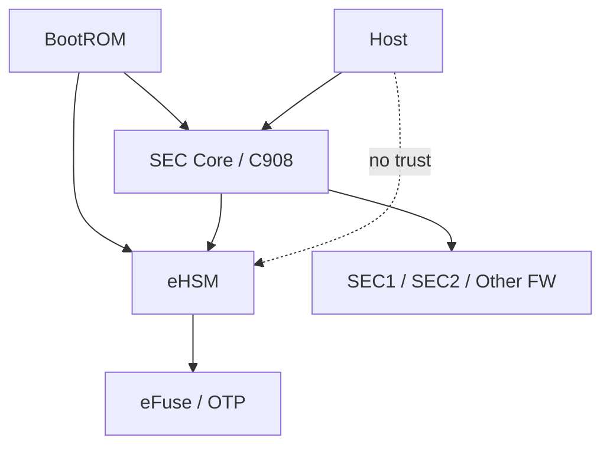
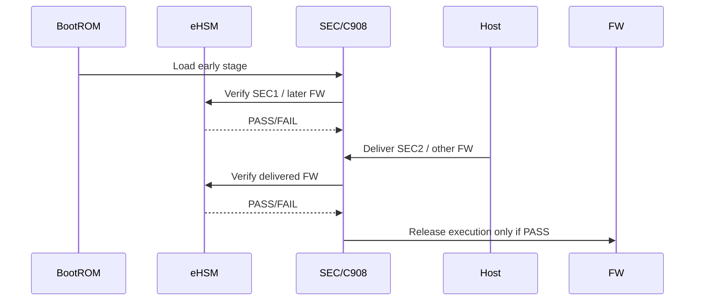

# NGU800 安全架构 Baseline V2（工程级）

版本：v2.1  
状态：评审版（可用于架构评审 / 方案冻结前阶段）

---

# 1. 设计目标

本 Baseline 定义 NGU800 安全架构的核心裁决，包括：

- Root of Trust 定义
- Secure Boot 架构
- Host 与安全边界
- 密钥体系与生命周期
- 制造与密钥灌入流程
- 双算法支持策略

---

# 2. Baseline Summary

| Topic | Current Decision | Status |
|---|---|---|
| Root of Trust | eHSM | CONFIRMED |
| First Mutable Stage | SEC1 | CONFIRMED |
| First Cryptographic Verifier | eHSM | CONFIRMED |
| BootROM Role | 负责最小加载与编排，不负责复杂密码学校验 | CONFIRMED |
| SEC Role | 启动控制面与 release owner | CONFIRMED |
| Host Trust Model | 不可信，只具投递能力 | CONFIRMED |
| Manufacturing Baseline | 必须定义 key 注入、锁定、审计、生命周期推进 | CONFIRMED |

---

# 3. 架构核心裁决

## 3.1 Root of Trust

- Root Key 存储于 eFuse / OTP 安全区
- Root of Trust 由 eHSM 提供
- BootROM 不持有私钥

结论：
**eHSM = 唯一 Root of Trust**

---

## 3.2 First Verifier

- 所有签名验证由 eHSM 执行
- BootROM 不执行复杂验签
- 软件不得实现正式安全路径验签

---

## 3.3 Boot 控制权

- SEC 核（C908）为唯一 Boot 控制器
- 所有 MCU release 必须由 SEC 控制
- Host 不参与控制流程

---

# 4. Adopted vs Rejected Decisions

| Topic | Adopted | Rejected | Reason |
|---|---|---|---|
| First verifier | eHSM | BootROM / Host | 与 eHSM 能力边界和当前安全基线一致 |
| Host role | 仅投递 firmware | Host 参与执行放行 | Host 不可信 |
| BootROM crypto | 不做复杂校验 | BootROM 内嵌完整 crypto 验签路径 | 缩小攻击面，复用 eHSM |
| Key ownership | 私钥不出 eHSM | 私钥落在 Host / 管理核 | 不满足安全边界 |
| Workflow | constraints → baseline → detailed → impl | raw inputs 直接生成 full design | 防止方案漂移 |

---

# 5. Secure Boot 架构

## 5.1 Boot Chain

BootROM → SEC1（NOR / 本地）→ SEC2（Host 下发）→ 子系统 FW

## 5.2 关键约束

- 所有 FW 必须验签
- 未验签禁止执行
- 支持 Anti-rollback（OTP counter / monotonic counter）
- 机密性是否首版强制，可按产品形态收敛；完整性和执行放行不可缺失

---

# 6. Host 边界

## 6.1 允许行为
- 传输固件
- 发起请求
- 接收状态 / 失败报告

## 6.2 禁止行为
- 参与信任链
- 控制启动
- 访问密钥
- 直接访问安全域
- 直接 release 其他 MCU

---

# 7. eHSM 职责

- Root Key / Root Secret 使用
- 验签
- 加解密
- 密钥管理
- 生命周期控制
- 调试鉴权
- Counter / anti-rollback
- Attestation key 使用

---

# 8. Manufacturing / Provisioning Baseline

| Topic | Decision | Open Issue |
|---|---|---|
| Root Key 注入 | 通过制造安全通道灌入 OTP/eFuse | 工站对接细节待定 |
| Root Key 锁定 | MANU → USER 前必须锁定 | 读回校验策略待定 |
| 测试 Key 清理 | USER 前必须清理 | 测试证书链清理动作待定 |
| 审计日志 | 制造阶段必须记录 | 日志落点待定 |

---

# 9. 双算法策略

- 方案必须同时支持国密和国际算法栈
- 实现层不得把算法写死到单一栈
- Header / report / key hierarchy 中必须保留：
  - algo_family
  - hash_algo
  - sig_algo
  - enc_algo

---

# 10. Freeze Sensitive Items

| Item | Why Sensitive | Needed Before Freeze |
|---|---|---|
| eFuse bit 分配 | 直接影响 RTL / 制造灌装 | 需要字段级规划 |
| FW Header 字段 | 直接影响 BootROM / SEC / Host 对接 | 需要结构级冻结 |
| Mailbox command model | 直接影响 FW / driver / eHSM API 对接 | 需要 req/resp 结构 |
| SPDM report fields | 直接影响 attestation 联调 | 需要字段定义 |
| board binding 策略 | 影响量产兼容性 | 需要策略裁决 |

---

# 11. Mermaid Architecture Diagram

---

# 12. Mermaid Sequence Diagram

---

# 13. 当前基线是否可进入详细设计

结论：
- 可以进入章节级详细设计
- 但不能跳过实现级设计直接进入代码开发

限制条件：
- eFuse / key / header / mailbox / SPDM 仍需在 `04_impl_design/` 中冻结
- manufacturing / provisioning 仍需细化到流程级
