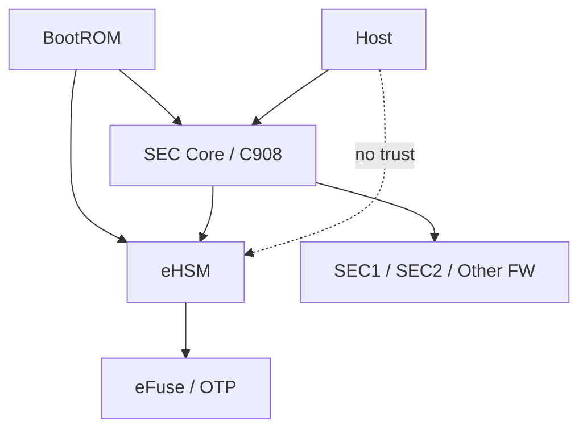
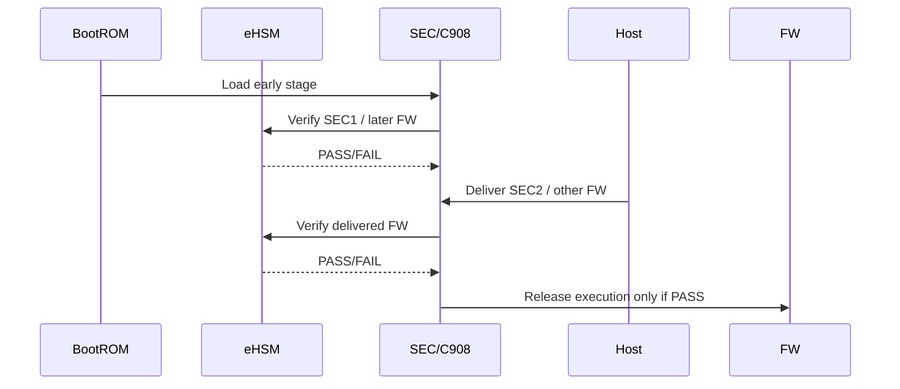

# NGU800 安全架构 Baseline V2（工程级）

版本：v2.2
状态：评审版（可用于架构评审 / 方案冻结前阶段）

---

# 1. 设计目标

本 Baseline 定义 NGU800 安全架构的核心裁决，包括：

- Root of Trust 定义
- Secure Boot 架构
- Host 与安全边界
- 密钥体系与生命周期
- 制造与密钥灌入流程
- 双算法支持策略

---

# 2. Baseline Summary

| Topic | Current Decision | Status |
|---|---|---|
| Root of Trust | eHSM | CONFIRMED |
| First Mutable Stage | SEC1 | CONFIRMED |
| First Cryptographic Verifier | eHSM | CONFIRMED |
| SEC1 Protection Policy | SEC1 来源为 NOR / 本地 Flash，正式安全启动路径必须签名 + 加密，验证与解密服务由 eHSM / 安全子系统提供 | CONFIRMED |
| SEC2 Protection Policy | SEC2 在正式安全启动路径中必须签名 + 加密，验证、解密、measurement 与 release 由 SEC1/SEC2 调 eHSM 路径完成 | CONFIRMED |
| Runtime Image Policy | PM / RAS / Codec 等关键 runtime image 在 USER/PROD 默认签名 + 加密；signature-only 仅允许作为产品白名单例外 | ASSUMED / TBD |
| eHSM Image Container | SEC1 / SEC2 的密码学 verify/decrypt container 采用 eHSM native secure boot image header；NGU 项目 metadata 放入 Code region manifest / policy table | CONFIRMED / TBD |
| Firmware Package Build/Verify Contract | 平台侧固件制作工具与设备侧 verify/decrypt 路径共享同一 eHSM native header + NGU protected manifest 契约；旧自定义 header 仅作流程意图参考 | CONFIRMED / TBD |
| OTP / Key / Counter Mapping | physical OTP/control/key/counter 以 eHSM TRM 为准；NGU `OTP-0..OTP-7`、`*_MIN_VER` 和 key name 仅为 logical alias / rollback domain | CONFIRMED / TBD |
| Algorithm Authority | secure boot / upgrade 验签算法 authority 来自 eHSM OTP/control field；NGU manifest 只记录 expected profile / audit profile | CONFIRMED |
| BootROM Role | 负责最小加载与编排，不负责复杂密码学校验 | CONFIRMED |
| SEC Role | 启动控制面与 release owner | CONFIRMED |
| Host Trust Model | 不可信，只投递 SEC2 及后续镜像 / 受保护包，不下发 SEC1 | CONFIRMED |
| Board / OOB Trust Model | BMC / OOB / 管理子系统可承载管理流程，但不进入 Root of Trust | CONFIRMED |
| Board Binding Stage Policy | V2.4 阶段 board binding 默认进入 attestation，不默认阻断 SEC1；是否参与 SEC2/runtime release decision 后续冻结 | ASSUMED / TBD |
| Manufacturing Baseline | 必须定义 key 注入、锁定、审计、生命周期推进 | CONFIRMED |

---

# 3. 架构核心裁决

## 3.1 Root of Trust

- Root Key 存储于 eFuse / OTP 安全区
- Root of Trust 由 eHSM 提供
- BootROM 不持有私钥

结论：
**eHSM = 唯一 Root of Trust**

---

## 3.2 First Verifier

- 所有签名验证由 eHSM 执行
- BootROM 不执行复杂验签
- 软件不得实现正式安全路径验签

---

## 3.3 Boot 控制权

- SEC 核（C908）为唯一 Boot 控制器
- 所有 MCU release 必须由 SEC 控制
- Host 不参与控制流程

---

# 4. Adopted vs Rejected Decisions

| Topic | Adopted | Rejected | Reason |
|---|---|---|---|
| First verifier | eHSM | BootROM / Host | 与 eHSM 能力边界和当前安全基线一致 |
| Host role | 仅投递 firmware | Host 参与执行放行 | Host 不可信 |
| BootROM crypto | 不做复杂校验 | BootROM 内嵌完整 crypto 验签路径 | 缩小攻击面，复用 eHSM |
| Image container | eHSM native header 作为 verify/decrypt container，NGU metadata 进入 protected manifest | NGU 自定义 physical FW header 与 eHSM header 并列 | 避免两套 physical ABI 和工具链冲突 |
| Firmware package flow | image packager 生成 eHSM native package，设备侧 eHSM 先 verify/decrypt，BootROM/SEC 再解析 NGU manifest 和 release policy | 平台工具生成旧 `header + Signed Region + signature + wrapped_cek + enc_payload` 作为最终 wire/storage 格式 | 保留制作/验证流程的可读性，同时不违背 eHSM TRM |
| OTP/key/counter | eHSM physical field + NGU logical alias / customization TBD | NGU 自定义 physical OTP 分区、32-bit per-image physical counter、未映射 key slot | follow `SRC-002/SRC-006/SRC-007`，降低 RTL/制造偏差 |
| Key ownership | 私钥不出 eHSM | 私钥落在 Host / 管理核 | 不满足安全边界 |
| Workflow | constraints → baseline → detailed → impl | raw inputs 直接生成 full design | 防止方案漂移 |

---

# 5. Secure Boot 架构

## 5.1 Boot Chain

BootROM → SEC1（NOR / 本地）→ SEC2（Host 下发）→ 子系统 FW

## 5.2 关键约束

- 所有 FW 必须验签
- SEC1 必须签名 + 加密；SEC1 验证、解密和 key unwrap 必须由 eHSM / 安全子系统受控密码服务完成
- BootROM 只负责定位 SEC1、调用受控接口、根据结果装载或拒绝启动，不直接实现复杂解密
- Host 不下发 SEC1；Host 只投递 SEC2 及后续镜像 / 受保护包
- SEC2 在正式安全启动路径中必须签名 + 加密；SEC2 解密失败必须阻断安全控制面启动
- PM、RAS、Codec 等后续关键 runtime image 在 USER/PROD 产品形态中默认签名 + 加密；若采用 signature-only，必须由产品安全策略显式允许并在 lifecycle / attestation / debug 状态中可见
- 未验签禁止执行
- 支持 Anti-rollback；物理承载先对齐 eHSM Version Counter / monotonic counter / owner 确认的等价机制
- FW Encrypt Branch 至少对 SEC1 + SEC2 强制启用；per-image CEK / wrapped CEK 只有在 eHSM owner 明确支持后才能升级为 CONFIRMED
- SEC1 / SEC2 的 eHSM native `Image_Type` 不承载 NGU 项目级 SEC1/SEC2/runtime image type；NGU `ngu_image_type` 放入 protected manifest / policy table
- SEC1 / SEC2 sign+encrypt 不得走 eHSM NVM only verify；必须使用 verify+decrypt output path 和受控 RAM / staging / output buffer
- 平台侧固件制作工具必须生成 eHSM native package；NGU manifest、payload、版本、rollback domain、measurement slot 和 expected algorithm profile 必须被 verify/decrypt 成功后的受保护 Code region 覆盖
- 设备侧必须按“eHSM native verify/decrypt 成功 -> BootROM/SEC 解析 NGU manifest -> policy/release decision”的顺序执行，不得在 eHSM 成功前信任 manifest 内项目级字段

---

# 6. Host 边界

## 6.1 允许行为
- 传输 SEC2 及后续固件 / 受保护镜像包
- 发起请求
- 接收状态 / 失败报告

## 6.2 禁止行为
- 下发或替换 SEC1
- 参与信任链
- 控制启动
- 访问密钥
- 直接访问安全域
- 直接 release 其他 MCU

---

# 7. Board / OOB / 管理子系统边界

## 7.1 输入采用策略

`SRC-005 管理子系统方案` 中的总体架构、模块职责、带外管理链路、电源/复位流程、单/双 Die 约束作为系统级流程输入采用。

涉及安全的部分采用以下裁决：

- BMC / OOB / 板级 MCU / 管理子系统不进入 Root of Trust。
- SMBus/I2C、I3C、PCIe VDM、SPI、UART、JTAG 只能作为受控管理或转发通道。
- JTAG、DMA、Flash 更新、电源复位、PowerBrake 等高权限能力必须经 lifecycle、debug auth、firewall、scope 和审计约束。
- USER/PROD 下 JTAG 默认关闭，JTAG 打开必须经过 lifecycle + debug auth + scope bitmap + session timeout + audit；板级 MUX 不得被 BMC/OOB 单独打开。
- 管理子系统 DMA / Host DMA / OOB DMA 对安全资源默认拒绝，只允许访问显式白名单 staging/data buffer。
- OOB/BMC 可作为 provisioning transport proxy，但不得成为 trust anchor，不得接触 root secret、device private key 或 FW_KEK 明文。
- Board binding 默认进入 attestation；不默认阻断 SEC1 verify/decrypt/release。
- 管理子系统文档中若出现未鉴权调试、直接访问安全子系统、直接访问 DRAM/Flash/寄存器空间或绕过 SEC/eHSM 的流程，不作为安全 baseline 采用。

## 7.2 Adopted vs Rejected

| Topic | Adopted | Rejected | Reason |
|---|---|---|---|
| 管理子系统总体架构 | 采用 `SRC-005 管理子系统方案` 的模块、链路和流程作为系统输入 | 忽略管理子系统集成 | 需要与板级、电源、复位、OOB 流程对齐 |
| OOB trust level | BMC/OOB/Sideband 不高于 Host | 将 BMC/OOB 默认视为可信根 | OOB 链路权限高且暴露面大，不能天然可信 |
| JTAG access | lifecycle + debug auth + scope + MUX 联合控制 | USER 态常开或板级 MUX 直通 | 防止绕过 secure boot、密钥和运行态隔离 |
| Management DMA | 仅访问普通白名单 buffer | 访问安全区、执行区、OTP/eHSM 私有区 | DMA 可绕过软件边界，必须硬隔离 |
| Power/reset control | 纳入安全状态机和审计 | 作为纯板级普通控制 | 复位/掉电会影响安全启动、恢复和 attestation 状态 |
| OOB provisioning proxy | 只作为受控传输代理 | 作为信任根或接触明文根材料 | provisioning 安全裁决必须由 SEC/eHSM 完成 |
| Board binding | 默认进入 attestation | 默认阻断 SEC1 bring-up | 降低首版 bring-up 风险，同时保留产品策略空间 |

---

# 8. eHSM 职责

- Root Key / Root Secret 使用
- 验签
- 加解密
- 密钥管理
- 生命周期控制
- 调试鉴权
- Counter / anti-rollback
- Attestation key 使用
- eHSM native secure boot image header 的解析与 verify/decrypt
- eHSM OTP/control field 中 `SocBootAlg / SocUpgradeAlg` 等算法选择语义
- eHSM OTP key ID / level / purpose 的 physical key slot 语义

## 8.1 eHSM Source-Conformance Baseline

| Topic | Baseline |
|---|---|
| FW Header | eHSM native 1KB plaintext image head 是 SEC1 / SEC2 的密码学 verify/decrypt container；NGU 不再定义并列 physical verification header |
| NGU Metadata | `ngu_image_manifest_t` 或等价 manifest extension 放在 Code region，由 BootROM / SEC 在 eHSM verify/decrypt 通过后解析；ABI 仍为 `[TBD]` |
| Image Type | eHSM `Image_Type` 保持 TRM 定义；NGU `SEC1 / SEC2 / PM / RAS / Codec / Recovery` 类型放入 manifest / policy table |
| Algorithm | `SocBootAlg / SocUpgradeAlg` 或等价 eHSM control field 是算法 authority；manifest 只能记录 expected profile |
| OTP Layout | `OTP-0..OTP-7` 是 NGU logical view，不表达 physical offset |
| Version Counter | eHSM SOC FW Version Counter 是首版物理 rollback 基础候选；per-image counter 为 `[TBD]` / `eHSM-customization-TBD` |
| Key Slot | NGU key name 必须映射到 eHSM key ID / level / purpose；exact mapping 仍为 `[TBD]` |

---

# 9. Manufacturing / Provisioning Baseline

| Topic | Decision | Open Issue |
|---|---|---|
| Root Key 注入 | 通过制造安全通道灌入 OTP/eFuse | 工站对接细节待定 |
| Root Key 锁定 | MANU → USER 前必须锁定 | 读回校验策略待定 |
| 测试 Key 清理 | USER 前必须清理 | 测试证书链清理动作待定 |
| SEC1 / SEC2 解密 key / FW_KEK 锁定 | MANU → USER 前必须锁定 | key slot 细节待 eHSM TRM 对齐 |
| RMA 安全边界 | 禁止 long-open debug 和长期 decrypt bypass | re-acceptance 流程待定 |
| 审计日志 | 制造阶段必须记录 | 日志落点待定 |

---

# 10. 双算法策略

- 方案必须同时支持国密和国际算法栈
- 实现层不得把算法写死到单一栈
- secure boot / upgrade 的算法 authority 来自 eHSM OTP/control field，例如 `SocBootAlg / SocUpgradeAlg`
- NGU manifest / report / mailbox 可记录 expected algorithm profile，用于一致性检查、审计和 attestation，不得覆盖 eHSM control field

---

# 11. Freeze Sensitive Items

| Item | Why Sensitive | Needed Before Freeze |
|---|---|---|
| eFuse bit 分配 | 直接影响 RTL / 制造灌装 | 需要字段级规划 |
| FW Header 字段 | 直接影响 BootROM / SEC / Host 对接 | 需要结构级冻结 |
| Firmware package build/verify 契约 | 直接影响 image packager、BootROM、SEC verify flow 和 eHSM adapter 联调 | 需要冻结 manifest ABI、工具参数、golden vector、exact eHSM key ID / command mapping |
| Mailbox command model | 直接影响 FW / driver / eHSM API 对接 | 需要 req/resp 结构 |
| SPDM report fields | 直接影响 attestation 联调 | 需要字段定义 |
| board binding 策略 | 影响量产兼容性 | 需要策略裁决 |
| JTAG / OOB scope 控制 | 影响 USER 态调试暴露面 | 需要冻结 debug scope bitmap、MUX/CPLD 控制权和授权流程 |
| 管理子系统 DMA / mailbox / reset | 影响安全边界和状态一致性 | 需要冻结 firewall 白名单、可访问 buffer 和审计字段 |
| runtime image signature-only 白名单 | 影响产品 SKU 与 verifier 策略 | 需要冻结 image_type/lifecycle/SKU/debug/release/rollback 条件 |
| recovery image 策略 | 影响恢复、返修与安全启动闭环 | 需要冻结 image_type/signer/anchor/counter/decrypt policy |

---

# 12. Mermaid Architecture Diagram

```mermaid
graph TD
    BR[BootROM] --> SEC[SEC Core / C908]
    BR --> EH[eHSM]
    EH --> OTP[eFuse / OTP]
    SEC --> EH
    SEC --> FW[SEC1 / SEC2 / Other FW]
    Host --> SEC
    Host -. no trust .-> EH
```

---

# 13. Mermaid Sequence Diagram

```mermaid
sequenceDiagram
    participant BR as BootROM
    participant EH as eHSM
    participant SEC as SEC/C908
    participant H as Host

    BR->>SEC: Load early stage
    SEC->>EH: Verify SEC1 / later FW
    EH-->>SEC: PASS/FAIL
    H->>SEC: Deliver SEC2 / other FW
    SEC->>EH: Verify delivered FW
    EH-->>SEC: PASS/FAIL
    SEC->>FW: Release execution only if PASS
```

---

# 14. 当前基线是否可进入详细设计

结论：
- 可以进入章节级详细设计
- 但不能跳过实现级设计直接进入代码开发

限制条件：
- eFuse / key / header / mailbox / SPDM 仍需在 `04_impl_design/` 中冻结
- manufacturing / provisioning 仍需细化到流程级
