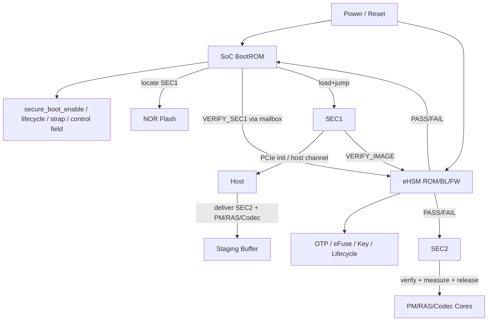
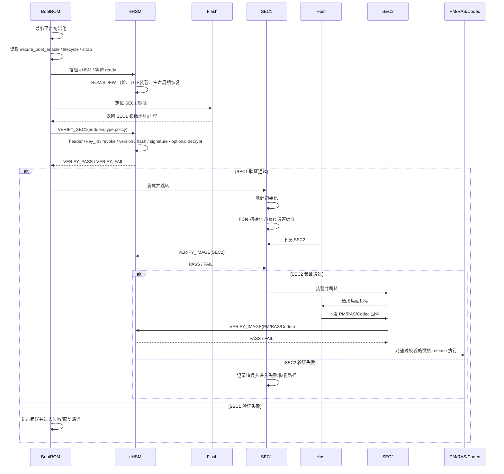

# 6. 安全启动详细设计

> 文档定位：NGU800 / NGU800P 章节级正式详设  
> 章节文件：`security_workflow/03_detailed_design/01_boot.md`  
> 当前状态：V1.0（基于当前约束、baseline 与输入资料收敛）  
> 设计标记口径：`[CONFIRMED] / [ASSUMED] / [TBD]`

---

## 6.1 本章目标

本章定义 NGU800 在**安全启动模式**下的完整启动链设计，明确：

1. SoC BootROM、SEC1、SEC2、eHSM、Host 的职责边界
2. 安全启动与非安全启动的选择条件
3. SEC1 / SEC2 / 后续微核固件的验证与执行放行规则
4. 反回滚、吊销、可选解密、失败处理与恢复入口
5. 与实现层文件的映射关系：
   - `04_impl_design/efuse_key_fw_header_design.md`
   - `04_impl_design/mailbox_if.md`
   - `04_impl_design/spdm_report.md`
   - `04_impl_design/manufacturing_provisioning.md`

---

## 6.2 生效约束 ID

- `C-ROOT-01`
- `C-BOOT-01`
- `C-BOOT-02`
- `C-BOOT-03`
- `C-IF-01`
- `C-HOST-01`
- `C-ACCESS-01`
- `C-ACCESS-02`
- `C-UPDATE-01`
- `C-UPDATE-02`
- `C-ATT-01`
- `C-MFG-01`

---

## 6.3 生效 Baseline 决策

### 6.3.1 Root 与验证主体
- `[CONFIRMED]` Root of Trust = eHSM
- `[CONFIRMED]` First Cryptographic Verifier = eHSM
- `[CONFIRMED]` BootROM 不承担复杂密码学校验和密钥管理

### 6.3.2 启动控制权
- `[CONFIRMED]` SEC/C908 是唯一 boot control plane
- `[CONFIRMED]` Host 只具备镜像投递能力，不具备执行放行权
- `[CONFIRMED]` 所有微核 release 必须由 SEC 控制

### 6.3.3 镜像来源
- `[CONFIRMED]` SEC1 从 NOR Flash / Flash 获取
- `[CONFIRMED]` SEC2 及后续 PM / RAS / Codec 等固件由 Host 通过 PCIe 下发
- `[CONFIRMED]` 非安全启动路径应保留，但量产态是否开启必须受 lifecycle + OTP 策略控制

---

## 6.4 术语与阶段定义

| 术语 | 含义 |
|---|---|
| BootROM | SoC 最早执行的不可变启动代码，负责最小初始化与启动编排 |
| eHSM | 安全服务根，负责验证、密钥、OTP、lifecycle、debug auth、counter 等 |
| SEC1 | 安全最小 bring-up 固件，负责基础初始化与 Host 通道建立 |
| SEC2 | 完整安全控制面固件，负责后续固件接收、验证、升级、认证与调试控制 |
| Staging Buffer | Host 投递镜像的受控缓冲区 |
| Release | 允许某个目标核/固件开始执行的最终放行动作 |

### 6.4.1 启动阶段划分

| 阶段 | 名称 | 主执行体 | 主要动作 |
|---|---|---|---|
| A | SoC BootROM 早期启动 | BootROM | 最小平台初始化、读取 strap / lifecycle / secure boot 配置 |
| B | eHSM 自启动 | eHSM | ROM / Bootloader / 自检 / 生命周期恢复 / 密钥材料恢复 |
| C | SEC1 验证 | BootROM + eHSM | 定位 SEC1、请求验证、做版本/吊销/签名检查 |
| D | SEC1 装载与启动 | BootROM | 装载 SEC1 并跳转执行 |
| E | SEC1 基础初始化 | SEC1 | PCIe 初始化、Host 通道建立、共享缓冲区准备 |
| F | SEC2 与后续镜像处理 | SEC1/SEC2 + eHSM | 验证 SEC2、后续固件验证、测量、release |

---

## 6.5 设计要求

### 6.5.1 必须满足的安全目标

- `[CONFIRMED]` SEC1 必须在执行前经 eHSM 验证
- `[CONFIRMED]` 后续固件必须经 SEC1/SEC2 调用 eHSM 验证
- `[CONFIRMED]` Host 下发固件在执行前必须受控
- `[CONFIRMED]` 支持版本检查、防回滚、吊销
- `[CONFIRMED]` 支持设备认证与度量导出
- `[CONFIRMED]` 支持安全升级与安全调试
- `[ASSUMED]` 量产关键镜像建议支持可选加密，但首版最小必需是完整性和执行放行控制

### 6.5.2 不得违反的边界

- BootROM 不得直接承担 SEC1 的复杂密码学校验
- Host 不得直接 release SEC2 或后续微核
- 普通非安全 Master 不得直接访问 eHSM、OTP、Secure SRAM
- 未验签通过的镜像不得进入执行态
- rollback floor 不得只依赖镜像内软件字段

---

## 6.6 架构图

### 图下说明

1. BootROM 是启动编排者，不是首个密码学验证者。  
2. eHSM 在 SEC1 验证、后续镜像验证、反回滚、吊销检查中提供统一安全服务。  
3. Host 只把 SEC2 及后续镜像投递到受控缓冲区，不拥有执行放行权。  
4. SEC2 是后续运行期安全控制面，负责后续微核固件验证编排、度量汇总和放行。  

---

## 6.7 时序图

### 图下说明

1. SEC1 的首次密码学校验发生在 BootROM 调 eHSM 的路径上。  
2. 后续镜像验证责任转移到 SEC1/SEC2 调 eHSM 的路径。  
3. release 是一个独立动作，必须发生在 verify pass 之后。  
4. 任何验证失败都不能默默降级为“继续启动”，必须进入明确失败或恢复路径。  

---

## 6.8 启动模式矩阵

| 模式 | secure_boot_enable | lifecycle | eHSM 参与 | 镜像要求 | 适用场景 |
|---|---|---|---|---|---|
| 安全启动 | 1 | MANU / USER / DEBUG-RMA | 必须 | 关键镜像必须验证；支持版本/吊销/反回滚 | 正式量产 / 制造验证 / 受控返修 |
| 非安全启动 | 0 或策略允许 | TEST / DEVE 为主 | 可不参与首阶段镜像验证 | 可允许受控绕过 | 实验室 bring-up / 特定开发调试 |
| Rescue / Recovery | 策略控制 | DEBUG/RMA 为主 | 必须 | 必须用受控 recovery trust / 特定 signer | 故障恢复 / 返修 |

### 6.8.1 模式选择规则

- `[CONFIRMED]` BootROM 启动后首先读取 `secure_boot_enable / lifecycle / strap / control field`
- `[CONFIRMED]` 非安全路径应保留，但不应默认允许量产态启用
- `[ASSUMED]` USER 生命周期下，非安全启动应由 OTP/eFuse + 策略态关闭
- `[ASSUMED]` Recovery 模式只能通过受控 lifecycle 和授权流程进入

---

## 6.9 可信镜像分类

| 镜像类型 | 来源 | 谁发起验证 | 谁执行验证 | 谁决定执行放行 | 反回滚检查 |
|---|---|---|---|---|---|
| SEC1 | NOR Flash | BootROM | eHSM | BootROM 跳转至 SEC1 | 跳转前检查 |
| SEC2 | Host/PCIe | SEC1 | eHSM | SEC1 / SEC2 受控跳转 | 执行前检查 |
| PM | Host/PCIe | SEC2 | eHSM | SEC2 release | 放行前检查 |
| RAS | Host/PCIe | SEC2 | eHSM | SEC2 release | 放行前检查 |
| Codec | Host/PCIe | SEC2 | eHSM | SEC2 release | 放行前检查 |
| Recovery | 特殊路径 | SEC2 / Provisioning | eHSM | SEC2 / 受控状态机 | 受策略控制 |

### 6.9.1 当前建议

- `[CONFIRMED]` SEC1 的首次验证由 eHSM 完成
- `[CONFIRMED]` SEC2 及后续镜像验证由 SEC1/SEC2 调 eHSM 完成
- `[CONFIRMED]` Host 不拥有执行放行权
- `[ASSUMED]` Recovery 镜像应使用专用 recovery trust anchor，并仅在受控 lifecycle 下允许

---

## 6.10 镜像格式建议

本章不重复完整 `FW Header` 详设，正式结构以：

- `04_impl_design/efuse_key_fw_header_design.md`

为准。安全启动对镜像头的最小要求如下：

### 6.10.1 必须进入 signed region 的字段

- `image_type`
- `image_version`
- `min_rollback_ver`
- `load_addr`
- `entry_point`
- `payload_len`
- `algo_family`
- `hash_algo`
- `sig_algo`
- `enc_algo`
- `lifecycle_mask`
- `board_bind_flags`
- `signer_key_hash`

### 6.10.2 不得只存在于 unsigned header 的字段

- `load_addr`
- `entry_point`
- `image_version`
- `algo_family`
- rollback / lifecycle / binding 相关字段

### 6.10.3 当前项目建议

- `[CONFIRMED]` Host 下发镜像必须先进入 staging buffer
- `[CONFIRMED]` Verify path 必须能处理：
  - header 解析
  - key_id / signer hash 检查
  - revoke bitmap 检查
  - version / rollback floor 检查
  - hash / signature 校验
  - 可选解密
- `[ASSUMED]` 首版可允许 SEC2 及主要运行期固件根据产品策略选择“签名 only”或“签名 + 加密”

---

## 6.11 校验规则

### 6.11.1 SEC1 校验规则

BootROM 向 eHSM 发起 `VERIFY_SEC1` 请求时，eHSM 至少执行：

1. 镜像头解析
2. `key_id / signer key slot` 检查
3. `revoke bitmap` 检查
4. `version / min rollback` 检查
5. `signer pubkey hash` 校验
6. `signature` 校验
7. `payload hash` 校验
8. 可选解密

### 6.11.2 后续镜像校验规则

SEC1/SEC2 向 eHSM 发起 `VERIFY_IMAGE` 时，至少执行：

1. `image_type` 检查
2. `lifecycle_mask` 检查
3. `board_bind_flags` / Die binding 检查（如启用）
4. `signer_key_hash` / trust anchor 校验
5. `rollback floor` 检查
6. `payload hash / signature` 校验
7. 可选解密
8. 通过后才允许 release

### 6.11.3 失败处理规则

- `[CONFIRMED]` 任一关键镜像验证失败，必须返回明确 `error_code`
- `[CONFIRMED]` 失败后必须记录错误并进入失败或恢复路径
- `[ASSUMED]` USER 量产态下，不允许自动降级到非安全启动继续运行
- `[ASSUMED]` DEBUG/RMA 可在授权后进入受控 rescue path

---

## 6.12 Staging Buffer 与 Host 交互规则

### 6.12.1 Host 的允许动作

Host 允许：
- 通过 PCIe 下发 SEC2 / PM / RAS / Codec 等镜像
- 配置 firmware descriptor
- 读取普通状态与版本信息
- 触发 mailbox doorbell / queue 交互（受控）

### 6.12.2 Host 的禁止动作

Host 不得：
- 直接 release 微核
- 修改 secure boot 状态
- 修改 lifecycle
- 修改 debug enable
- 修改 recovery 模式选择
- 直接访问 secure shared buffer / OTP / Secure SRAM
- 直接写 boot-critical 分区

### 6.12.3 DMA 访问要求

- `[CONFIRMED]` Host DMA 仅允许访问 firmware staging buffer 和普通数据缓冲区
- `[CONFIRMED]` Host DMA 不得访问：
  - SEC1 / SEC2 执行区
  - recovery 区
  - 证书/策略区
  - 安全共享缓冲区
  - 安全状态寄存器区

---

## 6.13 非安全启动规则

### 6.13.1 设计定位

- `[CONFIRMED]` 非安全启动必须保留，用于指定的开发和调试场景
- `[ASSUMED]` 非安全启动在量产 USER 生命周期下应默认关闭
- `[ASSUMED]` 非安全启动开启必须是显式策略，而不是失败后的隐式回退

### 6.13.2 最小规则

1. 非安全启动不得伪装成安全启动
2. 非安全启动路径必须在状态寄存器或证明路径中可见
3. 若进入非安全启动，不得产生“安全启动已通过”的错误状态
4. 非安全启动模式下的升级、调试、证明能力必须受更严格区分

### 6.13.3 与证明路径关系

- `[ASSUMED]` 若设备处于非安全启动路径，Attestation report 必须能体现：
  - secure_boot_state = disabled / bypass
  - 相应 measurement 策略可能降级
- `[ASSUMED]` Verifier 不应把非安全启动态报告判为量产可信设备态

---

## 6.14 失败处理与恢复路径

### 6.14.1 失败场景

| 场景 | 检测点 | 建议动作 |
|---|---|---|
| SEC1 验签失败 | BootROM + eHSM | 停止跳转，记录错误码，进入失败/恢复路径 |
| SEC2 验签失败 | SEC1/SEC2 + eHSM | 拒绝装载，保持控制面不放行 |
| 后续微核验签失败 | SEC2 + eHSM | 拒绝对应微核 release |
| rollback 检查失败 | eHSM / counter path | 拒绝执行，记录 rollback error |
| eHSM 未 ready | BootROM / SEC 超时 | 进入受控失败处理，不得静默旁路 |
| mailbox / shared memory 错误 | SEC ↔ eHSM | 返回明确错误并停止危险路径 |

### 6.14.2 恢复规则

- `[CONFIRMED]` 升级失败时必须保证上一个 known-good 镜像仍可启动
- `[ASSUMED]` 建议对 SEC2 与主要运行期固件采用 A/B 槽位
- `[ASSUMED]` 恢复镜像应使用专用 recovery trust anchor 签名
- `[ASSUMED]` 恢复入口必须受 lifecycle 控制且可审计

---

## 6.15 与实现层的映射关系

| 本章主题 | 对应实现层文件 |
|---|---|
| SEC1 / SEC2 / 后续固件验证路径 | `04_impl_design/mailbox_if.md` |
| 镜像头、版本、rollback 字段 | `04_impl_design/efuse_key_fw_header_design.md` |
| 证明中 secure boot / rollback / lifecycle 状态反映 | `04_impl_design/spdm_report.md` |
| MANU→USER 冻结动作、恢复路径、RMA 策略 | `04_impl_design/manufacturing_provisioning.md` |

---

## 6.16 冻结敏感项

| Item | Why Sensitive | Current Status | Needed Before Freeze |
|---|---|---|---|
| SEC1 验证调用边界 | 直接影响 BootROM / eHSM 接口冻结 | 已基本收敛 | 冻结 `VERIFY_SEC1` 参数模型 |
| release owner 语义 | 直接影响 SEC / Host / 微核控制权 | 已基本收敛 | 冻结 release 状态机 |
| rollback counter 映射 | 影响 OTP / 升级 / 证明一致性 | 部分收敛 | 冻结 image_type → counter_id |
| non-secure boot 在 USER 是否完全关闭 | 影响产品策略和客户模式 | 未完全冻结 | 需产品/安全评审裁决 |
| recovery trust model | 影响升级与返修路径 | 未完全冻结 | 冻结 signer / lifecycle 条件 |

---

## 6.17 开放问题

1. 首版是否默认启用关键镜像加密，还是先只冻结完整性与放行控制？  
2. Recovery 是否独立 image_type + 独立 signer？  
3. SEC1 是否只负责把 SEC2 拉起，还是在首版中继续承担一部分运行期安全控制？  
4. 非安全启动在 TEST/DEVE 之外是否允许保留特定维护入口？  
5. 双Die / 板级绑定策略是否需要在 boot 阶段强制参与 verify decision？  

---

## 6.18 本章结论

本章已将 NGU800 安全启动收敛到当前可评审的正式口径：

- BootROM 是启动编排者，不是首个密码学验证者  
- eHSM 是首个密码学验证主体  
- SEC1 从 NOR Flash 获取并在执行前经 eHSM 验证  
- SEC2 与后续固件由 Host 投递、由 SEC1/SEC2 调 eHSM 验证  
- Host 没有执行放行权  
- release 必须晚于 verify pass  
- anti-rollback、吊销、可选解密和失败/恢复路径必须进入启动链  
- 非安全启动应保留，但必须受生命周期和策略显式控制  

后续若 `mailbox_if.md`、`efuse_key_fw_header_design.md`、`manufacturing_provisioning.md` 冻结字段变更，本章必须同步更新。

