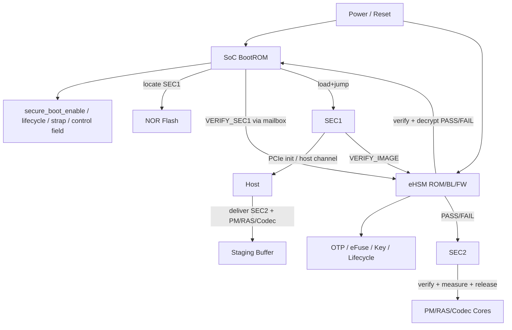
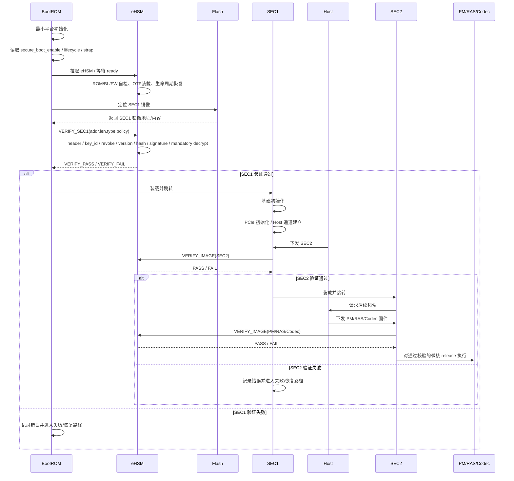
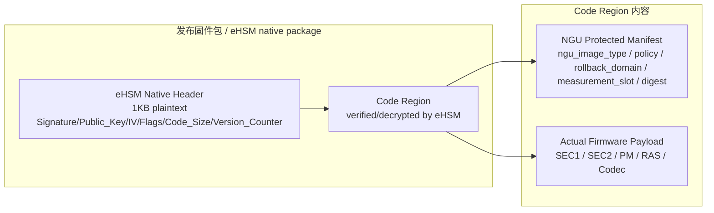
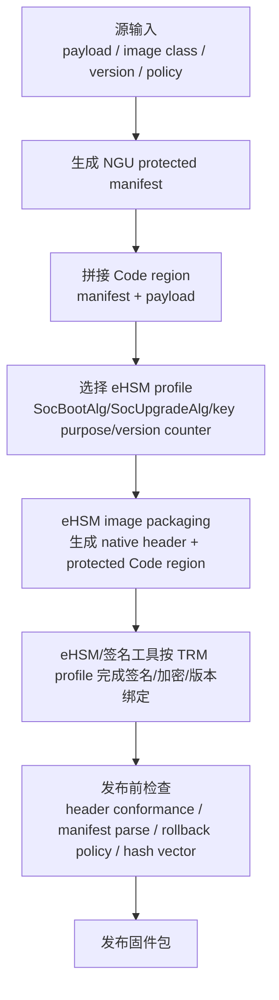
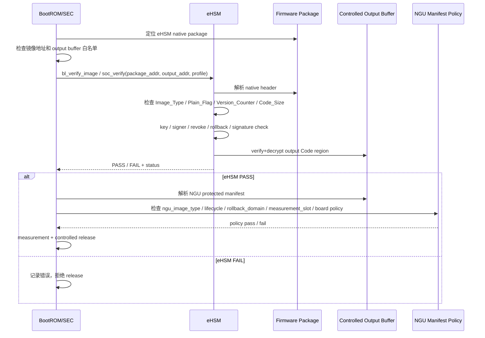

# 6. 安全启动详细设计

> 文档定位：NGU800 / NGU800P 章节级正式详设
> 章节文件：`security_workflow/03_detailed_design/01_boot.md`
> 当前状态：V1.0（基于当前约束、baseline 与输入资料收敛）
> 设计标记口径：`[CONFIRMED] / [ASSUMED] / [TBD]`

---

## 6.1 本章目标

本章定义 NGU800 在**安全启动模式**下的完整启动链设计，明确：

1. SoC BootROM、SEC1、SEC2、eHSM、Host 的职责边界
2. 安全启动与非安全启动的选择条件
3. SEC1 / SEC2 / 后续微核固件的验证与执行放行规则
4. 固件包格式、平台侧制作流程、设备侧验签解密流程
5. 反回滚、吊销、SEC1 强制解密、后续镜像按策略解密、失败处理与恢复入口
6. 与实现层文件的映射关系：
   - `04_impl_design/efuse_key_fw_header_design.md`
   - `04_impl_design/mailbox_if.md`
   - `04_impl_design/spdm_report.md`
   - `04_impl_design/manufacturing_provisioning.md`

---

## 6.2 生效约束 ID

- `C-ROOT-01`
- `C-BOOT-01`
- `C-BOOT-02`
- `C-BOOT-03`
- `C-BOOT-04`
- `C-BOOT-06`
- `C-BOOT-07`
- `C-BOOT-08`
- `C-EHSM-01`
- `C-IF-01`
- `C-HOST-01`
- `C-ACCESS-01`
- `C-ACCESS-02`
- `C-UPDATE-01`
- `C-UPDATE-02`
- `C-ATT-01`
- `C-MFG-01`

---

## 6.3 生效 Baseline 决策

### 6.3.1 Root 与验证主体
- `[CONFIRMED]` Root of Trust = eHSM
- `[CONFIRMED]` First Cryptographic Verifier = eHSM
- `[CONFIRMED]` BootROM 不承担复杂密码学校验和密钥管理

### 6.3.2 启动控制权
- `[CONFIRMED]` SEC/C908 是唯一 boot control plane
- `[CONFIRMED]` Host 只具备镜像投递能力，不具备执行放行权
- `[CONFIRMED]` 所有微核 release 必须由 SEC 控制

### 6.3.3 镜像来源
- `[CONFIRMED]` SEC1 从 NOR Flash / Flash 获取
- `[CONFIRMED]` SEC2 及后续 PM / RAS / Codec 等固件由 Host 通过 PCIe 下发
- `[CONFIRMED]` 非安全启动路径应保留，但量产态是否开启必须受 lifecycle + OTP 策略控制

---

## 6.4 术语与阶段定义

| 术语 | 含义 |
|---|---|
| BootROM | SoC 最早执行的不可变启动代码，负责最小初始化与启动编排 |
| eHSM | 安全服务根，负责验证、密钥、OTP、lifecycle、debug auth、counter 等 |
| SEC1 | 安全最小 bring-up 固件，负责基础初始化与 Host 通道建立 |
| SEC2 | 完整安全控制面固件，负责后续固件接收、验证、升级、认证与调试控制 |
| Staging Buffer | Host 投递镜像的受控缓冲区 |
| Release | 允许某个目标核/固件开始执行的最终放行动作 |

### 6.4.1 启动阶段划分

| 阶段 | 名称 | 主执行体 | 主要动作 |
|---|---|---|---|
| A | SoC BootROM 早期启动 | BootROM | 最小平台初始化、读取 strap / lifecycle / secure boot 配置 |
| B | eHSM 自启动 | eHSM | ROM / Bootloader / 自检 / 生命周期恢复 / 密钥材料恢复 |
| C | SEC1 验证 | BootROM + eHSM | 定位 SEC1、请求验证、做版本/吊销/签名检查 |
| D | SEC1 装载与启动 | BootROM | 装载 SEC1 并跳转执行 |
| E | SEC1 基础初始化 | SEC1 | PCIe 初始化、Host 通道建立、共享缓冲区准备 |
| F | SEC2 与后续镜像处理 | SEC1/SEC2 + eHSM | 验证 SEC2、后续固件验证、测量、release |

---

## 6.5 设计要求

### 6.5.1 必须满足的安全目标

- `[CONFIRMED]` SEC1 必须在执行前经 eHSM 验证
- `[CONFIRMED]` SEC1 在正式安全启动路径中必须采用签名 + 加密保护，执行前必须由 eHSM / 安全子系统受控密码服务完成解密 / unwrap
- `[CONFIRMED]` 后续固件必须经 SEC1/SEC2 调用 eHSM 验证
- `[CONFIRMED]` Host 下发固件在执行前必须受控
- `[CONFIRMED]` 支持版本检查、防回滚、吊销
- `[CONFIRMED]` 支持设备认证与度量导出
- `[CONFIRMED]` 支持安全升级与安全调试
- `[CONFIRMED]` SEC1 在正式安全启动路径中必须签名 + 加密。
- `[CONFIRMED]` SEC2 在正式安全启动路径中必须签名 + 加密；SEC2 verify path 必须包含 signature verify、rollback check、revoke check、decrypt / unwrap、measurement 和 controlled release。
- `[ASSUMED]` PM / RAS / Codec 等关键 runtime image 在 USER/PROD 产品形态中默认签名 + 加密；若采用 signature-only，必须由产品安全策略显式允许并进入 image_type 白名单。

### 6.5.2 不得违反的边界

- BootROM 不得直接承担 SEC1 的复杂密码学校验或复杂解密
- Host 不得直接 release SEC2 或后续微核
- 普通非安全 Master 不得直接访问 eHSM、OTP、Secure SRAM
- 未验签通过的镜像不得进入执行态
- rollback floor 不得只依赖镜像内软件字段

---

## 6.6 架构图

```mermaid
graph TD
    PR[Power / Reset] --> BR[SoC BootROM]
    PR --> EH[eHSM ROM/BL/FW]

    BR --> CFG[secure_boot_enable / lifecycle / strap / control field]
    EH --> OTP[OTP / eFuse / Key / Lifecycle]

    BR -->|locate SEC1| FLASH[NOR Flash]
    BR -->|VERIFY_SEC1 via mailbox| EH
    EH -->|verify + decrypt PASS/FAIL| BR

    BR -->|load+jump| SEC1[SEC1]
    SEC1 -->|PCIe init / host channel| HOST[Host]
    HOST -->|deliver SEC2 + PM/RAS/Codec| STAGE[Staging Buffer]
    SEC1 -->|VERIFY_IMAGE| EH
    EH -->|PASS/FAIL| SEC2[SEC2]
    SEC2 -->|verify + measure + release| OTHERS[PM/RAS/Codec Cores]
```

### 图下说明

1. BootROM 是启动编排者，不是首个密码学验证者。
2. eHSM 在 SEC1 验证、SEC1 强制解密、后续镜像验证、反回滚、吊销检查中提供统一安全服务。
3. Host 只把 SEC2 及后续镜像投递到受控缓冲区，不拥有执行放行权。
4. SEC2 是后续运行期安全控制面，负责后续微核固件验证编排、度量汇总和放行。

---

## 6.7 时序图

```mermaid
sequenceDiagram
    participant BR as BootROM
    participant EH as eHSM
    participant FL as Flash
    participant S1 as SEC1
    participant H as Host
    participant S2 as SEC2
    participant MC as PM/RAS/Codec

    BR->>BR: 最小平台初始化
    BR->>BR: 读取 secure_boot_enable / lifecycle / strap
    BR->>EH: 拉起 eHSM / 等待 ready
    EH->>EH: ROM/BL/FW 自检、OTP装载、生命周期恢复
    BR->>FL: 定位 SEC1 镜像
    FL-->>BR: 返回 SEC1 镜像地址/内容
    BR->>EH: VERIFY_SEC1(addr,len,type,policy)
    EH->>EH: header / key_id / revoke / version / hash / signature / mandatory decrypt
    EH-->>BR: VERIFY_PASS / VERIFY_FAIL
    alt SEC1 验证通过
        BR->>S1: 装载并跳转
        S1->>S1: 基础初始化
        S1->>S1: PCIe 初始化 / Host 通道建立
        H->>S1: 下发 SEC2
        S1->>EH: VERIFY_IMAGE(SEC2)
        EH-->>S1: PASS / FAIL
        alt SEC2 验证通过
            S1->>S2: 装载并跳转
            S2->>H: 请求后续镜像
            H->>S2: 下发 PM/RAS/Codec 固件
            S2->>EH: VERIFY_IMAGE(PM/RAS/Codec)
            EH-->>S2: PASS / FAIL
            S2->>MC: 对通过校验的微核 release 执行
        else SEC2 验证失败
            S1->>S1: 记录错误并进入失败/恢复路径
        end
    else SEC1 验证失败
        BR->>BR: 记录错误并进入失败/恢复路径
    end
```

### 图下说明

1. SEC1 的首次密码学校验和强制解密发生在 BootROM 调 eHSM 的路径上。
2. 后续镜像验证责任转移到 SEC1/SEC2 调 eHSM 的路径。
3. release 是一个独立动作，必须发生在 verify pass 之后。
4. 任何验证失败都不能默默降级为“继续启动”，必须进入明确失败或恢复路径。

---

## 6.8 启动模式矩阵

| 模式 | secure_boot_enable | lifecycle | eHSM 参与 | 镜像要求 | 适用场景 |
|---|---|---|---|---|---|
| 安全启动 | 1 | MANU / USER / DEBUG-RMA | 必须 | 关键镜像必须验证；支持版本/吊销/反回滚 | 正式量产 / 制造验证 / 受控返修 |
| 非安全启动 | 0 或策略允许 | TEST / DEVE 为主 | 可不参与首阶段镜像验证 | 可允许受控绕过 | 实验室 bring-up / 特定开发调试 |
| Rescue / Recovery | 策略控制 | DEBUG/RMA 为主 | 必须 | 必须用受控 recovery trust / 特定 signer | 故障恢复 / 返修 |

### 6.8.1 模式选择规则

- `[CONFIRMED]` BootROM 启动后首先读取 `secure_boot_enable / lifecycle / strap / control field`
- `[CONFIRMED]` 非安全路径应保留，但不应默认允许量产态启用
- `[ASSUMED]` USER 生命周期下，非安全启动应由 OTP/eFuse + 策略态关闭
- `[ASSUMED]` Recovery 模式只能通过受控 lifecycle 和授权流程进入

---

## 6.9 可信镜像分类

| 镜像类型 | 来源 | 谁发起验证 | 谁执行验证 | 谁决定执行放行 | 反回滚检查 |
|---|---|---|---|---|---|
| SEC1 | NOR Flash | BootROM | eHSM | BootROM 跳转至 SEC1 | 跳转前检查；签名 + 加密强制 |
| SEC2 | Host/PCIe | SEC1 | eHSM | SEC1 / SEC2 受控跳转 | 执行前检查；签名 + 加密强制 |
| PM | Host/PCIe | SEC2 | eHSM | SEC2 release | 放行前检查；USER/PROD 默认签名 + 加密 |
| RAS | Host/PCIe | SEC2 | eHSM | SEC2 release | 放行前检查；USER/PROD 默认签名 + 加密 |
| Codec | Host/PCIe | SEC2 | eHSM | SEC2 release | 放行前检查；USER/PROD 默认签名 + 加密 |
| Recovery | 特殊路径 | SEC2 / Provisioning | eHSM | SEC2 / 受控状态机 | `[TBD]` 独立 image_type / signer / counter / decrypt policy |

### 6.9.1 当前建议

- `[CONFIRMED]` SEC1 的首次验证由 eHSM 完成
- `[CONFIRMED]` SEC1 必须签名 + 加密，解密由 eHSM / 安全子系统受控密码服务完成，解密失败必须阻止启动
- `[CONFIRMED]` SEC2 及后续镜像验证由 SEC1/SEC2 调 eHSM 完成
- `[CONFIRMED]` SEC2 必须签名 + 加密，解密失败必须阻断安全控制面启动
- `[CONFIRMED]` Host 不拥有执行放行权
- `[ASSUMED]` PM / RAS / Codec 在 USER/PROD 默认签名 + 加密；signature-only 只能作为产品策略白名单例外
- `[ASSUMED]` Recovery 镜像应使用专用 recovery trust anchor，并仅在受控 lifecycle 下允许
- `[TBD]` Recovery image 的 image_type、signer、trust anchor、rollback counter、decrypt policy 需要在详细设计冻结前关闭

---

## 6.10 镜像格式与 eHSM native header 分层

本章不重复完整实现级字段，正式结构以：

- `04_impl_design/efuse_key_fw_header_design.md`
- `04_impl_design/ehsm_source_conformance_matrix.md`

为准。CR-0004 接受后，章节级口径如下：

### 6.10.1 eHSM native header

- `[CONFIRMED]` SEC1 / SEC2 的密码学 verify/decrypt container 采用 eHSM native secure boot image header。
- `[CONFIRMED]` eHSM header 为 1KB plaintext image head，Code 从 offset 1024 开始，可明文或密文。
- `[CONFIRMED]` eHSM header 中的 `Image_Type` 保持 eHSM TRM 定义，不承载 NGU `SEC1 / SEC2 / PM / RAS / Codec / Recovery` 项目级类型。
- `[CONFIRMED]` `SocBootAlg / SocUpgradeAlg` 或等价 eHSM control field 是 secure boot / upgrade 的算法 authority。

### 6.10.2 NGU protected manifest

- `[CONFIRMED]` NGU 项目级 metadata 放入 eHSM Code region 的 protected manifest / policy table。
- manifest 记录 NGU `ngu_image_type`、policy、measurement slot、rollback domain、lifecycle mask、board binding policy、expected algorithm profile 等项目语义。
- manifest 由 BootROM / SEC 在 eHSM verify/decrypt 成功后解析；是否由 eHSM firmware / bootloader 直接解析保持 `[TBD]`。
- manifest ABI bit-level layout、是否必须位于 Code region 起始位置、extension 格式保持 `[TBD]`。

### 6.10.3 已废弃的旧口径

- `ngu_fw_min_hdr_t / ngu_fw_signed_hdr_t` 不再作为 physical wire/storage verification header。
- `algo_family / hash_algo / sig_algo / enc_algo` 不再作为镜像头内的算法 authority；如需要，可作为 manifest expected profile / audit profile。
- `SEC1_MIN_VER / SEC2_MIN_VER / *_MIN_VER` 不再作为 physical OTP 32-bit rollback counter，只作为 NGU logical rollback domain。
- `key_slot / wrapped_cek_*` 不得被写成 eHSM 已确认字段；per-image CEK / wrapped CEK 保持 `[TBD]`，除非 eHSM owner 后续确认。

### 6.10.4 当前项目建议

- `[CONFIRMED]` Host 下发镜像必须先进入 staging buffer
- `[CONFIRMED]` Verify path 必须能处理：
  - eHSM native header 解析
  - eHSM `Image_Type / Plain_Flag / Version_Counter / Code_Size` 检查
  - eHSM key ID / signer hash 检查
  - revoke bitmap 检查
  - eHSM Version Counter / NGU rollback domain 检查
  - hash / signature 校验
  - 对 SEC1 / SEC2 执行强制 verify+decrypt output path
  - eHSM verify/decrypt 成功后再解析 NGU manifest 并执行项目级 policy
- `[CONFIRMED]` SEC1 在正式安全启动路径中必须签名 + 加密
- `[CONFIRMED]` SEC2 在正式安全启动路径中必须“签名 + 加密”
- `[ASSUMED]` PM / RAS / Codec 等主要运行期固件在 USER/PROD 产品形态中默认“签名 + 加密”；若采用 signature-only，必须由产品安全策略显式允许并在 lifecycle / attestation / debug 状态中可见
- `[TBD]` signature-only 白名单的准入条件至少绑定 image_type、lifecycle、product SKU、debug state、release policy、rollback policy、是否包含敏感逻辑/数据

### 6.10.5 固件包物理布局与逻辑布局

CR-0014 后，本文把 `SRC-008 当前收敛安全软件方案 2.0` 第 4 章 / 第 4.5 节中的“eHSM native package、FMC 安全固件制作和设备侧验证流程”作为当前来源。旧 `SRC-001 当前安全方案基线` 中的 `header + Signed Region + signature + wrapped_cek + enc_payload` 只能作为历史流程意图参考，不再作为最终 wire/storage physical format。

```mermaid
flowchart LR
    subgraph PKG[发布固件包 / eHSM native package]
        H[eHSM Native Header<br/>1KB plaintext<br/>Signature/Public_Key/IV/Flags/Code_Size/Version_Counter]
        C[Code Region<br/>verified/decrypted by eHSM]
    end

    subgraph CODE[Code Region 内容]
        M[NGU Protected Manifest<br/>ngu_image_type / policy / rollback_domain / measurement_slot / digest]
        P[Actual Firmware Payload<br/>SEC1 / SEC2 / PM / RAS / Codec]
    end

    H --> C
    C --> M
    C --> P
```

图下说明：

1. eHSM native header 是唯一 physical verification/decrypt container。
2. NGU manifest 位于 eHSM Code region 内，必须被 eHSM verify/decrypt 保护。
3. `ngu_image_type`、rollback domain、measurement slot、lifecycle mask、expected algorithm profile 不写入 eHSM native `Image_Type`。
4. 若后续需要 per-image CEK / wrapped CEK，只能作为 eHSM owner 确认后的 customization extension，不得由工具链自行定义为已冻结字段。

### 6.10.6 平台侧固件制作流程

平台侧固件制作工具的输入和输出必须围绕 eHSM native package 组织，而不是围绕旧 NGU custom header 组织。

```mermaid
flowchart TD
    SRC[源输入<br/>payload / image class / version / policy] --> MAN[生成 NGU protected manifest]
    MAN --> COMB[拼接 Code region<br/>manifest + payload]
    COMB --> PROF[选择 eHSM profile<br/>SocBootAlg/SocUpgradeAlg/key purpose/version counter]
    PROF --> PACK[eHSM image packaging<br/>生成 native header + protected Code region]
    PACK --> SIGN[eHSM/签名工具按 TRM profile 完成签名/加密/版本绑定]
    SIGN --> CHECK[发布前检查<br/>header conformance / manifest parse / rollback policy / hash vector]
    CHECK --> OUT[发布固件包]
```

平台侧步骤要求：

1. 生成明文 payload，并确定 `ngu_image_type`、版本、rollback domain、measurement slot、lifecycle mask、board binding policy、expected algorithm profile。
2. 生成 NGU protected manifest。manifest 的 bit-level ABI 仍为 `[TBD]`，但其语义必须与第 10 章实现级设计保持一致。
3. 将 `manifest + payload` 组成 eHSM Code region 输入；manifest 必须位于 eHSM verify/decrypt 保护范围内。
4. 按 eHSM TRM / owner-confirmed profile 选择 `SocBootAlg / SocUpgradeAlg`、key purpose、version counter 和 sign/encrypt profile。
5. 由 eHSM image packaging 工具或 owner-confirmed 等价流程生成 eHSM native header 和 Code region，不得生成第二套 NGU physical verification header。
6. 发布前必须检查：
   - eHSM header 字段符合 TRM；
   - eHSM `Image_Type` 未被误用为 NGU `SEC1/SEC2/runtime` 类型；
   - Code region 中可解析出 NGU manifest；
   - manifest 中 expected algorithm profile 与 eHSM control field 不冲突；
   - version / rollback domain / measurement slot 与 release policy 一致；
   - sign+encrypt mandatory 镜像没有落入 NVM only verify profile。

### 6.10.7 设备侧 verify/decrypt 与 manifest policy 流程

设备侧必须先让 eHSM 完成 native package 的密码学验证与解密输出，再由 BootROM / SEC 解析 NGU manifest 并做项目级 policy/release 判断。

```mermaid
sequenceDiagram
    participant BR as BootROM/SEC
    participant EH as eHSM
    participant IMG as Firmware Package
    participant OUT as Controlled Output Buffer
    participant POL as NGU Manifest Policy

    BR->>IMG: 定位 eHSM native package
    BR->>BR: 检查镜像地址和 output buffer 白名单
    BR->>EH: bl_verify_image / soc_verify(package_addr, output_addr, profile)
    EH->>IMG: 解析 native header
    EH->>EH: 检查 Image_Type / Plain_Flag / Version_Counter / Code_Size
    EH->>EH: key / signer / revoke / rollback / signature check
    EH->>OUT: verify+decrypt output Code region
    EH-->>BR: PASS / FAIL + status
    alt eHSM PASS
        BR->>OUT: 解析 NGU protected manifest
        BR->>POL: 检查 ngu_image_type / lifecycle / rollback_domain / measurement_slot / board policy
        POL-->>BR: policy pass / fail
        BR->>BR: measurement + controlled release
    else eHSM FAIL
        BR->>BR: 记录错误，拒绝 release
    end
```

设备侧步骤要求：

1. BootROM / SEC 只定位镜像、准备参数和受控 output buffer，不实现复杂签名、复杂解密或 key unwrap。
2. eHSM 对 native header 和 Code region 执行 TRM 定义的 verify/decrypt；SEC1 / SEC2 必须使用 verify+decrypt output path。
3. eHSM 返回 PASS 前，BootROM / SEC 不得信任 Code region 内的 NGU manifest，也不得使用 manifest 中的 load/entry/policy 字段。
4. eHSM PASS 后，BootROM / SEC 解析 NGU manifest，并检查：
   - `ngu_image_type` 是否符合当前启动阶段；
   - `security_policy_flags` 是否满足 SEC1/SEC2 mandatory sign+encrypt；
   - `rollback_domain` 与 eHSM Version Counter / owner-confirmed rollback policy 是否一致；
   - `lifecycle_mask` 是否允许当前 lifecycle；
   - `measurement_slot` 是否有效；
   - `expected_algorithm_profile` 是否与 eHSM control field 一致；
   - board binding policy 是否只进入 attestation，或在后续 CR 冻结后参与 release decision。
5. 只有 eHSM PASS 且 manifest policy PASS 后，BootROM / SEC 才能记录 measurement 并执行 controlled release。

---

## 6.11 校验规则

### 6.11.1 SEC1 校验规则

BootROM 向 eHSM Bootloader `bl_verify_image` 或等价 SEC1 early boot profile 发起 `VERIFY_SEC1` 请求时，至少执行：

1. eHSM native header 解析
2. eHSM `Image_Type / Plain_Flag / Version_Counter / Code_Size` 检查
3. `key_id / signer key slot` 检查
4. `revoke bitmap` 检查
5. eHSM Version Counter / NGU logical rollback domain 检查
6. `signer pubkey hash` 校验
7. `signature` 校验
8. Code region verify/decrypt output
9. eHSM 成功后由 BootROM / SEC 解析 NGU manifest 并记录 measurement 与保护策略状态

SEC1 解密失败必须返回明确错误码并阻止启动，BootROM 不得降级为未解密镜像继续执行。

### 6.11.2 后续镜像校验规则

SEC1/SEC2 向 eHSM Firmware `soc_verify` 或项目 wrapper 发起 `VERIFY_IMAGE` 时，至少执行：

1. eHSM native header 检查
2. eHSM `Image_Type` 与 expected profile 检查
3. eHSM verify/decrypt output
4. NGU manifest `ngu_image_type` 检查
5. `lifecycle_mask` 检查
6. `board_bind_flags` / Die binding 检查（如启用）
7. `signer_key_hash` / trust anchor 校验
8. rollback domain / policy 检查
9. SEC2 在正式安全启动路径中必须签名 + 加密，PM / RAS / Codec 等后续关键运行期固件在 USER/PROD 默认签名 + 加密
10. 通过后才允许 release

### 6.11.3 失败处理规则

- `[CONFIRMED]` 任一关键镜像验证失败，必须返回明确 `error_code`
- `[CONFIRMED]` 失败后必须记录错误并进入失败或恢复路径
- `[ASSUMED]` USER 量产态下，不允许自动降级到非安全启动继续运行
- `[ASSUMED]` DEBUG/RMA 可在授权后进入受控 rescue path

---

## 6.12 Staging Buffer 与 Host 交互规则

### 6.12.1 Host 的允许动作

Host 允许：
- 通过 PCIe 下发 SEC2 / PM / RAS / Codec 等镜像
- 配置 firmware descriptor
- 读取普通状态与版本信息
- 触发 mailbox doorbell / queue 交互（受控）

### 6.12.2 Host 的禁止动作

Host 不得：
- 直接 release 微核
- 修改 secure boot 状态
- 修改 lifecycle
- 修改 debug enable
- 修改 recovery 模式选择
- 直接访问 secure shared buffer / OTP / Secure SRAM
- 直接写 boot-critical 分区

### 6.12.3 DMA 访问要求

- `[CONFIRMED]` Host DMA 仅允许访问 firmware staging buffer 和普通数据缓冲区
- `[CONFIRMED]` Host DMA 不得访问：
  - SEC1 / SEC2 执行区
  - recovery 区
  - 证书/策略区
  - 安全共享缓冲区
  - 安全状态寄存器区

---

## 6.13 非安全启动规则

### 6.13.1 设计定位

- `[CONFIRMED]` 非安全启动必须保留，用于指定的开发和调试场景
- `[ASSUMED]` 非安全启动在量产 USER 生命周期下应默认关闭
- `[ASSUMED]` 非安全启动开启必须是显式策略，而不是失败后的隐式回退

### 6.13.2 最小规则

1. 非安全启动不得伪装成安全启动
2. 非安全启动路径必须在状态寄存器或证明路径中可见
3. 若进入非安全启动，不得产生“安全启动已通过”的错误状态
4. 非安全启动模式下的升级、调试、证明能力必须受更严格区分

### 6.13.3 与证明路径关系

- `[ASSUMED]` 若设备处于非安全启动路径，Attestation report 必须能体现：
  - secure_boot_state = disabled / bypass
  - 相应 measurement 策略可能降级
- `[ASSUMED]` Verifier 不应把非安全启动态报告判为量产可信设备态

---

## 6.14 失败处理与恢复路径

### 6.14.1 失败场景

| 场景 | 检测点 | 建议动作 |
|---|---|---|
| SEC1 验签或解密失败 | BootROM + eHSM | 停止跳转，记录错误码，进入失败/恢复路径 |
| SEC2 验签失败 | SEC1/SEC2 + eHSM | 拒绝装载，保持控制面不放行 |
| 后续微核验签失败 | SEC2 + eHSM | 拒绝对应微核 release |
| rollback 检查失败 | eHSM / counter path | 拒绝执行，记录 rollback error |
| eHSM 未 ready | BootROM / SEC 超时 | 进入受控失败处理，不得静默旁路 |
| mailbox / shared memory 错误 | SEC ↔ eHSM | 返回明确错误并停止危险路径 |

### 6.14.2 恢复规则

- `[CONFIRMED]` 首版 FMC 防变砖不依赖 SoC Flash 内部 `FMC_A/FMC_B`、inactive slot、fallback slot 或 BootROM slot metadata 状态机；FMC 损坏、刷写失败或 verify/decrypt 失败后，恢复路径为 OOB MCU 受控重刷 NOR Flash 固定 FMC 主区域。
- `[CONFIRMED]` GSP(SEC2) 与 runtime 固件由 Host/PCIe 重新下发并重新走 eHSM verify/decrypt/release，不在片上 Flash 中设计 A/B recovery 分区。
- `[CONFIRMED]` OOB MCU 只能负责刷写合法性、QSPI/NOR 写入和写后校验；刷写后的 FMC 是否可执行，仍由下一次 BootROM + eHSM verify/decrypt/rollback/revoke/manifest policy 裁决。
- `[TBD]` OOB MCU secure boot、恢复授权 capsule、QSPI ownership/arbiter、NOR 写保护、掉电保护和审计字段仍需板级 / RTL / security owner 冻结。

---

## 6.15 与实现层的映射关系

| 本章主题 | 对应实现层文件 |
|---|---|
| SEC1 / SEC2 / 后续固件验证路径 | `04_impl_design/mailbox_if.md` |
| 镜像头、固件包制作流程、版本、rollback 字段 | `04_impl_design/efuse_key_fw_header_design.md` |
| 证明中 secure boot / rollback / lifecycle 状态反映 | `04_impl_design/spdm_report.md` |
| MANU→USER 冻结动作、恢复路径、RMA 策略 | `04_impl_design/manufacturing_provisioning.md` |

---

## 6.16 冻结敏感项

| Item | Why Sensitive | Current Status | Needed Before Freeze |
|---|---|---|---|
| SEC1 验证与解密调用边界 | 直接影响 BootROM / eHSM 接口冻结 | 已基本收敛 | 冻结 `VERIFY_SEC1` 参数模型、强制解密标志和输出 buffer 约束 |
| release owner 语义 | 直接影响 SEC / Host / 微核控制权 | 已基本收敛 | 冻结 release 状态机 |
| rollback counter 映射 | 影响 OTP / 升级 / 证明一致性 | 部分收敛 | 冻结 image_type → counter_id |
| non-secure boot 在 USER 是否完全关闭 | 影响产品策略和客户模式 | 未完全冻结 | 需产品/安全评审裁决 |
| SEC2 decrypt / release policy | 影响后续安全控制面启动 | 已收敛 | 冻结 SEC2 key slot、wrapped CEK、错误码和 release 状态机 |
| 固件制作工具契约 | 影响 image packager、BootROM、SEC verify flow、eHSM adapter 联调 | 部分收敛 | 冻结 manifest ABI、工具参数、golden vector、exact eHSM key ID / command mapping |
| runtime signature-only 白名单 | 影响产品 SKU 与 attestation 策略 | 未完全冻结 | 冻结 image_type / lifecycle / SKU / debug / release / rollback 条件 |
| recovery trust model | 影响升级与返修路径 | 未完全冻结 | 冻结 image_type / signer / anchor / counter / decrypt policy |

---

## 6.17 开放问题

1. 除 SEC1/SEC2 外，哪些非敏感运行期镜像允许在特定产品阶段采用 signature-only 白名单？
2. Recovery 是否独立 image_type + 独立 signer / trust anchor / rollback counter / decrypt policy？
3. SEC1 是否只负责把 SEC2 拉起，还是在首版中继续承担一部分运行期安全控制？
4. 非安全启动在 TEST/DEVE 之外是否允许保留特定维护入口？
5. 双Die / 板级绑定策略是否需要在 boot 阶段强制参与 verify decision？
6. `ngu_image_manifest_t` ABI、image packager CLI、golden vector 和 exact eHSM command 参数如何冻结？

---

## 6.18 本章结论

本章已将 NGU800 安全启动收敛到当前可评审的正式口径：

- BootROM 是启动编排者，不是首个密码学验证者
- eHSM 是首个密码学验证主体
- SEC1 从 NOR Flash 获取并在执行前经 eHSM 验证和强制解密
- SEC2 与后续固件由 Host 投递、由 SEC1/SEC2 调 eHSM 验证；SEC2 在正式安全启动路径中必须签名 + 加密
- 固件制作工具和设备侧 verify/decrypt path 必须共享 eHSM native header + NGU protected manifest 契约
- Host 没有执行放行权
- release 必须晚于 verify pass
- anti-rollback、吊销、SEC1/SEC2 强制解密、后续镜像按策略解密和失败/恢复路径必须进入启动链
- 非安全启动应保留，但必须受生命周期和策略显式控制

后续若 `mailbox_if.md`、`efuse_key_fw_header_design.md`、`manufacturing_provisioning.md` 冻结字段变更，本章必须同步更新。
