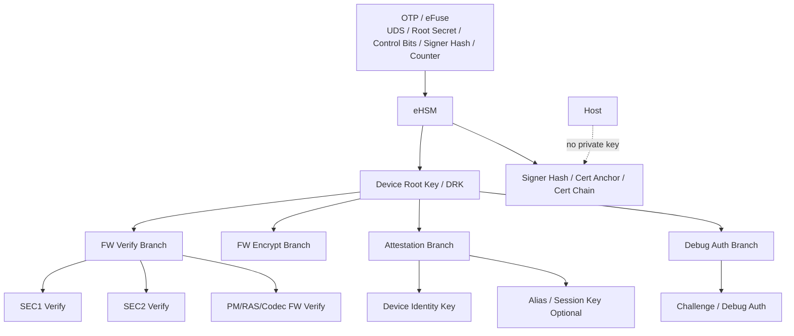
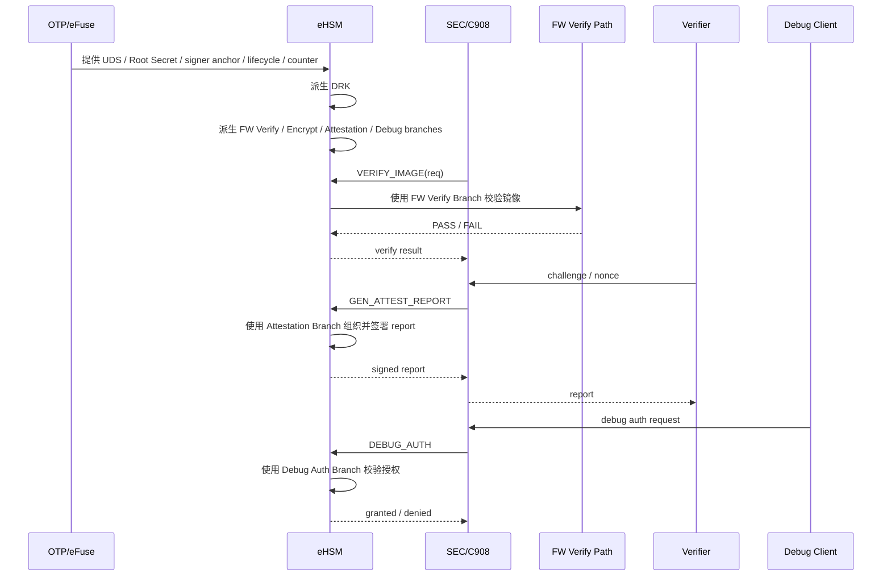

# 5. Root of Trust、密钥体系与证书体系

> 文档定位：NGU800 / NGU800P 章节级正式详设  
> 章节文件：`security_workflow/03_detailed_design/02_key_cert.md`  
> 当前状态：V1.0（基于当前约束、baseline 与输入资料收敛）  
> 设计标记口径：`[CONFIRMED] / [ASSUMED] / [TBD]`

---

## 5.1 本章目标

本章定义 NGU800 的 Root of Trust、密钥体系、证书体系和双算法映射口径，明确：

1. Root of Trust 的归属和边界
2. UDS / Root Secret / DRK / 各分支业务密钥的层级关系
3. 固件验签、固件解密、设备证明、调试鉴权所依赖的 key branch
4. 证书链 / trust anchor / signer hash 的项目采用策略
5. 国密与国际算法栈在 key / cert / report / FW header 中的统一承载方式
6. 与实现层文件的映射关系：
   - `04_impl_design/efuse_key_fw_header_design.md`
   - `04_impl_design/spdm_report.md`
   - `04_impl_design/manufacturing_provisioning.md`
   - `04_impl_design/mailbox_if.md`

---

## 5.2 生效约束 ID

- `C-ROOT-01`
- `C-IF-01`
- `C-KEY-01`
- `C-KEY-02`
- `C-ATT-01`
- `C-DEBUG-02`
- `C-HOST-01`
- `C-ACCESS-01`
- `C-ACCESS-02`
- `C-MFG-01`
- `C-UPDATE-01`

---

## 5.3 生效 Baseline 决策

### 5.3.1 Root of Trust
- `[CONFIRMED]` Root of Trust = eHSM
- `[CONFIRMED]` Root Key / Root Secret 仅由 eHSM 使用
- `[CONFIRMED]` BootROM 不持有 Root Private Key

### 5.3.2 私钥边界
- `[CONFIRMED]` 私钥不得离开 eHSM
- `[CONFIRMED]` Host / 普通核 / 管理核 不得直接访问私钥
- `[CONFIRMED]` 所有正式安全路径 crypto 必须走 eHSM

### 5.3.3 双算法策略
- `[CONFIRMED]` 方案必须同时覆盖国密与国际算法两套栈
- `[CONFIRMED]` 结构体和报文字段必须显式携带 `algo_family / hash_algo / sig_algo / enc_algo`
- `[ASSUMED]` 首版实现可按产品形态选择默认主算法栈，但结构上不得丢失双栈能力

---

## 5.4 设计要求

### 5.4.1 本章必须回答的问题

1. Root Secret / UDS 放在哪里，谁使用？
2. Device Root Key（DRK）如何从根种子派生？
3. 固件验签根和固件解密根如何区分？
4. Attestation 与 Debug Auth 是否复用一套根？
5. 固件验签采用“OTP 固化公钥摘要”还是“完整 cert chain”？
6. 设备证明采用“Device Identity Key”还是“Alias Key / Session Key”？
7. 国密 / 国际算法如何在同一套结构中共存？
8. 制造灌装阶段具体写什么、锁什么、清理什么？

### 5.4.2 不得违反的边界

- BootROM 不得成为密钥管理中心
- Host 不得持有或缓存设备私钥
- 证书链策略不得脱离 Root / OTP / lifecycle 约束单独定义
- 任何 key branch 都不得绕过 lifecycle gating
- 量产 USER 态不得保留测试 trust anchor 或测试 signer

---

## 5.5 架构图



### 图下说明

1. OTP/eFuse 保存的是**根材料、控制位、signer anchor、counter**，而不是让普通软件直接读取的明文密钥仓库。  
2. eHSM 是唯一合法的 key usage 执行面。  
3. DRK 是项目内部逻辑层次，不要求一定以明文字段形式存在，但要求在设计语义上作为各分支 key 的共同上游。  
4. 固件验签、设备证明、调试鉴权在工程上建议分成不同 key branch，避免权限耦合。  

---

## 5.6 时序图



### 图下说明

1. 所有 key branch 都从 Root / UDS 语义上派生，而不是离散孤立存在。  
2. 固件验签、设备证明、调试鉴权通过不同 branch 可降低权限串扰。  
3. Host / Verifier / Debug Client 都不能直接操作私钥，只能通过 SEC → eHSM 的受控路径发起请求。  

---

## 5.7 Root of Trust 设计

### 5.7.1 定义

本项目中的 Root of Trust 由以下三部分共同构成：

| 组件 | 职责 |
|---|---|
| OTP / eFuse | 持久保存根种子、控制位、signer anchor、counter、lifecycle 状态 |
| eHSM | 使用根种子，提供 crypto / verify / key / lifecycle / debug auth 服务 |
| BootROM | 最早启动编排者，负责把控制流程带到安全验证路径，但不是密码学根 |

### 5.7.2 当前裁决

- `[CONFIRMED]` Root of Trust 的“根使用权”归 eHSM
- `[CONFIRMED]` BootROM 属于启动链的 earliest code，但不等于密码学根
- `[CONFIRMED]` Root Secret / Root Key 材料不应作为软件可读资产暴露
- `[ASSUMED]` 若硬件实现上存在部分 Root 材料对 BootROM 的最小可见形式，也不得被视为可复用私钥材料

### 5.7.3 与启动链的关系

Root of Trust 的责任不是“替 BootROM 做所有事情”，而是：

1. 提供信任基础（OTP / Root Secret / signer anchor）
2. 提供首个密码学验证能力（eHSM）
3. 约束后续所有执行放行和生命周期行为

---

## 5.8 密钥对象表

### 5.8.1 关键密钥对象

| Key Object | 作用 | 是否可导出 | 推荐存储 / 使用位置 | 生命周期限制 |
|---|---|---|---|---|
| UDS / Root Secret | 根种子 | 否 | OTP/eFuse → eHSM 使用 | 全生命周期受控 |
| DRK | 设备根派生密钥 | 否 | eHSM 内部 | 全生命周期受控 |
| FW Verify Root | 固件验签根 | 否（私钥）/是（公钥或摘要） | eHSM / cert anchor | USER 必须受控 |
| FW Encrypt Key / KEK | 固件机密性保护 | 否 | eHSM | 按产品策略启用 |
| Attestation Seed | 设备证明上游种子 | 否 | eHSM | USER / DEBUG/RMA 受控 |
| Device Identity Key | 设备证明私钥 | 否 | eHSM | 不得导出 |
| Alias / Session Key | 证明扩展私钥 | 否 | eHSM | `[ASSUMED]` 首版可选 |
| Debug Auth Seed / Key | 调试鉴权 | 否 | eHSM | DEBUG/RMA 受控 |
| Signer Hash / Anchor | 固件验签锚点 | 可读摘要 | OTP/eFuse / cert block | USER 必须冻结 |

### 5.8.2 当前项目建议

- `[CONFIRMED]` UDS / Root Secret 为最上游根材料
- `[CONFIRMED]` 固件验签、设备证明、调试鉴权不应直接共用同一把外部暴露身份，而应在语义上分 branch
- `[ASSUMED]` 首版可先在实现上减少 branch 数量，但结构设计必须预留分支能力

---

## 5.9 密钥层级（Key Hierarchy）

### 5.9.1 推荐逻辑层级

```text
UDS / Root Secret
    ↓ KDF
Device Root Key (DRK)
    ↓───────────────┬───────────────────┬───────────────────┬───────────────────┐
    ↓               ↓                   ↓                   ↓
FW Verify Branch    FW Encrypt Branch   Attestation Branch  Debug Auth Branch
```

### 5.9.2 设计理由

#### FW Verify Branch
用于：
- SEC1 / SEC2 / 后续微核镜像签名校验
- signer hash / anchor 匹配
- 吊销 / 版本 / trust chain 判定

#### FW Encrypt Branch
用于：
- 镜像解密
- CEK / KEK / wrapped key 路径
- `[ASSUMED]` 若首版不启用加密，可逻辑保留实现占位

#### Attestation Branch
用于：
- Device Identity Key
- Alias / Session-bound attestation key
- 签署 report / attestation response

#### Debug Auth Branch
用于：
- challenge-response
- 调试授权校验
- scope / time / lifecycle 相关鉴权

### 5.9.3 当前裁决

- `[CONFIRMED]` FW Verify 和 Attestation 不能混为一条“无边界通用签名私钥”
- `[CONFIRMED]` Debug Auth 必须有独立控制面，不能简单复用普通 attestation 成功即开 debug
- `[ASSUMED]` DRK 是否在硬件实现中显式存在为中间寄存态不重要，重要的是语义上 branch 上游唯一且受控

---

## 5.10 证书体系设计

### 5.10.1 当前项目面临的两种模型

| 模型 | 描述 | 优点 | 风险 |
|---|---|---|---|
| Hash Anchor 模型 | OTP 中保存 signer hash / root hash；镜像或报告中带 signer/cert 信息 | 实现轻、适合首版 | 灵活度受限 |
| Full Cert Chain 模型 | 镜像 / report 中直接携带完整 cert chain | 标准化程度高，适合长期扩展 | 体积大、实现复杂 |

### 5.10.2 当前建议

#### 固件验签路径
- `[CONFIRMED]` 首版优先采用 **OTP 固化 signer hash / trust anchor** 模型
- `[ASSUMED]` 可预留镜像中携带 cert chain blob 的能力
- `[TBD]` 是否直接首版全面切到 X.509 需看项目证书基础设施成熟度

#### 设备证明路径
- `[CONFIRMED]` report 中必须支持：
  - Hash Anchor
  - 可选 Cert Chain Block
- `[ASSUMED]` 首版 verifier 可本地预置 trust anchor，通过 report 中的 signer / anchor hash 完成快速定位
- `[TBD]` 是否要求 report 默认内嵌完整 cert chain，需结合客户接入方式和 SPDM verifier 能力冻结

### 5.10.3 证书对象表

| Cert / Anchor Object | 用途 | 建议位置 |
|---|---|---|
| FW Signer Hash Slot0 | 固件验签国密 signer 锚点 | OTP/eFuse |
| FW Signer Hash Slot1 | 固件验签国际 signer 锚点 | OTP/eFuse |
| Debug Auth Anchor | 调试授权锚点 | OTP/eFuse |
| Attestation Root Hash | 设备证明锚点 | OTP/eFuse |
| Optional Cert Chain Blob | 报告 / 镜像附带链 | 镜像 / report block |

---

## 5.11 推荐 KDF Label

> 说明：本节给出项目内部建议语义标签，不代表必须锁死到某一种 KDF 标准实现。  
> 若后续采用 HKDF-SM3 / HKDF-SHA256 / 项目自定义 KDF，只要 label 语义保持稳定即可。

| Label | 用途 |
|---|---|
| `NGU800:DRK` | 从 UDS / Root Secret 派生设备根密钥 |
| `NGU800:FW:VERIFY` | 固件验签 branch |
| `NGU800:FW:ENC` | 固件加密 / 解密 branch |
| `NGU800:ATTEST:DEV` | 设备证明 Device Identity Key |
| `NGU800:ATTEST:ALIAS` | Alias / Session 证明 key |
| `NGU800:DEBUG:AUTH` | 调试鉴权 |
| `NGU800:REPORT:BIND` | 报告绑定（nonce / session 相关） |
| `NGU800:WRAP:CEK` | 镜像 CEK wrap / unwrap |

### 5.11.1 使用规则

- `[CONFIRMED]` 不同业务场景必须使用不同 Label
- `[CONFIRMED]` 不得用同一个 Label 既做固件验签根又做调试鉴权
- `[ASSUMED]` 若国密和国际算法的 KDF 内核不同，label 语义仍应保持一致

---

## 5.12 双算法映射

### 5.12.1 国密路径

| 用途 | 建议算法 |
|---|---|
| Hash | SM3 |
| Signature | SM2 |
| Encryption | SM4 |
| KDF | SM3-based KDF / HKDF-SM3 compatible |

### 5.12.2 国际路径

| 用途 | 建议算法 |
|---|---|
| Hash | SHA-256 / SHA-384 |
| Signature | ECDSA P-256 / P-384 或 RSA-3072 |
| Encryption | AES-256-GCM / AES-CTR + MAC |
| KDF | HKDF-SHA256 / HKDF-SHA384 |

### 5.12.3 结构体层要求

以下结构中必须显式携带算法族字段：

- FW Header
- Attestation Report Header
- Mailbox request/response 中涉及签名 / hash / enc 的命令
- Provisioning blob metadata

### 5.12.4 当前裁决

- `[CONFIRMED]` 所有项目结构必须保留双算法表达能力
- `[ASSUMED]` 首版产品出货可以只启用其中一套主路径，但不能把结构设计做死
- `[TBD]` 各产品线国密/国际算法默认选择策略需在产品规划层冻结

---

## 5.13 与启动 / 证明 / 调试路径的关系

### 5.13.1 启动路径
- 固件验签 branch 为 SEC1 / SEC2 / PM / RAS / Codec 等镜像提供验证能力
- rollback floor 需与 OTP counter 绑定
- signer hash / revoke / lifecycle mask 必须进入 verify decision

### 5.13.2 证明路径
- Attestation branch 负责 report 签名
- report 中必须带出 secure boot / lifecycle / debug / firmware version 摘要
- verifier 不能只看签名而不看状态

### 5.13.3 调试路径
- Debug auth branch 独立于普通 attestation
- 进入 RMA / DEBUG 时，challenge-response 必须基于独立授权链
- 不得把“报告签名成功”直接视为“调试可开放”

---

## 5.14 制造、灌装与密钥体系的关系

### 5.14.1 制造阶段必须完成的 key / anchor 对象

- UDS / Root Secret
- FW signer hash / trust anchor
- Debug auth anchor
- Attestation anchor / identity seed
- Counter 初值
- secure boot / debug / attestation / rollback 控制位

### 5.14.2 USER 前必须完成的动作

1. 锁定 Root / anchor 区
2. 清理测试 key / 测试 cert / 测试 debug trust
3. 开启 secure boot
4. 开启 anti-rollback
5. 关闭未授权 debug
6. 推进 lifecycle 到 USER
7. 留存审计日志

### 5.14.3 当前裁决

- `[CONFIRMED]` 制造阶段必须定义 key 注入、锁定、审计，不得停留在抽象口号
- `[CONFIRMED]` USER 生命周期下不允许残留测试信任锚
- `[ASSUMED]` 优先采用“Seed/UDS 注入 + eHSM 内部派生”的模式
- `[TBD]` 是否首版支持全量 cert chain 灌装取决于工站和证书服务准备度

---

## 5.15 与实现层的映射关系

| 本章主题 | 对应实现层文件 |
|---|---|
| Root / UDS / DRK / signer hash / control bits | `04_impl_design/efuse_key_fw_header_design.md` |
| Device Identity / report / cert block | `04_impl_design/spdm_report.md` |
| provisioning / lock / lifecycle / audit | `04_impl_design/manufacturing_provisioning.md` |
| key derive / verify / debug auth 命令面 | `04_impl_design/mailbox_if.md` |

---

## 5.16 冻结敏感项

| Item | Why Sensitive | Current Status | Needed Before Freeze |
|---|---|---|---|
| UDS / Root Secret 注入模式 | 影响制造链和 Root 暴露面 | 部分收敛 | 冻结“直接注入”还是“seed 派生” |
| signer hash vs full cert chain | 影响镜像格式、证明格式、制造工站 | 部分收敛 | 冻结首版采用模型 |
| Attestation 是否首版启用 Alias Key | 影响 report / cert / verifier 复杂度 | 未完全冻结 | 冻结首版 identity model |
| Debug Auth 与 Attestation 的锚点关系 | 影响调试授权链路 | 未完全冻结 | 冻结是否独立 anchor |
| 双算法默认策略 | 影响产品线和测试矩阵 | 未完全冻结 | 冻结产品策略 |

---

## 5.17 开放问题

1. DRK 是否需要在工程文档中显式作为中间对象对外暴露，还是只保留语义层定义？  
2. FW Verify 与 Attestation 是否共享部分上游派生材料但逻辑分离，还是完全独立 branch？  
3. Attestation 首版是否仅 Device Identity Key 签名就够，还是必须同步规划 Alias Key？  
4. 固件验签首版是否只用 OTP signer hash，不携带完整 cert chain？  
5. Debug auth 的 anchor 是否和 attestation anchor 完全独立？  

---

## 5.18 本章结论

本章已将 NGU800 的 Root、密钥体系与证书体系收敛到当前可评审的正式口径：

- Root of Trust = eHSM，BootROM 不是密码学根  
- UDS / Root Secret 是最上游根材料  
- 固件验签、设备证明、调试鉴权必须在逻辑上分 branch  
- 私钥不得离开 eHSM  
- signer hash / trust anchor / cert chain 需要按项目首版策略冻结  
- 国密与国际算法必须在结构层共存  
- 制造阶段必须定义 key 注入、锁定、清理和生命周期推进动作  

后续若 `efuse_key_fw_header_design.md`、`spdm_report.md`、`manufacturing_provisioning.md`、`mailbox_if.md` 冻结字段变更，本章必须同步更新。
