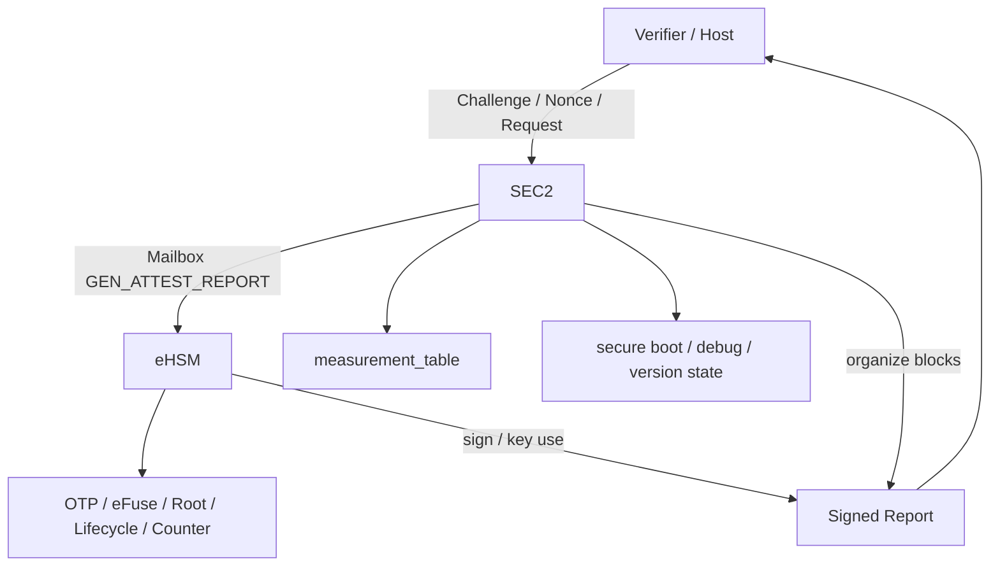
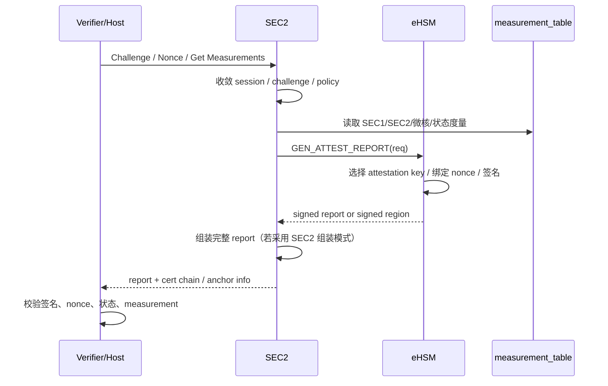

# 8. 设备身份与远程度量证明设计

> 文档定位：NGU800 / NGU800P 章节级正式详设  
> 章节文件：`security_workflow/03_detailed_design/03_attestation.md`  
> 当前状态：V1.0（基于当前约束、baseline、实现级接口与现有方案资料收敛）  
> 设计标记口径：`[CONFIRMED] / [ASSUMED] / [TBD]`

---

## 8.1 本章目标

本章定义 NGU800 的设备身份、远程度量证明与 SPDM 相关报告设计，明确：

1. 设备身份根、证明私钥与签名职责归属
2. 认证主体（SEC2 / eHSM）的职责分工
3. measurement_table 的拥有者、生成者和维护路径
4. 报告头、度量块、状态块、证书链块、签名块的章节级结构
5. nonce / session / challenge 的绑定关系
6. Verifier 的最小校验流程
7. 与实现层文件的映射关系：
   - `04_impl_design/spdm_report.md`
   - `04_impl_design/mailbox_if.md`
   - `04_impl_design/efuse_key_fw_header_design.md`
   - `04_impl_design/manufacturing_provisioning.md`

---

## 8.2 生效约束 ID

- `C-ROOT-01`
- `C-KEY-01`
- `C-KEY-02`
- `C-ATT-01`
- `C-DEBUG-02`
- `C-BOOT-01`
- `C-UPDATE-01`
- `C-HOST-01`
- `C-IF-01`
- `C-MFG-01`

---

## 8.3 生效 Baseline 决策

### 8.3.1 身份与签名边界
- `[CONFIRMED]` 设备证明私钥不得离开 eHSM
- `[CONFIRMED]` eHSM 是最终签名执行主体
- `[CONFIRMED]` Host 只接收 report，不接触证明私钥

### 8.3.2 控制面与服务面
- `[CONFIRMED]` SEC2 是设备认证统一执行体，对外作为认证/证明控制面
- `[CONFIRMED]` SEC2 负责汇总 measurement_table、管理状态并对外响应 SPDM 相关请求
- `[CONFIRMED]` eHSM 负责签名能力和必要的密钥操作

### 8.3.3 证明内容
- `[CONFIRMED]` report 必须覆盖从安全启动到运行态最关键的可信对象
- `[CONFIRMED]` report 至少包含：report header、measurement 集合、cert chain、signature block
- `[CONFIRMED]` measurement 至少应覆盖 BootROM/immutable identity、SEC 固件、其他微核固件、安全状态和平台标识

---

## 8.4 设计要求

### 8.4.1 本章必须回答的问题

1. 设备证明“谁来组织、谁来签名”？
2. measurement_table 由谁维护、何时更新？
3. challenge / nonce / session 如何绑定到报告？
4. 报告里哪些字段必须被签名覆盖？
5. 证书链首版采用什么模式？
6. lifecycle / debug / secure boot / anti-rollback 是否必须进入报告？
7. Verifier 至少应做哪些校验？
8. 国密 / 国际算法如何在 report 中共存？

### 8.4.2 不得违反的边界

- Host 不得持有设备证明私钥
- 不能只返回“签名结果”而不返回签名所覆盖的可信状态
- 不能只覆盖 firmware hash 而忽略 lifecycle / debug / challenge 绑定
- 不能把调试授权成功等价成“设备可信”
- 不能把非安全启动态的设备伪装成量产可信态

---

## 8.5 认证架构

### 8.5.1 当前项目裁决

当前项目推荐口径为：

> **SEC2 作为设备认证的统一执行体，eHSM 作为签名与密钥服务提供者。**

含义如下：

- SEC2 负责：
  - 验证后续微核固件
  - 更新 measurement_table
  - 维护对外认证状态
  - 响应 SPDM 证书、Challenge、Measurements 请求
  - 组装完整证明报告的数据对象
- eHSM 负责：
  - challenge 相关安全服务
  - attestation key 使用
  - 签名计算
  - 必要的 key / cert / lifecycle / counter 状态支撑

### 8.5.2 角色分工表

| 角色 | 职责 | 不允许做的事 |
|---|---|---|
| Host / Verifier | 发起 challenge / nonce / session；接收并验证报告 | 直接接触证明私钥 |
| SEC2 | 认证控制面；汇总度量；组织 report；对外响应 | 私自伪造签名 |
| eHSM | 最终签名、key 使用、挑战生成、状态支持 | 接受非 SEC 的不受控证明请求 |
| OTP / eFuse | 提供设备根、lifecycle、counter、平台标识基础信息 | 被 Host 直接读取敏感根材料 |

---

## 8.6 架构图



### 图下说明

1. SEC2 是认证控制面，对外可表现为 SPDM Responder。  
2. eHSM 是签名和密钥使用的执行面。  
3. measurement_table 由启动链各阶段产生，最终由 SEC2 汇总维护并对外输出。  
4. OTP/eFuse 提供 device identity seed、lifecycle、counter、chip/platform 标识等基础状态。  

---

## 8.7 时序图



### 图下说明

1. report 的“数据组织”和“最终签名”可以分工，但私钥使用必须在 eHSM 内部。  
2. 证明价值在于“签名覆盖的度量对象”，而不是单纯返回一个签名本身。  
3. challenge / nonce 必须绑定到本次 report，防止重放。  

---

## 8.8 身份与证书模型

### 8.8.1 身份对象

| 对象 | 内容 | 生成/维护位置 | 使用位置 |
|---|---|---|---|
| Device UID | 设备唯一标识 | OTP/eFuse | eHSM / 报告 |
| Device Identity | UID + product info + lifecycle | SEC2 组装 | Host / Verifier |
| Device Identity Key | 设备证明私钥 | eHSM | 签名 report |
| Attestation Cert | 设备证明证书 | 制造/灌装阶段 | 报告 / Verifier |
| Debug Auth Cert | 调试授权证书 | 制造/售后流程 | eHSM / 调试鉴权 |

### 8.8.2 当前项目建议

- `[CONFIRMED]` 首版可以 Device Identity Key 为主，不强制首版启用 Alias Key
- `[ASSUMED]` 预留 Alias / Session-bound key 扩展位
- `[CONFIRMED]` Attestation Cert 与 Debug Auth Cert 应在语义上区分，不应简单混用

### 8.8.3 证书模型建议

首版优先支持两种模式：

#### 模式 A：Hash Anchor + 可选 Chain
- OTP/eFuse 中固化 attestation root hash / signer hash
- 报告中带 signer/anchor 标识
- 如需要，可附带 cert chain blob

#### 模式 B：Full Chain
- 报告中直接携带完整证书链
- verifier 侧直接做整链校验

当前建议：
- `[CONFIRMED]` 结构上必须支持 cert chain block
- `[ASSUMED]` 首版可采用“Hash Anchor + 可选 Chain Blob”作为最小可行方案
- `[TBD]` 是否强制报告内嵌完整 cert chain 需结合客户接入模式冻结

---

## 8.9 度量原则

### 8.9.1 核心原则

设备远程认证的价值不在于返回一个签名本身，而在于签名所覆盖的**实际可信对象集合**。

因此报告必须能够让验证方判断：

- 设备是谁
- 当前运行的关键固件是什么
- 当前 lifecycle / debug / secure boot / anti-rollback 状态是什么
- 当前状态是否符合预期策略

### 8.9.2 度量生成责任

- BootROM 阶段：记录 immutable identity / ROM version 等早期信息
- SEC1 装载阶段：记录 SEC 固件早期版本 / 测量信息
- SEC2 运行阶段：统一汇总并维护 measurement_table
- eHSM：提供签名、密钥、counter、lifecycle 等支持

### 8.9.3 当前裁决

- `[CONFIRMED]` measurement_table 的拥有者和统一维护者是 SEC2
- `[CONFIRMED]` BootROM / SEC1 / SEC2 / 后续微核验证路径产生的度量最终进入统一 measurement_table
- `[ASSUMED]` 首版 measurement_table 可由 SEC2 维护在受控内存中，并在 attestation 时组织输出

---

## 8.10 度量内容

### 8.10.1 建议至少覆盖的对象

| Measurement | Producer | Signed | Notes |
|---|---|---|---|
| BootROM version / immutable identity | BootROM | Yes | 启动阶段写入指定安全内存 |
| SEC FW hash / version / rollback | BootROM + SEC2 | Yes | SEC1/SEC2 验证时记录 |
| Aux FW hash / version / rollback | SEC2 | Yes | PM / RAS / Codec 等 |
| lifecycle / debug / secure_boot / anti_rollback | SEC2 + eHSM | Yes | 统一维护状态 |
| chip_id / device_uuid / die info | eHSM + SEC2 | Yes | 平台实例身份 |
| board binding state（若启用） | SEC2 + eHSM | Yes | 可选 |

### 8.10.2 当前项目推荐 measurement 集合

1. BootROM / immutable identity  
2. SEC1  
3. SEC2  
4. PM / RAS / Codec 微核集合  
5. lifecycle state  
6. debug state  
7. secure boot enable  
8. anti-rollback enable  
9. chip_id / device_uuid  
10. board binding / die binding（如启用）

---

## 8.11 报告内容与格式

### 8.11.1 报告逻辑布局

```text
Report Header
+ Identity Block
+ Nonce / Session Binding Block
+ Measurement Block(s)
+ Lifecycle / Debug Block
+ Firmware Version Block
+ Cert Chain Block
+ Signature Block
```

### 8.11.2 当前项目要求

- `[CONFIRMED]` report 至少包含：
  - report header
  - measurement 集合
  - cert chain / anchor 信息
  - signature block
- `[CONFIRMED]` lifecycle/debug/secure_boot/anti_rollback 状态必须可导出
- `[CONFIRMED]` nonce / challenge 必须绑定
- `[ASSUMED]` session_id / transcript_hash 在 SPDM 会话场景下建议绑定

---

## 8.12 报告头结构

### 8.12.1 章节级推荐结构

```c
typedef struct {
    uint32_t magic;
    uint32_t header_len;
    uint32_t total_len;
    uint8_t  report_uuid[16];
    uint8_t  device_uuid[16];
    uint8_t  requester_nonce[32];
    uint32_t lifecycle_state;
    uint32_t debug_state;
    uint32_t session_id;
    uint32_t hash_algo;
    uint32_t sig_algo;
    uint32_t cert_format;
    uint32_t block_count;
    uint32_t signed_region_offset;
    uint32_t signed_region_len;
} ngu_attest_report_header_t;
```

### 8.12.2 字段说明

| 字段 | 说明 |
|---|---|
| `magic` | 固定魔数，便于解析 |
| `header_len` | 报告头长度 |
| `total_len` | 整体报告长度 |
| `report_uuid` | 本次报告唯一标识 |
| `device_uuid` | 设备实例标识 |
| `requester_nonce` | challenge / nonce |
| `lifecycle_state` | 当前生命周期 |
| `debug_state` | 当前 debug 状态 |
| `session_id` | 会话绑定信息 |
| `hash_algo / sig_algo` | 算法表达 |
| `cert_format` | cert chain/anchor 表达方式 |
| `block_count` | block 数量 |
| `signed_region_offset/len` | 签名覆盖区域 |

### 8.12.3 当前裁决

- `[CONFIRMED]` `requester_nonce` 必须进入签名覆盖范围
- `[CONFIRMED]` lifecycle_state / debug_state 不得只在外部上下文中推测，必须显式进入报告
- `[ASSUMED]` `report_uuid` 用于审计与缓存去重，首版建议保留

---

## 8.13 度量结构

### 8.13.1 Measurement Block Header

```c
typedef struct {
    uint16_t block_type;
    uint16_t block_version;
    uint32_t block_len;
    uint32_t flags;
    uint32_t reserved0;
} ngu_measurement_block_header_t;
```

### 8.13.2 固件度量信息结构

```c
typedef struct {
    uint32_t fw_type;
    uint8_t  hash[32];
    uint32_t fw_version;
    uint32_t rollback_counter;
    uint32_t reserved0;
} ngu_meas_fw_info_t;
```

### 8.13.3 状态度量结构

```c
typedef struct {
    uint32_t lifecycle_state;
    uint32_t debug_state;
    uint32_t secure_boot_enable;
    uint32_t anti_rollback_enable;
    uint8_t  chip_id[16];
    uint32_t reserved0;
} ngu_meas_state_t;
```

### 8.13.4 当前建议

- `[CONFIRMED]` firmware hash、version、rollback counter 应成组表达
- `[CONFIRMED]` lifecycle/debug/secure_boot/anti_rollback 状态应成组表达
- `[ASSUMED]` digest 长度可按 `algo_family/hash_algo` 扩展到 32B / 48B

---

## 8.14 度量集合

### 8.14.1 推荐 slot/组件集合

| Slot / Component | 是否首版必须 | 说明 |
|---|---|---|
| SEC1 | 是 | 启动链关键项 |
| SEC2 | 是 | 认证控制面自身 |
| PM 微核 | 建议 | 运行态关键微核 |
| RAS 微核 | 建议 | 运行态关键微核 |
| Codec 微核 | 建议 | 运行态关键微核 |
| lifecycle state | 是 | 量产可信判断必要 |
| debug policy bitmap / state | 是 | 调试状态可信判断必要 |
| board policy / binding digest | 可选 | 板级策略/绑定 |

### 8.14.2 当前裁决

- `[CONFIRMED]` SEC1 / SEC2 / lifecycle / debug / secure_boot / anti_rollback 是首版必须覆盖的核心度量项
- `[ASSUMED]` PM / RAS / Codec 首版建议纳入，如产品分阶段实现可在 verifier 策略中区分强制项与可选项
- `[TBD]` board binding 是否首版默认开启需与板级安全策略一起冻结

---

## 8.15 签名覆盖范围

### 8.15.1 必须签名覆盖的内容

- report header
- identity block
- challenge / nonce / session 绑定信息
- measurement block 集合
- lifecycle / debug / secure_boot / anti_rollback 状态
- firmware version / rollback 信息
- cert chain metadata（若存在）

### 8.15.2 不允许的实现

- 只对 measurement digest 做签名
- 把 lifecycle/debug 状态放在签名区之外
- verifier 通过“外部上下文猜测” challenge 绑定关系
- 由 Host 侧重新拼装后再要求 verifier 验签

### 8.15.3 当前裁决

- `[CONFIRMED]` nonce/challenge 绑定是必须项
- `[CONFIRMED]` 报告不能只证明“跑的是什么”，还必须证明“当前状态是什么”
- `[ASSUMED]` session / transcript hash 在 SPDM session 模式下建议纳入签名覆盖

---

## 8.16 双算法报告映射

### 8.16.1 国密路径

| 用途 | 建议算法 |
|---|---|
| Hash | SM3 |
| Signature | SM2 |
| Cert Key | SM2 |

### 8.16.2 国际路径

| 用途 | 建议算法 |
|---|---|
| Hash | SHA-256 / SHA-384 |
| Signature | ECDSA-P256 / P-384 / RSA-3072 |
| Cert Key | P-256 / P-384 / RSA |

### 8.16.3 结构层要求

报告结构中必须显式表达：
- `algo_family`
- `hash_algo`
- `sig_algo`
- `cert_format`

### 8.16.4 当前裁决

- `[CONFIRMED]` verifier 逻辑不得把算法栈写死为单一实现
- `[CONFIRMED]` report 结构必须对国密/国际算法共存友好
- `[ASSUMED]` 首版产品可只启用一种主路径，但字段不能缺失

---

## 8.17 Verifier 最小校验步骤

Verifier 至少必须执行：

1. 检查 `report_version / magic / total_len`
2. 检查 `algo_family / hash_algo / sig_algo / cert_format`
3. 提取并匹配 cert chain / anchor
4. 检查 signer 身份是否可信
5. 检查 `requester_nonce` 是否与 challenge 一致
6. 若存在 session_id / transcript 绑定，检查是否一致
7. 校验签名
8. 检查 measurement 集合是否满足策略
9. 检查 lifecycle / debug / secure_boot / anti_rollback 状态是否满足预期
10. 检查 firmware version / rollback counter 是否不低于策略门限
11. 若启用 board/die binding，检查 binding 是否匹配

### 8.17.1 当前裁决

- `[CONFIRMED]` verifier 不能只做“签名对不对”的校验
- `[CONFIRMED]` verifier 必须同时校验状态和策略
- `[ASSUMED]` 首版 verifier 可按产品线策略区分“必须项”和“建议项”

---

## 8.18 与实现层的映射关系

| 本章主题 | 对应实现层文件 |
|---|---|
| report 字段级结构 / binding / measurement / signature | `04_impl_design/spdm_report.md` |
| attestation mailbox 命令 / challenge / report 获取接口 | `04_impl_design/mailbox_if.md` |
| attestation key / anchor / identity seed 上游对象 | `04_impl_design/efuse_key_fw_header_design.md` |
| manufacturing / cert / anchor / lifecycle 冻结关系 | `04_impl_design/manufacturing_provisioning.md` |

---

## 8.19 冻结敏感项

| Item | Why Sensitive | Current Status | Needed Before Freeze |
|---|---|---|---|
| Device Identity vs Alias Key 首版策略 | 影响 report / cert / verifier 复杂度 | 部分收敛 | 冻结首版 key model |
| cert chain 内嵌策略 | 影响 report 大小与 verifier 部署方式 | 未完全冻结 | 冻结首版 cert 模式 |
| measurement 必选集合 | 影响安全策略与兼容性 | 部分收敛 | 冻结首版最小 measurement set |
| session/transcript 绑定粒度 | 影响 SPDM 集成深度 | 未完全冻结 | 冻结首版 binding 模式 |
| board/die binding 是否默认启用 | 影响板级/多Die 产品 | 未完全冻结 | 与板级安全策略联动冻结 |

---

## 8.20 开放问题

1. 首版是否仅 Device Identity Key 签名即可满足客户接入，还是必须同步规划 Alias Key？  
2. report 是否必须默认内嵌完整 cert chain？  
3. measurement_table 最终是否全部由 SEC2 自维护，还是部分由 eHSM 动态拉取？  
4. 双Die 场景是单 report 汇总还是主/从 Die 分别证明？  
5. debug 授权状态是否需要带时间窗口/过期信息进入 report？  

---

## 8.21 本章结论

本章已将 NGU800 的设备身份与远程度量证明设计收敛到当前可评审的正式口径：

- SEC2 是认证控制面，eHSM 是签名与密钥执行面  
- 设备证明私钥不得离开 eHSM  
- measurement_table 由启动链产生、由 SEC2 汇总维护  
- 报告必须覆盖身份、挑战绑定、关键固件度量、lifecycle/debug/secure_boot/anti_rollback 状态  
- Verifier 必须同时校验签名、状态和策略，而不是只校验签名  
- 国密与国际算法必须在报告结构层共存  

后续若 `spdm_report.md`、`mailbox_if.md`、`manufacturing_provisioning.md` 或 key/cert 基线字段冻结有变化，本章必须同步更新。
