# NGU800 安全方案详细设计说明书（整合版 V2.4）

版本：V2.4
状态：CR-0001 applied，待 GPT / 人工复核
生成日期：2026-04-27

> 本文件为章节级详设整合版。源章节仍是事实源；本文件按 CR-0001 统一章节顺序、标题编号、SEC1 加密口径和板级安全并入状态。

## 文档目录

- [1. 设计基线摘要](#1-设计基线摘要)
- [2. 安全总体架构](#2-安全总体架构)
- [3. 安全启动详细设计](#3-安全启动详细设计)
- [4. 设备身份与远程度量证明设计](#4-设备身份与远程度量证明设计)
- [5. 安全调试与生命周期控制](#5-安全调试与生命周期控制)
- [6. 内外部接口设计](#6-内外部接口设计)
- [7. 板级安全设计](#7-板级安全设计)
- [8. Root of Trust、密钥体系与证书体系](#8-root-of-trust密钥体系与证书体系)
- [9. 制造、灌装、部署与 RMA](#9-制造灌装部署与-rma)
- [10. 风险、依赖、冻结项与开放问题](#10-风险依赖冻结项与开放问题)
- [11. 附录](#11-附录)

---

# 1. 设计基线摘要


版本：v2.2  
状态：评审版（可用于架构评审 / 方案冻结前阶段）

---

## 1.1 设计目标

本 Baseline 定义 NGU800 安全架构的核心裁决，包括：

- Root of Trust 定义
- Secure Boot 架构
- Host 与安全边界
- 密钥体系与生命周期
- 制造与密钥灌入流程
- 双算法支持策略

---

## 1.2 Baseline Summary

| Topic | Current Decision | Status |
|---|---|---|
| Root of Trust | eHSM | CONFIRMED |
| First Mutable Stage | SEC1 | CONFIRMED |
| First Cryptographic Verifier | eHSM | CONFIRMED |
| SEC1 Protection Policy | SEC1 来源为 NOR / 本地 Flash，正式安全启动路径必须签名 + 加密，验证与解密服务由 eHSM / 安全子系统提供 | CONFIRMED |
| BootROM Role | 负责最小加载与编排，不负责复杂密码学校验 | CONFIRMED |
| SEC Role | 启动控制面与 release owner | CONFIRMED |
| Host Trust Model | 不可信，只投递 SEC2 及后续镜像 / 受保护包，不下发 SEC1 | CONFIRMED |
| Board / OOB Trust Model | BMC / OOB / 管理子系统可承载管理流程，但不进入 Root of Trust | CONFIRMED |
| Manufacturing Baseline | 必须定义 key 注入、锁定、审计、生命周期推进 | CONFIRMED |

---

## 1.3 架构核心裁决

### 1.3.1 Root of Trust

- Root Key 存储于 eFuse / OTP 安全区
- Root of Trust 由 eHSM 提供
- BootROM 不持有私钥

结论：
**eHSM = 唯一 Root of Trust**

---

### 1.3.2 First Verifier

- 所有签名验证由 eHSM 执行
- BootROM 不执行复杂验签
- 软件不得实现正式安全路径验签

---

### 1.3.3 Boot 控制权

- SEC 核（C908）为唯一 Boot 控制器
- 所有 MCU release 必须由 SEC 控制
- Host 不参与控制流程

---

## 1.4 Adopted vs Rejected Decisions

| Topic | Adopted | Rejected | Reason |
|---|---|---|---|
| First verifier | eHSM | BootROM / Host | 与 eHSM 能力边界和当前安全基线一致 |
| Host role | 仅投递 firmware | Host 参与执行放行 | Host 不可信 |
| BootROM crypto | 不做复杂校验 | BootROM 内嵌完整 crypto 验签路径 | 缩小攻击面，复用 eHSM |
| Key ownership | 私钥不出 eHSM | 私钥落在 Host / 管理核 | 不满足安全边界 |
| Workflow | constraints → baseline → detailed → impl | raw inputs 直接生成 full design | 防止方案漂移 |

---

## 1.5 Secure Boot 架构

### 1.5.1 Boot Chain

BootROM → SEC1（NOR / 本地）→ SEC2（Host 下发）→ 子系统 FW

### 1.5.2 关键约束

- 所有 FW 必须验签
- SEC1 必须签名 + 加密；SEC1 验证、解密和 key unwrap 必须由 eHSM / 安全子系统受控密码服务完成
- BootROM 只负责定位 SEC1、调用受控接口、根据结果装载或拒绝启动，不直接实现复杂解密
- Host 不下发 SEC1；Host 只投递 SEC2 及后续镜像 / 受保护包
- SEC2、PM、RAS、Codec 等后续关键固件在 USER/PROD 产品形态中默认建议签名 + 加密；若采用签名 only，必须由产品安全策略显式允许并在 lifecycle / attestation / debug 状态中可见
- 未验签禁止执行
- 支持 Anti-rollback（OTP counter / monotonic counter）
- FW Encrypt Branch 至少对 SEC1 强制启用；FW_KEK / CEK / wrapped key 策略进入实现级设计

---

## 1.6 Host 边界

### 1.6.1 允许行为
- 传输 SEC2 及后续固件 / 受保护镜像包
- 发起请求
- 接收状态 / 失败报告

### 1.6.2 禁止行为
- 下发或替换 SEC1
- 参与信任链
- 控制启动
- 访问密钥
- 直接访问安全域
- 直接 release 其他 MCU

---

## 1.7 Board / OOB / 管理子系统边界

### 1.7.1 输入采用策略

`SRC-005` 管理子系统方案中的总体架构、模块职责、带外管理链路、电源/复位流程、单/双 Die 约束作为系统级流程输入采用。

涉及安全的部分采用以下裁决：

- BMC / OOB / 板级 MCU / 管理子系统不进入 Root of Trust。
- SMBus/I2C、I3C、PCIe VDM、SPI、UART、JTAG 只能作为受控管理或转发通道。
- JTAG、DMA、Flash 更新、电源复位、PowerBrake 等高权限能力必须经 lifecycle、debug auth、firewall、scope 和审计约束。
- 管理子系统文档中若出现未鉴权调试、直接访问安全子系统、直接访问 DRAM/Flash/寄存器空间或绕过 SEC/eHSM 的流程，不作为安全 baseline 采用。

### 1.7.2 Adopted vs Rejected

| Topic | Adopted | Rejected | Reason |
|---|---|---|---|
| 管理子系统总体架构 | 采用 `SRC-005` 的模块、链路和流程作为系统输入 | 忽略管理子系统集成 | 需要与板级、电源、复位、OOB 流程对齐 |
| OOB trust level | BMC/OOB/Sideband 不高于 Host | 将 BMC/OOB 默认视为可信根 | OOB 链路权限高且暴露面大，不能天然可信 |
| JTAG access | lifecycle + debug auth + scope + MUX 联合控制 | USER 态常开或板级 MUX 直通 | 防止绕过 secure boot、密钥和运行态隔离 |
| Management DMA | 仅访问普通白名单 buffer | 访问安全区、执行区、OTP/eHSM 私有区 | DMA 可绕过软件边界，必须硬隔离 |
| Power/reset control | 纳入安全状态机和审计 | 作为纯板级普通控制 | 复位/掉电会影响安全启动、恢复和 attestation 状态 |

---

## 1.8 eHSM 职责

- Root Key / Root Secret 使用
- 验签
- 加解密
- 密钥管理
- 生命周期控制
- 调试鉴权
- Counter / anti-rollback
- Attestation key 使用

---

## 1.9 Manufacturing / Provisioning Baseline

| Topic | Decision | Open Issue |
|---|---|---|
| Root Key 注入 | 通过制造安全通道灌入 OTP/eFuse | 工站对接细节待定 |
| Root Key 锁定 | MANU → USER 前必须锁定 | 读回校验策略待定 |
| 测试 Key 清理 | USER 前必须清理 | 测试证书链清理动作待定 |
| 审计日志 | 制造阶段必须记录 | 日志落点待定 |

---

## 1.10 双算法策略

- 方案必须同时支持国密和国际算法栈
- 实现层不得把算法写死到单一栈
- Header / report / key hierarchy 中必须保留：
  - algo_family
  - hash_algo
  - sig_algo
  - enc_algo

---

## 1.11 Freeze Sensitive Items

| Item | Why Sensitive | Needed Before Freeze |
|---|---|---|
| eFuse bit 分配 | 直接影响 RTL / 制造灌装 | 需要字段级规划 |
| FW Header 字段 | 直接影响 BootROM / SEC / Host 对接 | 需要结构级冻结 |
| Mailbox command model | 直接影响 FW / driver / eHSM API 对接 | 需要 req/resp 结构 |
| SPDM report fields | 直接影响 attestation 联调 | 需要字段定义 |
| board binding 策略 | 影响量产兼容性 | 需要策略裁决 |
| JTAG / OOB scope 控制 | 影响 USER 态调试暴露面 | 需要冻结 debug scope bitmap、MUX/CPLD 控制权和授权流程 |
| 管理子系统 DMA / mailbox / reset | 影响安全边界和状态一致性 | 需要冻结 firewall 白名单、可访问 buffer 和审计字段 |

---

## 1.12 Mermaid Architecture Diagram

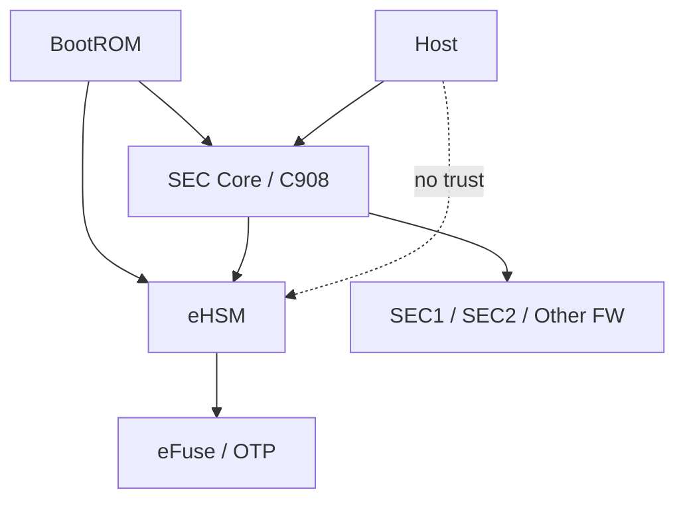
```mermaid
graph TD
    BR[BootROM] --> SEC[SEC Core / C908]
    BR --> EH[eHSM]
    EH --> OTP[eFuse / OTP]
    SEC --> EH
    SEC --> FW[SEC1 / SEC2 / Other FW]
    Host --> SEC
    Host -. no trust .-> EH
```

---

## 1.13 Mermaid Sequence Diagram

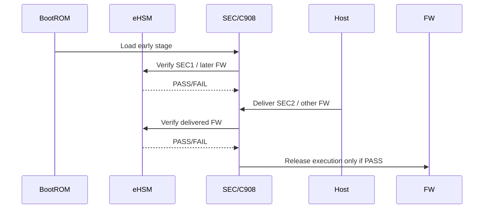
```mermaid
sequenceDiagram
    participant BR as BootROM
    participant EH as eHSM
    participant SEC as SEC/C908
    participant H as Host

    BR->>SEC: Load early stage
    SEC->>EH: Verify SEC1 / later FW
    EH-->>SEC: PASS/FAIL
    H->>SEC: Deliver SEC2 / other FW
    SEC->>EH: Verify delivered FW
    EH-->>SEC: PASS/FAIL
    SEC->>FW: Release execution only if PASS
```

---

## 1.14 当前基线是否可进入详细设计

结论：
- 可以进入章节级详细设计
- 但不能跳过实现级设计直接进入代码开发

限制条件：
- eFuse / key / header / mailbox / SPDM 仍需在 `04_impl_design/` 中冻结
- manufacturing / provisioning 仍需细化到流程级
# 2. 安全总体架构

## 2.1 总体裁决

本章保留 Root of Trust 和系统信任边界的前置结论，详细密钥体系与证书体系后移到第 8 章统一展开。

- `[CONFIRMED]` eHSM 是唯一 Root of Trust 和首个密码学验证主体。
- `[CONFIRMED]` BootROM 是最早启动编排者，但不是密码学根，不持有 Root Private Key，不实现复杂验签或复杂解密。
- `[CONFIRMED]` SEC/C908 是安全启动、镜像接收、接口收敛、证明、debug/RMA、制造流程的统一控制面。
- `[CONFIRMED]` Host 不可信，只投递 SEC2 及后续镜像 / 受保护包，不下发 SEC1，不进入信任链，不拥有 release 权。
- `[CONFIRMED]` BMC / OOB / Sideband / 管理子系统可承载管理流程，但信任级别不高于 Host，不进入 Root of Trust。
- `[CONFIRMED]` SEC1 来源为 NOR Flash / 本地 Flash，在正式安全启动路径中必须签名 + 加密。

## 2.2 总体架构图

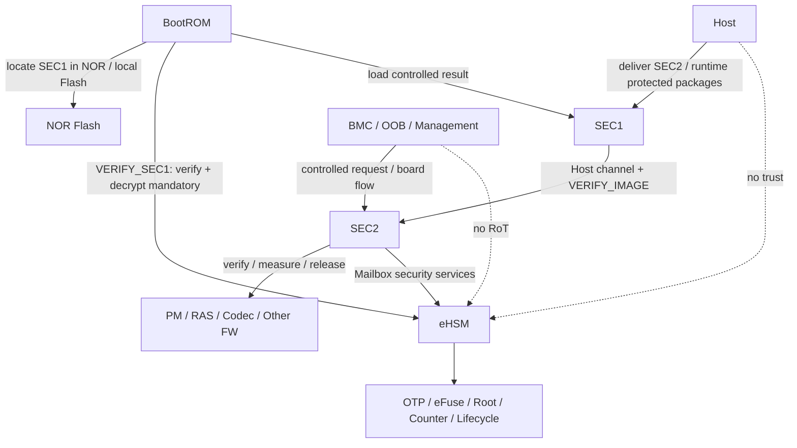
```mermaid
graph TD
    BR[BootROM] -->|locate SEC1 in NOR / local Flash| FLASH[NOR Flash]
    BR -->|VERIFY_SEC1: verify + decrypt mandatory| EH[eHSM]
    EH --> OTP[OTP / eFuse / Root / Counter / Lifecycle]
    BR -->|load controlled result| SEC1[SEC1]
    SEC1 -->|Host channel + VERIFY_IMAGE| SEC2[SEC2]
    Host[Host] -->|deliver SEC2 / runtime protected packages| SEC1
    SEC2 -->|verify / measure / release| FW[PM / RAS / Codec / Other FW]
    SEC2 -->|Mailbox security services| EH
    BMC[BMC / OOB / Management] -->|controlled request / board flow| SEC2
    BMC -. no RoT .-> EH
    Host -. no trust .-> EH
```

### 图下说明

1. SEC1 是 First Mutable Stage，来自 NOR Flash / 本地 Flash，不由 Host 下发。
2. BootROM 只做最小初始化、定位 SEC1、调用 eHSM 受控接口、根据结果装载或拒绝启动。
3. eHSM 完成 SEC1 的验签、解密 / unwrap、rollback、吊销和 measurement 相关安全服务。
4. SEC2 是后续运行期安全控制面，负责 Host/OOB 请求收敛、后续固件验证、证明、debug/RMA 和制造流程编排。
5. Host、BMC、OOB、管理子系统都不是信任根，不能直接访问 eHSM、OTP/eFuse、Secure SRAM 或 release 目标核。

## 2.3 关键安全路径

| 安全路径 | 控制面 | 执行面 | 外部角色 | 当前裁决 |
|---|---|---|---|---|
| SEC1 启动 | BootROM 最小编排 | eHSM | Host 不参与 | SEC1 必须签名 + 加密 |
| SEC2 / Runtime FW | SEC1 / SEC2 | eHSM | Host 仅投递 | USER/PROD 默认建议签名 + 加密，签名 only 需策略允许 |
| Attestation | SEC2 | eHSM | Verifier / Host 只验证 report | report 必须覆盖 measurement 和安全状态 |
| Debug / RMA | SEC2 | eHSM | BMC/OOB/工具只发起受控请求 | USER/PROD 默认关闭，需 challenge-response、scope、expire、audit |
| Board / OOB | SEC2 | eHSM / firewall / audit | BMC/OOB/管理子系统 | 总体流程可遵循，安全边界由安全方案裁决 |
| Manufacturing | SEC2 | eHSM / OTP/eFuse | 工站/Host/BMC 是链路 | MANU -> USER 必须灌装、锁定、清理、审计 |
---
# 3. 安全启动详细设计


> 文档定位：NGU800 / NGU800P 章节级正式详设  
> 章节文件：`security_workflow/03_detailed_design/01_boot.md`  
> 当前状态：V1.0（基于当前约束、baseline 与输入资料收敛）  
> 设计标记口径：`[CONFIRMED] / [ASSUMED] / [TBD]`

---

## 3.1 本章目标

本章定义 NGU800 在**安全启动模式**下的完整启动链设计，明确：

1. SoC BootROM、SEC1、SEC2、eHSM、Host 的职责边界
2. 安全启动与非安全启动的选择条件
3. SEC1 / SEC2 / 后续微核固件的验证与执行放行规则
4. 反回滚、吊销、SEC1 强制解密、后续镜像按策略解密、失败处理与恢复入口
5. 与实现层文件的映射关系：
   - `04_impl_design/efuse_key_fw_header_design.md`
   - `04_impl_design/mailbox_if.md`
   - `04_impl_design/spdm_report.md`
   - `04_impl_design/manufacturing_provisioning.md`

---

## 3.2 生效约束 ID

- `C-ROOT-01`
- `C-BOOT-01`
- `C-BOOT-02`
- `C-BOOT-03`
- `C-BOOT-04`
- `C-IF-01`
- `C-HOST-01`
- `C-ACCESS-01`
- `C-ACCESS-02`
- `C-UPDATE-01`
- `C-UPDATE-02`
- `C-ATT-01`
- `C-MFG-01`

---

## 3.3 生效 Baseline 决策

### 3.3.1 Root 与验证主体
- `[CONFIRMED]` Root of Trust = eHSM
- `[CONFIRMED]` First Cryptographic Verifier = eHSM
- `[CONFIRMED]` BootROM 不承担复杂密码学校验和密钥管理

### 3.3.2 启动控制权
- `[CONFIRMED]` SEC/C908 是唯一 boot control plane
- `[CONFIRMED]` Host 只具备镜像投递能力，不具备执行放行权
- `[CONFIRMED]` 所有微核 release 必须由 SEC 控制

### 3.3.3 镜像来源
- `[CONFIRMED]` SEC1 从 NOR Flash / Flash 获取
- `[CONFIRMED]` SEC2 及后续 PM / RAS / Codec 等固件由 Host 通过 PCIe 下发
- `[CONFIRMED]` 非安全启动路径应保留，但量产态是否开启必须受 lifecycle + OTP 策略控制

---

## 3.4 术语与阶段定义

| 术语 | 含义 |
|---|---|
| BootROM | SoC 最早执行的不可变启动代码，负责最小初始化与启动编排 |
| eHSM | 安全服务根，负责验证、密钥、OTP、lifecycle、debug auth、counter 等 |
| SEC1 | 安全最小 bring-up 固件，负责基础初始化与 Host 通道建立 |
| SEC2 | 完整安全控制面固件，负责后续固件接收、验证、升级、认证与调试控制 |
| Staging Buffer | Host 投递镜像的受控缓冲区 |
| Release | 允许某个目标核/固件开始执行的最终放行动作 |

### 3.4.1 启动阶段划分

| 阶段 | 名称 | 主执行体 | 主要动作 |
|---|---|---|---|
| A | SoC BootROM 早期启动 | BootROM | 最小平台初始化、读取 strap / lifecycle / secure boot 配置 |
| B | eHSM 自启动 | eHSM | ROM / Bootloader / 自检 / 生命周期恢复 / 密钥材料恢复 |
| C | SEC1 验证 | BootROM + eHSM | 定位 SEC1、请求验证、做版本/吊销/签名检查 |
| D | SEC1 装载与启动 | BootROM | 装载 SEC1 并跳转执行 |
| E | SEC1 基础初始化 | SEC1 | PCIe 初始化、Host 通道建立、共享缓冲区准备 |
| F | SEC2 与后续镜像处理 | SEC1/SEC2 + eHSM | 验证 SEC2、后续固件验证、测量、release |

---

## 3.5 设计要求

### 3.5.1 必须满足的安全目标

- `[CONFIRMED]` SEC1 必须在执行前经 eHSM 验证
- `[CONFIRMED]` SEC1 在正式安全启动路径中必须采用签名 + 加密保护，执行前必须由 eHSM / 安全子系统受控密码服务完成解密 / unwrap
- `[CONFIRMED]` 后续固件必须经 SEC1/SEC2 调用 eHSM 验证
- `[CONFIRMED]` Host 下发固件在执行前必须受控
- `[CONFIRMED]` 支持版本检查、防回滚、吊销
- `[CONFIRMED]` 支持设备认证与度量导出
- `[CONFIRMED]` 支持安全升级与安全调试
- `[CONFIRMED]` SEC1 在正式安全启动路径中必须签名 + 加密；SEC2 及后续关键运行期固件在 USER/PROD 产品形态中默认建议签名 + 加密，若采用签名 only 必须由产品安全策略显式允许

### 3.5.2 不得违反的边界

- BootROM 不得直接承担 SEC1 的复杂密码学校验或复杂解密
- Host 不得直接 release SEC2 或后续微核
- 普通非安全 Master 不得直接访问 eHSM、OTP、Secure SRAM
- 未验签通过的镜像不得进入执行态
- rollback floor 不得只依赖镜像内软件字段

---

## 3.6 架构图

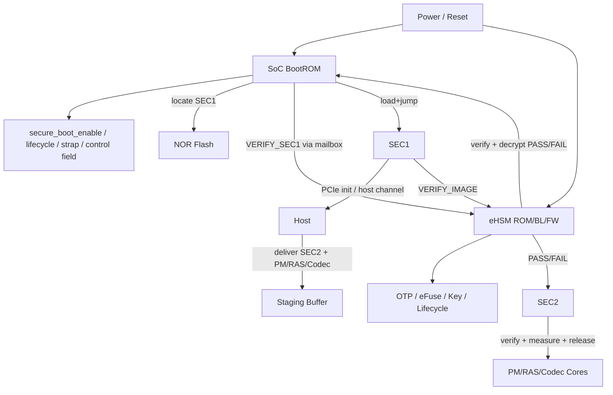
```mermaid
graph TD
    PR[Power / Reset] --> BR[SoC BootROM]
    PR --> EH[eHSM ROM/BL/FW]

    BR --> CFG[secure_boot_enable / lifecycle / strap / control field]
    EH --> OTP[OTP / eFuse / Key / Lifecycle]

    BR -->|locate SEC1| FLASH[NOR Flash]
    BR -->|VERIFY_SEC1 via mailbox| EH
    EH -->|verify + decrypt PASS/FAIL| BR

    BR -->|load+jump| SEC1[SEC1]
    SEC1 -->|PCIe init / host channel| HOST[Host]
    HOST -->|deliver SEC2 + PM/RAS/Codec| STAGE[Staging Buffer]
    SEC1 -->|VERIFY_IMAGE| EH
    EH -->|PASS/FAIL| SEC2[SEC2]
    SEC2 -->|verify + measure + release| OTHERS[PM/RAS/Codec Cores]
```

### 图下说明

1. BootROM 是启动编排者，不是首个密码学验证者。  
2. eHSM 在 SEC1 验证、SEC1 强制解密、后续镜像验证、反回滚、吊销检查中提供统一安全服务。  
3. Host 只把 SEC2 及后续镜像投递到受控缓冲区，不拥有执行放行权。  
4. SEC2 是后续运行期安全控制面，负责后续微核固件验证编排、度量汇总和放行。  

---

## 3.7 时序图

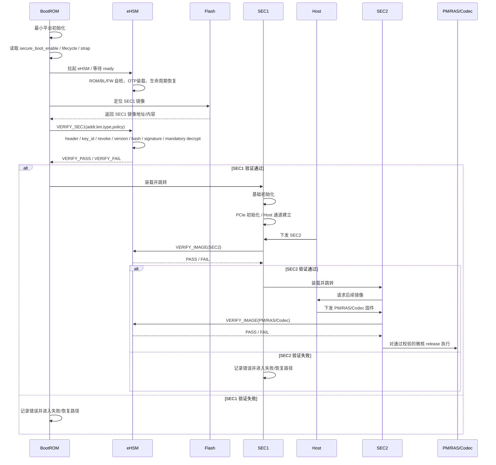
```mermaid
sequenceDiagram
    participant BR as BootROM
    participant EH as eHSM
    participant FL as Flash
    participant S1 as SEC1
    participant H as Host
    participant S2 as SEC2
    participant MC as PM/RAS/Codec

    BR->>BR: 最小平台初始化
    BR->>BR: 读取 secure_boot_enable / lifecycle / strap
    BR->>EH: 拉起 eHSM / 等待 ready
    EH->>EH: ROM/BL/FW 自检、OTP装载、生命周期恢复
    BR->>FL: 定位 SEC1 镜像
    FL-->>BR: 返回 SEC1 镜像地址/内容
    BR->>EH: VERIFY_SEC1(addr,len,type,policy)
    EH->>EH: header / key_id / revoke / version / hash / signature / mandatory decrypt
    EH-->>BR: VERIFY_PASS / VERIFY_FAIL
    alt SEC1 验证通过
        BR->>S1: 装载并跳转
        S1->>S1: 基础初始化
        S1->>S1: PCIe 初始化 / Host 通道建立
        H->>S1: 下发 SEC2
        S1->>EH: VERIFY_IMAGE(SEC2)
        EH-->>S1: PASS / FAIL
        alt SEC2 验证通过
            S1->>S2: 装载并跳转
            S2->>H: 请求后续镜像
            H->>S2: 下发 PM/RAS/Codec 固件
            S2->>EH: VERIFY_IMAGE(PM/RAS/Codec)
            EH-->>S2: PASS / FAIL
            S2->>MC: 对通过校验的微核 release 执行
        else SEC2 验证失败
            S1->>S1: 记录错误并进入失败/恢复路径
        end
    else SEC1 验证失败
        BR->>BR: 记录错误并进入失败/恢复路径
    end
```

### 图下说明

1. SEC1 的首次密码学校验和强制解密发生在 BootROM 调 eHSM 的路径上。  
2. 后续镜像验证责任转移到 SEC1/SEC2 调 eHSM 的路径。  
3. release 是一个独立动作，必须发生在 verify pass 之后。  
4. 任何验证失败都不能默默降级为“继续启动”，必须进入明确失败或恢复路径。  

---

## 3.8 启动模式矩阵

| 模式 | secure_boot_enable | lifecycle | eHSM 参与 | 镜像要求 | 适用场景 |
|---|---|---|---|---|---|
| 安全启动 | 1 | MANU / USER / DEBUG-RMA | 必须 | 关键镜像必须验证；支持版本/吊销/反回滚 | 正式量产 / 制造验证 / 受控返修 |
| 非安全启动 | 0 或策略允许 | TEST / DEVE 为主 | 可不参与首阶段镜像验证 | 可允许受控绕过 | 实验室 bring-up / 特定开发调试 |
| Rescue / Recovery | 策略控制 | DEBUG/RMA 为主 | 必须 | 必须用受控 recovery trust / 特定 signer | 故障恢复 / 返修 |

### 3.8.1 模式选择规则

- `[CONFIRMED]` BootROM 启动后首先读取 `secure_boot_enable / lifecycle / strap / control field`
- `[CONFIRMED]` 非安全路径应保留，但不应默认允许量产态启用
- `[ASSUMED]` USER 生命周期下，非安全启动应由 OTP/eFuse + 策略态关闭
- `[ASSUMED]` Recovery 模式只能通过受控 lifecycle 和授权流程进入

---

## 3.9 可信镜像分类

| 镜像类型 | 来源 | 谁发起验证 | 谁执行验证 | 谁决定执行放行 | 反回滚检查 |
|---|---|---|---|---|---|
| SEC1 | NOR Flash | BootROM | eHSM | BootROM 跳转至 SEC1 | 跳转前检查；签名 + 加密强制 |
| SEC2 | Host/PCIe | SEC1 | eHSM | SEC1 / SEC2 受控跳转 | 执行前检查 |
| PM | Host/PCIe | SEC2 | eHSM | SEC2 release | 放行前检查 |
| RAS | Host/PCIe | SEC2 | eHSM | SEC2 release | 放行前检查 |
| Codec | Host/PCIe | SEC2 | eHSM | SEC2 release | 放行前检查 |
| Recovery | 特殊路径 | SEC2 / Provisioning | eHSM | SEC2 / 受控状态机 | 受策略控制 |

### 3.9.1 当前建议

- `[CONFIRMED]` SEC1 的首次验证由 eHSM 完成
- `[CONFIRMED]` SEC1 必须签名 + 加密，解密由 eHSM / 安全子系统受控密码服务完成，解密失败必须阻止启动
- `[CONFIRMED]` SEC2 及后续镜像验证由 SEC1/SEC2 调 eHSM 完成
- `[CONFIRMED]` Host 不拥有执行放行权
- `[ASSUMED]` Recovery 镜像应使用专用 recovery trust anchor，并仅在受控 lifecycle 下允许

---

## 3.10 镜像格式建议

本章不重复完整 `FW Header` 详设，正式结构以：

- `04_impl_design/efuse_key_fw_header_design.md`

为准。安全启动对镜像头的最小要求如下：

### 3.10.1 必须进入 signed region 的字段

- `image_type`
- `image_version`
- `min_rollback_ver`
- `load_addr`
- `entry_point`
- `payload_len`
- `algo_family`
- `hash_algo`
- `sig_algo`
- `enc_algo`
- `lifecycle_mask`
- `board_bind_flags`
- `signer_key_hash`

### 3.10.2 不得只存在于 unsigned header 的字段

- `load_addr`
- `entry_point`
- `image_version`
- `algo_family`
- rollback / lifecycle / binding 相关字段

### 3.10.3 当前项目建议

- `[CONFIRMED]` Host 下发镜像必须先进入 staging buffer
- `[CONFIRMED]` Verify path 必须能处理：
  - header 解析
  - key_id / signer hash 检查
  - revoke bitmap 检查
  - version / rollback floor 检查
  - hash / signature 校验
  - 按 `image_type / policy` 执行解密，其中 SEC1 解密为强制要求
- `[CONFIRMED]` SEC1 在正式安全启动路径中必须签名 + 加密
- `[ASSUMED]` SEC2 及主要运行期固件在 USER/PROD 产品形态中默认建议“签名 + 加密”；若采用“签名 only”，必须由产品安全策略显式允许并在 lifecycle / attestation / debug 状态中可见

---

## 3.11 校验规则

### 3.11.1 SEC1 校验规则

BootROM 向 eHSM 发起 `VERIFY_SEC1` 请求时，eHSM 至少执行：

1. 镜像头解析
2. `key_id / signer key slot` 检查
3. `revoke bitmap` 检查
4. `version / min rollback` 检查
5. `signer pubkey hash` 校验
6. `signature` 校验
7. `payload hash` 校验
8. 强制解密 / unwrap，且解密必须由 eHSM / 安全子系统受控密码服务完成
9. 记录 measurement 与保护策略状态

SEC1 解密失败必须返回明确错误码并阻止启动，BootROM 不得降级为未解密镜像继续执行。

### 3.11.2 后续镜像校验规则

SEC1/SEC2 向 eHSM 发起 `VERIFY_IMAGE` 时，至少执行：

1. `image_type` 检查
2. `lifecycle_mask` 检查
3. `board_bind_flags` / Die binding 检查（如启用）
4. `signer_key_hash` / trust anchor 校验
5. `rollback floor` 检查
6. `payload hash / signature` 校验
7. 按 `image_type / policy` 执行解密；SEC2 及后续关键运行期固件在 USER/PROD 产品形态中默认建议签名 + 加密
8. 通过后才允许 release

### 3.11.3 失败处理规则

- `[CONFIRMED]` 任一关键镜像验证失败，必须返回明确 `error_code`
- `[CONFIRMED]` 失败后必须记录错误并进入失败或恢复路径
- `[ASSUMED]` USER 量产态下，不允许自动降级到非安全启动继续运行
- `[ASSUMED]` DEBUG/RMA 可在授权后进入受控 rescue path

---

## 3.12 Staging Buffer 与 Host 交互规则

### 3.12.1 Host 的允许动作

Host 允许：
- 通过 PCIe 下发 SEC2 / PM / RAS / Codec 等镜像
- 配置 firmware descriptor
- 读取普通状态与版本信息
- 触发 mailbox doorbell / queue 交互（受控）

### 3.12.2 Host 的禁止动作

Host 不得：
- 直接 release 微核
- 修改 secure boot 状态
- 修改 lifecycle
- 修改 debug enable
- 修改 recovery 模式选择
- 直接访问 secure shared buffer / OTP / Secure SRAM
- 直接写 boot-critical 分区

### 3.12.3 DMA 访问要求

- `[CONFIRMED]` Host DMA 仅允许访问 firmware staging buffer 和普通数据缓冲区
- `[CONFIRMED]` Host DMA 不得访问：
  - SEC1 / SEC2 执行区
  - recovery 区
  - 证书/策略区
  - 安全共享缓冲区
  - 安全状态寄存器区

---

## 3.13 非安全启动规则

### 3.13.1 设计定位

- `[CONFIRMED]` 非安全启动必须保留，用于指定的开发和调试场景
- `[ASSUMED]` 非安全启动在量产 USER 生命周期下应默认关闭
- `[ASSUMED]` 非安全启动开启必须是显式策略，而不是失败后的隐式回退

### 3.13.2 最小规则

1. 非安全启动不得伪装成安全启动
2. 非安全启动路径必须在状态寄存器或证明路径中可见
3. 若进入非安全启动，不得产生“安全启动已通过”的错误状态
4. 非安全启动模式下的升级、调试、证明能力必须受更严格区分

### 3.13.3 与证明路径关系

- `[ASSUMED]` 若设备处于非安全启动路径，Attestation report 必须能体现：
  - secure_boot_state = disabled / bypass
  - 相应 measurement 策略可能降级
- `[ASSUMED]` Verifier 不应把非安全启动态报告判为量产可信设备态

---

## 3.14 失败处理与恢复路径

### 3.14.1 失败场景

| 场景 | 检测点 | 建议动作 |
|---|---|---|
| SEC1 验签或解密失败 | BootROM + eHSM | 停止跳转，记录错误码，进入失败/恢复路径 |
| SEC2 验签失败 | SEC1/SEC2 + eHSM | 拒绝装载，保持控制面不放行 |
| 后续微核验签失败 | SEC2 + eHSM | 拒绝对应微核 release |
| rollback 检查失败 | eHSM / counter path | 拒绝执行，记录 rollback error |
| eHSM 未 ready | BootROM / SEC 超时 | 进入受控失败处理，不得静默旁路 |
| mailbox / shared memory 错误 | SEC ↔ eHSM | 返回明确错误并停止危险路径 |

### 3.14.2 恢复规则

- `[CONFIRMED]` 升级失败时必须保证上一个 known-good 镜像仍可启动
- `[ASSUMED]` 建议对 SEC2 与主要运行期固件采用 A/B 槽位
- `[ASSUMED]` 恢复镜像应使用专用 recovery trust anchor 签名
- `[ASSUMED]` 恢复入口必须受 lifecycle 控制且可审计

---

## 3.15 与实现层的映射关系

| 本章主题 | 对应实现层文件 |
|---|---|
| SEC1 / SEC2 / 后续固件验证路径 | `04_impl_design/mailbox_if.md` |
| 镜像头、版本、rollback 字段 | `04_impl_design/efuse_key_fw_header_design.md` |
| 证明中 secure boot / rollback / lifecycle 状态反映 | `04_impl_design/spdm_report.md` |
| MANU→USER 冻结动作、恢复路径、RMA 策略 | `04_impl_design/manufacturing_provisioning.md` |

---

## 3.16 冻结敏感项

| Item | Why Sensitive | Current Status | Needed Before Freeze |
|---|---|---|---|
| SEC1 验证与解密调用边界 | 直接影响 BootROM / eHSM 接口冻结 | 已基本收敛 | 冻结 `VERIFY_SEC1` 参数模型、强制解密标志和输出 buffer 约束 |
| release owner 语义 | 直接影响 SEC / Host / 微核控制权 | 已基本收敛 | 冻结 release 状态机 |
| rollback counter 映射 | 影响 OTP / 升级 / 证明一致性 | 部分收敛 | 冻结 image_type → counter_id |
| non-secure boot 在 USER 是否完全关闭 | 影响产品策略和客户模式 | 未完全冻结 | 需产品/安全评审裁决 |
| recovery trust model | 影响升级与返修路径 | 未完全冻结 | 冻结 signer / lifecycle 条件 |

---

## 3.17 开放问题

1. 除 SEC1 外，哪些非敏感运行期镜像允许在特定产品阶段采用签名 only？  
2. Recovery 是否独立 image_type + 独立 signer？  
3. SEC1 是否只负责把 SEC2 拉起，还是在首版中继续承担一部分运行期安全控制？  
4. 非安全启动在 TEST/DEVE 之外是否允许保留特定维护入口？  
5. 双Die / 板级绑定策略是否需要在 boot 阶段强制参与 verify decision？  

---

## 3.18 本章结论

本章已将 NGU800 安全启动收敛到当前可评审的正式口径：

- BootROM 是启动编排者，不是首个密码学验证者  
- eHSM 是首个密码学验证主体  
- SEC1 从 NOR Flash 获取并在执行前经 eHSM 验证和强制解密  
- SEC2 与后续固件由 Host 投递、由 SEC1/SEC2 调 eHSM 验证  
- Host 没有执行放行权  
- release 必须晚于 verify pass  
- anti-rollback、吊销、SEC1 强制解密、后续镜像按策略解密和失败/恢复路径必须进入启动链  
- 非安全启动应保留，但必须受生命周期和策略显式控制  

后续若 `mailbox_if.md`、`efuse_key_fw_header_design.md`、`manufacturing_provisioning.md` 冻结字段变更，本章必须同步更新。
---
# 4. 设备身份与远程度量证明设计


> 文档定位：NGU800 / NGU800P 章节级正式详设  
> 章节文件：`security_workflow/03_detailed_design/03_attestation.md`  
> 当前状态：V1.0（基于当前约束、baseline、实现级接口与现有方案资料收敛）  
> 设计标记口径：`[CONFIRMED] / [ASSUMED] / [TBD]`

---

## 4.1 本章目标

本章定义 NGU800 的设备身份、远程度量证明与 SPDM 相关报告设计，明确：

1. 设备身份根、证明私钥与签名职责归属
2. 认证主体（SEC2 / eHSM）的职责分工
3. measurement_table 的拥有者、生成者和维护路径
4. 报告头、度量块、状态块、证书链块、签名块的章节级结构
5. nonce / session / challenge 的绑定关系
6. Verifier 的最小校验流程
7. 与实现层文件的映射关系：
   - `04_impl_design/spdm_report.md`
   - `04_impl_design/mailbox_if.md`
   - `04_impl_design/efuse_key_fw_header_design.md`
   - `04_impl_design/manufacturing_provisioning.md`

---

## 4.2 生效约束 ID

- `C-ROOT-01`
- `C-KEY-01`
- `C-KEY-02`
- `C-ATT-01`
- `C-DEBUG-02`
- `C-BOOT-01`
- `C-UPDATE-01`
- `C-HOST-01`
- `C-IF-01`
- `C-MFG-01`

---

## 4.3 生效 Baseline 决策

### 4.3.1 身份与签名边界
- `[CONFIRMED]` 设备证明私钥不得离开 eHSM
- `[CONFIRMED]` eHSM 是最终签名执行主体
- `[CONFIRMED]` Host 只接收 report，不接触证明私钥

### 4.3.2 控制面与服务面
- `[CONFIRMED]` SEC2 是设备认证统一执行体，对外作为认证/证明控制面
- `[CONFIRMED]` SEC2 负责汇总 measurement_table、管理状态并对外响应 SPDM 相关请求
- `[CONFIRMED]` eHSM 负责签名能力和必要的密钥操作

### 4.3.3 证明内容
- `[CONFIRMED]` report 必须覆盖从安全启动到运行态最关键的可信对象
- `[CONFIRMED]` report 至少包含：report header、measurement 集合、cert chain、signature block
- `[CONFIRMED]` measurement 至少应覆盖 BootROM/immutable identity、SEC 固件、其他微核固件、安全状态和平台标识
- `[CONFIRMED]` SEC1 measurement 必须对应 verify + decrypt 成功后的受控镜像状态，不能只记录未解密包体存在性

---

## 4.4 设计要求

### 4.4.1 本章必须回答的问题

1. 设备证明“谁来组织、谁来签名”？
2. measurement_table 由谁维护、何时更新？
3. challenge / nonce / session 如何绑定到报告？
4. 报告里哪些字段必须被签名覆盖？
5. 证书链首版采用什么模式？
6. lifecycle / debug / secure boot / anti-rollback 是否必须进入报告？
7. Verifier 至少应做哪些校验？
8. 国密 / 国际算法如何在 report 中共存？

### 4.4.2 不得违反的边界

- Host 不得持有设备证明私钥
- 不能只返回“签名结果”而不返回签名所覆盖的可信状态
- 不能只覆盖 firmware hash 而忽略 lifecycle / debug / challenge 绑定
- 不能把调试授权成功等价成“设备可信”
- 不能把非安全启动态的设备伪装成量产可信态

---

## 4.5 认证架构

### 4.5.1 当前项目裁决

当前项目推荐口径为：

> **SEC2 作为设备认证的统一执行体，eHSM 作为签名与密钥服务提供者。**

含义如下：

- SEC2 负责：
  - 验证后续微核固件
  - 更新 measurement_table
  - 维护对外认证状态
  - 响应 SPDM 证书、Challenge、Measurements 请求
  - 组装完整证明报告的数据对象
- eHSM 负责：
  - challenge 相关安全服务
  - attestation key 使用
  - 签名计算
  - 必要的 key / cert / lifecycle / counter 状态支撑

### 4.5.2 角色分工表

| 角色 | 职责 | 不允许做的事 |
|---|---|---|
| Host / Verifier | 发起 challenge / nonce / session；接收并验证报告 | 直接接触证明私钥 |
| SEC2 | 认证控制面；汇总度量；组织 report；对外响应 | 私自伪造签名 |
| eHSM | 最终签名、key 使用、挑战生成、状态支持 | 接受非 SEC 的不受控证明请求 |
| OTP / eFuse | 提供设备根、lifecycle、counter、平台标识基础信息 | 被 Host 直接读取敏感根材料 |

---

## 4.6 架构图

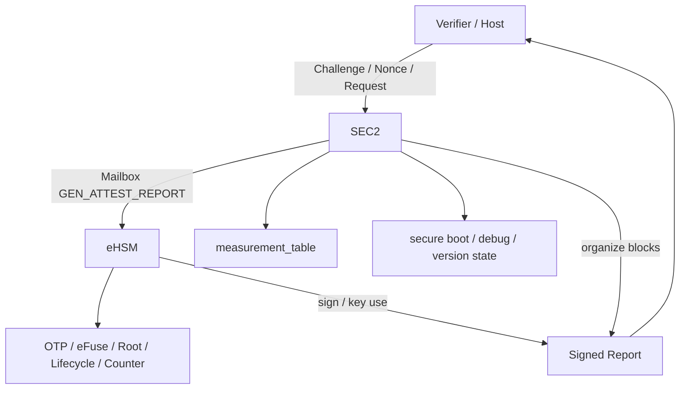
```mermaid
graph TD
    V[Verifier / Host] -->|Challenge / Nonce / Request| SEC2[SEC2]
    SEC2 -->|Mailbox GEN_ATTEST_REPORT| EH[eHSM]
    EH --> OTP[OTP / eFuse / Root / Lifecycle / Counter]
    SEC2 --> MT[measurement_table]
    SEC2 --> ST[secure boot / debug / version state]
    EH -->|sign / key use| REP[Signed Report]
    SEC2 -->|organize blocks| REP
    REP --> V
```

### 图下说明

1. SEC2 是认证控制面，对外可表现为 SPDM Responder。  
2. eHSM 是签名和密钥使用的执行面。  
3. measurement_table 由启动链各阶段产生，最终由 SEC2 汇总维护并对外输出。  
4. OTP/eFuse 提供 device identity seed、lifecycle、counter、chip/platform 标识等基础状态。  

---

## 4.7 时序图

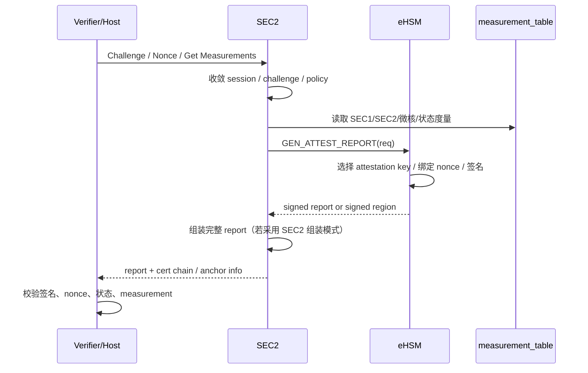
```mermaid
sequenceDiagram
    participant V as Verifier/Host
    participant S2 as SEC2
    participant EH as eHSM
    participant MT as measurement_table

    V->>S2: Challenge / Nonce / Get Measurements
    S2->>S2: 收敛 session / challenge / policy
    S2->>MT: 读取 SEC1/SEC2/微核/状态度量
    S2->>EH: GEN_ATTEST_REPORT(req)
    EH->>EH: 选择 attestation key / 绑定 nonce / 签名
    EH-->>S2: signed report or signed region
    S2->>S2: 组装完整 report（若采用 SEC2 组装模式）
    S2-->>V: report + cert chain / anchor info
    V->>V: 校验签名、nonce、状态、measurement
```

### 图下说明

1. report 的“数据组织”和“最终签名”可以分工，但私钥使用必须在 eHSM 内部。  
2. 证明价值在于“签名覆盖的度量对象”，而不是单纯返回一个签名本身。  
3. challenge / nonce 必须绑定到本次 report，防止重放。  

---

## 4.8 身份与证书模型

### 4.8.1 身份对象

| 对象 | 内容 | 生成/维护位置 | 使用位置 |
|---|---|---|---|
| Device UID | 设备唯一标识 | OTP/eFuse | eHSM / 报告 |
| Device Identity | UID + product info + lifecycle | SEC2 组装 | Host / Verifier |
| Device Identity Key | 设备证明私钥 | eHSM | 签名 report |
| Attestation Cert | 设备证明证书 | 制造/灌装阶段 | 报告 / Verifier |
| Debug Auth Cert | 调试授权证书 | 制造/售后流程 | eHSM / 调试鉴权 |

### 4.8.2 当前项目建议

- `[CONFIRMED]` 首版可以 Device Identity Key 为主，不强制首版启用 Alias Key
- `[ASSUMED]` 预留 Alias / Session-bound key 扩展位
- `[CONFIRMED]` Attestation Cert 与 Debug Auth Cert 应在语义上区分，不应简单混用

### 4.8.3 证书模型建议

首版优先支持两种模式：

#### 模式 A：Hash Anchor + 可选 Chain
- OTP/eFuse 中固化 attestation root hash / signer hash
- 报告中带 signer/anchor 标识
- 如需要，可附带 cert chain blob

#### 模式 B：Full Chain
- 报告中直接携带完整证书链
- verifier 侧直接做整链校验

当前建议：
- `[CONFIRMED]` 结构上必须支持 cert chain block
- `[ASSUMED]` 首版可采用“Hash Anchor + 可选 Chain Blob”作为最小可行方案
- `[TBD]` 是否强制报告内嵌完整 cert chain 需结合客户接入模式冻结

---

## 4.9 度量原则

### 4.9.1 核心原则

设备远程认证的价值不在于返回一个签名本身，而在于签名所覆盖的**实际可信对象集合**。

因此报告必须能够让验证方判断：

- 设备是谁
- 当前运行的关键固件是什么
- 当前 lifecycle / debug / secure boot / anti-rollback 状态是什么
- 当前状态是否符合预期策略

### 4.9.2 度量生成责任

- BootROM 阶段：记录 immutable identity / ROM version 等早期信息
- SEC1 装载阶段：记录 SEC 固件早期版本 / 测量信息
- SEC1 解密阶段：记录 SEC1 已按强制加密策略完成 eHSM / 安全子系统受控解密的状态摘要
- SEC2 运行阶段：统一汇总并维护 measurement_table
- eHSM：提供签名、密钥、counter、lifecycle 等支持

### 4.9.3 当前裁决

- `[CONFIRMED]` measurement_table 的拥有者和统一维护者是 SEC2
- `[CONFIRMED]` BootROM / SEC1 / SEC2 / 后续微核验证路径产生的度量最终进入统一 measurement_table
- `[ASSUMED]` 首版 measurement_table 可由 SEC2 维护在受控内存中，并在 attestation 时组织输出

---

## 4.10 度量内容

### 4.10.1 建议至少覆盖的对象

| Measurement | Producer | Signed | Notes |
|---|---|---|---|
| BootROM version / immutable identity | BootROM | Yes | 启动阶段写入指定安全内存 |
| SEC FW hash / version / rollback | BootROM + SEC2 | Yes | SEC1/SEC2 验证时记录 |
| image confidentiality policy | BootROM + SEC2 + eHSM | Yes | 至少反映 SEC1 强制签名 + 加密策略及是否存在策略降级 |
| Aux FW hash / version / rollback | SEC2 | Yes | PM / RAS / Codec 等 |
| lifecycle / debug / secure_boot / anti_rollback | SEC2 + eHSM | Yes | 统一维护状态 |
| chip_id / device_uuid / die info | eHSM + SEC2 | Yes | 平台实例身份 |
| board binding state（若启用） | SEC2 + eHSM | Yes | 可选 |

### 4.10.2 当前项目推荐 measurement 集合

1. BootROM / immutable identity  
2. SEC1  
3. SEC2  
4. PM / RAS / Codec 微核集合  
5. lifecycle state  
6. debug state  
7. secure boot enable  
8. image confidentiality policy（至少覆盖 SEC1）  
9. anti-rollback enable  
10. chip_id / device_uuid  
11. board binding / die binding（如启用）

---

## 4.11 报告内容与格式

### 4.11.1 报告逻辑布局

```text
Report Header
+ Identity Block
+ Nonce / Session Binding Block
+ Measurement Block(s)
+ Lifecycle / Debug Block
+ Firmware Version Block
+ Cert Chain Block
+ Signature Block
```

### 4.11.2 当前项目要求

- `[CONFIRMED]` report 至少包含：
  - report header
  - measurement 集合
  - cert chain / anchor 信息
  - signature block
- `[CONFIRMED]` lifecycle/debug/secure_boot/anti_rollback 状态必须可导出
- `[CONFIRMED]` nonce / challenge 必须绑定
- `[ASSUMED]` session_id / transcript_hash 在 SPDM 会话场景下建议绑定

---

## 4.12 报告头结构

### 4.12.1 章节级推荐结构

```c
typedef struct {
    uint32_t magic;
    uint32_t header_len;
    uint32_t total_len;
    uint8_t  report_uuid[16];
    uint8_t  device_uuid[16];
    uint8_t  requester_nonce[32];
    uint32_t lifecycle_state;
    uint32_t debug_state;
    uint32_t session_id;
    uint32_t hash_algo;
    uint32_t sig_algo;
    uint32_t cert_format;
    uint32_t block_count;
    uint32_t signed_region_offset;
    uint32_t signed_region_len;
} ngu_attest_report_header_t;
```

### 4.12.2 字段说明

| 字段 | 说明 |
|---|---|
| `magic` | 固定魔数，便于解析 |
| `header_len` | 报告头长度 |
| `total_len` | 整体报告长度 |
| `report_uuid` | 本次报告唯一标识 |
| `device_uuid` | 设备实例标识 |
| `requester_nonce` | challenge / nonce |
| `lifecycle_state` | 当前生命周期 |
| `debug_state` | 当前 debug 状态 |
| `session_id` | 会话绑定信息 |
| `hash_algo / sig_algo` | 算法表达 |
| `cert_format` | cert chain/anchor 表达方式 |
| `block_count` | block 数量 |
| `signed_region_offset/len` | 签名覆盖区域 |

### 4.12.3 当前裁决

- `[CONFIRMED]` `requester_nonce` 必须进入签名覆盖范围
- `[CONFIRMED]` lifecycle_state / debug_state 不得只在外部上下文中推测，必须显式进入报告
- `[ASSUMED]` `report_uuid` 用于审计与缓存去重，首版建议保留

---

## 4.13 度量结构

### 4.13.1 Measurement Block Header

```c
typedef struct {
    uint16_t block_type;
    uint16_t block_version;
    uint32_t block_len;
    uint32_t flags;
    uint32_t reserved0;
} ngu_measurement_block_header_t;
```

### 4.13.2 固件度量信息结构

```c
typedef struct {
    uint32_t fw_type;
    uint8_t  hash[32];
    uint32_t fw_version;
    uint32_t rollback_counter;
    uint32_t reserved0;
} ngu_meas_fw_info_t;
```

### 4.13.3 状态度量结构

```c
typedef struct {
    uint32_t lifecycle_state;
    uint32_t debug_state;
    uint32_t secure_boot_enable;
    uint32_t anti_rollback_enable;
    uint8_t  chip_id[16];
    uint32_t reserved0;
} ngu_meas_state_t;
```

### 4.13.4 当前建议

- `[CONFIRMED]` firmware hash、version、rollback counter 应成组表达
- `[CONFIRMED]` lifecycle/debug/secure_boot/anti_rollback 状态应成组表达
- `[ASSUMED]` digest 长度可按 `algo_family/hash_algo` 扩展到 32B / 48B

---

## 4.14 度量集合

### 4.14.1 推荐 slot/组件集合

| Slot / Component | 是否首版必须 | 说明 |
|---|---|---|
| SEC1 | 是 | 启动链关键项 |
| SEC1 image protection policy | 是 | 反映 SEC1 已强制签名 + 加密且未走非安全降级路径 |
| SEC2 | 是 | 认证控制面自身 |
| PM 微核 | 建议 | 运行态关键微核 |
| RAS 微核 | 建议 | 运行态关键微核 |
| Codec 微核 | 建议 | 运行态关键微核 |
| lifecycle state | 是 | 量产可信判断必要 |
| debug policy bitmap / state | 是 | 调试状态可信判断必要 |
| board policy / binding digest | 可选 | 板级策略/绑定 |

### 4.14.2 当前裁决

- `[CONFIRMED]` SEC1 / SEC2 / lifecycle / debug / secure_boot / anti_rollback 是首版必须覆盖的核心度量项
- `[CONFIRMED]` SEC1 的 image protection policy 必须可被 report 或 measurement flags 表达
- `[ASSUMED]` PM / RAS / Codec 首版建议纳入，如产品分阶段实现可在 verifier 策略中区分强制项与可选项
- `[TBD]` board binding 是否首版默认开启需与板级安全策略一起冻结

---

## 4.15 签名覆盖范围

### 4.15.1 必须签名覆盖的内容

- report header
- identity block
- challenge / nonce / session 绑定信息
- measurement block 集合
- lifecycle / debug / secure_boot / anti_rollback 状态
- firmware version / rollback 信息
- cert chain metadata（若存在）

### 4.15.2 不允许的实现

- 只对 measurement digest 做签名
- 把 lifecycle/debug 状态放在签名区之外
- verifier 通过“外部上下文猜测” challenge 绑定关系
- 由 Host 侧重新拼装后再要求 verifier 验签

### 4.15.3 当前裁决

- `[CONFIRMED]` nonce/challenge 绑定是必须项
- `[CONFIRMED]` 报告不能只证明“跑的是什么”，还必须证明“当前状态是什么”
- `[ASSUMED]` session / transcript hash 在 SPDM session 模式下建议纳入签名覆盖

---

## 4.16 双算法报告映射

### 4.16.1 国密路径

| 用途 | 建议算法 |
|---|---|
| Hash | SM3 |
| Signature | SM2 |
| Cert Key | SM2 |

### 4.16.2 国际路径

| 用途 | 建议算法 |
|---|---|
| Hash | SHA-256 / SHA-384 |
| Signature | ECDSA-P256 / P-384 / RSA-3072 |
| Cert Key | P-256 / P-384 / RSA |

### 4.16.3 结构层要求

报告结构中必须显式表达：
- `algo_family`
- `hash_algo`
- `sig_algo`
- `cert_format`

### 4.16.4 当前裁决

- `[CONFIRMED]` verifier 逻辑不得把算法栈写死为单一实现
- `[CONFIRMED]` report 结构必须对国密/国际算法共存友好
- `[ASSUMED]` 首版产品可只启用一种主路径，但字段不能缺失

---

## 4.17 Verifier 最小校验步骤

Verifier 至少必须执行：

1. 检查 `report_version / magic / total_len`
2. 检查 `algo_family / hash_algo / sig_algo / cert_format`
3. 提取并匹配 cert chain / anchor
4. 检查 signer 身份是否可信
5. 检查 `requester_nonce` 是否与 challenge 一致
6. 若存在 session_id / transcript 绑定，检查是否一致
7. 校验签名
8. 检查 measurement 集合是否满足策略
9. 检查 lifecycle / debug / secure_boot / anti_rollback 状态是否满足预期
10. 检查 firmware version / rollback counter 是否不低于策略门限
11. 若启用 board/die binding，检查 binding 是否匹配

### 4.17.1 当前裁决

- `[CONFIRMED]` verifier 不能只做“签名对不对”的校验
- `[CONFIRMED]` verifier 必须同时校验状态和策略
- `[ASSUMED]` 首版 verifier 可按产品线策略区分“必须项”和“建议项”

---

## 4.18 与实现层的映射关系

| 本章主题 | 对应实现层文件 |
|---|---|
| report 字段级结构 / binding / measurement / signature | `04_impl_design/spdm_report.md` |
| attestation mailbox 命令 / challenge / report 获取接口 | `04_impl_design/mailbox_if.md` |
| attestation key / anchor / identity seed 上游对象 | `04_impl_design/efuse_key_fw_header_design.md` |
| manufacturing / cert / anchor / lifecycle 冻结关系 | `04_impl_design/manufacturing_provisioning.md` |

---

## 4.19 冻结敏感项

| Item | Why Sensitive | Current Status | Needed Before Freeze |
|---|---|---|---|
| Device Identity vs Alias Key 首版策略 | 影响 report / cert / verifier 复杂度 | 部分收敛 | 冻结首版 key model |
| cert chain 内嵌策略 | 影响 report 大小与 verifier 部署方式 | 未完全冻结 | 冻结首版 cert 模式 |
| measurement 必选集合 | 影响安全策略与兼容性 | 部分收敛 | 冻结首版最小 measurement set |
| image protection policy 字段 | 影响 verifier 是否能识别 SEC1 强制加密和后续镜像签名 only 例外 | 部分收敛 | 冻结 report 字段位置和 flags 编码 |
| session/transcript 绑定粒度 | 影响 SPDM 集成深度 | 未完全冻结 | 冻结首版 binding 模式 |
| board/die binding 是否默认启用 | 影响板级/多Die 产品 | 未完全冻结 | 与板级安全策略联动冻结 |

---

## 4.20 开放问题

1. 首版是否仅 Device Identity Key 签名即可满足客户接入，还是必须同步规划 Alias Key？  
2. report 是否必须默认内嵌完整 cert chain？  
3. measurement_table 最终是否全部由 SEC2 自维护，还是部分由 eHSM 动态拉取？  
4. report 中 image protection policy 是作为 measurement flags、lifecycle block 字段，还是独立 policy block 表达？  
4. 双Die 场景是单 report 汇总还是主/从 Die 分别证明？  
5. debug 授权状态是否需要带时间窗口/过期信息进入 report？  

---

## 4.21 本章结论

本章已将 NGU800 的设备身份与远程度量证明设计收敛到当前可评审的正式口径：

- SEC2 是认证控制面，eHSM 是签名与密钥执行面  
- 设备证明私钥不得离开 eHSM  
- measurement_table 由启动链产生、由 SEC2 汇总维护  
- SEC1 measurement 必须反映 verify + decrypt 成功后的受控镜像状态  
- 报告必须覆盖身份、挑战绑定、关键固件度量、lifecycle/debug/secure_boot/anti_rollback 状态  
- Verifier 必须同时校验签名、状态和策略，而不是只校验签名  
- 国密与国际算法必须在报告结构层共存  

后续若 `spdm_report.md`、`mailbox_if.md`、`manufacturing_provisioning.md` 或 key/cert 基线字段冻结有变化，本章必须同步更新。
---
# 5. 安全调试与生命周期控制


> 文档定位：NGU800 / NGU800P 章节级正式详设  
> 章节文件：`security_workflow/03_detailed_design/04_lifecycle_debug.md`  
> 当前状态：V1.0（基于当前约束、baseline、实现级接口与现有方案资料收敛）  
> 设计标记口径：`[CONFIRMED] / [ASSUMED] / [TBD]`

---

## 5.1 本章目标

本章定义 NGU800 的生命周期统一模型、安全调试策略、调试授权路径、状态切换规则和运行态控制边界，重点明确：

1. 项目生命周期状态与 eHSM 原生状态的统一映射
2. 不同 lifecycle 下的启动策略、调试策略、升级策略和接口开放范围
3. 安全调试必须经过 challenge-response / debug auth 的控制要求
4. 调试范围（scope / bitmap）与自动关闭策略
5. lifecycle 对 OTP/eFuse、非安全启动、镜像接收和 provisioning 的 gating 关系
6. 生命周期切换的受控条件与不可逆路径
7. 与实现层文件的映射关系：
   - `04_impl_design/mailbox_if.md`
   - `04_impl_design/spdm_report.md`
   - `04_impl_design/manufacturing_provisioning.md`
   - `04_impl_design/efuse_key_fw_header_design.md`

---

## 5.2 生效约束 ID

- `C-BOOT-04`
- `C-KEY-02`
- `C-DEBUG-01`
- `C-DEBUG-02`
- `C-IF-01`
- `C-HOST-01`
- `C-ACCESS-01`
- `C-ACCESS-02`
- `C-BOARD-03`
- `C-BOARD-04`
- `C-MFG-01`
- `C-UPDATE-01`
- `C-ATT-01`

---

## 5.3 生效 Baseline 决策

### 5.3.1 生命周期控制
- `[CONFIRMED]` lifecycle 必须控制 debug、OTP/eFuse 访问、非安全启动和镜像接受范围
- `[CONFIRMED]` USER/PROD 下 SEC1 解密 key / FW_KEK 使用必须受 lifecycle gating，且不可由 debug/RMA 普通请求关闭 SEC1 强制解密策略
- `[CONFIRMED]` USER 生命周期必须关闭未授权 debug
- `[CONFIRMED]` USER 生命周期应强制安全启动

### 5.3.2 调试控制
- `[CONFIRMED]` 调试必须走 challenge-response / debug auth
- `[CONFIRMED]` debug enable 必须支持鉴权后开启与自动关闭
- `[CONFIRMED]` 量产态 debug 默认关闭，不得由普通软件直接打开

### 5.3.3 权责边界
- `[CONFIRMED]` 所有安全关键操作必须通过 SEC2 控制路径执行
- `[CONFIRMED]` eHSM 提供 debug auth、lifecycle 切换、control field 修改等能力
- `[CONFIRMED]` Host 不得直接修改 lifecycle、secure boot、debug enable 等关键状态

---

## 5.4 设计要求

### 5.4.1 本章必须回答的问题

1. 项目生命周期如何统一命名和编码？
2. 每个 lifecycle 允许哪些启动模式、调试模式、升级模式？
3. debug 是怎么打开的，谁来授权、谁来执行？
4. 调试授权能开到什么粒度，是否需要 scope/bitmap？
5. lifecycle 切换由谁发起、由谁裁决、由谁落盘？
6. 哪些切换是单向不可逆的？
7. USER / RMA / DEST 下哪些能力必须彻底关闭？
8. attestation 报告中哪些状态必须反映当前 lifecycle/debug 策略？

### 5.4.2 不得违反的边界

- Host / 普通 CPU / 非安全 master 不得直接打开 debug
- USER 生命周期不得保留无限制调试
- lifecycle 回退不得由普通软件路径完成
- 非安全启动不得在 USER 态隐式回退或默认可用
- 调试授权不得绕过 eHSM challenge / auth 机制

---

## 5.5 生命周期统一模型

### 5.5.1 输入口径整理

当前输入资料存在两类命名口径：

- 项目口径：`TEST / DEVE / MANU / USER / DEBUG / DEST`
- eHSM/native 口径：`TEST / DEVELOP / MANUFACTURE / USER / DEBUG / DESTROY`

为便于系统级实现与文档统一，本章采用“统一态 + 映射表”的方式表达。

### 5.5.2 统一编码建议

| Enc | Unified State | eHSM Mapping | Project Mapping | 启动策略 | 调试策略 | 更新/Provisioning 策略 |
|---|---|---|---|---|---|---|
| `0x00` | TEST | TEST | TEST | 可安全 / 非安全启动 | 实验室开放调试 | 允许基础测试 |
| `0x01` | DEV | DEVELOP | DEVE | 可安全 / 非安全启动 | 允许开发调试 | 允许开发升级 |
| `0x02` | MANUFACTURE | MANUFACTURE | MANU | 优先安全启动 | 有限受控调试 | 允许 provisioning / 冒烟验证 |
| `0x03` | PROD | USER | USER | 强制安全启动 | 默认关闭，仅授权临时开 | 仅受控升级 |
| `0x04` | RMA | DEBUG | DEBUG / RMA | 仅允许签名 rescue / 受控启动 | 授权后有限开放 | 维修升级 |
| `0x05` | DECOMMISSIONED | DESTROY | DEST | 不允许正常启动 | 关闭 | 不允许 |

### 5.5.3 当前裁决

- `[CONFIRMED]` `TEST -> DEV -> MANUFACTURE -> PROD` 为主单向路径
- `[CONFIRMED]` `DECOMMISSIONED / DEST` 为不可逆终态
- `[ASSUMED]` `RMA` 在工程上等价映射到 eHSM 的 `DEBUG` 或 `DEBUG/RMA` 子模式
- `[TBD]` 是否保留独立 `DEBUG` 与 `RMA` 子状态编码，需最终与 eHSM 接口实现冻结

---

## 5.6 架构图

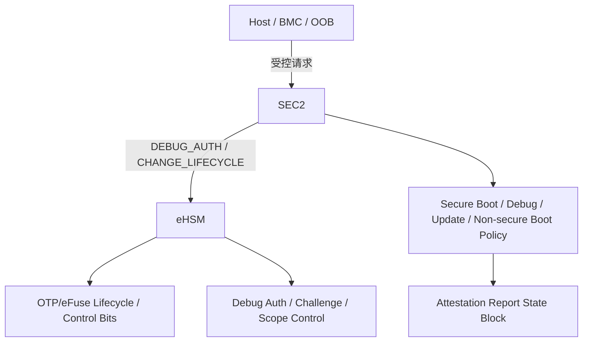
```mermaid
graph TD
    HOST[Host / BMC / OOB] -->|受控请求| SEC2[SEC2]
    SEC2 -->|DEBUG_AUTH / CHANGE_LIFECYCLE| EH[eHSM]
    EH --> OTP[OTP/eFuse Lifecycle / Control Bits]
    EH --> DBG[Debug Auth / Challenge / Scope Control]
    SEC2 --> STATE[Secure Boot / Debug / Update / Non-secure Boot Policy]
    STATE --> REPORT[Attestation Report State Block]
```

### 图下说明

1. lifecycle 与 debug 的最终裁决在 eHSM + OTP/eFuse 语义层完成。  
2. SEC2 是统一控制面，对外收敛 Host/BMC/OOB 的请求。  
3. Attestation report 必须反映当前 lifecycle/debug 状态，而不是只报告 firmware hash。  

---

## 5.7 时序图

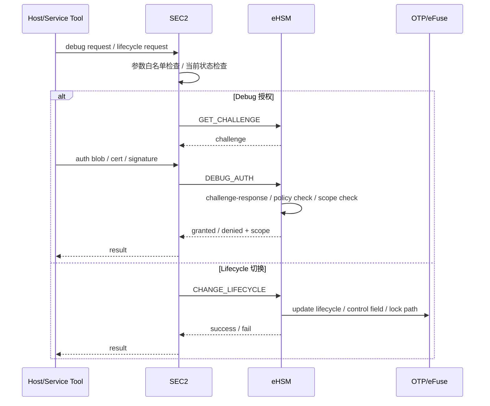
```mermaid
sequenceDiagram
    participant H as Host/Service Tool
    participant SEC as SEC2
    participant EH as eHSM
    participant OTP as OTP/eFuse

    H->>SEC: debug request / lifecycle request
    SEC->>SEC: 参数白名单检查 / 当前状态检查
    alt Debug 授权
        SEC->>EH: GET_CHALLENGE
        EH-->>SEC: challenge
        H->>SEC: auth blob / cert / signature
        SEC->>EH: DEBUG_AUTH
        EH->>EH: challenge-response / policy check / scope check
        EH-->>SEC: granted / denied + scope
        SEC-->>H: result
    else Lifecycle 切换
        SEC->>EH: CHANGE_LIFECYCLE
        EH->>OTP: update lifecycle / control field / lock path
        EH-->>SEC: success / fail
        SEC-->>H: result
    end
```

### 图下说明

1. debug 开启必须经过 challenge-response 或等价鉴权。  
2. lifecycle 修改必须由受控命令触发，并最终落到 OTP/eFuse / control field。  
3. Host 不能直接改 debug enable 或 lifecycle 寄存器。  

---

## 5.8 各生命周期策略矩阵

| 生命周期 | Secure Boot | Non-secure Boot | Debug | OTP/eFuse 写操作 | Firmware Update | Provisioning | Recovery / Rescue |
|---|---|---|---|---|---|---|---|
| TEST | 可开可关 | 允许 | 高权限开放 | 受控允许 | 允许 | 允许最小测试 | 可选 |
| DEV | 推荐开启 | 允许 | 允许开发授权 | 受控允许 | 允许 | 视需要 | 可选 |
| MANU | 必须优先安全启动 | 受策略限制 | 有限受控 | 允许正式灌装 | 允许 | 必须允许 | 冒烟/恢复可用 |
| USER/PROD | 强制开启 | 默认关闭 | 默认关闭，仅临时授权 | 禁止正式写入根材料 | 仅受控升级 | 禁止 | 仅授权 rescue |
| RMA | 受控签名启动 | 默认关闭 | 授权后有限开放 | 仅限受控维修流程 | 允许维修升级 | 禁止常规 provisioning | 允许 |
| DEST | 不允许 | 不允许 | 关闭 | 禁止 | 禁止 | 禁止 | 禁止 |

### 5.8.1 当前裁决

- `[CONFIRMED]` USER 生命周期强制安全启动，默认关闭未授权 debug
- `[CONFIRMED]` USER/PROD 下 SEC1 必须保持签名 + 加密，SEC1 解密由 eHSM / 安全子系统受控密码服务完成
- `[CONFIRMED]` MANU 生命周期必须允许 provisioning 和冒烟验证
- `[CONFIRMED]` RMA 只允许受控 rescue / 维修升级
- `[ASSUMED]` DEV/TEST 阶段允许更宽松的 boot/debug 策略，但不能与量产态混淆

---

## 5.9 调试模型

### 5.9.1 调试分类

当前项目建议把调试能力至少分为以下几类：

| Debug Capability | 含义 | 量产态建议 |
|---|---|---|
| CPU halt / single-step | 核心停机、单步 | 禁止，需授权 |
| trace visibility | 跟踪可见性 | 禁止，需授权 |
| secure memory visibility | 安全内存可见 | 禁止，需授权 |
| interconnect debug windows | 片上互连调试窗口 | 禁止，需授权 |
| board-assisted debug access | 板级辅助调试入口 | 禁止，需授权 |
| JTAG / CPLD / MUX access | 板级 JTAG、CPLD/MUX 选择、边界扫描、GPU/CPU/Flash/DRAM/安全子系统调试 | USER 默认关闭，需授权、scope、时限和审计 |

### 5.9.2 调试位图

- `[CONFIRMED]` eHSM 支持 SoC debug authorization，并带大位图控制能力
- `[ASSUMED]` NGU800 应按子系统定义 debug bit 域
- `[TBD]` 最终 bit-level 映射（例如 129bit 端口位图）需在实现阶段冻结
- `[TBD]` `SRC-005` 中涉及的 JTAG 目标（CPU、GPU、DRAM、Flash、安全子系统、板级 MCU、边界扫描）需映射到 SoC debug scope 或板级二级 scope

### 5.9.3 当前建议

调试授权建议至少输出以下信息：

```c
typedef struct {
    uint32_t debug_enable_state;
    uint32_t granted_scope_words;
    uint32_t expire_policy;
    uint64_t scope_bitmap_addr;
} ngu_debug_auth_state_t;
```

说明：
- `granted_scope_words`：位图长度
- `expire_policy`：自动关闭策略 / 时间窗口策略
- `scope_bitmap_addr`：在受控共享内存中传递位图

### 5.9.4 板级 JTAG 调试补充规则

基于 `SRC-005` 管理子系统方案，JTAG 具备接入 GPU JTAGBUS、寄存器空间、DRAM、Flash、安全子系统、CPU 调试单元和板级 MCU 的能力。该能力在生命周期与调试模型中按最高风险调试入口处理：

- `[CONFIRMED]` USER/PROD 生命周期下，JTAG / CPLD / MUX 默认关闭。
- `[CONFIRMED]` JTAG 打开必须复用 debug auth 路径，不允许由 BMC/OOB/板级 MCU 直接打开。
- `[CONFIRMED]` 授权必须包含 target scope、访问类型、时间窗口和自动关闭策略。
- `[CONFIRMED]` 异常复位、生命周期切换、授权超时或安全错误事件必须关闭 JTAG scope 并清零 MUX 配置。
- `[ASSUMED]` ATE/SLT/EVB 阶段可使用更宽松 JTAG 策略，但 MANU -> USER 前必须锁定或清理测试路径。

---

## 5.10 调试开启流程

### 5.10.1 最小流程

1. Host / 服务工具发起 debug request  
2. SEC2 进行当前 lifecycle、白名单和目标 scope 的预检查  
3. SEC2 向 eHSM 发起 `GET_CHALLENGE`  
4. eHSM 返回 challenge  
5. 请求方提交 debug auth blob / 证书 / 签名  
6. SEC2 调用 `DEBUG_AUTH`  
7. eHSM 完成：
   - challenge-response 校验
   - cert / anchor 校验
   - lifecycle 策略检查
   - scope bitmap 检查
8. 成功后返回授权范围和失效策略  
9. SEC2 按授权结果开启受限 debug 能力  
10. 到期或关闭后，执行 `CLOSE_DEBUG`

### 5.10.2 当前裁决

- `[CONFIRMED]` challenge-response 是必须路径
- `[CONFIRMED]` 调试开启必须有 scope 控制，不能只有“开/关”二元语义
- `[CONFIRMED]` debug enable 必须支持自动关闭
- `[ASSUMED]` 授权结果中应带时间窗口或显式失效策略

---

## 5.11 调试关闭与自动回收

### 5.11.1 必须支持的收口场景

| 场景 | 行为 |
|---|---|
| 显式关闭 | `CLOSE_DEBUG` |
| 生命周期切换 | 若切到 USER / DEST，必须自动收口 |
| 异常复位 | 需恢复默认关闭态 |
| 授权超时 | 到期自动关闭 |
| 安全错误事件 | 可强制关闭调试 |

### 5.11.2 当前裁决

- `[CONFIRMED]` debug enable 不能是“开了就一直开”
- `[CONFIRMED]` USER 态下即使临时授权打开，也必须可自动关闭
- `[ASSUMED]` 异常复位后建议恢复到“未授权 debug 关闭”的保守状态

---

## 5.12 lifecycle 切换规则

### 5.12.1 推荐转换图

```text
TEST -> DEV -> MANUFACTURE -> PROD
PROD -> RMA (authorized)
ANY -> DECOMMISSIONED (irreversible)
```

### 5.12.2 转换条件

| 转换 | 条件 |
|---|---|
| TEST -> DEV | 实验室控制、基础 bring-up 完成 |
| DEV -> MANUFACTURE | 工程收敛、准备正式灌装 |
| MANUFACTURE -> PROD | 密钥/证书灌装完成 + smoke validation 通过 |
| PROD -> RMA | 授权 + challenge-response + 必要安全擦除前置 |
| ANY -> DECOMMISSIONED | 不可逆销毁路径 |

### 5.12.3 当前裁决

- `[CONFIRMED]` `MANUFACTURE -> PROD` 之前必须完成密钥/证书灌装和冒烟验证
- `[CONFIRMED]` `PROD -> RMA` 需要授权并满足安全前置条件
- `[CONFIRMED]` `DECOMMISSIONED / DEST` 是不可逆终态
- `[ASSUMED]` `RMA -> PROD` 恢复时应重新做量产安全检查与状态归档

---

## 5.13 lifecycle 与接口 gating

### 5.13.1 命令级 gating

| 命令 | TEST | DEV | MANU | USER | RMA | DEST |
|---|---|---|---|---|---|---|
| VERIFY_IMAGE | Y | Y | Y | Y | Y | N |
| GET_CHALLENGE | Y | Y | Y | 受控 | Y | N |
| DEBUG_AUTH | Y | Y | 受控 | 默认 N / 受策略 | Y | N |
| CLOSE_DEBUG | Y | Y | Y | Y | Y | N |
| CHANGE_LIFECYCLE | Y | Y | Y | 受限 | 受限 | N |
| READ_COUNTER | Y | Y | Y | Y | Y | N |
| INCREASE_COUNTER | Y | Y | Y | Y | 受控 | N |
| GEN_ATTEST_REPORT | 可选 | 可选 | 可选 | Y | 可选 | N |
| PROVISION_ROOT_MATERIAL | N | N | Y | N | N | N |

### 5.13.2 当前裁决

- `[CONFIRMED]` provisioning 命令只允许在 MANU 或等价受控阶段执行
- `[CONFIRMED]` USER 阶段默认禁止 DEBUG_AUTH 成功开启调试，除非策略明确允许受限授权
- `[CONFIRMED]` DEST 阶段不允许正常安全服务路径

---

## 5.14 lifecycle 与启动策略的关系

### 5.14.1 启动策略要求

- `[CONFIRMED]` lifecycle 必须控制 secure / non-secure boot 的可用性
- `[CONFIRMED]` USER 阶段应强制安全启动
- `[CONFIRMED]` USER/PROD 阶段 SEC1 必须保持签名 + 加密，SEC1 decrypt required 不得被 caller 或调试状态关闭
- `[ASSUMED]` TEST/DEV 阶段可允许非安全启动，用于 bring-up 和开发
- `[CONFIRMED]` RMA 仅允许受控 signed rescue boot，不得恢复成普通开放调试启动

### 5.14.2 当前裁决

- 非安全启动不是失败时的默认旁路，而是受 lifecycle + control field + strap 共同控制的显式模式
- attestation 报告中必须反映 `secure_boot_state`

---

## 5.15 lifecycle 与 attestation 的关系

### 5.15.1 必须进入报告的状态

report 中至少必须反映：

- `lifecycle_state`
- `debug_state`
- `secure_boot_state`
- `image_confidentiality_policy`（至少表达 SEC1 强制签名 + 加密策略）
- `anti_rollback_state`

### 5.15.2 当前裁决

- `[CONFIRMED]` verifier 不能只校验签名，还必须检查 lifecycle/debug 状态
- `[CONFIRMED]` 量产可信判断必须包含：
  - lifecycle 是否为 USER/PROD 或允许上线状态
  - debug 是否关闭或处于允许模式
  - secure boot 是否开启
  - rollback 策略是否满足门限

---

## 5.16 lifecycle 与 provisioning / RMA 的关系

### 5.16.1 Provisioning
- `[CONFIRMED]` Root / signer / debug / attestation / counter / control field 的正式灌装只允许在 MANU
- `[CONFIRMED]` MANU → USER 之前必须完成 key/anchor 锁定与测试 trust 清理

### 5.16.2 RMA
- `[CONFIRMED]` RMA 是受权返修路径，不是常驻状态
- `[CONFIRMED]` 返修调试必须 challenge-response 后有限开放
- `[CONFIRMED]` RMA / DEBUG 不得绕过 SEC1 加密策略；rescue image 必须使用专用 signer / recovery trust，并由 eHSM / 安全子系统受控验证与解密或按 recovery policy 处理
- `[ASSUMED]` RMA 结束后应恢复量产安全状态，并重新形成报告/审计记录

---

## 5.17 与实现层的映射关系

| 本章主题 | 对应实现层文件 |
|---|---|
| debug auth / lifecycle 命令 / gating / 错误码 | `04_impl_design/mailbox_if.md` |
| lifecycle/debug 状态块进入证明报告 | `04_impl_design/spdm_report.md` |
| MANU→USER / RMA 流程、审计与恢复 | `04_impl_design/manufacturing_provisioning.md` |
| control bits / lifecycle encoding / OTP字段 | `04_impl_design/efuse_key_fw_header_design.md` |
| SEC1 解密 key / FW_KEK lifecycle gating | `04_impl_design/efuse_key_fw_header_design.md` / `04_impl_design/manufacturing_provisioning.md` |
| JTAG scope bitmap / CPLD-MUX gating / 板级调试授权闭环 | `04_impl_design/mailbox_if.md` / `[TBD] firewall_access_rules` |

---

## 5.18 冻结敏感项

| Item | Why Sensitive | Current Status | Needed Before Freeze |
|---|---|---|---|
| 生命周期统一编码 | 影响 OTP / report / command 接口 | 部分收敛 | 冻结最终编码表 |
| DEBUG 与 RMA 是否独立编码 | 影响命令 gating 与审计模型 | 未完全冻结 | 冻结状态机 |
| debug scope bitmap bit-level 定义 | 影响 FW / RTL / verifier / 工具 | 未完全冻结 | 冻结端口位图 |
| SEC2/后续运行期镜像加密策略 | 影响 USER/PROD 策略和 attestation 可见性 | 未完全冻结 | 冻结除 SEC1 外哪些镜像允许签名 only |
| JTAG scope 与 CPLD/MUX 控制权 | 影响板级调试是否能绕过 eHSM 授权 | 未完全冻结 | 冻结 JTAG target scope、MUX 控制寄存器和关闭策略 |
| USER 下调试授权策略 | 影响量产与售后边界 | 未完全冻结 | 冻结是否允许短时授权 |
| DEST 阶段允许保留哪些状态查询能力 | 影响退役与审计 | 未完全冻结 | 冻结销毁态策略 |

---

## 5.19 开放问题

1. `DEBUG` 与 `RMA` 首版是否合并成一个统一态，还是保留子状态？  
2. 首版 USER 态是否允许短时授权 debug，还是完全禁止？  
3. debug scope bitmap 最终按子系统、功能类还是资源域来编码？  
4. `RMA -> PROD` 恢复是否必须重新跑一次最小 attestation / smoke validation？  
5. SEC2 / PM / RAS / Codec 是否首版全部强制加密，还是允许部分非敏感镜像签名 only？  
6. DEST 阶段是否允许只读状态查询用于审计收尾？  
7. 板级 JTAG MUX / CPLD 的授权控制由 SEC 直接写寄存器，还是由板级 MCU 受控代理执行？  

---

## 5.20 本章结论

本章已将 NGU800 的生命周期与安全调试控制收敛到当前可评审的正式口径：

- lifecycle 统一模型已建立，并与 eHSM / 项目命名对齐  
- USER/PROD 态必须强制安全启动并默认关闭未授权 debug  
- debug 开启必须经过 challenge-response / debug auth / scope 控制 / 自动关闭  
- lifecycle 切换必须通过受控命令面执行，且不可由 Host 或普通软件直接修改  
- attestation 报告必须反映 lifecycle/debug/secure boot/anti-rollback 状态  
- provisioning 和 RMA 都必须被 lifecycle 严格 gating，并形成审计闭环  

后续若 `mailbox_if.md`、`spdm_report.md`、`manufacturing_provisioning.md` 或 OTP/lifecycle 字段冻结有变化，本章必须同步更新。
---
# 6. 内外部接口设计


> 文档定位：NGU800 / NGU800P 章节级正式详设  
> 章节文件：`security_workflow/03_detailed_design/06_interface.md`  
> 当前状态：V1.0（基于当前约束、baseline 与实现级接口文件收敛）  
> 设计标记口径：`[CONFIRMED] / [ASSUMED] / [TBD]`

---

## 6.1 本章目标

本章定义 NGU800 的内外部安全接口边界，重点明确：

1. Host / BMC / OOB-MCU / Sideband 与安全子系统的边界
2. SEC/C908、eHSM、BootROM、管理子系统之间的接口职责划分
3. Mailbox + Shared Memory 的项目适配模型
4. Verify、Lifecycle、Debug Auth、Counter、Attestation、Provisioning 等接口的通用格式
5. 外部访问控制、地址白名单、生命周期限制和错误模型
6. 与实现层文件的映射关系：
   - `04_impl_design/mailbox_if.md`
   - `04_impl_design/spdm_report.md`
   - `04_impl_design/efuse_key_fw_header_design.md`
   - `04_impl_design/manufacturing_provisioning.md`

---

## 6.2 生效约束 ID

- `C-IF-01`
- `C-HOST-01`
- `C-ACCESS-01`
- `C-ACCESS-02`
- `C-BOARD-01`
- `C-BOARD-02`
- `C-BOARD-03`
- `C-BOARD-04`
- `C-BOOT-01`
- `C-BOOT-02`
- `C-BOOT-04`
- `C-DEBUG-01`
- `C-DEBUG-02`
- `C-ATT-01`
- `C-MFG-01`

---

## 6.3 生效 Baseline 决策

### 6.3.1 安全服务调用边界
- `[CONFIRMED]` 所有正式安全服务必须通过受控 Mailbox 或定义好的安全接口
- `[CONFIRMED]` SEC/C908 是唯一安全控制面 caller
- `[CONFIRMED]` eHSM 是唯一安全服务执行面

### 6.3.2 Host 边界
- `[CONFIRMED]` Host 只具备投递能力，不进入信任链
- `[CONFIRMED]` Host 不得直接访问 eHSM、OTP、Secure SRAM
- `[CONFIRMED]` Host 不得直接放行执行

### 6.3.3 生命周期与授权
- `[CONFIRMED]` USER 生命周期必须关闭未授权 debug
- `[CONFIRMED]` DEBUG/RMA 相关接口必须通过 challenge-response 或等价鉴权
- `[CONFIRMED]` 制造相关接口只能在受控 provisioning 生命周期窗口内使用

---

## 6.4 设计要求

### 6.4.1 本章必须回答的问题

1. Host、BMC、OOB-MCU 是否允许直接调用 eHSM？
2. SEC/C908 与 eHSM 之间通过什么接口交互？
3. 真实命令包放在寄存器还是共享内存？
4. 哪些接口是 Boot 期必须具备的？
5. 哪些接口只能在 MANU / DEBUG / RMA 阶段打开？
6. Address / length / lifecycle / permission 检查由谁负责？
7. 错误码、超时、busy、并发语义如何统一？
8. 哪些接口属于“安全服务接口”，哪些仅是普通数据链路？

### 6.4.2 不得违反的边界

- Host 不得直接调用 eHSM 私有命令面
- 普通 Master 不得直接操作 OTP/eFuse 安全区
- Mailbox 请求不得绕过 SEC 的参数白名单与生命周期检查
- Verify / Debug Auth / Lifecycle / Provisioning 不得在不合法 lifecycle 下开放
- 共享内存地址不得由 Host 任意指定到安全域

---

## 6.5 架构图

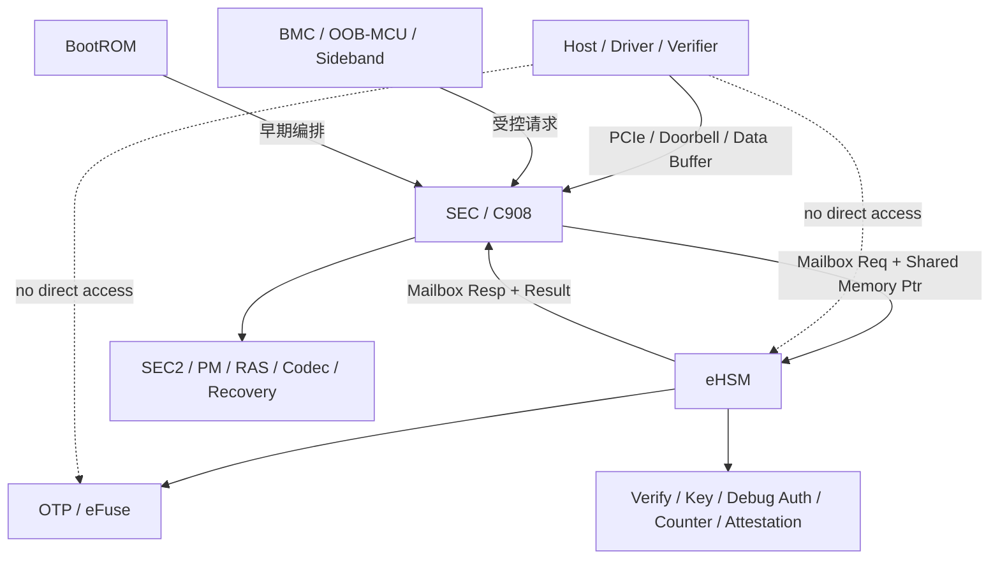
```mermaid
graph TD
    H[Host / Driver / Verifier] -->|PCIe / Doorbell / Data Buffer| SEC[SEC / C908]
    BMC[BMC / OOB-MCU / Sideband] -->|受控请求| SEC
    BR[BootROM] -->|早期编排| SEC
    SEC -->|Mailbox Req + Shared Memory Ptr| EH[eHSM]
    EH -->|Mailbox Resp + Result| SEC
    EH --> OTP[OTP / eFuse]
    EH --> ALG[Verify / Key / Debug Auth / Counter / Attestation]
    SEC --> FW[SEC2 / PM / RAS / Codec / Recovery]
    H -. no direct access .-> EH
    H -. no direct access .-> OTP
```

### 图下说明

1. 外部世界（Host / BMC / OOB-MCU）与 eHSM 之间没有直接信任链接口。  
2. 所有正式安全服务调用必须先进入 SEC/C908 控制面。  
3. Mailbox 传递“命令与包地址”，共享内存传递“真实包体”。  
4. OTP/eFuse 只被 eHSM 直接使用，不向外暴露敏感内容。  

---

## 6.6 时序图

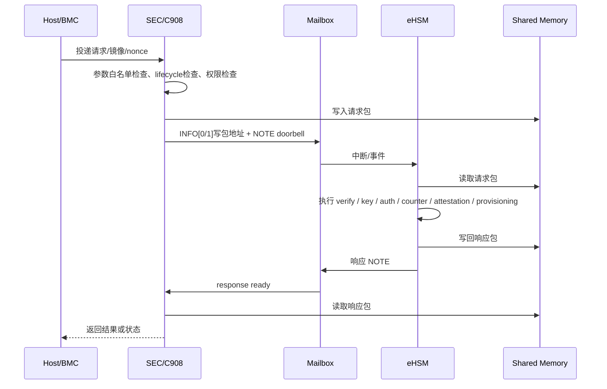
```mermaid
sequenceDiagram
    participant H as Host/BMC
    participant SEC as SEC/C908
    participant MB as Mailbox
    participant EH as eHSM
    participant SM as Shared Memory

    H->>SEC: 投递请求/镜像/nonce
    SEC->>SEC: 参数白名单检查、lifecycle检查、权限检查
    SEC->>SM: 写入请求包
    SEC->>MB: INFO[0/1]写包地址 + NOTE doorbell
    MB->>EH: 中断/事件
    EH->>SM: 读取请求包
    EH->>EH: 执行 verify / key / auth / counter / attestation / provisioning
    EH->>SM: 写回响应包
    EH->>MB: 响应 NOTE
    MB->>SEC: response ready
    SEC->>SM: 读取响应包
    SEC-->>H: 返回结果或状态
```

### 图下说明

1. Host 的请求在安全语义上必须经 SEC 收敛，不允许直达 eHSM。  
2. eHSM 不负责“理解 Host 业务语义”，只负责执行已受控的安全服务请求。  
3. 共享内存必须受地址白名单和 cache 一致性规则保护。  

---

## 6.7 接口分层

### 6.7.1 分层模型

| 层级 | 名称 | 典型对象 | 作用 |
|---|---|---|---|
| L0 | 物理/链路层 | PCIe / IRQ / Doorbell / SMBus / Sideband | 承载数据和中断 |
| L1 | SEC 收敛层 | SEC/C908 | 权限检查、生命周期检查、参数封装 |
| L2 | 安全服务接口层 | Mailbox + Shared Memory | 调用 eHSM 安全服务 |
| L3 | 安全执行层 | eHSM | verify / key / auth / counter / lifecycle / attestation |
| L4 | 结果消费层 | Host / Verifier / Driver / Tool | 接收结果、做后续处理 |

### 6.7.2 项目裁决

- `[CONFIRMED]` 安全语义控制点在 L1（SEC 收敛层）
- `[CONFIRMED]` eHSM 是 L3 安全执行层
- `[CONFIRMED]` Host / BMC / OOB-MCU 只在 L0 / L4，不直接跨到 L3

---

## 6.8 内部接口划分

### 6.8.1 BootROM ↔ SEC
BootROM 与 SEC 的关系是启动编排关系，不作为通用安全服务接口对外暴露。

BootROM 可承担：
- 早期平台初始化
- 读取 strap / lifecycle / secure boot 配置
- 触发或等待 eHSM ready
- 把控制流转移到 SEC1/SEC

BootROM 不应承担：
- 完整 Mailbox 服务管理
- 长期运行态安全服务代理
- 完整调试鉴权 / 证明 / provisioning 服务

### 6.8.2 SEC ↔ eHSM
这是项目中**唯一正式安全服务接口面**。

SEC 负责：
- 参数合法性检查
- 生命周期检查
- 请求包封装
- token 管理
- 超时与 busy 处理
- 响应解包和上报

eHSM 负责：
- 真实安全操作执行
- OTP / key / counter / lifecycle / verify / auth / attestation 服务
- 返回结构化结果和错误码

### 6.8.3 SEC ↔ Host / BMC / OOB
SEC 对外提供的是**受控代理接口**，而不是“把 eHSM 原生命令透传给外部”。

Host/BMC/OOB 可请求：
- 固件投递
- 受控 verify 流程触发
- challenge / report 获取
- 状态查询
- manufacturing/provisioning 受控步骤（仅 MANU）

Host/BMC/OOB 不可请求：
- 直接写 OTP 安全区
- 直接开关 debug
- 直接改 lifecycle
- 直接导出私钥或敏感 key blob

---

## 6.9 外部接口分类

### 6.9.1 Host / PCIe 类接口

| 接口类别 | 用途 | 安全级别 |
|---|---|---|
| Firmware Download | SEC2 / PM / RAS / Codec 固件投递 | 高 |
| Status Query | 查询当前状态 / 错误码 / 版本 | 中 |
| Attestation Request | challenge / nonce / report 获取 | 高 |
| Debug Auth Proxy | 调试鉴权代理 | 高 |
| Provisioning Proxy | 制造阶段灌装代理 | 最高 |

### 6.9.2 BMC / OOB / Sideband 类接口

当前项目中，BMC / OOB / Sideband 的信任级别应默认为：

- `[CONFIRMED]` **不高于 Host**
- `[ASSUMED]` 可作为受控链路承载者
- `[ASSUMED]` 不应天然视为 Root of Trust 的扩展部分

因此：
- BMC / OOB 可以作为桥接者，但不能默认直接控制安全策略
- SMBus / sideband 只能用于受控状态查询、受控命令转发或板级管理，不应直接成为 Root / lifecycle / debug 的绕过路径

### 6.9.3 管理子系统新增接口口径

基于 `SRC-005`，管理子系统相关接口按以下口径纳入本章：

| 接口 / 机制 | `SRC-005` 中的用途 | 安全接口裁决 |
|---|---|---|
| SMBus/I2C | 低速带外管理、传感器、电源管理、alert、master notify | 允许作为受控管理链路，高权限命令必须经 SEC/eHSM |
| I3C | 高带宽带外业务、固件更新、高频器件状态采集 | 允许作为受控链路，更新/调试/provisioning 必须鉴权 |
| PCIe VDM | 带外数据 over PCIe，当前暂考虑不支持 | 若后续启用，按 Host 不可信链路处理 |
| UART | 带外调试通道，当前暂考虑不支持 | 若后续启用，按 debug 接口处理，默认 USER 关闭 |
| JTAG | 接入 GPU/CPU/DRAM/Flash/安全子系统/板级 MCU | 不作为普通接口开放，必须经 lifecycle + debug auth + scope + MUX gating |
| SPI/QSPI | NOR Flash、板级 MCU 接口 | 影响固件存储时必须执行签名校验、写保护和 lifecycle gating |
| AXI DMA | 子系统内部和低速外设数据搬运 | 只能访问 firewall 白名单 buffer，禁止访问安全域 |
| mailbox / 中断 | CPU 子系统消息和中断协作 | 只能作为协作机制，安全服务必须经 SEC 收敛 |
| 互斥寄存器 | 多 CPU 共享资源互斥 | 不能替代权限检查，不能作为安全访问授权 |
| 电源/复位/PowerBrake | 板级电源、上下电、复位、故障响应 | 影响安全状态时必须进入状态机和审计 |

当前裁决如下：

- `[CONFIRMED]` 管理子系统总体链路和系统流程作为接口集成输入采用。
- `[CONFIRMED]` 管理子系统接口不改变“SEC/C908 是唯一安全 caller，eHSM 是唯一安全执行面”的基线。
- `[CONFIRMED]` JTAG、DMA、Flash 更新、电源复位等高权限接口不得绕过 lifecycle、debug auth、firewall 和审计。
- `[ASSUMED]` SMBus/I2C、I3C 等低速/高速 OOB 链路可承载状态查询和受控请求转发，但首版不直接承载高权限安全命令。

---

## 6.10 Mailbox 通用模型

本章不重复实现级全部细节，正式字段冻结以：

- `04_impl_design/mailbox_if.md`

为准。这里给出章节级口径。

### 6.10.1 设计原则

1. Mailbox 寄存器只传递“包地址 + doorbell / 状态”
2. 完整请求 / 响应包放在共享内存
3. SEC 是唯一 caller
4. eHSM 是唯一 callee
5. Host 不得直接调用 eHSM Mailbox

### 6.10.2 通道建议

| 通道 | 用途 |
|---|---|
| CH0 | 通用控制面：verify / lifecycle / debug auth / key / counter / UTC |
| CH1 | 长耗时镜像服务（可选） |
| CH2 | Attestation / SPDM 扩展（可选） |
| CH3~15 | 预留 |

### 6.10.3 首版最小要求

- `[CONFIRMED]` CH0 必须实现
- `[ASSUMED]` CH1 / CH2 可按首版复杂度决定是否启用
- `[CONFIRMED]` 多通道若未实现，不得在软件层伪装“已支持”

---

## 6.11 Mailbox 通用头

### 6.11.1 Request Header

```c
typedef struct {
    uint16_t cmd_id;
    uint16_t hdr_ver;
    uint32_t total_len;
    uint32_t token;
    uint32_t caller_id;
    uint32_t lifecycle_state;
    uint32_t flags;
    uint32_t payload_off;
    uint32_t payload_len;
    uint32_t resp_buf_off;
    uint32_t resp_buf_len;
} ngu_mb_req_hdr_t;
```

### 6.11.2 Response Header

```c
typedef struct {
    uint16_t cmd_id;
    uint16_t hdr_ver;
    uint32_t total_len;
    uint32_t token;
    uint32_t status;
    uint32_t err_code;
    uint32_t detail0;
    uint32_t detail1;
    uint32_t detail2;
    uint32_t detail3;
} ngu_mb_resp_hdr_t;
```

### 6.11.3 章节级规则

- `[CONFIRMED]` `token` 必须用于请求/响应配对
- `[CONFIRMED]` 所有长度字段必须由 SEC 先做边界检查
- `[CONFIRMED]` `caller_id` 必须固定为 SEC/C908 安全调用面
- `[ASSUMED]` `lifecycle_state` 可作为快速拒绝提示，但最终仍以 eHSM 当前状态/OTP 为准

---

## 6.12 命令表（项目当前建议）

| Cmd ID | 命令名 | 主要用途 | 允许 caller |
|---|---|---|---|
| 0x0001 | VERIFY_SEC1 | SEC1 验签 + 强制解密 + rollback + measurement | SEC / BootROM 早期受控路径 |
| 0x0002 | VERIFY_IMAGE | 固件验签 + 按 `image_type / policy` 执行解密；其中 `image_type == SEC1` 时解密强制 | SEC |
| 0x0003 | VERIFY_AND_MEASURE | 验签、按策略解密并更新 measurement | SEC |
| 0x0020 | GET_CHALLENGE | 获取 challenge | SEC |
| 0x0021 | DEBUG_AUTH | 调试鉴权 | SEC |
| 0x0022 | CLOSE_DEBUG | 关闭调试 | SEC |
| 0x0023 | CHANGE_LIFECYCLE | 切换生命周期 | SEC |
| 0x0040 | READ_COUNTER | 读取 rollback counter | SEC |
| 0x0041 | INCREASE_COUNTER | 提升 rollback counter | SEC |
| 0x0060 | KEY_DERIVE | 密钥派生 | SEC |
| 0x0080 | GEN_ATTEST_REPORT | 生成证明报告 | SEC |
| 0x00A0 | PROVISION_ROOT_MATERIAL | 制造灌装 | SEC（MANU only） |

### 6.12.1 当前裁决

- `[CONFIRMED]` Host 不得直接作为这些命令的 caller
- `[CONFIRMED]` `VERIFY_SEC1` 的 decrypt 不可由 caller 关闭，BootROM 只消费 eHSM / 安全子系统返回的受控结果
- `[CONFIRMED]` Provisioning 相关命令不得在 USER 生命周期可用
- `[CONFIRMED]` Verify、Debug、Lifecycle、Counter、Attestation 是首批必须支持的命令族

---

## 6.13 Verify Image 结构

章节级最小结构如下，完整定义以 `mailbox_if.md` 为准。

```c
typedef struct {
    ngu_mb_req_hdr_t hdr;
    uint64_t image_addr;
    uint32_t image_len;
    uint32_t image_type;
    uint32_t verify_policy;
    uint32_t expected_lcs_mask;
    uint32_t enc_required;
    uint32_t key_slot;
    uint32_t wrapped_cek_present;
    uint32_t measurement_slot;
    uint32_t jump_on_pass;
    uint64_t dst_addr;
} ngu_mb_verify_image_req_t;
```

```c
typedef struct {
    ngu_mb_resp_hdr_t hdr;
    uint32_t verified_version;
    uint32_t signer_slot;
    uint32_t measurement_slot;
    uint32_t rollback_checked;
    uint32_t decrypt_applied;
    uint32_t decrypt_result;
    uint32_t policy_state;
} ngu_mb_verify_image_resp_t;
```

### 6.13.1 字段级章节规则

- `image_type` 必须参与 eHSM 策略检查
- `image_type == SEC1` 时，`enc_required` 必须为 1，且不得被 caller 关闭
- `VERIFY_SEC1` 必须表达 decrypt required、rollback policy、measurement slot、输出 buffer / destination 约束和 result code
- `VERIFY_IMAGE` 必须验签；是否解密由 `image_type / verify_policy / lifecycle / product policy` 共同决定
- `key_slot` 与 `wrapped_cek_present` 必须与 FW header 中的加密字段一致，不能由 Host 任意伪造
- `jump_on_pass` 不得让 Host 间接控制跳转
- `dst_addr` 必须满足 SEC 地址白名单；SEC1 解密结果只允许进入 BootROM / SEC 认可的受控执行区或 staging 区
- `rollback_checked` 必须对 verifier / SEC 可见，不得隐式假设已完成
- `decrypt_result` 必须能够区分未执行、成功、失败和 policy mismatch

---

## 6.14 外部访问控制规则

### 6.14.1 Host / BMC / OOB 的统一限制

| 对象 | 允许 | 不允许 |
|---|---|---|
| Host | 投递镜像、发起 challenge、读取结果 | 直接调 eHSM、直接 release、直接写安全区 |
| BMC | 受控转发、板级管理、状态获取 | 直接覆盖 Root / lifecycle / debug 策略 |
| OOB-MCU / 板级 MCU | 板级辅助控制、受控桥接、电源/复位流程执行 | 直接成为安全根、直接打开 debug、直接改 lifecycle |
| SMBus / I2C / I3C / Sideband | 受控状态传输、简单触发、管理请求转发 | 直接承载高权限安全命令 |
| JTAG / CPLD / MUX | 授权后按 scope 打开受限调试路径 | USER 常开、板级直通、绕过 eHSM debug auth |
| 管理子系统 DMA | 访问普通白名单 buffer | 访问 eHSM、OTP/eFuse、Secure SRAM、SEC 执行区、证书/策略区 |
| 电源 / 复位 / PowerBrake | 执行受控电源和故障响应流程 | 绕过 secure boot 失败处理、绕过审计或造成未解释安全状态 |

### 6.14.2 地址与长度检查

- `[CONFIRMED]` 所有地址参数必须由 SEC 先做白名单检查
- `[CONFIRMED]` eHSM 侧必须再次做范围检查
- `[CONFIRMED]` 共享内存不得指向 Secure SRAM / OTP / eHSM 私有区
- `[CONFIRMED]` Host DMA 不得访问安全执行区和安全共享区

### 6.14.3 Cache / 一致性规则

- `[CONFIRMED]` SEC 在 doorbell 前必须完成 cache flush / clean（若共享内存可 cache）
- `[CONFIRMED]` SEC 读取响应前必须做 invalidate / barrier
- `[ASSUMED]` 首版共享缓冲区应优先选用便于一致性管理的内存区域，而不是复杂跨域区域

---

## 6.15 生命周期限制矩阵

| Command | TEST | DEVE | MANU | USER | DEBUG/RMA | DEST |
|---|---|---|---|---|---|---|
| VERIFY_IMAGE | Y | Y | Y | Y | Y | N |
| GET_CHALLENGE | Y | Y | Y | 受控 | Y | N |
| DEBUG_AUTH | Y | Y | 受控 | 默认关闭/受策略 | Y | N |
| CHANGE_LIFECYCLE | Y | Y | Y | 受限 | 受限 | N |
| READ_COUNTER | Y | Y | Y | Y | Y | N |
| INCREASE_COUNTER | Y | Y | Y | Y | 受控 | N |
| GEN_ATTEST_REPORT | 可选 | 可选 | 可选 | Y | 可选 | N |
| PROVISION_ROOT_MATERIAL | N | N | Y | N | N | N |

### 6.15.1 当前裁决

- `[CONFIRMED]` USER 下 provisioning 接口必须关闭
- `[CONFIRMED]` DEBUG/RMA 接口必须受 challenge-response 或等价授权控制
- `[ASSUMED]` DEST 生命周期下不再允许正常安全服务路径

---

## 6.16 错误码与并发语义

### 6.16.1 错误码原则

错误码至少应区分：

- 无效命令
- 非法状态
- 生命周期不允许
- 权限不足
- 地址越界
- 验签失败
- 解密失败
- key slot 无效
- policy mismatch
- rollback 失败
- auth 失败
- busy
- timeout
- 内部错误

### 6.16.2 并发语义原则

- `[CONFIRMED]` 首版 CH0 建议单 outstanding
- `[CONFIRMED]` 请求处理中再次提交同通道请求应返回 `BUSY`
- `[CONFIRMED]` 对 `BUSY` 可重试
- `[CONFIRMED]` 对 `VERIFY_FAIL / AUTH_FAIL / INVALID_LCS / ACCESS_DENY` 不得盲重试

---

## 6.17 Attestation / SPDM 与接口的关系

### 6.17.1 对外表现
Attestation 在外部看起来像：

- Host / Verifier 发 challenge / nonce
- 返回 report blob

### 6.17.2 对内实现
对内必须通过：

- `GEN_ATTEST_REPORT`
- 可选 `GET_CHALLENGE`
- 可选 `READ_COUNTER`

并且：
- 私钥不离开 eHSM
- 报告签名由 eHSM 完成
- SEC 只负责请求封装和结果转发

---

## 6.18 Provisioning 与接口的关系

### 6.18.1 对外表现
制造工站需要看见的是：

- provisioning request
- provisioning result
- lock / verify / lifecycle change result
- audit result

### 6.18.2 对内实现
这些能力必须复用受控 Mailbox 路径，而不是额外旁路：

- `PROVISION_ROOT_MATERIAL`
- `CHANGE_LIFECYCLE`
- `READ_COUNTER`
- 必要时 `DEBUG_AUTH`

### 6.18.3 章节级规则

- `[CONFIRMED]` Provisioning Tool 不得绕过 SEC 直接写 eHSM
- `[CONFIRMED]` MANU→USER 动作必须是可审计的步骤集合
- `[CONFIRMED]` 进入 USER 前必须清理测试 trust / debug 白名单

---

## 6.19 与实现层的映射关系

| 本章主题 | 对应实现层文件 |
|---|---|
| Mailbox req/resp / command ID / 状态机 | `04_impl_design/mailbox_if.md` |
| Attestation 报告字段 / binding / cert / signature | `04_impl_design/spdm_report.md` |
| FW Header / image type / rollback / signer slot | `04_impl_design/efuse_key_fw_header_design.md` |
| Provisioning / MANU→USER / RMA | `04_impl_design/manufacturing_provisioning.md` |

---

## 6.20 冻结敏感项

| Item | Why Sensitive | Current Status | Needed Before Freeze |
|---|---|---|---|
| CH0/CH1/CH2 首版启用策略 | 影响 RTL / FW / driver 划分 | 部分收敛 | 冻结首版最小通道集合 |
| NOTE 位语义 | 影响 RTL / FW 中断与状态机 | 未完全冻结 | 冻结 req/rsp/ack 规则 |
| 共享内存最终落点 | 影响缓存、一致性和安全边界 | 未完全冻结 | 冻结 buffer 区域 |
| Provisioning 命令最终参数 | 影响工站和 SEC 对接 | 部分收敛 | 冻结 request/response 结构 |
| BMC / OOB / SMBus 默认信任级别 | 影响板级链路设计 | 未完全冻结 | 冻结是否允许某些桥接能力 |
| JTAG / CPLD / MUX 控制 | 影响 USER 态调试暴露面 | 未完全冻结 | 冻结 debug auth 到板级 MUX 的控制路径 |
| 管理子系统 DMA 白名单 | 影响安全域隔离 | 未完全冻结 | 冻结 UserID、firewall region、buffer 范围 |
| 电源/复位安全状态 | 影响启动、恢复和证明一致性 | 未完全冻结 | 冻结哪些事件进入安全状态机和审计 |

---

## 6.21 开放问题

1. 首版是否只启用 CH0，还是同步启用 CH1 做大镜像路径？  
2. 请求/响应共享内存是共用一块还是分离管理？  
3. BMC / OOB 是否允许在某些产品形态下承担 provisioning 代理角色？  
4. Sideband / SMBus 是否需要支持 challenge / status 等轻量接口？  
5. Attestation 报告是否首版默认内嵌完整 cert chain？  
6. JTAG MUX / CPLD 的控制寄存器是否由 SEC 直接控制，还是由板级 MCU 代理执行？  
7. 管理子系统 DMA 的 UserID 和 firewall region 如何划分？  
8. PowerBrake、PG/FAULT、复位类事件是否进入 attestation 报告或仅进入本地审计？  

---

## 6.22 本章结论

本章已将 NGU800 内外部接口设计收敛到当前可评审的正式口径：

- 安全服务接口边界：SEC/C908 是唯一 caller，eHSM 是唯一安全执行者  
- Host / BMC / OOB / SMBus 只能作为受控请求发起者或链路承载者，不能直接进入信任链  
- JTAG、管理子系统 DMA、电源/复位等高权限接口必须经 lifecycle、debug auth、firewall 和审计约束  
- Mailbox + Shared Memory 是正式安全服务接口模型  
- Verify、Lifecycle、Debug、Counter、Attestation、Provisioning 构成首批必须定义的接口族  
- 地址检查、生命周期限制、错误码、busy/timeout 语义必须在实现层明确  
- 章节级接口口径必须与 `mailbox_if.md`、`spdm_report.md`、`manufacturing_provisioning.md` 和 `efuse_key_fw_header_design.md` 同步维护  

后续若实现级接口字段冻结有变化，本章必须同步更新。
---
# 7. 板级安全设计


> 文档定位：NGU800 / NGU800P 章节级正式详设  
> 章节文件：`security_workflow/03_detailed_design/05_board_security.md`  
> 当前状态：V1.0（基于当前约束、baseline 与 `SRC-005` 管理子系统方案增量收敛）  
> 设计标记口径：`[CONFIRMED] / [ASSUMED] / [TBD]`

---

## 7.1 本章目标

本章定义 NGU800 的板级安全和管理子系统安全边界，重点明确：

1. BMC / OOB-MCU / 板级 MCU / 管理子系统与安全子系统之间的信任关系。
2. SMBus/I2C、I3C、PCIe VDM、SPI、UART、JTAG 等带外管理通道的安全约束。
3. JTAG、DMA、mailbox、中断、互斥寄存器、电源/复位控制等高权限能力的安全控制策略。
4. 管理子系统文档中总体架构和流程的采用范围，以及安全设计不足时的替代裁决。
5. 与实现层文件的映射关系：
   - `04_impl_design/mailbox_if.md`
   - `04_impl_design/spdm_report.md`
   - `04_impl_design/manufacturing_provisioning.md`
   - `04_impl_design/efuse_key_fw_header_design.md`

---

## 7.2 生效约束 ID

- `C-HOST-01`
- `C-ACCESS-01`
- `C-ACCESS-02`
- `C-DEBUG-01`
- `C-DEBUG-02`
- `C-BOARD-01`
- `C-BOARD-02`
- `C-BOARD-03`
- `C-BOARD-04`
- `C-MFG-01`
- `C-ATT-01`
- `C-UPDATE-01`

---

## 7.3 生效 Baseline 决策

### 7.3.1 管理子系统输入采用策略

- `[CONFIRMED]` `SRC-005` 中的管理子系统总体架构、模块职责、带外管理链路、电源/复位流程、单/双 Die 约束作为系统流程输入采用。
- `[CONFIRMED]` `SRC-005` 中涉及安全的内容必须经过安全基线二次裁决。
- `[CONFIRMED]` 若管理子系统流程与 eHSM Root of Trust、SEC 统一控制面、lifecycle gating 或 debug auth 基线冲突，以安全基线为准。

### 7.3.2 板级信任边界

- `[CONFIRMED]` BMC / OOB-MCU / 板级 MCU / 管理子系统不进入 Root of Trust。
- `[CONFIRMED]` BMC / OOB / Sideband 的信任级别不高于 Host。
- `[CONFIRMED]` 板级链路可承载管理请求、状态查询、故障定位和工装流程，但不得直接访问 eHSM、OTP/eFuse、Secure SRAM、Root/anchor 或 lifecycle 控制。

### 7.3.3 高风险入口

- `[CONFIRMED]` JTAG 在 USER/PROD 默认关闭。
- `[CONFIRMED]` JTAG 接入 GPU、CPU、DRAM、Flash、安全子系统或板级 MCU 前，必须经过 challenge-response / debug auth。
- `[CONFIRMED]` 管理子系统 DMA、mailbox、中断、互斥访问和电源复位控制必须受 firewall、白名单、lifecycle 和审计约束。

---

## 7.4 设计要求

### 7.4.1 本章必须回答的问题

1. 管理子系统文档中的总体架构和流程哪些可以遵循？
2. 哪些带外管理通道只能作为链路，不能作为安全服务入口？
3. BMC / OOB / 板级 MCU 是否可以直接控制 eHSM、lifecycle、debug 或 provisioning？
4. JTAG 是否允许访问 GPU 寄存器、DRAM、Flash、安全子系统和 CPU 调试单元？
5. JTAG MUX / CPLD / 板级控制单元由谁授权、谁收口、谁审计？
6. 管理子系统 DMA 可以访问哪些 buffer，不能访问哪些安全区域？
7. 电源、上下电、复位、PowerBrake 等控制信号如何进入安全状态机？
8. 单 Die / 双 Die、board binding / die binding 是否影响证明和镜像验证策略？

### 7.4.2 不得违反的边界

- BMC / OOB / 板级 MCU 不得成为 Root of Trust 的扩展部分。
- 管理子系统不得直接修改 lifecycle、secure boot、debug enable、rollback counter、Root/anchor。
- JTAG 不得在 USER/PROD 量产态常开。
- JTAG MUX / CPLD 不得提供绕过 eHSM debug authorization 的直通路径。
- 管理子系统 DMA 不得访问 eHSM、OTP/eFuse、Secure SRAM、SEC1/SEC2 执行区、recovery 区、证书/策略区。
- 电源/复位控制不得绕过安全启动失败处理和审计。

---

## 7.5 管理子系统输入摘要

`SRC-005` 当前纳入以下系统级输入：

| 输入主题 | 文档口径 | 安全采用策略 |
|---|---|---|
| 带外管理通道 | BMC、OAM 模组、模组 MCU、GPU、板级 MCU/GPU 之间存在 SMBus/I2C、I3C、PCIe、UART、JTAG 等链路 | 总体链路关系可遵循，所有安全服务必须经 SEC/eHSM 收敛 |
| SMBus/I2C | 支持 SMBus/I2C，最大 1MHz，支持 slave，alert 可选，可配置临时转 master 发 master notify | 可作为低速管理链路，不得承载高权限安全命令直达 |
| I3C | 支持最高 12.5MHz，支持 slave/master，满足高性能带外业务需求 | 可作为带外业务链路，安全命令必须受认证、白名单和生命周期控制 |
| PCIe VDM | 暂考虑不支持 | 若后续启用，必须纳入 Host/OOB 不可信模型 |
| UART | 暂考虑不支持 | 若后续启用，默认视为调试接口，需 lifecycle/debug gating |
| JTAG | 可接入 BMC、UBB、OAM、板级 MCU/GPU，可访问 GPU JTAGBUS、寄存器、DRAM、Flash、安全子系统、CPU 调试单元 | 该能力不能直接按普通功能开放，必须由安全侧重定义授权、scope、MUX 和审计 |
| CPU 子系统 DMA | 管理子系统内部考虑通用 AXI DMA，每 CPU 分配独立 DMA 通道，低速外设绑定物理通道 | DMA 必须受 firewall 白名单限制 |
| mailbox / 中断 / 互斥 | CPU 子系统预留 mailbox、中断和互斥访问机制 | 只能作为受控协作机制，不得作为安全旁路 |
| 电源/复位 | 板级 MCU 管理 GPU 电源开关、上下电顺序、异常响应和定位 | 影响安全状态时必须进入安全状态机和审计 |
| 单/双 Die | 带内管理单/双 Die 仅一个 PCIe 物理通道；带外管理对外仅 DIE0 出 OOB 接口 | 需要与 die binding、证明报告和跨 Die 访问策略联动 |

---

## 7.6 架构图

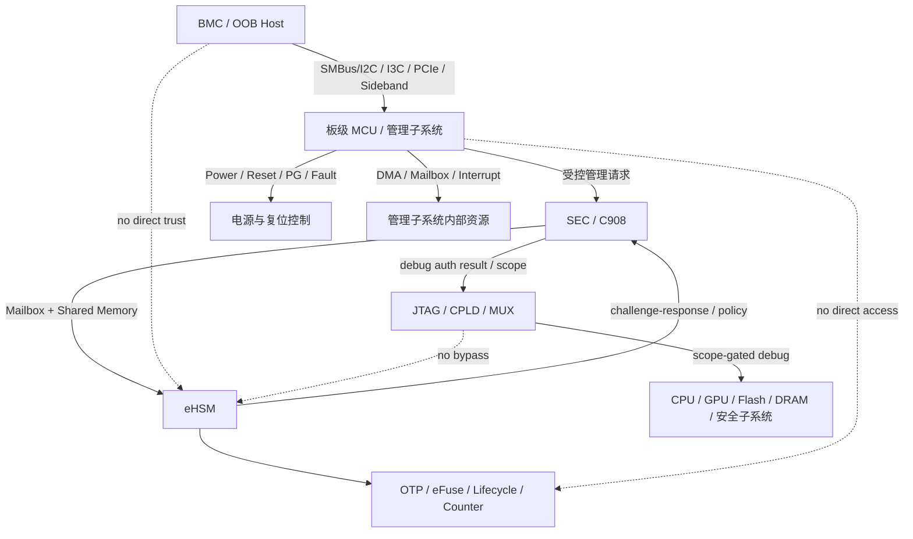
```mermaid
graph TD
    BMC[BMC / OOB Host] -->|SMBus/I2C / I3C / PCIe / Sideband| MCU[板级 MCU / 管理子系统]
    MCU -->|受控管理请求| SEC[SEC / C908]
    SEC -->|Mailbox + Shared Memory| EH[eHSM]
    EH --> OTP[OTP / eFuse / Lifecycle / Counter]

    MCU -->|Power / Reset / PG / Fault| PWR[电源与复位控制]
    MCU -->|DMA / Mailbox / Interrupt| MGMT[管理子系统内部资源]

    JTAG[JTAG / CPLD / MUX] -->|scope-gated debug| DBG[CPU / GPU / Flash / DRAM / 安全子系统]
    SEC -->|debug auth result / scope| JTAG
    EH -->|challenge-response / policy| SEC

    BMC -. no direct trust .-> EH
    MCU -. no direct access .-> OTP
    JTAG -. no bypass .-> EH
```

### 图下说明

1. BMC/OOB/板级 MCU 可以承载管理流程，但不直接进入 eHSM 或 OTP/eFuse。  
2. JTAG 的物理接入能力来自板级链路，但授权、scope 和生命周期裁决必须来自 SEC/eHSM。  
3. 电源、复位、DMA、mailbox 和中断都可能影响安全状态，不能作为纯普通外设看待。  
4. 管理子系统总体流程遵循 `SRC-005`，安全边界由 `01_constraints.md` 和 `02_baseline.md` 裁决。  

---

## 7.7 时序图

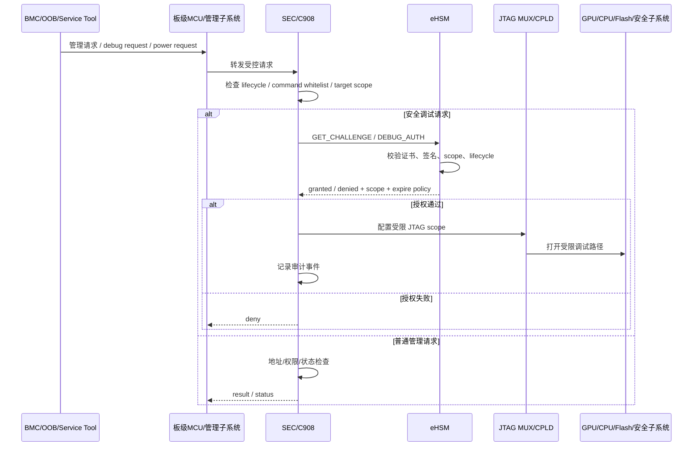
```mermaid
sequenceDiagram
    participant Tool as BMC/OOB/Service Tool
    participant MCU as 板级MCU/管理子系统
    participant SEC as SEC/C908
    participant EH as eHSM
    participant MUX as JTAG MUX/CPLD
    participant Target as GPU/CPU/Flash/安全子系统

    Tool->>MCU: 管理请求 / debug request / power request
    MCU->>SEC: 转发受控请求
    SEC->>SEC: 检查 lifecycle / command whitelist / target scope
    alt 安全调试请求
        SEC->>EH: GET_CHALLENGE / DEBUG_AUTH
        EH->>EH: 校验证书、签名、scope、lifecycle
        EH-->>SEC: granted / denied + scope + expire policy
        alt 授权通过
            SEC->>MUX: 配置受限 JTAG scope
            MUX->>Target: 打开受限调试路径
            SEC->>SEC: 记录审计事件
        else 授权失败
            SEC-->>MCU: deny
        end
    else 普通管理请求
        SEC->>SEC: 地址/权限/状态检查
        SEC-->>MCU: result / status
    end
```

### 图下说明

1. 管理工具不能直接打开 JTAG MUX，必须经 SEC/eHSM 授权。  
2. 授权结果必须包含 scope 和失效策略，不允许只返回“允许调试”。  
3. 失败路径必须保持默认关闭态并记录审计。  

---

## 7.8 带外通道安全策略

| 通道 | 管理用途 | 安全风险 | 安全要求 |
|---|---|---|---|
| SMBus/I2C | 低速状态查询、传感器、电源管理、OOB 管理 | 总线易被桥接或伪造管理请求 | 命令白名单、状态只读优先，高权限命令必须经 SEC/eHSM |
| I3C | 高性能带外业务、固件更新、高频状态采集 | 带宽更高，可能承载更大攻击面 | 数据路径隔离，更新/调试/provisioning 必须鉴权 |
| SPI/QSPI | NOR Flash、板级 MCU 接口 | 可影响固件存储和启动介质 | Flash 更新必须验签，写操作需 lifecycle gating |
| PCIe VDM | 带外数据 over PCIe（当前暂不支持） | 若启用可能混入 Host 数据面 | 默认关闭；启用前纳入 Host 不可信模型 |
| UART | 调试输入输出（当前暂不支持） | 常被作为开发后门 | 默认关闭；启用必须按 debug 接口管控 |
| JTAG | GPU/CPU/DRAM/Flash/安全子系统调试 | 最高风险，可直接绕过运行态保护 | USER 默认关闭，需 challenge-response、scope bitmap、MUX gating、审计 |

---

## 7.9 JTAG 安全设计

### 7.9.1 `SRC-005` JTAG 能力输入

`SRC-005` 描述 JTAG 需要支持以下能力：

- 可接入 BMC，链路形态为 BMC -> UBB -> OAM -> 板级 MCU/GPU。
- 可接入 GPU 芯片 JTAGBUS，访问寄存器空间和 DRAM。
- 可接入 GPU 芯片安全子系统，定位安全子系统问题。
- 可接入 CPU 调试单元，定位 CPU 固件问题。
- 可访问 GPU Flash，定位固件问题和更新固件。
- 可接入板级 MCU，定位板级 MCU 问题和更新 MCU 固件。
- 可用于 GPU 芯片边界扫描和板级 MCU 边界扫描。
- EVB/SLT 板提供 JTAG 接口，ATE/LB 板复用 DFT JTAG IO。

### 7.9.2 安全裁决

上述能力不作为默认开放能力继承。安全方案裁决如下：

- `[CONFIRMED]` USER/PROD 生命周期下 JTAG 默认关闭。
- `[CONFIRMED]` JTAG 访问 GPU 寄存器、DRAM、Flash、安全子系统、CPU 调试单元前必须通过 debug auth。
- `[CONFIRMED]` JTAG 控制必须输出 scope bitmap，至少区分 CPU、GPU、Flash、DRAM、安全子系统、板级 MCU、边界扫描。
- `[CONFIRMED]` JTAG MUX / CPLD / 板级控制单元必须接受 SEC/eHSM 授权结果，不得有常开或板级直通模式。
- `[CONFIRMED]` JTAG 授权必须有自动关闭、异常复位关闭、生命周期切换关闭和审计记录。
- `[ASSUMED]` ATE/LB/EVB/SLT 阶段可允许更宽松的 JTAG 策略，但进入 USER 前必须清理或锁定测试路径。

### 7.9.3 JTAG scope 建议

| Scope | 默认 USER | 允许阶段 | 授权要求 |
|---|---|---|---|
| CPU halt / single-step | 关闭 | DEV / RMA | debug auth + time limit |
| GPU register access | 关闭 | DEV / RMA | debug auth + target whitelist |
| DRAM access | 关闭 | DEV / RMA | debug auth + memory range whitelist |
| Flash access / update | 关闭 | MANU / RMA | signed image + debug/update auth |
| 安全子系统访问 | 关闭 | RMA 特批 | eHSM debug auth + narrow scope + audit |
| 板级 MCU 调试 | 关闭 | DEV / MANU / RMA | board debug auth + audit |
| Boundary scan | 关闭 | ATE / SLT / MANU | manufacturing lifecycle gating |

---

## 7.10 DMA / Mailbox / 中断 / 互斥访问策略

### 7.10.1 DMA 策略

`SRC-005` 提到 CPU 子系统采用通用 AXI DMA，内部 CPU 分配独立 DMA 通道，低速外设绑定物理 DMA 通道。安全要求如下：

- `[CONFIRMED]` DMA 只能访问普通 staging buffer、普通数据 buffer 和经 firewall 显式允许的区域。
- `[CONFIRMED]` DMA 不得访问 eHSM、OTP/eFuse、Secure SRAM、SEC1/SEC2 执行区、recovery 区、证书/策略区和安全共享缓冲区。
- `[CONFIRMED]` DMA 访问必须带 UserID 或等价 master 标识，并经 firewall 策略检查。
- `[ASSUMED]` 低速外设 DMA 通道应默认最小权限，按外设绑定固定访问范围。

### 7.10.2 Mailbox / 中断策略

- `[CONFIRMED]` 管理子系统 mailbox 和中断只作为协作机制，不得直接成为 eHSM 安全服务入口。
- `[CONFIRMED]` 安全服务请求必须进入 SEC/C908 收敛层，由 SEC 执行参数、地址、lifecycle、权限检查。
- `[CONFIRMED]` 对安全状态有影响的中断必须可屏蔽、可追踪、可审计。

### 7.10.3 互斥访问策略

`SRC-005` 中 CPU 子系统互斥访问机制可用于普通共享资源协调，但安全设计要求如下：

- `[CONFIRMED]` 互斥寄存器不能替代权限检查。
- `[CONFIRMED]` 互斥成功不代表具备访问安全资源的权限。
- `[ASSUMED]` 若互斥寄存器用于管理固件与安全服务协作，必须增加 caller、resource_id、lifecycle 和 timeout 语义。

---

## 7.11 电源、上下电和复位安全策略

`SRC-005` 描述板级 MCU 负责 GPU 电源开关、上下电顺序管理、非主电源电流检测、电源初始化配置、电源异常响应和定位。安全设计要求如下：

- `[CONFIRMED]` 影响 GPU 芯片、SEC、eHSM、Flash、DRAM 或安全状态的复位/掉电/PowerBrake 信号必须进入安全状态机。
- `[CONFIRMED]` USER/PROD 下不得通过板级复位流程绕过 secure boot 或 rollback 检查。
- `[CONFIRMED]` 异常复位后 debug 默认关闭，JTAG scope 清零。
- `[CONFIRMED]` 电源异常、PowerBrake、PG/FAULT 事件若影响 attestation 可信状态，必须进入状态记录或报告摘要。
- `[ASSUMED]` 板级 MCU 可执行电源策略动作，但高安全影响动作需由 SEC 状态机确认或记录。

---

## 7.12 单 Die / 双 Die 与板级绑定

`SRC-005` 描述单 Die / 双 Die 场景下：

- 带内管理单/双 Die 封装物理通道都只有一个 PCIe（DIE0 出）。
- 除 DRAM 地址空间外，两 Die 地址空间需要 BAR 地址分别映射。
- 带外管理对外只呈现一个管理设备，硬件接口对外只 DIE0 出 OOB 接口。
- 原则上不建议外部感知内部单 Die / 双 Die 差异。
- CE 调度、Profiling、功耗管理可能涉及跨 Die 或双 Die 资源。

安全设计要求如下：

- `[CONFIRMED]` 单 Die / 双 Die 差异不应暴露为安全策略绕过路径。
- `[CONFIRMED]` 跨 Die 访问必须经过地址映射、权限和 firewall 检查。
- `[ASSUMED]` board binding / die binding 应进入 attestation measurement 或状态摘要。
- `[TBD]` 双 Die 场景是否需要主/从 Die 分别出具证明，或由主 Die 汇总证明，需与 attestation 方案联动冻结。
- `[TBD]` board binding 是否首版默认参与 firmware verify decision，需与产品形态和制造流程一起冻结。

---

## 7.13 与实现层的映射关系

| 本章主题 | 对应实现层文件 |
|---|---|
| OOB 请求、JTAG 授权代理、状态查询接口 | `04_impl_design/mailbox_if.md` |
| board/die binding、debug state、电源/复位异常状态进入报告 | `04_impl_design/spdm_report.md` |
| MANU/ATE/SLT 阶段 JTAG 策略、USER 前测试路径清理 | `04_impl_design/manufacturing_provisioning.md` |
| lifecycle、debug enable、JTAG disable、control bits | `04_impl_design/efuse_key_fw_header_design.md` |
| DMA / firewall / UserID / 地址白名单 | `[TBD] firewall_access_rules` |

---

## 7.14 冻结敏感项

| Item | Why Sensitive | Current Status | Needed Before Freeze |
|---|---|---|---|
| JTAG scope bitmap | 影响 USER 态调试暴露面 | 未冻结 | 冻结 CPU/GPU/DRAM/Flash/安全子系统/板级 MCU scope |
| JTAG MUX / CPLD 控制权 | 影响是否存在板级直通绕过路径 | 未冻结 | 冻结由 SEC/eHSM 授权结果驱动的控制方式 |
| BMC / OOB provisioning 代理 | 影响制造链攻击面 | 未冻结 | 冻结是否允许 OOB 承担 provisioning proxy |
| 管理子系统 DMA 白名单 | 影响安全内存隔离 | 未冻结 | 冻结可访问 buffer、UserID、firewall 策略 |
| 电源/复位安全状态 | 影响 secure boot 和 attestation 一致性 | 未冻结 | 冻结哪些事件进入安全状态机和报告 |
| board/die binding | 影响镜像验证、证明和量产兼容性 | 未冻结 | 冻结首版是否启用及字段位置 |

---

## 7.15 开放问题

1. JTAG scope bitmap 最终由 eHSM 原生位图直接承载，还是由 SEC 做 SoC 级二次映射？  
2. CPLD / JTAG MUX 的控制寄存器由谁写入，是否需要硬件锁定防止板级直通？  
3. OOB/BMC 是否允许在 MANU 阶段作为 provisioning proxy，如果允许，工站鉴权如何绑定？  
4. 管理子系统 DMA 的 UserID 和 firewall region 如何划分？  
5. 电源异常、PowerBrake、PG/FAULT 是否进入 attestation report，还是只进入本地审计？  
6. 双 Die 场景下，board/die binding 是单 report 汇总还是双 Die 分别证明？  
7. EVB/SLT/ATE 阶段 JTAG 测试路径如何在 USER 前锁定和审计？  

---

## 7.16 本章结论

本章将 `SRC-005` 管理子系统方案纳入板级安全设计，并形成以下安全裁决：

- 管理子系统总体架构和系统流程原则上遵循。
- BMC / OOB / 板级 MCU / 管理子系统不进入 Root of Trust。
- SMBus/I2C、I3C、PCIe VDM、SPI、UART、JTAG 等带外链路只能作为受控链路，不能直接进入安全执行面。
- JTAG 文档中描述的高权限访问能力不能按默认功能开放，必须经 lifecycle、debug auth、scope bitmap、MUX gating 和审计控制。
- 管理子系统 DMA、mailbox、中断、互斥访问、电源复位控制必须纳入 firewall、状态机和审计策略。
- 单 Die / 双 Die、board binding / die binding 需要与镜像验证、attestation 和制造流程联动冻结。

后续若 `SRC-005` 补充字段级接口、JTAG MUX 控制、DMA region、OOB provisioning 或电源复位状态机，本章及 `06_interface.md`、`10_full_design.md`、实现级文档必须同步更新。
---
# 8. Root of Trust、密钥体系与证书体系


> 文档定位：NGU800 / NGU800P 章节级正式详设  
> 章节文件：`security_workflow/03_detailed_design/02_key_cert.md`  
> 当前状态：V1.0（基于当前约束、baseline 与输入资料收敛）  
> 设计标记口径：`[CONFIRMED] / [ASSUMED] / [TBD]`

---

## 8.1 本章目标

本章定义 NGU800 的 Root of Trust、密钥体系、证书体系和双算法映射口径，明确：

1. Root of Trust 的归属和边界
2. UDS / Root Secret / DRK / 各分支业务密钥的层级关系
3. 固件验签、固件解密、设备证明、调试鉴权所依赖的 key branch
4. 证书链 / trust anchor / signer hash 的项目采用策略
5. 国密与国际算法栈在 key / cert / report / FW header 中的统一承载方式
6. 与实现层文件的映射关系：
   - `04_impl_design/efuse_key_fw_header_design.md`
   - `04_impl_design/spdm_report.md`
   - `04_impl_design/manufacturing_provisioning.md`
   - `04_impl_design/mailbox_if.md`

---

## 8.2 生效约束 ID

- `C-ROOT-01`
- `C-BOOT-04`
- `C-IF-01`
- `C-KEY-01`
- `C-KEY-02`
- `C-ATT-01`
- `C-DEBUG-02`
- `C-HOST-01`
- `C-ACCESS-01`
- `C-ACCESS-02`
- `C-MFG-01`
- `C-UPDATE-01`

---

## 8.3 生效 Baseline 决策

### 8.3.1 Root of Trust
- `[CONFIRMED]` Root of Trust = eHSM
- `[CONFIRMED]` Root Key / Root Secret 仅由 eHSM 使用
- `[CONFIRMED]` BootROM 不持有 Root Private Key

### 8.3.2 私钥边界
- `[CONFIRMED]` 私钥不得离开 eHSM
- `[CONFIRMED]` Host / 普通核 / 管理核 不得直接访问私钥
- `[CONFIRMED]` 所有正式安全路径 crypto 必须走 eHSM

### 8.3.3 双算法策略
- `[CONFIRMED]` 方案必须同时覆盖国密与国际算法两套栈
- `[CONFIRMED]` 结构体和报文字段必须显式携带 `algo_family / hash_algo / sig_algo / enc_algo`
- `[ASSUMED]` 首版实现可按产品形态选择默认主算法栈，但结构上不得丢失双栈能力

---

## 8.4 设计要求

### 8.4.1 本章必须回答的问题

1. Root Secret / UDS 放在哪里，谁使用？
2. Device Root Key（DRK）如何从根种子派生？
3. 固件验签根和固件解密根如何区分？
4. Attestation 与 Debug Auth 是否复用一套根？
5. 固件验签采用“OTP 固化公钥摘要”还是“完整 cert chain”？
6. 设备证明采用“Device Identity Key”还是“Alias Key / Session Key”？
7. 国密 / 国际算法如何在同一套结构中共存？
8. 制造灌装阶段具体写什么、锁什么、清理什么？

### 8.4.2 不得违反的边界

- BootROM 不得成为密钥管理中心
- Host 不得持有或缓存设备私钥
- 证书链策略不得脱离 Root / OTP / lifecycle 约束单独定义
- 任何 key branch 都不得绕过 lifecycle gating
- 量产 USER 态不得保留测试 trust anchor 或测试 signer

---

## 8.5 架构图

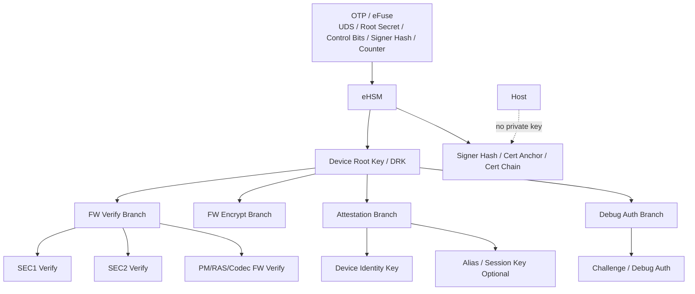
```mermaid
graph TD
    OTP[OTP / eFuse
UDS / Root Secret / Control Bits / Signer Hash / Counter] --> EH[eHSM]
    EH --> DRK[Device Root Key / DRK]
    DRK --> FWV[FW Verify Branch]
    DRK --> FWE[FW Encrypt Branch]
    DRK --> ATT[Attestation Branch]
    DRK --> DBG[Debug Auth Branch]

    FWV --> S1[SEC1 Verify]
    FWV --> S2[SEC2 Verify]
    FWV --> OTH[PM/RAS/Codec FW Verify]

    ATT --> DI[Device Identity Key]
    ATT --> ALIAS[Alias / Session Key Optional]

    DBG --> DAUTH[Challenge / Debug Auth]

    EH --> CERT[Signer Hash / Cert Anchor / Cert Chain]
    Host[Host] -. no private key .-> CERT
```

### 图下说明

1. OTP/eFuse 保存的是**根材料、控制位、signer anchor、counter**，而不是让普通软件直接读取的明文密钥仓库。  
2. eHSM 是唯一合法的 key usage 执行面。  
3. DRK 是项目内部逻辑层次，不要求一定以明文字段形式存在，但要求在设计语义上作为各分支 key 的共同上游。  
4. 固件验签、设备证明、调试鉴权在工程上建议分成不同 key branch，避免权限耦合。  

---

## 8.6 时序图

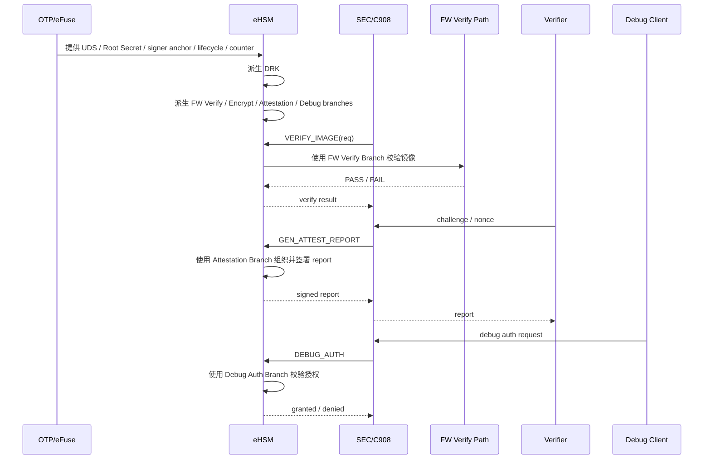
```mermaid
sequenceDiagram
    participant OTP as OTP/eFuse
    participant EH as eHSM
    participant SEC as SEC/C908
    participant FW as FW Verify Path
    participant V as Verifier
    participant DBG as Debug Client

    OTP->>EH: 提供 UDS / Root Secret / signer anchor / lifecycle / counter
    EH->>EH: 派生 DRK
    EH->>EH: 派生 FW Verify / Encrypt / Attestation / Debug branches

    SEC->>EH: VERIFY_IMAGE(req)
    EH->>FW: 使用 FW Verify Branch 校验镜像
    FW-->>EH: PASS / FAIL
    EH-->>SEC: verify result

    V->>SEC: challenge / nonce
    SEC->>EH: GEN_ATTEST_REPORT
    EH->>EH: 使用 Attestation Branch 组织并签署 report
    EH-->>SEC: signed report
    SEC-->>V: report

    DBG->>SEC: debug auth request
    SEC->>EH: DEBUG_AUTH
    EH->>EH: 使用 Debug Auth Branch 校验授权
    EH-->>SEC: granted / denied
```

### 图下说明

1. 所有 key branch 都从 Root / UDS 语义上派生，而不是离散孤立存在。  
2. 固件验签、设备证明、调试鉴权通过不同 branch 可降低权限串扰。  
3. Host / Verifier / Debug Client 都不能直接操作私钥，只能通过 SEC → eHSM 的受控路径发起请求。  

---

## 8.7 Root of Trust 设计

### 8.7.1 定义

本项目中的 Root of Trust 由以下三部分共同构成：

| 组件 | 职责 |
|---|---|
| OTP / eFuse | 持久保存根种子、控制位、signer anchor、counter、lifecycle 状态 |
| eHSM | 使用根种子，提供 crypto / verify / key / lifecycle / debug auth 服务 |
| BootROM | 最早启动编排者，负责把控制流程带到安全验证路径，但不是密码学根 |

### 8.7.2 当前裁决

- `[CONFIRMED]` Root of Trust 的“根使用权”归 eHSM
- `[CONFIRMED]` BootROM 属于启动链的 earliest code，但不等于密码学根
- `[CONFIRMED]` Root Secret / Root Key 材料不应作为软件可读资产暴露
- `[ASSUMED]` 若硬件实现上存在部分 Root 材料对 BootROM 的最小可见形式，也不得被视为可复用私钥材料

### 8.7.3 与启动链的关系

Root of Trust 的责任不是“替 BootROM 做所有事情”，而是：

1. 提供信任基础（OTP / Root Secret / signer anchor）
2. 提供首个密码学验证能力（eHSM）
3. 约束后续所有执行放行和生命周期行为

---

## 8.8 密钥对象表

### 8.8.1 关键密钥对象

| Key Object | 作用 | 是否可导出 | 推荐存储 / 使用位置 | 生命周期限制 |
|---|---|---|---|---|
| UDS / Root Secret | 根种子 | 否 | OTP/eFuse → eHSM 使用 | 全生命周期受控 |
| DRK | 设备根派生密钥 | 否 | eHSM 内部 | 全生命周期受控 |
| FW Verify Root | 固件验签根 | 否（私钥）/是（公钥或摘要） | eHSM / cert anchor | USER 必须受控 |
| FW Encrypt Key / KEK | 固件机密性保护，至少对 SEC1 强制启用 | 否 | eHSM | SEC1 强制；SEC2/后续关键固件按产品策略启用 |
| Image CEK / wrapped CEK | 单镜像或镜像包内容加密密钥及其封装结果 | 否（CEK 明文不得离开 eHSM） | 镜像头 wrapped blob + eHSM unwrap | 与 `image_type / key_slot / lifecycle` 绑定 |
| Attestation Seed | 设备证明上游种子 | 否 | eHSM | USER / DEBUG/RMA 受控 |
| Device Identity Key | 设备证明私钥 | 否 | eHSM | 不得导出 |
| Alias / Session Key | 证明扩展私钥 | 否 | eHSM | `[ASSUMED]` 首版可选 |
| Debug Auth Seed / Key | 调试鉴权 | 否 | eHSM | DEBUG/RMA 受控 |
| Signer Hash / Anchor | 固件验签锚点 | 可读摘要 | OTP/eFuse / cert block | USER 必须冻结 |

### 8.8.2 当前项目建议

- `[CONFIRMED]` UDS / Root Secret 为最上游根材料
- `[CONFIRMED]` 固件验签、设备证明、调试鉴权不应直接共用同一把外部暴露身份，而应在语义上分 branch
- `[ASSUMED]` 首版可先在实现上减少 branch 数量，但结构设计必须预留分支能力

---

## 8.9 密钥层级（Key Hierarchy）

### 8.9.1 推荐逻辑层级

```text
UDS / Root Secret
    ↓ KDF
Device Root Key (DRK)
    ↓───────────────┬───────────────────┬───────────────────┬───────────────────┐
    ↓               ↓                   ↓                   ↓
FW Verify Branch    FW Encrypt Branch   Attestation Branch  Debug Auth Branch
```

### 8.9.2 设计理由

#### FW Verify Branch
用于：
- SEC1 / SEC2 / 后续微核镜像签名校验
- signer hash / anchor 匹配
- 吊销 / 版本 / trust chain 判定

#### FW Encrypt Branch
用于：
- 镜像解密
- FW_KEK / CEK / wrapped CEK 路径
- `NGU800:FW:ENC` 与 `NGU800:WRAP:CEK` 语义标签
- `[CONFIRMED]` 对 SEC1 为强制启用，SEC1 解密 / unwrap 必须由 eHSM / 安全子系统受控密码服务完成
- `[ASSUMED]` 对 SEC2、PM、RAS、Codec 等后续关键固件按产品安全策略启用；USER/PROD 产品形态默认建议签名 + 加密
- `[TBD]` 除 SEC1 外，哪些非敏感运行期镜像允许签名 only，需由产品安全策略冻结

#### Attestation Branch
用于：
- Device Identity Key
- Alias / Session-bound attestation key
- 签署 report / attestation response

#### Debug Auth Branch
用于：
- challenge-response
- 调试授权校验
- scope / time / lifecycle 相关鉴权

### 8.9.3 当前裁决

- `[CONFIRMED]` FW Verify 和 Attestation 不能混为一条“无边界通用签名私钥”
- `[CONFIRMED]` FW Encrypt Branch 至少对 SEC1 强制启用，且 key slot / key_id 必须与 `image_type = SEC1` 和 lifecycle policy 绑定
- `[CONFIRMED]` Debug Auth 必须有独立控制面，不能简单复用普通 attestation 成功即开 debug
- `[ASSUMED]` DRK 是否在硬件实现中显式存在为中间寄存态不重要，重要的是语义上 branch 上游唯一且受控

---

## 8.10 证书体系设计

### 8.10.1 当前项目面临的两种模型

| 模型 | 描述 | 优点 | 风险 |
|---|---|---|---|
| Hash Anchor 模型 | OTP 中保存 signer hash / root hash；镜像或报告中带 signer/cert 信息 | 实现轻、适合首版 | 灵活度受限 |
| Full Cert Chain 模型 | 镜像 / report 中直接携带完整 cert chain | 标准化程度高，适合长期扩展 | 体积大、实现复杂 |

### 8.10.2 当前建议

#### 固件验签路径
- `[CONFIRMED]` 首版优先采用 **OTP 固化 signer hash / trust anchor** 模型
- `[ASSUMED]` 可预留镜像中携带 cert chain blob 的能力
- `[TBD]` 是否直接首版全面切到 X.509 需看项目证书基础设施成熟度

#### 设备证明路径
- `[CONFIRMED]` report 中必须支持：
  - Hash Anchor
  - 可选 Cert Chain Block
- `[ASSUMED]` 首版 verifier 可本地预置 trust anchor，通过 report 中的 signer / anchor hash 完成快速定位
- `[TBD]` 是否要求 report 默认内嵌完整 cert chain，需结合客户接入方式和 SPDM verifier 能力冻结

### 8.10.3 证书对象表

| Cert / Anchor Object | 用途 | 建议位置 |
|---|---|---|
| FW Signer Hash Slot0 | 固件验签国密 signer 锚点 | OTP/eFuse |
| FW Signer Hash Slot1 | 固件验签国际 signer 锚点 | OTP/eFuse |
| Debug Auth Anchor | 调试授权锚点 | OTP/eFuse |
| Attestation Root Hash | 设备证明锚点 | OTP/eFuse |
| Optional Cert Chain Blob | 报告 / 镜像附带链 | 镜像 / report block |

---

## 8.11 推荐 KDF Label

> 说明：本节给出项目内部建议语义标签，不代表必须锁死到某一种 KDF 标准实现。  
> 若后续采用 HKDF-SM3 / HKDF-SHA256 / 项目自定义 KDF，只要 label 语义保持稳定即可。

| Label | 用途 |
|---|---|
| `NGU800:DRK` | 从 UDS / Root Secret 派生设备根密钥 |
| `NGU800:FW:VERIFY` | 固件验签 branch |
| `NGU800:FW:ENC` | 固件加密 / 解密 branch |
| `NGU800:ATTEST:DEV` | 设备证明 Device Identity Key |
| `NGU800:ATTEST:ALIAS` | Alias / Session 证明 key |
| `NGU800:DEBUG:AUTH` | 调试鉴权 |
| `NGU800:REPORT:BIND` | 报告绑定（nonce / session 相关） |
| `NGU800:WRAP:CEK` | 镜像 CEK wrap / unwrap |

### 8.11.1 使用规则

- `[CONFIRMED]` 不同业务场景必须使用不同 Label
- `[CONFIRMED]` 不得用同一个 Label 既做固件验签根又做调试鉴权
- `[CONFIRMED]` SEC1 的 FW Encrypt 派生必须绑定 `image_type = SEC1`、`key_slot`、lifecycle policy 和 rollback version，避免 wrapped CEK 被跨镜像复用
- `[ASSUMED]` 若国密和国际算法的 KDF 内核不同，label 语义仍应保持一致

---

## 8.12 双算法映射

### 8.12.1 国密路径

| 用途 | 建议算法 |
|---|---|
| Hash | SM3 |
| Signature | SM2 |
| Encryption | SM4 |
| KDF | SM3-based KDF / HKDF-SM3 compatible |

### 8.12.2 国际路径

| 用途 | 建议算法 |
|---|---|
| Hash | SHA-256 / SHA-384 |
| Signature | ECDSA P-256 / P-384 或 RSA-3072 |
| Encryption | AES-256-GCM / AES-CTR + MAC |
| KDF | HKDF-SHA256 / HKDF-SHA384 |

### 8.12.3 结构体层要求

以下结构中必须显式携带算法族字段：

- FW Header
- Attestation Report Header
- Mailbox request/response 中涉及签名 / hash / enc 的命令
- Provisioning blob metadata

### 8.12.4 当前裁决

- `[CONFIRMED]` 所有项目结构必须保留双算法表达能力
- `[ASSUMED]` 首版产品出货可以只启用其中一套主路径，但不能把结构设计做死
- `[TBD]` 各产品线国密/国际算法默认选择策略需在产品规划层冻结

---

## 8.13 与启动 / 证明 / 调试路径的关系

### 8.13.1 启动路径
- 固件验签 branch 为 SEC1 / SEC2 / PM / RAS / Codec 等镜像提供验证能力
- 固件加密 branch 至少为 SEC1 提供强制解密能力，并为 SEC2 / 后续关键运行期固件提供按策略启用的机密性保护能力
- rollback floor 需与 OTP counter 绑定
- signer hash / revoke / lifecycle mask 必须进入 verify decision

### 8.13.2 证明路径
- Attestation branch 负责 report 签名
- report 中必须带出 secure boot / lifecycle / debug / firmware version 摘要
- verifier 不能只看签名而不看状态

### 8.13.3 调试路径
- Debug auth branch 独立于普通 attestation
- 进入 RMA / DEBUG 时，challenge-response 必须基于独立授权链
- 不得把“报告签名成功”直接视为“调试可开放”

---

## 8.14 制造、灌装与密钥体系的关系

### 8.14.1 制造阶段必须完成的 key / anchor 对象

- UDS / Root Secret
- FW_KEK / image protect key 或其 eHSM 内部派生种子
- FW signer hash / trust anchor
- Debug auth anchor
- Attestation anchor / identity seed
- Counter 初值
- secure boot / debug / attestation / rollback 控制位

### 8.14.2 USER 前必须完成的动作

1. 锁定 Root / anchor 区
2. 锁定 SEC1 解密相关 key slot / FW_KEK 策略 / signer anchor / rollback counter
3. 清理测试 key / 测试 cert / 测试 debug trust
4. 开启 secure boot
5. 开启 anti-rollback
6. 关闭未授权 debug
7. 推进 lifecycle 到 USER
8. 留存审计日志

### 8.14.3 当前裁决

- `[CONFIRMED]` 制造阶段必须定义 key 注入、锁定、审计，不得停留在抽象口号
- `[CONFIRMED]` USER 生命周期下不允许残留测试信任锚
- `[ASSUMED]` 优先采用“Seed/UDS 注入 + eHSM 内部派生”的模式
- `[TBD]` 是否首版支持全量 cert chain 灌装取决于工站和证书服务准备度

---

## 8.15 与实现层的映射关系

| 本章主题 | 对应实现层文件 |
|---|---|
| Root / UDS / DRK / signer hash / control bits | `04_impl_design/efuse_key_fw_header_design.md` |
| Device Identity / report / cert block | `04_impl_design/spdm_report.md` |
| provisioning / lock / lifecycle / audit | `04_impl_design/manufacturing_provisioning.md` |
| key derive / verify / debug auth 命令面 | `04_impl_design/mailbox_if.md` |

---

## 8.16 冻结敏感项

| Item | Why Sensitive | Current Status | Needed Before Freeze |
|---|---|---|---|
| UDS / Root Secret 注入模式 | 影响制造链和 Root 暴露面 | 部分收敛 | 冻结“直接注入”还是“seed 派生” |
| signer hash vs full cert chain | 影响镜像格式、证明格式、制造工站 | 部分收敛 | 冻结首版采用模型 |
| SEC2/后续运行期镜像加密分级 | 影响 FW Encrypt Branch、镜像头和产品策略 | 未完全冻结 | 冻结除 SEC1 外哪些镜像允许签名 only |
| Attestation 是否首版启用 Alias Key | 影响 report / cert / verifier 复杂度 | 未完全冻结 | 冻结首版 identity model |
| Debug Auth 与 Attestation 的锚点关系 | 影响调试授权链路 | 未完全冻结 | 冻结是否独立 anchor |
| 双算法默认策略 | 影响产品线和测试矩阵 | 未完全冻结 | 冻结产品策略 |

---

## 8.17 开放问题

1. DRK 是否需要在工程文档中显式作为中间对象对外暴露，还是只保留语义层定义？  
2. FW Verify 与 Attestation 是否共享部分上游派生材料但逻辑分离，还是完全独立 branch？  
3. Attestation 首版是否仅 Device Identity Key 签名就够，还是必须同步规划 Alias Key？  
4. 固件验签首版是否只用 OTP signer hash，不携带完整 cert chain？  
5. Debug auth 的 anchor 是否和 attestation anchor 完全独立？  
6. 除 SEC1 外，SEC2 / PM / RAS / Codec 中哪些镜像允许在特定产品阶段采用签名 only？  

---

## 8.18 本章结论

本章已将 NGU800 的 Root、密钥体系与证书体系收敛到当前可评审的正式口径：

- Root of Trust = eHSM，BootROM 不是密码学根  
- UDS / Root Secret 是最上游根材料  
- 固件验签、设备证明、调试鉴权必须在逻辑上分 branch  
- FW Encrypt Branch 至少对 SEC1 强制启用，SEC1 解密必须由 eHSM / 安全子系统受控密码服务完成  
- 私钥不得离开 eHSM  
- signer hash / trust anchor / cert chain 需要按项目首版策略冻结  
- 国密与国际算法必须在结构层共存  
- 制造阶段必须定义 key 注入、锁定、清理和生命周期推进动作  

后续若 `efuse_key_fw_header_design.md`、`spdm_report.md`、`manufacturing_provisioning.md`、`mailbox_if.md` 冻结字段变更，本章必须同步更新。
---
# 9. 制造、灌装、部署与 RMA


> 文档定位：NGU800 / NGU800P 章节级正式详设  
> 章节文件：`security_workflow/03_detailed_design/07_manufacturing_rma.md`  
> 当前状态：V1.0（基于当前约束、baseline 与实现级制造设计收敛）  
> 设计标记口径：`[CONFIRMED] / [ASSUMED] / [TBD]`

---

## 9.1 本章目标

本章定义 NGU800 在制造、灌装、量产冻结、部署与返修（RMA）阶段的安全设计，重点明确：

1. 制造阶段与生命周期状态的映射关系
2. Root / UDS / signer anchor / debug anchor / attestation anchor / counter 的灌装对象与顺序
3. SEC1 强制加密所需 FW_KEK / image protect key 的灌装、锁定和 USER 前冻结要求
4. OTP / eFuse 写入、校验、锁定、审计的控制要求
5. MANU → USER 的冻结动作集合
6. 量产部署后的状态约束
7. RMA / DEBUG 场景下的授权、调试、恢复与重新冻结规则
8. 与实现层文件的映射关系：
   - `04_impl_design/manufacturing_provisioning.md`
   - `04_impl_design/efuse_key_fw_header_design.md`
   - `04_impl_design/mailbox_if.md`
   - `04_impl_design/spdm_report.md`

---

## 9.2 生效约束 ID

- `C-ROOT-01`
- `C-KEY-01`
- `C-KEY-02`
- `C-DEBUG-01`
- `C-DEBUG-02`
- `C-HOST-01`
- `C-ATT-01`
- `C-UPDATE-01`
- `C-BOOT-04`
- `C-MFG-01`
- `C-ACCESS-01`

---

## 9.3 生效 Baseline 决策

### 9.3.1 制造控制面
- `[CONFIRMED]` Provisioning 流程必须经 SEC/C908 控制面收敛
- `[CONFIRMED]` eHSM 是唯一 Root 材料写入、锁定、lifecycle 状态变更的安全执行面
- `[CONFIRMED]` Host / BMC / 工站不进入信任链，只是链路承载者或受控请求发起者

### 9.3.2 量产冻结
- `[CONFIRMED]` 进入 USER 前必须完成 secure boot、anti-rollback、debug 关闭、测试 trust 清理
- `[CONFIRMED]` Root / signer / debug / attestation 相关敏感对象必须完成锁定
- `[CONFIRMED]` SEC1 解密相关 key slot / FW_KEK 策略 / signer anchor / rollback counter 必须在 USER 前锁定
- `[CONFIRMED]` USER 生命周期不得默认开放未经授权的调试路径

### 9.3.3 RMA / DEBUG
- `[CONFIRMED]` 返修或 DEBUG 场景必须经过授权
- `[CONFIRMED]` 调试开启必须通过 challenge-response 或等价鉴权机制
- `[ASSUMED]` RMA 处理完成后，应恢复量产安全状态并形成审计闭环

---

## 9.4 设计要求

### 9.4.1 本章必须回答的问题

1. 制造阶段到底写哪些对象、按什么顺序写？
2. Root / UDS / signer / debug / attestation / counter 之间的先后关系是什么？
3. FW_KEK / image protect key 与 SEC1 signer anchor / rollback counter 如何在 USER 前锁定？
4. MANU 验证启动要检查哪些项目？
5. USER 冻结时必须关闭或清理哪些对象？
6. 量产出厂后哪些状态必须可被证明？
7. RMA / DEBUG 如何合法开启，又如何恢复？
8. 审计日志至少要记录哪些事件？
9. 制造工具、Host/BMC、SEC、eHSM 的职责边界在哪里？

### 9.4.2 不得违反的边界

- 不得允许工站或 Host 直接操作 eHSM 私有执行面
- 不得允许 Root / UDS / 私钥明文以普通软件资产形式长期存在
- 不得在 USER 生命周期保留测试 signer / 测试 cert / 测试 debug 白名单
- 不得在 USER 生命周期保留 SEC1 解密绕过策略或可被普通软件关闭的 SEC1 decrypt_required
- 不得在失败时报告“USER 冻结完成”
- 不得把 RMA/DEBUG 当成长期常开模式

---

## 9.5 架构图

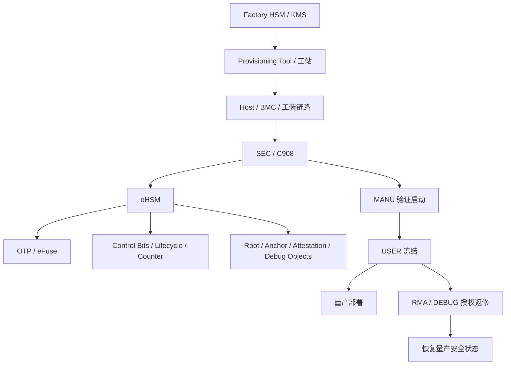
```mermaid
graph TD
    HSM[Factory HSM / KMS] --> TOOL[Provisioning Tool / 工站]
    TOOL --> HOST[Host / BMC / 工装链路]
    HOST --> SEC[SEC / C908]
    SEC --> EH[eHSM]
    EH --> OTP[OTP / eFuse]
    EH --> CFG[Control Bits / Lifecycle / Counter]
    EH --> KEY[Root / Anchor / Attestation / Debug Objects]

    SEC --> BOOT[MANU 验证启动]
    BOOT --> USER[USER 冻结]
    USER --> DEPLOY[量产部署]
    USER --> RMA[RMA / DEBUG 授权返修]
    RMA --> RESTORE[恢复量产安全状态]
```

### 图下说明

1. 工厂 HSM/KMS 是制造密钥材料的上游管理端，但不直接替代设备内部 Root of Trust。  
2. SEC/C908 是制造流程的控制面，eHSM 是真正执行 Root / OTP / lifecycle / lock 操作的安全执行面。  
3. USER 冻结不是单条命令，而是一组必须全部成功的冻结动作集合。  
4. RMA 路径是受控旁路，只能临时开放，并且必须回收。  

---

## 9.6 时序图

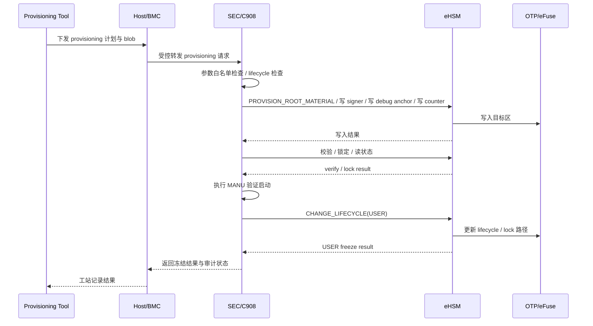
```mermaid
sequenceDiagram
    participant TOOL as Provisioning Tool
    participant HOST as Host/BMC
    participant SEC as SEC/C908
    participant EH as eHSM
    participant OTP as OTP/eFuse

    TOOL->>HOST: 下发 provisioning 计划与 blob
    HOST->>SEC: 受控转发 provisioning 请求
    SEC->>SEC: 参数白名单检查 / lifecycle 检查
    SEC->>EH: PROVISION_ROOT_MATERIAL / 写 signer / 写 debug anchor / 写 counter
    EH->>OTP: 写入目标区
    EH-->>SEC: 写入结果
    SEC->>EH: 校验 / 锁定 / 读状态
    EH-->>SEC: verify / lock result
    SEC->>SEC: 执行 MANU 验证启动
    SEC->>EH: CHANGE_LIFECYCLE(USER)
    EH->>OTP: 更新 lifecycle / lock 路径
    EH-->>SEC: USER freeze result
    SEC-->>HOST: 返回冻结结果与审计状态
    HOST-->>TOOL: 工站记录结果
```

### 图下说明

1. Provisioning Tool 不直接向 eHSM 发命令，而是通过 Host/BMC 链路与 SEC/C908 协作。  
2. 生命周期推进前，必须先完成写入校验和锁定。  
3. USER 冻结前必须先做 MANU 验证启动，确保量产条件已满足。  

---

## 9.7 生命周期与制造阶段映射

### 9.7.1 生命周期总体映射

| 生命周期 | 制造/部署语义 | 典型用途 | 默认安全策略 |
|---|---|---|---|
| TEST | 裸片 / 封测 / 初测 | 基础功能验证 | 可开放测试路径，不得等价于量产 |
| DEVE | 开发板 / EVB 调试 | 软件 bring-up、接口联调 | 可有限开放调试 |
| MANU | 正式制造 / 板级灌装 | 写入根材料、建立量产前状态 | 基础安全校验生效 |
| USER | 量产交付 | 面向客户部署 | 强制 secure boot、关闭未授权 debug |
| DEBUG / RMA | 受权返修 / 厂商分析 | 故障定位、临时调试 | 仅授权开启 |
| DEST | 销毁 | 退役 / 擦除 | 不再允许正常使用 |

### 9.7.2 制造阶段推荐细分

| 阶段 ID | 阶段名称 | 主要动作 |
|---|---|---|
| MFG-0 | 封测初测 | 测试路径、基础 bring-up、早期健康检查 |
| MFG-1 | 板级 bring-up | 电源、时钟、基础接口、主从Die连通 |
| MFG-2 | Provisioning 准备 | 工站认证、算法栈选择、blob 准备 |
| MFG-3 | Root / Anchor Provisioning | 写 UDS / Root / signer / debug / attest |
| MFG-4 | Control Bit Provisioning | 写 secure boot / debug / attestation / rollback 控制位 |
| MFG-5 | 校验与锁定 | 写入校验、锁位、状态确认、审计 |
| MFG-6 | MANU 验证启动 | 带验证的近量产启动检查 |
| MFG-7 | USER 冻结 | 清理测试 trust、推进 USER、关闭未授权 debug |
| MFG-8 | 出厂验收 | 形成最终记录、出厂状态确认 |

---

## 9.8 灌装交付项

### 9.8.1 必须灌装对象

| 对象 | 是否首版必须 | 说明 |
|---|---|---|
| UDS / Root Secret | 是 | 根种子 / Root 材料上游 |
| Root Key / Root KEK 材料 | 视模式 | 可直接写入，或由 UDS 内部派生 |
| FW Signer Hash / Trust Anchor | 是 | 支撑 SEC1 / SEC2 / 运行期 FW 验签 |
| FW_KEK / Image Protect Key | 是 | 支撑 SEC1 强制加密镜像的 CEK unwrap / 解密策略 |
| Debug Auth Anchor | 是 | 支撑 DEBUG/RMA 调试鉴权 |
| Attestation Seed / Anchor | 是 | 支撑设备证明 |
| Rollback Counter 初值 / 版本地板 | 是 | 支撑 anti-rollback |
| Secure Boot / Debug / Attestation / Rollback 控制位 | 是 | 建立量产策略 |
| Board Binding 信息 | 可选 | 视产品线策略启用 |
| Die Binding 信息 | 双Die 推荐 | 主从Die 一致性约束 |

### 9.8.2 禁止残留的对象

| 对象 | 原因 |
|---|---|
| 测试 signer key / 测试 cert anchor | USER 前必须清理 |
| 测试 debug 白名单 | USER 前必须清理 |
| 非量产 bypass 配置 | USER 前必须关闭 |
| 明文可导出的 Root 私钥 | 根本不允许存在于最终流程 |

---

## 9.9 灌装顺序设计

### 9.9.1 推荐顺序

```text
(1) 读取 lifecycle 与 OTP 当前状态
    ↓
(2) 校验设备处于允许 provisioning 的状态
    ↓
(3) 写入 UDS / Root Secret / Root 材料
    ↓
(4) 写入 FW signer hash / trust anchor
    ↓
(5) 写入 FW_KEK / image protect key 策略或其 eHSM 内部派生种子
    ↓
(6) 写入 Debug auth anchor
    ↓
(7) 写入 Attestation seed / anchor
    ↓
(8) 写入 counter 初值 / rollback floor
    ↓
(9) 写入 secure boot / FW encrypt / debug / attestation / rollback 控制位
    ↓
(10) 校验写入结果
    ↓
(11) 锁定 key / FW_KEK 策略 / anchor / control bits
    ↓
(12) 执行 MANU 验证启动
    ↓
(13) 执行 USER 冻结
```

### 9.9.2 顺序理由

- Root 材料必须先于 signer / attest / debug anchor 生效，否则没有可信根。  
- counter 初值必须在正式量产前建立，否则 anti-rollback 没有基线。  
- control bits 必须在信任锚完成注入后再打开，避免出现“策略已要求 secure boot，但锚尚未就绪”的中间态。  
- 锁定位只能在校验通过后执行，否则可能把错误数据永久锁死。  

---

## 9.10 Provisioning 接口设计口径

### 9.10.1 项目接口裁决

- `[CONFIRMED]` 制造相关动作必须复用 SEC/C908 → eHSM 的受控路径
- `[CONFIRMED]` Provisioning Tool 不得直接进入 eHSM 内部命令面
- `[CONFIRMED]` 制造相关命令只能在允许的 lifecycle 下可用

### 9.10.2 命令族

本章对应的实现级接口，以 `04_impl_design/mailbox_if.md` 为准，核心包括：

- `PROVISION_ROOT_MATERIAL`
- `CHANGE_LIFECYCLE`
- `READ_COUNTER`
- `INCREASE_COUNTER`（受策略控制）
- `GET_CHALLENGE`
- `DEBUG_AUTH`

### 9.10.3 章节级规则

1. `PROVISION_ROOT_MATERIAL` 只能在 MANU 或受控 provisioning 状态可用  
2. `CHANGE_LIFECYCLE(USER)` 必须晚于写入校验和锁定  
3. `DEBUG_AUTH` 在制造态仅用于必要的 bring-up / RMA，不得作为长期打开调试的替代  
4. 所有 provisioning blob 的地址和长度必须受 SEC 白名单和 eHSM 范围检查双重保护  

---

## 9.11 校验策略

### 9.11.1 写入后校验

每类 provisioning 写入后，至少需要以下检查：

1. 命令返回状态成功  
2. 若目标区允许读回，则做读回一致性校验  
3. 若目标区不允许直接读回，则通过：
   - eHSM 内部状态确认
   - 试运行校验
   - challenge / verify / report 侧间接确认
4. 状态必须进入工站审计记录  

### 9.11.2 MANU 验证启动最小检查项

| 检查项 | 说明 |
|---|---|
| SEC1 / SEC2 验签 | 核心启动链验证 |
| SEC1 解密 / unwrap | 验证 SEC1 签名 + 加密策略、FW_KEK / wrapped CEK 和输出 buffer 约束 |
| rollback counter 读取 | 反回滚路径验证 |
| lifecycle / control bits 读取 | 状态验证 |
| challenge / report 最小链路 | 证明能力基础验证 |
| debug 默认状态检查 | 验证未授权 debug 未默认放开 |

### 9.11.3 错误处理原则

- `[CONFIRMED]` 任一关键对象写入失败，不得继续推进 USER 冻结  
- `[CONFIRMED]` 锁定失败必须视为 provisioning 失败  
- `[ASSUMED]` 校验失败后设备可停留在 MANU / 故障态，而不是进入“半冻结 USER”状态  

---

## 9.12 锁定策略

### 9.12.1 必须锁定的对象

| 对象 | 锁定时机 | 说明 |
|---|---|---|
| Root / UDS 区 | 写入并校验通过后 | 防止重复覆盖 |
| signer hash / trust anchor 区 | 写入校验后 | 防止验签锚被替换 |
| FW_KEK / image protect key 策略 | 写入校验后 | 防止 SEC1 解密策略被替换或降级 |
| debug auth anchor 区 | 写入校验后 | 防止调试授权根被替换 |
| attestation anchor 区 | 写入校验后 | 防止证明身份根被替换 |
| control bits 区 | USER 冻结前 | 防止量产策略回退 |
| lifecycle 回退路径 | USER 推进后 | 防止回退到开发态 |

### 9.12.2 锁定原则

- `[CONFIRMED]` 锁定动作必须显式执行，不得假设“默认已锁”  
- `[CONFIRMED]` 锁定结果必须可审计  
- `[CONFIRMED]` 锁定失败不得推进生命周期  
- `[ASSUMED]` 若部分区支持一次性写入后天然只读，仍需在工程文档中显式标记为“已锁语义”  

---

## 9.13 USER 冻结动作

### 9.13.1 必须完成的动作集合

进入 USER 前，必须完成：

1. `SECURE_BOOT_EN = 1`
2. `DEBUG_AUTH_EN = 1`
3. `JTAG_FORCE_DISABLE = 1`
4. `ANTI_ROLLBACK_EN = 1`
5. `FW_ENCRYPT_EN = 1`，且至少覆盖 SEC1
6. Root / signer / debug / attestation / SEC1 解密相关 key slot / FW_KEK 策略完成锁定
7. 测试 signer / 测试 cert / 测试 debug 白名单全部清理
8. 如启用 attestation，则 `ATTEST_EN = 1`
9. 推进 lifecycle 到 USER
10. 锁定 lifecycle 回退路径
11. 生成冻结完成的审计记录

### 9.13.2 事务性要求

这些动作不一定由单条命令完成，但在流程语义上必须视为**一个事务性步骤集合**：

- 任何一步失败，都不得报告“USER 冻结成功”
- 失败后必须进入 MANU 故障处理流程
- 不得形成“部分已冻结、部分未冻结”的不可解释状态

---

## 9.14 部署阶段设计

### 9.14.1 量产部署后的默认状态

在 USER 生命周期下，默认应满足：

| 项目 | 期望状态 |
|---|---|
| Secure Boot | 开启 |
| SEC1 Image Protection | 签名 + 加密强制开启 |
| Anti-Rollback | 开启 |
| 未授权 Debug | 关闭 |
| 测试 Signer / Trust | 已清除 |
| Attestation | 按产品策略开启 |
| Provisioning 接口 | 关闭 |
| Lifecycle 回退 | 不允许 |

### 9.14.2 部署后可允许的操作

- 受控 firmware update
- attestation / report generation
- 状态查询
- 受策略控制的 challenge / 认证类请求

### 9.14.3 部署后禁止的操作

- 再次 provisioning Root 材料
- 覆盖 signer anchor
- 恢复测试 trust
- 直接打开 debug
- 回退 lifecycle 到开发态

---

## 9.15 RMA 规则

### 9.15.1 RMA 基本原则

RMA / DEBUG 不是普通用户态能力，而是：

> **受授权、可审计、可恢复的返修旁路**

必须满足：

1. 先鉴权，后开放  
2. 权限受 scope 和时间窗口约束  
3. 维修后必须恢复量产安全状态  
4. 全程可审计  

### 9.15.2 推荐流程

```text
接收返修设备
    ↓
校验工单 / 设备身份 / 厂商授权
    ↓
发起 challenge / debug auth
    ↓
在受限 scope 下开放调试能力
    ↓
读取故障信息 / 维修 / 受控刷写恢复
    ↓
重新恢复量产镜像和状态
    ↓
关闭调试能力
    ↓
恢复 USER 安全状态
    ↓
生成 RMA 审计结案记录
```

### 9.15.3 RMA 约束

- `[CONFIRMED]` 不得因为进入 RMA 就长期常开 debug  
- `[CONFIRMED]` 不得跳过 challenge / auth 直接开调试口  
- `[CONFIRMED]` 返修完成后不得带着测试 trust 或开放调试出厂  
- `[CONFIRMED]` RMA 不得长期开放 SEC1 解密绕过路径；rescue / recovery 镜像必须使用专用 signer / recovery trust，并保持 eHSM 受控解密或受控 recovery policy  
- `[ASSUMED]` RMA 完成后，建议重新生成与当前状态一致的最小 report / status 记录，用于归档  

---

## 9.16 审计模型

### 9.16.1 必须记录的事件

| Audit Event | 至少应记录的内容 |
|---|---|
| PROVISION_START | 设备 ID、工站 ID、时间、操作员、工单 |
| ROOT_WRITE | 写入对象类型、target slot、结果 |
| FW_KEK_WRITE | FW_KEK / image protect key 策略写入、slot、结果 |
| ANCHOR_WRITE | signer/debug/attest anchor 类型、结果 |
| CTRL_BITS_WRITE | 控制位变化前后、结果 |
| LOCK_APPLY | 锁定对象、结果 |
| MANU_BOOT_VERIFY | 验证启动结果、错误码 |
| USER_FREEZE | lifecycle 变化前后、结果 |
| RMA_AUTH | challenge / auth 结果、scope |
| RMA_CLOSE | 恢复状态、结案结果 |
| PROVISION_END | 总结果、日志索引 |

### 9.16.2 审计要求

- `[CONFIRMED]` 审计日志不得记录明文私钥或 Root 材料  
- `[CONFIRMED]` 审计日志必须至少可关联：
  - 设备
  - 工站
  - 时间
  - 操作员 / 工单
  - 结果
- `[ASSUMED]` 审计日志应支持导出到制造后台系统或至少可离线归档  

---

## 9.17 与其他章节 / 实现层的映射关系

| 本章主题 | 对应章节 / 实现层 |
|---|---|
| lifecycle 与冻结语义 | `03_detailed_design/04_lifecycle_debug.md` |
| Root / signer / control bits 灌装对象 | `04_impl_design/efuse_key_fw_header_design.md` |
| Provisioning 命令与 req/resp | `04_impl_design/mailbox_if.md` |
| report 中 lifecycle / debug / board 状态表达 | `04_impl_design/spdm_report.md` |
| 具体流程状态机 / 审计要求 | `04_impl_design/manufacturing_provisioning.md` |

---

## 9.18 冻结敏感项

| Item | Why Sensitive | Current Status | Needed Before Freeze |
|---|---|---|---|
| Root 注入模式（直接 Root vs Seed/UDS） | 影响制造链安全暴露面 | 部分收敛 | 冻结首版模式 |
| SEC2/后续运行期镜像是否全部强制加密 | 影响 FW_KEK 规划和量产镜像封装 | 未完全冻结 | 冻结除 SEC1 外的加密分级策略 |
| OTP 是否支持读回校验 | 影响校验策略 | 未完全冻结 | 冻结可读回区和不可读回区策略 |
| Provisioning 链路承载方式 | 影响工站 / Host / BMC 选型 | 未完全冻结 | 冻结首版工装路径 |
| 双Die 灌装是否联动事务 | 影响 OAM / 双Die 产品制造 | 未完全冻结 | 冻结联动策略 |
| RMA 恢复后是否强制再验收 | 影响售后流程与安全闭环 | 未完全冻结 | 冻结返修交付规则 |

---

## 9.19 开放问题

1. 首版是否完全采用“Seed/UDS 注入 + eHSM 内部派生”，还是保留直接 Root 材料写入模式？  
2. 不可读 OTP 区域的校验策略最终采用“状态确认”还是“试运行校验”？  
3. BMC / OOB-MCU 在某些产品形态下是否允许承担 provisioning 桥接角色？  
4. 双Die 产品是按单设备事务灌装，还是主/从 Die 分步灌装？  
5. RMA 结束后，是否要求强制重新生成 attestation / 状态摘要并归档？  
6. SEC2 / PM / RAS / Codec 是否首版全部强制加密，还是允许部分非敏感镜像签名 only？  

---

## 9.20 本章结论

本章已将 NGU800 的制造、灌装、部署与 RMA 路径收敛到当前可评审的正式口径：

- 制造必须通过 SEC/C908 控制面与 eHSM 安全执行面完成  
- UDS / Root / signer / debug / attestation / counter / control bits 的灌装顺序必须固定  
- SEC1 解密相关 key slot / FW_KEK 策略 / signer anchor / rollback counter 必须在 USER 前锁定  
- 锁定、校验和 USER 冻结必须显式化、事务化、可审计  
- 量产部署后必须保持 secure boot、anti-rollback、未授权 debug 关闭和测试 trust 清理  
- RMA 是受授权、可恢复、可审计的旁路，不得成为常开调试模式  

后续若 `manufacturing_provisioning.md`、`mailbox_if.md`、`efuse_key_fw_header_design.md` 或生命周期策略冻结字段变化，本章必须同步更新。
---
# 10. 风险、依赖、冻结项与开放问题

## 10.1 本次 CR 已收敛事项

| 项目 | 收敛结论 | 来源 |
|---|---|---|
| SEC1 加密 | `[CONFIRMED]` SEC1 在正式安全启动路径中必须签名 + 加密 | `CR-0001`; `C-BOOT-04` |
| SEC1 来源 | `[CONFIRMED]` SEC1 来自 NOR Flash / 本地 Flash，不由 Host 下发 | `SRC-003`; baseline |
| SEC1 解密执行面 | `[CONFIRMED]` SEC1 解密 / unwrap 必须由 eHSM / 安全子系统受控密码服务完成 | `CR-0001`; boot/key/interface/impl |
| BootROM 边界 | `[CONFIRMED]` BootROM 不实现复杂验签或复杂解密 | `C-BOOT-03`; `C-BOOT-04` |
| 板级安全 | `[CONFIRMED]` 板级安全设计已作为正式章节并入 master | `05_board_security.md`; `CR-0001` |
| 章节顺序 | `[CONFIRMED]` Root / Key / Cert 详细设计后置到 boot、attestation、debug、interface、board 后 | `CR-0001` |

## 10.2 仍需冻结的开放问题

| Open Item | Blocking Area | 当前状态 | 需要的决策 |
|---|---|---|---|
| 除 SEC1 外，哪些非敏感运行期镜像允许签名 only | Boot / Key / Product Policy | `[OPEN]` | 冻结 SEC2 / PM / RAS / Codec 的加密分级策略 |
| SEC2 / PM / RAS / Codec 是否首版全部强制加密 | Boot / Manufacturing / Interface | `[OPEN]` | 冻结 USER/PROD 默认策略与例外审批条件 |
| X.509 full cert chain 是否首版强制 | Key / Cert / Attestation | `[TBD]` | 冻结证书基础设施成熟度与 report / image 携带方式 |
| report 中 image protection policy 字段位置 | Attestation / SPDM | `[OPEN]` | 冻结放在 measurement flags、lifecycle block 还是独立 policy block |
| board binding 是否默认参与 firmware verify decision | Board / Boot / Manufacturing | `[TBD]` | 冻结首版是否启用及字段位置 |
| JTAG scope bitmap 与 CPLD/MUX 控制权 | Debug / Board / RTL | `[TBD]` | 冻结 scope 位图、MUX 控制寄存器、关闭策略 |
| DMA / firewall / UserID / 地址白名单 | Board / Interface / RTL | `[TBD]` | 冻结管理子系统 DMA 可访问 buffer、UserID 和 firewall region |
| OOB/BMC 是否允许作为 provisioning proxy | Manufacturing / Board | `[OPEN]` | 冻结工站鉴权和 OOB 桥接边界 |
| PowerBrake / PG / FAULT / reset 是否进入 report | Board / Attestation | `[OPEN]` | 冻结哪些电源/复位事件进入安全状态机、审计或 report |
| RMA 完成后是否强制重新生成 attestation / 状态摘要 | RMA / Attestation | `[OPEN]` | 冻结返修交付闭环要求 |

## 10.3 依赖项

| Dependency | 影响 | 当前处理 |
|---|---|---|
| eHSM 字段级 TRM / key slot 细节 | FW_KEK、wrapped CEK、counter、OTP/eFuse 字段冻结 | 当前按实现级设计预留字段，后续需对齐 eHSM 最终定义 |
| 管理子系统字段级接口 | OOB、JTAG、DMA、power/reset 安全控制字段 | 当前遵循总体架构和流程，安全边界以安全基线裁决 |
| 产品安全策略 | SEC2/后续镜像加密分级、非安全启动例外、debug 售后策略 | 当前只强制 SEC1；其他镜像保留策略冻结项 |
| 制造工站 / HSM / KMS | Root/UDS/FW_KEK/provisioning 审计流程 | 当前定义流程级要求，工站接口需进一步冻结 |

## 10.4 旧待补清单处理结果

原 master 中关于板级安全的待补项已关闭：板级安全设计已作为第 7 章正式并入 master。仍未冻结的 board binding、JTAG scope、DMA/firewall/UserID、OOB provisioning proxy 等，不再作为“待补章节”，统一保留在本章开放问题和 `00_project/open_questions.md` 中追踪。
---
# 11. 附录

## 11.1 本整合版来源文件

| 章节 | 来源文件 |
|---|---|
| 1. 设计基线摘要 | `security_workflow/02_baseline.md` |
| 2. 安全总体架构 | `01_constraints.md`、`02_baseline.md`、`CR-0001` 收敛口径 |
| 3. 安全启动详细设计 | `security_workflow/03_detailed_design/01_boot.md` |
| 4. 设备身份与远程度量证明设计 | `security_workflow/03_detailed_design/03_attestation.md` |
| 5. 安全调试与生命周期控制 | `security_workflow/03_detailed_design/04_lifecycle_debug.md` |
| 6. 内外部接口设计 | `security_workflow/03_detailed_design/06_interface.md` |
| 7. 板级安全设计 | `security_workflow/03_detailed_design/05_board_security.md` |
| 8. Root of Trust、密钥体系与证书体系 | `security_workflow/03_detailed_design/02_key_cert.md` |
| 9. 制造、灌装、部署与 RMA | `security_workflow/03_detailed_design/07_manufacturing_rma.md` |
| 10. 风险、依赖、冻结项与开放问题 | 各章节开放问题、`00_project/open_questions.md`、`CR-0001` |

## 11.2 编号整理规则

- 本 master 采用单一阿拉伯数字多级标题体系。
- 源章节原始一级标题不再重复出现，避免 `# 二、...` 与 `# 5. ...` 并列。
- 源章节正文和表格尽量原样保留，仅按整合版章节号重编号。
- Root of Trust 核心基线保留在第 1 / 2 章，Root / Key / Cert 详细设计后置到第 8 章。

## 11.3 CR 执行记录

| CR ID | 主题 | 执行结果 |
|---|---|---|
| `CR-0001-sec1-encryption-fw-protection-master-sync` | SEC1 加密、固件保护链、Master 章节重排与板级安全并入 | 已按 CR 落地到源章节、实现级文件、master、导出版和追踪记录 |
