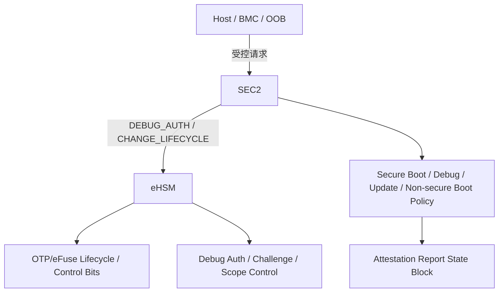
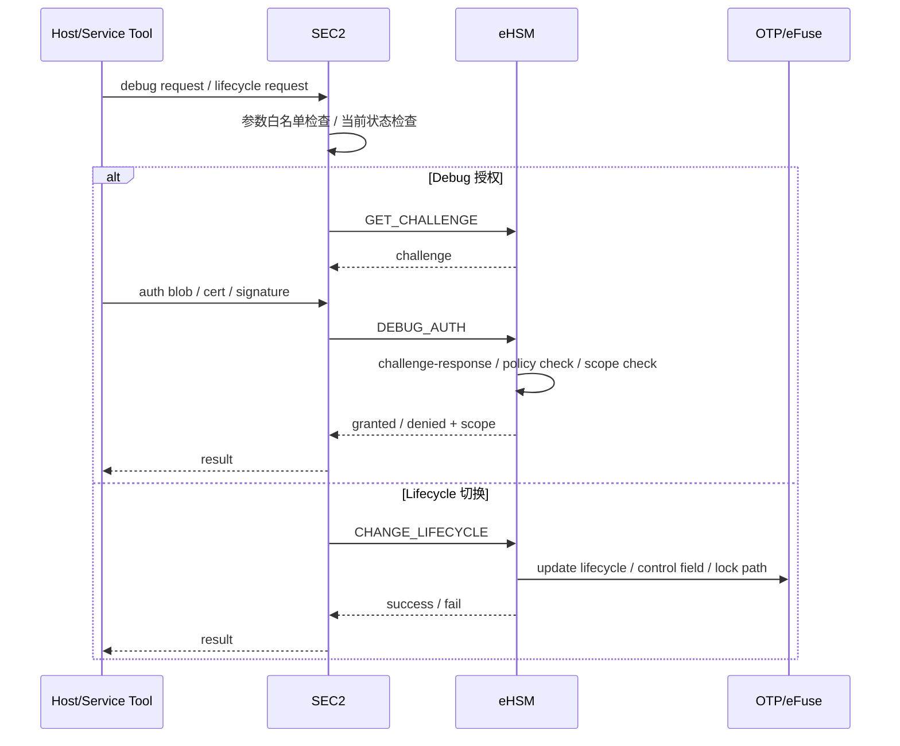

# 9. 安全调试与生命周期控制

> 文档定位：NGU800 / NGU800P 章节级正式详设  
> 章节文件：`security_workflow/03_detailed_design/04_lifecycle_debug.md`  
> 当前状态：V1.0（基于当前约束、baseline、实现级接口与现有方案资料收敛）  
> 设计标记口径：`[CONFIRMED] / [ASSUMED] / [TBD]`

---

## 9.1 本章目标

本章定义 NGU800 的生命周期统一模型、安全调试策略、调试授权路径、状态切换规则和运行态控制边界，重点明确：

1. 项目生命周期状态与 eHSM 原生状态的统一映射
2. 不同 lifecycle 下的启动策略、调试策略、升级策略和接口开放范围
3. 安全调试必须经过 challenge-response / debug auth 的控制要求
4. 调试范围（scope / bitmap）与自动关闭策略
5. lifecycle 对 OTP/eFuse、非安全启动、镜像接收和 provisioning 的 gating 关系
6. 生命周期切换的受控条件与不可逆路径
7. 与实现层文件的映射关系：
   - `04_impl_design/mailbox_if.md`
   - `04_impl_design/spdm_report.md`
   - `04_impl_design/manufacturing_provisioning.md`
   - `04_impl_design/efuse_key_fw_header_design.md`

---

## 9.2 生效约束 ID

- `C-KEY-02`
- `C-DEBUG-01`
- `C-DEBUG-02`
- `C-IF-01`
- `C-HOST-01`
- `C-ACCESS-01`
- `C-ACCESS-02`
- `C-MFG-01`
- `C-UPDATE-01`
- `C-ATT-01`

---

## 9.3 生效 Baseline 决策

### 9.3.1 生命周期控制
- `[CONFIRMED]` lifecycle 必须控制 debug、OTP/eFuse 访问、非安全启动和镜像接受范围
- `[CONFIRMED]` USER 生命周期必须关闭未授权 debug
- `[CONFIRMED]` USER 生命周期应强制安全启动

### 9.3.2 调试控制
- `[CONFIRMED]` 调试必须走 challenge-response / debug auth
- `[CONFIRMED]` debug enable 必须支持鉴权后开启与自动关闭
- `[CONFIRMED]` 量产态 debug 默认关闭，不得由普通软件直接打开

### 9.3.3 权责边界
- `[CONFIRMED]` 所有安全关键操作必须通过 SEC2 控制路径执行
- `[CONFIRMED]` eHSM 提供 debug auth、lifecycle 切换、control field 修改等能力
- `[CONFIRMED]` Host 不得直接修改 lifecycle、secure boot、debug enable 等关键状态

---

## 9.4 设计要求

### 9.4.1 本章必须回答的问题

1. 项目生命周期如何统一命名和编码？
2. 每个 lifecycle 允许哪些启动模式、调试模式、升级模式？
3. debug 是怎么打开的，谁来授权、谁来执行？
4. 调试授权能开到什么粒度，是否需要 scope/bitmap？
5. lifecycle 切换由谁发起、由谁裁决、由谁落盘？
6. 哪些切换是单向不可逆的？
7. USER / RMA / DEST 下哪些能力必须彻底关闭？
8. attestation 报告中哪些状态必须反映当前 lifecycle/debug 策略？

### 9.4.2 不得违反的边界

- Host / 普通 CPU / 非安全 master 不得直接打开 debug
- USER 生命周期不得保留无限制调试
- lifecycle 回退不得由普通软件路径完成
- 非安全启动不得在 USER 态隐式回退或默认可用
- 调试授权不得绕过 eHSM challenge / auth 机制

---

## 9.5 生命周期统一模型

### 9.5.1 输入口径整理

当前输入资料存在两类命名口径：

- 项目口径：`TEST / DEVE / MANU / USER / DEBUG / DEST`
- eHSM/native 口径：`TEST / DEVELOP / MANUFACTURE / USER / DEBUG / DESTROY`

为便于系统级实现与文档统一，本章采用“统一态 + 映射表”的方式表达。

### 9.5.2 统一编码建议

| Enc | Unified State | eHSM Mapping | Project Mapping | 启动策略 | 调试策略 | 更新/Provisioning 策略 |
|---|---|---|---|---|---|---|
| `0x00` | TEST | TEST | TEST | 可安全 / 非安全启动 | 实验室开放调试 | 允许基础测试 |
| `0x01` | DEV | DEVELOP | DEVE | 可安全 / 非安全启动 | 允许开发调试 | 允许开发升级 |
| `0x02` | MANUFACTURE | MANUFACTURE | MANU | 优先安全启动 | 有限受控调试 | 允许 provisioning / 冒烟验证 |
| `0x03` | PROD | USER | USER | 强制安全启动 | 默认关闭，仅授权临时开 | 仅受控升级 |
| `0x04` | RMA | DEBUG | DEBUG / RMA | 仅允许签名 rescue / 受控启动 | 授权后有限开放 | 维修升级 |
| `0x05` | DECOMMISSIONED | DESTROY | DEST | 不允许正常启动 | 关闭 | 不允许 |

### 9.5.3 当前裁决

- `[CONFIRMED]` `TEST -> DEV -> MANUFACTURE -> PROD` 为主单向路径
- `[CONFIRMED]` `DECOMMISSIONED / DEST` 为不可逆终态
- `[ASSUMED]` `RMA` 在工程上等价映射到 eHSM 的 `DEBUG` 或 `DEBUG/RMA` 子模式
- `[TBD]` 是否保留独立 `DEBUG` 与 `RMA` 子状态编码，需最终与 eHSM 接口实现冻结

---

## 9.6 架构图



### 图下说明

1. lifecycle 与 debug 的最终裁决在 eHSM + OTP/eFuse 语义层完成。  
2. SEC2 是统一控制面，对外收敛 Host/BMC/OOB 的请求。  
3. Attestation report 必须反映当前 lifecycle/debug 状态，而不是只报告 firmware hash。  

---

## 9.7 时序图



### 图下说明

1. debug 开启必须经过 challenge-response 或等价鉴权。  
2. lifecycle 修改必须由受控命令触发，并最终落到 OTP/eFuse / control field。  
3. Host 不能直接改 debug enable 或 lifecycle 寄存器。  

---

## 9.8 各生命周期策略矩阵

| 生命周期 | Secure Boot | Non-secure Boot | Debug | OTP/eFuse 写操作 | Firmware Update | Provisioning | Recovery / Rescue |
|---|---|---|---|---|---|---|---|
| TEST | 可开可关 | 允许 | 高权限开放 | 受控允许 | 允许 | 允许最小测试 | 可选 |
| DEV | 推荐开启 | 允许 | 允许开发授权 | 受控允许 | 允许 | 视需要 | 可选 |
| MANU | 必须优先安全启动 | 受策略限制 | 有限受控 | 允许正式灌装 | 允许 | 必须允许 | 冒烟/恢复可用 |
| USER/PROD | 强制开启 | 默认关闭 | 默认关闭，仅临时授权 | 禁止正式写入根材料 | 仅受控升级 | 禁止 | 仅授权 rescue |
| RMA | 受控签名启动 | 默认关闭 | 授权后有限开放 | 仅限受控维修流程 | 允许维修升级 | 禁止常规 provisioning | 允许 |
| DEST | 不允许 | 不允许 | 关闭 | 禁止 | 禁止 | 禁止 | 禁止 |

### 9.8.1 当前裁决

- `[CONFIRMED]` USER 生命周期强制安全启动，默认关闭未授权 debug
- `[CONFIRMED]` MANU 生命周期必须允许 provisioning 和冒烟验证
- `[CONFIRMED]` RMA 只允许受控 rescue / 维修升级
- `[ASSUMED]` DEV/TEST 阶段允许更宽松的 boot/debug 策略，但不能与量产态混淆

---

## 9.9 调试模型

### 9.9.1 调试分类

当前项目建议把调试能力至少分为以下几类：

| Debug Capability | 含义 | 量产态建议 |
|---|---|---|
| CPU halt / single-step | 核心停机、单步 | 禁止，需授权 |
| trace visibility | 跟踪可见性 | 禁止，需授权 |
| secure memory visibility | 安全内存可见 | 禁止，需授权 |
| interconnect debug windows | 片上互连调试窗口 | 禁止，需授权 |
| board-assisted debug access | 板级辅助调试入口 | 禁止，需授权 |

### 9.9.2 调试位图

- `[CONFIRMED]` eHSM 支持 SoC debug authorization，并带大位图控制能力
- `[ASSUMED]` NGU800 应按子系统定义 debug bit 域
- `[TBD]` 最终 bit-level 映射（例如 129bit 端口位图）需在实现阶段冻结

### 9.9.3 当前建议

调试授权建议至少输出以下信息：

```c
typedef struct {
    uint32_t debug_enable_state;
    uint32_t granted_scope_words;
    uint32_t expire_policy;
    uint64_t scope_bitmap_addr;
} ngu_debug_auth_state_t;
```

说明：
- `granted_scope_words`：位图长度
- `expire_policy`：自动关闭策略 / 时间窗口策略
- `scope_bitmap_addr`：在受控共享内存中传递位图

---

## 9.10 调试开启流程

### 9.10.1 最小流程

1. Host / 服务工具发起 debug request  
2. SEC2 进行当前 lifecycle、白名单和目标 scope 的预检查  
3. SEC2 向 eHSM 发起 `GET_CHALLENGE`  
4. eHSM 返回 challenge  
5. 请求方提交 debug auth blob / 证书 / 签名  
6. SEC2 调用 `DEBUG_AUTH`  
7. eHSM 完成：
   - challenge-response 校验
   - cert / anchor 校验
   - lifecycle 策略检查
   - scope bitmap 检查
8. 成功后返回授权范围和失效策略  
9. SEC2 按授权结果开启受限 debug 能力  
10. 到期或关闭后，执行 `CLOSE_DEBUG`

### 9.10.2 当前裁决

- `[CONFIRMED]` challenge-response 是必须路径
- `[CONFIRMED]` 调试开启必须有 scope 控制，不能只有“开/关”二元语义
- `[CONFIRMED]` debug enable 必须支持自动关闭
- `[ASSUMED]` 授权结果中应带时间窗口或显式失效策略

---

## 9.11 调试关闭与自动回收

### 9.11.1 必须支持的收口场景

| 场景 | 行为 |
|---|---|
| 显式关闭 | `CLOSE_DEBUG` |
| 生命周期切换 | 若切到 USER / DEST，必须自动收口 |
| 异常复位 | 需恢复默认关闭态 |
| 授权超时 | 到期自动关闭 |
| 安全错误事件 | 可强制关闭调试 |

### 9.11.2 当前裁决

- `[CONFIRMED]` debug enable 不能是“开了就一直开”
- `[CONFIRMED]` USER 态下即使临时授权打开，也必须可自动关闭
- `[ASSUMED]` 异常复位后建议恢复到“未授权 debug 关闭”的保守状态

---

## 9.12 lifecycle 切换规则

### 9.12.1 推荐转换图

```text
TEST -> DEV -> MANUFACTURE -> PROD
PROD -> RMA (authorized)
ANY -> DECOMMISSIONED (irreversible)
```

### 9.12.2 转换条件

| 转换 | 条件 |
|---|---|
| TEST -> DEV | 实验室控制、基础 bring-up 完成 |
| DEV -> MANUFACTURE | 工程收敛、准备正式灌装 |
| MANUFACTURE -> PROD | 密钥/证书灌装完成 + smoke validation 通过 |
| PROD -> RMA | 授权 + challenge-response + 必要安全擦除前置 |
| ANY -> DECOMMISSIONED | 不可逆销毁路径 |

### 9.12.3 当前裁决

- `[CONFIRMED]` `MANUFACTURE -> PROD` 之前必须完成密钥/证书灌装和冒烟验证
- `[CONFIRMED]` `PROD -> RMA` 需要授权并满足安全前置条件
- `[CONFIRMED]` `DECOMMISSIONED / DEST` 是不可逆终态
- `[ASSUMED]` `RMA -> PROD` 恢复时应重新做量产安全检查与状态归档

---

## 9.13 lifecycle 与接口 gating

### 9.13.1 命令级 gating

| 命令 | TEST | DEV | MANU | USER | RMA | DEST |
|---|---|---|---|---|---|---|
| VERIFY_IMAGE | Y | Y | Y | Y | Y | N |
| GET_CHALLENGE | Y | Y | Y | 受控 | Y | N |
| DEBUG_AUTH | Y | Y | 受控 | 默认 N / 受策略 | Y | N |
| CLOSE_DEBUG | Y | Y | Y | Y | Y | N |
| CHANGE_LIFECYCLE | Y | Y | Y | 受限 | 受限 | N |
| READ_COUNTER | Y | Y | Y | Y | Y | N |
| INCREASE_COUNTER | Y | Y | Y | Y | 受控 | N |
| GEN_ATTEST_REPORT | 可选 | 可选 | 可选 | Y | 可选 | N |
| PROVISION_ROOT_MATERIAL | N | N | Y | N | N | N |

### 9.13.2 当前裁决

- `[CONFIRMED]` provisioning 命令只允许在 MANU 或等价受控阶段执行
- `[CONFIRMED]` USER 阶段默认禁止 DEBUG_AUTH 成功开启调试，除非策略明确允许受限授权
- `[CONFIRMED]` DEST 阶段不允许正常安全服务路径

---

## 9.14 lifecycle 与启动策略的关系

### 9.14.1 启动策略要求

- `[CONFIRMED]` lifecycle 必须控制 secure / non-secure boot 的可用性
- `[CONFIRMED]` USER 阶段应强制安全启动
- `[ASSUMED]` TEST/DEV 阶段可允许非安全启动，用于 bring-up 和开发
- `[CONFIRMED]` RMA 仅允许受控 signed rescue boot，不得恢复成普通开放调试启动

### 9.14.2 当前裁决

- 非安全启动不是失败时的默认旁路，而是受 lifecycle + control field + strap 共同控制的显式模式
- attestation 报告中必须反映 `secure_boot_state`

---

## 9.15 lifecycle 与 attestation 的关系

### 9.15.1 必须进入报告的状态

report 中至少必须反映：

- `lifecycle_state`
- `debug_state`
- `secure_boot_state`
- `anti_rollback_state`

### 9.15.2 当前裁决

- `[CONFIRMED]` verifier 不能只校验签名，还必须检查 lifecycle/debug 状态
- `[CONFIRMED]` 量产可信判断必须包含：
  - lifecycle 是否为 USER/PROD 或允许上线状态
  - debug 是否关闭或处于允许模式
  - secure boot 是否开启
  - rollback 策略是否满足门限

---

## 9.16 lifecycle 与 provisioning / RMA 的关系

### 9.16.1 Provisioning
- `[CONFIRMED]` Root / signer / debug / attestation / counter / control field 的正式灌装只允许在 MANU
- `[CONFIRMED]` MANU → USER 之前必须完成 key/anchor 锁定与测试 trust 清理

### 9.16.2 RMA
- `[CONFIRMED]` RMA 是受权返修路径，不是常驻状态
- `[CONFIRMED]` 返修调试必须 challenge-response 后有限开放
- `[ASSUMED]` RMA 结束后应恢复量产安全状态，并重新形成报告/审计记录

---

## 9.17 与实现层的映射关系

| 本章主题 | 对应实现层文件 |
|---|---|
| debug auth / lifecycle 命令 / gating / 错误码 | `04_impl_design/mailbox_if.md` |
| lifecycle/debug 状态块进入证明报告 | `04_impl_design/spdm_report.md` |
| MANU→USER / RMA 流程、审计与恢复 | `04_impl_design/manufacturing_provisioning.md` |
| control bits / lifecycle encoding / OTP字段 | `04_impl_design/efuse_key_fw_header_design.md` |

---

## 9.18 冻结敏感项

| Item | Why Sensitive | Current Status | Needed Before Freeze |
|---|---|---|---|
| 生命周期统一编码 | 影响 OTP / report / command 接口 | 部分收敛 | 冻结最终编码表 |
| DEBUG 与 RMA 是否独立编码 | 影响命令 gating 与审计模型 | 未完全冻结 | 冻结状态机 |
| debug scope bitmap bit-level 定义 | 影响 FW / RTL / verifier / 工具 | 未完全冻结 | 冻结端口位图 |
| USER 下调试授权策略 | 影响量产与售后边界 | 未完全冻结 | 冻结是否允许短时授权 |
| DEST 阶段允许保留哪些状态查询能力 | 影响退役与审计 | 未完全冻结 | 冻结销毁态策略 |

---

## 9.19 开放问题

1. `DEBUG` 与 `RMA` 首版是否合并成一个统一态，还是保留子状态？  
2. 首版 USER 态是否允许短时授权 debug，还是完全禁止？  
3. debug scope bitmap 最终按子系统、功能类还是资源域来编码？  
4. `RMA -> PROD` 恢复是否必须重新跑一次最小 attestation / smoke validation？  
5. DEST 阶段是否允许只读状态查询用于审计收尾？  

---

## 9.20 本章结论

本章已将 NGU800 的生命周期与安全调试控制收敛到当前可评审的正式口径：

- lifecycle 统一模型已建立，并与 eHSM / 项目命名对齐  
- USER/PROD 态必须强制安全启动并默认关闭未授权 debug  
- debug 开启必须经过 challenge-response / debug auth / scope 控制 / 自动关闭  
- lifecycle 切换必须通过受控命令面执行，且不可由 Host 或普通软件直接修改  
- attestation 报告必须反映 lifecycle/debug/secure boot/anti-rollback 状态  
- provisioning 和 RMA 都必须被 lifecycle 严格 gating，并形成审计闭环  

后续若 `mailbox_if.md`、`spdm_report.md`、`manufacturing_provisioning.md` 或 OTP/lifecycle 字段冻结有变化，本章必须同步更新。
