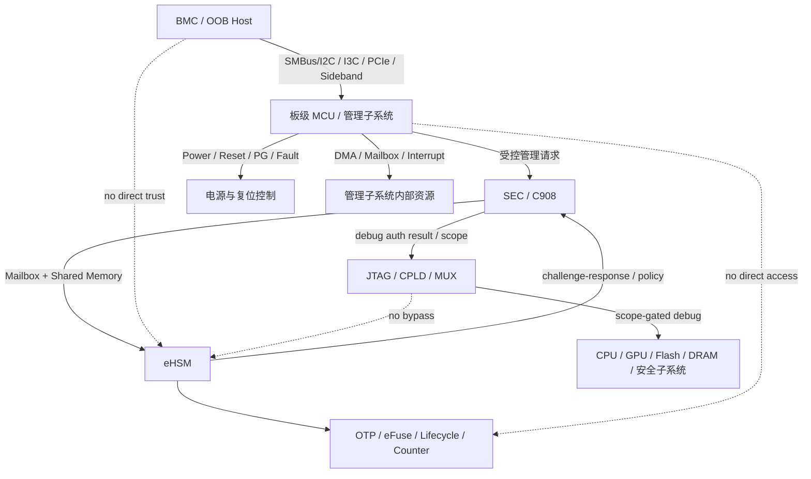
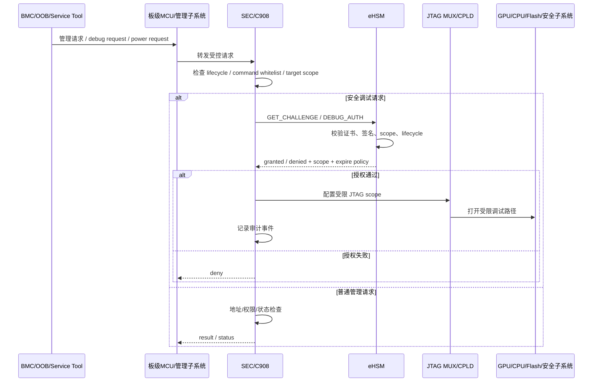

# 10. 板级安全设计

> 文档定位：NGU800 / NGU800P 章节级正式详设  
> 章节文件：`security_workflow/03_detailed_design/05_board_security.md`  
> 当前状态：V1.0（基于当前约束、baseline 与 `SRC-005` 管理子系统方案增量收敛）  
> 设计标记口径：`[CONFIRMED] / [ASSUMED] / [TBD]`

---

## 10.1 本章目标

本章定义 NGU800 的板级安全和管理子系统安全边界，重点明确：

1. BMC / OOB-MCU / 板级 MCU / 管理子系统与安全子系统之间的信任关系。
2. SMBus/I2C、I3C、PCIe VDM、SPI、UART、JTAG 等带外管理通道的安全约束。
3. JTAG、DMA、mailbox、中断、互斥寄存器、电源/复位控制等高权限能力的安全控制策略。
4. 管理子系统文档中总体架构和流程的采用范围，以及安全设计不足时的替代裁决。
5. 与实现层文件的映射关系：
   - `04_impl_design/mailbox_if.md`
   - `04_impl_design/spdm_report.md`
   - `04_impl_design/manufacturing_provisioning.md`
   - `04_impl_design/efuse_key_fw_header_design.md`

---

## 10.2 生效约束 ID

- `C-HOST-01`
- `C-ACCESS-01`
- `C-ACCESS-02`
- `C-DEBUG-01`
- `C-DEBUG-02`
- `C-BOARD-01`
- `C-BOARD-02`
- `C-BOARD-03`
- `C-BOARD-04`
- `C-MFG-01`
- `C-ATT-01`
- `C-UPDATE-01`

---

## 10.3 生效 Baseline 决策

### 10.3.1 管理子系统输入采用策略

- `[CONFIRMED]` `SRC-005` 中的管理子系统总体架构、模块职责、带外管理链路、电源/复位流程、单/双 Die 约束作为系统流程输入采用。
- `[CONFIRMED]` `SRC-005` 中涉及安全的内容必须经过安全基线二次裁决。
- `[CONFIRMED]` 若管理子系统流程与 eHSM Root of Trust、SEC 统一控制面、lifecycle gating 或 debug auth 基线冲突，以安全基线为准。

### 10.3.2 板级信任边界

- `[CONFIRMED]` BMC / OOB-MCU / 板级 MCU / 管理子系统不进入 Root of Trust。
- `[CONFIRMED]` BMC / OOB / Sideband 的信任级别不高于 Host。
- `[CONFIRMED]` 板级链路可承载管理请求、状态查询、故障定位和工装流程，但不得直接访问 eHSM、OTP/eFuse、Secure SRAM、Root/anchor 或 lifecycle 控制。

### 10.3.3 高风险入口

- `[CONFIRMED]` JTAG 在 USER/PROD 默认关闭。
- `[CONFIRMED]` JTAG 接入 GPU、CPU、DRAM、Flash、安全子系统或板级 MCU 前，必须经过 challenge-response / debug auth。
- `[CONFIRMED]` 管理子系统 DMA、mailbox、中断、互斥访问和电源复位控制必须受 firewall、白名单、lifecycle 和审计约束。

---

## 10.4 设计要求

### 10.4.1 本章必须回答的问题

1. 管理子系统文档中的总体架构和流程哪些可以遵循？
2. 哪些带外管理通道只能作为链路，不能作为安全服务入口？
3. BMC / OOB / 板级 MCU 是否可以直接控制 eHSM、lifecycle、debug 或 provisioning？
4. JTAG 是否允许访问 GPU 寄存器、DRAM、Flash、安全子系统和 CPU 调试单元？
5. JTAG MUX / CPLD / 板级控制单元由谁授权、谁收口、谁审计？
6. 管理子系统 DMA 可以访问哪些 buffer，不能访问哪些安全区域？
7. 电源、上下电、复位、PowerBrake 等控制信号如何进入安全状态机？
8. 单 Die / 双 Die、board binding / die binding 是否影响证明和镜像验证策略？

### 10.4.2 不得违反的边界

- BMC / OOB / 板级 MCU 不得成为 Root of Trust 的扩展部分。
- 管理子系统不得直接修改 lifecycle、secure boot、debug enable、rollback counter、Root/anchor。
- JTAG 不得在 USER/PROD 量产态常开。
- JTAG MUX / CPLD 不得提供绕过 eHSM debug authorization 的直通路径。
- 管理子系统 DMA 不得访问 eHSM、OTP/eFuse、Secure SRAM、SEC1/SEC2 执行区、recovery 区、证书/策略区。
- 电源/复位控制不得绕过安全启动失败处理和审计。

---

## 10.5 管理子系统输入摘要

`SRC-005` 当前纳入以下系统级输入：

| 输入主题 | 文档口径 | 安全采用策略 |
|---|---|---|
| 带外管理通道 | BMC、OAM 模组、模组 MCU、GPU、板级 MCU/GPU 之间存在 SMBus/I2C、I3C、PCIe、UART、JTAG 等链路 | 总体链路关系可遵循，所有安全服务必须经 SEC/eHSM 收敛 |
| SMBus/I2C | 支持 SMBus/I2C，最大 1MHz，支持 slave，alert 可选，可配置临时转 master 发 master notify | 可作为低速管理链路，不得承载高权限安全命令直达 |
| I3C | 支持最高 12.5MHz，支持 slave/master，满足高性能带外业务需求 | 可作为带外业务链路，安全命令必须受认证、白名单和生命周期控制 |
| PCIe VDM | 暂考虑不支持 | 若后续启用，必须纳入 Host/OOB 不可信模型 |
| UART | 暂考虑不支持 | 若后续启用，默认视为调试接口，需 lifecycle/debug gating |
| JTAG | 可接入 BMC、UBB、OAM、板级 MCU/GPU，可访问 GPU JTAGBUS、寄存器、DRAM、Flash、安全子系统、CPU 调试单元 | 该能力不能直接按普通功能开放，必须由安全侧重定义授权、scope、MUX 和审计 |
| CPU 子系统 DMA | 管理子系统内部考虑通用 AXI DMA，每 CPU 分配独立 DMA 通道，低速外设绑定物理通道 | DMA 必须受 firewall 白名单限制 |
| mailbox / 中断 / 互斥 | CPU 子系统预留 mailbox、中断和互斥访问机制 | 只能作为受控协作机制，不得作为安全旁路 |
| 电源/复位 | 板级 MCU 管理 GPU 电源开关、上下电顺序、异常响应和定位 | 影响安全状态时必须进入安全状态机和审计 |
| 单/双 Die | 带内管理单/双 Die 仅一个 PCIe 物理通道；带外管理对外仅 DIE0 出 OOB 接口 | 需要与 die binding、证明报告和跨 Die 访问策略联动 |

---

## 10.6 架构图

### 图下说明

1. BMC/OOB/板级 MCU 可以承载管理流程，但不直接进入 eHSM 或 OTP/eFuse。  
2. JTAG 的物理接入能力来自板级链路，但授权、scope 和生命周期裁决必须来自 SEC/eHSM。  
3. 电源、复位、DMA、mailbox 和中断都可能影响安全状态，不能作为纯普通外设看待。  
4. 管理子系统总体流程遵循 `SRC-005`，安全边界由 `01_constraints.md` 和 `02_baseline.md` 裁决。  

---

## 10.7 时序图

### 图下说明

1. 管理工具不能直接打开 JTAG MUX，必须经 SEC/eHSM 授权。  
2. 授权结果必须包含 scope 和失效策略，不允许只返回“允许调试”。  
3. 失败路径必须保持默认关闭态并记录审计。  

---

## 10.8 带外通道安全策略

| 通道 | 管理用途 | 安全风险 | 安全要求 |
|---|---|---|---|
| SMBus/I2C | 低速状态查询、传感器、电源管理、OOB 管理 | 总线易被桥接或伪造管理请求 | 命令白名单、状态只读优先，高权限命令必须经 SEC/eHSM |
| I3C | 高性能带外业务、固件更新、高频状态采集 | 带宽更高，可能承载更大攻击面 | 数据路径隔离，更新/调试/provisioning 必须鉴权 |
| SPI/QSPI | NOR Flash、板级 MCU 接口 | 可影响固件存储和启动介质 | Flash 更新必须验签，写操作需 lifecycle gating |
| PCIe VDM | 带外数据 over PCIe（当前暂不支持） | 若启用可能混入 Host 数据面 | 默认关闭；启用前纳入 Host 不可信模型 |
| UART | 调试输入输出（当前暂不支持） | 常被作为开发后门 | 默认关闭；启用必须按 debug 接口管控 |
| JTAG | GPU/CPU/DRAM/Flash/安全子系统调试 | 最高风险，可直接绕过运行态保护 | USER 默认关闭，需 challenge-response、scope bitmap、MUX gating、审计 |

---

## 10.9 JTAG 安全设计

### 10.9.1 `SRC-005` JTAG 能力输入

`SRC-005` 描述 JTAG 需要支持以下能力：

- 可接入 BMC，链路形态为 BMC -> UBB -> OAM -> 板级 MCU/GPU。
- 可接入 GPU 芯片 JTAGBUS，访问寄存器空间和 DRAM。
- 可接入 GPU 芯片安全子系统，定位安全子系统问题。
- 可接入 CPU 调试单元，定位 CPU 固件问题。
- 可访问 GPU Flash，定位固件问题和更新固件。
- 可接入板级 MCU，定位板级 MCU 问题和更新 MCU 固件。
- 可用于 GPU 芯片边界扫描和板级 MCU 边界扫描。
- EVB/SLT 板提供 JTAG 接口，ATE/LB 板复用 DFT JTAG IO。

### 10.9.2 安全裁决

上述能力不作为默认开放能力继承。安全方案裁决如下：

- `[CONFIRMED]` USER/PROD 生命周期下 JTAG 默认关闭。
- `[CONFIRMED]` JTAG 访问 GPU 寄存器、DRAM、Flash、安全子系统、CPU 调试单元前必须通过 debug auth。
- `[CONFIRMED]` JTAG 控制必须输出 scope bitmap，至少区分 CPU、GPU、Flash、DRAM、安全子系统、板级 MCU、边界扫描。
- `[CONFIRMED]` JTAG MUX / CPLD / 板级控制单元必须接受 SEC/eHSM 授权结果，不得有常开或板级直通模式。
- `[CONFIRMED]` JTAG 授权必须有自动关闭、异常复位关闭、生命周期切换关闭和审计记录。
- `[ASSUMED]` ATE/LB/EVB/SLT 阶段可允许更宽松的 JTAG 策略，但进入 USER 前必须清理或锁定测试路径。

### 10.9.3 JTAG scope 建议

| Scope | 默认 USER | 允许阶段 | 授权要求 |
|---|---|---|---|
| CPU halt / single-step | 关闭 | DEV / RMA | debug auth + time limit |
| GPU register access | 关闭 | DEV / RMA | debug auth + target whitelist |
| DRAM access | 关闭 | DEV / RMA | debug auth + memory range whitelist |
| Flash access / update | 关闭 | MANU / RMA | signed image + debug/update auth |
| 安全子系统访问 | 关闭 | RMA 特批 | eHSM debug auth + narrow scope + audit |
| 板级 MCU 调试 | 关闭 | DEV / MANU / RMA | board debug auth + audit |
| Boundary scan | 关闭 | ATE / SLT / MANU | manufacturing lifecycle gating |

---

## 10.10 DMA / Mailbox / 中断 / 互斥访问策略

### 10.10.1 DMA 策略

`SRC-005` 提到 CPU 子系统采用通用 AXI DMA，内部 CPU 分配独立 DMA 通道，低速外设绑定物理 DMA 通道。安全要求如下：

- `[CONFIRMED]` DMA 只能访问普通 staging buffer、普通数据 buffer 和经 firewall 显式允许的区域。
- `[CONFIRMED]` DMA 不得访问 eHSM、OTP/eFuse、Secure SRAM、SEC1/SEC2 执行区、recovery 区、证书/策略区和安全共享缓冲区。
- `[CONFIRMED]` DMA 访问必须带 UserID 或等价 master 标识，并经 firewall 策略检查。
- `[ASSUMED]` 低速外设 DMA 通道应默认最小权限，按外设绑定固定访问范围。

### 10.10.2 Mailbox / 中断策略

- `[CONFIRMED]` 管理子系统 mailbox 和中断只作为协作机制，不得直接成为 eHSM 安全服务入口。
- `[CONFIRMED]` 安全服务请求必须进入 SEC/C908 收敛层，由 SEC 执行参数、地址、lifecycle、权限检查。
- `[CONFIRMED]` 对安全状态有影响的中断必须可屏蔽、可追踪、可审计。

### 10.10.3 互斥访问策略

`SRC-005` 中 CPU 子系统互斥访问机制可用于普通共享资源协调，但安全设计要求如下：

- `[CONFIRMED]` 互斥寄存器不能替代权限检查。
- `[CONFIRMED]` 互斥成功不代表具备访问安全资源的权限。
- `[ASSUMED]` 若互斥寄存器用于管理固件与安全服务协作，必须增加 caller、resource_id、lifecycle 和 timeout 语义。

---

## 10.11 电源、上下电和复位安全策略

`SRC-005` 描述板级 MCU 负责 GPU 电源开关、上下电顺序管理、非主电源电流检测、电源初始化配置、电源异常响应和定位。安全设计要求如下：

- `[CONFIRMED]` 影响 GPU 芯片、SEC、eHSM、Flash、DRAM 或安全状态的复位/掉电/PowerBrake 信号必须进入安全状态机。
- `[CONFIRMED]` USER/PROD 下不得通过板级复位流程绕过 secure boot 或 rollback 检查。
- `[CONFIRMED]` 异常复位后 debug 默认关闭，JTAG scope 清零。
- `[CONFIRMED]` 电源异常、PowerBrake、PG/FAULT 事件若影响 attestation 可信状态，必须进入状态记录或报告摘要。
- `[ASSUMED]` 板级 MCU 可执行电源策略动作，但高安全影响动作需由 SEC 状态机确认或记录。

---

## 10.12 单 Die / 双 Die 与板级绑定

`SRC-005` 描述单 Die / 双 Die 场景下：

- 带内管理单/双 Die 封装物理通道都只有一个 PCIe（DIE0 出）。
- 除 DRAM 地址空间外，两 Die 地址空间需要 BAR 地址分别映射。
- 带外管理对外只呈现一个管理设备，硬件接口对外只 DIE0 出 OOB 接口。
- 原则上不建议外部感知内部单 Die / 双 Die 差异。
- CE 调度、Profiling、功耗管理可能涉及跨 Die 或双 Die 资源。

安全设计要求如下：

- `[CONFIRMED]` 单 Die / 双 Die 差异不应暴露为安全策略绕过路径。
- `[CONFIRMED]` 跨 Die 访问必须经过地址映射、权限和 firewall 检查。
- `[ASSUMED]` board binding / die binding 应进入 attestation measurement 或状态摘要。
- `[TBD]` 双 Die 场景是否需要主/从 Die 分别出具证明，或由主 Die 汇总证明，需与 attestation 方案联动冻结。
- `[TBD]` board binding 是否首版默认参与 firmware verify decision，需与产品形态和制造流程一起冻结。

---

## 10.13 与实现层的映射关系

| 本章主题 | 对应实现层文件 |
|---|---|
| OOB 请求、JTAG 授权代理、状态查询接口 | `04_impl_design/mailbox_if.md` |
| board/die binding、debug state、电源/复位异常状态进入报告 | `04_impl_design/spdm_report.md` |
| MANU/ATE/SLT 阶段 JTAG 策略、USER 前测试路径清理 | `04_impl_design/manufacturing_provisioning.md` |
| lifecycle、debug enable、JTAG disable、control bits | `04_impl_design/efuse_key_fw_header_design.md` |
| DMA / firewall / UserID / 地址白名单 | `[TBD] firewall_access_rules` |

---

## 10.14 冻结敏感项

| Item | Why Sensitive | Current Status | Needed Before Freeze |
|---|---|---|---|
| JTAG scope bitmap | 影响 USER 态调试暴露面 | 未冻结 | 冻结 CPU/GPU/DRAM/Flash/安全子系统/板级 MCU scope |
| JTAG MUX / CPLD 控制权 | 影响是否存在板级直通绕过路径 | 未冻结 | 冻结由 SEC/eHSM 授权结果驱动的控制方式 |
| BMC / OOB provisioning 代理 | 影响制造链攻击面 | 未冻结 | 冻结是否允许 OOB 承担 provisioning proxy |
| 管理子系统 DMA 白名单 | 影响安全内存隔离 | 未冻结 | 冻结可访问 buffer、UserID、firewall 策略 |
| 电源/复位安全状态 | 影响 secure boot 和 attestation 一致性 | 未冻结 | 冻结哪些事件进入安全状态机和报告 |
| board/die binding | 影响镜像验证、证明和量产兼容性 | 未冻结 | 冻结首版是否启用及字段位置 |

---

## 10.15 开放问题

1. JTAG scope bitmap 最终由 eHSM 原生位图直接承载，还是由 SEC 做 SoC 级二次映射？  
2. CPLD / JTAG MUX 的控制寄存器由谁写入，是否需要硬件锁定防止板级直通？  
3. OOB/BMC 是否允许在 MANU 阶段作为 provisioning proxy，如果允许，工站鉴权如何绑定？  
4. 管理子系统 DMA 的 UserID 和 firewall region 如何划分？  
5. 电源异常、PowerBrake、PG/FAULT 是否进入 attestation report，还是只进入本地审计？  
6. 双 Die 场景下，board/die binding 是单 report 汇总还是双 Die 分别证明？  
7. EVB/SLT/ATE 阶段 JTAG 测试路径如何在 USER 前锁定和审计？  

---

## 10.16 本章结论

本章将 `SRC-005` 管理子系统方案纳入板级安全设计，并形成以下安全裁决：

- 管理子系统总体架构和系统流程原则上遵循。
- BMC / OOB / 板级 MCU / 管理子系统不进入 Root of Trust。
- SMBus/I2C、I3C、PCIe VDM、SPI、UART、JTAG 等带外链路只能作为受控链路，不能直接进入安全执行面。
- JTAG 文档中描述的高权限访问能力不能按默认功能开放，必须经 lifecycle、debug auth、scope bitmap、MUX gating 和审计控制。
- 管理子系统 DMA、mailbox、中断、互斥访问、电源复位控制必须纳入 firewall、状态机和审计策略。
- 单 Die / 双 Die、board binding / die binding 需要与镜像验证、attestation 和制造流程联动冻结。

后续若 `SRC-005` 补充字段级接口、JTAG MUX 控制、DMA region、OOB provisioning 或电源复位状态机，本章及 `06_interface.md`、`10_full_design.md`、实现级文档必须同步更新。
