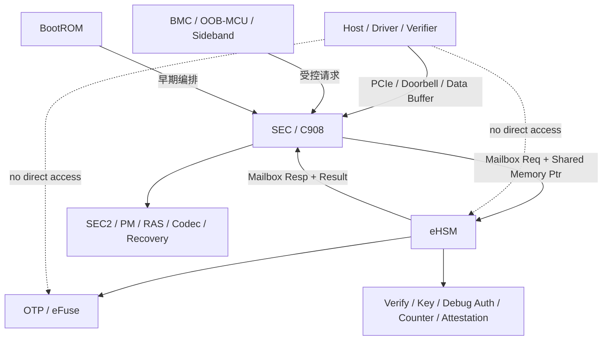
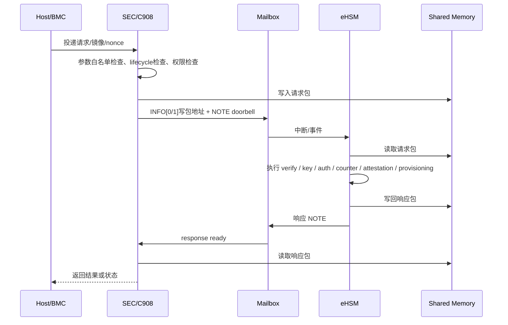

# 11. 内外部接口设计

> 文档定位：NGU800 / NGU800P 章节级正式详设  
> 章节文件：`security_workflow/03_detailed_design/06_interface.md`  
> 当前状态：V1.0（基于当前约束、baseline 与实现级接口文件收敛）  
> 设计标记口径：`[CONFIRMED] / [ASSUMED] / [TBD]`

---

## 11.1 本章目标

本章定义 NGU800 的内外部安全接口边界，重点明确：

1. Host / BMC / OOB-MCU / Sideband 与安全子系统的边界
2. SEC/C908、eHSM、BootROM、管理子系统之间的接口职责划分
3. Mailbox + Shared Memory 的项目适配模型
4. Verify、Lifecycle、Debug Auth、Counter、Attestation、Provisioning 等接口的通用格式
5. 外部访问控制、地址白名单、生命周期限制和错误模型
6. 与实现层文件的映射关系：
   - `04_impl_design/mailbox_if.md`
   - `04_impl_design/spdm_report.md`
   - `04_impl_design/efuse_key_fw_header_design.md`
   - `04_impl_design/manufacturing_provisioning.md`

---

## 11.2 生效约束 ID

- `C-IF-01`
- `C-HOST-01`
- `C-ACCESS-01`
- `C-ACCESS-02`
- `C-BOOT-01`
- `C-BOOT-02`
- `C-DEBUG-01`
- `C-DEBUG-02`
- `C-ATT-01`
- `C-MFG-01`

---

## 11.3 生效 Baseline 决策

### 11.3.1 安全服务调用边界
- `[CONFIRMED]` 所有正式安全服务必须通过受控 Mailbox 或定义好的安全接口
- `[CONFIRMED]` SEC/C908 是唯一安全控制面 caller
- `[CONFIRMED]` eHSM 是唯一安全服务执行面

### 11.3.2 Host 边界
- `[CONFIRMED]` Host 只具备投递能力，不进入信任链
- `[CONFIRMED]` Host 不得直接访问 eHSM、OTP、Secure SRAM
- `[CONFIRMED]` Host 不得直接放行执行

### 11.3.3 生命周期与授权
- `[CONFIRMED]` USER 生命周期必须关闭未授权 debug
- `[CONFIRMED]` DEBUG/RMA 相关接口必须通过 challenge-response 或等价鉴权
- `[CONFIRMED]` 制造相关接口只能在受控 provisioning 生命周期窗口内使用

---

## 11.4 设计要求

### 11.4.1 本章必须回答的问题

1. Host、BMC、OOB-MCU 是否允许直接调用 eHSM？
2. SEC/C908 与 eHSM 之间通过什么接口交互？
3. 真实命令包放在寄存器还是共享内存？
4. 哪些接口是 Boot 期必须具备的？
5. 哪些接口只能在 MANU / DEBUG / RMA 阶段打开？
6. Address / length / lifecycle / permission 检查由谁负责？
7. 错误码、超时、busy、并发语义如何统一？
8. 哪些接口属于“安全服务接口”，哪些仅是普通数据链路？

### 11.4.2 不得违反的边界

- Host 不得直接调用 eHSM 私有命令面
- 普通 Master 不得直接操作 OTP/eFuse 安全区
- Mailbox 请求不得绕过 SEC 的参数白名单与生命周期检查
- Verify / Debug Auth / Lifecycle / Provisioning 不得在不合法 lifecycle 下开放
- 共享内存地址不得由 Host 任意指定到安全域

---

## 11.5 架构图



### 图下说明

1. 外部世界（Host / BMC / OOB-MCU）与 eHSM 之间没有直接信任链接口。  
2. 所有正式安全服务调用必须先进入 SEC/C908 控制面。  
3. Mailbox 传递“命令与包地址”，共享内存传递“真实包体”。  
4. OTP/eFuse 只被 eHSM 直接使用，不向外暴露敏感内容。  

---

## 11.6 时序图



### 图下说明

1. Host 的请求在安全语义上必须经 SEC 收敛，不允许直达 eHSM。  
2. eHSM 不负责“理解 Host 业务语义”，只负责执行已受控的安全服务请求。  
3. 共享内存必须受地址白名单和 cache 一致性规则保护。  

---

## 11.7 接口分层

### 11.7.1 分层模型

| 层级 | 名称 | 典型对象 | 作用 |
|---|---|---|---|
| L0 | 物理/链路层 | PCIe / IRQ / Doorbell / SMBus / Sideband | 承载数据和中断 |
| L1 | SEC 收敛层 | SEC/C908 | 权限检查、生命周期检查、参数封装 |
| L2 | 安全服务接口层 | Mailbox + Shared Memory | 调用 eHSM 安全服务 |
| L3 | 安全执行层 | eHSM | verify / key / auth / counter / lifecycle / attestation |
| L4 | 结果消费层 | Host / Verifier / Driver / Tool | 接收结果、做后续处理 |

### 11.7.2 项目裁决

- `[CONFIRMED]` 安全语义控制点在 L1（SEC 收敛层）
- `[CONFIRMED]` eHSM 是 L3 安全执行层
- `[CONFIRMED]` Host / BMC / OOB-MCU 只在 L0 / L4，不直接跨到 L3

---

## 11.8 内部接口划分

### 11.8.1 BootROM ↔ SEC
BootROM 与 SEC 的关系是启动编排关系，不作为通用安全服务接口对外暴露。

BootROM 可承担：
- 早期平台初始化
- 读取 strap / lifecycle / secure boot 配置
- 触发或等待 eHSM ready
- 把控制流转移到 SEC1/SEC

BootROM 不应承担：
- 完整 Mailbox 服务管理
- 长期运行态安全服务代理
- 完整调试鉴权 / 证明 / provisioning 服务

### 11.8.2 SEC ↔ eHSM
这是项目中**唯一正式安全服务接口面**。

SEC 负责：
- 参数合法性检查
- 生命周期检查
- 请求包封装
- token 管理
- 超时与 busy 处理
- 响应解包和上报

eHSM 负责：
- 真实安全操作执行
- OTP / key / counter / lifecycle / verify / auth / attestation 服务
- 返回结构化结果和错误码

### 11.8.3 SEC ↔ Host / BMC / OOB
SEC 对外提供的是**受控代理接口**，而不是“把 eHSM 原生命令透传给外部”。

Host/BMC/OOB 可请求：
- 固件投递
- 受控 verify 流程触发
- challenge / report 获取
- 状态查询
- manufacturing/provisioning 受控步骤（仅 MANU）

Host/BMC/OOB 不可请求：
- 直接写 OTP 安全区
- 直接开关 debug
- 直接改 lifecycle
- 直接导出私钥或敏感 key blob

---

## 11.9 外部接口分类

### 11.9.1 Host / PCIe 类接口

| 接口类别 | 用途 | 安全级别 |
|---|---|---|
| Firmware Download | SEC2 / PM / RAS / Codec 固件投递 | 高 |
| Status Query | 查询当前状态 / 错误码 / 版本 | 中 |
| Attestation Request | challenge / nonce / report 获取 | 高 |
| Debug Auth Proxy | 调试鉴权代理 | 高 |
| Provisioning Proxy | 制造阶段灌装代理 | 最高 |

### 11.9.2 BMC / OOB / Sideband 类接口

当前项目中，BMC / OOB / Sideband 的信任级别应默认为：

- `[CONFIRMED]` **不高于 Host**
- `[ASSUMED]` 可作为受控链路承载者
- `[ASSUMED]` 不应天然视为 Root of Trust 的扩展部分

因此：
- BMC / OOB 可以作为桥接者，但不能默认直接控制安全策略
- SMBus / sideband 只能用于受控状态查询、受控命令转发或板级管理，不应直接成为 Root / lifecycle / debug 的绕过路径

---

## 11.10 Mailbox 通用模型

本章不重复实现级全部细节，正式字段冻结以：

- `04_impl_design/mailbox_if.md`

为准。这里给出章节级口径。

### 11.10.1 设计原则

1. Mailbox 寄存器只传递“包地址 + doorbell / 状态”
2. 完整请求 / 响应包放在共享内存
3. SEC 是唯一 caller
4. eHSM 是唯一 callee
5. Host 不得直接调用 eHSM Mailbox

### 11.10.2 通道建议

| 通道 | 用途 |
|---|---|
| CH0 | 通用控制面：verify / lifecycle / debug auth / key / counter / UTC |
| CH1 | 长耗时镜像服务（可选） |
| CH2 | Attestation / SPDM 扩展（可选） |
| CH3~15 | 预留 |

### 11.10.3 首版最小要求

- `[CONFIRMED]` CH0 必须实现
- `[ASSUMED]` CH1 / CH2 可按首版复杂度决定是否启用
- `[CONFIRMED]` 多通道若未实现，不得在软件层伪装“已支持”

---

## 11.11 Mailbox 通用头

### 11.11.1 Request Header

```c
typedef struct {
    uint16_t cmd_id;
    uint16_t hdr_ver;
    uint32_t total_len;
    uint32_t token;
    uint32_t caller_id;
    uint32_t lifecycle_state;
    uint32_t flags;
    uint32_t payload_off;
    uint32_t payload_len;
    uint32_t resp_buf_off;
    uint32_t resp_buf_len;
} ngu_mb_req_hdr_t;
```

### 11.11.2 Response Header

```c
typedef struct {
    uint16_t cmd_id;
    uint16_t hdr_ver;
    uint32_t total_len;
    uint32_t token;
    uint32_t status;
    uint32_t err_code;
    uint32_t detail0;
    uint32_t detail1;
    uint32_t detail2;
    uint32_t detail3;
} ngu_mb_resp_hdr_t;
```

### 11.11.3 章节级规则

- `[CONFIRMED]` `token` 必须用于请求/响应配对
- `[CONFIRMED]` 所有长度字段必须由 SEC 先做边界检查
- `[CONFIRMED]` `caller_id` 必须固定为 SEC/C908 安全调用面
- `[ASSUMED]` `lifecycle_state` 可作为快速拒绝提示，但最终仍以 eHSM 当前状态/OTP 为准

---

## 11.12 命令表（项目当前建议）

| Cmd ID | 命令名 | 主要用途 | 允许 caller |
|---|---|---|---|
| 0x0001 | VERIFY_IMAGE | 固件验签 / 可选解密 | SEC |
| 0x0002 | VERIFY_AND_MEASURE | 验签并更新 measurement | SEC |
| 0x0020 | GET_CHALLENGE | 获取 challenge | SEC |
| 0x0021 | DEBUG_AUTH | 调试鉴权 | SEC |
| 0x0022 | CLOSE_DEBUG | 关闭调试 | SEC |
| 0x0023 | CHANGE_LIFECYCLE | 切换生命周期 | SEC |
| 0x0040 | READ_COUNTER | 读取 rollback counter | SEC |
| 0x0041 | INCREASE_COUNTER | 提升 rollback counter | SEC |
| 0x0060 | KEY_DERIVE | 密钥派生 | SEC |
| 0x0080 | GEN_ATTEST_REPORT | 生成证明报告 | SEC |
| 0x00A0 | PROVISION_ROOT_MATERIAL | 制造灌装 | SEC（MANU only） |

### 11.12.1 当前裁决

- `[CONFIRMED]` Host 不得直接作为这些命令的 caller
- `[CONFIRMED]` Provisioning 相关命令不得在 USER 生命周期可用
- `[CONFIRMED]` Verify、Debug、Lifecycle、Counter、Attestation 是首批必须支持的命令族

---

## 11.13 Verify Image 结构

章节级最小结构如下，完整定义以 `mailbox_if.md` 为准。

```c
typedef struct {
    ngu_mb_req_hdr_t hdr;
    uint64_t image_addr;
    uint32_t image_len;
    uint32_t image_type;
    uint32_t verify_policy;
    uint32_t expected_lcs_mask;
    uint32_t jump_on_pass;
    uint64_t dst_addr;
} ngu_mb_verify_image_req_t;
```

```c
typedef struct {
    ngu_mb_resp_hdr_t hdr;
    uint32_t verified_version;
    uint32_t signer_slot;
    uint32_t measurement_slot;
    uint32_t rollback_checked;
    uint32_t decrypt_applied;
} ngu_mb_verify_image_resp_t;
```

### 11.13.1 字段级章节规则

- `image_type` 必须参与 eHSM 策略检查
- `jump_on_pass` 不得让 Host 间接控制跳转
- `dst_addr` 必须满足 SEC 地址白名单
- `rollback_checked` 必须对 verifier / SEC 可见，不得隐式假设已完成

---

## 11.14 外部访问控制规则

### 11.14.1 Host / BMC / OOB 的统一限制

| 对象 | 允许 | 不允许 |
|---|---|---|
| Host | 投递镜像、发起 challenge、读取结果 | 直接调 eHSM、直接 release、直接写安全区 |
| BMC | 受控转发、板级管理、状态获取 | 直接覆盖 Root / lifecycle / debug 策略 |
| OOB-MCU | 板级辅助控制、受控桥接 | 直接成为安全根 |
| SMBus / Sideband | 受控状态传输、简单触发 | 直接承载高权限安全命令 |

### 11.14.2 地址与长度检查

- `[CONFIRMED]` 所有地址参数必须由 SEC 先做白名单检查
- `[CONFIRMED]` eHSM 侧必须再次做范围检查
- `[CONFIRMED]` 共享内存不得指向 Secure SRAM / OTP / eHSM 私有区
- `[CONFIRMED]` Host DMA 不得访问安全执行区和安全共享区

### 11.14.3 Cache / 一致性规则

- `[CONFIRMED]` SEC 在 doorbell 前必须完成 cache flush / clean（若共享内存可 cache）
- `[CONFIRMED]` SEC 读取响应前必须做 invalidate / barrier
- `[ASSUMED]` 首版共享缓冲区应优先选用便于一致性管理的内存区域，而不是复杂跨域区域

---

## 11.15 生命周期限制矩阵

| Command | TEST | DEVE | MANU | USER | DEBUG/RMA | DEST |
|---|---|---|---|---|---|---|
| VERIFY_IMAGE | Y | Y | Y | Y | Y | N |
| GET_CHALLENGE | Y | Y | Y | 受控 | Y | N |
| DEBUG_AUTH | Y | Y | 受控 | 默认关闭/受策略 | Y | N |
| CHANGE_LIFECYCLE | Y | Y | Y | 受限 | 受限 | N |
| READ_COUNTER | Y | Y | Y | Y | Y | N |
| INCREASE_COUNTER | Y | Y | Y | Y | 受控 | N |
| GEN_ATTEST_REPORT | 可选 | 可选 | 可选 | Y | 可选 | N |
| PROVISION_ROOT_MATERIAL | N | N | Y | N | N | N |

### 11.15.1 当前裁决

- `[CONFIRMED]` USER 下 provisioning 接口必须关闭
- `[CONFIRMED]` DEBUG/RMA 接口必须受 challenge-response 或等价授权控制
- `[ASSUMED]` DEST 生命周期下不再允许正常安全服务路径

---

## 11.16 错误码与并发语义

### 11.16.1 错误码原则

错误码至少应区分：

- 无效命令
- 非法状态
- 生命周期不允许
- 权限不足
- 地址越界
- 验签失败
- 解密失败
- rollback 失败
- auth 失败
- busy
- timeout
- 内部错误

### 11.16.2 并发语义原则

- `[CONFIRMED]` 首版 CH0 建议单 outstanding
- `[CONFIRMED]` 请求处理中再次提交同通道请求应返回 `BUSY`
- `[CONFIRMED]` 对 `BUSY` 可重试
- `[CONFIRMED]` 对 `VERIFY_FAIL / AUTH_FAIL / INVALID_LCS / ACCESS_DENY` 不得盲重试

---

## 11.17 Attestation / SPDM 与接口的关系

### 11.17.1 对外表现
Attestation 在外部看起来像：

- Host / Verifier 发 challenge / nonce
- 返回 report blob

### 11.17.2 对内实现
对内必须通过：

- `GEN_ATTEST_REPORT`
- 可选 `GET_CHALLENGE`
- 可选 `READ_COUNTER`

并且：
- 私钥不离开 eHSM
- 报告签名由 eHSM 完成
- SEC 只负责请求封装和结果转发

---

## 11.18 Provisioning 与接口的关系

### 11.18.1 对外表现
制造工站需要看见的是：

- provisioning request
- provisioning result
- lock / verify / lifecycle change result
- audit result

### 11.18.2 对内实现
这些能力必须复用受控 Mailbox 路径，而不是额外旁路：

- `PROVISION_ROOT_MATERIAL`
- `CHANGE_LIFECYCLE`
- `READ_COUNTER`
- 必要时 `DEBUG_AUTH`

### 11.18.3 章节级规则

- `[CONFIRMED]` Provisioning Tool 不得绕过 SEC 直接写 eHSM
- `[CONFIRMED]` MANU→USER 动作必须是可审计的步骤集合
- `[CONFIRMED]` 进入 USER 前必须清理测试 trust / debug 白名单

---

## 11.19 与实现层的映射关系

| 本章主题 | 对应实现层文件 |
|---|---|
| Mailbox req/resp / command ID / 状态机 | `04_impl_design/mailbox_if.md` |
| Attestation 报告字段 / binding / cert / signature | `04_impl_design/spdm_report.md` |
| FW Header / image type / rollback / signer slot | `04_impl_design/efuse_key_fw_header_design.md` |
| Provisioning / MANU→USER / RMA | `04_impl_design/manufacturing_provisioning.md` |

---

## 11.20 冻结敏感项

| Item | Why Sensitive | Current Status | Needed Before Freeze |
|---|---|---|---|
| CH0/CH1/CH2 首版启用策略 | 影响 RTL / FW / driver 划分 | 部分收敛 | 冻结首版最小通道集合 |
| NOTE 位语义 | 影响 RTL / FW 中断与状态机 | 未完全冻结 | 冻结 req/rsp/ack 规则 |
| 共享内存最终落点 | 影响缓存、一致性和安全边界 | 未完全冻结 | 冻结 buffer 区域 |
| Provisioning 命令最终参数 | 影响工站和 SEC 对接 | 部分收敛 | 冻结 request/response 结构 |
| BMC / OOB / SMBus 默认信任级别 | 影响板级链路设计 | 未完全冻结 | 冻结是否允许某些桥接能力 |

---

## 11.21 开放问题

1. 首版是否只启用 CH0，还是同步启用 CH1 做大镜像路径？  
2. 请求/响应共享内存是共用一块还是分离管理？  
3. BMC / OOB 是否允许在某些产品形态下承担 provisioning 代理角色？  
4. Sideband / SMBus 是否需要支持 challenge / status 等轻量接口？  
5. Attestation 报告是否首版默认内嵌完整 cert chain？  

---

## 11.22 本章结论

本章已将 NGU800 内外部接口设计收敛到当前可评审的正式口径：

- 安全服务接口边界：SEC/C908 是唯一 caller，eHSM 是唯一安全执行者  
- Host / BMC / OOB / SMBus 只能作为受控请求发起者或链路承载者，不能直接进入信任链  
- Mailbox + Shared Memory 是正式安全服务接口模型  
- Verify、Lifecycle、Debug、Counter、Attestation、Provisioning 构成首批必须定义的接口族  
- 地址检查、生命周期限制、错误码、busy/timeout 语义必须在实现层明确  
- 章节级接口口径必须与 `mailbox_if.md`、`spdm_report.md`、`manufacturing_provisioning.md` 和 `efuse_key_fw_header_design.md` 同步维护  

后续若实现级接口字段冻结有变化，本章必须同步更新。
