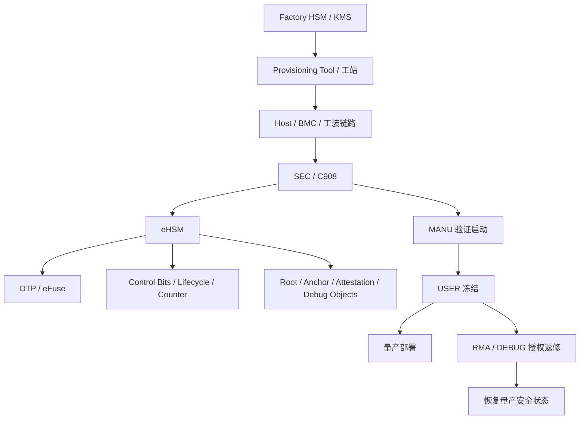
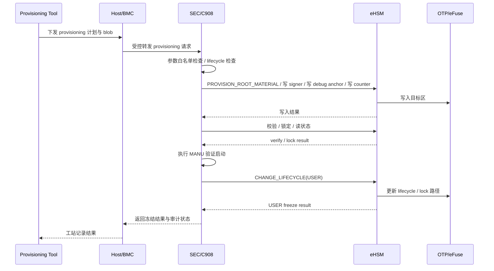

# 12. 制造、灌装、部署与 RMA

> 文档定位：NGU800 / NGU800P 章节级正式详设  
> 章节文件：`security_workflow/03_detailed_design/07_manufacturing_rma.md`  
> 当前状态：V1.0（基于当前约束、baseline 与实现级制造设计收敛）  
> 设计标记口径：`[CONFIRMED] / [ASSUMED] / [TBD]`

---

## 12.1 本章目标

本章定义 NGU800 在制造、灌装、量产冻结、部署与返修（RMA）阶段的安全设计，重点明确：

1. 制造阶段与生命周期状态的映射关系
2. Root / UDS / signer anchor / debug anchor / attestation anchor / counter 的灌装对象与顺序
3. OTP / eFuse 写入、校验、锁定、审计的控制要求
4. MANU → USER 的冻结动作集合
5. 量产部署后的状态约束
6. RMA / DEBUG 场景下的授权、调试、恢复与重新冻结规则
7. 与实现层文件的映射关系：
   - `04_impl_design/manufacturing_provisioning.md`
   - `04_impl_design/efuse_key_fw_header_design.md`
   - `04_impl_design/mailbox_if.md`
   - `04_impl_design/spdm_report.md`

---

## 12.2 生效约束 ID

- `C-ROOT-01`
- `C-KEY-01`
- `C-KEY-02`
- `C-DEBUG-01`
- `C-DEBUG-02`
- `C-HOST-01`
- `C-ATT-01`
- `C-UPDATE-01`
- `C-MFG-01`
- `C-ACCESS-01`

---

## 12.3 生效 Baseline 决策

### 12.3.1 制造控制面
- `[CONFIRMED]` Provisioning 流程必须经 SEC/C908 控制面收敛
- `[CONFIRMED]` eHSM 是唯一 Root 材料写入、锁定、lifecycle 状态变更的安全执行面
- `[CONFIRMED]` Host / BMC / 工站不进入信任链，只是链路承载者或受控请求发起者

### 12.3.2 量产冻结
- `[CONFIRMED]` 进入 USER 前必须完成 secure boot、anti-rollback、debug 关闭、测试 trust 清理
- `[CONFIRMED]` Root / signer / debug / attestation 相关敏感对象必须完成锁定
- `[CONFIRMED]` USER 生命周期不得默认开放未经授权的调试路径

### 12.3.3 RMA / DEBUG
- `[CONFIRMED]` 返修或 DEBUG 场景必须经过授权
- `[CONFIRMED]` 调试开启必须通过 challenge-response 或等价鉴权机制
- `[ASSUMED]` RMA 处理完成后，应恢复量产安全状态并形成审计闭环

---

## 12.4 设计要求

### 12.4.1 本章必须回答的问题

1. 制造阶段到底写哪些对象、按什么顺序写？
2. Root / UDS / signer / debug / attestation / counter 之间的先后关系是什么？
3. MANU 验证启动要检查哪些项目？
4. USER 冻结时必须关闭或清理哪些对象？
5. 量产出厂后哪些状态必须可被证明？
6. RMA / DEBUG 如何合法开启，又如何恢复？
7. 审计日志至少要记录哪些事件？
8. 制造工具、Host/BMC、SEC、eHSM 的职责边界在哪里？

### 12.4.2 不得违反的边界

- 不得允许工站或 Host 直接操作 eHSM 私有执行面
- 不得允许 Root / UDS / 私钥明文以普通软件资产形式长期存在
- 不得在 USER 生命周期保留测试 signer / 测试 cert / 测试 debug 白名单
- 不得在失败时报告“USER 冻结完成”
- 不得把 RMA/DEBUG 当成长期常开模式

---

## 12.5 架构图



### 图下说明

1. 工厂 HSM/KMS 是制造密钥材料的上游管理端，但不直接替代设备内部 Root of Trust。  
2. SEC/C908 是制造流程的控制面，eHSM 是真正执行 Root / OTP / lifecycle / lock 操作的安全执行面。  
3. USER 冻结不是单条命令，而是一组必须全部成功的冻结动作集合。  
4. RMA 路径是受控旁路，只能临时开放，并且必须回收。  

---

## 12.6 时序图



### 图下说明

1. Provisioning Tool 不直接向 eHSM 发命令，而是通过 Host/BMC 链路与 SEC/C908 协作。  
2. 生命周期推进前，必须先完成写入校验和锁定。  
3. USER 冻结前必须先做 MANU 验证启动，确保量产条件已满足。  

---

## 12.7 生命周期与制造阶段映射

### 12.7.1 生命周期总体映射

| 生命周期 | 制造/部署语义 | 典型用途 | 默认安全策略 |
|---|---|---|---|
| TEST | 裸片 / 封测 / 初测 | 基础功能验证 | 可开放测试路径，不得等价于量产 |
| DEVE | 开发板 / EVB 调试 | 软件 bring-up、接口联调 | 可有限开放调试 |
| MANU | 正式制造 / 板级灌装 | 写入根材料、建立量产前状态 | 基础安全校验生效 |
| USER | 量产交付 | 面向客户部署 | 强制 secure boot、关闭未授权 debug |
| DEBUG / RMA | 受权返修 / 厂商分析 | 故障定位、临时调试 | 仅授权开启 |
| DEST | 销毁 | 退役 / 擦除 | 不再允许正常使用 |

### 12.7.2 制造阶段推荐细分

| 阶段 ID | 阶段名称 | 主要动作 |
|---|---|---|
| MFG-0 | 封测初测 | 测试路径、基础 bring-up、早期健康检查 |
| MFG-1 | 板级 bring-up | 电源、时钟、基础接口、主从Die连通 |
| MFG-2 | Provisioning 准备 | 工站认证、算法栈选择、blob 准备 |
| MFG-3 | Root / Anchor Provisioning | 写 UDS / Root / signer / debug / attest |
| MFG-4 | Control Bit Provisioning | 写 secure boot / debug / attestation / rollback 控制位 |
| MFG-5 | 校验与锁定 | 写入校验、锁位、状态确认、审计 |
| MFG-6 | MANU 验证启动 | 带验证的近量产启动检查 |
| MFG-7 | USER 冻结 | 清理测试 trust、推进 USER、关闭未授权 debug |
| MFG-8 | 出厂验收 | 形成最终记录、出厂状态确认 |

---

## 12.8 灌装交付项

### 12.8.1 必须灌装对象

| 对象 | 是否首版必须 | 说明 |
|---|---|---|
| UDS / Root Secret | 是 | 根种子 / Root 材料上游 |
| Root Key / Root KEK 材料 | 视模式 | 可直接写入，或由 UDS 内部派生 |
| FW Signer Hash / Trust Anchor | 是 | 支撑 SEC1 / SEC2 / 运行期 FW 验签 |
| Debug Auth Anchor | 是 | 支撑 DEBUG/RMA 调试鉴权 |
| Attestation Seed / Anchor | 是 | 支撑设备证明 |
| Rollback Counter 初值 / 版本地板 | 是 | 支撑 anti-rollback |
| Secure Boot / Debug / Attestation / Rollback 控制位 | 是 | 建立量产策略 |
| Board Binding 信息 | 可选 | 视产品线策略启用 |
| Die Binding 信息 | 双Die 推荐 | 主从Die 一致性约束 |

### 12.8.2 禁止残留的对象

| 对象 | 原因 |
|---|---|
| 测试 signer key / 测试 cert anchor | USER 前必须清理 |
| 测试 debug 白名单 | USER 前必须清理 |
| 非量产 bypass 配置 | USER 前必须关闭 |
| 明文可导出的 Root 私钥 | 根本不允许存在于最终流程 |

---

## 12.9 灌装顺序设计

### 12.9.1 推荐顺序

```text
(1) 读取 lifecycle 与 OTP 当前状态
    ↓
(2) 校验设备处于允许 provisioning 的状态
    ↓
(3) 写入 UDS / Root Secret / Root 材料
    ↓
(4) 写入 FW signer hash / trust anchor
    ↓
(5) 写入 Debug auth anchor
    ↓
(6) 写入 Attestation seed / anchor
    ↓
(7) 写入 counter 初值 / rollback floor
    ↓
(8) 写入 secure boot / debug / attestation / rollback 控制位
    ↓
(9) 校验写入结果
    ↓
(10) 锁定 key / anchor / control bits
    ↓
(11) 执行 MANU 验证启动
    ↓
(12) 执行 USER 冻结
```

### 12.9.2 顺序理由

- Root 材料必须先于 signer / attest / debug anchor 生效，否则没有可信根。  
- counter 初值必须在正式量产前建立，否则 anti-rollback 没有基线。  
- control bits 必须在信任锚完成注入后再打开，避免出现“策略已要求 secure boot，但锚尚未就绪”的中间态。  
- 锁定位只能在校验通过后执行，否则可能把错误数据永久锁死。  

---

## 12.10 Provisioning 接口设计口径

### 12.10.1 项目接口裁决

- `[CONFIRMED]` 制造相关动作必须复用 SEC/C908 → eHSM 的受控路径
- `[CONFIRMED]` Provisioning Tool 不得直接进入 eHSM 内部命令面
- `[CONFIRMED]` 制造相关命令只能在允许的 lifecycle 下可用

### 12.10.2 命令族

本章对应的实现级接口，以 `04_impl_design/mailbox_if.md` 为准，核心包括：

- `PROVISION_ROOT_MATERIAL`
- `CHANGE_LIFECYCLE`
- `READ_COUNTER`
- `INCREASE_COUNTER`（受策略控制）
- `GET_CHALLENGE`
- `DEBUG_AUTH`

### 12.10.3 章节级规则

1. `PROVISION_ROOT_MATERIAL` 只能在 MANU 或受控 provisioning 状态可用  
2. `CHANGE_LIFECYCLE(USER)` 必须晚于写入校验和锁定  
3. `DEBUG_AUTH` 在制造态仅用于必要的 bring-up / RMA，不得作为长期打开调试的替代  
4. 所有 provisioning blob 的地址和长度必须受 SEC 白名单和 eHSM 范围检查双重保护  

---

## 12.11 校验策略

### 12.11.1 写入后校验

每类 provisioning 写入后，至少需要以下检查：

1. 命令返回状态成功  
2. 若目标区允许读回，则做读回一致性校验  
3. 若目标区不允许直接读回，则通过：
   - eHSM 内部状态确认
   - 试运行校验
   - challenge / verify / report 侧间接确认
4. 状态必须进入工站审计记录  

### 12.11.2 MANU 验证启动最小检查项

| 检查项 | 说明 |
|---|---|
| SEC1 / SEC2 验签 | 核心启动链验证 |
| rollback counter 读取 | 反回滚路径验证 |
| lifecycle / control bits 读取 | 状态验证 |
| challenge / report 最小链路 | 证明能力基础验证 |
| debug 默认状态检查 | 验证未授权 debug 未默认放开 |

### 12.11.3 错误处理原则

- `[CONFIRMED]` 任一关键对象写入失败，不得继续推进 USER 冻结  
- `[CONFIRMED]` 锁定失败必须视为 provisioning 失败  
- `[ASSUMED]` 校验失败后设备可停留在 MANU / 故障态，而不是进入“半冻结 USER”状态  

---

## 12.12 锁定策略

### 12.12.1 必须锁定的对象

| 对象 | 锁定时机 | 说明 |
|---|---|---|
| Root / UDS 区 | 写入并校验通过后 | 防止重复覆盖 |
| signer hash / trust anchor 区 | 写入校验后 | 防止验签锚被替换 |
| debug auth anchor 区 | 写入校验后 | 防止调试授权根被替换 |
| attestation anchor 区 | 写入校验后 | 防止证明身份根被替换 |
| control bits 区 | USER 冻结前 | 防止量产策略回退 |
| lifecycle 回退路径 | USER 推进后 | 防止回退到开发态 |

### 12.12.2 锁定原则

- `[CONFIRMED]` 锁定动作必须显式执行，不得假设“默认已锁”  
- `[CONFIRMED]` 锁定结果必须可审计  
- `[CONFIRMED]` 锁定失败不得推进生命周期  
- `[ASSUMED]` 若部分区支持一次性写入后天然只读，仍需在工程文档中显式标记为“已锁语义”  

---

## 12.13 USER 冻结动作

### 12.13.1 必须完成的动作集合

进入 USER 前，必须完成：

1. `SECURE_BOOT_EN = 1`
2. `DEBUG_AUTH_EN = 1`
3. `JTAG_FORCE_DISABLE = 1`
4. `ANTI_ROLLBACK_EN = 1`
5. Root / signer / debug / attestation 相关对象完成锁定
6. 测试 signer / 测试 cert / 测试 debug 白名单全部清理
7. 如启用 attestation，则 `ATTEST_EN = 1`
8. 推进 lifecycle 到 USER
9. 锁定 lifecycle 回退路径
10. 生成冻结完成的审计记录

### 12.13.2 事务性要求

这些动作不一定由单条命令完成，但在流程语义上必须视为**一个事务性步骤集合**：

- 任何一步失败，都不得报告“USER 冻结成功”
- 失败后必须进入 MANU 故障处理流程
- 不得形成“部分已冻结、部分未冻结”的不可解释状态

---

## 12.14 部署阶段设计

### 12.14.1 量产部署后的默认状态

在 USER 生命周期下，默认应满足：

| 项目 | 期望状态 |
|---|---|
| Secure Boot | 开启 |
| Anti-Rollback | 开启 |
| 未授权 Debug | 关闭 |
| 测试 Signer / Trust | 已清除 |
| Attestation | 按产品策略开启 |
| Provisioning 接口 | 关闭 |
| Lifecycle 回退 | 不允许 |

### 12.14.2 部署后可允许的操作

- 受控 firmware update
- attestation / report generation
- 状态查询
- 受策略控制的 challenge / 认证类请求

### 12.14.3 部署后禁止的操作

- 再次 provisioning Root 材料
- 覆盖 signer anchor
- 恢复测试 trust
- 直接打开 debug
- 回退 lifecycle 到开发态

---

## 12.15 RMA 规则

### 12.15.1 RMA 基本原则

RMA / DEBUG 不是普通用户态能力，而是：

> **受授权、可审计、可恢复的返修旁路**

必须满足：

1. 先鉴权，后开放  
2. 权限受 scope 和时间窗口约束  
3. 维修后必须恢复量产安全状态  
4. 全程可审计  

### 12.15.2 推荐流程

```text
接收返修设备
    ↓
校验工单 / 设备身份 / 厂商授权
    ↓
发起 challenge / debug auth
    ↓
在受限 scope 下开放调试能力
    ↓
读取故障信息 / 维修 / 受控刷写恢复
    ↓
重新恢复量产镜像和状态
    ↓
关闭调试能力
    ↓
恢复 USER 安全状态
    ↓
生成 RMA 审计结案记录
```

### 12.15.3 RMA 约束

- `[CONFIRMED]` 不得因为进入 RMA 就长期常开 debug  
- `[CONFIRMED]` 不得跳过 challenge / auth 直接开调试口  
- `[CONFIRMED]` 返修完成后不得带着测试 trust 或开放调试出厂  
- `[ASSUMED]` RMA 完成后，建议重新生成与当前状态一致的最小 report / status 记录，用于归档  

---

## 12.16 审计模型

### 12.16.1 必须记录的事件

| Audit Event | 至少应记录的内容 |
|---|---|
| PROVISION_START | 设备 ID、工站 ID、时间、操作员、工单 |
| ROOT_WRITE | 写入对象类型、target slot、结果 |
| ANCHOR_WRITE | signer/debug/attest anchor 类型、结果 |
| CTRL_BITS_WRITE | 控制位变化前后、结果 |
| LOCK_APPLY | 锁定对象、结果 |
| MANU_BOOT_VERIFY | 验证启动结果、错误码 |
| USER_FREEZE | lifecycle 变化前后、结果 |
| RMA_AUTH | challenge / auth 结果、scope |
| RMA_CLOSE | 恢复状态、结案结果 |
| PROVISION_END | 总结果、日志索引 |

### 12.16.2 审计要求

- `[CONFIRMED]` 审计日志不得记录明文私钥或 Root 材料  
- `[CONFIRMED]` 审计日志必须至少可关联：
  - 设备
  - 工站
  - 时间
  - 操作员 / 工单
  - 结果
- `[ASSUMED]` 审计日志应支持导出到制造后台系统或至少可离线归档  

---

## 12.17 与其他章节 / 实现层的映射关系

| 本章主题 | 对应章节 / 实现层 |
|---|---|
| lifecycle 与冻结语义 | `03_detailed_design/04_lifecycle_debug.md` |
| Root / signer / control bits 灌装对象 | `04_impl_design/efuse_key_fw_header_design.md` |
| Provisioning 命令与 req/resp | `04_impl_design/mailbox_if.md` |
| report 中 lifecycle / debug / board 状态表达 | `04_impl_design/spdm_report.md` |
| 具体流程状态机 / 审计要求 | `04_impl_design/manufacturing_provisioning.md` |

---

## 12.18 冻结敏感项

| Item | Why Sensitive | Current Status | Needed Before Freeze |
|---|---|---|---|
| Root 注入模式（直接 Root vs Seed/UDS） | 影响制造链安全暴露面 | 部分收敛 | 冻结首版模式 |
| OTP 是否支持读回校验 | 影响校验策略 | 未完全冻结 | 冻结可读回区和不可读回区策略 |
| Provisioning 链路承载方式 | 影响工站 / Host / BMC 选型 | 未完全冻结 | 冻结首版工装路径 |
| 双Die 灌装是否联动事务 | 影响 OAM / 双Die 产品制造 | 未完全冻结 | 冻结联动策略 |
| RMA 恢复后是否强制再验收 | 影响售后流程与安全闭环 | 未完全冻结 | 冻结返修交付规则 |

---

## 12.19 开放问题

1. 首版是否完全采用“Seed/UDS 注入 + eHSM 内部派生”，还是保留直接 Root 材料写入模式？  
2. 不可读 OTP 区域的校验策略最终采用“状态确认”还是“试运行校验”？  
3. BMC / OOB-MCU 在某些产品形态下是否允许承担 provisioning 桥接角色？  
4. 双Die 产品是按单设备事务灌装，还是主/从 Die 分步灌装？  
5. RMA 结束后，是否要求强制重新生成 attestation / 状态摘要并归档？  

---

## 12.20 本章结论

本章已将 NGU800 的制造、灌装、部署与 RMA 路径收敛到当前可评审的正式口径：

- 制造必须通过 SEC/C908 控制面与 eHSM 安全执行面完成  
- UDS / Root / signer / debug / attestation / counter / control bits 的灌装顺序必须固定  
- 锁定、校验和 USER 冻结必须显式化、事务化、可审计  
- 量产部署后必须保持 secure boot、anti-rollback、未授权 debug 关闭和测试 trust 清理  
- RMA 是受授权、可恢复、可审计的旁路，不得成为常开调试模式  

后续若 `manufacturing_provisioning.md`、`mailbox_if.md`、`efuse_key_fw_header_design.md` 或生命周期策略冻结字段变化，本章必须同步更新。
