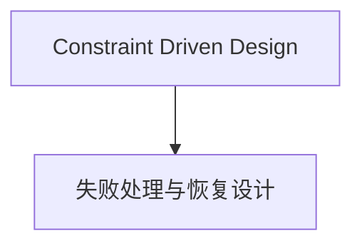
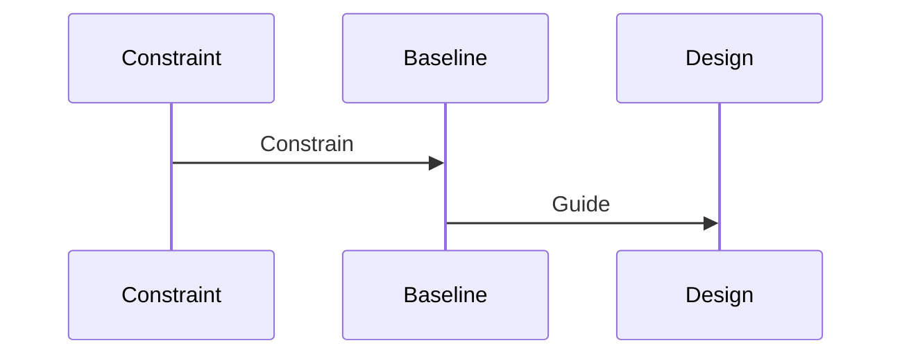

# 失败处理与恢复设计

## 1. 本章目标

- 当前阶段已建立章节框架
- 正式内容生成时必须基于 `01_constraints.md` 和 `02_baseline.md`
- 本章对应的实现项需同步进入 `04_impl_design/`

## 2. 生效约束 ID

- C-UPDATE-01 / C-UPDATE-02

## 3. 生效 Baseline 决策

- eHSM 为首个密码学验证主体
- Host 不进入信任链
- 不得跳过实现级设计

## 4. 架构图

## 5. 时序图

## 6. 当前阶段说明

- 本文件为当前阶段非空占位详设文件
- 后续应通过 `03B_逐章生成详设.md` 继续填充为正式章节

## 7. 对实现层的影响

- 详见 `security_workflow/04_impl_design/`

## 8. 冻结项

- 待本章正式展开后补全

## 9. 开放问题

- 待本章正式展开后补全
