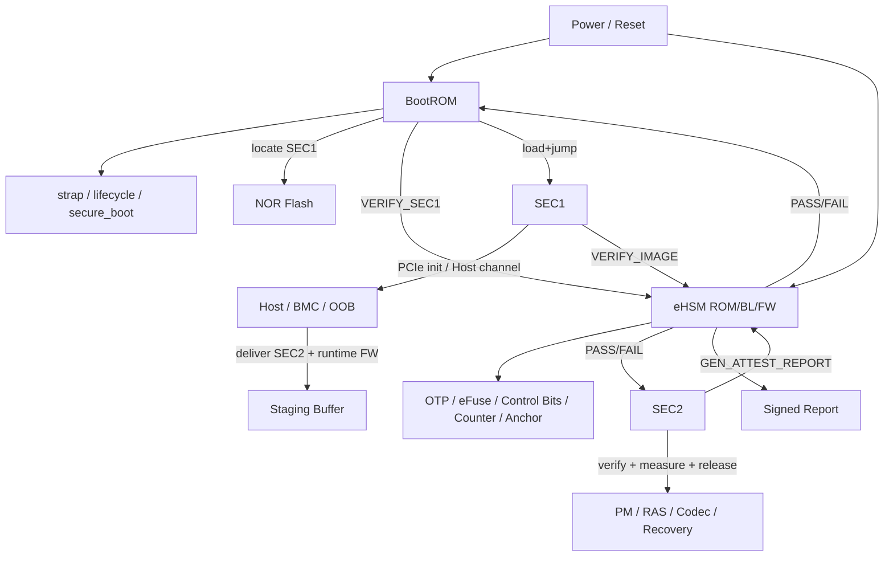
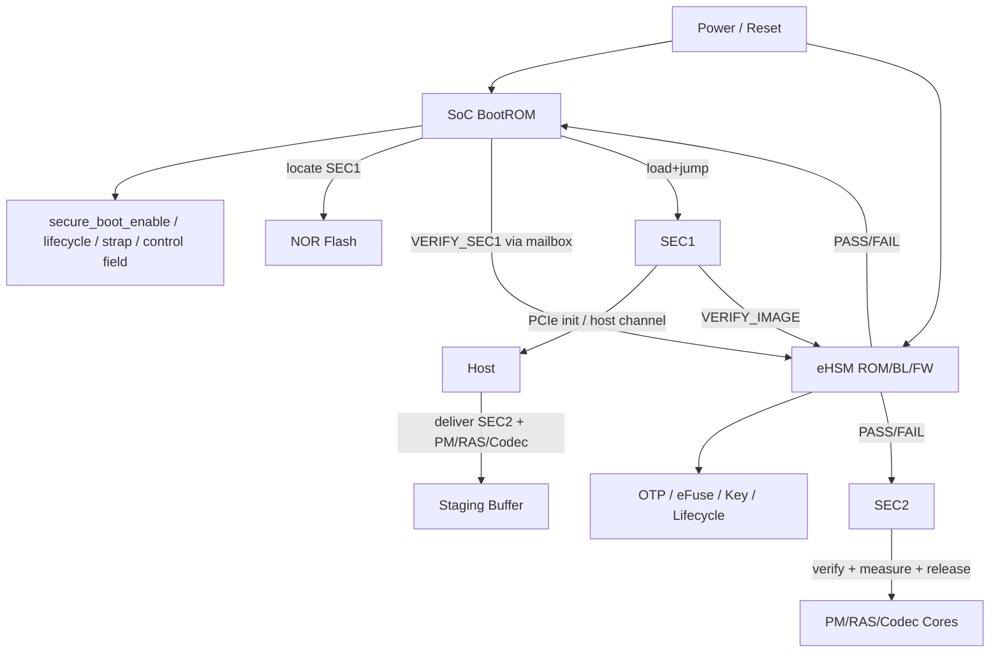
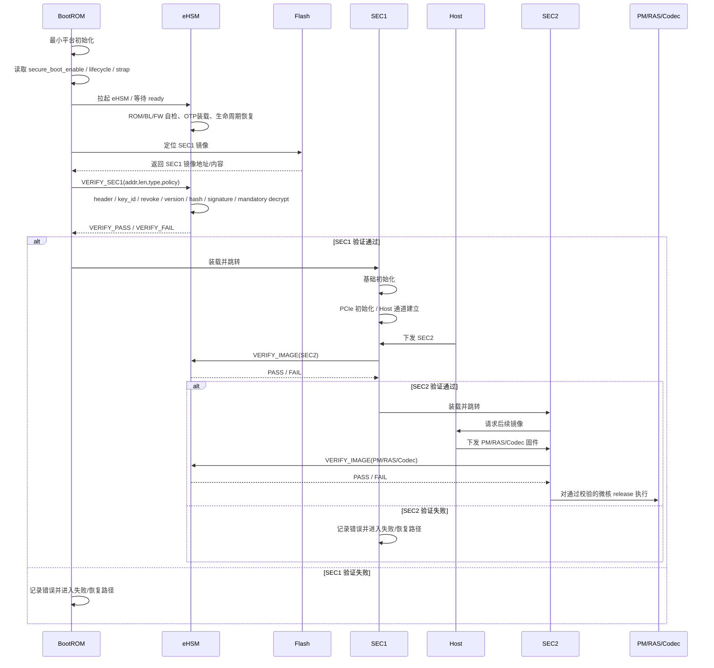
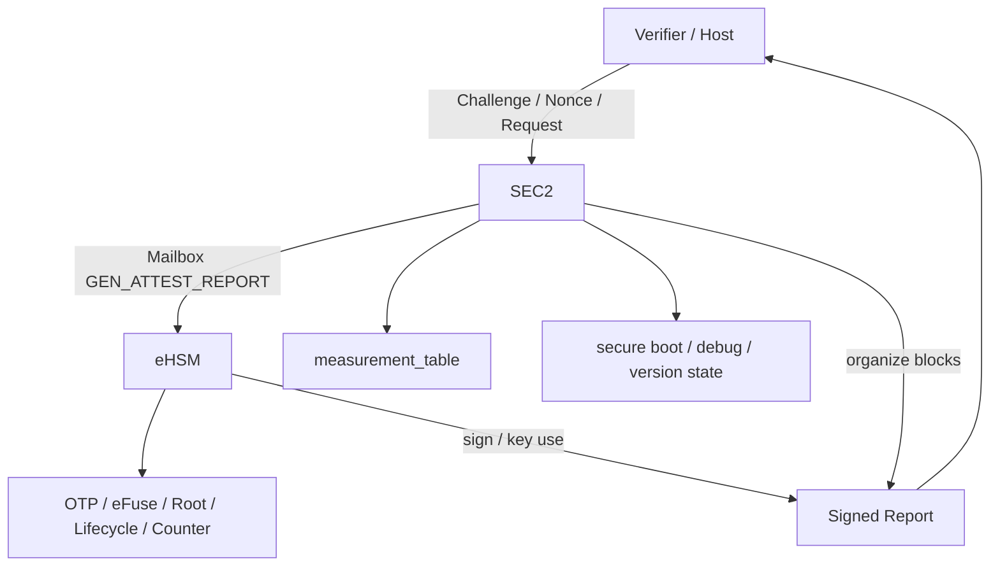

# NGU800 / NGU800P 安全详细设计说明书

> 适用范围：NGU800 / NGU800P 安全子系统、启动链、认证、生命周期、接口、制造与返修流程  
> 设计标记口径：`[CONFIRMED] / [ASSUMED] / [TBD]`
> 说明：CR-0001 后，正式 master / 导出版以 `03_detailed_design_master.md` 和 `03_detailed_design_master_v2.4.md` 为准；本文件保留为完整设计参考稿，并同步 SEC1 强制加密口径，避免旧口径回流。

---

## 1. 文档概述

本文档用于形成 NGU800 / NGU800P 的总安全详细设计说明书，覆盖：

- 安全总体架构与信任边界
- Root of Trust、密钥体系、证书体系
- 安全启动、固件完整性、防回滚与恢复
- 设备身份、远程度量证明与 SPDM 报告
- 生命周期、安全调试、接口与访问控制
- 板级安全、制造灌装、部署与 RMA

本文档与以下章节级和实现级文件配套使用：

- `security_workflow/01_constraints.md`
- `security_workflow/02_baseline.md`
- `security_workflow/03_detailed_design/01_boot.md`
- `security_workflow/03_detailed_design/02_key_cert.md`
- `security_workflow/03_detailed_design/03_attestation.md`
- `security_workflow/03_detailed_design/04_lifecycle_debug.md`
- `security_workflow/03_detailed_design/05_board_security.md`
- `security_workflow/03_detailed_design/06_interface.md`
- `security_workflow/03_detailed_design/07_manufacturing_rma.md`
- `security_workflow/04_impl_design/efuse_key_fw_header_design.md`
- `security_workflow/04_impl_design/mailbox_if.md`
- `security_workflow/04_impl_design/spdm_report.md`
- `security_workflow/04_impl_design/manufacturing_provisioning.md`

### 1.1 输入材料与基线

当前设计输入由 `security_inputs/inputs_manifest.md` 统一管理，并按照以下顺序收敛：

```text
inputs_manifest
→ constraints
→ baseline
→ chapter-level detailed design
→ implementation-level design
```

### 1.2 当前设计基线

当前总基线如下：

- `[CONFIRMED]` Root of Trust = eHSM
- `[CONFIRMED]` First Cryptographic Verifier = eHSM
- `[CONFIRMED]` BootROM 是最早执行入口，但不是密码学根
- `[CONFIRMED]` SEC/C908 是唯一 boot control plane 与安全控制面
- `[CONFIRMED]` Host 不可信，只具备镜像投递和请求发起能力
- `[CONFIRMED]` SEC1 来自 NOR / 本地 Flash，正式安全启动路径必须签名 + 加密，解密由 eHSM / 安全子系统受控密码服务完成
- `[CONFIRMED]` 所有正式安全服务必须通过受控接口进入 eHSM
- `[CONFIRMED]` 制造阶段必须定义 key 注入、锁定、审计和 lifecycle 推进
- `[CONFIRMED]` 方案必须同时兼容国密和国际算法两套栈

---

## 2. 安全目标、保护资产与威胁边界

### 2.1 安全目标

NGU800 当前安全方案需要同时满足以下目标：

1. 建立以 eHSM 为核心的 Root of Trust。
2. 建立从 BootROM、SEC1、SEC2 到后续微核固件的可信启动链。
3. 保证所有关键镜像在执行前完成验证，未验证镜像不得执行。
4. 建立独立的固件验签、设备证明、调试鉴权密钥分支。
5. 支持 lifecycle、安全调试、anti-rollback、attestation、制造灌装和 RMA 闭环。
6. 将方案落到可直接指导 RTL / FW / Driver / 工具开发的结构和接口。

### 2.2 保护资产

当前设计中需要重点保护的对象包括：

| 资产 | 说明 |
|---|---|
| UDS / Root Secret | 设备根种子或等价根材料 |
| DRK 与各 key branch | FW Verify / FW Encrypt / Attestation / Debug Auth |
| signer hash / trust anchor | 固件验签、调试鉴权、设备证明信任锚 |
| rollback counter / version floor | 反回滚基线 |
| lifecycle / secure boot / debug / attestation 控制位 | 安全策略根状态 |
| Device Identity Key | 设备证明私钥 |
| measurement_table | 可信度量集合 |
| Secure SRAM / 安全共享缓冲区 | 受控执行与通信内存 |
| OTP/eFuse 安全区 | 根材料、控制位、counter、anchor |

### 2.3 信任模型

当前统一信任边界如下：

- `[CONFIRMED]` Host 不可信，不进入信任链。
- `[CONFIRMED]` BMC / OOB-MCU / Sideband 默认信任级别不高于 Host。
- `[CONFIRMED]` BootROM 是启动编排者，不负责复杂密码学校验或密钥管理。
- `[CONFIRMED]` eHSM 是唯一正式安全执行面。
- `[CONFIRMED]` SEC/C908 是唯一安全控制面 caller。
- `[CONFIRMED]` 普通 master 不得直接访问 eHSM、OTP、Secure SRAM。
- `[CONFIRMED]` 所有访问必须通过 UserID + Firewall + 受控共享内存 / mailbox。

### 2.4 关键约束

本设计受以下约束驱动：

- `C-ROOT-01`：Root of Trust 必须在 eHSM
- `C-BOOT-01`：所有镜像必须经过安全子系统验签
- `C-BOOT-02`：Boot 顺序必须由安全核控制
- `C-BOOT-03`：BootROM 不实现复杂加解密
- `C-IF-01`：所有正式密码操作必须走 eHSM
- `C-KEY-01`：私钥不可导出
- `C-KEY-02`：Key 必须绑定生命周期
- `C-DEBUG-01`：USER 态关闭未授权调试能力
- `C-DEBUG-02`：DEBUG / RMA 必须认证
- `C-HOST-01`：Host 不可信
- `C-ACCESS-01` / `C-ACCESS-02`：必须隔离并经 firewall 管控
- `C-UPDATE-01` / `C-UPDATE-02`：必须支持防回滚与受控恢复
- `C-ATT-01`：必须支持设备证明，且私钥不离开 eHSM
- `C-MFG-01`：必须定义制造、灌装、锁定、审计和 USER 冻结流程

---

## 3. NGU800 安全总体架构

### 3.1 总体架构

NGU800 当前采用“BootROM 编排、SEC 控制、eHSM 执行、Host 投递”的总体安全架构。

- BootROM 负责最小初始化、strap / lifecycle / secure boot 配置读取，以及将控制流引入安全验证路径。
- eHSM 负责 OTP/eFuse、verify、key、counter、debug auth、lifecycle、attestation 等正式安全服务。
- SEC1 是安全最小 bring-up 固件，负责基础初始化与 Host 通道建立。
- SEC2 是运行期安全控制面，负责后续固件验证编排、measurement 汇总、证明响应和调试控制。
- Host 只负责镜像投递、challenge/request 发起和结果接收，不拥有执行放行权。

### 3.2 总体架构图



### 3.3 模块职责边界

| 模块 | 核心职责 | 不承担的职责 |
|---|---|---|
| BootROM | 最小初始化、读取配置、定位 SEC1、编排启动 | 复杂验签、密钥管理、运行期安全服务 |
| eHSM | verify、key、OTP、counter、lifecycle、debug auth、attestation | Host 业务理解、普通控制逻辑 |
| SEC1 | bring-up、建立 Host 通道、拉起 SEC2 | 长期替代 SEC2 做完整运行期控制 |
| SEC2 | 运行期安全控制面、measurement_table 维护、report 组织、debug/lifecycle 控制 | 私钥签名执行 |
| Host | 投递镜像、发起 request、接收状态和报告 | 进入信任链、执行放行、直接访问安全资产 |

### 3.4 启动阶段划分

| 阶段 | 名称 | 主执行体 | 主要动作 |
|---|---|---|---|
| A | SoC BootROM 早期启动 | BootROM | 最小平台初始化、读取 strap / lifecycle / secure boot 配置 |
| B | eHSM 自启动 | eHSM | ROM / Bootloader / 自检 / 生命周期恢复 / 密钥材料恢复 |
| C | SEC1 验证 | BootROM + eHSM | 定位 SEC1、请求验证、做版本/吊销/签名检查 |
| D | SEC1 装载与启动 | BootROM | 装载 SEC1 并跳转执行 |
| E | SEC1 基础初始化 | SEC1 | PCIe 初始化、Host 通道建立、共享缓冲区准备 |
| F | SEC2 与后续镜像处理 | SEC1/SEC2 + eHSM | 验证 SEC2、后续固件验证、测量、release |

---

## 4. Root of Trust、密钥体系与证书体系

### 4.1 Root of Trust 定义

本项目中的 Root of Trust 由以下三部分共同构成：

| 组件 | 职责 |
|---|---|
| OTP / eFuse | 持久保存根种子、控制位、signer anchor、counter、lifecycle 状态 |
| eHSM | 使用根种子，提供 crypto / verify / key / lifecycle / debug auth 服务 |
| BootROM | 最早启动编排者，负责把控制流程带到安全验证路径，但不是密码学根 |

当前裁决如下：

- `[CONFIRMED]` Root of Trust 的根使用权归 eHSM。
- `[CONFIRMED]` BootROM 属于启动链的 earliest code，但不等于密码学根。
- `[CONFIRMED]` Root Secret / Root Key 材料不应作为软件可读资产暴露。
- `[ASSUMED]` 若硬件实现上存在部分 Root 材料对 BootROM 的最小可见形式，也不得被视为可复用私钥材料。

### 4.2 密钥对象表

| Key Object | 作用 | 是否可导出 | 推荐存储 / 使用位置 | 生命周期限制 |
|---|---|---|---|---|
| UDS / Root Secret | 根种子 | 否 | OTP/eFuse → eHSM 使用 | 全生命周期受控 |
| DRK | 设备根派生密钥 | 否 | eHSM 内部 | 全生命周期受控 |
| FW Verify Root | 固件验签根 | 否（私钥）/是（公钥或摘要） | eHSM / cert anchor | USER 必须受控 |
| FW Encrypt Key / KEK | 固件机密性保护 | 否 | eHSM | 按产品策略启用 |
| Attestation Seed | 设备证明上游种子 | 否 | eHSM | USER / DEBUG/RMA 受控 |
| Device Identity Key | 设备证明私钥 | 否 | eHSM | 不得导出 |
| Alias / Session Key | 证明扩展私钥 | 否 | eHSM | `[ASSUMED]` 首版可选 |
| Debug Auth Seed / Key | 调试鉴权 | 否 | eHSM | DEBUG/RMA 受控 |
| Signer Hash / Anchor | 固件验签锚点 | 可读摘要 | OTP/eFuse / cert block | USER 必须冻结 |

### 4.3 密钥层级

当前建议采用如下逻辑层级：

```text
UDS / Root Secret
    ↓ KDF
Device Root Key (DRK)
    ↓───────────────┬───────────────────┬───────────────────┬───────────────────┐
    ↓               ↓                   ↓                   ↓
FW Verify Branch    FW Encrypt Branch   Attestation Branch  Debug Auth Branch
```

各分支的语义如下：

#### FW Verify Branch

用于：

- SEC1 / SEC2 / 后续微核镜像签名校验
- signer hash / anchor 匹配
- 吊销 / 版本 / trust chain 判定

#### FW Encrypt Branch

用于：

- 镜像解密
- FW_KEK / CEK / wrapped CEK 路径
- `[CONFIRMED]` 对 SEC1 强制启用，SEC1 解密 / unwrap 必须由 eHSM / 安全子系统受控密码服务完成
- `[ASSUMED]` 对 SEC2 和关键运行期固件按产品策略启用；USER/PROD 默认建议签名 + 加密

#### Attestation Branch

用于：

- Device Identity Key
- Alias / Session-bound attestation key
- 签署 report / attestation response

#### Debug Auth Branch

用于：

- challenge-response
- 调试授权校验
- scope / time / lifecycle 相关鉴权

当前裁决如下：

- `[CONFIRMED]` FW Verify 和 Attestation 不能混为一条无边界通用签名私钥。
- `[CONFIRMED]` Debug Auth 必须有独立控制面，不能简单复用普通 attestation 成功即开 debug。
- `[ASSUMED]` DRK 是否在硬件实现中显式存在为中间寄存态不重要，重要的是语义上 branch 上游唯一且受控。

### 4.4 证书体系设计

#### 固件验签路径

- `[CONFIRMED]` 首版优先采用 OTP 固化 signer hash / trust anchor 模型。
- `[ASSUMED]` 可预留镜像中携带 cert chain blob 的能力。
- `[TBD]` 是否直接首版全面切到 X.509 需结合项目证书基础设施成熟度冻结。

#### 设备证明路径

- `[CONFIRMED]` report 中必须支持 Hash Anchor 和可选 Cert Chain Block。
- `[ASSUMED]` 首版 verifier 可本地预置 trust anchor，通过 report 中的 signer / anchor hash 完成快速定位。
- `[TBD]` 是否要求 report 默认内嵌完整 cert chain，需结合客户接入方式和 SPDM verifier 能力冻结。

#### 证书对象表

| Cert / Anchor Object | 用途 | 建议位置 |
|---|---|---|
| FW Signer Hash Slot0 | 固件验签国密 signer 锚点 | OTP/eFuse |
| FW Signer Hash Slot1 | 固件验签国际 signer 锚点 | OTP/eFuse |
| Debug Auth Anchor | 调试授权锚点 | OTP/eFuse |
| Attestation Root Hash | 设备证明锚点 | OTP/eFuse |
| Optional Cert Chain Blob | 报告 / 镜像附带链 | 镜像 / report block |

### 4.5 推荐 KDF Label

| Label | 用途 |
|---|---|
| `NGU800:DRK` | 从 UDS / Root Secret 派生设备根密钥 |
| `NGU800:FW:VERIFY` | 固件验签 branch |
| `NGU800:FW:ENC` | 固件加密 / 解密 branch |
| `NGU800:ATTEST:DEV` | 设备证明 Device Identity Key |
| `NGU800:ATTEST:ALIAS` | Alias / Session 证明 key |
| `NGU800:DEBUG:AUTH` | 调试鉴权 |
| `NGU800:REPORT:BIND` | 报告绑定（nonce / session 相关） |
| `NGU800:WRAP:CEK` | 镜像 CEK wrap / unwrap |

使用规则如下：

- `[CONFIRMED]` 不同业务场景必须使用不同 Label。
- `[CONFIRMED]` 不得用同一个 Label 既做固件验签根又做调试鉴权。
- `[ASSUMED]` 若国密和国际算法的 KDF 内核不同，label 语义仍应保持一致。

### 4.6 双算法映射

#### 国密路径

| 用途 | 建议算法 |
|---|---|
| Hash | SM3 |
| Signature | SM2 |
| Encryption | SM4 |
| KDF | SM3-based KDF / HKDF-SM3 compatible |

#### 国际路径

| 用途 | 建议算法 |
|---|---|
| Hash | SHA-256 / SHA-384 |
| Signature | ECDSA P-256 / P-384 或 RSA-3072 |
| Encryption | AES-256-GCM / AES-CTR + MAC |
| KDF | HKDF-SHA256 / HKDF-SHA384 |

结构体层要求如下：

- FW Header
- Attestation Report Header
- Mailbox request/response 中涉及签名 / hash / enc 的命令
- Provisioning blob metadata

以上结构都必须显式携带：

- `algo_family`
- `hash_algo`
- `sig_algo`
- `enc_algo`

---

## 5. 安全启动详细设计

### 5.1 启动目标

安全启动设计需要明确：

1. SoC BootROM、SEC1、SEC2、eHSM、Host 的职责边界。
2. 安全启动与非安全启动的选择条件。
3. SEC1 / SEC2 / 后续微核固件的验证与执行放行规则。
4. 反回滚、吊销、SEC1 强制解密、后续镜像按策略解密、失败处理与恢复入口。

### 5.2 启动基线

#### Root 与验证主体

- `[CONFIRMED]` Root of Trust = eHSM
- `[CONFIRMED]` First Cryptographic Verifier = eHSM
- `[CONFIRMED]` BootROM 不承担复杂密码学校验和密钥管理

#### 启动控制权

- `[CONFIRMED]` SEC/C908 是唯一 boot control plane
- `[CONFIRMED]` Host 只具备镜像投递能力，不具备执行放行权
- `[CONFIRMED]` 所有微核 release 必须由 SEC 控制

#### 镜像来源

- `[CONFIRMED]` SEC1 从 NOR Flash / Flash 获取
- `[CONFIRMED]` SEC2 及后续 PM / RAS / Codec 等固件由 Host 通过 PCIe 下发
- `[CONFIRMED]` 非安全启动路径应保留，但量产态是否开启必须受 lifecycle + OTP 策略控制

### 5.3 术语定义

| 术语 | 含义 |
|---|---|
| BootROM | SoC 最早执行的不可变启动代码，负责最小初始化与启动编排 |
| eHSM | 安全服务根，负责验证、密钥、OTP、lifecycle、debug auth、counter 等 |
| SEC1 | 安全最小 bring-up 固件，负责基础初始化与 Host 通道建立 |
| SEC2 | 完整安全控制面固件，负责后续固件接收、验证、升级、认证与调试控制 |
| Staging Buffer | Host 投递镜像的受控缓冲区 |
| Release | 允许某个目标核/固件开始执行的最终放行动作 |

### 5.4 启动模式矩阵

| 模式 | secure_boot_enable | lifecycle | eHSM 参与 | 镜像要求 | 适用场景 |
|---|---|---|---|---|---|
| 安全启动 | 1 | MANU / USER / DEBUG-RMA | 必须 | 关键镜像必须验证；支持版本/吊销/反回滚 | 正式量产 / 制造验证 / 受控返修 |
| 非安全启动 | 0 或策略允许 | TEST / DEVE 为主 | 可不参与首阶段镜像验证 | 可允许受控绕过 | 实验室 bring-up / 特定开发调试 |
| Rescue / Recovery | 策略控制 | DEBUG/RMA 为主 | 必须 | 必须用受控 recovery trust / 特定 signer | 故障恢复 / 返修 |

模式选择规则如下：

- `[CONFIRMED]` BootROM 启动后首先读取 `secure_boot_enable / lifecycle / strap / control field`。
- `[CONFIRMED]` 非安全路径应保留，但不应默认允许量产态启用。
- `[ASSUMED]` USER 生命周期下，非安全启动应由 OTP/eFuse + 策略态关闭。
- `[ASSUMED]` Recovery 模式只能通过受控 lifecycle 和授权流程进入。

### 5.5 可信镜像分类

| 镜像类型 | 来源 | 谁发起验证 | 谁执行验证 | 谁决定执行放行 | 反回滚检查 |
|---|---|---|---|---|---|
| SEC1 | NOR Flash | BootROM | eHSM | BootROM 跳转至 SEC1 | 跳转前检查 |
| SEC2 | Host/PCIe | SEC1 | eHSM | SEC1 / SEC2 受控跳转 | 执行前检查 |
| PM | Host/PCIe | SEC2 | eHSM | SEC2 release | 放行前检查 |
| RAS | Host/PCIe | SEC2 | eHSM | SEC2 release | 放行前检查 |
| Codec | Host/PCIe | SEC2 | eHSM | SEC2 release | 放行前检查 |
| Recovery | 特殊路径 | SEC2 / Provisioning | eHSM | SEC2 / 受控状态机 | 受策略控制 |

### 5.6 架构图



### 5.7 时序图



### 5.8 镜像格式要求

安全启动对镜像头的最小要求如下。

#### 必须进入 signed region 的字段

- `image_type`
- `image_version`
- `min_rollback_ver`
- `load_addr`
- `entry_point`
- `payload_len`
- `algo_family`
- `hash_algo`
- `sig_algo`
- `enc_algo`
- `lifecycle_mask`
- `board_bind_flags`
- `signer_key_hash`

#### 不得只存在于 unsigned header 的字段

- `load_addr`
- `entry_point`
- `image_version`
- `algo_family`
- rollback / lifecycle / binding 相关字段

#### 当前项目要求

- `[CONFIRMED]` Host 下发镜像必须先进入 staging buffer。
- `[CONFIRMED]` Verify path 必须能处理 header 解析、key_id / signer hash 检查、revoke bitmap 检查、version / rollback floor 检查、hash / signature 校验与按 `image_type / policy` 执行解密；其中 SEC1 解密为强制要求。
- `[CONFIRMED]` SEC1 在正式安全启动路径中必须签名 + 加密。
- `[ASSUMED]` SEC2 及主要运行期固件在 USER/PROD 产品形态中默认建议签名 + 加密；若采用签名 only，必须由产品安全策略显式允许并在 lifecycle / attestation / debug 状态中可见。

### 5.9 校验规则

#### SEC1 校验规则

BootROM 向 eHSM 发起 `VERIFY_SEC1` 时，eHSM 至少执行：

1. 镜像头解析
2. `key_id / signer key slot` 检查
3. `revoke bitmap` 检查
4. `version / min rollback` 检查
5. `signer pubkey hash` 校验
6. `signature` 校验
7. `payload hash` 校验
8. 强制解密 / unwrap，且解密必须由 eHSM / 安全子系统受控密码服务完成
9. 记录 measurement 与保护策略状态

#### 后续镜像校验规则

SEC1/SEC2 向 eHSM 发起 `VERIFY_IMAGE` 时，至少执行：

1. `image_type` 检查
2. `lifecycle_mask` 检查
3. `board_bind_flags` / Die binding 检查（如启用）
4. `signer_key_hash` / trust anchor 校验
5. `rollback floor` 检查
6. `payload hash / signature` 校验
7. 按 `image_type / policy` 执行解密；SEC2 及后续关键运行期固件在 USER/PROD 产品形态中默认建议签名 + 加密
8. 通过后才允许 release

### 5.10 Host 与 Staging Buffer 规则

#### Host 允许动作

- 通过 PCIe 下发 SEC2 / PM / RAS / Codec 等镜像
- 配置 firmware descriptor
- 读取普通状态与版本信息
- 触发 mailbox doorbell / queue 交互（受控）

#### Host 禁止动作

- 直接 release 微核
- 修改 secure boot 状态
- 修改 lifecycle
- 修改 debug enable
- 修改 recovery 模式选择
- 直接访问 secure shared buffer / OTP / Secure SRAM
- 直接写 boot-critical 分区

#### DMA 访问要求

- `[CONFIRMED]` Host DMA 仅允许访问 firmware staging buffer 和普通数据缓冲区。
- `[CONFIRMED]` Host DMA 不得访问 SEC1 / SEC2 执行区、recovery 区、证书/策略区、安全共享缓冲区和安全状态寄存器区。

### 5.11 非安全启动规则

- `[CONFIRMED]` 非安全启动必须保留，用于指定的开发和调试场景。
- `[ASSUMED]` 非安全启动在量产 USER 生命周期下应默认关闭。
- `[ASSUMED]` 非安全启动开启必须是显式策略，而不是失败后的隐式回退。

非安全启动最小规则如下：

1. 非安全启动不得伪装成安全启动。
2. 非安全启动路径必须在状态寄存器或证明路径中可见。
3. 若进入非安全启动，不得产生“安全启动已通过”的错误状态。
4. 非安全启动模式下的升级、调试、证明能力必须受更严格区分。

### 5.12 启动失败与恢复路径

| 场景 | 检测点 | 建议动作 |
|---|---|---|
| SEC1 验签失败 | BootROM + eHSM | 停止跳转，记录错误码，进入失败/恢复路径 |
| SEC2 验签失败 | SEC1/SEC2 + eHSM | 拒绝装载，保持控制面不放行 |
| 后续微核验签失败 | SEC2 + eHSM | 拒绝对应微核 release |
| rollback 检查失败 | eHSM / counter path | 拒绝执行，记录 rollback error |
| eHSM 未 ready | BootROM / SEC 超时 | 进入受控失败处理，不得静默旁路 |
| mailbox / shared memory 错误 | SEC ↔ eHSM | 返回明确错误并停止危险路径 |

恢复规则如下：

- `[CONFIRMED]` 升级失败时必须保证上一个 known-good 镜像仍可启动。
- `[ASSUMED]` 建议对 SEC2 与主要运行期固件采用 A/B 槽位。
- `[ASSUMED]` 恢复镜像应使用专用 recovery trust anchor 签名。
- `[ASSUMED]` 恢复入口必须受 lifecycle 控制且可审计。

---

## 6. 固件完整性、保密性、防回滚与恢复

### 6.1 完整性保护

当前明确：

- `[CONFIRMED]` 所有关键镜像在执行前必须完成验签。
- `[CONFIRMED]` 未验签通过的镜像不得进入执行态。
- `[CONFIRMED]` verifier 输出必须带显式状态和错误码，不能隐式当作成功。
- `[CONFIRMED]` SEC1 必须签名 + 加密，解密失败必须阻止启动。

### 6.2 机密性保护

当前设计对机密性的态度如下：

- `[CONFIRMED]` SEC1 在正式安全启动路径中必须签名 + 加密。
- `[ASSUMED]` SEC2 和关键运行期固件在 USER/PROD 产品形态中默认建议签名 + 加密；若采用签名 only，必须由产品安全策略显式允许。
- `[CONFIRMED]` 结构层必须保留 `enc_algo`、wrapped CEK 和解密路径表达能力。

### 6.3 Anti-Rollback

反回滚设计必须满足：

- `[CONFIRMED]` anti-rollback 必须落在 OTP / monotonic counter 体系。
- `[CONFIRMED]` rollback floor 不能只依赖镜像内软件字段。
- `[CONFIRMED]` `image_type -> counter_id` 映射必须在实现级设计中冻结。

运行规则如下：

1. eHSM 在 verify 阶段同步检查 image_version 与 rollback floor。
2. 通过校验并进入有效升级路径后，计数器提升必须按策略执行。
3. verifier 与 attestation 报告必须能够看见 rollback 相关状态，而不是只在内部隐式判断。

### 6.4 更新与恢复

升级与恢复路径必须满足：

- 必须定义受控升级路径。
- 必须定义失败恢复策略。
- A/B 是否启用可在后续实现中裁决，但恢复机制不能缺失。

当前建议如下：

- `[ASSUMED]` SEC2 与主要运行期固件采用 A/B 槽位。
- `[ASSUMED]` Recovery 镜像使用独立 recovery trust anchor 与独立策略。
- `[CONFIRMED]` USER 量产态下，不允许因校验失败自动降级到非安全启动继续运行。

---

## 7. 设备身份与远程度量证明设计

### 7.1 认证架构

当前项目推荐口径为：

> SEC2 作为设备认证的统一执行体，eHSM 作为签名与密钥服务提供者。

角色分工如下：

| 角色 | 职责 | 不允许做的事 |
|---|---|---|
| Host / Verifier | 发起 challenge / nonce / session；接收并验证报告 | 直接接触证明私钥 |
| SEC2 | 认证控制面；汇总度量；组织 report；对外响应 | 私自伪造签名 |
| eHSM | 最终签名、key 使用、挑战生成、状态支持 | 接受非 SEC 的不受控证明请求 |
| OTP / eFuse | 提供设备根、lifecycle、counter、平台标识基础信息 | 被 Host 直接读取敏感根材料 |

### 7.2 架构图



### 7.3 身份对象

| 对象 | 内容 | 生成/维护位置 | 使用位置 |
|---|---|---|---|
| Device UID | 设备唯一标识 | OTP/eFuse | eHSM / 报告 |
| Device Identity | UID + product info + lifecycle | SEC2 组装 | Host / Verifier |
| Device Identity Key | 设备证明私钥 | eHSM | 签名 report |
| Attestation Cert | 设备证明证书 | 制造/灌装阶段 | 报告 / Verifier |
| Debug Auth Cert | 调试授权证书 | 制造/售后流程 | eHSM / 调试鉴权 |

当前建议如下：

- `[CONFIRMED]` 首版可以 Device Identity Key 为主，不强制首版启用 Alias Key。
- `[ASSUMED]` 预留 Alias / Session-bound key 扩展位。
- `[CONFIRMED]` Attestation Cert 与 Debug Auth Cert 应在语义上区分，不应简单混用。

### 7.4 度量原则

设备远程认证的价值不在于返回一个签名本身，而在于签名所覆盖的实际可信对象集合。

因此报告必须能够让验证方判断：

- 设备是谁
- 当前运行的关键固件是什么
- 当前 lifecycle / debug / secure boot / anti-rollback 状态是什么
- 当前状态是否符合预期策略

度量生成责任如下：

- BootROM 阶段：记录 immutable identity / ROM version 等早期信息
- SEC1 装载阶段：记录 SEC 固件早期版本 / 测量信息
- SEC2 运行阶段：统一汇总并维护 measurement_table
- eHSM：提供签名、密钥、counter、lifecycle 等支持

### 7.5 度量内容

| Measurement | Producer | Signed | Notes |
|---|---|---|---|
| BootROM version / immutable identity | BootROM | Yes | 启动阶段写入指定安全内存 |
| SEC FW hash / version / rollback | BootROM + SEC2 | Yes | SEC1/SEC2 验证时记录 |
| Aux FW hash / version / rollback | SEC2 | Yes | PM / RAS / Codec 等 |
| lifecycle / debug / secure_boot / anti_rollback | SEC2 + eHSM | Yes | 统一维护状态 |
| chip_id / device_uuid / die info | eHSM + SEC2 | Yes | 平台实例身份 |
| board binding state（若启用） | SEC2 + eHSM | Yes | 可选 |

当前项目推荐 measurement 集合：

1. BootROM / immutable identity
2. SEC1
3. SEC2
4. PM / RAS / Codec 微核集合
5. lifecycle state
6. debug state
7. secure boot enable
8. anti-rollback enable
9. chip_id / device_uuid
10. board binding / die binding（如启用）

### 7.6 报告逻辑布局

```text
Report Header
+ Identity Block
+ Nonce / Session Binding Block
+ Measurement Block(s)
+ Lifecycle / Debug Block
+ Firmware Version Block
+ Cert Chain Block
+ Signature Block
```

当前 report 至少必须包含：

- report header
- measurement 集合
- cert chain / anchor 信息
- signature block

并且：

- `[CONFIRMED]` lifecycle/debug/secure_boot/anti_rollback 状态必须可导出。
- `[CONFIRMED]` nonce / challenge 必须绑定。
- `[ASSUMED]` session_id / transcript_hash 在 SPDM 会话场景下建议绑定。

### 7.7 报告头结构

```c
typedef struct {
    uint32_t magic;
    uint32_t header_len;
    uint32_t total_len;
    uint8_t  report_uuid[16];
    uint8_t  device_uuid[16];
    uint8_t  requester_nonce[32];
    uint32_t lifecycle_state;
    uint32_t debug_state;
    uint32_t session_id;
    uint32_t hash_algo;
    uint32_t sig_algo;
    uint32_t cert_format;
    uint32_t block_count;
    uint32_t signed_region_offset;
    uint32_t signed_region_len;
} ngu_attest_report_header_t;
```

字段要求如下：

- `requester_nonce` 必须进入签名覆盖范围。
- lifecycle_state / debug_state 不得只在外部上下文中推测，必须显式进入报告。
- `[ASSUMED]` `report_uuid` 用于审计与缓存去重，首版建议保留。

### 7.8 度量结构

```c
typedef struct {
    uint16_t block_type;
    uint16_t block_version;
    uint32_t block_len;
    uint32_t flags;
    uint32_t reserved0;
} ngu_measurement_block_header_t;
```

```c
typedef struct {
    uint32_t fw_type;
    uint8_t  hash[32];
    uint32_t fw_version;
    uint32_t rollback_counter;
    uint32_t reserved0;
} ngu_meas_fw_info_t;
```

```c
typedef struct {
    uint32_t lifecycle_state;
    uint32_t debug_state;
    uint32_t secure_boot_enable;
    uint32_t anti_rollback_enable;
    uint8_t  chip_id[16];
    uint32_t reserved0;
} ngu_meas_state_t;
```

结构要求如下：

- `[CONFIRMED]` firmware hash、version、rollback counter 应成组表达。
- `[CONFIRMED]` lifecycle/debug/secure_boot/anti_rollback 状态应成组表达。
- `[ASSUMED]` digest 长度可按 `algo_family/hash_algo` 扩展到 32B / 48B。

### 7.9 签名覆盖范围

必须签名覆盖的内容包括：

- report header
- identity block
- challenge / nonce / session 绑定信息
- measurement block 集合
- lifecycle / debug / secure_boot / anti_rollback 状态
- firmware version / rollback 信息
- cert chain metadata（若存在）

不允许的实现包括：

- 只对 measurement digest 做签名
- 把 lifecycle/debug 状态放在签名区之外
- verifier 通过外部上下文猜测 challenge 绑定关系
- 由 Host 侧重新拼装后再要求 verifier 验签

### 7.10 Verifier 最小校验步骤

1. 检查 `report_version / magic / total_len`
2. 检查 `algo_family / hash_algo / sig_algo / cert_format`
3. 提取并匹配 cert chain / anchor
4. 检查 signer 身份是否可信
5. 检查 `requester_nonce` 是否与 challenge 一致
6. 若存在 session_id / transcript 绑定，检查是否一致
7. 校验签名
8. 检查 measurement 集合是否满足策略
9. 检查 lifecycle / debug / secure_boot / anti_rollback 状态是否满足预期
10. 检查 firmware version / rollback counter 是否不低于策略门限
11. 若启用 board/die binding，检查 binding 是否匹配

---

## 8. 安全调试与生命周期控制

### 8.1 生命周期统一模型

| Enc | Unified State | eHSM Mapping | Project Mapping | 启动策略 | 调试策略 | 更新/Provisioning 策略 |
|---|---|---|---|---|---|---|
| `0x00` | TEST | TEST | TEST | 可安全 / 非安全启动 | 实验室开放调试 | 允许基础测试 |
| `0x01` | DEV | DEVELOP | DEVE | 可安全 / 非安全启动 | 允许开发调试 | 允许开发升级 |
| `0x02` | MANUFACTURE | MANUFACTURE | MANU | 优先安全启动 | 有限受控调试 | 允许 provisioning / 冒烟验证 |
| `0x03` | PROD | USER | USER | 强制安全启动 | 默认关闭，仅授权临时开 | 仅受控升级 |
| `0x04` | RMA | DEBUG | DEBUG / RMA | 仅允许签名 rescue / 受控启动 | 授权后有限开放 | 维修升级 |
| `0x05` | DECOMMISSIONED | DEST | DEST | 不允许正常启动 | 关闭 | 不允许 |

当前裁决如下：

- `[CONFIRMED]` `TEST -> DEV -> MANUFACTURE -> PROD` 为主单向路径。
- `[CONFIRMED]` `DECOMMISSIONED / DEST` 为不可逆终态。
- `[ASSUMED]` `RMA` 在工程上等价映射到 eHSM 的 `DEBUG` 或 `DEBUG/RMA` 子模式。
- `[TBD]` 是否保留独立 `DEBUG` 与 `RMA` 子状态编码，需最终与 eHSM 接口实现冻结。

### 8.2 各生命周期策略矩阵

| 生命周期 | Secure Boot | Non-secure Boot | Debug | OTP/eFuse 写操作 | Firmware Update | Provisioning | Recovery / Rescue |
|---|---|---|---|---|---|---|---|
| TEST | 可开可关 | 允许 | 高权限开放 | 受控允许 | 允许 | 允许最小测试 | 可选 |
| DEV | 推荐开启 | 允许 | 允许开发授权 | 受控允许 | 允许 | 视需要 | 可选 |
| MANU | 必须优先安全启动 | 受策略限制 | 有限受控 | 允许正式灌装 | 允许 | 必须允许 | 冒烟/恢复可用 |
| USER/PROD | 强制开启 | 默认关闭 | 默认关闭，仅临时授权 | 禁止正式写入根材料 | 仅受控升级 | 禁止 | 仅授权 rescue |
| RMA | 受控签名启动 | 默认关闭 | 授权后有限开放 | 仅限受控维修流程 | 允许维修升级 | 禁止常规 provisioning | 允许 |
| DEST | 不允许 | 不允许 | 关闭 | 禁止 | 禁止 | 禁止 | 禁止 |

### 8.3 调试模型

当前项目建议把调试能力至少分为以下几类：

| Debug Capability | 含义 | 量产态建议 |
|---|---|---|
| CPU halt / single-step | 核心停机、单步 | 禁止，需授权 |
| trace visibility | 跟踪可见性 | 禁止，需授权 |
| secure memory visibility | 安全内存可见 | 禁止，需授权 |
| interconnect debug windows | 片上互连调试窗口 | 禁止，需授权 |
| board-assisted debug access | 板级辅助调试入口 | 禁止，需授权 |
| JTAG / CPLD / MUX access | 板级 JTAG、CPLD/MUX、GPU/CPU/Flash/DRAM/安全子系统调试 | USER 默认关闭，需授权、scope、时限和审计 |

调试位图规则如下：

- `[CONFIRMED]` eHSM 支持 SoC debug authorization，并带大位图控制能力。
- `[ASSUMED]` NGU800 应按子系统定义 debug bit 域。
- `[TBD]` 最终 bit-level 映射需在实现阶段冻结。
- `[TBD]` `SRC-005` 中涉及的 JTAG 目标需映射到 SoC debug scope 或板级二级 scope。

### 8.4 调试开启流程

最小流程如下：

1. Host / 服务工具发起 debug request
2. SEC2 进行当前 lifecycle、白名单和目标 scope 的预检查
3. SEC2 向 eHSM 发起 `GET_CHALLENGE`
4. eHSM 返回 challenge
5. 请求方提交 debug auth blob / 证书 / 签名
6. SEC2 调用 `DEBUG_AUTH`
7. eHSM 完成 challenge-response 校验、cert / anchor 校验、lifecycle 策略检查和 scope bitmap 检查
8. 成功后返回授权范围和失效策略
9. SEC2 按授权结果开启受限 debug 能力
10. 到期或关闭后，执行 `CLOSE_DEBUG`

当前裁决如下：

- `[CONFIRMED]` challenge-response 是必须路径。
- `[CONFIRMED]` 调试开启必须有 scope 控制，不能只有开/关二元语义。
- `[CONFIRMED]` debug enable 必须支持自动关闭。
- `[CONFIRMED]` JTAG / CPLD / MUX 不允许由 BMC/OOB/板级 MCU 直接打开，必须复用 debug auth 路径。
- `[ASSUMED]` 授权结果中应带时间窗口或显式失效策略。

### 8.5 调试关闭与自动回收

必须支持的收口场景如下：

| 场景 | 行为 |
|---|---|
| 显式关闭 | `CLOSE_DEBUG` |
| 生命周期切换 | 若切到 USER / DEST，必须自动收口 |
| 异常复位 | 需恢复默认关闭态 |
| 授权超时 | 到期自动关闭 |
| 安全错误事件 | 可强制关闭调试 |

### 8.6 lifecycle 切换规则

推荐转换图如下：

```text
TEST -> DEV -> MANUFACTURE -> PROD
PROD -> RMA (authorized)
ANY -> DECOMMISSIONED (irreversible)
```

转换条件如下：

| 转换 | 条件 |
|---|---|
| TEST -> DEV | 实验室控制、基础 bring-up 完成 |
| DEV -> MANUFACTURE | 工程收敛、准备正式灌装 |
| MANUFACTURE -> PROD | 密钥/证书灌装完成 + smoke validation 通过 |
| PROD -> RMA | 授权 + challenge-response + 必要安全擦除前置 |
| ANY -> DECOMMISSIONED | 不可逆销毁路径 |

### 8.7 命令级 gating

| 命令 | TEST | DEV | MANU | USER | RMA | DEST |
|---|---|---|---|---|---|---|
| VERIFY_IMAGE | Y | Y | Y | Y | Y | N |
| GET_CHALLENGE | Y | Y | Y | 受控 | Y | N |
| DEBUG_AUTH | Y | Y | 受控 | 默认 N / 受策略 | Y | N |
| CLOSE_DEBUG | Y | Y | Y | Y | Y | N |
| CHANGE_LIFECYCLE | Y | Y | Y | 受限 | 受限 | N |
| READ_COUNTER | Y | Y | Y | Y | Y | N |
| INCREASE_COUNTER | Y | Y | Y | Y | 受控 | N |
| GEN_ATTEST_REPORT | 可选 | 可选 | 可选 | Y | 可选 | N |
| PROVISION_ROOT_MATERIAL | N | N | Y | N | N | N |

### 8.8 与启动、证明、制造的关系

- lifecycle 必须控制 secure / non-secure boot 的可用性。
- USER 阶段应强制安全启动。
- RMA 仅允许受控 signed rescue boot，不得恢复成普通开放调试启动。
- attestation 报告中必须反映 `lifecycle_state`、`debug_state`、`secure_boot_state`、`anti_rollback_state`。
- Root / signer / debug / attestation / counter / control field 的正式灌装只允许在 MANU。

---

## 9. 板级安全设计

### 9.1 管理子系统输入采用策略

`SRC-005` 管理子系统方案中的总体架构、模块职责、带外管理链路、电源/复位流程、单/双 Die 约束作为系统级流程输入采用。

涉及安全的部分采用以下裁决：

- `[CONFIRMED]` BMC / OOB-MCU / Sideband 的默认信任级别不高于 Host。
- `[CONFIRMED]` BMC / OOB / 板级 MCU / 管理子系统不进入 Root of Trust。
- `[CONFIRMED]` SMBus/I2C、I3C、PCIe VDM、SPI、UART、JTAG 只能作为受控管理或转发通道。
- `[CONFIRMED]` JTAG、DMA、Flash 更新、电源复位、PowerBrake 等高权限能力必须经 lifecycle、debug auth、firewall、scope 和审计约束。
- `[CONFIRMED]` 管理子系统文档中若出现未鉴权调试、直接访问安全子系统、直接访问 DRAM/Flash/寄存器空间或绕过 SEC/eHSM 的流程，不作为安全 baseline 采用。

### 9.2 带外通道安全策略

| 通道 | 管理用途 | 安全要求 |
|---|---|---|
| SMBus/I2C | 低速状态查询、传感器、电源管理、OOB 管理 | 命令白名单、状态只读优先，高权限命令必须经 SEC/eHSM |
| I3C | 高性能带外业务、固件更新、高频状态采集 | 数据路径隔离，更新/调试/provisioning 必须鉴权 |
| SPI/QSPI | NOR Flash、板级 MCU 接口 | Flash 更新必须验签，写操作需 lifecycle gating |
| PCIe VDM | 带外数据 over PCIe（当前暂不支持） | 默认关闭，启用前纳入 Host 不可信模型 |
| UART | 调试输入输出（当前暂不支持） | 默认关闭，启用必须按 debug 接口管控 |
| JTAG | GPU/CPU/DRAM/Flash/安全子系统调试 | USER 默认关闭，需 challenge-response、scope bitmap、MUX gating、审计 |

### 9.3 JTAG 安全设计

`SRC-005` 描述 JTAG 可接入 BMC、UBB、OAM、板级 MCU/GPU，并可访问 GPU 芯片 JTAGBUS、寄存器空间、DRAM、GPU Flash、安全子系统和 CPU 调试单元。该能力不作为默认开放能力继承。

安全裁决如下：

- `[CONFIRMED]` USER/PROD 生命周期下 JTAG 默认关闭。
- `[CONFIRMED]` JTAG 访问 GPU 寄存器、DRAM、Flash、安全子系统、CPU 调试单元前必须通过 debug auth。
- `[CONFIRMED]` JTAG 控制必须输出 scope bitmap，至少区分 CPU、GPU、Flash、DRAM、安全子系统、板级 MCU、边界扫描。
- `[CONFIRMED]` JTAG MUX / CPLD / 板级控制单元必须接受 SEC/eHSM 授权结果，不得有常开或板级直通模式。
- `[CONFIRMED]` JTAG 授权必须有自动关闭、异常复位关闭、生命周期切换关闭和审计记录。

### 9.4 管理子系统 DMA / mailbox / 复位控制

管理子系统 DMA、mailbox、中断、互斥访问和电源复位控制按以下规则处理：

- `[CONFIRMED]` DMA 只能访问普通 staging buffer、普通数据 buffer 和经 firewall 显式允许的区域。
- `[CONFIRMED]` DMA 不得访问 eHSM、OTP/eFuse、Secure SRAM、SEC1/SEC2 执行区、recovery 区、证书/策略区和安全共享缓冲区。
- `[CONFIRMED]` 管理子系统 mailbox 和中断只作为协作机制，不得直接成为 eHSM 安全服务入口。
- `[CONFIRMED]` 互斥寄存器不能替代权限检查，互斥成功不代表具备访问安全资源的权限。
- `[CONFIRMED]` 影响 GPU 芯片、SEC、eHSM、Flash、DRAM 或安全状态的复位/掉电/PowerBrake 信号必须进入安全状态机。
- `[CONFIRMED]` USER/PROD 下不得通过板级复位流程绕过 secure boot 或 rollback 检查。

### 9.5 单 Die / 双 Die 与板级绑定

当前与单 Die / 双 Die、板级绑定相关的设计要求如下：

- `[ASSUMED]` `board_bind_flags` / die binding 可进入 image verify decision。
- `[ASSUMED]` board binding / die binding 应进入 attestation 测量集合。
- `[TBD]` 是否首版默认开启 board binding，需与板级安全策略一起冻结。
- `[TBD]` 双 Die 场景是否需要主/从 Die 分别出具证明，或由主 Die 汇总证明，需与 attestation 方案联动冻结。

---

## 10. 内外部接口设计

### 10.1 接口总模型

当前正式安全服务接口采用：

```text
Host / BMC / OOB
    ↓
SEC / C908（收敛层）
    ↓
Mailbox + Shared Memory
    ↓
eHSM（安全执行层）
```

### 10.2 分层职责

| 层级 | 名称 | 典型对象 | 作用 |
|---|---|---|---|
| L0 | 物理/链路层 | PCIe / IRQ / Doorbell / SMBus / Sideband | 承载数据和中断 |
| L1 | SEC 收敛层 | SEC/C908 | 权限检查、生命周期检查、参数封装 |
| L2 | 安全服务接口层 | Mailbox + Shared Memory | 调用 eHSM 安全服务 |
| L3 | 安全执行层 | eHSM | verify / key / auth / counter / lifecycle / attestation |
| L4 | 结果消费层 | Host / Verifier / Driver / Tool | 接收结果、做后续处理 |

### 10.3 内部接口划分

#### BootROM ↔ SEC

BootROM 与 SEC 的关系是启动编排关系，不作为通用安全服务接口对外暴露。

BootROM 可承担：

- 早期平台初始化
- 读取 strap / lifecycle / secure boot 配置
- 触发或等待 eHSM ready
- 把控制流转移到 SEC1/SEC

BootROM 不应承担：

- 完整 Mailbox 服务管理
- 长期运行态安全服务代理
- 完整调试鉴权 / 证明 / provisioning 服务

#### SEC ↔ eHSM

这是项目中唯一正式安全服务接口面。

SEC 负责：

- 参数合法性检查
- 生命周期检查
- 请求包封装
- token 管理
- 超时与 busy 处理
- 响应解包和上报

eHSM 负责：

- 真实安全操作执行
- OTP / key / counter / lifecycle / verify / auth / attestation 服务
- 返回结构化结果和错误码

#### SEC ↔ Host / BMC / OOB

SEC 对外提供的是受控代理接口，而不是把 eHSM 原生命令透传给外部。

Host/BMC/OOB 可请求：

- 固件投递
- 受控 verify 流程触发
- challenge / report 获取
- 状态查询
- manufacturing/provisioning 受控步骤（仅 MANU）

Host/BMC/OOB 不可请求：

- 直接写 OTP 安全区
- 直接开关 debug
- 直接改 lifecycle
- 直接导出私钥或敏感 key blob

### 10.4 Mailbox 通用模型

设计原则如下：

1. Mailbox 寄存器只传递包地址 + doorbell / 状态。
2. 完整请求 / 响应包放在共享内存。
3. SEC 是唯一 caller。
4. eHSM 是唯一 callee。
5. Host 不得直接调用 eHSM Mailbox。

#### 通道建议

| 通道 | 用途 |
|---|---|
| CH0 | 通用控制面：verify / lifecycle / debug auth / key / counter / UTC |
| CH1 | 长耗时镜像服务（可选） |
| CH2 | Attestation / SPDM 扩展（可选） |
| CH3~15 | 预留 |

#### 首版最小要求

- `[CONFIRMED]` CH0 必须实现。
- `[ASSUMED]` CH1 / CH2 可按首版复杂度决定是否启用。
- `[CONFIRMED]` 多通道若未实现，不得在软件层伪装已支持。

### 10.5 Mailbox 通用头

```c
typedef struct {
    uint16_t cmd_id;
    uint16_t hdr_ver;
    uint32_t total_len;
    uint32_t token;
    uint32_t caller_id;
    uint32_t lifecycle_state;
    uint32_t flags;
    uint32_t payload_off;
    uint32_t payload_len;
    uint32_t resp_buf_off;
    uint32_t resp_buf_len;
} ngu_mb_req_hdr_t;
```

```c
typedef struct {
    uint16_t cmd_id;
    uint16_t hdr_ver;
    uint32_t total_len;
    uint32_t token;
    uint32_t status;
    uint32_t err_code;
    uint32_t detail0;
    uint32_t detail1;
    uint32_t detail2;
    uint32_t detail3;
} ngu_mb_resp_hdr_t;
```

章节级规则如下：

- `[CONFIRMED]` `token` 必须用于请求/响应配对。
- `[CONFIRMED]` 所有长度字段必须由 SEC 先做边界检查。
- `[CONFIRMED]` `caller_id` 必须固定为 SEC/C908 安全调用面。
- `[ASSUMED]` `lifecycle_state` 可作为快速拒绝提示，但最终仍以 eHSM 当前状态/OTP 为准。

### 10.6 命令表

| Cmd ID | 命令名 | 主要用途 | 允许 caller |
|---|---|---|---|
| 0x0001 | VERIFY_SEC1 | SEC1 验签 + 强制解密 + rollback + measurement | SEC / BootROM 早期受控路径 |
| 0x0002 | VERIFY_IMAGE | 固件验签 + 按 `image_type / policy` 执行解密；其中 SEC1 解密强制 | SEC |
| 0x0003 | VERIFY_AND_MEASURE | 验签、按策略解密并更新 measurement | SEC |
| 0x0020 | GET_CHALLENGE | 获取 challenge | SEC |
| 0x0021 | DEBUG_AUTH | 调试鉴权 | SEC |
| 0x0022 | CLOSE_DEBUG | 关闭调试 | SEC |
| 0x0023 | CHANGE_LIFECYCLE | 切换生命周期 | SEC |
| 0x0040 | READ_COUNTER | 读取 rollback counter | SEC |
| 0x0041 | INCREASE_COUNTER | 提升 rollback counter | SEC |
| 0x0060 | KEY_DERIVE | 密钥派生 | SEC |
| 0x0080 | GEN_ATTEST_REPORT | 生成证明报告 | SEC |
| 0x00A0 | PROVISION_ROOT_MATERIAL | 制造灌装 | SEC（MANU only） |

### 10.7 VERIFY_IMAGE 结构

```c
typedef struct {
    ngu_mb_req_hdr_t hdr;
    uint64_t image_addr;
    uint32_t image_len;
    uint32_t image_type;
    uint32_t verify_policy;
    uint32_t expected_lcs_mask;
    uint32_t jump_on_pass;
    uint64_t dst_addr;
} ngu_mb_verify_image_req_t;
```

```c
typedef struct {
    ngu_mb_resp_hdr_t hdr;
    uint32_t verified_version;
    uint32_t signer_slot;
    uint32_t measurement_slot;
    uint32_t rollback_checked;
    uint32_t decrypt_applied;
} ngu_mb_verify_image_resp_t;
```

字段规则如下：

- `image_type` 必须参与 eHSM 策略检查。
- `jump_on_pass` 不得让 Host 间接控制跳转。
- `dst_addr` 必须满足 SEC 地址白名单。
- `rollback_checked` 必须对 verifier / SEC 可见，不得隐式假设已完成。

### 10.8 外部访问控制

| 对象 | 允许 | 不允许 |
|---|---|---|
| Host | 投递镜像、发起 challenge、读取结果 | 直接调 eHSM、直接 release、直接写安全区 |
| BMC | 受控转发、板级管理、状态获取 | 直接覆盖 Root / lifecycle / debug 策略 |
| OOB-MCU / 板级 MCU | 板级辅助控制、受控桥接、电源/复位流程执行 | 直接成为安全根、直接打开 debug、直接改 lifecycle |
| SMBus / I2C / I3C / Sideband | 受控状态传输、简单触发、管理请求转发 | 直接承载高权限安全命令 |
| JTAG / CPLD / MUX | 授权后按 scope 打开受限调试路径 | USER 常开、板级直通、绕过 eHSM debug auth |
| 管理子系统 DMA | 访问普通白名单 buffer | 访问 eHSM、OTP/eFuse、Secure SRAM、SEC 执行区、证书/策略区 |
| 电源 / 复位 / PowerBrake | 执行受控电源和故障响应流程 | 绕过 secure boot 失败处理、绕过审计或造成未解释安全状态 |

地址与长度检查要求如下：

- `[CONFIRMED]` 所有地址参数必须由 SEC 先做白名单检查。
- `[CONFIRMED]` eHSM 侧必须再次做范围检查。
- `[CONFIRMED]` 共享内存不得指向 Secure SRAM / OTP / eHSM 私有区。
- `[CONFIRMED]` Host DMA 不得访问安全执行区和安全共享区。
- `[CONFIRMED]` 管理子系统 DMA 不得访问 eHSM、OTP/eFuse、Secure SRAM、SEC1/SEC2 执行区、recovery 区、证书/策略区和安全共享缓冲区。

Cache / 一致性规则如下：

- `[CONFIRMED]` SEC 在 doorbell 前必须完成 cache flush / clean。
- `[CONFIRMED]` SEC 读取响应前必须做 invalidate / barrier。
- `[ASSUMED]` 首版共享缓冲区应优先选用便于一致性管理的内存区域。

### 10.9 生命周期限制矩阵

| Command | TEST | DEVE | MANU | USER | DEBUG/RMA | DEST |
|---|---|---|---|---|---|---|
| VERIFY_IMAGE | Y | Y | Y | Y | Y | N |
| GET_CHALLENGE | Y | Y | Y | 受控 | Y | N |
| DEBUG_AUTH | Y | Y | 受控 | 默认关闭/受策略 | Y | N |
| CHANGE_LIFECYCLE | Y | Y | Y | 受限 | 受限 | N |
| READ_COUNTER | Y | Y | Y | Y | Y | N |
| INCREASE_COUNTER | Y | Y | Y | Y | 受控 | N |
| GEN_ATTEST_REPORT | 可选 | 可选 | 可选 | Y | 可选 | N |
| PROVISION_ROOT_MATERIAL | N | N | Y | N | N | N |

### 10.10 错误码与并发语义

错误码至少应区分：

- 无效命令
- 非法状态
- 生命周期不允许
- 权限不足
- 地址越界
- 验签失败
- 解密失败
- rollback 失败
- auth 失败
- busy
- timeout
- 内部错误

并发语义如下：

- `[CONFIRMED]` 首版 CH0 建议单 outstanding。
- `[CONFIRMED]` 请求处理中再次提交同通道请求应返回 `BUSY`。
- `[CONFIRMED]` 对 `BUSY` 可重试。
- `[CONFIRMED]` 对 `VERIFY_FAIL / AUTH_FAIL / INVALID_LCS / ACCESS_DENY` 不得盲重试。

---

## 11. 制造、灌装、部署与 RMA

### 11.1 生命周期与制造阶段映射

| 生命周期 | 制造/部署语义 | 典型用途 | 默认安全策略 |
|---|---|---|---|
| TEST | 裸片 / 封测 / 初测 | 基础功能验证 | 可开放测试路径，不得等价于量产 |
| DEVE | 开发板 / EVB 调试 | 软件 bring-up、接口联调 | 可有限开放调试 |
| MANU | 正式制造 / 板级灌装 | 写入根材料、建立量产前状态 | 基础安全校验生效 |
| USER | 量产交付 | 面向客户部署 | 强制 secure boot、关闭未授权 debug |
| DEBUG / RMA | 受权返修 / 厂商分析 | 故障定位、临时调试 | 仅授权开启 |
| DEST | 销毁 | 退役 / 擦除 | 不再允许正常使用 |

### 11.2 制造阶段细分

| 阶段 ID | 阶段名称 | 主要动作 |
|---|---|---|
| MFG-0 | 封测初测 | 测试路径、基础 bring-up、早期健康检查 |
| MFG-1 | 板级 bring-up | 电源、时钟、基础接口、主从Die连通 |
| MFG-2 | Provisioning 准备 | 工站认证、算法栈选择、blob 准备 |
| MFG-3 | Root / Anchor Provisioning | 写 UDS / Root / signer / debug / attest |
| MFG-4 | Control Bit Provisioning | 写 secure boot / debug / attestation / rollback 控制位 |
| MFG-5 | 校验与锁定 | 写入校验、锁位、状态确认、审计 |
| MFG-6 | MANU 验证启动 | 带验证的近量产启动检查 |
| MFG-7 | USER 冻结 | 清理测试 trust、推进 USER、关闭未授权 debug |
| MFG-8 | 出厂验收 | 形成最终记录、出厂状态确认 |

### 11.3 灌装对象

| 对象 | 是否首版必须 | 说明 |
|---|---|---|
| UDS / Root Secret | 是 | 根种子 / Root 材料上游 |
| Root Key / Root KEK 材料 | 视模式 | 可直接写入，或由 UDS 内部派生 |
| FW Signer Hash / Trust Anchor | 是 | 支撑 SEC1 / SEC2 / 运行期 FW 验签 |
| Debug Auth Anchor | 是 | 支撑 DEBUG/RMA 调试鉴权 |
| Attestation Seed / Anchor | 是 | 支撑设备证明 |
| Rollback Counter 初值 / 版本地板 | 是 | 支撑 anti-rollback |
| Secure Boot / Debug / Attestation / Rollback 控制位 | 是 | 建立量产策略 |
| Board Binding 信息 | 可选 | 视产品线策略启用 |
| Die Binding 信息 | 双Die 推荐 | 主从Die 一致性约束 |

### 11.4 禁止残留对象

| 对象 | 原因 |
|---|---|
| 测试 signer key / 测试 cert anchor | USER 前必须清理 |
| 测试 debug 白名单 | USER 前必须清理 |
| 非量产 bypass 配置 | USER 前必须关闭 |
| 明文可导出的 Root 私钥 | 根本不允许存在于最终流程 |

### 11.5 灌装顺序

```text
(1) 读取 lifecycle 与 OTP 当前状态
    ↓
(2) 校验设备处于允许 provisioning 的状态
    ↓
(3) 写入 UDS / Root Secret / Root 材料
    ↓
(4) 写入 FW signer hash / trust anchor
    ↓
(5) 写入 Debug auth anchor
    ↓
(6) 写入 Attestation seed / anchor
    ↓
(7) 写入 counter 初值 / rollback floor
    ↓
(8) 写入 secure boot / debug / attestation / rollback 控制位
    ↓
(9) 校验写入结果
    ↓
(10) 锁定 key / anchor / control bits
    ↓
(11) 执行 MANU 验证启动
    ↓
(12) 执行 USER 冻结
```

顺序理由如下：

- Root 材料必须先于 signer / attest / debug anchor 生效，否则没有可信根。
- counter 初值必须在正式量产前建立，否则 anti-rollback 没有基线。
- control bits 必须在信任锚完成注入后再打开，避免出现策略已要求 secure boot，但锚尚未就绪的中间态。
- 锁定位只能在校验通过后执行，否则可能把错误数据永久锁死。

### 11.6 Provisioning 接口规则

1. `PROVISION_ROOT_MATERIAL` 只能在 MANU 或受控 provisioning 状态可用。
2. `CHANGE_LIFECYCLE(USER)` 必须晚于写入校验和锁定。
3. `DEBUG_AUTH` 在制造态仅用于必要的 bring-up / RMA，不得作为长期打开调试的替代。
4. 所有 provisioning blob 的地址和长度必须受 SEC 白名单和 eHSM 范围检查双重保护。

### 11.7 写入后校验

每类 provisioning 写入后，至少需要以下检查：

1. 命令返回状态成功
2. 若目标区允许读回，则做读回一致性校验
3. 若目标区不允许直接读回，则通过 eHSM 内部状态确认、试运行校验、challenge / verify / report 侧间接确认
4. 状态必须进入工站审计记录

### 11.8 MANU 验证启动最小检查项

| 检查项 | 说明 |
|---|---|
| SEC1 / SEC2 验签 | 核心启动链验证 |
| rollback counter 读取 | 反回滚路径验证 |
| lifecycle / control bits 读取 | 状态验证 |
| challenge / report 最小链路 | 证明能力基础验证 |
| debug 默认状态检查 | 验证未授权 debug 未默认放开 |

### 11.9 锁定策略

| 对象 | 锁定时机 | 说明 |
|---|---|---|
| Root / UDS 区 | 写入并校验通过后 | 防止重复覆盖 |
| signer hash / trust anchor 区 | 写入校验后 | 防止验签锚被替换 |
| debug auth anchor 区 | 写入校验后 | 防止调试授权根被替换 |
| attestation anchor 区 | 写入校验后 | 防止证明身份根被替换 |
| control bits 区 | USER 冻结前 | 防止量产策略回退 |
| lifecycle 回退路径 | USER 推进后 | 防止回退到开发态 |

锁定原则如下：

- `[CONFIRMED]` 锁定动作必须显式执行，不得假设默认已锁。
- `[CONFIRMED]` 锁定结果必须可审计。
- `[CONFIRMED]` 锁定失败不得推进生命周期。
- `[ASSUMED]` 若部分区支持一次性写入后天然只读，仍需在工程文档中显式标记为已锁语义。

### 11.10 USER 冻结动作

进入 USER 前，必须完成：

1. `SECURE_BOOT_EN = 1`
2. `DEBUG_AUTH_EN = 1`
3. `JTAG_FORCE_DISABLE = 1`
4. `ANTI_ROLLBACK_EN = 1`
5. Root / signer / debug / attestation 相关对象完成锁定
6. 测试 signer / 测试 cert / 测试 debug 白名单全部清理
7. 如启用 attestation，则 `ATTEST_EN = 1`
8. 推进 lifecycle 到 USER
9. 锁定 lifecycle 回退路径
10. 生成冻结完成的审计记录

这些动作在流程语义上必须视为一个事务性步骤集合：

- 任何一步失败，都不得报告 USER 冻结成功。
- 失败后必须进入 MANU 故障处理流程。
- 不得形成部分已冻结、部分未冻结的不可解释状态。

### 11.11 部署后默认状态

| 项目 | 期望状态 |
|---|---|
| Secure Boot | 开启 |
| Anti-Rollback | 开启 |
| 未授权 Debug | 关闭 |
| 测试 Signer / Trust | 已清除 |
| Attestation | 按产品策略开启 |
| Provisioning 接口 | 关闭 |
| Lifecycle 回退 | 不允许 |

### 11.12 RMA 规则

RMA / DEBUG 不是普通用户态能力，而是：

> 受授权、可审计、可恢复的返修旁路

必须满足：

1. 先鉴权，后开放
2. 权限受 scope 和时间窗口约束
3. 维修后必须恢复量产安全状态
4. 全程可审计

推荐流程如下：

```text
接收返修设备
    ↓
校验工单 / 设备身份 / 厂商授权
    ↓
发起 challenge / debug auth
    ↓
在受限 scope 下开放调试能力
    ↓
读取故障信息 / 维修 / 受控刷写恢复
    ↓
重新恢复量产镜像和状态
    ↓
关闭调试能力
    ↓
恢复 USER 安全状态
    ↓
生成 RMA 审计结案记录
```

### 11.13 审计模型

| Audit Event | 至少应记录的内容 |
|---|---|
| PROVISION_START | 设备 ID、工站 ID、时间、操作员、工单 |
| ROOT_WRITE | 写入对象类型、target slot、结果 |
| ANCHOR_WRITE | signer/debug/attest anchor 类型、结果 |
| CTRL_BITS_WRITE | 控制位变化前后、结果 |
| LOCK_APPLY | 锁定对象、结果 |
| MANU_BOOT_VERIFY | 验证启动结果、错误码 |
| USER_FREEZE | lifecycle 变化前后、结果 |
| RMA_AUTH | challenge / auth 结果、scope |
| RMA_CLOSE | 恢复状态、结案结果 |
| PROVISION_END | 总结果、日志索引 |

审计要求如下：

- `[CONFIRMED]` 审计日志不得记录明文私钥或 Root 材料。
- `[CONFIRMED]` 审计日志必须至少可关联设备、工站、时间、操作员 / 工单和结果。
- `[ASSUMED]` 审计日志应支持导出到制造后台系统或至少可离线归档。

---

## 12. 失败处理与异常场景

### 12.1 失败场景矩阵

| 场景 | 检测点 | 当前建议动作 |
|---|---|---|
| SEC1 验签失败 | BootROM + eHSM | 停止跳转，记录错误码，进入失败/恢复路径 |
| SEC2 验签失败 | SEC1/SEC2 + eHSM | 拒绝装载，保持控制面不放行 |
| 运行期微核验签失败 | SEC2 + eHSM | 拒绝对应微核 release |
| rollback 检查失败 | eHSM / counter path | 拒绝执行，记录 rollback error |
| eHSM 未 ready | BootROM / SEC 超时 | 进入受控失败处理，不得静默旁路 |
| mailbox / shared memory 错误 | SEC ↔ eHSM | 返回明确错误并停止危险路径 |
| provisioning 写入失败 | SEC + eHSM | 不得继续推进 USER 冻结 |
| 锁定失败 | SEC + eHSM | 视为 provisioning 失败，不得推进 lifecycle |
| challenge / debug auth 失败 | SEC2 + eHSM | 保持调试关闭，记录审计事件 |
| 生命周期切换失败 | SEC2 + eHSM | 保持原状态，不得报告成功 |

### 12.2 异常处理总原则

当前必须遵循：

- `[CONFIRMED]` 任一关键失败都必须有明确错误码。
- `[CONFIRMED]` 不允许静默降级到继续运行。
- `[CONFIRMED]` 不允许形成半冻结 USER 之类不可解释状态。
- `[CONFIRMED]` 失败路径必须可审计。
- `[ASSUMED]` 设备可停留在 MANU / 故障态等待处置，但不能假装已进入安全量产态。

### 12.3 恢复设计要求

恢复路径至少应满足：

- 已知良镜像仍可作为恢复起点
- rescue / recovery 路径受 lifecycle 和授权控制
- 恢复使用独立 signer / trust anchor 更优
- 恢复后需要重新检查 secure boot、rollback、debug、lifecycle 状态是否满足交付条件

---

## 13. 风险、依赖、冻结项与开放问题

### 13.1 当前关键冻结项

| 主题 | 当前状态 | 冻结前需要明确 |
|---|---|---|
| 生命周期统一编码 | 部分收敛 | `DEBUG` 与 `RMA` 是否独立编码 |
| debug scope bitmap | 未冻结 | bit-level 定义与端口位图 |
| signer hash vs full cert chain | 部分收敛 | 首版采用哪种证书模型 |
| Device Identity vs Alias Key | 未冻结 | 首版 attestation key model |
| USER 下调试授权策略 | 未冻结 | 是否允许短时授权 |
| recovery trust model | 未冻结 | recovery signer / lifecycle 条件 |
| image_type -> counter_id 映射 | 部分收敛 | anti-rollback 实现映射 |
| CH0/CH1/CH2 首版策略 | 部分收敛 | 最小通道集合 |
| NOTE 位语义 / 共享内存落点 | 未冻结 | RTL/FW/driver 接口细节 |
| Root 注入模式 | 部分收敛 | 直接 Root 还是 Seed/UDS 派生 |
| OTP 读回校验能力 | 未冻结 | 可读回区 / 不可读回区策略 |
| board / die binding 默认策略 | 未冻结 | 首版是否默认启用 |

### 13.2 当前主要依赖

后续冻结依赖以下实现级文档同步收敛：

- `04_impl_design/efuse_key_fw_header_design.md`
- `04_impl_design/mailbox_if.md`
- `04_impl_design/spdm_report.md`
- `04_impl_design/manufacturing_provisioning.md`

### 13.3 当前开放问题

1. 除 SEC1 外，哪些非敏感运行期镜像允许在特定产品阶段采用签名 only？
2. recovery 是否采用独立 image_type 和独立 signer？
3. `DEBUG` 与 `RMA` 是否合并成统一态，还是保留独立子状态？
4. 首版 attestation 是否只用 Device Identity Key，还是同步规划 Alias Key？
5. report 是否必须默认内嵌完整 cert chain？
6. board binding / die binding 是否首版默认开启？
7. BMC / OOB 是否允许在部分产品形态下承担 provisioning 代理角色？
8. RMA 完成后是否强制重新生成 attestation / 状态摘要并归档？

---

## 14. 附录

### 14.1 章节映射

| 本总详设章节 | 主要来源章节 |
|---|---|
| 总体架构 | `02_baseline.md` + `01_boot.md` + `06_interface.md` |
| Root / Key / Cert | `02_key_cert.md` |
| 安全启动 | `01_boot.md` |
| 固件完整性 / 回滚 / 恢复 | `01_boot.md` + `04_impl_design/efuse_key_fw_header_design.md` |
| 证明设计 | `03_attestation.md` |
| 生命周期 / 调试 | `04_lifecycle_debug.md` |
| 板级安全 | `05_board_security.md` + `06_interface.md` |
| 接口设计 | `06_interface.md` |
| 制造 / RMA | `07_manufacturing_rma.md` |
| 失败恢复 | `01_boot.md` + `04_lifecycle_debug.md` + `07_manufacturing_rma.md` |
| 风险与开放问题 | 各章节冻结项与开放问题 |

### 14.2 使用说明

使用本总详设时应遵循：

- 总体设计和跨章节口径看本文件。
- 章节细节看对应 `03_detailed_design/*.md`。
- 字段、结构、命令和 OTP 细节看 `04_impl_design/*.md`。
- 若实现级字段冻结有变化，应同步回写章节文档和本总详设。
