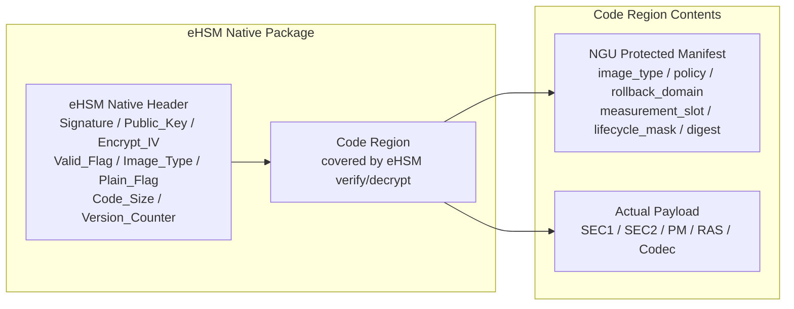
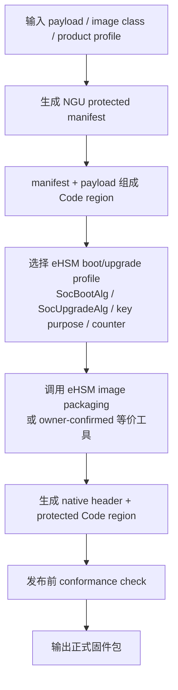
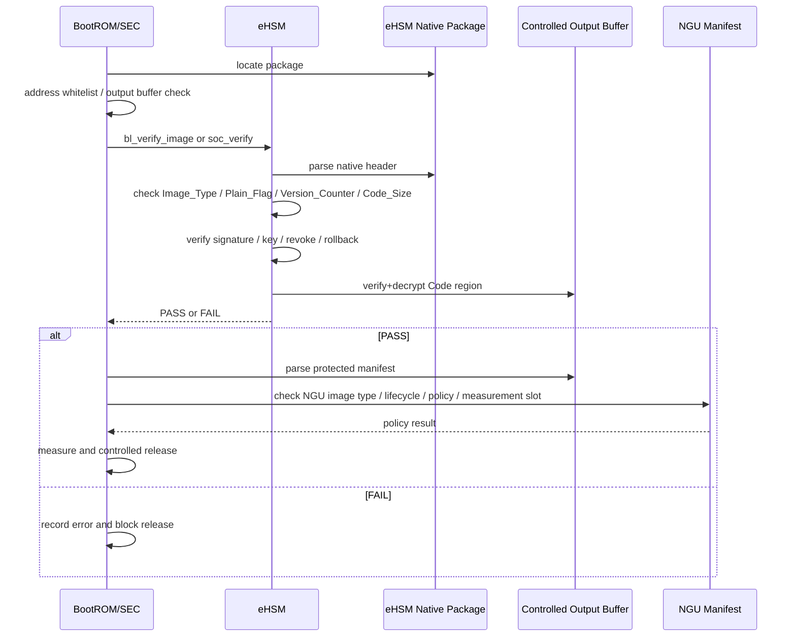

# NGU800 eFuse / Key / eHSM FW Header 对齐设计（CR-0004/CR-0006 Applied）

> CR-0005 source-of-truth notice:
> 本文件是 `10_full_design.md` 第 10 章的编辑分片 / extracted implementation shard，不再作为独立事实源。
> 代码落地、评审和 ChatGPT 方案审查应优先读取 `security_workflow/03_detailed_design/10_full_design.md`。
> 修改本文件时，必须同步主详设第 10 章；若发生冲突，以 accepted CR、decision_log、official TRM 和 `10_full_design.md` 为准。

状态：实现级详设（CR-0004 / CR-0006 / CR-0014 accepted-apply 后修订）
适用范围：NGU800 / NGU800P 安全启动、密钥体系、反回滚、制造灌装
主要来源：`CR-0004`、`CR-0006`、`CR-0014`、`SRC-008 当前收敛安全软件方案 2.0` 第 4 章 / 第 4.5 节、`SRC-006 eHSM Firmware TRM`、`SRC-007 eHSM Bootloader TRM`

---

# 1. 设计目标

本文档不再定义一套与 eHSM 并列的 physical FW Header、physical OTP/eFuse layout 或 physical key slot。

本文档收敛以下对象：

1. eHSM native secure boot image header 的项目使用方式
2. NGU 项目级 manifest / logical policy 与 eHSM native header 的分层
3. eHSM OTP/control/key/counter 与 NGU logical alias 的映射
4. SEC1 / SEC2 sign+encrypt 的 verify+decrypt output path
5. 平台侧固件制作、设备侧 verify/decrypt 与 NGU manifest policy 的落地流程
6. CR-0004 / CR-0006 后续仍需冻结的 eHSM customization / ABI / key ID / OTP bit / tooling 问题

---

# 2. Source-Conformance 原则

## 2.1 eHSM-native 优先

`SRC-006 eHSM Firmware TRM` 与 `SRC-007 eHSM Bootloader TRM` 已定义的字段均作为 physical fact：

- secure boot image header
- `Image_Type / Plain_Flag / Naked_Flag / Version_Counter`
- `SocBootAlg / SocUpgradeAlg` 等 control field
- OTP key ID / level / purpose
- SOC FW / eHSM FW Version Counter
- `bl_verify_image / soc_verify / fw_upgrade` 等命令语义

## 2.2 NGU 字段分类

任何 NGU 字段必须归入以下类别之一：

| Mapping Type | 含义 |
|---|---|
| `eHSM-native` | eHSM TRM 已定义的 physical field / command |
| `NGU-logical-alias` | NGU 文档阅读视图，不表达 physical offset / key slot |
| `manifest-extension` | 放入 eHSM Code region 的 NGU protected manifest |
| `eHSM-customization-TBD` | 需要 eHSM owner / TRM / firmware customization 支撑 |
| `NGU-SoC-integration-TBD` | 属于 SoC/RTL/board 集成字段，非 eHSM physical field |

---

# 3. eHSM Native Secure Boot Image Header

## 3.1 Header 布局

`[CONFIRMED]` SEC1 / SEC2 的密码学 verify/decrypt container 采用 eHSM native secure boot image header。

| eHSM Field | Offset | Size | Mapping Type | NGU 使用规则 |
|---|---:|---:|---|---|
| `Signature` | 0 | 256 | `eHSM-native` | 签名/MAC 值，长度由 eHSM control field 的算法选择决定 |
| `Public_Key` | 256 | 320 | `eHSM-native` | 非对称算法公钥字段；CMAC 模式无效 |
| `Encrypt_IV` | 576 | 16 | `eHSM-native` | AES/SM4 CBC/CMAC 相关 IV；具体语义按 eHSM TRM |
| `Valid_Flag` | 592 | 4 | `eHSM-native` | eHSM image valid marker |
| `Image_Type` | 596 | 1 | `eHSM-native` | eHSM TRM 定义，不写入 NGU SEC1/SEC2/runtime 编码 |
| `Plain_Flag` | 597 | 1 | `eHSM-native` | Code region 是否明文；SEC1/SEC2 正式路径必须为密文 profile |
| `Naked_Flag` | 598 | 1 | `eHSM-native` | 裸镜像仅用于 TRM 允许的开发生命周期 |
| `Reserved` | 599 | 5 | `eHSM-native` | 必须按 TRM 置 0；不得擅自承载 NGU 字段 |
| `Code_Size` | 604 | 4 | `eHSM-native` | Code region 大小 |
| `Version_Counter` | 608 | 16 | `eHSM-native` | eHSM 128-bit one-way counter |
| `Public_Key_Ext` | 624 | 400 | `eHSM-native` | RSA3072 扩展字段 |
| `Code` | 1024 | `Code_Size` | `eHSM-native` | 明文或密文 Code region；NGU manifest 放在此区域 |

## 3.2 旧 NGU Header 状态

以下旧结构不再作为 physical wire/storage format：

- `ngu_fw_min_hdr_t`
- `ngu_fw_signed_hdr_t`

它们只能作为历史草案或工具侧中间结构参考；任何代码、ROM、SEC、Host 工具或文档不得把它们作为安全启动镜像的 physical verification header。

---

# 4. NGU Protected Manifest

## 4.1 放置原则

`[CONFIRMED]` NGU 项目级 metadata 放入 eHSM Code region 的 protected manifest / policy table。

推荐布局：

```text
[eHSM Native Image Header, 1KB, plaintext]

[Code region, verified/decrypted by eHSM]
  ngu_image_manifest_t or equivalent manifest extension
  actual firmware payload
```

## 4.2 Manifest 语义

manifest 可承载以下 NGU 项目级逻辑：

| Manifest Concept | Status | 说明 |
|---|---|---|
| `ngu_image_type` | `[CONFIRMED]` | NGU `SEC1 / SEC2 / PM / RAS / Codec / Recovery` 项目级类型 |
| `security_policy_flags` | `[CONFIRMED]` | sign/encrypt/rollback/measurement/release policy 的项目表达 |
| `rollback_domain` | `[CONFIRMED]` | NGU logical rollback domain，不是 physical OTP 32-bit counter |
| `measurement_slot` | `[CONFIRMED]` | measurement / attestation slot |
| `lifecycle_mask` | `[CONFIRMED]` | NGU policy gate；最终生命周期 authority 仍在 eHSM/OTP |
| `product_sku_mask` | `[ASSUMED]` | 产品策略 |
| `board_binding_policy` | `[ASSUMED]` | board binding 默认进入 attestation；是否参与 release 仍 TBD |
| `expected_algorithm_profile` | `[CONFIRMED]` | 仅做一致性检查/审计，不覆盖 eHSM control field |
| `payload_digest` | `[ASSUMED]` | 用于 manifest 内 payload 描述；具体 hash profile 跟随 eHSM/产品策略 |

## 4.3 Manifest ABI 开放项

以下内容保持 `[TBD]`：

1. `ngu_image_manifest_t` bit-level ABI。
2. manifest 是否必须位于 Code region 起始位置。
3. manifest extension / TLV 格式。
4. eHSM firmware / bootloader 是否直接解析 manifest。
5. manifest 中 board binding 是否参与 SEC2/runtime release decision。

### 4.4 固件包格式与制作/验证流程（CR-0006）

#### 4.4.1 旧 current_plan 格式的处理

旧 `SRC-001 当前安全方案基线` 第 6/7 章中描述的：

```text
header + Signed Region + signature + wrapped_cek + enc_payload
```

在 CR-0006 后只作为“制作和验证流程意图”的参考，不作为 NGU800 最终 physical wire/storage format。

CR-0004 / CR-0006 后的正式包格式是：

```text
[eHSM Native Secure Boot Image Header, 1KB plaintext]

[eHSM Code region, verified/decrypted by eHSM]
  NGU protected manifest / policy table
  actual firmware payload
```

规则：

- eHSM native header 是唯一 physical verification/decrypt header。
- NGU 不再定义 `common_firmware_header` / `signed_region_v1` 作为设备侧 wire/storage ABI。
- Signed Region 中原本想表达的 `firmware_type / version / rollback / key_id / payload_hash / policy`，必须迁移到 eHSM native field、NGU protected manifest 或 eHSM owner-confirmed key/counter mapping。
- `wrapped_cek` 仅在 eHSM owner 后续确认 per-image CEK / wrap extension 时才可作为 `eHSM-customization-TBD` 进入实现；当前不得被工具链写死。

#### 4.4.2 固件包布局图



图下说明：

1. `Image_Type / Plain_Flag / Version_Counter / Code_Size` 由 eHSM TRM 定义。
2. `ngu_image_type / security_policy_flags / rollback_domain / measurement_slot` 由 NGU manifest 表达。
3. payload digest 应由 manifest 或 eHSM owner-confirmed metadata 表达；具体 hash profile 跟随 eHSM control field / product profile。
4. load address / entry point 若进入 manifest，必须等 eHSM PASS 后才能被 BootROM / SEC 使用。

#### 4.4.3 平台侧固件制作流程



平台侧制作规则：

| Step | 工具动作 | 输出 / 检查 |
|---|---|---|
| 1 | 读取 payload、image class、版本、产品 profile | 明确 `SEC1 / SEC2 / PM / RAS / Codec / Recovery` 的 NGU 项目级类型 |
| 2 | 生成 NGU protected manifest | `ngu_image_type`、policy、rollback domain、measurement slot、lifecycle mask、expected algorithm profile、payload digest |
| 3 | 拼接 eHSM Code region | `manifest + payload`，manifest 必须处于 verify/decrypt 保护范围 |
| 4 | 选择 eHSM profile | 算法 authority 来自 eHSM control field；工具只能选择 owner-confirmed profile |
| 5 | 生成 eHSM native header | Header 字段必须逐项通过 source-conformance matrix |
| 6 | 执行签名/加密封装 | 按 eHSM TRM / owner-confirmed tool 完成，不由 NGU 工具发明 physical crypto metadata |
| 7 | 发布前检查 | 检查 `Image_Type` 未误用、`Plain_Flag` 符合 sign+encrypt policy、Version Counter / rollback domain 一致、manifest 可解析 |

#### 4.4.4 设备侧 verify/decrypt 流程



设备侧规则：

1. BootROM / SEC 不得在 eHSM PASS 前信任 NGU manifest。
2. BootROM / SEC 不得自行执行正式安全路径签名验证、复杂解密或 key unwrap。
3. SEC1 / SEC2 必须走 eHSM verify+decrypt output path；NVM only verify 不适用于 sign+encrypt 镜像。
4. output buffer / destination address 必须由 BootROM / SEC 预先白名单，eHSM 侧再次检查。
5. eHSM PASS 后，BootROM / SEC 才能解析 NGU manifest 并执行项目级 policy：
   - `ngu_image_type` 与当前启动阶段匹配；
   - `security_policy_flags` 满足 SEC1/SEC2 mandatory sign+encrypt；
   - `rollback_domain` 与 eHSM Version Counter / owner-confirmed rollback policy 一致；
   - `lifecycle_mask` 允许当前 lifecycle；
   - `measurement_slot` 合法；
   - `expected_algorithm_profile` 与 eHSM control field 不冲突；
   - board binding policy 按 CR-0003/后续 CR 裁决执行。

#### 4.4.5 工具链交付物

首版 image packager 至少应输出以下可审查产物：

| Artifact | 用途 | 状态 |
|---|---|---|
| eHSM native package | 正式发布固件包 | `[CONFIRMED direction]` |
| package manifest dump | 供 review / CI 检查 NGU manifest 语义 | `[ASSUMED]` |
| source-conformance report | 检查 header、manifest、key/counter/profile 来源 | `[ASSUMED]` |
| golden vector | BootROM / SEC / eHSM adapter 联调用例 | `[TBD exact format]` |
| policy check report | 检查 sign+encrypt、rollback、lifecycle、measurement slot | `[ASSUMED]` |

注意：这些工具链交付物不改变 eHSM physical ABI；它们用于工程检查和联调。

---

# 5. Image Type 分层

| 概念 | 承载位置 | Authority | 状态 |
|---|---|---|---|
| eHSM `Image_Type` | eHSM native header offset 596 | eHSM TRM | `[CONFIRMED]` |
| NGU `SEC1 / SEC2 / PM / RAS / Codec / Recovery` | NGU protected manifest | NGU SEC/Boot policy | `[CONFIRMED]` |
| eHSM firmware 直接理解 NGU image type | eHSM customization | eHSM owner | `[TBD]` |

规则：

- 不得把 NGU `IMAGE_TYPE_SEC1 / SEC2 / PM / RAS / Codec / Recovery` 直接写成 eHSM native `Image_Type` 编码。
- eHSM `Image_Type` 只用于 eHSM 已定义的镜像/key profile。
- NGU `ngu_image_type` 用于 release policy、measurement slot、runtime image policy 和 attestation 映射。

---

# 6. Algorithm Authority

`[CONFIRMED]` secure boot / upgrade 的算法 authority 来自 eHSM OTP/control field，例如：

- `EhsmCodeVerifyAlg`
- `EhsmCodeUpgradeAlg`
- `SocBootAlg`
- `SocUpgradeAlg`

规则：

- NGU manifest 可记录 `expected_algorithm_profile`。
- `expected_algorithm_profile` 仅用于一致性检查、审计、attestation。
- 若 manifest expected profile 与 eHSM control field 冲突，必须失败或记录 policy mismatch。
- NGU 不得通过 header/manifest 覆盖 eHSM control field 的算法选择。

---

# 7. OTP / eFuse Logical View

## 7.1 NGU logical view

`[CONFIRMED]` `OTP-0..OTP-7` 仅保留为 NGU logical view，不表达 physical OTP/eFuse offset。

| NGU Logical View | 语义 | Mapping Type | Physical Authority |
|---|---|---|---|
| OTP-0 lifecycle view | lifecycle / lock / destroy state | `NGU-logical-alias` | eHSM lifecycle / control field / SoC integration |
| OTP-1 control view | secure boot / debug / algo / rollback policy | `NGU-logical-alias` | eHSM FW Control / SOC Control / hardware control field |
| OTP-2 root material view | root / UDS / DRK upstream | `NGU-logical-alias` | eHSM OTP key layout / secure storage |
| OTP-3 anchor view | signer / debug / attest anchor | `NGU-logical-alias` | eHSM key ID / purpose / owner-confirmed anchor slot |
| OTP-4 rollback view | rollback domain / version state | `NGU-logical-alias` | eHSM Version Counter / customization TBD |
| OTP-5 identity view | UID / device identity seed | `NGU-logical-alias` | eHSM UID / key layout / attestation design |
| OTP-6 board/die binding view | board / die binding policy | `NGU-SoC-integration-TBD` | SoC/board integration |
| OTP-7 non-secure config view | non-secure readonly config | `NGU-SoC-integration-TBD` | SoC/board integration |

## 7.2 Control Fields

旧的 `SECURE_BOOT_EN / DEBUG_AUTH_EN / JTAG_FORCE_DISABLE / FW_ENCRYPT_EN / ATTEST_EN / ANTI_ROLLBACK_EN` 不再写成 NGU 自定义 physical OTP bit。

| NGU Logical Field | Mapping Type | 说明 |
|---|---|---|
| `SECURE_BOOT_EN` | `eHSM-native` / `NGU-SoC-integration-TBD` | 对齐 eHSM / hardware control field |
| `DEBUG_AUTH_EN` | `eHSM-native` / `NGU-SoC-integration-TBD` | 对齐 eHSM debug auth / lifecycle policy |
| `JTAG_FORCE_DISABLE` | `NGU-SoC-integration-TBD` | 依赖 SoC/board JTAG MUX / firewall / lifecycle |
| `FW_ENCRYPT_EN` | `manifest-extension` / policy | SEC1/SEC2 mandatory encrypt 是项目策略，不应伪装为单一 physical bit |
| `ATTEST_EN` | `NGU-logical-alias` / `NGU-SoC-integration-TBD` | 证明服务 enable policy |
| `ANTI_ROLLBACK_EN` | `eHSM-native` / policy | 对齐 eHSM Version Counter / update policy |

---

# 8. Version Counter / Rollback

`[CONFIRMED]` eHSM TRM 定义 eHSM FW 和 SOC FW Version Counter，长度为 16 字节，采用单向计数语义。

| NGU Old Field | New Status | Physical Mapping |
|---|---|---|
| `SEC1_MIN_VER` | `NGU-logical-alias` | eHSM SOC FW Version Counter / owner-confirmed rollback policy |
| `SEC2_MIN_VER` | `NGU-logical-alias` | eHSM SOC FW Version Counter / owner-confirmed rollback policy |
| `PMP_MIN_VER / RMP_MIN_VER / OMP_MIN_VER / MMP_MIN_VER` | `NGU-logical-alias` | per-image rollback customization TBD |

规则：

- NGU `*_MIN_VER` 不得写成 physical OTP 32-bit counter。
- V1 可使用 eHSM SOC FW Version Counter 作为物理 rollback 基础候选。
- 若要求 SEC1 / SEC2 / PM / RAS / Codec 独立 rollback counter，必须通过 eHSM customization 或 owner-confirmed monotonic counter service 冻结。

---

# 9. Key Hierarchy / Key Slot Mapping

`[CONFIRMED]` eHSM TRM 已定义 OTP key ID / level / purpose。NGU key name 是 logical alias，不是新增 physical key slot。

| NGU Key Concept | Mapping Type | eHSM Mapping Direction | Status |
|---|---|---|---|
| UDS / Root Secret | `eHSM-native` / logical root | Chip Root Key / Device Root Key / secure storage | `[CONFIRMED]` |
| FW Verify Key | `NGU-logical-alias` | Soc FW Verify Key / Soc Upgrade Verify Key / owner mapping | `[TBD exact ID]` |
| FW Encrypt Key / FW_KEK | `NGU-logical-alias` | Soc Encrypt Key / Soc Upgrade Encrypt Key / owner mapping | `[TBD exact ID]` |
| Debug Auth Key / Seed | `NGU-logical-alias` | Soc Debug Verify Key / User Auth Key / owner mapping | `[TBD exact ID]` |
| Attestation Key / Seed | `NGU-logical-alias` | Soc Private Key / Secret Key / owner mapping | `[TBD exact ID]` |
| Image CEK / wrapped CEK | `eHSM-customization-TBD` | per-image CEK extension requires eHSM support | `[TBD]` |

规则：

- 私钥、root secret、FW_KEK 明文不得离开 eHSM / 受控安全环境。
- exact key ID 不得由 SEC/Host/Tool 自行发明。
- manufacturing provisioning 必须使用 eHSM install / change lifecycle / change control field 等官方或 owner-confirmed command。

---

# 10. SEC1 / SEC2 Verify+Decrypt Path

## 10.1 Deployment Rule

`[CONFIRMED]` SEC1 / SEC2 sign+encrypt 不得使用 eHSM NVM only verify。

| Path | eHSM TRM 语义 | NGU 采用 |
|---|---|---|
| RAM deploy / output buffer | verify + decrypt to RAM / output address | SEC1 / SEC2 mandatory |
| NVM only verify | only verify, image cannot be encrypted | 不适用于 SEC1 / SEC2 sign+encrypt |

## 10.2 Command Mapping

| NGU Profile | eHSM Direction | Status |
|---|---|---|
| `VERIFY_SEC1` | eHSM Bootloader `bl_verify_image` 或等价 ROM path | `[ASSUMED]` early boot mapping，需 BootROM/eHSM 集成确认 |
| `VERIFY_IMAGE(SEC2)` | eHSM Firmware `soc_verify` 或 SEC wrapper | `[CONFIRMED direction]` runtime/load direction，接口字段以 mailbox_if 为准 |
| `fw_upgrade` | eHSM upgrade image -> boot image | `[CONFIRMED]` manufacturing/update path reference |

## 10.3 Output Buffer Rule

- output buffer / destination address 必须由 BootROM / SEC 预先白名单。
- eHSM 侧必须再次做范围检查。
- Host / OOB / 管理子系统 DMA 默认不得访问 output buffer、SEC1/SEC2 执行区、manifest policy area、measurement_table 安全写区。
- decrypt fail / policy mismatch / address invalid 必须阻断 boot 或 runtime release。

---

# 11. Manufacturing / Provisioning 对齐

制造灌装必须改为 eHSM command / field mapping：

| Manufacturing Concept | eHSM Mapping | Status |
|---|---|---|
| root / key material install | `install_random_key` / `install_encrypt_key` / owner-confirmed provisioning command | `[CONFIRMED direction]` |
| lifecycle change | `change_lifecycle` | `[CONFIRMED direction]` |
| control field change | `change_control_field` | `[CONFIRMED direction]` |
| version counter init / check | eHSM Version Counter / command policy | `[TBD exact process]` |
| OTP readback validation | eHSM readback/status/attested validation | `[TBD]` |

---

# 12. Source-Conformance Matrix

字段级 mapping 见：

- `security_workflow/04_impl_design/ehsm_source_conformance_matrix.md`

任何后续涉及 header、OTP、key、counter、manufacturing command 的变更，必须同步更新 matrix。

---

# 13. Open Issues

| Issue | Status | Owner |
|---|---|---|
| `ngu_image_manifest_t` bit-level ABI | `[TBD]` | Security Owner / SEC FW |
| eHSM firmware / bootloader 是否解析 NGU manifest | `[TBD]` | eHSM Owner |
| exact OTP/control bit mapping | `[TBD]` | eHSM / RTL Owner |
| exact NGU key alias -> eHSM key ID mapping | `[TBD]` | eHSM / Security Owner |
| per-image rollback counter | `[TBD]` | eHSM / Product Security |
| per-image CEK / wrapped CEK | `[TBD]` | eHSM Owner |
| recovery image policy | `[TBD]` | Security Owner |
| board binding release decision | `[TBD]` | Security / Board Owner |
| image packager CLI / golden vector / package conformance report | `[TBD]` | Tooling Owner / SEC FW Owner |

---

# 14. 结论

CR-0004 应用后，本文档的实现级基线为：

- eHSM native secure boot image header 是 SEC1 / SEC2 的密码学 verify/decrypt container。
- NGU 项目级 metadata 进入 Code region protected manifest，不再定义并列 physical header。
- 平台侧固件制作工具和设备侧 verify/decrypt 流程必须共享 eHSM native header + NGU protected manifest 契约。
- eHSM `Image_Type`、算法 control field、Version Counter、OTP key layout 均按 eHSM TRM 作为 physical fact。
- `OTP-0..OTP-7`、`*_MIN_VER`、NGU key names 仅保留为 logical view / logical alias。
- SEC1 / SEC2 sign+encrypt 必须使用 verify+decrypt output path，不使用 NVM only verify。
- 未冻结的 ABI / key ID / counter / wrapped CEK / manifest parser 不得被实现写死。
