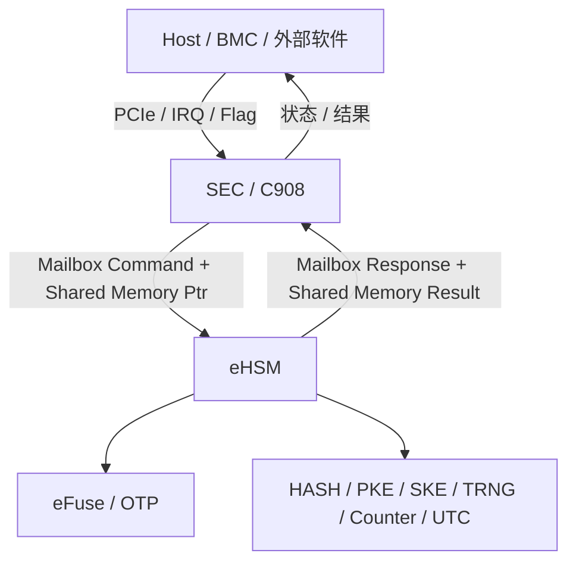
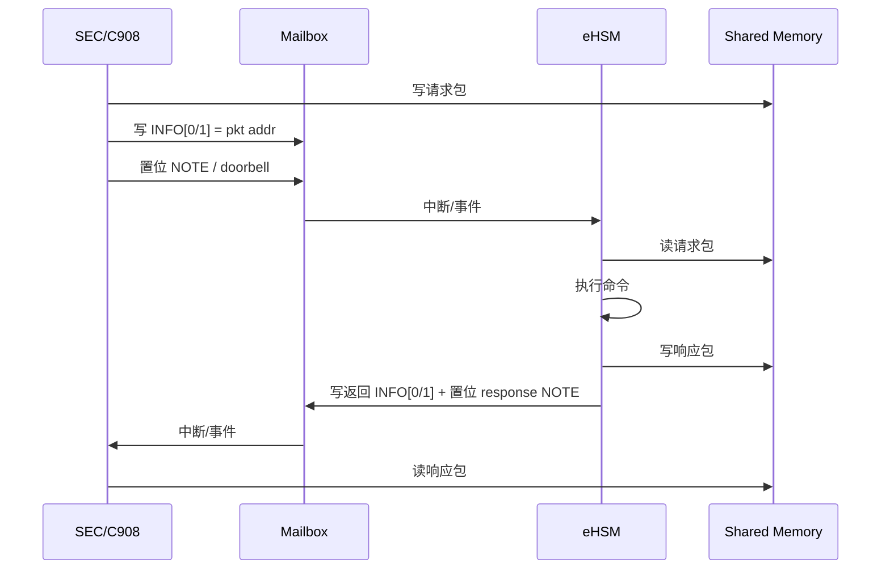

# NGU800 Mailbox 接口实现级设计（V1.0）

状态：实现级详设  
适用范围：NGU800 / NGU800P 安全子系统（SEC/C908 ↔ eHSM）  
定位：供 RTL、SEC FW、eHSM 适配层、Driver、Host 代理层对齐使用

---

# 1. 设计目标

本文档在 NGU800 当前基线下，定义安全子系统 Mailbox 的实现级接口模型，明确：

1. Mailbox 的调用边界与拥有者
2. 硬件寄存器与共享内存的分工
3. 请求/响应包格式
4. 关键命令的 request / response 结构
5. 生命周期限制、错误码模型、超时重试策略
6. 与 Host / PCIe / SEC / eHSM 的边界关系

本文档目标不是替代 eHSM 原始 TRM，而是在 NGU800 项目中形成一个可直接实施的“项目适配层定义”。

---

# 2. 设计输入与裁决口径

## 2.1 已采用的输入事实

- eHSM 与 SoC 之间通过 Mailbox 进行命令/响应交互，通过 SOC_MEM 进行数据传递。
- eHSM 侧会从 SOC_MEM 取入参数据并把结果写回 SOC_MEM。
- 安全子系统相对封闭，外部系统不能直接访问 eHSM。
- 在项目架构中，eHSM 只接受来自 C908 的任务，其他 Core 或 Master 没有访问通道。
- eHSM Mailbox 硬件支持最多 16 个通道；每个方向有 2 个 data 寄存器和 1 个 note/status 寄存器。
- eHSM 固件/Bootloader 已存在 verify、debug auth、lifecycle、counter、UTC 等命令族能力。

## 2.2 项目裁决

即使通用 eHSM 文档描述了“主机向 eHSM 发送命令”流程，本项目不直接采用“Host 直接调用 eHSM”模式，而采用：

> **Host → SEC/C908 → eHSM**

即：
- Host 只能通过 PCIe + 中断 / 标志位把镜像或请求送到受控缓冲区
- SEC/C908 负责做访问控制、生命周期判断、参数封装
- eHSM 只处理来自 SEC/C908 的安全服务请求

---

# 3. 总体架构

## 3.1 逻辑关系



## 3.2 角色分工

| 角色 | 职责 | 不允许做的事 |
|---|---|---|
| Host | 投递镜像 / 请求；读取结果 | 直接调用 eHSM；直接 release 执行；直接访问 key/OTP |
| SEC/C908 | 唯一 Mailbox caller；参数封装；生命周期/权限检查；状态机控制 | 绕过 eHSM 进行正式安全路径验签 |
| eHSM | 安全服务执行者；verify / key / lifecycle / auth / counter / UTC | 接收非 C908 发来的任务 |
| RTL/Mailbox HW | 提供通道、寄存器、note、中断 | 承担协议级安全语义判断 |

---

# 4. 硬件寄存器使用模型

## 4.1 Mailbox 硬件资源

每个 Mailbox 通道按硬件能力包含：

### 下行（SoC → eHSM）
- `MB_S2H_INFO[0]`
- `MB_S2H_INFO[1]`
- `MB_S2H_NOTE`

### 上行（eHSM → SoC）
- `MB_H2S_INFO[0]`
- `MB_H2S_INFO[1]`
- `MB_H2S_NOTE`

此外项目侧必须使用：
- `eHSM_STATUS_0`
- `eHSM_STATUS_1`
- `MB_INT_ALL`
- `MB_HSM_CFG0`
- `MB_HSM_CFG1`

## 4.2 本项目对 INFO 寄存器的使用约定

### 4.2.1 约定原则
由于硬件每个方向只有 2 个 data 寄存器，本项目不把完整请求包直接塞入寄存器，而采用：

> **寄存器只传“包地址 + 控制信息”，真实包体放在共享内存。**

### 4.2.2 推荐映射

| 寄存器 | 含义 |
|---|---|
| `MB_S2H_INFO[0]` | `pkt_addr_l`：请求包物理地址低 32 位 |
| `MB_S2H_INFO[1]` | `pkt_addr_h`：请求包物理地址高 32 位 |
| `MB_S2H_NOTE` | doorbell / 请求有效标记 |
| `MB_H2S_INFO[0]` | `rsp_addr_l`：响应包地址低 32 位（可选与请求相同） |
| `MB_H2S_INFO[1]` | `rsp_addr_h`：响应包地址高 32 位 |
| `MB_H2S_NOTE` | response ready / 完成标记 |

说明：
- 若请求和响应共用同一片共享内存包体，则 `MB_H2S_INFO[0/1]` 可返回同地址。
- `NOTE` 位的置位/清除语义必须在 RTL / FW 联调时统一，不得双方各自假设。

---

# 5. 通道分配建议

## 5.1 通道总体原则
虽然硬件支持最多 16 通道，但首版项目不建议“命令一类一个通道”，避免把接口复杂度前移到 RTL/FW 交互层。

建议首版采用：

| 通道号 | 用途 | 说明 |
|---|---|---|
| CH0 | 通用控制面通道 | verify / lifecycle / debug auth / key / counter / UTC |
| CH1 | 长耗时镜像服务通道 | 大镜像 verify / decrypt / install |
| CH2 | 预留 | attestation / SPDM 扩展 |
| CH3~15 | 预留 | 后续扩展 |

首版最小可行实现：
- **CH0 必须实现**
- CH1 可按镜像路径复杂度决定是否首版启用

---

# 6. 共享内存包格式

## 6.1 通用请求头

```c
typedef struct {
    uint16_t cmd_id;            /* 命令号 */
    uint16_t hdr_ver;           /* header版本 */
    uint32_t total_len;         /* 整个请求包长度 */
    uint32_t token;             /* 请求-响应配对 token */
    uint32_t caller_id;         /* 固定为 SEC/C908 caller id */
    uint32_t lifecycle_state;   /* 当前发起时 lifecycle */
    uint32_t flags;             /* 同步/异步、是否跳转、是否更新计数等 */
    uint32_t payload_off;       /* 负载偏移 */
    uint32_t payload_len;       /* 负载长度 */
    uint32_t resp_buf_off;      /* 响应区域偏移，可与请求同包 */
    uint32_t resp_buf_len;      /* 响应缓冲长度 */
} ngu_mb_req_hdr_t;
```

## 6.2 通用响应头

```c
typedef struct {
    uint16_t cmd_id;            /* 与请求一致 */
    uint16_t hdr_ver;           /* header版本 */
    uint32_t total_len;         /* 整个响应包长度 */
    uint32_t token;             /* 与请求配对 */
    uint32_t status;            /* SUCCESS / FAIL / BUSY / RETRY 等 */
    uint32_t err_code;          /* 细粒度错误码 */
    uint32_t detail0;           /* 附加返回值 */
    uint32_t detail1;           /* 附加返回值 */
    uint32_t detail2;           /* 附加返回值 */
    uint32_t detail3;           /* 附加返回值 */
} ngu_mb_resp_hdr_t;
```

## 6.3 头字段约束

- `caller_id` 在本项目中必须固定代表 SEC/C908 安全调用面。
- `lifecycle_state` 不是最终授权依据，但 eHSM 可用其做快速拒绝；最终仍以 eHSM 侧状态/OTP 为准。
- `token` 必须由 SEC 生成，避免并发时响应错配。
- 所有长度字段必须由 SEC 先做边界检查，再提交到 eHSM。

---

# 7. 命令 ID 规划（项目建议）

## 7.1 命令分组

| 范围 | 组别 |
|---|---|
| 0x0001 ~ 0x001F | Boot / Verify |
| 0x0020 ~ 0x003F | Debug / Auth / Lifecycle |
| 0x0040 ~ 0x005F | Counter / UTC / Status |
| 0x0060 ~ 0x007F | Key Service |
| 0x0080 ~ 0x009F | Attestation / SPDM |
| 0x00A0 ~ 0x00BF | Provisioning / Manufacturing |
| 0x00C0 ~ 0x00FF | Vendor Reserved |

## 7.2 首版强制命令

| Cmd ID | Name | 说明 |
|---|---|---|
| 0x0001 | VERIFY_IMAGE | 固件验签 / 可选解密 |
| 0x0002 | VERIFY_AND_MEASURE | 验签并写入 measurement |
| 0x0020 | GET_CHALLENGE | 获取 challenge |
| 0x0021 | DEBUG_AUTH | 调试鉴权 |
| 0x0022 | CLOSE_DEBUG | 关闭调试 |
| 0x0023 | CHANGE_LIFECYCLE | 切换生命周期 |
| 0x0040 | READ_COUNTER | 读取计数器 |
| 0x0041 | INCREASE_COUNTER | 提升计数器 |
| 0x0042 | GET_UTC | 获取 UTC |
| 0x0043 | SET_UTC | 设置 UTC |
| 0x0060 | KEY_DERIVE | 密钥派生 |
| 0x0061 | IMPORT_WRAP_KEY | 导入封装密钥（如策略允许） |
| 0x0080 | GEN_ATTEST_REPORT | 生成证明报告 |
| 0x00A0 | PROVISION_ROOT_MATERIAL | 制造灌装阶段专用 |

---

# 8. 关键命令结构体

## 8.1 VERIFY_IMAGE

### Request

```c
typedef struct {
    ngu_mb_req_hdr_t hdr;
    uint64_t image_addr;
    uint32_t image_len;
    uint32_t image_type;        /* SEC1 / SEC2 / PMP / RMP / OMP / MMP / RECOVERY */
    uint32_t verify_policy;     /* verify only / verify+decrypt / verify+measure */
    uint32_t expected_lcs_mask; /* 允许的 lifecycle */
    uint32_t jump_on_pass;      /* 仅对 eHSM FW 或特定路径有效 */
    uint64_t dst_addr;          /* 解密输出地址，0 表示原地/策略定义 */
} ngu_mb_verify_image_req_t;
```

### Response

```c
typedef struct {
    ngu_mb_resp_hdr_t hdr;
    uint32_t verified_version;
    uint32_t signer_slot;
    uint32_t measurement_slot;
    uint32_t rollback_checked;  /* 0/1 */
    uint32_t decrypt_applied;   /* 0/1 */
} ngu_mb_verify_image_resp_t;
```

### 约束
- `image_type` 必须参与 eHSM 侧策略检查。
- `jump_on_pass` 只允许在明确受控路径启用；不允许让 Host 通过该字段间接控制跳转。
- `dst_addr` 必须由 SEC 预先做地址白名单检查。

---

## 8.2 GET_CHALLENGE

### Request

```c
typedef struct {
    ngu_mb_req_hdr_t hdr;
    uint32_t auth_type;         /* eHSM debug / SOC debug / USER control */
    uint32_t nonce_len_req;     /* 请求 challenge 长度 */
} ngu_mb_get_challenge_req_t;
```

### Response

```c
typedef struct {
    ngu_mb_resp_hdr_t hdr;
    uint32_t challenge_len;
    uint8_t  challenge[64];
    uint8_t  uid_hash[32];
} ngu_mb_get_challenge_resp_t;
```

---

## 8.3 DEBUG_AUTH

### Request

```c
typedef struct {
    ngu_mb_req_hdr_t hdr;
    uint32_t auth_type;         /* eHSM debug / SOC debug */
    uint32_t scope_words;       /* 端口位图长度（word） */
    uint64_t sig_addr;          /* 签名/MAC 地址 */
    uint32_t sig_len;
    uint64_t scope_bitmap_addr; /* SOC debug 端口位图地址 */
    uint64_t cert_or_keyblob_addr;
    uint32_t cert_or_keyblob_len;
} ngu_mb_debug_auth_req_t;
```

### Response

```c
typedef struct {
    ngu_mb_resp_hdr_t hdr;
    uint32_t granted;
    uint32_t granted_scope_words;
    uint32_t expire_policy;
} ngu_mb_debug_auth_resp_t;
```

---

## 8.4 CHANGE_LIFECYCLE

### Request

```c
typedef struct {
    ngu_mb_req_hdr_t hdr;
    uint32_t from_lcs;
    uint32_t to_lcs;
    uint32_t auth_type;
    uint64_t auth_blob_addr;
    uint32_t auth_blob_len;
} ngu_mb_change_lcs_req_t;
```

### Response

```c
typedef struct {
    ngu_mb_resp_hdr_t hdr;
    uint32_t old_lcs;
    uint32_t new_lcs;
} ngu_mb_change_lcs_resp_t;
```

---

## 8.5 COUNTER 命令

### READ_COUNTER Request

```c
typedef struct {
    ngu_mb_req_hdr_t hdr;
    uint32_t counter_id;
} ngu_mb_read_counter_req_t;
```

### READ_COUNTER Response

```c
typedef struct {
    ngu_mb_resp_hdr_t hdr;
    uint32_t counter_id;
    uint64_t counter_val;
} ngu_mb_read_counter_resp_t;
```

### INCREASE_COUNTER Request

```c
typedef struct {
    ngu_mb_req_hdr_t hdr;
    uint32_t counter_id;
    uint64_t increment;
} ngu_mb_inc_counter_req_t;
```

### INCREASE_COUNTER Response

```c
typedef struct {
    ngu_mb_resp_hdr_t hdr;
    uint32_t counter_id;
    uint64_t counter_val_new;
} ngu_mb_inc_counter_resp_t;
```

---

## 8.6 GEN_ATTEST_REPORT

### Request

```c
typedef struct {
    ngu_mb_req_hdr_t hdr;
    uint64_t nonce_addr;
    uint32_t nonce_len;
    uint32_t session_flags;
    uint32_t measurement_mask;
    uint64_t out_report_addr;
    uint32_t out_report_max_len;
} ngu_mb_gen_att_report_req_t;
```

### Response

```c
typedef struct {
    ngu_mb_resp_hdr_t hdr;
    uint32_t report_len;
    uint32_t sig_algo;
    uint32_t hash_algo;
} ngu_mb_gen_att_report_resp_t;
```

---

# 9. 状态机与握手语义

## 9.1 请求路径



## 9.2 NOTE 语义（项目建议）

- `REQ_VALID`：SEC 已写好请求包，可处理
- `REQ_BUSY`：eHSM 已接收，处理中
- `RSP_VALID`：eHSM 已写好响应
- `RSP_DONE_ACK`：SEC 已完成响应消费

若硬件 NOTE 仅提供单 bit，则用“置位触发 + 软件状态字段”方式实现，不在 NOTE bit 上塞太多语义。

---

# 10. Cache / DMA / 内存一致性规则

## 10.1 请求写入责任
- SEC 负责把请求包写入共享内存。
- 若共享内存位于 cacheable 区域，SEC 必须在 doorbell 前完成 cache flush / clean。
- eHSM 侧如通过 DMA/AXI 读取共享内存，必须保证读到 flush 后数据。

## 10.2 响应读取责任
- eHSM 写完响应包并置 response ready 后，SEC 在读取前必须做 invalidate / barrier（如区域可 cache）。

## 10.3 地址合法性
- `pkt_addr` / `dst_addr` / `scope_bitmap_addr` 等所有地址必须由 SEC 先做白名单检查。
- eHSM 侧应再做一次范围检查，防止越界或越权访问。

---

# 11. 生命周期限制矩阵

| Command | TEST | DEVE | MANU | USER | DEBUG/RMA | DEST |
|---|---|---|---|---|---|---|
| VERIFY_IMAGE | Y | Y | Y | Y | Y | N |
| GET_CHALLENGE | Y | Y | Y | 受控 | Y | N |
| DEBUG_AUTH | Y | Y | 受控 | 默认 N / 受策略 | Y | N |
| CLOSE_DEBUG | Y | Y | Y | Y | Y | N |
| CHANGE_LIFECYCLE | Y | Y | Y | 受限 | 受限 | N |
| READ_COUNTER | Y | Y | Y | Y | Y | N |
| INCREASE_COUNTER | Y | Y | Y | Y | 受控 | N |
| GEN_ATTEST_REPORT | 可选 | 可选 | 可选 | Y | 可选 | N |
| PROVISION_ROOT_MATERIAL | N | N | Y | N | N | N |

---

# 12. 错误码模型（项目建议）

| Code | 名称 | 含义 |
|---|---|---|
| 0x0000 | EHSM_OK | 成功 |
| 0x0001 | EHSM_ERR_INVALID_CMD | 无效命令 |
| 0x0002 | EHSM_ERR_INVALID_HDR | 头格式非法 |
| 0x0003 | EHSM_ERR_INVALID_LEN | 长度非法 |
| 0x0004 | EHSM_ERR_INVALID_STATE | 状态不允许 |
| 0x0005 | EHSM_ERR_INVALID_LCS | 生命周期不允许 |
| 0x0006 | EHSM_ERR_ACCESS_DENY | 权限不足 |
| 0x0007 | EHSM_ERR_ADDR_RANGE | 地址越界 |
| 0x0008 | EHSM_ERR_VERIFY_FAIL | 验签失败 |
| 0x0009 | EHSM_ERR_DECRYPT_FAIL | 解密失败 |
| 0x000A | EHSM_ERR_ROLLBACK_FAIL | 版本回退 |
| 0x000B | EHSM_ERR_AUTH_FAIL | 鉴权失败 |
| 0x000C | EHSM_ERR_BUSY | 通道忙 |
| 0x000D | EHSM_ERR_TIMEOUT | 超时 |
| 0x000E | EHSM_ERR_NOT_SUPPORTED | 功能未实现 |
| 0x000F | EHSM_ERR_INTERNAL | 内部错误 |

---

# 13. 超时 / 重试 / 并发语义

## 13.1 最小要求
- CH0 首版建议单 outstanding。
- 若请求处理中，重复提交同通道请求应返回 `EHSM_ERR_BUSY`。
- `token` 必须在单通道范围内唯一，直到响应被消费。

## 13.2 重试规则
- 对 `BUSY` 可重试
- 对 `VERIFY_FAIL / AUTH_FAIL / INVALID_LCS / ACCESS_DENY` 不可盲重试
- 对 `TIMEOUT` 需先读 `eHSM_STATUS` 再决定是否恢复通道

---

# 14. 与 Host 的关系（项目强规则）

1. Host 不直接向 eHSM 发送安全命令  
2. Host 只能把镜像或请求交给 SEC 控制面  
3. SEC 负责：
   - 参数白名单检查
   - 生命周期检查
   - 权限检查
   - 请求封装  
4. eHSM 只接受来自 C908/SEC 的安全任务

---

# 15. RTL / FW / Driver 影响

## 15.1 RTL 侧
- 需要冻结 NOTE 位语义或支持软件状态字段协同
- 需要冻结 INFO[0/1] 的读写时序
- 需要明确中断清除时机
- 需要明确 shared memory 地址位宽（32/64）

## 15.2 SEC FW 侧
- 需要实现请求包封装层
- 需要实现 cache flush / invalidate
- 需要实现 token 管理与 timeout 管理
- 需要实现 command dispatch 封装

## 15.3 Driver 侧
- 需要实现寄存器访问封装
- 需要实现同步/异步等待接口
- 需要实现错误码到上层错误模型的映射

---

# 16. 当前冻结建议

当前建议先冻结以下内容：

1. `INFO[0/1] = packet address low/high`
2. `NOTE` 仅做 doorbell/response ready，不承载复杂多状态
3. CH0 为首版唯一强制实现通道
4. Host 不直接调用 eHSM
5. VERIFY / DEBUG_AUTH / CHANGE_LIFECYCLE / COUNTER / ATTEST 五类命令结构先冻结
6. 所有地址参数必须双重检查（SEC + eHSM）

---

# 17. 开放问题

1. 是否首版启用 CH1 专门承载大镜像 verify/decrypt
2. 请求/响应共用一片共享内存还是分离
3. 共享内存最终落在管理子系统 IRAM、DDR buffer 还是 firewall 划出的 share memory
4. `PROVISION_ROOT_MATERIAL` 是否对外暴露为单独命令，还是仅制造态内部接口
5. Debug port 129 bit 的最终位图映射由谁冻结

---

# 18. 结论

本文件已经把 Mailbox 从“概念交互”推进到“实现级接口”层面，明确了：

- 调用边界：SEC/C908 是唯一 caller，eHSM 是唯一安全执行者
- 硬件分工：寄存器传地址，共享内存传包体
- 协议骨架：req/resp 通用头 + 关键命令结构
- 安全规则：生命周期限制、Host 隔离、地址检查、错误码、超时重试
- 工程影响：RTL / FW / driver 的冻结点

后续可在此基础上继续补：
- command ID 最终值
- debug port 位图冻结
- request/response 头字段最终 bit-level 对齐
- 与 eHSM 原生命令表的一一映射表
