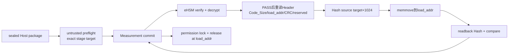

# Design

## Header overlay

```text
offset 624   Public_Key_Ext bytes used by current RSA-3072 modulus [384]
offset 1008  ngu_load_addr_le64 [8]
offset 1016  ngu_header_crc32_le [4]
offset 1020  ngu_reserved [4] = 0
offset 1024  firmware Code Region [Code_Size]
```

`load_addr`、Header CRC和reserved均在Vendor Header认证范围。Header CRC采用CRC-32/ISO-HDLC并覆盖offset 256～1015共760字节；它只做格式完整性筛查，不替代Vendor认证。Overlay只适用于NGU800P type 1 SoC stage包。

## Data flow



## Removed fields

镜像身份、实例、die、Profile、policy、Lifecycle和Measurement类型来自typed stage context；rollback只用Native Header `Version_Counter[16]`；入口固定等于load地址；长度只用`Code_Size`。CRC不编码任何业务策略。CBC零对齐属于Code Region和Measurement。

## Compatibility

旧Manifest包和旧8字节零reserved包直接拒绝，不保留dual parser。任何新Vendor Header/算法必须重新验证末尾16字节。
