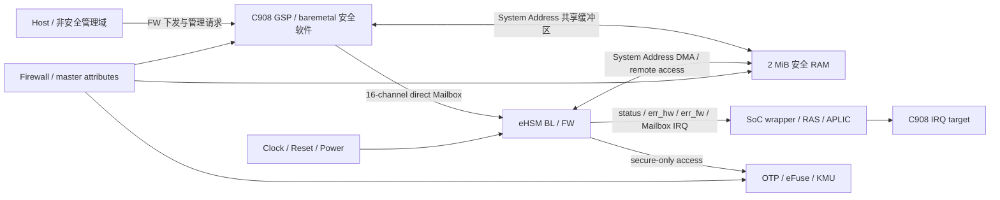
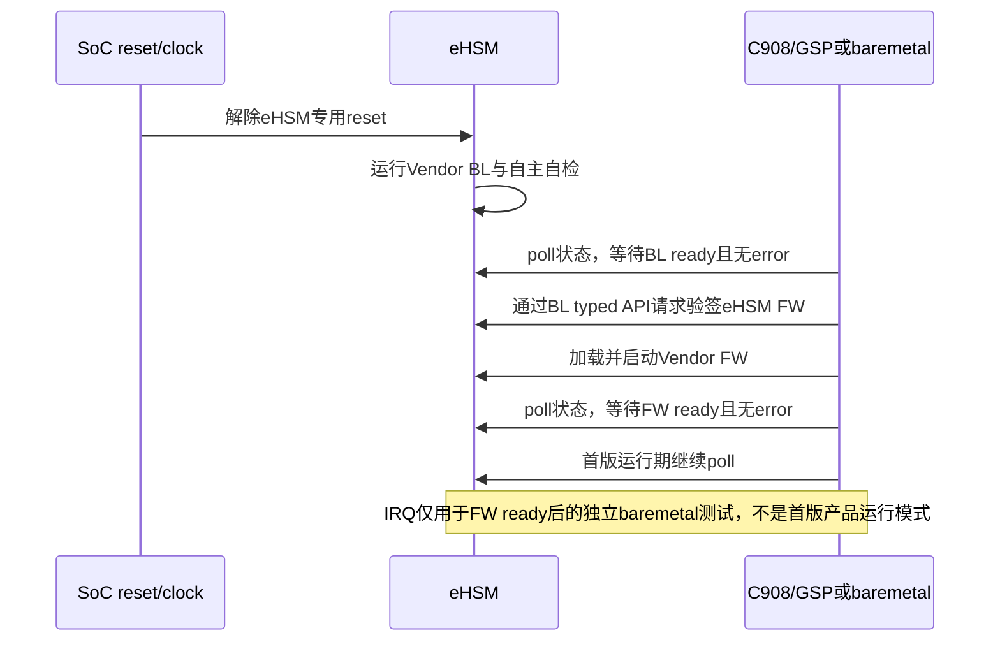

# NGU800P SoC 安全硬件集成方案整理需求（内网独立输入版）

## 1. 使用方式

本文档是交给可访问 NGU800P SoC 内网资料、RTL、寄存器表和中断映射的 Agent/工程师的**单文件完整任务输入**。接收方默认不能访问 `security_-scheme`、`baremetal`、GSP 仓库或本文档之外的项目文件；完成任务所需的项目目标、已知 eHSM 接口事实、软件边界、测试需求和待补硬件问题均已在本文档中展开。

目标是产出一份可直接指导 RTL 集成、GSP/baremetal 开发和 DV 验收的《NGU800P SoC 安全硬件集成方案》，不是根据当前测试代码反推硬件行为，也不是修改任何软件代码。

期望的主产物位置是：

- `soc-security-hardware-integration.md`

如果接收方所在工作区已经有约定的架构文档目录，可以将该文件放入对应目录；不要因为无法访问上述项目仓库而中止任务。

如内网资料与本文档中的已有输入不一致，不得静默选择任一方；应列出冲突资料、版本、影响和推荐处理方案，由项目负责人裁决。

## 2. 资料权威、项目边界和事实状态

内网 Agent 应按以下顺序使用资料：

1. NGU800P 当前有效的系统安全方案、SoC 架构规格和项目集成需求定义系统目标与信任边界。
2. 与目标 D0/当前 RTL revision 匹配的 RTL top/integration、地址生成物、寄存器表、IRQ/APLIC、RAS、Firewall、clock/reset/power 和 DV 资料定义 SoC 数值与硬件行为。
3. 本文档给出的 eHSM Mailbox、BL/FW 和 OTP 内部接口信息仅定义 eHSM/Core 内禀合同；它们不能单独定义 NGU800P SoC 地址、IRQ、cache、reset、RAS 或 Firewall 行为。
4. Vendor BL/FW/Host 交付按不可修改的固件/参考快照管理。不得为了补齐 SoC 集成或测试能力而修改 Vendor 公共源码。
5. demo、stub、synthetic Expected 和现有软件 case 不能作为硬件事实来源。

每项结论必须使用下列状态之一：

| 状态 | 含义 |
|---|---|
| `DOCUMENTED` | 已由匹配版本的正式资料、RTL或生成物记录，但尚无目标环境运行证据 |
| `CONFIRMED` | 已由目标 EMU/FPGA/硅上 Evidence 验证 |
| `VENDOR_IMPLEMENTATION` | 仅证明当前 eHSM Vendor 快照中的实现，不代表 NGU800P SoC 集成 |
| `PROPOSED` | 已给定的项目目标或负责人输入，仍需内网 Source/RTL 绑定 |
| `ASSUMPTION` | 临时推断；必须给出关闭所需资料，不能用于冻结软件常量或测试 Expected |
| `CONFLICTING` | 两个有效来源不一致；必须列出双方版本、影响和建议，不得静默选边 |

### 2.1 接收方必须使用的内网资料

请主动检索并逐项引用以下内网资料；文件名可以不同，但内容不能缺失：

- NGU800P D0 SoC top/integration 和 eHSM wrapper RTL；
- 当前有效的 System Address map 和 RTL 同步软件生成头；
- eHSM 16-channel direct Mailbox 实例化、decode 和权限配置；
- APLIC domain/source/target 映射及 C908 中断接入；
- `o_hsm_status`、`o_hsm_err_hw`、`o_hsm_err_fw` 的顶层连接、wrapper/RAS 寄存器和 bit 映射；
- eHSM clock/reset/power/reset-controller 集成；
- 2 MiB 安全 RAM 的 NoC、PMA/PBMT/cache/coherency 和 Firewall 集成；
- OTP/eFuse/KMU backend、master/security attribute、DFT/ATE/EMU 后门和量产隔离；
- `non_sec_boot` eFuse只读锁存、LCS、`secure_boot` Strap、全 SoC Debug 门控和安全错误/RAS 集成；
- 对应的 DV testplan、assertion、CDC/RDC 和 fault-injection 说明。

若某项资料不存在，输出中必须给出稳定缺口 ID、Owner、影响、所需材料和关闭条件，不能只写 `TBD`。

## 3. 集成方案的系统边界

输出文档必须明确图中每条连接的源、目标、位宽、时钟域、复位域、安全属性、可见地址、中断语义和 Owner。

### 3.1 已知地址与编号基线

以下内容是项目当前输入，不代表已全部完成 RTL 绑定。内网 Agent 必须对 `PROPOSED` 项进行确认，对 `DOCUMENTED` 项进行版本交叉核对：

| 资源 | 当前输入 | 状态 | 内网核对要求 |
|---|---|---|---|
| C908/GSP 安全 RAM | System Address `0x1010_0500_0000`，大小 `0x20_0000`（2 MiB） | `DOCUMENTED`；来自此前 RTL 同步生成头 | 确认当前 RTL revision 的 decode、PMA/PBMT、Firewall、eHSM remote access 和 reset/retention 属性 |
| C908/GSP eHSM direct Mailbox | System Address `0x1010_07c1_0000`–`0x1010_07c1_ffff`，总计 `0x1_0000`，16 channel × `0x1000` | `PROPOSED`；负责人给定，当前外网生成头未绑定 | 在 top/map/RTL 中确认或报告冲突，并给出应同步到软件生成头的宏名 |
| NGU800P 通用 Mailbox | System Address `0x1010_0841_0000`，大小 `0x1000`，84-message 通用布局 | `DOCUMENTED`，但**不是 eHSM direct Mailbox** | 禁止用它替代上述 16×4 KiB eHSM direct aperture |
| eHSM Mailbox IRQ | APLIC domain 9，source 78–93，共16路 | `DOCUMENTED`；逐 channel 对应关系未冻结 | 逐项给出 channel 0–15 → IRQ signal → APLIC source 78–93 的证据，不得仅按顺序猜测 |
| eHSM 内部 OTP | eHSM 内部基址 `0x3300_0000` | `CONFIRMED`的项目接口输入 | 不是 GSP System Address；只用于解释 eHSM 内部 OTP 布局和 eFuse backend 连接 |
| eHSM status/error wrapper | 地址和 bit map 未提供 | 未冻结 | 补齐 `o_hsm_status/o_hsm_err_hw/o_hsm_err_fw` 的寄存器和 IRQ/RAS 绑定 |
| eHSM 专用 reset | SoC reset-controller 中应有独立控制路径 | `PROPOSED`；准确寄存器和时序未冻结 | 补齐寄存器、bit、脉宽、顺序、ready 和复位影响矩阵 |

C908、Manifest、loader、linker 和 eHSM 共享 descriptor 只使用 System Address，不定义也不实现 C908 Local Address 与 System Address 的软件转换。若内网资料显示存在必须由软件处理的 remap/IOMMU 转换，应标为 `CONFLICTING` 并给出证据。

### 3.2 eHSM 启动阶段与驱动模式

项目目标时序如下：

固定边界：

- eHSM BL 阶段全部使用 poll。
- BootROM、FMC、GSP 首版 eHSM 交互均使用 poll；Vendor Host 通用库支持 interrupt 不代表项目已启用中断模式。
- `SOC-MAILBOX-IRQ-001`是eHSM FW ready后的独立测试Profile，测试结束恢复poll；不能把它写成首版产品运行模式。
- 软件默认 eHSM 已被 SoC 拉起，但集成方案仍必须给出 power/reset 后如何判断 `hardware boot done`、`BL ready`、`FW ready` 和 error 优先级。
- GSP 测试暂不覆盖 BL/FW 阶段切换本身；集成方案仍需定义真实硬件状态和切换影响，供后续产品软件使用。

### 3.3 Vendor direct Mailbox 固定协议输入

每个 channel 的 stride 固定为 `0x1000`。下表是当前 Vendor Host/BL/FW 共同采用的 channel 内布局；内网任务不是重新设计该协议，而是确认 NGU800P wrapper/decode/权限/IRQ 与其一致：

| Channel内offset | Vendor名称 | 宽度 | Host侧用途 | eHSM侧用途 | 需要内网确认 |
|---:|---|---:|---|---|---|
| `0x000` | `s2h_info[0]` | 32 | 写request context地址低32位 | 读 | R/W权限、原子性、reset值 |
| `0x004` | `s2h_info[1]` | 32 | 写request context地址高32位 | 读 | 64位地址组合顺序与可见性 |
| `0x080` | `h2s_info[0]` | 32 | 读response context地址低32位 | 写 | C908不得写入以伪造response |
| `0x084` | `h2s_info[1]` | 32 | 读response context地址高32位 | 写 | 64位地址组合顺序与可见性 |
| `0x100` | `s2h_note` | 32 | bit0置位发布request | eHSM消费/清除 | bit定义、W1C或write-0-clear、并发语义 |
| `0x104` | `h2s_note` | 32 | 轮询/消费response并清除 | eHSM置位发布response | bit定义、clear和IRQ条件 |
| `0x110` | `s2h_soc_int` | 32 | SoC侧相关状态/清除 | 硬件路径 | R/W1C/RW1S、触发源 |
| `0x114` | `s2h_soc_int_en` | 32 | Host poll模式写0 | 硬件路径 | enable语义 |
| `0x118` | `s2h_hsm_int` | 32 | 不作为Host response IRQ | eHSM侧中断路径 | 权限和清除 |
| `0x11c` | `s2h_hsm_int_en` | 32 | 不作为Host response IRQ enable | eHSM侧中断路径 | enable语义 |
| `0x120` | `h2s_soc_int` | 32 | Host response IRQ状态/清除 | eHSM response路径 | 与APLIC source关系、清除顺序 |
| `0x124` | `h2s_soc_int_en` | 32 | interrupt模式使能，poll模式写0 | eHSM response路径 | enable/mask/reset值 |
| `0x128` | `h2s_hsm_int` | 32 | 不作为C908 response IRQ | eHSM侧内部路径 | 权限和清除 |
| `0x12c` | `h2s_hsm_int_en` | 32 | 不作为C908 response IRQ enable | eHSM侧内部路径 | enable语义 |

Vendor Host 的基本事务顺序是：等待 `s2h_note.bit0==0` → 发布共享 context 地址 → 设置 `s2h_note.bit0` → 等待 `h2s_note.bit0` → 读取 `h2s_info` → 消费response → 按平台清除语义清除 `h2s_note/h2s_soc_int`。内网方案必须补充硬件访问属性、跨时钟域、IRQ生成、同周期竞争、reset和错误地址行为，但不得把协议改成84-message wrapper。

软件 Mailbox timeout 当前统一按100 ms测试配置；这不是硬件计数值。内网方案应提供可换算该时间的单调timer/clock条件，以及超时后late response、pending和context不可复用的硬件影响。

### 3.4 OTP/eFuse/KMU 固定输入

只有 eHSM 有权限直接读写安全域 OTP/eFuse/KMU。GSP、Host和其他核没有 direct-port 通道，只能通过批准的 eHSM Mailbox typed API。EMU/FPGA 中需要预置的 eFuse 文件属于环境后门，不得成为产品软件直写路径。

BootROM存在一个窄化例外：eFuse新增1 bit `non_sec_boot`，逻辑默认0不覆盖启动策略，烧写为1后在下一次BootROM进入时最高优先级强制现有受限非安全启动。该例外不能实现为raw eFuse direct-port；目标硬件必须把该字段在复位时锁存为BootROM专用只读逻辑快照，并同时提供`valid/ecc_ok/mirror_match`。读取/ECC/镜像/来源异常时安全和非安全FMC均不得release。内网方案必须给出其准确word/bit/offset、blank/programmed编码、ECC/valid、镜像、reset domain、只读寄存器/API、访问权限、烧写/锁定Owner和Lifecycle权限。

eHSM 内部 OTP 基址为 `0x3300_0000`，以下 offset/word 数和 Key record 公式已经给定；`Word=4 bytes`、`N=0..15`：

| Field | Offset | Size/Word | Multi-update | Decoded by |
|---|---:|---:|---|---|
| Life Cycle | `0x000` | 1 | yes | HW |
| UID | `0x004` | 5 | no | FW |
| HW Control | `0x018` | 2 | yes | HW |
| FW Control-eHSM | `0x020` | 2 | yes | HW |
| FW Control-SoC | `0x028` | 2 | yes | HW |
| Error Response Control | `0x030` | 8 | no | FW |
| eHSM Version Counter | `0x050` | 4 | yes | FW |
| SoC Version Counter | `0x060` | 4 | yes | FW |
| OTP Key N Attribute | `0x070 + 0x4 * 0xA * N` | 1 | yes | HW |
| OTP Key N | `0x070 + 0x4 * (0xA * N + 0x1)` | 8 | no | HW |
| OTP Key N CRC | `0x070 + 0x4 * (0xA * N + 0x9)` | 1 | no | HW |

每个Key record为10 words/40 bytes，stride为`0x28`，Key区覆盖offset `0x070..0x2ef`。上述地址是 eHSM 内部地址，不是 GSP 可访问的 System Address。

16个物理 OTP-KMU Key对象顺序如下，内网 Agent 不得按旧 Vendor 17-slot 实现或其他测试表改写：

| ID | Name | Level | Key类型 | 备注/用途 |
|---:|---|---:|---|---|
| 0 | Chip root key | 0 | symm | 芯片根密钥 |
| 1 | Device root key | 1 | symm | 设备根密钥 |
| 2 | USER root key | 1 | 未给出 | 类型待内网/方案材料绑定 |
| 3 | eHSM debug/verify key | 1 | asymm | eHSM鉴权验签密钥 |
| 4 | eHSM FW/update verify key | 1 | asymm | eHSM镜像验签密钥 |
| 5 | eHSM FW/update encrypt key | 1 | symm | eHSM镜像解密密钥 |
| 6 | SoC FW/update verify Rotation key | 2 | asymm | SoC验签轮换密钥 |
| 7 | SoC FW/update encrypt Rotation key | 2 | symm | SoC解密轮换密钥 |
| 8 | DICE root CA key | 2 | asymm | DICE root CA，用于追溯；已给七项属性能力 |
| 9 | SoC debug verify key | 2 | asymm | SoC鉴权密钥 |
| 10 | SoC FW/update verify key | 2 | asymm | SoC镜像验签密钥 |
| 11 | SoC FW/update encrypt key | 2 | symm | SoC镜像解密密钥 |
| 12 | SoC debug verify Rotation key | 2 | asymm | SoC鉴权轮换密钥 |
| 13 | UDS | 2 | asymm | 已给七项属性能力 |
| 14 | Device private Key | 2 | asymm | DICE设备私钥/attestation key；已给七项属性能力 |
| 15 | User auth key | 2 | asymm | 用户鉴权密钥 |

slot 8、13、14已给出的七项属性能力是：签名/生成MAC、验签/验证MAC、加密、解密、派生/协商、允许删除、允许明文导入。产品服务是否允许调用仍由LCS和typed软件策略约束，不得把“硬件属性具备”解释成“Host可任意调用”。

内网 Agent 必须补齐或明确缺失：slot 2 Key类型、各slot允许算法、Key Attribute bit编码、CRC算法及覆盖范围、bit/byte endian、ECC、blank polarity、锁位、multi-update编码、真实eFuse backend地址/控制器、KMU load/operation路径、DFT/ATE个性化与量产关闭证明。

### 3.5 Lifecycle、Debug、Strap和范围裁决

- `non_sec_boot`是最高优先级1 bit eFuse启动策略位：默认0时执行下述LCS×Strap矩阵；可靠读为1时包括USER在内均强制进入现有受限非安全路径；读取/ECC/镜像/来源异常进入启动策略输入错误终态。不得从截图推断物理bit。
- 当前 baremetal SoC case 优先按 TEST 模式设计；正式方案还必须给出 DEV/MANU/USER 权限差异，USER测试后续补充。
- Debug 是整个 SoC 唯一的 enable/auth 开关，不存在scope。需要说明鉴权成功、超时、reset、LCS变化和安全错误如何打开/关闭该全局开关。
- 在`non_sec_boot=0`时，产品目标 `secure_boot` 输入为 `boot_pin.secure_boot[3]`，default 0，`0=受限非安全`、`1=安全`，USER强制安全。此前外网生成头出现过bit0=`SEC_BOOT`、bit3=`DIE_ID`的冲突；内网 Agent必须核对真实寄存器/RTL绑定，不能默认沿用任一冲突定义。
- NGU800P 不集成 sensor 相关寄存器；不得为软件或测试新增 sensor case。仍需确认RTL tie-off/删减后不会产生浮空error、IRQ或未定义状态位。

## 4. 已给定的目标约束

| ID | 目标约束 | 当前状态 | 内网 Agent 需完成的事 |
|---|---|---|---|
| `SOC-HWINT-REQ-001` | GSP 访问 eHSM direct Mailbox 的目标 System Address aperture 为 `0x101007c10000`–`0x101007c1ffff`，16 channel，每路 `0x1000` | `PROPOSED`；当前外网可见生成头尚未找到该 direct aperture 宏 | 在 RTL/top/map 中确认该数值、decode 范围、存储属性和访问权限，并指定应回填的生成头宏 |
| `SOC-HWINT-REQ-002` | C908/GSP 统一使用 System Address，不定义 C908 Local Address 与 System Address 的软件映射关系 | `PROPOSED`的已批准软件目标 | 证明 NoC/IOMMU/remap 不需要软件二次转换，列出 eHSM remote access 看到的地址合同 |
| `SOC-HWINT-REQ-003` | GSP/eHSM 均有权访问2 MiB安全RAM；C908当前具备cache能力，eHSM侧不提供可由软件依赖的cache属性。最终共享context只允许在`NON_CACHEABLE`或`HARDWARE_COHERENT`中选一 | `PROPOSED`；最终属性等待SoC资料裁决 | 核对NoC/PMA/PBMT/coherency，推荐并证明唯一属性；给出barrier、64-byte line独占和DMA可见性合同。若两者均不可实现，应报告冲突，不得默认用全区刷cache掩盖 |
| `SOC-HWINT-REQ-004` | eHSM BL 阶段全部使用 poll；Vendor Host 通用库具备 IRQ 模式不代表 BL 集成已实现 | `PROPOSED`的已批准项目策略 | 在方案中分开“Host 驱动能力”、“eHSM BL 内部收命令模式”和“C908 收 response 模式” |
| `SOC-HWINT-REQ-005` | 产品首版 GSP 继续使用 poll；baremetal `SOC-MAILBOX-IRQ-001` 只在 eHSM FW ready 后建立独立测试 IRQ Profile | `DOCUMENTED`测试边界；数值待绑定 | 提供16路Mailbox IRQ逐channel映射、APLIC域/source、触发类型、mask/pending/claim/complete/clear合同 |
| `SOC-HWINT-REQ-006` | 红框严重错误源组合为一根SoC中断，ECC 1-bit错误另形成一根可清除中断并由SoC外部计数 | `DOCUMENTED`目标；尚缺RTL/CSR绑定 | 分别冻结两根top-level net/APLIC source、极性、锁存、清除、reset、ECC脉冲转电平和计数器合同，支持两项EDA必测 |
| `SOC-HWINT-REQ-007` | `o_hsm_status/o_hsm_err_hw/o_hsm_err_fw` 必须有 GSP 可消费的映射或状态接口 | `PROPOSED`；当前缺 map | 给出寄存器地址、宽度、bit 映射、读清/写清/锁存、BL/FW/LCS 适用范围及与 IRQ 的关系 |
| `SOC-HWINT-REQ-008` | eHSM专用reset集成合同仍需冻结，但原`SOC-RESET-001`不属于v0.3.8本轮SoC顶层Case | `OUT_OF_SCOPE_CURRENT`测试范围；硬件设计仍需完整 | 冻结reset request、最小脉宽、clock前置、reset domain和BL-ready判据，供后续产品集成或重新立项测试使用 |
| `SOC-HWINT-REQ-009` | 只有 eHSM 可直接读写安全 OTP/eFuse/KMU，GSP 不存在 direct-port 通道 | `PROPOSED`的已批准安全边界 | 给出 master/security attribute、Firewall/decoder 限制、非 eHSM master 非法访问响应和 DV 证明；eHSM 内部 OTP address 不得冒充 GSP System Address |
| `SOC-HWINT-REQ-010` | NGU800P 不集成 sensor 相关寄存器，本软件和测试范围不考虑 sensor | `PROPOSED`的已批准范围 | 核对 RTL 实际 tie-off/删减方式，确认不会产生浮空错误、中断或未定义软件可见位 |
| `SOC-HWINT-REQ-011` | eFuse新增1 bit `non_sec_boot`：默认0不覆盖，烧写1后BootROM最高优先级强制现有受限非安全启动；BootROM只消费复位锁存、只读、带valid/ECC/镜像状态的逻辑快照 | `PROPOSED`的已批准产品策略；物理绑定未冻结 | 冻结准确word/bit/offset、编码、ECC/valid、镜像、reset锁存、只读寄存器/API、访问权限、0→1烧写/readback/lock Owner与Lifecycle；证明Host/Runtime不能覆盖，异常输入阻断两条FMC release |

`PROPOSED` 表示这些是当前项目目标/负责人输入；内网 Agent 必须把每一项绑定到具体内网 Source、RTL 版本或生成头后，才能在正式集成方案中提升为 `DOCUMENTED`；取得 EMU/FPGA/硅上 Evidence 后才能提升为 `CONFIRMED`。

## 5. 必须完成的集成章节

### 5.1 安全硬件拓扑与信任边界

- 给出 eHSM、C908/GSP、Host ingress、安全 RAM、OTP/eFuse/KMU、Firewall、RAS、APLIC、clock/reset/power 的集成图。
- 标出每个 master/slave、安全属性、允许方向、禁止方向和违规响应。
- 明确 Vendor eHSM 内部寄存器/AHB address 与 NGU800P GSP System Address 的边界，禁止把两者混用。

### 5.2 地址空间和访问属性

必须提供以下列完整的表：`block/resource`、`System Address base`、`size`、`register offset`、`width`、`GSP access`、`eHSM access`、`other-master access`、`security attribute`、`cache/MMIO attribute`、`reset value`、`Source/version`。

至少覆盖：

- eHSM 16-channel direct Mailbox aperture；
- eHSM status/error wrapper 寄存器；
- eHSM reset/clock control 寄存器；
- eHSM 与 GSP 共享 RAM 范围；
- OTP/eFuse/KMU 可见窗口和禁止窗口；
- `non_sec_boot`专用BootROM只读锁存视图；
- Firewall/RAS/APLIC 相关配置块。

### 5.3 Mailbox 集成

- 按 Vendor direct 合同列出每 channel 的 INFO/NOTE/INT/INT_EN offset、R/W/RW1C/RW1S 属性和 SoC/eHSM 两侧权限。
- 冻结 service channel，并列出 channel 0–15 与 Mailbox IRQ1–16 的一一映射；不得只凭命名顺序猜测。
- 说明 request 发布、eHSM 确认、response 发布、Host 消费和 clear 的功能顺序与中断条件。
- 说明 reset、timeout、late response、重复 NOTE、错误 INFO address 和 channel 串扰时的硬件行为。
- C908 不能通过 SoC-side aperture 写 H2S INFO 或置位 H2S NOTE 伪造 eHSM response；如果内网 RTL 显示可写，必须作为安全冲突上报。

### 5.4 中断集成

对每个 IRQ 使用一行表格记录：`signal`、`source block`、`aggregation`、`synchronizer`、`polarity`、`level/edge`、`APLIC domain`、`source ID`、`target hart/context`、`enable/mask`、`pending`、`claim/complete`、`source clear`、`reset behavior`、`Source/version`。

至少包含：

- eHSM Mailbox IRQ1–16；
- `o_hsm_err_hw` 到 C908 IRQ 的完整路径；
- `o_hsm_err_fw` 是否单独产生 IRQ、与 `err_hw` 聚合还是只进状态寄存器；
- RAS 是直接消费还是由 C908 ISR 转报；
- 多 bit/多源同时有效时的优先级、保留和 clear 规则。

### 5.5 Status/Error/RAS

- 列出 `o_hsm_status`、`o_hsm_err_hw[63:0]`、`o_hsm_err_fw[63:0]` 的每个实现 bit、名称、类型、触发源、锁存/清除、复位域和软件响应建议。
- 说明 correctable/warning/fatal 的分类、RAS action 请求和是否阻断启动/release。
- 不得从一个业务 API 失败猜测顶层 error bit；必须提供权威映射或标记为未冻结。

### 5.6 Clock/Reset/Power

- 说明 eHSM core/bus/APB/OTP/KMU/Mailbox 各时钟源、选择、分频、gate、频率限制和上电顺序。
- 核对 `SWRST_EHSM`、`RSTN_EHSM`、`PRESETN_EHSM`、`RSTN_EHSM_BUS` 是否为当前RTL真实信号，并形成唯一的 eHSM 专用 reset 时序，给出最小脉宽和每个等待条件；不得仅按名称猜测顺序。
- 列出 eHSM reset 对 BL/FW、Mailbox pending/enable、status/error、shared RAM、OTP/KMU 和 key state 的影响。
- 明确reset后eHSM返回BL；该合同保留为硬件集成输入，但v0.3.8不把原`SOC-RESET-001`计入本轮顶层Case。

### 5.7 Shared RAM 与 Cache/Coherency

- 给出 C908 发 request 前、eHSM 读 request 前、eHSM 写 response 后、C908 读 response 前的完整可见性时序。
- 在`NON_CACHEABLE`与`HARDWARE_COHERENT`两个项目候选中给出唯一推荐和硬件证据；若内网RTL只能提供`CACHED_WITH_MAINTENANCE`，必须标为与项目候选冲突，并完整说明clean/invalidate/barrier和风险，不得静默采用。
- 覆盖 64-byte cache line 边界、未对齐 buffer、dirty input、stale output、连续事务和 timeout 后 context 不得复用。

### 5.8 OTP/eFuse/KMU 和密钥边界

- 确认只有 eHSM master 能直接访问安全 OTP/eFuse/KMU；GSP/Host/其他 core 只能通过批准的 eHSM Mailbox typed API 请求。
- 单独定义BootROM对`non_sec_boot`的窄化只读视图：只能读取该逻辑字段及valid/ECC/镜像状态，不能据此获得raw eFuse窗口或烧写能力；值1必须在LCS/Strap/eHSM之前选择现有受限非安全路径。
- 区分 eHSM 内部 OTP/CFG address、SoC eFuse backend 编码和 GSP System Address，禁止把内部 offset 当作 GSP 可直访地址。
- 列出 TEST/DEV/MANU/USER 下的读写/锁定/错误响应以及 EMU/FPGA eFuse 后门与产品通道的隔离。

### 5.9 Firewall 和跨核集成

- 给出启动核配置Firewall的寄存器、master ID/security attribute、Region粒度、默认权限、lock和reset值；只有启动核有配置权限，eHSM及其他核均无配置权限。
- 给出`SOC-FW-SECCFG-001`、`SOC-FW-SPIFC-001`、`SOC-FW-SRAM-001`和`SOC-FW-SRAM-RECFG-001`所需的启动核/eHSM/其他核Master ID、默认authority、5个Region和恢复合同。
- SEC_CFG/SPIFC只测默认权限且不执行成功重新配置，预期均为仅启动核访问、eHSM和其他核拒绝；三个Firewall都只有启动核有配置权限。两个SRAM Case各自在Case内部遍历Region0～Region4，SRAM默认仍允许启动核和eHSM访问。
- 说明非法访问的 bus response、error IRQ/RAS 上报和是否存在部分写副作用。

### 5.10 Lifecycle/Debug/Strap

- 区分`dbg_en_cfg`和`soc_dbg_en_out`：前者由主Die控制从Die Debug并以实际从Die通道判定；后者由eHSM Mailbox鉴权驱动并加入Auth/CLOSE_DEBUG判据。
- 列出LCS、secure boot strap、Debug enable/auth、eHSM debug/auth信号与Firewall/RAS的集成关系。
- Debug 是 SoC 全局单开关，不定义 scope。
- 当前 sensor 范围固定排除，不建立待补的软件 sensor 接口。

### 5.11 测试与故障注入边界

每个激励必须分类为：

- `SOFTWARE_CONSTRUCTIBLE`：GSP/baremetal 通过正式 Mailbox API、目标固件已启用的测试命令或 GSP 可见 SoC 寄存器完成刺激和判定。
- `HARDWARE_EDA_CONSTRUCTED`：必须使用 RTL force、EMU 内部后门、ECC/parity/fault signal、eHSM-side 寄存器或波形竞争才能产生刺激。
- `HYBRID_OBSERVATION`：baremetal 负责前置和观测，但关键刺激仍来自硬件 EDA；Evidence 必须同时绑定软件日志和硬件注入/波形。

当前Vendor BL 2.3.5不包含可用`0xFF13` handler，本轮也禁止为测试定制eHSM固件。因此严重错误组合中断和ECC 1-bit独立中断不建立软件刺激Case，分别由`EDA-ERR-CRITICAL-IRQ-001`和`EDA-ERR-ECC1B-IRQ-001`覆盖；软件只负责读取、清除和证据采集。

## 6. 与软件 Case 的必须映射

| Case ID | 集成方案必须提供的输入 | 软件范围边界 |
|---|---|---|
| `SOC-SECCFG-001` | SEC_CFG base/size、17个offset和场景期望快照 | 一次遍历全部17个寄存器，不按寄存器拆Case |
| `SOC-SECCFG-DBG-001` | `dbg_en_cfg`主Die写路径、从Die Debug连接和探测方法 | 默认关闭→写开→写关，必须以实际Debug通道判定 |
| `SOC-FW-SECCFG-001` | 启动核/eHSM/其他核Master ID和默认authority | 仅启动核允许，eHSM/其他核拒绝；不修改配置 |
| `SOC-FW-SPIFC-001` | 启动核/eHSM/其他核Master ID和默认authority | 仅启动核允许，eHSM/其他核拒绝；不修改配置 |
| `SOC-FW-SRAM-001` | 5个Region默认窗口、authority和非法访问响应 | 单Case内部遍历Region0～4 |
| `SOC-FW-SRAM-RECFG-001` | 三个Firewall配置窗口、各核Master ID、SRAM地址范围、允许Master ID、读回和恢复合同 | 非启动核配置写被拒绝；仅启动核在单Case内遍历Region0～4并同时改地址与Master ID |
| `SOC-MAILBOX-IRQ-001` | Mailbox channel→IRQ、APLIC配置、source clear、mask/retrigger | 只用真实eHSM response；不用software pending或自写Mailbox伪造 |

## 7. 内网 Agent 的输出要求

### 7.1 正文产物

输出一份可独立阅读的 `soc-security-hardware-integration.md`，包含：

1. 系统框图和启动/运行时序图；
2. 完整 address/access 表；
3. 完整 IRQ 映射表；
4. status/error/RAS 映射表；
5. clock/reset/power 时序和 reset matrix；
6. shared RAM/cache/coherency 合同；
7. OTP/eFuse/KMU/Firewall/LCS/Debug 边界；
8. 测试/产品隔离和软件可构造/硬件 EDA 刺激分类；
9. 与上述7条SoC Case及3项EDA/硬件需求的追溯表；
10. 所有尚未冻结项的Owner、所需输入、影响和关闭条件。

### 7.2 证据粒度

每个硬件数值或行为结论必须标注：

- 资料名称、资料版本/日期、章节/表号/页码；
- RTL/top/module/signal 名，或生成头路径/宏/寄存器名；
- 适用的 SoC/eHSM/RTL revision；
- 事实状态：`DOCUMENTED`、`CONFIRMED`、`VENDOR_IMPLEMENTATION`、`PROPOSED`、`CONFLICTING` 之一；
- 如为推断，必须明确标记 `ASSUMPTION` 并列出关闭该推断所需的 Evidence。

### 7.3 禁止项

- 不得留下没有 Owner 和关闭条件的模糊 `TBD`。
- 不得从 Vendor 样例地址、baremetal stub/demo 或当前 case Expected 反推 SoC 数值。
- 不得用 APLIC software pending 代替 eHSM Mailbox/error IRQ 的端到端证据。
- 不得把 RTL force/EMU 内部后门产生的刺激记为 baremetal 软件 case PASS。
- 不得修改 Vendor BL/FW/Host 源码来补集成方案缺口。
- 不得把 `o_hsm_err_hw -> C908 IRQ` 的负责人输入直接写成 `CONFIRMED`；必须先绑定内网 Source/RTL 证据。

### 7.4 必须单独输出的“可直接回填软件”清单

除正文外，文末必须给出以下5张汇总表，便于外网项目直接回填，不得只散落在章节中：

1. `CONFIRMED/DOCUMENTED硬件常量表`：宏建议名、数值、位宽、访问属性、Source版本和精确位置。
2. `仍未冻结项表`：稳定ID、当前候选、Owner、影响、需要的具体资料和关闭条件。
3. `冲突表`：本文项目输入、内网实际资料、各自版本、影响范围和推荐处理。
4. `软件开发输入表`：建议头文件/宏、驱动函数需要的寄存器与bit、IRQ handler合同、reset步骤、barrier要求和错误码语义；只给接口输入，不修改代码。
5. `DV/EMU验证表`：刺激、观测点、Expected、所需波形/assertion、环境恢复方式，以及分类`SOFTWARE_CONSTRUCTIBLE/HARDWARE_EDA_CONSTRUCTED/HYBRID_OBSERVATION`。

以下问题必须逐项给出明确答案或稳定缺口ID：

- `0x1010_07c1_0000` direct Mailbox aperture是否真实存在、由哪个RTL实例decode、16路是否全部实现？
- channel 0–15分别连接哪个eHSM service端口和APLIC source 78–93？
- INFO/NOTE/INT/INT_EN每个寄存器的两侧R/W权限、W1C/RW1S语义和reset值是什么？
- `o_hsm_status/o_hsm_err_hw/o_hsm_err_fw`分别接到哪里，C908如何读取、清除和区分BL/FW阶段？
- `o_hsm_err_hw`到C908 IRQ的准确net、聚合、APLIC source、触发类型和clear路径是什么？
- eHSM专用reset由哪个寄存器/bit触发，最小脉宽和clock/reset顺序是什么，reset后如何可靠判定BL ready？
- 2 MiB安全RAM对C908/eHSM的真实PMA/coherency属性是什么，最终应选`NON_CACHEABLE`还是`HARDWARE_COHERENT`？
- Firewall实例、master ID、security attribute、Region粒度、lock/reset和非法访问response分别是什么？
- 只有eHSM可直接访问OTP/eFuse/KMU由哪些decoder/Firewall/DFT约束保证，非法master访问时会发生什么？
- `non_sec_boot`的准确eFuse word/bit/编码、ECC/valid/镜像、复位锁存和BootROM只读视图是什么；0→1由哪个Lifecycle/Owner烧写、readback和锁定，Host/Runtime覆盖如何被硬件阻断？
- OTP Key Attribute、CRC/ECC、锁位、multi-update、backend和16槽KMU加载路径如何绑定？
- `boot_pin.secure_boot[3]`与当前RTL/寄存器表是否一致；若不一致应修改哪一侧？
- sensor删减/tie-off是否会留下status/error/IRQ保留位或浮空输入？
- 当前是否存在含`0xFF13`注错handler的匹配eHSM test BL；若不存在，哪些错误只能由RTL/EMU构造？

## 8. 验收标准

下列条件全部满足后，该集成方案才可进入软件和 DV 评审：

- 每个地址都有唯一 base/size/offset/width/access/attribute/Source；
- 16 路 Mailbox channel 和 16 路 IRQ 已逐项映射，不依赖顺序猜测；
- `o_hsm_err_hw`、`o_hsm_err_fw`、`o_hsm_status` 的路由、寄存器和 clear/reset 语义已完整；
- `dbg_en_cfg`与`soc_dbg_en_out`的两条Debug路径已分开并可直接转成判据；
- 共享context最终`NON_CACHEABLE`或`HARDWARE_COHERENT`属性已经唯一裁决，并可直接转成PMA/barrier代码和case；
- 只有 eHSM 能直访 OTP/eFuse/KMU 已有 RTL/Firewall/DV 闭环；
- `non_sec_boot`的物理绑定、BootROM只读快照、异常终态、0→1烧写/readback/lock和复位重锁存已有RTL/Provisioning/DV闭环，且未向BootROM开放raw eFuse；
- 软件 case 与硬件 EDA case 的刺激边界已逐项标注；
- 每个未冻结项都有稳定 ID、Owner、影响、需要的资料和关闭条件；
- 内网资料与已批准方案不一致的部分已单独列为 `CONFLICTING`，未被静默改写。

## 9. 建议给内网 Agent 的直接指令

> 你只能把本Markdown作为外部项目输入，不需要也无法访问`security_-scheme`、`baremetal`或GSP仓库。请完整阅读本文，并使用你可访问的NGU800P SoC系统安全方案、RTL top/integration、地址表、寄存器表、clock/reset/power、APLIC/RAS/Firewall和DV资料，生成一份可独立阅读的`SOC安全硬件集成方案.md`。本文已内置项目约束和已知eHSM协议，不要向外部项目索取本文提到的历史文档。不得从Vendor样例地址、stub/demo或当前测试Expected推导SoC事实。每个硬件结论必须绑定内网资料名称、版本、章节/表/页或RTL路径/module/signal；无法确认的项必须给出稳定ID、Owner、影响和关闭所需材料，不得猜测。必须完成正文、5张回填表、7条SoC Case和3项EDA/硬件需求追溯，不要修改GSP、baremetal或Vendor代码。

## 10. 单文件无依赖声明

本文件已经内置此前项目文档中与本任务直接相关的内容：

- eHSM direct Mailbox布局、poll/IRQ阶段边界和Vendor源码不可修改原则；
- NGU800P System Address、2 MiB安全RAM、direct Mailbox目标地址和已知APLIC编号；
- status/error/RAS、eHSM专用reset、Firewall、cache/coherency和OTP/KMU待绑定需求；
- OTP Table 34和16-slot Key对象基线；
- `CONFIG_BL_INJECT_ERR_ENABLE/0xFF13`当前能力缺口及软件/硬件注错边界；
- 7条SoC软件/协同Case与3项EDA/硬件需求的输入、边界和判定原则；
- 输出格式、证据粒度、禁止项和验收标准。

因此，内网 Agent **不需要接收本文之外的 `security_-scheme` 关联文档**。它需要自行访问的是其权限范围内的NGU800P SoC权威资料和RTL，而不是外网项目文件。如果内网资料不能回答某项问题，应按本文要求登记缺口，不能要求用软件demo或Vendor样例替代。
