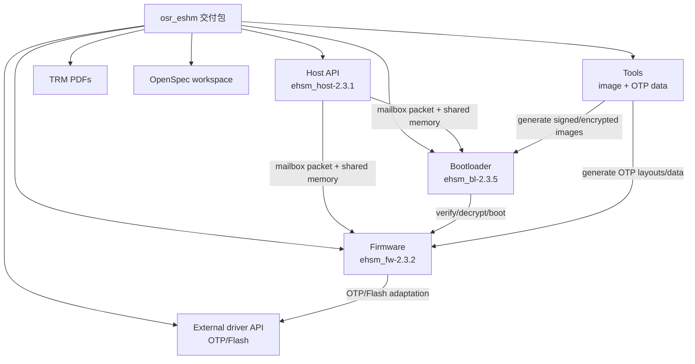
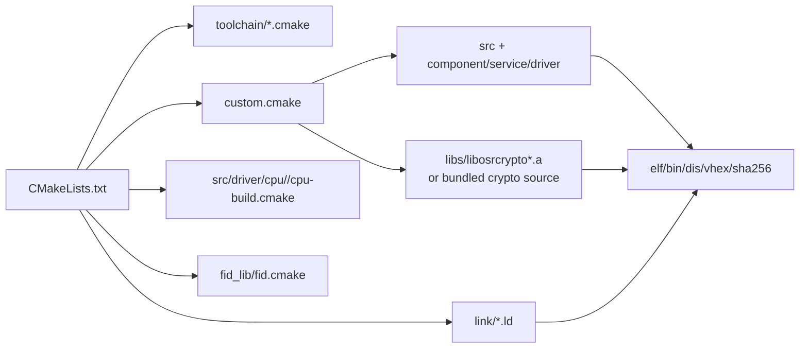
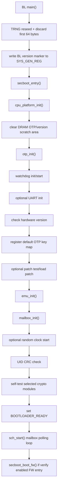
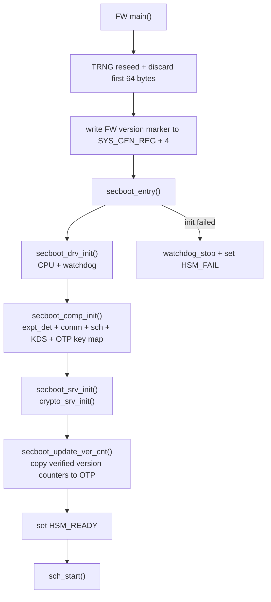
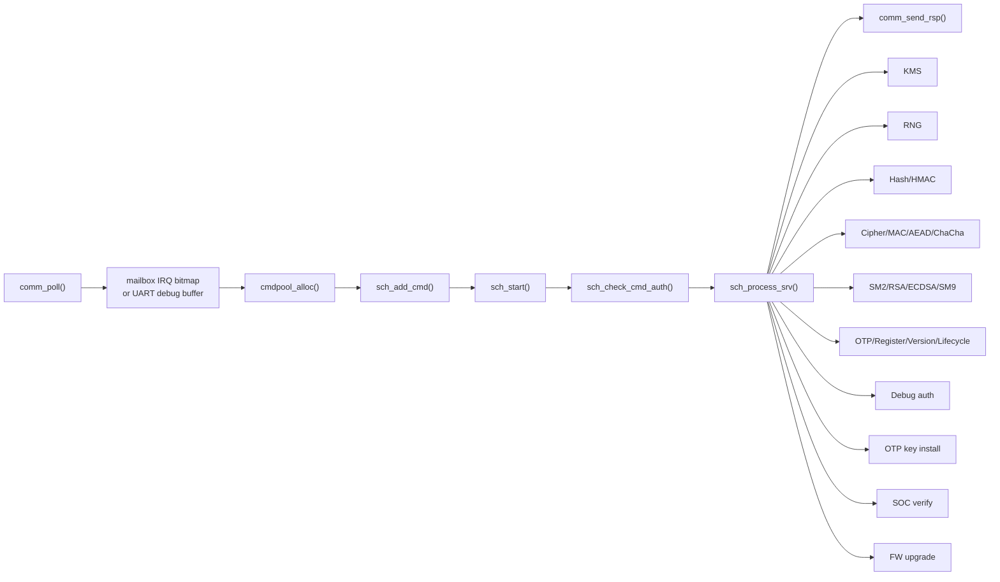
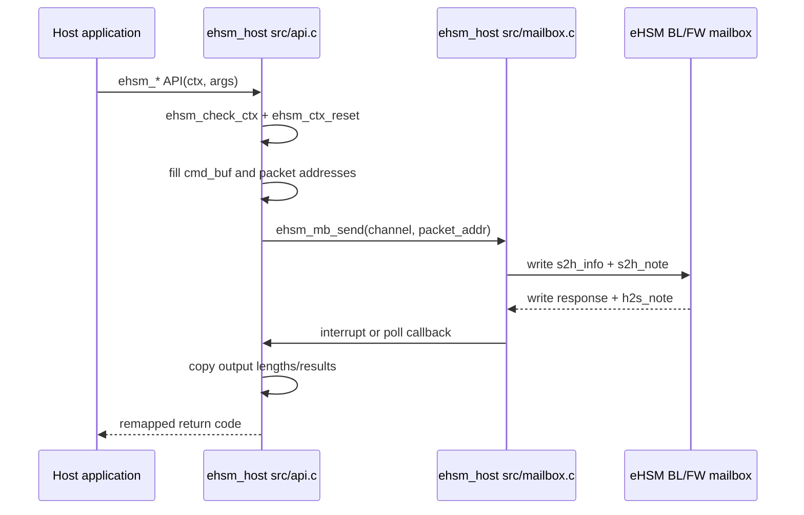
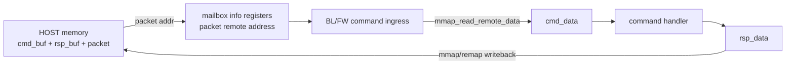
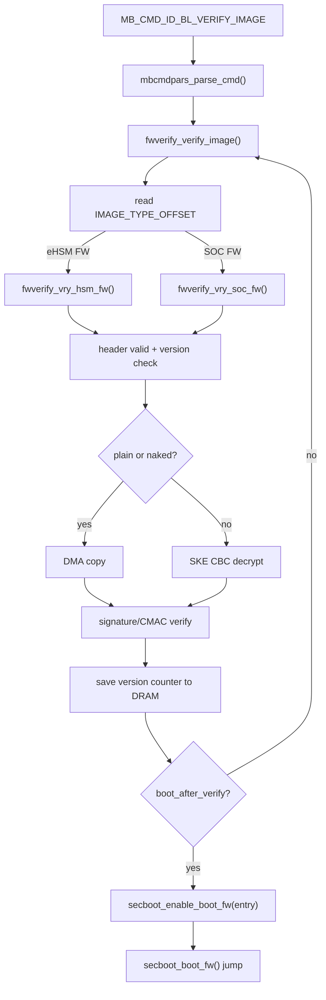
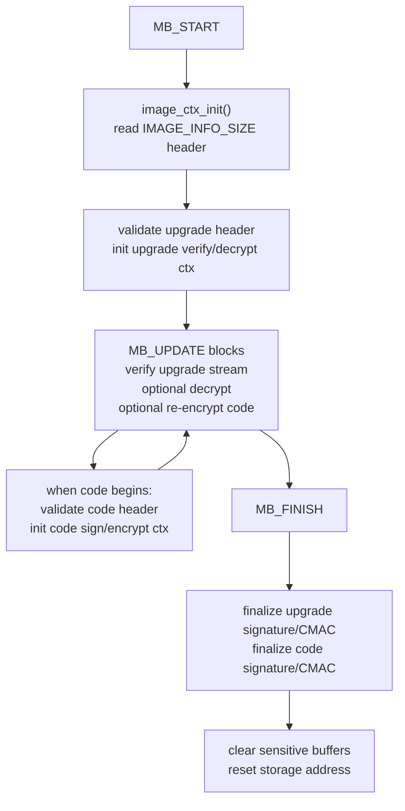

# OSR eHSM 代码库总览

> 快照日期：2026-06-27  
> 工作目录：`/home/may-pc/share/code/ngu800/secure/osr_eshm`  
> 说明：目录名是 `osr_eshm`，产品和源码里主要使用 `eHSM` / `ehsm` 命名。

## 概览

`osr_eshm` 是 OSR eHSM 的软件交付包，不是单一源码工程。它由 Bootloader、Firmware、Host API、外部驱动接口、工具和 TRM 文档组成：

- `ehsm_bl-2.3.5-4019-72f8fdc`：Bootloader 工程，负责早期启动、OTP/密钥映射、自检、固件校验、固件升级以及跳转 eHSM FW。
- `ehsm_fw-2.3.2-4019-5a4a0a9`：Firmware 工程，负责运行时 eHSM 服务，包括 RNG、Hash、HMAC、MAC、对称加密、PKE、KMS、Debug Auth、OTP key install、SOC verify、FW upgrade、counter、UTC timer 和 misc 控制。
- `ehsm_host-2.3.1-4019-2ee044d`：Host 侧静态库和 demo，把公开 C API 封装成 mailbox packet，并支持中断、轮询或发送后查询模式获取响应。
- `osr_ehsm_external_driver_api_v1.1`：外部 OTP/Flash 驱动接口头文件和 PDF。
- `tools`：镜像生成工具和 OTP 数据生成工具。
- `docs`：OSR 提供的 Bootloader/Firmware/Host API/Patch Test TRM PDF。
- `openspec`：本目录的 OpenSpec 工作区，用于沉淀需求、设计和任务。

整体代码主要是面向 RISC-V M130 目标的 C99。BL/FW 使用 CMake 和 OSR 指定工具链构建；HOST 构建为静态库，并通过 `port/osr/m130` 适配平台。

## 交付包结构

## 顶层目录清单

| 路径 | 作用 | 备注 |
|---|---|---|
| `SW_changelist.md` | 交付清单 | 记录 BL/FW/HOST/API/docs/tools 的版本和用途。 |
| `docs/` | 厂商参考文档 | Bootloader、Firmware、Host API、Patch Test TRM PDF。 |
| `ehsm_bl-2.3.5-4019-72f8fdc/` | Bootloader 工程 | secure boot、mailbox command parser、image verify/upgrade、OTP/key setup、底层驱动。 |
| `ehsm_fw-2.3.2-4019-5a4a0a9/` | Firmware 工程 | runtime service dispatcher、crypto services、KMS、debug auth、counter、SOC verify、FW upgrade。 |
| `ehsm_host-2.3.1-4019-2ee044d/` | Host API 工程 | 静态库、demo、speed test、mailbox register access、公开 API wrapper。 |
| `osr_ehsm_external_driver_api_v1.1/` | 外部驱动契约 | OTP 和 Flash 驱动接口。 |
| `tools/ehsm_image_tool-1.4.3/` | 镜像打包工具 | 含二进制工具、changelog、demo shell、PDF spec。 |
| `tools/otptool-0.3.1-4019/` | OTP 数据工具 | 含 TOML demo、C demo 和 PDF user guide。 |
| `openspec/` | Spec-driven planning | 本次分析变更为 `document-osr-ehsm-codebase`。 |

## 代码热点

按 `src/` 行数粗略看，后续重点阅读区域如下：

| 文件 | 行数 | 关注点 |
|---|---:|---|
| `ehsm_host-2.3.1-4019-2ee044d/src/api.c` | 3657 | Host API 表面和命令构造。 |
| `ehsm_fw-2.3.2-4019-5a4a0a9/src/component/crypto_api.c` | 2866 | FW crypto abstraction。 |
| `ehsm_fw-2.3.2-4019-5a4a0a9/src/service/kms.c` | 2745 | Key management service。 |
| `ehsm_host-2.3.1-4019-2ee044d/src/mb.h` | 1844 | Host 侧 mailbox 命令契约。 |
| `ehsm_fw-2.3.2-4019-5a4a0a9/src/service/fwup_srv.c` | 1272 | 运行时固件升级服务。 |
| `ehsm_bl-2.3.5-4019-72f8fdc/src/component/fw_upgrade.c` | 1198 | Bootloader 固件升级流程。 |
| `ehsm_bl-2.3.5-4019-72f8fdc/src/component/fw_verify.c` | 968 | Bootloader 镜像校验、解密、版本计数器处理。 |
| `ehsm_bl-2.3.5-4019-72f8fdc/src/component/secure_boot.c` | 454 | Bootloader 顶层 secure boot 编排。 |
| `ehsm_fw-2.3.2-4019-5a4a0a9/src/schedule/schedule.c` | 431 | FW 命令调度和 service dispatch。 |
| `ehsm_fw-2.3.2-4019-5a4a0a9/src/component/comm.c` | 414 | FW 通信入口和响应出口。 |

## 构建模型

Bootloader 构建要点：

- 入口：`ehsm_bl-2.3.5-4019-72f8fdc/CMakeLists.txt`。
- 默认目标名：`ehsm_bl`。
- 依赖 `CPU_TYPE`、`TOOLCHAIN`、Python3 和 OSR RISC-V 工具链。
- 默认包含 `src`、`src/component`、`src/driver` 和 crypto include。
- `FID_LEVEL` 默认是 `2`。
- 产物包括 `ehsm_bl.elf`、`ehsm_bl.bin`、`ehsm_bl.dis`、`ehsm_bl.vhex`、`ehsm_bl.sha256.txt`。
- `OSCCA_ENABLE` 打开时会生成带签名的 bootloader 产物。

Firmware 构建要点：

- 入口：`ehsm_fw-2.3.2-4019-5a4a0a9/CMakeLists.txt`。
- 默认 `CODE_AREA=iram`，链接脚本在 `link/`。
- 同时支持 GCC 和 IAR 分支。
- 包含 `service/hash`、`service/pke`、`service/ske`、`service/aead` 等服务目录。
- 默认通过 `OTP_DEVICE_TYPE=simulate` 和 `FLASH_DEVICE_TYPE=simulate` 使用模拟 OTP/Flash driver。
- 产物包括 `ehsm_fw.elf`、`ehsm_fw.bin`、`ehsm_fw.dis`、`ehsm_fw.vhex`、`ehsm_fw.sha256.txt`。

Host 构建要点：

- 入口：`ehsm_host-2.3.1-4019-2ee044d/CMakeLists.txt`。
- 将 `src/mailbox.c`、`src/api.c` 和 port 文件构建成 `ehsm_host` 静态库。
- `BUILD_HOST_DEMO` 和 `BUILD_SPEED_TEST` 可以分别启用 demo 和性能测试目标。
- 默认 port 是 `port/osr/m130`。

## Bootloader 架构

| 路径 | 职责 |
|---|---|
| `src/main.c` | BL 入口，写版本标记，执行 TRNG 初始输出丢弃 workaround，调用 `secboot_entry()`。 |
| `src/component/secure_boot.c` | Bootloader 编排：平台初始化、OTP 初始化、watchdog、UART、key map、EMU、mailbox、randclk、UID 检查、自检、scheduler、FW 跳转。 |
| `src/component/schedule.c` | 轮询 mailbox channel，映射 host command 地址，调用 `mbcmdpars_parse_cmd()`，发送响应，检查是否允许跳 FW。 |
| `src/component/mbcmd_parser.c` | BL 命令分发：OTP read/write、register access、FW upgrade、image verify、random key、encrypted key、debug auth、version、self-test。 |
| `src/component/fw_verify.c` | 镜像头校验、版本计数器检查、解密/拷贝到目标内存、signature/CMAC 验证、boot enable。 |
| `src/component/fw_upgrade.c` | streaming/one-pass 镜像升级、upgrade image 验证/解密、code image 重新签名/加密。 |
| `src/component/otp_key.c`, `otp_data.c` | OTP key map、key usage 检查、key material 和 OTP 数据访问。 |
| `src/component/selftest.c` | 密码算法自检和结果收集。 |
| `src/component/dbgauth.c` | Debug authorization flow。 |
| `src/driver/` | OTP、flash、mailbox、KMU、sysreg、UART、watchdog、mmap、randclk 和 CPU-specific driver。 |
| `libs/osr_crypto/` | Crypto HAL 和软件 crypto library fallback source。 |

### BL 启动流程

BL 安全相关模式：

- BL/FW `main.c` 都有 TRNG workaround：reseed 后丢弃最初固定的 64-byte FIFO 输出。
- lifecycle 读取常见双采样：`fid_delay()` + `FID_EQ`，不一致会触发 `fid_panic()`。
- verify/upgrade 流程使用 `g_fw_verify_cfi` 和 `g_fw_upgrade_cfi` 检测控制流是否被跳过。
- 非 naked image 接受前要做 version counter 检查。
- naked image 只允许在 `MCUTEST` 或 `DEVELOP` lifecycle。
- 跳转 FW 由 `g_boot_fw_enable == BOOT_FW_ENABLE_FLAG` 和 FW entry address 双条件控制。

## Firmware 架构

| 路径 | 职责 |
|---|---|
| `src/main.c` | FW 入口，写版本标记，执行 TRNG workaround，调用 `secboot_entry()`。 |
| `src/secboot.c` | FW 初始化：CPU/watchdog、communication、scheduler、KDS、OTP key map、services、version counter update、ready/fail status。 |
| `src/component/comm.c` | Mailbox 和 UART debug 入口，分配 command pool，创建 packet，写响应。 |
| `src/component/cmd_pool.c` | 静态 command packet pool，基于 queue 分配/释放。 |
| `src/component/queue.c` | command pool 和 scheduler 使用的通用队列。 |
| `src/schedule/schedule.c` | 多 channel scheduler，authorization check，按 command ID 分发 service，WFI 处理。 |
| `src/schedule/expt_det.c` | 命令处理前后和 idle loop 的 exception/error detection hook。 |
| `src/service/` | 运行时 eHSM service handler。 |
| `src/driver/` | mailbox、UART、sysreg、watchdog、KMU、counter、OTP/flash simulation、timer driver。 |
| `libs/crypto_lib/osr_crypto/` | runtime crypto library 和 HAL fallback source。 |

### FW 启动流程

### FW service dispatch

`crypto_srv_init()` 初始化的服务包括：

- `hash_srv_init()`
- `hmac_srv_init()`
- `pke_srv_ecdsa_init()`
- `pke_srv_rsa_init()`
- `pke_srv_sm2_init()`
- `ske_srv_cipher_init()`
- `ske_srv_mac_init()`
- `rng_srv_init()`
- `aead_srv_gcm_init()`
- `aead_srv_ccm_init()`

## Host API 架构

Host driver 是一个静态库，主要职责如下：

- 校验并重置 `ehsm_ctx_st`。
- 在 `ctx_intl->cmd_buf` 中填充命令结构。
- 设置 `cmd_id` 和反码 `cmd_id_inv`。
- 通过 port hook 把 Host 地址转换为 remote address。
- 通过 mailbox register 发送 packet address。
- 根据 driver mode 等待、轮询，或返回 `EHSM_ERR_NEED_POLL`。
- 将 FW 返回码 `0x0000A55A` 映射为 `EHSM_OK`，其他返回码加上 `EHSM_ERR_FW_BASE`。

Host driver mode：

| Mode | 行为 |
|---|---|
| `EHSM_DRV_MODE_INTERRUPT` | 发送命令；同步调用等待 interrupt callback 标记 context responded，异步调用返回 `EHSM_ERR_NEED_POLL`。 |
| `EHSM_DRV_MODE_WAIT_AND_POLL` | 忽略 async 标志，持续调用 mailbox poll 直到响应或超时。 |
| `EHSM_DRV_MODE_SEND_AND_PEEK` | 只发送命令，调用者必须再调用 `ehsm_ctx_poll()` 检查响应。 |

## 共享命令模型

BL 和 FW 都使用 mailbox command + shared-memory packet 模型：

命令组：

| 组 | HOST API 示例 | 命令 ID | 目标侧 |
|---|---|---|---|
| BL 管理 | `ehsm_bl_self_test`, `ehsm_bl_get_random_key`, `ehsm_bl_encrypt_key` | `MB_CMD_ID_BL_*` | BL `mbcmd_parser.c` |
| 镜像校验/升级 | `ehsm_verify_image`, `ehsm_upgrade_fw_image_ex` | `0xff06`, `0xff05` | BL verify/upgrade 或 FW SOC verify/FW upgrade |
| Runtime crypto | `ehsm_hash_*`, `ehsm_hmac_*`, `ehsm_symm_cipher_*`, `ehsm_aead_*` | `0x0301`, `0x0302`, `0x0101`, `0x0102`, `0x0103` | FW services |
| PKE | `ehsm_sm2_*`, `ehsm_rsa_*`, `ehsm_ecdsa_*`, `ehsm_sm9_*` | `0x040x`, `0x050x`, `0x0601`, `0x070x` | FW PKE services |
| KMS | `ehsm_km_*` | `0x080x` | FW `kms.c` |
| Debug/lifecycle | `ehsm_get_challenge`, `ehsm_debug_auth`, `ehsm_change_lifecycle` | `0xff03`, `0xff04`, `0x0f01` | BL/FW debug 和 misc services |

## Secure Boot 与镜像校验

Bootloader 镜像校验核心在 `ehsm_bl-2.3.5-4019-72f8fdc/src/component/fw_verify.c`。

高层流程：

1. Host 发送 `MB_CMD_ID_BL_VERIFY_IMAGE`。
2. BL scheduler 从 host memory 读取 command data。
3. `mbcmdpars_parse_cmd()` 调用 `fwverify_verify_image()`。
4. 检查参数和 image type。
5. 读取 header 并用 `CODE_VALID_FLAG` 校验。
6. 除 disabled 或 naked image 特殊路径外，检查 version counter。
7. 将 image 拷贝或解密到输出内存。
8. 按算法执行 signature 或 CMAC 验证。
9. 将 SOC 或 eHSM version counter 暂存到 DRAM。
10. 若 `boot_after_verify` 打开且目标是 eHSM FW，`secboot_enable_boot_fw()` 记录 entry address。
11. BL scheduler 后续调用 `secboot_boot_fw()`，停止 watchdog，关闭中断，反初始化 UART，恢复 DMA 配置并跳转 FW。

校验算法覆盖：

| 算法族 | 代码路径 |
|---|---|
| RSA2048/RSA3072 | `fwverify_asym_check_code_sign()` 中 SHA-256 digest + RSA PSS verify。 |
| ECC P-256R1 | `fwverify_asym_check_code_sign()` 中 SHA-256 digest + ECDSA verify。 |
| SM2 | `fwverify_sm2_check_code_sign()` 中 SM3 + SM2 Z value + SM2 verify。 |
| AES/SM4 CMAC | `fwverify_sym_check_code_sign()` 中 SKE CMAC 路径。 |

## 固件升级

BL 升级逻辑在 `src/component/fw_upgrade.c`，FW 中也有相似运行时服务 `src/service/fwup_srv.c`。

升级命令支持 `MB_START`、`MB_UPDATE`、`MB_FINISH` 和 `MB_ONE_PASS`。

升级代码有两层关注点：

- 外层 upgrade image 的真实性校验和可选解密。
- 内层 code image 的校验、可选重新加密和最终 signature/CMAC 生成。

## OTP Key Map

BL 和 FW 都定义了默认逻辑 OTP key 到物理 key 的映射。FW 会为运行时 KMS 扩展部分 usage flag。

| Logical key | 典型用途 |
|---|---|
| `EHSM_OTP_CHIP_ROOT_KEY_ID` | Chip root key。 |
| `EHSM_OTP_DEVICE_ROOT_KEY_ID` | Device root key。 |
| `EHSM_OTP_USER_ROOT_KEY_ID` | User root key。 |
| `EHSM_OTP_EHSM_DEBUG_KEY_ID` | eHSM debug auth key。 |
| `EHSM_OTP_EHSM_FW_VERIFY_KEY_ID` | eHSM FW verification public-key hash 或 CMAC key。 |
| `EHSM_OTP_EHSM_ENCRYPT_KEY_ID` | eHSM FW encryption key。 |
| `EHSM_OTP_EHSM_UPG_ENCRYPT_KEY_ID` | eHSM upgrade image encryption key。 |
| `EHSM_OTP_EHSM_UPG_VERIFY_KEY_ID` | eHSM upgrade image verify key。 |
| `EHSM_OTP_EHSM_PRIVATE_KEY_ID` | eHSM private key material。 |
| `EHSM_OTP_SOC_DEBUG_KEY_ID` | SOC debug auth key。 |
| `EHSM_OTP_SOC_FW_VERIFY_KEY_ID` | SOC FW verification key。 |
| `EHSM_OTP_SOC_ENCRYPT_KEY_ID` | SOC FW encryption key。 |
| `EHSM_OTP_SOC_UPG_ENCRYPT_KEY_ID` | SOC upgrade image encryption key。 |
| `EHSM_OTP_SOC_UPG_VERIFY_KEY_ID` | SOC upgrade image verify key。 |
| `EHSM_OTP_SOC_PRIVATE_KEY_ID` | SOC private key material。 |
| `EHSM_OTP_SECRET_KEY_KEY_ID` | Transport key。 |
| `EHSM_OTP_USER_AUTH_KEY_ID` | User authentication key。 |

## 推荐阅读路径

Bootloader：

1. `ehsm_bl-2.3.5-4019-72f8fdc/README.md`
2. `ehsm_bl-2.3.5-4019-72f8fdc/src/main.c`
3. `ehsm_bl-2.3.5-4019-72f8fdc/src/component/secure_boot.c`
4. `ehsm_bl-2.3.5-4019-72f8fdc/src/component/schedule.c`
5. `ehsm_bl-2.3.5-4019-72f8fdc/src/component/mbcmd_parser.c`
6. `ehsm_bl-2.3.5-4019-72f8fdc/src/component/fw_verify.c`
7. `ehsm_bl-2.3.5-4019-72f8fdc/src/component/fw_upgrade.c`

Firmware：

1. `ehsm_fw-2.3.2-4019-5a4a0a9/README.md`
2. `ehsm_fw-2.3.2-4019-5a4a0a9/src/main.c`
3. `ehsm_fw-2.3.2-4019-5a4a0a9/src/secboot.c`
4. `ehsm_fw-2.3.2-4019-5a4a0a9/src/component/comm.c`
5. `ehsm_fw-2.3.2-4019-5a4a0a9/src/schedule/schedule.c`
6. `ehsm_fw-2.3.2-4019-5a4a0a9/src/service/crypto_util.c`
7. 对应命令领域的 service 文件，例如 `service/kms.c` 或 `service/fwup_srv.c`。

Host integration：

1. `ehsm_host-2.3.1-4019-2ee044d/CMakeLists.txt`
2. `ehsm_host-2.3.1-4019-2ee044d/include/ehsmdrv/basic/api.h`
3. `ehsm_host-2.3.1-4019-2ee044d/src/api.c`
4. `ehsm_host-2.3.1-4019-2ee044d/src/mailbox.c`
5. `ehsm_host-2.3.1-4019-2ee044d/src/mb.h`
6. `ehsm_host-2.3.1-4019-2ee044d/src/bl_mb.h`
7. `ehsm_host-2.3.1-4019-2ee044d/port/osr/m130/`

## 分析说明

- 本轮分析时 `osr_eshm` 尚未初始化 CodeGraph，因此本文基于源码扫描、CMake/README 和关键 C 模块定向阅读。
- 建议后续在 `/home/may-pc/share/code/ngu800/secure/osr_eshm` 下执行 `codegraph init -i`，再查询 `main -> secboot_entry`、`ehsm_send_cmd -> sch_process_srv`、`fwverify_verify_image -> secboot_enable_boot_fw` 等调用流。
- 该目录本身不是 git repository；如需版本管理，应在上层工作区或文件级 review 中跟踪。
