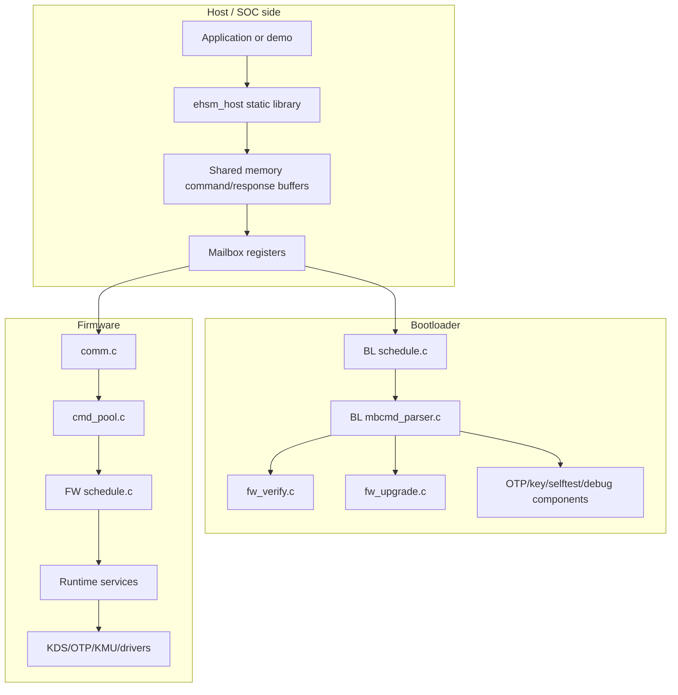
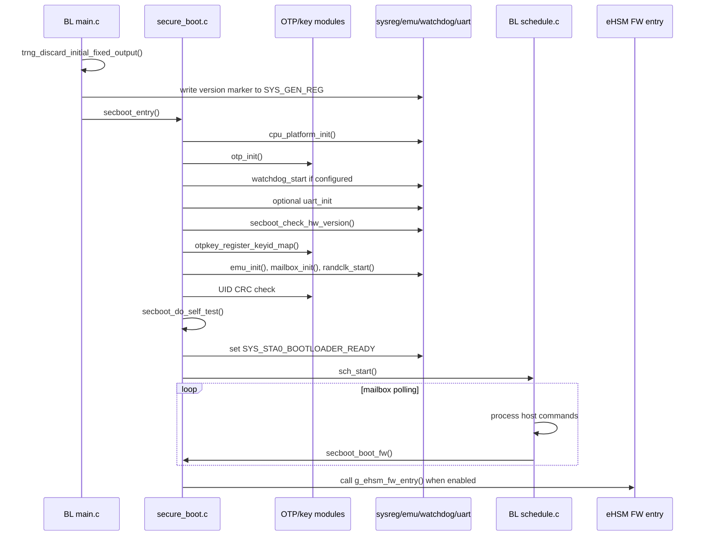
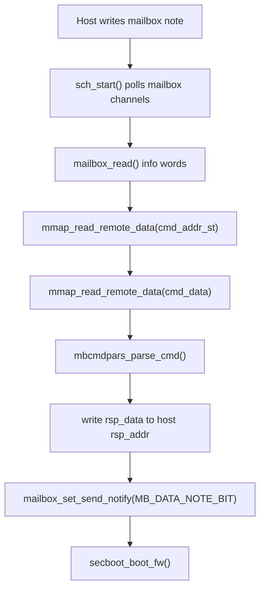
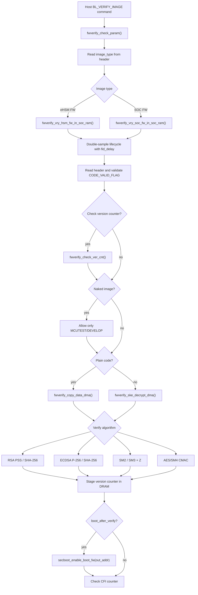
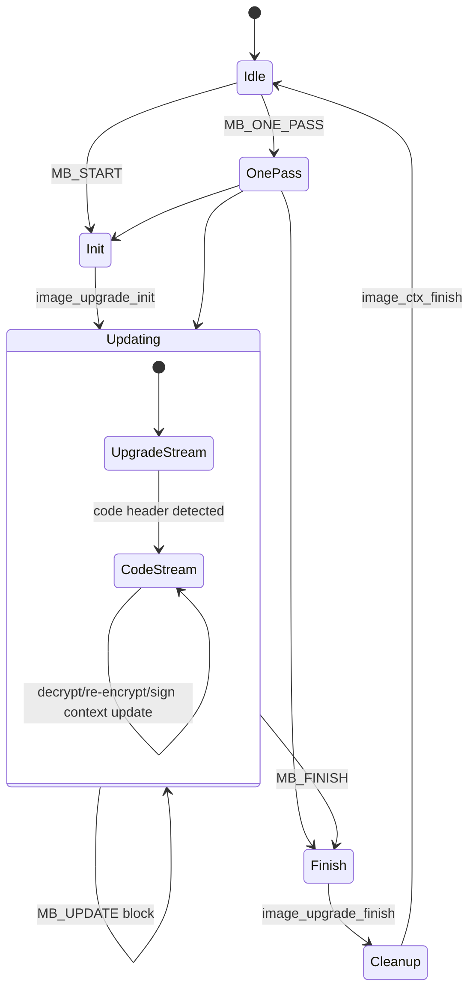
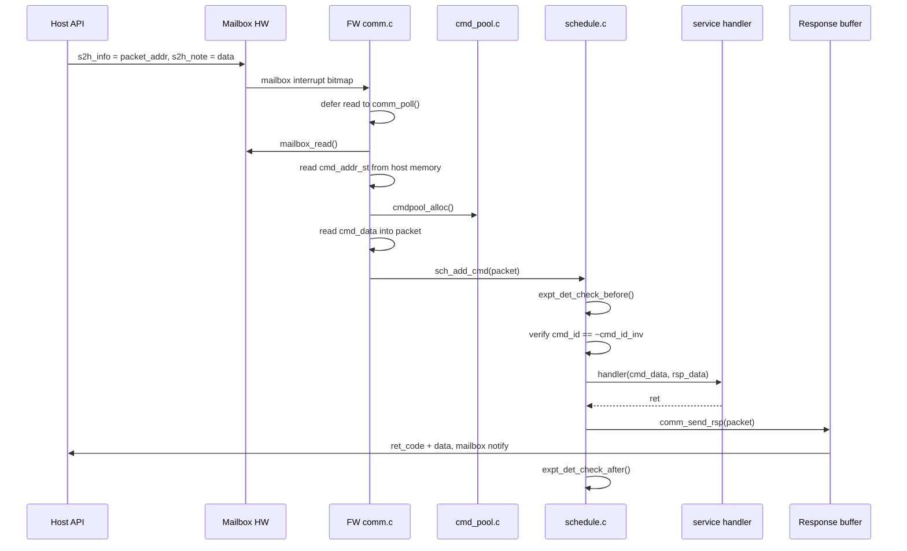

# OSR eHSM 安全与命令流程

> 快照日期：2026-06-27  
> 配套总览：`docs/osr_ehsm_codebase_overview.md`

本文聚焦 OSR eHSM 交付包中的控制流、信任边界、命令路由和安全敏感路径。

## 信任边界



源码中体现出的主要边界假设：

- Host 传入地址是 remote address，目标侧必须通过 `mmap_*` helper remap 或 copy。
- FW path 会检查 `cmd_id` 与 `cmd_id_inv` 是否互为反码。
- Mailbox response path 会把 return code 和 response data 写回 Host buffer，然后通过 mailbox notify 通知 Host。
- Lifecycle、OTP、key usage 和算法选择通过 `sysreg_*`、`otp*`、`otpkey_*` 等硬件可见状态读取。

## BL Secure Boot 控制流



失败处理：

- `secboot_report_error()` 在 bootloader ready 尚未置位时设置 `SYS_STA0_BOOTLOADER_ERR`。
- 除传入 `DO_NOT_TRIGGLER_FW_ERROR` 外，会调用 `emu_trigger_fw_error()`。
- 它会设置 `SYS_STA0_BOOTLOADER_READY`，flush log，并在非 `MCUTEST` 下永久等待。
- Watchdog timeout 会调用 `secboot_report_error(FW_ERROR_WDG_TIMEOUT)`。
- CPU exception handler 会上报 `FW_ERROR_CPU_EXCEPTION`。

## BL Mailbox 命令流



BL `src/component/mbcmd_parser.c` 命令分发：

| 命令 | Handler | 主要检查或效果 |
|---|---|---|
| `MB_CMD_ID_BL_OTP_READ` | `mbcmdpars_handle_otp_read()` | 仅 `MCUTEST` 或 `DEVELOP` lifecycle。 |
| `MB_CMD_ID_BL_OTP_WRITE` | `mbcmdpars_handle_otp_write()` | 仅 `MCUTEST` 或 `DEVELOP` lifecycle。 |
| `MB_CMD_ID_BL_REG_RD` | `mbcmdpars_handle_reg_read()` | lifecycle 受限，地址必须在 AHB CFG 范围内。 |
| `MB_CMD_ID_BL_REG_WR` | `mbcmdpars_handle_reg_write()` | lifecycle 受限，地址必须在 AHB CFG 范围内。 |
| `MB_CMD_ID_BL_FW_UPGRADE` | `fwupd_image_upgrade(packet, 0)` | upgrade image 校验/解密和 code image 处理。 |
| `MB_CMD_ID_BL_VERIFY_IMAGE` | `fwverify_verify_image()` | header/version/decrypt/signature 校验，可选 boot enable。 |
| `MB_CMD_ID_BL_GET_RANDOM_KEY` | `mbcmdpars_handle_get_randkey()` | lifecycle 与 key-level 检查，生成 random key。 |
| `MB_CMD_ID_BL_ENCRYPT_KEY` | `mbcmdpars_handle_encrypt_key()` | 用 RTL key 解密输入，再用目标 root key 加密，并做 CRC 检查。 |
| `MB_CMD_ID_BL_GET_CHALLENGE` | `dbgauth_srv_handler()` | critical section 内执行 debug auth challenge。 |
| `MB_CMD_ID_BL_DEBUG_AUTH` | `dbgauth_srv_handler()` | critical section 内执行 debug authentication。 |
| `MB_CMD_ID_BL_CLOSE_DEBUG` | `dbgauth_srv_handler()` | critical section 内执行 debug close。 |
| `MB_CMD_ID_BL_SET_UART_BAUDRATE` | `mbcmdpars_handle_set_baud()` | 运行时修改 UART divisor。 |
| `MB_CMD_ID_BL_READ_VER` | `mbcmdpars_handle_read_version()` | 返回 BL、crypto engine/lib、HW、UID version data。 |
| `MB_CMD_ID_BL_SELF_TEST` | `selftest_test_alg(EHSM_SELF_TEST_ALL)` | 执行全部自检。 |
| `MB_CMD_ID_BL_READ_SELF_TEST_RESULT` | `mbcmdpars_handle_get_test_result()` | 将 self-test result array 写回 Host memory。 |

## Image Verification Flow



关键观察：

- `fwverify_verify_image()` 将 CFI 初始化为 `FW_CFI_INIT_VAL`，成功路径要求最终为 `FW_CFI_FINAL_VAL`。
- Header 校验会检查 `VALID_FLAG_OFFSET` 是否等于 `CODE_VALID_FLAG`。
- Version counter 需要 image counter `>=` OTP counter，并通过 `fid_delay()` 做二次比较。
- eHSM FW 校验成功后，version counter 暂存在 DRAM 的 `EHSM_VERSION_COUNTER_ADDR`。
- SOC FW 校验成功后，version counter 暂存在 DRAM 的 `SOC_VERSION_COUNTER_ADDR`。
- FW 后续在 `ehsm_fw/src/secboot.c::secboot_update_ver_cnt()` 中把暂存 counter 写入 OTP。
- Naked image 在 develop lifecycle 之后被阻止。

## Upgrade Flow

BL 的 `fw_upgrade.c` 和 FW 的 `fwup_srv.c` 结构相似：处理外层 upgrade image，并可能继续处理内层 code image。



重要上下文：

| Context | 作用 |
|---|---|
| `image_alg_upgrade_ctx_st` | 外层 upgrade image 的算法、verify key、encrypt key、total/already size、decrypt flag。 |
| `image_alg_code_ctx_st` | code verify algorithm、key ID、code encryption flag、code size/address tracking。 |
| `ehsm_upgrade_data_st` | upgrade signature 和 public key data。 |
| `ehsm_code_data_st` | code signature、public key、version counter data。 |

升级成功条件：

- Header size 和 magic 符合预期。
- Firmware type 是允许的 eHSM FW、SOC FW with eHSM key、SOC FW with SOC key 或 patch。
- Upgrade verify key 和 encrypt key 通过 `otpkey_check_usage()`。
- Code verify key 和 encryption key 根据 code type 和 plain/encrypted flag 通过 usage 检查。
- 累计 update size 与 total image size 匹配。
- 成功路径 CFI counter 达到最终期望值。

## FW Runtime Command Flow



FW scheduler 授权：

- UART channel 只能执行 `DBG_CMD_ID`。
- Mailbox channel 通过 `COMM_TYPE_MAILBOX + channel` 映射到 scheduler channel。
- 非法 mailbox channel 返回 `EHSM_ERR_INVALID_CHANNEL`。

FW service dispatch：

| 命令组 | Handler |
|---|---|
| Key management | `kms_srv_handler()` |
| RNG | `rng_srv_handler()` |
| MAC | `ske_srv_mac_handler()` |
| Hash | `hash_srv_handler()` |
| HMAC | `hmac_srv_handler()` |
| SM2 cipher/sign | `pke_srv_sm2_cipher_handler()`, `pke_srv_sm2_sign_handler()` |
| RSA cipher/sign | `pke_srv_rsa_cipher_handler()`, `pke_srv_rsa_sign_handler()` |
| ECDSA | `pke_srv_ecdsa_handler()` |
| Symmetric cipher | `ske_srv_cipher_handler()` |
| AEAD GCM/CCM | `aead_srv_gcm_handler()`, `aead_srv_ccm_handler()` |
| Misc、OTP、register、version、lifecycle | `misc_srv_handler()` |
| Debug auth | `dbgauth_srv_handler()` |
| OTP key install | `otpkinstl_srv_handler()` |
| SOC verify | `socvrfy_srv_handler()` |
| FW upgrade | `fwup_srv_handler()` |
| Debug command | `dbgcmdpars_srv_handler()` |

## Host API Flow

`ehsm_host/src/api.c` 的公开 API 很多，但大多数函数都遵循同一种模式：

```mermaid
flowchart TD
    call["ehsm_* public API"]
    check["ehsm_check_ctx()"]
    reset["ehsm_ctx_reset()\nor preserve session state for update/finish"]
    fill["fill cmd struct in ctx_intl->cmd_buf"]
    id["ehsm_set_cmd_id(cmd, MB_CMD_ID_*)"]
    addr["convert buffers with ehsm_port_addr_to_raddr()"]
    send["ehsm_send_cmd()"]
    mode{"driver mode"}
    int["interrupt: wait or async"]
    poll["wait-and-poll"]
    peek["send-and-peek"]
    ret["return EHSM_OK or remapped FW error"]

    call --> check --> reset --> fill --> id --> addr --> send --> mode
    mode --> int --> ret
    mode --> poll --> ret
    mode --> peek --> ret
```

集成风险点：

- API update/finish 命令会有意保留 `cmd_buf` 中的部分状态，不是每个 API 都应该 reset context。
- 输出长度和 verify result 在 `ehsm_mb_int()` 中按 command ID 写回。
- 所有 remote buffer 都依赖 port 层正确实现 address conversion、cache maintenance、timer、critical section 和 mailbox interrupt enable。
- `EHSM_DRV_MODE_SEND_AND_PEEK` 要求调用者主动调用 `ehsm_ctx_poll()`。

## 横切安全机制

| 机制 | 出现位置 | 目的 |
|---|---|---|
| TRNG initial discard | BL `src/main.c`、FW `src/main.c` | 避免跳过 self-test 时初始 TRNG 输出重复。 |
| FID delay 和 double sampling | BL verify/upgrade/lifecycle、FW version counter update | 降低 fault-injection 绕过风险。 |
| CFI counters | `fw_verify.c`、`fw_upgrade.c` | 检测 verification 或 upgrade 子步骤被跳过。 |
| OTP key usage checks | `otp_key.c`、verify/upgrade paths | 确保逻辑 key 能用于 hash/SKE/level 对应用途。 |
| Version counter monotonic check | BL verify/upgrade、FW persist | 防止 eHSM/SOC 固件回滚。 |
| Lifecycle gates | BL OTP/reg/key/debug/naked-image paths | 将敏感操作限制在 test/develop/manufacture 状态。 |
| Response code remapping | HOST `api.c` | 区分 host driver error 和 firmware-returned error。 |
| Command inverse ID | FW scheduler path | 检测畸形或损坏的 command ID。 |

## 后续调查清单

1. 为该交付目录初始化 CodeGraph，并生成精确调用图。
2. 生成 HOST API 到 command ID 到 BL/FW handler 的命令矩阵。
3. 比较 `ehsm_host/src/mb.h`、`ehsm_fw/inc/mb.h`、`ehsm_bl/inc/mb.h` 是否存在契约漂移。
4. 将 lifecycle 规则单独整理成安全策略表。
5. 将 image header offset 与 `tools/ehsm_image_tool-1.4.3/doc/ehsm_image_tool_spec.pdf` 对齐。
6. 比较 BL 和 FW upgrade 实现差异，区分刻意差异和潜在不一致。
7. 产品集成前重点 review `CONFIG_EHSM_TEST_CMDS_ENABLE` 及相关 debug/test command gate。
