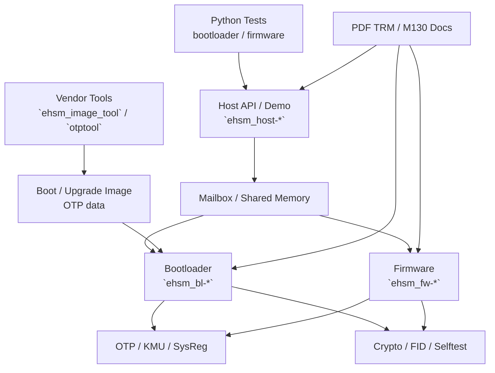

# OSR eHSM Vendor 交付件清单与阅读入口

## 目的

本文用于项目组内部介绍 `osr_ehsm` 目录中的 vendor 交付件，回答三个基础问题：

- vendor 交付了哪些内容，哪些是源码，哪些是工具/二进制/测试资源。
- 各组件之间的关系是什么，项目组接入时应从哪里读起。
- 后续代码 review、构建验证、安全分析和 vendor 问题澄清应如何组织。

本文只描述交付包结构和 review 入口，不替代厂商 PDF TRM；涉及 CPU core、CSR、异常/中断、CLIC、PMP、WMSIS、CPU porting 等 M130 核相关内容时，以 `docs/CPU/` 下资料为准。

## 交付快照

| 类别 | 路径 | 内容定位 | Review 优先级 |
|---|---|---|---|
| Bootloader 源码 | `ehsm_bl-2.3.5-4019-72f8fdc/` | eHSM 信任根入口，负责初始化、安全启动、镜像校验/解密/升级、OTP/KMU、debug auth、mailbox 命令 | P0 |
| Firmware 源码 | `ehsm_fw-2.3.2-4019-5a4a0a9/` | eHSM 运行时服务，负责 mailbox/UART 通信、scheduler、KMS/KDS、crypto service、OTP install、misc/debug/upgrade service | P1 |
| Host API 源码 | `ehsm_host-2.3.1-4019-2ee044d/` | SoC/Host 侧 API wrapper、mailbox 驱动、M130 port、demo、speed test | P1 |
| 外部驱动 API | `osr_ehsm_external_driver_api_v1.1/include/` | vendor 暴露给外部集成的 OTP/Flash/Types 等驱动接口头文件 | P1 |
| 镜像/OTP 工具 | `tools/` | `ehsm_image_tool`、`otptool` 等预编译工具及说明文档 | P1 |
| Python 测试 | `python_bootloader_tests-*`, `python_firmware_tests-*` | vendor 提供的 BL/FW 测试框架、测试镜像和平台适配 | P2 |
| PDF 文档 | `docs/` | Bootloader/Firmware/Host API TRM、HP TRM、M130 CPU 资料、Patch Test Guide | P0 |
| 本地分析文档 | `docs/*.md`, `docs/review/*.md` | 项目组维护的中文结构说明、流程分析和 review 记录 | P0 |
| OpenSpec | `openspec/` | 文档规则、review 能力要求和后续沉淀规范 | P0 |

## 源码、库和二进制边界

| 形态 | 代表路径 | 说明 |
|---|---|---|
| 可 review 源码 | `ehsm_bl-*/src`, `ehsm_bl-*/inc`, `ehsm_fw-*/src`, `ehsm_host-*/src`, `ehsm_host-*/demo` | 项目组可逐行 review 的 C/C/Python/Shell 源码 |
| Crypto/平台源码 | `ehsm_bl-*/libs`, `ehsm_fw-*/libs`, `fid_lib`, `src/driver` | 部分 crypto HAL、FID、防故障和平台驱动实现需要重点确认边界 |
| 预编译工具 | `tools/ehsm_image_tool-1.4.3/linux-x86_64/ehsm_image_tool`, `tools/otptool-*` | vendor 打包工具，主要通过帮助、PDF、输入输出和 BL/FW 消费路径做黑盒/灰盒 review |
| 测试资源二进制 | `python_*_tests-*/resource/image/*.bin` | 已生成的 boot/upgrade/naked/plain/encrypted/signed 测试镜像 |
| 外部接口头文件 | `osr_ehsm_external_driver_api_v1.1/include/*.h` | 需要和项目平台 OTP/Flash 驱动接口对齐 |
| 构建产物 | `build*`, `*.elf`, `*.bin`, `*.map`, `*.dis` | 可用于验证和反查，但不是 vendor 源码 review 主对象 |

## 组件关系图

## 入场检查清单

| 检查项 | 建议命令/方法 | 目的 |
|---|---|---|
| 交付完整性 | `python3 ehsm_bl-*/tools/verify_hashes.py --strict`；FW 同理 | 检查源码快照是否与 `file_hashes.sha256` 一致 |
| BL 构建 | `cmake .. && make -j$(nproc)`，需 `riscv32-wing-elf-*` 工具链 | 确认 bootloader 可重新生成 |
| FW 构建 | 分别确认 `CODE_AREA=iram/irom/nvm` 构建路径 | 确认运行时 firmware 可生成 |
| Host 构建 | `BUILD_HOST_DEMO=ON`、`BUILD_SPEED_TEST=ON` | 确认 Host API、demo、speed test 可生成 |
| 镜像工具 | `tools/ehsm_image_tool-1.4.3/linux-x86_64/ehsm_image_tool --help` | 确认 boot/upgrade image 参数和算法支持 |
| OTP 工具 | 阅读 `tools/otptool-*/user_guide.pdf` 和 toml demo | 确认 OTP 数据生成方式 |
| CodeGraph | `codegraph explore "secboot_entry fwverify_verify_image fwupd_image_upgrade"` | 快速定位关键调用链 |
| PDF 对照 | `docs/OSR_eHSM_Bootloader_TRM_4019_1.1.pdf` 等 | 对照源码行为和 vendor 规范 |

## 推荐介绍顺序

1. 先讲交付件地图：BL、FW、Host、External API、Tools、Tests、Docs。
2. 再讲系统运行关系：Host 通过 mailbox 命令访问 BL/FW，BL/FW 使用 OTP/KMU/SysReg/Crypto。
3. 单独讲 BL：BL 是 secure boot 信任根，也是项目组最应该详细 review 的部分。
4. 讲 tools 与 BL 的关系：`ehsm_image_tool` 生成的镜像由 BL 的 `fw_verify.c` / `fw_upgrade.c` 消费。
5. 讲接入点：外部 OTP/Flash driver API、Host port、mailbox/channel、镜像/OTP 生产流程。
6. 最后讲 review 计划、风险清单、vendor 待确认问题。

## Review 产出目录

| 文档 | 作用 |
|---|---|
| `00_vendor_delivery_inventory.md` | 本文，交付件盘点和阅读入口 |
| `01_review_execution_plan.md` | 代码阅读、项目组介绍和 review 执行计划 |
| `03_bootloader_deep_review.md` | BL 深度代码 review 主文档 |
| `../osr_ehsm_codebase_overview.md` | 既有代码库总览 |
| `../osr_ehsm_security_and_command_flows.md` | 既有安全和命令流程说明 |
| `../../openspec/specs/vendor-ehsm-review/spec.md` | 本次 review 的 OpenSpec 能力规范 |

## 后续任务

- [ ] 对 BL 源码逐文件填充 review 结论，优先 `secure_boot.c`、`mbcmd_parser.c`、`fw_verify.c`、`fw_upgrade.c`。
- [ ] 生成 HOST API 到 command ID 到 BL/FW handler 的命令矩阵。
- [ ] 对 `ehsm_image_tool` 生成镜像的 header 字段、签名范围、加密范围做样例解析。
- [ ] 对外部 `otp_driver.h`、`flash_driver.h` 与项目平台实际驱动做接口适配评审。
- [ ] 将 vendor 待确认问题收敛成单独表格，并标记 owner、状态和结论来源。
