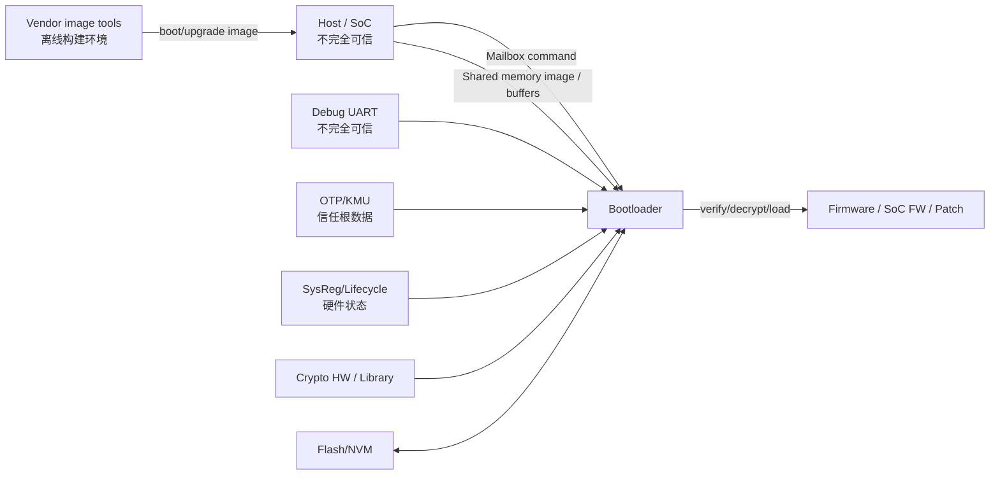
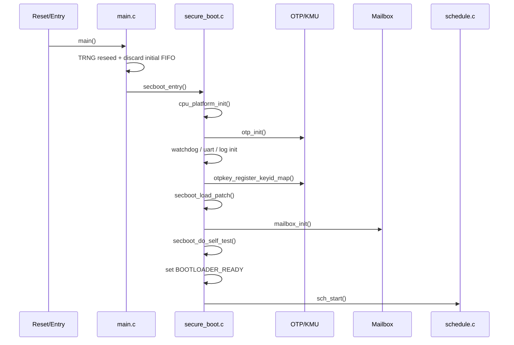
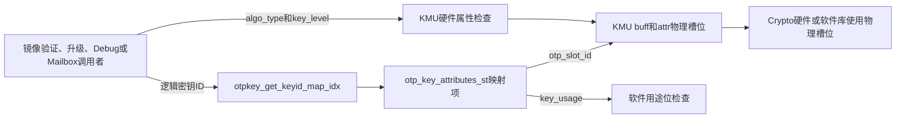
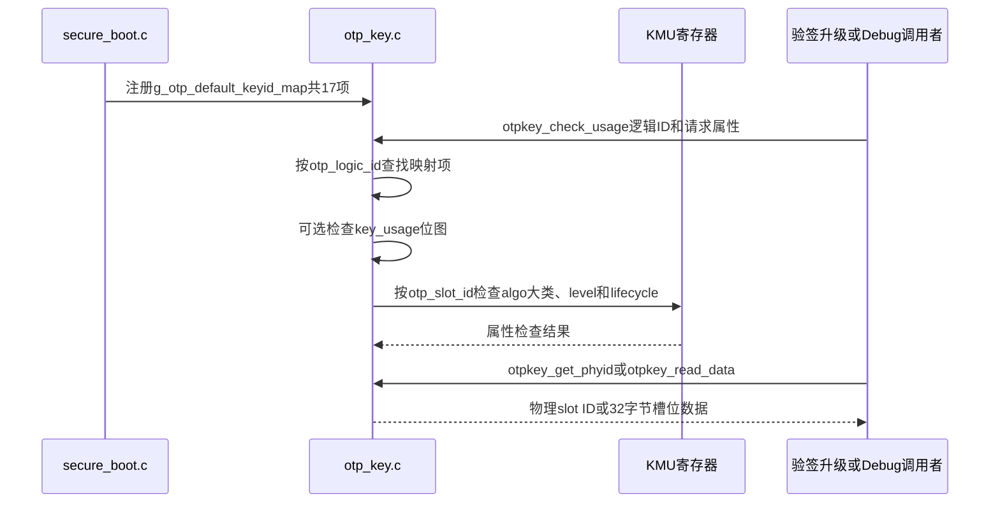
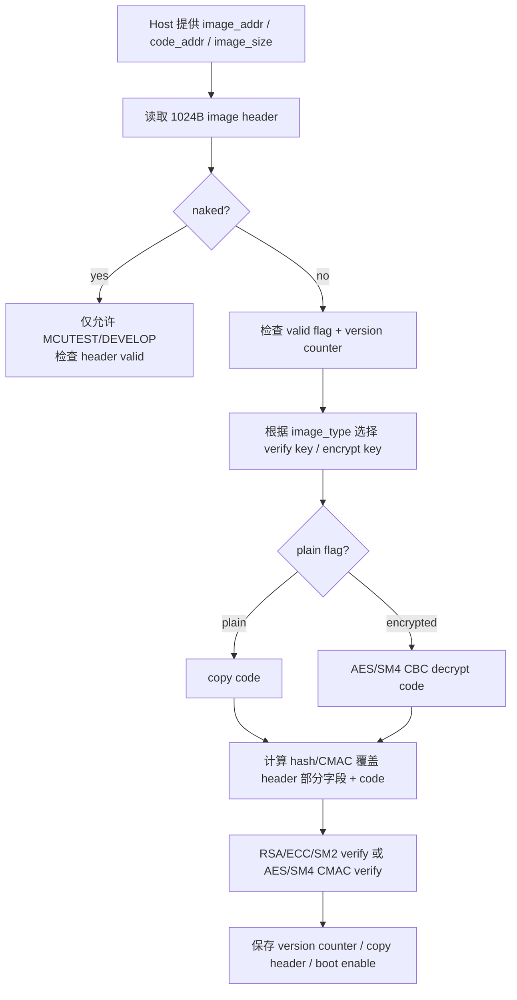
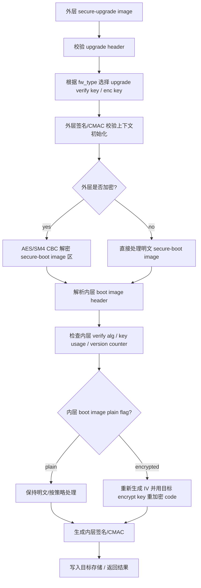

# Bootloader 深度代码 Review 框架

## 目标

本文是 `ehsm_bl-2.3.5-4019-72f8fdc` 的深度代码 review 主文档。重点不是复述源码，而是围绕安全启动信任链回答：

- BL 从复位入口到进入命令循环做了哪些初始化。
- BL 如何验证、解密、加载 secure boot image。
- BL 如何处理 secure upgrade image，并生成/更新 boot image。
- BL 暴露了哪些 mailbox/debug/OTP/REG 命令面。
- 哪些输入不可信，哪些安全不变量必须成立。
- 哪些实现需要项目组验证，哪些问题需要 vendor 澄清。

## 专题文档索引

| 专题 | 文档 | 覆盖内容 |
|---|---|---|
| 复位启动与 CPU 基础 | [`04_bootloader_crt0_m130_startup_deep_dive.md`](./04_bootloader_crt0_m130_startup_deep_dive.md) | `crt0.S` 逐指令解析、M130 实际 ISA/ABI、链接布局、CSR、异常、CLIC 向量中断和 Review 结论 |
| M130 中断机制 | [`05_bootloader_m130_interrupt_deep_dive.md`](./05_bootloader_m130_interrupt_deep_dive.md) | CLIC、`mtvec`/`mtvt`、逐中断 `SHV`、向量/非向量入口、WDT/UART/Mailbox 中断配置和上下文保存 |
| SoC 远端地址映射 | [`06_bootloader_m130_soc_memory_remap_deep_dive.md`](./06_bootloader_m130_soc_memory_remap_deep_dive.md) | 32位M130访问64位SoC地址、映射寄存器、窗口地址、临界区、地址边界和并发风险 |
| 启动错误收敛 | [`07_bootloader_secboot_report_error_deep_dive.md`](./07_bootloader_secboot_report_error_deep_dive.md) | `secboot_report_error()`、READY/ERR状态、EMU错误位、生命周期、WFI、Watchdog和安全失败路径 |
| Mailbox与OTP读取 | [`08_ehsm_mailbox_host_fw_otp_read_flow.md`](./08_ehsm_mailbox_host_fw_otp_read_flow.md) | Host/FW Mailbox寄存器、共享内存packet、轮询/中断协作和`read_otp()`端到端实例 |
| Debug Auth | [`09_ehsm_debug_auth_challenge_response_deep_dive.md`](./09_ehsm_debug_auth_challenge_response_deep_dive.md) | Host/BL/FW challenge-response、OTP信任锚、SM2/ECDSA/RSA/CMAC、FID/CFI、生命周期与量产风险 |
| OTP密钥生成与转换 | [`10_bootloader_otp_key_generation_host_device_flow.md`](./10_bootloader_otp_key_generation_host_device_flow.md) | `0xFF08/0xFF09`、随机密钥、RTL KEK、ROOT KEY、48B/36B/40B格式、生命周期和Host到Device链路 |
| TRNG自检 | [`11_bootloader_trng_selftest_deep_dive.md`](./11_bootloader_trng_selftest_deep_dive.md) | `selftest_trng_test()`、Poker/卡方统计、4-bit/8-bit阈值、三次重试、结果位图、启动/Host触发和安全边界 |

## Review 范围

| 模块 | 关键文件 | Review 重点 |
|---|---|---|
| 入口与初始化 | `src/main.c`, `src/component/secure_boot.c` | TRNG 初始处理、CPU/OTP/watchdog/UART/mailbox/selftest 初始化、patch 加载、ready/error 状态 |
| 调度与命令面 | `src/component/schedule.c`, `src/component/mbcmd_parser.c`, `inc/mb.h` | mailbox command ID、参数复制、地址/长度检查、生命周期限制、权限边界 |
| 镜像验证 | `src/component/fw_verify.c`, `src/component/fw_verify.h` | header 校验、version counter、防 rollback、naked/plain 限制、解密、签名/CMAC 校验、public key hash |
| 镜像升级 | `src/component/fw_upgrade.c`, `src/component/fw_upgrade.h` | upgrade image 外层验签/解密、内层 boot image 重构、分块状态机、重加密、签名重算 |
| OTP/KMU/Key | `src/component/otp_key.c`, `src/component/otp_data.c`, `src/driver/otp.c`, `src/driver/kmu.c` | OTP 逻辑 key 到物理 slot 映射、key usage、key level、OTP 数据读写、KMU 加载 |
| Debug/Auth | `src/component/dbgauth.c`, `src/component/dbgcmd_parser.c`, `src/component/debug.c` | debug challenge/response、生命周期限制、认证算法、调试打开/关闭状态 |
| 平台与外设 | `src/driver/sysreg.c`, `src/driver/mmap.c`, `src/driver/mailbox.c`, `src/driver/flash.c`, `src/driver/uart.c`, `src/driver/watchdog.c` | 地址映射、shared memory、DMA、sysreg 状态位、flash 边界、watchdog 策略 |
| 安全辅助 | `fid_lib/`, `src/component/selftest.c`, `src/component/crypto_lib_api.*` | FID/CFI、防故障检查、自检覆盖、crypto wrapper 错误码 |

## 信任边界



BL review 时默认假设：

- Host 传入的 mailbox command、shared memory 地址、image buffer、debug UART 数据都不可信。
- OTP/KMU 中的 root key、公钥 hash、version counter、lifecycle 配置是信任根，但仍需校验读写错误和使用权限。
- `ehsm_image_tool` 生成的镜像格式需要和 BL 解析逻辑逐字段对齐。
- 涉及 M130 CPU 行为时，优先引用 `docs/CPU/` 下资料，而不是仅凭源码注释推断。

## 总体启动流程



## OTP/KMU 密钥映射与 `otp_key_attributes_st`

### 结构体定位

[`otp_key.h`](../../ehsm_bl-2.3.5-4019-72f8fdc/src/component/otp_key.h) 中的
`otp_key_attributes_st` 不是密钥数据本身，也不是直接烧入 OTP 的二进制格式。它是 BL
中的一项**密钥映射和软件策略描述**，用于把上层使用的逻辑密钥 ID 映射到 KMU
物理槽位，并附带算法标识、密钥获取方式和允许用途。

```c
typedef struct otp_key_attributes_ {
    uint8_t key_algo_id;
    uint16_t otp_slot_id;
    uint32_t otp_logic_id;
    otp_key_generate_type_e key_gen_type;
    uint32_t key_usage;
} otp_key_attributes_st;
```

整体关系如下：



### 字段逐项说明

| 字段 | 类型 | 含义 | 当前 BL 中的实际使用 |
|---|---|---|---|
| `key_algo_id` | `uint8_t` | KMS 详细算法 ID，描述该逻辑密钥预期属于哪种算法，例如 `KMS_KEY_ALG_SM4=7`、`KMS_KEY_ALG_SM2=22` | 默认表中填写了 SM2/SM4，但当前 BL 没有读取该字段进行判断或交叉校验，属于映射表元数据 |
| `otp_slot_id` | `uint16_t` | OTP/KMU 物理密钥槽位编号，是访问 `KMU_REG->buff[slot]` 和 `KMU_REG->attr[slot]` 的下标 | 用于读取密钥槽数据、检查 KMU 属性，以及转换逻辑 ID 为 cryptolib 使用的物理 key ID |
| `otp_logic_id` | `uint32_t` | BL 对上层暴露的逻辑密钥句柄。高位 `KMS_KEY_TYPE_OTP=0x200000` 表示 OTP 类型，低位编号表示具体密钥角色 | `otpkey_get_keyid_map_idx()` 通过该字段线性查表，把逻辑句柄转换为映射表项 |
| `key_gen_type` | `otp_key_generate_type_e` | 说明密钥材料如何获得：直接来自物理槽位，或者需要基于其他根密钥派生 | 当前仅实现 `DIRECT`；选择 `DERIVE` 会返回 `EHSM_ERR_NOT_SUPPORT` |
| `key_usage` | `uint32_t` | 软件层允许用途和权限的位掩码，例如签名、验签、加解密、创建传输密钥、密钥传输等 | `otpkey_check_usage()` 检查请求用途是否是该掩码的子集；默认表只有两个槽位配置了非零用途 |

### `key_algo_id`：KMS 详细算法标识

该字段使用 [`kms.h`](../../ehsm_bl-2.3.5-4019-72f8fdc/inc/kms.h) 中的
`KMS_KEY_ALG_*` 编码，算法粒度较细，例如：

| 宏 | 值 | 含义 |
|---|---:|---|
| `KMS_KEY_ALG_AES_128` | 4 | AES-128 |
| `KMS_KEY_ALG_SM4` | 7 | SM4 |
| `KMS_KEY_ALG_RSA_2048` | 14 | RSA-2048 |
| `KMS_KEY_ALG_SM2` | 22 | SM2 |
| `KMS_KEY_ALG_ECC_SECP_256R1` | 32 | NIST P-256 |

需要区分两套算法编码：

| 编码 | 粒度 | 例子 | 用途 |
|---|---|---|---|
| `key_algo_id` / `KMS_KEY_ALG_*` | 具体算法 | SM4、SM2、RSA-2048 | 映射表中的高层算法元数据 |
| `OTP_KEY_ALGO_*_TYPE` | 密钥引擎大类 | SKE=`0x0E`、PKE=`0x0D`、HASH=`0x0B` | 与 KMU 槽位 `attr` 中的硬件算法类型比较 |

当前 `otpkey_check_usage()` 不会将 `attr->key_algo_id` 与调用者请求算法比较。实际校验
使用调用者单独传入的 `algo_type`，并执行：

```c
kmu_check_key_attr(attr->otp_slot_id, algo_type, key_level);
```

这意味着默认表中的 SM2/SM4 标记当前不会限制镜像头选择 RSA/ECC/AES 等国际算法；真正生效的是
KMU 槽位中的 SKE/PKE/HASH 大类、key level 和 lifecycle 属性，以及后续 crypto 接口选择。
如果项目要求 `key_algo_id` 成为强制安全策略，现有代码还缺少软件字段与实际 KMU/镜像算法的交叉校验。

### `otp_slot_id`：KMU 物理槽位

虽然字段名是 `otp_slot_id`，BL 运行期实际用它索引 KMU 寄存器窗口：

```c
KMU_REG->buff[otp_slot_id]
KMU_REG->attr[otp_slot_id]
```

KMU 为每个槽位提供：

- 最多 32 字节的 `buff[slot]` 密钥数据窗口。
- `attr[slot]` 属性，包括 lifecycle、key level 和 SKE/PKE/HASH 算法大类。
- 面向密码引擎的安全密钥传输能力。

当前 `KMU_TOTAL_KEY_NUM=0x19`，因此底层允许槽位 `0~24`。BL 默认映射只使用槽位
`0~16`。`kmu_check_key_attr()` 会检查槽位没有越界，并要求 lifecycle 为
`OTP_KEY_LIFECYCLE_ENABLE`；按调用参数选择性检查算法大类和 key level。

### `otp_logic_id`：上层逻辑句柄

逻辑 ID 将密钥角色与物理槽位解耦。其格式为：

```text
KMS_KEY_TYPE_OTP = 0x200000
逻辑ID           = 0x200000 + 角色编号
```

例如：

| 逻辑 ID 宏 | 数值 | 默认物理槽位 | 角色 |
|---|---:|---:|---|
| `EHSM_OTP_CHIP_ROOT_KEY_ID` | `0x200001` | 0 | 芯片根密钥 |
| `EHSM_OTP_DEVICE_ROOT_KEY_ID` | `0x200002` | 1 | 设备根密钥 |
| `EHSM_OTP_EHSM_FW_VERIFY_KEY_ID` | `0x200005` | 4 | eHSM FW 验签密钥/公钥 Hash |
| `EHSM_OTP_EHSM_ENCRYPT_KEY_ID` | `0x200006` | 5 | eHSM FW 解密密钥 |
| `EHSM_OTP_SOC_FW_VERIFY_KEY_ID` | `0x20000B` | 10 | SoC FW 验签密钥/公钥 Hash |
| `EHSM_OTP_SOC_ENCRYPT_KEY_ID` | `0x20000C` | 11 | SoC FW 解密密钥 |

查找流程是对注册表进行线性搜索：

```c
if (logic_key_id == g_keyid_map_addr[id].otp_logic_id) {
    *idx = id;
}
```

找到映射项后，`otpkey_get_phyid()` 输出对应 `otp_slot_id`。镜像验证、镜像升级和
Debug 鉴权随后把这个物理槽位 ID 传给密码库。

### `key_gen_type`：密钥材料获取方式

枚举定义为：

```c
typedef enum {
    OTP_KEY_GENERATE_TYPE_DIRECT = 0,
    OTP_KEY_GENERATE_TYPE_DERIVE = 1
} otp_key_generate_type_e;
```

当前行为：

| 模式 | 设计语义 | 当前实现 |
|---|---|---|
| `DIRECT` | 直接从当前物理槽位取得 32 字节数据 | 调用 `kmu_get_keyid_data(otp_slot_id, out, 32)` |
| `DERIVE` | 根据根密钥和派生规则生成目标密钥 | 未实现，返回 `EHSM_ERR_NOT_SUPPORT` |

默认 17 项映射全部使用 `DIRECT`。因此不能仅凭枚举存在就认为 BL 已经支持 OTP 派生密钥。

### `key_usage`：软件用途和权限位图

`key_usage` 是可组合的位掩码，主要定义如下：

| 位 | 宏 | 含义 |
|---:|---|---|
| `0x00001` | `KEY_USAGE_SIGN` | 签名 |
| `0x00002` | `KEY_USAGE_VERIFY` | 验签 |
| `0x00004` | `KEY_USAGE_ENCRYPT` | 加密 |
| `0x00008` | `KEY_USAGE_DECRYPT` | 解密 |
| `0x00020` | `KEY_USAGE_SECUREBOOT` | 安全启动 |
| `0x00080` | `KEY_USAGE_KEYCREATION` | 创建密钥 |
| `0x00100` | `KEY_USAGE_CREATION_TRANSP_KEY` | 创建传输密钥 |
| `0x00400` | `KEY_USAGE_TRANSPORT` | 密钥传输 |
| `0x01000` | `KEY_PERMIT_IMPORT_PLAINTEXT` | 允许明文导入 |
| `0x04000` | `KEY_PERMIT_EXPORT_PLAINTEXT` | 允许明文导出 |
| `0x10000` | `KEY_PERMIT_BOOT_FAIL_USAGE` | 允许启动失败场景使用 |
| `0x20000` | `KEY_PERMIT_DEBUG_USAGE` | 允许调试场景使用 |

校验条件是：

```c
if (requested_usage != KEY_USAGE_NONE) {
    if ((attr->key_usage & requested_usage) != requested_usage) {
        return EHSM_ERR_MISMATCH_KEY_USAGE;
    }
}
```

因此只有映射项包含请求的全部 bit 时才通过。例如：

```text
映射项 key_usage = SIGN | VERIFY
请求 VERIFY        -> 通过
请求 SIGN | VERIFY -> 通过
请求 ENCRYPT       -> 拒绝
```

需要特别注意 `KEY_USAGE_NONE=0` 的语义。在当前实现中，它不是“允许所有用途”，也不是
“禁止使用”，而是**调用本次不检查软件 usage 位图**。镜像验证、升级和 Debug 鉴权的多条
内部路径传入 `KEY_USAGE_NONE`，这些路径主要依赖固定逻辑 key ID、KMU 算法大类、level、
lifecycle 和后续 crypto 操作来约束密钥用途。

### 当前默认 17 项映射

[`secure_boot.c`](../../ehsm_bl-2.3.5-4019-72f8fdc/src/component/secure_boot.c)
定义 `g_otp_default_keyid_map`，并在 `secboot_entry()` 中调用
`otpkey_register_keyid_map()` 注册。当前表为只读常量，编译进 BL 的 `.rodata`。

| Slot | 逻辑密钥角色 | `key_algo_id` | `key_gen_type` | `key_usage` |
|---:|---|---|---|---|
| 0 | Chip Root Key | SM4 | DIRECT | NONE |
| 1 | Device Root Key | SM4 | DIRECT | NONE |
| 2 | User Root Key | SM4 | DIRECT | CREATION_TRANSP_KEY |
| 3 | eHSM Debug Key | SM2 | DIRECT | NONE |
| 4 | eHSM FW Verify Key | SM2 | DIRECT | NONE |
| 5 | eHSM Encrypt Key | SM4 | DIRECT | NONE |
| 6 | eHSM Upgrade Encrypt Key | SM4 | DIRECT | NONE |
| 7 | eHSM Upgrade Verify Key | SM2 | DIRECT | NONE |
| 8 | eHSM Private Key | SM4 | DIRECT | NONE |
| 9 | SoC Debug Key | SM2 | DIRECT | NONE |
| 10 | SoC FW Verify Key | SM2 | DIRECT | NONE |
| 11 | SoC Encrypt Key | SM4 | DIRECT | NONE |
| 12 | SoC Upgrade Encrypt Key | SM4 | DIRECT | NONE |
| 13 | SoC Upgrade Verify Key | SM2 | DIRECT | NONE |
| 14 | SoC Private Key | SM4 | DIRECT | NONE |
| 15 | Secret Key | SM4 | DIRECT | TRANSPORT |
| 16 | User Auth Key | SM4 | DIRECT | NONE |

表中 `key_algo_id` 全部写成 SM2/SM4，但由于当前 BL 不读取该字段执行算法校验，不能据此
得出 BL 只支持国密算法的结论。国际算法与国密算法的实际选择来自镜像头、Debug 命令或
crypto 调用路径，并由 KMU 的 SKE/PKE/HASH 大类属性进一步约束。

### 当前 ABI 内存布局

当前 RV32 ILP32 构建没有启用 `-fshort-enums`。ELF DWARF 信息确认结构体大小为 16 字节：

| 偏移 | 大小 | 字段 |
|---:|---:|---|
| 0 | 1 | `key_algo_id` |
| 1 | 1 | 编译器填充字节 |
| 2 | 2 | `otp_slot_id` |
| 4 | 4 | `otp_logic_id` |
| 8 | 4 | `key_gen_type` 枚举 |
| 12 | 4 | `key_usage` |

默认表共 17 项，因此 `.rodata.g_otp_default_keyid_map` 大小为：

```text
17 * 16 = 272 bytes = 0x110 bytes
```

该结构体没有 `packed` 属性，布局依赖编译器 ABI。目前它只作为同一 BL 镜像内部的 C
结构使用，没有直接作为 Mailbox/Flash/OTP 序列化格式。若未来需要跨核或持久化传输，
应定义固定字节序和显式序列化格式，不能直接复制该结构体。

### 映射注册和使用流程



### Review 结论与关注点

| ID | 结论或关注点 | 说明 |
|---|---|---|
| BL-KEY-001 | `key_algo_id` 当前未参与强制校验 | 映射表标记与实际 KMU 属性、镜像算法不一致时，当前字段本身不会阻止使用 |
| BL-KEY-002 | `KEY_USAGE_NONE` 会跳过 usage 位检查 | 关键内部路径大量使用该值，需要确认这是明确设计，而不是权限检查缺口 |
| BL-KEY-003 | `DERIVE` 只是预留枚举 | 当前代码返回 `EHSM_ERR_NOT_SUPPORT`，需求和介绍材料不能宣称已支持派生模式 |
| BL-KEY-004 | 映射注册缺少表项一致性校验 | `otpkey_register_keyid_map()` 不检查重复逻辑 ID、重复槽位、逻辑 ID 范围、slot 上限和算法字段合法性；当前风险由内置只读常量表降低 |
| BL-KEY-005 | `otpkey_read_data()` 自身不检查 usage | 安全性依赖调用者先执行 `otpkey_check_usage()`，应审查所有调用点并避免后续新增调用绕过 |
| BL-KEY-006 | 软件用途与硬件属性是两套策略 | `key_usage` 在软件表中，algo/level/lifecycle 在 KMU `attr` 中，两边都通过才构成完整授权 |
| BL-KEY-007 | 结构体不是稳定外部格式 | 当前为 16 字节 ABI 布局，若直接跨模块序列化会受到编译器、枚举大小和对齐规则影响 |

## 推荐阅读顺序

| 顺序 | 文件/函数 | 读代码时要回答的问题 |
|---|---|---|
| 1 | `src/main.c::main` | BL 的第一段逻辑是什么，是否有 TRNG/版本寄存器/入口跳转特殊处理 |
| 2 | `secure_boot.c::secboot_entry` | 初始化顺序是否合理；任何一步失败是否进入安全失败状态 |
| 3 | `secure_boot.c::secboot_report_error` | 失败如何上报、是否停止、哪些生命周期例外 |
| 4 | `schedule.c::sch_start` | command packet 从哪里来，如何进入 handler，响应如何返回 |
| 5 | `mbcmd_parser.c::mbcmdpars_parse_cmd` | BL 暴露了哪些 command ID，哪些命令应受生命周期/权限限制 |
| 6 | `fw_verify.c::fwverify_verify_image` | boot image 的 header、解密、签名、version counter 如何校验 |
| 7 | `fw_upgrade.c::fwupd_image_upgrade` | upgrade image 的分块处理和内层 boot image 生成逻辑 |
| 8 | `otp_key.c` / `otp_data.c` | OTP key id、slot、usage、level、lifecycle 的映射关系 |
| 9 | `dbgauth.c` / `dbgcmd_parser.c` | debug auth 是否可被重放、降级或生命周期绕过 |
| 10 | `mmap.c` / `mailbox.c` / `sysreg.c` | Host 地址、DMA、sysreg 状态位是否存在边界风险 |

## 模块 Review 表

| 模块 | 不可信输入 | 关键检查 | 主要风险 | 当前状态 |
|---|---|---|---|---|
| `secure_boot.c` | OTP 读数、sysreg 状态、patch 数据 | 初始化返回码、生命周期、selftest、error state | 初始化失败后继续执行、patch 未授权加载、ready 状态过早置位 | 待逐行 review |
| `mbcmd_parser.c` | mailbox command、Host remote address、size、cmd id | command id、地址非 0、长度、对齐、生命周期、cmd 权限 | 任意读写寄存器/OTP/内存、越界、权限绕过 | 待逐命令 review |
| `fw_verify.c` | image header、code 区、signature、public key | valid flag、version counter、plain/naked、public key hash、签名/CMAC、解密 key | rollback、naked 越权、算法混用、签名范围错误 | 待逐字段 review |
| `fw_upgrade.c` | upgrade image、分块数据、目标 image type | 外层验签/CMAC、外层解密、内层 boot image header、重加密、version counter | 分块状态机错乱、重加密 IV/key 错误、升级绕过 | 待逐状态 review |
| `otp_key.c` | key id、key usage 请求 | logic id 范围、slot 映射、key usage、key level | key id 混用、key usage 未约束、错误 slot | 映射结构与主 API 已梳理，调用点和权限策略待动态验证 |
| `dbgauth.c` | debug challenge/response、UART 数据 | challenge freshness、签名/CMAC、生命周期、debug close | replay、debug 越权打开、测试命令泄露 | 待逐协议 review |
| `mmap.c` | Host remote address | 地址范围、SOC/eHSM RAM 方向、DMA 配置 | 任意地址读写、DMA 越界、地址截断 | 待结合 TRM review |

## Secure Boot Image Review 框架



逐字段 review 清单：

| 字段 | 代码宏 | Review 问题 |
|---|---|---|
| Signature/CMAC | `SIGNATURE_OFFSET` | 签名长度是否随算法正确变化；是否存在残留字段未清零 |
| Public Key | `PUBLIC_K_OFFSET`, `IMAGE_PUBLIC_K_EXT_OFFSET` | RSA3072/ECC/SM2 公钥布局是否和工具一致 |
| IV | `IV_OFFSET` | 加密镜像是否必须存在 IV；随机 IV 来源和重放影响 |
| Valid Flag | `VALID_FLAG_OFFSET` | magic 值是否覆盖 boot/upgrade 类型区分 |
| Image Type | `IMAGE_TYPE_OFFSET` | `ehsm-ehsmkey`、`soc-sockey`、`soc-ehsmkey` 映射是否正确 |
| Plain Flag | `PLAIN_FLAG_OFFSET` | 明文 code 是否仍必须签名/CMAC；升级时是否会重加密 |
| Naked Flag | `NAKED_FLAG_OFFSET` | 是否只允许测试/开发生命周期 |
| Code Size | `CODE_SIZE_OFFSET` | 是否和实际 image size 一致，是否防止整数溢出 |
| Version Counter | `VERSION_COUNTER_OFFSET` | 是否防 rollback，OTP 默认值和单向写约束是否匹配 |

## Secure Upgrade Image Review 框架



重点问题：

- 外层 upgrade image 的签名/CMAC 是否覆盖完整密文/明文区域。
- 外层解密和内层重加密是否使用不同 key id。
- 分块升级时，header、code、signature、public key 是否可能跨 block 被错误处理。
- `--plain-boot-image` 的语义是否和 BL 处理一致。
- 中断、掉电、重复写入时是否有一致性保护。

## Mailbox 命令面 Review 框架

| 命令类别 | 代表 handler | 风险关注 |
|---|---|---|
| OTP read/write | `mbcmdpars_handle_otp_read/write` | offset/size、生命周期、写后是否需要 reset、生效时机 |
| REG read/write | `mbcmdpars_handle_reg_read/write` | 可访问寄存器范围、是否能改安全状态 |
| Image verify | `fwverify_verify_image` | image type、目标地址、boot enable、copy-only |
| Image upgrade | `fwupd_image_upgrade` | 分块状态、目标写入、签名/解密/重加密 |
| Debug auth | `dbgauth` / `dbgcmd_parser` | debug 开启条件、challenge、重放、防降级 |
| Random/encrypt OTP key | `mbcmdpars_handle_get_randkey`, `mbcmdpars_handle_encrypt_key` | key level/type、RTL KEK/root key 使用、输出是否只给可信 caller |
| Selftest / misc | `selftest`, `set_baud` 等 | 是否可被未授权触发，失败是否影响安全状态 |

每个命令记录格式：

| 字段 | 说明 |
|---|---|
| Command ID | `MB_CMD_ID_*` 宏 |
| 输入结构 | `mb_cmd_*_st` 字段和来源 |
| 输出结构 | `mb_rsp_*_st` 字段和写回地址 |
| 生命周期限制 | MCUTEST/DEVELOP/MANUFACTURE/PRODUCTION 等限制 |
| 地址检查 | host remote address、eHSM internal address、size、alignment |
| key/OTP 权限 | key usage、key level、key id、slot |
| 失败行为 | 错误码、是否释放 packet、是否触发 error 状态 |
| Review 结论 | OK / 待验证 / 待 vendor 确认 / 风险 |

## 风险记录表

| ID | 模块 | 代码位置 | 风险描述 | 影响 | 状态 | 证据/验证 |
|---|---|---|---|---|---|---|
| BL-RISK-001 | OTP/KMU | `otp_key.c::otpkey_check_usage` | 请求 `KEY_USAGE_NONE` 时跳过软件 usage 位图检查，关键内部路径依赖其他约束 | 若调用者选择错误逻辑 ID，可能弱化用途隔离 | 待确认设计 | 逐调用点核对固定 key ID、KMU 属性和 crypto 操作 |
| BL-RISK-002 | OTP/KMU | `otp_key.h::otp_key_attributes_st` | `key_algo_id` 在当前 BL 中只存储、不校验 | 映射元数据与实际槽位算法不一致时无法由该字段发现 | 待 vendor 确认 | 增加表项注册校验或说明该字段仅供上层展示 |
| BL-RISK-003 | OTP/KMU | `otp_key.c::otpkey_register_keyid_map` | 注册映射时不验证重复 ID、slot 越界和字段合法性 | 错误映射可能把安全角色指向错误物理槽位 | 当前由只读内置表缓解 | 增加启动期一致性检查和单元测试 |

## Vendor 待确认问题

| ID | 问题 | 关联模块 | 期望 vendor 提供 |
|---|---|---|---|
| VQ-001 | `ehsm_image_tool` 的签名输入范围、padding、字节序是否有正式字段级说明 | tools / `fw_verify.c` | 工具算法说明或可复现脚本 |
| VQ-002 | BL/FW/Host 中 mailbox header 是否有版本同步机制 | `inc/mb.h`, Host `src/mb.h` | header 生成源或兼容性说明 |
| VQ-003 | `naked/plain` 镜像在各 lifecycle 下的正式安全策略 | `fw_verify.c`, TRM | lifecycle 策略表 |
| VQ-004 | upgrade 分块过程中掉电/复位的一致性保证 | `fw_upgrade.c` | 状态机说明和异常恢复策略 |
| VQ-005 | 外部 `otp_driver.h` / `flash_driver.h` 接入时需要满足哪些原子性和写保护约束 | external driver API | 平台适配 checklist |
| VQ-006 | `otp_key_attributes_st.key_algo_id` 是否只是描述字段，还是设计上应参与实际算法授权 | `otp_key.h`, `otp_key.c`, `secure_boot.c` | 字段语义、算法编码关系和预期校验点 |
| VQ-007 | 关键镜像验证和 Debug 路径传入 `KEY_USAGE_NONE` 跳过软件 usage 检查是否为正式策略 | `otp_key.c`, `fw_verify.c`, `fw_upgrade.c`, `dbgauth.c` | 密钥角色到允许操作的正式授权矩阵 |

## 后续填充计划

- [ ] 第一轮：完成 `main.c`、`secure_boot.c`、`schedule.c` 的逐函数 review。
- [ ] 第二轮：完成 `mbcmd_parser.c` 的 command handler 矩阵。
- [ ] 第三轮：完成 `fw_verify.c` image header、解密和签名路径 review。
- [ ] 第四轮：完成 `fw_upgrade.c` upgrade 状态机和重加密路径 review。
- [ ] 第五轮：完成 OTP/KMU/debug auth/mmap/mailbox/sysreg 的安全边界 review。
- [ ] 第六轮：用测试镜像和 Host demo 验证关键结论。
