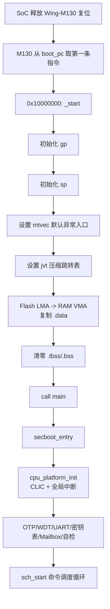
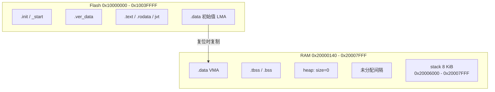
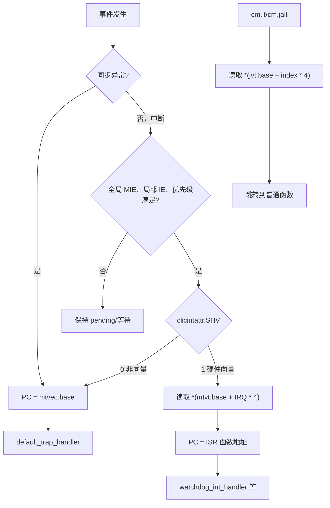
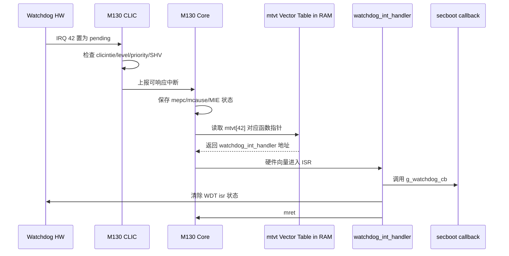

# Bootloader `crt0.S` 与 Wing-M130 启动、异常和中断深度解析

> 主Review索引：[`03_bootloader_deep_review.md`](03_bootloader_deep_review.md)。

## 1. 文档目标

本文针对 `ehsm_bl-2.3.5-4019-72f8fdc` 的复位启动文件
[`crt0.S`](../../ehsm_bl-2.3.5-4019-72f8fdc/src/driver/cpu/m130/wmsis/core/src/crt0.S)
进行逐段、逐指令解析，并结合以下内容说明 Wing-M130 的启动、寄存器、异常和中断机制：

- [`link.ld`](../../ehsm_bl-2.3.5-4019-72f8fdc/link/link.ld) 中的内存布局和链接符号。
- [`port_m130.c`](../../ehsm_bl-2.3.5-4019-72f8fdc/src/driver/cpu/m130/port/port_m130.c) 中的异常入口和中断封装。
- [`clic.c`](../../ehsm_bl-2.3.5-4019-72f8fdc/src/driver/cpu/m130/driver/src/clic.c) 中的 CLIC 初始化与向量表。
- [`Wing-M130 Technical Reference Manual`](../CPU/Wing-M130_Technical_Reference_Manual_v1p0.pdf)。
- [`Wing-M130 Integration Manual`](../CPU/Wing-M130_Integration_Manual.pdf)。
- 当前 `build_codex` 目录中的 ELF、map 和反汇编结果。

本文重点回答：

1. CPU 解除复位后为什么会执行 `_start`。
2. `_start` 为进入 C 代码准备了哪些运行环境。
3. `gp`、`sp`、`a0`、`t0` 等寄存器分别有什么作用。
4. `mtvec`、`mtvt`、`jvt` 三者有什么区别。
5. 异常、中断和 CLIC 硬件向量中断分别如何进入处理函数。
6. 当前实现中有哪些值得继续验证的代码 Review 关注点。

> CLIC 寄存器、逐中断 `SHV` 入口选择、WDT/UART 配置和中断上下文的专项分析，参见
> [`05_bootloader_m130_interrupt_deep_dive.md`](05_bootloader_m130_interrupt_deep_dive.md)。

> 说明：文中的具体地址来自当前 `build_codex` 构建快照。代码或链接布局变化后，应以新生成的 ELF、map 和反汇编为准。

## 2. 核心结论

- `crt0.S` 是 BL 的复位启动代码，真正定义的函数只有 `_start`。
- `default_trap_handler` 在本文件中只有符号声明，函数实现在 `port_m130.c`。
- `_start` 位于 Flash 地址 `0x10000000`，但硬件是否从这里启动最终由 SoC 集成信号 `boot_pc` 决定。
- `_start` 依次完成 `gp`、`sp`、`mtvec`、`jvt` 初始化，复制 `.data`，清零 `.bss`，最后调用 `main()`。
- M130 支持 RV32I/RV32E 可配置；当前 BL 实际按照 `RV32IM + ILP32` 编译，使用 32 个通用寄存器，不是 RV32E/ILP32E。
- `jvt` 是 Zcmt 普通函数压缩跳转表，`mtvt` 才是 CLIC 硬件中断向量表，两者不能混淆。
- 当前 BL 确认会走中断注册路径的外设是 WDT IRQ 42，并且只在 `wdt_level > 0` 时启用；UART 当前为轮询模式。
- `_start` 没有为 `main()` 意外返回设置兜底死循环，这是一个需要补充防御的健壮性问题。

## 3. 从复位到 `main()` 的整体流程



这里需要区分两个“入口”概念：

| 概念 | 来源 | 作用 |
|---|---|---|
| ELF 入口 | `link.ld` 中的 `ENTRY(_start)` | 写入 ELF Header，供加载器、调试器和工具识别 |
| CPU 复位 PC | SoC 集成信号 `boot_pc` | 决定 M130 解除复位后真正取指的地址 |

`ENTRY(_start)` 本身不会配置硬件 `boot_pc`。根据 M130 集成手册，`boot_pc` 必须在解除复位前稳定，并满足 2 字节对齐。当前 ELF 入口为 `0x10000000`，因此 SoC 集成也应将 M130 的启动 PC 指向该地址。

## 4. 当前 M130 的实际指令集和 ABI

### 4.1 手册描述与当前配置的关系

M130 是可配置处理器：

- `RV32E_EXT=ON` 时使用 RV32E，只有 `x0~x15` 共 16 个通用寄存器。
- `RV32E_EXT=OFF` 时使用 RV32I，具有 `x0~x31` 共 32 个通用寄存器。

当前 BL 工具链配置为：

```text
-march=rv32im_zca_zcb_zcmp_zcmt
-mabi=ilp32
-mcmodel=medany
-mno-save-restore
```

当前 ELF 的 RISC-V 属性为：

```text
rv32i2p1_m2p0_zicsr2p0_zmmul1p0_zca1p0_zcb1p0_zcmp1p0_zcmt1p0
```

因此，阅读这份 BL 时应采用以下模型：

| 配置 | 含义 |
|---|---|
| `RV32I` | 32 位基础整数指令集，32 个通用寄存器 |
| `M` | 支持整数乘法和除法 |
| `Zicsr` | 支持 `csrr/csrw` 等 CSR 指令 |
| `Zca/Zcb/Zcmp/Zcmt` | 面向代码尺寸优化的压缩指令扩展 |
| `ILP32` | `int`、`long`、指针均为 32 位 |
| `medany` | 代码和数据地址主要通过 PC 相对方式构造 |

反汇编中的 `a6`、`a7`、`t3~t6` 也直接证明当前镜像使用的是完整 RV32I 寄存器集合。

### 4.2 `crt0` 的含义

`crt0` 可以理解为最早运行的 C Runtime 启动层。由于该工程使用：

```text
-nostartfiles -nostdlib
```

工具链不会自动提供标准启动代码，因此工程必须自行完成最小 C 运行环境初始化。这里的最小环境包括：

- 有效的栈指针 `sp`。
- 有效的全局指针 `gp`。
- 已复制到 RAM 的已初始化全局变量 `.data`。
- 已清零的未初始化全局变量 `.bss`。
- 一个可接收早期异常的 `mtvec`。

## 5. 通用寄存器基础

`crt0.S` 主要使用以下寄存器：

| ABI 名称 | 物理寄存器 | 调用约定 | 在启动代码中的用途 |
|---|---:|---|---|
| `zero` | `x0` | 固定为 0 | 清零 `.bss` |
| `ra` | `x1` | Caller-saved | `call main` 保存返回地址 |
| `sp` | `x2` | 特殊寄存器 | 指向当前栈顶，栈向低地址增长 |
| `gp` | `x3` | 特殊寄存器 | 作为 small data 区的寻址基准 |
| `t0` | `x5` | Caller-saved | 临时保存函数地址和搬运的数据字 |
| `a0` | `x10` | 参数/返回值 | 保存源地址、BSS 游标，调用 `main` 前被置 0 |
| `a1` | `x11` | 参数 | 保存目标地址或结束地址 |
| `a2` | `x12` | 参数 | 保存 `.data` 结束地址 |

### 5.1 Caller-saved 与 Callee-saved

- Caller-saved：调用者若需要保留，就必须在调用前保存，例如 `ra`、`t0~t6`、`a0~a7`。
- Callee-saved：被调用函数使用后必须恢复，例如 `s0~s11`。
- 中断可以发生在任意指令之间，因此 ISR 需要保证被中断代码的寄存器上下文不会被破坏。

## 6. 链接布局和启动符号

### 6.1 静态内存布局

链接脚本定义：

| 区域 | 起始地址 | 大小 | 结束地址（不含） | 用途 |
|---|---:|---:|---:|---|
| Flash | `0x10000000` | `0x40000` | `0x10040000` | 启动代码、只读代码、只读数据、`.data` 初值 |
| ILM 总空间 | `0x20000000` | `0x8000` | `0x20008000` | M130 本地 RAM 空间描述 |
| BL RAM | `0x20000140` | `0x7EC0` | `0x20008000` | `.data/.bss/heap/stack` |
| Stack | `0x20006000` | `0x2000` | `0x20008000` | 8 KiB 向下增长栈 |
| Heap | `__heap_start` | `0` | 同起始地址 | 当前 BL 不预留堆 |

`0x20000000~0x20000140` 没有被当前 `ram` MEMORY 区使用；仅凭本链接脚本不能确定该空间的硬件用途，不应擅自作为普通 RAM 使用。



### 6.2 当前构建中的关键地址

| 符号 | 当前地址 | 说明 |
|---|---:|---|
| `_start` | `0x10000000` | 复位启动入口 |
| `main` | `0x100000C0` | C 入口 |
| `default_trap_handler` | `0x10005040` | 默认异常/非向量中断入口，64 字节对齐 |
| `__jvt_base$` | `0x10000140` | Zcmt 跳转表，64 字节对齐 |
| `_data_lma` | `0x1000AD3C` | `.data` 在 Flash 中的加载地址 |
| `_data` | `0x20000140` | `.data` 在 RAM 中的运行地址 |
| `_edata` / `__bss_start` | `0x20000158` | `.data` 结束、BSS 开始 |
| `__global_pointer$` | `0x20000940` | `gp` 初始化值 |
| `s_handler_array` | `0x20000D80` | CLIC 向量处理函数指针表 |
| `__heap_start` | `0x200018E0` | 当前 BSS 清零终点、零大小 heap 起点 |
| `__StackTop` | `0x20008000` | 初始栈指针 |

### 6.3 LMA 与 VMA

`.data` 中的变量具有非零初始值，例如：

```c
uint32_t state = 1;
```

镜像烧录时，初值必须存在 Flash；程序运行时，为了允许修改，变量必须位于 RAM。因此链接器同时提供：

- LMA（Load Memory Address）：镜像加载地址，即 Flash 中初值的位置。
- VMA（Virtual/Runtime Memory Address）：程序运行地址，即 RAM 中变量的位置。

`crt0.S` 的 `.data` 循环就是把 LMA 内容复制到 VMA。

## 7. `crt0.S` 逐行解析

### 7.1 头文件

```asm
#include "encoding.h"
#include "version.h"
```

这是经过 C 预处理器处理的汇编文件：

- `encoding.h` 定义 `CSR_MTVEC`、`MSTATUS_MIE` 等 CSR 编号和位掩码。
- `version.h` 定义 BL/HW 版本宏，但当前 `crt0.S` 没有引用其中任何版本宏，对生成的启动指令没有直接影响。

### 7.2 Section、全局符号和函数类型

```asm
.section .init

.globl _start
.global default_trap_handler
.type _start,@function
.type default_trap_handler,@function
```

| 语句 | 作用 |
|---|---|
| `.section .init` | 将后续指令放入 ELF 的 `.init` section |
| `.globl/.global` | 将符号导出为全局符号，两种写法等价 |
| `.type ..., @function` | 标记 ELF 符号类型为函数，方便链接、调试和反汇编 |

链接脚本使用：

```ld
.init :
{
    _TEXT_START = .;
    KEEP (*(SORT_NONE(.init)))
} >flash AT>flash
```

因此 `.init` 被放在 Flash 首地址，并且即使启用了 `--gc-sections` 也不会被删除。

`default_trap_handler` 的实体由 C 文件提供。这里声明其全局函数类型，最终由链接器解析为 C 函数地址。

### 7.3 `_start` 标签

```asm
_start:
```

标签本身不占用指令空间，只是把当前地址命名为 `_start`。当前地址是 `0x10000000`。

### 7.4 初始化 `gp`

```asm
.option push
.option norelax
la gp, __global_pointer$
.option pop
```

#### `.option push/pop`

- `.option push` 保存当前汇编选项。
- `.option pop` 恢复之前保存的选项。
- 这样 `norelax` 只作用于中间的 `gp` 初始化，不影响后续代码。

#### 为什么必须使用 `norelax`

链接器 relaxation 会尝试把较长的寻址序列优化成更短的 `gp` 相对寻址。但初始化 `gp` 的指令本身不能依赖尚未初始化的 `gp`，否则会形成循环依赖。

因此这里明确禁止 relaxation。当前实际生成：

```asm
10000000: auipc gp, 0x10001
10000004: addi  gp, gp, -1728    # 0x20000940 <__global_pointer$>
```

`auipc` 的含义是：

```text
rd = 当前指令 PC + (立即数 << 12)
```

随后 `addi` 补上低 12 位，最终得到完整地址。

#### `gp` 有什么作用

链接脚本把 `__global_pointer$` 定义在 small data 区附近：

```ld
PROVIDE(__global_pointer$ = . + 0x800);
```

编译器可以用 `gp + 12bit signed offset` 访问附近的 `.sdata/.sbss` 数据，减少构造完整 32 位地址所需的指令数量。当前反汇编中访问 `s_handler_array` 就使用了 `gp + 1088`。

### 7.5 初始化 `sp`

```asm
la sp, __StackTop
```

当前实际生成：

```asm
10000008: auipc sp, 0x10008
1000000c: addi  sp, sp, -8       # 0x20008000 <__StackTop>
```

RISC-V 栈向低地址增长：

```text
高地址  0x20008000  <- 初始 sp / __StackTop
                         函数调用时 sp 递减
        0x20006000  <- __StackBottom / __StackLimit
低地址
```

`link.ld` 将栈顶按 16 字节对齐，符合当前 ILP32 ABI 的栈对齐要求。后续 C 函数、异常处理函数都依赖此时已经有效的 `sp`。

### 7.6 设置默认 Trap 入口 `mtvec`

```asm
la t0, default_trap_handler
csrw CSR_MTVEC, t0
```

第一条伪指令计算默认处理函数地址，第二条把该地址写入 `mtvec` CSR：

```asm
10000010: auipc t0, 0x5
10000014: addi  t0, t0, 48       # 0x10005040
10000018: csrw  mtvec, t0
```

`csrw csr, rs` 是伪指令，本质等价于：

```asm
csrrw x0, csr, rs
```

即写 CSR，但丢弃 CSR 的旧值。

M130 TRM 对 `mtvec` 的定义为：

| 位 | 字段 | 含义 |
|---|---|---|
| `[31:6]` | `base` | Trap 基地址，要求 64 字节对齐 |
| `[5:2]` | `submode` | CLIC 子模式，当前只支持 `0000` |
| `[1:0]` | `mode` | CLIC 模式，合法值为 `11` |

`default_trap_handler` 使用 `aligned(64)`，当前地址 `0x10005040` 满足 64 字节对齐。

代码直接写入对齐后的函数地址，没有手工 OR `0x3`。由于 `mode` 是 WARL 字段且该核只支持 CLIC 编码 `0b11`，代码依赖硬件将写入值合法化为支持的模式。真机 bring-up 时应读回 `mtvec`，确认基地址和 mode 均符合预期。

### 7.7 设置 Zcmt 跳转表 `jvt`

```asm
3:
    auipc a0, %pcrel_hi(__jvt_base$)
    addi  a0, a0, %pcrel_lo(3b)
    csrw  jvt, a0
```

#### 数字局部标签

GNU 汇编允许重复使用 `1:`、`2:`、`3:` 这样的数字标签：

- `3b`：向后查找最近的 `3:`，`b` 表示 backward。
- `1f`：向前查找最近的 `1:`，`f` 表示 forward。
- `2b`：向后查找最近的 `2:`。

这里的 `3:` 用作 PC 相对 relocation 的锚点，保证 `%pcrel_hi` 和 `%pcrel_lo` 正确配对。

当前实际生成：

```asm
1000001c: auipc a0, 0
10000020: addi  a0, a0, 292      # 0x10000140 <__jvt_base$>
10000024: csrw  jvt, a0
```

`jvt` 是 Zcmt 扩展的 Table Jump Base Vector and Control CSR：

| 位 | 含义 |
|---|---|
| `[31:6]` | 64 字节对齐的跳转表基地址 |
| `[5:0]` | mode，当前跳转表模式为 0 |

当前链接器生成了 `.text.tbljal`：

```text
起始地址：0x10000140
大小：    0x400 字节
表项数：  256
每项：    4 字节函数地址
```

编译器可以把普通函数调用优化成 `cm.jt` 或 `cm.jalt index`，CPU 再通过：

```text
jvt.base + index * 4
```

找到目标函数地址。这是代码尺寸优化机制，不是中断机制。

### 7.8 复制 `.data`

```asm
1:
    la a0, _data_lma
    la a1, _data
    beq a0, a1, 1f
    la a2, _edata
    bgeu a1, a2, 1f
2:
    lw t0, (a0)
    sw t0, (a1)
    addi a0, a0, 4
    addi a1, a1, 4
    bltu a1, a2, 2b
1:
```

寄存器含义：

| 寄存器 | 内容 |
|---|---|
| `a0` | Flash 源地址游标，初值为 `_data_lma` |
| `a1` | RAM 目标地址游标，初值为 `_data` |
| `a2` | RAM 目标结束地址 `_edata`，不包含在复制范围内 |
| `t0` | 每次搬运的 32 位数据 |

执行逻辑等价于：

```c
uint32_t *src = (uint32_t *)_data_lma;
uint32_t *dst = (uint32_t *)_data;
uint32_t *end = (uint32_t *)_edata;

if (src != dst) {
    while (dst < end) {
        *dst++ = *src++;
    }
}
```

关键指令：

| 指令 | 含义 |
|---|---|
| `beq a0,a1,1f` | LMA 与 VMA 相同时跳过复制，兼容数据原地运行场景 |
| `bgeu a1,a2,1f` | 目标起点大于等于终点时，说明 section 为空 |
| `lw t0,(a0)` | 从 Flash 读取一个 32 位 word |
| `sw t0,(a1)` | 将该 word 写入 RAM |
| `bltu a1,a2,2b` | 使用无符号地址比较，未到终点则继续循环 |

当前构建中：

```text
Flash: 0x1000AD3C
RAM:   0x20000140 - 0x20000157
长度:  0x18 = 24 字节
```

该实现按 4 字节搬运，不单独处理尾部 1~3 字节。当前链接脚本通过对齐保证 `_data/_edata` 满足 word 复制条件，因此该假设成立。若后续修改链接脚本，必须保持这一不变量。

### 7.9 清零 `.bss`

```asm
1:
    la a0, __bss_start
    la a1, __heap_start
    bgeu a0, a1, 1f
2:
    sw zero, (a0)
    addi a0, a0, 4
    bltu a0, a1, 2b
1:
```

执行逻辑等价于：

```c
uint32_t *p = (uint32_t *)__bss_start;
while (p < (uint32_t *)__heap_start) {
    *p++ = 0;
}
```

这里使用 `__heap_start` 而不是某个单独的 `__bss_end`，因此实际清零范围包括：

- `.tbss`。
- `.bss`、`.sbss` 和 COMMON 符号。
- BSS 末尾到 heap 起点之间的对齐填充。

当前范围为：

```text
0x20000158 - 0x200018DF
长度 0x1788 字节
```

当前 `__HEAP_SIZE=0`，所以 `__heap_start` 同时也是 heap 的起点和有效数据区之后的边界。清零对齐填充本身无害，并可避免残留数据。

### 7.10 调用 `main`

```asm
li a0, 0
call main
```

- `li a0,0` 把第一个参数/返回值寄存器清零。
- 当前 `main` 声明为 `int main(void)`，按 ABI 并不需要传递 `argc`，所以该清零不是必需条件，但没有副作用。
- `call` 是伪指令，会写入 `ra` 后跳转到目标函数。

当前反汇编为：

```asm
10000076: li  a0, 0
10000078: jal 0x100000c0 <main>
```

由于启用了压缩扩展，当前 `jal` 使用 16 位压缩编码。`ra` 保存调用后的地址，供 `main` 正常返回。

但 `_start` 在 `call main` 之后没有：

```asm
1:  j 1b
```

也没有复位、panic 或错误上报逻辑。当前正常流程依赖 `secboot_entry()` 最终停留在 `sch_start()`/无限循环，因此 `main` 理论上不会返回；一旦异常返回，CPU 会继续把后续内存解释为指令，行为不可控。

### 7.11 函数大小标记

```asm
.size _start, .-_start
```

- `.` 表示当前位置。
- `.-_start` 表示从 `_start` 到当前位置的字节数。
- 该语句只生成 ELF 符号元数据，不生成 CPU 指令。

## 8. 汇编伪指令与实际指令

为方便阅读，`crt0.S` 使用了多种伪指令：

| 源码写法 | 典型展开 | 说明 |
|---|---|---|
| `la rd,symbol` | `auipc + addi` | 构造 PC 相对地址 |
| `li rd,0` | `addi rd,x0,0` 或压缩形式 | 装载立即数 |
| `csrw csr,rs` | `csrrw x0,csr,rs` | 写 CSR，丢弃旧值 |
| `call symbol` | `jal` 或 `auipc + jalr` | 保存返回地址并调用函数 |

反汇编比源码更接近 CPU 实际执行内容；源码则更适合理解意图。Review 时两者应结合使用。

## 9. CSR 基础和关键寄存器

### 9.1 CSR 与内存映射寄存器的区别

| 类型 | 访问方式 | 示例 |
|---|---|---|
| CSR | `csrr/csrw/csrrs/csrrc` | `mstatus`、`mtvec`、`mepc`、`mcause`、`jvt`、`mtvt` |
| Memory-mapped register | 普通 `lw/sw` 或 C volatile 指针 | CLIC `clicintip/clicintie/clicintattr/clicintctl`、WDT、UART |

CSR 具有 12 位 CSR 编号，不占普通系统内存地址；CLIC 控制寄存器则位于 M130 的寄存器地址空间。

### 9.2 启动和异常相关 CSR

| CSR | 地址 | 作用 | 当前代码位置 |
|---|---:|---|---|
| `jvt` | `0x017` | Zcmt 普通跳转表基址 | `crt0.S` |
| `mstatus` | `0x300` | M-mode 全局状态和中断开关 | `cpu_enable_global_int` |
| `mtvec` | `0x305` | 异常/非向量中断公共入口 | `crt0.S`、`clic_init` |
| `mtvt` | `0x307` | CLIC 硬件向量函数指针表 | `clic_init` |
| `mepc` | `0x341` | Trap 返回地址 | `default_trap_handler` 读取 |
| `mcause` | `0x342` | Trap 类型和原因 | `default_trap_handler` 读取 |
| `mtval` | `0x343` | 错误地址/非法指令等补充信息 | 当前默认处理函数未读取 |

### 9.3 `mstatus.MIE`

`MSTATUS_MIE` 的掩码为 `0x8`，即 bit 3：

- `MIE=0`：M-mode 可屏蔽中断的全局开关关闭。
- `MIE=1`：允许满足优先级和局部使能条件的中断进入。

`crt0.S` 没有主动设置 MIE。正常复位状态下 MIE 关闭，直到：

```text
main
  -> secboot_entry
    -> cpu_platform_init
      -> clic_init
      -> cpu_enable_global_int
```

才由 `cpu_enable_global_int()` 设置 `mstatus.MIE`。

### 9.4 `mcause`

M130 CLIC 模式下的 `mcause` 包含：

| 位 | 字段 | 说明 |
|---|---|---|
| 31 | `Interrupt` | 0 表示同步异常，1 表示中断 |
| 30 | `minhv` | 与硬件向量入口处理状态有关 |
| 29:28 | `mpp` | Trap 前的特权级 |
| 27 | `mpie` | Trap 前的 MIE |
| 23:16 | `mpil` | Trap 前的中断级别 |
| 11:0 | `Exccode` | 异常原因或中断 ID |

默认处理函数目前把完整 `mcause` 原样传给安全启动错误处理函数，没有对字段进行拆分。

## 10. 异常、Trap 和中断

### 10.1 基本概念

| 名称 | 同步性 | 示例 |
|---|---|---|
| Exception | 与当前指令同步 | 非法指令、取指错误、load/store 地址错误、`ecall` |
| Interrupt | 与当前指令异步 | WDT、UART、Mailbox、定时器、软件中断 |
| Trap | 总称 | Exception 和 Interrupt 进入特权处理流程的统称 |

### 10.2 硬件进入 Trap 时做什么

根据 M130 TRM，硬件主要执行：

```text
mepc         <- 异常指令地址，或中断返回地址
mstatus.MPIE <- mstatus.MIE
mstatus.MIE  <- 0
mstatus.MPP  <- Trap 前的特权级
mcause       <- 中断/异常标志、原因码、CLIC 中断级别等
mtval        <- 错误地址、非法指令编码等补充信息
PC           <- mtvec.base，或硬件向量处理函数地址
```

硬件把 `MIE` 清零可以避免普通处理函数在尚未保存上下文时被同级中断再次打断。是否允许嵌套中断，需要处理函数和 CLIC level 策略显式配合。

### 10.3 从 Trap 返回

中断/异常处理函数使用：

```asm
mret
```

硬件据此：

- 从 `mepc` 恢复 PC。
- 从 `MPIE` 恢复 `MIE`。
- 恢复相应特权状态。

普通函数的 `ret` 只是跳到 `ra`，不能替代 `mret`。

## 11. `mtvec`、`mtvt`、`jvt` 的关系

这是阅读本代码时最容易混淆的部分。

| 名称 | CSR | 表内容 | 使用者 | 典型用途 |
|---|---:|---|---|---|
| `mtvec` | `0x305` | 不是表，是公共 Trap 基地址 | CPU Trap 入口 | 同步异常、非向量中断 |
| `mtvt` | `0x307` | 每项是 ISR 函数指针 | CLIC SHV 硬件向量 | WDT 等低延迟中断 |
| `jvt` | `0x017` | 每项是普通函数地址 | Zcmt `cm.jt/cm.jalt` | 缩短普通函数跳转指令 |



图中的 `jvt` 路径和 Trap/中断路径相互独立。

## 12. CLIC 初始化和中断注册

### 12.1 `clic_init`

`cpu_platform_init()` 执行：

```c
clic_init();
cpu_enable_global_int();
```

`clic_init()` 的主要动作：

1. 再次把 `default_trap_handler` 写入 `mtvec`。
2. 把 `s_handler_array` 的 64 字节对齐地址写入 `mtvt`。
3. 将 CLIC `nlbits` 设置为 4，用于中断 level/priority 划分。

当前 `s_handler_array`：

```c
static clic_int_handler s_handler_array[SOC_INT_NUM]
    __attribute__((aligned(64)));
```

- `SOC_INT_NUM=93`，可索引 IRQ 0~92。
- 每项为 32 位函数指针。
- 数组位于 BSS，已由 `crt0.S` 清零。
- 当前基地址为 `0x20000D80`，满足 `mtvt` 的 64 字节对齐要求。

### 12.2 CLIC 内存映射

当前平台：

```text
PLF_TCM_BASE      = 0x00000000
CLIC_REG_MEM_BASE = 0x00010000
```

每个 IRQ 使用一个组合的 32 位控制寄存器：

```text
CLIC_INT_X_REG(irq) = 0x00011000 + 4 * irq
```

四个 byte 的布局：

| Byte | 字段 | 作用 |
|---:|---|---|
| 0 | `clicintip` | pending 状态 |
| 1 | `clicintie` | 局部中断使能 |
| 2 | `clicintattr` | SHV、触发方式、极性 |
| 3 | `clicintctl` | level/priority |

例如 WDT IRQ 42 的组合寄存器地址为：

```text
0x11000 + 4 * 42 = 0x110A8
```

### 12.3 `cpu_register_int`

注册一个中断时，代码依次执行：

1. 将逻辑中断类型映射为 SoC IRQ ID。
2. 设置 level/edge 和极性。
3. 设置默认优先级 `0xFF`。
4. 设置 `SHV=1`，使用 CLIC 硬件向量模式。
5. 清除 pending。
6. 把 ISR 函数地址写入 `s_handler_array[irq]`。

只有在处理函数已经注册后，`cpu_enable_int()` 才设置对应 `clicintie`。

因此一个外设中断真正能够进入 CPU，通常至少需要三个开关同时满足：

```text
外设自身中断源使能
    AND CLIC clicintie[irq]
    AND mstatus.MIE
```

同时还要满足 pending、触发方式和 CLIC level/priority 条件。

## 13. 当前 BL 实际使用的中断

逻辑类型和 IRQ 映射如下：

| 逻辑中断 | IRQ ID |
|---|---:|
| WDT | 42 |
| UART | 45 |
| Mailbox | 58 |
| EMU | 60 |

当前源码中通过 `cpu_register_int()` 实际注册的路径：

| 模块 | 当前状态 | 说明 |
|---|---|---|
| WDT | 条件启用 | `wdt_level > 0` 时，`watchdog_init()` 注册 IRQ 42，level trigger，SHV 向量模式 |
| UART | 未启用中断 | `UART_SEND_ASYNC_MODE_ENABLE=0`，`UART_NEED_INTERRPT=0`，当前使用轮询发送/接收逻辑 |
| Mailbox | 未通过该 API 注册 | 当前主要由调度循环轮询/处理 |
| EMU | 未通过该 API 注册 | 当前没有发现 `cpu_register_int(IRQ_TYPE_EMU,...)` 调用 |

WDT 路径为：



## 14. 默认异常处理函数

源码为：

```c
ATTR_INTERRUPT void default_trap_handler(void)
{
    uint32_t mcause = __RV_CSR_READ(CSR_MCAUSE);
    uint32_t mepc = __RV_CSR_READ(CSR_MEPC);
    uint32_t regs_addr;
    asm volatile("mv %0, sp" : "=r"(regs_addr));
    secboot_cpu_excpt_handler(mcause, mepc, (uint32_t *)regs_addr);
}
```

`ATTR_INTERRUPT` 对 GCC 展开为：

```c
__attribute__((interrupt, aligned(64)))
```

两个属性分别保证：

- `interrupt`：使用中断函数 ABI，自动生成上下文保护和 `mret`。
- `aligned(64)`：满足 `mtvec.base` 的 64 字节对齐要求。

### 14.1 当前编译器生成的栈帧

当前反汇编中，函数进入时执行 `sp -= 64`，并保存：

| 栈偏移 | 寄存器 | 栈偏移 | 寄存器 |
|---:|---|---:|---|
| `+60` | `ra` | `+28` | `a4` |
| `+56` | `t0` | `+24` | `a5` |
| `+52` | `t1` | `+20` | `a6` |
| `+48` | `t2` | `+16` | `a7` |
| `+44` | `a0` | `+12` | `t3` |
| `+40` | `a1` | `+8` | `t4` |
| `+36` | `a2` | `+4` | `t5` |
| `+32` | `a3` | `+0` | `t6` |

这里保存的是 ISR 和其调用链可能破坏的 caller-saved 寄存器。`s0~s11` 属于 callee-saved；如果被调用的普通 C 函数使用它们，应由对应函数按 ABI 保存和恢复。

随后：

```asm
csrr a0, mcause
csrr a1, mepc
mv   a2, sp
call secboot_cpu_excpt_handler
```

因此传给 `secboot_cpu_excpt_handler` 的参数为：

| 参数 | 内容 |
|---|---|
| `a0` | 原始 `mcause` |
| `a1` | `mepc` |
| `a2` | 编译器生成的 64 字节寄存器保存区地址 |

当前 `secboot_cpu_excpt_handler()` 没有使用 `regs`，只打印 `epc/cause` 并调用 `secboot_report_error(FW_ERROR_CPU_EXCEPTION)`。

### 14.2 为什么不能写成普通 C 函数

如果不使用 `interrupt` 属性：

- 编译器可能不会保存所有需要保护的 caller-saved 寄存器。
- 函数末尾会生成 `ret`，从 `ra` 返回，而不是从 `mepc` 返回。
- `mstatus` 的 Trap 状态无法按架构要求恢复。

因此 ISR 函数属性是正确性要求，不只是性能或代码风格选项。

## 15. C 运行环境的边界

当前 `_start` 完成了裸机 C 代码运行所需的主要初始化，但没有完成完整 libc/C++ runtime 初始化：

| 功能 | 当前状态 | 影响 |
|---|---|---|
| `sp/gp` | 已初始化 | 普通 C 函数可正常调用 |
| `.data` | 已复制 | 非零初始化全局变量可用 |
| `.bss` | 已清零 | 静态零初始化语义成立 |
| `mtvec` | 已设置 | 早期异常有入口 |
| C++ constructors | 未调用 `__libc_init_array()` | 引入全局 C++ 对象后构造函数不会自动执行 |
| TLS `tp` | 未初始化 | 当前不应依赖线程局部存储运行时 |
| Heap | 大小为 0 | 当前不应使用依赖动态内存分配的代码 |
| `main` 返回兜底 | 未实现 | 意外返回后控制流不可控 |

这不代表当前纯 C 裸机 BL 无法运行，而是定义了后续扩展时必须遵守的边界。

## 16. 代码 Review 结论

| ID | 级别 | 位置 | 结论 | 建议 |
|---|---|---|---|---|
| BL-CRT0-001 | 中 | `call main` 之后 | `main()` 意外返回后没有 panic/死循环，可能继续执行相邻 section 数据 | 在 `call main` 后增加不可返回兜底并上报错误或进入死循环 |
| BL-CRT0-002 | 低 | `default_trap_handler` | 只读取 `mcause/mepc`，未记录 `mtval`，访问错误和非法指令定位信息不足 | 增加 `mtval`，必要时记录 `mstatus/mintstatus` |
| BL-CRT0-003 | 中 | `mtvec` 初始化时机 | `mtvec` 在 `.data/.bss` 初始化前生效，但 C 异常路径可能依赖未初始化全局状态 | 明确早期异常处理是否只使用栈和 MMIO；必要时增加纯汇编 early panic |
| BL-CRT0-004 | 中 | `csrw mtvec,t0` | 待真机验证：源码未显式写入 CLIC mode `0b11`，依赖 WARL 合法化 | 在真机初始化测试中读回 `mtvec` 并记录实际值 |
| BL-CRT0-005 | 信息 | 工具链配置 | TRM 特性摘要偏向 RV32E，但当前 BL 是 RV32I/ILP32 | 项目文档和编译审计以 toolchain、ELF attributes、反汇编为准 |
| BL-CRT0-006 | 信息 | `.data` 复制 | 复制循环只处理 4 字节粒度，依赖链接边界对齐 | 保持 `_data/_edata` 4 字节对齐，并在链接期增加 ASSERT 更稳妥 |
| BL-CRT0-007 | 信息 | Runtime | 未初始化 constructors/TLS/heap | 后续如引入 C++、TLS 或 malloc，必须同步扩展启动代码 |
| BL-CRT0-008 | 低 | Stack | 仅设置 8 KiB 栈，没有启动期填充、canary 或越界保护 | 结合 PMP、stack usage 文件和压力测试确认最坏栈深度 |

## 17. 建议的真机验证点

### 17.1 复位后单步检查

在调试器中从 `_start` 单步，检查：

| 时机 | 寄存器/内存 | 预期值 |
|---|---|---|
| `la gp` 后 | `gp` | `0x20000940`，以当前构建为准 |
| `la sp` 后 | `sp` | `0x20008000`，16 字节对齐 |
| 写 `mtvec` 后 | `mtvec` | base 指向 `0x10005040`，mode 为 CLIC 支持值 |
| 写 `jvt` 后 | `jvt` | base 指向 `0x10000140`，64 字节对齐 |
| `.data` 复制后 | `0x20000140~0x20000157` | 与 Flash `_data_lma` 内容一致 |
| BSS 清零后 | `0x20000158~0x200018DF` | 全部为 0 |
| `clic_init` 后 | `mtvt` | 指向 `s_handler_array`，当前为 `0x20000D80` |
| 全局中断开启后 | `mstatus.MIE` | 1 |

### 17.2 异常注入检查

可在开发生命周期下构造：

- 非法指令异常。
- 非对齐 load/store。
- 访问无权限 PMP 区域。
- WDT 超时中断。

检查内容：

- `mcause` 的 Interrupt 位和 Exccode 是否正确。
- `mepc` 是否指向预期指令。
- `mtval` 是否包含有效补充信息。
- 默认异常处理是否稳定进入安全失败状态。
- WDT 是否从 `mtvt[42]` 直接进入 `watchdog_int_handler`。
- ISR 返回或错误处理后，MIE/CLIC pending 是否符合预期。

## 18. 静态核对命令

在 BL 目录执行：

```bash
# 查看 ELF 入口、架构和 ABI
readelf -h build_codex/ehsm_bl.elf
readelf -A build_codex/ehsm_bl.elf

# 查看启动代码和异常入口
riscv32-wing-elf-objdump -dS build_codex/ehsm_bl.elf

# 查看链接符号和 section 布局
rg '_start|__StackTop|__global_pointer\$|__jvt_base\$|_data_lma|__bss_start|__heap_start' \
  build_codex/ehsm_bl.map

# 查看中断注册点
rg 'cpu_register_int|ATTR_INTERRUPT' src
```

当前已有构建证据：

- [`ehsm_bl.dis`](../../ehsm_bl-2.3.5-4019-72f8fdc/build_codex/ehsm_bl.dis)
- [`ehsm_bl.map`](../../ehsm_bl-2.3.5-4019-72f8fdc/build_codex/ehsm_bl.map)
- [`flags.make`](../../ehsm_bl-2.3.5-4019-72f8fdc/build_codex/CMakeFiles/ehsm_bl.elf.dir/flags.make)

## 19. 后续阅读建议

读完本文后，建议继续按以下顺序追踪：

1. `src/main.c::main`：`_start` 进入 C 世界后的第一段逻辑。
2. `secure_boot.c::secboot_entry`：平台和安全模块初始化顺序。
3. `port_m130.c::cpu_platform_init`：CLIC 与全局中断开启。
4. `clic.c::clic_init`：`mtvt` 与 `s_handler_array`。
5. `watchdog.c::watchdog_init`：当前 BL 的实际向量中断样例。
6. `secure_boot.c::secboot_cpu_excpt_handler`：异常最终安全处置。
7. `secure_boot.c::secboot_boot_fw`：关闭 BL 中断并跳转到 FW 的切换过程。

## 20. 参考位置

| 内容 | 位置 |
|---|---|
| 复位入口 | `ehsm_bl-*/src/driver/cpu/m130/wmsis/core/src/crt0.S` |
| 内存布局 | `ehsm_bl-*/link/link.ld` |
| 编译架构 | `ehsm_bl-*/toolchain/rv32-wing-gcc.cmake` |
| CSR 定义 | `ehsm_bl-*/src/driver/cpu/m130/wmsis/core/inc/encoding.h` |
| CLIC 驱动 | `ehsm_bl-*/src/driver/cpu/m130/driver/src/clic.c` |
| CLIC 寄存器 | `ehsm_bl-*/src/driver/cpu/m130/driver/inc/clic.h` |
| IRQ 编号 | `ehsm_bl-*/src/driver/cpu/m130/port/irq_number.h` |
| CPU port | `ehsm_bl-*/src/driver/cpu/m130/port/port_m130.c` |
| ISR 属性 | `ehsm_bl-*/inc/types.h` |
| WDT ISR | `ehsm_bl-*/src/driver/watchdog.c` |
| CPU 异常处理 | `ehsm_bl-*/src/component/secure_boot.c` |
| M130 架构 | `docs/CPU/Wing-M130_Technical_Reference_Manual_v1p0.pdf` |
| M130 集成配置 | `docs/CPU/Wing-M130_Integration_Manual.pdf` |
