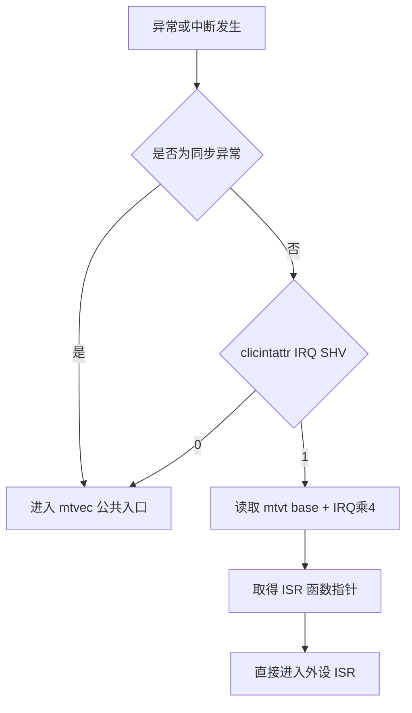
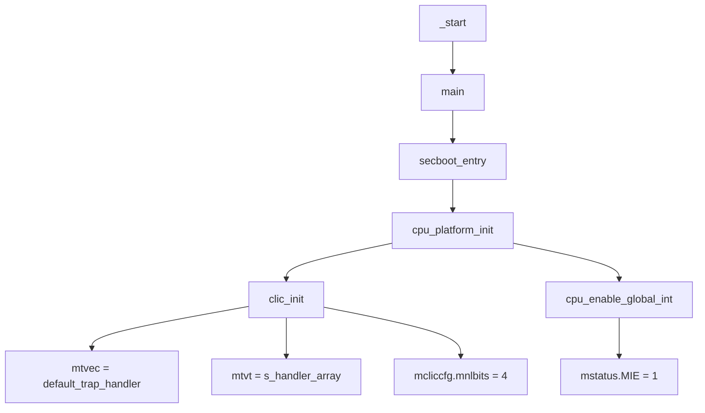
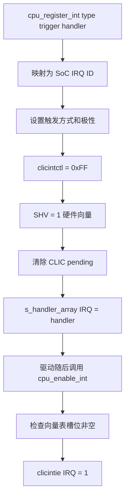
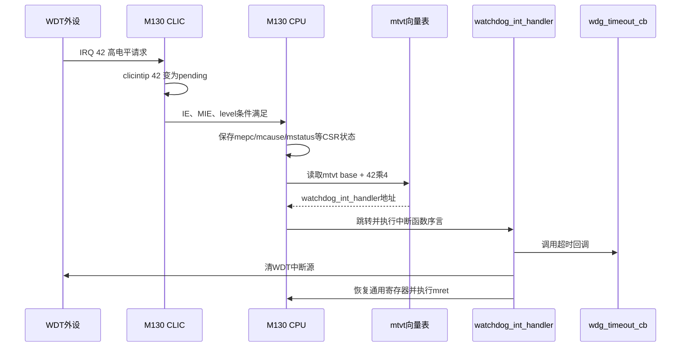

# Bootloader 中断设置与 Wing-M130 CLIC 中断机制深度解析

> 主Review索引：[`03_bootloader_deep_review.md`](03_bootloader_deep_review.md)。

## 1. 文档目标与分析范围

本文面向 `ehsm_bl-2.3.5-4019-72f8fdc`，说明 Wing-M130 的中断模型，以及 BL 如何完成中断入口、向量表、触发方式、优先级、局部使能和全局使能配置。

重点回答以下问题：

1. Wing-M130 使用哪种中断控制器。
2. 向量中断与非向量中断如何选择。
3. `mtvec`、`mtvt`、`clicintattr[i].SHV` 分别负责什么。
4. BL 如何初始化 CLIC，并注册、使能 WDT 和 UART 中断。
5. 当前 BL 镜像实际启用了哪些中断。
6. 中断发生后，硬件和编译器分别保存哪些上下文。
7. 当前实现有哪些限制和需要进一步验证的审查点。

分析依据：

- [`Wing-M130 Technical Reference Manual`](../CPU/Wing-M130_Technical_Reference_Manual_v1p0.pdf)，重点参考第 2.5.12、10.2、10.5、10.6 节。
- [`crt0.S`](../../ehsm_bl-2.3.5-4019-72f8fdc/src/driver/cpu/m130/wmsis/core/src/crt0.S)。
- [`platform.h`](../../ehsm_bl-2.3.5-4019-72f8fdc/src/driver/cpu/m130/driver/inc/platform.h)。
- [`clic.h`](../../ehsm_bl-2.3.5-4019-72f8fdc/src/driver/cpu/m130/driver/inc/clic.h) 和 [`clic.c`](../../ehsm_bl-2.3.5-4019-72f8fdc/src/driver/cpu/m130/driver/src/clic.c)。
- [`port_m130.c`](../../ehsm_bl-2.3.5-4019-72f8fdc/src/driver/cpu/m130/port/port_m130.c)。
- [`watchdog.c`](../../ehsm_bl-2.3.5-4019-72f8fdc/src/driver/watchdog.c)、[`uart.c`](../../ehsm_bl-2.3.5-4019-72f8fdc/src/driver/uart.c) 和 [`mailbox.c`](../../ehsm_bl-2.3.5-4019-72f8fdc/src/driver/mailbox.c)。
- 当前 `build_codex/ehsm_bl.map` 和 `build_codex/ehsm_bl.dis` 构建快照。

## 2. 核心结论

1. Wing-M130 使用 **CLIC（Core-Local Interrupt Controller）**，`mtvec.mode` 只支持 `0b11` 的 CLIC 模式。
2. M130 实现了 `smclicshv` 选择性硬件向量扩展。每个中断都可以通过自己的 `clicintattr[i].SHV` 位，独立选择公共入口或硬件向量入口。
3. `SHV=0` 时，异常或中断进入 `mtvec` 指向的公共入口；`SHV=1` 时，硬件通过 `mtvt[IRQ号]` 取得 ISR 函数地址。
4. 同步异常不受 `SHV` 控制，始终进入 `mtvec` 公共入口。
5. BL 的底层接口 `clic_set_vector_mode(irq, setting)` 支持逐中断设置，但上层 `cpu_register_int()` 固定调用 `clic_set_vector_mode(..., true)`，因此通过该接口注册的外设中断全部为硬件向量中断。
6. 当前构建中实际使用的是 WDT IRQ 42，条件为 OTP 中的 `wdt_level > 0`；UART 的中断代码被条件编译关闭，当前使用轮询方式；Mailbox IRQ 58 被显式关闭，调度器轮询 Mailbox。
7. 当前 `default_trap_handler()` 是安全异常上报入口，不是通用的软件中断分发器。因此不能只把普通外设的 `SHV` 改成 0，而不同时增加非向量中断分发逻辑。

## 3. 先区分四个容易混淆的概念

| 概念 | 含义 | 当前代码示例 |
|---|---|---|
| 同步异常 | 由当前执行指令引起，与指令同步 | 非法指令、访问错误、`ecall` |
| 异步中断 | 由外设或定时事件异步产生 | WDT、UART、Mailbox |
| 触发方式 | 中断请求信号如何形成 pending | 高电平、低电平、上升沿、下降沿 |
| 入口方式 | CPU 接受中断后跳到哪里 | `SHV=0` 公共入口，`SHV=1` 向量入口 |

触发方式和入口方式是两个独立维度。例如，一个 WDT 中断可以同时是：

```text
电平触发 + 硬件向量入口
```

UART 也可以是：

```text
上升沿触发 + 硬件向量入口
```

## 4. Wing-M130 的 CLIC 中断模型

### 4.1 CLIC 与传统固定入口方式的区别

CLIC 为每个中断源提供独立的 pending、enable、attribute 和 control 字段：

| 每中断字段 | 作用 |
|---|---|
| `clicintip[i]` | Pending，表示中断是否待处理 |
| `clicintie[i]` | Interrupt Enable，该中断的局部使能 |
| `clicintattr[i]` | 运行模式、触发方式、极性、`SHV` 入口方式 |
| `clicintctl[i]` | 中断 level 和 priority |

BL 将这四个 8 位寄存器作为一个 32 位寄存器访问：

```c
#define CLIC_INT_X_REG(x)       (*(CLIC_REG_PTR(0x1000 + 4 * x)))
#define CLIC_INT_X_REG_IP_Pos   0
#define CLIC_INT_X_REG_IE_Pos   8
#define CLIC_INT_X_REG_ATTR_Pos 16
#define CLIC_INT_X_REG_CTRL_Pos 24
```

对应布局为：

```text
31                    24 23                    16 15                     8 7                      0
+-----------------------+------------------------+------------------------+------------------------+
|   clicintctl[i]       |   clicintattr[i]     |    clicintie[i]       |    clicintip[i]       |
+-----------------------+------------------------+------------------------+------------------------+
```

### 4.2 每个中断可以独立选择入口

M130 的 `clicintattr[i]` 结构为：

```text
bit 7:6    mode，M130 只支持 Machine 模式 0b11
bit 5:3    保留
bit 2:1    trig，触发方式和极性
bit 0      shv，选择性硬件向量使能
```

其中 `SHV` 的行为最关键：

| `SHV` | 入口方式 | PC 跳转规则 |
|---:|---|---|
| 0 | 非向量 | `PC = {mtvec[31:6], 6'b0}` |
| 1 | 硬件向量 | `PC = MEM[{mtvt[31:6], 6'b0} + 4 * exccode] & ~1` |

因此，CLIC 不是要求所有中断统一采用一种入口方式，而是允许按中断源选择：



### 4.3 向量与非向量方式的取舍

| 模式 | 优点 | 代价 |
|---|---|---|
| 硬件向量 `SHV=1` | 硬件直接找到 ISR，响应路径短 | 每个 ISR 通常需要独立保存和恢复上下文，代码量更大 |
| 非向量 `SHV=0` | 多个中断共享公共入口和上下文保存代码 | 公共入口还要读取原因并进行软件分发，响应更慢 |

BL 当前选择了简单直接的策略：同步异常走公共入口，实际注册的外设中断走硬件向量入口。

## 5. 关键 CSR 和 CLIC 寄存器

| 寄存器 | 地址或位置 | 作用 | BL 使用点 |
|---|---:|---|---|
| `mstatus` | CSR `0x300` | `MIE` 是 M-mode 全局中断开关 | `cpu_enable_global_int()` |
| `mtvec` | CSR `0x305` | CLIC 模式和公共 Trap 基地址 | `crt0.S`、`clic_init()` |
| `mtvt` | CSR `0x307` | 硬件向量表基地址 | `clic_init()` |
| `mepc` | CSR `0x341` | Trap 返回地址 | 硬件写入，`mret` 使用 |
| `mcause` | CSR `0x342` | 中断/异常标志、原因码、中断 ID、前一级别 | `default_trap_handler()` |
| `mintstatus` | CSR `0x346` | 当前正在处理的中断 level | 由 CLIC 硬件维护 |
| `mcliccfg` | MMIO `CLIC_BASE+0x0000` | 配置 `clicintctl` 中 level/priority 的划分 | `clic_init()` |
| `clicintip[i]` | MMIO `CLIC_BASE+0x1000+4*i` 的低字节 | Pending | 清 pending、硬件置位 |
| `clicintie[i]` | 同一 32 位字的次低字节 | 局部使能 | `clic_int_enable()` |
| `clicintattr[i]` | 同一 32 位字的第三字节 | 触发方式、极性、`SHV` | 注册中断时配置 |
| `clicintctl[i]` | 同一 32 位字的最高字节 | level 和 priority | `clic_set_priority()` |

一个普通可屏蔽中断要进入 CPU，至少需要同时满足：

```text
外设自身产生中断请求
    AND clicintip[i] 为 pending
    AND clicintie[i] = 1
    AND 中断 level 高于当前 level 和 threshold
    AND mstatus.MIE = 1
```

## 6. `mtvec` 公共入口设置

### 6.1 复位启动阶段的第一次设置

`crt0.S` 在 `.data` 搬运和 `.bss` 清零之前，就建立默认 Trap 入口：

```asm
la   t0, default_trap_handler
csrw CSR_MTVEC, t0
```

这样做的目的是让最早期启动阶段至少有一个可用的异常入口。但需要注意，此时 C 全局数据尚未完成初始化，早期异常处理代码不应依赖复杂的全局状态。

### 6.2 CLIC 初始化阶段的第二次设置

`clic_init()` 再次写入同一个入口：

```c
__RV_CSR_WRITE(CSR_MTVEC, default_trap_handler);
```

`default_trap_handler()` 的实现为：

```c
ATTR_INTERRUPT void default_trap_handler(void)
{
    uint32_t mcause = __RV_CSR_READ(CSR_MCAUSE);
    uint32_t mepc = __RV_CSR_READ(CSR_MEPC);
    uint32_t regs_addr;
    asm volatile("mv %0, sp" : "=r"(regs_addr));
    secboot_cpu_excpt_handler(mcause, mepc, (uint32_t *)regs_addr);
}
```

当前实现直接进入 `secboot_cpu_excpt_handler()`，其定位是异常记录和安全错误处理，不包含以下通用软件分发过程：

```text
从 mcause 提取 IRQ ID
    -> 根据 IRQ ID 查询 s_handler_array
    -> 调用对应的外设 ISR
```

所以当前 BL 的普通外设中断不能只把 `SHV` 改为 0，否则会被当作异常进入安全错误路径。

### 6.3 `mtvec.mode` 的特殊点

M130 TRM 规定：

- `mtvec.base[31:6]` 为公共入口基地址，要求 64 字节对齐。
- `mtvec.submode[5:2]` 只支持 `0b0000`。
- `mtvec.mode[1:0]` 只支持 `0b11`，表示 CLIC 模式。
- 这些字段是 WARL，硬件只保留其支持的合法值。

BL 写入的是 64 字节对齐的 `default_trap_handler` 地址，没有显式执行 `| 0x3`。代码依赖 M130 将 `mode` 合法化为唯一支持的 `0b11`。当前 FW 版本的类似代码会显式保留基地址并写入 `0x03`，两者风格不一致。

真机验证时应读回：

```text
mtvec & 0x3F
```

预期低 6 位中的 `submode` 为 0，`mode` 为 3，并确认基地址仍指向 `default_trap_handler`。

## 7. `mtvt` 硬件向量表设置

### 7.1 向量表的定义

BL 使用一个函数指针数组作为硬件向量表：

```c
static clic_int_handler s_handler_array[SOC_INT_NUM]
    __attribute__((aligned(64)));
```

`SOC_INT_NUM` 为 93，对应 IRQ 0 到 IRQ 92，因此 RV32 下数组大小为：

```text
93 * 4 = 372 bytes = 0x174 bytes
```

当前 map 文件中：

```text
s_handler_array = 0x20000D80
size            = 0x174
```

`0x20000D80` 满足 64 字节对齐要求。

### 7.2 写入 `mtvt`

`clic_init()` 将向量表地址写入 `mtvt`：

```c
tmp = ((uint32_t)s_handler_array) & 0xffffffc0;
__RV_CSR_WRITE(CSR_MTVT, tmp);
```

M130 只使用 `mtvt[31:6]`，低 6 位保留为 0。发生 IRQ 42 时，硬件读取：

```text
handler = *(uint32_t *)(mtvt_base + 42 * 4)
PC      = handler & ~1
```

数组位于 `.bss`，启动时由 `crt0.S` 清零。中断注册函数再把对应槽位写成 ISR 地址：

```c
s_handler_array[irq] = cb;
```

## 8. CLIC 全局初始化流程

BL 的初始化调用关系为：



### 8.1 Level 与 Priority 划分

`clic_init()` 设置：

```c
tmp = CLIC_REG_CFG;
tmp &= ~CLIC_CFG_NLBIT_Msk;
tmp |= 4;
CLIC_REG_CFG = tmp;
```

也就是 `mcliccfg.mnlbits=4`。如果 M130 实现了完整的 8 个 `clicintctl` 位，则：

```text
clicintctl[7:4] = interrupt level
clicintctl[3:0] = priority
```

BL 注册中断时写入 `0xFF`：

```c
clic_set_priority(irq, CONFIG_BL_DEFAULT_INT_PRIORITY); // 0xFF
```

实际上它会覆盖整个 `clicintctl` 字节，不仅设置低位 priority，也同时把 level 设置为最大编码。因此 `clic_set_priority()` 这个函数名不能完整反映实际行为。

### 8.2 全局中断打开时机

`cpu_platform_init()` 在具体 WDT/UART 注册前执行：

```c
clic_init();
cpu_enable_global_int();
```

此时 `mstatus.MIE=1`，但具体外设的 `clicintie[i]` 尚未打开，所以正常复位状态下不会立即进入这些外设中断。后续各驱动完成 ISR 注册和外设初始化后，再调用 `cpu_enable_int()` 打开对应局部中断。

## 9. 单个中断的注册和使能过程

### 9.1 逻辑类型到硬件 IRQ 的映射

`cpu_get_irq_number()` 提供以下映射：

| 逻辑类型 | SoC IRQ | 当前 BL 状态 |
|---|---:|---|
| `IRQ_TYPE_WDT` | 42 | 条件注册并使能 |
| `IRQ_TYPE_UART` | 45 | 当前条件编译关闭 |
| `IRQ_TYPE_MAILBOX` | 58 | 未注册，初始化时显式关闭 |
| `IRQ_TYPE_EMU` | 60 | 有映射，当前 BL 未调用 `cpu_register_int()` |

### 9.2 `cpu_register_int()` 的严格执行顺序



核心代码顺序为：

```c
clic_set_trig_type(irq_num, clic_int_attr);
clic_set_priority(irq_num, 0xFF);
clic_set_vector_mode(irq_num, true);
clic_clear_int_pending(irq_num);
clic_int_handler_regist(irq_num, handler);
```

需要特别注意：

- `cpu_register_int()` 固定传入 `true`，所以上层调用者目前无法选择非向量入口。
- `cpu_enable_int()` 会检查 `s_handler_array[irq] != NULL`，避免在未安装 ISR 时打开局部中断。
- 注册和使能是两个步骤，驱动可以在配置外设完成后再打开局部中断。

### 9.3 触发方式编码

BL 对 `clicintattr.trig[1:0]` 的使用如下：

| 上层枚举 | `trig[1:0]` | 含义 | 当前使用 |
|---|---:|---|---|
| `INT_LEVEL_TRIGGER` | `00` | 高电平触发 | WDT |
| `INT_POSITIVE_EDGE_TRIGGER` | `01` | 上升沿触发 | UART 条件编译路径 |
| 未提供对应上层枚举 | `10` | 低电平触发 | 未使用 |
| `INT_NEGATIVE_EDGE_TRIGGER` | `11` | 下降沿触发 | 当前未使用 |

## 10. 当前 BL 实际中断使用情况

### 10.1 WDT IRQ 42

`secboot_entry()` 从 OTP/系统寄存器读取 `wdt_level`：

```c
if (wdt_level > 0) {
    watchdog_init(wdg_timeout_cb);
    watchdog_start(1U << wdt_level);
}
```

`watchdog_init()` 执行：

```c
cpu_register_int(IRQ_TYPE_WDT,
                 INT_LEVEL_TRIGGER,
                 watchdog_int_handler);
...
cpu_enable_int(IRQ_TYPE_WDT);
```

最终配置为：

| 项目 | 配置 |
|---|---|
| IRQ ID | 42 |
| 触发方式 | 高电平触发 |
| CLIC control | `0xFF` |
| 入口方式 | `SHV=1`，硬件向量 |
| 向量表项 | `s_handler_array[42] = watchdog_int_handler` |
| 局部使能 | `clicintie[42]=1` |
| 全局使能 | `mstatus.MIE=1` |

WDT 中断完整路径为：



对于电平触发中断，CLIC pending 反映外设中断请求电平，软件直接清 `clicintip` 通常无效，必须清除外设侧的中断源。当前 ISR 最后执行：

```c
wdg_reg->isr = 0U;
```

### 10.2 UART IRQ 45

UART 源码包含硬件向量中断路径，但当前宏配置为：

```c
#define UART_SEND_ASYNC_MODE_ENABLE 0
#define UART_NEED_INTERRPT          (0x0 || UART_SEND_ASYNC_MODE_ENABLE)
```

因此当前构建结果为：

- `UART_NEED_INTERRPT=0`。
- `uart_int_handler()` 不参与编译。
- `cpu_register_int(IRQ_TYPE_UART, ...)` 和 `cpu_enable_int(IRQ_TYPE_UART)` 不参与编译。
- `uart_putc()` 轮询发送缓冲区状态。

如果后续把异步发送宏打开，预设路径会将 UART 配置为：

```text
IRQ 45 + 上升沿触发 + SHV=1 + mtvt[45]向量入口
```

### 10.3 Mailbox IRQ 58

BL 的 `mailbox_init()` 执行：

```c
cpu_disable_int(IRQ_TYPE_MAILBOX);
```

并关闭每个 Mailbox 通道的外设侧中断使能。`sch_start()` 在主循环中轮询 Mailbox 通道。因此 Mailbox 当前不属于 BL 的 CLIC 中断处理路径。

### 10.4 EMU IRQ 60

`cpu_get_irq_number()` 提供了 `IRQ_TYPE_EMU -> SOC_EMU_IRQn` 映射，但当前 BL 中没有找到 `cpu_register_int(IRQ_TYPE_EMU, ...)` 调用，因此不能仅凭映射表认定 EMU 中断已启用。

## 11. 中断进入时硬件做了什么

M130 接受中断时，硬件至少完成以下状态更新：

1. `mepc` 保存返回地址。
2. `mstatus.MPIE <- mstatus.MIE`。
3. `mstatus.MIE <- 0`，防止上下文尚未保存时再次进入普通可屏蔽中断。
4. `mstatus.MPP` 保存 Trap 前的特权级。
5. `mcause` 记录中断标志、IRQ ID 和前一中断 level。
6. `mintstatus.MIL` 更新为当前中断 level。
7. 若为 `SHV=1` 的边沿触发中断，硬件自动清对应 `clicintip`。
8. 根据 `SHV` 选择 `mtvec` 或 `mtvt` 路径并更新 PC。

硬件不会自动把所有通用寄存器完整压栈。通用寄存器保护由中断入口软件或编译器生成的中断函数序言完成。

## 12. `ATTR_INTERRUPT`、上下文保护与 `mret`

GCC 构建下：

```c
#define ATTR_INTERRUPT __attribute__((interrupt, aligned(64)))
```

它包含两层含义：

- `interrupt`：要求编译器按照中断 ABI 生成寄存器保存、恢复和 `mret`。
- `aligned(64)`：强制函数入口按 64 字节对齐。

当前反汇编中，`watchdog_int_handler` 入口先分配 64 字节栈空间，并保存 `ra`、`t0~t6`、`a0~a7` 等可能被破坏的寄存器；退出前恢复寄存器，最后执行：

```asm
mret
```

`default_trap_handler` 也有同样的中断 ABI 序言和尾声。

需要注意，`mtvec.base` 确实要求 64 字节对齐，但 `mtvt` 表中的 ISR 函数地址本身不要求每个都按 64 字节对齐。当前统一宏会让每个 ISR 都 64 字节对齐，简化了属性定义，但可能产生额外的代码填充。

## 13. 中断嵌套、优先级和临界区

### 13.1 当前默认不发生普通中断嵌套

中断进入时硬件会清 `mstatus.MIE`。当前 WDT ISR 没有重新设置 `MIE`，因此处理过程中不会接受普通可屏蔽中断嵌套。

若未来需要嵌套中断，不能只设置不同 priority，还需要：

1. 设计不同的 interrupt level。
2. 在 ISR 保存好上下文后重新打开 `mstatus.MIE`。
3. 验证 `mintstatus.MIL`、`mintthresh` 和高 level 中断抢占关系。
4. 评估中断栈深度和安全关键状态的可重入性。

### 13.2 临界区实现

`cpu_enter_critical()` 清除 `mstatus.MIE`，并返回修改前的 `mstatus`；`cpu_exit_critical(level)` 再恢复原值：

```c
uint32_t level = cpu_enter_critical();
/* 访问需要原子保护的外设寄存器 */
cpu_exit_critical(level);
```

WDT 启动、喂狗和停止操作使用了这一机制，避免寄存器解锁和更新序列被普通中断打断。

## 14. BL 跳转 FW 前的中断处理

BL 准备进入 FW 时执行：

```c
watchdog_stop();
cpu_disable_global_int();
uart_deinit();
g_ehsm_fw_entry();
```

这会关闭 `mstatus.MIE` 并停止 BL WDT，但不会清空整个 `s_handler_array`，也不会恢复所有 CLIC 属性和 control 寄存器。因此 FW 必须把 CLIC 初始化和各 IRQ 注册视为自身启动流程的一部分，不能直接依赖 BL 遗留状态。

## 15. 硬件能力、驱动能力和当前使用的边界

| 层次 | 能力 |
|---|---|
| M130 硬件 | 每个 IRQ 可独立选择 `SHV=0/1`，支持四种触发极性组合、level/priority 和抢占 |
| CLIC 底层驱动 | `clic_set_vector_mode(irq, setting)` 可以逐 IRQ 设置向量或非向量 |
| CPU 适配层 | `cpu_register_int()` 固定设置 `SHV=1`，未向调用者开放入口模式参数 |
| 公共入口 | 当前用于安全异常上报，没有实现普通 IRQ 软件分发 |
| 当前 BL 镜像 | 条件启用 WDT 向量中断；UART 和 Mailbox 使用轮询；未使用 EMU IRQ |

如果未来要支持非向量外设中断，至少要同时修改：

1. 给 `cpu_register_int()` 增加 vector/non-vector 参数，或提供单独注册接口。
2. 在公共入口中区分同步异常与异步中断。
3. 从 `mcause` 提取 IRQ ID。
4. 查询并调用 `s_handler_array[irq]`。
5. 正确处理边沿 pending 和电平中断源清除。
6. 保证异常路径和中断路径的错误处理不会相互混淆。

## 16. 代码 Review 关注点

| ID | 级别 | 关注点 | 当前情况 | 建议 |
|---|---|---|---|---|
| BL-IRQ-001 | 中 | `mtvec.mode` 写入方式 | BL 未显式写 `0b11`，依赖 WARL；FW 显式写 3 | 真机读回 `mtvec`，统一 BL/FW 编码风格 |
| BL-IRQ-002 | 中 | 非向量中断支持 | 公共入口没有 IRQ 软件分发 | 若无需求则明确只支持向量外设 IRQ；若有需求则补充分发器 |
| BL-IRQ-003 | 中 | 向量表写越界 | `clic_int_handler_regist()` 未检查 `irq < SOC_INT_NUM` | 在底层接口增加边界检查 |
| BL-IRQ-004 | 中 | 向量表完整性 | `s_handler_array` 位于可写 RAM | 确认 PMP/总线权限能够防止非授权修改 ISR 指针 |
| BL-IRQ-005 | 低 | Level 与 priority 命名 | `clic_set_priority()` 写整个 `clicintctl=0xFF` | 改名或注释说明同时设置 level 和 priority |
| BL-IRQ-006 | 低 | ISR 对齐开销 | 所有 `ATTR_INTERRUPT` 函数都按 64 字节对齐 | 区分公共入口属性和普通向量 ISR 属性 |
| BL-IRQ-007 | 中 | 初始化返回值 | `secboot_entry()` 未检查 `watchdog_init()`、`uart_init()` 返回值 | 明确失败后的安全策略并检查返回值 |
| BL-IRQ-008 | 中 | BL/FW 交接 | 只关闭全局中断，未统一清理 CLIC 全部状态 | 定义 FW 必须完整重初始化 CLIC 的接口契约 |
| BL-IRQ-009 | 低 | 低电平触发能力 | 硬件支持，CPU 上层枚举没有对应类型 | 若平台外设需要低电平触发，再扩展枚举和映射 |
| BL-IRQ-010 | 中 | 中断配置验证 | 当前主要依靠代码静态判断 | 增加真机寄存器读回和实际注入测试 |

## 17. 建议的真机验证清单

### 17.1 初始化寄存器读回

| 检查项 | 预期 |
|---|---|
| `mtvec.mode` | `0b11` |
| `mtvec.base` | `default_trap_handler` 的 64 字节对齐地址 |
| `mtvt` | `s_handler_array` 的 64 字节对齐地址 |
| `mcliccfg.mnlbits` | 4 |
| `mstatus.MIE` | `cpu_platform_init()` 后为 1 |

### 17.2 WDT IRQ 42 注册结果

| 检查项 | 预期 |
|---|---|
| `s_handler_array[42]` | `watchdog_int_handler` 地址 |
| `clicintattr[42].SHV` | 1 |
| `clicintattr[42].trig` | `00`，高电平 |
| `clicintctl[42]` | `0xFF` |
| `clicintie[42]` | 1 |

### 17.3 动态行为

1. 设置较短 WDT 超时时间，确认从 `mtvt[42]` 直接进入 `watchdog_int_handler()`。
2. 在 ISR 入口断点检查 `mcause` 中断位和 IRQ ID。
3. 检查中断进入时 `mstatus.MIE=0`，执行 `mret` 后恢复。
4. 检查 WDT 源清除后 pending 解除，避免重复进入。
5. 将一个测试 IRQ 临时设置为 `SHV=0`，确认进入 `default_trap_handler()`；该测试只用于验证硬件路径，不应作为当前正常业务配置。
6. BL 跳转 FW 前后检查 `mstatus.MIE`、`mtvec`、`mtvt` 和局部 IE，确认 FW 重新初始化行为符合约定。

## 18. 推荐阅读顺序

1. [`platform.h`](../../ehsm_bl-2.3.5-4019-72f8fdc/src/driver/cpu/m130/driver/inc/platform.h)：确认 CLIC 与 `smclicshv` 编译开关。
2. [`crt0.S`](../../ehsm_bl-2.3.5-4019-72f8fdc/src/driver/cpu/m130/wmsis/core/src/crt0.S)：确认最早期 `mtvec` 设置。
3. [`clic.h`](../../ehsm_bl-2.3.5-4019-72f8fdc/src/driver/cpu/m130/driver/inc/clic.h)：理解寄存器布局和位定义。
4. [`clic.c`](../../ehsm_bl-2.3.5-4019-72f8fdc/src/driver/cpu/m130/driver/src/clic.c)：理解 `mtvt`、向量表和逐 IRQ 配置。
5. [`port_m130.c`](../../ehsm_bl-2.3.5-4019-72f8fdc/src/driver/cpu/m130/port/port_m130.c)：理解公共入口、注册顺序和全局开关。
6. [`watchdog.c`](../../ehsm_bl-2.3.5-4019-72f8fdc/src/driver/watchdog.c)：阅读当前真正启用的向量中断样例。
7. [`uart.c`](../../ehsm_bl-2.3.5-4019-72f8fdc/src/driver/uart.c)：理解条件编译下的中断与轮询两种实现。
8. [`secure_boot.c`](../../ehsm_bl-2.3.5-4019-72f8fdc/src/component/secure_boot.c)：理解初始化时机和跳转 FW 前的中断关闭。

## 19. 一句话总结

Wing-M130 的 CLIC 允许每个 IRQ 通过 `SHV` 独立选择公共入口或硬件向量入口；当前 BL 底层具备这种能力，但上层注册接口统一选择硬件向量模式，实际构建中只有条件启用的 WDT IRQ 42 使用该路径，非向量公共入口则承担同步异常和安全错误处理职责。
