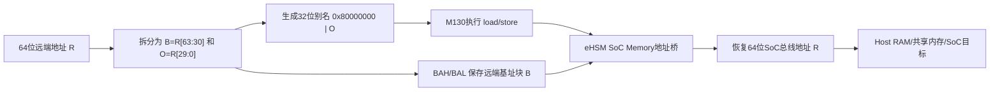
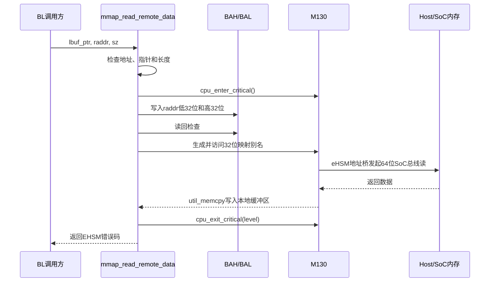
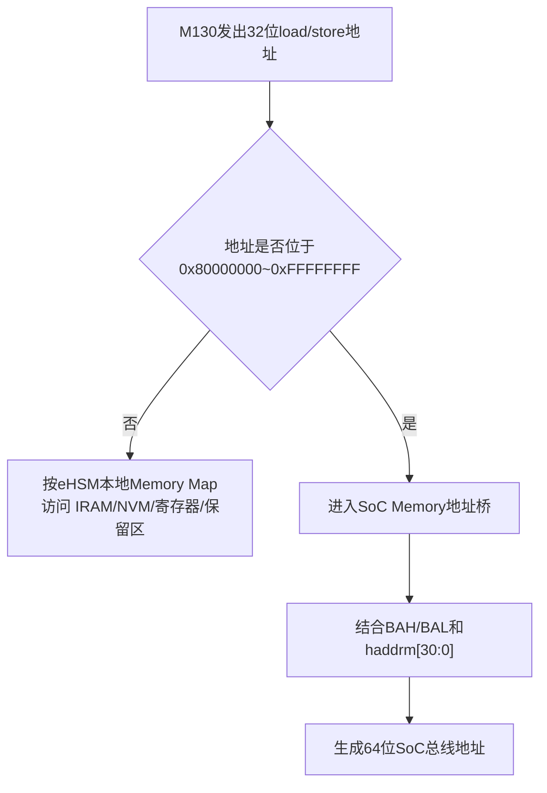

# Bootloader M130 远端地址映射机制深度解析

> 主Review索引：[`03_bootloader_deep_review.md`](03_bootloader_deep_review.md)。

## 1. 文档目标与分析范围

本文面向 `ehsm_bl-2.3.5-4019-72f8fdc`，解释 Wing-M130 如何通过 eHSM 的 `SoC Memory` 映射窗口访问 Host/SoC 侧 64 位地址，并对 `mmap_remap_addr_u64()`、`mmap_remap_addr_u32()`、`mmap_read_remote_data()` 和 `mmap_write_remote_data()` 进行代码级分析。

本文重点回答以下问题：

1. 32 位 M130 为什么不能直接使用 64 位 Host/SoC 地址。
2. `SYS_SOC_MEM_BAL`、`SYS_SOC_MEM_BAH` 和 M130 本地映射地址分别保存哪部分信息。
3. `MEMREMAP_BIT` 和 `MASK_BIT` 为什么分别设置 bit31、清除 bit30。
4. eHSM 硬件如何把 M130 发出的 32 位地址还原成 64 位 SoC 总线地址。
5. 32 位范围内的远端地址与相同数值的本地地址如何区分。
6. 映射指针为什么具有临时性，代码为什么需要进入临界区。
7. 当前实现还需要关注哪些地址校验、并发和硬件时序问题。

分析依据：

- [`mmap.c`](../../ehsm_bl-2.3.5-4019-72f8fdc/src/driver/mmap.c) 和 [`mmap.h`](../../ehsm_bl-2.3.5-4019-72f8fdc/src/driver/mmap.h)。
- [`types.h`](../../ehsm_bl-2.3.5-4019-72f8fdc/inc/types.h) 中的 `raddr_t` 定义。
- [`port_m130.c`](../../ehsm_bl-2.3.5-4019-72f8fdc/src/driver/cpu/m130/port/port_m130.c) 中的临界区实现。
- [`schedule.c`](../../ehsm_bl-2.3.5-4019-72f8fdc/src/component/schedule.c) 和 [`mbcmd_parser.c`](../../ehsm_bl-2.3.5-4019-72f8fdc/src/component/mbcmd_parser.c) 中的调用场景。
- [`OSR eHSM HP Technical Reference Manual`](../OSR_eHSM_HP_Technical_Reference_Manual_CN.pdf)，重点参考 CPU Memory Map 以及 `SYS_SOC_MEM_BAL`、`SYS_SOC_MEM_BAH` 寄存器章节。
- [`Wing-M130 Integration Manual`](../CPU/Wing-M130_Integration_Manual.pdf)，重点参考 Master 接口和 32 位 Memory Map 说明。

## 2. 核心结论

1. M130 使用 32 位指针和 32 位地址空间，不能在软件指针中直接保存任意 64 位 Host/SoC 地址。
2. eHSM 提供 `0x8000_0000~0xFFFF_FFFF` 的 `SoC Memory` 窗口。M130 对该窗口执行普通 load/store 时，eHSM 地址桥接逻辑会生成 64 位 SoC 总线地址。
3. `SYS_SOC_MEM_BAH/BAL` 保存目标远端地址；M130 本地窗口地址只携带目标地址的低 30 位块内偏移，以及一个跨 1 GB 边界的进位位。
4. `mmap_remap_addr_u64()` 本身只负责拆分 64 位地址；真正配置硬件和生成本地别名地址的是 `mmap_remap_addr_u32()`。
5. 返回的 `remap_addr` 不是独立、永久有效的普通指针。它的含义取决于当前 `SYS_SOC_MEM_BAH/BAL`，后续重新映射会改变同一指针实际访问的远端地址。
6. `mmap_read_remote_data()` 在临界区内完成“配置映射寄存器 + 使用窗口复制数据”，用于避免中断路径修改全局映射状态。
7. 即使远端地址小于 4 GB，也仍需要映射。硬件根据 M130 实际发出的地址落在本地地址区还是 `SoC Memory` 窗口区来选择访问路径，而不是根据 C 变量类型或远端地址是否超过 32 位来判断。

## 3. 先区分四种地址

| 名称 | 位宽 | 示例 | 含义 |
|---|---:|---|---|
| 远端地址 `raddr` | 64 位 | `0x00000012_D2345678` | Host/SoC 侧目标物理地址 |
| 映射基地址寄存器 | 64 位组合 | `BAH=0x12`、`BAL=0xD2345678` | eHSM 地址桥保存的远端地址信息 |
| M130 映射别名地址 | 32 位 | `0x92345678` | M130 实际执行 load/store 的地址 |
| 最终 SoC 总线地址 | 64 位 | `0x00000012_D2345678` | eHSM 地址桥根据寄存器和别名地址生成的总线地址 |

`raddr_t` 在代码中定义为：

```c
typedef uint64_t raddr_t;
```

这表示接口可以描述 64 位 Host/SoC 地址，但不表示 M130 可以把该值直接转换成普通指针并访问。M130 最终仍需要一个 32 位本地别名地址触发硬件转换。

## 4. 该机制属于 M130 还是 eHSM

这套机制由 M130 和 eHSM 子系统共同完成，但地址扩展和重映射功能属于 **eHSM 的系统集成设计**，不是 RISC-V 标准功能，也不是 Wing-M130 的通用 CPU CSR。

| 层次 | 职责 |
|---|---|
| Wing-M130 CPU | 执行 load/store，向外发出 32 位地址 `haddrm[31:0]` |
| eHSM Memory Map | 将 `0x8000_0000~0xFFFF_FFFF` 识别为 `SoC Memory` 地址窗口 |
| eHSM 系统寄存器 | 通过 `SYS_SOC_MEM_BAL/BAH` 保存远端地址基址 |
| eHSM 地址桥接逻辑 | 将 32 位 `haddrm` 与基地址寄存器组合成 64 位 SoC 总线地址 |
| Host/SoC 互联 | 根据最终 64 位地址访问 Host RAM、共享内存或 SoC 外设 |

手册将 `SYS_SOC_MEM_BAL/BAH` 称为“系统 CSR”，但它们不是通过 RISC-V `csrr/csrw` 指令访问的 CPU CSR，而是 eHSM 系统控制模块中的内存映射寄存器。BL 使用普通 MMIO 读写访问它们。

## 5. `MEMREMAP_REG_BASE` 的实际含义

代码定义为：

```c
typedef struct {
    uint32_t sys_soc_mem_ba_l;
    uint32_t sys_soc_mem_ba_h;
} mmap_reg_st;

static inline volatile mmap_reg_st *get_mmap_reg_base(void)
{
    return (volatile mmap_reg_st *)(0x30003800U);
}

#define MEMREMAP_REG_BASE get_mmap_reg_base()
```

`MEMREMAP_REG_BASE` 不是单个寄存器，而是指向两个连续 MMIO 寄存器的结构体指针：

| MMIO 地址 | 寄存器 | 代码字段 | 功能 |
|---|---|---|---|
| `0x3000_3800` | `SYS_SOC_MEM_BAL` | `sys_soc_mem_ba_l` | SoC Memory 访问基地址低 32 位 |
| `0x3000_3804` | `SYS_SOC_MEM_BAH` | `sys_soc_mem_ba_h` | SoC Memory 访问基地址高 32 位 |

因此：

```c
MEMREMAP_REG_BASE->sys_soc_mem_ba_h = raddr_h;
```

本质上是向 `0x3000_3804` 执行一次 32 位 MMIO 写操作。

`CONFIG_UNIT_TEST` 下，代码将寄存器基地址替换成普通静态结构体 `ut_reg`，使地址拆分和寄存器读回逻辑能够在不访问真实硬件的环境中测试。

## 6. 地址转换原理

### 6.1 将远端地址拆成 1 GB 基址块和块内偏移

设目标远端地址为：

```text
R = raddr[63:0]
```

将其按 1 GB，也就是 `2^30` 字节拆分：

```text
远端基址块 B = R[63:30] = R >> 30
块内偏移   O = R[29:0]  = R & 0x3FFF_FFFF
```

因此任意远端地址都可以表示为：

```text
R = (B << 30) + O
```

其中：

- `B` 决定目标位于哪个 1 GB 地址块。
- `O` 决定目标在该 1 GB 块中的具体字节偏移。

### 6.2 映射寄存器保存远端基址信息

软件将远端地址完整写入：

```text
SYS_SOC_MEM_BAH = R[63:32]
SYS_SOC_MEM_BAL = R[31:0]
```

虽然 `BAL` 保存完整低 32 位，但硬件在生成总线高位时只使用：

```text
{SYS_SOC_MEM_BAH[31:0], SYS_SOC_MEM_BAL[31:30]}
```

这恰好等于远端地址的 `R[63:30]`，也就是 1 GB 基址块编号 `B`。

### 6.3 M130 本地别名地址保存块内偏移

BL 使用：

```c
#define MEMREMAP_BIT (0x1U << 31)
#define MASK_BIT     (0x1U << 30)

remap_addr = (uint8_t *)((raddr_l | MEMREMAP_BIT) & ~MASK_BIT);
```

等价形式为：

```c
remap_addr = (uint8_t *)(0x80000000U | (raddr_l & 0x3FFFFFFFU));
```

形成的 M130 地址布局为：

```text
31             30 29                                               0
+----------------+--------------------------------------------------+
| SoC窗口选择=1 | 初始进位=0 |       远端地址块内偏移 R[29:0]       |
+----------------+--------------------------------------------------+
```

初始 `remap_addr` 一定位于：

```text
0x8000_0000~0xBFFF_FFFF
```

### 6.4 eHSM 硬件还原 64 位地址

eHSM 手册给出的转换公式为：

```text
SoC总线地址[63:30]
    = {soc_mem_bah[31:0], soc_mem_bal[31:30]}
      + {33'h0, haddrm[30]}

SoC总线地址[29:0]
    = haddrm[29:0]
```

其中 `haddrm[31:0]` 是 M130 发出的 32 位地址。

把前面的符号代入，可以写成：

```text
SoC总线地址
    = ((B + haddrm[30]) << 30) | haddrm[29:0]
```

初始映射地址满足：

```text
haddrm[30]   = 0
haddrm[29:0] = O
```

因此：

```text
SoC总线地址 = (B << 30) | O = R
```

这就是 64 位远端地址被完整恢复的原因。

### 6.5 总体数据流



## 7. `mmap_remap_addr_u64()` 与 `mmap_remap_addr_u32()`

### 7.1 `mmap_remap_addr_u64()` 只负责拆分

```c
uint8_t *mmap_remap_addr_u64(raddr_t raddr)
{
    return mmap_remap_addr_u32(raddr_get_high(raddr),
                               raddr_get_low(raddr));
}
```

拆分结果为：

```text
raddr_h = raddr[63:32]
raddr_l = raddr[31:0]
```

该函数没有独立的映射状态，也没有直接执行数据复制。

### 7.2 `mmap_remap_addr_u32()` 完成硬件配置

函数执行顺序为：

```text
检查64位地址是否为0
        │
        ▼
写SYS_SOC_MEM_BAL/BAH
        │
        ▼
读回并与写入值比较
        │
        ├─ 不一致：返回NULL
        │
        └─ 一致：生成0x8xxxxxxx~0xBxxxxxxx别名地址
```

寄存器读回检查用于确认写操作已经成功：

```c
if (MEMREMAP_REG_BASE->sys_soc_mem_ba_l != raddr_l ||
    MEMREMAP_REG_BASE->sys_soc_mem_ba_h != raddr_h) {
    remap_addr = NULL;
}
```

需要注意，源码注释称低地址值应从 `sys_soc_mem_ba_l` 读出后用于生成指针，但当前实现实际仍使用参数 `raddr_l`。由于前面已经检查寄存器读回值与 `raddr_l` 完全一致，正常情况下两者结果相同；不过注释与实现形式并不完全一致。

## 8. `mmap_read_remote_data()` 逐步解析

函数原型：

```c
uint32_t mmap_read_remote_data(void *lbuf_ptr,
                               raddr_t raddr,
                               uint32_t sz);
```

参数含义：

| 参数 | 含义 |
|---|---|
| `lbuf_ptr` | eHSM 本地目标缓冲区 |
| `raddr` | Host/SoC 侧 64 位源地址 |
| `sz` | 读取字节数，要求小于 1 GB |

数据方向为：

```text
Host/SoC远端内存 --读取--> eHSM本地缓冲区
```

执行过程：



### 8.1 参数检查

```c
if ((0UL == raddr) ||
    (NULL == lbuf_ptr) ||
    (sz >= MMAP_MAX_SIZE))
```

当前检查保证：

- 远端地址不为 0。
- 本地目标指针不为 `NULL`。
- 单次访问长度严格小于 1 GB。

`sz == 0` 没有被拒绝，当前流程会建立映射、执行零长度复制并返回成功。

### 8.2 临界区覆盖整个映射生命周期

```c
level = cpu_enter_critical();
remap_addr = mmap_remap_addr_u64(raddr);

if (NULL != remap_addr) {
    util_memcpy(lbuf_ptr, remap_addr, sz);
}

cpu_exit_critical(level);
```

`cpu_enter_critical()` 清除 `mstatus.MIE` 并返回进入临界区前的 `mstatus`，`cpu_exit_critical()` 再恢复原值。这样既能阻止临界区中的普通中断，也能保持调用前原有的全局中断状态。

临界区必须覆盖数据复制，而不能只保护寄存器写入。原因是 `remap_addr` 的实际含义始终依赖当前 `BAH/BAL`；如果复制期间寄存器被改写，后续字节会从另一个远端地址读取。

### 8.3 返回值

| 返回值 | 触发条件 |
|---|---|
| `EHSM_ERR_SW_SUCCESS` | 映射成功并完成复制 |
| `EHSM_ERR_INVALID_ADDRESS` | 地址为 0、本地指针为 `NULL` 或长度不合法 |
| `EHSM_ERR_REMAP_FAILED` | 映射寄存器写入后读回不一致 |

`mmap_write_remote_data()` 使用相同机制，只是复制方向相反：

```text
eHSM本地缓冲区 --写入--> Host/SoC远端内存
```

## 9. 具体示例一：普通 64 位远端地址

目标远端地址：

```text
R = 0x00000012_D2345678
```

### 9.1 拆分并配置寄存器

```text
raddr_h = 0x00000012
raddr_l = 0xD2345678

SYS_SOC_MEM_BAH = 0x00000012
SYS_SOC_MEM_BAL = 0xD2345678
```

其中：

```text
R[31:30] = 2'b11
R[29:0]  = 0x12345678
```

### 9.2 生成 M130 别名地址

```text
(0xD2345678 | 0x80000000) & ~0x40000000
= 0x92345678
```

M130 实际访问的是：

```text
haddrm = 0x92345678
```

### 9.3 eHSM 硬件恢复地址

```text
haddrm[30]   = 0
haddrm[29:0] = 0x12345678

SoC地址[63:30]
    = {0x00000012, 2'b11} + 0

SoC地址[29:0]
    = 0x12345678
```

最终得到：

```text
SoC总线地址 = 0x00000012_D2345678
```

因此，M130 虽然只发出了 `0x92345678`，Host/SoC 总线上实际访问的仍是完整 64 位地址。

## 10. 具体示例二：远端地址小于 4 GB

假设 Host/SoC 远端地址为：

```text
R = 0x00000000_12345678
```

虽然该地址可以用 32 位整数表示，但它仍然不是 M130 本地地址。映射过程为：

```text
SYS_SOC_MEM_BAH = 0x00000000
SYS_SOC_MEM_BAL = 0x12345678
remap_addr      = 0x92345678
```

M130 必须访问 `0x92345678`，eHSM 地址桥才能将该请求路由到 Host/SoC 的 `0x00000000_12345678`。

如果软件直接执行：

```c
util_memcpy(lbuf_ptr, (void *)0x12345678, sz);
```

M130 发出的地址就是 `0x12345678`。该地址不在 `SoC Memory` 窗口中，eHSM 会按照本地 Memory Map 进行译码，可能命中本地资源或保留区，而不会自动理解为“Host 远端地址”。

两种访问的区别为：

| 访问意图 | M130 发出的地址 | 地址译码结果 |
|---|---|---|
| 直接访问本地 `0x12345678` | `0x12345678` | 按 eHSM 本地 Memory Map 译码 |
| 访问远端 `0x00000000_12345678` | `0x92345678` | 命中 `SoC Memory` 窗口并结合 BAH/BAL 转换 |

因此，硬件区分本地和远端的依据是 **M130 发出的地址区间**，不是远端地址的数值大小，也不是软件变量类型。

## 11. 具体示例三：同一别名可以对应不同远端地址

下面两个远端地址：

```text
R1 = 0x00000000_12345678
R2 = 0x00000012_D2345678
```

它们的低 30 位相同：

```text
R1[29:0] = R2[29:0] = 0x12345678
```

所以生成的 M130 别名地址也相同：

```text
remap_addr(R1) = 0x92345678
remap_addr(R2) = 0x92345678
```

但寄存器状态不同：

| 目标 | `SYS_SOC_MEM_BAH` | `SYS_SOC_MEM_BAL[31:30]` | M130 别名 |
|---|---:|---:|---:|
| `R1` | `0x00000000` | `2'b00` | `0x92345678` |
| `R2` | `0x00000012` | `2'b11` | `0x92345678` |

这说明：

> `remap_addr` 只保存块内偏移，不能单独标识远端地址；完整目标由“当前 BAH/BAL + remap_addr”共同决定。

如果调用方保存 `remap_addr`，随后其他代码重新配置 BAH/BAL，再使用旧指针，访问目标就会发生变化。

## 12. 具体示例四：跨 1 GB 边界

假设从以下地址读取 32 字节：

```text
R  = 0x00000012_7FFFFFF0
sz = 0x20
```

初始映射地址为：

```text
O = R[29:0] = 0x3FFFFFF0
remap_addr = 0xBFFFFFF0
```

前 16 字节：

```text
M130地址：0xBFFFFFF0~0xBFFFFFFF
haddrm[30] = 0

SoC地址：0x00000012_7FFFFFF0~0x00000012_7FFFFFFF
```

随后本地地址自然递增到：

```text
0xC0000000
```

此时：

```text
haddrm[30] = 1
```

硬件将远端 1 GB 基址块加一，后 16 字节继续访问：

```text
SoC地址：0x00000012_80000000~0x00000012_8000000F
```

整个访问在 Host/SoC 侧保持连续。

本地窗口可理解为：

| M130 地址区间 | `haddrm[30]` | 远端地址块 |
|---|---:|---|
| `0x8000_0000~0xBFFF_FFFF` | 0 | `B` |
| `0xC000_0000~0xFFFF_FFFF` | 1 | `B + 1` |

`sz < 1 GB` 且初始块内偏移小于 1 GB，因此一次复制最多跨越一次 1 GB 边界，不会让 32 位本地别名地址越过 `0xFFFF_FFFF` 后回绕。

## 13. 本地地址与远端地址的硬件区分

eHSM Memory Map 将 `0x8000_0000~0xFFFF_FFFF` 定义为 `SoC Memory`。可以将地址译码过程简化理解为：



示例：

| 操作 | M130 指针 | 结果 |
|---|---:|---|
| 访问 eHSM IRAM，例如 `0x78001000` | `0x78001000` | 直接命中本地 IRAM |
| 访问远端 `0x00000000_12345678` | `0x92345678` | 经地址桥还原成远端地址 |
| 访问远端 `0x00000012_D2345678` | `0x92345678` | 同一别名结合另一组 BAH/BAL，得到另一远端地址 |

`0x8000_0000~0xFFFF_FFFF` 已作为 `SoC Memory` 窗口使用，所以该范围不能同时作为普通 eHSM 本地 SRAM 地址使用。地址空间的职责由硬件 Memory Map 预先确定。

## 14. 为什么需要临界区

`SYS_SOC_MEM_BAH/BAL` 是一组共享映射寄存器，不是每个指针、每个函数或每个调用者独占一份。

考虑下面的错误时序：

```text
主流程：设置BAH/BAL映射到远端A
主流程：得到别名指针0x92345678
                  │
                  ├── 发生中断
                  │
中断处理：设置BAH/BAL映射到远端B
中断返回
                  │
主流程：使用0x92345678复制数据
                  │
                  └── 实际访问远端B
```

因此正确的原子区间是：

```text
关闭普通中断
    ↓
配置BAH/BAL
    ↓
生成映射别名
    ↓
完成所有load/store或memcpy
    ↓
恢复进入临界区前的中断状态
```

只保护寄存器写入而不保护后续访问是不够的。

`mmap_read_remote_data()` 和 `mmap_write_remote_data()` 已经封装该临界区。直接调用 `mmap_remap_addr_u64/u32()` 的代码必须自行保证：

1. 映射到使用结束之间没有其他路径修改 BAH/BAL。
2. 使用结束后不继续保存或复用旧指针。
3. 映射失败返回 `NULL` 时不执行内存访问。

## 15. BL 中的典型调用路径

Mailbox 调度路径通过该接口从 Host 共享内存读取命令：

```text
sch_poll_mb_chl()
    ↓
mailbox_read()
    ↓
sch_handle_mb_data()
    ↓
mmap_read_remote_data(&cmd_addr, addr, sizeof(cmd_addr_st))
    ↓
sch_handle_packet()
    ↓
mmap_read_remote_data(&packet.cmd_data, cmd_addr.req_addr, ...)
    ↓
mbcmdpars_parse_cmd()
```

响应方向则由 `sch_send_gen_mbox_rsp()` 直接建立映射，并在显式临界区内将响应复制到 `packet->rsp_addr`。

其他使用场景还包括：

- 固件镜像头和镜像数据读取。
- Debug Auth 公钥、签名和权限位图读取。
- 固件升级数据读取。
- 开发/测试生命周期下的 OTP 和寄存器读写命令。
- Crypto 库通过 `lib_addr_arch32_lock_remap()` 访问高低 32 位形式的输入输出地址。

这些地址通常来自 Host 命令或镜像描述，应作为不可信输入进行边界和权限审查。

## 16. 代码审查关注点

### 16.1 已实现的保护

| 保护项 | 当前实现 |
|---|---|
| 远端零地址检查 | `raddr == 0` 返回错误 |
| 本地空指针检查 | `lbuf_ptr == NULL` 返回错误 |
| 单次长度限制 | `sz < 1 GB` |
| 寄存器写入检查 | 写入 BAH/BAL 后读回比较 |
| 中断并发保护 | read/write helper 在临界区内完成映射和复制 |
| 映射失败处理 | 返回 `EHSM_ERR_REMAP_FAILED` |

### 16.2 当前 helper 没有完成的检查

| 检查项 | 当前状态 | 需要谁保证 |
|---|---|---|
| `raddr + sz` 是否发生 64 位溢出 | 未检查 | 调用方或 helper 增强 |
| 远端区间是否位于允许访问的共享内存 | 未检查 | 协议层、平台层或安全策略 |
| 本地缓冲区是否至少有 `sz` 字节 | 未检查 | 调用方 |
| 远端区间是否跨越禁止访问区域 | 未检查 | 调用方或地址访问控制模块 |
| `sz == 0` 是否应视为参数错误 | 当前允许 | 接口语义需要明确 |
| 写寄存器后是否需要显式 `fence` | 源码无显式屏障 | 需结合 M130/eHSM 总线时序确认 |

### 16.3 直接调用 remap API 的风险

`mbcmd_parser.c` 中的 OTP 读写和寄存器读写处理函数直接调用 `mmap_remap_addr_u64()`，没有复用 `mmap_read_remote_data()` 或 `mmap_write_remote_data()` 的统一保护。当前代码需要重点确认：

1. 这些路径执行期间是否可能被其他使用 remap 寄存器的中断打断。
2. `mmap_remap_addr_u64()` 返回 `NULL` 后，下层函数是否仍可能解引用该指针。
3. `size` 是否受 1 GB 限制以及目标区间是否完整校验。
4. 生命周期限制是否足以覆盖所有非预期访问场景。

这属于待验证的审查点，不能仅凭函数名或当前调度方式直接判定为可利用漏洞。

### 16.4 临界区过长问题

`mmap_read_remote_data()` 在整个 `util_memcpy()` 期间关闭普通中断。复制长度越大，中断关闭时间越长，可能影响：

- Watchdog 喂狗和超时响应。
- UART 或其他实时外设中断延迟。
- Mailbox 命令响应时延。

当前实际调用尺寸通常远小于 1 GB，但 review 时应按各调用点确认最大长度，而不能只依赖 helper 的理论上限。

## 17. 与 RV64 CPU 直接 MMIO 的区别

以 C908 RV64 访问 64 位 SoC 地址为对照：

| 维度 | M130/eHSM remap | C908 RV64 直接 MMIO |
|---|---|---|
| CPU 软件模型 | RV32 | RV64 |
| 指针宽度 | 32 位 | 64 位 |
| 完整 SoC 地址是否存入指针 | 否 | 是 |
| 地址高位来源 | `SYS_SOC_MEM_BAH/BAL` | CPU 64 位地址寄存器/物理地址接口 |
| 是否需要别名窗口 | 是 | 否 |
| 指针是否依赖全局映射状态 | 是 | 否 |
| 是否需要保护映射寄存器 | 是 | 不涉及该映射寄存器 |

M130 的 `remap_addr` 是访问远端地址的“触发别名”，C908 的 64 位指针则可以直接表达目标 SoC 地址。两者不能仅根据一次 load/store 读取的数据宽度进行判断。

## 18. Review 检查清单

- [ ] 确认芯片实际 eHSM Memory Map 与手册中的 `0x8000_0000~0xFFFF_FFFF` 一致。
- [ ] 确认 `SYS_SOC_MEM_BAL/BAH` 的复位值、访问权限和生命周期限制。
- [ ] 确认写 BAH/BAL 后无需额外总线 `fence` 或等待周期。
- [ ] 确认跨 1 GB 边界时 `haddrm[30]` 的加一行为与 RTL 实现一致。
- [ ] 枚举所有 `mmap_remap_addr_u64/u32()` 直接调用点并检查临界区。
- [ ] 检查所有 `mmap_read_remote_data()` 调用点的本地缓冲区容量。
- [ ] 检查所有远端地址和长度是否限制在授权的 Host 共享内存范围。
- [ ] 检查 `raddr + sz` 的整数溢出和地址区间回绕。
- [ ] 明确 `sz == 0` 的接口预期。
- [ ] 对同一别名切换不同 BAH/BAL 的行为增加硬件或仿真验证。
- [ ] 对跨 1 GB 边界的小尺寸读写增加定向测试。
- [ ] 评估大尺寸复制关闭中断的最长时间和系统影响。

## 19. 总结

M130 访问 64 位 Host/SoC 地址的本质可以归纳为：

```text
远端64位地址
    = 1 GB基址块 B + 块内偏移 O

BAH/BAL保存 B
M130的0x8xxxxxxx别名保存 O
eHSM地址桥将二者重新组合成远端64位地址
```

其中：

- bit31 用于使 M130 访问进入 `SoC Memory` 窗口。
- bit30 初始清零，在连续复制跨越 1 GB 边界时作为基址块加一的进位。
- bit29:0 保存远端地址在 1 GB 块中的偏移。
- BAH/BAL 保存远端地址的基址块信息。

所以 `mmap_remap_addr_u64()` 返回的不是一个自包含的 64 位远端指针，而是一个依赖当前 eHSM 映射寄存器状态的 32 位别名。正确使用方式必须把“配置映射、访问数据、释放保护”视为一个不可被其他映射操作打断的完整过程。
