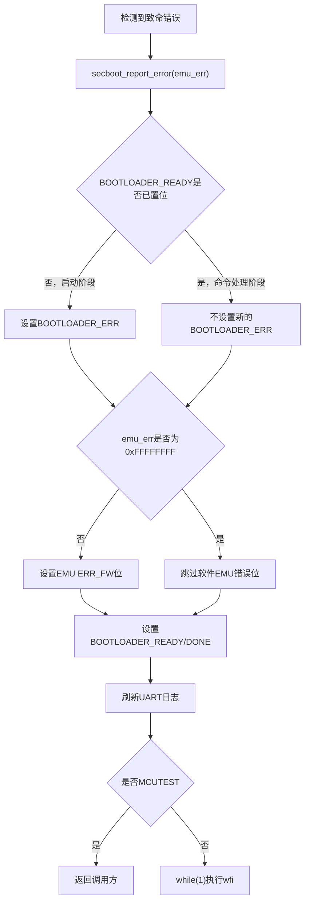

# Bootloader `secboot_report_error()` 错误收敛机制深度解析

> 主Review索引：[`03_bootloader_deep_review.md`](03_bootloader_deep_review.md)。

## 1. 文档目标与分析范围

本文面向 `ehsm_bl-2.3.5-4019-72f8fdc`，详细分析 [`secure_boot.c`](../../ehsm_bl-2.3.5-4019-72f8fdc/src/component/secure_boot.c) 中的 `secboot_report_error()`。

本文重点回答以下问题：

1. `secboot_report_error()` 在 BL 启动状态机中的职责是什么。
2. 为什么发生错误后仍然设置 `SYS_STA0_BOOTLOADER_READY`。
3. `SYS_STA0_BOOTLOADER_READY` 和 `SYS_STA0_BOOTLOADER_ERR` 如何组合表达启动结果。
4. 参数 `emu_err` 是普通错误返回值，还是 EMU 错误位编号。
5. `EMU_FW_0_REG`、`EMU_FW_1_REG` 如何记录 64 类软件错误。
6. `DO_NOT_TRIGGLER_FW_ERROR` 的语义和当前使用情况是什么。
7. 非 `MCUTEST` 生命周期为什么进入 `while (1) + wfi`，CPU 是否真的完全停止。
8. 自检、Watchdog、FID、CPU 异常和 OTP 初始化失败如何进入该函数。
9. 当前实现有哪些需要进一步验证或改进的安全审查点。

分析依据：

- [`secure_boot.c`](../../ehsm_bl-2.3.5-4019-72f8fdc/src/component/secure_boot.c)。
- [`sysreg.c`](../../ehsm_bl-2.3.5-4019-72f8fdc/src/driver/sysreg.c) 和 [`sysreg.h`](../../ehsm_bl-2.3.5-4019-72f8fdc/src/driver/sysreg.h)。
- [`emu.c`](../../ehsm_bl-2.3.5-4019-72f8fdc/src/driver/emu.c) 和 [`emu.h`](../../ehsm_bl-2.3.5-4019-72f8fdc/src/driver/emu.h)。
- [`watchdog.c`](../../ehsm_bl-2.3.5-4019-72f8fdc/src/driver/watchdog.c)。
- [`port_m130.c`](../../ehsm_bl-2.3.5-4019-72f8fdc/src/driver/cpu/m130/port/port_m130.c)。
- [`fid.c`](../../ehsm_bl-2.3.5-4019-72f8fdc/fid_lib/src/fid.c) 和 [`fid.h`](../../ehsm_bl-2.3.5-4019-72f8fdc/fid_lib/inc/fid.h)。
- [`OSR eHSM Bootloader TRM`](../OSR_eHSM_Bootloader_TRM_4019_1.1.pdf)，重点参考 2.2 节错误处理。
- [`OSR eHSM HP TRM`](../OSR_eHSM_HP_Technical_Reference_Manual_CN.pdf)，重点参考 `SYS_HSM_STA0` 和 EMU 寄存器章节。
- 当前 `build_codex/ehsm_bl.elf`、`ehsm_bl.dis` 和构建配置快照。

## 2. 函数源码

```c
#define DO_NOT_TRIGGLER_FW_ERROR 0xffffffffu // used for hw error

void secboot_report_error(uint32_t emu_err)
{
    uint32_t status = 0;
    sysreg_get_status(0, &status);
    if ((status & SYS_STA0_BOOTLOADER_READY) == 0) {
        // set bootloader_err if bootloader_ready is not set
        // if bootloader_ready is set, bootloader_err will not set
        sysreg_set_status(0, SYS_STA0_BOOTLOADER_ERR);
    }
    if (emu_err != DO_NOT_TRIGGLER_FW_ERROR) {
        emu_trigger_fw_error(emu_err);
    }
    sysreg_set_status(0, SYS_STA0_BOOTLOADER_READY);

    log_flush();
    // do not block in test mode
    if (sysreg_get_life_cycle() != SYS_STA0_LIFECYCLE_MCUTEST) {
        while (1) {
            asm("wfi");
        }
    }
}
```

## 3. 核心结论

1. `secboot_report_error()` 是 BL 的**致命错误收敛入口**，不只是“记录一条日志”。
2. 它同时处理三类外部可见结果：`SYS_HSM_STA0` 启动状态、EMU 软件错误位图和 CPU 后续执行状态。
3. `emu_err` 是 `0~63` 的 **EMU 软件错误位编号**，不是 `EHSM_ERR_*` 风格的函数返回码。
4. 如果错误发生在 BL 启动完成之前，函数设置 `bootloader_err=1`，再设置 `bootloader_done/ready=1`，通知 SoC“BL 启动流程已经结束，但结果失败”。
5. 如果错误发生在 BL 命令处理阶段，也就是 `bootloader_done/ready` 已经为 1，则不再设置 `bootloader_err`，具体错误依赖 EMU 位图上报。
6. 除 `MCUTEST` 外，函数不返回，而是持续执行 `wfi`；即使被中断唤醒，外层无限循环也不会恢复正常 BL 流程。
7. `MCUTEST` 下函数会返回，但调用方能否继续运行取决于调用链。FID panic 和同步 CPU 异常并不一定能真正恢复。
8. 当前源码共有 5 个直接调用点：自检失败、Watchdog 超时、FID panic、CPU 异常和 OTP 初始化失败。
9. `DO_NOT_TRIGGLER_FW_ERROR` 在当前 C 源码中没有调用者，只体现了“硬件错误已由硬件上报时，软件不重复设置 ERR_FW”的预留意图。

## 4. 它在 BL 状态机中的位置

BL 正常启动的关键路径为：

```text
secboot_entry()
    ↓
CPU/DRAM/OTP初始化
    ↓
Watchdog、UART、Mailbox初始化
    ↓
算法自检
    ↓
SYS_STA0_BOOTLOADER_READY = 1
    ↓
sch_start()进入命令处理循环
```

致命错误路径则收敛到：



该设计与 Bootloader TRM 2.2 节“处理方式 2”一致：

- 启动阶段发生错误：拉起 `bootloader_err` 和 `bootloader_done`，然后 Hold CPU。
- 命令处理阶段发生错误：Hold CPU，但不再拉起 `bootloader_err`。
- TEST MODE：错误处理函数尝试返回，继续后续测试流程。

## 5. 第一步：读取当前启动状态

```c
uint32_t status = 0;
sysreg_get_status(0, &status);
```

`index=0` 对应 `SYS_HSM_STA0`：

```c
#define SYS_REG_BASE     0x30000000UL
#define SYS_STA_REG_BASE (SYS_REG_BASE + 0x1000U)
```

因此实际读取地址为：

```text
SYS_HSM_STA0 = 0x3000_1000
```

相关字段为：

| bit | 代码名 | 手册名 | 含义 |
|---:|---|---|---|
| 18 | `SYS_STA0_BOOTLOADER_READY` | `bootloader_done` | Bootloader 启动过程结束 |
| 19 | `SYS_STA0_BOOTLOADER_ERR` | `bootloader_err` | Bootloader 启动过程失败 |
| 24 | `SYS_STA0_LIFECYCLE_MCUTEST` | `hsm_lc_test` | 当前为 TEST/MCUTEST 生命周期 |
| 25~30 | 其他生命周期位 | DEVELOP/MANUFACTURE/USER/DEBUG/DESTROY/UNNORMAL | 决定是否进入 Hold 状态 |

代码使用 `READY`，手册使用 `done`，两者对应同一个 bit18。这里的“READY”更准确地表示“BL 启动阶段已经结束”，并不单独表示启动成功。

## 6. 第二步：仅在启动阶段设置 `BOOTLOADER_ERR`

```c
if ((status & SYS_STA0_BOOTLOADER_READY) == 0) {
    sysreg_set_status(0, SYS_STA0_BOOTLOADER_ERR);
}
```

判断依据只有调用前的 bit18：

```text
READY=0：错误发生在BL启动阶段
READY=1：错误发生在BL命令处理阶段或启动完成之后
```

对应状态真值表：

| 调用前 READY | 调用前 ERR | 函数是否设置 ERR | 函数结束后的 READY | 函数结束后的 ERR |
|---:|---:|---:|---:|---:|
| 0 | 0 | 是 | 1 | 1 |
| 0 | 1 | 是，重复置位 | 1 | 1 |
| 1 | 0 | 否 | 1 | 0 |
| 1 | 1 | 否，但原值保留 | 1 | 1 |

因此 `BOOTLOADER_ERR` 的语义不是“BL 运行期间发生过任何错误”，而是：

> BL 在完成启动握手前发生致命错误。

运行阶段错误主要通过 EMU 软件错误位通知 SoC。

## 7. `sysreg_set_status()` 如何设置状态位

BL 的实现为：

```c
void sysreg_set_status(uint32_t index, uint32_t status)
{
    uint32_t write_flag_arr[] = {
        SYS_STA0_WRITE_FLAG,
        SYS_STA1_WRITE_FLAG,
        SYS_STA2_WRITE_FLAG,
        SYS_STA3_WRITE_FLAG
    };
    uint32_t write_flag;
    uint32_t sta;

    if (index <= 3) {
        write_flag = write_flag_arr[index];
        sta = *((volatile uint32_t *)(SYS_STA_REG_BASE + index * 4U)) | write_flag;
        *((volatile uint32_t *)(SYS_STA_REG_BASE + index * 4U)) = (sta | status);
    }
}
```

`SYS_HSM_STA0[7:0]` 是写有效字段，必须写入 `0x65`，对 RWP 状态位的更新才有效：

```c
#define SYS_STA0_WRITE_FLAG 0x65U
```

该 helper 的软件行为是“读取原值，再 OR 新状态位”，因此当前接口只能累积置位，不提供清除 `READY/ERR` 的路径。

需要注意：

1. BL 版本没有对状态写入进行读回校验。
2. `sysreg_set_status()` 的读改写过程没有临界区保护。
3. 如果多个上下文并发更新不同状态位，需结合硬件 RWP 语义确认是否可能出现更新丢失。

## 8. 第三步：把错误编号映射到 EMU 位图

```c
if (emu_err != DO_NOT_TRIGGLER_FW_ERROR) {
    emu_trigger_fw_error(emu_err);
}
```

### 8.1 `emu_err` 不是普通返回码

`emu_err` 表示 64 位 EMU 软件错误向量中的 bit index：

```text
0~31  → EMU ERR_FW_0[31:0]
32~63 → EMU ERR_FW_1[31:0]
```

寄存器地址为：

| 地址 | 代码名 | 功能 |
|---|---|---|
| `0x3010_0010` | `EMU_FW_0_REG` | 固件错误 bit 0~31 |
| `0x3010_0014` | `EMU_FW_1_REG` | 固件错误 bit 32~63 |

### 8.2 具体映射逻辑

```c
uint32_t emu_trigger_fw_error(uint32_t err)
{
    uint32_t ret = EHSM_ERR_SW_SUCCESS;

    if (err < 32) {
        uint32_t level = cpu_enter_critical();
        EMU_FW_0_REG |= (1U << err);
        cpu_exit_critical(level);
    } else if (err < 64) {
        uint32_t level = cpu_enter_critical();
        EMU_FW_1_REG |= (1U << (err - 32U));
        cpu_exit_critical(level);
    } else {
        ret = EHSM_ERR_PARAM_ERROR;
    }

    return ret;
}
```

映射公式为：

```text
if 0 <= emu_err < 32:
    ERR_FW_0[emu_err] = 1

if 32 <= emu_err < 64:
    ERR_FW_1[emu_err - 32] = 1
```

例如：

```text
FW_ERROR_WDG_TIMEOUT = 37

37 - 32 = 5
最终设置 EMU_FW_1_REG[5]
```

EMU 更新使用临界区保护寄存器的读改写，避免中断嵌套导致不同错误位相互覆盖。根据 eHSM TRM，这些错误为电平信号并发送给 SoC；Bootloader TRM 明确说明 BL 不主动清除对应错误位。

### 8.3 返回值被忽略

`emu_trigger_fw_error()` 对 `err >= 64` 返回 `EHSM_ERR_PARAM_ERROR`，但 `secboot_report_error()` 没有检查该返回值。

当前 5 个直接调用点传入的错误编号都在 `0~63` 内，因此不会触发该分支；未来新增调用点时仍应检查错误编号范围。

## 9. 第四步：无条件设置 `BOOTLOADER_READY`

```c
sysreg_set_status(0, SYS_STA0_BOOTLOADER_READY);
```

这是函数中最容易误解的一行。它不是在宣告“启动成功”，而是在宣告：

> Bootloader 启动阶段已经结束，SoC 不必继续等待；成功或失败还要结合 `BOOTLOADER_ERR` 判断。

启动成功：

```text
BOOTLOADER_READY/DONE = 1
BOOTLOADER_ERR        = 0
```

启动失败：

```text
BOOTLOADER_READY/DONE = 1
BOOTLOADER_ERR        = 1
EMU ERR_FW对应位      = 1
```

如果失败时只设置 `ERR` 而不设置 `READY/DONE`，SoC 侧等待启动完成的流程可能一直等待。当前顺序先设置错误状态和 EMU 位，最后设置 `READY`，体现了“先固化失败原因，再完成启动握手”的意图。

运行阶段发生错误时，`READY` 原本已经为 1，这次写入只是重复置位。

## 10. 第五步：刷新日志

```c
log_flush();
```

当前构建中等价于：

```c
debug_flush();
```

最终调用：

```c
void debug_flush(void)
{
    uart_flush();
}
```

目的是在 CPU Hold 之前尽量发完已经进入 UART 发送缓冲区的日志。

需要注意：

1. `secboot_report_error()` 自身没有统一打印 `emu_err`，主要依赖调用方先打印上下文。
2. OTP 初始化失败发生在 `uart_init()` 之前，但 `log_flush()` 仍会读取 UART 状态寄存器。
3. `uart_flush()` 会轮询 TX full 状态，没有超时机制；如果 UART 状态异常，错误路径可能停在日志刷新，而不是进入后续 `wfi`。
4. 状态寄存器和 EMU 位在 `log_flush()` 之前已经写入，因此即使日志刷新阻塞，SoC 仍可能看到错误状态。

## 11. 第六步：生命周期决定“返回”还是“Hold”

```c
if (sysreg_get_life_cycle() != SYS_STA0_LIFECYCLE_MCUTEST) {
    while (1) {
        asm("wfi");
    }
}
```

生命周期来自：

```c
return SYS_STA0_REG & SYS_STA0_LIFECYCLE_MASK;
```

行为矩阵为：

| 生命周期 | 是否设置状态/EMU | 是否刷新日志 | 是否进入无限 `wfi` | 函数是否返回 |
|---|---|---|---|---|
| MCUTEST | 是 | 是 | 否 | 是 |
| DEVELOP | 是 | 是 | 是 | 否 |
| MANUFACTURE | 是 | 是 | 是 | 否 |
| USER | 是 | 是 | 是 | 否 |
| DEBUG | 是 | 是 | 是 | 否 |
| DESTROY | 是 | 是 | 是 | 否 |
| UNNORMAL | 是 | 是 | 是 | 否 |

所以 TEST MODE 的“忽略错误”不是不记录错误，而是：

```text
仍设置状态位
仍设置EMU错误位
仍刷新日志
但secboot_report_error()自身不Hold CPU
```

## 12. `while (1) + wfi` 的准确含义

`wfi` 是 Wait For Interrupt，不等于关机、复位或永久时钟停止。

该循环表达的是：

```text
CPU进入等待
    ↓
如果因中断或实现定义事件退出等待
    ↓
重新执行下一次wfi
```

因此函数保证的是“正常 BL 控制流不再继续”，而不是保证“任何 ISR 都不再执行”。当前函数没有：

- 调用 `cpu_disable_global_int()`。
- 停止 Watchdog。
- 清除所有 pending 中断。
- 复位 eHSM 或 SoC。
- 擦除 RAM key、OTP shadow 或其他敏感状态。
- 将 CPU 跳转到 Boot ROM 的统一错误入口。

实际是否还能响应中断，取决于进入函数时的中断上下文、`mstatus.MIE`、CLIC pending/enable 状态和 M130 对 `wfi` 的实现。

当前 `build_codex/ehsm_bl.dis` 可以确认：

```text
0x10003A42: wfi
0x10003A46: jump 0x10003A42
```

即最终产物确实是一个两条指令构成的永久等待循环。

## 13. 5 个直接调用点

| 调用点 | 错误编号 | EMU 位 | 典型阶段 | 非 MCUTEST 结果 |
|---|---:|---|---|---|
| `secboot_set_self_test_emu_err()` | 0 | `ERR_FW_0[0]` | BL 启动阶段 | 设置 ERR+READY，Hold |
| `wdg_timeout_cb()` | 37 | `ERR_FW_1[5]` | 启动阶段或命令阶段 | 上报后在 WDT ISR 内 Hold |
| `fid_panic_callback()` | 44 | `ERR_FW_1[12]` | 任意受 FID 保护路径 | 上报后 Hold |
| `secboot_cpu_excpt_handler()` | 41 | `ERR_FW_1[9]` | 任意 CPU 异常 | 上报后在 trap 上下文 Hold |
| `secboot_entry()` 的 `otp_init()` 失败分支 | 43 | `ERR_FW_1[11]` | 最早期启动阶段 | 设置 ERR+READY，Hold |

### 13.1 算法自检失败

调用链：

```text
secboot_entry()
    ↓
secboot_do_self_test()
    ↓ ret != EHSM_ERR_SW_SUCCESS
secboot_set_self_test_emu_err()
    ├─ 可能设置 HASH失败 bit16
    ├─ 可能设置 SKE失败  bit17
    ├─ 可能设置 PKE失败  bit18
    ├─ 可能设置 TRNG失败 bit19
    └─ secboot_report_error(bit0: selftest summary)
```

自检错误采用“具体原因位 + 汇总位”两级上报：

| 错误 | EMU 位 |
|---|---|
| `FW_ERROR_SECBOOT_SELFTEST_FAIL` | `ERR_FW_0[0]` |
| `FW_ERROR_SELFTEST_HASH_FAIL` | `ERR_FW_0[16]` |
| `FW_ERROR_SELFTEST_SKE_FAIL` | `ERR_FW_0[17]` |
| `FW_ERROR_SELFTEST_PKE_FAIL` | `ERR_FW_0[18]` |
| `FW_ERROR_SELFTEST_TRNG_FAIL` | `ERR_FW_0[19]` |

具体位由 `secboot_set_self_test_emu_err()` 先设置，最后由 `secboot_report_error()` 设置汇总 bit0 并执行状态收敛。

### 13.2 Watchdog 超时

调用链：

```text
watchdog_int_handler()
    ↓
g_watchdog_cb() = wdg_timeout_cb()
    ↓
secboot_report_error(FW_ERROR_WDG_TIMEOUT)
```

Watchdog ISR 的顺序是：

```c
if (NULL != g_watchdog_cb) {
    g_watchdog_cb();
}
wdg_reg->isr = 0U;
```

非 MCUTEST 下，callback 不返回，因此 ISR 清除语句不会执行。当前 Watchdog 配置只置位 `REG_WDT_CTRL_INT_EN`，没有置位 `REG_WDT_CTRL_RESET_EN`，所以从当前驱动代码不能推导出超时后会自动复位。

MCUTEST 下，`secboot_report_error()` 返回，Watchdog ISR 才能继续清除 `isr` 并返回被中断流程。

### 13.3 FID 检测到故障注入

当前 `build_codex` 快照配置：

```text
FID_LEVEL=2，也就是 FID_LEVEL_HIGH
```

大量关键路径通过 `FID_EQ`、`FID_NOT_EQ`、双变量一致性检查和 `fid_panic()` 收敛到：

```text
fid_panic()
    ↓
fid_panic_callback()
    ↓
secboot_report_error(FW_ERROR_FAULT_INJECTION_DETECTED)
```

非 MCUTEST 下，`secboot_report_error()` 本身 Hold。

MCUTEST 下，`secboot_report_error()` 虽然返回，但 `fid_panic()` 随后仍执行 `fid_panic_loop()`，因此 FID panic 调用链仍然不会恢复正常业务流程。这与“TEST MODE 尝试继续”的一般描述存在例外，建议与 vendor 确认是否符合预期。

### 13.4 CPU 异常

调用链：

```text
M130异常
    ↓
default_trap_handler()
    ├─ 读取mcause
    ├─ 读取mepc
    └─ 取得当前sp
          ↓
secboot_cpu_excpt_handler(cause, epc, regs)
          ↓
secboot_report_error(FW_ERROR_CPU_EXCEPTION)
```

`secboot_cpu_excpt_handler()` 只打印 `mepc/mcause`，没有：

- 根据 cause 分类。
- 保存或上报完整寄存器现场。
- 调整 `mepc` 跳过故障指令。
- 区分可恢复异常和不可恢复异常。

非 MCUTEST 下，它在 trap 上下文中进入永久 `wfi`。

MCUTEST 下，它会返回到 trap handler；对于同步异常，由于 `mepc` 没有调整，执行 `mret` 后可能再次执行同一条故障指令并重复异常，不能简单理解为“异常已恢复”。

### 13.5 OTP 初始化失败

调用位置非常早：

```text
secboot_entry()
    ↓
cpu_platform_init()
    ↓
清零DRAM中的OTP初始化区域
    ↓
otp_init()
    ↓ 失败
secboot_report_error(FW_ERROR_INIT_OTP_FAILED)
```

此时以下模块尚未初始化：

- Watchdog。
- UART。
- OTP key map。
- EMU 的 `emu_init()`。
- Mailbox。
- 随机时钟。

当前 `emu_init()` 是空函数，`emu_trigger_fw_error()` 直接写 EMU 寄存器，因此 OTP 早期失败仍能设置 EMU 位。但若未来 `emu_init()` 增加必要配置，这条早期错误路径需要重新验证。

MCUTEST 下报告函数返回后，`secboot_entry()` 会继续执行后续依赖 OTP 的初始化和自检流程。这是测试生命周期特例，应确保不会在量产生命周期出现。

## 14. `DO_NOT_TRIGGLER_FW_ERROR` 的语义

```c
#define DO_NOT_TRIGGLER_FW_ERROR 0xffffffffu // used for hw error
```

如果调用：

```c
secboot_report_error(DO_NOT_TRIGGLER_FW_ERROR);
```

函数仍会：

1. 根据启动阶段决定是否设置 `BOOTLOADER_ERR`。
2. 设置 `BOOTLOADER_READY`。
3. 刷新日志。
4. 非 MCUTEST 下 Hold CPU。

唯一跳过的是：

```text
不写 EMU ERR_FW_0/ERR_FW_1
```

从注释可以推断，该值用于硬件错误已经通过 `ERR_HW_0/ERR_HW_1` 或传感器路径上报的场景，避免再制造一个软件错误位。这是基于代码和寄存器架构的推断。

当前可见 C 源码中没有任何调用点传入该值，`secboot_sensor_rsp()` 也没有调用 `secboot_report_error()`。因此需要 vendor 确认：

- 该 sentinel 是否只供补丁代码调用。
- Sensor/硬件错误中断是否由未交付 RTL、ROM 或 patch 接管。
- 当前为空的 `secboot_init_sensor()` 是否计划注册该路径。

宏名中的 `TRIGGLER` 是拼写错误，语义应为 `DO_NOT_TRIGGER_FW_ERROR`，但不影响编译结果。

## 15. MCUTEST 下的真实行为

`secboot_report_error()` 在 MCUTEST 下返回，但不同调用方的最终行为并不相同：

| 调用场景 | report返回后发生什么 | 能否继续 |
|---|---|---|
| 自检失败 | 返回 `secboot_do_self_test()`，`secboot_entry()` 忽略其返回值继续启动 | 可以继续尝试 |
| Watchdog 超时 | 返回 WDT ISR，清 pending 后返回原流程 | 可以继续 |
| OTP 初始化失败 | 返回 `secboot_entry()`，继续后续初始化 | 可以继续，但后续可能因 OTP 状态失败 |
| FID panic | 返回 `fid_panic()`，随后进入 `fid_panic_loop()` | 不能继续 |
| 同步 CPU 异常 | trap handler 返回，可能回到原故障指令 | 可能重复异常，不能视为已恢复 |

所以测试模式例外应理解为：

> `secboot_report_error()` 不主动 Hold CPU，但不保证所有上层调用链都具备恢复能力。

## 16. 错误位与 Hold 行为的分离

BL 中还存在两类警告：

```c
#define FW_WARN_UID_CRC_MISMATCH 62U
#define FW_WARN_VERSION_MISMATCH 63U
```

它们直接调用 `emu_trigger_fw_error()`，但不调用 `secboot_report_error()`，所以只设置 EMU 位并继续运行。

这说明架构上有两层独立语义：

| 操作 | 作用 |
|---|---|
| `emu_trigger_fw_error(bit)` | 记录并向 SoC 输出某个错误或警告位 |
| `secboot_report_error(bit)` | 记录错误、完成状态握手，并进入致命 Hold 流程 |

Bootloader TRM 将 EMU 低 48 位定义为错误位，将高 16 位定义为警告位。当前 `secboot_report_error()` 本身没有检查“参数必须小于 48”，但现有直接调用点均为低 48 位致命错误。

## 17. 完整时序示例

### 17.1 启动阶段自检失败

假设初始状态：

```text
BOOTLOADER_READY = 0
BOOTLOADER_ERR   = 0
```

执行过程：

```text
自检发现HASH失败
    ↓
设置 ERR_FW_0[16]
    ↓
secboot_report_error(0)
    ↓
读取 READY=0
    ↓
设置 BOOTLOADER_ERR=1
    ↓
设置 ERR_FW_0[0]
    ↓
设置 BOOTLOADER_READY=1
    ↓
刷新日志
    ↓
非MCUTEST：永久wfi
```

SoC 最终看到：

```text
bootloader_done = 1
bootloader_err  = 1
ERR_FW_0[0]     = 1
ERR_FW_0[16]    = 1
```

### 17.2 命令处理阶段 Watchdog 超时

假设初始状态：

```text
BOOTLOADER_READY = 1
BOOTLOADER_ERR   = 0
```

执行过程：

```text
Watchdog IRQ
    ↓
wdg_timeout_cb()
    ↓
secboot_report_error(37)
    ↓
读取 READY=1，不设置 BOOTLOADER_ERR
    ↓
设置 ERR_FW_1[5]
    ↓
重复设置 BOOTLOADER_READY=1
    ↓
非MCUTEST：在IRQ上下文永久wfi
```

SoC 最终看到：

```text
bootloader_done = 1
bootloader_err  = 0
ERR_FW_1[5]     = 1
```

这正是“命令阶段错误不改变启动结果，但通过 EMU 报告运行故障”的设计。

## 18. 代码审查关注点

### 18.1 已确认的正向设计

| 设计点 | 结论 |
|---|---|
| 启动失败握手 | 先写 ERR/EMU，再写 DONE，避免 SoC 无限等待 |
| 启动阶段与运行阶段区分 | 使用调用前的 READY 位区分 |
| 错误位累积 | EMU 使用 OR 写，允许同时保留多个自检失败原因 |
| EMU 并发保护 | `emu_trigger_fw_error()` 使用临界区保护读改写 |
| 日志收尾 | Hold 前调用 `log_flush()` |
| 测试模式 | MCUTEST 下允许报告函数返回，支持故障测试继续执行 |
| 文档一致性 | 代码状态机与 Bootloader TRM“处理方式2”基本一致 |

### 18.2 需要进一步确认的问题

| ID | 问题 | 可能影响 |
|---|---|---|
| `SRE-01` | `sysreg_set_status()` 没有临界区和读回校验 | 并发更新或寄存器写失败可能导致状态不完整 |
| `SRE-02` | `emu_trigger_fw_error()` 返回值被忽略 | 错误编号非法时 EMU 不记录，但 CPU 仍进入 Hold |
| `SRE-03` | `log_flush()` 没有超时 | UART 异常时错误路径可能卡在 flush |
| `SRE-04` | OTP 初始化失败时 UART 尚未初始化但仍执行 flush | 需确认 UART 复位状态下读取 status 的安全性 |
| `SRE-05` | Hold 前没有关闭全局中断和清 pending | Fatal 状态下仍可能执行其他 ISR |
| `SRE-06` | Hold 前不清敏感数据、不停 DMA | 故障状态下敏感状态和总线活动可能继续存在 |
| `SRE-07` | WDT callback 不返回，WDT ISR 无法清 pending | 需确认不会产生异常功耗、重复唤醒或总线行为 |
| `SRE-08` | `DO_NOT_TRIGGLER_FW_ERROR` 当前无调用点 | 硬件错误收敛路径可能未交付或尚未接通 |
| `SRE-09` | MCUTEST 的 FID/CPU 异常不能真正恢复 | 与“TEST MODE继续运行”的文档表述存在边界差异 |
| `SRE-10` | 函数未标记 `noreturn` | 因 MCUTEST 会返回，调用方必须正确处理双重语义 |
| `SRE-11` | READY 读取和后续状态更新不是一个原子操作 | 需确认单核中断嵌套下阶段判断不会被竞争改变 |
| `SRE-12` | MMIO 写入之间没有显式 `fence` | 需确认 SoC 观察 READY 时 ERR/EMU 已按预期可见 |

### 18.3 安全语义上的关键问题

错误状态是否应该保留中断、DMA 和敏感数据，必须由系统级安全策略决定。当前代码的策略是“上报并 Hold 当前 CPU”，而不是“执行完整 fail-safe 清理”。

项目侧需要明确以下目标行为：

1. Fatal error 后是否要求停止所有密码算法 IP。
2. 是否要求清除 RAM key、临时明文、DMA descriptor 和调试状态。
3. 是否要求停止 Watchdog，还是由 Watchdog 触发后续复位。
4. 是否要求复位 eHSM、复位 SoC，还是等待 Host 读取错误状态。
5. Host 读取完错误后由谁执行恢复、复位或重新上电。

## 19. 建议验证用例

| 用例 | 初始状态 | 输入 | 预期结果 |
|---|---|---|---|
| 启动阶段普通错误 | READY=0、ERR=0 | `emu_err=43` | ERR=1、READY=1、ERR_FW_1[11]=1 |
| 运行阶段普通错误 | READY=1、ERR=0 | `emu_err=37` | ERR保持0、READY=1、ERR_FW_1[5]=1 |
| 已有错误再次上报 | READY=0、ERR=1 | `emu_err=41` | ERR保持1、READY=1、ERR_FW_1[9]=1 |
| 硬件错误 sentinel | READY=0 | `0xFFFFFFFF` | ERR=1、READY=1、ERR_FW不变化 |
| 边界错误位31 | 任意 | `emu_err=31` | ERR_FW_0[31]=1 |
| 边界错误位32 | 任意 | `emu_err=32` | ERR_FW_1[0]=1 |
| 最大有效错误位 | 任意 | `emu_err=63` | ERR_FW_1[31]=1 |
| 非法错误位 | 任意 | `emu_err=64` | ERR_FW不变化，但状态和Hold流程仍执行 |
| MCUTEST普通错误 | 生命周期=MCUTEST | 有效错误位 | 状态和EMU置位，函数返回 |
| 非MCUTEST普通错误 | 生命周期=USER | 有效错误位 | 状态和EMU置位，进入永久wfi |
| UART TX full | 任意 | 任意错误 | 验证 `log_flush()` 是否可能永久阻塞 |
| WDT ISR错误 | READY=1 | WDT超时 | 验证 ISR pending、wfi唤醒和功耗行为 |

建议在单元测试之外增加寄存器模型或 RTL 仿真验证，因为 `SYS_HSM_STA0` 的写 key、RWP 字段和 EMU 到 SoC 的电平输出行为无法仅靠普通 C 单元测试完全覆盖。

## 20. Review 检查清单

- [ ] 对照芯片 RTL/手册确认 `SYS_HSM_STA0` 写入 `0x65` 的精确语义。
- [ ] 确认 SoC 侧启动握手严格按 `done + err` 两位组合判断。
- [ ] 确认 SoC 能持续监控命令阶段的 EMU 错误位。
- [ ] 确认 EMU ERR_FW 信号的保持、清除和复位责任方。
- [ ] 验证 `READY` 可见前，`ERR` 和 EMU MMIO 写是否已经对 SoC 可见。
- [ ] 验证 Watchdog ISR 内永久 `wfi` 的硬件行为。
- [ ] 验证 MCUTEST 下自检、OTP、Watchdog、FID 和同步异常的差异。
- [ ] 验证 OTP 初始化失败前 UART 未初始化时 `log_flush()` 的行为。
- [ ] 明确 fatal error 后是否需要关闭中断、DMA和算法 IP。
- [ ] 明确 fatal error 后是否需要清除 RAM key 和敏感中间值。
- [ ] 确认 `DO_NOT_TRIGGLER_FW_ERROR` 的预期调用者。
- [ ] 为 `emu_err=31/32/63/64/0xFFFFFFFF` 增加边界测试。
- [ ] 确认新错误码不会将 fatal error 放到高 16 位警告区。
- [ ] 确认当前构建的 `FID_LEVEL` 与产品安全配置一致。

## 21. 总结

`secboot_report_error()` 可以概括为：

```text
判断错误发生阶段
    ↓
启动阶段则置bootloader_err
    ↓
可选设置EMU软件错误位
    ↓
无条件置bootloader_done/ready
    ↓
刷新日志
    ↓
MCUTEST返回，其他生命周期永久wfi
```

它实现的不是简单错误打印，而是 BL 的外部状态握手和致命错误终态：

- `BOOTLOADER_READY/DONE` 表示启动流程结束。
- `BOOTLOADER_ERR` 表示启动阶段失败。
- `ERR_FW_0/1` 表示具体软件错误或警告原因。
- `while (1) + wfi` 阻止 BL 正常控制流继续执行。

理解该函数时，最重要的是不要把 `READY=1` 等同于成功，也不要把 `wfi` 等同于彻底关闭 CPU。完整安全语义必须同时结合启动阶段、状态位组合、EMU 位图、生命周期和调用上下文判断。
