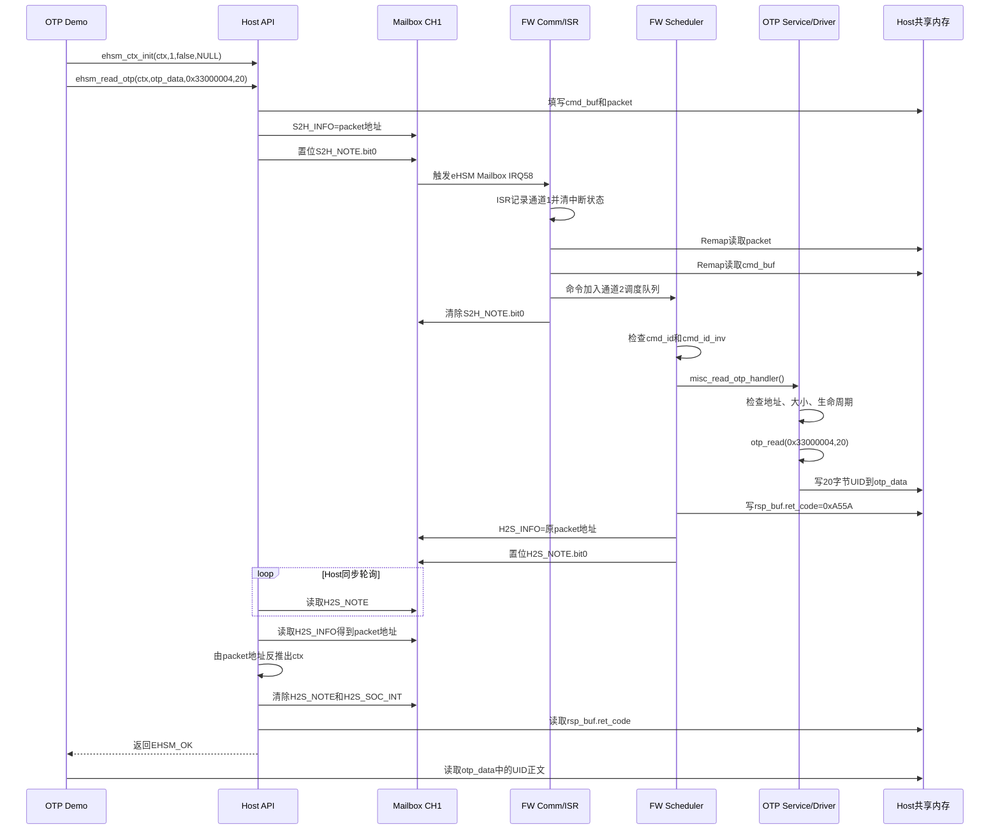

# eHSM Mailbox Host-FW 交互与 OTP 读取实例深度解析

> 主Review索引：[`03_bootloader_deep_review.md`](03_bootloader_deep_review.md)。

## 1. 文档目标与分析范围

本文结合 eHSM 硬件手册、Host API、eHSM Firmware 和 OTP 驱动代码，说明一次 Mailbox 命令如何从 Host 发出、由 eHSM FW 处理，再把结果返回 Host。

本文重点回答以下问题：

1. Mailbox 的 `S2H`、`H2S`、`INFO`、`NOTE` 和中断寄存器分别承担什么职责。
2. 为什么 Mailbox 只传递两个 32 位 word，却可以处理包含大量参数的命令。
3. Host 的 `ehsm_ctx_st`、`packet`、`cmd_buf`、`rsp_buf` 和业务数据 buffer 如何关联。
4. `ehsm_demo_rd_wr_otp.c::read_otp()` 如何构造 `0xFF02` OTP 读取命令。
5. Host 为什么使用轮询等待响应，而 eHSM FW 仍然使用中断接收命令。
6. eHSM FW 如何经过 Mailbox ISR、通信层、调度层和 Misc Service 调用 `otp_read()`。
7. OTP 正文和命令返回码为什么走两条不同的共享内存回写路径。
8. `H2S_INFO` 中返回的为什么仍是原始 `packet` 地址，而不是 OTP 数据或错误码。
9. 当前 `simulate` OTP 驱动与真实 OTP 控制器驱动之间是什么关系。
10. 当前实现有哪些文档差异、超时、权限和平台适配风险需要关注。

分析对象：

- [`ehsm_demo_rd_wr_otp.c`](../../ehsm_host-2.3.1-4019-2ee044d/demo/fw_demo/otp/ehsm_demo_rd_wr_otp.c)。
- [`mem.c`](../../ehsm_host-2.3.1-4019-2ee044d/demo/common/mem.c)。
- Host [`api.c`](../../ehsm_host-2.3.1-4019-2ee044d/src/api.c)、[`mailbox.c`](../../ehsm_host-2.3.1-4019-2ee044d/src/mailbox.c) 和 [`types_internal.h`](../../ehsm_host-2.3.1-4019-2ee044d/src/types_internal.h)。
- FW [`mailbox_driver.c`](../../ehsm_fw-2.3.2-4019-5a4a0a9/src/driver/mailbox_driver.c)、[`comm.c`](../../ehsm_fw-2.3.2-4019-5a4a0a9/src/component/comm.c) 和 [`schedule.c`](../../ehsm_fw-2.3.2-4019-5a4a0a9/src/schedule/schedule.c)。
- FW [`misc_srv.c`](../../ehsm_fw-2.3.2-4019-5a4a0a9/src/service/misc_srv.c)、[`mmap.c`](../../ehsm_fw-2.3.2-4019-5a4a0a9/src/component/mmap.c) 和 [`otp_driver.c`](../../ehsm_fw-2.3.2-4019-5a4a0a9/src/driver/otp/simulate/otp_driver.c)。
- [`OSR eHSM HP TRM`](../OSR_eHSM_HP_Technical_Reference_Manual_CN.pdf)，重点参考第 12 章 Mailbox。
- [`OSR eHSM Firmware TRM`](../OSR_eHSM_Firmware_TRM_4019_1.1.pdf)。
- [`OSR eHSM Host API TRM`](../OSR_eHSM_Host_API_TRM_4019_v1.0.pdf)。

## 2. 核心结论

1. eHSM Mailbox 不是大块数据传输通道，而是一个**地址通知和完成握手通道**。
2. 每个方向只有两个 32 位 `INFO` 寄存器，软件将其组合为一个 64 位 Host 物理地址。
3. Host 发送的是 `packet` 地址；`packet` 再给出命令缓冲区和响应缓冲区地址。
4. OTP 命令中还包含 `host_dst_addr`，用于指定 OTP 正文最终写入的 Host 共享内存。
5. 因而一次 OTP 读取存在三级地址跳转：`Mailbox -> packet -> cmd_buf/host_dst_addr`。
6. Demo 的 Host 驱动使用 `EHSM_DRV_MODE_WAIT_AND_POLL`，Host 不启用响应中断，而是轮询 `H2S_NOTE`。
7. eHSM FW 侧独立使用 Mailbox IRQ 58 接收 `S2H` 请求，ISR 只记录通道位图，命令解析在主循环完成。
8. OTP 正文直接写入 `otp_data`；通用响应缓冲区只写入 `ret_code`。
9. eHSM 返回的 `H2S_INFO` 是原始 `packet` 地址，用于让 Host 反推出对应的 `ctx`。
10. 当前交付配置选择 `OTP_DEVICE_TYPE="simulate"`，`otp_read()` 最终是对 `0x33000000` OTP映射区执行 `memcpy()`，尚不是独立的真实 OTP 控制器访问实现。

## 3. Mailbox 的三层软件模型

理解这套协议时，应将其分成三个层次：

| 层次 | 承载内容 | 典型对象 |
|---|---|---|
| Mailbox 寄存器层 | 64 位地址和通知状态 | `S2H_INFO`、`H2S_INFO`、`NOTE`、`INT` |
| Host 共享内存协议层 | 命令描述符、命令、响应 | `packet`、`cmd_buf`、`rsp_buf` |
| eHSM 业务服务层 | OTP、算法、密钥等业务处理 | `misc_read_otp_handler()`、`otp_read()` |

整体关系如下：

```text
Mailbox S2H_INFO[1:0]
          │
          │ 64位 packet 地址
          ▼
Host共享内存中的 packet
┌──────────────────────────┐
│ cmd_addr ────────────────┼──► cmd_buf：OTP命令结构体
│ rsp_addr ────────────────┼──► rsp_buf：ret_code
└──────────────────────────┘
                                     │
                                     │ OTP命令中的host_dst_addr
                                     ▼
                              otp_data：OTP正文
```

这三块 Host 内存的作用不同：

| Host 内存对象 | 谁读取/写入 | 作用 |
|---|---|---|
| `packet` | eHSM读取，Host和eHSM都用作tag | 定位命令和响应缓冲区 |
| `cmd_buf` | Host填写，eHSM读取 | 保存命令ID和业务参数 |
| `rsp_buf` | eHSM写入，Host读取 | 保存命令执行返回码和少量通用结果 |
| `otp_data` | eHSM写入，Demo读取 | 保存本次读取出的OTP正文 |

## 4. Mailbox 硬件通道

### 4.1 双向寄存器

| 方向 | 发送者 | 接收者 | 信息寄存器 | 通知寄存器 |
|---|---|---|---|---|
| S2H | SoC Host | eHSM | `MB_S2H_INFO[0..1]` | `MB_S2H_NOTE.bit0` |
| H2S | eHSM | SoC Host | `MB_H2S_INFO[0..1]` | `MB_H2S_NOTE.bit0` |

eHSM 内部视角下，通道 `N` 的寄存器地址为：

```text
0x30C0_0000 + N * 0x1000，N = 0..15
```

当前 OSR Host 适配层看到的基地址为：

```text
0x8000_0000 + N * 0x1000
```

两者是 Mailbox 硬件面向 SoC 和 eHSM 的两个 AHB Slave 地址窗口。

### 4.2 关键寄存器偏移

| 偏移 | 寄存器 | 作用 |
|---:|---|---|
| `0x000/0x004` | `S2H_INFO[0..1]` | Host写入64位请求tag/地址 |
| `0x080/0x084` | `H2S_INFO[0..1]` | eHSM写入64位响应tag/地址 |
| `0x100` | `S2H_NOTE` | Host通知eHSM有新命令 |
| `0x104` | `H2S_NOTE` | eHSM通知Host响应完成 |
| `0x110~0x12C` | `*_INT/*_INT_EN` | 请求、响应、消费确认和冲突中断 |
| `0x480` | `MB_INT_ALL` | eHSM侧16个通道的汇总中断位图 |

### 4.3 NOTE 的写1置位和写1清除

同一个 NOTE 寄存器从不同端口访问，写1的含义不同：

| 寄存器 | 发送侧访问 | 接收侧访问 |
|---|---|---|
| `S2H_NOTE` | SoC写1置位，RW1S | eHSM写1清除，RW1C |
| `H2S_NOTE` | eHSM写1置位，RW1S | SoC写1清除，RW1C |

因此，源码中的：

```c
mb_reg->s2h_note = 1;
```

在 Host 侧表示“发布一条命令”，在 eHSM 侧表示“命令已经被接收，可以释放此槽位”。

### 4.4 NOTE 与中断状态的关系

| 事件 | 硬件置位的中断状态 | 通知对象 |
|---|---|---|
| Host置位`S2H_NOTE` | `S2H_HSM_INT.bit0` | eHSM收到请求 |
| eHSM清除`S2H_NOTE` | `S2H_SOC_INT.bit0` | Host获知请求已接收 |
| eHSM置位`H2S_NOTE` | `H2S_SOC_INT.bit0` | Host收到响应 |
| Host清除`H2S_NOTE` | `H2S_HSM_INT.bit0` | eHSM获知响应已消费 |
| 双方同时置位/清除同一NOTE | 对应`*_INT.bit31` | 冲突中断 |

必须区分：

- `NOTE` 表示消息槽当前是否被占用。
- `INT` 表示 NOTE 操作产生的锁存事件。
- `INT_EN` 决定该事件是否输出为CPU中断。
- 清除 NOTE 不等于清除 INT，标准中断流程需要分别处理。

## 5. Demo 的运行配置

Demo 总入口 [`test.c`](../../ehsm_host-2.3.1-4019-2ee044d/demo/test.c) 使用：

```c
ehsm_driver_init_library(EHSM_DRV_MODE_WAIT_AND_POLL);
```

该模式的 Host 侧行为是：

1. 禁止 `H2S_SOC_INT` 响应中断。
2. 禁止 `S2H_SOC_INT` 请求接收确认中断。
3. 发送命令后反复读取 `H2S_NOTE`。
4. 发现响应后复用 `ehsm_mb_int_handler()` 完成通用响应处理。
5. 忽略 `ctx->async`，Host API 总是同步等待结果。

eHSM FW 侧不受 Host 模式影响。FW 的 [`mailbox_init()`](../../ehsm_fw-2.3.2-4019-5a4a0a9/src/driver/mailbox_driver.c) 仍然：

```c
cpu_register_int(IRQ_TYPE_MAILBOX, INT_LEVEL_TRIGGER, mailbox_int_handler);
cpu_enable_int(IRQ_TYPE_MAILBOX);
s2h_hsm_int_en = 0x80000001; /* bit0正常请求，bit31冲突 */
h2s_hsm_int_en = 0x00000000; /* 不使用响应消费确认中断 */
```

因此本例的组合模式是：

```text
Host侧：轮询接收响应
eHSM侧：中断接收请求 + 主循环延迟处理
```

## 6. Demo 使用的共享内存

### 6.1 平台地址配置

[`ehsm_host_custom.h`](../../ehsm_host-2.3.1-4019-2ee044d/port/osr/m130/port/ehsm_host_custom.h) 定义：

```c
#define EHSM_PORT_MAILBOX_REG_BASE_ADDR 0x80000000u
#define EHSM_PORT_SHARE_MEM_BASE_ADDR   0x60000000u
#define EHSM_PORT_SHARE_MEM_SIZE        (256u * 1024u)
#define EHSM_PORT_OTP_SIZE              1024u
```

Demo 的 [`mem.c`](../../ehsm_host-2.3.1-4019-2ee044d/demo/common/mem.c) 将共享内存组织为：

```c
typedef struct {
    ehsm_ctx_st ctx;
    ehsm_session_st session;
    ehsm_demo_buffer_st buffers[999];
} ehsm_demo_share_mem_st;
```

`ctx` 位于共享内存起始处，`ehsm_demo_get_buffer(0)` 返回第一块 1024 字节业务缓冲区。

### 6.2 ctx 的内部布局

对业务调用者，`ehsm_ctx_st` 只是 56 个 32 位 word：

```c
typedef struct {
    uint32_t _data[56];
} ehsm_ctx_st;
```

Host库内部将它转换为 [`ehsm_ctx_intl_st`](../../ehsm_host-2.3.1-4019-2ee044d/src/types_internal.h)：

```text
ctx
├── magic
├── mb_ch
├── async/inited
├── callback
├── packet
│   ├── cmd_addr ─────► cmd_buf
│   └── rsp_addr ─────► rsp_buf
├── result1/result2
├── responded
├── cmd_buf
└── rsp_buf
```

`ehsm_ctx_init()` 会清空整个ctx，然后设置：

```c
ctx_intl->magic = EHSM_CTX_MAGIC;
ctx_intl->mb_ch = 1;
ctx_intl->async = false;
ctx_intl->callback = NULL;
ctx_intl->packet.cmd_addr = ehsm_port_addr_to_raddr(&ctx_intl->cmd_buf);
ctx_intl->packet.rsp_addr = ehsm_port_addr_to_raddr(&ctx_intl->rsp_buf);
```

当前 OSR M130 Host 适配中的 `ehsm_port_addr_to_raddr()` 是恒等转换：

```c
return (raddr_t)(uintptr_t)addr;
```

真实 OS/虚拟地址平台需要将进程虚拟地址转换成 eHSM 能访问的总线地址，不能直接照搬恒等转换。

## 7. OTP Demo 的测试数据

[`ehsm_demo_rd_wr_otp.c`](../../ehsm_host-2.3.1-4019-2ee044d/demo/fw_demo/otp/ehsm_demo_rd_wr_otp.c) 定义两个测试对象：

| 测试对象 | eHSM地址 | 大小 |
|---|---:|---:|
| UID | `0x33000004` | 20字节 |
| Version Counter | `0x33000050` | 4字节 |

入口 `ehsm_demo_rd_wr_otp_entry()` 依次对两个对象调用：

```text
read_otp()
write_otp()
```

本文以第一条调用为具体例子：

```c
read_otp(0x33000004U, 20U);
```

## 8. `read_otp()` 的 Host 侧流程

### 8.1 获取共享内存对象

```c
ehsm_ctx_st *ctx = ehsm_demo_get_ctx();
uint8_t *otp_data = ehsm_demo_get_buffer(0);
uint8_t remapped_otp_data[32];
```

三者的作用是：

| 对象 | 存储位置 | 作用 |
|---|---|---|
| `ctx` | Host/eHSM共享内存 | 命令上下文、命令buffer、响应buffer |
| `otp_data` | Host/eHSM共享内存 | 接收eHSM写回的OTP正文 |
| `remapped_otp_data` | Host本地栈 | 保存Host直接映射读取的OTP，用于对比 |

### 8.2 初始化 ctx

```c
ehsm_ctx_init(ctx, 1, false, NULL);
```

参数含义：

| 参数 | 当前值 | 含义 |
|---|---:|---|
| `mb_ch` | `1` | 使用Mailbox通道1 |
| `async` | `false` | 非异步调用 |
| `callback` | `NULL` | 不使用业务回调 |

当前驱动模式为 `WAIT_AND_POLL`，所以即使把 `async` 改成 `true`，API仍会同步轮询到命令完成。

### 8.3 调用 Host API

```c
ret = ehsm_read_otp(ctx, otp_data, 0x33000004U, 20U);
```

[`ehsm_read_otp()`](../../ehsm_host-2.3.1-4019-2ee044d/src/api.c) 首先调用 `ehsm_check_ctx()` 检查：

1. `ctx` 不是空指针。
2. `magic` 等于 `EHSM_CTX_MAGIC`。
3. `inited` 已置位。

随后 `ehsm_ctx_reset()` 清除上一次调用留下的 `result1/result2/responded/cmd_buf/rsp_buf`，但保留 `packet.cmd_addr`、`packet.rsp_addr`、Mailbox通道和回调配置。

## 9. OTP 命令组包

### 9.1 BL/FW 共用的命令格式

Host API 使用 `mb_cmd_bl_otp_read_st` 组包，同时通过静态断言保证它与FW的 `mb_cmd_otp_read_st` 一致：

```c
STATIC_ASSERT(sizeof(mb_cmd_bl_otp_read_st) == sizeof(mb_cmd_otp_read_st));
STATIC_ASSERT(MB_CMD_ID_BL_OTP_READ == MB_CMD_ID_OTP_READ);
```

命令ID均为：

```text
0xFF02
```

因此同一个 `ehsm_read_otp()` API 可以在 BL 或 FW 阶段使用。本例属于 `fw_demo`，实际由 eHSM FW 的 Misc Service 处理。

### 9.2 结构体字段

命令结构体使用 `#pragma pack(1)`，总大小为32字节：

| 偏移 | 字段 | 类型 | UID实例值 |
|---:|---|---|---:|
| `0` | `cmd_id` | `uint16_t` | `0xFF02` |
| `2` | `cmd_id_inv` | `uint16_t` | `0x00FD` |
| `4` | `reserved0[8]` | `uint8_t[8]` | 全0 |
| `12` | `ehsm_src_addr` | `uint64_t` | `0x0000000033000004` |
| `20` | `size` | `uint32_t` | `20` |
| `24` | `host_dst_addr` | `uint64_t` | `otp_data`的Host总线地址 |

组包代码等价于：

```c
cmd->cmd_id = 0xFF02U;
cmd->cmd_id_inv = (uint16_t)~0xFF02U; /* 0x00FD */
cmd->ehsm_src_addr = 0x33000004U;
cmd->host_dst_addr = ehsm_port_addr_to_raddr(otp_data);
cmd->size = 20U;
```

`cmd_id_inv` 是命令头传输错误检查，不是密码学完整性保护。

## 10. Host 发布 Mailbox 请求

`ehsm_read_otp()` 最终调用：

```text
ehsm_send_cmd(ctx_intl)
    -> ehsm_mb_send(channel=1, address=&ctx_intl->packet)
```

注意，`ehsm_mb_send()` 的第二个参数不是 `cmd_buf` 地址，而是 `packet` 地址。

通道1的Host侧基地址为：

```text
0x8000_0000 + 1 * 0x1000 = 0x8000_1000
```

[`ehsm_mb_send()`](../../ehsm_host-2.3.1-4019-2ee044d/src/mailbox.c) 的执行顺序为：

1. 读取 `S2H_NOTE.bit0`，等待上一条请求被eHSM清除。
2. 调用 `ehsm_port_flush_and_invalidate_cache()`，保证共享内存中的packet和命令对eHSM可见。
3. 进入临界区，防止同一Host CPU上的中断或并发路径抢占寄存器操作。
4. 再次检查 `S2H_NOTE.bit0`，防止等待结束到进入临界区之间发生竞争。
5. 将 `packet` 地址低32位写入 `S2H_INFO[0]`。
6. 将 `packet` 地址高32位写入 `S2H_INFO[1]`。
7. 写1置位 `S2H_NOTE.bit0`。
8. 退出临界区。

伪代码如下：

```c
while (S2H_NOTE & BIT0) {
    if (timeout) {
        return EHSM_ERR_TIMEOUT;
    }
}

flush_and_invalidate_cache();

enter_critical();
if ((S2H_NOTE & BIT0) == 0U) {
    S2H_INFO[0] = packet_addr_low;
    S2H_INFO[1] = packet_addr_high;
    S2H_NOTE = BIT0;
} else {
    exit_critical();
    return EHSM_ERR_BUSY;
}
exit_critical();
```

这段临界区只保护“检查通道空闲并发布请求”的原子性，不保护后续整个eHSM命令处理过程。

## 11. eHSM FW 的 Mailbox 中断

### 11.1 硬件触发

Host置位 `S2H_NOTE.bit0` 后，硬件置位通道1的 `S2H_HSM_INT.bit0`。由于FW使能了该位，中断汇总到eHSM CPU的Mailbox IRQ 58。

### 11.2 ISR处理

FW的 `mailbox_int_handler()`：

1. 读取 `MB_INT_ALL[15:0]` 得到产生中断的通道位图。
2. 调用 `comm_mbox_recv_cb(bitmap)`，把位图OR到 `g_mb_int`。
3. 遍历位图中的通道。
4. 对每个通道写 `0xFFFFFFFF` 清除 `S2H_HSM_INT/H2S_HSM_INT`。

ISR不读取Host共享内存，也不解析OTP命令。这避免在中断上下文执行地址重映射、队列操作和业务处理。

### 11.3 延迟到主循环处理

`sch_start()` 每轮末尾调用 `comm_poll()`：

```text
ISR: g_mb_int |= BIT(1)
          ↓
comm_poll(): g_recv_mb_ch |= g_mb_int
          ↓
comm_poll_mb_chl(): 检查通道1的S2H_NOTE
```

该设计属于“中断捕获事件，主循环处理业务”的延迟处理模型。

## 12. FW 读取 packet 和命令

FW通信层调用链：

```text
comm_poll()
  -> comm_poll_mb_chl()
    -> mailbox_read_recv_notify()
    -> comm_read_mbox_data()
      -> mailbox_read()
      -> comm_handle_gen_mbox_data()
        -> mmap_read_remote_data(packet)
        -> cmdpool_alloc()
        -> comm_init_packet()
          -> mmap_read_remote_data(cmd_buf)
          -> sch_add_cmd()
          -> mailbox_clear_recv_notify()
```

### 12.1 第一次共享内存读取：packet

FW先将 `S2H_INFO[0..1]` 组合成64位地址：

```c
raddr_t packet_addr;
```

然后通过 `mmap_read_remote_data()` 读取：

```c
typedef struct {
    raddr_t req_addr;
    raddr_t rsp_addr;
} cmd_addr_st;
```

它与Host侧的 `ehsm_mb_packet_st { cmd_addr, rsp_addr }` 布局相同，只是字段命名不同。

FW检查 `req_addr` 和 `rsp_addr` 均不为0，然后申请一个eHSM本地 `cmd_packet_st`。

### 12.2 第二次共享内存读取：cmd_buf

`comm_init_packet()` 从 `packet.req_addr` 固定读取128字节到：

```c
packet->cmd_data
```

OTP命令只占前32字节，其余字段在Host组包前已经被 `ehsm_ctx_reset()` 清零。

### 12.3 保存tag并入队

FW记录：

```c
packet->rsp_addr = cmd_addr->rsp_addr;
packet->tag = packet_addr;
packet->channel = COMM_TYPE_MAILBOX + 1;
packet->type = PACKET_TYPE_MB;
```

其中 `tag` 就是最初由Host写入 `S2H_INFO` 的 `packet` 地址。

命令成功加入调度队列后，FW才清除 `S2H_NOTE.bit0`。这表示：

> eHSM已经把Host命令完整复制到eHSM本地命令池，Host可以复用该Mailbox通道发送下一条命令。

## 13. FW 调度和服务分发

Mailbox通道 `N` 被转换成调度通道 `N+1`；调度通道0保留给UART。因此Mailbox通道1进入调度通道2。

`sch_start()` 从队列取出命令后依次执行：

1. `expt_det_check_before()`：命令执行前异常状态检查。
2. `sch_check_cmd_auth()`：检查通信通道是否有权执行该命令。
3. `sch_process_srv()`：检查命令反码并按命令ID分发服务。

反码检查为：

```c
cmd_id_inv = (uint16_t)~packet->cmd_data.cmd_id_inv;
if (packet->cmd_data.cmd_id != cmd_id_inv) {
    return EHSM_ERR_INVALID_CMD;
}
```

`cmd_id=0xFF02` 的分发路径为：

```text
sch_process_srv()
  -> misc_srv_handler()
    -> case MB_CMD_ID_OTP_READ
      -> misc_read_otp_handler()
```

## 14. `misc_read_otp_handler()` 处理过程

### 14.1 生命周期双读保护

FW连续两次读取生命周期，中间插入 `fid_delay()`：

```c
life_cycle = sysreg_get_life_cycle();
fid_delay();
life_cycle2 = sysreg_get_life_cycle();
if (!FID_EQ(life_cycle, life_cycle2)) {
    fid_panic();
}
```

目的是检测生命周期读取过程中可能出现的故障注入或瞬态错误。

### 14.2 参数和权限检查

当前代码依次检查：

| 检查项 | UID实例结果 |
|---|---|
| `req_data/rsp_data`非空 | 通过 |
| `size <= MISC_OTP_DATA_MAX_SIZE` | `20 <= 1024`，通过 |
| `size <= CONFIG_EHSM_OTP_SIZE` | `20 <= 1024`，通过 |
| `ehsm_src_addr >= 0x33000000` | `0x33000004`，通过 |
| 地址加长度不超过OTP末尾 | `0x33000018`未越界 |
| 生命周期允许读OTP | MCUTEST/DEVELOP/MANUFACTURE允许 |

源码注释和生成的 `mb.h` 描述为“仅TEST_MODE和DEVELOP_MODE允许”，但当前实现额外允许 `MANUFACTURE`。评审和产品需求应以最终确认的生命周期策略为准，不能只看头文件注释。

### 14.3 读取eHSM本地OTP

检查通过后：

```c
uint8_t data[CONFIG_EHSM_OTP_SIZE];
ret = otp_read(0x33000004U, data, 20U);
```

当前配置 [`custom.cmake`](../../ehsm_fw-2.3.2-4019-5a4a0a9/custom.cmake) 指定：

```cmake
set(OTP_DEVICE_TYPE "simulate")
```

所以实际编入的是：

```c
uint32_t otp_read(uint32_t addr, uint8_t *data, uint32_t size)
{
    /* 参数和范围检查 */
    util_memcpy(data, (uint8_t *)addr, size);
    return EHSM_ERR_SW_SUCCESS;
}
```

在当前平台上，本例等价于：

```text
从eHSM地址0x33000004复制20字节到FW栈buffer
```

真实OTP控制器接入通常只需要替换 `src/driver/otp/<device>/otp_driver.c`，Mailbox协议、调度和服务接口可以保持不变。

### 14.4 将OTP正文写回Host

OTP读取成功后：

```c
ret = mmap_write_remote_data(cmd_data->host_dst_addr, data, cmd_data->size);
```

`mmap_write_remote_data()`：

1. 进入eHSM临界区，防止地址Remap寄存器被其他路径并发修改。
2. 将64位 `host_dst_addr` 写入 `SYS_SOC_MEM_BA_L/H`。
3. 计算eHSM侧SoC Memory访问窗口地址。
4. 将20字节UID复制到Host的 `otp_data`。
5. 退出临界区。

到这一步，OTP正文已经位于Host共享内存，但Host仍然需要等待Mailbox完成通知，才能确定数据有效。

## 15. FW 生成通用响应

`misc_read_otp_handler()` 返回 `EHSM_ERR_SW_SUCCESS` 后，调度器将成功码转换成Mailbox协议成功值：

```c
packet->rsp_data.ret_code = EHSM_ERR_MB_SUCCESS; /* 0x0000A55A */
```

OTP读取命令不把正文放入 `rsp_data.data[]`，所以通用响应只有4字节有效内容：

```text
rsp_buf
┌────────────────────┐
│ ret_code=0xA55A    │
└────────────────────┘
```

`comm_send_gen_mbox_rsp()`：

1. 将 `packet->rsp_addr` 映射成eHSM可写地址。
2. 将4字节 `ret_code` 写入Host的 `ctx.rsp_buf`。
3. 等待Host清除上一条 `H2S_NOTE`。
4. 将 `packet->tag`，即原始packet地址，写入 `H2S_INFO[0..1]`。
5. 写1置位 `H2S_NOTE.bit0`。
6. 释放eHSM本地命令池中的 `cmd_packet_st`。

此时Host侧有两块内存被更新：

```text
otp_data    = 20字节UID正文
ctx.rsp_buf = 0x0000A55A
```

## 16. Host 轮询并完成响应

`ehsm_send_cmd()` 在 `EHSM_DRV_MODE_WAIT_AND_POLL` 分支中反复调用：

```c
ehsm_mb_poll(ctx_intl->mb_ch);
```

### 16.1 轮询H2S_NOTE

`ehsm_mb_poll(1)` 检查通道1的 `H2S_NOTE.bit0`：

```text
0：eHSM尚未完成，返回EHSM_ERR_NEED_POLL
1：响应已到达，调用ehsm_mb_int_handler(1)
```

### 16.2 通过packet地址反推ctx

`ehsm_mb_int_handler()` 从 `H2S_INFO[0..1]` 读取原始packet地址，再调用Host库内部回调 `ehsm_mb_int()`。

`ehsm_mb_int()` 使用：

```c
ctx_addr = packet_addr - offsetof(ehsm_ctx_intl_st, packet);
```

从嵌套成员 `packet` 的地址反推出所属 `ctx` 地址，然后检查：

```c
ctx_intl->magic == EHSM_CTX_MAGIC
```

OTP命令没有额外的通用响应字段需要提取，因此该命令不会进入 `ehsm_mb_int()` 中针对HASH、密钥、计数器等命令的特殊结果处理分支，只需要标记：

```c
ctx_intl->responded = true;
```

### 16.3 清除响应状态

Host随后写1清除：

```c
H2S_NOTE
H2S_SOC_INT
```

清除 `H2S_NOTE` 后，eHSM可以在该通道发布下一条响应。

### 16.4 返回码映射

`ehsm_send_cmd()`读取 `ctx.rsp_buf.ret_code`：

```text
0x0000A55A -> EHSM_OK
其它FW错误码 -> EHSM_ERR_FW_BASE | fw_error
```

`EHSM_ERR_FW_BASE` 当前为 `0x010000`，用于区分Host本地错误和eHSM FW返回错误。

## 17. 完整时序图



## 18. UID 实例的数据快照

### 18.1 Host发布请求时

```text
Mailbox通道：1
Host Mailbox基地址：0x80001000

S2H_INFO[0] = packet_addr[31:0]
S2H_INFO[1] = packet_addr[63:32]
S2H_NOTE    = 0x00000001
```

```text
packet:
  cmd_addr = &ctx.cmd_buf
  rsp_addr = &ctx.rsp_buf

cmd_buf前32字节:
  cmd_id        = 0xFF02
  cmd_id_inv    = 0x00FD
  reserved      = 00 00 00 00 00 00 00 00
  ehsm_src_addr = 0x0000000033000004
  size          = 20
  host_dst_addr = address(otp_data)
```

### 18.2 eHSM处理完成时

```text
otp_data[0..19] = 从0x33000004读取的20字节UID
ctx.rsp_buf.ret_code = 0x0000A55A

H2S_INFO[0] = packet_addr[31:0]
H2S_INFO[1] = packet_addr[63:32]
H2S_NOTE    = 0x00000001
```

### 18.3 为什么H2S_INFO仍返回packet地址

同一Mailbox通道可以被多个Host上下文分时使用。返回packet地址后，Host可以确定：

1. 哪一个 `ctx` 已完成。
2. 应从哪一个 `rsp_buf` 读取返回码。
3. 异步模式下应调用哪一个上下文对应的回调。

它相当于协议中的事务tag，而不是业务结果载体。

## 19. Demo 的直接映射对照检查

API返回 `EHSM_OK` 后，Demo执行：

```c
demo_read_otp_from_soc_addr(
    0x33000004U - 0x33000000U,
    remapped_otp_data,
    20U);
```

Host适配层中的直接映射地址为：

```text
OTP_BASE_ADDR = 0x6007C000
```

所以实际读取：

```text
0x6007C000 + 0x4 = 0x6007C004
```

Demo比较两条路径的结果：

```text
路径A：Host API
Host -> Mailbox -> eHSM FW -> eHSM 0x33000004 -> Host otp_data

路径B：平台对照读取
Host -> Host映射地址0x6007C004 -> remapped_otp_data
```

只有两份20字节数据完全一致，Demo才报告成功。

路径B绕过了eHSM FW的生命周期和命令权限检查，是当前FPGA/验证环境的对照手段，不应直接当作产品环境的正常OTP访问接口。

## 20. 错误传播路径

| 失败位置 | 典型错误 | 返回方式 |
|---|---|---|
| Host ctx检查 | `EHSM_ERR_CTX_INVALID` | Host API直接返回，不发送Mailbox |
| Host等待S2H槽空闲 | `EHSM_ERR_TIMEOUT` | Host本地返回 |
| Host二次检查槽位 | `EHSM_ERR_BUSY` | Host本地返回 |
| FW读取packet/cmd失败 | Remap/地址错误 | FW设置Mailbox读失败通知或Host最终超时 |
| FW命令反码错误 | `EHSM_ERR_INVALID_CMD` | 写入`rsp_buf.ret_code` |
| OTP地址越界 | `EHSM_ERR_PARAM_ERROR` | 写入`rsp_buf.ret_code` |
| OTP读取生命周期受限 | `EHSM_ERR_EHSM_LIFECYCLE_LIMIT` | 写入`rsp_buf.ret_code` |
| OTP驱动读取失败 | OTP驱动错误码 | 写入`rsp_buf.ret_code` |
| FW写Host数据失败 | `EHSM_ERR_REMAP_FAILED`等 | 写入`rsp_buf.ret_code` |
| Host等待H2S响应超时 | `EHSM_ERR_TIMEOUT` | Host本地返回 |

正常成功码在FW中为 `0xA55A`，Host收到错误码时执行：

```c
return EHSM_ERR_FW_BASE | ret_code;
```

因此调用者可以区分错误是在Host通信栈内产生，还是由eHSM FW业务服务返回。

## 21. 并发和通道占用语义

### 21.1 单个通道不是FIFO

每个通道的每个方向只有一个NOTE状态和两个INFO寄存器，因此：

- 一个通道同一时刻只能保存一个尚未接收的请求地址。
- 一个通道同一时刻只能保存一个尚未消费的响应地址。
- 发送下一条请求前必须等待 `S2H_NOTE` 清除。
- 发送下一条响应前必须等待 `H2S_NOTE` 清除。

### 21.2 eHSM清除S2H_NOTE的时机

FW不是在刚进入中断时清除 `S2H_NOTE`，而是在：

```text
packet读取成功
    + cmd_buf复制到eHSM本地命令池
    + 命令成功加入调度队列
```

之后才清除。这保证Host看到通道空闲时，eHSM已经不再依赖Host当前的命令缓冲区内容。

### 21.3 临界区保护范围

Host的 `ehsm_port_enter_critical()/exit_critical()` 只保护寄存器发布动作，eHSM的 `cpu_enter_critical()/exit_critical()` 主要保护地址Remap寄存器。

这些临界区不能替代更高层的ctx和Mailbox通道并发管理。多个线程共享同一个ctx或同一个Mailbox通道时，仍需要Host上层加锁或分配独立ctx/通道。

## 22. 代码与文档审查要点

### 22.1 当前OTP驱动是simulate实现

当前 `custom.cmake` 明确选择 `simulate`，`otp_read()` 直接读取内存映射区。产品集成时需要确认：

1. 是否有真实OTP控制器驱动交付。
2. 真实驱动是否保持相同地址、长度和错误码语义。
3. OTP读时序、ECC、忙状态和硬件错误是否在驱动层正确处理。

### 22.2 生命周期描述存在差异

生成的命令注释称仅 `TEST/DEVELOP` 可读取OTP，当前FW代码允许：

```text
MCUTEST + DEVELOP + MANUFACTURE
```

该差异应进入安全需求追踪表，并由生命周期设计负责人确认。

### 22.3 Host示例平台没有实际超时

当前OSR M130 Host适配实现：

```c
ehsm_port_is_timeout(...) { return false; }
```

因此 `ehsm_mb_send()` 等待 `S2H_NOTE` 和 `ehsm_send_cmd()` 等待 `H2S_NOTE` 时可能无限循环。产品平台必须提供真实计时和超时策略。

### 22.4 `read_otp()` Demo本地数组只有32字节

```c
uint8_t remapped_otp_data[32];
```

当前实例只读取20字节和4字节，不会越界；但如果将该静态函数复用于大于32字节的读取，后续直接映射对照会发生栈越界。Demo函数应保持当前测试范围，或者增加size检查。

### 22.5 Host API本身不完整检查业务参数

`ehsm_read_otp()`主要检查ctx，没有在Host侧完整检查：

- `buf` 是否为空。
- `size` 是否为0或超过OTP大小。
- OTP地址是否越界。

最终检查在eHSM FW和OTP驱动完成。这有利于以eHSM为安全策略执行点，但无效请求仍会消耗Mailbox和FW调度资源；Host库可以考虑增加一致的快速失败检查，但不能替代FW侧检查。

### 22.6 直接映射OTP仅适合验证

`ehsm_port_read_otp()` 对 `0x6007C000` 直接执行 `memcpy()`，绕过eHSM服务权限。真实产品若不允许Host直接访问OTP，应通过地址防火墙、总线权限或生命周期策略关闭此路径。

### 22.7 Cache一致性是平台移植关键点

Host在发布Mailbox前调用 `ehsm_port_flush_and_invalidate_cache()`。当前FPGA实现可以为空，但带Cache的SoC必须保证：

1. `packet/cmd_buf` 在置位 `S2H_NOTE` 前已写回内存。
2. `rsp_buf/otp_data` 在Host读取时不会命中旧Cache行。
3. NOTE寄存器操作与共享内存访问之间具有正确的内存屏障顺序。

## 23. 调用链速查

### 23.1 Host发送链

```text
ehsm_demo_rd_wr_otp_entry()
  -> read_otp()
    -> ehsm_ctx_init()
    -> ehsm_read_otp()
      -> ehsm_check_ctx()
      -> ehsm_ctx_reset()
      -> ehsm_set_cmd_id(0xFF02)
      -> ehsm_send_cmd()
        -> ehsm_mb_send()
```

### 23.2 eHSM接收和处理链

```text
Mailbox IRQ58
  -> mailbox_int_handler()
    -> comm_mbox_recv_cb()
      -> comm_poll()
        -> comm_poll_mb_chl()
          -> comm_read_mbox_data()
            -> comm_handle_gen_mbox_data()
              -> comm_init_packet()
                -> sch_add_cmd()
                  -> sch_start()
                    -> sch_process_srv()
                      -> misc_srv_handler()
                        -> misc_read_otp_handler()
                          -> otp_read()
                          -> mmap_write_remote_data(otp_data)
```

### 23.3 eHSM响应和Host完成链

```text
sch_start()
  -> comm_send_rsp()
    -> comm_send_gen_mbox_rsp()
      -> 写ctx.rsp_buf
      -> comm_send_mbox_rsp()
        -> 写H2S_INFO
        -> 置位H2S_NOTE
          -> Host ehsm_mb_poll()
            -> ehsm_mb_int_handler()
              -> ehsm_mb_int()
                -> responded=true
                -> 清H2S_NOTE/H2S_SOC_INT
                  -> ehsm_ret_code_remap()
                    -> read_otp()获得EHSM_OK
```

## 24. 最终理解模型

可以将整个OTP读取过程归纳为以下一句话：

> Host在共享内存中准备“命令在哪里、响应写哪里、OTP正文写哪里”三组地址，只通过Mailbox发送最外层packet地址；eHSM收到通知后逐层解引用这些地址，执行受生命周期约束的OTP读取，把正文和返回码分别写回Host共享内存，最后再通过Mailbox返回原packet地址作为完成tag。

对于后续HASH、对称加解密、密钥管理和镜像验证等Host API，也可以沿用同一个阅读方法：

```text
API参数
  -> cmd结构体
  -> packet地址
  -> Mailbox通知
  -> FW调度和服务handler
  -> 业务输出buffer
  -> rsp_buf返回码
  -> H2S完成tag
```
