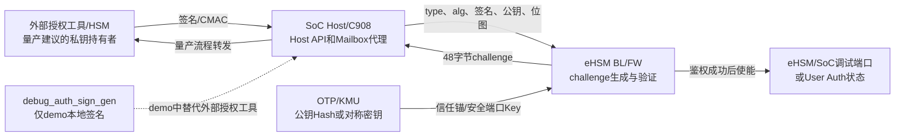
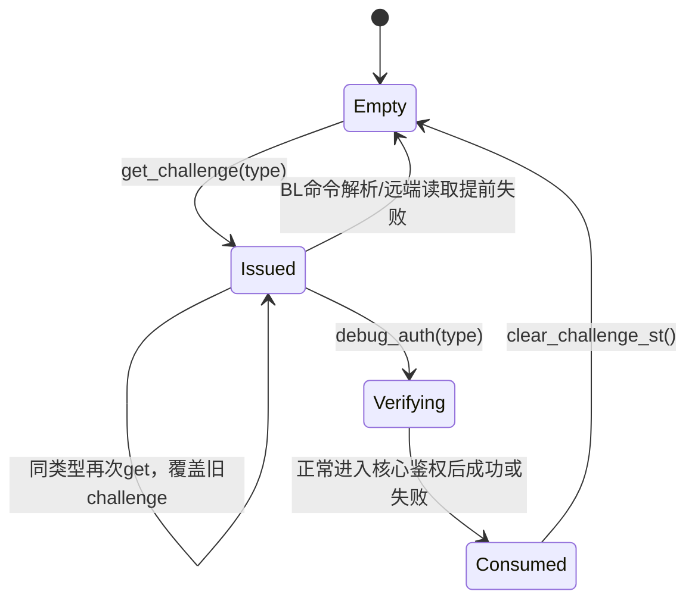
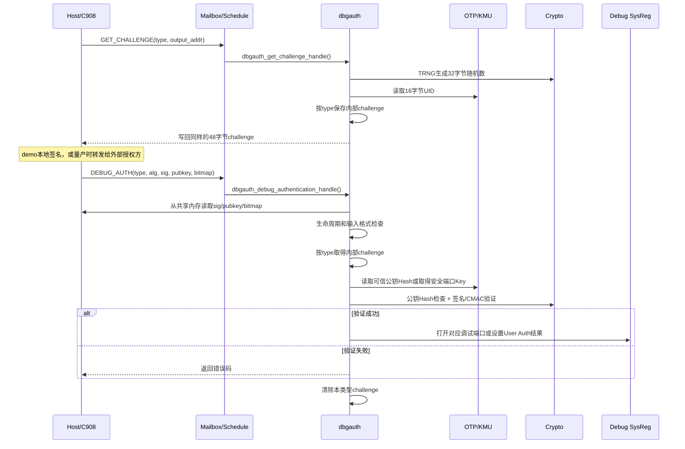
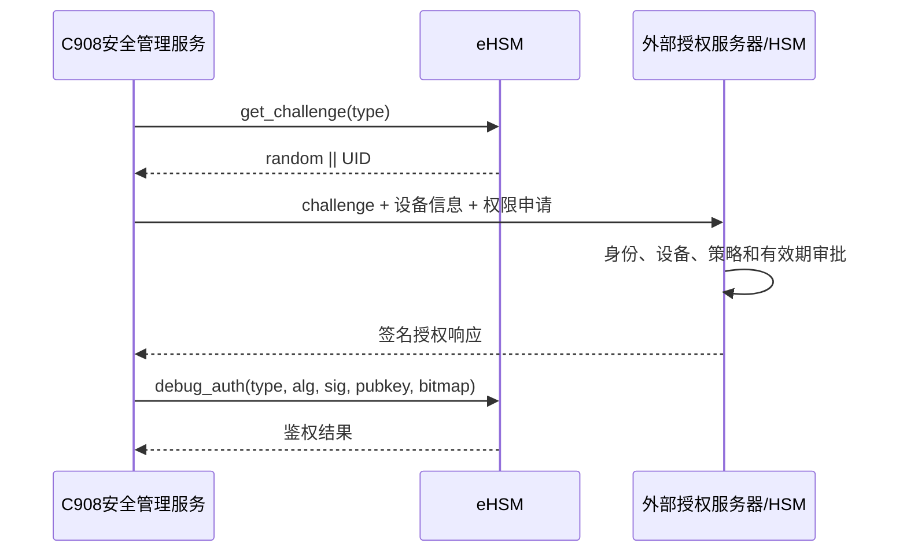

# eHSM Debug Auth Challenge-Response 深度解析

> 主Review索引：[`03_bootloader_deep_review.md`](03_bootloader_deep_review.md)。

## 1. 文档目标与范围

本文结合 Host demo、Host API、Mailbox协议、eHSM Bootloader和eHSM Firmware源码，梳理Debug Auth从获取challenge到打开调试端口的完整软件流程。

本文重点回答以下问题：

1. `ehsm_get_challenge()`、`debug_auth_sign_gen()`和`ehsm_debug_auth()`分别运行在哪里。
2. demo为什么在Host侧生成签名，以及这种做法能否用于量产。
3. eHSM是否验证了前一次生成的同一个challenge。
4. `check_auth_data()`、`check_verify_data()`和各算法函数分别检查什么。
5. SM2中的公钥Hash、`Z`、`E`和最终验签是什么关系。
6. OTP/KMU中保存的是完整公钥、私钥、对称密钥还是公钥Hash。
7. challenge如何生成、保存、覆盖、消费和清除。
8. 生命周期检查、FID/CFI和安全比较承担什么作用。
9. 当前协议有哪些量产安全边界需要补强或向vendor确认。

主要分析对象：

- Host demo [`ehsm_demo_debug_auth.c`](../../ehsm_host-2.3.1-4019-2ee044d/demo/fw_demo/debug_auth/ehsm_demo_debug_auth.c)。
- Host API [`api.c`](../../ehsm_host-2.3.1-4019-2ee044d/src/api.c)。
- BL协议头 [`mb.h`](../../ehsm_bl-2.3.5-4019-72f8fdc/inc/mb.h)。
- BL实现 [`dbgauth.c`](../../ehsm_bl-2.3.5-4019-72f8fdc/src/component/dbgauth.c)和[`dbgauth.h`](../../ehsm_bl-2.3.5-4019-72f8fdc/src/component/dbgauth.h)。
- FW实现 [`dbgauth_srv.c`](../../ehsm_fw-2.3.2-4019-5a4a0a9/src/service/dbgauth_srv.c)。
- OTP逻辑密钥定义 [`otp_key.h`](../../ehsm_bl-2.3.5-4019-72f8fdc/src/component/otp_key.h)和注册表 [`secure_boot.c`](../../ehsm_bl-2.3.5-4019-72f8fdc/src/component/secure_boot.c)。
- 密码封装 [`crypto_lib_api.c`](../../ehsm_bl-2.3.5-4019-72f8fdc/src/component/crypto_lib_api.c)和SM2基础实现 [`sm2_basic.c`](../../ehsm_bl-2.3.5-4019-72f8fdc/libs/osr_crypto/crypto_lib/pke/sm2_basic.c)。

## 2. 核心结论

1. 这段三步流程中，真正的eHSM Host API只有`ehsm_get_challenge()`和`ehsm_debug_auth()`；`debug_auth_sign_gen()`只是demo进程内的本地辅助函数。
2. eHSM生成并内部保存`32字节随机数 + 16字节UID`，同时把同样的48字节返回给Host。
3. `ehsm_debug_auth`命令不携带challenge。eHSM按`challenge_type`取回内部保存的challenge，并使用它验证Host提交的签名或CMAC。
4. 因而正常情况下，签名侧和验证侧处理的是同一份challenge；若同类型challenge被再次申请，旧值会被覆盖。
5. 非对称算法中，Host提交原始公钥和签名，eHSM先将公钥Hash与OTP信任锚比较，再用该公钥验签。
6. 对称算法中，Host只提交CMAC值，eHSM通过OTP逻辑Key ID取得KMU安全端口密钥并重新计算CMAC。
7. demo把SM2私钥和对称密钥静态放在Host程序中，只用于演示。量产时若C908软件也保存这些授权密钥，调试鉴权会失去合理的外部授权边界。
8. 当前签名内容只覆盖challenge，不覆盖SoC调试位图、算法、challenge类型、会话和有效期。这是项目集成时最需要确认和补强的协议边界。
9. 当前协议不是证书协议，不解析X.509或自定义证书链；它处理的是原始公钥、公钥Hash、签名或CMAC。

## 3. 参与者与信任边界



必须区分两个概念：

- 同一颗芯片上的不同CPU核，不会天然形成合格的调试授权边界。
- 只有当签名私钥位于目标芯片外部，或位于请求者无法任意调用的独立安全域中，签名结果才真正表示独立授权。

对于本项目的C908安全管理服务，推荐职责是获取challenge、转发授权请求和回传签名，不应在普通固件中持有调试授权私钥或共享CMAC密钥。

## 4. Host侧的三个步骤

### 4.1 `ehsm_get_challenge()`

Host API构造`0xFF03`命令，携带challenge类型和Host共享内存输出地址：

```c
cmd->type = (uint8_t)challenge_type;
cmd->addr = ehsm_port_addr_to_raddr(output);
```

该接口只负责发起Mailbox命令。随机数和UID由eHSM生成，不由Host生成。

### 4.2 `debug_auth_sign_gen()`

该函数属于demo，不是eHSM API。它直接调用Host侧软件密码实现：

| 算法 | demo操作 |
|---|---|
| SM2 | 计算`Z`和`E`，使用静态SM2私钥签名 |
| ECDSA-P256 | `SHA256(challenge)`后使用静态私钥签名 |
| AES-CMAC | 使用静态16字节AES密钥计算CMAC |
| SM4-CMAC | 使用静态16字节SM4密钥计算CMAC |

demo中的SM2数组包含`65字节公钥 + 32字节私钥`，对称demo密钥也以明文常量存在。这是测试夹具，不是量产密钥管理方案。

### 4.3 `ehsm_debug_auth()`

Host API构造`0xFF04`命令，发送以下内容：

```text
challenge_type
algorithm
signature地址和长度
public_key地址和长度
SoC debug bitmap地址和长度
```

该命令没有challenge字段。这一点证明eHSM验签时不能使用Host重新提交的challenge，只能使用eHSM内部保存的challenge状态。

Host源码通过`STATIC_ASSERT`确认BL和FW命令结构大小及命令ID一致，所以同一组Host API可以面向BL或FW工作。

## 5. Mailbox协议数据结构

### 5.1 Challenge类型

| 值 | 宏 | 作用 |
|---:|---|---|
| `0x01` | `MB_EHSM_CHALLENGE_TYPE_EHSM_DEBUG` | eHSM自身调试鉴权 |
| `0x03` | `MB_EHSM_CHALLENGE_TYPE_SOC_DEBUG` | SoC调试端口鉴权 |
| `0x04` | `MB_EHSM_CHALLENGE_TYPE_USER_AUTH` | User Auth；BL协议注释仍写“保留”，但代码已经实现 |

### 5.2 算法编码和输入格式

| 值 | 算法 | Host提交的公钥 | Host提交的签名/MAC |
|---:|---|---|---|
| `0x01` | SM3-SM2 | 65字节`04||X||Y`，也接受64字节`X||Y`并补`04` | 64字节`r||s` |
| `0x02` | SHA256-ECDSA-P256 | 64字节`X||Y` | 64字节`r||s` |
| `0x03` | SM4-CMAC | 无 | 16字节CMAC |
| `0x04` | AES128-CMAC | 无 | 16字节CMAC |
| `0x05` | SHA256-RSA-PSS | 320字节或448字节 | 256字节或384字节 |

RSA公钥格式由代码定义为：

```text
E区域64字节 || N模数256字节        RSA-2048
E区域64字节 || N模数384字节        RSA-3072
```

这不是DER、PEM、X.509 SubjectPublicKeyInfo或常规OpenSSL序列化格式，外部工具必须按vendor原始字节布局构造。

### 5.3 SoC调试位图

SoC Debug额外携带5个`uint32_t`：

- 前4个word按bit控制扩展调试端口。
- 第5个word只有bit0有效，用于控制主SoC调试端口。
- demo填写`0xFFFFFFFF`、`0xFFFFFFFF`、`0xFFFFFFFF`、`0xFFFFFFFF`、`0x1`，即请求打开全部可表示端口。

当前密码校验只处理challenge，位图不会进入Hash、SM2/ECDSA/RSA签名或CMAC计算。

## 6. Challenge生成与内部状态

### 6.1 Challenge格式

```text
偏移0x00                             偏移0x20               偏移0x30
   |                                    |                      |
   v                                    v                      v
+--------------------------------------+----------------------+
| TRNG随机数，32字节                    | 芯片UID，16字节       |
+--------------------------------------+----------------------+
                          总长度48字节
```

UID提供设备绑定，随机数提供每次请求的新鲜性。

### 6.2 BL生成过程

Mailbox路径`dbgauth_get_challenge_handle()`执行：

1. `check_lifecycle_type()`检查类型和生命周期，并选择类型对应的内部buffer。
2. `cpt_get_rand()`填充随机数据。
3. `otp_read(OTP_UID_ADDRESS, &out_data[32], 16)`用UID覆盖后16字节。
4. `set_challenge_st()`登记`type`、`size=48`和内部buffer地址。
5. `mmap_write_remote_data()`把同样内容写入Host共享内存。
6. 临时栈副本在返回前清零，内部全局buffer继续保留。

BL的Mailbox handler请求48字节随机数后覆盖后16字节；BL内部`dbgauth_get_challenge()`和FW实现直接请求32字节随机数。最终对外challenge内容相同，均为32字节随机数加16字节UID。

### 6.3 三套独立状态

```c
g_ehsm_challenge     + g_ehsm_challenge_buf[48]
g_soc_challenge      + g_soc_challenge_buf[48]
g_user_auth_challenge+ g_user_auth_challenge_buf[48]
```

每个类型只维护一个全局challenge，没有按Mailbox通道、Host调用者或会话再划分。



`clear_challenge_st()`会同时执行：

```text
challenge buffer全部清零
type设为INVALID
size设为0
buf指针设为NULL
```

## 7. eHSM侧完整鉴权时序



## 8. BL函数级处理流程

### 8.1 `dbgauth_debug_authentication_handle()`

该函数负责Mailbox输入搬运和第一层边界检查：

1. 检查`req_data`和`rsp_data`非空。
2. 检查challenge类型属于eHSM Debug、SoC Debug或User Auth。
3. 非对称算法检查公钥和签名不超过本地临时buffer上限。
4. 从Host远端地址读取公钥和签名。
5. 对称算法只读取签名/MAC。
6. SoC Debug要求位图长度固定为5个word，并读取位图。
7. 构造`ehsm_debug_auth_st`后进入`dbgauth_ehsm_debug_auth()`。
8. BL在提前解析或远端读取失败时显式清除对应challenge。

公钥临时数组在开头预留4字节：

```c
uint8_t pubkey[MAX_PUBKEY_SIZE + 4];
mmap_read_remote_data(&pubkey[4], cmd_data->pub_addr, cmd_data->pub_size);
```

这4字节用于SM2在64字节`X||Y`输入前原地补充`0x04`非压缩点前缀。

### 8.2 `check_auth_data()`

该函数只做输入格式归一化和challenge结构选择，不做真正的密码验证：

| 算法 | 检查和处理 |
|---|---|
| SM2 | 签名必须64字节；公钥65字节时检查`0x04`，64字节时原地补`0x04` |
| ECDSA-P256 | 签名64字节，公钥64字节 |
| RSA | 公钥320/448字节；签名长度必须等于公钥长度减64 |
| AES/SM4-CMAC | MAC必须16字节 |
| 其他 | 返回`EHSM_ERR_WRONG_ALGORITHM` |

格式正确后，`acquire_challenge_buffer()`按`challenge_type`返回对应的全局`ehsm_get_challenge_st`指针。此时尚未确认该状态是否有效。

### 8.3 `check_verify_data()`

该函数开始验证challenge状态和OTP信任锚：

1. 生命周期读取两次，中间插入`fid_delay()`；两次不同直接`fid_panic()`。
2. 拒绝无效类型和`DESTROY`生命周期。
3. `check_challenge_data()`检查challenge的`size==48`且内部`type`与请求类型一致。
4. 按类型选择OTP逻辑Key ID。
5. 非对称算法要求OTP条目可作为Hash数据读取，读取32字节可信公钥Hash。
6. AES/SM4-CMAC要求OTP条目为SKE类型，取得KMU物理Key ID，通过安全端口使用密钥。

类型到OTP逻辑Key ID的映射为：

| challenge类型 | OTP逻辑Key ID | 默认注册表含义 |
|---|---|---|
| eHSM Debug | `EHSM_OTP_EHSM_DEBUG_KEY_ID` | 默认映射标记为SM2 |
| SoC Debug | `EHSM_OTP_SOC_DEBUG_KEY_ID` | 默认映射标记为SM2 |
| User Auth | `EHSM_OTP_USER_AUTH_KEY_ID` | 默认映射标记为SM4 |

`check_verify_data()`按请求算法只区分`HASH`和`SKE`两大类型；具体算法是否必须与注册表`key_algo_id`一致，在当前路径中没有看到强制比较，需结合OTP实际属性和项目配置确认。

### 8.4 `check_and_verify()`

`check_and_verify()`先调用`check_verify_data()`取得可信公钥Hash或KMU物理Key ID，再分发到：

```text
debug_auth_sm2()
debug_auth_ecdsa()
debug_auth_rsa()
debug_auth_cmac()
```

### 8.5 `dbgauth_ehsm_debug_auth()`

顶层流程为：

```text
CFI初始化为1000
    -> 生命周期策略检查
    -> check_auth_data
    -> check_and_verify
    -> 成功时CFI必须为1009
    -> 随机延时
    -> 打开调试端口或设置User Auth结果
    -> 清除challenge
```

成功动作：

| 类型 | 动作 |
|---|---|
| eHSM Debug | `sysreg_enable_hsm_dbg()` |
| SoC Debug | 根据5个word位图调用`sysreg_enable_soc_dbg_ext()`和`sysreg_enable_soc_dbg()` |
| User Auth | `g_user_auth_result = true` |

## 9. 各算法验证细节

### 9.1 SM2

SM2路径分为“认证公钥”和“验证challenge签名”两个阶段。

第一阶段：

```text
tmpHash = SM3(Host提交的65字节SM2公钥)
tmpHash与OTP中保存的可信公钥Hash安全比较
```

如果不先认证公钥，攻击者可以提交自己的公钥和自己的合法签名。因此公钥Hash比较是整个非对称鉴权信任链的入口。

第二阶段：

```text
Z = SM3(ENTL || ID || a || b || Gx || Gy || Px || Py)
E = SM3(Z || challenge)
SM2_Verify(E, public_key, signature)
```

源码调用：

```c
cpt_sm2_getZ(NULL, 0, debug_auth->public_key, tmpHash);
cpt_sm2_getE(challenge->buf, challenge->size, tmpHash, tmpHash);
cpt_sm2_verify(tmpHash, debug_auth->public_key, debug_auth->signature);
```

`ID=NULL`和长度0表示使用密码库默认SM2 ID。demo签名侧显式使用`1234567812345678`，两侧ID必须一致。

`tmpHash`依次保存：

```text
SM3(公钥) -> Z -> E
```

底层`sm2_getE()`先吸收`Z`和消息，最后才向输出buffer写`E`，因此当前实现允许输入`Z`和输出`E`复用同一32字节buffer。

### 9.2 ECDSA-P256

```text
SHA256(Host公钥64字节) 与 OTP可信Hash比较
SHA256(challenge 48字节) 得到消息摘要
ECDSA-P256 Verify(digest, public_key, r||s)
```

### 9.3 RSA-PSS

```text
SHA256(Host RSA公钥原始字节) 与 OTP可信Hash比较
SHA256(challenge 48字节) 得到消息摘要
RSA-PSS Verify(SHA256, digest, E, N, signature)
```

支持2048位和3072位模数。

### 9.4 AES-CMAC和SM4-CMAC

```text
按challenge类型选择OTP逻辑Key ID
检查为SKE类型并取得KMU物理Key ID
通过安全端口计算CMAC(challenge)
与Host提交的16字节CMAC安全比较
```

对称密钥不会作为普通CPU可读数据返回给`dbgauth.c`。

## 10. 生命周期与FID/CFI

### 10.1 生命周期检查

按当前BL源码直接得到：

| 检查阶段 | 规则 |
|---|---|
| 获取challenge | 类型必须有效；`DESTROY`生命周期拒绝 |
| 核心鉴权前 | eHSM Debug在`USER`生命周期拒绝 |
| 核心鉴权前 | User Auth在`MANUFACTURE`生命周期拒绝 |
| OTP信任锚检查前 | 再次拒绝`DESTROY`生命周期 |
| SoC Debug | 除公共的`DESTROY`限制外，此函数未设置额外生命周期限制 |

生命周期值在关键位置会读取两次，并通过`FID_EQ`比较，以增加瞬态故障注入绕过判断的难度。

### 10.2 CFI计数器

BL定义：

```c
#define DEBUG_AUTH_CFI_INIT_VAL  1000
#define DEBUG_AUTH_CFI_FINAL_VAL 1009
```

正常成功路径：

```text
生命周期检查增加3
算法关键路径增加6
最终计数1009
```

只有`ret==SUCCESS`时才检查最终值。如果攻击者通过故障注入跳过关键检查但强制返回成功，CFI值通常无法到达1009，代码进入`fid_panic()`。

FID还以`val`和`mask = val ^ FID_MASK_XOR`冗余保存计数器，用于检测计数值本身的异常修改。

## 11. BL与FW实现对比

| 维度 | Bootloader | Firmware |
|---|---|---|
| 命令ID | `MB_CMD_ID_BL_GET_CHALLENGE/DEBUG_AUTH` | `MB_CMD_ID_GET_CHALLENGE/AUTH` |
| 协议兼容 | 与FW结构通过Host侧`STATIC_ASSERT`约束 | 与BL使用相同命令值和结构大小 |
| Challenge内容 | 32字节有效随机数 + 16字节UID | 32字节随机数 + 16字节UID |
| 内部状态 | 三种类型各一套全局buffer和结构体 | 相同设计 |
| 公钥Hash比较 | `util_data_sec_double_check()` | 当前交付代码主要使用`util_memcmp()` |
| CMAC比较 | 安全双重比较 | 当前交付代码使用普通`util_memcmp()` |
| 提前解析错误 | BL显式清除对应challenge | FW的提前解析失败路径未看到相同清除逻辑 |
| 进入核心鉴权后 | 成功或失败均清除challenge | 成功或失败均清除challenge |

这些差异不影响基本协议理解，但会影响抗故障注入强度和失败后的重试语义，建议vendor说明BL/FW为何不统一。

## 12. 量产推荐流程



量产原则：

1. 私钥不得编译进C908、GSP、FMC、Host demo或其他目标芯片普通固件。
2. 优先使用非对称签名，使目标芯片只保存公钥Hash信任锚。
3. C908只做协议编排和数据转发，不提供“拿到challenge即可任意签名”的本地接口。
4. 授权系统应记录设备UID、请求者、调试权限、审批结果和审计流水。
5. 若必须使用对称CMAC，共享密钥必须位于独立HSM或受硬件策略约束的安全域，不能作为普通软件常量。

如果协议允许演进，建议签名对象由当前的challenge扩展为明确编码的授权声明：

```text
protocol_version
device_uid
challenge_random
challenge_type
requested_debug_bitmap
algorithm_or_policy_id
requester_or_role
issue_time / expiry_time
monotonic_counter或授权序列号
```

必须定义字段顺序、长度、字节序和版本，避免使用含编译器padding的C结构体直接作为签名输入。

## 13. 安全发现与评审结论

| ID | 级别 | 代码事实 | 风险 | 建议 |
|---|---|---|---|---|
| DA-001 | 高 | demo在Host二进制中包含SM2私钥和对称密钥 | 若项目直接复用，任意能读取或调用Host软件的人均可生成授权响应 | demo密钥仅用于测试；量产私钥迁移到外部HSM/授权系统 |
| DA-002 | 高 | 签名或CMAC只覆盖48字节challenge，SoC调试位图未纳入密码计算 | 合法响应可能被用于不同调试端口范围，授权身份与授权权限未绑定 | 将位图和授权上下文纳入签名对象，或确认Host本身是不可篡改的可信策略执行点 |
| DA-003 | 中 | 每种challenge类型只有一个全局状态，没有Mailbox通道、调用者或会话标识 | 并发请求可互相覆盖，造成认证失败或拒绝服务 | 增加session/token绑定或在上层串行化并限制单一请求者 |
| DA-004 | 中 | 当前代码路径未看到challenge超时或有效期 | 未消费challenge可长期留存，直到覆盖、清除或复位 | 增加超时、单调计数器或授权有效期 |
| DA-005 | 中 | BL提前错误会清challenge，FW提前解析错误未见同样处理 | BL/FW重试和一次性语义不一致 | 统一失败清除策略并增加状态机测试 |
| DA-006 | 中 | `type`、`alg`和位图不在签名数据中；类型主要通过内部状态和不同OTP Key ID约束 | 密钥误复用或配置错误时可能出现跨上下文使用风险 | 在签名对象中显式绑定协议域、类型、算法策略和权限 |
| DA-007 | 中 | 当前协议只校验原始公钥Hash，没有证书链、有效期和吊销信息 | 密钥轮换和授权方分级依赖OTP重新配置或外部策略 | 明确信任锚更新、吊销和密钥轮换流程；不要把该协议描述成证书鉴权 |
| DA-008 | 低 | `USER_AUTH`在BL协议头注释为“保留”，代码却已实现 | 文档、Host和固件对能力状态可能理解不一致 | 要求vendor更新协议说明并给出正式生命周期策略 |
| DA-009 | 待确认 | 请求算法只用于选择HASH/SKE大类，当前路径未显式比较OTP映射表`key_algo_id` | 算法与预置密钥策略可能依赖外部配置而非本函数强制绑定 | 确认KMU属性检查是否完成精确算法约束，并补充负向测试 |

### 已实现的正向安全控制

1. challenge包含TRNG随机数，降低旧响应直接重放的可行性。
2. challenge包含UID，使响应与具体设备绑定。
3. eHSM保留内部challenge副本，不信任Host重新提交的challenge。
4. 非对称路径先验证公钥Hash，再执行签名验证。
5. 对称密钥通过KMU安全端口使用，不需要由CPU明文读取。
6. 进入核心鉴权后会清除challenge，正常认证尝试具有一次性消费语义。
7. BL在关键比较中使用安全双重比较、随机延时和FID/CFI控制流检查。

## 14. 建议测试矩阵

| 类别 | 测试用例 | 预期结果 |
|---|---|---|
| Challenge | 未获取challenge直接调用auth | 拒绝，challenge状态无效 |
| Challenge | 同类型连续获取两次，用第一次签名认证 | 拒绝，第二次已覆盖第一次 |
| Challenge | auth成功后重放相同签名 | 拒绝，challenge已清除 |
| Challenge | auth失败后重放相同签名 | 拒绝，核心鉴权退出时challenge已清除 |
| 并发 | 两个Mailbox通道同时请求相同类型 | 验证覆盖行为，确认上层是否串行化 |
| SM2 | 公钥Hash不匹配但签名数学上正确 | 返回公钥Hash不匹配 |
| SM2 | 签名和验证使用不同SM2 ID | 验签失败 |
| ECDSA/RSA | 公钥长度、签名长度边界值 | 非法长度全部拒绝 |
| CMAC | 使用正确算法但错误OTP Key | CMAC失败或Key类型错误 |
| 生命周期 | 各类型遍历所有生命周期 | 与正式生命周期策略表一致 |
| 权限绑定 | 同一签名搭配不同SoC debug bitmap | 验证当前实现是否均可成功，并作为协议风险证据 |
| BL/FW一致性 | 对相同提前错误分别调用BL和FW | 对比challenge是否被清除 |
| 故障防护 | 跳过Hash比较、验签或生命周期分支的故障注入测试 | CFI或安全比较触发失败/`fid_panic()` |

## 15. Vendor待确认问题

1. 量产Debug Auth的预期签名主体是谁，官方是否提供外部授权工具或服务协议。
2. SoC debug bitmap为何没有纳入签名输入，是否假设Host/C908是完全可信且不可篡改的策略执行点。
3. challenge是否有手册未体现的硬件超时、复位清除或Mailbox通道绑定机制。
4. BL和FW对提前错误清除challenge、公钥Hash比较方式为何不同。
5. `USER_AUTH`是正式能力还是预留接口，其生命周期策略和后续授权能力是什么。
6. OTP/KMU是否在`otpkey_check_usage()`之外强制绑定SM2、ECDSA、RSA、AES和SM4的精确算法属性。
7. RSA公钥`64字节E区域 + N`的字节序和有效指数编码规则是什么。
8. 默认SM2 ID是否正式固定为`1234567812345678`，是否允许项目配置或多租户ID。
9. 公钥Hash、对称密钥的更新、吊销和现场维修流程如何设计。

## 16. 推荐阅读顺序

| 顺序 | 文件/函数 | 阅读目标 |
|---:|---|---|
| 1 | Host `ehsm_demo_debug_auth.c::demo_debug_auth` | 看清demo三步流程和本地签名角色 |
| 2 | Host `api.c::ehsm_get_challenge` | 看`0xFF03`命令参数 |
| 3 | BL `dbgauth.c::dbgauth_get_challenge_handle` | 看随机数、UID、内部保存和Host回写 |
| 4 | Host `api.c::ehsm_debug_auth` | 确认auth命令不携带challenge |
| 5 | BL `dbgauth.c::dbgauth_debug_authentication_handle` | 看远端输入读取和位图处理 |
| 6 | BL `dbgauth.c::check_auth_data` | 看各算法原始字节格式 |
| 7 | BL `dbgauth.c::check_verify_data` | 看challenge状态和OTP信任锚 |
| 8 | BL `dbgauth.c::debug_auth_sm2` | 看公钥Hash、Z、E和签名验证 |
| 9 | BL `dbgauth.c::debug_auth_ecdsa/rsa/cmac` | 对比其他算法路径 |
| 10 | BL `dbgauth.c::dbgauth_ehsm_debug_auth` | 看生命周期、CFI、开端口和challenge清除 |
| 11 | FW `dbgauth_srv.c` | 对比运行期实现和失败语义 |

## 17. 一句话总结

当前Debug Auth本质是“eHSM生成并保存设备绑定的随机challenge，外部持钥方对challenge签名或计算CMAC，eHSM依据OTP/KMU信任锚验证后开放指定能力”。Vendor demo在Host侧内置密钥只是为了闭环演示，量产方案必须重新建立独立签名方、权限绑定、会话有效期和审计边界。
