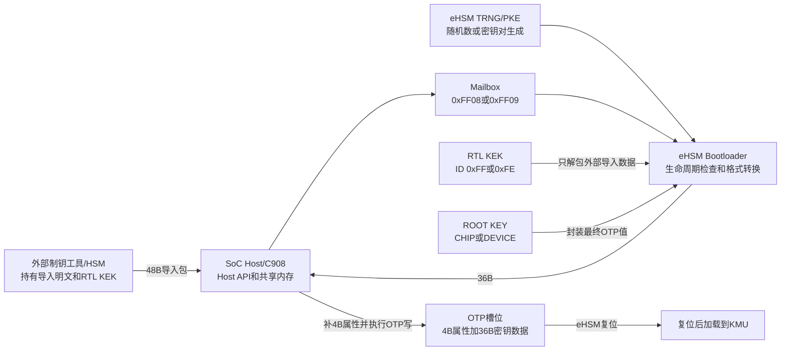
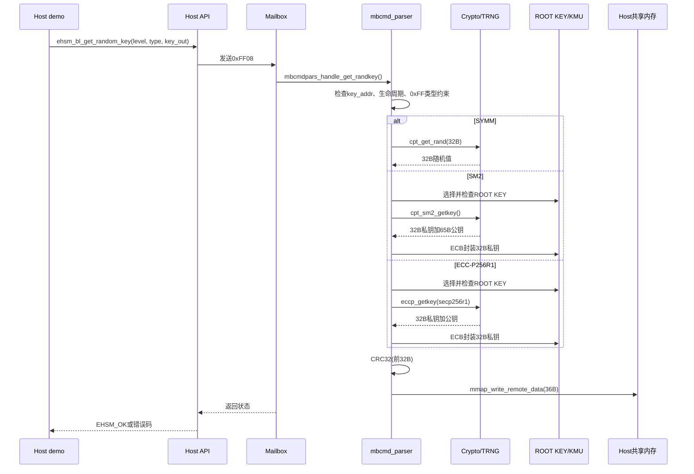
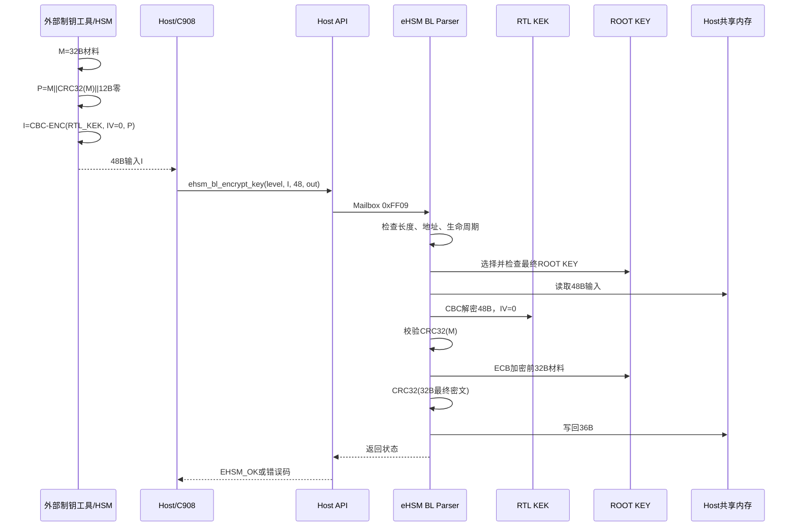
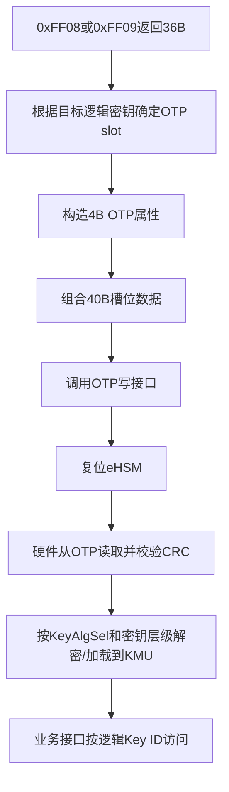

# eHSM Bootloader OTP密钥生成与转换流程深度解析

> 主Review索引：[`03_bootloader_deep_review.md`](03_bootloader_deep_review.md)。

## 1. 文档目标与范围

本文从Host demo中的`gen_otp_key`入口开始，沿Host API、Mailbox协议和eHSM Bootloader命令处理函数，完整梳理“生成可写入OTP的密钥数据”的两条路径：

1. eHSM内部生成随机密钥：`ehsm_bl_get_random_key()`。
2. 将外部提供的密钥或公钥Hash转换为OTP存储格式：`ehsm_bl_encrypt_key()`。

本文重点回答以下问题：

1. `gen_otp_key`相关demo实际调用了哪些API、发送了哪些Mailbox字段。
2. `EHSM_BL_GEN_KEY_TYPE_SYMM`、SM2和ECC-P256R1三种类型分别生成什么。
3. `key_level`如何决定生命周期限制、传输KEK和最终ROOT KEY。
4. 48字节输入、36字节输出和40字节OTP槽位之间是什么关系。
5. `KeyAlgSel`如何选择AES-128或SM4，CBC/ECB模式分别出现在哪一层。
6. Host demo当前验证了什么、没有验证什么。
7. 源码、API注释和demo注释之间有哪些不一致，以及需要向vendor确认哪些问题。

主要分析对象：

- Host demo [`ehsm_bl_demo_gen_otp_key.c`](../../ehsm_host-2.3.1-4019-2ee044d/demo/bl_demo/otp/ehsm_bl_demo_gen_otp_key.c)。
- Host公开API [`bl_api.h`](../../ehsm_host-2.3.1-4019-2ee044d/include/ehsmdrv/basic/bl_api.h)和[`api.h`](../../ehsm_host-2.3.1-4019-2ee044d/include/ehsmdrv/basic/api.h)。
- Host API实现 [`api.c`](../../ehsm_host-2.3.1-4019-2ee044d/src/api.c)和Mailbox结构 [`bl_mb.h`](../../ehsm_host-2.3.1-4019-2ee044d/src/bl_mb.h)。
- BL命令处理 [`mbcmd_parser.c`](../../ehsm_bl-2.3.5-4019-72f8fdc/src/component/mbcmd_parser.c)和[`mbcmd_parser.h`](../../ehsm_bl-2.3.5-4019-72f8fdc/src/component/mbcmd_parser.h)。
- OTP密钥管理 [`otp_key.c`](../../ehsm_bl-2.3.5-4019-72f8fdc/src/component/otp_key.c)、[`otp_key.h`](../../ehsm_bl-2.3.5-4019-72f8fdc/src/component/otp_key.h)和默认映射表[`secure_boot.c`](../../ehsm_bl-2.3.5-4019-72f8fdc/src/component/secure_boot.c)。
- 算法选择 [`sysreg.c`](../../ehsm_bl-2.3.5-4019-72f8fdc/src/driver/sysreg.c)和KMU接口 [`kmu.c`](../../ehsm_bl-2.3.5-4019-72f8fdc/src/driver/kmu.c)。
- Vendor手册 [`OSR_eHSM_Bootloader_TRM_4019_1.1.pdf`](../../docs/OSR_eHSM_Bootloader_TRM_4019_1.1.pdf)和[`OSR_eHSM_HP_Technical_Reference_Manual_CN.pdf`](../../docs/OSR_eHSM_HP_Technical_Reference_Manual_CN.pdf)。

本文只分析生成和格式转换流程，不把“返回36字节数据”误写成“已经完成OTP安装”。OTP属性组装、OTP写入、复位加载以及业务功能验证仍是后续独立步骤。

## 2. 核心结论

1. `ehsm_bl_demo_gen_otp_key_entry()`依次执行随机生成路径和外部密钥转换路径；两条路径都只返回36字节，不直接写OTP。
2. `ehsm_bl_get_random_key()`对应Mailbox命令`0xFF08`；`ehsm_bl_encrypt_key()`对应`0xFF09`。
3. 36字节输出固定为`32B OTP受保护值 || 4B CRC32(前32B)`，不包含4字节OTP属性。
4. 完整OTP密钥槽位是40字节：`4B属性 || 32B受保护值 || 4B CRC32`。调用者必须选择正确槽位并单独组装属性。
5. 外部导入路径的48字节输入是`CBC-ENC_RTL_KEK(32B材料 || 4B CRC || 12B填充)`；BL先用RTL KEK解包，再用对应ROOT KEY以ECB模式封装前32字节。
6. `key_level=1`表示最终使用`CHIP_ROOT_KEY`保护；`key_level=2`表示使用`DEVICE_ROOT_KEY`保护。协议内部还支持`0xFF`表示生成/导入`DEVICE_ROOT_KEY`本身，但公开Host枚举没有暴露该值。
7. `KeyAlgSel`只选择AES-128或SM4，不选择密钥层级，也不选择CBC/ECB模式。模式由具体软件流程固定。
8. SM2/ECC随机路径生成有效私钥和公钥，但只将32字节私钥封装后返回；生成的公钥没有返回给Host。
9. 对称随机路径源码仅生成32字节随机数并追加CRC，没有显式调用ROOT KEY加密。它与API/demo注释中的“ROOT KEY加密”描述不一致。
10. 对称路径可能采用“随机密文即OTP受保护值”的设计：块密码置换下，随机密文解密后仍得到均匀随机密钥。该解释符合代码行为，但源码和手册没有在当前交付件中明确说明，必须由vendor确认。
11. demo只检查API返回值并打印36字节，属于连通性演示，不是完整的密钥生成、烧录和可用性测试。
12. demo中的外部导入样例实际导入的是SM2公钥Hash；其结构体中的`key_type`没有进入API或Mailbox，是未参与流程的字段。

## 3. 参与者、密钥层级与信任边界



必须区分两类KEK：

| 密钥 | 作用 | 使用位置 | 是否形成最终OTP内容 |
|---|---|---|---|
| `CHIP RTL KEK EHSM` / `KID_INSTALL_KEK_EHSM=0xFF` | 保护一级密钥从外部工具到eHSM的导入包 | `ehsm_bl_encrypt_key()`输入解包 | 否 |
| `CHIP RTL KEK SOC` / `KID_INSTALL_KEK_SOC=0xFE` | 保护二级密钥或Device Root Key导入包 | `ehsm_bl_encrypt_key()`输入解包 | 否 |
| `CHIP_ROOT_KEY` | 保护一级OTP密钥，或保护Device Root Key | 最终32字节OTP值封装 | 是 |
| `DEVICE_ROOT_KEY` | 保护二级OTP密钥 | 最终32字节OTP值封装 | 是 |

RTL KEK解决“外部输入如何安全到达eHSM”的问题；ROOT KEY解决“密钥写入OTP后如何静态保存”的问题。二者不能混为同一个密钥层级。

## 4. Host demo的组织方式

### 4.1 总入口

`ehsm_bl_demo_gen_otp_key_entry()`按以下顺序运行：

```text
ehsm_bl_demo_gen_otp_key_entry
├── bl_get_rand_otp_key_entry
│   ├── DEVICE_ROOT_KEY / LEVEL_1 / SYMM
│   └── EHSM_DEBUG_KEY / LEVEL_1 / SM2
└── bl_enc_otp_key_entry
    └── EHSM_DEBUG_KEY with SM2 / LEVEL_1 / 固定48B密文输入
```

两个随机样例的配置是：

| demo描述 | `key_level` | `key_type` | 从代码实际得到的32字节内容 |
|---|---:|---:|---|
| `DEVICE_ROOT_KEY` | `EHSM_KEY_LEVEL_1` | `EHSM_BL_GEN_KEY_TYPE_SYMM` | eHSM TRNG生成的32字节随机值 |
| `EHSM_DEBUG_KEY` | `EHSM_KEY_LEVEL_1` | `EHSM_BL_GEN_KEY_TYPE_SM2` | eHSM生成并由Chip Root Key封装的32字节SM2私钥 |

第一行的含义是“要生成的业务密钥被Chip Root Key保护”，并不是说`key_level=1`本身等于Device Root Key。API只知道层级和类型，不知道输出最终要写入哪个逻辑槽位；`DEVICE_ROOT_KEY`只是demo文本标签。

### 4.2 `bl_get_rand_otp_key()`

函数执行步骤：

1. 取得全局`ehsm_ctx_st`。
2. 取得Host和eHSM均可访问的共享内存输出buffer。
3. 调用`ehsm_ctx_init(ctx, 1, false, NULL)`，选择Mailbox通道1和同步调用方式。
4. 调用`ehsm_bl_get_random_key(ctx, key_level, key_type, key_out)`。
5. 只检查返回值是否为`EHSM_OK`。
6. 成功时打印`key_out`中的36字节。

它没有执行OTP写入，也没有验证CRC或输出密钥的实际用途。

### 4.3 `bl_enc_otp_key()`

函数执行步骤：

1. 初始化同一个Host context。
2. 取得共享内存输入、输出buffer。
3. 将demo内置的48字节密文复制到输入buffer。
4. 调用`ehsm_bl_encrypt_key(ctx, key_level, input, 48, output)`。
5. 只检查返回值并打印36字节结果。

该48字节常量对应以下明文：

```text
32B SM2未压缩公钥的Hash
4B  CRC32(前32B)
12B 0x00填充
```

然后使用`eHSM RTL KEK`、`KeyAlgSel`选择的算法、CBC模式和全零IV加密。由于样例为`key_level=1`，BL侧使用`KID_INSTALL_KEK_EHSM`解密。

需要注意：`bl_demo_enc_otp_key_st`虽然包含`key_type`并填写为SM2，但`bl_enc_otp_key()`没有把它传入`ehsm_bl_encrypt_key()`。`0xFF09`命令本身也没有`key_type`字段，因此BL只把前32字节视为不透明材料，不知道它是对称密钥、私钥还是公钥Hash。

## 5. 两个公开API和Mailbox命令

| Host API | 命令ID | Host输入 | Host输出 | BL处理函数 |
|---|---:|---|---|---|
| `ehsm_bl_get_random_key()` | `0xFF08` | `key_level`、`key_type`、输出地址 | 36B | `mbcmdpars_handle_get_randkey()` |
| `ehsm_bl_encrypt_key()` | `0xFF09` | `key_level`、48B输入地址/长度、输出地址 | 36B | `mbcmdpars_handle_encrypt_key()` |

### 5.1 `0xFF08`命令布局

| 偏移 | 字段 | 长度 | 含义 |
|---:|---|---:|---|
| `0` | `cmd_id` | 2B | 固定`0xFF08` |
| `2` | `cmd_id_inv` | 2B | 命令ID按位取反，用于命令完整性检查 |
| `12` | `key_level` | 1B | `1`、`2`或协议内部值`0xFF` |
| `13` | `key_type` | 1B | `1`对称、`2` SM2私钥、`4` P-256私钥 |
| `40` | `key_addr` | `raddr_t` | eHSM写回36字节的Host远端地址 |

Host的`ehsm_bl_get_random_key()`只做context检查、清理命令buffer、填充上述字段并调用`ehsm_send_cmd()`。

### 5.2 `0xFF09`命令布局

| 偏移 | 字段 | 长度 | 含义 |
|---:|---|---:|---|
| `0` | `cmd_id` | 2B | 固定`0xFF09` |
| `2` | `cmd_id_inv` | 2B | 命令ID按位取反 |
| `12` | `key_level` | 1B | 决定RTL KEK、ROOT KEY和生命周期限制 |
| `32` | `input_addr` | `raddr_t` | 48字节RTL KEK密文的Host地址 |
| `40` | `input_size` | 4B | BL强制要求等于48 |
| `44` | `output_addr` | `raddr_t` | BL写回36字节的Host地址 |

`ehsm_bl_encrypt_key()`同样只负责封包和发送，不在Host库内部执行密码运算。

Mailbox发送、轮询/中断和响应处理的通用机制参见[`08_ehsm_mailbox_host_fw_otp_read_flow.md`](08_ehsm_mailbox_host_fw_otp_read_flow.md)。

## 6. 三种关键数据格式

### 6.1 外部导入输入：48字节

```text
明文布局：

偏移0x00                    偏移0x20     偏移0x24          偏移0x30
   |                           |            |                 |
   v                           v            v                 v
+-----------------------------+------------+-----------------+
| 密钥/私钥/公钥Hash，32B      | CRC32，4B  | 0x00填充，12B   |
+-----------------------------+------------+-----------------+

传输输入 = CBC-ENC(RTL_KEK, IV=16B全0, 上述48B, NoPadding)
```

CRC的计算是：

```c
crc = util_crc32(material, 32, 0xFFFFFFFFU);
```

BL用`util_memcpy()`直接在`uint32_t`和字节数组之间复制CRC，没有显式的大端网络序编码。当前平台按本机内存字节序解释这4字节，外部制钥工具必须与vendor格式保持一致。

### 6.2 API输出：36字节

```text
偏移0x00                    偏移0x20     偏移0x24
   |                           |            |
   v                           v            v
+-----------------------------+------------+
| OTP受保护值，32B             | CRC32，4B  |
+-----------------------------+------------+
```

对于显式封装路径：

```text
OTP受保护值 = ECB-ENC(ROOT_KEY, 32B材料, NoPadding)
CRC          = CRC32(OTP受保护值, seed=0xFFFFFFFF)
```

CRC保护的是最终32字节OTP密文，不是原始明文。

### 6.3 完整OTP槽位：40字节

源码定义：

```text
OTP_K_VALUE_SIZE = 32
OTP_K_CRC_SIZE   = 4
OTP_K_SIZE       = 36
单槽位总大小     = 40
```

结合Bootloader TRM的密钥烧写说明，完整槽位应理解为：

```text
+----------------+-----------------------------+------------+
| OTP属性，4B     | OTP受保护值，32B             | CRC32，4B  |
+----------------+-----------------------------+------------+
```

`0xFF08`和`0xFF09`只生成后36字节。调用者仍需完成：

1. 根据目标槽位生成正确的4字节属性。
2. 将属性和36字节结果组合为40字节。
3. 通过Bootloader OTP写接口写入正确OTP偏移。
4. 复位eHSM，使硬件重新读取OTP并加载/解密到KMU。
5. 使用目标业务接口验证该逻辑密钥是否可用。

## 7. `key_level`的真实作用

| 协议值 | Host公开枚举 | 最终保护ROOT KEY | 外部导入RTL KEK | 生命周期限制 | 备注 |
|---:|---|---|---|---|---|
| `0x01` | `EHSM_KEY_LEVEL_1` | `CHIP_ROOT_KEY` | `KID_INSTALL_KEK_EHSM` | 仅MCUTEST/DEVELOP | 一级OTP密钥 |
| `0x02` | `EHSM_KEY_LEVEL_2` | `DEVICE_ROOT_KEY` | `KID_INSTALL_KEK_SOC` | 到MANUFACTURE为止 | 二级OTP密钥 |
| `0xFF` | 无公开枚举 | 设计意图为`CHIP_ROOT_KEY` | `KID_INSTALL_KEK_SOC` | 通用检查允许到MANUFACTURE；显式取Chip Root Key时要求早于MANUFACTURE | Device Root Key特殊路径 |

### 7.1 生命周期检查

`mbcmdpars_check_lifecycle()`连续读取两次生命周期，中间插入`fid_delay()`：

```text
read lifecycle -> fid_delay -> read lifecycle again -> FID_EQ比较
```

两次结果不一致时调用`fid_panic()`，这是故障注入防护；结果一致后才执行业务限制：

- Level 1：生命周期大于`DEVELOP`即拒绝。
- Level 2或`0xFF`：生命周期大于`MANUFACTURE`即拒绝。
- 其他值：返回`EHSM_ERR_WRONG_K_LEVEL`。

### 7.2 ROOT KEY选择

`mbcmdpars_get_enc_keyid()`执行：

1. Level 1映射到逻辑ID`EHSM_OTP_CHIP_ROOT_KEY_ID`。
2. Level 2映射到逻辑ID`EHSM_OTP_DEVICE_ROOT_KEY_ID`。
3. `0xFF`映射到Chip Root Key，但在`MANUFACTURE`及以后拒绝，因为注释说明该阶段Chip Root Key不会解密到KMU。
4. `otpkey_check_usage()`确认逻辑密钥允许SKE用途和一级密钥使用方式。
5. `otpkey_get_phyid()`将逻辑ID转换为KMU物理槽位ID。

默认映射表中，Chip Root Key位于OTP槽位0，Device Root Key位于槽位1。这里的逻辑ID到物理槽位映射由`g_otp_default_keyid_map[]`提供，不是Host在命令中指定的。

### 7.3 `0xFF`接口缺口

BL协议和实现支持`GET_RANDOM_K_LEVEL_DEVICE_ROOT_KEY=0xFF`，但Host公开类型`ehsm_key_level_e`只定义1和2。C语言调用者可以强制转换传入`0xFF`，但这不是类型安全、文档化的公开用法。

因此，Device Root Key的正式生产接口究竟是：

- 由其他制钥工具直接构造；
- 通过未公开接口调用`0xFF`；
- 还是vendor遗漏了Host枚举；

当前代码无法单独给出确定答案，需要vendor确认。

## 8. 随机生成路径：`0xFF08`

### 8.1 完整时序



### 8.2 Handler入口检查

`mbcmdpars_handle_get_randkey()`按顺序执行：

1. 从Mailbox packet复制`mb_cmd_bl_get_random_key_st`。
2. 若`key_addr==0`，返回`EHSM_ERR_INVALID_ADDRESS`。
3. 调用`mbcmdpars_check_lifecycle(key_level)`。
4. 若`key_level==0xFF`但`key_type`不是对称类型，返回`EHSM_ERR_WRONG_KEY_TYPE`。
5. 调用`mbcmdpars_get_rankey()`生成36字节。
6. 通过`mmap_write_remote_data()`写回Host远端地址。

### 8.3 对称密钥：`EHSM_BL_GEN_KEY_TYPE_SYMM=1`

实际调用链：

```text
mbcmdpars_get_rankey
└── mbcmdpars_get_symkey
    └── cpt_get_rand(out_key, 32)
```

代码随后直接计算`CRC32(out_key[0..31])`并追加，没有调用：

- `mbcmdpars_get_enc_keyid()`；
- `cpt_ske_crypto()`；
- Chip Root Key或Device Root Key。

因此，从可观察代码事实看，返回前32字节就是TRNG输出本身。

一种合理的设计解释是：对于新生成的对称密钥，软件无需先生成明文`P`再计算`C=ENC_K(P)`；可以直接生成均匀随机的`C`作为OTP密文。设备启动时由硬件计算`P=DEC_K(C)`，在安全块密码为置换的前提下，`P`仍是均匀随机密钥。这样能够生成ROOT KEY保护下的随机密钥，同时不在BL内显式使用ROOT KEY。

该解释能说明以下代码现象：

- 对称分支不访问ROOT KEY。
- Device Root Key特殊值`0xFF`只能生成对称类型。
- 在Chip Root Key不再装入KMU的阶段，仍可能生成将由硬件后续解密的随机OTP值。

但这只是根据实现作出的推断。API注释和demo注释直接描述为“使用ROOT KEY加密”，没有解释“随机密文”机制，故不能把该推断当作vendor已确认设计。

### 8.4 SM2私钥：`EHSM_BL_GEN_KEY_TYPE_SM2=2`

实际过程：

1. 根据`key_level`选择Chip Root Key或Device Root Key。
2. 检查该ROOT KEY的算法用途并取得KMU物理ID。
3. `cpt_sm2_getkey(out_key, &out_key[32])`生成：
   - `out_key[0..31]`：32字节SM2私钥；
   - `out_key[32..]`：对应SM2公钥。
4. 仅将前32字节私钥使用ROOT KEY、`KeyAlgSel`算法、ECB、NoPadding原地加密。
5. 对32字节密文计算CRC并返回36字节。

`key_buf`有128字节，足以暂存公钥，但`mmap_write_remote_data()`只写`OTP_K_SIZE=36`，所以Host拿不到生成的公钥。

若该私钥后续用于签名，项目必须明确对应公钥从哪里获得和登记。当前API没有提供公钥导出通道。

### 8.5 ECC-P256R1私钥：`EHSM_BL_GEN_KEY_TYPE_ECC_P256R1=4`

该分支与SM2相同，差别是调用`eccp_getkey(secp256r1, ...)`生成P-256密钥对。最终仍只返回由ROOT KEY封装的32字节私钥和4字节CRC，公钥不返回。

### 8.6 随机路径的类型矩阵

| `key_type` | 生成对象 | 是否显式选择ROOT KEY | 是否显式ROOT ECB封装 | Host得到的内容 |
|---:|---|---|---|---|
| `1` | 32B随机对称材料 | 否 | 否 | 32B随机值+CRC |
| `2` | SM2密钥对 | 是 | 是，只封装32B私钥 | 私钥密文+CRC |
| `4` | P-256密钥对 | 是 | 是，只封装32B私钥 | 私钥密文+CRC |
| 其他 | 无 | 否 | 否 | `EHSM_ERR_WRONG_KEY_TYPE` |

## 9. 外部密钥转换路径：`0xFF09`

### 9.1 完整时序



### 9.2 Handler入口检查

`mbcmdpars_handle_encrypt_key()`按顺序检查：

1. `input_size`必须严格等于`OTP_INSTALL_K_SIZE=48`，否则返回`EHSM_ERR_WRONG_KEY_SIZE`。
2. `input_addr`和`output_addr`均不能为0，否则返回`EHSM_ERR_INVALID_ADDRESS`。
3. 检查`key_level`和生命周期。
4. 根据`key_level`选择最终ROOT KEY，并验证用途、取得物理ID。
5. 从Host远端地址读取48字节。
6. 调用`mbcmdpars_dec_key_by_rtlkey()`解包。
7. 调用`mbcmdpars_enc_key()`生成36字节OTP数据。
8. 将36字节写回Host。

### 9.3 RTL KEK解包

`mbcmdpars_dec_key_by_rtlkey()`的选择规则：

| `key_level` | 解包密钥ID | 理由 |
|---:|---:|---|
| `1` | `KID_INSTALL_KEK_EHSM=0xFF` | 一级密钥使用eHSM侧安装KEK |
| `2` | `KID_INSTALL_KEK_SOC=0xFE` | 二级密钥使用SoC侧安装KEK |
| `0xFF` | `KID_INSTALL_KEK_SOC=0xFE` | Device Root Key允许在更晚阶段导入，此时eHSM侧Chip RTL KEK可能已禁用 |

密码参数固定为：

```text
算法：KeyAlgSel选择AES-128或SM4
模式：CBC
方向：Decrypt
IV：16字节全0
Padding：NoPadding
长度：48字节
```

解密后只检查：

```text
CRC32(前32B) == 解密结果[32..35]
```

代码没有检查最后12字节是否全部为0。因此“12B零填充”是外部格式约定，不是当前BL严格校验项。

### 9.4 ROOT KEY重新封装

CRC通过后，`mbcmdpars_enc_key()`对前32字节执行：

```text
算法：KeyAlgSel选择AES-128或SM4
模式：ECB
方向：Encrypt
密钥：key_level对应的ROOT KEY
Padding：NoPadding
长度：32字节
```

若密码接口返回长度不是32，BL返回`EHSM_ERR_WRONG_KEY_SIZE`。成功后对32字节密文计算CRC并追加，形成36字节输出。

### 9.5 为什么导入接口没有`key_type`

对`0xFF09`而言，前32字节只是“不透明材料”：

- 可以是对称密钥；
- 可以是SM2/P-256私钥；
- 可以是公钥Hash；
- 也可能是其他由目标OTP属性解释的32字节值。

BL只做传输解包、CRC校验和ROOT KEY重封装，不检查材料的密码学语义。最终语义由“写到哪个OTP槽位”和“4字节属性如何设置”共同决定。

## 10. `KeyAlgSel`、算法和模式的关系

`sysreg_get_otpkey_dec_alg()`读取`SYS_HW_CFG_REG1`中的OTP KeyAlgSel字段：

```text
字段值 == 1  -> AES-128
其他值       -> SM4
```

该寄存器是OTP HW Control配置经硬件加载后的系统控制寄存器镜像。它不是每条Mailbox命令携带的算法字段，因此Host不能按单次调用自由选择AES或SM4。

| 环节 | 算法来源 | 模式 | IV | 密钥 |
|---|---|---|---|---|
| 外部工具构造48B导入包 | OTP `KeyAlgSel` | CBC | 16B全0 | eHSM RTL KEK或SoC RTL KEK |
| BL解包48B导入数据 | `sysreg_get_otpkey_dec_alg()` | CBC | 16B全0 | eHSM RTL KEK或SoC RTL KEK |
| BL封装外部32B材料 | `sysreg_get_otpkey_dec_alg()` | ECB | 无 | Chip Root Key或Device Root Key |
| BL封装SM2/P-256随机私钥 | `sysreg_get_otpkey_dec_alg()` | ECB | 无 | Chip Root Key或Device Root Key |
| BL生成对称随机值 | 不使用SKE | 无 | 无 | 不显式使用ROOT KEY |

外部工具必须读取或预先获知目标芯片的`KeyAlgSel`。若工具按AES生成48字节输入，而芯片配置为SM4，BL解密后的CRC会失败。

## 11. 从36字节到OTP/KMU的后续流程



默认逻辑映射示例：

| OTP槽位 | 逻辑Key ID | 默认算法属性 | 典型用途 |
|---:|---|---|---|
| 0 | `EHSM_OTP_CHIP_ROOT_KEY_ID` | SM4 | 一级密钥根 |
| 1 | `EHSM_OTP_DEVICE_ROOT_KEY_ID` | SM4 | 二级密钥根 |
| 3 | `EHSM_OTP_EHSM_DEBUG_KEY_ID` | SM2 | eHSM Debug信任锚 |
| 4 | `EHSM_OTP_EHSM_FW_VERIFY_KEY_ID` | SM2 | eHSM固件验签信任锚 |
| 9 | `EHSM_OTP_SOC_DEBUG_KEY_ID` | SM2 | SoC Debug信任锚 |

这里需要额外警惕：Debug Auth源码使用32字节公钥Hash作为非对称调试信任锚，而随机SM2接口返回的是被封装的32字节私钥。两者长度相同但语义完全不同，不能因为目标槽位标记为SM2就直接互换。

Debug信任锚的具体使用方式参见[`09_ehsm_debug_auth_challenge_response_deep_dive.md`](09_ehsm_debug_auth_challenge_response_deep_dive.md)。

## 12. Host到Device的两条调用链

### 12.1 随机生成

```text
ehsm_bl_demo_gen_otp_key_entry
-> bl_get_rand_otp_key_entry
-> bl_get_rand_otp_key
-> ehsm_bl_get_random_key                         Host公开API
-> ehsm_set_cmd_id(0xFF08)
-> ehsm_send_cmd                                  Host Mailbox层
-> eHSM Mailbox接收/调度
-> mbcmdpars_parse_cmd
-> mbcmdpars_handle_get_randkey
-> mbcmdpars_check_lifecycle
-> mbcmdpars_get_rankey
   -> mbcmdpars_get_symkey -> cpt_get_rand
   或
   -> mbcmdpars_get_enc_keyid
   -> mbcmdpars_get_sm2key / mbcmdpars_get_secckey
   -> cpt_ske_crypto(ROOT KEY, ECB)
-> util_crc32
-> mmap_write_remote_data(36B)
-> Mailbox响应
-> Host打印结果
```

### 12.2 外部密钥转换

```text
ehsm_bl_demo_gen_otp_key_entry
-> bl_enc_otp_key_entry
-> bl_enc_otp_key
-> ehsm_bl_encrypt_key                            Host公开API
-> ehsm_set_cmd_id(0xFF09)
-> ehsm_send_cmd                                  Host Mailbox层
-> eHSM Mailbox接收/调度
-> mbcmdpars_parse_cmd
-> mbcmdpars_handle_encrypt_key
-> mbcmdpars_check_lifecycle
-> mbcmdpars_get_enc_keyid                        选择最终ROOT KEY
-> mmap_read_remote_data(48B)
-> mbcmdpars_dec_key_by_rtlkey                    RTL KEK/CBC解包和CRC检查
-> mbcmdpars_enc_key                              ROOT KEY/ECB重封装和CRC生成
-> mmap_write_remote_data(36B)
-> Mailbox响应
-> Host打印结果
```

## 13. 当前demo到底测试了什么

### 13.1 已覆盖

| 测试项 | 覆盖情况 |
|---|---|
| Host context初始化 | 已覆盖 |
| Mailbox通道1发送和收包 | 已覆盖 |
| `0xFF08`命令分发 | 已覆盖 |
| Level 1对称随机分支 | 已覆盖 |
| Level 1 SM2私钥生成和ROOT KEY封装分支 | 已覆盖 |
| `0xFF09` 48B输入读取和RTL KEK解包 | 已覆盖一个固定向量 |
| 外部32B材料的ROOT KEY重封装 | 已覆盖Level 1固定公钥Hash |
| 返回码和36B输出可访问 | 已覆盖 |

### 13.2 未覆盖

| 缺失项 | 风险 |
|---|---|
| Host重新计算输出CRC | 输出格式错误无法被demo发现 |
| 两次对称随机结果非重复检查 | TRNG固定/退化无法被demo发现 |
| Level 2路径 | Device Root Key、SoC RTL KEK路径未验证 |
| `0xFF` Device Root Key路径 | 正式制造流程未验证 |
| ECC-P256R1路径 | 第三种公开类型未验证 |
| 错误`key_type`、`key_level`、地址和长度 | 参数校验分支未验证 |
| 生命周期边界 | DEVELOP/MANUFACTURE限制未验证 |
| 错误RTL KEK、错误CRC | 导入数据拒绝能力未验证 |
| 非零12B填充 | 当前实现不检查，demo也未暴露该事实 |
| 4B属性组装和40B OTP写入 | demo并未真正安装密钥 |
| eHSM复位和KMU加载 | 生成结果能否生效未验证 |
| 目标业务接口使用 | 密钥语义或槽位配错无法被发现 |
| SM2/P-256公钥留存 | 私钥对应公钥无法建立关联 |

因此更准确的结论是：该demo验证了“命令可以执行并返回36字节”，没有验证“生成的密钥已正确安装且可用于预期业务”。

## 14. 代码、注释与设计之间的不一致

### 14.1 对称随机路径没有显式ROOT KEY加密

API注释说输出“被ROOT KEY加密的密钥值”，demo注释还写到CBC和全零IV；但BL源码的对称分支只是`cpt_get_rand(32B)`加CRC。

可能是随机密文设计，也可能是实现或文档遗漏。项目评审不能直接忽略该差异。

### 14.2 随机私钥路径实际使用ECB，不是CBC

SM2和P-256随机私钥分支明确调用`SKE_MODE_ECB`。CBC和全零IV只出现在48字节RTL KEK导入包的解包层。

### 14.3 随机API不“安装”密钥

demo函数内注释曾描述“生成并安装”“写入slot_id对应OTP位置”，但API没有`slot_id`参数，BL handler只写Host共享内存。实际OTP写入必须由Host另行完成。

### 14.4 36字节不包含密钥属性

demo注释存在“含密钥属性和CRC”的表述，但API头、常量和BL写回长度均表明只有32B值和4B CRC。4B属性不在返回数据内。

### 14.5 外部导入demo的`key_type`是无效字段

结构体中的`key_type`用于描述样例，但没有进入`ehsm_bl_encrypt_key()`。若项目代码依赖该字段驱动BL检查，会产生错误安全假设。

### 14.6 随机SM2私钥与Debug公钥Hash语义冲突

demo将随机SM2结果标记为`EHSM_DEBUG_KEY`，但Debug Auth非对称流程期望对应槽位保存授权公钥Hash，而不是设备生成的私钥。外部导入样例使用公钥Hash反而与Debug Auth代码一致。

## 15. 安全Review发现

### FINDING-OTPKEY-01：外部导入包使用固定全零IV

**级别：设计约束/需确认**

CBC固定零IV会让相同明文在同一RTL KEK下产生相同密文，不提供语义安全的随机化。该格式可能只用于受控制造环境的一次性导入，但必须限制重复使用、日志暴露和跨设备复用。

### FINDING-OTPKEY-02：完整性只使用非密钥CRC32

**级别：中**

48字节包解密后只使用CRC32判断正确性。CRC可发现随机错误和大多数错误密钥解密结果，但不是密码学认证码，不能替代CMAC/GCM标签。安全性主要依赖攻击者无法构造RTL KEK下的有效CBC密文。

### FINDING-OTPKEY-03：未验证12字节零填充

**级别：低/格式严格性**

BL只校验前32字节的CRC，忽略解密结果最后12字节。不同外部工具可产生不一致的“合法”包，隐藏通道或格式污染也不会被拒绝。

### FINDING-OTPKEY-04：敏感中间数据未在函数返回前显式清零

**级别：中**

`mbcmdpars_dec_key_by_rtlkey()`的局部`key[64]`包含解密后的32字节明文；`mbcmdpars_handle_encrypt_key()`的`key_buf[128]`也暂存明文。随机路径的`mbcmdpars_handle_get_randkey()`同样使用`key_buf[128]`暂存随机对称值，或SM2/P-256的私钥和公钥。上述函数返回前均未见显式安全清零，需要确认vendor是否在更底层实现了栈清理，以及项目是否要求使用不会被编译器优化掉的安全清零函数。

### FINDING-OTPKEY-05：Host demo不是完整OTP安装测试

**级别：测试缺口**

demo打印成功容易让集成方误以为密钥已经写入OTP。项目测试必须补充40字节组装、OTP写入、复位、KMU加载和业务使用闭环。

### FINDING-OTPKEY-06：SM2/P-256随机生成不返回公钥

**级别：接口可用性/需确认**

BL生成了公钥但仅返回私钥密文。若对应私钥用于签名、设备身份或密钥协商，Host无法通过该API取得并认证对应公钥。

### FINDING-OTPKEY-07：关键语义依赖槽位和属性，命令自身不绑定用途

**级别：中**

`0xFF09`不携带slot、逻辑Key ID或key type。相同36字节输出可被Host写入不同槽位并赋予不同属性。生产工具必须在eHSM命令之外建立严格的“目标用途-槽位-属性-输入材料”策略和审计。

### FINDING-OTPKEY-08：对称随机路径的设计语义未文档化

**级别：高优先级澄清项**

源码没有显式ROOT KEY封装，文档却声称已加密。若“随机密文”解释成立，应由vendor在TRM中明确写出；若不成立，则可能是实现缺陷。

## 16. 建议的完整测试流程

### 16.1 随机对称密钥

1. 确认目标生命周期允许对应`key_level`。
2. 连续调用`ehsm_bl_get_random_key()`至少两次。
3. 检查返回值、长度和输出地址范围。
4. 分别重算`CRC32(output[0..31], 0xFFFFFFFF)`并比较后4字节。
5. 检查两次前32字节不相同；统计性TRNG测试应使用专门测试套件，不能只靠一次比较。
6. 生成正确4字节属性并写入测试OTP槽位。
7. 复位eHSM并确认KMU加载成功。
8. 通过实际SKE/HMAC等业务接口使用该密钥完成正反向测试。

### 16.2 外部导入公钥Hash或私钥

1. 外部工具确定目标`KeyAlgSel`、`key_level`和对应RTL KEK。
2. 构造`32B材料 || CRC32 || 12B零`。
3. 使用CBC、全零IV、NoPadding生成48字节输入。
4. 调用`ehsm_bl_encrypt_key()`并校验36字节输出CRC。
5. 用错误CRC、错误RTL KEK、错误长度和错误level执行负向测试。
6. 组装40字节OTP槽位并写入。
7. 复位加载后，用对应业务验证语义：
   - 公钥Hash：使用匹配/不匹配公钥做Debug Auth或镜像验签；
   - 私钥：执行签名或密钥协商并用已登记公钥验证；
   - 对称密钥：执行已知明文/密文或MAC向量。

### 16.3 生命周期矩阵

至少验证：

| 生命周期 | Level 1 | Level 2 | `0xFF` |
|---|---|---|---|
| MCUTEST | 允许 | 允许 | 允许，按正式接口确认 |
| DEVELOP | 允许 | 允许 | 允许，按正式接口确认 |
| MANUFACTURE | 拒绝 | 允许 | 随机对称与显式ROOT封装行为需分别验证 |
| 更晚阶段 | 拒绝 | 拒绝 | 拒绝 |

## 17. 需要向Vendor确认的问题

1. 对称随机分支是否明确采用“直接生成随机OTP密文，启动时再由ROOT KEY解密”的设计？请提供TRM章节或密码学设计说明。
2. 为什么demo注释称随机密钥使用CBC，而SM2/P-256源码使用ECB、对称分支不调用SKE？哪一份描述是正式规范？
3. `0xFF` Device Root Key层级的正式Host API是什么？为什么`ehsm_key_level_e`没有公开该值？
4. `0xFF`在MANUFACTURE阶段的允许范围是什么？随机对称路径和外部导入路径是否有意采用不同限制？
5. SM2/P-256随机生成接口为什么不返回公钥？项目应通过什么接口取得、登记并验证对应公钥？
6. demo将随机SM2私钥标记为`EHSM_DEBUG_KEY`是否错误？Debug Auth代码实际要求的OTP内容是否确定为授权公钥Hash？
7. 完整4字节OTP密钥属性的正式位定义、CRC字节序和40字节烧录样例是什么？
8. 外部48字节导入包最后12字节是否必须为零？若必须，BL为什么不检查？
9. 固定零IV加CRC32是否只面向受控制造环境？协议是否有防重放、设备绑定或批次绑定要求？
10. `g_otp_default_keyid_map[]`将Root Key算法属性配置为SM4时，`KeyAlgSel=AES128`场景如何保证属性、KMU和SKE算法一致？
11. 明文中间buffer是否有vendor要求的安全清零、栈隔离或故障注入防护实现？
12. 量产工具如何获得每颗芯片对应的RTL KEK，密钥是否设备唯一，是否允许跨设备复用导入包？

## 18. Review结论

从Host到eHSM的OTP密钥准备流程可以概括为两类：

```text
内部生成：eHSM生成随机材料/私钥 -> 必要时ROOT KEY封装 -> 36B返回

外部导入：RTL KEK解包48B -> 校验明文CRC -> ROOT KEY重封装 -> 36B返回
```

两者的共同终点只是“得到可参与OTP槽位组装的36字节密钥数据”，不是“完成密钥安装”。项目移植和量产工具必须继续完成属性绑定、槽位选择、OTP写入、复位加载和业务验收。

当前最重要的两个review结论是：

1. 对称随机路径的源码行为与文档描述不同，必须确认“随机密文”是否为正式设计。
2. `0xFF09`对32字节材料不做语义绑定，密钥用途安全依赖Host侧制造策略；C908安全管理服务必须对slot、属性、level、输入类型和生命周期做统一策略控制，不能直接把底层API暴露给多个普通任务。

## 19. 推荐阅读顺序

1. [`ehsm_bl_demo_gen_otp_key.c`](../../ehsm_host-2.3.1-4019-2ee044d/demo/bl_demo/otp/ehsm_bl_demo_gen_otp_key.c)：先看三个demo入口和固定48字节样例。
2. [`bl_api.h`](../../ehsm_host-2.3.1-4019-2ee044d/include/ehsmdrv/basic/bl_api.h)：确认公开参数、输出长度和注释承诺。
3. [`api.c`](../../ehsm_host-2.3.1-4019-2ee044d/src/api.c)：确认Host只封装Mailbox命令。
4. [`bl_mb.h`](../../ehsm_host-2.3.1-4019-2ee044d/src/bl_mb.h)：确认`0xFF08/0xFF09`字段和偏移。
5. [`mbcmd_parser.c`](../../ehsm_bl-2.3.5-4019-72f8fdc/src/component/mbcmd_parser.c)：重点阅读`mbcmdpars_get_rankey()`、`mbcmdpars_dec_key_by_rtlkey()`和两个handler。
6. [`sysreg.c`](../../ehsm_bl-2.3.5-4019-72f8fdc/src/driver/sysreg.c)：确认`KeyAlgSel`来源。
7. [`otp_key.h`](../../ehsm_bl-2.3.5-4019-72f8fdc/src/component/otp_key.h)和[`secure_boot.c`](../../ehsm_bl-2.3.5-4019-72f8fdc/src/component/secure_boot.c)：确认36B、40B、逻辑ID和物理槽位的关系。
8. Bootloader TRM密钥烧写章节：确认属性格式、OTP偏移和制造时序。
