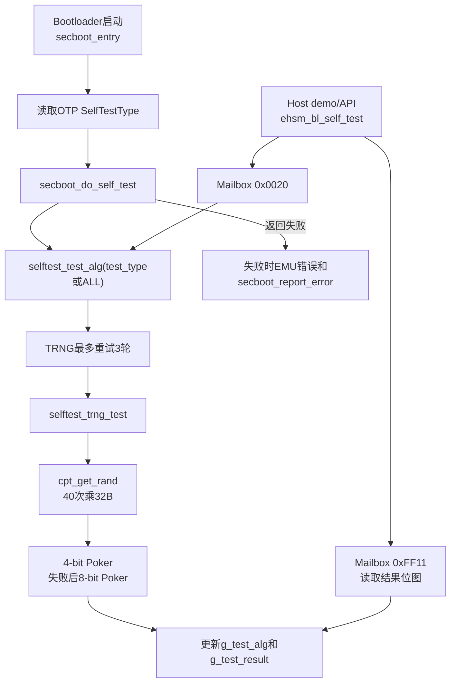
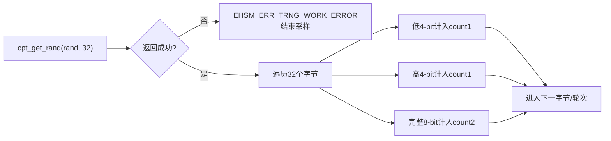
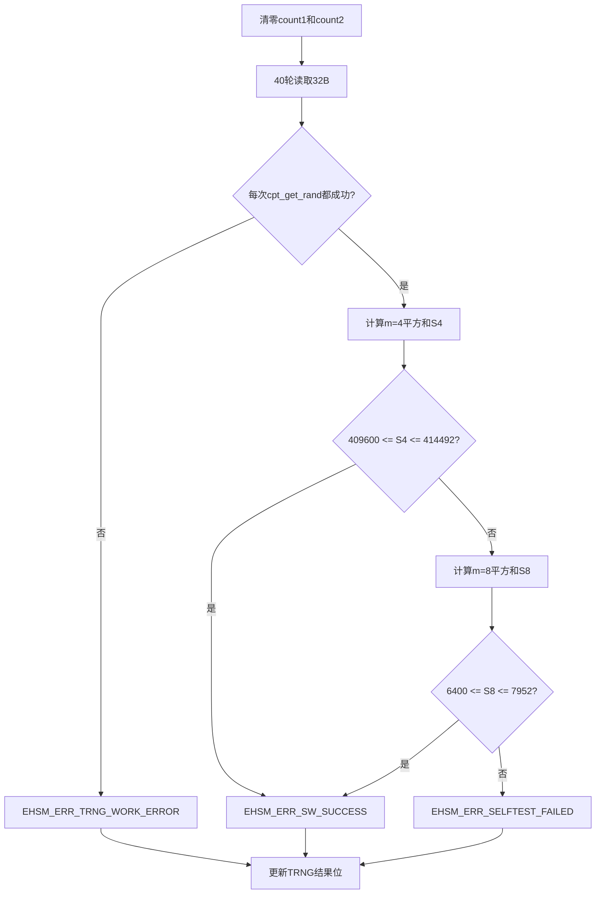
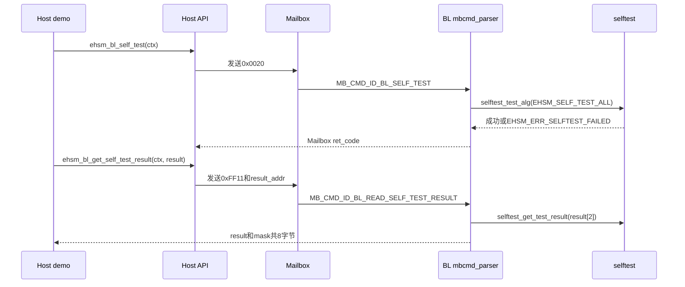

# eHSM Bootloader TRNG自检流程与Poker统计原理深度解析

> 主Review索引：[`03_bootloader_deep_review.md`](03_bootloader_deep_review.md)。

## 1. 文档目标与分析范围

本文围绕Bootloader [`selftest.c`](../../ehsm_bl-2.3.5-4019-72f8fdc/src/component/selftest.c)中的`selftest_trng_test()`，说明TRNG自检的数据来源、采样过程、Poker统计原理、4-bit/8-bit阈值、重试策略、结果位图及启动失败处理。

本文重点回答以下问题：

1. `selftest_trng_test()`究竟在测试什么，是否属于已知答案测试。
2. 为什么采集40轮、每轮32字节，总计1280字节。
3. `count1[16]`和`count2[256]`分别统计什么。
4. `409600~414492`和`6400~7952`两组阈值从统计学上表示什么。
5. 4-bit和8-bit测试是同时满足、先后串联，还是二选一。
6. `TRNG_RETRY_COUNT=3`如何影响最终判断。
7. 测试对象是原始RO熵、TRNG硬件输出，还是后处理后的随机数。
8. 自检结果如何进入`g_test_alg/g_test_result`、Host API和Bootloader启动错误路径。
9. 当前实现可以发现哪些故障，不能证明哪些安全性质。

主要分析对象：

- BL自检实现 [`selftest.c`](../../ehsm_bl-2.3.5-4019-72f8fdc/src/component/selftest.c)和结果位定义[`selftest.h`](../../ehsm_bl-2.3.5-4019-72f8fdc/src/component/selftest.h)。
- BL密码封装 [`crypto_lib_api.c`](../../ehsm_bl-2.3.5-4019-72f8fdc/src/component/crypto_lib_api.c)。
- TRNG配置 [`trng_config.h`](../../ehsm_bl-2.3.5-4019-72f8fdc/libs/osr_crypto/crypto_include/trng_config.h)、高层实现[`trng.c`](../../ehsm_bl-2.3.5-4019-72f8fdc/libs/osr_crypto/crypto_lib/trng/trng.c)和底层实现[`trng_basic.c`](../../ehsm_bl-2.3.5-4019-72f8fdc/libs/osr_crypto/crypto_hal/trng_basic.c)。
- BL启动编排 [`secure_boot.c`](../../ehsm_bl-2.3.5-4019-72f8fdc/src/component/secure_boot.c)。
- BL Mailbox命令分发 [`mbcmd_parser.c`](../../ehsm_bl-2.3.5-4019-72f8fdc/src/component/mbcmd_parser.c)。
- Host API [`api.c`](../../ehsm_host-2.3.1-4019-2ee044d/src/api.c)、协议结构[`bl_mb.h`](../../ehsm_host-2.3.1-4019-2ee044d/src/bl_mb.h)和demo [`ehsm_bl_demo_self_test.c`](../../ehsm_host-2.3.1-4019-2ee044d/demo/bl_demo/self_test/ehsm_bl_demo_self_test.c)。

## 2. 核心结论

1. `selftest_trng_test()`不是已知答案测试，因为随机数不存在每次固定的正确输出；它是对10240 bit输出执行的Poker频数统计测试。
2. 一轮测试调用`cpt_get_rand()`40次，每次32字节，共采集1280字节。
3. 同一批数据同时形成两组直方图：2560个4-bit样本和1280个8-bit样本。
4. 算法使用频数平方和`S=Σf_i²`衡量分布集中程度；越接近均匀分布，平方和越接近理论最小值。
5. `m=4`阈值为`409600<=S<=414492`；若通过，函数直接成功，不再执行`m=8`判断。
6. 只有`m=4`失败时才执行`m=8`，其阈值为`6400<=S<=7952`；因此单轮通过条件是`m4_pass OR m8_pass`，不是二者都通过。
7. `selftest_test_alg()`最多重试三轮完整TRNG测试，任意一轮通过即把TRNG整体判为成功。
8. 当前构建定义了`CONFIG_TRNG_GENERATE_BY_HARDWARE`和`TRNG_RO_ENTROPY`，但`selftest_trng_test()`调用的是`cpt_get_rand()`；正常硬件路径得到的是TRNG后处理/DRBG输出，不是直接读取RO原始熵序列。
9. TRNG结果占自检位图bit18，即`EHSM_SELF_TEST_TRNG=1<<18=0x00040000`；Host公开头使用十六进制值`0x80000`，与BL源码存在一位差异，必须进一步核对版本和协议一致性。
10. 启动自检失败会记录TRNG EMU错误并进入`secboot_report_error()`；非MCUTEST生命周期停在WFI，MCUTEST允许返回并继续。
11. Host demo当前强制执行`ret=EHSM_OK`，会忽略`ehsm_bl_self_test()`命令本身的返回码，只依赖后续结果位图比较。
12. Poker测试只能发现明显频数偏置、固定输出或分布集中，不能单独证明熵值、不可预测性、独立性或所有TRNG健康测试要求。

> 重要：第9项是代码版本对照发现。BL [`selftest.h`](../../ehsm_bl-2.3.5-4019-72f8fdc/src/component/selftest.h)定义TRNG为bit18，即`0x40000`；Host [`bl_api.h`](../../ehsm_host-2.3.1-4019-2ee044d/include/ehsmdrv/basic/bl_api.h)定义`EHSM_SELF_TEST_TRNG=0x80000`。Host只做`mask==result`比较时不一定暴露该漂移，但按宏单独解析TRNG位会出错。

## 3. 它与其他密码算法自检的区别

AES、SM4、Hash、RSA、SM2等算法可以使用固定输入和固定期望输出做Known Answer Test：

```text
固定输入 + 固定密钥 -> 执行算法 -> 与固定输出比较
```

TRNG不能这样做：

- 每次输出都相同，反而表示随机源失效。
- 无法预先规定某次采样的正确随机字节。
- 只能通过统计性质、硬件健康测试和熵源状态判断输出是否出现异常。

`selftest_trng_test()`选择的办法是Poker频数检验：把随机序列切成固定长度符号，统计每种符号的出现频数，再判断分布是否过度集中。

## 4. 总体调用链



存在两个入口：

| 入口 | 触发位置 | 测试集合 | 失败影响 |
|---|---|---|---|
| 启动自动自检 | `secboot_entry()->secboot_do_self_test()` | 由OTP SelfTestType和镜像算法决定，或测试全部 | 记录EMU错误；非MCUTEST进入WFI |
| Host命令自检 | `ehsm_bl_self_test()`，命令`0x0020` | 固定`EHSM_SELF_TEST_ALL` | 错误码返回Host，同时更新结果位图 |

## 5. 单轮采样过程

源码常量：

```c
#define POKER_RAND_BYTE 1280
#define POKER_LENGTH    32U
#define POKER_ROUND     40U
```

实际循环使用`POKER_LENGTH`和`POKER_ROUND`：

```text
40轮 × 32字节 = 1280字节 = 10240 bit
```

`POKER_RAND_BYTE`只用于表达设计总量，当前函数没有直接引用该宏。

每轮处理如下：



例如随机字节为`0xA3`：

```text
count1[0x3]++   低4-bit
count1[0xA]++   高4-bit
count2[0xA3]++  完整8-bit
```

因此，同一批1280字节形成：

| 数组 | 符号宽度`m` | 类别数`q=2^m` | 样本数`N` | 均匀分布期望频数 |
|---|---:|---:|---:|---:|
| `count1[16]` | 4 bit | 16 | 2560 | 每类160次 |
| `count2[256]` | 8 bit | 256 | 1280 | 每类5次 |

`count1`和`count2`使用`uint16_t`，最大计数分别不超过2560和1280，不会发生16位溢出；对应平方和也不会超过`uint32_t`范围。

## 6. Poker统计的数学原理

### 6.1 为什么计算频数平方和

设：

- `m`为每个符号的bit数。
- `q=2^m`为符号类别数。
- `N`为样本总数。
- `f_i`为第`i`种符号出现次数。
- `Σf_i=N`。

源码计算：

```text
S = Σ(f_i²)
```

如果所有类别完全均匀：

```text
f_i = N/q
S_min = q × (N/q)² = N²/q
```

只要频数开始集中到少数类别，平方会放大偏差，使`S`增大。例如把一次计数从较少类别移到较多类别，平方和会增加。

### 6.2 与卡方统计量的关系

常见Poker统计量可写为：

```text
X = (q/N) × Σ(f_i²) - N
  = (q/N) × S - N
```

这与Pearson卡方拟合优度统计量等价。均匀分布越合理，`X`越小；分布越不均匀，`X`越大。

源码没有直接计算浮点数`X`，而是对整数平方和`S`设阈值。这样可以避免浮点运算，适合Bootloader环境。

## 7. `m=4`判断

### 7.1 参数

```text
m = 4
q = 2^4 = 16
N = 1280 × 2 = 2560
期望频数 = 2560/16 = 160
```

完全均匀时：

```text
S_min = 16 × 160²
      = 409600
```

源码通过条件：

```c
if ((409600U <= sum) && (sum <= 414492U))
```

转换为Poker统计量：

```text
X = (16/2560) × S - 2560
  = S/160 - 2560
```

| `S` | `X` | 含义 |
|---:|---:|---|
| `409600` | `0` | 理论完全均匀 |
| `414492` | `30.575` | 源码接受上限 |

从数值看，`30.575`非常接近15个自由度卡方分布的常见1%上侧阈值。该对应关系是基于公式和常见统计阈值作出的分析，不是当前源码注释明确给出的vendor规范来源。

### 7.2 极端示例

若全部4-bit符号都是0：

```text
count1[0] = 2560
其他count1 = 0
S = 2560² = 6553600
```

远大于`414492`，因此失败。

### 7.3 下限的意义

由于`Σf_i=2560`且类别数为16，平方和理论上不可能低于`409600`。因此，在计数正确且不溢出的前提下：

```text
409600 <= S
```

基本是数学必然条件，实际筛选作用主要来自上限`414492`。

## 8. `m=8`判断

### 8.1 执行条件

源码只有在`m=4`失败时才执行`m=8`：

```c
if (EHSM_ERR_SW_SUCCESS != ret) {
    // m=8
}
```

这意味着`m=8`不是附加检查，而是`m=4`失败后的替代判定。

### 8.2 参数

```text
m = 8
q = 2^8 = 256
N = 1280
期望频数 = 1280/256 = 5
```

完全均匀时：

```text
S_min = 256 × 5²
      = 6400
```

源码通过条件：

```c
if ((6400U <= sum) && (sum <= 7952U))
```

转换为Poker统计量：

```text
X = (256/1280) × S - 1280
  = S/5 - 1280
```

| `S` | `X` | 含义 |
|---:|---:|---|
| `6400` | `0` | 理论完全均匀 |
| `7952` | `310.4` | 源码接受上限 |

`310.4`接近255个自由度卡方分布的常见1%上侧阈值。同样，这是数学反推结果，阈值的正式标准来源仍需vendor说明。

若1280个字节全部相同：

```text
S = 1280² = 1638400
```

远大于`7952`，因此失败。

## 9. 单轮准确判定逻辑



等价伪代码：

```c
if (任意一次随机数读取失败)
    return EHSM_ERR_TRNG_WORK_ERROR;

if (m4_poker_pass)
    return EHSM_ERR_SW_SUCCESS;

if (m8_poker_pass)
    return EHSM_ERR_SW_SUCCESS;

return EHSM_ERR_SELFTEST_FAILED;
```

所以单轮成功条件明确是：

```text
all_random_reads_success AND (m4_pass OR m8_pass)
```

不是：

```text
m4_pass AND m8_pass
```

## 10. 外层三次重试

`selftest_test_alg()`对TRNG使用独立重试策略：

```c
#define TRNG_RETRY_COUNT 3

ret = EHSM_ERR_SELFTEST_FAILED;
for (i = 0; i < TRNG_RETRY_COUNT; i++) {
    if (selftest_trng_test() == EHSM_ERR_SW_SUCCESS) {
        ret = EHSM_ERR_SW_SUCCESS;
        break;
    }
}
```

最终条件：

```text
三轮中任意一轮通过 -> TRNG整体通过
三轮全部失败       -> TRNG整体失败
```

每一轮都重新采集1280字节，因此最坏情况下采集：

```text
3 × 1280B = 3840B = 30720 bit
```

重试可以降低短样本偶然越过阈值造成的启动误拒绝，但也会放宽故障判定：单轮检测到异常不等于最终自检失败。

还需要区分两层重试：

1. TRNG底层`get_rand_with_post_processing()`遇到`TRNG_HT_ERROR`或`TRNG_TIMEOUT_ERROR`时，内部错误计数上限为`TRNG_ERROR_COUNTER_THRESHOLD=20`。
2. 上层`selftest_test_alg()`再对完整Poker测试最多重试3轮。

因此一次Host或启动自检可能包含底层取数重试和上层统计重试。

## 11. 随机数据来自哪里

调用链为：

```text
selftest_trng_test
-> cpt_get_rand(rand, 32)
-> get_rand(random, bytes)
-> get_rand_with_post_processing(..., get_rand_uint32_with_reseed)
-> TRNG硬件寄存器/FIFO
```

当前配置明确包含：

```c
#define CONFIG_TRNG_GENERATE_BY_HARDWARE
#define TRNG_RO_ENTROPY
```

但这不等于`selftest_trng_test()`直接读取RO原始bit流。`get_rand()`在常规硬件配置下调用`get_rand_with_post_processing()`，后者会确保TRNG处于带后处理模式。

需要区分三个层次：

| 层次 | 数据 | `selftest_trng_test()`是否直接检查 |
|---|---|---|
| RO原始熵源 | Ring Oscillator采样序列 | 否 |
| TRNG硬件健康检查 | APT、Poker、Runs等硬件状态/错误 | 间接；取数失败会向上传递 |
| 后处理/DRBG输出 | `cpt_get_rand()`返回的数据 | 是，软件Poker统计对象 |

`cpt_get_rand()`注释中的“without entropy reducing”用于与快速随机接口区分，不能据此认定它返回未后处理的原始熵数据；应以实际`get_rand()`调用路径为准。

## 12. 自检结果位图

全局状态：

```c
static uint32_t g_test_alg;
static uint32_t g_test_result;
```

`selftest_set_test_result()`行为：

```text
g_test_alg |= alg_type            记录“已经测试”

成功：g_test_result |= alg_type   记录“测试通过”
失败：g_test_result &= ~alg_type  清除“测试通过”
```

读取结果时：

```c
result[0] = g_test_result;
result[1] = g_test_alg;
```

Host结构与此一致：

```c
typedef struct {
    uint32_t result;
    uint32_t mask;
} ehsm_self_test_result_st;
```

因此：

```text
result.bit = 1  表示对应算法最后一次测试通过
mask.bit   = 1  表示对应算法曾被测试
failed     = mask & ~result
```

注意全局位图不会在每次`selftest_test_alg()`开始时整体清零：

- `mask`会累计曾经测试过的算法。
- 某个再次测试的算法，其`result`位会被本次结果更新。
- 没有在本轮测试的算法保留以前的状态。

### 12.1 TRNG位定义漂移

BL定义：

```c
#define EHSM_SELF_TEST_TRNG (0x1U << 18)  // 0x00040000
```

Host公开头定义：

```c
#define EHSM_SELF_TEST_TRNG 0x80000       // bit19
```

这是明确的头文件漂移。当前demo仅检查：

```c
result->mask == result->result
```

所以只要BL返回的同一个bit同时出现在`mask`和`result`，demo仍可能通过；但Host若使用公开宏单独判断TRNG位，会检查错误的位置。

## 13. Bootloader启动自检流程

`secboot_entry()`在以下初始化完成后调用自检：

```text
OTP初始化
Watchdog/UART
OTP Key Map
EMU
Mailbox
Random Clock
UID检查
-> secboot_do_self_test()
```

`secboot_do_self_test()`读取OTP配置的SelfTestType：

| 配置 | 行为 |
|---|---|
| `OTP_FW_SELF_TEST_ALL` | 调用`selftest_test_alg(EHSM_SELF_TEST_ALL)` |
| `OTP_FW_SELF_TEST_BASIC1/BASIC2` | 根据SoC/FW镜像验签算法选择必要的TRNG、SKE、PKE和Hash测试 |
| 其他值 | 不执行算法自检，保持成功返回 |

`secboot_get_self_test_type()`为RSA、ECC、SM2、AES-CMAC、SM4-CMAC路径都加入`EHSM_SELF_TEST_TRNG`，因为签名、密钥生成或安全服务依赖随机数能力。

失败路径：

```text
selftest_test_alg失败
-> secboot_set_self_test_emu_err()
-> failed_type = g_test_alg & ~g_test_result
-> 若含TRNG位，触发FW_ERROR_SELFTEST_TRNG_FAIL
-> secboot_report_error(FW_ERROR_SECBOOT_SELFTEST_FAIL)
```

非MCUTEST生命周期下，`secboot_report_error()`进入`while(1)+wfi`，阻止继续进入正常命令循环；MCUTEST不阻塞，`secboot_entry()`又显式忽略`secboot_do_self_test()`返回值，所以测试模式可以继续运行并观察故障信息。

## 14. Host触发流程



`0x0020`命令只有`cmd_id/cmd_id_inv`，没有算法选择参数，BL固定执行全部支持的自检类型。

`0xFF11`命令携带Host共享内存地址，BL写回8字节：

```text
offset 0: g_test_result
offset 4: g_test_alg/mask
```

### 14.1 Host demo的返回码问题

demo实际代码：

```c
ret = ehsm_bl_self_test(ctx);
// ret = demo_check_val(...);
ret = EHSM_OK;
```

这会无条件覆盖自检命令返回码。之后demo仍会读取结果位图，并要求`mask==result`，所以大多数算法失败仍可通过位图发现，但以下问题会被掩盖或混淆：

- `0x0020`命令传输或处理失败，但旧位图恰好仍为全通过。
- 本轮没有真正执行，结果来自之前的自检。
- Host无法区分“命令失败”和“命令成功但某项自检失败”。

## 15. 能发现什么，不能证明什么

### 15.1 可能发现

- TRNG取数接口直接报错。
- 输出长期固定为某个字节或少数几个值。
- 高/低nibble严重偏置。
- 完整字节频数明显集中。
- 后处理/DRBG输出出现足以越过Poker阈值的短期分布异常。

### 15.2 不能单独证明

- RO原始熵达到规定的最小熵值。
- 输出在攻击者视角下不可预测。
- 相邻bit或相邻字节相互独立。
- 不存在周期性、长游程或特定序列模式。
- DRBG的实例化、reseed和状态保护全部正确。
- 硬件APT/RCT/Runs等连续健康测试全部符合目标标准。
- 1280字节之外的长期输出始终正常。

Poker只是自检体系中的一个统计维度，不能替代熵源认证、在线连续健康测试、DRBG KAT和实验室随机性测试套件。

## 16. 代码Review发现

### FINDING-TRNG-01：4-bit和8-bit采用OR关系

**级别：高优先级确认项**

源码在4-bit失败后允许8-bit结果把`ret`重新改为成功。需要vendor确认规范要求究竟是二选一、降级重测，还是两项都应通过。

### FINDING-TRNG-02：三轮任意一次成功即整体成功

**级别：设计策略/需确认**

三次重试降低随机样本导致的误拒绝，但也会接受前两轮异常、第三轮正常的情况。需要明确重试是否符合目标安全标准，以及是否应记录单轮失败计数。

### FINDING-TRNG-03：测试对象不是RO原始熵

**级别：能力边界**

软件Poker测试处理`cpt_get_rand()`后处理输出。项目文档不应把它描述成“RO熵源测试”或“原始熵评估”。

### FINDING-TRNG-04：阈值硬编码且无来源注释

**级别：可追踪性缺口**

两组阈值可反推为常见卡方上界，但源码没有标准编号、显著性水平、误拒绝概率或推导说明。后续参数变更难以审计。

### FINDING-TRNG-05：Host和BL的TRNG结果位定义不一致

**级别：高**

BL使用bit18/`0x40000`，Host公开头使用`0x80000`。按公开宏解析TRNG单项结果时会读错bit，需核对交付版本并统一协议头。

### FINDING-TRNG-06：Mailbox注释中的两个结果word顺序与实现不一致

**级别：中**

Host `bl_mb.h`注释写“第一个字表示已测试算法，第二个字表示结果”，但BL实际写`result[0]=g_test_result`、`result[1]=g_test_alg`，Host结构也是`result`在前、`mask`在后。当前代码彼此一致，协议注释错误。

### FINDING-TRNG-07：Host demo覆盖自检命令返回码

**级别：测试缺口**

`ret=EHSM_OK`会绕过`ehsm_bl_self_test()`返回值校验，应恢复`demo_check_val()`并将命令状态与位图状态分别报告。

### FINDING-TRNG-08：结果位图为累积全局状态

**级别：状态语义/需确认**

每次测试前没有整体清零`g_test_alg/g_test_result`。选择性自检后，未测试算法保留旧状态；Host需要结合本轮预期mask解释结果，不能默认所有bit都来自当前命令。

### FINDING-TRNG-09：没有直接的控制流冗余保护

**级别：安全加固建议**

TRNG自检关键循环、阈值分支和三次重试没有使用FID/CFI状态变量。若该自检承担安全启动门禁，建议评估故障注入跳过采样或直接进入成功分支的风险。

## 17. 建议测试用例

| 用例 | 输入/故障注入 | 预期结果 |
|---|---|---|
| 正常硬件随机输出 | 正常TRNG | 一轮或重试后通过，TRNG result位为1 |
| 取数接口失败 | Mock `cpt_get_rand()`返回错误 | 单轮返回`EHSM_ERR_TRNG_WORK_ERROR` |
| 全零输出 | 1280B全0 | `m=4`和`m=8`均失败 |
| 固定字节输出 | 1280B重复`0xA5` | 两项平方和超过上限 |
| 4-bit通过 | 构造nibble均匀数据 | 直接成功，确认不执行`m=8`分支 |
| 4-bit失败、8-bit通过 | 构造满足源码两组条件的数据 | 验证当前OR语义 |
| 三轮前两次失败 | Mock前两轮异常、第三轮正常 | 最终整体成功 |
| 三轮全部失败 | 三轮固定输出 | 最终`EHSM_ERR_SELFTEST_FAILED` |
| Host单项位解析 | 读取BL bit18并使用Host宏判断 | 暴露Host/BL宏漂移 |
| Host命令失败保留旧位图 | 先成功，再让`0x0020`失败 | 验证demo强制成功的误判风险 |

统计用例不应依赖真正随机数据稳定复现，应在单元测试中Mock `cpt_get_rand()`返回确定序列。

## 18. 需要向Vendor确认的问题

1. `m=4`失败后允许`m=8`通过是否为正式规范？还是实现应要求两项均通过？
2. `409600/414492/6400/7952`来自哪个标准、哪个显著性水平和哪一版参数表？
3. 三轮任一通过的重试策略依据是什么？单轮失败是否需要保留诊断计数或EMU告警？
4. Bootloader自检目标是验证最终DRBG输出、TRNG后处理模块，还是RO熵源本身？
5. RO原始熵的RCT/APT和最小熵评估由哪个硬件模块、软件流程或量产测试负责？
6. 为什么BL的TRNG位是`0x40000`，Host公开API却定义为`0x80000`？哪一个是正式协议值？
7. `bl_mb.h`关于结果word顺序的注释是否应修正为“result在前、mask在后”？
8. 结果位图是否设计为启动以来的累计状态？Host如何区分本轮和历史测试结果？
9. MCUTEST模式允许自检失败后继续运行是否只用于研发验证，量产测试如何防止该模式残留？
10. TRNG自检关键分支是否需要FID/CFI或硬件锁步类防故障保护？

## 19. Review结论

`selftest_trng_test()`的核心可以概括为：

```text
采集10240 bit后处理随机输出
-> 同时统计4-bit和8-bit符号频数
-> 用频数平方和衡量分布集中程度
-> 4-bit通过，或失败后8-bit通过，即单轮成功
-> 完整测试最多重试3轮
-> 将最终状态写入自检位图
```

它适合发现固定输出和严重偏置，但只是短样本频数测试。项目安全方案中应将其准确描述为“TRNG最终输出的启动期Poker统计自检”，不能扩大为“完成原始熵认证”或“证明随机数绝对安全”。

当前最优先处理的两个问题是：

1. 向vendor确认`m=4 OR m=8`和三次任一通过的规范依据。
2. 修正或解释BL与Host之间`EHSM_SELF_TEST_TRNG`位定义不一致的问题。

## 20. 推荐阅读顺序

1. [`selftest.c`](../../ehsm_bl-2.3.5-4019-72f8fdc/src/component/selftest.c)：重点看`selftest_trng_test()`、`selftest_test_alg()`和`selftest_set_test_result()`。
2. [`selftest.h`](../../ehsm_bl-2.3.5-4019-72f8fdc/src/component/selftest.h)：确认BL自检位图。
3. [`crypto_lib_api.c`](../../ehsm_bl-2.3.5-4019-72f8fdc/src/component/crypto_lib_api.c)：确认`cpt_get_rand()`只做错误码封装。
4. [`trng.c`](../../ehsm_bl-2.3.5-4019-72f8fdc/libs/osr_crypto/crypto_lib/trng/trng.c)：确认硬件/软件路径和后处理模式。
5. [`trng_basic.c`](../../ehsm_bl-2.3.5-4019-72f8fdc/libs/osr_crypto/crypto_hal/trng_basic.c)：确认底层取数、健康错误和重试。
6. [`secure_boot.c`](../../ehsm_bl-2.3.5-4019-72f8fdc/src/component/secure_boot.c)：确认启动自检配置和失败收敛。
7. [`ehsm_bl_demo_self_test.c`](../../ehsm_host-2.3.1-4019-2ee044d/demo/bl_demo/self_test/ehsm_bl_demo_self_test.c)：确认Host触发和结果查询方式。
